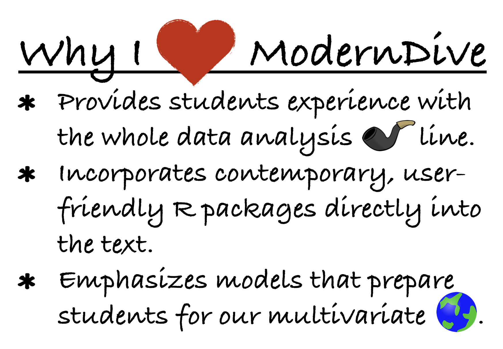

These are exciting times in statistics and data science education. (I am predicting this statement will continue to be true regardless of whether you are reading this foreword in 2025 or 2050.) 
But (isn't there always a but?), as a statistics and data science educator, it can also feel a bit overwhelming to stay on top of all the new statistical, technological, and pedagogical innovations. 
I find myself constantly asking, "Am I teaching my students the correct content, with the relevant software, and in the most effective way?" 
Before I make all of us feel lost at sea, let me point out how great a life raft I have found in *ModernDive*. 
In a sea of intro stats and data science textbooks, *ModernDive* floats to the top of my list, and let me tell you why. 
(Note my use of *ModernDive* here refers to the book in its shortened title version. 
This also matches up nicely with the [neat hex sticker](https://moderndive.com/images/logos/hex_blue_text.png) Drs. Ismay, Kim, and Valdivia created for the cover of *ModernDive*, too.)

```{r, fig.align="center", echo=FALSE, out.width="70%"}

```

My favorite aspect of *ModernDive*, if I must pick a favorite, is that students gain experience with the whole data analysis pipeline (see Figure \@ref(fig:pipeline-figure)). 
In particular, *ModernDive* is one of the few intro stats and data science textbooks that teaches students how to wrangle data. 
And, while data cleaning may not be as groovy as model building, it's often a prerequisite step! 
The world is full of messy data and *ModernDive* equips students to transform their data via the `dplyr` package.

Speaking of `dplyr`, students of *ModernDive* are exposed to the `tidyverse` suite of R packages. 
Designed with a common structure, `tidyverse` functions are written to be easy to learn and use. 
And, since most intro stats and data science students are programming newbies, *ModernDive* carefully walks the students through each new function it presents and provides frequent reinforcement through the many *Learning checks* dispersed throughout the chapters.

Overall, *ModernDive* includes wise choices for the placement of topics.
Starting with data visualization, *ModernDive* gets students building `ggplot2` graphs early on and then continues to reinforce important concepts graphically throughout the book. 
After moving through data wrangling and data importing, modeling plays a prominent role, with two chapters devoted to building regression models and a later chapter on inference for regression. 
Lastly, statistical inference is presented first through a computational lens and then using a theory-based approach. 
The `infer` package is used for both approaches and allows for easy comparisons between simulation-based and theory-based methods.

I first met two of the authors, Drs. Ismay and Kim, while attending their [workshop at the 2017 US Conference on Teaching Statistics](https://www.causeweb.org/cause/uscots/uscots17/workshop/3). 
They pushed us as participants to put data first and to use computers, instead of math, as the engine for statistical inference. 
That experience helped me add more data science concepts into my own intro stats course and introduced me to two really forward-thinking statistics and data science educators. 
With the addition of Dr. Valdivia on the second edition, it is exciting to see *ModernDive* continue to develop and grow into such a wonderful, timely textbook. 
The new edition includes even more engaging datasets, code updates that include the fancy base-pipe, more insights into inference, and materials that leverage newer functions from `infer` (make sure you check out the magical `fit()` function!). 
With this refresh, *ModernDive* continues to lead the pack as a truly contemporary approach to learning introductory statistics and data science.

I hope you have decided to dive on in!

```{r echo=FALSE, results="asis"}
if (is_latex_output()) {
  cat("\\begin{flushright}
      \\textit{Kelly S.\ McConville, Bucknell University}
      \\end{flushright}")
} else {
  cat("<br>*Kelly S. McConville, Bucknell University*</br>")
}
```
