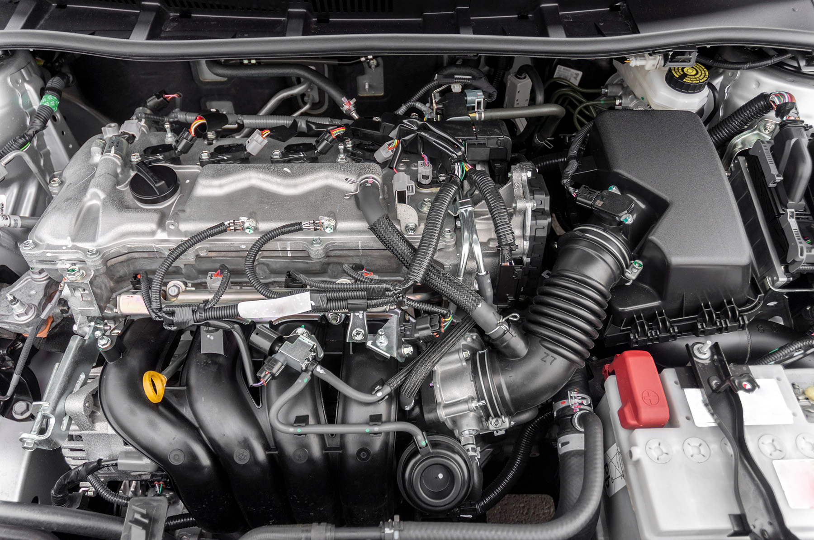
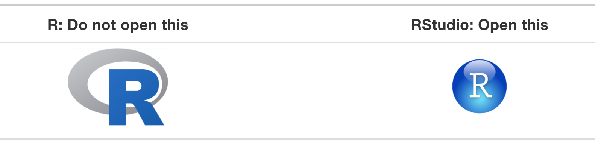
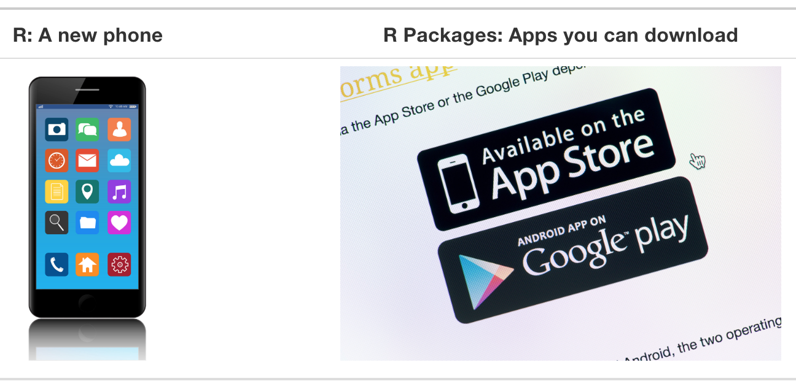
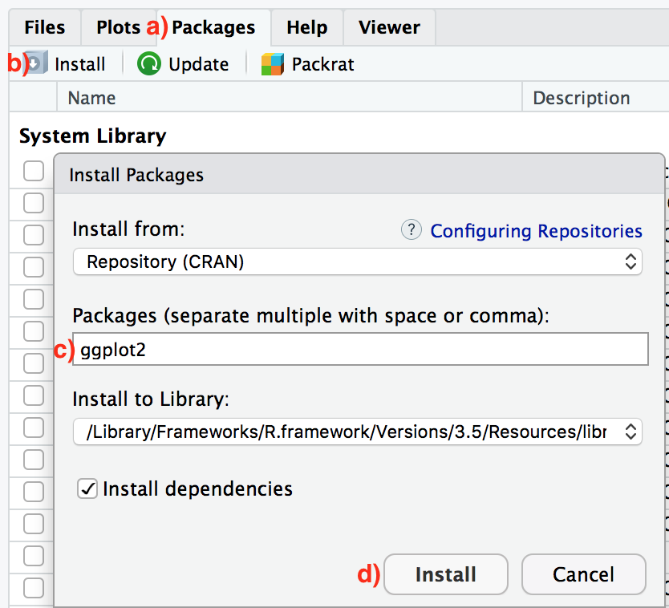
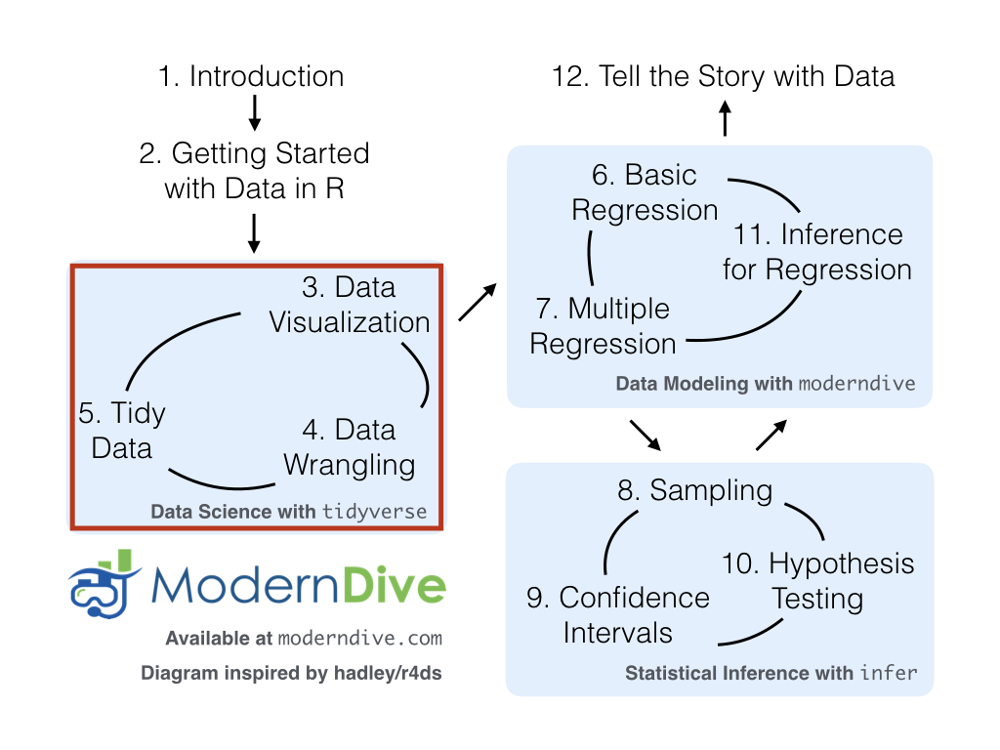

# Getting Started with Data in R {#getting-started}

```{r setup_getting_started, include=FALSE, purl=FALSE}
chap <- 1
lc <- 0
rq <- 0
# **`r paste0("(LC", chap, ".", (lc <- lc + 1), ")")`**
# **`r paste0("(RQ", chap, ".", (rq <- rq + 1), ")")`**

knitr::opts_chunk$set(
  tidy = FALSE, 
  out.width = '\\textwidth', 
  fig.height = 4,
  fig.align = 'center',
  warning = FALSE
)

options(scipen = 99, digits = 3)

# Set random number generator see value for replicable pseudorandomness.
set.seed(76)
```

```{r message=FALSE, warning=FALSE, echo=FALSE}
# Packages needed internally, but not in text.
library(scales)
```

Before we can start exploring data in R, there are some key concepts to understand first:

1. What are R and RStudio?
2. How do I code in R?
3. What are R packages?

We'll introduce these concepts in the upcoming Sections \@ref(r-rstudio)-\@ref(packages). If you are already somewhat familiar with these concepts, feel free to skip to Section \@ref(nycflights13) where we'll introduce our first dataset: all domestic flights departing one of the three main New York City (NYC) airports in 2013. This is a dataset we will explore in depth for much of the rest of this book.


## What are R and RStudio? {#r-rstudio}

Throughout this book, we will assume that you are using R via RStudio. First time users often confuse the two. At its simplest, R is like a car's engine\index{R} while RStudio is like a car's dashboard\index{RStudio} as illustrated in Figure \@ref(fig:R-vs-RStudio-1).


<!--
R: Engine            |  RStudio: Dashboard 
:-------------------------:|:-------------------------:
{ height=2.5in }  |  { height=2.5in }
-->


```{r R-vs-RStudio-1, echo=FALSE, fig.align='center', fig.cap="Analogy of difference between R and RStudio.", out.width='95%', purl=FALSE}
knitr::include_graphics("images/shutterstock/R_vs_RStudio_1.png")
```

More precisely, R is a programming language that runs computations, while RStudio is an *integrated development environment (IDE)* that provides an interface by adding many convenient features and tools. So just as the way of having access to a speedometer, rearview mirrors, and a navigation system makes driving much easier, using RStudio's interface makes using R much easier as well. 


### Installing R and RStudio {#installing}

> **Note about RStudio Server or RStudio Cloud**: If your instructor has provided you with a link and access to RStudio Server or RStudio Cloud, then you can skip this section. We do recommend after a few months of working on RStudio Server/Cloud that you return to these instructions to install this software on your own computer though.

You will first need to download and install both R and RStudio (Desktop version) on your computer. It is important that you install R first and then install RStudio.

1. **You must do this first:** Download and install R by going to <https://cloud.r-project.org/>. \index{R!installation}
    + If you are a Windows user: Click on "Download R for Windows", then click on "base", then click on the Download link. 
    + If you are macOS user: Click on "Download R for (Mac) OS X", then under "Latest release:" click on R-X.X.X.pkg, where R-X.X.X is the version number. For example, the latest version of R as of November 25, 2019 was R-3.6.1.
    + If you are a Linux user: Click on "Download R for Linux" and choose your distribution for more information on installing R for your setup.
1. **You must do this second:** Download and install RStudio at <https://www.rstudio.com/products/rstudio/download/>.
    + Scroll down to "Installers for Supported Platforms" near the bottom of the page.
    + Click on the download link corresponding to your computer's operating system. \index{RStudio!installation}


### Using R via RStudio

Recall our car analogy from earlier. Much as we don't drive a car by interacting directly with the engine but rather by interacting with elements on the car's dashboard, we won't be using R directly but rather we will use RStudio's interface. After you install R and RStudio on your computer, you'll have two new *programs* (also called *applications*) you can open. We'll always work in RStudio and not in the R application. Figure \@ref(fig:R-vs-RStudio-2) shows what icon you should be clicking on your computer. 

<!--
R: Do not open this          |  RStudio: Open this
:-------------------------:|:-------------------------:
`r include_image("images/logos/Rlogo.png", html_opts = "width=25%")`  | `r include_image("images/logos/RStudio-Ball.png", html_opts = "width=20%")`
-->

```{r R-vs-RStudio-2, echo=FALSE, fig.align='center', fig.cap="Icons of R versus RStudio on your computer.", out.width='90%', purl=FALSE}

```

After you open RStudio, you should see something similar to Figure \@ref(fig:RStudio-interface). (Note that slight differences might exist if the RStudio interface is updated after 2019 to not be this by default.)

```{r RStudio-interface, echo=FALSE, fig.align='center', fig.cap="RStudio interface to R.", out.width='93%', purl=FALSE}
knitr::include_graphics("images/rstudio_screenshots/rstudio.png")
```

Note the three *panes* which are three panels dividing the screen: the *console pane*, the *files pane*, and the *environment pane*. Over the course of this chapter, you'll come to learn what purpose each of these panes serves. 


## How do I code in R? {#code}

Now that you're set up with R and RStudio, you are probably asking yourself, "OK. Now how do I use R?". The first thing to note is that unlike other statistical software programs like Excel, SPSS, or Minitab that provide [point-and-click](https://en.wikipedia.org/wiki/Point_and_click) interfaces, R is an [interpreted language](https://en.wikipedia.org/wiki/Interpreted_language). This means you have to type in commands written in *R code*. In other words, you have to code/program in R. Note that we'll use the terms "coding" and "programming" interchangeably in this book.

While it is not required to be a seasoned coder/computer programmer to use R, there is still a set of basic programming concepts that new R users need to understand. Consequently, while this book is not a book on programming, you will still learn just enough of these basic programming concepts needed to explore and analyze data effectively.


### Basic programming concepts and terminology {#programming-concepts}

We now introduce some basic programming concepts and terminology. Instead of asking you to memorize all these concepts and terminology right now, we'll guide you so that you'll "learn by doing." To help you learn, we will always use a different font to distinguish regular text from `computer_code`. The best way to master these topics is, in our opinions, through [deliberate practice](https://jamesclear.com/deliberate-practice-theory) with R and lots of repetition.

* Basics: \index{programming language basics}
    + *Console pane*: where you enter in commands. \index{console}
    + *Running code*: the act of telling R to perform an act by giving it commands in the console.
    + *Objects*: where values are saved in R. We'll show you how to *assign* values to objects and how to display the contents of objects. \index{objects}
    + *Data types*: integers, doubles/numerics, logicals, and characters. \index{data types} Integers are values like -1, 0, 2, 4092. Doubles or numerics are a larger set of values containing both the integers but also fractions and decimal values like -24.932 and 0.8. Logicals are either `TRUE` or `FALSE` while characters are text such as "cabbage", "Hamilton", "The Wire is the greatest TV show ever", and "This ramen is delicious." Note that characters are often denoted with the quotation marks around them.
* *Vectors*: a series of values. These are created using the `c()` function, where `c()` stands for "combine" or "concatenate." For example, `c(6, 11, 13, 31, 90, 92)` creates a six element series of positive integer values \index{vectors}.
* *Factors*: *categorical data* are commonly represented in R as factors. \index{factors} Categorical data can also be represented as *strings*. We'll study this difference as we progress through the book.
* *Data frames*: rectangular spreadsheets. They are representations of datasets in R where the rows correspond to *observations* and the columns correspond to *variables* that describe the observations. \index{data frame} We'll cover data frames later in Section \@ref(nycflights13).
* *Conditionals*: \index{conditionals}
  + Testing for equality in R using `==` (and not `=`, which is typically used for assignment). For example, `2 + 1 == 3` compares `2 + 1` to `3` and is correct R code, while `2 + 1 = 3` will return an error.
  + Boolean algebra: `TRUE/FALSE` statements and mathematical operators such as `<` (less than), `<=` (less than or equal), and `!=` (not equal to). \index{Boolean algebra} For example, `4 + 2 >= 3` will return `TRUE`, but `3 + 5 <= 1` will return `FALSE`.
  + Logical operators: `&` representing "and" as well as `|` representing "or." For example, `(2 + 1 == 3) & (2 + 1 == 4)` returns `FALSE` since both clauses are not `TRUE` (only the first clause is `TRUE`). On the other hand, `(2 + 1 == 3) | (2 + 1 == 4)` returns `TRUE` since at least one of the two clauses is `TRUE`. \index{operators!logical}
* *Functions*, also called *commands*: Functions perform tasks in R. They take in inputs called *arguments* and return outputs. You can either manually specify a function's arguments or use the function's *default values*. \index{functions} 
  + For example, the function `seq()` in R generates a sequence of numbers. If you just run `seq()` it will return the value 1. That doesn't seem very useful! This is because the default arguments are set as `seq(from = 1, to = 1)`. Thus, if you don't pass in different values for `from` and `to` to change this behavior, R just assumes all you want is the number 1. You can change the argument values by updating the values after the `=` sign. If we try out `seq(from = 2, to = 5)` we get the result `2 3 4 5` that we might expect. 
  + We'll work with functions a lot throughout this book and you'll get lots of practice in understanding their behaviors. To further assist you in understanding when a function is mentioned in the book, we'll also include the `()` after them as we did with `seq()` above.


This list is by no means an exhaustive list of all the programming concepts and terminology needed to become a savvy R user; such a list would be so large it wouldn't be very useful, especially for novices. Rather, we feel this is a minimally viable list of programming concepts and terminology you need to know before getting started. We feel that you can learn the rest as you go.  Remember that your mastery of all of these concepts and terminology will build as you practice more and more.


### Errors, warnings, and messages {#messages}

One thing that intimidates new R and RStudio users is how it reports *errors*, *warnings*, and *messages*. R reports errors, warnings, and messages in a glaring red font, which makes it seem like it is scolding you. However, seeing red text in the console is not always bad.

R will show red text in the console pane in three different situations:

* **Errors**: \index{R!errors} When the red text is a legitimate error, it will be prefaced with "Error in…" and will try to explain what went wrong. Generally when there's an error, the code will not run. For example, we'll see in Subsection \@ref(package-use) if you see `Error in ggplot(...) : could not find function "ggplot"`, it means that the `ggplot()` function is not accessible because the package that contains the function (`ggplot2`) was not loaded with `library(ggplot2)`. Thus you cannot use the `ggplot()` function without the `ggplot2` package being loaded first.
* **Warnings**: \index{R!warnings} When the red text is a warning, it will be prefaced with "Warning:" and R will try to explain why there's a warning. Generally your code will still work, but with some caveats. For example, you will see in Chapter \@ref(viz) if you create a scatterplot based on a dataset where two of the rows of data have missing entries that would be needed to create points in the scatterplot, you will see this warning: `Warning: Removed 2 rows containing missing values (geom_point)`. R will still produce the scatterplot with all the remaining non-missing values, but it is warning you that two of the points aren't there.
* **Messages**: \index{R!messages} When the red text doesn't start with either "Error" or "Warning", it's *just a friendly message*. You'll see these messages when you load *R packages* in the upcoming Subsection \@ref(package-loading) or when you read data saved in spreadsheet files with the `read_csv()` function as you'll see in Chapter \@ref(tidy). These are helpful diagnostic messages and they don't stop your code from working. Additionally, you'll see these messages when you install packages too using `install.packages()` as discussed in Subsection \@ref(package-installation).

Remember, when you see red text in the console, *don't panic*. It doesn't necessarily mean anything is wrong. Rather:

* If the text starts with "Error", figure out what's causing it. <span style="color:red">Think of errors as a red traffic light: something is wrong!</span>
* If the text starts with "Warning", figure out if it's something to worry about. For instance, if you get a warning about missing values in a scatterplot and you know there are missing values, you're fine. If that's surprising, look at your data and see what's missing. <span style="color:gold">Think of warnings as a yellow traffic light: everything is working fine, but watch out/pay attention.</span>
* Otherwise, the text is just a message. Read it, wave back at R, and thank it for talking to you. <span style="color:green">Think of messages as a green traffic light: everything is working fine and keep on going!</span>


### Tips on learning to code {#tips-code}

Learning to code/program is quite similar to learning a foreign language. It can be daunting and frustrating at first. Such frustrations are common and it is normal to feel discouraged as you learn. However, just as with learning a foreign language, if you put in the effort and are not afraid to make mistakes, anybody can learn and improve. 

Here are a few useful tips to keep in mind as you learn to program:

* **Remember that computers are not actually that smart**: You may think your computer or smartphone is "smart," but really people spent a lot of time and energy designing them to appear "smart." In reality, you have to tell a computer everything it needs to do. Furthermore, the instructions you give your computer can't have any mistakes in them, nor can they be ambiguous in any way.
* **Take the "copy, paste, and tweak" approach**: Especially when you learn your first programming language or you need to understand particularly complicated code, it is often much easier to take existing code that you know works and modify it to suit your ends. This is as opposed to trying to type out the code from scratch. We call this the *"copy, paste, and tweak"* approach. So early on, we suggest not trying to write code from memory, but rather take existing examples we have provided you, then copy, paste, and tweak them to suit your goals. After you start feeling more confident, you can slowly move away from this approach and write code from scratch. Think of the "copy, paste, and tweak" approach as training wheels for a child learning to ride a bike. After getting comfortable, they won't need them anymore. 
* **The best way to learn to code is by doing**: Rather than learning to code for its own sake, we find that learning to code goes much smoother when you have a goal in mind or when you are working on a particular project, like analyzing data that you are interested in and that is important to you. 
* **Practice is key**:  Just as the only method to improve your foreign language skills is through lots of practice and speaking, the only method to improving your coding skills is through lots of practice. Don't worry, however, we'll give you plenty of opportunities to do so!


## What are R packages? {#packages}

Another point of confusion with many new R users is the idea of an R package. R packages \index{R!packages} extend the functionality of R by providing additional functions, data, and documentation. They are written by a worldwide community of R users and can be downloaded for free from the internet. 

For example, among the many packages we will use in this book are the `ggplot2` package [@R-ggplot2] for data visualization in Chapter \@ref(viz)\index{R packages!ggplot2}, the `dplyr` package [@R-dplyr] for data wrangling in Chapter \@ref(wrangling)\index{R packages!dplyr}, the `moderndive` package [@R-moderndive] that accompanies this book\index{R packages!moderndive}, and the `infer` package [@R-infer] for "tidy" and transparent statistical inference in Chapters \@ref(confidence-intervals), \@ref(hypothesis-testing), and \@ref(inference-for-regression)\index{R packages!infer}.

A good analogy for R packages \index{R packages} is they are like apps you can download onto a mobile phone:

<!--
R: A new phone           |  R Packages: Apps you can download
:-------------------------:|:-------------------------:
{ height=2.5in } |  { height=2.5in }
-->

```{r R-vs-R-packages, echo=FALSE, fig.align='center', fig.cap="Analogy of R versus R packages.", out.width='70%', purl=FALSE}

```

So R is like a new mobile phone: while it has a certain amount of features when you use it for the first time, it doesn't have everything. R packages are like the apps you can download onto your phone from Apple's App Store or Android's Google Play. 

Let's continue this analogy by considering the Instagram app for editing and sharing pictures. Say you have purchased a new phone and you would like to share a photo you have just taken with friends on Instagram. You need to:

1. *Install the app*: Since your phone is new and does not include the Instagram app, you need to download the app from either the App Store or Google Play. You do this once and you're set for the time being. You might need to do this again in the future when there is an update to the app.
1. *Open the app*: After you've installed Instagram, you need to open it.

Once Instagram is open on your phone, you can then proceed to share your photo with your friends and family. The process is very similar for using an R package. You need to:

1. *Install the package*: This is like installing an app on your phone. Most packages are not installed by default when you install R and RStudio. Thus if you want to use a package for the first time, you need to install it first. Once you've installed a package, you likely won't install it again unless you want to update it to a newer version.
1. *"Load" the package*: "Loading" a package is like opening an app on your phone. Packages are not "loaded" by default when you start RStudio on your computer; you need to "load" each package you want to use every time you start RStudio.

Let's perform these two steps for the `ggplot2` package for data visualization.


### Package installation {#package-installation}

> **Note about RStudio Server or RStudio Cloud**: If your instructor has provided you with a link and access to RStudio Server or RStudio Cloud, you might not need to install packages, as they might be preinstalled for you by your instructor. That being said, it is still a good idea to know this process for later on when you are not using RStudio Server or Cloud, but rather RStudio Desktop on your own computer.

There are two ways to install an R package: an easy way and a more advanced way. \index{R packages!installation} Let's install the `ggplot2` package the easy way first as shown in Figure \@ref(fig:easy-way-install). In the Files pane of RStudio:

a) Click on the "Packages" tab.
a) Click on "Install" next to Update.
a) Type the name of the package under "Packages (separate multiple with space or comma):" In this case, type `ggplot2`.
a) Click "Install."  
     
```{r easy-way-install, echo=FALSE, fig.align='center', fig.cap="Installing packages in R the easy way.", out.width='55%', out.height='55%', purl=FALSE}

```     

An alternative but slightly less convenient way to install a package is by typing `install.packages("ggplot2")` in the console pane of RStudio and pressing Return/Enter on your keyboard. Note you must include the quotation marks around the name of the package.

Much like an app on your phone, you only have to install a package once. However, if you want to update a previously installed package to a newer version, you need to reinstall it by repeating the earlier steps.

\vspace{0.1in}

```{block lc2-0, type='learncheck'}
\vspace{-0.15in}
**_Learning check_**
\vspace{-0.1in}
```

**`r paste0("(LC", chap, ".", (lc <- lc + 1), ")")`** Repeat the earlier installation steps, but for the `dplyr`, `nycflights13`, and `knitr` packages. This will install the earlier mentioned `dplyr` package for data wrangling, the `nycflights13` package containing data on all domestic flights leaving a NYC airport in 2013, and the `knitr` package for generating easy-to-read tables in R. We'll use these packages in the next section.

```{block, type='learncheck'}
\vspace{-0.25in}
\vspace{-0.25in}
```
 
 \vspace{0.1in}
 
Note that if you'd like your output on your computer to match up exactly with the output presented throughout the book, you may want to use the exact versions of the packages that we used. You can find a full listing of these packages and their versions in Appendix \@ref(appendixE). This likely won't be relevant for novices, but we included it for reproducibility reasons.

### Package loading {#package-loading}

Recall that after you've installed a package, you need to "load it." In other words, you need to "open it." We do this by using the `library()` command. \index{R packages!loading} 

For example, to load the `ggplot2` package, run the following code in the console pane. What do we mean by "run the following code"? Either type or copy-and-paste the following code into the console pane and then hit the Enter key. 

```{r, eval=FALSE}
library(ggplot2)
```

If after running the earlier code, a blinking cursor returns next to the `>` "prompt" sign, it means you were successful and the `ggplot2` package is now loaded and ready to use. If, however, you get a red "error message" that reads `...` \index{R packages!loading error}

```
Error in library(ggplot2) : there is no package called ‘ggplot2’
```

`...` it means that you didn't successfully install it. This is an example of an "error message" we discussed in Subsection \@ref(messages). If you get this error message, go back to Subsection \@ref(package-installation) on R package installation and make sure to install the `ggplot2` package before proceeding. 

\vspace{0.1in}

```{block lc2-1, type='learncheck'}
\vspace{-0.15in}
**_Learning check_**
\vspace{-0.1in}
```

**`r paste0("(LC", chap, ".", (lc <- lc + 1), ")")`** "Load" the `dplyr`, `nycflights13`, and `knitr` packages as well by repeating the earlier steps.

```{block, type='learncheck'}
\vspace{-0.25in}
\vspace{-0.25in}
```
 
 \vspace{0.1in}

### Package use {#package-use}

One very common mistake new R users make when wanting to use particular packages is they forget to "load" them first by using the `library()` command we just saw. Remember: *you have to load each package you want to use every time you start RStudio.* If you don't first "load" a package, but attempt to use one of its features, you'll see an error message similar to:

```
Error: could not find function
```

This is a different error message than the one you just saw on a package not having been installed yet. R is telling you that you are trying to use a function in a package that has not yet been "loaded." R doesn't know where to find the function you are using. Almost all new users forget to do this when starting out, and it is a little annoying to get used to doing it. However, you'll remember with practice and after some time it will become second nature for you.


## Explore your first datasets {#nycflights13}

Let's put everything we've learned so far into practice and start exploring some real data! Data comes to us in a variety of formats, from pictures to text to numbers.  Throughout this book, we'll focus on datasets that are saved in "spreadsheet"-type format. This is probably the most common way data are collected and saved in many fields.  Remember from Subsection \@ref(programming-concepts) that these "spreadsheet"-type datasets are called _data frames_ in R. \index{data frame} We'll focus on working with data saved as data frames throughout this book.

Let's first load all the packages needed for this chapter, assuming you've already installed them. Read Section \@ref(packages) for information on how to install and load R packages if you haven't already.

```{r message=FALSE}
library(nycflights13)
library(dplyr)
library(knitr)
```

At the beginning of all subsequent chapters in this book, we'll always have a list of packages that you should have installed and loaded in order to work with that chapter's R code. 

### `nycflights13` package

Many of us have flown on airplanes or know someone who has. Air travel has become an ever-present aspect of many people's lives. If you look at the Departures flight information board at an airport, you will frequently see that some flights are delayed for a variety of reasons. Are there ways that we can understand the reasons that cause flight delays?  

We'd all like to arrive at our destinations on time whenever possible. (Unless you secretly love hanging out at airports.  If you are one of these people, pretend for a moment that you are very much anticipating being at your final destination.)  Throughout this book, we're going to analyze data related to all domestic flights departing from one of New York City's three main airports in 2013: Newark Liberty International (EWR), John F. Kennedy International (JFK), and LaGuardia Airport (LGA). We'll access this data using the `nycflights13` \index{R packages!nycflights13} R package, which contains five datasets saved in five data frames:

* `flights`: Information on all `r comma(nrow(nycflights13::flights))` flights.
* `airlines`: A table matching airline names and their two-letter International Air Transport Association (IATA) airline codes (also known as carrier codes) for `r nrow(nycflights13::airlines)` airline companies. For example, "DL" is the two-letter code for Delta.
* `planes`: Information about each of the `r comma(nrow(nycflights13::planes))` physical aircraft used.
* `weather`: Hourly meteorological data for each of the three NYC airports. This data frame has `r comma(nrow(nycflights13::weather))` rows, roughly corresponding to the $365 \times 24 \times 3 = 26,280$ possible hourly measurements one can observe at three locations over the course of a year.
* `airports`: Names, codes, and locations of the `r comma(nrow(nycflights13::airports))` domestic destinations.

### `flights` data frame

We'll begin by exploring the `flights` data frame and get an idea of its structure. Run the following code in your console, either by typing it or by cutting-and-pasting it. It displays the contents of the `flights` data frame in your console. Note that depending on the size of your monitor, the output may vary slightly. 

```{r load_flights}
flights
```

Let's unpack this output:

* `A tibble: 336,776 x 19`: A `tibble` is a specific kind of data frame in R.\index{tibble}  This particular data frame has
    + `336,776` rows corresponding to different *observations*. Here, each observation is a flight.
    + `19` columns corresponding to 19 *variables* describing each observation.
* `year`, `month`, `day`, `dep_time`, `sched_dep_time`, `dep_delay`, and `arr_time` are the different columns, in other words, the different variables of this dataset.
* We then have a preview of the first 10 rows of observations corresponding to the first 10 flights. R is only showing the first 10 rows, because if it showed all `336,776` rows, it would overwhelm your screen.
* `... with 336,766 more rows, and 11 more variables:` indicating to us that 336,766 more rows of data and 11 more variables could not fit in this screen.

Unfortunately, this output does not allow us to explore the data very well, but it does give a nice preview. Let's look at some different ways to explore data frames.

### Exploring data frames {#exploredataframes}

There are many ways to get a feel for the data contained in a data frame such as `flights`. We present three functions that take as their "argument" (their input) the data frame in question. We also include a fourth method for exploring one particular column of a data frame:

1. Using the `View()` function, which brings up RStudio's built-in data viewer.
1. Using the `glimpse()` function, which is included in the `dplyr` package.
1. Using the `kable()` function, which is included in the `knitr` package.
1. Using the `$` "extraction operator," which is used to view a single variable/column in a data frame.

**1. `View()`**:

Run `View(flights)` \index{R packages!utils!View()} in your console in RStudio, either by typing it or cutting-and-pasting it into the console pane. Explore this data frame in the resulting pop up viewer. You should get into the habit of viewing any data frames you encounter. Note the uppercase `V` in `View()`. R is case-sensitive, so you'll get an error message if you run `view(flights)` instead of `View(flights)`.

\vspace{0.1in}

```{block lc2-2, type='learncheck'}
\vspace{-0.15in}
**_Learning check_**
\vspace{-0.1in}
```

**`r paste0("(LC", chap, ".", (lc <- lc + 1), ")")`** What does any *ONE* row in this `flights` dataset refer to?

- A. Data on an airline 
- B. Data on a flight
- C. Data on an airport
- D. Data on multiple flights

```{block, type='learncheck'}
\vspace{-0.25in}
\vspace{-0.25in}
```

\vspace{0.1in}

By running `View(flights)`, we can explore the different *variables* listed in the columns. Observe that there are many different types of variables.  Some of the variables like `distance`, `day`, and `arr_delay` are what we will call *quantitative* variables. \index{quantitative} These variables are numerical in nature.  Other variables here are \index{categorical} *categorical*.

Note that if you look in the leftmost column of the `View(flights)` output, you will see a column of numbers. These are the row numbers of the dataset. If you glance across a row with the same number, say row 5, you can get an idea of what each row is representing. This will allow you to identify what object is being described in a given row by taking note of the values of the columns in that specific row. This is often called the *observational unit*.\index{observational unit} The observational unit in this example is an individual flight departing from New York City in 2013. You can identify the observational unit by determining what "thing" is being measured or described by each of the variables. We'll talk more about observational units in Subsection \@ref(identification-vs-measurement-variables) on *identification* and *measurement* variables.

**2. `glimpse()`**:

The second way we'll cover to explore a data frame is using the `glimpse()` function \index{dplyr!glimpse()} included in the \index{dplyr|seealso{R packages!dplyr}} `dplyr` package. Thus, you can only use the `glimpse()` function after you've loaded the `dplyr` package by running `library(dplyr)`. This function provides us with an alternative perspective for exploring a data frame than the `View()` function:

```{r}
glimpse(flights)
```

Observe that `glimpse()` will give you the first few entries of each variable in a row after the variable name.  In addition, the *data type* (see Subsection \@ref(programming-concepts)) of the variable is given immediately after each variable's name inside `< >`.  Here, `int` and `dbl` refer to "integer" and "double", which are computer coding terminology for quantitative/numerical variables. "Doubles" take up twice the size to store on a computer compared to integers. 

In contrast, `chr` refers to "character", which is computer terminology for text data. In most forms, text data, such as the `carrier` or `origin` of a flight, are categorical variables. The `time_hour` variable is another data type: `dttm`. These types of variables represent date and time combinations. However, we won't work with dates and times in this book; we leave this topic for other data science books like [*Introduction to Data Science* by Tiffany-Anne Timbers, Melissa Lee, and Trevor Campbell](https://ubc-dsci.github.io/introduction-to-datascience/) or [*R for Data Science*](https://r4ds.had.co.nz/dates-and-times.html) [@rds2016]. 

\vspace*{0.05in}

```{block lc2-3, type='learncheck'}
\vspace{-0.15in}
**_Learning check_**
\vspace{-0.1in}
```

**`r paste0("(LC", chap, ".", (lc <- lc + 1), ")")`** What are some other examples in this dataset of *categorical* variables?  What makes them different than *quantitative* variables?

```{block, type='learncheck'}
\vspace{-0.25in}
\vspace{-0.25in}
```

\vfill\smallskip

<!--
\newpage
-->

**3. `kable()`**:

The final way to explore the entirety of a data frame is using the `kable()` \index{knitr!kable()} function from the \index{knitr|seealso{R packages!knitr}} `knitr` package. Let's explore the different carrier codes for all the airlines in our dataset two ways. Run both of these lines of code in the console:

```{r eval=FALSE}
airlines
kable(airlines)
```

At first glance, it may not appear that there is much difference in the outputs. However, when using tools for producing reproducible reports such as [R Markdown](http://rmarkdown.rstudio.com/lesson-1.html), the latter code produces output that is much more legible and reader-friendly. You'll see us use this reader-friendly style in many places in the book when we want to print a data frame as a nice table.

**4. `$` operator**

Lastly, the `$` operator \index{operators!dollar sign} allows us to extract and then explore a single variable within a data frame. For example, run the following in your console

```{r eval=FALSE}
airlines$name
```

We used the `$` operator to extract only the `name` variable and return it as a vector of length 16\index{vectors}. We'll only be occasionally exploring data frames using the `$` operator, instead favoring the `View()` and `glimpse()` functions.


### Identification and measurement variables {#identification-vs-measurement-variables}

There is a subtle difference between the kinds of variables that you will encounter in data frames. There are *identification variables* and *measurement variables*. For example, let's explore the `airports` data frame by showing the output of `glimpse(airports)`:

```{r}
glimpse(airports)
```

The variables `faa` and `name` are what we will call *identification variables*, variables that uniquely identify each observational unit. In this case, the identification variables uniquely identify airports. Such variables are mainly used in practice to uniquely identify each row in a data frame. `faa` gives the unique code provided by the FAA for that airport, while the `name` variable gives the longer official name of the airport. The remaining variables (`lat`, `lon`, `alt`, `tz`, `dst`, `tzone`) are often called *measurement* or *characteristic* variables: variables that describe properties of each observational unit. For example, `lat` and `long` describe the latitude and longitude of each airport. 

Furthermore, sometimes a single variable might not be enough to uniquely identify each observational unit: combinations of variables might be needed. While it is not an absolute rule, for organizational purposes it is considered good practice to have your identification variables in the leftmost columns of your data frame.

```{block lc3-3c, type='learncheck'}
\vspace{-0.15in}
**_Learning check_**
\vspace{-0.1in}
```

**`r paste0("(LC", chap, ".", (lc <- lc + 1), ")")`** What properties of each airport do the variables `lat`, `lon`, `alt`, `tz`, `dst`, and `tzone` describe in the `airports` data frame? Take your best guess.

**`r paste0("(LC", chap, ".", (lc <- lc + 1), ")")`** Provide the names of variables in a data frame with at least three variables where one of them is an identification variable and the other two are not. Further, create your own tidy data frame that matches these conditions.

```{block, type='learncheck', purl=FALSE}
\vspace{-0.25in}
\vspace{-0.25in}
```


### Help files

Another nice feature of R are help files, which provide documentation for various functions and datasets. You can bring up help files by adding a `?` \index{operators!?} before the name of a function or data frame and then run this in the console. You will then be presented with a page showing the corresponding documentation if it exists.  For example, let's look at the help file for the `flights` data frame.

```{r eval=FALSE}
?flights
```

The help file should pop up in the Help pane of RStudio. If you have questions about a function or data frame included in an R package, you should get in the habit of consulting the help file right away.

```{block lc3-3d, type='learncheck'}
\vspace{-0.15in}
**_Learning check_**
\vspace{-0.1in}
```

**`r paste0("(LC", chap, ".", (lc <- lc + 1), ")")`** Look at the help file for the `airports` data frame. Revise your earlier guesses about what the variables `lat`, `lon`, `alt`, `tz`, `dst`, and `tzone` each describe.

```{block, type='learncheck', purl=FALSE}
\vspace{-0.25in}
\vspace{-0.25in}
```


## Conclusion

We've given you what we feel is a minimally viable set of tools to explore data in R. Does this chapter contain everything you need to know? Absolutely not. To try to include everything in this chapter would make the chapter so large it wouldn't be useful! As we said earlier, the best way to add to your toolbox is to get into RStudio and run and write code as much as possible.


### Additional resources

```{r echo=FALSE, results="asis"}
if(knitr::is_latex_output()){
  cat("Solutions to all *Learning checks* can be found online in [Appendix D](https://moderndive.com/D-appendixD.html).")
} 
```

If you are new to the world of coding, R, and RStudio and feel you could benefit from a more detailed introduction, we suggest you check out the short book, [*Getting Used to R, RStudio, and R Markdown*](https://rbasics.netlify.com/) [@usedtor2016]. It includes screencast recordings that you can follow along and pause as you learn. This book also contains an introduction to R Markdown, a tool used for reproducible research in R.

(ref:ismay-book) Preview of *Getting Used to R, RStudio, and R Markdown*.

```{r echo=FALSE, fig.align='center', fig.cap="(ref:ismay-book)", out.height=if(knitr:::is_latex_output()) '1.6in', purl=FALSE}
knitr::include_graphics("images/copyright/getting-used-to-R.png")
```   


### What's to come?

We're now going to start the "Data Science with `tidyverse`" portion of this book in Chapter \@ref(viz) as shown in Figure \@ref(fig:moderndive-flowchart) with what we feel is the most important tool in a data scientist's toolbox: data visualization. We'll continue to explore the data included in the `nycflights13` package using the `ggplot2` package for data visualization. You'll see that data visualization is a powerful tool to add to your toolbox for data exploration that provides additional insight to what the `View()` and `glimpse()` functions can provide. 

(ref:flowchart2) *ModernDive* flowchart - on to Part I!

```{r moderndive-flowchart, echo=FALSE, fig.cap="(ref:flowchart2)", out.width='100%', out.height='100%', fig.align='center', purl=FALSE}

```
