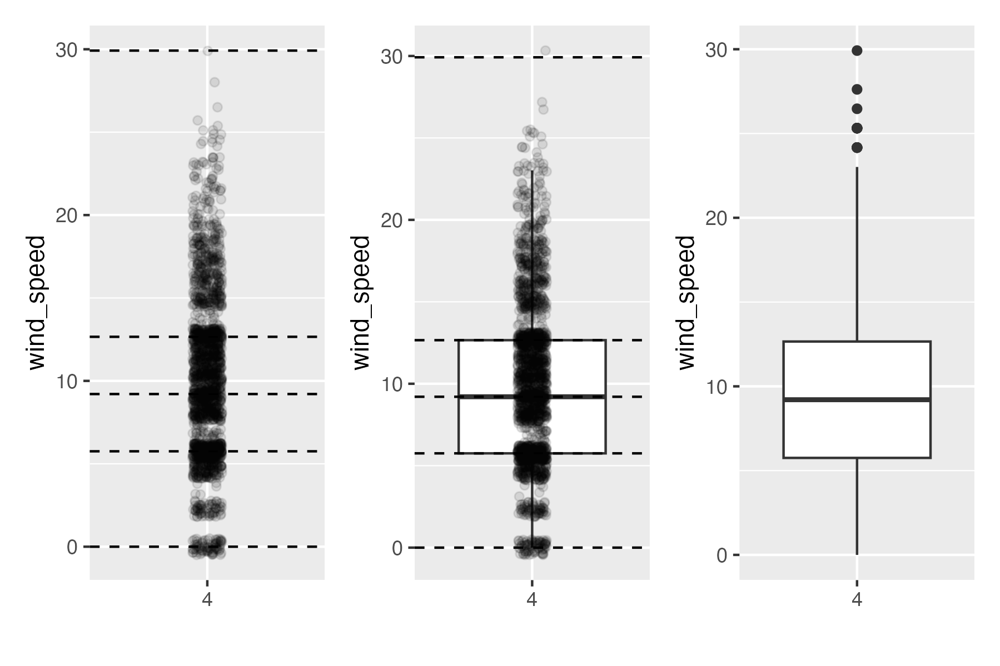

(ref:tidyversepart) Data Science with `tidyverse`

```{r echo=FALSE, results="asis", purl=FALSE}
if (is_latex_output()) {
  cat("# (PART) (ref:tidyversepart) {-} ")
} else {
  cat("# (PART) Data Science with tidyverse {-} ")
}
```

# Data Visualization {#viz}

```{r setup-viz, include=FALSE, purl=FALSE}
# Used to define Learning Check numbers:
chap <- 2
lc <- 0

# Set R code chunk defaults:
opts_chunk$set(
  echo = TRUE,
  eval = TRUE,
  warning = FALSE,
  message = TRUE,
  tidy = FALSE,
  purl = TRUE,
  out.width = "\\textwidth",
#  fig.height = 4,
  fig.align = "center"
)

# Set output digit precision
options(scipen = 99, digits = 3)

# In kable printing replace all NA's with blanks
options(knitr.kable.NA = "")

# Set random number generator see value for replicable pseudo-randomness.
set.seed(76)
```

We begin the development of your data science toolbox with data visualization. By visualizing data, we gain valuable insights we couldn't initially obtain from just looking at the raw data values. We'll use the `ggplot2` package, as it provides an easy way to customize your plots. `ggplot2` is rooted in the data visualization theory known as _the grammar of graphics_ [@wilkinson2005], developed by Leland Wilkinson. \index{Wilkinson, Leland}

At their most basic, graphics/plots/charts (we use these terms interchangeably in this book) provide a nice way to explore the patterns in data, such as the presence of *outliers*, *distributions* of individual variables, and *relationships* between groups of variables. Graphics are designed to emphasize the findings and insights you want your audience to understand. This does, however, require a balancing act. On the one hand, you want to highlight as many interesting findings as possible. On the other hand, you don't want to include so much information that it overwhelms your audience. 

As we will see, plots \index{plots} also help us to identify patterns and outliers in our data. We'll see that a common extension of these ideas is to compare the *distribution* \index{distribution} of one numerical variable, such as what are the center and spread of the values, as we go across the levels of a different categorical variable.


### Needed packages {-}

Let's load all the packages needed for this chapter (this assumes you've already installed them). Read Section \@ref(packages) for information on how to install and load R packages.

```{r message=FALSE}
library(nycflights23)
library(ggplot2)
library(moderndive)
library(tibble)
```

```{r message=FALSE, echo=FALSE, purl=FALSE}
# Packages needed internally, but not in book.
library(dplyr)
library(gapminder)
library(kableExtra)
library(readr)
library(patchwork)
library(scales)
library(stringr)
```


## The grammar of graphics {#grammarofgraphics}

We start with a discussion of a theoretical framework for data visualization known as "the grammar of graphics." This framework serves as the foundation for the \index{R packages!ggplot2} `ggplot2` package which we'll use extensively in this chapter. \index{Grammar of Graphics, The} Think of how we construct and form sentences in English by combining different elements, like nouns, verbs, articles, subjects, objects, etc. We can't just combine these elements in any arbitrary order; we must do so following a set of rules known as a linguistic grammar. Similarly to a linguistic grammar, "the grammar of graphics" defines a set of rules for constructing *statistical graphics* by combining different types of *layers*. This grammar was created by Leland Wilkinson [@wilkinson2005] and has been implemented in a variety of data visualization software platforms like R, but also [Plotly](https://plot.ly/) and [Tableau](https://www.tableau.com/).

### Components of the grammar

In short, the grammar tells us that:

> A statistical graphic is a `mapping` of `data` variables to `aes`thetic attributes of `geom`etric objects.

Specifically, we can break a graphic into the following three essential components:

1. `data`: the dataset containing the variables of interest.
1. `geom`: the geometric object in question. This refers to the type of object we can observe in a plot. For example: points, lines, and bars.
1. `aes`: aesthetic attributes of the geometric object. For example, x/y position, color, shape, and size. Aesthetic attributes are *mapped* to variables in the dataset.

You might be wondering why we wrote the terms `data`, `geom`, and `aes` in a computer code type font. We'll see very shortly that we'll specify the elements of the grammar in R using these terms. However, let's first break down the grammar with an example.


### Gapminder data {#gapminder}

```{r, echo=FALSE, purl=FALSE}
gapminder_2007 <- gapminder |>
  filter(year == 2007) |>
  select(-year) |>
  rename(
    Country = country,
    Continent = continent,
    `Life Expectancy` = lifeExp,
    `Population` = pop,
    `GDP per Capita` = gdpPercap
  )
```

In February 2006, a Swedish physician and data advocate named Hans Rosling gave a TED talk titled ["The best stats you've ever seen"](https://www.ted.com/talks/hans_rosling_shows_the_best_stats_you_ve_ever_seen) where he presented global economic, health, and development data from the website [gapminder.org](http://www.gapminder.org/tools/#_locale_id=en;&chart-type=bubbles). For example, for data on `r gapminder_2007 |> nrow()` countries in 2007, let's consider only a few countries in Table \@ref(tab:gapminder-2007) as a peek into the data.

```{r gapminder-2007, echo=FALSE, purl=FALSE}
gapminder_2007 |>
  head(3) |>
  kbl(
    digits = 2,
    caption = "Gapminder 2007 Data: First 3 of 142 countries" # ,
  ) |>
  kable_styling(
    font_size = ifelse(is_latex_output(), 10, 16),
    latex_options = c("HOLD_position")
  )
```

Each row in this table corresponds to a country in 2007. For each row, we have `r gapminder_2007 |> ncol()` columns:

1. **Country**: Name of country.
1. **Continent**: Which of the five continents the country is part of. Note that "Americas" includes countries in both North and South America and that Antarctica is excluded.
1. **Life Expectancy**: Life expectancy in years.
1. **Population**: Number of people living in the country.
1. **GDP per Capita**: Gross domestic product (in US dollars).

Now consider Figure \@ref(fig:gapminder), which plots this for all `r gapminder_2007 |> nrow()` of the data's countries.

```{r gapminder, echo=FALSE, fig.cap="Life expectancy over GDP per capita in 2007.", fig.height=ifelse(knitr::is_latex_output(), 2.95, 7), purl=FALSE}
gapminder_plot <- ggplot(
  data = gapminder_2007,
  mapping = aes(
    x = `GDP per Capita`,
    y = `Life Expectancy`,
    size = Population,
    color = Continent
  )
) +
  geom_point() +
  labs(x = "GDP per capita", y = "Life expectancy")

if (is_html_output()) {
  gapminder_plot
} else {
  gapminder_plot + scale_color_grey()
}
```

Let's view this plot through the grammar of graphics:

1. The `data` variable **GDP per Capita** gets mapped to the `x`-position `aes`thetic \index{R packages!ggplot2!aes()} of the points.
1. The `data` \index{R packages!ggplot2!data} variable **Life Expectancy** gets mapped to the `y`-position `aes`thetic of the points.
1. The `data` variable **Population** gets mapped to the `size` `aes`thetic of the points.
1. The `data` variable **Continent** gets mapped to the `color` `aes`thetic of the points.

We'll see shortly that `data` corresponds to the particular data frame where our data is saved and that "data variables" correspond to particular columns in the data frame. Furthermore, the type of `geom`etric object \index{R packages!ggplot2!geom} considered in this plot are points. That being said, while in this example we are considering points, graphics are not limited to just points. We can also use lines, bars, and other geometric objects.

Let's summarize the three essential components of the grammar in Table \@ref(tab:summary-table-gapminder).

```{r summary-table-gapminder, echo=FALSE, purl=FALSE}
tibble(
  `data variable` = c("GDP per Capita", "Life Expectancy", "Population", "Continent"),
  aes = c("x", "y", "size", "color"),
  geom = c("point", "point", "point", "point")
) |>
  kbl(
    caption = "Summary of the grammar of graphics for this plot",
    booktabs = TRUE,
    linesep = ""
  ) |>
  kable_styling(
    font_size = ifelse(is_latex_output(), 10, 16),
    latex_options = c("HOLD_position")
  )
```


### Other components

There are other components of the grammar of graphics we can control as well. As you start to delve deeper into the grammar of graphics, you'll start to encounter these topics more frequently. In this book, we'll keep things simple and only work with these two additional components:

- `facet`ing breaks up a plot into several plots split by the values of another variable (Section \@ref(facets)) \index{R packages!ggplot2!facet}
- `position` adjustments for barplots (Section \@ref(geombar)) \index{R packages!ggplot2!position}

Other more complex components like `scales` and `coord`inate systems are left for a more advanced text such as [*R for Data Science*](http://r4ds.had.co.nz/data-visualisation.html#aesthetic-mappings) [@rds2016]. Generally speaking, the grammar of graphics allows for a high degree of customization of plots and also a consistent framework for easily updating and modifying them.


### ggplot2 package

In this book, we will use the `ggplot2` package for data visualization, which is an implementation of the **g**rammar of **g**raphics for R [@R-ggplot2]. As we noted earlier, a lot of the previous section was written in a computer code type font. This is because the various components of the grammar of graphics are specified in the `ggplot()` \index{R packages!ggplot2!ggplot()} function included in the `ggplot2` package. For the purposes of this book, we'll always provide the `ggplot()` function with the following arguments (i.e., inputs) at a minimum:

* The data frame where the variables exist: the `data` argument.
* The mapping of the variables to aesthetic attributes: the `mapping` argument which specifies the `aes`thetic attributes involved.

After we've specified these components, we then add *layers* to the plot using the `+` sign. The most essential layer to add to a plot is the layer that specifies which type of `geom`etric object we want the plot to involve: points, lines, bars, and others. Other layers we can add to a plot include the plot title, axes labels, visual themes for the plots, and facets (which we'll see in Section \@ref(facets)).

Let's now put the theory of the grammar of graphics into practice.


## Five named graphs - the 5NG {#FiveNG}

In order to keep things simple in this book, we will only focus on five different types of graphics, each with a commonly given name. We term these "five named graphs" or in abbreviated form, the **5NG**: \index{five named graphs}

1. scatterplots 
1. linegraphs
1. histograms
1. boxplots 
1. barplots

We'll also present some variations of these plots, but with this basic repertoire of five graphics in your toolbox, you can visualize a wide array of different variable types. Note that certain plots are only appropriate for categorical variables, while others are only appropriate for numerical variables. 


## 5NG#1: Scatterplots {#scatterplots}

The simplest of the 5NG are *scatterplots*, \index{scatterplots} also called *bivariate plots*. They allow you to visualize the *relationship* between two numerical variables. While you may already be familiar with scatterplots, let's view them through the lens of the grammar of graphics we presented in Section \@ref(grammarofgraphics). Specifically, we will visualize the relationship between the following two numerical variables in the `envoy_flights` data frame included in the \index{R packages!moderndive} `moderndive` package:

1. `dep_delay`: departure delay on the horizontal "x" axis and
1. `arr_delay`: arrival delay on the vertical "y" axis

for Envoy Airlines flights leaving NYC in 2023. In other words, `envoy_flights` does not consist of *all* flights that left NYC in 2023, but rather only those flights where `carrier` is `MQ` (which is Envoy Airlines' carrier code).

```{block lc-envoy_flights, type="learncheck", purl=FALSE}
\vspace{-0.15in}
**_Learning check_**
\vspace{-0.1in}
```

**`r paste0("(LC", chap, ".", (lc <- lc + 1), ")")`** Take a look at both the `flights` data frame from the `nycflights23` package and the `envoy_flights` data frame from the `moderndive` package by running `View(flights)` and `View(envoy_flights)`. In what respect do these data frames differ? For example, think about the number of rows in each dataset.

```{block, type="learncheck", purl=FALSE}
\vspace{-0.25in}
\vspace{-0.25in}
```


### Scatterplots via `geom_point` {#geompoint}

Let's now go over the code that will create the desired scatterplot, while keeping in mind the grammar of graphics framework we introduced in Section \@ref(grammarofgraphics). Let's take a look at the code and break it down piece-by-piece.

```{r echo=FALSE, purl=FALSE, results="asis"}
if (is_latex_output()) {
  cat("**Note**: The printed version of this book uses `theme_light()` instead of the default `theme_grey()` for the plots created with `ggplot2` throughout the book. Bars and points are also converted to greyscale using `scale_color_grey()` and `scale_fill_grey()`. This helps with readability of the plots in the printed copy. As you follow along and run the code yourself, your plots will have a grey background instead of the white background in the printed book. Also, your plots will have colors beyond the greyscale versions provided in this printing.")
}
```

```{r echo=FALSE}
envoy_flights <- flights |> 
  filter(carrier == "MQ")
```

```{r, eval=FALSE}
ggplot(data = envoy_flights, mapping = aes(x = dep_delay, y = arr_delay)) + 
  geom_point()
```

Within the `ggplot()` \index{R packages!ggplot2!ggplot()} function, we specify two of the components of the grammar of graphics as arguments (i.e., inputs):

1. The `data` as the `envoy_flights` data frame via `data = envoy_flights`.
1. The `aes`thetic \index{R packages!ggplot2!mapping} `mapping` by setting `mapping = aes(x = dep_delay, y = arr_delay)`. Specifically, the variable `dep_delay` maps to the `x` position aesthetic, while the variable `arr_delay` maps to the `y` position.

We then add a layer to the `ggplot()` function call using the `+` sign. The added layer in question specifies the third component of the grammar: the `geom`etric object. In this case, the geometric object is set to be points by specifying `geom_point()`. After running these two lines of code in your console, you'll notice two outputs: a warning message and the graphic shown in Figure \@ref(fig:noalpha).

```{r noalpha, fig.cap="Arrival delays versus departure delays for Envoy Air flights from NYC in 2023.", fig.height=ifelse(knitr::is_latex_output(), 1.8, 7), warning=TRUE, echo=FALSE, purl=FALSE}
ggplot(data = envoy_flights, mapping = aes(x = dep_delay, y = arr_delay)) +
  geom_point()
```

Let's first unpack the graphic in Figure \@ref(fig:noalpha). Observe that a *positive relationship* exists between `dep_delay` and `arr_delay`: as departure delays increase, arrival delays tend to also increase. Observe also the large mass of points clustered near (0, 0), the point indicating flights that neither departed nor arrived late. 

Let's turn our attention to the warning message. R is alerting us to the fact that three rows were ignored due to them being missing. For these three rows, either the value for `dep_delay` or `arr_delay` or both were missing (recorded in R as `NA`), and thus these rows were ignored in our plot.

Before we continue, let's make a few more observations about this code that created the scatterplot. Note that the `+` sign comes at the end of lines, and not at the beginning. You'll get an error in R if you put it at the beginning of a line. \index{R packages!ggplot2!+} When adding layers to a plot, you are encouraged to start a new line after the `+` (by pressing the Return/Enter button on your keyboard) so that the code for each layer is on a new line. As we add more and more layers to plots, you'll see this will greatly improve the legibility of your code.

To stress the importance of adding the layer specifying the `geom`etric object, consider Figure \@ref(fig:nolayers) where no layers are added. Because the `geom`etric object was not specified, we have a blank plot that is not very useful!

```{r nolayers, fig.cap="A plot with no layers.", fig.height=ifelse(knitr::is_latex_output(), 2, 7)}
ggplot(data = envoy_flights, mapping = aes(x = dep_delay, y = arr_delay))
```

```{block lc-scatterplots, type="learncheck", purl=FALSE}
\vspace{-0.15in}
**_Learning check_**
\vspace{-0.1in}
```

**`r paste0("(LC", chap, ".", (lc <- lc + 1), ")")`** What are practical reasons why `dep_delay` and `arr_delay` have a positive relationship?

**`r paste0("(LC", chap, ".", (lc <- lc + 1), ")")`** What variables in the `weather` data frame would you expect to have a negative correlation (i.e., a negative relationship) with `dep_delay`? Why? Remember that we are focusing on numerical variables here. Hint: Explore the `weather` dataset by using the `View()` function. 

**`r paste0("(LC", chap, ".", (lc <- lc + 1), ")")`** Why do you believe there is a cluster of points near (0, 0)? What does (0, 0) correspond to in terms of the Envoy Air flights?

**`r paste0("(LC", chap, ".", (lc <- lc + 1), ")")`** What are some other features of the plot that stand out to you?

**`r paste0("(LC", chap, ".", (lc <- lc + 1), ")")`** Create a new scatterplot using different variables in the `envoy_flights` data frame by modifying the example given.

```{block, type="learncheck", purl=FALSE}
\vspace{-0.25in}
\vspace{-0.25in}
```


### Overplotting {#overplotting}

The large mass of points near (0, 0) in Figure \@ref(fig:noalpha) can cause some confusion since it is hard to tell the true number of points that are plotted. This is the result of a phenomenon called \index{overplotting} *overplotting*. As one may guess, this corresponds to points being plotted on top of each other over and over again. When overplotting occurs, it is difficult to know the number of points being plotted. There are two methods to address the issue of overplotting. Either by

1. Adjusting the transparency of the points or
1. Adding a little random "jitter", or random "nudges", to each of the points.

**Method 1: Changing the transparency**

The first way of addressing overplotting is to change the transparency/opacity of the points by setting the `alpha` argument in `geom_point()`. We can change the `alpha` argument to be any value between `0` and `1`, where `0` sets the points to be 100% transparent and `1` sets the points to be 100% opaque. By default, `alpha` is set to `1`. In other words, if we don't explicitly set an `alpha` value, R will use `alpha = 1`.

Note how the following code is identical to the code in Section \@ref(scatterplots) that created the scatterplot with overplotting, but with `alpha = 0.2` added to the `geom_point()` function:

```{r alpha, fig.cap="Arrival vs. departure delays scatterplot with alpha = 0.2.", fig.height=ifelse(knitr::is_latex_output(), 3.8, 7)}
ggplot(data = envoy_flights, mapping = aes(x = dep_delay, y = arr_delay)) + 
  geom_point(alpha = 0.2)
```

The key feature to note in Figure \@ref(fig:alpha) is that the transparency \index{R packages!ggplot2!alpha}\index{adding transparency to plots}of the points is cumulative: areas with a high-degree of overplotting are darker, whereas areas with a lower degree are less dark. Note furthermore that there is no `aes()` surrounding `alpha = 0.2`. This is because we are not mapping a variable to an aesthetic attribute, but rather merely changing the default setting of `alpha`. In fact, you'll receive an error if you try to change the second line to read `geom_point(aes(alpha = 0.2))`.

**Method 2: Jittering the points**

The second way of addressing overplotting is by *jittering* all the points. This means giving each point a small "nudge" in a random direction. You can think of "jittering" as shaking the points around a bit on the plot. Let's illustrate using a simple example first. Say we have a data frame with 4 identical rows of x and y values: (0,0), (0,0), (0,0), and (0,0). In Figure \@ref(fig:jitter-example-plot-1), we present both the regular scatterplot of these 4 points (on the left) and its jittered counterpart (on the right). 

```{r jitter-example-plot-1, fig.cap="Regular and jittered scatterplot.", echo=FALSE, fig.height=ifelse(knitr::is_latex_output(), 5, 7), purl=FALSE}
jitter_example <- tibble(
  x = rep(0, 4),
  y = rep(0, 4)
)
jittered_plot_1 <- ggplot(data = jitter_example, mapping = aes(x = x, y = y)) +
  geom_point() +
  coord_cartesian(xlim = c(-0.025, 0.025), ylim = c(-0.025, 0.025)) +
  labs(title = "Regular scatterplot")
jittered_plot_2 <- ggplot(data = jitter_example, mapping = aes(x = x, y = y)) +
  geom_jitter(width = 0.01, height = 0.01) +
  coord_cartesian(xlim = c(-0.025, 0.025), ylim = c(-0.025, 0.025)) +
  labs(title = "Jittered scatterplot")
jittered_plot_1 + jittered_plot_2
```

In the left-hand regular scatterplot, observe that the 4 points are superimposed on top of each other. While we know there are 4 values being plotted, this fact might not be apparent to others. In the right-hand jittered scatterplot, it is now plainly evident that this plot involves four points since each point is given a random "nudge." 

Keep in mind, however, that jittering is strictly a visualization tool; even after creating a jittered scatterplot, the original values saved in the data frame remain unchanged. \index{R packages!ggplot2!geom\_jitter()}

To create a jittered scatterplot, instead of using `geom_point()`, we use `geom_jitter()`. Observe how the following code is very similar to the code that created the scatterplot with overplotting in Subsection \@ref(geompoint), but with `geom_point()` \index{R packages!ggplot2!geom\_point()} replaced with `geom_jitter()`. 

```{r jitter, fig.cap="Arrival versus departure delays jittered scatterplot.", fig.height=ifelse(knitr::is_latex_output(), 4.7, 7)}
ggplot(data = envoy_flights, mapping = aes(x = dep_delay, y = arr_delay)) + 
  geom_jitter(width = 30, height = 30)
```

In order to specify how much jitter to add, we adjusted the `width` and `height` arguments to `geom_jitter()`. This corresponds to how hard you'd like to shake the plot in horizontal x-axis units and vertical y-axis units, respectively. In this case, both axes are in minutes. How much jitter should we add using the `width` and `height` arguments? On the one hand, it is important to add just enough jitter to break any overlap in points, but on the other hand, not so much that we completely alter the original pattern in points.

As can be seen in the resulting Figure \@ref(fig:jitter), in this case jittering doesn't really provide much new insight. In this particular case, it can be argued that changing the transparency of the points by setting `alpha` proved more effective. When would it be better to use a jittered scatterplot? When would it be better to alter the points' transparency? There is no single right answer that applies to all situations. You need to make a subjective choice and own that choice. At the very least when confronted with overplotting, however, we suggest you make both types of plots and see which one better emphasizes the point you are trying to make. 

```{block lc-overplotting, type="learncheck", purl=FALSE}
\vspace{-0.15in}
**_Learning check_**
\vspace{-0.1in}
```

**`r paste0("(LC", chap, ".", (lc <- lc + 1), ")")`** Why is setting the `alpha` argument value useful with scatterplots? What further information does it give you that a regular scatterplot cannot?

**`r paste0("(LC", chap, ".", (lc <- lc + 1), ")")`** After viewing Figure \@ref(fig:alpha), give an approximate range of arrival delays and departure delays that occur most frequently. How has that region changed compared to when you observed the same plot without `alpha = 0.2` set in Figure \@ref(fig:noalpha)?

```{block, type="learncheck", purl=FALSE}
\vspace{-0.25in}
\vspace{-0.25in}
```


### Summary

Scatterplots display the relationship between two numerical variables. They are among the most commonly used plots because they can provide an immediate way to see the trend in one numerical variable versus another. However, if you try to create a scatterplot where either one of the two variables is not numerical, you might get strange results. Be careful! 

With medium to large datasets, you may need to play around with the different modifications to scatterplots we saw such as changing the transparency/opacity of the points or by jittering the points. This tweaking is often a fun part of data visualization, since you'll have the chance to see different relationships emerge as you tinker with your plots.


## 5NG#2: Linegraphs {#linegraphs}

The next of the five named graphs are linegraphs. Linegraphs \index{linegraphs} show the relationship between two numerical variables when the variable on the x-axis, also called the *explanatory* variable\index{explanatory variable}, is of a sequential nature. In other words, there is an inherent ordering to the variable. 

The most common examples of linegraphs have some notion of time on the x-axis: hours, days, weeks, years, etc. Since time is sequential, we connect consecutive observations of the variable on the y-axis with a line. Linegraphs that have some notion of time on the x-axis are also called *time series* plots\index{time series plots}. Let's illustrate linegraphs using another dataset in the `nycflights23` \index{R packages!nycflights23} package: the `weather` data frame. 

Let's explore the `weather` data frame from the `nycflights23` package by running `View(weather)` and `glimpse(weather)`. Furthermore let's read the associated help file by running `?weather` to bring up the help file.

Observe that there is a variable called `temp` of hourly wind speed recordings in miles per hour at weather stations near all three major airports in New York City: Newark (`origin` code `EWR`), John F. Kennedy International (`JFK`), and LaGuardia (`LGA`). 

However, instead of considering hourly wind speeds for all days in 2023 for all three airports, for simplicity let's only consider hourly wind speeds at Newark airport for the first 15 days in January. This data is accessible in the `early_january_2023_weather` data frame included in the `moderndive` package. In other words, `early_january_2023_weather` contains hourly weather observations for `origin` equal to `EWR` (Newark's airport code), `month` equal to `1`, and `day` less than or equal to `15`. 

```{block lc-early_january_weather, type="learncheck", purl=FALSE}
\vspace{-0.15in}
**_Learning check_**
\vspace{-0.1in}
```

**`r paste0("(LC", chap, ".", (lc <- lc + 1), ")")`** Take a look at both the `weather` data frame from the `nycflights23` package and the `early_january_2023_weather` data frame from the `moderndive` package by running `View(weather)` and `View(early_january_2023_weather)`. In what respect do these data frames differ?

**`r paste0("(LC", chap, ".", (lc <- lc + 1), ")")`** `View()` the `flights` data frame again. Why does the `time_hour` variable uniquely identify the hour of the measurement, whereas the `hour` variable does not? 

```{block, type="learncheck", purl=FALSE}
\vspace{-0.25in}
\vspace{-0.25in}
```


### Linegraphs via `geom_line` {#geomline}

Let's create a time series plot of the hourly wind speeds saved in the `early_january_2023_weather` data frame by using `geom_line()` to create a linegraph\index{R packages!ggplot2!geom\_line()}, instead of using `geom_point()` like we used previously to create scatterplots:

```{r early-january, echo=FALSE}
# Need to save `early_january_data` to {moderndive} for 2023 data
early_january_2023_weather <- weather |> 
  filter(origin == "EWR" & month == 1 & day <= 15)
```

```{r hourlytemp, fig.cap="Hourly wind speed in Newark for January 1-15, 2023."}
ggplot(data = early_january_2023_weather, 
       mapping = aes(x = time_hour, y = wind_speed)) +
  geom_line()
```

Much as with the `ggplot()` code that created the scatterplot of departure and arrival delays for Envoy Air flights in Figure \@ref(fig:noalpha), let's break down this code piece-by-piece in terms of the grammar of graphics:

Within the `ggplot()` function call, we specify two of the components of the grammar of graphics as arguments:

1. The `data` to be the `early_january_2023_weather` data frame by setting `data = early_january_2023_weather`.
1. The `aes`thetic `mapping` by setting `mapping = aes(x = time_hour, y = temp)`. Specifically, the variable `time_hour` maps to the `x` position aesthetic, while the variable `wind_speed` maps to the `y` position aesthetic.

We add a layer to the `ggplot()` function call using the `+` sign. The layer in question specifies the third component of the grammar: the `geom`etric object in question. In this case, the geometric object is a `line` set by specifying `geom_line()`. 

```{block lc-linegraph, type="learncheck", purl=FALSE}
\vspace{-0.15in}
**_Learning check_**
\vspace{-0.1in}
```

**`r paste0("(LC", chap, ".", (lc <- lc + 1), ")")`** Why should linegraphs be avoided when there is not a clear ordering of the horizontal axis?

**`r paste0("(LC", chap, ".", (lc <- lc + 1), ")")`** Why are linegraphs frequently used when time is the explanatory variable on the x-axis?

**`r paste0("(LC", chap, ".", (lc <- lc + 1), ")")`** Plot a time series of a variable other than `wind_speed` for Newark Airport in the first 15 days of January 2023. Try to select a variable that doesn't have a lot of missing (`NA`) values.

```{block, type="learncheck", purl=FALSE}
\vspace{-0.25in}
\vspace{-0.25in}
```


### Summary

Linegraphs, just like scatterplots, display the relationship between two numerical variables. However, it is preferred to use linegraphs over scatterplots when the variable on the x-axis (i.e., the explanatory variable) has an inherent ordering, such as some notion of time. 


## 5NG#3: Histograms {#histograms}

Let's consider the `wind_speed` variable in the `weather` data frame once again, but unlike with the linegraphs in Section \@ref(linegraphs), let's say we don't care about its relationship with time, but rather we only care about how the values of `wind_speed` *distribute*. In other words:

1. What are the smallest and largest values?
1. What is the "center" or "most typical" value?
1. How do the values spread out?
1. What are frequent and infrequent values?

One way to visualize this *distribution* \index{distribution} of this single variable `wind_speed` is to plot them on a horizontal line as we do in Figure \@ref(fig:windspeed-on-line):

```{r windspeed-on-line, echo=FALSE, fig.height=ifelse(knitr::is_latex_output(), 0.8, 7), fig.cap="Plot of hourly wind speed recordings from NYC in 2023."}
ggplot(data = weather, mapping = aes(x = wind_speed, y = factor("A"))) +
  geom_point() +
  theme(
    axis.ticks.y = element_blank(),
    axis.title.y = element_blank(),
    axis.text.y = element_blank()
  )
```

This gives us a general idea of how the values of `wind_speed` distribute: observe that wind speeds vary from around `r round(min(weather$wind_speed, na.rm = TRUE), 0)` miles per hour (0 kilometers per hour ) up to `r round(max(weather$wind_speed, na.rm = TRUE), 0)` miles per hour (approximately 61 kilometers per hour). There appear to be more recorded wind speeds between 0  and 20 miles per hour (mph) than outside this range. However, because of the high degree of overplotting in the points, it's hard to get a sense of exactly how many values are between, say, 10 mph and 15 mph.

What is commonly produced instead of Figure \@ref(fig:windspeed-on-line) is known as a \index{histograms} *histogram*. A histogram is a plot that visualizes the *distribution* of a numerical value as follows:

1. We first cut up the x-axis into a series of \index{histograms!bins} *bins*, where each bin represents a range of values. 
1. For each bin, we count the number of observations that fall in the range corresponding to that bin.
1. Then for each bin, we draw a bar whose height marks the corresponding count.

Let's drill-down on an example of a histogram, shown in Figure \@ref(fig:histogramexample).

```{r histogramexample, echo=FALSE, fig.cap="Example histogram.", fig.height=ifelse(knitr::is_latex_output(), 2, 7), purl=FALSE}
ggplot(data = weather, mapping = aes(x = wind_speed)) +
  geom_histogram(binwidth = 5, boundary = 40, color = "white")
```

Let's focus only on wind speeds between 10 mph and 25 mph for now. Observe that there are three bins of equal width between 10 mph and 25 mph. Thus we have three bins of width 5 mph each: one bin for the 10-15 mph range, another bin for the 15-20 mph range, and another bin for the 20-25 mph range. Since:

1. The bin for the 10-15 mph range has a height of around 8000. In other words, around 8000 of the hourly wind speed recordings are between 10 mph and 15 mph.
1. The bin for the 15-20 mph range has a height of around 2400. In other words, around 2400 of the hourly wind speed recordings are between 15 mph and 20 mph.
1. The bin for the 20-25 mph range has a height of around 700. In other words, around 700 of the hourly wind speed recordings are between 20 mph and 25 mph.

All eight bins spanning 0 mph to 40 mph on the x-axis have this interpretation.


### Histograms via `geom_histogram` {#geomhistogram}

Let's now present the `ggplot()` code to plot your first histogram! Unlike with scatterplots and linegraphs, there is now only one variable being mapped in `aes()`: the single numerical variable `wind_speed`. The y-aesthetic of a histogram, the count of the observations in each bin, gets computed for you automatically. Furthermore, the geometric object layer is now a `geom_histogram()`. \index{R packages!ggplot2!geom\_histogram()} After running the following code, you'll see the histogram in Figure \@ref(fig:weather-histogram) as well as warning messages. We'll discuss the warning messages first. 

```{r weather-histogram, warning=TRUE, fig.cap="Histogram of hourly wind speeds at three NYC airports.", fig.height=ifelse(knitr::is_latex_output(), 2.3, 7)}
ggplot(data = weather, mapping = aes(x = wind_speed)) +
  geom_histogram()
```

The first message is telling us that the histogram was constructed using `bins = 30` for 30 equally spaced bins. This is known in computer programming as a default value; unless you override this default number of bins with a number you specify, R will choose 30 by default. We'll see in the next section how to change the number of bins to another value than the default.

The second message is telling us something similar to the warning message we received when we ran the code to create a scatterplot of departure and arrival delays for Envoy Air flights in Figure \@ref(fig:noalpha): that because some rows have missing `NA` value for `wind_speed`, they were omitted from the histogram. R is just giving us a friendly heads-up that this was the case. 

Now let's unpack the resulting histogram in Figure \@ref(fig:weather-histogram). Observe that values above 30 mph are rather rare. However, because of the large number of bins, it's hard to get a sense for which range of wind speeds is spanned by each bin; everything is one giant amorphous blob. So let's add white vertical borders demarcating the bins by adding a `color = "white"` argument to `geom_histogram()` and ignore the warning about setting the number of bins to a better value:

```{r weather-histogram-2, message=FALSE, fig.cap="Histogram of hourly wind speeds at three NYC airports with white borders.", fig.height=ifelse(knitr::is_latex_output(), 3, 7)}
ggplot(data = weather, mapping = aes(x = wind_speed)) +
  geom_histogram(color = "white")
```

We now have an easier time associating ranges of wind speeds to each of the bins in Figure \@ref(fig:weather-histogram-2). We can also vary the color of the bars by setting the \index{R packages!ggplot2!fill} `fill` argument. For example, you can set the bin colors to be "blue steel" by setting `fill = "steelblue"`:

```{r, eval=FALSE}
ggplot(data = weather, mapping = aes(x = wind_speed)) +
  geom_histogram(color = "white", fill = "steelblue")
```

If you're curious, run \index{colors()} `colors()` to see all `r colors() |> length()` possible choice of colors in R!


### Adjusting the bins {#adjustbins}

Observe in Figure \@ref(fig:weather-histogram-2) that in the 10-20 mph range there appear to be roughly 8 bins. Thus each bin has width 10 divided by 8, or 1.125 mph, which is not a very easily interpretable range to work with. Let's improve this by adjusting the number of bins in our histogram in one of two ways:

1. By adjusting the number of bins via the \index{R packages!ggplot2|geom\_histogram()!bins} `bins` argument to `geom_histogram()`. 
1. By adjusting the width of the bins via the \index{R packages!ggplot2|geom\_histogram()!binwidth} `binwidth` argument to `geom_histogram()`. 

Using the first method, we have the power to specify how many bins we would like to cut the x-axis up in. As mentioned in the previous section, the default number of bins is 20. We can override this default, to say 20 bins, as follows:

```{r, eval=FALSE}
ggplot(data = weather, mapping = aes(x = wind_speed)) +
  geom_histogram(bins = 20, color = "white")
```

Using the second method, instead of specifying the number of bins, we specify the width of the bins by using the `binwidth` argument in the `geom_histogram()` layer. For example, let's set the width of each bin to be five mph.

```{r, eval=FALSE}
ggplot(data = weather, mapping = aes(x = wind_speed)) +
  geom_histogram(binwidth = 5, color = "white")
```

We compare both resulting histograms side-by-side in Figure \@ref(fig:hist-bins). 

```{r hist-bins, message=FALSE, fig.cap= "Setting histogram bins in two ways.", echo=FALSE, purl=FALSE}
hist_1 <- ggplot(data = weather, mapping = aes(x = wind_speed)) +
  geom_histogram(bins = 20, color = "white") +
  labs(title = "With 20 bins")
hist_2 <- ggplot(data = weather, mapping = aes(x = wind_speed)) +
  geom_histogram(binwidth = 5, color = "white") +
  labs(title = "With binwidth = 5 mpg")
hist_1 + hist_2
```

```{block lc-histogram, type="learncheck", purl=FALSE}
\vspace{-0.15in}
**_Learning check_**
\vspace{-0.1in}
```

**`r paste0("(LC", chap, ".", (lc <- lc + 1), ")")`** What does changing the number of bins from 30 to 20 tell us about the distribution of wind speeds?

**`r paste0("(LC", chap, ".", (lc <- lc + 1), ")")`** Would you classify the distribution of wind speeds as symmetric or skewed in one direction or another?

**`r paste0("(LC", chap, ".", (lc <- lc + 1), ")")`** What would you guess is the "center" value in this distribution? Why did you make that choice?

**`r paste0("(LC", chap, ".", (lc <- lc + 1), ")")`** Is this data spread out greatly from the center or is it close? Why?

```{block, type="learncheck", purl=FALSE}
\vspace{-0.25in}
\vspace{-0.25in}
```


### Summary

Histograms, unlike scatterplots and linegraphs, present information on only a single numerical variable. Specifically, they are visualizations of the distribution of the numerical variable in question. 


## Facets {#facets}

Before continuing with the next of the 5NG, let's briefly introduce a new concept called *faceting*. Faceting is used when we'd like to split a particular visualization by the values of another variable. This will create multiple copies of the same type of plot with matching x and y axes, but whose content will differ. 

For example, suppose we were interested in looking at how the histogram of hourly wind speed recordings at the three NYC airports we saw in Figure \@ref(fig:histogramexample) differed in each month. We could "split" this histogram by the 12 possible months in a given year. In other words, we would plot histograms of `wind_speed` for each `month` separately. We do this by adding `facet_wrap(~ month)` layer. Note the `~` is a "tilde" and can generally be found on the key next to the "1" key on US keyboards. The tilde is required and you'll receive the error `Error in as.quoted(facets) : object 'month' not found` if you don't include it here. 

```{r eval=FALSE}
ggplot(data = weather, mapping = aes(x = wind_speed)) +
  geom_histogram(binwidth = 5, color = "white") +
  facet_wrap(~ month)
```

```{r facethistogram, fig.cap="Faceted histogram of hourly wind speeds by month.", echo=FALSE, purl=FALSE, fig.height=ifelse(knitr::is_latex_output(), 3.3, 7)}
month_facet <- ggplot(data = weather, mapping = aes(x = wind_speed)) +
  geom_histogram(binwidth = 5, color = "white") +
  facet_wrap(~month)

if (is_latex_output()) {
  month_facet +
    theme(
      strip.text = element_text(colour = "black"),
      strip.background = element_rect(fill = "grey93")
    )
} else {
  month_facet
}
```

We can also specify the number of rows and columns in the grid by using the `nrow` and `ncol` arguments inside of \index{R packages!ggplot2!facet\_wrap()} `facet_wrap()`. For example, say we would like our faceted histogram to have 4 rows instead of 3. We simply add an `nrow = 4` argument to `facet_wrap(~ month)`.

```{r eval=FALSE}
ggplot(data = weather, mapping = aes(x = wind_speed)) +
  geom_histogram(binwidth = 5, color = "white") +
  facet_wrap(~ month, nrow = 4)
```

```{r facethistogram2, fig.cap="Faceted histogram with 4 instead of 3 rows.", echo=FALSE, purl=FALSE, fig.height=ifelse(knitr::is_latex_output(), 3.3, 7)}
month_facet_4 <- ggplot(data = weather, mapping = aes(x = wind_speed)) +
  geom_histogram(binwidth = 5, color = "white") +
  facet_wrap(~month, nrow = 4)

if (is_latex_output()) {
  month_facet_4 +
    theme(
      strip.text = element_text(colour = "black"),
      strip.background = element_rect(fill = "grey93")
    )
} else {
  month_facet_4
}
```

Observe in both Figures \@ref(fig:facethistogram) and \@ref(fig:facethistogram2) the majority of wind speed observations for all months are clustered between 0 and 20 mph, with very few observations exceeding 30 mph.
The histograms show a similar shape across months, with most distributions having a similar largest count and a few larger speed outliers, indicating that lower wind speeds are more common than higher wind speeds.

```{block lc-facet, type="learncheck", purl=FALSE}
\vspace{-0.15in}
**_Learning check_**
\vspace{-0.1in}
```

**`r paste0("(LC", chap, ".", (lc <- lc + 1), ")")`** What other things do you notice about this faceted plot? How does a faceted plot help us see relationships between two variables?

**`r paste0("(LC", chap, ".", (lc <- lc + 1), ")")`** What do the numbers 1-12 correspond to in the plot? What about 10, 20, and 30?

**`r paste0("(LC", chap, ".", (lc <- lc + 1), ")")`** For which types of datasets would faceted plots not work well in comparing relationships between variables? Give an example describing the nature of these variables and other important characteristics.

**`r paste0("(LC", chap, ".", (lc <- lc + 1), ")")`** Does the `wind_speed` variable in the `weather` dataset have a lot of variability? Why do you say that?

```{block, type="learncheck", purl=FALSE}
\vspace{-0.25in}
\vspace{-0.25in}
```


## 5NG#4: Boxplots {#boxplots}

```{r, echo=FALSE, purl=FALSE}
# Remove missing values from the data to get the horizontal lines to match up
# with boxplot
cleaned_data <- weather |> 
  filter(month == 4) |> 
  filter(!is.na(wind_speed))

n_apr <- nrow(cleaned_data)

# Calculate the five-number summary
min_apr <- min(cleaned_data$wind_speed)
quartiles <- quantile(cleaned_data$wind_speed, probs = c(0.25, 0.5, 0.75))
max_apr <- max(cleaned_data$wind_speed)

# Create a data frame for the five-number summary
five_number_summary <- data.frame(
  wind_speed = c(min_apr, quartiles[1], quartiles[2], quartiles[3], max_apr)
)
```

While faceted histograms are one type of visualization used to compare the distribution of a numerical variable split by the values of another variable, another type of visualization that achieves this same goal is a *side-by-side boxplot*. A boxplot \index{boxplots} is constructed from the information provided in the *five-number summary* of a numerical variable. To keep things simple for now, let's only consider the `r n_apr` recorded hourly wind speed recordings for the month of April, each represented as a jittered point in Figure \@ref(fig:apr1). 

```{r apr1, echo=FALSE, fig.cap="April wind speeds represented as jittered points.", fig.height=ifelse(knitr::is_latex_output(), 1.3, 7), purl=FALSE}
# Base plot for April wind speeds
base_plot <- cleaned_data |> 
  ggplot(mapping = aes(x = factor(month), y = wind_speed)) +
  labs(x = "")

base_plot +
  geom_jitter(width = 0.075, height = 0.5, alpha = 0.1)
```

These `r n_apr` observations have the following *five-number summary*:

1. Minimum: `r min_apr` mph
1. First quartile (25th percentile): `r quartiles[1] |> round(1)` mph
1. Median (second quartile, 50th percentile): `r quartiles[2] |> round(1)` mph
1. Third quartile (75th percentile): `r quartiles[3] |> round(1)` mph
1. Maximum: `r max_apr` mph

In the leftmost plot of Figure \@ref(fig:apr2), let's mark these 5 values with dashed horizontal lines on top of the `r n_apr` points. In the middle plot of Figure \@ref(fig:apr2) let's add the *boxplot*. In the rightmost plot of Figure \@ref(fig:apr2), let's remove the points and the dashed horizontal lines for clarity's sake.

```{r, echo=FALSE, purl=FALSE, message=FALSE}
# First plot: adding jittered points and dashed lines
boxplot_1 <- base_plot +
  geom_hline(yintercept = c(min_apr, quartiles[1], quartiles[2], quartiles[3], max_apr), linetype = "dashed") +
  geom_jitter(width = 0.075, height = 0.5, alpha = 0.1)

# Second plot: adding boxplot with jittered points and dashed lines
boxplot_2 <- base_plot +
  geom_boxplot(outlier.shape = NA) +  # Exclude outliers for clear comparison
  geom_hline(yintercept = c(min_apr, quartiles[1], quartiles[2], quartiles[3], max_apr), linetype = "dashed") +
  geom_jitter(width = 0.075, height = 0.5, alpha = 0.1)

# Third plot: boxplot only
boxplot_3 <- base_plot +
  geom_boxplot()

# Combine plots using patchwork
ggsave(filename = "images/patchwork_boxplot.png",
       plot = boxplot_1 | boxplot_2 | boxplot_3)
```

```{r apr2, echo=FALSE, fig.cap="Building up a boxplot of April wind speeds.", fig.height=ifelse(knitr::is_latex_output(), 3, 7), purl=FALSE}
# Display the three plots side-by-side

```


What the boxplot does is visually summarize the `r nrow(cleaned_data)` points by cutting the wind speed recordings into *quartiles* at the dashed lines, where each quartile contains roughly `r n_apr` $\div$ 4 $\approx$ `r round(n_apr / 4)` observations. Thus

```{r echo=FALSE, purl=FALSE}
# This redundant code is used for dynamic non-static in-line text output purposes
quartile_1 <- quartiles[1] |> round(1)
quartile_2 <- quartiles[2] |> round(1)
quartile_3 <- quartiles[3] |> round(1)
```

1. 25% of points fall below the bottom edge of the box, which is the first quartile of `r quartile_1` mph. In other words, 25% of observations were below `r quartile_1` mph.
1. 25% of points fall between the bottom edge of the box and the solid middle line, which is the median of `r quartile_2` mph. Thus, 25% of observations were between `r quartile_1` mph and `r quartile_2` mph and 50% of observations were below `r quartile_2` mph.
1. 25% of points fall between the solid middle line and the top edge of the box, which is the third quartile of `r quartile_3` mph. It follows that 25% of observations were between `r quartile_2` mph and `r quartile_3` mph and 75% of observations were below `r quartile_3` mph.
1. 25% of points fall above the top edge of the box. In other words, 25% of observations were above `r quartile_3` mph.
1. The middle 50% of points lie within the *interquartile range (IQR)* \index{interquartile range (IQR)} between the first and third quartile. Thus, the IQR for this example is `r quartile_3` - `r quartile_1` = `r (quartiles[3] - quartiles[1]) |> round(3)` mph. The interquartile range measures a numerical variable's *spread*.

Furthermore, in the rightmost plot of Figure \@ref(fig:apr2), we see the *whiskers* \index{boxplots!whiskers} of the boxplot. The whiskers stick out from either end of the box all the way to the minimum and maximum observed wind speeds of `r min_apr` mph and `r max_apr` mph, respectively. However, the whiskers don't always extend to the smallest and largest observed values as they do here. They in fact extend no more than 1.5 $\times$ the interquartile range from either end of the box, in this case of the April wind speeds, no more than 1.5 $\times$ `r (quartiles[3] - quartiles[1]) |> round(3)` mph = `r (1.5*(quartiles[3] - quartiles[1])) |> round(3)` mph from either end of the box. Any observed values outside this range get marked with points called *outliers*, which are marked here, and we'll discuss further in the next section.


### Boxplots via `geom_boxplot` {#geomboxplot}

Let's now create a side-by-side boxplot \index{boxplots!side-by-side} of hourly wind speeds split by the 12 months as we did previously with the faceted histograms. We do this by mapping the `month` variable to the x-position aesthetic, the `wind_speed` variable to the y-position aesthetic, and by adding a `geom_boxplot()` layer:

```{r badbox, fig.cap="Invalid boxplot specification.", fig.height=ifelse(knitr::is_latex_output(), 1.9, 7)}
ggplot(data = weather, mapping = aes(x = month, y = wind_speed)) +
  geom_boxplot()
```

```
Warning message:
1: Continuous x aesthetic -- did you forget aes(group=...)? 
```

Observe in Figure \@ref(fig:badbox) that this plot does not provide information about wind speed separated by month. The first warning message tells us why. It says that we have a "continuous", or numerical variable, on the x-position aesthetic. Boxplots, however, require a categorical variable to be mapped to the x-position aesthetic.

We can convert the numerical variable `month` into a `factor` categorical variable by using the `factor()` \index{factors} function. After applying `factor(month)`, `month` goes from having just the numerical values 1, 2, ..., and 12 to having an associated ordering. With this ordering, `ggplot()` now knows how to work with this variable to produce the plot. 

```{r monthtempbox, fig.cap="Side-by-side boxplot of wind speed split by month.", fig.height=ifelse(knitr::is_latex_output(), 4, 7)}
ggplot(data = weather, mapping = aes(x = factor(month), y = wind_speed)) +
  geom_boxplot()
```

The resulting Figure \@ref(fig:monthtempbox) shows 12 separate "box and whiskers" plots similar to the rightmost plot of Figure \@ref(fig:apr2) of only April wind speeds. Thus the different boxplots are shown "side-by-side."

* The "box" portions of the visualization represent the 1st quartile, the median (the 2nd quartile), and the 3rd quartile.
* The height of each box (the value of the 3rd quartile minus the value of the 1st quartile) is the interquartile range (IQR). It is a measure of the spread of the middle 50% of values, with longer boxes indicating more variability.
* The "whisker" portions of these plots extend out from the bottoms and tops of the boxes and represent points less than the 25th percentile and greater than the 75th percentiles, respectively. They're set to extend out no more than $1.5 \times IQR$ units away from either end of the boxes. We say "no more than" because the ends of the whiskers have to correspond to observed wind speeds. The length of these whiskers show how the data outside the middle 50% of values vary, with longer whiskers indicating more variability.
* The dots representing values falling outside the whiskers are called \index{outliers} *outliers*. These can be thought of as anomalous ("out-of-the-ordinary") values.

It is important to keep in mind that the definition of an outlier is somewhat arbitrary and not absolute. In this case, they are defined by the length of the whiskers, which are no more than $1.5 \times IQR$ units long for each boxplot. Looking at this side-by-side plot we can see that the months of February and March have higher median wind speeds as evidenced by the higher solid lines in the middle of the boxes. We can easily compare wind speeds across months by drawing imaginary horizontal lines across the plot. Furthermore, the heights of the 12 boxes as quantified by the interquartile ranges are informative too; they tell us about variability, or spread, of wind speeds recorded in a given month. 

```{block lc-boxplot, type="learncheck", purl=FALSE}
\vspace{-0.15in}
**_Learning check_**
\vspace{-0.1in}
```

**`r paste0("(LC", chap, ".", (lc <- lc + 1), ")")`** What do the dots at the top of the plot for January correspond to? Explain what might have occurred in January to produce these points.

**`r paste0("(LC", chap, ".", (lc <- lc + 1), ")")`** Which months seem to have the highest variability in wind speed? What reasons can you give for this?

**`r paste0("(LC", chap, ".", (lc <- lc + 1), ")")`** We looked at the distribution of the numerical variable `wind_speed` split by the numerical variable `month` that we converted using the `factor()` function in order to make a side-by-side boxplot. Why would a boxplot of `wind_speed` split by the numerical variable `pressure` similarly converted to a categorical variable using the `factor()` not be informative?

**`r paste0("(LC", chap, ".", (lc <- lc + 1), ")")`** Boxplots provide a simple way to identify outliers. Why may outliers be easier to identify when looking at a boxplot instead of a faceted histogram?

```{block, type="learncheck", purl=FALSE}
\vspace{-0.25in}
\vspace{-0.25in}
```


### Summary

Side-by-side boxplots provide us with a way to compare the distribution of a numerical variable across multiple values of another variable. One can see where the median falls across the different groups by comparing the solid lines in the center of the boxes. 

To study the spread of a numerical variable within one of the boxes, look at both the length of the box and also how far the whiskers extend from either end of the box. Outliers are even more easily identified when looking at a boxplot than when looking at a histogram as they are marked with distinct points.


## 5NG#5: Barplots {#geombar}

Both histograms and boxplots are tools to visualize the distribution of numerical variables. Another commonly desired task is to visualize the distribution of a categorical variable. This is a simpler task, as we are simply counting different categories within a categorical variable, also known as the \index{levels} *levels* of the categorical variable. Often the best way to visualize these different counts, also known as \index{frequencies} *frequencies*, is with barplots (also called barcharts).

One complication, however, is how your data is represented. Is the categorical variable of interest "pre-counted" or not? For example, run the following code that manually creates two data frames representing a collection of fruit: 3 apples and 2 oranges.

```{r}
fruits <- tibble(fruit = c("apple", "apple", "orange", "apple", "orange"))
fruits_counted <- tibble(
  fruit = c("apple", "orange"),
  number = c(3, 2))
```

We see both the `fruits` and `fruits_counted` data frames represent the same collection of fruit. Whereas `fruits` just lists the fruit individually...

```{r fruits, echo=FALSE, purl=FALSE}
fruits
```

... `fruits_counted` has a variable `count` which represent the "pre-counted" values of each fruit. 

```{r fruitscounted, echo=FALSE, purl=FALSE}
fruits_counted
```

Depending on how your categorical data is represented, you'll need to add a different `geom`etric layer type to your `ggplot()` to create a barplot, as we now explore. 


### Barplots via `geom_bar` or `geom_col`

Let's generate barplots using these two different representations of the same basket of fruit: 3 apples and 2 oranges. Using the `fruits` data frame where all 5 fruits are listed individually in 5 rows, we map the `fruit` variable to the x-position aesthetic and add a \index{R packages!ggplot2!geom\_bar()} `geom_bar()` layer:

```{r geombar, fig.cap="Barplot when counts are not pre-counted.", fig.height=ifelse(knitr::is_latex_output(), 1.8, 7)}
ggplot(data = fruits, mapping = aes(x = fruit)) +
  geom_bar()
```

However, using the `fruits_counted` data frame where the fruits have been "pre-counted", we once again map the `fruit` variable to the x-position aesthetic, but here we also map the `count` variable to the y-position aesthetic, and add a \index{R packages!ggplot2!geom\_col()} `geom_col()` layer instead.

```{r, geomcol, fig.cap="Barplot when counts are pre-counted.", fig.height=ifelse(knitr::is_latex_output(), 1.8, 7)}
ggplot(data = fruits_counted, mapping = aes(x = fruit, y = number)) +
  geom_col()
```

Compare the barplots in Figures \@ref(fig:geombar) and \@ref(fig:geomcol). They are identical because they reflect counts of the same five fruits. However, depending on how our categorical data is represented, either "pre-counted" or not, we must add a different `geom` layer. When the categorical variable whose distribution you want to visualize

* Is *not* pre-counted in your data frame, we use `geom_bar()`.
* Is pre-counted in your data frame, we use `geom_col()` with the y-position aesthetic mapped to the variable that has the counts.

Let's now go back to the `flights` data frame in the `nycflights23` package and visualize the distribution of the categorical variable `carrier`. In other words, let's visualize the number of domestic flights out of New York City each airline company flew in 2023. Recall from Subsection \@ref(exploredataframes) when you first explored the `flights` data frame, you saw that each row corresponds to a flight. In other words, the `flights` data frame is more like the `fruits` data frame than the `fruits_counted` data frame because the flights have not been pre-counted by `carrier`. Thus we should use `geom_bar()` instead of `geom_col()` to create a barplot. Much like a `geom_histogram()`, there is only one variable in the `aes()` aesthetic mapping: the variable `carrier` gets mapped to the `x`-position. As a difference though, histograms have bars that touch whereas bar graphs have white space between the bars going from left to right.

(ref:geombar) Number of flights departing NYC in 2023 by airline using `geom_bar()`.

```{r flightsbar, fig.cap="(ref:geombar)", fig.height=ifelse(knitr::is_latex_output(), 1.4, 7)}
ggplot(data = flights, mapping = aes(x = carrier)) +
  geom_bar()
```

Observe in Figure \@ref(fig:flightsbar) that Republic Airline (YX), United Airlines (UA), and JetBlue Airways (B6) had the most flights depart NYC in 2023. If you don't know which airlines correspond to which carrier codes, then run `View(airlines)` to see a directory of airlines. For example, AA is American Airlines Inc. Alternatively, say you had a data frame where the number of flights for each `carrier` was pre-counted as in Table \@ref(tab:flights-counted).

```{r flights-counted, message=FALSE, echo=FALSE, purl=FALSE}
flights_counted <- flights |>
  group_by(carrier) |>
  summarize(number = n())
kbl(flights_counted,
      digits = 3,
      caption = "Number of flights pre-counted for each carrier",
      booktabs = TRUE,
      longtable = TRUE,
      linesep = ""
) |>
  kable_styling(
    font_size = ifelse(is_latex_output(), 10, 16),
    latex_options = c("HOLD_position")
  )
```

In order to create a barplot visualizing the distribution of the categorical variable `carrier` in this case, we would now use `geom_col()` instead of `geom_bar()`, with an additional `y = number` in the aesthetic mapping on top of the `x = carrier`. The resulting barplot would be identical to Figure \@ref(fig:flightsbar).

```{block lc-barplot, type="learncheck", purl=FALSE}
\vspace{-0.15in}
**_Learning check_**
\vspace{-0.1in}
```

**`r paste0("(LC", chap, ".", (lc <- lc + 1), ")")`** Why are histograms inappropriate for categorical variables?

**`r paste0("(LC", chap, ".", (lc <- lc + 1), ")")`** What is the difference between histograms and barplots?

**`r paste0("(LC", chap, ".", (lc <- lc + 1), ")")`** How many Alaska Air flights departed NYC in 2023?

**`r paste0("(LC", chap, ".", (lc <- lc + 1), ")")`** What was the 7th highest airline for departed flights from NYC in 2023? How could we better present the table to get this answer quickly?

```{block, type='learncheck', purl=FALSE}
\vspace{-0.25in}
\vspace{-0.25in}
```


### Must avoid pie charts!

One of the most common plots used to visualize the distribution of categorical data is the \index{pie charts} pie chart. While they may seem harmless enough, pie charts actually present a problem in that humans are unable to judge angles well. 

As Naomi Robbins describes in her book, *Creating More Effective Graphs* [@robbins2013], we overestimate angles greater than 90 degrees and we underestimate angles less than 90 degrees. In other words, it is difficult for us to determine the relative size of one piece of the pie compared to another. 

Let's examine the same data used in our previous barplot of the number of flights departing NYC by airline in Figure \@ref(fig:flightsbar), but this time we will use a pie chart in Figure \@ref(fig:carrierpie). Try to answer the following questions:

* How much smaller is the portion of the pie for Hawaiian Airlines Inc. (`HA`) compared to United Airlines (`UA`)? 
* What is the third largest carrier in terms of departing flights?
* How many carriers have fewer flights than Delta Air Lines Inc. (`DL`)?

```{r carrierpie, echo=FALSE, fig.cap="The dreaded pie chart.", fig.height=ifelse(knitr::is_latex_output(), 4.8, 7), purl=FALSE}
if (is_html_output()) {
  ggplot(flights, mapping = aes(x = factor(1), fill = carrier)) +
    geom_bar(width = 1) +
    coord_polar(theta = "y") +
    theme(
      axis.title.x = element_blank(),
      axis.title.y = element_blank(),
      axis.ticks = element_blank(),
      axis.text.y = element_blank(),
      axis.text.x = element_blank(),
      panel.grid.major = element_blank(),
      panel.grid.minor = element_blank()
    ) +
    guides(fill = guide_legend(keywidth = 0.8, keyheight = 0.8))
} else {
  ggplot(flights, mapping = aes(x = factor(1), fill = carrier)) +
    geom_bar(width = 1) +
    coord_polar(theta = "y") +
    theme_light() +
    theme(
      axis.title.x = element_blank(),
      axis.title.y = element_blank(),
      axis.ticks = element_blank(),
      axis.text.y = element_blank(),
      axis.text.x = element_blank(),
      panel.grid.major = element_blank(),
      panel.grid.minor = element_blank()
    ) +
    guides(fill = guide_legend(keywidth = 0.8, keyheight = 0.8)) +
    scale_fill_grey()
}
```

While it is quite difficult to answer these questions when looking at the pie chart in Figure \@ref(fig:carrierpie), we can much more easily answer these questions using the barchart in Figure \@ref(fig:flightsbar). This is true since barplots present the information in a way such that comparisons between categories can be made with single horizontal lines, whereas pie charts present the information in a way such that comparisons must be made by \index{pie charts!problems with} comparing angles. 

```{block lc-pie-charts, type="learncheck", purl=FALSE}
\vspace{-0.15in}
**_Learning check_**
\vspace{-0.1in}
```

**`r paste0("(LC", chap, ".", (lc <- lc + 1), ")")`** Why should pie charts be avoided and replaced by barplots?

**`r paste0("(LC", chap, ".", (lc <- lc + 1), ")")`** Why do you think people continue to use pie charts?

```{block, type="learncheck", purl=FALSE}
\vspace{-0.25in}
\vspace{-0.25in}
```


### Two categorical variables {#two-categ-barplot}

Barplots are a very common way to visualize the frequency of different categories, or levels, of a single categorical variable. Another use of barplots is to visualize the *joint* distribution of two categorical variables at the same time. Let's examine the *joint* distribution of outgoing domestic flights from NYC by `carrier` as well as `origin`, in other words, the number of flights for each `carrier` and `origin` combination.  This corresponds to the number of American Airlines flights from `JFK`, the number of American Airlines flights from `LGA`, the number of American Airlines flights from `EWR`, the number of Endeavor Air flights from `JFK`, and so on. Recall the `ggplot()` code that created the barplot of `carrier` frequency in Figure \@ref(fig:flightsbar):

```{r, eval=FALSE}
ggplot(data = flights, mapping = aes(x = carrier)) + 
  geom_bar()
```

We can now map the additional variable `origin` by adding a `fill = origin` inside the `aes()` aesthetic mapping.

```{r eval=FALSE}
ggplot(data = flights, mapping = aes(x = carrier, fill = origin)) +
  geom_bar()
```

```{r flights-stacked-bar, echo=FALSE, fig.cap="Stacked barplot of flight amount by carrier and origin.", fig.height=ifelse(knitr::is_latex_output(), 2.8, 7), purl=FALSE}
if (is_html_output()) {
  ggplot(data = flights, mapping = aes(x = carrier, fill = origin)) +
    geom_bar()
} else {
  ggplot(data = flights, mapping = aes(x = carrier, fill = origin)) +
    geom_bar() +
    scale_fill_grey()
}
```

Figure \@ref(fig:flights-stacked-bar) is an example of a \index{barplot!stacked} *stacked barplot*. While simple to make, in certain aspects it is not ideal. For example, it is difficult to compare the heights of the different colors between the bars, corresponding to comparing the number of flights from each `origin` airport between the carriers.

Before we continue, let's address some common points of confusion among new R users. First, the `fill` aesthetic corresponds to the color used to fill the bars, while the `color` aesthetic corresponds to the color of the outline of the bars. This is identical to how we added color to our histogram in Subsection \@ref(geomhistogram): we set the outline of the bars to white by setting `color = "white"` and the colors of the bars to blue steel by setting `fill = "steelblue"`. Observe in Figure \@ref(fig:flights-stacked-bar-color) that mapping `origin` to `color` and not `fill` yields grey bars with different colored outlines.

```{r eval=FALSE}
ggplot(data = flights, mapping = aes(x = carrier, color = origin)) +
  geom_bar()
```

```{r flights-stacked-bar-color, fig.cap="Stacked barplot with color aesthetic used instead of fill.", fig.height=ifelse(knitr::is_latex_output(), 2.2, 7), echo=FALSE, purl=FALSE}
if (is_html_output()) {
  ggplot(data = flights, mapping = aes(x = carrier, color = origin)) +
    geom_bar()
} else {
  ggplot(data = flights, mapping = aes(x = carrier, color = origin)) +
    geom_bar() +
    scale_color_grey()
}
```

Second, note that `fill` is another aesthetic mapping much like `x`-position; thus we were careful to include it within the parentheses of the `aes()` mapping. The following code, where the `fill` aesthetic is specified outside the `aes()` mapping will yield an error. This is a fairly common error that new `ggplot` users make:

```{r, eval=FALSE}
ggplot(data = flights, mapping = aes(x = carrier), fill = origin) +
  geom_bar()
```

An alternative to stacked barplots are \index{barplot!side-by-side} *side-by-side barplots*, also known as *dodged barplots*, as seen in Figure \@ref(fig:flights-dodged-bar-color). The code to create a side-by-side barplot is identical to the code to create a stacked barplot, but with a \index{R packages!ggplot2!position} `position = "dodge"` argument added to `geom_bar()`. In other words, we are overriding the default barplot type, which is a *stacked* barplot, and specifying it to be a side-by-side barplot instead.

```{r eval=FALSE}
ggplot(data = flights, mapping = aes(x = carrier, fill = origin)) +
  geom_bar(position = "dodge")
```

```{r flights-dodged-bar-color, fig.cap="Side-by-side barplot comparing number of flights by carrier and origin.", fig.height=ifelse(knitr::is_latex_output(), 3.5, 7), echo=FALSE, purl=FALSE}
if (is_html_output()) {
  ggplot(data = flights, mapping = aes(x = carrier, fill = origin)) +
    geom_bar(position = "dodge")
} else {
  ggplot(data = flights, mapping = aes(x = carrier, fill = origin)) +
    geom_bar(position = "dodge") +
    scale_fill_grey()
}
```

Lastly, another type of barplot is a \index{barplot!faceted} *faceted barplot*. Recall in Section \@ref(facets) we visualized the distribution of hourly wind speeds at the 3 NYC airports *split* by month using facets. We apply the same principle to our barplot visualizing the frequency of `carrier` split by `origin`: instead of mapping `origin` to `fill` we include it as the variable to create small multiples of the plot across the levels of `origin`.

```{r eval=FALSE}
ggplot(data = flights, mapping = aes(x = carrier)) +
  geom_bar() +
  facet_wrap(~ origin, ncol = 1)
```

```{r facet-bar-vert, fig.cap="Faceted barplot comparing the number of flights by carrier and origin.", fig.height=ifelse(knitr::is_latex_output(), 6, 7), echo=FALSE, purl=FALSE}
month_facet_ncol <- ggplot(data = flights, mapping = aes(x = carrier)) +
  geom_bar() +
  facet_wrap(~origin, ncol = 1)

if (is_latex_output()) {
  month_facet_ncol +
    theme(
      strip.text = element_text(colour = "black"),
      strip.background = element_rect(fill = "grey93")
    )
} else {
  month_facet_ncol
}
```

```{block lc-barplot-stacked, type="learncheck", purl=FALSE}
\vspace{-0.15in}
**_Learning check_**
\vspace{-0.1in}
```

**`r paste0("(LC", chap, ".", (lc <- lc + 1), ")")`** What kinds of questions are not easily answered by looking at Figure \@ref(fig:flights-stacked-bar)?

**`r paste0("(LC", chap, ".", (lc <- lc + 1), ")")`** What can you say, if anything, about the relationship between airline and airport in NYC in 2023 in regards to the number of departing flights?

**`r paste0("(LC", chap, ".", (lc <- lc + 1), ")")`** Why might the side-by-side barplot be preferable to a stacked barplot in this case?

**`r paste0("(LC", chap, ".", (lc <- lc + 1), ")")`** What are the disadvantages of using a dodged barplot, in general?

**`r paste0("(LC", chap, ".", (lc <- lc + 1), ")")`** Why is the faceted barplot preferred to the side-by-side and stacked barplots in this case?

**`r paste0("(LC", chap, ".", (lc <- lc + 1), ")")`** What information about the different carriers at different airports is more easily seen in the faceted barplot?

```{block, type="learncheck", purl=FALSE}
\vspace{-0.25in}
\vspace{-0.25in}
```


### Summary

Barplots are a common way of displaying the distribution of a categorical variable, or in other words the frequency with which the different categories (also called *levels*) occur. They are easy to understand and make it easy to make comparisons across levels. Furthermore, when trying to visualize the relationship of two categorical variables, you have many options: stacked barplots, side-by-side barplots, and faceted barplots. Depending on what aspect of the relationship you are trying to emphasize, you will need to make a choice between these three types of barplots and own that choice.


## Conclusion {#data-vis-conclusion}

### Summary table

Let's recap all five of the five named graphs (5NG) \index{five named graphs} in Table \@ref(tab:viz-summary-table) summarizing their differences. Using these 5NG, you'll be able to visualize the distributions and relationships of variables contained in a wide array of datasets. This will be even more the case as we start to map more variables to more of each `geom`etric object's `aes`thetic attribute options, further unlocking the awesome power of the `ggplot2` package.

```{r viz-summary-table, echo=FALSE, message=FALSE, purl=FALSE}
# The following Google Doc is published to CSV and loaded using read_csv():
# https://docs.google.com/spreadsheets/d/1vzqlFiT6qm5wzy_L_0nL7EWAd6jiUZmLSCFhDhztDSg/edit#gid=0

if (!file.exists("rds/summary_table_ch2-v2.rds")) {
  summary_table_ch3 <-
    "https://docs.google.com/spreadsheets/d/e/2PACX-1vRGaUW6EMIGPhg2V7CahoSdVi_JCcESFRYV5tov6bjcwOcn7DZDzfpZgrvjfFG6PV57gcJYIrwl_Q2c/pub?gid=0&single=true&output=csv" |>
    read_csv(na = "")
  summary_table_ch3$Notes[2] <- "Used when there is a sequential order to x-variable, e.g., time"
  write_rds(summary_table_ch3, "rds/summary_table_ch2-v2.rds")
} else {
  summary_table_ch2 <- read_rds("rds/summary_table_ch2-v2.rds") |>
    rename(` ` = `...1`)
}

if (is_latex_output()) {
  summary_table_ch2 |>
    # Weird tick marks show up in PDF:
    mutate(`Geometric object` = str_replace_all(`Geometric object`, "`", "")) |>
    kbl(
      caption = "Summary of Five Named Graphs",
      booktabs = TRUE,
      format = "latex",
      linesep = ""
    ) |>
    kable_styling(font_size = 10) |>
    column_spec(3, width = "1.1in") |>
    column_spec(4, width = "1.2in") |>
    column_spec(5, width = "1.6in")
} else {
  summary_table_ch2 |>
    kable(
      caption = "Summary of Five Named Graphs",
      booktabs = TRUE,
      format = "html"
    )
}
```


### Function argument specification

Let's go over some important points about specifying the arguments (i.e., inputs) to functions. Run the following two segments of code:

```{r, eval=FALSE}
# Segment 1:
ggplot(data = flights, mapping = aes(x = carrier)) +
  geom_bar()

# Segment 2:
ggplot(flights, aes(x = carrier)) +
  geom_bar()
```

You'll notice that both code segments create the same barplot, even though in the second segment we omitted the `data = ` and `mapping = ` code argument names. This is because the `ggplot()` function by default assumes that the `data` argument comes first and the `mapping` argument comes second. \index{functions!argument order} As long as you specify the data frame in question first and the `aes()` mapping second, you can omit the explicit statement of the argument names `data = ` and `mapping = `. 

Going forward for the rest of this book, all `ggplot()` code will be like the second segment: with the `data = ` and `mapping = ` explicit naming of the argument omitted with the default ordering of arguments respected. We'll do this for brevity's sake; it's common to see this style when reviewing other R users' code.


### Additional resources

```{r echo=FALSE, results="asis", purl=FALSE}
if (is_latex_output()) {
  cat("Solutions to all *Learning checks* can be found in the Appendices of the online version of the book. The Appendices start at <https://moderndive.com/a-appendixa>.")
}
```

```{r echo=FALSE, purl=FALSE, results="asis"}
generate_r_file_link("02-visualization.R")
```

If you want to further unlock the power of the `ggplot2` package for data visualization, we suggest that you check out RStudio's "Data Visualization with ggplot2" cheatsheet. This cheatsheet summarizes much more than what we've discussed in this chapter. In particular, it presents many more than the 5 `geom`etric objects we covered in this chapter while providing quick and easy to read visual descriptions. For all the `geom`etric objects, it also lists all the possible aesthetic attributes one can tweak. In the current version of RStudio in mid 2024, you can access this cheatsheet by going to the RStudio Menu Bar -> Help -> Cheatsheets -> "Data Visualization with ggplot2." `r if(is_html_output()) "You can see a preview in the figure below."` Alternatively, you can preview the cheat sheet by going to the ggplot2 Github page with this [link](https://github.com/rstudio/cheatsheets/blob/main/data-visualization-2.1.pdf).

```{r ggplot-cheatsheet, echo=FALSE, fig.cap="Data Visualization with ggplot2 cheatsheet.", purl=FALSE}
if (is_html_output()) {
  include_graphics("images/cheatsheets/ggplot_cheatsheet-1.png")
}
```


### What's to come {#whats-to-come-3}

```{r purl=FALSE, echo=FALSE}
# This redundant code is used for dynamic non-static in-line text output purposes
flights_rows <- flights |>
  nrow() |>
  comma()
envoy_flights_rows <- flights |>
  filter(carrier == "MQ") |>
  nrow() |>
  comma()
```

Recall in Figure \@ref(fig:noalpha) in Section \@ref(scatterplots) we visualized the relationship between departure delay and arrival delay for Envoy Air flights only, rather than *all* flights. This data is saved in the `envoy_flights` data frame from the `moderndive` package.

In reality, the `envoy_flights` data frame is merely a subset of the `flights` data frame from the `nycflights23` package consisting of *all* flights that left NYC in 2023. We created `envoy_flights` using the following code that uses the `dplyr` package for data wrangling:

```{r, eval=FALSE}
library(dplyr)

envoy_flights <- flights |> 
  filter(carrier == "MQ")

ggplot(data = envoy_flights, mapping = aes(x = dep_delay, y = arr_delay)) + 
  geom_point()
```

This code takes the `flights` data frame and `filter()` it to only return the `r envoy_flights_rows` rows where `carrier` is equal to `"MQ"`, Envoy Air's carrier code. (Recall from Section \@ref(code) that testing for equality is specified with \index{using == instead of =} `==` and not `=`.) The code then cycles back to save the output in a new data frame called `envoy_flights` using the `<-` *assignment* operator\index{operators!assignment (<-)}. 

Similarly, recall in Figure \@ref(fig:hourlytemp) in Section \@ref(linegraphs) we visualized hourly wind speed recordings at Newark airport only for the first 15 days of January 2023. This data is saved in the `early_january_2023_weather` data frame from the `moderndive` package.

In reality, the `early_january_2023_weather` data frame is merely a subset of the `weather` data frame from the `nycflights23` package consisting of *all* hourly weather observations in 2023 for *all* three NYC airports. We created `early_january_2023_weather` using the following `dplyr` code: 

```{r, eval=FALSE}
early_january_2023_weather <- weather |> 
  filter(origin == "EWR" & month == 1 & day <= 15)

ggplot(data = early_january_2023_weather, mapping = aes(x = time_hour, y = temp)) +
  geom_line()
```

This code pares down the `weather` data frame to a new data frame `early_january_2023_weather` consisting of hourly wind speed recordings only for `origin == "EWR"`, `month == 1`, and day less than or equal to `15`. 

These two code segments are a preview of Chapter \@ref(wrangling) on data wrangling using the `dplyr` package. Data wrangling is the process of transforming and modifying existing data with the intent of making it more appropriate for analysis purposes. For example, these two code segments used the `filter()` function to create new data frames (`envoy_flights` and `early_january_2023_weather`) by choosing only a subset of rows of existing data frames (`flights` and `weather`). In the next chapter, we'll formally introduce the `filter()` and other data wrangling functions as well as the *pipe operator* ` |>` which allows you to combine multiple data wrangling actions into a single sequential *chain* of actions. On to Chapter \@ref(wrangling) on data wrangling!
