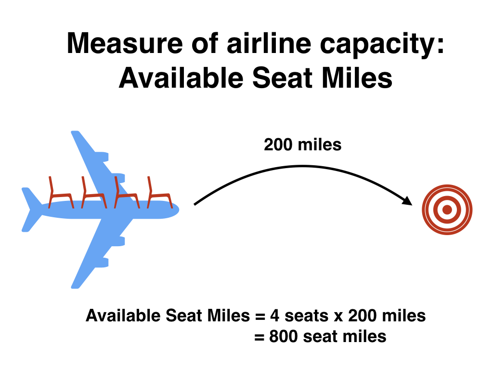
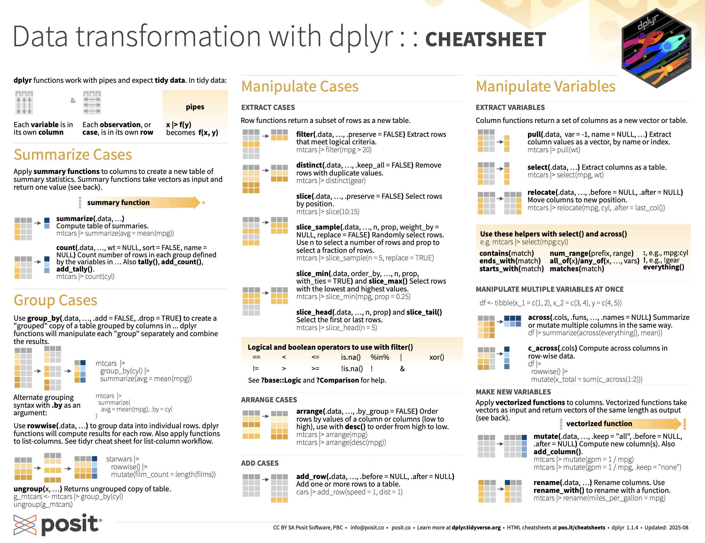

```{r setup-init, include=FALSE}
library(knitr)
source("scripts/image_functions.R")
```

# Data Wrangling {#sec-wrangling}

::: {.callout-note title="In this chapter, you'll learn how to:"}
- Chain a sequence of data transformations together using the pipe operator `|>`
- Apply each of the six core `dplyr` verbs to transform a data frame: `filter()`, `select()`, `mutate()`, `arrange()`, `summarize()`, and `group_by()`
- Combine information from two data frames using the `*_join()` family
- Recognize when missing values (`NA`) require an `na.rm = TRUE` argument
:::

```{r setup_wrangling, include=FALSE, purl=FALSE}
# Used to define Learning Check numbers:
chap <- 3
lc <- 0

# Set R code chunk defaults:
opts_chunk$set(
  echo = TRUE,
  eval = TRUE,
  warning = FALSE,
  message = TRUE,
  tidy = FALSE,
  purl = TRUE,
  out.width = "\\textwidth",
#  fig.height = 4,
  fig.align = "center"
)

# Set output digit precision
options(scipen = 99, digits = 3)

# In kable printing replace all NA's with blanks:
options(knitr.kable.NA = "")

# Set random number generator seed value for replicable pseudo-randomness:
set.seed(76)
```

```{r lc-inline-setup-03, include=FALSE, purl=FALSE}
source("scripts/lc_solutions.R")
lc_setup(3)
```

So far in our journey, we've seen how to look at data saved in data frames using the `glimpse()` and `View()` functions in @sec-getting-started, and how to create data visualizations using the `ggplot2` package in @sec-viz. In particular, we studied what we term the "five named graphs" (5NG):

1. scatterplots via `geom_point()`
1. linegraphs via `geom_line()`
1. boxplots via `geom_boxplot()`
1. histograms via `geom_histogram()`
1. barplots via `geom_bar()` or `geom_col()`

We created these visualizations using the grammar of graphics, which maps variables in a data frame to the aesthetic attributes of one of the 5 `geom`etric objects. We can also control other aesthetic attributes of the geometric objects such as the size and color as seen in the Gapminder data example in @fig-gapminder. 

In this chapter, we'll introduce a series of functions from the `dplyr` package for data wrangling that will allow you to take a data frame and "wrangle" it (transform it) to suit your needs. Such functions include:

1. `filter()` a data frame's existing rows to only pick out a subset of them. For example, the `envoy_flights` data frame.
1. `summarize()` one or more of its columns/variables with a *summary statistic*. Examples of summary statistics include the median and interquartile range of temperatures as we saw in @sec-boxplots on boxplots. 
1. `group_by()` its rows. In other words, assign different rows to be part of the same *group*. We can then combine `group_by()` with `summarize()` to report summary statistics for each group *separately*. For example, say you don't want a single overall average departure delay `dep_delay` for all three `origin` airports combined, but rather three separate average departure delays, one computed for each of the three `origin` airports.
1. `mutate()` its existing columns/variables to create new ones. For example, convert hourly temperature readings from Fahrenheit to Celsius.
1. `arrange()` its rows. For example, sort the rows of `weather` in ascending or descending order of `temp`.
1. `join()` it with another data frame by matching along a "key" variable. In other words, merge these two data frames together.

Notice how we used `computer_code` font to describe the actions we want to take on our data frames. This is because the `dplyr` package for data wrangling has intuitively verb-named functions that are easy to remember. 

There is a further benefit to learning to use the `dplyr` package for data wrangling: its similarity to the database querying language [SQL](https://en.wikipedia.org/wiki/SQL) (pronounced "sequel" or spelled out as "S-Q-L"). SQL (which stands for "Structured Query Language") is used to manage large databases quickly and efficiently and is widely used by many institutions with a lot of data. While SQL is a topic left for a book or a course on database management, keep in mind that once you learn `dplyr`, you can learn SQL easily. We'll talk more about their similarities in @sec-normal-forms.


## Needed packages {.unnumbered #sec-wrangling-packages}

Let's load all the packages needed for this chapter (this assumes you've already installed them). If needed, read @sec-packages for information on how to install and load R packages.

```{r wrangling-load-packages, message=FALSE}
library(dplyr)
library(ggplot2)
library(nycflights23)
```

```{r wrangling-load-internal, message=FALSE, warning=FALSE, echo=FALSE, purl=FALSE}
# Packages needed internally, but not in text.
library(kableExtra)
library(readr)
library(stringr)
library(scales)
```


## The pipe operator: `|>` {#sec-piping}

Before we start data wrangling, let's first introduce a nifty tool that has been a part of R since May 2021: the \index{operators!pipe} native pipe operator `|>`. The pipe operator allows us to combine multiple operations in R into a single sequential *chain* of actions. In modern R, the native pipe operator `|>` is now the default for chaining functions, replacing the previously common tidyverse pipe (`%>%`) that was loaded with the `dplyr` package. Introduced in R 4.1.0 in May 2021, `|>` offers a more intuitive and readable syntax for data wrangling and other tasks, eliminating the need for additional package dependencies. 

You'll still often see R code using `%>%` in older scripts or searches online, but we'll use `|>` in this book. The tidyverse pipe still works, so don't worry if you see it in other code.

Let's start with a hypothetical example. Say you would like to perform a hypothetical sequence of operations on a hypothetical data frame `x` using hypothetical functions `f()`, `g()`, and `h()`:

1. Take `x` *then*
1. Use `x` as an input to a function `f()` *then*
1. Use the output of `f(x)` as an input to a function `g()` *then*
1. Use the output of `g(f(x))` as an input to a function `h()`

One way to achieve this sequence of operations is by using nesting parentheses as follows:

```{r wrangling-nested-functions, eval=FALSE, purl=FALSE}
h(g(f(x)))
```

This code isn't so hard to read since we are applying only three functions: `f()`, then `g()`, then `h()` and each of the functions is short in its name. Further, each of these functions also only has one argument. However, you can imagine that this will get progressively harder to read as the number of functions applied in your sequence increases and the arguments in each function increase as well. This is where the pipe operator `|>` comes in handy. `|>` takes the output of one function and then "pipes" it to be the input of the next function. Furthermore, a helpful trick is to read `|>` as "then" or "and then." For example, you can obtain the same output as the hypothetical sequence of functions as follows:

```{r wrangling-pipe-example, eval=FALSE, purl=FALSE}
x |> 
  f() |> 
  g() |> 
  h()
```

You would read this sequence as:

1. Take `x` *then*
1. Use this output as the input to the next function `f()` *then*
1. Use this output as the input to the next function `g()` *then*
1. Use this output as the input to the next function `h()`

So while both approaches achieve the same goal, the latter is much more human-readable because you can clearly read the sequence of operations line-by-line. But what are the hypothetical `x`, `f()`, `g()`, and `h()`?  Throughout this chapter on data wrangling:

1. The starting value `x` will be a data frame. For example, the \index{R packages!nycflights23} `flights` data frame we explored in @sec-nycflights.
1. The sequence of functions, here `f()`, `g()`, and `h()`, will mostly be a sequence of any number of the six data-wrangling verb-named functions we listed in the introduction to this chapter. For example, the `filter(carrier == "MQ")` function and argument specified we previewed earlier.
1. The result will be the transformed/modified data frame that you want. In our example, we'll save the result in a new data frame by using the `<-` assignment operator with the name `envoy_flights` via `envoy_flights <-`.

```{r wrangling-filter-envoy, eval=FALSE}
envoy_flights <- flights |>
  filter(carrier == "MQ")
```

::: {.callout-tip collapse="true" title="Try it interactively"}
```{webr-r}
envoy_flights <- flights |>
  filter(carrier == "MQ")
envoy_flights
```
:::

Much like when adding layers to a `ggplot()` using the `+` sign, you form a single *chain* of data wrangling operations by combining verb-named functions into a single sequence using the pipe operator `|>`. Furthermore, much like how the `+` sign has to come at the end of lines when constructing plots, the pipe operator `|>` has to come at the end of lines as well. 

Keep in mind, there are many more advanced data-wrangling functions than just the six listed in the introduction to this chapter; you'll see some examples of these in @sec-other-verbs. However, just with these six verb-named functions you'll be able to perform a broad array of data-wrangling tasks for the rest of this book.


## `filter` rows {#sec-filter}

```{r fig-filter, fig.alt="Schematic showing rows being kept (highlighted) and discarded (greyed out) when filter() is applied to a data frame.", fig.cap="Diagram of filter() rows operation.", echo=FALSE, purl=FALSE, out.width="80%"}
include_graphics("images/cheatsheets/filter.png")
```

The \index{R packages!dplyr!filter} `filter()` function here works much like the "Filter" option in Microsoft Excel; it allows you to specify criteria about the values of a variable in your dataset and then filters out only the rows that match that criteria.

We begin by focusing only on flights from New York City to Phoenix, Arizona.  The `dest` destination code (or airport code) for Phoenix, Arizona is `"PHX"`. Run the following and look at the results in RStudio's spreadsheet viewer to ensure that only flights heading to Phoenix are chosen here:

```{r wrangling-view-phoenix_flights, eval=FALSE}
phoenix_flights <- flights |> 
  filter(dest == "PHX")
View(phoenix_flights)
```

Note the order of the code. First, take the `flights` data frame `flights` *then* `filter()` the data frame so that only those where the `dest` equals `"PHX"` are included. We test for equality using the double equal sign \index{operators!==} `==` and not a single equal sign `=`. In other words, `filter(dest = "PHX")` will yield an error. This is a convention across many programming languages. If you are new to coding, you'll probably forget to use the double equal sign `==` a few times before you get the hang of it.

You can use other operators \index{operators} beyond just the `==` operator that tests for equality:

- `>` corresponds to "greater than"
- `<` corresponds to "less than"
- `>=` corresponds to "greater than or equal to"
- `<=` corresponds to "less than or equal to"
- `!=` corresponds to "not equal to." The `!` is used in many programming languages to indicate "not."

Furthermore, you can combine multiple criteria using operators that make comparisons:

- `|` corresponds to "or"
- `&` corresponds to "and"

To see many of these in action, let's filter `flights` for all rows that departed from JFK *and* were heading to Burlington, Vermont (`"BTV"`) or Seattle, Washington (`"SEA"`) *and* departed in the months of October, November, or December. Run the following:

```{r wrangling-view-btv_sea_flights_fall, eval=FALSE}
btv_sea_flights_fall <- flights |> 
  filter(origin == "JFK" & (dest == "BTV" | dest == "SEA") & month >= 10)
View(btv_sea_flights_fall)
```

Note that even though colloquially speaking one might say "all flights leaving Burlington, Vermont *and* Seattle, Washington," in terms of computer operations, we really mean "all flights leaving Burlington, Vermont *or* leaving Seattle, Washington." For a given row in the data, `dest` can be `"BTV"`, or `"SEA"`, or something else, but not both `"BTV"` and `"SEA"` at the same time. Furthermore, note the careful use of parentheses around `dest == "BTV" | dest == "SEA"`.

We can often skip the use of `&` and just separate our conditions with a comma. The previous code will return the identical output `btv_sea_flights_fall` as the following code:

```{r wrangling-assign-btv_sea_flights_fa, eval=FALSE}
btv_sea_flights_fall <- flights |> 
  filter(origin == "JFK", (dest == "BTV" | dest == "SEA"), month >= 10)
View(btv_sea_flights_fall)
```

Let's present another example that uses the \index{operators!not} `!` "not" operator to pick rows that *don't* match a criteria. As mentioned earlier, the `!` can be read as "not." Here we are filtering rows corresponding to flights that didn't go to Burlington, VT or Seattle, WA.

```{r wrangling-view-not_BTV_SEA, eval=FALSE}
not_BTV_SEA <- flights |> 
  filter(!(dest == "BTV" | dest == "SEA"))
View(not_BTV_SEA)
```

Again, note the careful use of parentheses around the `(dest == "BTV" | dest == "SEA")`. If we didn't use parentheses as follows:

```{r wrangling-filter, eval=FALSE}
flights |> filter(!dest == "BTV" | dest == "SEA")
```

We would be returning all flights not headed to `"BTV"` *or* those headed to `"SEA"`, which is an entirely different resulting data frame. 

Now say we have a larger number of airports we want to filter for, say `"SEA"`, `"SFO"`, `"PHX"`, `"BTV"`, and `"BDL"`. We could continue to use the `|` (*or*) \index{operators!or} operator.

```{r wrangling-create-many_airports, eval=FALSE}
many_airports <- flights |> 
  filter(dest == "SEA" | dest == "SFO" | dest == "PHX" | 
         dest == "BTV" | dest == "BDL")
```

As we progressively include more airports, this will get unwieldy to write. A slightly shorter approach uses the `%in%` \index{operators!in} operator along with the `c()` function. Recall from @sec-programming-concepts that the `c()` function "combines" or "concatenates" values into a single *vector* of values. \index{vectors}

```{r wrangling-view-many_airports, eval=FALSE}
many_airports <- flights |> 
  filter(dest %in% c("SEA", "SFO", "PHX", "BTV", "BDL"))
View(many_airports)
```

What this code is doing is filtering `flights` for all flights where `dest` is in the vector of airports `c("BTV", "SEA", "PHX", "SFO", "BDL")`. Both outputs of `many_airports` are the same, but as you can see the latter takes much less energy to code. The `%in%` operator is useful for looking for matches commonly in one vector/variable compared to another.

As a final note, we recommend that `filter()` should often be among the first verbs you consider applying to your data. This cleans your dataset to only those rows you care about, or put differently, it narrows down the scope of your data frame to just the observations you care about. 

::: {.learncheck}
**Learning Check**

**`r paste0("(LC", chap, ".", (lc <- lc + 1), ")")`** What's another way of using the "not" operator `!` to filter only the rows that are not going to Burlington, VT nor Seattle, WA in the `flights` data frame? Test this out using the previous code.

```{r lc-sol-03-01, echo=FALSE, results='asis', purl=FALSE}
cat(lc_solution(3, 1))
```

:::

## `summarize` variables {#sec-summarize}

The next common task when working with data frames is to compute *summary statistics*. \index{summary statistics}Summary statistics are single numerical values that summarize a large number of values. Commonly known examples of summary statistics include the mean (also called the average) and the median (the middle value). Other examples of summary statistics that might not immediately come to mind include the *sum*, the smallest value also called the *minimum*, the largest value also called the *maximum*, and the *standard deviation*. 
```{r wrangling-conditional-text, echo=FALSE, results="asis"}
if(!is_latex_output()) 
  cat("See [Appendix A online](https://moderndive.com/v2/appendixa) for a glossary of such summary statistics.")
```

Let's calculate two summary statistics of the `wind_speed` temperature variable in the `weather` data frame: the mean and standard deviation (recall from @sec-nycflights that the `weather` data frame is included in the `nycflights23` package). To compute these summary statistics, we need the `mean()` and `sd()` *summary functions* in R. Summary functions in R take in many values and return a single value, as shown in @fig-summary-function. 

```{r fig-summary-function, fig.alt="Schematic showing how a summary function collapses a column of values into one summary statistic.", fig.cap="Diagram illustrating a summary function in R.", echo=FALSE, purl=FALSE, out.width="80%"}
include_graphics("images/cheatsheets/summary.png")
```

More precisely, we'll use the `mean()` and `sd()` summary functions within the `summarize()` \index{R packages!dplyr!summarize()} function from the `dplyr` package. Note you can also use the British English spelling of `summarise()`. As shown in @fig-sum1, the `summarize()` function takes in a data frame and returns a data frame with only one row corresponding to the summary statistics. 

```{r fig-sum1, fig.alt="Schematic of summarize() collapsing many rows down to a single row containing summary statistics.", fig.cap="Diagram of summarize() rows.", echo=FALSE, purl=FALSE, out.width="80%"}

```

We'll save the results in a new data frame called `summary_windspeed` that will have two columns/variables: the `mean` and the `std_dev`:

```{r wrangling-mean-and-sd}
summary_windspeed <- weather |>
  summarize(mean = mean(wind_speed), std_dev = sd(wind_speed))
summary_windspeed
```

::: {.callout-tip collapse="true" title="Try it interactively"}
```{webr-r}
summary_windspeed <- weather |>
  summarize(mean = mean(wind_speed), std_dev = sd(wind_speed))
summary_windspeed
```
:::

Why are the values returned `NA`? `NA` is how R encodes *missing values* \index{missing values} where `NA` indicates "not available" or "not applicable." If a value for a particular row and a particular column does not exist, `NA` is stored instead. Values can be missing for many reasons. Perhaps the data was collected but someone forgot to enter it. Perhaps the data was not collected at all because it was too difficult to do so. Perhaps there was an erroneous value that someone entered that has been corrected to read as missing. You'll often encounter issues with missing values when working with real data.

Going back to our `summary_windspeed` output, by default any time you try to calculate a summary statistic of a variable that has one or more `NA` missing values in R, `NA` is returned. To work around this fact, you can set the `na.rm` argument to `TRUE`, where `rm` is short for "remove"; this will ignore any `NA` missing values and only return the summary value for all non-missing values.

::: {.callout-warning title="Common mistake"}
**Don't add `na.rm = TRUE` reflexively.** It silently drops missing values from the calculation, which may not be what you want. Before reaching for `na.rm = TRUE`, ask: *why* are these values missing? Were they not collected? Was there a measurement failure? An honest analysis often requires reporting the count of missing values alongside the summary, not just hiding them.
:::

The code that follows computes the mean and standard deviation of all non-missing values of `temp`:

```{r wrangling-mean-sd-wind}
summary_windspeed <- weather |> 
  summarize(mean = mean(wind_speed, na.rm = TRUE), 
            std_dev = sd(wind_speed, na.rm = TRUE))
summary_windspeed
```

Notice how the `na.rm = TRUE` \index{functions!na.rm argument} are used as arguments to the `mean()` \index{mean()} and `sd()` \index{sd()} summary functions individually, and not to the `summarize()` function. 

However, one needs to be cautious whenever ignoring missing values as we've just done. In the upcoming *Learning checks* questions, we'll consider the possible ramifications of blindly sweeping rows with missing values "under the rug." This is in fact why the `na.rm` argument to any summary statistic function in R is set to `FALSE` by default. In other words, R does not ignore rows with missing values by default. R is alerting you to the presence of missing data and you should be mindful of this missingness and any potential causes of this missingness throughout your analysis.

What are other summary functions we can use inside the `summarize()` verb to compute summary statistics? As seen in the diagram in @fig-summary-function, you can use any function in R that takes many values and returns just one. Here are just a few:

* `mean()`: the average
* `sd()`: the standard deviation, which is a measure of spread
* `min()` and `max()`: the minimum and maximum values, respectively
* `IQR()`: interquartile range
* `sum()`: the total amount when adding multiple numbers
* `n()`: a count of the number of rows in each group. This particular summary function will make more sense when `group_by()` is covered in @sec-groupby.

::: {.learncheck}
**Learning Check**

**`r paste0("(LC", chap, ".", (lc <- lc + 1), ")")`** Say a doctor is studying the effect of smoking on lung cancer for a large number of patients who have records measured at five-year intervals. She notices that a large number of patients have missing data points because the patient has died, so she chooses to ignore these patients in her analysis. What is wrong with this doctor's approach?

```{r lc-sol-03-02, echo=FALSE, results='asis', purl=FALSE}
cat(lc_solution(3, 2))
```

**`r paste0("(LC", chap, ".", (lc <- lc + 1), ")")`** Modify the earlier `summarize()` function code that creates the `summary_windspeed` data frame to also use the `n()` summary function: `summarize(... , count = n())`. What does the returned value correspond to?

```{r lc-sol-03-03, echo=FALSE, results='asis', purl=FALSE}
cat(lc_solution(3, 3))
```

**`r paste0("(LC", chap, ".", (lc <- lc + 1), ")")`** Why doesn't the following code work?  Run the code line-by-line instead of all at once, and then look at the data.  In other words, select and then run `summary_windspeed <- weather |> summarize(mean = mean(wind_speed, na.rm = TRUE))` first.

```{r wrangling-assign-summary_windspeed, eval=FALSE}
summary_windspeed <- weather |>   
  summarize(mean = mean(wind_speed, na.rm = TRUE)) |> 
  summarize(std_dev = sd(wind_speed, na.rm = TRUE))
```

```{r lc-sol-03-04, echo=FALSE, results='asis', purl=FALSE}
cat(lc_solution(3, 4))
```

:::

## `group_by` rows {#sec-groupby}


```{r fig-groupsummarize, fig.alt="Two-panel diagram: rows split into groups by group_by() (left), then summarize() produces one summary row per group (right).", fig.cap="Diagram of group_by() and summarize().", echo=FALSE, purl=FALSE, out.width="90%"}
# To get `_` to work in caption title. Found at https://github.com/rstudio/bookdown/issues/209
include_graphics("images/cheatsheets/group_summary.png")
```

We can modify our code above to look at the average wind speed and its spread instead of wind speed too, keeping the `na.rm = TRUE` set just in case any missing values are stored in the `temp` column:

```{r wrangling-mean-sd-temp}
summary_temp <- weather |> 
  summarize(mean = mean(wind_speed, na.rm = TRUE), 
            std_dev = sd(wind_speed, na.rm = TRUE))
summary_temp
```

Say instead of a single mean wind speed for the whole year, we would like 12 mean temperatures, one for each of the 12 months separately. In other words, we would like to compute the mean wind speed split by month as shown via generic diagram in @fig-groupsummarize. We can do this by "grouping" temperature observations by the values of another variable, in this case by the 12 values of the variable `month`:

```{r wrangling-summary-by-month}
summary_monthly_windspeed <- weather |> 
  group_by(month) |> 
  summarize(mean = mean(wind_speed, na.rm = TRUE), 
            std_dev = sd(wind_speed, na.rm = TRUE))
summary_monthly_windspeed
```

This code is identical to the previous code that created `summary_windspeed`, but with an extra `group_by(month)` added before the `summarize()`. Grouping the `weather` dataset by `month` and then applying the `summarize()` functions yields a data frame that displays the mean and standard deviation wind speed split by the 12 months of the year.

It is important to note that the \index{R packages!dplyr!group\_by()} `group_by()` function doesn't change data frames by itself. Rather it changes the *meta-data*\index{meta-data}, or data about the data, specifically the grouping structure. Only after applying the `summarize()` function does the data frame change. 

As another example, consider the \index{R packages!ggplot2!diamonds} `diamonds` data frame included in the `ggplot2` package:

```{r wrangling-show-diamonds}
diamonds
```

Observe that the first line of the output reads ``# A tibble: `r diamonds |> nrow() |> comma()` x `r diamonds |> ncol()` ``. This is an example of meta-data, in this case the number of observations/rows and variables/columns in `diamonds`. The actual data itself are the subsequent table of values. Now let's pipe the `diamonds` data frame into `group_by(cut)`:

```{r wrangling-demo-code}
diamonds |> 
  group_by(cut)
```

```{r wrangling-create-cut_levels, echo=FALSE, purl=FALSE}
# This code is used for dynamic non-static in-line text output purposes
cut_levels <- diamonds |>
  select(cut) |>
  n_distinct()
```

Observe that now there is additional meta-data: ``# Groups: cut [`r cut_levels`]`` indicating that the grouping structure meta-data has been set based on the `r cut_levels` possible levels of the categorical variable `cut`: `"Fair"`, `"Good"`, `"Very Good"`, `"Premium"`, and `"Ideal"`. On the other hand, observe that the data has not changed: it is still a table of `r diamonds |> nrow() |> comma()` $\times$ `r diamonds |> ncol()` values. Only by combining a `group_by()` with another data-wrangling operation, in this case `summarize()`, will the data actually be transformed. 

```{r wrangling-grouped-summary}
diamonds |>
  group_by(cut) |>
  summarize(avg_price = mean(price))
```

::: {.callout-tip collapse="true" title="Try it interactively"}
```{webr-r}
diamonds |>
  group_by(cut) |>
  summarize(avg_price = mean(price))
```
:::

If you would like to remove this grouping structure meta-data, we can pipe the resulting data frame into the \index{R packages!dplyr!ungroup()} `ungroup()` function:

```{r wrangling-ungroup-data}
diamonds |> 
  group_by(cut) |> 
  ungroup()
```

Observe how the ``# Groups: cut [`r cut_levels`]`` meta-data is no longer present. 

Let's now revisit the `n()` \index{R packages!dplyr!n()} counting summary function we briefly introduced previously. Recall that the `n()` function counts rows. This is opposed to the `sum()` summary function that returns the sum of a numerical variable. For example, suppose we'd like to count how many flights departed each of the three airports in New York City:

```{r wrangling-summary-by-origin}
by_origin <- flights |> 
  group_by(origin) |> 
  summarize(count = n())
by_origin
```

We see that LaGuardia (`"LGA"`) had the most flights departing in 2023 followed by Newark (`"EWR"`) and lastly by `"JFK"`. Note there is a subtle but important difference between `sum()` and `n()`; while `sum()` returns the sum of a numerical variable, `n()` returns a count of the number of rows/observations. 


### Grouping by more than one variable {.unnumbered}

You are not limited to grouping by one variable. Say you want to know the number of flights leaving each of the three New York City airports *for each month*. We can also group by a second variable `month` using `group_by(origin, month)`:


```{r wrangling-assign-by_origin_monthly}
by_origin_monthly <- flights |> 
  group_by(origin, month) |> 
  summarize(count = n())
```

Note that an additional message appears here specifying the grouping done. The `.groups` argument to `summarize()` has four options: `drop_last`, `drop`, `keep`, and `rowwise`:

- `drop_last` drops the last grouping variable,
- `drop` drops all grouping variables,
- `keep` keeps all grouping variables, and
- `rowwise` turns each row into a group.

In most circumstances, the default is `drop_last` which drops the last grouping variable. The message is informing us that the default behavior is to drop the last grouping variable, which in this case is `month`.

```{r wrangling-v26}
by_origin_monthly
```

Observe that there are `r by_origin_monthly |> nrow()` rows to `by_origin_monthly` because there are 12 months for 3 airports (`EWR`, `JFK`, and `LGA`). Why do we `group_by(origin, month)` and not `group_by(origin)` and then `group_by(month)`? Let's investigate:

```{r wrangling-count-by-origin}
by_origin_monthly_incorrect <- flights |> 
  group_by(origin) |> 
  group_by(month) |> 
  summarize(count = n())
by_origin_monthly_incorrect
```

What happened here is that the second `group_by(month)` overwrote the grouping structure meta-data of the earlier `group_by(origin)`, so that in the end we are only grouping by `month`. The lesson here is if you want to `group_by()` two or more variables, you should include all the variables at the same time in the same `group_by()` adding a comma between the variable names.

::: {.learncheck}
**Learning Check**

**`r paste0("(LC", chap, ".", (lc <- lc + 1), ")")`** Recall from @sec-viz when we looked at wind speeds by months in NYC. What does the standard deviation column in the `summary_monthly_temp` data frame tell us about temperatures in NYC throughout the year?

```{r lc-sol-03-05, echo=FALSE, results='asis', purl=FALSE}
cat(lc_solution(3, 5))
```

**`r paste0("(LC", chap, ".", (lc <- lc + 1), ")")`** What code would be required to get the mean and standard deviation wind speed for each day in 2023 for NYC?

```{r lc-sol-03-06, echo=FALSE, results='asis', purl=FALSE}
cat(lc_solution(3, 6))
```

**`r paste0("(LC", chap, ".", (lc <- lc + 1), ")")`** Recreate `by_monthly_origin`, but instead of grouping via `group_by(origin, month)`, group variables in a different order `group_by(month, origin)`. What differs in the resulting dataset?

```{r lc-sol-03-07, echo=FALSE, results='asis', purl=FALSE}
cat(lc_solution(3, 7))
```

**`r paste0("(LC", chap, ".", (lc <- lc + 1), ")")`** How could we identify how many flights left each of the three airports for each `carrier`?

```{r lc-sol-03-08, echo=FALSE, results='asis', purl=FALSE}
cat(lc_solution(3, 8))
```

**`r paste0("(LC", chap, ".", (lc <- lc + 1), ")")`** How does the `filter()` operation differ from a `group_by()` followed by a `summarize()`?

```{r lc-sol-03-09, echo=FALSE, results='asis', purl=FALSE}
cat(lc_solution(3, 9))
```

:::

## `mutate` existing variables {#sec-mutate}

```{r fig-mutatevars, fig.alt="Schematic showing mutate() adding a new column to a data frame, computed from existing columns.", fig.cap="Diagram of mutate() columns.", echo=FALSE, purl=FALSE, out.width="40%"}
include_graphics("images/cheatsheets/mutate.png")
```

Another common transformation of data is to create/compute new variables based on existing ones as shown in @fig-mutatevars. For example, say you are more comfortable thinking of temperature in degrees Celsius (&deg;C) instead of degrees Fahrenheit (&deg;F). The formula to convert temperatures from &deg;F to &deg;C is

$$
\text{temp in C} = \frac{\text{temp in F} - 32}{1.8}
$$

We can apply this formula to the `temp` variable using the `mutate()` \index{R packages!dplyr!mutate()} function from the `dplyr` package, which takes existing variables and mutates them to create new ones. 

```{r wrangling-create-weather, eval=TRUE}
weather <- weather |> 
  mutate(temp_in_C = (temp - 32) / 1.8)
```

In this code, we `mutate()` the `weather` data frame by creating a new variable 

`temp_in_C = (temp - 32) / 1.8`,

and then we *overwrite* the original `weather` data frame. Why did we overwrite the data frame `weather`, instead of assigning the result to a new data frame like `weather_new`? 

As a rough rule of thumb, as long as you are not losing original information that you might need later, it's acceptable practice to overwrite existing data frames with updated ones, as we did here. On the other hand, why did we not overwrite the variable `temp`, but instead created a new variable called `temp_in_C`?  Because if we did this, we would have erased the original information contained in `temp` of temperatures in Fahrenheit that may still be valuable to us.

Let's now compute monthly average temperatures in both &deg;F and &deg;C using the `group_by()` and `summarize()` code we saw in @sec-groupby:

```{r wrangling-summary-by-month-v4}
summary_monthly_temp <- weather |> 
  group_by(month) |> 
  summarize(mean_temp_in_F = mean(temp, na.rm = TRUE), 
            mean_temp_in_C = mean(temp_in_C, na.rm = TRUE))
summary_monthly_temp
```

Let's consider another example. Passengers are often frustrated when their flight departs late, but aren't as annoyed if, in the end, pilots can make up some time during the flight.  This is known in the airline industry as _gain_, and we will create this variable using the `mutate()` function:

```{r wrangling-mutate-gain}
flights <- flights |>
  mutate(gain = dep_delay - arr_delay)
```

::: {.callout-tip collapse="true" title="Try it interactively"}
```{webr-r}
flights <- flights |>
  mutate(gain = dep_delay - arr_delay)
flights |> select(dep_delay, arr_delay, gain)
```
:::

Let's take a look at only the `dep_delay`, `arr_delay`, and the resulting `gain` variables for the first 5 rows in our updated `flights` data frame in @tbl-first-five-flights.

```{r five-flights-save, include=FALSE, purl=FALSE}
first_five <- flights |> 
  select(dep_delay, arr_delay, gain) |> 
  slice(1:5)
first_row_gain <- first_five$dep_delay[1] - first_five$arr_delay[1]
first_row_dep <- first_five$dep_delay[1]
first_row_arr <- first_five$arr_delay[1]
third_row_gain <- first_five$dep_delay[3] - first_five$arr_delay[3]
third_row_dep <- first_five$dep_delay[3]
third_row_arr <- first_five$arr_delay[3]
```

```{r tbl-first-five-flights, echo=FALSE, purl=FALSE}
flights |> 
  select(dep_delay, arr_delay, gain) |> 
  slice(1:5) |> 
  kbl(
    caption = "First five rows of departure/arrival delay and gain variables"
  ) |>
  kable_styling(position = "center", latex_options = "HOLD_position")
```

The flight in the first row departed `r first_five$dep_delay[1]` minutes late but arrived `r first_five$arr_delay[1]` minutes late, so its "gained time in the air" is a gain of `r first_row_gain` minutes, hence its `gain` is $`r first_row_dep` - `r first_row_arr` = `r first_row_gain`$, which is a `loss` of `r abs(first_row_gain)` minutes. On the other hand, the flight in the third row departed late (`dep_delay` of `r third_row_dep`) but arrived `r third_row_arr` minutes late (`arr_delay` of `r third_row_arr`), so its "gained time in the air" is $`r third_row_dep` - `r third_row_arr` = `r third_row_gain`$ minutes, hence its `gain` is `r third_row_gain`.

Let's look at some summary statistics of the `gain` variable by considering multiple summary functions at once in the same `summarize()` code:

```{r wrangling-mean-sd-narm}
gain_summary <- flights |> 
  summarize(
    min = min(gain, na.rm = TRUE),
    q1 = quantile(gain, 0.25, na.rm = TRUE),
    median = quantile(gain, 0.5, na.rm = TRUE),
    q3 = quantile(gain, 0.75, na.rm = TRUE),
    max = max(gain, na.rm = TRUE),
    mean = mean(gain, na.rm = TRUE),
    sd = sd(gain, na.rm = TRUE),
    missing = sum(is.na(gain))
  )
gain_summary
```

We see for example that the median gain is `r gain_summary$median` minutes, while the largest is +`r gain_summary$max` minutes and the largest negative gain (or loss) at `r gain_summary$min` minutes! However, this code would take some time to type out in practice. We'll see later on in @sec-model1EDA that there is a much more succinct way to compute a variety of common summary statistics: using the `tidy_summary()` function from the `moderndive` package.

Recall from @sec-histograms that since `gain` is a numerical variable, we can visualize its distribution using a histogram.  

```{r fig-gain-hist, fig.alt="Right-skewed histogram of the gain variable (departure delay minus arrival delay), centered near zero with a long right tail and a few extreme positive values.", fig.cap="Histogram of gain variable.", message=FALSE, fig.height=ifelse(knitr::is_latex_output(), 3, 4)}
ggplot(data = flights, mapping = aes(x = gain)) +
  geom_histogram(color = "white", bins = 20)
```

The resulting histogram in @fig-gain-hist provides additional perspective on the `gain` variable than the summary statistics we computed earlier. For example, note that most values of `gain` are right around 0. 

To close out our discussion on the `mutate()` function to create new variables, note that we can create multiple new variables at once in the same `mutate()` code. Furthermore, within the same `mutate()` code we can refer to new variables we just created. As an example, consider the `mutate()` code Hadley Wickham \index{Wickham, Hadley} and Garrett Grolemund \index{Grolemund, Garrett} show in Chapter 5 of *R for Data Science* [@rds2016]:

```{r wrangling-mutate-gain-demo}
flights <- flights |> 
  mutate(
    gain = dep_delay - arr_delay,
    hours = air_time / 60,
    gain_per_hour = gain / hours
  )
```

::: {.learncheck}
**Learning Check**

**`r paste0("(LC", chap, ".", (lc <- lc + 1), ")")`** What do positive values of the `gain` variable in `flights` correspond to?  What about negative values?  And what about a zero value?

```{r lc-sol-03-10, echo=FALSE, results='asis', purl=FALSE}
cat(lc_solution(3, 10))
```

**`r paste0("(LC", chap, ".", (lc <- lc + 1), ")")`** Could we create the `dep_delay` and `arr_delay` columns by simply subtracting `dep_time` from `sched_dep_time` and similarly for arrivals?  Try the code out and explain any differences between the result and what actually appears in `flights`.

```{r lc-sol-03-11, echo=FALSE, results='asis', purl=FALSE}
cat(lc_solution(3, 11))
```

**`r paste0("(LC", chap, ".", (lc <- lc + 1), ")")`** What can we say about the distribution of `gain`?  Describe it in a few sentences using the plot and the `gain_summary` data frame values.

```{r lc-sol-03-12, echo=FALSE, results='asis', purl=FALSE}
cat(lc_solution(3, 12))
```

:::

## `arrange` and sort rows {#sec-arrange}

One of the most commonly performed data-wrangling tasks is to sort a data frame's rows in the alphanumeric order of one of the variables. The `dplyr` package's `arrange()` function \index{R packages!dplyr!arrange()} allows us to sort/reorder a data frame's rows according to the values of the specified variable.

Suppose we are interested in determining the most frequent destination airports for all domestic flights departing from New York City in 2023:

```{r wrangling-count-by-dest}
freq_dest <- flights |> 
  group_by(dest) |> 
  summarize(num_flights = n())
freq_dest
```

Observe that by default the rows of the resulting `freq_dest` data frame are sorted in alphabetical order of `dest`ination. Say instead we would like to see the same data, but sorted from the most to the least number of flights (`num_flights`) instead:

```{r wrangling-arrange}
freq_dest |> 
  arrange(num_flights)
```

This is, however, the opposite of what we want. The rows are sorted with the least frequent destination airports displayed first. This is because `arrange()` always returns rows sorted in ascending order by default. To switch the ordering to be in "descending" order instead, we use the `desc()` \index{R packages!dplyr!desc()} function as so:

```{r wrangling-arrange-desc}
freq_dest |>
  arrange(desc(num_flights))
```

::: {.callout-tip collapse="true" title="Try it interactively"}
```{webr-r}
freq_dest <- flights |>
  group_by(dest) |>
  summarize(num_flights = n())
freq_dest |>
  arrange(desc(num_flights))
```
:::


## `join` data frames {#sec-joins}

Another common data transformation task is "joining" or "merging" two different datasets. For example, in the `flights` data frame, the variable `carrier` lists the carrier code for the different flights. While the corresponding airline names for `"UA"` and `"AA"` might be somewhat easy to guess (United and American Airlines), what airlines have codes `"VX"`, `"HA"`, and `"B6"`? This information is provided in a separate data frame `airlines`.

```{r wrangling-view-airlines, eval=FALSE}
View(airlines)
```

We see that in `airlines`, `carrier` is the carrier code, while `name` is the full name of the airline company. Using this table, we can see that `"G4"`, `"HA"`, and `"B6"` correspond to Allegiant Air, Hawaiian Airlines, and JetBlue, respectively. However, wouldn't it be nice to have all this information in a single data frame instead of two separate data frames? We can do this by "joining" the `flights` and `airlines` data frames.

The values in the variable `carrier` in the `flights` data frame match the values in the variable `carrier` in the `airlines` data frame. In this case, we can use the variable `carrier` as a \index{joining data!key variable} *key variable* to match the rows of the two data frames. Key variables are almost always *identification variables* that uniquely identify the observational units as we saw in @sec-identification-vs-measurement-variables. This ensures that rows in both data frames are appropriately matched during the join. Hadley and Garrett [@rds2016] created the diagram in @fig-reldiagram to show how the different data frames in the `nycflights23` package are linked by various key variables:


```{r fig-reldiagram, fig.alt="Entity-relationship diagram of the nycflights23 package: tables (flights, airlines, planes, airports, weather) shown as boxes, joined by arrows on shared key columns.", fig.cap="Data relationships in nycflights from *R for Data Science*.", echo=FALSE, purl=FALSE, out.width="65%"}
include_graphics("images/r4ds/relational-nycflights.png")
```


### Matching key variable names

In both the `flights` and `airlines` data frames, the key variable we want to join/merge/match the rows by has the same name: `carrier`. Let's use the `inner_join()` \index{R packages!dplyr!inner\_join()} function to join the two data frames, where the rows will be matched by the variable `carrier`, and then compare the resulting data frames:

```{r wrangling-view-flights, eval=FALSE}
flights_joined <- flights |>
  inner_join(airlines, by = "carrier")
View(flights)
View(flights_joined)
```

::: {.callout-tip collapse="true" title="Try it interactively"}
```{webr-r}
flights_joined <- flights |>
  inner_join(airlines, by = "carrier")
flights_joined
```
:::

Observe that the `flights` and `flights_joined` data frames are identical except that `flights_joined` has an additional variable `name`. The values of `name` correspond to the airline companies' names as indicated in the `airlines` data frame. 

A visual representation of the `inner_join()` is shown in @fig-ijdiagram [@rds2016]. There are other types of joins available (such as `left_join()`, `right_join()`, `outer_join()`, and `anti_join()`), but the `inner_join()` will solve nearly all of the problems you'll encounter in this book.


```{r fig-ijdiagram, fig.alt="Visual schematic of an inner join: matching key values in two tables produce combined rows; non-matching rows are dropped.", fig.cap="Diagram of inner join from *R for Data Science*.", echo=FALSE, purl=FALSE, out.width="80%"}
include_graphics("images/r4ds/join-inner.png")
```


### Different key variable names {#sec-diff-key}

Say instead you are interested in the destinations of all domestic flights departing NYC in 2023, and you ask yourself questions like: "What cities are these airports in?", or "Is `"ORD"` Orlando?", or "Where is `"FLL"`?".

The `airports` data frame contains the airport codes for each airport:

```{r wrangling-view-airports, eval=FALSE}
View(airports)
```

However, if you look at both the `airports` and `flights` data frames, you'll find that the airport codes are in variables that have different names. In `airports`, the airport code is in `faa`, whereas in `flights` the airport codes are in `origin` and `dest`. This fact is further highlighted in the visual representation of the relationships between these data frames in @fig-reldiagram.

In order to join these two data frames by airport code, our `inner_join()` operation will use the `by = c("dest" = "faa")` \index{R packages!dplyr!inner\_join()!by} argument with modified code syntax allowing us to join two data frames where the key variable has a different name:

```{r wrangling-view-flights_with_airport, eval=FALSE}
flights_with_airport_names <- flights |> 
  inner_join(airports, by = c("dest" = "faa"))
View(flights_with_airport_names)
```

Let's construct the chain of pipe operators `|>` that computes the number of flights from NYC to each destination, but also includes information about each destination airport:

```{r wrangling-count-by-dest2}
named_dests <- flights |>
  group_by(dest) |>
  summarize(num_flights = n()) |>
  arrange(desc(num_flights)) |>
  inner_join(airports, by = c("dest" = "faa")) |>
  rename(airport_name = name)
named_dests
```

In case you didn't know, `"ORD"` is the airport code of Chicago O'Hare airport and `"FLL"` is the main airport in Fort Lauderdale, Florida, which can be seen in the `airport_name` variable.


### Multiple key variables

Say instead we want to join two data frames by *multiple key variables*. For example, in @fig-reldiagram, we see that in order to join the `flights` and `weather` data frames, we need more than one key variable: `year`, `month`, `day`, `hour`, and `origin`. This is because the combination of these 5 variables act to uniquely identify each observational unit in the `weather` data frame: hourly weather recordings at each of the 3 NYC airports.

We achieve this by specifying a *vector* of key variables to join by using the `c()` function. Recall from @sec-programming-concepts that `c()` is short for "combine" or "concatenate." \index{vectors}

```{r wrangling-view-flights_weather_join, eval=FALSE}
flights_weather_joined <- flights |>
  inner_join(weather, by = c("year", "month", "day", "hour", "origin"))
View(flights_weather_joined)
```

::: {.learncheck}
**Learning Check**

**`r paste0("(LC", chap, ".", (lc <- lc + 1), ")")`** Looking at @fig-reldiagram, when joining `flights` and `weather` (or, in other words, matching the hourly weather values with each flight), why do we need to join by all of `year`, `month`, `day`, `hour`, and `origin`, and not just `hour`?

```{r lc-sol-03-13, echo=FALSE, results='asis', purl=FALSE}
cat(lc_solution(3, 13))
```

**`r paste0("(LC", chap, ".", (lc <- lc + 1), ")")`** What surprises you about the top 10 destinations from NYC in 2023?

```{r lc-sol-03-14, echo=FALSE, results='asis', purl=FALSE}
cat(lc_solution(3, 14))
```

:::

### Normal forms {#sec-normal-forms}

The data frames included in the `nycflights23` package are in a form that minimizes redundancy of data. For example, the `flights` data frame only saves the `carrier` code of the airline company; it does not include the actual name of the airline. For example, you'll see that the first row of `flights` has `carrier` equal to `UA`, but it does not include the airline name "United Air Lines Inc." 

The names of the airline companies are included in the `name` variable of the `airlines` data frame. In order to have the airline company name included in `flights`, we could join these two data frames as follows:

```{r wrangling-view-joined_flights, eval=FALSE}
joined_flights <- flights |> 
  inner_join(airlines, by = "carrier")
View(joined_flights)
```

We are capable of performing this join because each of the data frames has _keys_ in common to relate one to another: the `carrier` variable in both the `flights` and `airlines` data frames.  The *key* variable(s) that we base our joins on are often *identification variables* as we mentioned previously. 

This is an important property of what's known as *normal forms* of data.  The process of decomposing data frames into less redundant tables without losing information is called *normalization*.  More information is available on [Wikipedia](https://en.wikipedia.org/wiki/Database_normalization).

Both `dplyr` and [SQL](https://en.wikipedia.org/wiki/SQL) we mentioned in the introduction of this chapter use such *normal forms*. Given that they share such commonalities, once you learn either of these two tools, you can learn the other very easily. 

::: {.learncheck}
**Learning Check**

**`r paste0("(LC", chap, ".", (lc <- lc + 1), ")")`** What are some advantages of data in normal forms?  What are some disadvantages?

```{r lc-sol-03-15, echo=FALSE, results='asis', purl=FALSE}
cat(lc_solution(3, 15))
```

:::

## Other verbs {#sec-other-verbs}

Here are some other useful data-wrangling verbs:

* `select()` only a subset of variables/columns.
* `relocate()` variables/columns to a new position.
* `rename()` variables/columns to have new names.
* Return only the `top_n()` values of a variable.


### `select` variables {#sec-select}

```{r fig-selectfig, fig.alt="Schematic showing select() keeping a chosen subset of columns and dropping the rest.", fig.cap="Diagram of select() columns.", echo=FALSE, purl=FALSE, out.width="70%"}

```

```{r wrangling-dynamic-text, echo=FALSE, purl=FALSE}
# This redundant code is used for dynamic non-static in-line text output purposes
# :: operator used as output was wrong otherwise
flights_cols <- nycflights23::flights |>
  ncol() 
```

We've seen that the `flights` data frame in the `nycflights23` package contains `r flights_cols` different variables. You can identify the names of these `r flights_cols` variables by running the `glimpse()` function from the `dplyr` package:

```{r wrangling-glimpse-flights, eval=FALSE}
glimpse(flights)
```

However, say you only need two of these `r flights_cols` variables, say `carrier` and `flight`. You can `select()` \index{R packages!dplyr!select()} these two variables:

```{r wrangling-select-vars, eval=FALSE}
flights |>
  select(carrier, flight)
```

::: {.callout-tip collapse="true" title="Try it interactively"}
```{webr-r}
flights |>
  select(carrier, flight)
```
:::

This function makes it easier to explore large datasets since it allows us to limit the scope to only those variables we care most about. For example, if we `select()` only a smaller number of variables as is shown in @fig-selectfig, it will make viewing the dataset in RStudio's spreadsheet viewer more digestible.

Let's say instead you want to drop, or de-select, certain variables. For example, consider the variable `year` in the `flights` data frame. This variable isn't quite a "variable" because it is always `2023` and hence doesn't change. Say you want to remove this variable from the data frame. We can deselect `year` by using the `-` sign:

```{r wrangling-create-flights_no_year, eval=FALSE}
flights_no_year <- flights |> select(-year)
```

Another way of selecting columns/variables is by specifying a range of columns:

```{r wrangling-create-flight_arr_times, eval=FALSE}
flight_arr_times <- flights |> select(month:day, arr_time:sched_arr_time)
flight_arr_times
```

This will `select()` all columns between `month` and `day`, as well as between `arr_time` and `sched_arr_time`, and drop the rest. 

The helper functions `starts_with()`, `ends_with()`, and `contains()` can be used to select variables/columns that match those conditions. As examples,

```{r wrangling-select-vars-alt, eval=FALSE}
flights |> select(starts_with("a"))
flights |> select(ends_with("delay"))
flights |> select(contains("time"))
```

Lastly, the `select()` function can also be used to reorder columns when used with the `everything()` helper function.  For example, suppose we want the `hour`, `minute`, and `time_hour` variables to appear immediately after the `year`, `month`, and `day` variables, while not discarding the rest of the variables. In the following code, `everything()` will pick up all remaining variables: 

```{r wrangling-glimpse-flights_reorder, eval=FALSE}
flights_reorder <- flights |> 
  select(year, month, day, hour, minute, time_hour, everything())
glimpse(flights_reorder)
```


### `relocate` variables {#sec-relocate}

Another (usually shorter) way to reorder variables is by using the \index{R packages!dplyr!relocate()} `relocate()` function. This function allows you to move variables to a new position in the data frame. For example, if we want to move the `hour`, `minute`, and `time_hour` variables to appear immediately after the `year`, `month`, and `day` variables, we can use the following code:

```{r wrangling-glimpse-flights_relocate, eval=FALSE}
flights_relocate <- flights |> 
  relocate(hour, minute, time_hour, .after = day)
glimpse(flights_relocate)
```

### `rename` variables {#sec-rename}

One more useful function is \index{R packages!dplyr!rename()} `rename()`, which as you may have guessed changes the name of variables. Suppose we want to only focus on `dep_time` and `arr_time` and change `dep_time` and `arr_time` to be `departure_time` and `arrival_time` instead in the `flights_time_new` data frame:

```{r wrangling-glimpse-flights_time_new, eval=FALSE}
flights_time_new <- flights |> 
  select(dep_time, arr_time) |> 
  rename(departure_time = dep_time, arrival_time = arr_time)
glimpse(flights_time_new)
```

Note that in this case we used a single `=` sign within the `rename()`. For example, `departure_time = dep_time` renames the `dep_time` variable to have the new name `departure_time`. This is because we are not testing for equality like we would using `==`. Instead we want to assign a new variable `departure_time` to have the same values as `dep_time` and then delete the variable `dep_time`. Note that new `dplyr` users often forget that the new variable name comes before the equal sign.


### `top_n` values of a variable

We can also return the top `n` values of a variable using the `top_n()` \index{R packages!dplyr!top\_n()} function. For example, we can return a data frame of the top 10 destination airports using the example from @sec-diff-key. Observe that we set the number of values to return to `n = 10` and `wt = num_flights` to indicate that we want the rows corresponding to the top 10 values of `num_flights`. See the help file for `top_n()` by running `?top_n` for more information. 

```{r wrangling-demo-code-v2, eval=FALSE}
named_dests |> top_n(n = 10, wt = num_flights)
```

Let's further `arrange()` these results in descending order of `num_flights`:

```{r wrangling-demo-code-v2-dup1, eval=FALSE}
named_dests |> 
  top_n(n = 10, wt = num_flights) |> 
  arrange(desc(num_flights))
```

::: {.learncheck}
**Learning Check**

**`r paste0("(LC", chap, ".", (lc <- lc + 1), ")")`** What are some ways to select all three of the `dest`, `air_time`, and `distance` variables from `flights`?  Give the code showing how to do this in at least three different ways.

```{r lc-sol-03-16, echo=FALSE, results='asis', purl=FALSE}
cat(lc_solution(3, 16))
```

**`r paste0("(LC", chap, ".", (lc <- lc + 1), ")")`** How could one use `starts_with()`, `ends_with()`, and `contains()` to select columns from the `flights` data frame?  Provide three different examples in total: one for `starts_with()`, one for `ends_with()`, and one for `contains()`.

```{r lc-sol-03-17, echo=FALSE, results='asis', purl=FALSE}
cat(lc_solution(3, 17))
```

**`r paste0("(LC", chap, ".", (lc <- lc + 1), ")")`** Why might we want to use the `select()` function on a data frame?

```{r lc-sol-03-18, echo=FALSE, results='asis', purl=FALSE}
cat(lc_solution(3, 18))
```

**`r paste0("(LC", chap, ".", (lc <- lc + 1), ")")`** Create a new data frame that shows the top 5 airports with the largest arrival delays from NYC in 2023.

```{r lc-sol-03-19, echo=FALSE, results='asis', purl=FALSE}
cat(lc_solution(3, 19))
```

:::

## Quick checks {.unnumbered}

Ten questions to assess your understanding. Several are designed around common misconceptions — read each option carefully before peeking at the answer.

**Q3-1.** Which `dplyr` verb keeps only the rows where `carrier == "DL"`?

a. `select()`
b. `filter()`
c. `arrange()`
d. `mutate()`

::: {.callout-tip collapse="true" title="Show answer"}
**(b)** `filter()` keeps rows matching a logical condition. `select()` picks columns; `arrange()` sorts rows; `mutate()` creates new columns.
:::

**Q3-2.** What does this pipeline return?

```r
flights |>
  group_by(origin) |>
  summarize(avg_delay = mean(dep_delay, na.rm = TRUE))
```

a. A data frame with one row per origin
b. A vector of departure delays
c. The original `flights` data frame
d. An error, because `dep_delay` has missing values

::: {.callout-tip collapse="true" title="Show answer"}
**(a)** `group_by()` + `summarize()` collapses the data to one row per group.
:::

**Q3-3.** Why do many `summarize()` calls include `na.rm = TRUE`?

a. To increase the precision of the result
b. To remove negative values
c. To exclude missing values
d. To round to whole numbers

::: {.callout-tip collapse="true" title="Show answer"}
**(c)** `na.rm = TRUE` tells the summary function to skip `NA` values. Without it, *any* missing value will cause the entire summary to return `NA`. (But always think about *why* the values are missing before reaching for it.)
:::

**Q3-4.** What's the difference between `filter(flights, carrier == "DL")` and `filter(flights, carrier = "DL")`?

a. The second triggers an error
b. They're equivalent
c. The first returns Delta flights; the second returns all flights
d. Both work but the second is slower

::: {.callout-tip collapse="true" title="Show answer"}
**(a)** `==` compares; `=` assigns argument values. Mixing them up is one of the most common dplyr errors.
:::

**Q3-5.** After running `flights |> mutate(gain = arr_delay - dep_delay)` *without* `<-`, the `flights` data frame:

a. Is unchanged
b. Has the new `gain` column added
c. Has the new column AND its previous columns are removed
d. Errors

::: {.callout-tip collapse="true" title="Show answer"}
**(a)** Verbs like `mutate()` *return* a modified copy. To keep it, you must reassign with `<-`: `flights <- flights |> mutate(...)`. Without that, the modified version is printed and discarded.
:::

**Q3-6.** `flights |> arrange(dep_delay)` returns rows sorted by departure delay. The first row is most likely:

a. The flight with the largest positive `dep_delay`
b. A randomly chosen flight
c. A flight with `dep_delay` of exactly 0
d. The flight with the most negative `dep_delay`

::: {.callout-tip collapse="true" title="Show answer"}
**(d)** `arrange()` sorts ascending by default. The smallest value (most negative) comes first, meaning the flight that left earliest relative to its scheduled departure time. Use `arrange(desc(dep_delay))` for largest first.
:::

**Q3-7.** `flights |> inner_join(airlines, by = "carrier")` returns:

a. The union of both data frames
b. Only rows from `flights` whose `carrier` value also appears in `airlines`
c. All rows from `airlines`, with flight info added
d. All rows from `flights`, with airline info filled in where matched (`NA` otherwise)

::: {.callout-tip collapse="true" title="Show answer"}
**(b)** **Inner** join keeps only rows matched in BOTH tables. (d) describes a `left_join`; (c) is a `right_join`. With `nycflights23`, every carrier in `flights` is in `airlines`, so the visible row count is the same, but the conceptual difference matters when keys don't all match.
:::

**Q3-8.** `flights |> filter(dep_delay > 60 | arr_delay > 60)` returns rows where:

a. An error, because `|` is not a valid operator
b. BOTH `dep_delay` and `arr_delay` exceed 60
c. Neither delay exceeds 60
d. EITHER `dep_delay` or `arr_delay` exceeds 60

::: {.callout-tip collapse="true" title="Show answer"}
**(d)** `|` is the *OR* operator in R. `&` is *AND*. Confusing the two is a common student error.
:::

**Q3-9.** After `flights |> group_by(origin)`, what visible change happens to the data frame?

a. A new column appears
b. Rows with `NA` are dropped
c. Nothing visible changes
d. Rows are reordered by origin

::: {.callout-tip collapse="true" title="Show answer"}
**(c)** `group_by()` is a labeling step. The data frame looks the same; downstream verbs see the grouping and act per-group.
:::

**Q3-10.** Compare these two expressions:

* (i) `flights |> filter(carrier == "DL") |> summarize(mean_delay = mean(dep_delay, na.rm = TRUE))`
* (ii) `summarize(filter(flights, carrier == "DL"), mean_delay = mean(dep_delay, na.rm = TRUE))`

Which statement is correct?

a. They give different answers because piping changes what each function "sees"
b. (i) errors because `|>` can't be used with multiple verbs
c. They produce exactly the same result
d. (ii) errors because `summarize()` needs the grouped data first

::: {.callout-tip collapse="true" title="Show answer"}
**(c)** The pipe `|>` takes the value on its left and passes it as the *first argument* of the function on its right, so a chain of `|>`s is just shorthand for the same nested call. Prefer the piped form when you have three or more verbs in a row; it reads top-to-bottom like a recipe instead of inside-out.
:::

::: {.callout-tip title="Chapter cheatsheet"}

| `dplyr` verb | What it does | Quick example |
|---|---|---|
| `filter()` | Keep rows matching a condition | `flights |> filter(carrier == "DL")` |
| `select()` | Pick / drop / reorder columns | `flights |> select(carrier, flight)` |
| `mutate()` | Add or transform a column | `flights |> mutate(gain = dep_delay - arr_delay)` |
| `arrange()` (use `desc()` for descending) | Sort rows | `flights |> arrange(desc(dep_delay))` |
| `summarize()` | Collapse to summary statistics | `flights |> summarize(mean = mean(dep_delay, na.rm = TRUE))` |
| `group_by()` | Group rows so a verb operates per-group | `flights |> group_by(carrier) |> summarize(...)` |
| `inner_join(y, by = "k")` | Combine two tables on shared key column | `flights |> inner_join(airlines, by = "carrier")` |
| <code>&#124;></code> | Pipe: pass the result of the LHS to the RHS as its first argument | `flights |> filter(...) |> summarize(...)` |

:::

## Exercises {.unnumbered #sec-wrangling-exercises}

The end-of-chapter exercises mix two datasets:

* `olympic_athletes` and `medal_table` from the [`olympicAthletes`](https://github.com/moderndive/olympicAthletes) package (introduced in @sec-viz).
* `episodes` from the [`steves`](https://github.com/ismayc/steves) package — a tidied snapshot of every episode of *Rick Steves' Europe* (159 rows × 38 columns) covering 2000–2025. \index{R packages!steves!episodes} Variables include `season`, `primary_country`, `region`, `imdb_rating`, `imdb_votes`, `original_air_date`, and `theme_tags`. Install it once with:

```r
install.packages("steves")
```

Difficulty stars: ★ warm-up, ★★ standard application, ★★★ critical thinking. Solutions are available to instructors separately.

```{webr-r}
#| context: setup
source("https://raw.githubusercontent.com/moderndive/ModernDive_book/v2/scripts/webr-shadow-library.R")
library(dplyr)
library(ggplot2)
library(olympicAthletes)   # loads olympic_athletes, editions, medal_table
library(steves)            # loads episodes
# TEMP-WASM-SHIM: curling_athletes was added to olympicAthletes v0.5.2 but the
# r-universe wasm hasn't rebuilt yet. REMOVE once synced. (used by ex 26-28)
curling_athletes <- olympic_athletes |> filter(sport == "Curling")
```

Difficulty stars: ★ warm-up, ★★ standard application, ★★★ critical thinking. Solutions are available to instructors separately.

```{r}
#| label: ch3-exercises
#| results: asis
#| echo: false
#| message: false
source(if (file.exists("scripts/exercise_helpers.R")) "scripts/exercise_helpers.R" else "../scripts/exercise_helpers.R")
cat(render_chapter_exercises(3))
```

## Conclusion {#sec-wrangling-conclusion}

### Summary table

Let's recap our data-wrangling verbs in @tbl-wrangle-summary-table. Using these verbs and the pipe `|>` operator from @sec-piping, you'll be able to write easily legible code to perform almost all the data wrangling and data transformation necessary for the rest of this book. 

```{r tbl-wrangle-summary-table, message=FALSE, echo=FALSE, purl=FALSE}
# The following Google Doc is published to CSV and loaded using read_csv():
# https://docs.google.com/spreadsheets/d/1nRkXfYMQiTj79c08xQPY0zkoJSpde3NC1w6DRhsWCss/edit#gid=0

if (!file.exists("rds/ch4_scenarios-v2.rds")) {
  ch4_scenarios <-
    "https://docs.google.com/spreadsheets/d/e/2PACX-1vRgwl1lugQA6zxzfB6_0hM5vBjXkU7cbUVYYXLcWeaRJ9HmvNXyCjzJCgiGW8HCe1kvjLCGYHf-BvYL/pub?gid=0&single=true&output=csv" |>
    read_csv(na = "") |>
    select(-1)
  write_rds(ch4_scenarios, "rds/ch4_scenarios-v2.rds")
} else {
  ch4_scenarios <- read_rds("rds/ch4_scenarios-v2.rds")
}

if (is_latex_output()) {
  ch4_scenarios |>
    # Weird tick marks show up in PDF:
    mutate(
      Verb = str_replace_all(Verb, "`", ""),
      `Data wrangling operation` = str_replace_all(`Data wrangling operation`, "`", ""),
    ) |>
    kbl(
      caption = "Summary of data-wrangling verbs",
      booktabs = TRUE,
      linesep = "",
      format = "latex"
    ) |>
    kable_styling(
      font_size = ifelse(is_latex_output(), 10, 16),
      latex_options = c("HOLD_position")
    ) |>
    column_spec(1, width = "0.9in") |>
    column_spec(2, width = "4in")
} else {
  ch4_scenarios |>
    # Convert markdown backticks to <code> tags so kable renders code
    # cells as code rather than printing literal backticks.
    mutate(across(everything(),
                  ~ str_replace_all(as.character(.x),
                                    "`([^`]+)`",
                                    "<code>\\1</code>"))) |>
    kable(
      caption = "Summary of data-wrangling verbs",
      booktabs = TRUE,
      format = "html",
      escape = FALSE
    )
}
```

::: {.learncheck}
**Learning Check**

**`r paste0("(LC", chap, ".", (lc <- lc + 1), ")")`** Let's now put your newly acquired data-wrangling skills to the test!

An airline industry measure of a passenger airline's capacity is the [available seat miles](https://en.wikipedia.org/wiki/Available_seat_miles), which is equal to the number of seats available multiplied by the number of miles or kilometers flown summed over all flights. 

For example, let's consider the scenario in @fig-available-seat-miles. Since the airplane has 4 seats and it travels 200 miles, the available seat miles are $4 \times 200 = 800$.

```{r fig-available-seat-miles, fig.alt="Annotated diagram showing how an airline computes available seat miles (ASM) for a single flight: number of seats multiplied by distance flown.", fig.cap="Example of available seat miles for one flight.", echo=FALSE, purl=FALSE, out.width="60%"}

```

Extending this idea, let's say an airline had 2 flights using a plane with 10 seats that flew 500 miles and 3 flights using a plane with 20 seats that flew 1000 miles, the available seat miles would be $2 \times 10 \times 500 + 3 \times 20 \times 1000 = 70,000$ seat miles. 

Using the datasets included in the `nycflights23` package, compute the available seat miles for each airline sorted in descending order. After completing all the necessary data-wrangling steps, the resulting data frame should have `r nrow(nycflights23::airlines)` rows (one for each airline) and 2 columns (airline name and available seat miles). Here are some hints:

1. **Crucial**: Unless you are very confident in what you are doing, it is worthwhile not starting to code right away. Rather, first sketch out on paper all the necessary data wrangling steps not using exact code, but rather high-level *pseudocode* that is informal yet detailed enough to articulate what you are doing. This way you won't confuse *what* you are trying to do (the algorithm) with *how* you are going to do it (writing `dplyr` code). 
1. Take a close look at all the datasets using the `View()` function: `flights`, `weather`, `planes`, `airports`, and `airlines` to identify which variables are necessary to compute available seat miles.
1. @fig-reldiagram showing how the various datasets can be joined will also be useful. 
1. Consider the data-wrangling verbs in @tbl-wrangle-summary-table as your toolbox!

```{r lc-sol-03-20, echo=FALSE, results='asis', purl=FALSE}
cat(lc_solution(3, 20))
```

:::

### Additional resources

```{r wrangling-conditional-text-dup1, results="asis", echo=FALSE, purl=FALSE}
if(is_latex_output()){
  cat("Solutions to all *Learning checks* can be found in the Appendices of the online version of the book. The Appendices start at <https://moderndive.com/v2/appendixa>.")
}
```

```{r wrangling-v55, results="asis", echo=FALSE, purl=FALSE}
generate_r_file_link("03-wrangling.R")
```

```{r wrangling-conditional-text-v2, echo=FALSE, results="asis"}
if(!is_latex_output()) 
  cat("In the online [Appendix C](https://moderndive.com/v2/appendixc.html), we provide a page of data wrangling 'tips and tricks' consisting of the most common data wrangling questions we've encountered in student projects (shout out to [Dr. Jenny Smetzer](https://www.scsparkscience.org/fellow/jennifer-smetzer/) for her work setting this up!):

* Dealing with missing values
* Reordering bars in a barplot
* Showing money on an axis
* Changing values inside cells
* Converting a numerical variable to a categorical one
* Computing proportions
* Dealing with %, commas, and dollar signs

However, to provide a tips and tricks page covering all possible data wrangling questions would be too long to be useful!")
```
If you want to further unlock the power of the `dplyr` package for data wrangling, we suggest that you check out RStudio's "Data Transformation with dplyr" cheatsheet. This cheatsheet summarizes much more than what we've discussed in this chapter, in particular more intermediate level and advanced data-wrangling functions, while providing quick and easy-to-read visual descriptions. In fact, many of the diagrams illustrating data wrangling operations in this chapter, such as @fig-filter on `filter()`, originate from this cheatsheet.

In the current version of RStudio in 2025, you can access this cheatsheet by going to the RStudio Menu Bar -> Help -> Cheatsheets -> "Data Transformation with dplyr." `r if(is_html_output()) "You can see a preview in the figure below."`

```{r fig-dplyr-cheatsheet, fig.alt="First page of RStudio's official dplyr cheatsheet: a multi-panel reference card laying out all six dplyr verbs with syntax and visual examples.", fig.cap="Data Transformation with dplyr cheatsheet (first page).", echo=FALSE, purl=FALSE, out.width="100%"}
if (is_html_output()) {
  
}
```

On top of the data-wrangling verbs and examples we presented in this section, if you'd like to see more examples of using the `dplyr` package for data wrangling, check out [Chapter 5](http://r4ds.had.co.nz/transform.html) of *R for Data Science* [@rds2016].


### What's to come?

So far in this book, we've explored, visualized, and wrangled data saved in data frames. These data frames were saved in a spreadsheet-like format: in a rectangular shape with a certain number of rows corresponding to observations and a certain number of columns corresponding to variables describing these observations. 

We'll see in the upcoming @sec-tidy that there are actually two ways to represent data in spreadsheet-type rectangular format: (1) "wide" format and (2) "tall/narrow" format. The tall/narrow format is also known as *"tidy"* format in R user circles. While the distinction between "tidy" and non-"tidy" formatted data is subtle, it has immense implications for our data science work. This is because almost all the packages used in this book, including the `ggplot2` package for data visualization and the `dplyr` package for data wrangling, all assume that all data frames are in "tidy" format. 

Furthermore, up until now we've only explored, visualized, and wrangled data saved within R packages. But what if you want to analyze data that you have saved in a Microsoft Excel, a Google Sheets, or a "Comma-Separated Values" (CSV) file? In @sec-csv, we'll show you how to import this data into R using the `readr` package. 
