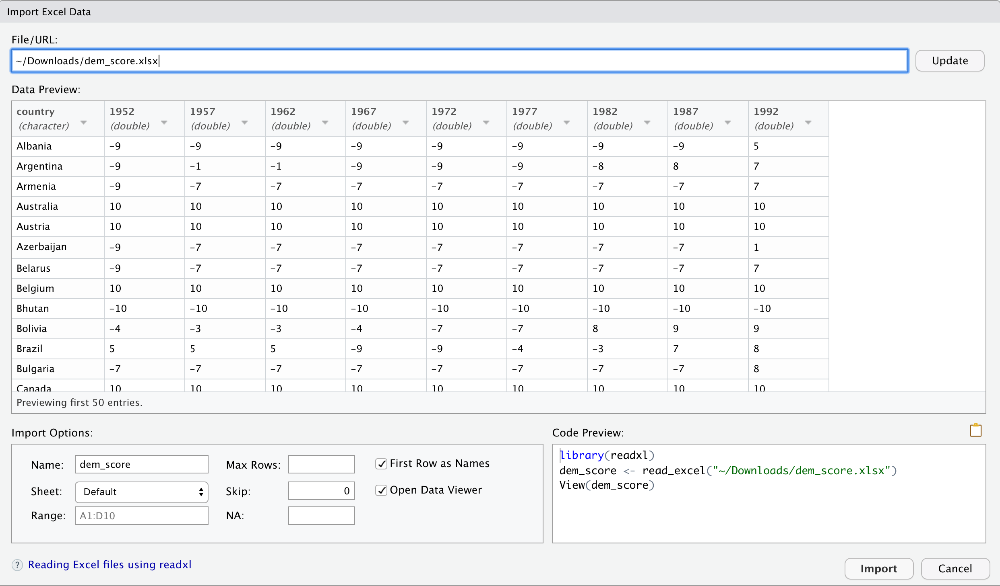
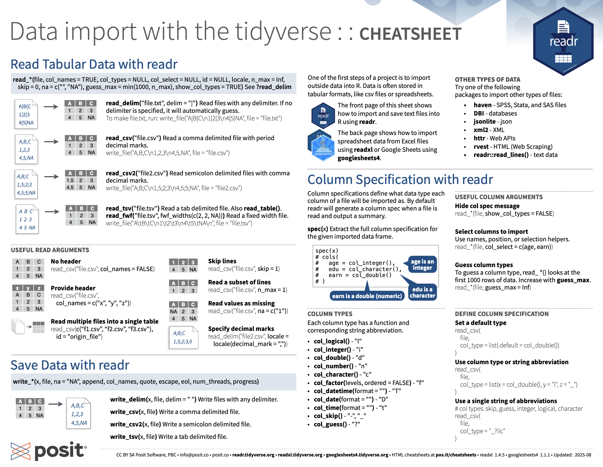
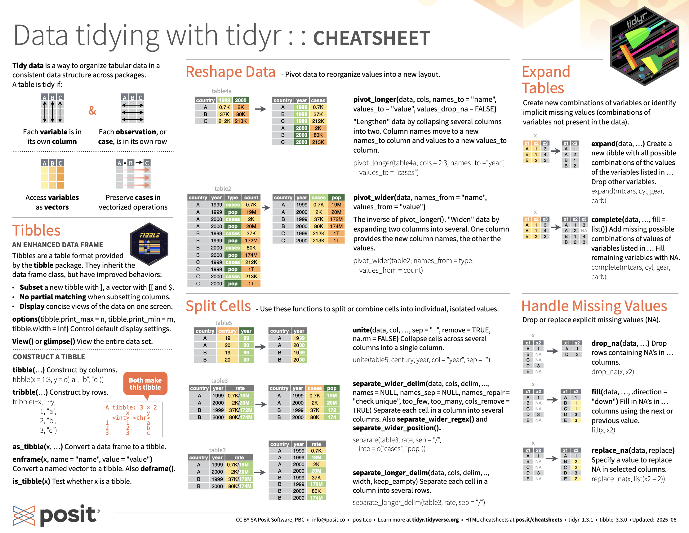
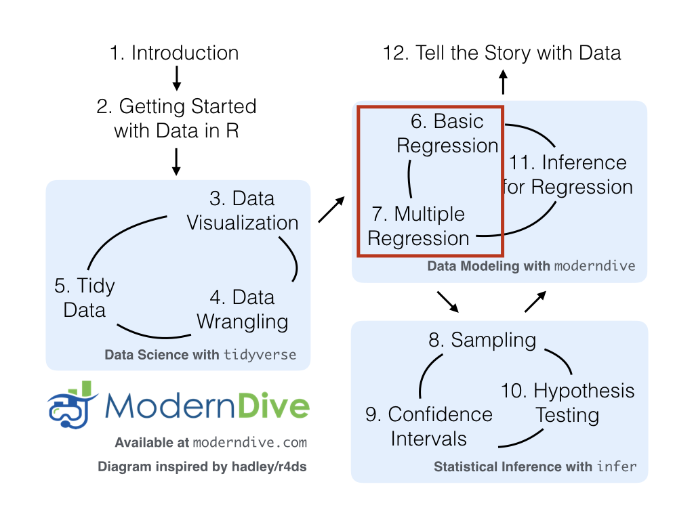

```{r setup-init, include=FALSE}
library(knitr)
source("scripts/image_functions.R")
```

# Data Importing and Tidy Data {#sec-tidy}

::: {.callout-note title="In this chapter, you'll learn how to:"}
- Recognize when a dataset is in *tidy format* (each variable a column, each observation a row)
- Convert a "wide" dataset to tidy format with `tidyr::pivot_longer()` (and back with `pivot_wider()`)
- Import spreadsheet data into R from CSV files using `readr::read_csv()`
- Identify the role of the `tidyverse` "umbrella" package
:::

```{r setup_tidy, include=FALSE, purl=FALSE}
# Used to define Learning Check numbers:
chap <- 4
lc <- 0

# Set R code chunk defaults:
opts_chunk$set(
  echo = TRUE,
  eval = TRUE,
  warning = FALSE,
  message = TRUE,
  tidy = FALSE,
  purl = TRUE,
  out.width = "\\textwidth",
#  fig.height = 4,
  fig.align = "center"
)

# Set output digit precision
options(scipen = 99, digits = 3)

# In kable printing replace all NA's with blanks
options(knitr.kable.NA = "")

# Set random number generator see value for replicable pseudo randomness.
set.seed(76)
```

In @sec-programming-concepts, we introduced the concept of a \index{data frame} data frame in R: a rectangular spreadsheet-like representation of data where the rows correspond to observations and the columns correspond to variables describing each observation.  In @sec-nycflights, we started exploring our first data frame: the `flights` data frame included in the `nycflights23` package. In @sec-viz, we created visualizations based on the data included in `flights` and other data frames such as `weather`. In @sec-wrangling, we learned how to take existing data frames and transform/modify them to suit our ends. 

In this final chapter of the "Data Science with `tidyverse`" portion of the book, we extend some of these ideas by discussing a type of data formatting called "tidy" data. You will see that having data stored in "tidy" format is about more than just what the everyday definition of the term "tidy" might suggest: having your data "neatly organized." Instead, we define the term "tidy" as it's used by data scientists who use R, outlining a set of rules by which data is saved.

Knowledge of this type of data formatting was not necessary for our treatment of data visualization in @sec-viz and data wrangling in @sec-wrangling. This is because all the data used were already in "tidy" format. In this chapter, we'll now see that this format is essential to using the tools we covered up until now. Furthermore, it will also be useful for all subsequent chapters in this book when we cover regression and statistical inference. First, however, we'll show you how to import spreadsheet data in R.

## Needed packages {.unnumbered #sec-tidy-packages}

Let's load all the packages needed for this chapter (this assumes you've already installed them). If needed, read @sec-packages for information on how to install and load R packages.

```{r tidy-load-packages, message=FALSE}
library(dplyr)
library(ggplot2)
library(readr)
library(tidyr)
library(nycflights23)
library(fivethirtyeight)
```

Note that when you load the `fivethirtyeight` package, you'll receive the following message:

> Some larger datasets need to be installed separately, like senators and house_district_forecast. To install these, we recommend you
install the fivethirtyeightdata package by running: install.packages('fivethirtyeightdata', repos =
'https://fivethirtyeightdata.github.io/drat/', type = 'source')

This message can be ignored for the purposes of this book, but if you'd like to explore these larger datasets, you can install the `fivethirtyeightdata` package as suggested.

```{r tidy-load-internal, message=FALSE, echo=FALSE, purl=FALSE}
# Packages needed internally, but not in text.
library(kableExtra)
library(stringr)
library(scales)
```


## Importing data {#sec-csv}

Up to this point, we've almost entirely used data stored inside of an R package. Say instead you have your own data saved on your computer or somewhere online. How can you analyze this data in R? Spreadsheet data is often saved in one of the following three formats:

First, a *Comma Separated Values* `.csv` \index{CSV file} file.  You can think of a `.csv` file as a bare-bones spreadsheet where:

* Each line in the file corresponds to one row of data/one observation.
* Values for each line are separated with commas. In other words, the values of different variables are separated by commas in each row.
* The first line is often, but not always, a *header* row indicating the names of the columns/variables.

Second, an Excel `.xlsx` spreadsheet file. This format is based on Microsoft's proprietary Excel software. As opposed to bare-bones `.csv` files, `.xlsx` Excel files contain a lot of meta-data\index{meta-data} (data about data). Recall we saw a previous example of meta-data in @sec-groupby when adding "group structure" meta-data to a data frame by using the `group_by()` verb. Some examples of Excel spreadsheet meta-data include the use of bold and italic fonts, colored cells, different column widths, and formula macros.

Third, a [Google Sheets](https://www.google.com/sheets/about/) file, which is a "cloud" or online-based way to work with a spreadsheet. Google Sheets allows you to download your data in both comma separated values `.csv` and Excel `.xlsx` formats. One way to import Google Sheets data in R is to go to the Google Sheets menu bar -> File -> Download as -> Select "Microsoft Excel" or "Comma-separated values" and then load that data into R. A more advanced way to import Google Sheets data in R is by using the [`googlesheets4`](https://googlesheets4.tidyverse.org/) package, a method we leave to a more advanced data science book.

We'll cover two methods for importing `.csv` and `.xlsx` spreadsheet data in R: one using the console and the other using RStudio's graphical user interface, abbreviated as "GUI."

### Using the console

First, let's import a Comma Separated Values `.csv` file that exists on the internet. The `.csv` file `dem_score.csv` contains ratings of the level of democracy in different countries spanning 1952 to 1992 and is accessible at <https://moderndive.com/data/dem_score.csv>. Let's use the `read_csv()` function from the `readr` \index{R packages!readr!read\_csv()} [@R-readr] package to read it off the web, import it into R, and save it in a data frame called `dem_score`.

```{r tidy-load-readr, message=FALSE, eval=FALSE}
library(readr)
dem_score <- read_csv("https://moderndive.com/data/dem_score.csv")
dem_score
```
```{r tidy-create-dem_score, message=FALSE, echo=FALSE, purl=FALSE}
dem_score <- read_csv("data/dem_score.csv")
dem_score
```

In this `dem_score` data frame, the minimum value of `-10` corresponds to a highly autocratic nation, whereas a value of `10` corresponds to a highly democratic nation. Note also that backticks surround the different variable names.  Variable names in R by default are not allowed to start with a number nor include spaces, but we can get around this fact by surrounding the column name with backticks. We'll revisit the `dem_score` data frame in a case study in the upcoming @sec-case-study-tidy.

Note that the `read_csv()` function included in the `readr` package is different than the `read.csv()` function that comes installed with R. While the difference in the names might seem trivial (an `_` instead of a `.`), the `read_csv()` function is, in our opinion, easier to use since it can more easily read data off the web and generally imports data at a much faster speed. Furthermore, the `read_csv()` function included in the `readr` saves data frames as `tibbles` by default. 


### Using RStudio's interface

Let's read in the exact same data, but this time from an Excel file saved on your computer. Furthermore, we'll do this using RStudio's graphical interface instead of running `read_csv()` in the console. First, download the Excel file `dem_score.xlsx` by going to <a href="https://moderndive.com/data/dem_score.xlsx" download>https://moderndive.com/data/dem_score.xlsx</a>, then

1. Go to the Files pane of RStudio.
2. Navigate to the directory (i.e., folder on your computer) where the downloaded `dem_score.xlsx` Excel file is saved. For example, this might be in your Downloads folder.
3. Click on `dem_score.xlsx`.
4. Click "Import Dataset..." 

At this point, you should see a screen pop-up like in @fig-read-excel. After clicking on the "Import" \index{RStudio!import data} button on the bottom right of @fig-read-excel, RStudio will save this spreadsheet's data in a data frame called `dem_score` and display its contents in the spreadsheet viewer. 

```{r fig-read-excel, fig.alt="Screenshot of RStudio's Import Dataset dialog showing the file preview and import options for an Excel spreadsheet.", echo=FALSE, fig.cap="Importing an Excel file to R.", purl=FALSE, out.width="100%"}

```

Furthermore, note the "Code Preview" block in the bottom right of @fig-read-excel. You can copy and paste this code to reload your data again later programmatically, instead of repeating this manual point-and-click process.


## Tidy data {#sec-tidy-data-ex}

Let's now switch gears and learn about the concept of "tidy" data format with a motivating example from the `fivethirtyeight` package. The `fivethirtyeight` package [@R-fivethirtyeight] provides access to the datasets used in many articles published by the data journalism website, [FiveThirtyEight.com](https://fivethirtyeight.com/). For a complete list of all `r nrow(data(package = "fivethirtyeight")[[3]]) - 1` datasets included in the `fivethirtyeight` package, check out the package webpage by going to: <https://fivethirtyeight-r.netlify.app/articles/fivethirtyeight.html>.\index{R packages!fivethirtyeight}

Let's focus our attention on the `drinks` data frame and look at its first 5 rows:

```{r tidy-demo-code, echo=FALSE, purl=FALSE}
drinks |>
  head(5)
```

After reading the help file by running `?drinks`, you'll see that `drinks` is a data frame containing results from a survey of the average number of servings of beer, spirits, and wine consumed in `r drinks |> nrow()` countries. This data was originally reported on FiveThirtyEight.com in Mona Chalabi's article: ["Dear Mona Followup: Where Do People Drink The Most Beer, Wine And Spirits?"](https://fivethirtyeight.com/features/dear-mona-followup-where-do-people-drink-the-most-beer-wine-and-spirits/).

Let's apply some of the data-wrangling verbs we learned in @sec-wrangling on the `drinks` data frame:

1. `filter()` to only consider 4 countries: the United States, China, Italy, and Saudi Arabia, *then*
1. `select()` all columns except `total_litres_of_pure_alcohol` by using the `-` sign, *then*
1. `rename()` `beer_servings`, `spirit_servings`, and `wine_servings` to `beer`, `spirit`, and `wine`, respectively.

and save the resulting data frame in `drinks_smaller`:

```{r tidy-create-drinks_smaller}
drinks_smaller <- drinks |> 
  filter(country %in% c("USA", "China", "Italy", "Saudi Arabia")) |> 
  select(-total_litres_of_pure_alcohol) |> 
  rename(beer = beer_servings, spirit = spirit_servings, wine = wine_servings)
drinks_smaller
```

Let's now ask ourselves a question: "Using the `drinks_smaller` data frame, how would we create the side-by-side barplot in @fig-drinks-smaller?". Recall we saw barplots displaying two categorical variables in @sec-two-categ-barplot.

```{r fig-drinks-smaller, fig.alt="Grouped barplot comparing servings per person of beer, spirits, and wine across the United States, China, Italy, and Saudi Arabia.", fig.cap="Comparing alcohol consumption in 4 countries.", fig.height=ifelse(knitr::is_latex_output(), 3.9, 4), echo=FALSE, purl=FALSE}
drinks_smaller_tidy <- drinks_smaller |>
  gather(type, servings, -country)
drinks_smaller_tidy_plot <- ggplot(
  drinks_smaller_tidy,
  aes(x = country, y = servings, fill = type)
) +
  geom_col(position = "dodge") +
  labs(x = "country", y = "servings")
if (is_html_output()) {
  drinks_smaller_tidy_plot
} else {
  drinks_smaller_tidy_plot + scale_fill_grey()
}
```

Let's break down the grammar of graphics we introduced in @sec-grammarofgraphics:

1. The categorical variable `country` with four levels (China, Italy, Saudi Arabia, USA) would have to be mapped to the `x`-position of the bars.
1. The numerical variable `servings` would have to be mapped to the `y`-position of the bars (the height of the bars).
1. The categorical variable `type` with three levels (beer, spirit, wine) would have to be mapped to the `fill` color of the bars.

Observe that `drinks_smaller` has three separate variables `beer`, `spirit`, and `wine`.  In order to use the `ggplot()` function to recreate the barplot in @fig-drinks-smaller however, we need a *single variable* `type` with three possible values: `beer`, `spirit`, and `wine`.  We could then map this `type` variable to the `fill` aesthetic of our plot.  In other words, to recreate the barplot in @fig-drinks-smaller, our data frame would have to look like this:

```{r tidy-show-drinks-smaller-tidy, purl=FALSE}
drinks_smaller_tidy
```

```{r tidy-create-n_row_drinks, echo=FALSE, purl=FALSE}
# This redundant code is used for dynamic non-static in-line text output purposes
n_row_drinks <- drinks_smaller_tidy |> nrow()
n_alcohol_types <- drinks_smaller_tidy |>
  select(type) |>
  n_distinct()
n_countries <- drinks_smaller_tidy |>
  select(country) |>
  n_distinct()
```

Observe that while `drinks_smaller` and `drinks_smaller_tidy` are both rectangular in shape and contain the same `r n_row_drinks` numerical values (`r n_alcohol_types` alcohol types by `r n_countries` countries), they are formatted differently. `drinks_smaller` is formatted in what's known as \index{wide data format} ["wide"](https://en.wikipedia.org/wiki/Wide_and_narrow_data) format, whereas `drinks_smaller_tidy` is formatted in what's known as ["long/narrow"](https://en.wikipedia.org/wiki/Wide_and_narrow_data#Narrow) format.

In the context of data science in R, long/narrow format \index{long data format} is also known as "tidy" format. In order to use the `ggplot2` and `dplyr` packages for data visualization and data wrangling, your input data frames *must* be in "tidy" format. Thus, all non-"tidy" data must be converted to "tidy" format first. Before we convert non-"tidy" data frames like `drinks_smaller` to "tidy" data frames like `drinks_smaller_tidy`, let's define "tidy" data.


### Definition of tidy data {#sec-tidy-definition}

You have surely heard the word "tidy" in your life:

* "Tidy up your room!"
* "Write your homework in a tidy way, so it is easier to provide feedback."
* Marie Kondo's best-selling book, [_The Life-Changing Magic of Tidying Up: The Japanese Art of Decluttering and Organizing_](https://www.powells.com/book/-9781607747307), and Netflix TV series [_Tidying Up with Marie Kondo_](https://www.netflix.com/title/80209379).

<!-- * "I am not by any stretch of the imagination a tidy person, and the piles of unread books on the coffee table and by my bed have a plaintive, pleading quality to me - 'Read me, please!'" - Linda Grant -->

What does it mean for your data to be "tidy"? While "tidy" has a clear English meaning of "organized," the word "tidy" in data science using R means that your data follows a standardized format. We will follow Hadley Wickham's \index{Wickham, Hadley} British English definition of *"tidy" data* \index{tidy data} [@tidy] shown also in @fig-tidyfig:

> A *dataset* is a collection of values, usually either numbers (if quantitative) or strings AKA text data (if qualitative/categorical). Values are organised in two ways. Every value belongs to a variable and an observation. A variable contains all values that measure the same underlying attribute (like height, temperature, duration) across units. An observation contains all values measured on the same unit (like a person, or a day, or a city) across attributes.
> 
> "Tidy" data is a standard way of mapping the meaning of a dataset to its structure. A dataset is messy or tidy depending on how rows, columns and tables are matched up with observations, variables and types. In *tidy data*:
>
> 1. Each variable forms a column.
> 2. Each observation forms a row.
> 3. Each type of observational unit forms a table.


```{r fig-tidyfig, fig.alt="Visual definition of tidy data: each variable forms a column, each observation forms a row, each observational unit is its own table.", echo=FALSE, fig.cap="Tidy data graphic from *R for Data Science*.", out.width="80%", purl=FALSE}
include_graphics("images/r4ds/tidy-1.png")
```

For example, say you have the following table of stock prices in @tbl-non-tidy-stocks:

```{r tbl-non-tidy-stocks, echo=FALSE, purl=FALSE}
stocks <- tibble(
  Date = as.Date("2009-01-01") + 0:4,
  `Boeing stock price` = paste("$", c("173.55", "172.61", "173.86", "170.77", "174.29"), sep = ""),
  `Amazon stock price` = paste("$", c("174.90", "171.42", "171.58", "173.89", "170.16"), sep = ""),
  `Google stock price` = paste("$", c("174.34", "170.04", "173.65", "174.87", "172.19"), sep = "")
) |>
  slice(1:2)
stocks |>
  kbl(
    digits = 2,
    caption = "Stock prices (non-tidy format)",
    booktabs = TRUE,
    linesep = ""
  ) |>
  kable_styling(
    font_size = ifelse(is_latex_output(), 8, 16),
    latex_options = c("HOLD_position")
  )
```

<!--
Although the data are organized in a rectangular spreadsheet-type format, they do not follow the definition of data being "tidy". While there are 3 variables corresponding to 3 unique pieces of information (date, stock name, and stock price), there are not three columns. In "tidy" data format, each variable is its own column, as shown in @tbl-tidy-stocks. Both tables present the same information, but in different formats. 
-->

Although the data is in a rectangular spreadsheet format, it is not "tidy." There are three variables (date, stock name, and stock price), but not three separate columns. In tidy data, each variable should have its own column, as shown in @tbl-tidy-stocks. Both tables present the same information, but in different formats.

```{r tbl-tidy-stocks, echo=FALSE, purl=FALSE}
stocks_tidy <- stocks |>
  rename(
    Boeing = `Boeing stock price`,
    Amazon = `Amazon stock price`,
    Google = `Google stock price`
  ) |>
  #  gather(`Stock name`, `Stock price`, -Date)
  pivot_longer(
    cols = -Date,
    names_to = "Stock Name",
    values_to = "Stock Price"
  )
stocks_tidy |>
  kbl(
    digits = 2,
    caption = "Stock prices (tidy format)",
    booktabs = TRUE,
    linesep = ""
  ) |>
  kable_styling(
    font_size = ifelse(is_latex_output(), 8, 16),
    latex_options = c("HOLD_position")
  )
```

On the other hand, consider the data in @tbl-tidy-stocks-2.

```{r tbl-tidy-stocks-2, echo=FALSE, purl=FALSE}
stocks <- tibble(
  Date = as.Date("2009-01-01") + 0:4,
  `Boeing Price` = paste("$", c("173.55", "172.61", "173.86", "170.77", "174.29"), sep = ""),
  `Weather` = c("Sunny", "Overcast", "Rain", "Rain", "Sunny")
) |>
  slice(1:2)
stocks |>
  kbl(
    digits = 2,
    caption = "Example of tidy data",
    booktabs = TRUE
  ) |>
  kable_styling(
    font_size = ifelse(is_latex_output(), 8, 16),
    latex_options = c("HOLD_position")
  )
```

In this case, even though the variable "Boeing Price" occurs just like in our non-"tidy" data in @tbl-non-tidy-stocks, the data *is* "tidy" since there are three variables for each of three unique pieces of information: Date, Boeing price, and the Weather that day.

::: {.learncheck}
**Learning Check**

**`r paste0("(LC", chap, ".", (lc <- lc + 1), ")")`** What are common characteristics of "tidy" data frames?

**`r paste0("(LC", chap, ".", (lc <- lc + 1), ")")`** What makes "tidy" data frames useful for organizing data?


:::

### Converting to tidy data

In this book so far, you've only seen data frames that were already in "tidy" format. Furthermore, for the rest of this book, you'll mostly only see data frames that are already in "tidy" format as well. This is not always the case however with all datasets in the world. If your original data frame is in wide (non-"tidy") format and you would like to use the `ggplot2` or `dplyr` packages, you will first have to convert it to "tidy" format. To do so, we recommend using the \index{R packages!tidyr!pivot\_longer()} `pivot_longer()` function in the `tidyr` \index{R packages!tidyr} package [@R-tidyr]. 

Going back to our `drinks_smaller` data frame from earlier:

```{r tidy-v9}
drinks_smaller
```

We convert it to "tidy" format by using the `pivot_longer()` function from the `tidyr` package as follows:

```{r tidy-pivot-longer}
drinks_smaller_tidy <- drinks_smaller |>
  pivot_longer(names_to = "type",
               values_to = "servings",
               cols = -country)
drinks_smaller_tidy
```

::: {.callout-tip collapse="true" title="Try it interactively"}
```{webr-r}
drinks_smaller <- drinks |>
  filter(country %in% c("USA", "China", "Italy", "Saudi Arabia")) |>
  select(-total_litres_of_pure_alcohol) |>
  rename(beer = beer_servings, spirit = spirit_servings, wine = wine_servings)
drinks_smaller |>
  pivot_longer(names_to = "type",
               values_to = "servings",
               cols = -country)
```
:::

We set the arguments to `pivot_longer()` as follows:

1. `names_to` here corresponds to the name of the variable in the new "tidy"/long data frame that will contain the *column names* of the original data. Observe how we set `names_to = "type"`. In the resulting `drinks_smaller_tidy`, the column `type` contains the three types of alcohol `beer`, `spirit`, and `wine`. Since `type` is a variable name that doesn't appear in `drinks_smaller`, we use quotation marks around it. You'll receive an error if you just use `names_to = type` here.
1. `values_to` here is the name of the variable in the new "tidy" data frame that will contain the *values* of the original data. Observe how we set `values_to = "servings"` since each of the numeric values in each of the `beer`, `wine`, and `spirit` columns of the `drinks_smaller` data corresponds to a value of `servings`. In the resulting `drinks_smaller_tidy`, the column `servings` contains the `r n_countries` $\times$ `r n_alcohol_types` = `r n_row_drinks` numerical values. Note again that `servings` doesn't appear as a variable in `drinks_smaller` so it again needs quotation marks around it for the `values_to` argument.
1. The third argument `cols` is the columns in the `drinks_smaller` data frame you either want to or don't want to "tidy." Observe how we set this to `-country` indicating that we don't want to "tidy" the `country` variable in `drinks_smaller` and rather only `beer`, `spirit`, and `wine`. Since `country` is a column that appears in `drinks_smaller` we don't put quotation marks around it.

The third argument here of `cols` is a little nuanced, so let's consider code that's written slightly differently but that produces the same output: 

```{r tidy-pivot-longer2, eval=FALSE}
drinks_smaller |>
  pivot_longer(names_to = "type",
               values_to = "servings",
               cols = c(beer, spirit, wine))
```

::: {.callout-tip collapse="true" title="Try it interactively"}
```{webr-r}
drinks_smaller <- drinks |>
  filter(country %in% c("USA", "China", "Italy", "Saudi Arabia")) |>
  select(-total_litres_of_pure_alcohol) |>
  rename(beer = beer_servings, spirit = spirit_servings, wine = wine_servings)
drinks_smaller |>
  pivot_longer(names_to = "type",
               values_to = "servings",
               cols = c(beer, spirit, wine))
```
:::

Note that the third argument now specifies which columns we want to "tidy" with `c(beer, spirit, wine)`, instead of the columns we don't want to "tidy" using `-country`. We use the `c()` function to create a vector of the columns in `drinks_smaller` that we'd like to "tidy." Note that since these three columns appear one after another in the `drinks_smaller` data frame, we could also do the following for the `cols` argument:

```{r tidy-pivot-longer2-dup1, eval=FALSE}
drinks_smaller |> 
  pivot_longer(names_to = "type", 
               values_to = "servings", 
               cols = beer:wine)
```

With our `drinks_smaller_tidy` "tidy" formatted data frame, we can now produce the barplot you saw in @fig-drinks-smaller using `geom_col()`. This is done in @fig-drinks-smaller-tidy-barplot. Recall from @sec-geombar on barplots that we use `geom_col()` and not `geom_bar()`, since we would like to map the "pre-counted" `servings` variable to the `y`-aesthetic of the bars.

```{r tidy-bar, eval=FALSE}
ggplot(drinks_smaller_tidy, aes(x = country, y = servings, fill = type)) +
  geom_col(position = "dodge")
```


```{r fig-drinks-smaller-tidy-barplot, fig.alt="Same grouped barplot of alcohol consumption by country, now produced from the tidy-format data using geom_col() instead of geom_bar().", echo=FALSE, fig.cap="Comparing alcohol consumption in `r n_countries` countries using geom_col().", fig.height=ifelse(knitr::is_latex_output(), 2.5, 4), purl=FALSE}
if (is_html_output()) {
  drinks_smaller_tidy_plot
} else {
  drinks_smaller_tidy_plot + scale_fill_grey()
}
```

Converting "wide" format data to "tidy" format often confuses new R users. The only way to learn to get comfortable with the `pivot_longer()` function is with practice, practice, and more practice using different datasets. For example, run `?pivot_longer` and look at the examples in the bottom of the help file. We'll show another example of using `pivot_longer()` to convert a "wide" formatted data frame to "tidy" format in @sec-case-study-tidy. 

If however you want to convert a "tidy" data frame to "wide" format, you will need to use the `pivot_wider()`\index{R packages!tidyr!pivot\_wider()} function instead. Run `?pivot_wider` and look at the examples in the bottom of the help file for examples.

You can also view examples of both `pivot_longer()` and `pivot_wider()` on the [tidyverse.org](https://tidyr.tidyverse.org/dev/articles/pivot.html#pew) webpage. There's a nice example to check out the different functions available for data tidying and a case study using data from the World Health Organization on that webpage. Furthermore, each week the R4DS Online Learning Community posts a dataset in the weekly [`#`TidyTuesday event](https://github.com/rfordatascience/tidytuesday) that might serve as a nice place for you to find other data to explore and transform. 

::: {.learncheck}
**Learning Check**

**`r paste0("(LC", chap, ".", (lc <- lc + 1), ")")`** Take a look at the `airline_safety` data frame included in the `fivethirtyeight` data package. Run the following:

```{r tidy-demo-code-v2, eval=FALSE, purl=FALSE}
airline_safety
```

After reading the help file by running `?airline_safety`, we see that `airline_safety` is a data frame containing information on different airline companies' safety records. This data was originally reported on the data journalism website, FiveThirtyEight.com, in Nate Silver's article, ["Should Travelers Avoid Flying Airlines That Have Had Crashes in the Past?"](https://fivethirtyeight.com/features/should-travelers-avoid-flying-airlines-that-have-had-crashes-in-the-past/). Let's only consider the variables `airline` and those relating to fatalities for simplicity:

```{r tidy-create-airline_safety_sma}
airline_safety_smaller <- airline_safety |> 
  select(airline, starts_with("fatalities"))
airline_safety_smaller
```

This data frame is not in "tidy" format. How would you convert this data frame to be in "tidy" format, in particular so that it has a variable `fatalities_years` indicating the incident year and a variable `count` of the fatality counts?

:::

### `nycflights23` package

Recall the `nycflights23` package  we introduced in @sec-nycflights with data about all domestic flights departing from New York City in 2023. Let's revisit the `flights` data frame by running `View(flights)`. We saw that `flights` has a rectangular shape, with each of its `r flights |> nrow() |> comma()` rows corresponding to a flight and each of its `r flights |> ncol()` columns corresponding to different characteristics/measurements of each flight. This satisfied the first two criteria of the definition of "tidy" data from @sec-tidy-definition: that "Each variable forms a column" and "Each observation forms a row." But what about the third property of "tidy" data that "Each type of observational unit forms a table"?

Recall that we saw in @sec-exploredataframes that the observational unit for the `flights` data frame is an individual flight. In other words, the rows of the `flights` data frame refer to characteristics/measurements of individual flights. Also included in the `nycflights23` package are other data frames with their rows representing different observational units [@R-nycflights23]:

* `airlines`: translation between two letter IATA carrier codes and airline company names (`r airlines |> nrow()` in total). The observational unit is an airline company.
* `planes`: aircraft information about each of `r planes |> nrow() |> comma()` planes used, i.e., the observational unit is an aircraft.
* `weather`: hourly meteorological data (about `r weather |> count(origin) |> pull(n) |> mean() |> round() |> comma()` observations) for each of the three NYC airports, i.e., the observational unit is an hourly measurement of weather at one of the three airports.
* `airports`: airport names and locations. The observational unit is an airport.

The organization of the information into these five data frames follows the third "tidy" data property: observations corresponding to the same observational unit should be saved in the same table, i.e., data frame. You could think of this property as the old English expression: "birds of a feather flock together." 


## Case study: democracy in Guatemala {#sec-case-study-tidy}

In this section, we'll show you another example of how to convert a data frame that isn't in "tidy" format ("wide" format) to a data frame that is in "tidy" format ("long/narrow" format). We'll do this using the `pivot_longer()` function from the `tidyr` package again. 

Furthermore, we'll make use of functions from the `ggplot2` and `dplyr` packages to produce a *time-series plot* showing how the democracy scores have changed over the 40 years from 1952 to 1992 for Guatemala. Recall that we saw time-series plots in @sec-linegraphs on creating linegraphs using `geom_line()`. 

Let's use the `dem_score` data frame we imported in @sec-csv, but focus on only data corresponding to Guatemala.

```{r tidy-create-guat_dem}
guat_dem <- dem_score |> 
  filter(country == "Guatemala")
guat_dem
```

Let's lay out the grammar of graphics we saw in @sec-grammarofgraphics. 

First we know we need to set `data = guat_dem` and use a `geom_line()` layer, but what is the aesthetic mapping of variables? We'd like to see how the democracy score has changed over the years, so we need to map:

* `year` to the x-position aesthetic and
* `democracy_score` to the y-position aesthetic

Now we are stuck in a predicament, much like with our `drinks_smaller` example in @sec-tidy-data-ex. We see that we have a variable named `country`, but its only value is `"Guatemala"`.  We have other variables denoted by different year values.  Unfortunately, the `guat_dem` data frame is not "tidy" and hence is not in the appropriate format to apply the grammar of graphics, and thus we cannot use the `ggplot2` package just yet.  

We need to take the values of the columns corresponding to years in `guat_dem` and convert them into a new "names" variable called `year`. Furthermore, we need to take the democracy score values in the inside of the data frame and turn them into a new "values" variable called `democracy_score`. Our resulting data frame will have three columns:  `country`, `year`, and `democracy_score`. Recall that the `pivot_longer()` function in the `tidyr` package does this for us:

```{r tidy-pivot-longer2-dup2}
guat_dem_tidy <- guat_dem |> 
  pivot_longer(names_to = "year", 
               values_to = "democracy_score", 
               cols = -country,
               names_transform = list(year = as.integer)) 
guat_dem_tidy
```

We set the arguments to `pivot_longer()` as follows:

1. `names_to` is the name of the variable in the new "tidy" data frame that will contain the *column names* of the original data. Observe how we set `names_to = "year"`.  In the resulting `guat_dem_tidy`, the column `year` contains the years where Guatemala's democracy scores were measured.
1. `values_to` is the name of the variable in the new "tidy" data frame that will contain the *values* of the original data. Observe how we set `values_to = "democracy_score"`. In the resulting `guat_dem_tidy` the column `democracy_score` contains the 1 $\times$ 9 = 9 democracy scores as numeric values.
1. The third argument is the columns you either want to or don't want to "tidy." Observe how we set this to `cols = -country` indicating that we don't want to "tidy" the `country` variable in `guat_dem` and rather only variables `1952` through `1992`. 
1. The last argument of `names_transform` tells R what type of variable `year` should be set to. Without specifying that it is an `integer` as we've done here, `pivot_longer()` will set it to be a character value by default.

We can now create the time-series plot in @fig-guat-dem-tidy to visualize how democracy scores in Guatemala have changed from 1952 to 1992 using a \index{R packages!ggplot2!geom\_line()} `geom_line()`. Furthermore, we'll use the `labs()` function in the `ggplot2` package to add informative labels to all the `aes()`thetic attributes of our plot, in this case the `x` and `y` positions.

```{r fig-guat-dem-tidy, fig.alt="Line graph of Guatemala's democracy score from 1952 to 1992 — the score remains low and negative through most of the period, with a sharp rise toward zero in the early 1990s.", fig.cap="Democracy scores in Guatemala 1952-1992.", fig.height=ifelse(knitr::is_latex_output(), 3, 4)}
ggplot(guat_dem_tidy, aes(x = year, y = democracy_score)) +
  geom_line() +
  labs(x = "Year", y = "Democracy Score")
```

Note that if we forgot to include the `names_transform` argument specifying that `year` was not of character format, we would have gotten an error here since `geom_line()` wouldn't have known how to sort the character values in `year` in the right order. 

::: {.learncheck}
**Learning Check**

**`r paste0("(LC", chap, ".", (lc <- lc + 1), ")")`**  Convert the `dem_score` data frame into
a "tidy" data frame and assign the name of `dem_score_tidy` to the resulting long-formatted data frame.

**`r paste0("(LC", chap, ".", (lc <- lc + 1), ")")`**  Read in the life expectancy data stored at <https://moderndive.com/data/le_mess.csv> and convert it to a "tidy" data frame. 

:::

## `tidyverse` package {#sec-tidyverse-package}

Notice at the beginning of the chapter we loaded the following four packages, which are among four of the most frequently used R packages for data science:

```{r tidy-example-load-packages-2, eval=FALSE, purl=FALSE}
library(ggplot2)
library(dplyr)
library(readr)
library(tidyr)
```

Recall that `ggplot2` is for data visualization, `dplyr` is for data wrangling, `readr` is for importing spreadsheet data into R, and `tidyr` is for converting data to "tidy" format. There is a much quicker way to load these packages than by individually loading them: by installing and loading the `tidyverse` package. The `tidyverse` package acts as an "umbrella" package whereby installing/loading it will install/load multiple packages at once for you. 

After installing the `tidyverse` package as you would a normal package as seen in @sec-packages, running:

```{r tidy-load-tidyverse, eval=FALSE, purl=FALSE}
library(tidyverse)
```

would be the same as running:

```{r tidy-example-load-packages-3, eval=FALSE, purl=FALSE}
library(ggplot2)
library(dplyr)
library(readr)
library(tidyr)
library(purrr)
library(tibble)
library(stringr)
library(forcats)
```

The `purrr`, `tibble`, `stringr`, and `forcats` are left for a more advanced book; check out [*R for Data Science*](http://r4ds.had.co.nz/) to learn about these packages.

For the remainder of this book, we'll start every chapter by running `library(tidyverse)`, instead of loading the various component packages individually. The `tidyverse` "umbrella" package gets its name from the fact that all the functions in all its packages are designed to have common inputs and outputs: data frames are in "tidy" format. This standardization of input and output data frames makes transitions between different functions in the different packages as seamless as possible. For more information, check out the [tidyverse.org](https://www.tidyverse.org/) webpage for the package.


## Quick checks {.unnumbered}

Ten questions to assess your understanding. Several are designed around common misconceptions — read each option carefully before peeking at the answer.

**Q1.** A dataset is in *tidy* format when:

a. It has no missing values
b. Each variable is a column, each observation is a row, each observational unit has its own table
c. The data is sorted alphabetically
d. The column names are in lowercase

::: {.callout-tip collapse="true" title="Show answer"}
**(b)** Tidy data is about *structure*, not contents. Wickham's three rules are: variables in columns, observations in rows, observational units in their own tables. Tidy is unrelated to whether data is "clean" (free of errors or missing values).
:::

**Q2.** What does `pivot_longer()` do?

a. Sorts a data frame by the longest column
b. Adds new columns to a data frame
c. Reshapes data from wide format to long/tidy format
d. Joins two data frames

::: {.callout-tip collapse="true" title="Show answer"}
**(c)** `pivot_longer()` collapses multiple columns into key/value pairs, producing a longer (and usually tidier) data frame. The inverse is `pivot_wider()`.
:::

**Q3.** When would you use `read_csv()` instead of base R's `read.csv()`?

a. When the file is very small
b. When you want a `tibble` and faster, more predictable parsing
c. Only when the file is online
d. They are exactly equivalent

::: {.callout-tip collapse="true" title="Show answer"}
**(b)** `readr::read_csv()` returns a `tibble`, doesn't auto-convert strings to factors, gives clearer messages, and is faster on large files.
:::

**Q4.** A data frame has columns `country`, `1990`, `1995`, `2000`, `2005` — population values per country per year. Why is this **NOT** tidy?

a. Column names cannot start with numbers
b. The years should be *values* of a `year` variable, not *names* of separate columns
c. The country values are repeated
d. It's missing a primary key

::: {.callout-tip collapse="true" title="Show answer"}
**(b)** Variables (here, `year` and `population`) belong in their own columns. Encoding `year` in *column names* means the year variable is hidden in metadata. `pivot_longer(cols = -country, names_to = "year", values_to = "population")` fixes it.
:::

**Q5.** When using `pivot_longer()`, what does the `names_to` argument refer to?

a. The new column that will hold the OLD column names
b. The names of variables to drop
c. The destination file name
d. The package to load

::: {.callout-tip collapse="true" title="Show answer"}
**(a)** `names_to` names the *new* column that will receive the values currently sitting in the *names* of the columns being pivoted. (`values_to` names the new column that holds the cell values.) The naming is symmetric: `names_to` ↔ from old column NAMES; `values_to` ↔ from old column VALUES.
:::

**Q6.** After `pivot_longer()`, the resulting data frame typically has:

a. Fewer rows and more columns
b. More rows and fewer columns
c. The same dimensions
d. An error

::: {.callout-tip collapse="true" title="Show answer"}
**(b)** That's why it's called "longer" — many columns become two columns (key + value), and each row's data spreads across multiple new rows.
:::

**Q7.** `read_csv("data.csv")` errors with `could not find function "read_csv"`. The most likely cause is:

a. The file `data.csv` doesn't exist
b. The `readr` package isn't loaded — you need `library(readr)` (or `library(tidyverse)`)
c. The file is corrupted
d. RStudio is broken

::: {.callout-tip collapse="true" title="Show answer"}
**(b)** "Could not find function" almost always means the *package* isn't loaded, not that the file is wrong. Note the specific error message — it's about the function, not the file.
:::

**Q8.** A dataset has `name` (string), `age` (number), and `is_student` (TRUE/FALSE). How many *variables* and *observations* does ONE row represent?

a. 3 variables and 1 observation
b. 1 variable and 3 observations
c. 0 variables and 3 observations
d. Depends on the data

::: {.callout-tip collapse="true" title="Show answer"}
**(a)** A row is one observation; columns are variables. "Wide" vs "tidy" is about how variables are arranged, not how observations are counted.
:::

**Q9.** Is "wide format" always wrong?

a. Yes — only tidy is acceptable
b. No — wide formats are often easier for humans to read (think of a spreadsheet with one row per country and a column per year); tidy is required for `dplyr`/`ggplot2` workflows
c. Yes — wide formats can't be analyzed
d. Wide formats only work in Excel

::: {.callout-tip collapse="true" title="Show answer"}
**(b)** Tidy is the right format for tidyverse-style analysis, but wide can be more readable and is sometimes required by other tools. The skill is knowing when to pivot between them.
:::

**Q10.** `library(tidyverse)` loads which packages (among others)?

a. `ggplot2`, `dplyr`, `tidyr`, `readr`, `purrr`, `tibble`, `stringr`, `forcats`
b. Just `ggplot2`
c. Only base R
d. `bookdown`

::: {.callout-tip collapse="true" title="Show answer"}
**(a)** `tidyverse` is an "umbrella" package that loads the eight core tidyverse packages in one call. It's a convenience, not a separate code library — the actual functions still live in the individual packages.
:::

::: {.callout-tip title="Chapter cheatsheet"}

| Function | What it does | Quick example |
|---|---|---|
| `read_csv("path")` | Read a CSV (returns a tibble) | `read_csv("https://moderndive.com/data/dem_score.csv")` |
| `pivot_longer(cols, names_to, values_to)` | Reshape wide → long (tidy) | `df |> pivot_longer(cols = -country, names_to = "year", values_to = "score")` |
| `pivot_wider(names_from, values_from)` | Reshape long → wide (the inverse) | `df_tidy |> pivot_wider(names_from = year, values_from = score)` |
| `library(tidyverse)` | Load `ggplot2`, `dplyr`, `tidyr`, `readr`, and friends in one call | `library(tidyverse)` |

:::

## Exercises {.unnumbered #sec-tidy-exercises}

The end-of-chapter exercises ask you to apply the chapter's ideas to a new dataset: `bob_ross` from the [`fivethirtyeight`](https://fivethirtyeight-r.netlify.app/) package. \index{R packages!fivethirtyeight!bob\_ross} Each row is one episode of *The Joy of Painting* (1983–1994); each of the 67 element columns is a `0/1` indicator for whether a given object (mountain, cabin, tree, …) appeared in that episode. The dataset is a textbook example of *wide* format — making it a perfect playground for `pivot_longer()` and `pivot_wider()`.

Difficulty is signaled with stars: ★ warm-up, ★★ standard application, ★★★ critical thinking.

You can run code in the WebR cells right beneath each prompt — no installation needed. Solutions are available to instructors separately.

```{webr-r}
#| context: setup
source("https://raw.githubusercontent.com/moderndive/ModernDive_book/v2/scripts/webr-shadow-library.R")
library(dplyr)
library(tidyr)
library(ggplot2)
library(readr)
library(fivethirtyeight)
library(olympicAthletes)   # loads olympic_athletes, editions, medal_table

# Section 4.3 case study uses `dem_score` (CSV mirror — not in any preloaded package).
# Base R read.csv: webR's readr::read_csv hangs on remote URLs (works fine locally).
dem_score <- read.csv(
  "https://raw.githubusercontent.com/moderndive/ModernDive_book/v2/data/dem_score.csv"
)

# Long form of bob_ross used by EX 4.11 — pivots the 67 indicator columns into
# (element, present) rows so nrow(bob_long) == 403 * 67 == 26949.
bob_long <- bob_ross |>
  pivot_longer(cols = -c(episode, season, episode_num, title),
               names_to = "element", values_to = "present")
```

Difficulty stars: ★ warm-up, ★★ standard application, ★★★ critical thinking. Solutions are available to instructors separately.

```{r}
#| label: ch4-exercises
#| results: asis
#| echo: false
#| message: false
source(if (file.exists("scripts/exercise_helpers.R")) "scripts/exercise_helpers.R" else "../scripts/exercise_helpers.R")
cat(render_chapter_exercises(4))
```

## Conclusion {#sec-tidy-data-conclusion}

### Additional resources

```{r tidy-conditional-text, echo=FALSE, results="asis", purl=FALSE}
if (is_latex_output()) {
  cat("Solutions to all *Learning checks* can be found in the Appendices of the online version of the book. The Appendices start at <https://moderndive.com/v2/appendixa>.")
}
```

```{r tidy-v22, echo=FALSE, purl=FALSE, results="asis"}
generate_r_file_link("04-tidy.R")
```

If you want to learn more about using the `readr` and `tidyr` package, we suggest that you check out RStudio's "Data Import Cheat Sheet." In the current version of RStudio in mid-2025, you can access this cheatsheet by going to the RStudio Menu Bar -> Help -> Cheat Sheets -> "Browse Cheat Sheets..." -> Scroll down the page to the "Data import with reader, readxl, and googlesheets4..." for information on using the `readr`, `readxl` and `googlesheets4` packages to import data and the "Data tidying with tidyr cheatsheet" for information on using the `tidyr` package to "tidy" data. `r if(is_html_output()) "You can see a preview of both cheatsheets in the figures below."`

```{r fig-import-cheatsheet, fig.alt="First page of RStudio's official cheatsheet for importing data: visual reference for the readr, readxl, and googlesheets4 packages.", echo=FALSE, fig.cap="Data Import cheatsheet (first page): readr package.", out.width="66%", purl=FALSE}
if (is_html_output()) {
  
}
```

```{r fig-tidyr-cheatsheet, fig.alt="First page of RStudio's official tidyr cheatsheet: visual reference for pivot_longer(), pivot_wider(), and related reshape verbs.", echo=FALSE, fig.cap="Data Tidying cheatsheet (first page): tidyr package.", out.width="66%", purl=FALSE}
if (is_html_output()) {
  
}
```


### What's to come?

Congratulations! You've completed the "Data Science with `tidyverse`" portion of this book. We'll now move to the "Statistical modeling with moderndive" portion of this book in @sec-regression and @sec-multiple-regression, where you'll leverage your data visualization and wrangling skills to model relationships between different variables in data frames. 

However, we're going to leave @sec-inference-for-regression on "Inference for Regression" until after we've covered statistical inference in @sec-sampling, @sec-confidence-intervals, and @sec-hypothesis-testing. Onwards and upwards into Statistical/Data Modeling as shown in @fig-part2!


```{r fig-part2, fig.alt="Flowchart graphic transitioning from the Data Science with tidyverse part of the book to the Statistical Modeling with moderndive part next.", echo=FALSE, fig.cap="*ModernDive* flowchart – on to Part II!", out.width="50%", purl=FALSE}

```
