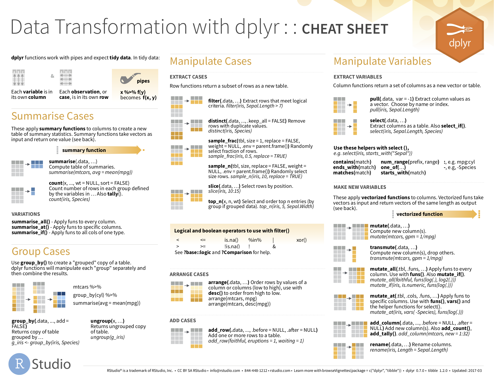

# Data Wrangling {#wrangling}

```{r setup_wrangling, include=FALSE, purl=FALSE}
chap <- 4
lc <- 0
rq <- 0
# **`r paste0("(LC", chap, ".", (lc <- lc + 1), ")")`**
# **`r paste0("(RQ", chap, ".", (rq <- rq + 1), ")")`**

knitr::opts_chunk$set(
  tidy = FALSE, 
  out.width = '\\textwidth', 
  fig.height = 4,
  fig.align='center',
  warning = FALSE
)

options(scipen = 99, digits = 3)

# In knitr::kable printing replace all NA's with blanks
options(knitr.kable.NA = '')

# Set random number generator see value for replicable pseudorandomness. Why 76?
# https://www.youtube.com/watch?v=xjJ7FheCkCU
set.seed(76)
```

So far in our journey, we've seen how to look at data saved in data frames using the `glimpse()` and `View()` functions in Chapter \@ref(getting-started) on and how to create data visualizations using the `ggplot2` package in Chapter \@ref(viz). In particular we studied what we term the "five named graphs" (5NG):

1. scatterplots via `geom_point()`
1. linegraphs via `geom_line()`
1. boxplots via `geom_boxplot()`
1. histograms via `geom_histogram()`
1. barplots via `geom_bar()` or `geom_col()`

We created these visualizations using the "Grammar of Graphics", which maps variables in a data frame to the aesthetic attributes of one the above 5 `geom`etric objects. We can also control other aesthetic attributes of the geometric objects such as the size and color as seen in the Gapminder data example in Figure \@ref(fig:gapminder). 

Recall however in Section \@ref(whats-to-come-3) we discussed that for two of our visualizations we needed transformed/modified versions of existing data frames. Recall for example the scatterplot of departure and arrival delay *only* for Alaska Airlines flights. In order to create this visualization, we needed to first pare down the `flights` data frame to a new data frame `alaska_flights` consisting of only `carrier == "AS"` flights using the `filter()` function.

```{r, eval=FALSE}
alaska_flights <- flights %>% 
  filter(carrier == "AS")

ggplot(data = alaska_flights, mapping = aes(x = dep_delay, y = arr_delay)) + 
  geom_point()
```

In this chapter, we'll introduce a series of functions from the `dplyr` package that will allow you to take a data frame and

1. `filter()` its existing rows to only pick out a subset of them. For example, the `alaska_flights` data frame above.
1. `summarize()` one of its columns/variables with a *summary statistic*. Examples include the median and interquartile range of temperatures as we saw in Section \@ref(boxplots) on boxplots. 
1. `group_by()` its rows. In other words assign different rows to be part of the same *group* and report summary statistics for each group separately. For example, say perhaps you don't want a single overall average departure delay `dep_delay` for all three `origin` airports combined, but rather three separate average departure delays, one for each of the three `origin` airports.
1. `mutate()` its existing columns/variables to create new ones. For example, convert hourly temperature recordings from &deg;F to &deg;C.
1. `arrange()` its rows. For example, sort the rows of `weather` in ascending or descending order of `temp`.
1. `join()` it with another data frame by matching along a "key" variable. In other words, merge these two data frames together.

Notice how we used `computer code` font to describe the actions we want to take on our data frames. This is because the `dplyr` package for data wrangling that we'll introduce in this chapter has intuitively verb-named functions that are easy to remember. 

We'll start by introducing the pipe operator `%>%`, which allows you to combine multiple data wrangling verb-named functions into a single sequential *chain* of actions.


### Needed packages {-}

Let's load all the packages needed for this chapter (this assumes you've already installed them). If needed, read Section \@ref(packages) for information on how to install and load R packages.

```{r, message=FALSE}
library(dplyr)
library(ggplot2)
library(nycflights13)
```

```{r message=FALSE, warning=FALSE, echo=FALSE, purl=FALSE}
# Packages needed internally, but not in text.
library(knitr)
library(kableExtra)
library(readr)
```


***


## The pipe operator: `%>%` {#piping}

Before we start data wrangling, let's first introduce a very nifty tool that gets loaded along with the `dplyr` package: the pipe operator `%>%`. Say you would like to perform a hypothetical sequence of operations on a hypothetical data frame `x` using hypothetical functions `f()`, `g()`, and `h()`:

1. Take `x` *then*
1. Use `x` as an input to a function `f()` *then*
1. Use the output of `f(x)` as an input to a function `g()` *then*
1. Use the output of `g(f(x))` as an input to a function `h()`

One way to achieve this sequence of operations is by using nesting parentheses as follows:

```{r, eval = FALSE}
h(g(f(x)))
```

The above code isn't so hard to read since we are applying only three functions: `f()`, then `g()`, then `h()`. However, you can imagine that this can get progressively harder and harder to read as the number of functions applied in your sequence increases. This is where the pipe operator `%>%` comes in handy. `%>%` takes one output of one function and then "pipes" it to be the input of the next function. Furthermore, a helpful trick is to read `%>%` as "then." For example, you can obtain the same output as the above sequence of operations as follows:

```{r, eval = FALSE}
x %>% 
  f() %>% 
  g() %>% 
  h()
```

You would read this above sequence as:

1. Take `x` *then*
1. Use this output as the input to the next function `f()` *then*
1. Use this output as the input to the next function `g()` *then*
1. Use this output as the input to the next function `h()`

So while both approaches above would achieve the same goal, the latter is much more human-readable because you can read the sequence of operations line-by-line. But what are the hypothetical `x`, `f()`, `g()`, and `h()`?  Throughout this chapter on data wrangling:

* The starting value `x` will be a data frame. For example: `flights`.
* The sequence of functions, here `f()`, `g()`, and `h()`, will be a sequence of any number of the 6 data wrangling verb-named functions we listed in the introduction to this chapter. For example: `filter(carrier == "AS")`.
* The result will the transformed/modified data frame that you want. For example: a data frame consisting of only the subset of rows in `flights` corresponding to Alaska Airlines flights.

Much like when adding layers to a `ggplot()` using the `+` sign at the end of lines, you form a single *chain* of data wrangling operations by combining verb-named functions into a single sequence with pipe operators `%>%` at the end of lines. So continuing our example involving Alaska Airlines flights, we form a chain using the pipe operator `%>%` and save the resulting data frame in `alaska_flights`:

```{r, eval=FALSE}
alaska_flights <- flights %>% 
  filter(carrier == "AS")
```

Keep in mind, there are many more advanced data wrangling functions than just the 6 listed in the introduction to this chapter; you'll see some examples of these near in Section \@ref(other-verbs). However, just with these 6 verb-named functions you'll be able to perform a broad array of data wrangling tasks for the rest of this book.


***


## `filter` rows {#filter}

```{r filter, echo=FALSE, fig.cap="Diagram of ", purl=FALSE}
knitr::include_graphics("images/filter.png")
```

The `filter()` function here works much like the "Filter" option in Microsoft Excel; it allows you to specify criteria about the values of a variables in your dataset and then filters out only those rows that match that criteria.  We begin by focusing only on flights from New York City to Portland, Oregon.  The `dest` code (or airport code) for Portland, Oregon is `"PDX"`. Run the following and look at the resulting spreadsheet to ensure that only flights heading to Portland are chosen here:

```{r, eval=FALSE}
portland_flights <- flights %>% 
  filter(dest == "PDX")
View(portland_flights)
```

Note the following:

* The ordering of the commands:
    + Take the `flights` data frame `flights` *then*
    + `filter` the data frame so that only those where the `dest` equals `"PDX"` are included.
* We test for equality using the double equal sign `==` and not a single equal sign `=`. In other words `filter(dest = "PDX")` will yield an error. This is a convention across many programming languages. If you are new to coding, you'll probably forget to use the double equal sign `==` a few times before you get the hang of it.

You can use other mathematical operations beyond just `==` to form criteria:

- `>` corresponds to "greater than"
- `<` corresponds to "less than"
- `>=` corresponds to "greater than or equal to"
- `<=` corresponds to "less than or equal to"
- `!=` corresponds to "not equal to". The `!` is used in many programming languages to indicate "not".

Furthermore, you can combine multiple criteria together using operators that make comparisons:

- `|` corresponds to "or"
- `&` corresponds to "and"

To see many of these in action, let's filter `flights` for all rows that:

* Departed from JFK airport and 
* Were heading to Burlington, Vermont (`"BTV"`) or Seattle, Washington (`"SEA"`) and
* Departed in the months of October, November, or December. 

Run the following:

```{r, eval=FALSE}
btv_sea_flights_fall <- flights %>% 
  filter(origin == "JFK" & (dest == "BTV" | dest == "SEA") & month >= 10)
View(btv_sea_flights_fall)
```

Note that even though colloquially speaking one might say "all flights leaving Burlington, Vermont *and* Seattle, Washington," in terms of computer operations, we really mean "all flights leaving Burlington, Vermont *or* leaving Seattle, Washington." For a given row in the data, `dest` can be "BTV", "SEA", or something else, but not "BTV" and "SEA" at the same time. Furthermore, note the careful use of parentheses around the `dest == "BTV" | dest == "SEA"`.

We can often skip the use of `&` and just separate our conditions with a comma. In other words the code above will return the identical output `btv_sea_flights_fall` as this code below:

```{r, eval=FALSE}
btv_sea_flights_fall <- flights %>% 
  filter(origin == "JFK", (dest == "BTV" | dest == "SEA"), month >= 10)
View(btv_sea_flights_fall)
```

Let's present another example that uses the `!` "not" operator to pick rows that *don't* match a criteria. As mentioned earlier, the `!` can be read as "not." Here we are filtering rows corresponding to flights that didn't go to Burlington, VT or Seattle, WA.

```{r, eval=FALSE}
not_BTV_SEA <- flights %>% 
  filter(!(dest == "BTV" | dest == "SEA"))
View(not_BTV_SEA)
```

Again, note the careful use of parentheses around the `(dest == "BTV" | dest == "SEA")`. If we didn't use parentheses as follows:

```{r, eval=FALSE}
flights %>% 
  filter(!dest == "BTV" | dest == "SEA")
```

We would be returning all flights not headed to `"BTV"` *or* those headed to `"SEA"`, which is an entirely different resulting data frame. 

Now say we have a large list of airports we want to filter for, say `BTV`, `SEA`, `PDX`, `SFO`, and `BDL`. We could continue to use the `|` or operator as so:

```{r, eval=FALSE}
many_airports <- flights %>% 
  filter(dest == "BTV" | dest == "SEA" | dest == "PDX" | dest == "SFO" | dest == "BDL")
View(many_airports)
```

but as we progressively include more airports, this will get unwieldy. A slightly shorter approach uses the `%in%` operator:

```{r, eval=FALSE}
many_airports <- flights %>% 
  filter(dest %in% c("BTV", "SEA", "PDX", "SFO", "BDL"))
View(many_airports)
```

What this code is doing is filtering `flights` for all flights where `dest` is in the list of airports `c("BTV", "SEA", "PDX", "SFO", "BDL")`. Recall from Chapter \@ref(getting-started) that the `c()` function "combines" or "concatenates" values in a vector of values. Both outputs of `many_airports` are the same, but as you can see the latter takes much less time to code. 

As a final note we point out that `filter()` should often be among the first verbs you apply to your data. This cleans your dataset to only those rows you care about, or put differently, it narrows down the scope of your data frame to just the observations your care about. 

```{block lc-filter, type='learncheck', purl=FALSE}
**_Learning check_**
```

**`r paste0("(LC", chap, ".", (lc <- lc + 1), ")")`** What's another way of using the "not" operator `!` to filter only the rows that are not going to Burlington VT nor Seattle WA in the `flights` data frame? Test this out using the code above.

```{block, type='learncheck', purl=FALSE}
```


***


## `summarize` variables {#summarize}

The next common task when working with data is to return *summary statistics*: a single numerical value that summarizes a large number of values, for example the mean/average or the median. Other examples of summary statistics that might not immediately come to mind include the sum, the smallest value AKA the minimum, the largest value AKA the maximum, and the standard deviation; they are all summaries of a large number of values.

```{r sum1, echo=FALSE, fig.cap="Summarize diagram from Data Wrangling with dplyr and tidyr cheatsheet", purl=FALSE}
knitr::include_graphics("images/summarize1.png")
```

```{r sum2, echo=FALSE, fig.cap="Another summarize diagram from Data Wrangling with dplyr and tidyr cheatsheet", purl=FALSE}
knitr::include_graphics("images/summary.png")
options(knitr.kable.NA = 'NA')
```

Let's calculate the mean and the standard deviation of the temperature variable `temp` in the `weather` data frame included in the `nycflights13` package (See Appendix \@ref(appendixA)). We'll do this in one step using the `summarize()` function from the `dplyr` package and save the results in a new data frame `summary_temp` with columns/variables `mean` and the `std_dev`. Note you can also use the UK spelling of "summarise" using the `summarise()` function. 

As shown in Figures \@ref(fig:sum1) and \@ref(fig:sum2), the `weather` data frame's many rows will be collapsed into a single row of just the summary values, in this case the mean and standard deviation:

```{r, eval=TRUE}
summary_temp <- weather %>% 
  summarize(mean = mean(temp), std_dev = sd(temp))
summary_temp
```
```{r, echo=FALSE, eval=FALSE}
options(knitr.kable.NA = '')
summary_temp <- weather %>% 
  summarize(mean = mean(temp), 
            std_dev = sd(temp))
kable(summary_temp) %>% 
  kable_styling(font_size = ifelse(knitr:::is_latex_output(), 10, 16), 
                latex_options = c("HOLD_position"))
```

Why are the values returned `NA`? As we saw in Section \@ref(geompoint) when creating the scatterplot of departure and arrival delays for `alaska_flights`, `NA` is how R encodes *missing values* where `NA` indicates "not available" or "not applicable." If a value for a particular row and a particular column does not exist, `NA` is stored instead. Values can be missing for many reasons. Perhaps the data was collected but someone forgot to enter it? Perhaps the data was not collected at all because it was too difficult? Perhaps there was an erroneous value that someone entered that has been correct to read as missing? You'll often encounter issues with missing values when working with real data.

Going back to our `summary_temp` output above, by default any time you try to calculate a summary statistic of a variable that has one or more `NA` missing values in R, then `NA` is returned. To work around this fact, you can set the `na.rm` argument to `TRUE`, where `rm` is short for "remove"; this will ignore any `NA` missing values and only return the summary value for all non-missing values. 

The code below computes the mean and standard deviation of all non-missing values of `temp`. Notice how the `na.rm=TRUE` are used as arguments to the `mean()` and `sd()` functions individually, and not to the `summarize()` function. 

```{r, eval = TRUE}
summary_temp <- weather %>% 
  summarize(mean = mean(temp, na.rm = TRUE), 
            std_dev = sd(temp, na.rm = TRUE))
summary_temp
```
```{r, echo=FALSE, eval=FALSE}
summary_temp <- weather %>% 
  summarize(mean = mean(temp, na.rm = TRUE), 
            std_dev = sd(temp, na.rm = TRUE))
kable(summary_temp) %>% 
  kable_styling(font_size = ifelse(knitr:::is_latex_output(), 10, 16),
                latex_options = c("HOLD_position"))
```

However, one needs to be cautious whenever ignoring missing values as we've done above. In the upcoming Learning Checks we'll consider the possible ramifications of blindly sweeping rows with missing values "under the rug." This is in fact why the `na.rm` argument to any summary statistic function in R has is set to `FALSE` by default; in other words, do not ignore rows with missing values by default. R is alerting you to the presence of missing data and you should by mindful of this missingness and any potential causes of this missingness throughtout your analysis. 

What are other summary statistic functions can we use inside the `summarize()` verb? As seen in Figure \@ref(fig:sum2), you can use any function in R that takes many values and returns just one. Here are just a few:

* `mean()`: the mean AKA the average
* `sd()`: the standard deviation, which is a measure of spread
* `min()` and `max()`: the minimum and maximum values respectively
* `IQR()`: Interquartile range
* `sum()`: the sum
* `n()`: a count of the number of rows/observations in each group. This particular summary function will make more sense when `group_by()` is covered in Section \@ref(groupby).

```{block lc-summarize, type='learncheck', purl=FALSE}
**_Learning check_**
```

**`r paste0("(LC", chap, ".", (lc <- lc + 1), ")")`** Say a doctor is studying the effect of smoking on lung cancer for a large number of patients who have records measured at five year intervals. She notices that a large number of patients have missing data points because the patient has died, so she chooses to ignore these patients in her analysis. What is wrong with this doctor's approach?

**`r paste0("(LC", chap, ".", (lc <- lc + 1), ")")`** Modify the above `summarize` function to create `summary_temp` to also use the `n()` summary function: `summarize(count = n())`. What does the returned value correspond to?

**`r paste0("(LC", chap, ".", (lc <- lc + 1), ")")`** Why doesn't the following code work?  Run the code line by line instead of all at once, and then look at the data.  In other words, run `summary_temp <- weather %>% summarize(mean = mean(temp, na.rm = TRUE))` first.

```{r eval=FALSE}
summary_temp <- weather %>%   
  summarize(mean = mean(temp, na.rm = TRUE)) %>% 
  summarize(std_dev = sd(temp, na.rm = TRUE))
```

```{block, type='learncheck', purl=FALSE}
```


***


## `group_by` rows {#groupby}

```{r groupsummarize, echo=FALSE, fig.cap="Group by and summarize diagram from Data Wrangling with dplyr and tidyr cheatsheet", purl=FALSE}
knitr::include_graphics("images/group_summary.png")
```

Say instead of the a single mean temperature for the whole year, you would like 12 mean temperatures, one for each of the 12 months separately? In other words, we would like to compute the mean temperature split by month AKA sliced by month AKA aggregated by month. We can do this by "grouping" temperature observations by the values of another variable, in this case by the 12 values of the variable `month`. Run the following code:

```{r, eval=FALSE}
summary_monthly_temp <- weather %>% 
  group_by(month) %>% 
  summarize(mean = mean(temp, na.rm = TRUE), 
            std_dev = sd(temp, na.rm = TRUE))
summary_monthly_temp
```
```{r, echo=FALSE}
summary_monthly_temp <- weather %>% 
  group_by(month) %>% 
  summarize(mean = mean(temp, na.rm = TRUE), 
            std_dev = sd(temp, na.rm = TRUE))
kable(summary_monthly_temp) %>% 
  kable_styling(font_size = ifelse(knitr:::is_latex_output(), 10, 16),
                latex_options = c("HOLD_position"))
```

This code is identical to the previous code that created `summary_temp`, but with an extra `group_by(month)` added before the `summarize()`. Grouping the `weather` dataset by `month` and then applying the `summarize()` functions yields a data frame that displays the mean and standard deviation temperature split by the 12 months of the year.

It is important to note that the `group_by()` function doesn't change data frames by itself. Rather it changes the *meta-data*, or data about the data, specifically the group structure. It is only after we apply the `summarize()` function that the data frame changes. For example, let's consider the `diamonds` data frame included in the `ggplot2` package. Run this code, specifically in the console:

```{r, eval=TRUE}
diamonds
```

Observe that the first line of the output reads `# A tibble: 53,940 x 10`. This is an example of meta-data, in this case the number of observations/rows and variables/columns in `diamonds`. The actual data itself are the subsequent table of values. 

Now let's pipe the `diamonds` data frame into `group_by(cut)`. Run this code, specifically in the console:

```{r, eval=TRUE}
diamonds %>% 
  group_by(cut)
```

Observe that now there is additional meta-data: `# Groups: cut [5]` indicating that the grouping structure meta-data has been set based on the 5 possible values AKA levels of the categorical variable `cut`: `"Fair"`, `"Good"`, `"Very Good"`, `"Premium"`, `"Ideal"`. On the other hand observe that the data has not changed: it is still a table of 53,940 $\times$ 10 values.

Only by combining a `group_by()` with another data wrangling operation, in this case `summarize()` will the actual data be transformed. 

```{r, eval=TRUE}
diamonds %>% 
  group_by(cut) %>% 
  summarize(avg_price = mean(price))
```

If we would like to remove this group structure meta-data, we can pipe the resulting data frame into the `ungroup()` function. Observe how the `# Groups: cut [5]` meta-data is no longer present. Run this code, specifically in the console:

```{r, eval=TRUE}
diamonds %>% 
  group_by(cut) %>% 
  ungroup()
```

Let's now revisit the `n()` counting summary function we introduced in the previous section. For example, suppose we'd like to count how many flights departed each of the three airports in New York City:

```{r, eval=TRUE}
by_origin <- flights %>% 
  group_by(origin) %>% 
  summarize(count = n())
by_origin
```
```{r, echo=FALSE, eval=FALSE}
by_origin <- flights %>% 
  group_by(origin) %>% 
  summarize(count = n())
kable(by_origin) %>% 
  kable_styling(font_size = ifelse(knitr:::is_latex_output(), 10, 16),
                latex_options = c("HOLD_position"))
```

We see that Newark (`"EWR"`) had the most flights departing in 2013 followed by `"JFK"` and lastly by LaGuardia (`"LGA"`). Note there is a subtle but important difference between `sum()` and `n()`; While `sum()` returns the sum of a numerical variable, `n()` returns counts of the the number of rows/observations. 


### Grouping by more than one variable

You are not limited to grouping by one variable! Say you wanted to know the number of flights leaving each of the three New York City airports *for each month*, we can also group by a second variable `month`: `group_by(origin, month)`. We see there are 36 rows to `by_origin_monthly` because there are 12 months for 3 airports (`EWR`, `JFK`, and `LGA`). 

```{r}
by_origin_monthly <- flights %>% 
  group_by(origin, month) %>% 
  summarize(count = n())
by_origin_monthly
```

Why do we `group_by(origin, month)` and not `group_by(origin)` and then `group_by(month)`? Let's investigate:

```{r}
by_origin_monthly_incorrect <- flights %>% 
  group_by(origin) %>% 
  group_by(month) %>% 
  summarize(count = n())
by_origin_monthly_incorrect
```

What happened here is that the second `group_by(month)` overrode the group structure meta-data of the first `group_by(origin)`, so that in the end we are only grouping by `month`. The lesson here is if you want to `group_by()` two or more variables, you should include all these variables in a single `group_by()` function call. 

```{block lc-groupby, type='learncheck', purl=FALSE}
**_Learning check_**
```

**`r paste0("(LC", chap, ".", (lc <- lc + 1), ")")`** Recall from Chapter \@ref(viz) when we looked at plots of temperatures by months in NYC. What does the standard deviation column in the `summary_monthly_temp` data frame tell us about temperatures in New York City throughout the year?

**`r paste0("(LC", chap, ".", (lc <- lc + 1), ")")`** What code would be required to get the mean and standard deviation temperature for each day in 2013 for NYC?

**`r paste0("(LC", chap, ".", (lc <- lc + 1), ")")`** Recreate `by_monthly_origin`, but instead of grouping via `group_by(origin, month)`, group variables in a different order `group_by(month, origin)`. What differs in the resulting dataset?

**`r paste0("(LC", chap, ".", (lc <- lc + 1), ")")`** How could we identify how many flights left each of the three airports for each `carrier`?

**`r paste0("(LC", chap, ".", (lc <- lc + 1), ")")`** How does the `filter` operation differ from a `group_by` followed by a `summarize`?

```{block, type='learncheck'}
```


***


## `mutate` existing variables {#mutate}

```{r select, echo=FALSE, fig.cap="Mutate diagram from Data Wrangling with dplyr and tidyr cheatsheet", purl=FALSE}
knitr::include_graphics("images/mutate.png")
```

Another common transformation of data is to create/compute new variables based on existing ones. For example, say you are more comfortable thinking of temperature in degrees Celsius &deg;C and not degrees Farenheit &deg;F. The formula to convert temperatures from &deg;F to &deg;C is:

$$
\text{temp in C} = \frac{\text{temp in F} - 32}{1.8}
$$

We can apply this formula to the `temp` variable using the `mutate()` function, which takes existing variables and mutates them to create new ones.

```{r, eval=FALSE}
weather <- weather %>% 
  mutate(temp_in_C = (temp-32)/1.8)
View(weather)
````
```{r, eval=TRUE, echo=FALSE}
weather <- weather %>% 
  mutate(temp_in_C = (temp-32)/1.8)
````

Note that we have overwritten the original `weather` data frame with a new version that now includes the additional variable `temp_in_C`. In other words, the `mutate()` command outputs a new data frame which then gets saved over the original `weather` data frame. Furthermore, note how in `mutate()` we used `temp_in_C = (temp-32)/1.8` to create a new variable `temp_in_C`.

Why did we overwrite the data frame `weather` instead of assigning the result to a new data frame like `weather_new`, but on the other hand why did we *not* overwrite `temp`, but instead created a new variable called `temp_in_C`? As a rough rule of thumb, as long as you are not losing original information that you might need later, it's acceptable practice to overwrite existing data frames. On the other hand, had we used `mutate(temp = (temp-32)/1.8)` instead of `mutate(temp_in_C = (temp-32)/1.8)`, we would have overwritten the original variable `temp` and lost its values. 

Let's compute average monthly temperatures in both &deg;F and &deg;C using the similar `group_by()` and `summarize()` code as in the previous section.

```{r}
summary_monthly_temp <- weather %>% 
  group_by(month) %>% 
  summarize(mean_temp_in_F = mean(temp, na.rm = TRUE), 
            mean_temp_in_C = mean(temp_in_C, na.rm = TRUE))
summary_monthly_temp
````

Let's consider another example. Passengers are often frustrated when their flights depart late, but change their mood a bit if pilots can make up some time during the flight to get them to their destination close to the original arrival time.  This is commonly referred to as "gain" and we will create this variable using the `mutate()` function. 

```{r}
flights <- flights %>% 
  mutate(gain = dep_delay - arr_delay)
```

Let's take a look at only the `dep_delay`, `arr_delay`, and the resulting `gain` variables for the first 5 rows in our updated `flights` data frame:

```{r, echo=FALSE}
flights %>% 
  select(dep_delay, arr_delay, gain) %>% 
  slice(1:5)
```

The flight in the first row departed 2 minutes late but arrived 11 minutes late, so its "gained time in the air" is actually a loss of 9 minutes, hence its `gain` is `-9`. Contrast this to the flight in the fourth row which departed a minute early (`dep_delay` of `-1`) but arrived 18 minutes early (`arr_delay` of `-18`), so its "gained time in the air" is 17 minutes, hence its `gain` is `+17`.

Let's look at summary measures of this `gain` variable and even plot it in the form of a histogram:

```{r, eval=FALSE}
gain_summary <- flights %>% 
  summarize(
    min = min(gain, na.rm = TRUE),
    q1 = quantile(gain, 0.25, na.rm = TRUE),
    median = quantile(gain, 0.5, na.rm = TRUE),
    q3 = quantile(gain, 0.75, na.rm = TRUE),
    max = max(gain, na.rm = TRUE),
    mean = mean(gain, na.rm = TRUE),
    sd = sd(gain, na.rm = TRUE),
    missing = sum(is.na(gain))
  )
gain_summary
```
```{r,echo=FALSE}
gain_summary <- flights %>% 
  summarize(
    min = min(gain, na.rm = TRUE),
    q1 = quantile(gain, 0.25, na.rm = TRUE),
    median = quantile(gain, 0.5, na.rm = TRUE),
    q3 = quantile(gain, 0.75, na.rm = TRUE),
    max = max(gain, na.rm = TRUE),
    mean = mean(gain, na.rm = TRUE),
    sd = sd(gain, na.rm = TRUE),
    missing = sum(is.na(gain))
  )
kable(gain_summary) %>% 
  kable_styling(font_size = ifelse(knitr:::is_latex_output(), 10, 16), 
                latex_options = c("HOLD_position"))
```

We've recreated the `summary` function we saw in Chapter \@ref(viz) here using the `summarize` function in `dplyr`.

```{r message=FALSE, fig.cap="Histogram of gain variable"}
ggplot(data = flights, mapping = aes(x = gain)) +
  geom_histogram(color = "white", bins = 20)
```

We can also create multiple columns at once and even refer to columns that were just created in a new column.  Hadley and Garrett produce one such example in Chapter 5 of "R for Data Science" [@rds2016]:

```{r}
flights <- flights %>% 
  mutate(
    gain = dep_delay - arr_delay,
    hours = air_time / 60,
    gain_per_hour = gain / hours
  )
```

```{block lc-mutate, type='learncheck', purl=FALSE}
**_Learning check_**
```

**`r paste0("(LC", chap, ".", (lc <- lc + 1), ")")`** What do positive values of the `gain` variable in `flights` correspond to?  What about negative values?  And what about a zero value?

**`r paste0("(LC", chap, ".", (lc <- lc + 1), ")")`** Could we create the `dep_delay` and `arr_delay` columns by simply subtracting `dep_time` from `sched_dep_time` and similarly for arrivals?  Try the code out and explain any differences between the result and what actually appears in `flights`.

**`r paste0("(LC", chap, ".", (lc <- lc + 1), ")")`** What can we say about the distribution of `gain`?  Describe it in a few sentences using the plot and the `gain_summary` data frame values.

```{block, type='learncheck', purl=FALSE}
```


***


## `arrange` and sort rows {#arrange}

One of the most common tasks people working with data would like to perform is sort the data frame's rows in alphanumeric order of the values in a variable/column.  For example, when calculating a median by hand requires you to first sort the data from the smallest to highest in value and then identify the "middle" value. The `dplyr` package has a function called `arrange()` that we will use to sort/reorder a data frame's rows according to the values of the specified variable. This is often used after we have used the `group_by()` and `summarize()` functions as we will see.

Let's suppose we were interested in determining the most frequent destination airports for all domestic flights departing from New York City in 2013:

```{r, eval}
freq_dest <- flights %>% 
  group_by(dest) %>% 
  summarize(num_flights = n())
freq_dest
```

Observe that by default the rows of the resulting `freq_dest` data frame are sorted in alphabetical order of `dest` destination.  Say instead we would like to see the same data, but sorted from the most to the least number of flights `num_flights` instead:

```{r}
freq_dest %>% 
  arrange(num_flights)
```

This is actually giving us the opposite of what we are looking for: the rows are sorted with the least frequent destination airports displayed first.  To switch the ordering to be descending instead of ascending we use the `desc()` function, which is short for "descending":

```{r}
freq_dest %>% 
  arrange(desc(num_flights))
```

In other words, `arrange()` sorts in ascending order by default unless you override this default behavior by using `desc()`.


***


## `join` data frames {#joins}

Another common data transformation task is "joining" or "merging" two different datasets. For example in the `flights` data frame the variable `carrier` lists the carrier code for the different flights. While the corresponding airline names for `"UA"` and `"AA"` might be somewhat easy to guess (United and American Airlines), what airlines have codes? `"VX"`, `"HA"`, and `"B6"`? This information is provided in a separate data frame `airlines`.

```{r eval=FALSE}
View(airlines)
```

We see that in `airports`, `carrier` is the carrier code while `name` is the full name of the airline company. Using this table, we can see that `"VX"`, `"HA"`, and `"B6"` correspond to Virgin America, Hawaiian Airlines, and JetBlue respectively. However, wouldn't it be nice to have all this information in a single data frame instead of two separate data frames? We can do this by "joining" i.e. "merging" the `flights` and `airlines` data frames.

Note that the values in the variable `carrier` in the `flights` data frame match the values in the variable `carrier` in the `airlines` data frame. In this case, we can use the variable `carrier` as a *key variable* to match the rows of the two data frames. Key variables are almost always identification variables that uniquely identify the observational units as we saw in Subsection \@ref(identification-vs-measurement-variables). This ensures that rows in both data frames are appropriately matched during the join. Hadley and Garrett [@rds2016] created the following diagram to help us understand how the different datasets are linked by various key variables:

```{r reldiagram, echo=FALSE, fig.cap="Data relationships in nycflights13 from R for Data Science", purl=FALSE}
knitr::include_graphics("images/relational-nycflights.png")
```

### Matching "key" variable names

In both the `flights` and `airlines` data frames, the key variable we want to join/merge/match the rows of the two data frames by have the same name: `carriers`. We make use of the `inner_join()` function to join the two data frames, where the rows will be matched by the variable `carrier`.

```{r eval=FALSE}
flights_joined <- flights %>% 
  inner_join(airlines, by = "carrier")
View(flights)
View(flights_joined)
```

Observe that the `flights` and `flights_joined` data frames are identical except that `flights_joined` has an additional variable `name` whose values correspond to the airline company names drawn from the `airlines` data frame. 

A visual representation of the `inner_join()` is given below [@rds2016]. There are other types of joins available (such as `left_join()`, `right_join()`, `outer_join()`, and `anti_join()`), but the `inner_join()` will solve nearly all of the problems you'll encounter in this book.

```{r ijdiagram, echo=FALSE, fig.cap="Diagram of inner join from R for Data Science", purl=FALSE}
knitr::include_graphics("images/join-inner.png")
```


### Different "key" variable names {#diff-key}

Say instead you are interested in the destinations of all domestic flights departing NYC in 2013 and ask yourself:

- "What cities are these airports in?" 
- "Is `"ORD"` Orlando?"
- "Where is `"FLL"`?

The `airports` data frame contains airport codes:

```{r eval=FALSE}
View(airports)
```

However, looking at both the `airports` and `flights` frames and the visual representation of the relations between these data frames in Figure \@ref(fig:ijdiagram) above, we see that in:

* the `airports` data frame the airport code is in the variable `faa`
* the `flights` data frame the airport codes are in the variables `origin` and `dest`

So to join these two data frames so that we can identify the destination cities for example, our `inner_join()` operation will use the `by = c("dest" = "faa")` argument, which allows us to join two data frames where the key variable has a different name:

```{r, eval=FALSE}
flights_with_airport_names <-  flights %>% 
  inner_join(airports, by = c("dest" = "faa"))
View(flights_with_airport_names)
```

Let's construct the sequence of commands that computes the number of flights from NYC to each destination, but also includes information about each destination airport:

```{r}
named_dests <- flights %>%
  group_by(dest) %>%
  summarize(num_flights = n()) %>%
  arrange(desc(num_flights)) %>%
  inner_join(airports, by = c("dest" = "faa")) %>%
  rename(airport_name = name)
named_dests
```

In case you didn't know, `"ORD"` is the airport code of Chicago O'Hare airport and `"FLL"` is the main airport in Fort Lauderdale, Florida, which we can now see in the `airport_name` variable in the resulting `named_dests` data frame.

### Multiple "key" variables

Say instead we are in a situation where we need to join by multiple variables. For example, in Figure \@ref(fig:reldiagram) above we see that in order to join the `flights` and `weather` data frames, we need more than one key variable: `year`, `month`, `day`, `hour`, and `origin`. This is because the combination of these 5 variables act to uniquely identify each observational unit in the `weather` data frame: hourly weather recordings at each of the 3 NYC airports.

We achieve this by specifying a vector of key variables to join by using the `c()` function for "combine" or "concatenate" that we saw earlier:

```{r, eval=FALSE}
flights_weather_joined <- flights %>%
  inner_join(weather, by = c("year", "month", "day", "hour", "origin"))
View(flights_weather_joined)
```


```{block lc-join, type='learncheck', purl=FALSE}
**_Learning check_**
```

**`r paste0("(LC", chap, ".", (lc <- lc + 1), ")")`** Looking at Figure \@ref(fig:reldiagram), when joining `flights` and `weather` (or, in other words, matching the hourly weather values with each flight), why do we need to join by all of `year`, `month`, `day`, `hour`, and `origin`, and not just `hour`?

**`r paste0("(LC", chap, ".", (lc <- lc + 1), ")")`** What surprises you about the top 10 destinations from NYC in 2013?

```{block, type='learncheck', purl=FALSE}
```


### Normal forms

The data frames included in the `nycflights13` package are in a form that minimizes redundancy of data. For example, the `flights` data frame only saves the `carrier` code of the airline company; it does not include the actual name of the airline. For example the first row of `flights` has `carrier` equal to `UA`, but does it does not include the airline name "United Air Lines Inc." The names of the airline companies are included in the `name` variable of the `airlines` data frame. In order to have the airline company name included in `flights`, we could join these two data frames as follows:

```{r eval=FALSE}
joined_flights <- flights %>% 
  inner_join(airlines, by = "carrier")
View(joined_flights)
```

We are capable of performing this join because each of the data frames have _keys_ in common to relate one to another: the `carrier` variable in both the `flights` and `airlines` data frames.  The *key* variable(s) that we join are often *identification variables* we mentioned previously. 

This is an important property of what's known as **normal forms** of data.  The process of decomposing data frames into less redundant tables without losing information is called **normalization**.  More information is available on [Wikipedia](https://en.wikipedia.org/wiki/Database_normalization).


```{block, type='learncheck'}
**_Learning check_**
```

**`r paste0("(LC", chap, ".", (lc <- lc + 1), ")")`** What are some advantages of data in normal forms?  What are some disadvantages?

```{block, type='learncheck', purl=FALSE}
```


***


## Other verbs {#other-verbs}

Here are some other useful data wrangling verbs that might come in handy:

* `select()` only a subset of variables/columns
* `rename()` variables/columns to have new names
* Return only the `top_n()` values of a variable

### `select` variables {#select}

```{r selectfig, echo=FALSE, fig.cap="Select diagram from Data Wrangling with dplyr and tidyr cheatsheet", purl=FALSE}
knitr::include_graphics("images/select.png")
```

We've seen that the `flights` data frame in the `nycflights13` package contains 19 different variables. You can identify the names of these 19 variables by running the `glimpse()` function from the `dplyr` package:

```{r, eval=FALSE}
glimpse(flights)
```

However, say you only need two of these variables, say `carrier` and `flight`. You can `select()` these two variables:

```{r, eval=FALSE}
flights %>% 
  select(carrier, flight)
```

This function makes exploring data frames with a very large number of variables easier for humans to process by restricting consideration to only those we care about, like our example with `carrier` and `flight` above. This might make viewing the dataset using the `View()` spreadsheet viewer more digestible. However, as far as the computer is concerned, it doesn't care how many additional variables are in the data frame in question, so long as `carrier` and `flight` are included.

Let's say instead you want to drop i.e deselect certain variables. For example, take the variable `year` in the `flights` data frame. This variable isn't quite a "variable" in the sense that all the values are `2013` i.e. it doesn't change. Say you want to remove the `year` variable from the data frame; we can deselect `year` by using the `-` sign:

```{r, eval=FALSE}
flights_no_year <- flights %>% 
  select(-year)
glimpse(flights_no_year)
```

Another way of selecting columns/variables is by specifying a range of columns:

```{r, eval=FALSE}
flight_arr_times <- flights %>% 
  select(month:day, arr_time:sched_arr_time)
flight_arr_times
```

The `select()` function can also be used to reorder columns in combination with the `everything()` helper function.  Let's suppose we'd like the `hour`, `minute`, and `time_hour` variables, which appear at the end of the `flights` dataset, to appear immediately after the `year`, `month`, and `day` variables while keeping the rest of the variables. In the code below `everything()` picks up all remaining variables. 

```{r, eval=FALSE}
flights_reorder <- flights %>% 
  select(year, month, day, hour, minute, time_hour, everything())
glimpse(flights_reorder)
```

Lastly, the helper functions `starts_with()`, `ends_with()`, and `contains()` can be used to select variables/column that match those conditions. For example:

```{r, eval=FALSE}
flights_begin_a <- flights %>% 
  select(starts_with("a"))
flights_begin_a
```

```{r, eval=FALSE}
flights_delays <- flights %>% 
  select(ends_with("delay"))
flights_delays
```

```{r, eval=FALSE}
flights_time <- flights %>% 
  select(contains("time"))
flights_time
```

### `rename` variables {#rename}

Another useful function is `rename()`, which as you may have guessed renames one column to another name.  Suppose we want `dep_time` and `arr_time` to be `departure_time` and `arrival_time` instead in the `flights_time` data frame:

```{r, eval=FALSE}
flights_time_new <- flights %>% 
  select(contains("time")) %>% 
  rename(departure_time = dep_time,
         arrival_time = arr_time)
glimpse(flights_time)
```

Note that in this case we used a single `=` sign within the `rename()`, for example `departure_time = dep_time`. This is because we are not testing for equality like we would using `==`, but instead we want to assign a new variable `departure_time` to have the same values as `dep_time` and then delete the variable `dep_time`. It's easy to forget if the new name comes before or after the equals sign.  I usually remember this as "New Before, Old After" or NBOA. 

### `top_n` values of a variable

We can also return the top `n` values of a variable using the `top_n()` function. For example, we can return a data frame of the top 10 destination airports using the example from Section \@ref(diff-key). Observe that we set the number of values to return to `n = 10` and `wt = num_flights` to indicate that we want the rows of corresponding to the top 10 values of `num_flights`. See the help file for `top_n()` by running `?top_n` for more information. 

```{r, eval=FALSE}
named_dests %>% 
  top_n(n = 10, wt = num_flights)
```

Let's further `arrange()` these results in descending order of `num_flights`:

```{r, eval=FALSE}
named_dests  %>% 
  top_n(n = 10, wt = num_flights) %>% 
  arrange(desc(num_flights))
```


```{block lc-other-verbs, type='learncheck', purl=FALSE}
**_Learning check_**
```

**`r paste0("(LC", chap, ".", (lc <- lc + 1), ")")`** What are some ways to select all three of the `dest`, `air_time`, and `distance` variables from `flights`?  Give the code showing how to do this in at least three different ways.

**`r paste0("(LC", chap, ".", (lc <- lc + 1), ")")`** How could one use `starts_with`, `ends_with`, and `contains` to select columns from the `flights` data frame?  Provide three different examples in total: one for `starts_with`, one for `ends_with`, and one for `contains`.

**`r paste0("(LC", chap, ".", (lc <- lc + 1), ")")`** Why might we want to use the `select` function on a data frame?

**`r paste0("(LC", chap, ".", (lc <- lc + 1), ")")`** Create a new data frame that shows the top 5 airports with the largest arrival delays from NYC in 2013.

```{block, type='learncheck', purl=FALSE}
```


***


## Conclusion

### Summary table

Let's recap our data wrangling verbs in Table \@ref(tab:wrangle-summary-table). Using these verbs and the pipe `%>%` operator from Section \@ref(piping), you'll be able to write easily legible code to perform almost all the data wrangling necessary for the rest of this book. 

```{r wrangle-summary-table, echo=FALSE, message=FALSE}
# The following Google Doc is published to CSV and loaded below using read_csv() below:
# https://docs.google.com/spreadsheets/d/1nRkXfYMQiTj79c08xQPY0zkoJSpde3NC1w6DRhsWCss/edit#gid=0

"https://docs.google.com/spreadsheets/d/e/2PACX-1vRgwl1lugQA6zxzfB6_0hM5vBjXkU7cbUVYYXLcWeaRJ9HmvNXyCjzJCgiGW8HCe1kvjLCGYHf-BvYL/pub?gid=0&single=true&output=csv" %>% 
  read_csv(na = "") %>% 
  select(-X1) %>% 
  kable(
    caption = "Summary of data wrangling verbs", 
    booktabs = TRUE
  ) %>% 
  kable_styling(font_size = ifelse(knitr:::is_latex_output(), 10, 16),
                latex_options = c("HOLD_position")) %>%
  column_spec(1, width = "0.9in") %>% 
  column_spec(2, width = "3.3in")
```

```{block lc-asm, type='learncheck', purl=FALSE}
**_Learning check_** 
```

**`r paste0("(LC", chap, ".", (lc <- lc + 1), ")")`** Let's now put your newly acquired data wrangling skills to the test! 

An airline industry measure of a passenger airline's capacity is the [available seat miles](https://en.wikipedia.org/wiki/Available_seat_miles), which is equal to the number of seats available multiplied by the number of miles or kilometers flown summed over all flights. So for example say an airline had 2 flights using a plane with 10 seats that flew 500 miles and 3 flights using a plane with 20 seats that flew 1000 miles, the available seat miles would be 2 $\times$ 10 $\times$ 500 $+$ 3 $\times$ 20 $\times$ 1000 = 70,000 seat miles.

Using the datasets included in the `nycflights13` package, compute the available seat miles for each airline sorted in descending order. After completing all the necessary data wrangling steps, the resulting data frame should have 16 rows (one for each airline) and 2 columns (airline name and available seat miles). Here are some hints:

1. **Crucial**: Unless you are very confident in what you are doing, it is worthwhile to not starting coding right away, but rather first sketch out on paper all the necessary data wrangling steps not using exact code, but rather high-level *pseudocode* that is informal yet detailed enough to articulate what you are doing. This way you won't confuse *what* you are trying to do (the algorithm) with *how* you are going to do it (writing `dplyr` code). 
1. Take a close look at all the datasets using the `View()` function: `flights`, `weather`, `planes`, `airports`, and `airlines` to identify which variables are necessary to compute available seat miles.
1. Figure \@ref(fig:reldiagram) above showing how the various datasets can be joined will also be useful. 
1. Consider the data wrangling verbs in Table \@ref(tab:wrangle-summary-table) as your toolbox!

```{block, type='learncheck', purl=FALSE}
```


### Additional resources

An R script file of all R code used in this chapter is available [here](scripts/04-wrangling.R).

If you want to further unlock the power of the `dplyr` package for data wrangling, we suggest you that you check out RStudio's "Data Transformation with dplyr" cheatsheet. This cheatsheet summarizes much more than what we've discussed in this chapter, in particular more-intermediate level and advanced data wrangling functions, while providing quick and easy to read visual descriptions.

You can access this cheatsheet by going to the RStudio Menu Bar -> Help -> Cheatsheets -> "Data Transformation with dplyr":

```{r dplyr-cheatsheet, echo=FALSE, fig.cap="Data Transformation with dplyr cheatsheat"}

```

On top of data wrangling verbs and examples we presented in this section, if you'd like to see more examples of using the `dplyr` package for data wrangling check out [Chapter 5](http://r4ds.had.co.nz/transform.html) of Garrett Grolemund and Hadley Wickham's and Garrett's book [@rds2016].

<!--
Review questions have been designed using the `fivethirtyeight` R package [@R-fivethirtyeight] with links to the corresponding FiveThirtyEight.com articles in our free DataCamp course **Effective Data Storytelling using the `tidyverse`**.  The material in this chapter is covered in the chapters of the DataCamp course available below:

- [Filtering, Grouping, & Summarizing](https://campus.datacamp.com/courses/effective-data-storytelling-using-the-tidyverse-free/17585?ex=1)
- [dplyr Review](https://campus.datacamp.com/courses/effective-data-storytelling-using-the-tidyverse-free/17586?ex=1)
-->


### What's to come?

So far in this book, we've explored, visualized, and wrangled data saved in data frames that are in spreadsheet-type format: rectangular with a certain number of rows corresponding to observations and a certain number of columns corresponding to variables describing the observations. 

We'll see in Chapter \@ref(tidy) that there are actually two ways to represent data in spreadsheet-type rectangular format: 1) "wide" format and 2) "tall/narrow" format also known in R circles as "tidy" format. While the distinction between "tidy" and non-"tidy" formatted data is very subtle, it has very large implications for whether or not we can use the `ggplot2` package for data visualization and the `dplyr` package for data wrangling. 

Furthermore, we've only explored, visualized, and wrangled data saved within R packages. What if you have spreadsheet data saved in a Microsoft Excel, Google Sheets, or "Comma-Separated Values" (CSV) file that you would like to analyze? In Chapter \@ref(tidy), we'll show you how to import this data into R using the `readr` package. 


