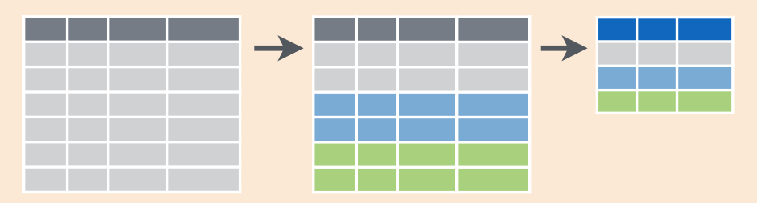

# Data Manipulation via dplyr {#manip}

<!--
- Make sure to refer back to plots in the viz chapter and how the
  material here relates to answering those questions
-->

```{r setup_manip, include=FALSE, purl=FALSE}
chap <- 5
lc <- 0
rq <- 0
# **`r paste0("(LC", chap, ".", (lc <- lc + 1), ")")`**
# **`r paste0("(RQ", chap, ".", (rq <- rq + 1), ")")`**
knitr::opts_chunk$set(
  tidy = FALSE, 
  out.width = '\\textwidth', 
  fig.height = 4,
  warning = FALSE
  )
```


Let's briefly recap where we have been so far and where we are headed.  In Chapter \@ref(tidy), we discussed what it means for data to be tidy.  We saw that this refers to observations corresponding to rows and variables being stored in columns (one variable for every column).  The entries in the data frame correspond to different combinations of observations (specific instances of observational units) and variables.  In the `flights` data frame, we saw that each row corresponds to a different flight leaving New York City.  In other words, the observational unit of that tidy data frame is a flight.  The variables are listed as columns and for `flights` they include both quantitative variables like `dep_delay` and `distance` but also categorical variables like `carrier` and `origin`.  An entry in the table corresponds to a particular flight on a given day and a particular value of a given variable representing that flight.

We saw in Chapter \@ref(viz) that organizing data in this tidy way makes it easy for us to produce graphics.  We can simply specify what variable/column we would like on one axis, what variable we'd like on the other axis, and what type of plot we'd like to make.  We can also do things such as changing the color by another variable or change the size of our points by a fourth variable given this tidy data set.

Furthermore, in Chapter \@ref(viz), we hinted at some ways to summarize and manipulate data to suit your needs.  This chapter expands on this by giving a variety of examples using what we call the *Five Main Verbs* in the `dplyr` package [@R-dplyr].  There are more advanced operations than just these and you'll see some examples of this near the end of the chapter.  

While at various points we specifically make mention to use the `View()` command to inspect a particular data frame, feel free to do so whenever. In fact, you should get into the habit of doing this for *any* data frame you work with.


### Needed packages {-}

Before we proceed with this chapter, let's load all the necessary packages.

```{r, message=FALSE}
library(dplyr)
library(ggplot2)
library(nycflights13)
library(knitr)
```

<!--Subsection on Pipe -->

## The pipe `%>%`

Before we introduce the five main verbs, we first introduce the pipe operator (`%>%`). Just as the `+` sign was used to add layers to a plot created using `ggplot()`, the pipe operator allows us to chain together `dplyr` data manipulation functions. The pipe operator can be read as "*then*". The `%>%` operator allows us to go from one step in `dplyr` to the next easily so we can, for example:

* `filter` our data frame to only focus on a few rows *then*
* `group_by` another variable to create groups *then*
* `summarize` this grouped data to calculate the mean for each level of the group.

The piping syntax will be our major focus throughout the rest of this book and you'll find that you'll quickly be addicted to the chaining with some practice. If you'd like to see more examples on using `dplyr`, the 5MV (in addition to some other `dplyr` verbs), and `%>%` with the `nycflights13` data set, you can check out Chapter 5 of Hadley and Garrett's book [@rds2016].

<!--Subsection on Verbs -->

## Five Main Verbs - The 5MV

The `d` in `dplyr` stands for data frames, so the functions here work when you are working with objects of the data frame type.  It's most important for you to focus on the 5MV: the five most commonly used functions that help us manipulate and summarize data.  A description of these verbs follows with each subsection devoted to seeing an example of that verb in play (or a combination of a few verbs):

- `filter`: Pick rows based on conditions about their values
- `summarize`: Create summary measures of variables either
    + over the entire data frame
    + or over groups of observations on variables using `group_by`
- `mutate`: Create a new variable in the data frame by mutating existing ones
- `arrange`: Arrange/sort the rows based on one or more variables

Just as we had the 5NG (The Five Named Graphs in Chapter \@ref(viz) using `ggplot2`) for data visualization, we also have the 5MV here (The Five Main Verbs in `dplyr`) for data manipulation. All of the 5MVs follow the same syntax with the argument before the pipe `%>%` being the name of the data frame and then the name of the verb with other arguments specifying which criteria you'd like the verb to work with in parentheses.


### 5MV#1: Filter observations using filter {#filter}

```{r filter, echo=FALSE, fig.cap="Filter diagram from Data Wrangling with dplyr and tidyr cheatsheet", purl=FALSE}
knitr::include_graphics("images/filter.png")
```

The `filter` function here works much like the "Filter" option in Microsoft Excel; it allows you to specify criteria about values of a variable in your data set and then chooses only those rows that match that criteria.  We begin by focusing only on flights from New York City to Portland, Oregon.  The `dest` code (or airport code) for Portland, Oregon is `"PDX"`. Run the following and look at the resulting spreadsheet to ensure that only flights heading to Portland are chosen here:

```{r, eval=FALSE}
portland_flights <- flights %>% 
  filter(dest == "PDX")
View(portland_flights)
```

Note the following:

* The ordering of the commands:
    + Take the data frame `flights` *then*
    + `filter` the data frame so that only those where the `dest` equals `"PDX"` are included.
* The double equal sign `==` You are almost guaranteed to make the mistake at least once of only including one equals sign.  Let's see what happens when we make this error:

```{r eval=FALSE}
portland_flights <- flights %>% 
  filter(dest = "PDX")
```

```
Error: filter() takes unnamed arguments. Do you need `==`?
```

You can combine multiple criteria together using operators that make comparisons:

- `|` corresponds to "or"
- `&` corresponds to "and"

We can often skip the use of `&` and just separate our conditions with a comma.  You'll see this in the example below.

In addition, you can use other mathematical checks (similar to `==`):

- `>` corresponds to "greater than"
- `<` corresponds to "less than"
- `>=` corresponds to "greater than or equal to"
- `<=` corresponds to "less than or equal to"
- `!=` corresponds to "not equal to"

To see many of these in action, let's select all flights that left JFK airport heading to Burlington, Vermont (`"BTV"`) or Seattle, Washington (`"SEA"`) in the months of October, November, or December. Run the following

```{r, eval=FALSE}
btv_sea_flights_fall <- flights %>% 
  filter(origin == "JFK", (dest == "BTV" | dest == "SEA"), month >= 10)
View(btv_sea_flights_fall)
```

Note how even though colloquially speaking one might say "all flights leaving Burlington, Vermont *and* Seattle, Washington", in terms of computer operations, we really mean "all flights leaving Burlington, Vermont *or* Seattle, Washington", because for a given row in the data, `dest` can either be: "BTV", "SEA", or something else, but not "BTV" and "SEA" at the same time.

Another example uses the `!` to pick rows that **DON'T** match a condition.  Here we are selecting rows corresponding to flights that didn't go to Burlington, VT or Seattle, WA.

```{r, eval=FALSE}
not_BTV_SEA <- flights %>% 
  filter(!(dest == "BTV" | dest == "SEA"))
View(not_BTV_SEA)
```

As a final note we point out that `filter()` should often be the first verb you'll apply to your data. This cleans your data set to only those rows you care about, or put differently, it narrows down the scope to just the observations your care about. 

***

```{block lc-filter, type='learncheck', purl=FALSE}
**_Learning check_**
```

**`r paste0("(LC", chap, ".", (lc <- lc + 1), ")")`** What's another way using `!` we could filter only the rows that are not going to Burlington, VT nor Seattle, WA in the `flights` data frame? Test this out using the code above.

***


### 5MV#2: Summarize variables using summarize

```{r sum1, echo=FALSE, fig.cap="Summarize diagram from Data Wrangling with dplyr and tidyr cheatsheet", purl=FALSE}
knitr::include_graphics("images/summarize1.png")
```

```{r sum2, echo=FALSE, fig.cap="Another summarize diagram from Data Wrangling with dplyr and tidyr cheatsheet", purl=FALSE}
knitr::include_graphics("images/summary.png")
```

We can calculate the standard deviation and mean of the temperature variable `temp` in the `weather` data frame of `nycflights13` in one step using the `summarize` function in `dplyr`:

```{r}
summary_temp <- weather %>% 
  summarize(mean = mean(temp), std_dev = sd(temp))
kable(summary_temp)
```

We've created a small data frame here called `summary_temp` that includes both the `mean` and the `std_dev` of the `temp` variable in `weather`.  Notice as shown in Figures \@ref(fig:sum1) and \@ref(fig:sum2), the data frame `weather` went from many rows to a single row of just the summary values in the data frame `summary_temp`.  But why are the mean and standard deviation missing, i.e. `NA`? Remember that by default the `mean` and `sd` functions do not ignore missing values.  We need to specify the argument `na.rm=TRUE` (`rm` is short for "remove"):

```{r}
summary_temp <- weather %>% 
  summarize(mean = mean(temp, na.rm = TRUE), std_dev = sd(temp, na.rm = TRUE))
kable(summary_temp)
```

If we'd like to access either of these values directly we can use the `$` to specify a column in a data frame. For example:

```{r}
summary_temp$mean
```

You'll often encounter issues with missing values `NA`. In fact, an entire branch of the field of statistics deals with missing data. However, it is not good practice to include a `na.rm = TRUE` in your summary commands by default; you should attempt to run them without this argument. The idea being you should at the very least be alerted to the presence of missing values and consider what the impact on the analysis might be if you ignore these values. In other words, `na.rm = TRUE` should only be used when necessary.

What other summary functions can we use inside the `summarize()` verb? Any function in R that takes a vector of values and returns just one. Here are just a few:

* `min()` and `max()`: the minimum and maximum values respectively
* `IQR()`: Interquartile range
* `sum()`: the sum
* `n()`: a count of the number of rows/observations in each group. This particular summary function will make more sense in the `group_by` chapter.


***

```{block lc-summarize, type='learncheck', purl=FALSE}
**_Learning check_**
```

**`r paste0("(LC", chap, ".", (lc <- lc + 1), ")")`** Say a doctor is studying the effect of smoking on lung cancer of a large number of patients who have records measured at five year intervals. He notices that a large number of patients have missing data points because the patient has died, so he chooses to ignore these patients in his analysis. What is wrong with this doctor's approach?

**`r paste0("(LC", chap, ".", (lc <- lc + 1), ")")`** Modify the above `summarize` function to create `summary_temp` to also use the `n()` summary function: `summarize(count = n())`. What does the returned value correspond to?

**`r paste0("(LC", chap, ".", (lc <- lc + 1), ")")`** Why doesn't the following code work?  You may want to run the code line by line instead of all at once.  In other words, run `summary_temp <- weather %>% summarize(mean = mean(temp, na.rm = TRUE))` first.

```{r eval=FALSE}
summary_temp <- weather %>%   
  summarize(mean = mean(temp, na.rm = TRUE)) %>% 
  summarize(std_dev = sd(temp, na.rm = TRUE))
```

***


### 5MV#3: Group rows using group_by

```{r groupsummarize, echo=FALSE, fig.cap="Group by and summarize diagram from Data Wrangling with dplyr and tidyr cheatsheet", purl=FALSE}

```

However, it's often more useful to summarize a variable based on the groupings of another variable.  Let's say similarly to the previous section, we are interested in the mean and standard deviation of temperatures but *grouped by month*. This concept can equivalently be articulated as: we want the mean and standard deviation of temperatures

1. split by month.
1. sliced by month.
1. aggregated by month.
1. collapsed over month.

We believe that you will be amazed at just how simple this is. Run the following code:

```{r}
summary_monthly_temp <- weather %>% 
  group_by(month) %>% 
  summarize(mean = mean(temp, na.rm = TRUE), 
            std_dev = sd(temp, na.rm = TRUE))
kable(summary_monthly_temp)
```

This code is identical to the previous code that created `summary_temp`, but there is an extra `group_by(month)` spliced in between. By simply grouping the `weather` data set by `month` first and then passing this new data frame into `summarize` we get a resulting data frame that shows the mean and standard deviation temperature for each month in New York City. Since each row in `summary_monthly_temp` represents a summary of different rows in `weather`, the observational units have changed.

It is important to note that `group_by` doesn't actually change the data frame. It simply sets *meta-data* (data about the data), specifically the group structure of the data. It is only after we apply the `summarize` function that the data frame actually changes. If we would like to remove this group structure meta-data, we can pipe a resulting data frame into the `ungroup()` function.

We now revisit the `n()` counting summary function we introduced in the previous section. For example, suppose we'd like to get a sense for how many flights departed each of the three airports in New York City:

```{r}
by_origin <- flights %>% 
  group_by(origin) %>% 
  summarize(count = n())
kable(by_origin)
```

We see that Newark (`"EWR"`) had the most flights departing in 2013 followed by `"JFK"` and lastly by LaGuardia (`"LGA"`). Note there is a subtle but important difference between `sum()` and `n()`. While `sum()` simply adds up a large set of numbers, the latter counts the number of times each of many different values occur. 

You are not limited to grouping by one variable! Say you wanted to know the number of flights leaving each of the three New York City airports *for each month*, we can also group by a second variable `month`: `group_by(origin, month)`.

```{r}
by_monthly_origin <- flights %>% 
  group_by(origin, month) %>% 
  summarize(count = n())
kable(by_monthly_origin)
```

Alternatively, you can use the shortcut `count()` function in `dplyr` to get the same result:

```{r}
by_monthly_origin2 <- flights %>% 
  dplyr::count(origin, month)
kable(by_monthly_origin2)
```


***

```{block lc-groupby, type='learncheck'}
**_Learning check_**
```

**`r paste0("(LC", chap, ".", (lc <- lc + 1), ")")`** Recall from Chapter \@ref(viz) when we looked at plots of temperatures by months in NYC. What does the standard deviation column in the `summary_monthly_temp` data frame tell us about temperatures in New York City throughout the year?

**`r paste0("(LC", chap, ".", (lc <- lc + 1), ")")`** What code would be required to get the mean and standard deviation temperature for each day in 2013 for NYC?

**`r paste0("(LC", chap, ".", (lc <- lc + 1), ")")`** Recreate `by_monthly_origin`, but instead of grouping via `group_by(origin, month)`, group variables in a different order `group_by(month, origin)`. What differs in the resulting data set?

**`r paste0("(LC", chap, ".", (lc <- lc + 1), ")")`** How could we identify how many flights left each of the three airports for each `carrier`?

**`r paste0("(LC", chap, ".", (lc <- lc + 1), ")")`** How does the `filter` operation differ from a `group_by` followed by a `summarize`?

***


### 5MV#4: Create new variables/change old variables using mutate

```{r select, echo=FALSE, fig.cap="Mutate diagram from Data Wrangling with dplyr and tidyr cheatsheet", purl=FALSE}
knitr::include_graphics("images/mutate.png")
```

When looking at the `flights` data set, there are some clear additional variables that could be calculated based on the values of variables already in the data set.  Passengers are often frustrated when their flights departs late, but change their mood a bit if pilots can make up some time during the flight to get them to their destination close to when they expected to land.  This is commonly referred to as "gain" and we will create this variable using the `mutate` function.  Note that we have also overwritten the `flights` data frame with what it was before as well as an additional variable `gain` here.

```{r}
flights <- flights %>% 
  mutate(gain = arr_delay - dep_delay)
```

Why did we overwrite `flights` instead of assigning the resulting data frame to a new object, like `flights_with_gain`? As a rough rule of thumb, as long as you are not losing information that you might need later, its acceptable practice to overwrite data frames. However, if you overwrite existing variables and/or change the observational units, recovering the original information might prove difficult. In this case, it might make sense to create a new data object.

Let's look at summary measures of this `gain` variable and even plot it in the form of a histogram:

```{r}
gain_summary <- flights %>% 
  summarize(
    min = min(gain, na.rm = TRUE),
    q1 = quantile(gain, 0.25, na.rm = TRUE),
    median = quantile(gain, 0.5, na.rm = TRUE),
    q3 = quantile(gain, 0.75, na.rm = TRUE),
    max = max(gain, na.rm = TRUE),
    mean = mean(gain, na.rm = TRUE),
    sd = sd(gain, na.rm = TRUE),
    missing = sum(is.na(gain))
  )
kable(gain_summary)
```

We've recreated the `summary` function we saw in Chapter \@ref(viz) here using the `summarize` function in `dplyr`.

```{r message=FALSE, fig.cap="Histogram of gain variable"}
ggplot(data = flights, mapping = aes(x = gain)) +
  geom_histogram(color = "white", bins = 20)
```

We can also create multiple columns at once and even refer to columns that were just created in a new column.  Hadley produces one such example in Chapter 5 of "R for Data Science" [@rds2016]:

```{r}
flights <- flights %>% 
  mutate(
    gain = arr_delay - dep_delay,
    hours = air_time / 60,
    gain_per_hour = gain / hours
  )
```

***

```{block lc-mutate, type='learncheck', purl=FALSE}
**_Learning check_**
```

**`r paste0("(LC", chap, ".", (lc <- lc + 1), ")")`** What do positive values of the `gain` variable in `flights` correspond to?  What about negative values?  And what about a zero value?

**`r paste0("(LC", chap, ".", (lc <- lc + 1), ")")`** Could we create the `dep_delay` and `arr_delay` columns by simply subtracting `dep_time` from `sched_dep_time` and similarly for arrivals?  Try the code out and explain any differences between the result and what actually appears in `flights`.

**`r paste0("(LC", chap, ".", (lc <- lc + 1), ")")`** What can we say about the distribution of `gain`?  Describe it in a few sentences using the plot and the `gain_summary` data frame values.

***


### 5MV#5: Reorder the data frame using arrange {#arrange}

As you may have thought about with the data frames we've worked with so far in the book, one of the most common things you'd like to do is sort the data frames by a specific variable in a column.  Have you ever been asked to calculate a median by hand?  This requires you to put the data in order from smallest to highest in value.  The `dplyr` package has a function called `arrange` that we will use to sort/reorder our data according to the values of the specified variable.  This is often used after we have used the `group_by` and `summarize` functions as we will see.

Let's suppose we were interested in determining the most frequent destination airports from New York City in 2013:

```{r, eval}
freq_dest <- flights %>% 
  group_by(dest) %>% 
  summarize(num_flights = n())
freq_dest
```

You'll see that by default the values of `dest` are displayed in alphabetical order here.  We are interested in finding those airports that appear most:

```{r}
freq_dest %>% arrange(num_flights)
```

This is actually giving us the opposite of what we are looking for.  It tells us the least frequent destination airports first.  To switch the ordering to be descending instead of ascending we use the `desc` function:

```{r}
freq_dest %>% arrange(desc(num_flights))
```

<!--Chapter on joins-->

## Joining data frames

Another common task is joining/merging two different data sets. For example, in the `flights` data, the variable `carrier` lists the carrier code for the different flights. While `"UA"` and `"AA"` might be somewhat easy to guess for some (United and American Airlines), what are "VX", "HA", and "B6"? This information is provided in a separate data frame `airlines`.

```{r eval=FALSE}
View(airlines)
```

We see that in `airports`, `carrier` is the carrier code while `name` is the full name of the airline. Using this table, we can see that "VX", "HA", and "B6" correspond to Virgin America, Hawaiian Airlines, and JetBlue respectively. However, will we have to continually look up the carrier's name for each flight in the `airlines` data set?  No! Instead of having to manually do this, we can have R automatically do this "looking up" for us.  

Note that the values in the variable `carrier` in `flights` match the values in the variable `carrier` in `airlines`. In this case, we can use the variable `carrier` as a *key variable* to join/merge/match the two data frames by. Hadley and Garrett [@rds2016] created the following diagram to help us understand how the different data sets are linked:

```{r reldiagram, echo=FALSE, fig.cap="Data relationships in nycflights13 from R for Data Science", purl=FALSE}
knitr::include_graphics("images/relational-nycflights.png")
```


### Joining by Key Variables

In both `flights` and `airlines`, the key variable we want to join/merge/match the two data frames with has the same name in both data sets: `carriers`. We make use of the `inner_join()` function to join by the variable `carrier`.

```{r eval=FALSE}
flights_joined <- flights %>% 
  inner_join(airlines, by = "carrier")
View(flights)
View(flights_joined)
```

We observed that the `flights` and `flights_joined` are identical except that `flights_joined` has an additional variable `name` whose values were drawn from `airlines`. 

A visual representation of the `inner_join` is given below [@rds2016]:

```{r ijdiagram, echo=FALSE, fig.cap="Diagram of inner join from R for Data Science", purl=FALSE}
knitr::include_graphics("images/join-inner.png")
```

There are more complex joins available, but the `inner_join` will solve nearly all of the problems you'll face in our experience.


### Joining by Key Variables with Different Names

Say instead, you are interested in all the destinations of flights from NYC in 2013 and ask yourself:

- "What cities are these airports in?" 
- "Is `"ORD"` Orlando?"
- "Where is `"FLL"`?

The `airports` data frame contains airport codes:

```{r eval=FALSE}
View(airports)
```

However, looking at both the `airports` and `flights` and the visual representation of the relations between the data frames in Figure \@ref(fig:ijdiagram), we see that in:

* `airports` the airport code is in the variable `faa`
* `flights` the airport code is in the variable `origin`

So to join these two data sets, our `inner_join` operation involves a `by` argument that accounts for the different names:

```{r, eval=FALSE}
flights %>% 
  inner_join(airports, by = c("dest" = "faa"))
```

Let's construct the sequence of commands that computes the number of flights from NYC to each destination but also includes information about each destination airport:

```{r, eval=FALSE}
named_dests <- flights %>%
  group_by(dest) %>%
  summarize(num_flights = n()) %>%
  arrange(desc(num_flights)) %>%
  inner_join(airports, by = c("dest" = "faa")) %>%
  rename(airport_name = name)
View(named_dests)
```

In case you didn't know, `"ORD"` is the airport code of Chicago O'Hare airport and `"FLL"` is the main airport in Fort Lauderdale, Florida, which we can now see in our `named_freq_dests` data frame.


***

```{block lc-join, type='learncheck', purl=FALSE}
**_Learning check_**
```

**`r paste0("(LC", chap, ".", (lc <- lc + 1), ")")`** Looking at Figure \@ref(fig:reldiagram), when joining `flights` and `weather` (or, in other words, matching the hourly weather values with each flight), why do we need to join by all of `year`, `month`, `day`, `hour`, and `origin`, and not just `hour`?

**`r paste0("(LC", chap, ".", (lc <- lc + 1), ")")`** What surprises you about the top 10 destinations from NYC in 2013?

***


<!--Subsection on Other Verbs -->

## Optional: Other verbs

### Select variables using select {#select}

```{r selectfig, echo=FALSE, fig.cap="Select diagram from Data Wrangling with dplyr and tidyr cheatsheet", purl=FALSE}
knitr::include_graphics("images/select.png")
```

We've seen that the `flights` data frame in the `nycflights13` package contains many different variables. The `names` function gives a listing of all the columns in a data frame; in our case you would run `names(flights)`. You can also identify these variables by running the `glimpse` function in the `dplyr` package:

```{r, eval=FALSE}
glimpse(flights)
```

However, say you only want to consider two of these variables, say `carrier` and `flight`. You can `select` these:

```{r, eval=FALSE}
flights %>% 
  select(carrier, flight)
```

Another one of these variables is `year`. If you remember the original description of the `flights` data frame (or by running `?flights`), you'll remember that this data correspond to flights in 2013 departing New York City.  The `year` variable isn't really a variable here in that it doesn't vary... `flights` actually comes from a larger data set that covers many years.  We may want to remove the `year` variable from our data set since it won't be helpful for analysis in this case. We can deselect `year` by using the `-` sign:

```{r, eval=FALSE}
flights_no_year <- flights %>% 
  select(-year)
names(flights_no_year)
```

Or we could specify a ranges of columns:

```{r, eval=FALSE}
flight_arr_times <- flights %>% 
  select(month:day, arr_time:sched_arr_time)
flight_arr_times
```

The `select` function can also be used to reorder columns in combination with the `everything` helper function.  Let's suppose we'd like the `hour`, `minute`, and `time_hour` variables, which appear at the end of the `flights` data set, to actually appear immediately after the `day` variable:

```{r, eval=FALSE}
flights_reorder <- flights %>% 
  select(month:day, hour:time_hour, everything())
names(flights_reorder)
```

in this case `everything()` picks up all remaining variables. Lastly, the helper functions `starts_with`, `ends_with`, and `contains` can be used to choose column names that match those conditions:

```{r, eval=FALSE}
flights_begin_a <- flights %>% 
  select(starts_with("a"))
flights_begin_a
```

```{r, eval=FALSE}
flights_delays <- flights %>% 
  select(ends_with("delay"))
flights_delays
```

```{r, eval=FALSE}
flights_time <- flights %>% 
  select(contains("time"))
flights_time
```


### Rename variables using rename {#rename}

Another useful function is `rename`, which as you may suspect renames one column to another name.  Suppose we wanted `dep_time` and `arr_time` to be `departure_time` and `arrival_time` instead in the `flights_time` data frame:

```{r, eval=FALSE}
flights_time_new <- flights %>% 
  select(contains("time")) %>% 
  rename(departure_time = dep_time,
         arrival_time = arr_time)
names(flights_time)
```

It's easy to forget if the new name comes before or after the equals sign.  I usually remember this as "New Before, Old After" or NBOA. You'll receive an error if you try to do it the other way:

```
Error: Unknown variables: departure_time, arrival_time.
```


### Find the top number of values using top_n

We can also use the `top_n` function which automatically tells us the most frequent `num_flights`.  We specify the top 10 airports here:

```{r, eval=FALSE}
named_dests %>% 
  top_n(n = 10, wt = num_flights)
```

We'll still need to arrange this by `num_flights` though:

```{r, eval=FALSE}
named_dests  %>% 
  top_n(n = 10, wt = num_flights) %>% 
  arrange(desc(num_flights))
```

**Note:** Remember that I didn't pull the `n` and `wt` arguments out of thin air.  They can be found by using the `?` function on `top_n`.

We can go one stop further and tie together the `group_by` and `summarize` functions we used to find the most frequent flights:

```{r, eval=FALSE}
ten_freq_dests <- flights %>%
  group_by(dest) %>%
  summarize(num_flights = n()) %>%
  top_n(n = 10) %>%
  arrange(desc(num_flights))
View(ten_freq_dests)
```


***

```{block lc-other-verbs, type='learncheck', purl=FALSE}
**_Learning check_**
```

**`r paste0("(LC", chap, ".", (lc <- lc + 1), ")")`** What are some ways to select all three of the `dest`, `air_time`, and `distance` variables from `flights`?  Give the code showing how to do this in at least three different ways.

**`r paste0("(LC", chap, ".", (lc <- lc + 1), ")")`** How could one use `starts_with`, `ends_with`, and `contains` to select columns from the `flights` data frame?  Provide three different examples in total: one for `starts_with`, one for `ends_with`, and one for `contains`.

**`r paste0("(LC", chap, ".", (lc <- lc + 1), ")")`** Why might we want to use the `select` function on a data frame?

**`r paste0("(LC", chap, ".", (lc <- lc + 1), ")")`** Create a new data frame that shows the top 5 airports with the largest arrival delays from NYC in 2013.

***


<!--Subsection on Conclusion -->

## Conclusion

### Resources

As we saw with the RStudio cheatsheet on [data visualization](https://www.rstudio.com/wp-content/uploads/2016/11/ggplot2-cheatsheet-2.1.pdf), RStudio has also created a cheatsheet for data manipulation entitled ["Data Transformation with dplyr"](https://github.com/rstudio/cheatsheets/raw/master/source/pdfs/data-transformation-cheatsheet.pdf).

<!--
* By clicking [here](https://github.com/rstudio/cheatsheets/raw/master/source/pdfs/data-transformation-cheatsheet.pdf)

* Or by clicking the RStudio Menu Bar -> Help -> Cheatsheets -> "Data Manipulation with `dplyr`, `tidyr`"
(The RStudio interface has not been updated to include JUST the dplyr cheatsheet)

We will focus only on the `dplyr` functions in this book, but you are encouraged to also explore `tidyr` if you are presented with data that is not in the tidy format that we have specified as the preferred option for our purposes.
-->


### Script of R code

```{r include=FALSE, eval=FALSE, purl=FALSE}
knitr::purl("05-manip.Rmd", "docs/scripts/05-manip.R")
```

An R script file of all R code used in this chapter is available [here](http://ismayc.github.io/moderndiver-book/scripts/05-manip.R).

***
***

```{block, type='review', purl=FALSE}
**_Review questions_**
```

Review questions have been designed using the `fivethirtyeight` R package [@R-fivethirtyeight] with links to the corresponding FiveThirtyEight.com articles in our free DataCamp course **Effective Data Storytelling using the `tidyverse`**.  The material in this chapter is covered in the chapters of the DataCamp course available below:

- [Filtering, Grouping, & Summarizing](https://campus.datacamp.com/courses/effective-data-storytelling-using-the-tidyverse/filtering-grouping-summarizing)

- [dplyr Review](https://campus.datacamp.com/courses/effective-data-storytelling-using-the-tidyverse/dplyr-review-8?ex=1)

***
***

### What's to come?

This concludes the **Data Exploration** unit of this book.  You should be pretty proficient in both plotting variables (or multiple variables together) in various data sets and manipulating data as we've done in this chapter.  You are encouraged to step back through the code in earlier chapters and make changes as you see fit based on your updated knowledge.  

In Chapter \@ref(sim), we'll begin to build the pieces needed to understand how this unit of **Data Exploration** can tie into statistical inference in the **Inference** part of the book.  Remember that the focus throughout is on data visualization and we'll see that next when we discuss sampling, resampling, and bootstrapping.  These ideas will lead us into hypothesis testing and confidence intervals.
