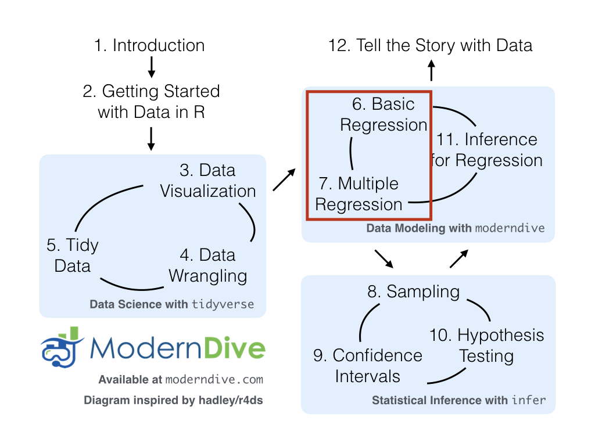

# Data Wrangling via dplyr {#wrangling}

<!--
- Make sure to refer back to plots in the viz chapter and consider how the
  material here relates to answering the questions posed in viz chapter
-->

```{r setup_wrangling, include=FALSE, purl=FALSE}
chap <- 5
lc <- 0
rq <- 0
# **`r paste0("(LC", chap, ".", (lc <- lc + 1), ")")`**
# **`r paste0("(RQ", chap, ".", (rq <- rq + 1), ")")`**

knitr::opts_chunk$set(
  tidy = FALSE, 
  out.width = '\\textwidth', 
  fig.height = 4,
  warning = FALSE
  )

# This bit of code is a bug fix on asis blocks, which we use to show/not show LC
# solutions, which are written like markdown text. In theory, it shouldn't be
# necessary for knitr versions <=1.11.6, but I've found I still need to for
# everything to knit properly in asis blocks. More info here: 
# https://stackoverflow.com/questions/32944715/conditionally-display-block-of-markdown-text-using-knitr
library(knitr)
knit_engines$set(asis = function(options) {
  if (options$echo && options$eval) knit_child(text = options$code)
})

# This controls which LC solutions to show. Options for solutions_shown: "ALL"
# (to show all solutions), or subsets of c('5-1', '5-2','5-3', '5-4', '5-5', '5-6'), including
# the null vector c('') to show no solutions.
solutions_shown <- c('5-1', '5-2', '5-3', '5-4', '5-5', '5-6', '5-7')
show_solutions <- function(section){
  return(solutions_shown == "ALL" | section %in% solutions_shown)
  }
```

Let's briefly recap where we have been so far and where we are headed.  In Chapter \@ref(tidy), we discussed what it means for data to be tidy.  We saw that this refers to observations corresponding to rows and variables being stored in columns (one variable for every column).  The entries in the data frame correspond to different combinations of observations (specific instances of observational units) and variables.  In the `flights` data frame, we saw that each row corresponds to a different flight leaving New York City.  In other words, the **observational unit** of the `flights` tidy data frame is a flight.  The variables are listed as columns, and for `flights` these columns include both quantitative variables like `dep_delay` and `distance` and also categorical variables like `carrier` and `origin`.  An entry in the table corresponds to a particular flight on a given day and a particular value of a given variable representing that flight.

Armed with this knowledge and looking back on Chapter \@ref(viz), we see that organizing data in this tidy way makes it easy for us to produce graphics, specifically a set of 5 common graphics we termed the *5 Named Graphics* (5NG):

1. scatterplots
1. linegraphs
1. boxplots
1. histograms
1. barplots

We can simply specify what variable/column we would like on one axis, (if applicable) what variable we'd like on the other axis, and what type of plot we'd like to make by specifying the `geom`etric object in question.  We can also vary aesthetic attributes of the geometric objects in question (points, lines, bar), such as the size and color, along the values of another variable in this tidy dataset. Recall the Gapminder example from Figure \@ref(fig:gapminder).

Lastly, in a few spots in Chapter \@ref(viz) and Chapter \@ref(tidy), we hinted at some ways to summarize and wrangle data to suit your needs, using the `filter()` and `inner_join()` functions.  This chapter expands on these functions by giving a variety of examples using what we term the *Five Main Verbs* (5MV) in the `dplyr` package [@R-dplyr].  


### Needed packages {-}

Let's load all the packages needed for this chapter (this assumes you've already installed them). If needed, read Section \@ref(packages) for information on how to install and load R packages.

```{r, message=FALSE}
library(dplyr)
library(ggplot2)
library(nycflights13)
```

```{r message=FALSE, warning=FALSE, echo=FALSE, purl=FALSE}
# Packages needed internally, but not in text.
library(knitr)
library(readr)
```


### DataCamp {-}

Our approach to introducing data wrangling tools from the `dplyr` package is very similar to the approach taken in [David Robinson's](https://twitter.com/drob) DataCamp course "Introduction to the Tidyverse," a course targeted at people new to R and the tidyverse. If you're interested in complementing your learning below in an interactive online environment, click on the image below to access the course. The relevant chapters are Chapter 1 on "Data wrangling" and Chapter 3 on "Grouping and summarizing".

<center>
<a target="_blank" class="page-link" href="https://www.datacamp.com/courses/introduction-to-the-tidyverse"></a>
</center>

While not required for this book, if you would like a quick peek at more powerful tools to explore, tame, tidy, and transform data, we suggest you take [Alison Hill's](https://twitter.com/apreshill) DataCamp course "Working with Data in the Tidyverse," Click on the image below to access the course. The relevant chapter is Chapter 3 "Tidy your data."

<center>
<a target="_blank" class="page-link" href="https://www.datacamp.com/courses/working-with-data-in-the-tidyverse"></a>
</center>


---

<!--Subsection on Pipe -->

## The pipe `%>%` {#piping}

Before we introduce the five main verbs, we first introduce the pipe operator (`%>%`). Just as the `+` sign was used to add layers to a plot created using `ggplot()`, the pipe operator allows us to chain together `dplyr` data wrangling functions. The pipe operator can be read as "*then*". The `%>%` operator allows us to go from one step in `dplyr` to the next easily so we can, for example:

* `filter` our data frame to only focus on a few rows *then*
* `group_by` another variable to create groups *then*
* `summarize` this grouped data to calculate the mean for each level of the group.

The piping syntax will be our major focus throughout the rest of this book and you'll find that you'll quickly be addicted to the chaining with some practice.


---

<!--Subsection on Verbs -->

## Five Main Verbs - The 5MV

The `d` in `dplyr` stands for data frames, so the functions in `dplyr` are built for working with objects of the data frame type. For now, we focus on the 5MV: the five most commonly used functions that help wrangle and summarize data. A description of these verbs follows, with each section devoted to an example of that verb, or a combination of a few verbs, in action.

1. `filter()`: Pick rows based on conditions about their values
1. `summarize()`: Compute summary measures known as "summary statistics" of variables
1. `group_by()`: Group rows of observations together
1. `mutate()`: Create a new variable in the data frame by mutating existing ones
1. `arrange()`: Arrange/sort the rows based on one or more variables

Just as we had the Five Named Graphs for data visualization using `ggplot2` in Chapter \@ref(viz), we have the 5MV here (The Five Main Verbs in `dplyr`) for data wrangling.  All of the 5MVs follow the same syntax, with the argument before the pipe `%>%` being the name of the data frame, then the name of the verb, followed with other arguments specifying which criteria you'd like the verb to work with in parentheses.

Keep in mind, there are more advanced functions than just these five and you'll see some examples of this near the end of this chapter in \@ref(other-verbs), but with the 5MV you'll be able to perform a broad array of data wrangling tasks.  

## 5MV#1: Filter observations using filter {#filter}

```{r filter, echo=FALSE, fig.cap="Filter diagram from Data Wrangling with dplyr and tidyr cheatsheet", purl=FALSE}
knitr::include_graphics("images/filter.png")
```

The `filter` function here works much like the "Filter" option in Microsoft Excel; it allows you to specify criteria about values of a variable in your dataset and then chooses only those rows that match that criteria.  We begin by focusing only on flights from New York City to Portland, Oregon.  The `dest` code (or airport code) for Portland, Oregon is `"PDX"`. Run the following and look at the resulting spreadsheet to ensure that only flights heading to Portland are chosen here:

```{r, eval=FALSE}
portland_flights <- flights %>% 
  filter(dest == "PDX")
View(portland_flights)
```

Note the following:

* The ordering of the commands:
    + Take the data frame `flights` *then*
    + `filter` the data frame so that only those where the `dest` equals `"PDX"` are included.
* The double equal sign `==` for testing for equality, and not `=`. You are almost guaranteed to make the mistake at least once of only including one equals sign.

You can combine multiple criteria together using operators that make comparisons:

- `|` corresponds to "or"
- `&` corresponds to "and"

We can often skip the use of `&` and just separate our conditions with a comma.  You'll see this in the example below.

In addition, you can use other mathematical checks (similar to `==`):

- `>` corresponds to "greater than"
- `<` corresponds to "less than"
- `>=` corresponds to "greater than or equal to"
- `<=` corresponds to "less than or equal to"
- `!=` corresponds to "not equal to"

To see many of these in action, let's select all flights that left JFK airport heading to Burlington, Vermont (`"BTV"`) or Seattle, Washington (`"SEA"`) in the months of October, November, or December. Run the following

```{r, eval=FALSE}
btv_sea_flights_fall <- flights %>% 
  filter(origin == "JFK", (dest == "BTV" | dest == "SEA"), month >= 10)
View(btv_sea_flights_fall)
```

Note: even though colloquially speaking one might say "all flights leaving Burlington, Vermont *and* Seattle, Washington," in terms of computer logical operations, we really mean "all flights leaving Burlington, Vermont *or* Seattle, Washington." For a given row in the data, `dest` can be "BTV", "SEA", or something else, but not "BTV" and "SEA" at the same time.

Another example uses the `!` to pick rows that *don't* match a condition. The `!` can be read as "not". Here we are selecting rows corresponding to flights that didn't go to Burlington, VT or Seattle, WA.

```{r, eval=FALSE}
not_BTV_SEA <- flights %>% 
  filter(!(dest == "BTV" | dest == "SEA"))
View(not_BTV_SEA)
```

As a final note we point out that `filter()` should often be the first verb you'll apply to your data. This cleans your dataset to only those rows you care about, or put differently, it narrows down the scope to just the observations your care about. 


```{block lc-filter, type='learncheck', purl=FALSE}
**_Learning check_**
```

**`r paste0("(LC", chap, ".", (lc <- lc + 1), ")")`** What's another way using the "not" operator `!` we could filter only the rows that are not going to Burlington, VT nor Seattle, WA in the `flights` data frame? Test this out using the code above.

```{asis lc-filter-solutions, include=show_solutions('5-1'), purl=FALSE}
**Learning Check Solutions**  
**`r paste0("(LC", chap, ".", (lc), ")")`** What's another way using the "not" operator `!` we could filter only the rows that are not going to Burlington, VT nor Seattle, WA in the `flights` data frame? Test this out using the code above.
```

```{r, eval=FALSE, echo=show_solutions('5-1'), purl=FALSE}
# Original in book
not_BTV_SEA <- flights %>% 
  filter(!(dest == "BTV" | dest == "SEA"))

# Alternative way
not_BTV_SEA <- flights %>% 
  filter(!dest == "BTV" & !dest == "SEA")

# Yet another way
not_BTV_SEA <- flights %>% 
  filter(dest != "BTV" & dest != "SEA")
```

```{block, type='learncheck', purl=FALSE}
```

## 5MV#2: Summarize variables using summarize {#summarize}

The next common task when working with data is to be able to summarize data: take a large number of values and summarize them with a single value. While this may seem like a very abstract idea, something as simple as the sum, the smallest value, and the largest values are all summaries of a large number of values.

```{r sum1, echo=FALSE, fig.cap="Summarize diagram from Data Wrangling with dplyr and tidyr cheatsheet", purl=FALSE}
knitr::include_graphics("images/summarize1.png")
```

```{r sum2, echo=FALSE, fig.cap="Another summarize diagram from Data Wrangling with dplyr and tidyr cheatsheet", purl=FALSE}
knitr::include_graphics("images/summary.png")
```

We can calculate the standard deviation and mean of the temperature variable `temp` in the `weather` data frame of `nycflights13` in one step using the `summarize` (or equivalently using the UK spelling `summarise`) function in `dplyr` (See Appendix \@ref(appendixA)):

```{r, eval=FALSE}
summary_temp <- weather %>% 
  summarize(mean = mean(temp), std_dev = sd(temp))
summary_temp
```
```{r, echo=FALSE}
summary_temp <- weather %>% 
  summarize(mean = mean(temp), std_dev = sd(temp))
kable(summary_temp)
```

We've created a small data frame here called `summary_temp` that includes both the `mean` and the `std_dev` of the `temp` variable in `weather`.  Notice as shown in Figures \@ref(fig:sum1) and \@ref(fig:sum2), the data frame `weather` went from many rows to a single row of just the summary values in the data frame `summary_temp`.  

But why are the values returned `NA`? This stands for "not available or not applicable" and is how R encodes *missing values*; if in a data frame for a particular row and column no value exists, `NA` is stored instead. Furthermore, by default any time you try to summarize a number of values (using `mean()` and `sd()` for example) that has one or more missing values, then `NA` is returned. 

Values can be missing for many reasons. Perhaps the data was collected but someone forgot to enter it? Perhaps the data was not collected at all because it was too difficult? Perhaps there was an erroneous value that someone entered that has been correct to read as missing? You'll often encounter issues with missing values. 

You can summarize all non-missing values by setting the `na.rm` argument to TRUE (`rm` is short for "remove"). This will remove any `NA` missing values and only return the summary value for all non-missing values. So the code below computes the mean and standard deviation of all non-missing values. Notice how the `na.rm=TRUE` are set as arguments to the `mean()` and `sd()` functions, and not to the `summarize()` function. 

```{r, eval=FALSE}
summary_temp <- weather %>% 
  summarize(mean = mean(temp, na.rm = TRUE), std_dev = sd(temp, na.rm = TRUE))
summary_temp
```
```{r, echo=FALSE}
summary_temp <- weather %>% 
  summarize(mean = mean(temp, na.rm = TRUE), std_dev = sd(temp, na.rm = TRUE))
kable(summary_temp)
```

It is not good practice to include a `na.rm = TRUE` in your summary commands by default; you should attempt to run code first without this argument as this will alert you to the presence of missing data. Only after you've identified where missing values occur and have thought about the potential causes of this missing should you consider using `na.rm = TRUE`. In the upcoming Learning Checks we'll consider the possible ramifications of blindly sweeping rows with missing values under the rug. 

<!--
If we'd like to access either of these values directly we can use the `$` to specify a column in a data frame. For example:

```{r}
#summary_temp$mean
```
-->

What other summary functions can we use inside the `summarize()` verb? Any function in R that takes a vector of values and returns just one. Here are just a few:

* `mean()`: the mean AKA the average
* `sd()`: the standard deviation, which is a measure of spread
* `min()` and `max()`: the minimum and maximum values respectively
* `IQR()`: Interquartile range
* `sum()`: the sum
* `n()`: a count of the number of rows/observations in each group. This particular summary function will make more sense when `group_by()` is covered in Section \@ref(groupby).

```{block lc-summarize, type='learncheck', purl=FALSE}
**_Learning check_**
```

**`r paste0("(LC", chap, ".", (lc <- lc + 1), ")")`** Say a doctor is studying the effect of smoking on lung cancer for a large number of patients who have records measured at five year intervals. She notices that a large number of patients have missing data points because the patient has died, so she chooses to ignore these patients in her analysis. What is wrong with this doctor's approach?

**`r paste0("(LC", chap, ".", (lc <- lc + 1), ")")`** Modify the above `summarize` function to create `summary_temp` to also use the `n()` summary function: `summarize(count = n())`. What does the returned value correspond to?

**`r paste0("(LC", chap, ".", (lc <- lc + 1), ")")`** Why doesn't the following code work?  Run the code line by line instead of all at once, and then look at the data.  In other words, run `summary_temp <- weather %>% summarize(mean = mean(temp, na.rm = TRUE))` first.

```{r eval=FALSE}
summary_temp <- weather %>%   
  summarize(mean = mean(temp, na.rm = TRUE)) %>% 
  summarize(std_dev = sd(temp, na.rm = TRUE))
```


```{asis lc-summarize-solutions, include=show_solutions('5-2'), purl=FALSE}
**Learning Check Solutions**  
**`r paste0("(LC", chap, ".", (lc-2), ")")`** A doctor is studying the effect of smoking on lung cancer for a large number of patients who have records measured at five year intervals. They notice that a large number of patients have missing data points because the patient has died, so they choose to ignore these patients in their analysis. What is wrong with this doctor's approach?  
The missing patients may have died of lung cancer! So to ignore them might seriously **bias** your results! It is very important to think of what the consequences on your analysis are of ignoring missing data! Ask yourself:
    + There is a systematic reasons why certain values are missing? If so, you might be biasing your results!
    + If there isn't, then it might be ok to "sweep missing values under the rug."
    
**`r paste0("(LC", chap, ".", (lc-1), ")")`** Modify the above `summarize` function to create `summary_temp` to also use the `n()` summary function: `summarize(count = n())`. What does the returned value correspond to?  

It corresponds to a count of the number of observations/rows:
```

```{r, eval=show_solutions('5-2'), echo=show_solutions('5-2'), purl=FALSE}
weather %>% 
  summarize(count = n())
```

```{asis, include=show_solutions('5-2'), purl=FALSE}
**`r paste0("(LC", chap, ".", (lc), ")")`** Why doesn't the following code work? 
```

```{r eval=FALSE, include=show_solutions('5-2'), purl=FALSE}
summary_temp <- weather %>%   
  summarize(mean = mean(temp, na.rm = TRUE)) %>% 
  summarize(std_dev = sd(temp, na.rm = TRUE))
```

```{asis, include=show_solutions('5-2'), purl=FALSE}
Consider the output of only running the first two lines:
```

```{r, eval=show_solutions('5-2'), echo=show_solutions('5-2'), purl=FALSE}
weather %>%   
  summarize(mean = mean(temp, na.rm = TRUE))
```

```{asis, include=show_solutions('5-2'), purl=FALSE}
Because after the first `summarize()`, the variable `temp` disappears as it has been collapsed to the value `mean`. So when we try to run the second `summarize()`, it can't find the variable temp` to compute the standard deviation of. 
```

```{block, type='learncheck', purl=FALSE}
```

## 5MV#3: Group rows using group_by {#groupby}

```{r groupsummarize, echo=FALSE, fig.cap="Group by and summarize diagram from Data Wrangling with dplyr and tidyr cheatsheet", purl=FALSE}
knitr::include_graphics("images/group_summary.png")
```

It's often more useful to summarize a variable based on the groupings of another variable.  Let's say, we are interested in the mean and standard deviation of temperatures but *grouped by month*. To be more specific: we want the mean and standard deviation of temperatures

1. split by month.
1. sliced by month.
1. aggregated by month.
1. collapsed over month.

Run the following code:

```{r, eval=FALSE}
summary_monthly_temp <- weather %>% 
  group_by(month) %>% 
  summarize(mean = mean(temp, na.rm = TRUE), 
            std_dev = sd(temp, na.rm = TRUE))
summary_monthly_temp
```
```{r, echo=FALSE}
summary_monthly_temp <- weather %>% 
  group_by(month) %>% 
  summarize(mean = mean(temp, na.rm = TRUE), 
            std_dev = sd(temp, na.rm = TRUE))
kable(summary_monthly_temp)
```

This code is identical to the previous code that created `summary_temp`, with an extra `group_by(month)` added. Grouping the `weather` dataset by `month` and then passing this new data frame into `summarize` yields a data frame that shows the mean and standard deviation of  temperature for each month in New York City. Note: Since each row in `summary_monthly_temp` represents a summary of different rows in `weather`, the observational units have changed.

It is important to note that `group_by` doesn't change the data frame. It sets *meta-data* (data about the data), specifically the group structure of the data. It is only after we apply the `summarize` function that the data frame changes. 

If we would like to remove this group structure meta-data, we can pipe the resulting data frame into the `ungroup()` function. For example, say the group structure meta-data is set to be by month via `group_by(month)`, all future summarizations will be reported on a month-by-month basis. If however, we would like to no longer have this and have all summarizations be for all data in a single group (in this case over the entire year of 2013), then pipe the data frame in question through and `ungroup()` to remove this.

We now revisit the `n()` counting summary function we introduced in the previous section. For example, suppose we'd like to get a sense for how many flights departed each of the three airports in New York City:

```{r, eval=FALSE}
by_origin <- flights %>% 
  group_by(origin) %>% 
  summarize(count = n())
by_origin
```
```{r, echo=FALSE}
by_origin <- flights %>% 
  group_by(origin) %>% 
  summarize(count = n())
kable(by_origin)
```

We see that Newark (`"EWR"`) had the most flights departing in 2013 followed by `"JFK"` and lastly by LaGuardia (`"LGA"`). Note there is a subtle but important difference between `sum()` and `n()`. While `sum()` simply adds up a large set of numbers, the latter counts the number of times each of many different values occur. 


### Grouping by more than one variable

You are not limited to grouping by one variable! Say you wanted to know the number of flights leaving each of the three New York City airports *for each month*, we can also group by a second variable `month`: `group_by(origin, month)`.

```{r}
by_origin_monthly <- flights %>% 
  group_by(origin, month) %>% 
  summarize(count = n())
by_origin_monthly
```

We see there are 36 rows to `by_origin_monthly` because there are 12 months times 3 airports (`EWR`, `JFK`, and `LGA`). Let's now pose two questions. First, what if we reverse the order of the grouping i.e. we `group_by(month, origin)`?

```{r}
by_monthly_origin <- flights %>% 
  group_by(month, origin) %>% 
  summarize(count = n())
by_monthly_origin
```

In `by_monthly_origin` the `month` column is now first and the rows are sorted by `month` instead of origin. If you compare the values of `count` in `by_origin_monthly` and `by_monthly_origin` using the `View()` function, you'll see that the values are actually the same, just presented in a different order. 

Second, why do we `group_by(origin, month)` and not `group_by(origin)` and then `group_by(month)`? Let's investigate:

```{r}
by_origin_monthly_incorrect <- flights %>% 
  group_by(origin) %>% 
  group_by(month) %>% 
  summarize(count = n())
by_origin_monthly_incorrect
```

What happened here is that the second `group_by(month)` overrode the first `group_by(origin)`, so that in the end we are only grouping by `month`. The lesson here, is if you want to `group_by()` two or more variables, you should include all these variables in a single `group_by()` function call. 


<!--
Alternatively, you can use the shortcut `count()` function in `dplyr` to get the same result:

```{r, eval=FALSE}
by_monthly_origin <- flights %>% 
  count(origin, month)
by_monthly_origin
```

-->


```{block lc-groupby, type='learncheck', purl=FALSE}
**_Learning check_**
```

**`r paste0("(LC", chap, ".", (lc <- lc + 1), ")")`** Recall from Chapter \@ref(viz) when we looked at plots of temperatures by months in NYC. What does the standard deviation column in the `summary_monthly_temp` data frame tell us about temperatures in New York City throughout the year?

**`r paste0("(LC", chap, ".", (lc <- lc + 1), ")")`** What code would be required to get the mean and standard deviation temperature for each day in 2013 for NYC?

**`r paste0("(LC", chap, ".", (lc <- lc + 1), ")")`** Recreate `by_monthly_origin`, but instead of grouping via `group_by(origin, month)`, group variables in a different order `group_by(month, origin)`. What differs in the resulting dataset?

**`r paste0("(LC", chap, ".", (lc <- lc + 1), ")")`** How could we identify how many flights left each of the three airports for each `carrier`?

**`r paste0("(LC", chap, ".", (lc <- lc + 1), ")")`** How does the `filter` operation differ from a `group_by` followed by a `summarize`?


```{asis lc-groupby-solutions, include=show_solutions('5-3'), purl=FALSE}
**Learning Check Solutions**  
**`r paste0("(LC", chap, ".", (lc-4), ")")`** What code would be required to get the mean and standard deviation temperature for each day in 2013 for NYC?  
```
```{r, echo=show_solutions('5-2'), purl=FALSE}
library(dplyr)
library(nycflights13)

summary_temp_by_month <- weather %>% 
  group_by(month) %>% 
  summarize(
          mean = mean(temp, na.rm = TRUE),
          std_dev = sd(temp, na.rm = TRUE)
          )
```

```{r, echo=FALSE, include=show_solutions('5-3'), purl=FALSE}
kable(summary_temp_by_month)
```

```{asis, include=show_solutions('5-3'), purl=FALSE}
The standard deviation is a quantification of **spread** and **variability**. We
see that the period in November, December, and January has the most variation in
weather, so you can expect very different temperatures on different days.

**`r paste0("(LC", chap, ".", (lc - 3), ")")`** What code would be required to get the mean and standard deviation temperature for each day in 2013 for NYC?  
```

```{r, echo=show_solutions('5-3'), include=show_solutions('5-3'), purl=FALSE}
summary_temp_by_day <- weather %>% 
  group_by(year, month, day) %>% 
  summarize(
          mean = mean(temp, na.rm = TRUE),
          std_dev = sd(temp, na.rm = TRUE)
          )
summary_temp_by_day
```

```{asis, include=show_solutions('5-3'), purl=FALSE}
Note: `group_by(day)` is not enough, because `day` is a value between 1-31. We need to `group_by(year, month, day)` 

**`r paste0("(LC", chap, ".", (lc - 2), ")")`** Recreate `by_monthly_origin`, but instead of grouping via `group_by(origin, month)`, group variables in a different order `group_by(month, origin)`. What differs in the resulting dataset?
```

```{r, echo=show_solutions('5-3'), include=show_solutions('5-3'), purl=FALSE}
by_monthly_origin <- flights %>% 
  group_by(month, origin) %>% 
  summarize(count = n())
```

```{r, eval=FALSE, echo=show_solutions('5-3'), purl=FALSE}
by_monthly_origin
```

```{r, echo=FALSE, include=show_solutions('5-3'), purl=FALSE}
kable(by_monthly_origin)
```

```{asis, include=show_solutions('5-3'), purl=FALSE}
The difference is they are organized/sorted by `month` first, then `origin`

**`r paste0("(LC", chap, ".", (lc-1), ")")`** How could we identify how many flights left each of the three airports for each `carrier`?
We could summarize the count from each airport using the `n()` function, which *counts rows*.
```

```{r, echo=show_solutions('5-3'), include=show_solutions('5-3'), purl=FALSE}
count_flights_by_airport <- flights %>% 
  group_by(origin, carrier) %>% 
  summarize(count=n())
```

```{r, eval=FALSE, include=show_solutions('5-3'), purl=FALSE}
count_flights_by_airport
```

```{r, echo=FALSE, include=show_solutions('5-3'), purl=FALSE}
kable(count_flights_by_airport)
```

```{asis, include=show_solutions('5-3'), purl=FALSE}
All remarkably similar!
Note: the `n()` function counts rows, whereas the `sum(VARIABLE_NAME)`
funciton sums all values of a certain numerical variable `VARIABLE_NAME`.

**`r paste0("(LC", chap, ".", (lc), ")")`** How does the `filter` operation differ from a `group_by` followed by a `summarize`?
  
* `filter` picks out rows from the original dataset without modifying them, whereas
* `group_by %>% summarize` computes summaries of numerical variables, and hence
reports new values.
```

```{block, type='learncheck'}
```

## 5MV#4: Create new variables/change old variables using mutate

```{r select, echo=FALSE, fig.cap="Mutate diagram from Data Wrangling with dplyr and tidyr cheatsheet", purl=FALSE}
knitr::include_graphics("images/mutate.png")
```

When looking at the `flights` dataset, there are some clear additional variables that could be calculated based on the values of variables already in the dataset.  Passengers are often frustrated when their flights departs late, but change their mood a bit if pilots can make up some time during the flight to get them to their destination close to when they expected to land.  This is commonly referred to as "gain" and we will create this variable using the `mutate` function.  Note that we have also overwritten the `flights` data frame with what it was before as well as an additional variable `gain` here, or put differently, the `mutate()` command outputs a new data frame which then gets saved over the original `flights` data frame.

```{r}
flights <- flights %>% 
  mutate(gain = dep_delay - arr_delay)
```

Let's take a look at `dep_delay`, `arr_delay`, and the resulting `gain` variables for the first 5 rows in our new `flights` data frame:

```{r, echo=FALSE}
flights %>% 
  select(dep_delay, arr_delay, gain) %>% 
  slice(1:5)
```

The flight in the first row departed 2 minutes late but arrived 11 minutes late, so its "gained time in the air" is actually a loss of 9 minutes, hence its `gain` is `-9`. Contrast this to the flight in the fourth row which departed a minute early (`dep_delay` of `-1`) but arrived 18 minutes early (`arr_delay` of `-18`), so its "gained time in the air" is 17 minutes, hence its `gain` is `+17`.

Why did we overwrite `flights` instead of assigning the resulting data frame to a new object, like `flights_with_gain`? As a rough rule of thumb, as long as you are not losing information that you might need later, it's acceptable practice to overwrite data frames.  However, if you overwrite existing variables and/or change the observational units, recovering the original information might prove difficult. In this case, it might make sense to create a new data object.

Let's look at summary measures of this `gain` variable and even plot it in the form of a histogram:

```{r, eval=FALSE}
gain_summary <- flights %>% 
  summarize(
    min = min(gain, na.rm = TRUE),
    q1 = quantile(gain, 0.25, na.rm = TRUE),
    median = quantile(gain, 0.5, na.rm = TRUE),
    q3 = quantile(gain, 0.75, na.rm = TRUE),
    max = max(gain, na.rm = TRUE),
    mean = mean(gain, na.rm = TRUE),
    sd = sd(gain, na.rm = TRUE),
    missing = sum(is.na(gain))
  )
gain_summary
```
```{r,echo=FALSE}
gain_summary <- flights %>% 
  summarize(
    min = min(gain, na.rm = TRUE),
    q1 = quantile(gain, 0.25, na.rm = TRUE),
    median = quantile(gain, 0.5, na.rm = TRUE),
    q3 = quantile(gain, 0.75, na.rm = TRUE),
    max = max(gain, na.rm = TRUE),
    mean = mean(gain, na.rm = TRUE),
    sd = sd(gain, na.rm = TRUE),
    missing = sum(is.na(gain))
  )
kable(gain_summary)
```

We've recreated the `summary` function we saw in Chapter \@ref(viz) here using the `summarize` function in `dplyr`.

```{r message=FALSE, fig.cap="Histogram of gain variable"}
ggplot(data = flights, mapping = aes(x = gain)) +
  geom_histogram(color = "white", bins = 20)
```

We can also create multiple columns at once and even refer to columns that were just created in a new column.  Hadley and Garrett produce one such example in Chapter 5 of "R for Data Science" [@rds2016]:

```{r}
flights <- flights %>% 
  mutate(
    gain = dep_delay - arr_delay,
    hours = air_time / 60,
    gain_per_hour = gain / hours
  )
```

```{block lc-mutate, type='learncheck', purl=FALSE}
**_Learning check_**
```

**`r paste0("(LC", chap, ".", (lc <- lc + 1), ")")`** What do positive values of the `gain` variable in `flights` correspond to?  What about negative values?  And what about a zero value?

**`r paste0("(LC", chap, ".", (lc <- lc + 1), ")")`** Could we create the `dep_delay` and `arr_delay` columns by simply subtracting `dep_time` from `sched_dep_time` and similarly for arrivals?  Try the code out and explain any differences between the result and what actually appears in `flights`.

**`r paste0("(LC", chap, ".", (lc <- lc + 1), ")")`** What can we say about the distribution of `gain`?  Describe it in a few sentences using the plot and the `gain_summary` data frame values.

```{asis lc-mutate-solutions, include=show_solutions('5-4'), purl=FALSE}
**Learning Check Solutions**  

**`r paste0("(LC", chap, ".", (lc - 2), ")")`** What do positive values of the `gain` variable in `flights` correspond to?  What about negative values?  And what about a zero value?
  
* Say a flight departed 20 minutes late, i.e. `dep_delay = 20`
* Then arrived 10 minutes late, i.e. `arr_delay = 10`.
* Then `gain = dep_delay - arr_delay = 20 - 10  = 10` is positive, so it "made up/gained time in the air".
* 0 means the departure and arrival time were the same, so no time was made up in  the air. We see in most cases that the `gain` is near 0 minutes.
* I never understood this. If the pilot says "we're going make up time in the air"
because of delay by flying faster, why don't you always just fly faster to begin
with?

**`r paste0("(LC", chap, ".", (lc - 1), ")")`** Could we create the `dep_delay` and `arr_delay` columns by simply subtracting `dep_time` from `sched_dep_time` and similarly for arrivals?  Try the code out and explain any differences between the result and what actually appears in `flights`.
No because you can't do direct arithmetic on times. The difference in time between 12:03 and 11:59 is 4 minutes, but `1203-1159 = 44`

**`r paste0("(LC", chap, ".", (lc), ")")`** What can we say about the distribution of `gain`?  Describe it in a few sentences using the plot and the `gain_summary` data frame values.
Most of the time the gain is a little under zero, most of the time the gain is between -50 and 50 minutes. There are some extreme cases however!
```

```{block, type='learncheck', purl=FALSE}
```

## 5MV#5: Reorder the data frame using arrange {#arrange}

One of the most common things people working with data would like to do is sort the data frames by a specific variable in a column.  Have you ever been asked to calculate a median by hand?  This requires you to put the data in order from smallest to highest in value.  The `dplyr` package has a function called `arrange` that we will use to sort/reorder our data according to the values of the specified variable.  This is often used after we have used the `group_by` and `summarize` functions as we will see.

Let's suppose we were interested in determining the most frequent destination airports from New York City in 2013:

```{r, eval}
freq_dest <- flights %>% 
  group_by(dest) %>% 
  summarize(num_flights = n())
freq_dest
```

You'll see that by default the values of `dest` are displayed in alphabetical order here.  We are interested in finding those airports that appear most:

```{r}
freq_dest %>% 
  arrange(num_flights)
```

This is actually giving us the opposite of what we are looking for.  It tells us the least frequent destination airports first.  To switch the ordering to be descending instead of ascending we use the `desc` (`desc`ending) function:

```{r}
freq_dest %>% 
  arrange(desc(num_flights))
```


---

<!--Section on joins-->

## Joining data frames {#joins}

Another common task is joining AKA merging two different datasets. For example, in the `flights` data, the variable `carrier` lists the carrier code for the different flights. While `"UA"` and `"AA"` might be somewhat easy to guess for some (United and American Airlines), what are "VX", "HA", and "B6"? This information is provided in a separate data frame `airlines`.

```{r eval=FALSE}
View(airlines)
```

We see that in `airports`, `carrier` is the carrier code while `name` is the full name of the airline. Using this table, we can see that "VX", "HA", and "B6" correspond to Virgin America, Hawaiian Airlines, and JetBlue respectively. However, will we have to continually look up the carrier's name for each flight in the `airlines` dataset?  No! Instead of having to  do this manually, we can have R automatically do the "looking up" for us.  

Note that the values in the variable `carrier` in `flights` match the values in the variable `carrier` in `airlines`. In this case, we can use the variable `carrier` as a *key variable* to join/merge/match the two data frames by. Key variables are almost always identification variables that uniquely identify the observational units as we saw back in Subsetion \@ref(identification-vs-measurement) on identification vs measurement variables. This ensures that rows in both data frames are appropriate matched during the join. Hadley and Garrett [@rds2016] created the following diagram to help us understand how the different datasets are linked by various key variables:

```{r reldiagram, echo=FALSE, fig.cap="Data relationships in nycflights13 from R for Data Science", purl=FALSE}
knitr::include_graphics("images/relational-nycflights.png")
```

### Joining by "key" variables

In both `flights` and `airlines`, the key variable we want to join/merge/match the two data frames with has the same name in both datasets: `carriers`. We make use of the `inner_join()` function to join by the variable `carrier`.

```{r eval=FALSE}
flights_joined <- flights %>% 
  inner_join(airlines, by = "carrier")
View(flights)
View(flights_joined)
```

We observed that the `flights` and `flights_joined` are identical except that `flights_joined` has an additional variable `name` whose values were drawn from `airlines`. 

A visual representation of the `inner_join` is given below [@rds2016]:

```{r ijdiagram, echo=FALSE, fig.cap="Diagram of inner join from R for Data Science", purl=FALSE}
knitr::include_graphics("images/join-inner.png")
```

There are more complex joins available, but the `inner_join` will solve nearly all of the problems you'll face in our experience.

### Joining by "key" variables with different names

Say instead, you are interested in all the destinations of flights from NYC in 2013 and ask yourself:

- "What cities are these airports in?" 
- "Is `"ORD"` Orlando?"
- "Where is `"FLL"`?

The `airports` data frame contains airport codes:

```{r eval=FALSE}
View(airports)
```

However, looking at both the `airports` and `flights` and the visual representation of the relations between the data frames in Figure \@ref(fig:ijdiagram), we see that in:

* `airports` the airport code is in the variable `faa`
* `flights` the airport code is in the variable `origin`

So to join these two datasets, our `inner_join` operation involves a `by` argument that accounts for the different names:

```{r, eval=FALSE}
flights %>% 
  inner_join(airports, by = c("dest" = "faa"))
```

Let's construct the sequence of commands that computes the number of flights from NYC to each destination, but also includes information about each destination airport:

```{r}
named_dests <- flights %>%
  group_by(dest) %>%
  summarize(num_flights = n()) %>%
  arrange(desc(num_flights)) %>%
  inner_join(airports, by = c("dest" = "faa")) %>%
  rename(airport_name = name)
named_dests
```

In case you didn't know, `"ORD"` is the airport code of Chicago O'Hare airport and `"FLL"` is the main airport in Fort Lauderdale, Florida, which we can now see in our `named_dests` data frame.

### Joining by multiple "key" variables

Say instead we are in a situation where we need to join by multiple varibles. For example, in Figure \@ref(fig:reldiagram) above we see that in order to join the `flights` and `weather` data frames, we need more than one key variable: `year`, `month`, `day`, `hour`, and `origin`. This is because the combination of these 5 variables act to uniquely identify each observational unit in the `weather` data frame: hourly weather recordings at each of the 3 NYC airports.

We achieve this by specifying a vector of key variables to join by using the `c()` concatenate function. Note the individual variables need to be wrapped in quotation marks.

```{r}
flights_weather_joined <- flights %>%
  inner_join(weather, by = c("year", "month", "day", "hour", "origin"))
flights_weather_joined
```


```{block lc-join, type='learncheck', purl=FALSE}
**_Learning check_**
```

**`r paste0("(LC", chap, ".", (lc <- lc + 1), ")")`** Looking at Figure \@ref(fig:reldiagram), when joining `flights` and `weather` (or, in other words, matching the hourly weather values with each flight), why do we need to join by all of `year`, `month`, `day`, `hour`, and `origin`, and not just `hour`?

**`r paste0("(LC", chap, ".", (lc <- lc + 1), ")")`** What surprises you about the top 10 destinations from NYC in 2013?

```{asis lc-join-solutions, include=show_solutions('5-5'), purl=FALSE}
**Learning Check Solutions**

**`r paste0("(LC", chap, ".", (lc - 1), ")")`** Looking at Figure \@ref(fig:reldiagram), when joining `flights` and `weather` (or, in other words, matching the hourly weather values with each flight), why do we need to join by all of `year`, `month`, `day`, `hour`, and `origin`, and not just `hour`?  
Because `hour` is simply a value between 0 and 23; to identify a *specific* hour, we need to know which year, month, day and at which airport.

**`r paste0("(LC", chap, ".", (lc), ")")`** What surprises you about the top 10 destinations from NYC in 2013?  
This question is subjective! What surprises me is the high number of flights to Boston. Wouldn't it be easier and quicker to take the train?

```

```{block, type='learncheck', purl=FALSE}
```


---

<!--Subsection on Other Verbs -->

## Other verbs {#other-verbs}

On top of the following examples of other verbs, if you'd like to see more examples on using `dplyr`, the 5MV, and `%>%` with the `nycflights13` dataset, check out [Chapter 5](http://r4ds.had.co.nz/transform.html) of Hadley and Garrett's book [@rds2016].

### Select variables using select {#select}

```{r selectfig, echo=FALSE, fig.cap="Select diagram from Data Wrangling with dplyr and tidyr cheatsheet", purl=FALSE}
knitr::include_graphics("images/select.png")
```

We've seen that the `flights` data frame in the `nycflights13` package contains many different variables. The `names` function gives a listing of all the columns in a data frame; in our case you would run `names(flights)`. You can also identify these variables by running the `glimpse` function in the `dplyr` package:

```{r, eval=FALSE}
glimpse(flights)
```

However, say you only want to consider two of these variables, say `carrier` and `flight`. You can `select` these:

```{r, eval=FALSE}
flights %>% 
  select(carrier, flight)
```

This function makes navigating datasets with a very large number of variables easier for humans by restricting consideration to only those of interest, like `carrier` and `flight` above. So for example, this might make viewing the dataset using the `View()` spreadsheet viewer more digestible. However, as far as the computer is concerned it doesn't care how many variables additional variables are in the dataset in question, so long as `carrier` and `flight` are included.

Another example involves the variable `year`. If you remember the original description of the `flights` data frame (or by running `?flights`), you'll remember that this data correspond to flights in 2013 departing New York City.  The `year` variable isn't really a variable here in that it doesn't vary... `flights` actually comes from a larger dataset that covers many years.  We may want to remove the `year` variable from our dataset since it won't be helpful for analysis in this case. We can deselect `year` by using the `-` sign:

```{r, eval=FALSE}
flights_no_year <- flights %>% 
  select(-year)
names(flights_no_year)
```

Or we could specify a ranges of columns:

```{r, eval=FALSE}
flight_arr_times <- flights %>% 
  select(month:day, arr_time:sched_arr_time)
flight_arr_times
```

The `select` function can also be used to reorder columns in combination with the `everything` helper function.  Let's suppose we'd like the `hour`, `minute`, and `time_hour` variables, which appear at the end of the `flights` dataset, to actually appear immediately after the `day` variable:

```{r, eval=FALSE}
flights_reorder <- flights %>% 
  select(month:day, hour:time_hour, everything())
names(flights_reorder)
```

in this case `everything()` picks up all remaining variables. Lastly, the helper functions `starts_with`, `ends_with`, and `contains` can be used to choose column names that match those conditions:

```{r, eval=FALSE}
flights_begin_a <- flights %>% 
  select(starts_with("a"))
flights_begin_a
```

```{r, eval=FALSE}
flights_delays <- flights %>% 
  select(ends_with("delay"))
flights_delays
```

```{r, eval=FALSE}
flights_time <- flights %>% 
  select(contains("time"))
flights_time
```

### Rename variables using rename {#rename}

Another useful function is `rename`, which as you may suspect renames one column to another name.  Suppose we wanted `dep_time` and `arr_time` to be `departure_time` and `arrival_time` instead in the `flights_time` data frame:

```{r, eval=FALSE}
flights_time_new <- flights %>% 
  select(contains("time")) %>% 
  rename(departure_time = dep_time,
         arrival_time = arr_time)
names(flights_time)
```

Note that in this case we used a single `=` sign with the `rename()`. Ex: `departure_time = dep_time`. This is because we are not testing for equality like we would using `==`, but instead we want to assign a new variable `departure_time` to have the same values as `dep_time` and then delete the variable `dep_time`.


It's easy to forget if the new name comes before or after the equals sign.  I usually remember this as "New Before, Old After" or NBOA. You'll receive an error if you try to do it the other way:

```
Error: Unknown variables: departure_time, arrival_time.
```

### Find the top number of values using top_n

We can also use the `top_n` function which automatically tells us the most frequent `num_flights`.  We specify the top 10 airports here:

```{r, eval=FALSE}
named_dests %>% 
  top_n(n = 10, wt = num_flights)
```

We'll still need to arrange this by `num_flights` though:

```{r, eval=FALSE}
named_dests  %>% 
  top_n(n = 10, wt = num_flights) %>% 
  arrange(desc(num_flights))
```

**Note:** Remember that I didn't pull the `n` and `wt` arguments out of thin air.  They can be found by using the `?` function on `top_n`.

We can go one stop further and tie together the `group_by` and `summarize` functions we used to find the most frequent flights:

```{r, eval=FALSE}
ten_freq_dests <- flights %>%
  group_by(dest) %>%
  summarize(num_flights = n()) %>%
  arrange(desc(num_flights)) %>%
  top_n(n = 10) 
View(ten_freq_dests)
```

```{block lc-other-verbs, type='learncheck', purl=FALSE}
**_Learning check_**
```

**`r paste0("(LC", chap, ".", (lc <- lc + 1), ")")`** What are some ways to select all three of the `dest`, `air_time`, and `distance` variables from `flights`?  Give the code showing how to do this in at least three different ways.

**`r paste0("(LC", chap, ".", (lc <- lc + 1), ")")`** How could one use `starts_with`, `ends_with`, and `contains` to select columns from the `flights` data frame?  Provide three different examples in total: one for `starts_with`, one for `ends_with`, and one for `contains`.

**`r paste0("(LC", chap, ".", (lc <- lc + 1), ")")`** Why might we want to use the `select` function on a data frame?

**`r paste0("(LC", chap, ".", (lc <- lc + 1), ")")`** Create a new data frame that shows the top 5 airports with the largest arrival delays from NYC in 2013.


```{asis, include=show_solutions('5-6'), purl=FALSE}
**Learning Check Solutions**  

**`r paste0("(LC", chap, ".", (lc - 3), ")")`** What are some ways to select all three of the `dest`, `air_time`, and `distance` variables from `flights`?  Give the code showing how to do this in at least three different ways.
```


```{r, echo=show_solutions('5-6'), include=show_solutions('5-6'), purl=FALSE}
library(dplyr)
library(nycflights13)
```

```{r, echo=show_solutions('5-6'), include=show_solutions('5-6'), purl=FALSE}
# The regular way:
flights %>% 
  select(dest, air_time, distance)

# Since they are sequential columns in the dataset
flights %>% 
  select(dest:distance)

# Not as effective, by removing everything else
flights %>% 
  select(-year, -month, -day, -dep_time, -sched_dep_time, -dep_delay, -arr_time,
         -sched_arr_time, -arr_delay, -carrier, -flight, -tailnum, -origin, 
         -hour, -minute, -time_hour)
```

```{asis, include=show_solutions('5-6'), purl=FALSE}
**`r paste0("(LC", chap, ".", (lc - 1), ")")`** Why might we want to use the `select` function on a data frame?
```

```{r, echo=show_solutions('5-6'), include=show_solutions('5-6'), purl=FALSE}
# Anything that starts with "d"
flights %>% 
  select(starts_with("d"))
# Anything related to delays:
flights %>% 
  select(ends_with("delay"))
# Anything related to departures:
flights %>% 
  select(contains("dep"))
```

```{asis, include=show_solutions('5-6'), purl=FALSE}
**`r paste0("(LC", chap, ".", (lc-1), ")")`** Create a new data frame that shows the top 5 airports with the largest arrival delays from NYC in 2013. To narrow down the data frame, to make it easier to look at. Using `View()` for example.
```

```{block, type='learncheck', purl=FALSE}
```


---

<!--Subsection on Conclusion -->

## Conclusion

### Putting it all together: Available seat miles

Let's recap the Five Main Verbs (5MV) and others in Table \@ref(tab:wrangle-summary-table) summarizing their differences. Using these verbs and the pipe `%>%` operator from Section \@ref(piping), you'll be able to write easily legible code to perform almost all the data wrangling necessary for the rest of this book. 

```{r wrangle-summary-table, echo=FALSE, message=FALSE}
# Original at https://docs.google.com/spreadsheets/d/1nRkXfYMQiTj79c08xQPY0zkoJSpde3NC1w6DRhsWCss/edit#gid=0
read_csv("data/ch5_summary_table - Sheet1.csv", na = "") %>% 
  rename_(" " = "X1") %>% 
  kable(
    caption = "Summary of data wrangling verbs", 
    booktabs = TRUE
  )
```

Let's now put your newly acquired data wrangling skills to the test! An airline industry measure of a passenger airline's capacity is the [available seat miles](https://en.wikipedia.org/wiki/Available_seat_miles), which is equal to the number of seats available multiplied by the number of miles or kilometres flown. So for example say an airline had 2 flights using a plane with 10 seats that flew 500 miles and 3 flights using a plane with 20 seats that flew 1000 miles, the available seat miles would be 2 $\times$ 10 $\times$ 500 $+$ 3 $\times$ 20 $\times$ 1000 = 70,000 seat miles.

```{block lc-asm, type='learncheck', purl=FALSE}
**_Learning check_** 
```

**`r paste0("(LC", chap, ".", (lc <- lc + 1), ")")`** Using the datasets included in the `nycflights13` package, compute the available seat miles for each airline sorted in descending order. After completing all the necessary data wrangling steps, the resulting data frame should have 16 rows (one for each airline) and 2 columns (airline name and available seat miles). Here are some hints:

1. **Crucial**: Unless you are very confident in what you are doing, it is worthwhile to not starting coding right away, but rather first sketch out on paper all the necessary data wrangling steps not using exact code, but rather high-level *pseudocode* that is informal yet detailed enough to articulate what you are doing. This way you won't confuse *what* you are trying to do (the algorithm) with *how* you are going to do it (writing `dplyr` code). 
1. Take a close look at all the datasets using the `View()` function: `flights`, `weather`, `planes`, `airports`, and `airlines` to identify which variables are necessary to compute available seat miles.
1. Figure \@ref(fig:reldiagram) above showing how the various datasets can be joined will also be useful. 
1. Consider the data wrangling verbs in Table \@ref(tab:wrangle-summary-table) as your toolbox!

```{asis lc5-7solutions, include=show_solutions('5-7')}
**Learning Check Solutions**  

**`r paste0("(LC", chap, ".", (lc), ")")`** Here are some examples of student-written [pseudocode](https://twitter.com/rudeboybert/status/964181298691629056). Based on our own pseudocode, let's first display the entire solution.
```
```{r lc5-71solutions-2, include=show_solutions('5-7')}
flights %>% 
  inner_join(planes, by = "tailnum") %>% 
  select(carrier, seats, distance) %>% 
  mutate(ASM = seats * distance) %>% 
  group_by(carrier) %>% 
  summarize(ASM = sum(ASM, na.rm = TRUE)) %>% 
  arrange(desc(ASM))
```
```{asis lc5-7solutions-3, include=show_solutions('5-7')}
Let's now break this down step-by-step. To compute the available seat miles for a given flight, we need the `distance` variable from the `flights` data frame and the `seats` variable from the `planes` data frame, necessitating a join by the key variable `tailnum` as illustrated in Figure \@ref(fig:reldiagram). To keep the resulting data frame easy to view, we'll `select()` only these two variables and `carrier`:
```
```{r lc5-71solutions-4, include=show_solutions('5-7')}
flights %>% 
  inner_join(planes, by = "tailnum") %>% 
  select(carrier, seats, distance)
```
```{asis lc5-7solutions-5, include=show_solutions('5-7')}
Now for each flight we can compute the available seat miles `ASM` by multiplying the number of seats by the distance via a `mutate()`:
```
```{r lc5-71solutions-6, include=show_solutions('5-7')}
flights %>% 
  inner_join(planes, by = "tailnum") %>% 
  select(carrier, seats, distance) %>% 
  # Added:
  mutate(ASM = seats * distance)
```
```{asis lc5-7solutions-7, include=show_solutions('5-7')}
Next we want to sum the `ASM` for each carrier. We achieve this by first grouping by `carrier` and then summarizing using the `sum()` function:
```
```{r lc5-71solutions-8, include=show_solutions('5-7')}
flights %>% 
  inner_join(planes, by = "tailnum") %>% 
  select(carrier, seats, distance) %>% 
  mutate(ASM = seats * distance) %>% 
  # Added:
  group_by(carrier) %>% 
  summarize(ASM = sum(ASM))
```
```{asis lc5-7solutions-9, include=show_solutions('5-7')}
However, because for certain carriers certain flights have missing `NA` values, the resulting table also returns `NA`'s. We can eliminate these by adding a `na.rm = TRUE` argument to `sum()`, telling R that we want to remove the `NA`'s in the sum. We saw this in Section \ref(summarize):
```
```{r lc5-71solutions-10, include=show_solutions('5-7')}
flights %>% 
  inner_join(planes, by = "tailnum") %>% 
  select(carrier, seats, distance) %>% 
  mutate(ASM = seats * distance) %>% 
  group_by(carrier) %>% 
  # Modified:
  summarize(ASM = sum(ASM, na.rm = TRUE))
```
```{asis lc5-7solutions-11, include=show_solutions('5-7')}
Finally, we `arrange()` the data in `desc()`ending order of `ASM`.
```
```{r lc5-71solutions-12, include=show_solutions('5-7')}
flights %>% 
  inner_join(planes, by = "tailnum") %>% 
  select(carrier, seats, distance) %>% 
  mutate(ASM = seats * distance) %>% 
  group_by(carrier) %>% 
  summarize(ASM = sum(ASM, na.rm = TRUE)) %>% 
  # Added:
  arrange(desc(ASM))
```
```{asis lc5-7solutions-13, include=show_solutions('5-7')}
While the above data frame is correct, the IATA `carrier` code is not always useful. For example, what carrier is `WN`? We can address this by joining with the `airlines` dataset using `carrier` is the key variable. While this step is not absolutely required, it goes a long way to making the table easier to make sense of. It is important to be empathetic with the ultimate consumers of your presented data!
```
```{r lc5-71solutions-14, include=show_solutions('5-7')}
flights %>% 
  inner_join(planes, by = "tailnum") %>% 
  select(carrier, seats, distance) %>% 
  mutate(ASM = seats * distance) %>% 
  group_by(carrier) %>% 
  summarize(ASM = sum(ASM, na.rm = TRUE)) %>% 
  arrange(desc(ASM)) %>% 
  # Added:
  inner_join(airlines, by = "carrier")
```


```{block, type='learncheck', purl=FALSE}
```


### Review questions

Review questions have been designed using the `fivethirtyeight` R package [@R-fivethirtyeight] with links to the corresponding FiveThirtyEight.com articles in our free DataCamp course **Effective Data Storytelling using the `tidyverse`**.  The material in this chapter is covered in the chapters of the DataCamp course available below:

- [Filtering, Grouping, & Summarizing](https://campus.datacamp.com/courses/effective-data-storytelling-using-the-tidyverse-free/17585?ex=1)
- [dplyr Review](https://campus.datacamp.com/courses/effective-data-storytelling-using-the-tidyverse-free/17586?ex=1)

### What's to come?

Congratulations! We've completed the "data science" portion of this book! We'll now move to the "data modeling" portion in Chapters \@ref(regression) and \@ref(multiple-regression), where you'll leverage your data visualization and wrangling skills to model the *relationships* between different variables of datasets. However, we're going to leave "Inference for Regression" (Chapter \@ref(inference-for-regression)) until later.

<center></center>


### Resources

As we saw with the RStudio cheatsheet on [data visualization](https://www.rstudio.com/wp-content/uploads/2016/11/ggplot2-cheatsheet-2.1.pdf), RStudio has also created a cheatsheet for data wrangling entitled ["Data Transformation with dplyr"](https://github.com/rstudio/cheatsheets/raw/master/source/pdfs/data-transformation-cheatsheet.pdf).

<!--
* By clicking [here](https://github.com/rstudio/cheatsheets/raw/master/source/pdfs/data-transformation-cheatsheet.pdf)
* Or by clicking the RStudio Menu Bar -> Help -> Cheatsheets -> "Data Manipulation with `dplyr`, `tidyr`"
(The RStudio interface has not been updated to include JUST the dplyr cheatsheet)

We will focus only on the `dplyr` functions in this book, but you are encouraged to also explore `tidyr` if you are presented with data that is not in the tidy format that we have specified as the preferred option for our purposes.
-->

### Script of R code

An R script file of all R code used in this chapter is available [here](https://moderndive.netlify.com/scripts/05-wrangling.R).
