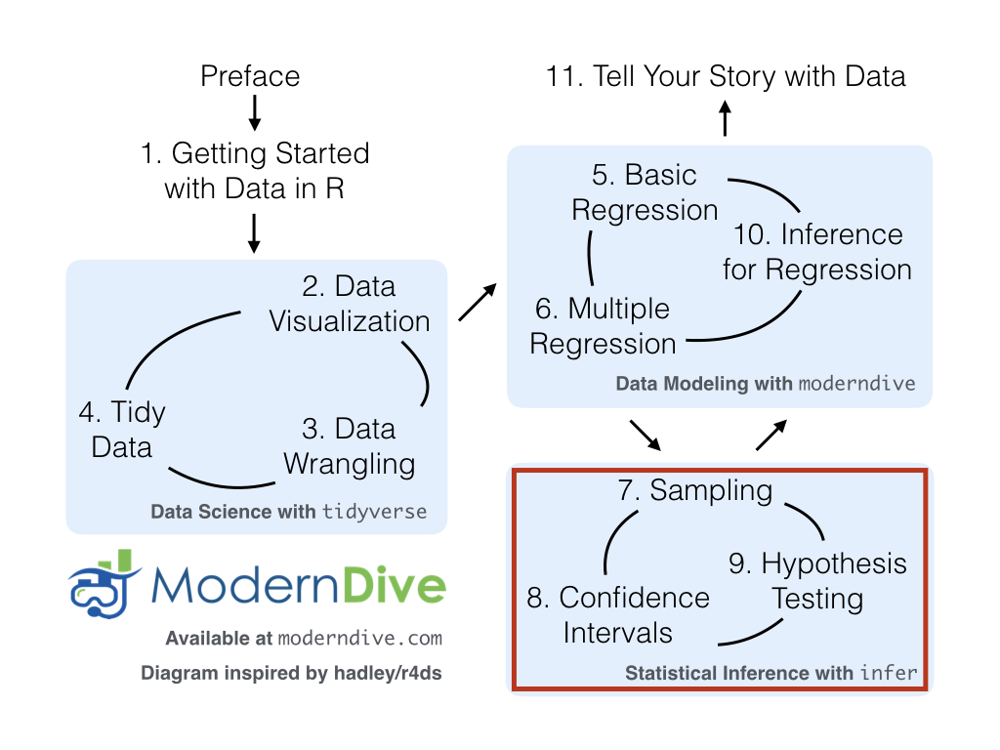

# Multiple Regression {#multiple-regression}

```{r, include=FALSE, purl=FALSE}
chap <- 7
lc <- 0
rq <- 0
# **`r paste0("(LC", chap, ".", (lc <- lc + 1), ")")`**
# **`r paste0("(RQ", chap, ".", (rq <- rq + 1), ")")`**

knitr::opts_chunk$set(
  tidy = FALSE, 
  out.width = '\\textwidth', 
  fig.height = 4,
  fig.align='center',
  warning = FALSE
)

options(scipen = 99, digits = 3)

# In knitr::kable printing replace all NA's with blanks
options(knitr.kable.NA = '')

# Set random number generator see value for replicable pseudorandomness. Why 76?
# https://www.youtube.com/watch?v=xjJ7FheCkCU
set.seed(76)
```

In Chapter \@ref(regression) we introduced ideas related to modeling for explanation, in particular that the goal of modeling is make explicit the relationship between some outcome variable $y$ and some explanatory variable $x$. While there are many approaches to modeling, we focused on one particular technique: *linear regression*, one of the most commonly-used and easy-to-understand approaches to modeling. Furthermore to keep things simple we only considered models with one explanatory $x$ variable that was either numerical in Section \@ref(model1) or categorical in Section \@ref(model2).

In this chapter on multiple regression we'll start considering models that include more than one explanatory variable $x$. You can imagine when trying to model a particular outcome variable, like teaching evaluation scores as in Section \@ref(model1) or life expectancy as in Section \@ref(model2), that it would be very useful to include more than just one explanatory variable's worth of information. 

Since our regression models will now consider more than one explanatory variable, the interpretation of the associated effect of any one explanatory variable must be made in conjunction with the other explanatory variables included in your model. Let's begin!

### Needed packages {-}

Let's load all the packages needed for this chapter (this assumes you've already installed them). Recall from our discussion in Section \@ref(tidyverse-package) that loading the `tidyverse` package by running `library(tidyverse)` loads the following commonly used data science packages all at once:

* `ggplot2` for data visualization
* `dplyr` for data wrangling
* `tidyr` for converting data to "tidy" format
* `readr` for importing spreadsheet data into R
* As well as the more advanced `purrr`, `tibble`, `stringr`, and `forcats` packages

If needed, read Section \@ref(packages) for information on how to install and load R packages. 

```{r, eval=FALSE}
library(tidyverse)
library(moderndive)
library(skimr)
library(ISLR)
```

```{r, echo=FALSE, message=FALSE, warning=FALSE}
library(tidyverse)
library(moderndive)
# DO NOT load the skimr package as a whole as it will break all kable() code for the
# remaining chapters in the book:
# library(skimr)
library(ISLR)
```

```{r, message=FALSE, warning=FALSE, echo=FALSE}
# Packages needed internally, but not in text:
library(kableExtra)
library(patchwork)
library(gapminder)
```


***


## One numerical & one categorical explanatory variable {#model4}

Let's revisit the instructor evaluation data we introduced in Section \@ref(model1), where we studied the relationship between instructor evaluation scores (as given by students) and their "beauty" scores for instructors teaching courses at the UT Austin; the variable teaching `score` was a numerical outcome variable $y$ and the variable beauty score `bty_avg` was a numerical explanatory $x$ variable. 

In this section we are going to consider a different model. Our outcome variable will still be teaching score, but now including two different explanatory variables: age and gender. Could it be that instructors who are older receive better teaching evaluations from students? Or could it instead be that younger instructors receive better evaluations? Are there differences in evaluations given by students for instructors of different genders? We'll answer these questions by modeling the relationship between these variables using *multiple regression* where we have:

1. A numerical outcome variable $y$, as before the instructor's teaching score and
1. Two explanatory variables:
    1. A numerical explanatory variable $x_1$, the instructor's age
    1. A categorical explanatory variable $x_2$, the instructor's binary gender (male or female).

It is important to note that at the time of this study, due to then commonly held beliefs about gender, this variable was often recorded as a binary. While the results of a model that oversimplifies gender this way may be imperfect, we still found the results to be very pertinent and relevant today. An eminent statistician by the name George E.P. Box summarizes our thinking very nicely: ["All models are wrong, but some are useful."](https://en.wikipedia.org/wiki/All_models_are_wrong).


### Exploratory data analysis {#model4EDA}

The data on the 463 courses at the UT Austin can be found in the `evals` data frame included in the `moderndive` package. However, to keep things simple, let's `select()` only the subset of the variables we'll consider in this chapter, and save this data in a new data frame called `eval_ch7`. Note that these are different than the variables chosen in Chapter 6. 

```{r}
evals_ch7 <- evals %>%
  select(ID, score, age, gender)
```

Recall the three common steps in an exploratory data analysis we saw in Section \@ref(model1EDA)

1. Looking at the raw data values.
1. Computing summary statistics, like means, medians, and interquartile ranges.
1. Creating data visualizations.

Let's first look at the raw data values both either looking at `evals_ch7` RStudio's spreadsheet viewer or using the `glimpse()` function

```{r}
glimpse(evals_ch7)
```

Let's also display a random sample of 5 rows of the 463 rows corresponding to different courses in Table \@ref(tab:model4-data-preview). Remember due to the random nature of the sampling, you will likely end up with a different subset of 5 rows.

```{r, eval=FALSE}
evals_ch7 %>%
  sample_n(size = 5)
```
```{r model4-data-preview, echo=FALSE}
evals_ch7 %>%
  sample_n(5) %>%
  knitr::kable(
    digits = 3,
    caption = "A random sample of 5 out of the 463 courses at UT Austin",
    booktabs = TRUE
  ) %>% 
  kable_styling(font_size = ifelse(knitr:::is_latex_output(), 10, 16),
                latex_options = c("HOLD_position"))
```

Now that we've looked at the raw values in our `evals_ch7` data frame and obtained a sense of the data, let's move on to next common step in an exploratory data analysis: computing summary statistics. As we did in our exploratory data analyses in Sections \@ref(model1EDA) and  \@ref(model2EDA) from the previous chapter, let's use the `skim()` function from the `skimr` package, being sure to only `select()` the variables of interest of model:

```{r, eval =FALSE}
evals_ch7 %>% 
  select(score, age, gender) %>% 
  skim()
```
```{r echo=FALSE}
evals_ch7 %>% 
  select(score, age, gender) %>% 
  skimr::skim()
```

Observe for example that we have no missing data, courses taught by 268 male vs 195 female instructors, and and average age of 48.37. Recall however that each row in our data represents a particular course and that instructors can teach more than one course. Therefore the average age of the unique instructors may differ. 

Furthermore, let's compute the correlation between our two numerical variables: `score` and `age`. Recall from Section \@ref(model1EDA) that correlation coefficients only exist between numerical variables. We observe that they are weakly negatively correlated.

```{r}
evals_ch7 %>% 
  get_correlation(formula = score ~ age)
```

Let's now perform the last of the three common steps in an exploratory data analysis: creating data visualizations. Given that the outcome variable `score` and explanatory variable `age` are both numerical, we'll use a scatterplot to display their relationship. How can we incorporate the categorical variable `gender` however? By mapping the variable `gender` to the color aesthetic and creating a *colored* scatterplot! The following code is very similar to the code that created the scatterplot of teaching score and beauty score in Figure \@ref(fig:numxplot1), but with `color = gender` added to the `aes()`.

```{r numxcatxplot1, warning=FALSE, fig.cap="Colored scatterplot of relationship of teaching and beauty scores"}
ggplot(evals_ch7, aes(x = age, y = score, color = gender)) +
  geom_point() +
  labs(x = "Age", y = "Teaching Score", color = "Gender") +
  geom_smooth(method = "lm", se = FALSE)
```

In the resulting Figure \@ref(fig:numxcatxplot1), observe that `ggplot` assigns a default red/blue color scheme to the points and lines associated with each of the two levels of `gender`: `female` and `male`. Furthermore the `geom_smooth(method = "lm", se = FALSE)` layer automatically fits a different regression line for each group since we have provided `color = gender` in the aesthetic mapping. This allows for all subsequent geometries to have the same aesthetic mappings.

We notice some interesting trends:

1. There are almost no women faculty over the age of 60 as evidenced by lack of red dots above $x$ = 60.
1. While both regression lines are negatively sloped with age (i.e. as instructor's age, so also do they tend to receive lower teaching scores), the slope for age for the female instructors is *more* negative. In other words, the female instructors are paying a harsher penalty in their teaching scores then the male instructors do. 

### Interaction model {#model4interactiontable}
  
Let's now quantify the relationship of our outcome variable $y$ and two explanatory variables using one type of multiple regression model known as an "interaction model." Unfortunately, we don't have enough context at this point to explain where the term "interaction" comes from; we'll explain why statisticians use this term at the end of this section.

In particular, we'll write out the equation of the two regression lines in Figure  \@ref(fig:numxcatxplot1) using the values from a regression table. Before we do this however, let's go over a brief refresher of regression when you have a categorical explanatory variable $x$. 

Recall in Section \@ref(model2table) we fit a regression model for countries' life expectancy as a function of which continent the country was in. In other words we had a numerical outcome variable $y$ = `lifeExp` and a categorical explanatory variable $x$ = `continent` which had 5 levels: `Africa`, `Americas`, `Asia`, `Europe`, and `Oceania`. Let's redisplay the regression table you saw in Table \@ref(tab:catxplot4b):

```{r, echo=FALSE}
# Wrangle data
gapminder2007 <- gapminder %>%
  filter(year == 2007) %>%
  select(country, lifeExp, continent, gdpPercap)

# Fit regression model:
lifeExp_model <- lm(lifeExp ~ continent, data = gapminder2007)

# Get regression table and kable output
get_regression_table(lifeExp_model) %>%
  knitr::kable(
    digits = 3,
    caption = "Regression table for life expectancy as a function of continent.",
    booktabs = TRUE
  ) %>%
  kable_styling(font_size = ifelse(knitr:::is_latex_output(), 10, 16),
                latex_options = c("HOLD_position"))
```

Recall our interpretations of the `estimate` column. Since `Africa` was the "baseline for comparison" group since Africa comes first alphabetically, the `intercept` term corresponds to the mean life expectancy for all countries in Africa of 54.8 years. The other 4 values of `estimate` correspond to "offsets" relative to the baseline group. So for example, the "offset" corresponding to the Americas is +18.8 versus the baseline for comparison group Africa i.e. the average life expectancy for countries in the Americas is 18.8 years *higher*. Thus the mean life expectancy for all countries in the Americas is 54.8 + 18.8 = 73.6. The same interpretation holds for Asia, Europe, and Oceania.

Going to back to our multiple regression model for teaching `score` using `age` and `gender` in Figure \@ref(fig:numxcatxplot1), we generate the regression table using the same two step approach from Chapter \@ref(regression): we first "fit" the model using the `lm()` "linear model" function and then we apply the `get_regression_table()` function. This time however our model formula won't be of form `y ~ x`, but rather of form `y ~ x1 * x2`. In other words our two explanatory variables `x1` and `x2` are separated by a `*` sign:

```{r, eval=FALSE}
# Fit regression model:
score_model_interaction <- lm(score ~ age * gender, data = evals_ch7)
# Get regression table:
get_regression_table(score_model_interaction)
```
```{r regtable-interaction, echo=FALSE}
score_model_interaction <- lm(score ~ age * gender, data = evals_ch7)
get_regression_table(score_model_interaction) %>% 
  knitr::kable(
    digits = 3,
    caption = "Regression table for interaction model.", 
    booktabs = TRUE
  ) %>% 
  kable_styling(font_size = ifelse(knitr:::is_latex_output(), 10, 16),
                latex_options = c("HOLD_position"))
```

Looking the regression table output in Table \@ref(tab:regtable-interaction), we see there are four rows of values in the `estimate` column. While it is not immediately apparent, using these four values we can write out the equations of both the red and blue lines in Figure \@ref(fig:numxcatxplot1). Let's build these up.

First, since the word `female` is alphabetically before `male`, female instructors are the "baseline for comparison" group. Therefore `intercept` is the intercept and `age` is the slope for age *for only the female instructors*. In other words, the red regression line in Figure \@ref(fig:numxcatxplot1) has intercept 4.883 and slope for age of -0.018. Remember that for this particular data, while the intercept has a mathematical interpretation, it has no *practical* interpretation since there can't be any instructors with age = 0.

What about the intercept and slope for age of the male instructors? In other words the blue line in Figure \@ref(fig:numxcatxplot1)? This is where our notion of "offsets" comes into play once again. The value for `gendermale` of -0.446 is not the intercept for the male instructors, but rather the *offset* (or difference) in intercept for male instructors relative to female instructors. Therefore, the intercept for the male instructors is `intercept + gendermale` = 4.883 + (-0.446) = 4.883 - 0.446 = 4.437. 

Similarly, `age:gendermale` = 0.014 is not the slope for age for the male instructors, but rather the *offset* (or difference) in slope for the male instructors. Therefore, the slope for age for the male instructors is `age + age:gendermale` =  -0.018 + 0.014 = -0.004. Therefore the blue regression line in Figure \@ref(fig:numxcatxplot1) has intercept 4.437 and slope for age of -0.004.

Let's summarize these values in Table \@ref(tab:interaction-summary) and focus on the two slopes for age:

```{r interaction-summary, echo=FALSE}
tibble(
  Gender = c("Female instructors", "Male instructors"),
  Intercept = c(4.883, 4.437),
  `Slope for age` = c(-0.018, -0.004)
) %>% 
  knitr::kable(
    digits = 3,
    caption = "Comparison of female and male intercepts and age slopes", 
    booktabs = TRUE
  ) %>% 
  kable_styling(font_size = ifelse(knitr:::is_latex_output(), 10, 16),
                latex_options = c("HOLD_position"))
```

Since the slope for age for the female instructors was -0.018, it means that for every additional year in age for female instructors, there is an associated *decrease* of on average 0.018 units in teaching score. For the male instructors however, the corresponding associated decrease was on average only 0.004 units. While both slopes for age were negative, the slope for age for the female instructors is *more negative*. This is consistent with our observation from Figure \@ref(fig:numxcatxplot1), that this model is suggesting female instructors are paying a heavier price for aging in the evaluations they receive from students.

Let's now write the equation for our regression lines, which we can use to compute our fitted values $\widehat{y} = \widehat{\text{score}}$.

$$
\begin{aligned}
\widehat{y} = \widehat{\text{score}} &= b_0 + b_{\mbox{age}} \cdot \mbox{age} + b_{\mbox{male}} \cdot \mathbb{1}_{\mbox{is male}}(x) + b_{\mbox{age,male}} \cdot \mbox{age} \cdot \mathbb{1}_{\mbox{is male}}\\
&= 4.883 -0.018	\cdot \mbox{age} - 0.446 \cdot \mathbb{1}_{\mbox{is male}}(x) + 0.014 \cdot \mbox{age} \cdot \mathbb{1}_{\mbox{is male}}
\end{aligned}
$$

Whoa! That's even more daunting than the equation you saw for the life expectancy as a function of continent in Section \@ref(model2table)! However if you recall what an "indicator function" AKA "dummy variable" does, the equation simplifies greatly. In the above equation, we have one indicator function of interest:

$$
\mathbb{1}_{\mbox{is male}}(x) = \left\{
\begin{array}{ll}
1 & \text{if } \text{instructor } x \text{ is male} \\
0 & \text{otherwise}\end{array}
\right.
$$

Second, let's match coefficients in the above equation with values in the `estimate` column in our regression table in Table \@ref(tab:regtable-interaction):

1. $b_0$ is the `intercept` = 4.883 *for the female instructors*
1. $b_{\mbox{age}}$ is the slope for `age` = -0.018 *for the female instructors*
1. $b_{\mbox{male}}$ is the *offset in intercept for the male instructors*
1. $b_{\mbox{age,male}}$ is the *offset in slope for age for the male instructors*

Let's put this all together and compute the fitted value $\widehat{y} = \widehat{\text{score}}$ for female instructors. Since for female instructors $\mathbb{1}_{\mbox{is male}}(x)$ = 0, the above equation becomes

$$
\begin{aligned}
\widehat{y} = \widehat{\text{score}} &= b_0 + b_{\mbox{age}} \cdot \mbox{age} + b_{\mbox{male}} \cdot \mathbb{1}_{\mbox{is male}}(x) + b_{\mbox{age,male}} \cdot \mbox{age} \cdot \mathbb{1}_{\mbox{is male}}\\
&= 4.883 - 0.018	\cdot \mbox{age} - 0.446 \cdot \mathbb{1}_{\mbox{is male}}(x) + 0.014 \cdot \mbox{age} \cdot \mathbb{1}_{\mbox{is male}}\\
&= 4.883 - 0.018	\cdot \mbox{age} - 0.446 \cdot 0 + 0.014 \cdot \mbox{age} \cdot 0\\
&= 4.883 - 0.018	\cdot \mbox{age} - 0 + 0\\
&= 4.883 - 0.018	\cdot \mbox{age}\\
\end{aligned}
$$

which is the equation of the red regression line in Figure \@ref(fig:numxcatxplot1) corresponding to the female instructors. Correspondingly, since for male instructors $\mathbb{1}_{\mbox{is male}}(x)$ = 1, the above equation becomes

$$
\begin{aligned}
\widehat{y} = \widehat{\text{score}} &= 4.883 - 0.018	\cdot \mbox{age} - 0.446 \cdot \mathbb{1}_{\mbox{is male}}(x) + 0.014 \cdot \mbox{age} \cdot \mathbb{1}_{\mbox{is male}}\\
&= 4.883 - 0.018	\cdot \mbox{age} - 0.446 \cdot 1 + 0.014 \cdot \mbox{age} \cdot 1\\
&= 4.883 - 0.018	\cdot \mbox{age} - 0.446 + 0.014 \cdot \mbox{age}\\
&= (4.883 - 0.446) + (- 0.018 + 0.014) * \mbox{age}\\
&= 4.437 - 0.004	\cdot \mbox{age}\\
\end{aligned}
$$

which is the equation of the blue regression line in Figure \@ref(fig:numxcatxplot1) corresponding to the male instructors. 

Phew! That was a lot of arithmetic! Don't fret however, this is as hard as modeling will get in this book. If you're still a little unsure about using indicator functions and using categorical explanatory variables, we *highly* suggest you re-read Section \@ref(model2table) which involves only a single categorical explanatory variable and thus is much simpler. 

Before we end this section, we explain why we refer to this type of model as an "interaction model." The $b_{\mbox{age,male}}$ term in the equation for the fitted value $\widehat{y}$ = $\widehat{\text{score}}$ is what's known in statistical modeling as an "interaction effect." The interaction term corresponds to the `age:gendermale` = 0.014 in the final row of the regression table in Table \@ref(tab:regtable-interaction).  

We say there is an interaction effect if the associated effect of one variable *depends on the value of another variable*, in other words the two variables are "interacting." In our case, the associated effect of the variable age *depends* on the value of another variable, gender. This was evidenced by the difference in slopes for age of +0.014 of male instructors relative to female instructors. 

Another way of thinking of interaction effects is as follows. For a given instructor at the UT Austin, there might be an associated effect of their age on their teaching scores, there might be an associated effect of the gender on their teaching scores, but when put together, there might an *additional effect due to the intersection* of their age and their gender. 


### Parallel slopes model {#model4table}

When creating regression models with one numerical and one categorical explanatory variable, we are not just limited to interaction models as we just saw. Another type of model we can use is known as the "parallel slopes" model. Unlike with interaction models where the regression line can have both different intercepts and different slopes, parallel slopes models still allow for different intercepts but *force* all lines to have the same slope. The resulting regression lines are thus parallel. Let's visualize the best fitting parallel slopes model to our `evals_ch7` data.

Unfortunately, the `ggplot2` package does not have a convenient way to plot a parallel slopes model. We therefore created our own function `gg_parallel_slopes()` and included it in the `moderndive` package:

```{r numxcatx-parallel, warning=FALSE, fig.cap="Parallel slopes model of relationship of score with age and gender."}
gg_parallel_slopes(y = "score", num_x = "age", cat_x = "gender", 
                   data = evals_ch7)
```

Note the arguments i.e. inputs to this function: the outcome variable `y = "score"`, the numerical explanatory variable `num_x = "age"`, the categorical explanatory variable `cat_x = "gender"`, and the data frame that includes this `data = evals_ch7`. Be careful to include the quotation marks when specifying all variables, something you don't have to do when creating a visualization with `ggplot()`.

Observe in Figure \@ref(fig:numxcatx-parallel) that we now have parallel red and blue lines corresponding to the female and male instructors respectively, in other words they have the same negative slope. In other words, as instructors age, so also do they tend to receive lower teaching evaluation scores from students. However these two lines have different intercepts as evidenced by the fact that the blue line corresponding to the male instructors is higher than the red line corresponding to the female instructors. 

In order to obtain the precise numerical values of the intercepts and the common slope, we once again first "fit" the model using the `lm()` "linear model" function and then we apply the `get_regression_table()` function. However, unlike the interaction model which had a model formula of form `y ~ x1 * x2`, our model formula is now of form `y ~ x1 + x2`. In other words our two explanatory variables `x1` and `x2` are separated by a `+` sign:

```{r, eval=FALSE}
# Fit regression model:
score_model_parallel_slopes <- lm(score ~ age + gender, data = evals_ch7)
# Get regression table:
get_regression_table(score_model_parallel_slopes)
```
```{r regtable-parallel-slopes, echo=FALSE}
score_model_parallel_slopes <- lm(score ~ age + gender, data = evals_ch7)
get_regression_table(score_model_parallel_slopes) %>% 
  knitr::kable(
    digits = 3,
    caption = "Regression table for parallel slopes model.", 
    booktabs = TRUE
  ) %>% 
  kable_styling(font_size = ifelse(knitr:::is_latex_output(), 10, 16),
                latex_options = c("HOLD_position"))
```

Similarly to the regression table for the interaction model from our earlier Table \@ref(tab:regtable-interaction), we have an `intercept` term corresponding to the intercept for the "baseline for comparison" female instructor group and a `gendermale` term corresponding to the *offset* (or difference) in intercept for the male instructors relative to female instructors. In other words in Figure \@ref(fig:numxcatx-parallel) the red regression line corresponding to the female instructors has an intercept of 4.484 while the blue regression line corresponding to the male instructors has an intercept of 4.484 + 0.191 = 4.67. Once again, since there aren't any instructors of age 0, the intercepts only have a mathematical interpretation but no practical one. 

Unlike in Table \@ref(tab:regtable-interaction) we now only have a single term relating to the slope for age as we've forced both the female and male instructors to have a common slope for age of -0.009. In other words, for every increase of 1 year in instructor age, we observe an associated decrease of on average 0.009 units in teaching for *both* the female and male instructor. 

Let's now write the equation for our regression lines, which we can use to compute our fitted values $\widehat{y} = \widehat{\text{score}}$.

$$
\begin{aligned}
\widehat{y} = \widehat{\text{score}} &= b_0 + b_{\mbox{age}} \cdot \mbox{age} + b_{\mbox{male}} \cdot \mathbb{1}_{\mbox{is male}}(x)\\
&= 4.484 -0.009	\cdot \mbox{age} + 0.191 \cdot \mathbb{1}_{\mbox{is male}}(x) 
\end{aligned}
$$

Let's put this all together and compute the fitted value $\widehat{y} = \widehat{\text{score}}$ for female instructors. Since for female instructors $\mathbb{1}_{\mbox{is male}}(x)$ = 0, the above equation becomes

$$
\begin{aligned}
\widehat{y} = \widehat{\text{score}} &= b_0 + b_{\mbox{age}} \cdot \mbox{age} + b_{\mbox{male}} \cdot \mathbb{1}_{\mbox{is male}}(x)\\
&= 4.484 -0.009	\cdot \mbox{age} + 0.191 \cdot \mathbb{1}_{\mbox{is male}}(x)\\
&= 4.484 -0.009	\cdot \mbox{age} + 0.191 \cdot 0\\
&= 4.484 -0.009	\cdot \mbox{age}
\end{aligned}
$$

which is the equation of the red regression line in Figure \@ref(fig:numxcatx-parallel) corresponding to the female instructors. Correspondingly, since for male instructors $\mathbb{1}_{\mbox{is male}}(x)$ = 1, the above equation becomes

$$
\begin{aligned}
\widehat{y} = \widehat{\text{score}} &= b_0 + b_{\mbox{age}} \cdot \mbox{age} + b_{\mbox{male}} \cdot \mathbb{1}_{\mbox{is male}}(x)\\
&= 4.484 -0.009	\cdot \mbox{age} + 0.191 \cdot \mathbb{1}_{\mbox{is male}}(x)\\
&= 4.484 -0.009	\cdot \mbox{age} + 0.191 \cdot 1\\
&= (4.484 + 0.191) - 0.009 \cdot \mbox{age}\\
&= 4.67 -0.009 \cdot \mbox{age}
\end{aligned}
$$

which is the equation of the blue regression line in Figure \@ref(fig:numxcatx-parallel) corresponding to the male instructors. 

Great! We've considered both an interaction model and a parallel slopes model for our data. Let's compare the visualizations for both models side-by-side in Figure \@ref(fig:numxcatx-comparison)

```{r numxcatx-comparison, fig.width = 8, echo = FALSE, warning=FALSE, fig.cap="Comparison of interaction and parallel slopes models."}
interaction_plot <- ggplot(evals_ch7, aes(x = age, y = score, color = gender), show.legend = FALSE) +
  geom_point() +
  labs(x = "Age", y = "Teaching Score", title = "Interaction model") +
  geom_smooth(method = "lm", se = FALSE) +
  theme(legend.position = "none")
parallel_slopes_plot <- gg_parallel_slopes(y = "score", num_x = "age", cat_x = "gender", data = evals_ch7) +
  labs(x = "Age", y = "Teaching Score", title = "Parallel slopes model") +
  theme(axis.title.y = element_blank())
interaction_plot + parallel_slopes_plot
```

At this point, you might be asking yourself: "Why would we ever use an parallel slopes model?" Looking at the left-hand plot in Figure \@ref(fig:numxcatx-comparison), the two lines definitely do not appear to be parallel, so why would we *force* them to be parallel as in the right-hand plot?" For this data, we agree! It can easily be argued that the interaction model is more appropriate. However, in Section \@ref(model-selection) below on model selection, we'll present an example where it can be argued that the case for a parallel slopes model might be stronger. 


### Observed/fitted values and residuals {#model4points}

For brevity's sake, in this section we'll only compute the observed values, fitted values, and residuals for the interaction model which we saved in `score_model_interaction`. You'll have an opportunity to study these values for our parallel slopes model in the upcoming Learning Check.

Say you have a professor who is female and is 36 years old? What fitted value $\widehat{y}$ = $\widehat{\text{score}}$ would our model yield? Say you have another professor who is male and is 59 years old? What would their fitted value $\widehat{y}$ be? We answer this question visually by finding the intersection of the red regression line and a vertical line at $x$ = age = 36; we mark this value with a large red dot in Figure \@ref(fig:fitted-values). Similarly we can identify the fitted value $\widehat{y}$ = $\widehat{\text{score}}$ for the male instructor by finding the intersection of the blue regression line and a vertical line at $x$ = age = 59; we mark this value with a large blue dot in Figure \@ref(fig:fitted-values).

```{r fitted-values, echo = FALSE, warning=FALSE, fig.cap="Fitted values for two new professors"}
newpoints <- evals_ch7 %>% 
  slice(c(1, 5)) %>% 
  get_regression_points(score_model_interaction, newdata = .)

ggplot(evals_ch7, aes(x = age, y = score, color = gender), show.legend = FALSE) +
  geom_point() +
  labs(x = "Age", y = "Teaching Score", title = "Interaction model") +
  geom_smooth(method = "lm", se = FALSE) +
  geom_vline(data = newpoints, aes(xintercept = age, col = gender), linetype = "dashed", size = 1, show.legend = FALSE) +
  geom_point(data = newpoints, aes(x= age, y = score_hat), size = 6, show.legend = FALSE)
```

However, what are these values precisely? We can use the equations of the two regression lines we computed in Section \@ref(model4interactiontable), which in turn were based on values from the regression table in Table \@ref(tab:regtable-interaction):

* For all female instructors: $\widehat{y} = \widehat{\text{score}} = 4.883 - 0.018	\cdot \mbox{age}$
* For all male instructors: $\widehat{y} = \widehat{\text{score}} = 4.437 - 0.004 \cdot \mbox{age}$

So our fitted values would be: 4.883 - 0.018 $\cdot$ 36 = 4.25 and 4.437 - 0.004 $\cdot$ 59 = 4.20 respectively. What if however we wanted the fitted values not just for these two instructors, but the instructors for all 463 courses? Doing this by hand would be long and tedious! This is where the `get_regression_points()` function from the moderndive package can help: it will quickly automate this for all 463 courses. We present the results in Table \@ref(tab:model4-points-table).

```{r, eval=FALSE}
regression_points <- get_regression_points(score_model_interaction)
regression_points
```
```{r model4-points-table, echo=FALSE}
regression_points <- get_regression_points(score_model_interaction)
regression_points %>%
  slice(1:10) %>%
  knitr::kable(
    digits = 3,
    caption = "Regression points (First 10 out of 463 courses)",
    booktabs = TRUE
  ) %>% 
  kable_styling(font_size = ifelse(knitr:::is_latex_output(), 10, 16),
                latex_options = c("HOLD_position"))
```

In fact, it turns out that the female instructor of age 36 taught the first four courses while the male instructor taught the next 3. The resulting $\widehat{y}$ = $\widehat{\text{score}}$ fitted values are in the `score_hat` column. Furthermore, `get_regression_points()` function also returns the residuals $y-\widehat{y}$.  Notice for example the first and fourth courses the female instructor of age 36 taught had positive residuals, indicating that the actual teaching score they received from students was less than their fitted score of 4.25. On the other hand the second and third course this instructor taught had negative residuals, indicating that the actual teaching score they received from students was more than their fitted score of 4.25. 

```{block, type='learncheck', purl=FALSE}
**_Learning check_**
```

**`r paste0("(LC", chap, ".", (lc <- lc + 1), ")")`** Compute the observed values, fitted values, and residuals not for the interaction model as we just did, but rather for the parallel slopes model we saved in `score_model_interaction`.

```{block, type='learncheck', purl=FALSE}
```


***


## Two numerical explanatory variables {#model3}

Let's now switch gears and consider multiple regression models where instead of one numerical and one categorical explanatory variable, we have two numerical explanatory variables! The dataset we'll use is from [An Introduction to Statistical Learning with Applications in R (ISLR)](http://www-bcf.usc.edu/~gareth/ISL/), an intermediate-level textbook on statistical and machine learning. It's accompanying `ISLR` R package contains datasets that the authors apply various machine learning methods to. 

One frequently used dataset in this book `Credit` dataset, where the outcome variable of interest is the credit card debt, in other words credit card debt, of 400 individuals. Other variables like income, credit limit, credit rating, and age are included as well. Note that the `Credit` data is not based on real individuals' financial information, but rather is a simulated dataset used for educational purposes. 

In this section, we'll fit a regression model where we have 

1. A numerical outcome variable $y$, the cardholder's credit card debt
1. Two explanatory variables:
    1. One numerical explanatory variable $x_1$, the cardholder's credit limit
    1. Another numerical explanatory variable $x_2$, the cardholder's income (in thousands of dollars).

In the forthcoming Learning Checks, we'll consider a different regression model

1. The same numerical outcome variable $y$, the cardholder's credit card debt
1. Two different explanatory variables:
    1. One numerical explanatory variable $x_1$, the cardholder's credit rating
    1. Another numerical explanatory variable $x_2$, the cardholder's age.

### Exploratory data analysis {#model3EDA}

Let's load the `Credit` data but to keep things simple to keep things simple, let's `select()` only the subset of the variables we'll consider in this chapter, and save this data in a new data frame called `credit_ch7`. Notice our slightly different use of the `select()` verb here: we'll select the `Balance` variable from `Credit` for example, but we'll save it with a new variable name `debt` since this name is a little easier to understand. 

```{r, warning=FALSE, message=FALSE}
library(ISLR)
credit_ch7 <- Credit %>%
  as_tibble() %>% 
  select(ID, debt = Balance, credit_limit = Limit, 
         income = Income, credit_rating = Rating, age = Age)
```

You can observe the effect of our different use of the `select()` verb in the first common step of an EDA: looking at the raw values either in RStudio's spreadsheet viewer or by using the `glimpse()`

```{r}
glimpse(credit_ch7)
```

Furthermore, let's look at a random sample of 5 out of the `r nrow(credit_ch7)` credit card holders in Table \@ref(tab:model3-data-preview). Note due to the random nature of the sampling, you will likely end up with a different subset of 5 rows.

```{r, eval=FALSE}
credit_ch7 %>%
  sample_n(size = 5)
```
```{r model3-data-preview, echo=FALSE}
credit_ch7 %>%
  sample_n(5) %>%
  knitr::kable(
    digits = 3,
    caption = "Random sample of 5 credit card holders.",
    booktabs = TRUE
  ) %>% 
  kable_styling(font_size = ifelse(knitr:::is_latex_output(), 10, 16),
                latex_options = c("HOLD_position"))
```

Now that we've looked at the raw values in our `credit_ch7` data frame and obtained a sense of the data, let's move on to next common step in an exploratory data analysis: computing summary statistics. As you're probably used to now, let's use the `skim()` function from the `skimr` package, being sure to only `select()` the columns of interest for our model:

Let's look at some summary statistics, again using the `skim()` function from the `skimr` package:

```{r, eval = FALSE}
credit_ch7 %>% 
  select(debt, credit_limit, income) %>% 
  skim()
```
```{r, echo=FALSE}
credit_ch7 %>% 
  select(debt, credit_limit, income) %>% 
  skimr::skim()
```

Observe for example:

1. The mean and median credit card debt are \$520.01 and \$459.50 respectively.
1. 25% of card holders had debts of $68.75 or less.
1. The mean and median credit card limit are \$4735.6 and \$4622.50 respectively.
1. 75% of these card holders had incomes of $57,470 or less.

Since our outcome variable `debt` and the explanatory variables `credit_limit` and `income` are numerical, we can compute the correlation coefficient between pairs of these variables. First, we could run the `get_correlation()` command as seen in Subsection \@ref(model1EDA) twice, once for each explanatory variable:

```{r, eval=FALSE}
credit_ch7 %>% 
  get_correlation(debt ~ credit_limit)
credit_ch7 %>% 
  get_correlation(debt ~ income)
```

Or we can simultaneously compute them by returning a *correlation matrix* which we display in Table \@ref(tab:model3-correlation). We can read off the correlation coefficient for any pair of variables by looking them up in the appropriate row/column combination.

```{r, eval=FALSE}
credit_ch7 %>%
  select(debt, credit_limit, income) %>% 
  cor()
```
```{r model3-correlation, echo=FALSE}
credit_ch7 %>% 
  select(debt, credit_limit, income) %>% 
  cor() %>% 
  knitr::kable(
    digits = 3,
    caption = "Correlation coefficients between credit card debt, credit limit, and income.", 
    booktabs = TRUE
  ) %>% 
  kable_styling(font_size = ifelse(knitr:::is_latex_output(), 10, 16),
                latex_options = c("HOLD_position"))
```

For example, the correlation coefficient of:

1. `debt` with itself is 1 as we would expect based on the definition of the correlation coefficient.
1. `debt` with `credit_limit` is 0.862. This indicates a strong positive linear relationship, which makes sense as only individuals with large credit limits can accrue large credit card debts.
1. `debt` with `income` is 0.464. This is suggestive of another positive linear relationship, although not as strong as the relationship between `debt` and `credit_limit`.
1. As an added bonus, we can read off the correlation coefficient between the two explanatory variables, `credit_limit` and `income` of 0.792. 

<!--
In the case of `credit_limit` and `income`, we say there is a high degree of *collinearity* between these two explanatory variables. Collinearity (or multicollinearity) is a phenomenon whereby one explanatory variable in a multiple regression model is highly correlated with another. In our case, since `credit_limit` and `income` are highly correlated, if we knew someone's`credit_limit` we could make fairly accurate guesses about their `income` as well. To put things different, these two variables provided somewhat redundant information. 
-->

Let's visualize the relationship of the outcome variable with each of the two explanatory variables in two separate plots:

```{r, eval=FALSE}
ggplot(credit_ch7, aes(x = credit_limit, y = debt)) +
  geom_point() +
  labs(x = "Credit limit (in $)", y = "Credit card debt (in $)", 
       title = "Debt and credit limit") +
  geom_smooth(method = "lm", se = FALSE)
  
ggplot(credit_ch7, aes(x = income, y = debt)) +
  geom_point() +
  labs(x = "Income (in $1000)", y = "Credit card debt (in $)", 
       title = "Debt and income") +
  geom_smooth(method = "lm", se = FALSE)
```

```{r 2numxplot1, echo=FALSE, fig.width = 8, fig.cap="Relationship between credit card debt and credit limit/income"}
model3_balance_vs_limit_plot <- ggplot(credit_ch7, aes(x = credit_limit, y = debt)) +
  geom_point() +
  labs(x = "Credit limit (in $)", y = "Credit card debt (in $)", 
       title = "Debt and credit limit") +
  geom_smooth(method = "lm", se = FALSE) +
  scale_y_continuous(limits = c(0, 2000))

model3_balance_vs_income_plot <- ggplot(credit_ch7, aes(x = income, y = debt)) +
  geom_point() +
  labs(x = "Income (in $1000)", y = "Credit card debt (in $)", 
       title = "Debt and income") +
  geom_smooth(method = "lm", se = FALSE) +
  scale_y_continuous(limits = c(0, 2000)) +
  theme(axis.title.y = element_blank())

model3_balance_vs_limit_plot + model3_balance_vs_income_plot
```

Observe there is a positive relationship between credit limit and credit card debt: as credit limit increases so also does credit card debt.  This is consistent with the strongly positive correlation coefficient of 0.862 we computed earlier. In the case of income, the positive relationship doesn't appear as strong, given the weakly positive correlation coefficient of 0.464. 

However the two plots in Figure \@ref(fig:2numxplot1) only focus on the relationship of the outcome variable with each of the two explanatory variables separately. To get a sense of the *joint* relationship of all three variables simultaneously through a visualization, we need a 3-dimensional (3D) scatterplot where for all 400 points we have

1. The numerical outcome variable $y$ `debt` is on the z-axis (the vertical axis)
1. The two numerical explanatory variables form the axes on the bottom:
    1. The first numerical explanatory variable $x_1$ `income`
    1. The second numerical explanatory variable $x_2$ `credit_limit`

Furthermore, we also include a *regression plane*. In the case of regression models with a single numerical explanatory variable, we've seen in Section \@ref(leastsquares) that the regression line is "best fitting" in that of all possible lines we can draw through a cloud of points, it minimizes the sum of squared residuals. This concept now extends to when we have two numerical explanatory variables, only now we have a "best fitting" plane that cuts through the cloud of points that similarly minimizes the sum of squared residuals. 

<!-- This only activates if HTML build. Need to update the text for the PDF. -->

```{r echo=FALSE}
if(knitr:::is_html_output())
  cat("Click on the following image to open an interactive version of this plot in your browser:") 
```

```{r 3D-scatterplot, echo=FALSE, fig.cap = "3D scatterplot and regression plane.", results='asis', purl=FALSE}
if(knitr:::is_html_output()){
  image_link(
    path = "images/credit-card-balance-regression-plane.png", 
    link = "https://beta.rstudioconnect.com/connect/#/apps/3214/", 
    html_opts = "width=75%", 
    latex_opts = "width=0.6\\textwidth", 
    alt_text = "3D scatterplot"
  )
}
```


```{r, eval=FALSE, echo=FALSE}
# Source code for above 3D scatterplot & regression plane. 
library(ISLR)
library(plotly)
library(tidyverse)

# setup hideous grid required by plotly
model_lm <- lm(debt ~ income + credit_limit, data=credit_ch7)
x_grid <- seq(from = min(credit_ch7$income), to = max(credit_ch7$income), length = 100)
y_grid <- seq(from = min(credit_ch7$credit_limit), to = max(credit_ch7$credit_limit), length = 200)
z_grid <- expand.grid(x_grid, y_grid) %>%
  tbl_df() %>%
  rename(x_grid = Var1, y_grid = Var2) %>%
  mutate(z = coef(model_lm)[1] + coef(model_lm)[2]*x_grid + coef(model_lm)[3]*y_grid) %>%
  .[["z"]] %>%
  matrix(nrow=length(x_grid)) %>%
  t()

# Plot points
plot_ly() %>%
  add_markers(
    x = credit_ch7$income,
    y = credit_ch7$credit_limit,
    z = credit_ch7$debt,
    hoverinfo = 'text',
    text = ~paste("x1 - Income: ", 
                  credit_ch7$income, 
                  "</br> x2 - Credit Limit: ", 
                  credit_ch7$credit_limit, 
                  "</br> y - Debt: ", 
                  credit_ch7$debt)
  ) %>% 
  # Label axes
  layout(
    scene = list(
      xaxis = list(title = "x1 - Income (in $10K)"),
      yaxis = list(title = "x2 - Credit Limit ($)"),
      zaxis = list(title = "y - Debt ($)")
    )
  ) %>% 
  # Add regression plane
  add_surface(
    x = x_grid,
    y = y_grid,
    z = z_grid
  )
```


```{block, type='learncheck', purl=FALSE}
**_Learning check_**
```

**`r paste0("(LC", chap, ".", (lc <- lc + 1), ")")`** Conduct a new exploratory data analysis with the same outcome variable $y$ being `debt` but with `credit_rating` and `age` as the new explanatory variables $x_1$ and $x_2$. Remember, this involves three things:

1. Most crucially: Looking at the raw data values.
1. Computing summary statistics, like means, medians, and interquartile ranges.
1. Creating data visualizations.

What can you say about the relationship between a credit card holder's debt and their credit rating and age?

```{block, type='learncheck', purl=FALSE}
```


### Regression plane {#model3table}

Let's now fit a regression model and get the regression table corresponding to the regression plane above. For simplicity's sake, we won't consider the two numerical explanatory variable analogue of the interaction model from Section \@ref(model4interactiontable) which we fit with a model formula of the form `y ~ x1 * x2`, but rather only regression models with model formula of the form `y ~ x1 + x2`. Somewhat confusing however, since we now have a regression plane instead of multiple lines, the label "parallel slopes model" doesn't apply when you have two numerical explanatory variables. 

Just as we have done multiple times throughout Chapters \@ref(regression) and this chapter, let's obtain the regression table for this model using our two-step process and display the results in Table \@ref(tab:model3-table-output)

1. We first "fit" the linear regression model using the `lm(y ~ x1 + x2, data)` function and save it in `debt_model`.
1. We get the regression table by applying the `get_regression_table()` from the `moderndive` package to `debt_model`.

```{r, eval=FALSE}
# Fit regression model:
debt_model <- lm(debt ~ credit_limit + income, data = credit_ch7)
# Get regression table:
get_regression_table(debt_model)
```
```{r model3-table-output, echo=FALSE}
debt_model <- lm(debt ~ credit_limit + income, data = credit_ch7)
credit_line <- get_regression_table(debt_model) %>%
  pull(estimate)
get_regression_table(debt_model) %>% 
  knitr::kable(
    digits = 3,
    caption = "Multiple regression table", 
    booktabs = TRUE
  ) %>% 
  kable_styling(font_size = ifelse(knitr:::is_latex_output(), 10, 16),
                latex_options = c("HOLD_position"))
```

How do we interpret the three values in the `estimate` column?

* `intercept` = -\$385.18 (rounded to two decimal points). The intercept in our case represents the credit card debt for an individual who has  `credit_limit` of \$0 and `income` of \$0. In our data however, the intercept has limited practical interpretation since no individuals had `credit_limit` or `income` values of \$0. Rather, the intercept is used to situate the regression plane in 3D space. 
* `credit_limit` = \$0.26. Taking into account all other the explanatory variables in our model, for every increase of one dollar in `credit_limit`, there is an associated increase of on average \$0.26 in credit card debt. Note:
    + Just as we did in Subsection \@ref(model1table), we are cautious not to make a causal statement by merely stating there there was an *associated* increase.
    + We preface our interpretation with the statement "taking into account all other the explanatory variables in our model", here  `income`, to emphasize that we are now jointly interpreting the associated effect of multiple explanatory variables in the same model at once. 
* `income` = -\$7.66. Taking into account all other the explanatory variables in our model, for every increase of one unit in the variable `income`, in other words \$1000 in actual income, there is an associated decrease of on average \$7.66 in credit card debt.

Putting these results together, the equation of the regression plane that gives us fitted values $\widehat{y}$ = $\widehat{\text{debt}}$.

$$
\begin{aligned}
\widehat{y} &= b_0 + b_1 \cdot x_1 +  b_2 \cdot x_2\\
\widehat{\text{debt}} &= b_0 + b_{\text{limit}} \cdot \text{limit} + b_{\text{income}} \cdot \text{income}\\
&= -387.179 + 0.263 \cdot\text{limit} - 7.663 \cdot\text{income}
\end{aligned}
$$

Recall in the right-hand plot of Figure \@ref(fig:2numxplot1) that when plotting the relationship between `debt` and `income` in isolation, there appeared to be a positive relationship. In the above multiple regression however, when jointly modeling the relationship between `debt`, `credit_limit`, and `income`, there appears to be a negative relationship of `debt` and `income` as evidenced by the negative slope for `income` of -\$7.66.  What explains these contradictory results? A phenomenon known as Simpson's Paradox whereby overall trends that exist in aggregate either disappear or reverse when the data are broken down into groups. In Subsection \@ref(simpsonsparadox) we elaborate on this by looking at the relationship between `credit_limit` and credit card `debt`, but split by different income brackets.

```{block, type='learncheck', purl=FALSE}
**_Learning check_**
```

**`r paste0("(LC", chap, ".", (lc <- lc + 1), ")")`** Fit a new simple linear regression using `lm(debt ~ credit_rating + age, data = credit_ch7)` where `credit_rating` and `age` are the new numerical explanatory variables $x_1$ and $x_2$. Get information about the "best-fitting" regression plane from the regression table by applying the `get_regression_table()` function. How do the regression results match up with the results from your exploratory data analysis above? 

```{block, type='learncheck', purl=FALSE}
```


### Observed/fitted values and residuals {#model3points}

Let's also compute all fitted values and residuals for our regression model using the `get_regression_points()` function and present only the first 10 rows of output in Table \@ref(tab:model3-points-table). Remember that the (x, y, z) coordinates of each of the blue points in our 3D scatterplot can be found in the `income`, `credit_limit`, and `debt` columns. The fitted values on the regression plane are found in the `debt_hat` column and are computed using our equation for the regression plane in the previous section:

$$
\begin{aligned}
\widehat{y} = \widehat{\text{debt}} &= -387.179 + 0.263 \cdot \text{limit} - 7.663 \cdot \text{income}
\end{aligned}
$$

```{r, eval=FALSE}
regression_points <- get_regression_points(debt_model)
regression_points
```
```{r model3-points-table, echo=FALSE}
set.seed(76)
regression_points <- get_regression_points(debt_model)
regression_points %>%
  slice(1:10) %>%
  knitr::kable(
    digits = 3,
    caption = "Regression points (First 10 card holders of 400)",
    booktabs = TRUE
  ) %>% 
  kable_styling(font_size = ifelse(knitr:::is_latex_output(), 10, 16),
                latex_options = c("HOLD_position"))
```


***


## Related topics

### Model selection {#model-selection}

When do we use an interaction model versus a parallel slopes model? Recall in Sections \@ref(model4interactiontable) and \@ref(model4table) we fit both interaction and parallel slopes models for the outcome variable $y$ teaching score using a numerical explanatory variable $x_1$ age and a categorical explanatory variable $x_2$ gender. We compared these models in Figure \@ref(fig:numxcatx-comparison), which we display again below. 

```{r, fig.width = 8, echo = FALSE, warning=FALSE}
interaction_plot <- ggplot(evals_ch7, aes(x = age, y = score, color = gender), show.legend = FALSE) +
  geom_point() +
  labs(x = "Age", y = "Teaching Score", title = "Interaction model") +
  geom_smooth(method = "lm", se = FALSE) +
  theme(legend.position = "none")
parallel_slopes_plot <- gg_parallel_slopes(y = "score", num_x = "age", cat_x = "gender", data = evals_ch7) +
  labs(x = "Age", y = "Teaching Score", title = "Parallel slopes model") +
  theme(axis.title.y = element_blank())
interaction_plot + parallel_slopes_plot
```

A lot of you might have asked yourselves: "Why would I force the lines to have parallel slopes (as seen in the right-hand plot) when they clearly have different slopes (as seen in the left-hand plot)."

The answer lies in a philosophical principle known as "Occam's Razor" which states that "all other things being equal, simpler solutions are more likely to be correct than complex ones." When viewed in a modeling framework, Occam's Razor can be recast as "all other things being equal, simpler models are to be preferred over complex ones." In other words, we should only favor the more complex model if the additional complexity is warranted. 

Let's revisit the equations for the regression line for both the interaction and parallel slopes model:

$$
\begin{aligned}
\text{Interaction} &: \widehat{y} = \widehat{\text{score}} = b_0 + b_{\mbox{age}} \cdot \mbox{age} + b_{\mbox{male}} \cdot \mathbb{1}_{\mbox{is male}}(x) + \\
& \qquad b_{\mbox{age,male}} \cdot \mbox{age} \cdot \mathbb{1}_{\mbox{is male}}\\
\text{Parallel slopes} &: \widehat{y} = \widehat{\text{score}} = b_0 + b_{\mbox{age}} \cdot \mbox{age} + b_{\mbox{male}} \cdot \mathbb{1}_{\mbox{is male}}(x)
\end{aligned}
$$

The interaction model is "more complex" in that there is an additional $b_{\mbox{age,male}} \cdot \mbox{age} \cdot \mathbb{1}_{\mbox{is male}}$ element to the equation not present for the parallel slopes model. Or viewed alternatively, the regression table for the interaction model in Table \@ref(tab:regtable-interaction) has *four* rows, whereas the regression table for the parallel slopes model in Table \@ref(tab:regtable-parallel-slopes) has *three* rows. The question becomes: "Is this additional complexity warranted?" In this case, it can be argued that it is. 

However, let's consider an example where it might not be. Let's consider the `MA_schools` data which contains 2017 data on Massachusetts public high schools provided by Massachusetts Department of Education; read the help file for this data by running `?MA_schools` if you would like more details. Let's model

1. A numerical outcome variable $y$, average SAT math score for that high school
1. Two explanatory variables:
    1. A numerical explanatory variable $x_1$, the percentage of that high school's student body that are economically disadvantaged
    1. A categorical explanatory variable $x_2$, the school size as measured by enrollment: small (13-341 students), medium (342-541 students), and large (542-4264 students)

Let's create visualizations of both the interaction and parallel slopes model once again and display the output in Figure \@ref(fig:numxcatx-comparison-2).

```{r, eval = FALSE}
# Interaction model
ggplot(MA_schools, aes(x = perc_disadvan, y = average_sat_math, color = size)) +
  geom_point(alpha = 0.25) +
  geom_smooth(method = "lm", se = FALSE ) +
  labs(x = "Percent economically disadvantaged", y = "Math SAT Score", 
       color = "School size", title = "Interaction model")

# Parallel slopes model
gg_parallel_slopes(y = "average_sat_math", num_x = "perc_disadvan", 
                   cat_x = "size", data = MA_schools, alpha = 0.25) + 
  labs(x = "Percent economically disadvantaged", y = "Math SAT Score", 
       color = "School size", title = "Parallel slopes model") 
```
```{r numxcatx-comparison-2, fig.width = 8, echo = FALSE, warning=FALSE, fig.cap="Comparison of interaction and parallel slopes models."}
p1 <- ggplot(MA_schools, aes(x = perc_disadvan, y = average_sat_math, color = size))+
  geom_point(alpha = 0.25) +
  geom_smooth(method = "lm", se = FALSE ) +
  labs(x = "Percent economically disadvantaged", y = "Math SAT Score", 
       color = "School size", title = "Interaction model") + 
  theme(legend.position = "none")
p2 <- gg_parallel_slopes(y = "average_sat_math", num_x = "perc_disadvan", 
                         cat_x = "size", data = MA_schools, alpha = 0.25) + 
  labs(x = "Percent economically disadvantaged", y = "Math SAT Score", 
       color = "School size", title = "Parallel slopes model")  +
  theme(axis.title.y = element_blank())
p1 + p2
```

Looking closely at the left-hand plot of Figure \@ref(fig:numxcatx-comparison-2), while the slopes are indeed different they are not different *by much*, in other words they are near identical. Comparing the left-hand plot with the right-hand plot, they don't appear all that different at all. In this case, it can be argued that the additional complexity of the interaction model is *not warranted* and thus by Occam's Razor the simpler parallel slopes model is to be preferred. 

This additional complexity is apparent when comparing the corresponding regression tables in Tables \@ref(tab:model2-interaction) and \@ref(tab:model2-parallel-slopes); the regression table for the interaction model has 2 more rows. Furthermore, the *offsets* in slopes for percentage of students that are disadvantaged `perc_disadvan:sizemedium` = 0.146 and `perc_disadvan:sizelarge` = 0.189 are very small relative to the slope for the baseline group of small schools.

```{r, eval = FALSE}
model_2_interaction <- lm(average_sat_math ~ perc_disadvan * size, 
                          data = MA_schools)
get_regression_table(model_2_interaction)
```
```{r model2-interaction, echo = FALSE}
model_2_interaction <- lm(average_sat_math ~ perc_disadvan * size, 
                          data = MA_schools)
get_regression_table(model_2_interaction) %>% 
  knitr::kable(
    digits = 3,
    caption = "Interaction model regression table", 
    booktabs = TRUE
  ) %>% 
  kable_styling(font_size = ifelse(knitr:::is_latex_output(), 10, 16),
                latex_options = c("HOLD_position"))
```
```{r, eval = FALSE}
model_2_parallel_slopes <- lm(average_sat_math ~ perc_disadvan + size, 
                              data = MA_schools)
get_regression_table(model_2_parallel_slopes)
```
```{r model2-parallel-slopes, echo = FALSE}
model_2_parallel_slopes <- lm(average_sat_math ~ perc_disadvan + size, 
                              data = MA_schools)
get_regression_table(model_2_parallel_slopes) %>% 
  knitr::kable(
    digits = 3,
    caption = "Parallel slopes regression table", 
    booktabs = TRUE
  ) %>% 
  kable_styling(font_size = ifelse(knitr:::is_latex_output(), 10, 16),
                latex_options = c("HOLD_position"))
```

These results are suggesting that irrespective of school size, the relationship between average math SAT scores and the percent of the student body that is economically disadvantaged is alas very negative. 

What you have just performed is a rudimentary *model selection*: choosing which model fits data best among a set of candidate models. While the model selection you just performed was somewhat qualitative fashion, more statistically rigorous methods exist. If you're curious, take a course on multiple regression! 


### Correlation coefficient {#correlationcoefficient2}

Recall from Table \@ref(tab:model3-correlation) that the correlation coefficient between `income` in thousands of dollars and credit card `debt` was 0.464. What if in instead we looked at the correlation coefficient between `income` and credit card `debt`, but where `income` was in dollars and not thousands of dollars? This can be done by multiplying `income` by 1000.

```{r, eval=FALSE}
library(ISLR)
credit_ch7 %>% 
  select(debt, income) %>% 
  mutate(income = income * 1000) %>% 
  cor()
```
```{r cor-credit-2, echo=FALSE}
library(ISLR)
credit_ch7 %>% 
  select(debt, income) %>% 
  mutate(income = income * 1000) %>% 
  cor() %>% 
  knitr::kable(
    digits = 3,
    caption = "Correlation between income (in dollars) and credit card debt", 
    booktabs = TRUE
  ) %>% 
  kable_styling(font_size = ifelse(knitr:::is_latex_output(), 10, 16),
                latex_options = c("HOLD_position"))
```

We see it is the same! We say that the correlation coefficient is invariant to linear transformations! In other words, the correlation between $x$ and $y$ will be the same as the correlation between $a\times x + b$ and $y$ for any numerical values $a$ and $b$.


### Simpson's Paradox {#simpsonsparadox}

Recall in Section \@ref(model3), we saw the two following seemingly contradictory results when studying the relationship between credit card debt, credit limit, and income. On the one hand, the right hand plot of Figure \@ref(fig:2numxplot1) suggested that credit card debt and income were positively related:

```{r echo=FALSE, fig.height=4, fig.cap="Relationship between credit card debt and credit limit/income"}
model3_balance_vs_limit_plot + model3_balance_vs_income_plot
```

On the other hand, the multiple regression in Table \@ref(tab:model3-table-output), suggested that when modeling credit card debt as a function of *both* `credit_limit` and `income` at the same time, credit limit has a negative relationship with credit card debt as evidenced by the slope of -7.66. How can this be?

First, let's dive a little deeper into the explanatory variable `credit_limit`. Figure \@ref(fig:credit-limit-quartiles) shows a histogram of all `r nrow(credit_ch7)` values of `credit_limit`, along with vertical red lines that cut up the data into quartiles, meaning: 

1. 25% of credit limits were between \$0 and \$3088. Let's call this the `low` credit limit group.
1. 25% of credit limits were between \$3088 and \$4622. Let's call this the `medium-low` credit limit group.
1. 25% of credit limits were between \$4622 and \$5873. Let's call this the `medium-high` credit limit group.
1. 25% of credit limits were over \$5873. Let's call this the `high` credit limit group.

```{r credit-limit-quartiles, echo=FALSE, fig.height=4, fig.cap="Histogram of credit limits and quartiles", message=FALSE}
ggplot(credit_ch7, aes(x = credit_limit)) +
  geom_histogram(color = "white") +
  geom_vline(xintercept = quantile(credit_ch7$credit_limit, probs = c(0.25, 0.5, 0.75)), col = "red", linetype = "dashed") +
  labs(x = "Credit limit", title = "Credit limit quartiles")
```

In Figure \@ref(fig:2numxplot4) let's display

1. In the left-hand plot: The scatterplot showing the relationship between credit card `debt` and `credit_limit` from earlier.
1. In the right-hand plot: The same exact same scatterplot both now with color indicating 

```{r, 2numxplot4, fig.width=8, echo=FALSE, fig.cap="Relationship between credit card debt and income for different credit limit groups"}
credit_ch7 <- credit_ch7 %>% 
  mutate(limit_bracket = cut_number(credit_limit, 4)) %>% 
  mutate(limit_bracket = fct_recode(limit_bracket,
    "low" =  "[855,3.09e+03]",
    "medium-low" = "(3.09e+03,4.62e+03]", 
    "medium-high" = "(4.62e+03,5.87e+03]", 
    "high" = "(5.87e+03,1.39e+04]"
  ))

model3_balance_vs_income_plot <- ggplot(credit_ch7, aes(x = income, y = debt)) +
  geom_point() +
  labs(x = "Income (in $1000)", y = "Credit card debt (in $)", 
       title = "Debt vs income (overall)") +
  geom_smooth(method = "lm", se = FALSE) +
  scale_y_continuous(limits = c(0, NA))

model3_balance_vs_income_plot_colored <- ggplot(credit_ch7, aes(x = income, y = debt, col = limit_bracket)) +
  geom_point() +
  geom_smooth(method = "lm", se = FALSE) +
  labs(x = "Income (in $1000)", y = "Credit card debt (in $)", 
       color = "Credit limit", title = "Debt vs income (colored by credit limit)") + 
  scale_y_continuous(limits = c(0, NA)) +
  theme(axis.title.y = element_blank())
  
model3_balance_vs_income_plot + model3_balance_vs_income_plot_colored
```

The left-hand plot focuses of the relationship between debt and income in *aggregate*, which suggests a positive relationship between income and credit card debt. However, the right-hand plot focuses on the relationship between debt and income *broken down by credit limit group*, where we observe that the `low` (red points), `medium-low` (green points), and `medium-high` (blue points) income groups, the strong positive relationship between credit card debt and income disappears! Only for the high bracket does the relationship stay somewhat positive. In this example, credit limit is a *confounding variable* for credit card debt and income. This is a phenomenon known as [Simpson's Paradox](https://en.wikipedia.org/wiki/Simpson%27s_paradox) whereby overall trends that exist in aggregate either disappear or reverse when the data are broken down into groups. 


***


## Conclusion

### Additional resources

An R script file of all R code used in this chapter is available [here](scripts/07-multiple-regression.R).

### What's to come?

Congratulations! We've completed the "Data Modeling via moderndive" portion of this book! We're ready to proceed to the third and final portion of this book: "Statistical Inference via infer. Statistical inference is the science of inferring about some unknown quantity using sampling. Among the most well-known example of sampling are polls. Because asking an entire population about their opinions would be a long and arduous task, pollsters often take a smaller sample that is hopefully representative of the population. Based on the results of the sample, pollsters hope to make claims about the greater population. 

Once we've covered Chapters \@ref(sampling) on sampling, \@ref(confidence-intervals) on confidence intervals, and \@ref(hypothesis-testing) on hypothesis testing, in Chapter \@ref(inference-for-regression) on inference for regression we'll revisit the regression models we studied in Chapter \@ref(regression) and \@ref(multiple-regression). So far we've only studied the `estimate` column of all our regression tables. The next 4 chapters focus on what the remaining columns mean: `std_error` standard error, `statistic` test statistic, `p_value` p-value, `lower_ci` lower 95% confidence interval bound, and `upper_ci` upper 95% confidence interval bound.

Furthermore, we'll talk about the importance of residuals $y - \widehat{y}$ play in interpreting the results of a regression. We'll perform what is known as *residual analyses* of the `residual` variable of all `get_regression_points()` output to verify what are known as the "assumptions for inference for regression. On to the next one!

<center></center>
