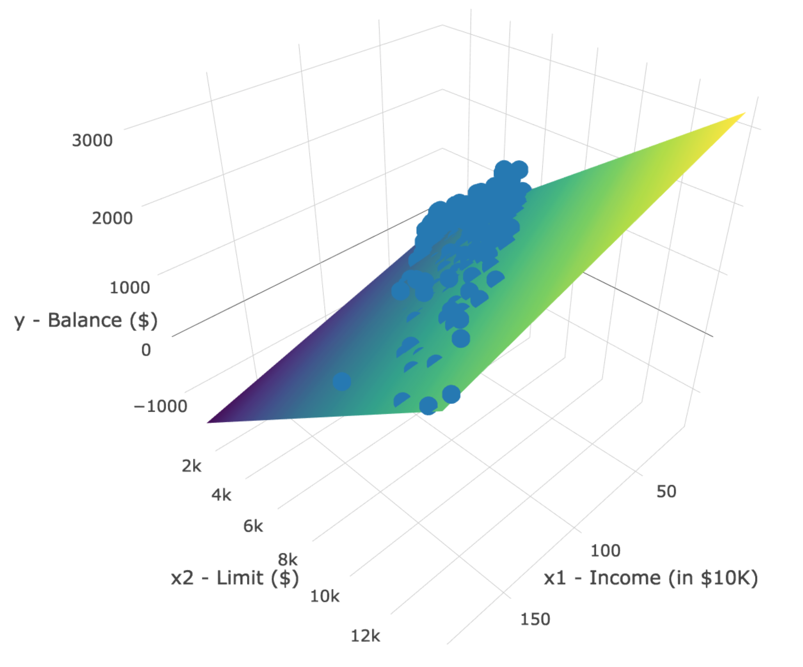

# Multiple Regression {#multiple-regression}

```{r, include=FALSE, purl=FALSE}
chap <- 7
lc <- 0
rq <- 0
# **`r paste0("(LC", chap, ".", (lc <- lc + 1), ")")`**
# **`r paste0("(RQ", chap, ".", (rq <- rq + 1), ")")`**

knitr::opts_chunk$set(
  tidy = FALSE,
  out.width = "\\textwidth",
  message = FALSE,
  warning = FALSE
  )
options(scipen = 99, digits = 3)

# This bit of code is a bug fix on asis blocks, which we use to show/not show LC
# solutions, which are written like markdown text. In theory, it shouldn't be
# necessary for knitr versions <=1.11.6, but I've found I still need to for
# everything to knit properly in asis blocks. More info here: 
# https://stackoverflow.com/questions/32944715/conditionally-display-block-of-markdown-text-using-knitr
library(knitr)
knit_engines$set(asis = function(options) {
  if (options$echo && options$eval) knit_child(text = options$code)
})

# This controls which LC solutions to show. Options for solutions_shown: "ALL"
# (to show all solutions), or subsets of c('5-1', '5-2','5-3', '5-4'), including
# the null vector c("") to show no solutions.
solutions_shown <- c("")
show_solutions <- function(section){
  return(solutions_shown == "ALL" | section %in% solutions_shown)
  }
```

In Chapter \@ref(regression) we introduced ideas related to modeling, in particular that the fundamental premise of modeling is *to make explicit the relationship* between an outcome variable $y$ and an explanatory/predictor variable $x$. Recall further the synonyms that we used to also denote $y$ as the dependent variable and $x$ as an independent variable or covariate. 

There are many modeling approaches one could take, among the most well-known being linear regression, which was the focus of the last chapter. Whereas in the last chapter we focused solely on regression scenarios where there is only one explanatory/predictor variable, in this chapter, we now focus on modeling scenarios where there is more than one. This case of regression more than one explanatory variable is known as multiple regression. You can imagine when trying to model a particular outcome variable, like teaching evaluation score as in Section \@ref(model1) or life expectancy as in Section \@ref(model2), it would be very useful to incorporate more than one explanatory variable. 

Since our regression models will now consider more than one explanatory/predictor variable, the interpretation of the associated effect of any one explanatory/predictor variables must be made in conjunction with the others. For example, say we are modeling individuals' incomes as a function of their number of years of education and their parents' wealth. When interpreting the effect of education on income, one has to consider the effect of their parents' wealth at the same time, as these two variables are almost certainly related. Make note of this throughout this chapter and as you work on interpreting the results of multiple regression models into the future.


### Needed packages {-}

Let's load all the packages needed for this chapter (this assumes you've already installed them). Read Section \@ref(packages) for information on how to install and load R packages.

```{r, message=FALSE, warning=FALSE}
library(ggplot2)
library(dplyr)
library(moderndive)
library(ISLR)
```

```{r, message=FALSE, warning=FALSE, echo=FALSE}
# Packages needed internally, but not in text:
library(mvtnorm)
library(tidyr)
library(forcats)
library(gridExtra)
```


### DataCamp {-}

The approach taken below of using more than one variable of information in models using multiple regression is identical to that taken in ModernDive co-author [Albert Y. Kim's](https://twitter.com/rudeboybert) DataCamp course "Modeling with Data in the Tidyverse." If you're interested in complementing your learning below in an interactive online environment, click on the image below to access the course. The relevant chapters are Chapter 1 "Introduction to Modeling" and Chapter 3 "Modeling with Multiple Regression".

<center>
<a target="_blank" class="page-link" href="https://www.datacamp.com/courses/modeling-with-data-in-the-tidyverse"></a>
</center>


## Two numerical explanatory variables {#model3}

Let's now attempt to identify factors that are associated with how much credit card debt an individual will have. The textbook [An Introduction to Statistical Learning with Applications in R](http://www-bcf.usc.edu/~gareth/ISL/) by Gareth James, Daniela Witten, Trevor Hastie, and Robert Tibshirani is an intermediate-level textbook on statistical and machine learning freely available [here](http://www-bcf.usc.edu/~gareth/ISL/ISLR%20Seventh%20Printing.pdf). It has an accompanying R package called `ISLR` with datasets that the authors use to demonstrate various machine learning methods. One dataset that is frequently used by the authors is the `Credit` dataset where predictions are made on the credit card balance held by $n = 400$ credit card holders. These predictions are based on information about them like income, credit limit, and education level. 

Since no information was provided as to who these $n$ = 400 individuals are and how they came to be included in this dataset, it will be hard to make any scientific claims based on this data. Recall our discussion from the previous chapter that correlation does not necessarily imply causation. That being said, we'll still use `Credit` to demonstrate multiple regression with:

1. A numerical outcome variable $y$, in this case credit card balance.
1. Two explanatory variables:
    1. A first numerical explanatory variable $x_1$. In this case, their credit limit.
    1. A second numerical explanatory variable $x_2$. In this case, their income (in thousands of dollars).


In the forthcoming Learning Checks, we'll consider a different scenario:

1. The same numerical outcome variable $y$: credit card balance.
1. Two new explanatory variables:
    1. A first numerical explanatory variable $x_1$: their credit rating.
    1. A second numerical explanatory variable $x_2$: their age.


### Exploratory data analysis {#model3EDA}

Let's load the `Credit` data and `select()` only the needed subset of variables. However, what does the `data("Credit")` command do? It reloads a fresh copy of the `Credit` dataset just in case you've lost some of the original data.  

```{r, warning=FALSE, message=FALSE}
library(ISLR)
data("Credit")
Credit <- Credit %>%
  select(Balance, Limit, Income, Rating, Age)
```

Let's look at the raw data values both by bringing up RStudio's spreadsheet viewer and the `glimpse()` function. Although in Table \@ref(tab:model3-data-preview) we only show 5 randomly selected credit card holders out of `r nrow(Credit)`:

```{r, eval=FALSE}
View(Credit)
```

```{r model3-data-preview, echo=FALSE}
Credit %>%
  sample_n(5) %>%
  knitr::kable(
    digits = 3,
    caption = "Random sample of 5 credit card holders",
    booktabs = TRUE
  )
```

```{r}
glimpse(Credit)
```

Let's look at some summary statistics:

```{r}
Credit %>% 
  select(Balance, Limit, Income) %>% 
  summary()
```


We observe, for example,

1. The mean and median credit card balance is around $500. 25% of card holders had debts of 69 dollars or less.
1. The mean and median credit card limit is just under $5000.
1. 75% of these card holders had incomes of $57,500 or less.

Since our outcome variable `Balance` and the explanatory variables
`Limit` and `Rating` are numerical, we can compute the correlation coefficient
between pairs of these variables. First, we could
run the `get_correlation()` command as seen in Subsection \@ref(model1EDA) twice, once for
each explanatory variable:

```{r, eval=FALSE}
Credit %>% 
  get_correlation(Balance ~ Limit)
Credit %>% 
  get_correlation(Balance ~ Income)
```

Or we can simultaneously compute them by returning a *correlation matrix* in 
Table \@ref(tab:model3-correlation). We can read off the correlation coefficient
for any pair of variables by looking them up in the appropriate row/column combination.

```{r, eval=FALSE}
Credit %>%
  select(Balance, Limit, Income) %>% 
  cor()
```
```{r model3-correlation, echo=FALSE}
Credit %>% 
  select(Balance, Limit, Income) %>% 
  cor() %>% 
  knitr::kable(
    digits = 3,
    caption = "Correlations between credit card balance, credit limit, and income", 
    booktabs = TRUE
  )
```

For example, the correlation coefficient of:

1. `Balance` with itself is 1 as we would expect based on the definition of the correlation coefficient.
1. `Balance` with `Limit` is 0.862. This indicates a strong positive linear relationship, which makes sense as only individuals with large credit limits can accrue large credit card balances.
1. `Balance` with `Income` is 0.464. This is suggestive of another positive linear relationship, although not as strong as the relationship between `Balance` and `Limit`.
1. As an added bonus, we can read off the correlation coefficient of the two explanatory variables, `Limit` and `Income` of 0.792. In this case, we say there is a high degree of *collinearity* between these two explanatory variables. 

Collinearity (or multicollinearity) is a phenomenon in which one explanatory variable in a multiple regression model can be linearly predicted from the others with a substantial degree of accuracy. So in this case, if we knew someone's credit card `Limit` and since `Limit` and `Income` are highly correlated, we could make a fairly accurate guess as to that person's `Income`. Or put loosely, these two variables provided redundant information. For now let's ignore any issues related to collinearity and press on.

Let's visualize the relationship of the outcome variable with each of the two explanatory variables in two separate plots:

```{r, eval=FALSE}
ggplot(Credit, aes(x = Limit, y = Balance)) +
  geom_point() +
  labs(x = "Credit limit (in $)", y = "Credit card balance (in $)", 
       title = "Relationship between balance and credit limit") +
  geom_smooth(method = "lm", se = FALSE)
  
ggplot(Credit, aes(x = Income, y = Balance)) +
  geom_point() +
  labs(x = "Income (in $1000)", y = "Credit card balance (in $)", 
       title = "Relationship between balance and income") +
  geom_smooth(method = "lm", se = FALSE)
```

```{r 2numxplot1, echo=FALSE, fig.height=4, fig.cap="Relationship between credit card balance and credit limit/income"}
model3_balance_vs_limit_plot <- ggplot(Credit, aes(x = Limit, y = Balance)) +
  geom_point() +
  labs(x = "Credit limit (in $)", y = "Credit card balance (in $)", 
       title = "Balance vs credit limit") +
  geom_smooth(method = "lm", se = FALSE)
model3_balance_vs_income_plot <- ggplot(Credit, aes(x = Income, y = Balance)) +
  geom_point() +
  labs(x = "Income (in $1000)", y = "Credit card balance (in $)", 
       title = "Balance vs income") +
  geom_smooth(method = "lm", se = FALSE) +
  scale_y_continuous(limits = c(0, NA))
grid.arrange(model3_balance_vs_limit_plot, model3_balance_vs_income_plot, nrow = 1)
```

First, there is a positive relationship between credit limit and balance, since as credit limit increases so also does credit card balance; this is to be expected given the strongly positive correlation coefficient of 0.862. In the case of income, the positive relationship doesn't appear as strong, given the weakly positive correlation coefficient of 0.464. However the two plots in Figure \@ref(fig:2numxplot1) only focus on the relationship of the outcome variable with each of the explanatory variables independently. To get a sense of the *joint* relationship of all three variables simultaneously through a visualization, let's display the data in a 3-dimensional (3D) scatterplot, where

1. The numerical outcome variable $y$ `Balance` is on the z-axis (vertical axis)
1. The two numerical explanatory variables form the "floor" axes. In this case
    1. The first numerical explanatory variable $x_1$ `Income` is on of the floor axes.
    1. The second numerical explanatory variable $x_2$ `Limit` is on the other floor axis.

Click on the following image to open an interactive 3D scatterplot in your browser:

<center><a target="_blank" href="http://rpubs.com/moderndive/credit_card_balance_3D_scatterplot"></a></center>

```{r, eval=FALSE, echo=FALSE}
# Save as 798 x 562 images/credit_card_balance_3D_scatterplot.png
library(ISLR)
library(plotly)
plot_ly(showscale=FALSE) %>%
  add_markers(
    x = Credit$Income,
    y = Credit$Limit,
    z = Credit$Balance,
    hoverinfo = 'text',
    text = ~paste("x1 - Income: ", Credit$Income, 
                  "</br> x2 - Limit: ", Credit$Limit, 
                  "</br> y - Balance: ", Credit$Balance)
  ) %>% 
  layout(
    scene = list(
      xaxis = list(title = "x1 - Income (in $10K)"),
      yaxis = list(title = "x2 - Limit ($)"),
      zaxis = list(title = "y - Balance ($)")
    )
  )
```

Previously in Figure \@ref(fig:numxplot4), we plotted a "best-fitting" regression line through a set of points where the numerical outcome variable $y$ was teaching `score` and a single numerical explanatory variable $x$ was `bty_avg`. What is the analogous concept when we have *two* numerical predictor variables? Instead of a best-fitting line, we now have a best-fitting *plane*, which is a 3D generalization of lines which exist in 2D. Click on the following image to open an interactive plot of the regression plane in your browser. Move the image around, zoom in, and think about how this plane generalizes the concept of a linear regression line to three dimensions.

<center><a target="_blank" href="https://beta.rstudioconnect.com/connect/#/apps/3214/"></a></center>

```{r, eval=FALSE, echo=FALSE}
# Save as 798 x 562 images/credit_card_balance_regression_plane.png
library(ISLR)
library(plotly)
library(tidyverse)

# setup hideous grid required by plotly
model_lm <- lm(Balance ~ Income + Limit, data=Credit)
x_grid <- seq(from=min(Credit$Income), to=max(Credit$Income), length=100)
y_grid <- seq(from=min(Credit$Limit), to=max(Credit$Limit), length=200)
z_grid <- expand.grid(x_grid, y_grid) %>%
  tbl_df() %>%
  rename(
    x_grid = Var1,
    y_grid = Var2
  ) %>%
  mutate(z = coef(model_lm)[1] + coef(model_lm)[2]*x_grid + coef(model_lm)[3]*y_grid) %>%
  .[["z"]] %>%
  matrix(nrow=length(x_grid)) %>%
  t()

# plot points and plane
plot_ly(showscale = FALSE) %>%
  add_markers(
    x = Credit$Income,
    y = Credit$Limit,
    z = Credit$Balance,
    hoverinfo = 'text',
    text = ~paste("x1 - Income: ", Credit$Income, "</br> x2 - Limit: ", 
                  Credit$Limit, "</br> y - Balance: ", Credit$Balance)
  ) %>% 
  layout(
    scene = list(
      xaxis = list(title = "x1 - Income (in $10K)"),
      yaxis = list(title = "x2 - Limit ($)"),
      zaxis = list(title = "y - Balance ($)")
    )
  ) %>% 
  add_surface(
    x = x_grid,
    y = y_grid,
    z = z_grid
  )
```

```{block, type='learncheck', purl=FALSE}
**_Learning check_**
```

**`r paste0("(LC", chap, ".", (lc <- lc + 1), ")")`** Conduct a new exploratory data analysis with the same outcome variable $y$ being `Balance` but with `Rating` and `Age` as the new explanatory variables $x_1$ and $x_2$. Remember, this involves three things:

a) Looking at the raw values
a) Computing summary statistics of the variables of interest.
a) Creating informative visualizations

What can you say about the relationship between a credit card holder's balance and their credit rating and age?

<!-- CHESTER: I'm not sold on this practice and prefer to assign new variables in R like `Credit_small` instead of overwriting. I seem to remember us agreeing that re-assignment was only OK if we added more variables in Chapter 2-5, not if we chose a subset. We should stay consistent throughout so I'd recommend switching this to a different name as I have with `evals` in Chapters 6 and 7. -->

```{block, type='learncheck', purl=FALSE}
```


### Multiple regression {#model3table}

Just as we did when we had a single numerical explanatory variable $x$ in Subsection \@ref(model1table) and when we had a single categorical explanatory variable $x$ in Subsection \@ref(model2table), we fit a regression model and obtained the regression table in our two numerical explanatory variable scenario. To fit a regression model and get a table using `get_regression_table()`, we now use a `+` to consider multiple explanatory variables. In this case since we want to perform a regression of `Limit` and `Income` simultaneously, we input `Balance ~ Limit + Income`.

```{r, eval=FALSE}
Balance_model <- lm(Balance ~ Limit + Income, data = Credit)
get_regression_table(Balance_model)
```
```{r, echo=FALSE}
Balance_model <- lm(Balance ~ Limit + Income, data = Credit)
Credit_line <- get_regression_table(Balance_model) %>%
  pull(estimate)
```
```{r model3-table-output, echo=FALSE}
get_regression_table(Balance_model) %>% 
  knitr::kable(
    digits = 3,
    caption = "Multiple regression table", 
    booktabs = TRUE
  )
```

How do we interpret these three values that define the regression plane?

* Intercept: -$385.18 (rounded to two decimal points to represent cents). The intercept in our case represents the credit card balance for an individual who has both a credit `Limit` of $0 and `Income` of $0. In our data however, the intercept has limited practical interpretation as no individuals had `Limit` or `Income` values of $0 and furthermore the smallest credit card balance was $0. Rather, it is used to situate the regression plane in 3D space. 
* Limit: $0.26. Now that we have multiple variables to consider, we have to add
a caveat to our interpretation: *taking all other variables in our model into account, for every increase of one unit in credit `Limit` (dollars), there is an associated increase of on average $0.26 in credit card balance*. Note:
    + Just as we did in Subsection \@ref(model1table), we are not making any causal statements, only statements relating to the association between credit limit and balance
    + We need to preface our interpretation of the associated effect of `Limit` with the statement "taking all other variables into account", in this case `Income`, to emphasize that we are now jointly interpreting the associated effect of multiple explanatory variables in the same model and not in isolation.
* Income: -$7.66. Similarly, *taking all other variables into account, for every increase of one unit in `Income` (in other words, $1000 in income), there is an associated decrease of on average $7.66 in credit card balance*.

However, recall in Figure \@ref(fig:2numxplot1) that when considered separately, both `Limit` and `Income` had positive relationships with the outcome variable `Balance`. As card holders' credit limits increased their credit card balances tended to increase as well, and a similar relationship held for incomes and balances. In the above multiple regression, however, the slope for `Income` is now -7.66, suggesting a *negative relationship* between income and credit card balance. What explains these contradictory results? 

This is known as Simpson's Paradox, a phenomenon in which a trend appears in several different groups of data but disappears or reverses when these groups are combined. We expand on this in Subsection \@ref(simpsonsparadox) where we'll look at the relationship between credit `Limit` and credit card balance but split by different income bracket groups.

```{block, type='learncheck', purl=FALSE}
**_Learning check_**
```

**`r paste0("(LC", chap, ".", (lc <- lc + 1), ")")`** Fit a new simple linear regression using `lm(Balance ~ Rating + Age, data = Credit)` where `Rating` and `Age` are the new numerical explanatory variables $x_1$ and $x_2$. Get information about the "best-fitting" line from the regression table by applying the `get_regression_table()` function. How do the regression results match up with the results from your exploratory data analysis above? 

```{block, type='learncheck', purl=FALSE}
```


### Observed/fitted values and residuals {#model3points}

As we did previously in Table \@ref(tab:model3-points-table), let's unpack the output of the `get_regression_points()` function for our model for credit card balance for all `r nrow(Credit)` card holders in the dataset. Recall that each card holder corresponds to one of the `r nrow(Credit)` rows in the `Credit` data frame and also for one of the `r nrow(Credit)` 3D points in the 3D scatterplots in Subsection \@ref(model3EDA).

```{r, eval=FALSE}
regression_points <- get_regression_points(Balance_model)
regression_points
```
```{r model3-points-table, echo=FALSE}
set.seed(76)
regression_points <- get_regression_points(Balance_model)
regression_points %>%
  slice(1:5) %>%
  knitr::kable(
    digits = 3,
    caption = "Regression points (first 5 rows of 400)",
    booktabs = TRUE
  )
```

Recall the format of the output:

* `Balance` corresponds to $y$ (the observed value)
* `Balance_hat` corresponds to $\widehat{y}$ (the fitted value)
* `residual` corresponds to $y - \widehat{y}$ (the residual)


### Residual analysis {#model3residuals}

Recall in Section \@ref(model1residuals), our first residual analysis plot investigated the presence of any systematic pattern in the residuals when we had a single numerical predictor: `bty_age`. For the `Credit` card dataset, since we have two numerical predictors, `Limit` and `Income`, we must perform this twice:

```{r, eval=FALSE}
ggplot(regression_points, aes(x = Limit, y = residual)) +
  geom_point() +
  labs(x = "Credit limit (in $)", y = "Residual", title = "Residuals vs credit limit")
  
ggplot(regression_points, aes(x = Income, y = residual)) +
  geom_point() +
  labs(x = "Income (in $1000)", y = "Residual", title = "Residuals vs income")
```

```{r, echo=FALSE, fig.height=4, fig.cap="Residuals vs credit limit and income"}
model3_residual_vs_limit_plot <- ggplot(regression_points, aes(x = Limit, y = residual)) +
  geom_point() +
  labs(x = "Credit limit (in $)", y = "Residual", 
       title = "Residuals vs credit limit")
model3_residual_vs_income_plot <- ggplot(regression_points, aes(x = Income, y = residual)) +
  geom_point() +
  labs(x = "Income (in $1000)", y = "Residual", 
       title = "Residuals vs income")
grid.arrange(model3_residual_vs_limit_plot, model3_residual_vs_income_plot, nrow = 1)
```

In this case, there **does** appear to be a systematic pattern to the residuals. As the scatter of the residuals around the line $y=0$ is definitely not consistent. This behavior of the residuals is further evidenced by the histogram of residuals in Figure \@ref(fig:model3-residuals-hist). We observe that the residuals have a slight right-skew (recall we say that data is right-skewed, or positively-skewed, if there is a tail to the right). Ideally, these residuals should be bell-shaped around a residual value of 0. 

```{r model3-residuals-hist, fig.height=4, fig.cap="Relationship between credit card balance and credit limit/income"}
ggplot(regression_points, aes(x = residual)) +
  geom_histogram(color = "white") +
  labs(x = "Residual")
```

Another way to interpret this histogram is that since the residual is computed as $y - \widehat{y}$ = `balance` - `balance_hat`, we have some values where the fitted value $\widehat{y}$ is very much lower than the observed value $y$. In other words, we are underestimating certain credit card holders' balances by a very large amount. 

```{block, type='learncheck', purl=FALSE}
**_Learning check_**
```

**`r paste0("(LC", chap, ".", (lc <- lc + 1), ")")`** Continuing with our regression using `Rating` and `Age` as the explanatory variables and credit card `Balance` as the outcome variable, use the `get_regression_points()` function to get the observed values, fitted values, and residuals for all `r nrow(Credit)` credit card holders. Perform a residual analysis and look for any systematic patterns in the residuals.

```{block, type='learncheck', purl=FALSE}
```


## One numerical & one categorical explanatory variable {#model4}

Let's revisit the instructor evaluation data introduced in Section \@ref(model1), where we studied the relationship between instructor evaluation scores and their beauty scores. This analysis suggested that there is a positive relationship between `bty_avg` and `score`, in other words as instructors had higher beauty scores, they also tended to have higher teaching evaluation scores. Now let's say instead of `bty_avg` we are interested in the numerical explanatory variable $x_1$ `age` and furthermore we want to use a second explanatory variable $x_2$, the (binary) categorical variable `gender`. 

**Note**: This study only focused on the gender binary of `"male"` or `"female"` when the data was collected and analyzed years ago. It has been tradition to use gender as an "easy" binary variable in the past in statistical analyses. We have chosen to include it here because of the interesting results of the study, but we also understand that a segment of the population is not included in this dichotomous assignment of gender and we advocate for more inclusion in future studies to show representation of groups that do not identify with the gender binary. We now resume our analyses using this `evals` data and hope that others find these results interesting and worth further exploration.

Our modeling scenario now becomes

1. A numerical outcome variable $y$. As before, instructor evaluation score.
1. Two explanatory variables:
    1. A numerical explanatory variable $x_1$: in this case, their age.
    1. A categorical explanatory variable $x_2$: in this case, their binary gender.


### Exploratory data analysis {#model4EDA}

Let's reload the `evals` data and `select()` only the needed subset of variables. Note that these are different than the variables chosen in Chapter 6. Let's given this the name `evals_less`.

```{r}
evals_less <- evals %>%
  select(score, age, gender)
```

Let's look at the raw data values both by bringing up RStudio's spreadsheet viewer and the `glimpse()` function, although in Table \@ref(tab:model4-data-preview) we only show 5 randomly selected instructors out of `r nrow(evals_less)`:

```{r, eval=FALSE}
View(evals_less)
```

```{r model4-data-preview, echo=FALSE}
evals_less %>%
  sample_n(5) %>%
  knitr::kable(
    digits = 3,
    caption = "Random sample of 5 instructors",
    booktabs = TRUE
  )
```

Let's look at some summary statistics:

```{r}
summary(evals_less)
```

Furthermore, let's compute the correlation between two numerical variables we have `score` and `age`. Recall that correlation coefficients only exist between numerical variables. We observe that they are weakly negatively correlated.

```{r}
evals_less %>% 
  get_correlation(formula = score ~ age)
```


In Figure \@ref(fig:numxcatxplot1), we plot a scatterplot of `score` over `age`. Given that `gender` is a binary categorical variable in this study, we can make some interesting tweaks:

1. We can assign a color to points from each of the two levels of `gender`: female and male.
1. Furthermore, the `geom_smooth(method = "lm", se = FALSE)` layer automatically fits a different regression line for each since we have provided `color = gender` at the top level in `ggplot()`. This allows for all `geom_`etries that follow to have the same mapping of `aes()`thetics to variables throughout the plot.

```{r numxcatxplot1, warning=FALSE, fig.cap="Instructor evaluation scores at UT Austin split by gender (jittered)"}
ggplot(evals_less, aes(x = age, y = score, color = gender)) +
  geom_jitter() +
  labs(x = "Age", y = "Teaching Score", color = "Gender") +
  geom_smooth(method = "lm", se = FALSE)
```

We notice some interesting trends:

1. There are almost no women faculty over the age of 60. We can see this by the lack of red dots above 60.
1. Fitting separate regression lines for men and women, we see they have different slopes. We see that the associated effect of increasing age seems to be much harsher for women than men. In other words, as women age, the drop in their teaching score appears to be faster.


### Multiple regression: Parallel slopes model {#model4table}

Much like we started to consider multiple explanatory variables using the `+` sign in Subsection \@ref(model3table), let's fit a regression model and get the regression table. This time we provide the name of `score_model_2` to our regression model fit, in so as to not overwrite the model `score_model` from Section \@ref(model1table). 

```{r, eval=FALSE}
score_model_2 <- lm(score ~ age + gender, data = evals_less)
get_regression_table(score_model_2)
```
```{r, echo=FALSE}
score_model_2 <- lm(score ~ age + gender, data = evals_less)
get_regression_table(score_model_2) %>% 
  knitr::kable(
    digits = 3,
    caption = "Regression table", 
    booktabs = TRUE
  )
```

The modeling equation for this scenario is:

$$
\begin{align}
\widehat{y} &= b_0 + b_1 \cdot x_1 + b_2 \cdot x_2 \\
\widehat{\mbox{score}} &= b_0 + b_{\mbox{age}} \cdot \mbox{age} + b_{\mbox{male}} \cdot \mathbb{1}_{\mbox{is male}}(x) \\
\end{align}
$$
where $\mathbb{1}_{\mbox{is male}}(x)$ is an *indicator function* for `sex == male`. In other words,  $\mathbb{1}_{\mbox{is male}}(x)$ equals one if the current observation corresponds to a male professor, and 0 if the current observation corresponds to a female professor. This model can be visualized in Figure \@ref(fig:numxcatxplot2). 

```{r numxcatxplot2, echo=FALSE, warning=FALSE, fig.cap="Instructor evaluation scores at UT Austin by gender: same slope"}
coeff <- lm(score ~ age + gender, data = evals_less) %>% 
  coef() %>%
  as.numeric()
slopes <- evals_less %>%
  group_by(gender) %>%
  summarise(min = min(age), max = max(age)) %>%
  mutate(intercept = coeff[1]) %>%
  mutate(intercept = ifelse(gender == "male", intercept + coeff[3], intercept)) %>%
  gather(point, age, -c(gender, intercept)) %>%
  mutate(y_hat = intercept + age * coeff[2])

ggplot(evals_less, aes(x = age, y = score, col = gender)) +
  geom_jitter() +
  labs(x = "Age", y = "Teaching Score", color = "Gender") +
  geom_line(data = slopes, aes(y = y_hat), size = 1)
```

We see that:

* Females are treated as the baseline for comparison for no other reason than "female" is alphabetically earlier than "male." The $b_{male} = 0.1906$ is the vertical "bump" that men get in their teaching evaluation scores. Or more precisely, it is the average difference in teaching score
that men get *relative to the baseline of women*.
* Accordingly, the intercepts (which in this case make no sense since no instructor can have an age of 0) are :
    + for women: $b_0$ = 4.484
    + for men: $b_0 + b_{male}$ = 4.484 + 0.191 = 4.675
* Both men and women have the same slope. In other words, *in this model* the associated effect of age is the same for men and women. So for every increase of one year in age, there is on average an associated change of $b_{age}$ = -0.009 (a decrease) in teaching score.

But wait, why is Figure \@ref(fig:numxcatxplot2) different than Figure \@ref(fig:numxcatxplot1)! What is going on? What we have in the original plot is known as an *interaction effect* between age and gender. Focusing on fitting a model for each of men and women, we see that the resulting regression lines are different. Thus, `gender` appears to interact in different ways for men and women with the different values of `age`.


### Multiple regression: Interaction model {#model4interactiontable}

We say a model has an *interaction effect* if the associated effect of one variable *depends on the value of another variable*. These types of models usually prove to be tricky to view on first glance because of their complexity. In this case, the effect of `age` will depend on the value of `gender`. Put differently, the effect of age on teaching scores will differ for men and for women, as was suggested by the different slopes for men and women in our visual exploratory data analysis in Figure \@ref(fig:numxcatxplot1).

Let's fit a regression with an interaction term. Instead of using the `+` sign in the enumeration of explanatory variables, we use the `*` sign. Let's fit this regression and save it in `score_model_3`, then we get the regression table using the `get_regression_table()` function as before. 

```{r, eval=FALSE}
score_model_interaction <- lm(score ~ age * gender, data = evals_less)
get_regression_table(score_model_interaction)
```
```{r, echo=FALSE}
score_model_interaction <- lm(score ~ age * gender, data = evals_less)
get_regression_table(score_model_interaction) %>% 
  knitr::kable(
    digits = 3,
    caption = "Regression table", 
    booktabs = TRUE
  )
```

The modeling equation for this scenario is:

$$
\begin{align}
\widehat{y} &= b_0 + b_1 \cdot x_1 + b_2 \cdot x_2 + b_3 \cdot x_1 \cdot x_2\\
\widehat{\mbox{score}} &= b_0 + b_{\mbox{age}} \cdot \mbox{age} + b_{\mbox{male}} \cdot \mathbb{1}_{\mbox{is male}}(x) + b_{\mbox{age,male}} \cdot \mbox{age} \cdot \mathbb{1}_{\mbox{is male}}(x) \\
\end{align}
$$

Oof, that's a lot of rows in the regression table output and a lot of terms in the model equation. The fourth term being added on the right hand side of the equation corresponds to the *interaction term*. Let's simplify things by considering men and women separately. First, recall that $\mathbb{1}_{\mbox{is male}}(x)$ equals 1 if a particular observation (or row in `evals_less`) corresponds to a male instructor. In this case, using the values from the regression table the fitted value of $\widehat{\mbox{score}}$ is:

$$
\begin{align}
\widehat{\mbox{score}} &= b_0 + b_{\mbox{age}} \cdot \mbox{age} + b_{\mbox{male}} \cdot \mathbb{1}_{\mbox{is male}}(x) + b_{\mbox{age,male}} \cdot \mbox{age} \cdot \mathbb{1}_{\mbox{is male}}(x) \\
&= b_0 + b_{\mbox{age}} \cdot \mbox{age} + b_{\mbox{male}} \cdot 1 + b_{\mbox{age,male}} \cdot \mbox{age} \cdot 1 \\
&= \left(b_0 + b_{\mbox{male}}\right) + \left(b_{\mbox{age}} +  b_{\mbox{age,male}} \right) \cdot \mbox{age} \\
&= \left(4.883 + -0.446\right) + \left(-0.018 +  0.014 \right) \cdot \mbox{age} \\
&= 4.437 -0.004 \cdot \mbox{age}
\end{align}
$$

Second, recall that $\mathbb{1}_{\mbox{is male}}(x)$ equals 0 if a particular observation corresponds to a female instructor. Again, using the values from the regression table the fitted value of $\widehat{\mbox{score}}$ is:

$$
\begin{align}
\widehat{\mbox{score}} &= b_0 + b_{\mbox{age}} \cdot \mbox{age} + b_{\mbox{male}} \cdot \mathbb{1}_{\mbox{is male}}(x) + b_{\mbox{age,male}} \cdot \mbox{age} \cdot \mathbb{1}_{\mbox{is male}}(x) \\
&= b_0 + b_{\mbox{age}} \cdot \mbox{age} + b_{\mbox{male}} \cdot 0 + b_{\mbox{age,male}}\mbox{age} \cdot 0 \\
&= b_0 + b_{\mbox{age}} \cdot \mbox{age}\\
&= 4.883 -0.018 \cdot \mbox{age}
\end{align}
$$

Let's summarize these values in a table:

```{r, echo=FALSE}
data_frame(
  Gender = c("Male instructors", "Female instructors"),
  Intercept = c(4.437, 4.883),
  `Slope for age` = c(-0.004, -0.018)
) %>% 
  knitr::kable(
    caption = "Comparison of male and female intercepts and age slopes", 
    booktabs = TRUE
  )
```

We see that while male instructors have a lower intercept, as they age, they have a less steep associated average decrease in teaching scores: 0.004 teaching score units per year as opposed to -0.018 for women. This is consistent with the different slopes and intercepts of the red and blue regression lines fit in Figure \@ref(fig:numxcatxplot1). Recall our definition of a model having an interaction effect: when the associated effect of one variable, in this case `age`, depends on the value of another variable, in this case `gender`. 

But how do we know when it's appropriate to include an interaction effect? For example, which is the more appropriate model? The regular multiple regression model without an interaction term we saw in Section \@ref(model4table) or the multiple regression model with the interaction term we just saw? We'll revisit this question in Chapter \@ref(inference-for-regression) on "inference for regression."

### Observed/fitted values and residuals {#model4points}

Now say we want to apply the above calculations for male and female instructors for all `r nrow(evals_less)` instructors in the `evals_less` dataset. As our multiple regression models get more and more complex, computing such values by hand gets more and more tedious. The `get_regression_points()` function spares us this tedium and returns all fitted values and all residuals. For simplicity, let's focus only on the fitted interaction model, which is saved in `score_model_interaction`.

```{r, eval=FALSE}
regression_points <- get_regression_points(score_model_interaction)
regression_points
```
```{r model4-points-table, echo=FALSE}
set.seed(76)
regression_points <- get_regression_points(score_model_interaction)
regression_points %>%
  slice(1:5) %>%
  knitr::kable(
    digits = 3,
    caption = "Regression points (first 5 rows of 463)",
    booktabs = TRUE
  )
```

Recall the format of the output:

* `score` corresponds to $y$ the observed value
* `score_hat` corresponds to $\widehat{y} = \widehat{\mbox{score}}$ the fitted value
* `residual` corresponds to the residual $y - \widehat{y}$


### Residual analysis {#model4residuals}

As always, let's perform a residual analysis first with a histogram, which we can facet by `gender`:

```{r residual1, warning=FALSE, fig.cap="Interaction model histogram of residuals"}
ggplot(regression_points, aes(x = residual)) +
  geom_histogram(binwidth = 0.25, color = "white") +
  labs(x = "Residual") +
  facet_wrap(~gender)
```

Second, the residuals as compared to the predictor variables:

* $x_1$: numerical explanatory/predictor variable of `age`
* $x_2$: categorical explanatory/predictor variable of `gender`

```{r residual2, warning=FALSE, fig.cap="Interaction model residuals vs predictor"}
ggplot(regression_points, aes(x = age, y = residual)) +
  geom_point() +
  labs(x = "age", y = "Residual") +
  geom_hline(yintercept = 0, col = "blue", size = 1) +
  facet_wrap(~ gender)
```


## Related topics

### More on the correlation coefficient {#correlationcoefficient2}

Recall from Table \@ref(tab:model3-correlation) that we saw the correlation
coefficient between `Income` in thousands of dollars and credit card `Balance`
was 0.464. What if in instead we looked at the correlation coefficient between
`Income` and credit card `Balance`, but where `Income` was in dollars and not
thousands of dollars? This can be done by multiplying `Income` by 1000.

```{r, eval=FALSE}
library(ISLR)
data(Credit)
Credit %>% 
  select(Balance, Income) %>% 
  mutate(Income = Income * 1000) %>% 
  cor()
```
```{r cor-credit-2, echo=FALSE}
library(ISLR)
data(Credit)
Credit %>% 
  select(Balance, Income) %>% 
  mutate(Income = Income * 1000) %>% 
  cor() %>% 
  knitr::kable(
    digits = 3,
    caption = "Correlation between income (in $) and credit card balance", 
    booktabs = TRUE
  )
```

We see it is the same! We say that the correlation coefficient is invariant to linear
transformations! In other words,

* the correlation between $x$ and $y$ will be the same as
* the correlation between $a\times x + b$ and $y$ where $a$ and $b$ are numerical values (real numbers in mathematical terms).


### Simpson's Paradox {#simpsonsparadox}

Recall in Section \@ref(model3), we saw the two following seemingly contradictory results when studying the relationship between credit card balance, credit limit, and income. On the one hand, the right hand plot of Figure \@ref(fig:2numxplot1) suggested that credit card balance and income were positively related:

```{r echo=FALSE, fig.height=4, fig.cap="Relationship between credit card balance and credit limit/income"}
grid.arrange(model3_balance_vs_limit_plot, model3_balance_vs_income_plot, nrow = 1)
```

On the other hand, the multiple regression in Table \@ref(tab:model3-table-output), suggested that when modeling credit card balance as a function of both credit limit and income at the same time, credit limit has a negative relationship with balance, as evidenced by the slope of -7.66. How can this be?

First, let's dive a little deeper into the explanatory variable `Limit`. Figure \@ref(fig:credit-limit-quartiles) shows a histogram of all `r nrow(Credit)` values of `Limit`, along with vertical red lines that cut up the data into quartiles, meaning: 

1. 25% of credit limits were between \$0 and \$3088. Let's call this the "low" credit limit bracket.
1. 25% of credit limits were between \$3088 and \$4622. Let's call this the "medium-low" credit limit bracket.
1. 25% of credit limits were between \$4622 and \$5873. Let's call this the "medium-high" credit limit bracket.
1. 25% of credit limits were over \$5873. Let's call this the "high" credit limit bracket.

```{r credit-limit-quartiles, echo=FALSE, fig.height=4, fig.cap="Histogram of credit limits and quartiles"}
ggplot(Credit, aes(x = Limit)) +
  geom_histogram(color = "white") +
  geom_vline(xintercept = quantile(Credit$Limit, probs = c(0.25, 0.5, 0.75)), col = "red", linetype = "dashed")
```

Let's now display

1. The scatterplot showing the relationship between credit card balance and limit (the right-hand plot of Figure \@ref(fig:2numxplot1)).
1. The scatterplot showing the relationship between credit card balance and limit now with a color aesthetic added corresponding to the credit limit bracket.

```{r, 2numxplot4, fig.height=4, echo=FALSE, fig.cap="Relationship between credit card balance and income for different credit limit brackets"}
Credit <- Credit %>% 
  mutate(limit_bracket = cut_number(Limit, 4)) %>% 
  mutate(limit_bracket = fct_recode(limit_bracket,
    "low" =  "[855,3.09e+03]",
    "medium-low" = "(3.09e+03,4.62e+03]", 
    "medium-high" = "(4.62e+03,5.87e+03]", 
    "high" = "(5.87e+03,1.39e+04]"
  ))

model3_balance_vs_income_plot <- ggplot(Credit, aes(x = Income, y = Balance)) +
  geom_point() +
  labs(x = "Income (in $1000)", y = "Credit card balance (in $)", 
       title = "Balance vs income (overall)") +
  geom_smooth(method = "lm", se = FALSE) +
  scale_y_continuous(limits = c(0, NA))

model3_balance_vs_income_plot_colored <- ggplot(Credit, aes(x = Income, y = Balance, col = limit_bracket)) +
  geom_point() +
  geom_smooth(method = "lm", se = FALSE) +
  labs(x = "Income (in $1000)", y = "Credit card balance (in $)", 
       color = "Credit limit\nbracket", title = "Balance vs income (by bracket)") + 
  theme(legend.position = "none") +
  scale_y_continuous(limits = c(0, NA))
  
grid.arrange(model3_balance_vs_income_plot, model3_balance_vs_income_plot_colored, nrow = 1)
#cowplot::plot_grid(model3_balance_vs_income_plot, model3_balance_vs_income_plot_colored, nrow = 1, rel_widths = c(2/5, 3/5))
```

In the right-hand plot, the

* Red points (bottom-left) correspond to the low credit limit bracket.
* Green points correspond to the medium-low credit limit bracket.
* Blue points correspond to the medium-high credit limit bracket.
* Purple points (top-right) correspond to the high credit limit bracket.

The left-hand plot focuses of the relationship between balance and income in aggregate, but the right-hand plot focuses on the relationship between balance and income *broken down by credit limit bracket*. Whereas in aggregate there is an overall positive relationship, when broken down we now see that for the low (red points), medium-low (green points), and medium-high (blue points) income bracket groups, the strong positive relationship between credit card balance and income disappears! Only for the high bracket does the relationship stay somewhat positive. In this example, credit limit is a *confounding variable* for credit card balance and income.

<!--
Alternatively, we could also have used facets, where each facet has roughly 25% of people based
on the credit limit bracket. However, IMO the above plot is easier to read.

```{r, 2numxplot5, echo=FALSE, warning=FALSE, fig.cap="Relationship between credit card balance and income for different credit limit brackets"}
ggplot(Credit, aes(x = Income, y = Balance)) +
  geom_point() +
  facet_wrap(~limit_bracket) +
  geom_smooth(method = "lm", se = FALSE) +
  labs(x = "Income (in $1000)", y = "Credit card balance (in $)")
```
--> 


## Conclusion

### What's to come?

Congratulations! We're ready to proceed to the third portion of this book: "statistical inference" using a new package called `infer`.  Once we've covered Chapters \@ref(sampling) on sampling, \@ref(confidence-intervals) on confidence intervals, and \@ref(hypothesis-testing) on hypothesis testing, we'll come back to the models we've seen in "data modeling" in Chapter \@ref(inference-for-regression) on inference for regression. As we said at the end of Chapter \@ref(regression), we'll see why we've been conducting the residual analyses from Subsections \@ref(model3residuals) and \@ref(model4residuals). We are actually verifying some very important assumptions that must be met for the `std_error` (standard error), `p_value`, `conf_low` and `conf_high` (the end-points of the confidence intervals) columns in our regression tables to have valid interpretation. 

Up next:

<center></center>

### Script of R code

An R script file of all R code used in this chapter is available [here](https://moderndive.netlify.com/scripts/07-multiple-regression.R).

