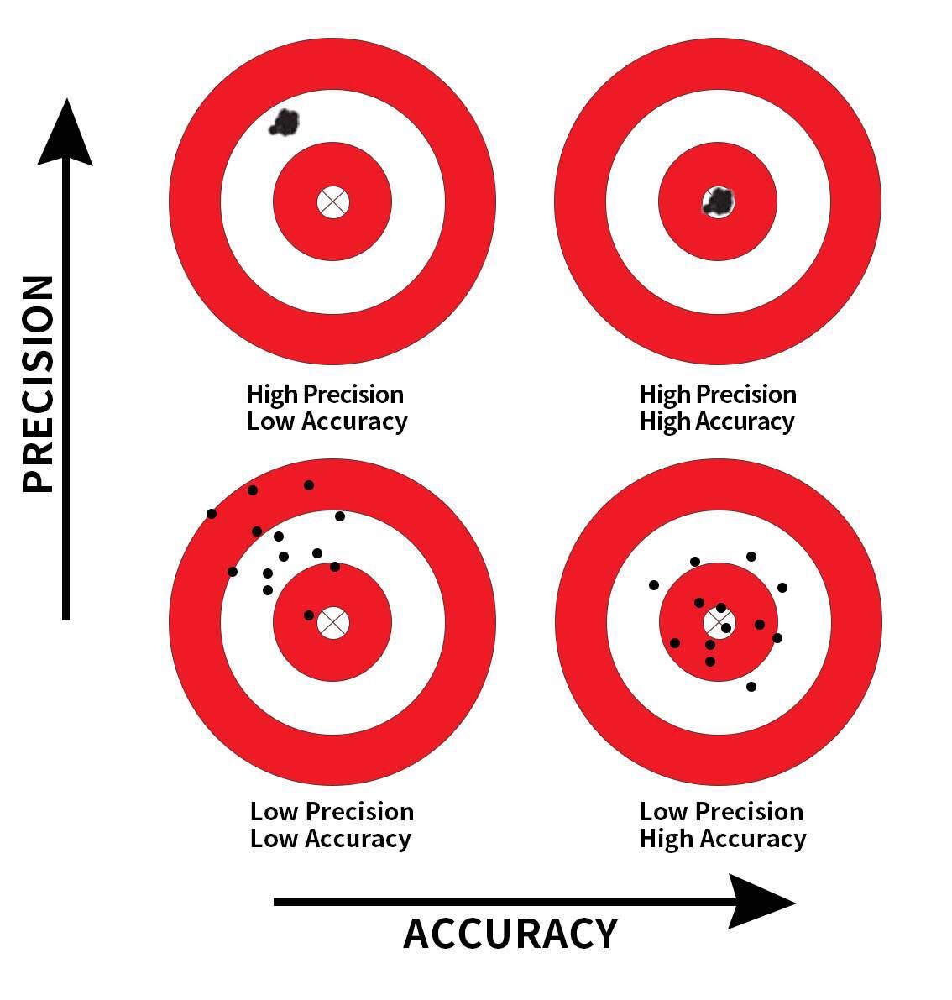

(ref:inferpart) Statistical Inference with `infer`

```{r echo=FALSE, results="asis", purl=FALSE}
if (is_latex_output()) {
  cat("# (PART) (ref:inferpart) {-}")
} else {
  cat("# (PART) Statistical Inference with infer {-} ")
}
```

# Sampling {#sampling}

```{r setup_infer, include=FALSE, purl=FALSE}
# Used to define Learning Check numbers:
chap <- 7
lc <- 0

# Set R code chunk defaults:
opts_chunk$set(
  echo = TRUE,
  eval = TRUE,
  warning = FALSE,
  message = TRUE,
  tidy = FALSE,
  purl = TRUE,
  out.width = "\\textwidth",
  fig.height = 4,
  fig.align = "center"
)

# Set output digit precision
options(scipen = 99, digits = 3)

# Set random number generator see value for replicable pseudorandomness
set.seed(76)
```

The third portion of this book introduces statistical inference. This chapter is about *sampling*. Sampling involves drawing repeated random samples from a population and then using the information from those samples to learn more about the entire population. In Section \@ref(sampling-activity) we illustrate sampling using a tactile example and simultaneously introducing key concepts and terminology. In Section \@ref(sampling-simulation) we extend this by performing virtual sampling via simulations. The tools used in the data science portion of this book, in particular data visualization and data wrangling, continue to be useful in this context. In Section \@ref(sampling-framework) we introduce more definitions, terminology, and notation related to sampling. In Section \@ref(sampling-case-study) we tie the contents of this chapter to the real world by presenting a case study: a 2013 poll on then U.S. President Barack Obama's popularity among young Americans, conducted by Kennedy School's Institute of Politics at Harvard University. Finally, we generalize *sampling* to many scenarios and use sampling to illustrate one of the fundamental theoretical results: the *Central Limit Theorem*.

The concepts behind *sampling* form the basis for constructing confidence intervals and performing tests of significance also called hypothesis tests; these are the best-known and used inferential methods and are presented in Chapters \@ref(confidence-intervals) and \@ref(hypothesis-testing).

### Needed packages {-#sampling-packages}

If needed, read Section \@ref(packages) for information on how to install and load R packages. 

```{r message=FALSE}
library(tidyverse)
library(moderndive)
```

Recall that loading the `tidyverse` package loads many commonly used data science packages that are needed here and we have encountered earlier. For details refer to Section \@ref(tidyverse-package).


```{r message=FALSE, echo=FALSE, purl=FALSE}
# Packages needed internally, but not in text.
library(kableExtra)
library(patchwork)
library(scales)

# Dynamic coding of summary statistics for bowl i.e. avoid hard-coding any values
# wherever possible
num_balls <- nrow(bowl)
num_red <- bowl |>
  summarize(red = sum(color == "red")) |>
  pull(red)
prop_red <- num_red / num_balls
percent_red_chr <- prop_red |> percent(accuracy = 0.1)
```

## Sampling bowl activity {#sampling-activity}

Take a look at the bowl in Figure \@ref(fig:sampling-exercise-1). It has a certain number of red balls and a certain number of white balls all of equal size. `r if_else(is_latex_output(), '(Note that in this printed version of the book "red" corresponds to the darker-colored balls, and "white" corresponds to the lighter-colored balls. We kept the reference to "red" and "white" throughout this book since those are the actual colors of the balls as seen in the background of the image on our book\'s [cover](https://moderndive.com/images/logos/book_cover.png).)', '')` The balls have been mixed beforehand and there does not seem to be any particular pattern for the location of red and white balls inside the bowl. Our task is to determine, adequately, the proportion of red balls in the bowl. 

```{r sampling-exercise-1, echo=FALSE, fig.cap="A bowl with red and white balls.", purl=FALSE, out.width = "95%", purl=FALSE}
include_graphics("images/sampling/balls/sampling_bowl_1.jpg")
```

One way to do this is to perform an exhaustive count: remove each ball individually, count the number of red balls and divide the number of red balls by the total number of balls. Doing this carefully can determine the exact proportion of red balls in the bowl, but it requires a long and tedious process.


### One sample

Instead of performing an exhaustive count, we insert a shovel into the bowl as seen in Figure \@ref(fig:sampling-exercise-2) and collect $5 \cdot 10 = 50$ balls as shown in Figure \@ref(fig:sampling-exercise-3). The set of balls obtained is called a _sample_. 

```{r sampling-exercise-2, echo=FALSE, fig.cap="Inserting a shovel into the bowl.", purl=FALSE, out.width = "100%", purl=FALSE}
include_graphics("images/sampling/balls/sampling_bowl_2.jpg")
```


```{r sampling-exercise-3, echo=FALSE, fig.cap="Taking a sample of 50 balls from the bowl.", purl=FALSE, out.width = "100%", purl=FALSE}
include_graphics("images/sampling/balls/sampling_bowl_3_cropped.jpg")
```

Observe that 17 of the balls are red and thus the proportion of red balls in the sample is 17/50 = 0.34 or 34%. Think of the proportion of red balls in the sample as a guess of the proportion of red balls in the entire bowl. It is likely that the proportion of red balls in the entire bowl is not exactly 34% but, as we show later, this is probably a good guess and it took much less time and energy to obtain.


### Thirty-three samples {#student-shovels}

To understand why this works well, we repeat this activity many times as shown in Figure \@ref(fig:sampling-exercise-3b). Each time we do the following: 

- Return the 50 balls used earlier back into the bowl and mix the contents of the bowl. This is done to ensure that each new sample is not influenced in any way by the previous sample.
- Take a new sample with the shovel and obtain a new proportion of red balls.

```{r sampling-exercise-3b, echo=FALSE, fig.show='hold', fig.cap="Repeating sampling activity.", purl=FALSE, out.width = "30%"}
# Need new picture
include_graphics(c("images/sampling/balls/tactile_2_a.jpg", "images/sampling/balls/tactile_2_b.jpg", "images/sampling/balls/tactile_2_c.jpg"))
```

When we perform this activity many times, we observe that different samples may produce different proportions of red balls. A group of 33 students performed this activity previously and drew a histogram using one block to represent the proportion of red balls on each sample. Figure \@ref(fig:sampling-exercise-4) shows students working on the histogram with two blocks drawn already representing the proportion values and the third about to be added.

```{r sampling-exercise-4, echo=FALSE, fig.cap="Students drawing a histogram of proportions.", purl=FALSE, out.width = "80%"}
include_graphics("images/sampling/balls/tactile_3_a.jpg")
```

Recall from Section \@ref(histograms) that histograms help us visualize the *distribution* \index{distribution} of a numerical variable. In particular, where the center of the values falls and how the values vary. A histogram of the first 10 proportions can be seen in Figure \@ref(fig:sampling-exercise-5).

```{r sampling-exercise-5, echo=FALSE, fig.cap="Hand-drawn histogram of 10 sample proportions.", purl=FALSE, out.width = "70%"}
include_graphics("images/sampling/balls/tactile_3_c.jpg")
```

By looking at the histogram observe that the lowest proportion of red balls obtained was between 0.20 and 0.25 while the highest was between 0.45 and 0.5. More importantly, the most frequently occurring proportions were between 0.30 and 0.35, right in the middle of the distribution.

This activity was performed by 33 students, the results are stored in the `tactile_prop_red` data frame included in the `moderndive` package. The first 10 rows are printed below:

```{r}
tactile_prop_red
```

<!--
Note: first 10 values on tactile_prop_red do not match the first 10 values of hand-drawn histogram tactile_3_c.jpg, consider updating one of them. AV
-->


Observe that for each student (`group`) the data frame provides their names, the number of `red_balls` in the sample, and the corresponding proportion of red balls in the sample (`prop_red`). We also have a `replicate` variable enumerating each of the 33 groups. We chose this name because each row can be viewed as one instance of a replicated (in other words repeated) activity.

Using the R data visualization techniques introduced in Chapter \@ref(viz), we construct the histogram for all 33 proportions as shown in Figure \@ref(fig:samplingdistribution-tactile). The histogram was constructed using `ggplot()`  with `geom_histogram()`. To align the bins in the computerized histogram version to those in the hand-drawn histogram shown in Figure \@ref(fig:sampling-exercise-5), the arguments `boundary = 0.4` and `binwidth = 0.05` were used. The former indicates that we want a binning scheme, such that, one of the bins' boundaries is at 0.4; the latter fixes the width of the bin to 0.05 units.

```{r eval=FALSE}
ggplot(tactile_prop_red, aes(x = prop_red)) +
  geom_histogram(binwidth = 0.05, boundary = 0.4, color = "white") +
  labs(x = "Proportion of red balls in each sample", 
       title = "Histogram of 33 proportions") 
```
```{r samplingdistribution-tactile, echo=FALSE, fig.cap="The distribution of sample proportions based on 33 random samples of size 50.", fig.height=3.1, purl=FALSE}
tactile_histogram <- ggplot(tactile_prop_red, aes(x = prop_red)) +
  geom_histogram(binwidth = 0.05, boundary = 0.4, color = "white")
tactile_histogram +
  labs(
    x = "Proportion of red balls in each sample",
    title = "Histogram of 33 proportions of red balls for each sample"
  )
```


### Recap, some terminology, and additional remarks {#sampling-what-did-we-just-do}

The activity introduced the concept of \index{sampling} *sampling*. We wanted to know the proportion of red balls in a bowl. Since the bowl had many balls, performing an exhaustive count of red and white balls was impractical. Instead, we first took a *sample* of 50 balls to determine that the proportion of red balls in this sample was 34%. For simplicity, we say the *sample proportion* was 34%. This is an *estimate* of the proportion of red balls in the entire bowl. We then took more samples to obtain more sample proportions, 33 in total. This activity is what in statistics we call *sampling*. 

Since we returned the observed balls every time before taking a new sample we were *sampling with replacement*. Since we mixed the balls before taking each sample and then used a shovel, the samples were *randomly drawn*. When this happens we call them *random samples*. As shown in Figure \@ref(fig:samplingdistribution-tactile), different random samples produce different sample proportions. This phenomenon is called *sampling variation* and it is a central concept in this chapter. \index{sampling!variation}

In Section \@ref(sampling-simulation), we extend the sampling activity presented here to sampling done via simulations on a computer. The use of simulations permits us to study *sampling variation* not only for 33 random samples but many more, often thousands, tens of thousands, or even more. In addition, we do not need to restrict the samples to 50 balls, we can change the size of the virtual shovel to any size. As we show in the next section, the sample size of the samples taken has a direct effect on the magnitude of the *sampling variation*.


```{block, type="learncheck", purl=FALSE}
\vspace{-0.15in}
**_Learning check_**
\vspace{-0.1in}
```

**`r paste0("(LC", chap, ".", (lc <- lc + 1), ")")`** Why is it important to mix the balls in the bowl before we take a new sample?

**`r paste0("(LC", chap, ".", (lc <- lc + 1), ")")`** Why is it that students did not all have the same sample proportion of red balls?

```{block, type="learncheck", purl=FALSE}
\vspace{-0.25in}
\vspace{-0.25in}
```


## Virtual sampling {#sampling-simulation}

In the previous Section \@ref(sampling-activity), we performed a *tactile* sampling activity by hand to help you develop the appropriate intuition behind sampling; namely, we asked you to take physical samples using a real shovel from a bowl with colored balls. We now redo the entire process on a computer, a sort of *virtual* sampling activity.


### One virtual sample

We now construct the virtual analog of the tactile sampling exercise presented in Section \@ref(sampling-activity). The virtual analog of the bowl seen in Figure \@ref(fig:sampling-exercise-1) is the data frame `bowl` included in the `moderndive` package. The rows of `bowl` correspond exactly with the contents of the actual bowl. 

```{r}
bowl
```

The data frame `bowl` has `r num_balls` rows, each representing a ball in the bowl. The first variable `ball_ID` is used as an *identification variable* as discussed in Subsection \@ref(identification-vs-measurement-variables); none of the balls in the actual bowl are marked with numbers. The second variable `color` indicates whether a particular virtual ball is red or white. View the contents of the bowl in RStudio's data viewer and scroll through the contents to convince yourself that `bowl` is indeed a virtual analog of the actual bowl in Figure \@ref(fig:sampling-exercise-1).

To create a virtual analog to the 50-ball shovel seen in Figure \@ref(fig:sampling-exercise-2) we use the `rep_sample_n()` function included in the `moderndive` package. This function allows us to take `rep`eated (or `rep`licated) random `samples` of size `n`. 

<!--
Note: Put this back in if people have trouble understanding rep_sample_n() at first:

Let's show an example of this function in action. Let's first use the `tibble()` function to manually create a data frame of five fruit called `fruit_basket`. 

```{r}
fruit_basket <- tibble(
  fruit = c("Mango", "Tangerine", "Apricot", "Pamplemousse", "Lime")
)
```

-->


```{r}
virtual_shovel <- bowl |> 
  rep_sample_n(size = 50)
virtual_shovel
```

Observe that `virtual_shovel` has 50 rows corresponding to our virtual sample of size 50. The `ball_ID` variable identifies which of the `r num_balls` balls from `bowl` are included in our sample of 50 balls while `color` denotes its color. The `replicate` variable is equal to 1 for all 50 rows as this is the first repeated/replicated use of the shovel: our first sample. If we were to "virtually" take 33 samples, as we do later on, `replicate` would take values between 1 and 33. 

We compute the proportion of red balls in our virtual sample using the `dplyr` data wrangling verbs you learned in Chapter \@ref(wrangling). First, for each of our 50 sampled balls, we identify if it is red or not using a test for equality with `==`. We then create a new Boolean variable `is_red` using the `mutate()` function from Section \@ref(mutate):

```{r}
virtual_shovel |> 
  mutate(is_red = (color == "red"))
```

Observe that for every row where `color == "red"`, the Boolean (logical)  value `TRUE` is returned and for every row where `color` is not equal to `"red"`, the Boolean `FALSE` is returned.

We now compute the number of balls out of 50 that are red using the `summarize()` function. Recall from Section \@ref(summarize) that `summarize()` takes a data frame with many rows and returns a data frame with a single row containing summary statistics, like the `mean()` or `median()`. In this case, we use the `sum()`:

```{r}
virtual_shovel |> 
  mutate(is_red = (color == "red")) |> 
  summarize(num_red = sum(is_red))
```
```{r, echo=FALSE, purl=FALSE}
n_red_virtual_shovel <- virtual_shovel |>
  mutate(is_red = (color == "red")) |>
  summarize(num_red = sum(is_red)) |>
  pull(num_red)

```

Since R treats `TRUE` like the number `1` and `FALSE` like the number `0`, the number of `TRUE`s and `FALSE`s is equivalent to summing `1`'s and `0`'s. In the end, this operation counts the number of balls where `color` is `red`. In our case, `r n_red_virtual_shovel` of the 50 balls were red. However, you might have gotten a different number of red balls because of the randomness of the virtual sampling.

Third and lastly, let's compute the proportion of the 50 sampled balls that are red by dividing `num_red` by 50:

```{r}
virtual_shovel |> 
  mutate(is_red = color == "red") |> 
  summarize(num_red = sum(is_red)) |> 
  mutate(prop_red = num_red / 50)
```
```{r, echo=FALSE, purl=FALSE}
virtual_shovel_prop_red <- virtual_shovel |>
  mutate(is_red = color == "red") |>
  summarize(num_red = sum(is_red)) |>
  mutate(prop_red = num_red / 50) |>
  pull(prop_red)
virtual_shovel_perc_red <- virtual_shovel_prop_red * 100

```

In other words, `r virtual_shovel_perc_red`% of this virtual sample's balls were red. We make this code a little more compact and succinct by combining the first `mutate()` and the `summarize()` as follows:

```{r}
virtual_shovel |> 
  summarize(num_red = sum(color == "red")) |> 
  mutate(prop_red = num_red / 50)
```

Great! `r virtual_shovel_perc_red`% of the `virtual_shovel`'s 50 balls were red! Based on this particular random sample of 50 balls, our estimated proportion of red balls in the bowl is `r virtual_shovel_perc_red`%. But remember that if we obtain another random sample of 50 balls the sample proportion of red balls may be different due to sampling variation. 

### Thirty-three virtual samples {#shovel-33-times}

In our tactile activity in Section \@ref(sampling-activity), students got 33 samples and computed 33 sample proportions. They repeated/replicated the sampling process 33 times. We do this virtually by again using the function `rep_sample_n()`, but this time adding the `reps = 33` argument; this tells R that we want to repeat the sampling 33 times. We save these samples in the data frame `virtual_samples`, as shown below, and then provide a preview of its first 10 rows. We may want to inspect the entire `virtual_samples` data frame by using RStudio's spreadsheet viewer by running `View(virtual_samples)`. 

```{r}
virtual_samples <- bowl |> 
  rep_sample_n(size = 50, reps = 33)
virtual_samples
```

Observe in the spreadsheet viewer that the first 50 rows of `replicate` are equal to `1` while the next 50 rows of `replicate` are equal to `2`. This is telling us that the first 50 rows correspond to the first sample of 50 balls while the next 50 rows correspond to the second sample of 50 balls. This pattern continues for all `reps = 33` replicates and thus `virtual_samples` has 33 $\cdot$ 50 = 1650 rows. 

Using `virtual_samples` we obtain the proportion of red balls for each replicate. We use the same `dplyr` verbs as before, but this time adding `group_by()` of the `replicate` variable. Recall from Section \@ref(groupby) that by assigning the grouping variable "meta-data" before `summarize()`, we perform the calculations needed for each replicate separately. The other lines of code, as explained in the case of one sample, calculate the sum and proportion of red balls. We display a preview of the first 10 rows below:

```{r}
virtual_prop_red <- virtual_samples |> 
  group_by(replicate) |> 
  summarize(red = sum(color == "red")) |> 
  mutate(prop_red = red / 50)
virtual_prop_red
```

As was the case in the tactile activity, there is variation in the resulting 33 proportions from virtual samples. As shown in Figure \@ref(fig:samplingdistribution-virtual) a histogram helps us visualize this sampling variation. As we did in Section \@ref{#sampling-activity}, we construct the histogram using `ggplot()`, `geom_histogram()`, and including the arguments `binwidth = 0.05` and `boundary = 0.4`. This creates the appropriate bins with boundaries at 0.3, 0.35, 0.4, 0.45, etc., as shown below:

```{r eval=FALSE}
ggplot(virtual_prop_red, aes(x = prop_red)) +
  geom_histogram(binwidth = 0.05, boundary = 0.4, color = "white") +
  labs(x = "Sample proportion", 
       title = "Histogram of 33 sample proportions") 
```
```{r samplingdistribution-virtual, echo=FALSE, fig.cap="The distribution of 33 proportions based on 33 virtual samples of size 50.", fig.height=3.2, purl=FALSE}
virtual_histogram <- ggplot(virtual_prop_red, aes(x = prop_red)) +
  geom_histogram(binwidth = 0.05, boundary = 0.4, color = "white")
virtual_histogram +
  labs(
    x = "Sample proportion",
    title = "Histogram of 33 sample proportions"
  )
``` 

Observe that some proportions are less than 30% and others are greater than 45%, but the most frequently occurring proportions were between 35% and 40% (for 11 out of 33 samples). We can also compare the virtual results with the tactile ones from the previous section in Figure \@ref(fig:tactile-vs-virtual). Observe that both histograms are somewhat similar in their center and variation, although not identical. These slight differences are again due to *sampling variation*.

```{r tactile-vs-virtual, echo=FALSE, fig.cap="We illustrate sampling variation showing a histogram for virtual sample proportions (left) and another histogram for tactile sample proportions (right).", fig.height=2.9, purl=FALSE}
facet_compare <- bind_rows(
  virtual_prop_red |>
    mutate(type = "Virtual sampling"),
  tactile_prop_red |>
    select(replicate, red = red_balls, prop_red) |>
    mutate(type = "Tactile sampling")
) |>
  mutate(type = factor(type, levels = c("Virtual sampling", "Tactile sampling"))) |>
  ggplot(aes(x = prop_red)) +
  geom_histogram(binwidth = 0.05, boundary = 0.4, color = "white") +
  facet_wrap(~type) +
  labs(
    x = "Sample Proportion",
    title = "Histograms for sample proportions"
  )

if (is_latex_output()) {
  facet_compare +
    theme(
      strip.text = element_text(colour = "black"),
      strip.background = element_rect(fill = "grey93")
    )
} else {
  facet_compare
}
```

```{block, type="learncheck", purl=FALSE}
\vspace{-0.15in}
**_Learning check_**
\vspace{-0.1in}
```

**`r paste0("(LC", chap, ".", (lc <- lc + 1), ")")`** Why couldn't we study the effects of sampling variation when we used the virtual shovel only once? Why did we need to take more than one virtual sample (in our case 33 virtual samples)?

```{block, type="learncheck", purl=FALSE}
\vspace{-0.25in}
\vspace{-0.25in}
```


### One thousand virtual samples {#shovel-1000-times}

We now study the effects of sampling variation with 1000 random samples. Trying to do this manually would be impractical while obtaining virtual samples can be done quickly and efficiently. We repeat the steps performed in Subsection \@ref(shovel-33-times) using the `rep_sample_n()` function with a sample `size` set to be 50, but now the number of replicates `reps` is set to `1000`. Be sure to scroll through the contents of `virtual_samples` in RStudio's viewer. 

```{r}
virtual_samples <- bowl |> 
  rep_sample_n(size = 50, reps = 1000)
virtual_samples
```

Observe that now `virtual_samples` has 1000 $\cdot$ 50 = 50,000 rows. Using the same data wrangling code as in Subsection \@ref(shovel-33-times), we obtain `virtual_prop_red` with the count of red balls and corresponding sample proportion for all 1000 random samples. 

```{r}
virtual_prop_red <- virtual_samples |> 
  group_by(replicate) |> 
  summarize(red = sum(color == "red")) |> 
  mutate(prop_red = red / 50)
virtual_prop_red
```

As we did before, we construct a histogram for these 1000 sample proportions. It is shown in Figure \@ref(fig:samplingdistribution-virtual-1000).

```{r eval=FALSE}
ggplot(virtual_prop_red, aes(x = prop_red)) +
  geom_histogram(binwidth = 0.05, boundary = 0.4, color = "white") +
  labs(x = "Sample proportion", 
       title = "Histogram of 1000 sample proportions") 
```
```{r samplingdistribution-virtual-1000, echo=FALSE, fig.cap="The distribution of 1000 proportions based on 1000 random samples of size 50.", purl=FALSE}
virtual_prop_red <- virtual_samples |>
  group_by(replicate) |>
  summarize(red = sum(color == "red")) |>
  mutate(prop_red = red / 50)
virtual_histogram <- ggplot(virtual_prop_red, aes(x = prop_red)) +
  geom_histogram(binwidth = 0.05, boundary = 0.4, color = "white")
virtual_histogram +
  labs(
    x = "Sample proportion",
    title = "Histogram of 1000 sample proportions"
  )
``` 

The sample proportions observed in the histogram could be as low as 15% or as high as 60%, but those extreme proportions are rare. The most frequent proportions obtained are those between 35% and 40%. Furthermore, the histogram shows now a symmetric and bell-shaped distribution that can be approximated well by a normal distribution. Please read the "Normal distribution" section (Appendix \@ref(appendix-normal-curve)) for a brief discussion of this distribution and its properties.


```{block, type="learncheck", purl=FALSE}
\vspace{-0.15in}
**_Learning check_**
\vspace{-0.1in}
```

**`r paste0("(LC", chap, ".", (lc <- lc + 1), ")")`** Why did we not take 1000 "tactile" samples of 50 balls by hand?

**`r paste0("(LC", chap, ".", (lc <- lc + 1), ")")`** Looking at Figure \@ref(fig:samplingdistribution-virtual-1000), would you say that sampling 50 balls where 30% of them were red is likely or not? What about sampling 50 balls where 10% of them were red?

```{block, type="learncheck", purl=FALSE}
\vspace{-0.25in}
\vspace{-0.25in}
```


### Different sample sizes {#different-shovels}

We consider again the goal of our activity in Section \@ref(sampling-activity); we want to determine the proportion of red balls in the bowl. But now, assume that we can use three shovels of sizes 25, 50, and 100; as shown in Figure \@ref(fig:three-shovels). That is, we can take samples of different sizes. As we show later in this subsection, the size of the sample has a direct effect on the magnitude of sampling variation.

<!--
A shovel with 25 slots          |  A shovel with 50 slots  | A shovel with 100 slots
:-------------------------:|:-------------------------:|:-------------------------:
{ width=1.6in }  |  { width=1.6in } | { width=1.6in } 
-->

```{r three-shovels, echo=FALSE, fig.cap="Three shovels to extract three different sample sizes.", out.width='100%', purl=FALSE}
include_graphics("images/sampling/balls/three_shovels.png")
```

We follow the same process performed in Subsection \@ref(shovel-1000-times): we generate 1000 samples, obtain the sample proportions, and use them to draw a histogram. We do this three times with the `size` argument set to `25`, `50`, and `100`, respectively. Run each of the following code segments individually and then compare the resulting histograms.

```{r, eval=FALSE}
# Segment 1: sample size = 25 ------------------------------
# 1.a) Virtually use shovel 1000 times
virtual_samples_25 <- bowl |> 
  rep_sample_n(size = 25, reps = 1000)

# 1.b) Compute resulting 1000 replicates of proportion red
virtual_prop_red_25 <- virtual_samples_25 |> 
  group_by(replicate) |> 
  summarize(red = sum(color == "red")) |> 
  mutate(prop_red = red / 25)

# 1.c) Plot distribution via a histogram
ggplot(virtual_prop_red_25, aes(x = prop_red)) +
  geom_histogram(binwidth = 0.05, boundary = 0.4, color = "white") +
  labs(x = "Proportion of 25 balls that were red", title = "25") 


# Segment 2: sample size = 50 ------------------------------
# 2.a) Virtually use shovel 1000 times
virtual_samples_50 <- bowl |> 
  rep_sample_n(size = 50, reps = 1000)

# 2.b) Compute resulting 1000 replicates of proportion red
virtual_prop_red_50 <- virtual_samples_50 |> 
  group_by(replicate) |> 
  summarize(red = sum(color == "red")) |> 
  mutate(prop_red = red / 50)

# 2.c) Plot distribution via a histogram
ggplot(virtual_prop_red_50, aes(x = prop_red)) +
  geom_histogram(binwidth = 0.05, boundary = 0.4, color = "white") +
  labs(x = "Proportion of 50 balls that were red", title = "50")  


# Segment 3: sample size = 100 ------------------------------
# 3.a) Virtually using shovel with 100 slots 1000 times
virtual_samples_100 <- bowl |> 
  rep_sample_n(size = 100, reps = 1000)

# 3.b) Compute resulting 1000 replicates of proportion red
virtual_prop_red_100 <- virtual_samples_100 |> 
  group_by(replicate) |> 
  summarize(red = sum(color == "red")) |> 
  mutate(prop_red = red / 100)

# 3.c) Plot distribution via a histogram
ggplot(virtual_prop_red_100, aes(x = prop_red)) +
  geom_histogram(binwidth = 0.05, boundary = 0.4, color = "white") +
  labs(x = "Proportion of 100 balls that were red", title = "100") 
```

For easy comparison, we present the three resulting histograms in a single row with matching x and y axes in Figure \@ref(fig:comparing-sampling-distributions).

```{r comparing-sampling-distributions, echo=FALSE, fig.height=3, fig.cap="Histograms of sample proportions for different sample sizes.", purl=FALSE}
# n = 25
if (!file.exists("rds/virtual_samples_25.rds")) {
  virtual_samples_25 <- bowl |>
    rep_sample_n(size = 25, reps = 1000)
  write_rds(virtual_samples_25, "rds/virtual_samples_25.rds")
} else {
  virtual_samples_25 <- read_rds("rds/virtual_samples_25.rds")
}
virtual_prop_red_25 <- virtual_samples_25 |>
  group_by(replicate) |>
  summarize(red = sum(color == "red")) |>
  mutate(prop_red = red / 25) |>
  mutate(n = 25)

# n = 50
if (!file.exists("rds/virtual_samples_50.rds")) {
  virtual_samples_50 <- bowl |>
    rep_sample_n(size = 50, reps = 1000)
  write_rds(virtual_samples_50, "rds/virtual_samples_50.rds")
} else {
  virtual_samples_50 <- read_rds("rds/virtual_samples_50.rds")
}
virtual_prop_red_50 <- virtual_samples_50 |>
  group_by(replicate) |>
  summarize(red = sum(color == "red")) |>
  mutate(prop_red = red / 50) |>
  mutate(n = 50)

# n = 100
if (!file.exists("rds/virtual_samples_100.rds")) {
  virtual_samples_100 <- bowl |>
    rep_sample_n(size = 100, reps = 1000)
  write_rds(virtual_samples_100, "rds/virtual_samples_100.rds")
} else {
  virtual_samples_100 <- read_rds("rds/virtual_samples_100.rds")
}
virtual_prop_red_100 <- virtual_samples_100 |>
  group_by(replicate) |>
  summarize(red = sum(color == "red")) |>
  mutate(prop_red = red / 100) |>
  mutate(n = 100)

virtual_prop <- bind_rows(
  virtual_prop_red_25,
  virtual_prop_red_50,
  virtual_prop_red_100
)

comparing_sampling_distributions <- ggplot(virtual_prop, aes(x = prop_red)) +
  geom_histogram(binwidth = 0.05, boundary = 0.4, color = "white") +
  labs(
    x = "Sample proportions for red balls",
    title = "Comparing histograms of sample proportions for three different sample sizes"
  ) +
  facet_wrap(~n)

if (is_latex_output()) {
  comparing_sampling_distributions +
    theme(
      strip.text = element_text(colour = "black"),
      strip.background = element_rect(fill = "grey93")
    )
} else {
  comparing_sampling_distributions
}
```


Observe that all three histograms are bell-shaped and appear to center around a middle value, somewhere between 35% and 40%. In addition, as the sample size increases, the variation among the 1000 sample proportions decreases and there are fewer differences due to sampling variation.

Moreover, the amount of sampling variation is actually proportional to the sample size used. To see this, we measure the amount of variation explicitly using a summary statistic called the \index{standard deviation} *standard deviation* (see Appendix \@ref(appendix-stat-terms) for a brief discussion on the properties of the standard deviation). The following data wrangling code introduces the `sd()` summary function to calculate the standard deviation of 1000 sample proportions of the same sample size. Therefore, three standard deviations are obtained, one for each sample size, as shown below.

```{r, eval=FALSE}
# n = 25
virtual_prop_red_25 |> 
  summarize(sd = sd(prop_red))

# n = 50
virtual_prop_red_50 |> 
  summarize(sd = sd(prop_red))

# n = 100
virtual_prop_red_100 |> 
  summarize(sd = sd(prop_red))
```

Let's compare these three measures of distributional variation in Table \@ref(tab:comparing-n).

```{r comparing-n, echo=FALSE, purl=FALSE}
comparing_n_table <- virtual_prop |>
  group_by(n) |>
  summarize(sd = sd(prop_red)) |>
  rename(`Sample size` = n, `Standard deviation of sample proportions` = sd)

comparing_n_table |>
  kable(
    digits = 3,
    caption = "Comparing standard deviations of sample proportions for three different sample sizes",
    booktabs = TRUE,
    linesep = ""
  ) |>
  kable_styling(
    font_size = ifelse(is_latex_output(), 10, 16),
    latex_options = c("hold_position")
  )
```

As we observed in Figure \@ref(fig:comparing-sampling-distributions), as the sample size increases, the sampling variation decreases. If this variation becomes really small, each sample proportion of red balls is not that different from any other sample proportion of red balls. So as the sample size increases, our guesses at the true proportion of red balls in the bowl get more precise. 

```{block, type="learncheck", purl=FALSE}
\vspace{-0.15in}
**_Learning check_**
\vspace{-0.1in}
```

**`r paste0("(LC", chap, ".", (lc <- lc + 1), ")")`** As shown in Figure \@ref(fig:comparing-sampling-distributions) as the sample size increases, the histogram gets narrower. What happens with the sample proportions?

- A. They vary less.
- B. They vary by the same amount.
- C. They vary more.

**`r paste0("(LC", chap, ".", (lc <- lc + 1), ")")`** What summary statistic did we use to quantify how much the 1000 sample proportions of red balls varied?

- A. The interquartile range
- B. The standard deviation
- C. The range: the largest value minus the smallest.

```{block, type="learncheck", purl=FALSE}
\vspace{-0.25in}
```


## Sampling framework {#sampling-framework}

In both our tactile and virtual sampling activities, we obtain samples in order to guess or *estimate* the proportion of red balls in the bowl. We use sampling for the purpose of *estimation*, because it is a less cumbersome approach than performing an exhaustive count of all the balls. The virtual sampling activity concludes with the results shown in Figure \@ref(fig:comparing-sampling-distributions) and Table \@ref(tab:comparing-n): comparing 1000 sample proportions of red balls using samples of sizes 25, 50, and 100. The conclusions of these activities can be considered our first attempt at understanding two key concepts relating to sampling for estimation:

1. The effect of *sampling variation* on our estimates.
1. The effect of sample size on *sampling variation*.

Now that we have acquired some intuition about sampling, we introduce statistical definitions, terminology, and notation related to sampling. We use those to succinctly summarize and refer to the ideas behind sampling in the rest of this book. 


### Statistical inference, terminology, and notation {#terminology-and-notation}


We introduce additional terminology and some mathematical notation. We illustrate these concepts by connecting them to different elements of the sampling bowl activities described in previous sections. 

The first set of terms and notations relate to **populations**:

1. A **population** or **study population** is a collection of all individuals or observations that we are interested in. 
    - We use upper-case $N$ to represent the size of the population.
    - In our sampling activities, the **population** is the collection of balls in the bowl shown in Figure \@ref(fig:sampling-exercise-1). Since we also have the virtual `bowl` that represents this population, we know that the population has  $N$ = `r num_balls` balls in the bowl.
1. A **population parameter** or simply **parameter** is a numerical summary, a number, that represents some characteristic of the population.
    - Two of the parameters we are interested in most of the time are the proportion and average (or mean) of the population. We call them *population proportion* (and use the letter $p$ to denote it) and *population mean* (and use the Greek letter $\mu$ to denote it), respectively.
    - In our sampling activities, we are interested in the proportion of red balls in the entire bowl. So, the parameter of interest is $p$, the *population proportion* of red balls. 
1. A **census** is an exhaustive enumeration or counting of all $N$ individuals in the population and their relevant characteristics. We do this in order to compute the *exact* value of the population parameter of interest. If $N$ is very large, conducting a census may be really expensive (in terms of time, energy, and money).
    - In our sampling bowl activities, we can calculate $p$ exactly by conducting a **census**: we inspect all $N$ = `r num_balls` balls, determine how many are red, and divide this number by `r num_balls`. 
    

We conduct this "virtual" census by using the same `dplyr` verbs used earlier but this time for the entire population, `bowl`, as shown below:

```{r}
bowl |> 
  summarize(red = sum(color == "red")) 
```

Since `r num_red` of the `r num_balls` are red, then `r num_red`/`r num_balls` = `r prop_red` = `r percent_red_chr`. The *population proportion*, $p$, is equal to `r prop_red`.

A clever reader may be now wondering why did we do any sampling if we already had a way of knowing that the exact proportion of red balls in the bowl was `r percent_red_chr`. The sampling activities we present in this chapter, both tactile and virtual, are an illustration of how sampling can be done. In real-life scenarios, typically, we do not have information about the entire population of interest. Furthermore, these sampling simulations allow us to better understand  *sampling variation*.

The second set of terms and notations relate to **samples**:

1. **Sampling** is the act of collecting samples from the population and using them to estimate population parameters. We mathematically denote the sample size using lowercase $n$. Typically the sample size $n$ is much smaller than the population size $N$. Thus taking a sample or a few samples is easier and cheaper than completing a census.
      - All our bowl activities, tactile and virtual, are examples of sampling.
1. A **sample statistic** or simply a **statistic** is a numerical summary, a number, computed from a sample. When this statistic is used to estimate a *population parameter* we also call it a **point estimate**.
    - Two point estimates that are often used are the proportion and average (or mean) of the sample. We call them *sample proportion* and *sample mean* and use $\widehat{p}$ and $\widehat {\mu}$ to denote them, respectively. The hat above the letter is a common convention in statistics to differentiate point estimates (samples) from parameters (populations).

As we did in our virtual sampling activity, we take a random sample of $n$=50 balls from the virtual `bowl` and use it to obtain the sample proportion of red balls, $\widehat{p}$. We use the same `dplyr` verbs used earlier, as shown below:

```{r}
bowl |>
  rep_sample_n(size = 50) |> 
  summarize(num_red = sum(color == "red")) |> 
  mutate(prop_red = num_red / 50)
```

The sample proportion, $\widehat{p}$, is given by the value of `prop_red`. It is also called a point estimate because is used to estimate the population proportion, $p$.

The third set of terms relates to **sampling methodology**: the method used to collect samples.\index{sampling methodology} You'll see here and throughout the rest of the book that the *way* you collect samples directly influences their quality.

1. A sample is said to be **representative** if it roughly "resembles" the population; if the characteristics found in the sample are a "good" representation of the characteristics found in the population.
1. We say a sample is **generalizable** if any results based on the sample can be generalized to the population. In particular, information or conclusions obtained from the sample can be used as information or conclusions that apply to the entire population.
1. We say a sampling procedure is **biased** if the samples obtained using this procedure have characteristics that systematically differ from those in the population. 
    - Using our bowl sampling activity, if for each sample of 50 balls we take from the bowl, we remove three white balls and replace them with red balls, the samples obtained would be **biased** and the sample proportions would no longer be representative of the proportion of red balls in the bowl.
1. **Random sampling** is a sampling procedure in which any group of individuals has an equal chance of being chosen than any other group of individuals of the same size. A sample obtained using random sampling is called a **random sample**


Let's now put all three sets of terms and notation together, keeping our sampling activities in mind:

* For the tactile activity, we extracted a sample of $n$ = 50 because we mixed all of the equally sized balls before using the shovel. For the virtual activity, we did the same by using the `rep_sample_n()` function that takes advantage of the computer's [random number generator](https://en.wikipedia.org/wiki/Random_number_generation). In both cases we obtained *random samples*
* the contents of the sample obtained are *unbiased* and *representative* of the contents of the bowl, thus
* any result based on the sample can be *generalized* to the bowl, thus
* The sample proportion $\widehat{p}$ of the $n$ = 50 balls in the shovel that are red is a "good guess" of the population proportion $p$ of the bowl's $N$ = `r num_balls` balls that are red, thus
* we can **infer** about the bowl using the sample from the shovel.

What we have done is **statistical inference**. **Inference** is the act of "making a guess" about some unknown. **Statistical inference** is the act of making a guess about a population using a random sample. This is one of the most important concepts in all of statistics. It is so important that this book is titled: "Statistical Inference via Data Science". More generally speaking, 

* If the sampling of a sample of size $n$ is done at *random*, then
* the sample is *unbiased* and *representative* of the population of size $N$, thus
* any result based on the sample can *generalize* to the population, thus
* the point estimate is a "good guess" of the unknown population parameter, thus
* instead of performing a census, we can *infer* about the population using sampling.

In the upcoming Chapter \@ref(confidence-intervals) on confidence intervals, we introduce the `infer` package, which makes statistical inference "tidy" and transparent.

```{block, type="learncheck", purl=FALSE}
\vspace{-0.15in}
**_Learning check_**
\vspace{-0.1in}
```

**`r paste0("(LC", chap, ".", (lc <- lc + 1), ")")`** In the case of our bowl activity, what is the *population parameter*? Do we know its value?

**`r paste0("(LC", chap, ".", (lc <- lc + 1), ")")`** What would performing a census in our bowl activity correspond to? Why did we not perform a census?

**`r paste0("(LC", chap, ".", (lc <- lc + 1), ")")`** What purpose do *point estimates* serve in general? What is the name of the point estimate specific to our bowl activity? What is its mathematical notation?

**`r paste0("(LC", chap, ".", (lc <- lc + 1), ")")`** How did we ensure that our tactile samples using the shovel were random?

**`r paste0("(LC", chap, ".", (lc <- lc + 1), ")")`** Why is it important that sampling be done *at random*?

**`r paste0("(LC", chap, ".", (lc <- lc + 1), ")")`** What are we *inferring* about the bowl based on the samples using the shovel?


```{block, type="learncheck", purl=FALSE}
\vspace{-0.25in}
\vspace{-0.25in}
```


### Sampling distributions {#sampling-definitions}

We now introduce some important statistical definitions related to sampling. As a refresher of our 1000 repeated/replicated virtual samples of size $n$ = 25, $n$ = 50, and $n$ = 100 in Section \@ref(sampling-simulation), let's display Figure \@ref(fig:comparing-sampling-distributions) again as Figure \@ref(fig:comparing-sampling-distributions-1b).  

```{r comparing-sampling-distributions-1b, fig.cap="Previously seen histograms as a graphical representation of three distributions of the sample proportion $\\widehat{p}$.", fig.height=3.1, echo=FALSE, purl=FALSE}
comparing_sampling_distributions
```

These histograms are the graphical representation of the distribution of sample proportions. They are called **sampling distributions** of the sample proportion or more generally **sampling distributions** of point estimates. \index{sampling distributions} Their visualization displays the effect of sampling variation on the distribution of any point estimate, in this case, the sample proportion $\widehat{p}$. Using these sampling distributions, for a given sample size $n$, we can make statements about what values we can typically expect. Be careful, people learning this terminology sometimes confuse the term *sampling distribution* with a *sample's distribution* which is merely the distribution of the values in a single sample. 

<!--
TODO: Insert table distinguishing "sampling distribution of point estimates" vs "a sample's distribution"
-->

Observe the centers of all three sampling distributions: they are all roughly centered somewhere between 0.35 and 0.4 (or between 35% and 40%). Recall from earlier that the value of the population proportion $p$ of the $N$ = `r num_balls` balls in the bowl was `r num_red`/`r num_balls` = `r prop_red` = `r percent_red_chr`. We computed this value by performing a virtual census of `bowl`. Let's re-display our sampling distributions from Figure \@ref(fig:comparing-sampling-distributions-1b), but now with a vertical red line marking the true population proportion $p$ of red balls = `r percent_red_chr` in Figure \@ref(fig:comparing-sampling-distributions-3). We see that while there is a certain amount of error in the sample proportions $\widehat{p}$ for all three sampling distributions, on average the $\widehat{p}$ are centered at the true population proportion red $p$.

```{r comparing-sampling-distributions-3, echo=FALSE, fig.cap="Three sampling distributions with population proportion $p$ marked by vertical line.", purl=FALSE}
p <- bowl |>
  summarize(mean(color == "red")) |>
  pull()
samp_distn_compare <- virtual_prop |>
  mutate(
    n = str_c("n = ", n),
    n = factor(n, levels = c("n = 25", "n = 50", "n = 100"))
  ) |>
  ggplot(aes(x = prop_red)) +
  geom_histogram(
    binwidth = 0.05, boundary = 0.4,
    color = "black", fill = "white"
  ) +
  labs(
    x = expression(paste("Sample proportion ", hat(p))),
    title = expression(paste(
      "Sampling distributions of ", hat(p),
      " based on n = 25, 50, 100."
    ))
  ) +
  facet_wrap(~n) +
  geom_vline(xintercept = p, col = "red", size = 1)

if (is_latex_output()) {
  samp_distn_compare +
    theme(
      strip.text = element_text(colour = "black"),
      strip.background = element_rect(fill = "grey93")
    )
} else {
  samp_distn_compare
}
```


Moreover, observe that:

- When the sample size used is 25 (left histogram) it is somewhat likely to obtain sample proportions of red balls that are less than 0.2 = 20% or greater than 0.55 = 55%. 
- When the sample size is 50 (middle histogram) it is unlikely, although still possible, to get that extreme sample proportions.
- When the sample size is 100 (right histogram) we have not observed a single sample proportion that is that extreme. 

As the sample size $n$ increases from 25 to 50 to 100, \index{sampling distributions!relationship to sample size} the variation of the sampling distribution decreases, and thus the values cluster more and more tightly around the same center between 35% and 40%. We quantified this variation using the standard deviation of our sample proportions in Table \@ref(tab:comparing-n), which we display again as Table \@ref(tab:comparing-n-repeat):

```{r comparing-n-repeat, echo=FALSE, purl=FALSE}
comparing_n_table <- virtual_prop |>
  group_by(n) |>
  summarize(sd = sd(prop_red)) |>
  rename(`Number of slots in shovel` = n, `Standard deviation of sample proportions` = sd)

comparing_n_table |>
  kable(
    digits = 3,
    caption = "Previously seen comparing standard deviations of sample proportions for three different sample sizes",
    booktabs = TRUE,
    linesep = ""
  ) |>
  kable_styling(
    font_size = ifelse(is_latex_output(), 10, 16),
    latex_options = c("hold_position")
  )
```

The standard deviation can be thought of "roughly" as how far, on average, the values are from the center of their distribution. In the context of sampling distributions, this is equivalent to thinking of how far, on average, a point estimate is from the population parameter it is trying to estimate, since the parameter is equal to the center of the sampling distribution as shown in Figure \@ref(fig:comparing-sampling-distributions-3). Because of this relationship, the standard deviation of a sampling distribution is called the \index{standard error} **standard error** of a point estimate, where "error" can be thought of as the estimation error, on average, between a point estimate and the population parameter. For example, using \@ref(tab:comparing-n), the standard error for the sampling distribution of sample proportions when the sample size is 100 is 0.045 = 4.5%. If we were to take a random sample of 100 balls from the bowl, we expect the sample proportion of red balls to be, on average, 4.5% away from the proportion of red balls in the entire bowl.


In addition, standard errors quantify the effect of sampling variation induced on our estimates. In other words, they also quantify how much we can expect different sample proportions of red balls *to vary* from one sample to another. As a general rule, as the sample size increases, the standard error decreases.

Students sometimes confuse the *standard error* with the *standard deviation*. While you can always obtain the standard deviation from a list of values, the standard error is the standard deviation of the sampling distribution of sample statistics (or point estimates). All standard errors are standard deviations, but not every standard deviation is necessarily a standard error. 

To help reinforce these concepts, let's re-display Figure \@ref(fig:comparing-sampling-distributions) but using our new terminology, notation, and definitions relating to sampling in Figure \@ref(fig:comparing-sampling-distributions-2). 

```{r comparing-sampling-distributions-2, echo=FALSE, fig.cap="Three sampling distributions of the sample proportion $\\widehat{p}$.", purl=FALSE}
p_hat_compare <- virtual_prop |>
  mutate(
    n = str_c("n = ", n),
    n = factor(n, levels = c("n = 25", "n = 50", "n = 100"))
  ) |>
  ggplot(aes(x = prop_red)) +
  geom_histogram(binwidth = 0.05, boundary = 0.4, color = "white") +
  labs(
    x = expression(paste("Sample proportion ", hat(p))),
    title = expression(paste("Sampling distributions of ", hat(p), " based on n = 25, 50, 100."))
  ) +
  facet_wrap(~n)

if (is_latex_output()) {
  p_hat_compare +
    theme(
      strip.text = element_text(colour = "black"),
      strip.background = element_rect(fill = "grey93")
    )
} else {
  p_hat_compare
}
```

Furthermore, let's re-display Table \@ref(tab:comparing-n) using our new terminology, notation, and definitions relating to sampling in Table \@ref(tab:comparing-n-2).

```{r comparing-n-2, echo=FALSE, purl=FALSE}
comparing_n_table <- virtual_prop |>
  group_by(n) |>
  summarize(sd = sd(prop_red)) |>
  mutate(
    n = str_c("n = ", n),
    n = factor(n, levels = c("n = 25", "n = 50", "n = 100"))
  ) |>
  rename(`Sample size (n)` = n, `Standard error of $\\widehat{p}$` = sd)

comparing_n_table |>
  kable(
    digits = 3,
    caption = "Standard errors of the sample proportion based on sample sizes of 25, 50, and 100",
    booktabs = TRUE,
    escape = FALSE,
    linesep = ""
  ) |>
  kable_styling(
    font_size = ifelse(is_latex_output(), 10, 16),
    latex_options = c("hold_position")
  )
```

Remember the key message of this last table: that as the sample size $n$ goes up, the "typical" error of your point estimate will go down, as quantified by the *standard error*. In fact, in Subsection \@ref(theory-se) we will see that the standard error for the sample proportion $\widehat{p}$ can also be approximated via a mathematical theory-based formula, a formula that has $n$ in the denominator. 

```{block, type="learncheck", purl=FALSE}
\vspace{-0.15in}
**_Learning check_**
\vspace{-0.1in}
```

**`r paste0("(LC", chap, ".", (lc <- lc + 1), ")")`** What purpose did the *sampling distributions* serve?

**`r paste0("(LC", chap, ".", (lc <- lc + 1), ")")`** What does the *standard error* of the sample proportion $\widehat{p}$ quantify? 

```{block, type="learncheck", purl=FALSE}
\vspace{-0.25in}
\vspace{-0.25in}
```


### Precision and Accuracy {#moral-of-the-story}

Let's recap what we have learned so far. If a sample is generated at random, the resulting point estimate is a "good guess" of the true unknown population parameter. In our sampling activities, the sample proportion $\widehat{p}$ of red balls was a "good guess" of the population proportion $p$ of red balls in the bowl. 

A "good guess" is not a perfect guess. A point estimate can be smaller or greater than the population parameter due to sampling variation. However, the estimates "on average" will be equal to the center of the sampling distribution, thus equal to the population parameter. In our sampling activities, as shown in Figure \@ref(fig:comparing-sampling-distributions-3), the sample proportion $\widehat{p}$ was sometimes less than, other times greater than the true population proportion $p$. Still, on average, they were equal to the population proportion $p$. This is also known as having an *accurate* estimate\index{accuracy}.

We also saw that as the sample size $n$ increases, the point estimates vary less and are more concentrated around the true population parameter, thus the *standard error* gets smaller and the typical error of the point estimates also decreases. In our sampling exercise, as the sample size increased, the variation of our sample proportions $\widehat{p}$ decreased as seen in Figures \@ref(fig:comparing-sampling-distributions-3) and \@ref(fig:comparing-sampling-distributions-2). This is also known as having a *precise* estimate\index{precision}. 


In conclusion, random sampling ensures our point estimates are *accurate*, while on the other hand having a large sample size ensures our point estimates are *precise*. Accuracy describes how "on target" our estimates are, whereas precision describes how "consistent" they are. Figure \@ref(fig:accuracy-vs-precision) illustrates the difference.

```{r accuracy-vs-precision, echo=FALSE, fig.cap="Comparing accuracy and precision.", purl=FALSE, out.width="75%", out.height="75%", purl=FALSE}

```

Observe that taking 1000 repeated random samples of different sizes was useful to illustrate how the sampling distribution of point estimates works, and what are the best practices to obtain accurate and precise estimates. In a real-life situation when getting the best estimate is the main task, we try to get a single random sample that is as large as we can afford because we know that the resulting point estimate will be the most accurate and precise. 

In Section \@ref(sampling-case-study), we're going to study a real-life example of sampling: polls.

```{block, type="learncheck", purl=FALSE}
\vspace{-0.15in}
**_Learning check_**
\vspace{-0.1in}
```

**`r paste0("(LC", chap, ".", (lc <- lc + 1), ")")`** The table that follows is a version of Table \@ref(tab:comparing-n-2) matching sample sizes $n$ to different *standard errors* of the sample proportion $\widehat{p}$, but with the rows randomly re-ordered and the sample sizes removed. Fill in the table by matching the correct sample sizes to the correct standard errors.

```{r comparing-n-3, echo=FALSE, purl=FALSE}
set.seed(76)
comparing_n_table <- virtual_prop |>
  group_by(n) |>
  summarize(sd = sd(prop_red)) |>
  mutate(
    n = str_c("n = ")
  ) |>
  rename(`Sample size` = n, `Standard error of $\\widehat{p}$` = sd) |>
  sample_frac(1)

comparing_n_table |>
  kable(
    digits = 3,
    caption = "Standard errors of $\\widehat{p}$ based on n = 25, 50, 100",
    booktabs = TRUE,
    escape = FALSE,
    linesep = ""
  ) |>
  kable_styling(
    font_size = ifelse(is_latex_output(), 10, 16),
    latex_options = c("hold_position")
  )
```

For the following four *Learning checks*, let the *estimate* be the sample proportion $\widehat{p}$: the proportion of a shovel's balls that were red. It estimates the population proportion $p$: the proportion of the bowl's balls that were red.

**`r paste0("(LC", chap, ".", (lc <- lc + 1), ")")`** What is the difference between an *accurate* and a *precise* estimate? 

**`r paste0("(LC", chap, ".", (lc <- lc + 1), ")")`** How do we ensure that an estimate is *accurate*? How do we ensure that an estimate is *precise*?

**`r paste0("(LC", chap, ".", (lc <- lc + 1), ")")`** In a real-life situation, we would not take 1000 different samples to infer about a population, but rather only one. Then, what was the purpose of our exercises where we took 1000 different samples?

**`r paste0("(LC", chap, ".", (lc <- lc + 1), ")")`** Figure \@ref(fig:accuracy-vs-precision) with the targets shows four combinations of "accurate versus precise" estimates. Draw four corresponding *sampling distributions* of the sample proportion $\widehat{p}$, like the one in the leftmost plot in Figure \@ref(fig:comparing-sampling-distributions-3).

```{block, type="learncheck", purl=FALSE}
\vspace{-0.25in}
\vspace{-0.25in}
```

## Case study: Polls {#sampling-case-study}

Let's now switch gears to a more realistic sampling scenario than our bowl activity: a poll. In practice, pollsters do not take 1000 repeated samples as we did in our previous sampling activities, but rather take only a *single sample* that's as large as possible.

On December 4, 2013, National Public Radio in the US reported on a poll of President Obama's approval rating among young Americans aged 18-29 in an article, ["Poll: Support For Obama Among Young Americans Eroding."](https://www.npr.org/sections/itsallpolitics/2013/12/04/248793753/poll-support-for-obama-among-young-americans-eroding) The poll was conducted by the Kennedy School's Institute of Politics at Harvard University. A quote from the article:

> After voting for him in large numbers in 2008 and 2012, young Americans are souring on President Obama.
> 
> According to a new Harvard University Institute of Politics poll, just 41 percent of millennials  adults ages 18-29  approve of Obama's job performance, his lowest-ever standing among the group and an 11-point drop from April.

Let's tie elements of the real-life poll in this news article with our "tactile" and "virtual" bowl activity from Sections \@ref(sampling-activity) and \@ref(sampling-simulation) using the terminology, notations, and definitions we learned in Section \@ref(sampling-framework). You'll see that our sampling activity with the bowl is an idealized version of what pollsters are trying to do in real life. 

First, who is the **(study) population** of $N$ individuals or observations of interest? \index{sampling!population}

* Bowl: $N$ = `r num_balls` identically sized red and white balls
* Obama poll: $N$ = ? young Americans aged 18-29

Second, what is the **population parameter**? \index{sampling!population parameter}

* Bowl: The population proportion $p$ of *all* the balls in the bowl that are red.
* Obama poll: The population proportion $p$ of *all* young Americans who approve of Obama's job performance.

Third, what would a **census** look like? \index{sampling!census}

* Bowl: Manually going over all $N$ = `r num_balls` balls and exactly computing the population proportion $p$ of the balls that are red.
* Obama poll: Locating all $N$ young Americans and asking them all if they approve of Obama's job performance. In this case, we don't even know what the population size $N$ is!

Fourth, how do you perform **sampling** to obtain a sample of size $n$? \index{sampling}

* Bowl: Using a shovel with $n$ slots. 
* Obama poll: One method is to get a list of phone numbers of all young Americans and pick out $n$ phone numbers. In this poll's case, the sample size of this poll was $n = 2089$ young Americans.

Fifth, what is your **point estimate** also known as the **sample statistic** of the unknown population parameter?

* Bowl: The sample proportion $\widehat{p}$ of the balls in the shovel that were red. 
* Obama poll: The sample proportion $\widehat{p}$ of young Americans in the sample that approve of Obama's job performance. In this poll's case, $\widehat{p} = 0.41 = 41\%$, the quoted percentage in the second paragraph of the article. \index{point estimate} \index{sample statistic}

Sixth, is the sampling procedure **representative**? \index{sampling!representative}

* Bowl: Are the contents of the shovel representative of the contents of the bowl? Because we mixed the bowl before sampling, we can feel confident that they are. 
* Obama poll: Is the sample of $n = 2089$ young Americans representative of *all* young Americans aged 18-29? This depends on whether the sampling was random.

Seventh, are the samples **generalizable** to the greater population? \index{generalizability}

* Bowl: Is the sample proportion $\widehat{p}$ of the shovel's balls that are red a "good guess" of the population proportion $p$ of the bowl's balls that are red? Given that the sample was representative, the answer is yes.
* Obama poll: Is the sample proportion $\widehat{p}$ = 0.41 of the sample of young Americans who supported Obama a "good guess" of the population proportion $p$ of all young Americans who supported Obama at this time in 2013? In other words, can we confidently say that roughly 41% of *all* young Americans approved of Obama at the time of the poll? Again, this depends on whether the sampling was random.

Eighth, is the sampling procedure **unbiased**? In other words, do all observations have an equal chance of being included in the sample? \index{bias}

* Bowl: Since each ball was equally sized and we mixed the bowl before using the shovel, each ball had an equal chance of being included in a sample and hence the sampling was unbiased. 
* Obama poll: Did all young Americans have an equal chance at being represented in this poll? Again, this depends on whether the sampling was random.

Ninth and lastly, was the sampling done at **random**? \index{sampling!random}

* Bowl: As long as you mixed the bowl sufficiently before sampling, your samples would be random.
* Obama poll: Was the sample conducted at random? We can't answer this question without knowing about the *sampling methodology*\index{sampling methodology} used by Kennedy School's Institute of Politics at Harvard University. We will discuss this more at the end of this section.

In other words, the poll by Kennedy School's Institute of Politics at Harvard University  can be thought of as *an instance* of using the shovel to sample balls from the bowl. Furthermore, if another polling company conducted a similar poll of young Americans at roughly the same time, they would likely get a different estimate than 41%. This is due to *sampling variation*.

Let's now revisit the sampling paradigm from Subsection \@ref(terminology-and-notation):

**In general**: 

* If the sampling of a sample of size $n$ is done at *random*, then
* the sample is *unbiased* and *representative* of the population of size $N$, thus
* any result based on the sample can *generalize* to the population, thus
* the point estimate is a "good guess" of the unknown population parameter, thus
* instead of performing a census, we can *infer* about the population using sampling.

**Specific to the bowl:**

* Since we extracted a sample of $n$ = 50 balls at *random*, in other words we mixed all of the equally sized balls before using the shovel, then
* the contents of the shovel are *unbiased* and *representative* of the contents of the bowl, thus
* any result based on the shovel can *generalize* to the bowl, thus
* the sample proportion $\widehat{p}$ of the $n$ = 50 balls in the shovel that are red is a "good guess" of the population proportion $p$ of the bowl's $N$ = `r num_balls` balls that are red, thus
* instead of conducting a *census* of the `r num_balls` balls in the bowl, we can **infer** about the bowl using the sample from the shovel.

**Specific to the Obama poll:**

* If we had a way of contacting a *randomly* chosen sample of 2089 young Americans and polling their approval of President Obama in 2013, then
* these 2089 young Americans would be an *unbiased* and *representative* sample of all young Americans in 2013, thus 
* any results based on this sample of 2089 young Americans can *generalize* to the entire population of all young Americans in 2013, thus
* the reported sample approval rating of 41% of these 2089 young Americans is a *good guess* of the true approval rating among all young Americans in 2013, thus
* instead of performing an expensive census of all young Americans in 2013, we can *infer* about all young Americans in 2013 using polling.

So as you can see, it was critical for the sample obtained by Kennedy School's Institute of Politics at Harvard University to be truly random in order to infer about *all* young Americans' opinions about Obama. Was their sample truly random? It is hard to answer such questions without knowing about the *sampling methodology* they used\index{sampling methodology}. For example, if this poll was conducted using only mobile phone numbers, people without mobile phones would be left out and therefore not represented in the sample. What about if Kennedy School's Institute of Politics at Harvard University conducted this poll on an internet news site? Then people who don't read this particular internet news site would be left out. Ensuring that our samples were random was easy to do in our sampling bowl exercises; however, in a real-life situation like the Obama poll, this is much harder to do.

```{block, type="learncheck", purl=FALSE}
\vspace{-0.15in}
**_Learning check_**
\vspace{-0.1in}
```

Comment on the representativeness of the following *sampling methodologies*:

**`r paste0("(LC", chap, ".", (lc <- lc + 1), ")")`** The Royal Air Force wants to study how resistant all their airplanes are to bullets. They study the bullet holes on all the airplanes on the tarmac after an air battle against the Luftwaffe (German Air Force).

**`r paste0("(LC", chap, ".", (lc <- lc + 1), ")")`** Imagine it is 1993, a time when almost all households had landlines. You want to know the average number of people in each household in your city. You randomly pick out 500 phone numbers from the phone book and conduct a phone survey.

**`r paste0("(LC", chap, ".", (lc <- lc + 1), ")")`** You want to know the prevalence of illegal downloading of TV shows among students at a local college.  You get the emails of 100 randomly chosen students and ask them, "How many times did you download a pirated TV show last week?".

**`r paste0("(LC", chap, ".", (lc <- lc + 1), ")")`** A local college administrator wants to know the average income of all graduates in the last 10 years. So they get the records of five randomly chosen graduates, contact them, and obtain their answers. 

```{block, type="learncheck", purl=FALSE}
\vspace{-0.25in}
\vspace{-0.25in}
```


## Case study: Views of return to pre-pandemic normalcy {#sampling-case-study1}

A more realistic sampling scenario than our bowl activity is a survey. In practice, pollsters do not take 10,000 repeated samples as we did in our previous simulations, but rather take only a *single sample*.

Gallup is a company that conducts public opinion polls. An article published on March 12, 2023, ["Return to Pre-Pandemic Normalcy."](https://news.gallup.com/poll/471953/not-expect-return-pre-pandemic-normalcy.aspx) presented the results of a poll conducted by Gallup, asking questions about perceptions of life three years after the coronavirus pandemic. Based on these results, 47% of people living in the US believed that pre-pandemic normalcy was not attainable for them. While the article didn't share the number of people who participated in this poll, Gallup states that they interview at least 1,000 US adults aged 18 and older for these types of polls, ["How Does the Gallup Poll Social Series Work?"](https://www.gallup.com/175307/gallup-poll-social-series-methodology.aspx). 
For simplicity, we can assume that the poll asked 1,000 people.

We can compare the real-life poll in this news article with our _bowl activity_ from Sections \@ref(sampling-activity) and \@ref(sampling-simulation). 
We show that the former is an idealized version of the latter.

First, who is the **(study) population** of $N$ individuals or observations of interest? \index{sampling!population}

* Bowl: $N$ = `r num_balls` identically sized red and white balls
* Gallup poll: $N$ = ? Americans aged 18 or older

Second, what is the **population parameter**? \index{sampling!population parameter}

* Bowl: The population proportion $p$ of *all* the balls in the bowl that are red.
* Gallup poll: The population proportion $p$ of *all* Americans who do not believed that pre-pandemic normalcy was attainable.

Third, what would a **census** look like? \index{sampling!census}

* Bowl: Manually going over all $N$ = `r num_balls` balls and exactly computing the  proportion $p$ of red balls in the entire bowl.
* Gallup poll: Locating all $N$ Americans, 18 and older, and asking them whether they believe that pre-pandemic normalcy is attainable. In this case, we don't even know what the population size $N$ is!

Fourth, how do you perform **sampling** to obtain a sample of size $n$? \index{sampling}

* Bowl: Using a shovel with $n$ slots. 
* Gallup poll: One method is to get a list of phone numbers of all Americans, 18 and older, and pick out $n$ phone numbers. In this poll's case, the sample size of this poll was $n = 1,000$.

Fifth, what is your **point estimate** also known as the **sample statistic** of the unknown population parameter?

* Bowl: The sample proportion $\widehat{p}$ of red balls. 
* Gallup poll: The sample proportion $\widehat{p}$ of Americans in the sample that approve of Obama's job performance. In this poll's case, $\widehat{p} = 0.41 = 41\%$, the quoted percentage in the second paragraph of the article. \index{point estimate} \index{sample statistic}

Sixth, is the sampling procedure **representative**? \index{sampling!representative}

* Bowl: Are the contents of the shovel representative of the contents of the bowl? Because we mixed the bowl before sampling, we can feel confident that they are. 
* Gallup poll: Is the sample of $n = 2089$ young Americans representative of *all* young Americans aged 18-29? This depends on whether the sampling was random.

Seventh, are the samples **generalizable** to the greater population? \index{generalizability}

* Bowl: Is the sample proportion $\widehat{p}$ of the shovel's balls that are red a "good guess" of the population proportion $p$ of the bowl's balls that are red? Given that the sample was representative, the answer is yes.
* Gallup poll: Is the sample proportion $\widehat{p}$ = 0.41 of the sample of young Americans who supported Obama a "good guess" of the population proportion $p$ of all young Americans who supported Obama at this time in 2013? In other words, can we confidently say that roughly 41% of *all* young Americans approved of Obama at the time of the poll? Again, this depends on whether the sampling was random.

Eighth, is the sampling procedure **unbiased**? In other words, do all observations have an equal chance of being included in the sample? \index{bias}

* Bowl: Since each ball was equally sized and we mixed the bowl before using the shovel, each ball had an equal chance of being included in a sample and hence the sampling was unbiased. 
* Gallup poll: Did all young Americans have an equal chance at being represented in this poll? Again, this depends on whether the sampling was random.

Ninth and lastly, was the sampling done at **random**? \index{sampling!random}

* Bowl: As long as you mixed the bowl sufficiently before sampling, your samples would be random.
* Gallup poll: Was the sample conducted at random? We can't answer this question without knowing about the *sampling methodology*\index{sampling methodology} used by Kennedy School's Institute of Politics at Harvard University. We will discuss this more at the end of this section.

In other words, the poll by Kennedy School's Institute of Politics at Harvard University  can be thought of as *an instance* of using the shovel to sample balls from the bowl. Furthermore, if another polling company conducted a similar poll of young Americans at roughly the same time, they would likely get a different estimate than 41%. This is due to *sampling variation*.

Let's now revisit the sampling paradigm from Subsection \@ref(terminology-and-notation):

**In general**: 

* If the sampling of a sample of size $n$ is done at *random*, then
* the sample is *unbiased* and *representative* of the population of size $N$, thus
* any result based on the sample can *generalize* to the population, thus
* the point estimate is a "good guess" of the unknown population parameter, thus
* instead of performing a census, we can *infer* about the population using sampling.

**Specific to the bowl:**

* Since we extracted a sample of $n$ = 50 balls at *random*, in other words we mixed all of the equally sized balls before using the shovel, then
* the contents of the shovel are *unbiased* and *representative* of the contents of the bowl, thus
* any result based on the shovel can *generalize* to the bowl, thus
* the sample proportion $\widehat{p}$ of the $n$ = 50 balls in the shovel that are red is a "good guess" of the population proportion $p$ of the bowl's $N$ = `r num_balls` balls that are red, thus
* instead of conducting a *census* of the `r num_balls` balls in the bowl, we can **infer** about the bowl using the sample from the shovel.

**Specific to the Gallup poll:**

* If we had a way of contacting a *randomly* chosen sample of 2089 young Americans and polling their approval of President Obama in 2013, then
* these 2089 young Americans would be an *unbiased* and *representative* sample of all young Americans in 2013, thus 
* any results based on this sample of 2089 young Americans can *generalize* to the entire population of all young Americans in 2013, thus
* the reported sample approval rating of 41% of these 2089 young Americans is a *good guess* of the true approval rating among all young Americans in 2013, thus
* instead of performing an expensive census of all young Americans in 2013, we can *infer* about all young Americans in 2013 using polling.

So as you can see, it was critical for the sample obtained by Kennedy School's Institute of Politics at Harvard University to be truly random in order to infer about *all* young Americans' opinions about Obama. Was their sample truly random? It is hard to answer such questions without knowing about the *sampling methodology* they used\index{sampling methodology}. For example, if this poll was conducted using only mobile phone numbers, people without mobile phones would be left out and therefore not represented in the sample. What about if Kennedy School's Institute of Politics at Harvard University conducted this poll on an internet news site? Then people who don't read this particular internet news site would be left out. Ensuring that our samples were random was easy to do in our sampling bowl exercises; however, in a real-life situation like the Gallup poll, this is much harder to do.

```{block, type="learncheck", purl=FALSE}
\vspace{-0.15in}
**_Learning check_**
\vspace{-0.1in}
```

Comment on the representativeness of the following *sampling methodologies*:

**`r paste0("(LC", chap, ".", (lc <- lc + 1), ")")`** The Royal Air Force wants to study how resistant all their airplanes are to bullets. They study the bullet holes on all the airplanes on the tarmac after an air battle against the Luftwaffe (German Air Force).

**`r paste0("(LC", chap, ".", (lc <- lc + 1), ")")`** Imagine it is 1993, a time when almost all households had landlines. You want to know the average number of people in each household in your city. You randomly pick out 500 phone numbers from the phone book and conduct a phone survey.

**`r paste0("(LC", chap, ".", (lc <- lc + 1), ")")`** You want to know the prevalence of illegal downloading of TV shows among students at a local college.  You get the emails of 100 randomly chosen students and ask them, "How many times did you download a pirated TV show last week?".

**`r paste0("(LC", chap, ".", (lc <- lc + 1), ")")`** A local college administrator wants to know the average income of all graduates in the last 10 years. So they get the records of five randomly chosen graduates, contact them, and obtain their answers. 

```{block, type="learncheck", purl=FALSE}
\vspace{-0.25in}
\vspace{-0.25in}
```


## A theoretical approach and the Central Limit Theorem

We now introduce a simple theoretical approach to understanding some important properties of the sample proportion. To do this we modify the bowl activity slightly. Instead of using a shovel to select all 25 balls at once, we randomly select one ball at a time. If the ball is red we call it a success and record a 1 (one); if it is not red we call it a failure and record a 0 (zero). Then, we return the ball to the bowl so the proportion of red balls in the bowl doesn't change. 
This process is called a trial or a Bernoulli trial in honor of Jacob Bernoulli, a 17th-century mathematician who used it already back in those times. 
Getting a sample of 25 balls is running 25 trials and obtaining 25 numbers, ones or zeros, representing whether we have observed red balls or not on each trial, respectively. 
The average of these 25 numbers is the sample proportion. 

### Random Variables

It is useful to represent a trial as a random variable that takes the value of 1 if the ball is red or the value of 0 if the ball is not red. 
We denote the first trial $X_1$, the second trial $X_2$, and so on. 
The average of these 25 trials, before they are carried out, can also be expressed as a random variable: $$\bar X = \frac{X_1+X_2+\dots+X_{25}}{25}.$$
Note that $\bar X$ is a random variable before the trials are run, so $\bar X$ represents all the possible sample proportions that we could obtain. After we run the first trial, if the ball observed is red, we assign $X_1 = 1$, and if it is not red $X_1=0$. Once all 25 trials have been performed, we get a list of 25 ones or zeros. As an illustration, one possible outcome could be: $$\{0,0,0,1,0,1,0,1,0,0,1,0,0,1,1,0,0,0,1,1,0,1,0,0,0,1 \}$$  The observed value of $\bar X$ will be 
$$\bar X = \frac{0+0+0+1+\dots+0+1}{25} = \frac{10}{25}=0.4.$$ 
which is both the sample mean of those trial runs and the sample proportion of red balls in the observed sample. 
Sample proportions are sample means!


### The distribution of $\bar X$

The sampling distribution of the sample proportion (or sample mean) is now represented by the distribution of $\bar X$. Think of this distribution as how often each of the values that $\bar X$ could take may end up happening. 

A very useful way to learn about this distribution is using simulations. 
Simulations seldom provide the exact structure of the distribution, because we would need an infinite number of samples, but a large number of replications often produce a really good approximation of the distribution and we can use it to study the distribution's characteristics. We now repeat our experiment 10,000 times. 

```{r}
simul_X_bar_25 <- bowl |>
  rep_sample_n(size = 25, replace = TRUE, reps = 10000) |>
  summarize(prop_red = mean(color == "red"))
```

The object `simul_X_bar` contains 10,000 sample proportions, each replicate was obtained following the experiment described earlier, so each sample proportion is a possible value of $\bar X$. 

### The mean and standard deviation of $\bar X$

Based on probability theory, the mean of $\bar X$ should be equal to the population proportion of red balls in the bowl, that is $p = 900/2400 = 0.375$, and the standard deviation of $\bar X$, also called the standard error, is given by the formula: $$SE_{\bar X} = \sqrt{\frac{p(1-p)}{n}} = \sqrt{\frac{0.375\cdot(1-0.375)}{25}} = 0.0968$$


The simulation provides estimates for these values

```{r}
simul_X_bar_25 |> summarise(mean_Xbar = mean(prop_red), SE_Xbar = sd(prop_red))
```

The values obtained in the simulation are very similar to those based on the theoretical properties of $\bar X$. So, the simulations are used first to check that in fact the results obtained agree with the theory. 
Moreover, the theoretical results rely on the knowledge of the population proportion, $p$; by contrast, the simulations obtain values based only on samples and sample proportions. 
We repeat the simulation another 10,000 times, but this time obtaining samples of 100 balls each time. 
Based on the theory of the sample proportion, the mean of $\bar X$ should still be 0.375 and the standard error should now be $$SE_{\bar X} = \sqrt{\frac{p(1-p)}{n}} = \sqrt{\frac{0.375\cdot(1-0.375)}{100}} = 0.0484$$ 
The simulation provides the following results:

```{r}
bowl |>
  rep_sample_n(size = 100, replace = TRUE, reps = 10000) |>
  summarise(prop_red = mean(color == "red")) |>
  summarise(mean_Xbar = mean(prop_red), SE_Xbar = sd(prop_red))
```

Again, the simulation results are very similar to the theoretical results. We repeat the simulation one more time, now with samples of size 400. Based on the theory the mean is still $0.375$ and $$SE_{\bar X} = \sqrt{\frac{p(1-p)}{n}} = \sqrt{\frac{0.375\cdot(1-0.375)}{400}} = 0.0242$$ The simulation provides the following results:

```{r}
bowl |>
  rep_sample_n(size = 400, replace = TRUE, reps = 10000) |>
  summarise(prop_red = mean(color == "red")) |>
  summarise(mean_Xbar = mean(prop_red), SE_Xbar = sd(prop_red))
```


In all the cases the simulations approximate really well the expected values for the mean and standard error. 
This is also true with all the other essential characteristics of the distribution. 
In particular, histograms of these simulations will approximate visually really well the distribution of $\bar X$ for the different sample sizes. 
Figure \@ref(fig:comparing-sampling-distributions-for-clt) presents the histograms for all three simulations performed. The histograms reflect precisely what we have shown earlier about the mean and standard error of $\bar X$, the mean is equal to the population proportion $p=0.375$ and the standard error gets smaller for larger sample sizes following the equation $$SE_{\bar X} = \sqrt{\frac{p(1-p)}{n}}$$ 

```{r comparing-sampling-distributions-for-clt, echo=FALSE, fig.height=3, fig.cap="Histogram of the distribution of the sample proportion and the normal curve.", purl=FALSE}

# n = 25
if (!file.exists("rds/virtual_samples_25r.rds")) {
  virtual_samples_25r <- bowl |>
    rep_sample_n(size = 25, replace = TRUE, reps = 10000)
  write_rds(virtual_samples_25r, "rds/virtual_samples_25r.rds")
} else {
  virtual_samples_25r<- read_rds("rds/virtual_samples_25r.rds")
}
virtual_prop_red_25r <- virtual_samples_25r |>
  summarize(red = sum(color == "red")) |>
  mutate(prop_red = red / 25) |>
  mutate(n = 25)
# n = 100
if (!file.exists("rds/virtual_samples_100r.rds")) {
  virtual_samples_100r <- bowl |>
    rep_sample_n(size = 100, replace = TRUE, reps = 10000)
  write_rds(virtual_samples_100r, "rds/virtual_samples_100r.rds")
} else {
  virtual_samples_100r <- read_rds("rds/virtual_samples_100r.rds")
}
virtual_prop_red_100r <- virtual_samples_100r |>
  group_by(replicate) |>
  summarize(red = sum(color == "red")) |>
  mutate(prop_red = red / 100) |>
  mutate(n = 100)

# n = 400
if (!file.exists("rds/virtual_samples_400r.rds")) {
  virtual_samples_400r <- bowl |>
    rep_sample_n(size = 400, replace = TRUE, reps = 10000)
  write_rds(virtual_samples_400r, "rds/virtual_samples_400r.rds")
} else {
  virtual_samples_400r <- read_rds("rds/virtual_samples_400r.rds")
}
virtual_prop_red_400r <- virtual_samples_400r |>
  group_by(replicate) |>
  summarize(red = sum(color == "red")) |>
  mutate(prop_red = red / 400) |>
  mutate(n = 400)

virtual_prop <- bind_rows(
  virtual_prop_red_25r,
  virtual_prop_red_100r,
  virtual_prop_red_400r
)

comparing_sampling_distributions <- ggplot(virtual_prop, aes(x = prop_red)) +
  geom_histogram(aes(y = ..density..), binwidth = 0.04, boundary = 0.4, color = "white") +
  labs(
    x = "The distribution of sample proportions for red balls",
    title = "Comparing histograms of sample proportions for three different sample sizes"
  ) +
  facet_wrap(~n)

if (is_latex_output()) {
  comparing_sampling_distributions +
    theme(
      strip.text = element_text(colour = "black"),
      strip.background = element_rect(fill = "grey93")
    )
} else {
  comparing_sampling_distributions
}
```

 
Moreover, the shape of the histograms provides a really good approximation of the shape of the distribution of the sample proportion. If we were to draw a single smooth curve that connects the top of each bar on a histogram with each adjacent bar, the curves for each histogram would look similar to the ones presented in Figures  \@ref(fig:sample-proportion-25-with-normal-pdf), \@ref(fig:sample-proportion-100-with-normal-pdf), and \@ref(fig:sample-proportion-400-with-normal-pdf). However, the curves were not drawn using simulated data; these bell-shaped curves are curves for the normal distribution with mean equal to $p=0.375$ and standard deviation equal to $\sqrt{\frac{p(1-p)}{n}}$ where $n$ changes for each histogram. This is a fascinating result but it is not unexpected. It relies on an application of one of the most important results in Statistics: the Central Limit Theorem (CLT).

The CLT states that when the sample size, $n$, tends to infinity, the distribution of $bar X$ tends to the normal distribution (with the appropriate mean and standard deviation). 
Moreover, it does not depend on the population distribution; the population can be a bowl with red and white balls, the number of daily births in the US, or anything else. As long as we work with the sample mean (or sample proportion), $\bar X$, the CLT will provide the same solution.

The observant reader may have noticed that, while this result seems really fascinating, in practice we cannot take samples of size equal to infinity. 
What makes the CLT even more relevant, in practice, is that even for small sample sizes, the distribution of $bar X$ approximates normality very quickly. As you can see in Figure  \@ref(fig:sample-proportion-25-with-normal-pdf), even for a sample of size $n=25$ the distribution of sample proportions already appears to follow a normal distribution.


```{r sample-proportion-25-with-normal-pdf, echo=FALSE, fig.height=3, fig.cap="Histogram of the distribution of the sample proportion and the normal curve.", purl=FALSE}
n = 25
p=9/24
sd.p = sqrt(p*(1-p)/n)

if (!file.exists("rds/virtual_samples_25r.rds")) {
  virtual_samples_25r <- bowl |>
    rep_sample_n(size = 25, replace = TRUE, reps = 10000)
  write_rds(virtual_samples_25, "rds/virtual_samples_25r.rds")
} else {
  virtual_samples_25r<- read_rds("rds/virtual_samples_25r.rds")
}

ggplot(virtual_prop_red_25r, aes(x = prop_red)) +
  geom_histogram(aes(y=..density..), binwidth = 0.04, color = "white") + 
  stat_function(fun = dnorm,  args = list(mean = p, sd = sd.p)) + xlim(0,0.75) + ylim(0,18) +
  labs(
    x = "Sample proportions for red balls from samples of size 25",
    title = "Histogram for the sample proportions"
  )
```

```{r sample-proportion-100-with-normal-pdf, echo=FALSE, fig.height=3, fig.cap="Histogram of the distribution of the sample proportion and the normal curve.", purl=FALSE}
n = 100
p=9/24
sd.p = sqrt(p*(1-p)/n)

if (!file.exists("rds/virtual_samples_100r.rds")) {
  virtual_samples_100r <- bowl |>
    rep_sample_n(size = 100, replace = TRUE, reps = 10000)
  write_rds(virtual_samples_100r, "rds/virtual_samples_100r.rds")
} else {
  virtual_samples_100r<- read_rds("rds/virtual_samples_100r.rds")
}

ggplot(virtual_prop_red_100r, aes(x = prop_red)) +
  geom_histogram(aes(y=..density..), binwidth = 0.01, color = "white") + 
  stat_function(fun = dnorm,  args = list(mean = p, sd = sd.p)) + xlim(0,0.75) + ylim(0,18)+
  labs(
    x = "Sample proportions for red balls from samples of size 100",
    title = "Histogram for the sample proportions"
  )
```

```{r sample-proportion-400-with-normal-pdf, echo=FALSE, fig.height=3, fig.cap="Histogram of the distribution of the sample proportion and the normal curve.", purl=FALSE}
n = 400
p=9/24
sd.p = sqrt(p*(1-p)/n)

if (!file.exists("rds/virtual_samples_400r.rds")) {
  virtual_samples_400r <- bowl |>
    rep_sample_n(size = 400, replace = TRUE, reps = 10000)
  write_rds(virtual_samples_400r, "rds/virtual_samples_400r.rds")
} else {
  virtual_samples_400r<- read_rds("rds/virtual_samples_400r.rds")
}

ggplot(virtual_prop_red_400r, aes(x = prop_red)) +
  geom_histogram(aes(y=..density..), binwidth = 0.0025, color = "white") + 
  stat_function(fun = dnorm,  args = list(mean = p, sd = sd.p)) + xlim(0,0.75) + ylim(0,18)+
  labs(
    x = "Sample proportions for red balls from samples of size 400",
    title = "Histogram for the sample proportions"
  )
```

The same happened in Figures \@ref(fig:sample-proportion-100-with-normal-pdf) and \@ref(fig:sample-proportion-400-with-normal-pdf) when sample proportions of larger sample sizes are obtained. The range of the $x-$ and $y-$axis on all these figures has been kept constant for appropriate comparisons. The figures represent density histograms where the area of each bar represents the percentage or proportion of observations for the corresponding class and the total area of each histogram is 1 (or 100%). Observe also that all the curves follow the bell-shaped form of the normal curve but the spread is greater the smaller the sample size used. The spread observed are consistent with the value of the standard deviation for $\bar X$ (or standard error) that we obtained earlier for each case.


We can also refer to the simulations performed for the number of births in the US between 2001 and 2014. The histogram for the sample means for samples of size $n=20$ and $n= 50$ are given below.

Clearly, these samples also follow the normal distribution.


Let's summarize the important information learned in this section

1. As long as the random samples used are large enough, the sampling distribution of sample means or sample proportions, will approximate the normal distribution. This is true regardless of the underlying population distribution.
2. The mean of the sample means will be exactly the same as the population mean.
3. The standard deviation of the sample means, also called the standard error, will be equal to the standard deviation of the underlying population distribution, divided by the square root of the sample size.


If you still need some convincing, Shuyi Chiou, Casey Dunn, and Pathikrit Bhattacharyya created a 3-minute and 38-second video at <https://youtu.be/jvoxEYmQHNM> explaining this crucial statistical theorem using the average weight of wild bunny rabbits and the average wingspan of dragons as examples. Figure \@ref(fig:CLT-video-preview) shows a preview of this video.

```{r CLT-video-preview, echo=FALSE, fig.cap="Preview of Central Limit Theorem video.", purl=FALSE, out.width = "75%"}
knitr::include_graphics("images/copyright/CLT_video_preview.png")
```


## Conclusion {#sampling-conclusion}

### Sampling scenarios {#sampling-conclusion-table}

In this chapter, we performed both tactile and virtual sampling exercises to infer about an unknown proportion. We also presented a case study of sampling in real life with polls. In each case, we used the sample proportion $\widehat{p}$ to estimate the population proportion $p$. However, we are not just limited to scenarios related to proportions. In other words, we can use sampling to estimate other population parameters using other point estimates as well. We present four more such scenarios in Table \@ref(tab:table-ch8). 

```{r table-ch8, echo=FALSE, message=FALSE, purl=FALSE}
# The following Google Doc is published to CSV and loaded using read_csv():
# https://docs.google.com/spreadsheets/d/1QkOpnBGqOXGyJjwqx1T2O5G5D72wWGfWlPyufOgtkk4/edit#gid=0

if (!file.exists("rds/sampling_scenarios.rds")) {
  sampling_scenarios <- "https://docs.google.com/spreadsheets/d/e/2PACX-1vRd6bBgNwM3z-AJ7o4gZOiPAdPfbTp_V15HVHRmOH5Fc9w62yaG-fEKtjNUD2wOSa5IJkrDMaEBjRnA/pub?gid=0&single=true&output=csv" |>
    read_csv(na = "") |>
    slice(1:5)
  write_rds(sampling_scenarios, "rds/sampling_scenarios.rds")
} else {
  sampling_scenarios <- read_rds("rds/sampling_scenarios.rds")
}

sampling_scenarios |>
  kable(
    caption = "\\label{tab:summarytable-ch8}Scenarios of sampling for inference",
    booktabs = TRUE,
    escape = FALSE,
    linesep = ""
  ) |>
  kable_styling(
    font_size = ifelse(is_latex_output(), 10, 16),
    latex_options = c("hold_position")
  ) |>
  column_spec(1, width = "0.5in") |>
  column_spec(2, width = "1.2in") |>
  column_spec(3, width = "0.8in") |>
  column_spec(4, width = "1.5in") |>
  column_spec(5, width = "0.6in")
```

In the rest of this book, we will cover all the remaining scenarios as follows:

* In Chapter \@ref(confidence-intervals), we will cover examples of statistical inference for
    + Scenario 2: The mean age $\mu$ of all pennies in circulation in the US.
    + Scenario 3: The difference $p_1 - p_2$ in the proportion of people who yawn *when seeing someone else yawn first* minus the proportion of people who yawn *without seeing someone else yawn first*. This is an example of *two-sample* inference\index{two-sample inference}.
* In Chapter \@ref(hypothesis-testing), we will cover an example of statistical inference for
    + Scenario 4: The difference $\mu_1 - \mu_2$ in mean IMDb ratings for action and romance movies. This is another example of *two-sample* inference.
* In Chapter \@ref(inference-for-regression), we will cover an example of statistical inference for regression by revisiting the regression models for teaching score as a function of various instructor demographic variables you saw in Chapters \@ref(regression) and \@ref(multiple-regression).
    + Scenario 5: The slope $\beta_1$ of the population regression line.


### Theory-based standard-errors {#theory-se}

There exists in many cases a formula that approximates the standard error! In the case of our `bowl` where we used the sample proportion red $\widehat{p}$ to estimate the proportion of the bowl's balls that are red, the formula that approximates the standard error for the sample proportion $\widehat{p}$ is:

$$\text{SE}_{\widehat{p}} \approx \sqrt{\frac{\widehat{p}(1-\widehat{p})}{n}}$$

For example, say you sampled $n = 50$ balls and observed 21 red balls. This equals a sample proportion $\widehat{p}$ of 21/50 = 0.42. So, using the formula, an approximation of the standard error of $\widehat{p}$ is

$$\text{SE}_{\widehat{p}} \approx \sqrt{\frac{0.42(1-0.42)}{50}} = \sqrt{0.004872} = 0.0698 \approx 0.070$$

Say instead you sampled $n = 100$ balls and observed 42 red balls. This once again equals a sample proportion $\widehat{p}$ of 42/100 = 0.42. However using the formula, an approximation of the standard error of $\widehat{p}$ is now

$$\text{SE}_{\widehat{p}} \approx \sqrt{\frac{0.42(1-0.42)}{100}} = \sqrt{0.002436} = 0.0494$$
Observe that the standard error has gone down from 0.0698 to 0.0494. In other words, the "typical" error of our estimates using $n$ = 100 will go down relative to $n$ = 50 and hence be more *precise*. Recall that we illustrated the difference between accuracy and precision of estimates in Figure \@ref(fig:accuracy-vs-precision).

The key observation to make in the formula is that there is an $n$ in the denominator. As the sample size $n$ increases, the standard error decreases. We've demonstrated this fact using our virtual shovels in Subsection \@ref(moral-of-the-story). 

Furthermore, this is one of the key messages of the Central Limit Theorem we saw in Subsection \@ref(sampling-conclusion-central-limit-theorem): as the sample size $n$ increases, the distribution of averages gets narrower as quantified by the standard deviation of the sampling distribution of the sample mean. This standard deviation of the sampling distribution of the sample means in turn has a special name: the standard error of the sample mean. 

Why is this formula true? Unfortunately, we don't have the tools at this point to prove this; you'll need to take a more advanced course in probability and statistics. (It is related to the concepts of Bernoulli and Binomial Distributions. You can read more about its derivation [here](http://onlinestatbook.com/2/sampling_distributions/samp_dist_p.html) if you like.)


### Additional resources

```{r echo=FALSE, results="asis", purl=FALSE}
if (is_latex_output()) {
  cat("Solutions to all *Learning checks* can be found online in [Appendix D](https://moderndive.com/D-appendixD.html).")
}
```

```{r echo=FALSE, purl=FALSE, results="asis", eval = FALSE}
generate_r_file_link("07-sampling.R")
```


### What's to come?

Recall in our Gallup poll case study in Section \@ref(sampling-case-study) that based on this particular sample, the best guess by Kennedy School's Institute of Politics at Harvard University of the U.S. President Obama's approval rating among all young Americans was 41%. However, this isn't the end of the story. If you read the article further, it states:

> The online survey of 2,089 adults was conducted from Oct. 30 to Nov. 11, just weeks after the federal government shutdown ended and the problems surrounding the implementation of the Affordable Care Act began to take center stage. The poll's margin of error was plus or minus 2.1 percentage points.

Note the term *margin of error*, which here is "plus or minus 2.1 percentage points." Most polls won't produce an estimate that's perfectly right; there will always be a certain amount of error caused by *sampling variation*. The margin of error of plus or minus 2.1 percentage points is saying that a typical range of errors for polls of this type is about $\pm$ 2.1%, in words from about 2.1% too small to about 2.1% too big. We can restate this as the interval of $[41\% - 2.1\%, 41\% + 2.1\%] = [37.9\%, 43.1\%]$ (this notation indicates the interval contains all values between 37.9% and 43.1%, including the end points of 37.9% and 43.1%). We will see in the next chapter that such intervals are known as *confidence intervals*.
