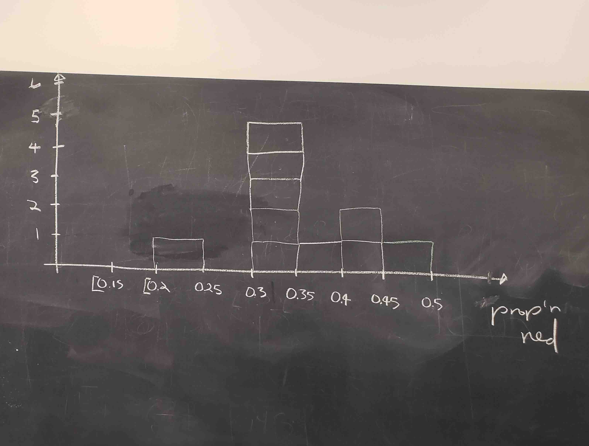

(ref:inferpart) Statistical Inference with `infer`

```{r echo=FALSE, results="asis", purl=FALSE}
if (is_latex_output()) {
  cat("# (PART) (ref:inferpart) {-}")
} else {
  cat("# (PART) Statistical Inference with infer {-} ")
}
```

# Sampling {#sampling}

```{r setup_infer, include=FALSE, purl=FALSE}
# Used to define Learning Check numbers:
chap <- 7
lc <- 0

# Set R code chunk defaults:
opts_chunk$set(
  echo = TRUE,
  eval = TRUE,
  warning = FALSE,
  message = TRUE,
  tidy = FALSE,
  purl = TRUE,
  out.width = "\\textwidth",
  fig.height = 4,
  fig.align = "center"
)

# Set output digit precision
options(scipen = 99, digits = 3)

# Set random number generator seed value for replicable pseudorandomness
set.seed(76)
```

The third portion of this book introduces statistical inference. This chapter is about *sampling*. Sampling involves drawing repeated random samples from a population and then using the information from those samples to learn more about the entire population. In Section \@ref(sampling-activity) we illustrate sampling using a tactile example and simultaneously introducing key concepts and terminology. In Section \@ref(sampling-simulation) we extend this by performing virtual sampling via simulations. The tools used in the data science portion of this book, in particular data visualization and data wrangling, continue to be useful in this context. In Section \@ref(sampling-framework) we introduce more definitions, terminology, and a theoretical framework to introduce one of the fundamental theoretical results in Statistics: the *Central Limit Theorem*. In Section \@ref(sampling-case-study) we tie the contents of this chapter to the real world by presenting a case study: a 2023 Gallup poll conducted in the US asking whether coronavirus pre-pandemic normalcy was attainable.

The concepts behind *sampling* form the basis for constructing confidence intervals and performing tests of significance also called hypothesis tests; these are the best-known and most-used inferential methods and are presented in Chapters \@ref(confidence-intervals) and \@ref(hypothesis-testing).

### Needed packages {-#sampling-packages}

If needed, read Section \@ref(packages) for information on how to install and load R packages. 

```{r message=FALSE}
library(tidyverse)
library(moderndive)
library(infer)
```

Recall that loading the `tidyverse` package loads many commonly used data science packages that are needed here and we have encountered earlier. For details refer to Section \@ref(tidyverse-package).


```{r message=FALSE, echo=FALSE, purl=FALSE}
# Packages needed internally, but not in text.
library(kableExtra)
library(patchwork)
library(scales)

# Dynamic coding of summary statistics for bowl i.e. avoid hard-coding any values
# wherever possible
num_balls <- nrow(bowl)
num_red <- bowl |>
  summarize(red = sum(color == "red")) |>
  pull(red)
prop_red <- num_red / num_balls
percent_red_chr <- prop_red |> percent(accuracy = 0.1)
```

## First bowl activity: red balls {#sampling-activity}

Take a look at the bowl in Figure \@ref(fig:sampling-exercise-1). It has a certain number of red balls and a certain number of white balls all of equal size. `r if_else(is_latex_output(), '(Note that in this printed version of the book "red" corresponds to the darker-colored balls, and "white" corresponds to the lighter-colored balls. We kept the reference to "red" and "white" throughout this book since those are the actual colors of the balls as seen in the background of the image on our book\'s [cover](https://moderndive.com/images/logos/book_cover.png).)', '')` The balls have been mixed beforehand and there does not seem to be any particular pattern for the location of red and white balls inside the bowl. We would like to determine the proportion of red balls in the bowl. 

```{r sampling-exercise-1, echo=FALSE, fig.cap="A bowl with red and white balls.", purl=FALSE, out.width = "95%", purl=FALSE}
include_graphics("images/sampling/balls/sampling_bowl_1.jpg")
```

### The proportion of red balls in the bowl {#population-proportion}

To do this we can remove each ball individually, count the number of red balls, and divide the number of red balls by the total number of balls. The bowl seen in Figure \@ref(fig:sampling-exercise-1) is represented virtually by the data frame `bowl` included in the `moderndive` package. The first ten rows are shown here for illustration purposes:

```{r}
bowl
```

The  `bowl` has `r num_balls` rows representing the `r num_balls` balls in the bowl shown in Figure \@ref(fig:sampling-exercise-1). You can view and scroll through the entire contents of the `bowl` in RStudio's data viewer by running `View(bowl)`. The first variable `ball_ID` is used as an *identification variable* as discussed in Subsection \@ref(identification-vs-measurement-variables); none of the balls in the actual bowl are marked with numbers. The second variable `color` indicates whether a particular virtual ball is red or white. We compute the proportion of red balls in the bowl using the `dplyr` data wrangling verbs presented in Chapter \@ref(wrangling). First, for each of the balls, we identify if it is red or not using a test for equality with `==`. We then create a new Boolean variable `is_red` using the `mutate()` function from Section \@ref(mutate):

```{r}
bowl |> 
  mutate(is_red = (color == "red"))
```

Observe that for every row where `color == "red"`, the Boolean (logical)  value `TRUE` is returned, and for every row where `color` is not equal to `"red"`, the Boolean `FALSE` is returned. Since R treats `TRUE` like the number `1` and `FALSE` like the number `0`, accounting for all `TRUE`s and `FALSE`s is equivalent to summing `1`'s and `0`'s.

We now compute the number of balls that are red using the `summarize()` function. Recall from Section \@ref(summarize) that `summarize()` takes a data frame with many rows and returns a data frame with a single row containing summary statistics, such as the `sum()`:

```{r}
bowl |> 
  mutate(is_red = (color == "red")) |> 
  summarize(num_red = sum(is_red))
```

There are `r num_red` red balls in the bowl and the proportion is `r num_red`/`r num_balls`. Alternatively, we could compute the proportion of red balls directly by using the `mean()` or the average of these `TRUE`s and `FALSE`s (`1`'s and `0`'s, respectively):

```{r}
bowl |> 
  mutate(is_red = color == "red") |> 
  summarize(prop_red = mean(is_red))
```

The proportion of red balls in the bowl is `r prop_red`. We can further simplify these calculations in R by finding the average of the Boolean values all at once:

```{r}
bowl |> 
  summarize(prop_red = mean(color == "red"))
```


### Manual sampling {#sampling-manual}


In the previous section we were able to obtain the proportion of red ball in the bowl using R only because we had the information of the entire bowl as a data frame. Otherwise, we would have to obtain this manually. If the bowl contained a large number of balls, this could be a long and tedious process. How long do you think it would take to do this manually if the bowl had thousands of balls? Or tens of thousands? Or even more? 

In real-life situations, it is often the case that we are interested in finding the proportion of a very large number of objects, or subjects, and obtaining an exhaustive count could be tedious, costly, impractical, or even impossible.

Because of these limitations, we typically do not perform exhaustive counts; rather, we randomly select a sample of balls from the bowl, find the proportion of red balls in the sample, and use this proportion as an approximation of the proportion of red balls in the entire bowl. To understand why this method generally produces a good approximation, we first observe what happens with proportions of red balls for different samples.


#### One sample {#one-sample}

We start by inserting a shovel into the bowl as seen in Figure \@ref(fig:sampling-exercise-2) and collect $5 \cdot 10 = 50$ balls as shown in Figure \@ref(fig:sampling-exercise-3). The set of balls obtained is called a _sample_. 

```{r sampling-exercise-2, echo=FALSE, fig.cap="Inserting a shovel into the bowl.", purl=FALSE, out.width = "100%", purl=FALSE}
include_graphics("images/sampling/balls/sampling_bowl_2.jpg")
```


```{r sampling-exercise-3, echo=FALSE, fig.cap="Taking a sample of 50 balls from the bowl.", purl=FALSE, out.width = "100%", purl=FALSE}
include_graphics("images/sampling/balls/sampling_bowl_3_cropped.jpg")
```

Observe that 17 of the balls are red and thus the proportion of red balls in the sample is 17/50 = 0.34 or 34%. While the proportion of red balls in the entire bowl is not exactly 34%, this seems to be a good approximation of the proportion of red balls in the entire bowl and it took much less time and energy to obtain.


#### Thirty-three samples {#student-shovels}

We repeat this activity many times as shown in Figure \@ref(fig:sampling-exercise-3b). Each time we do the following: 

- Return the 50 balls used earlier back into the bowl and mix the contents of the bowl. This is done to ensure that each new sample is not influenced in any way by the previous sample.
- Take a new sample with the shovel and obtain a new proportion of red balls.

```{r sampling-exercise-3b, echo=FALSE, fig.show='hold', fig.cap="Repeating sampling activity.", purl=FALSE, out.width = "30%"}
# Need new picture
include_graphics(c("images/sampling/balls/tactile_2_a.jpg", "images/sampling/balls/tactile_2_b.jpg", "images/sampling/balls/tactile_2_c.jpg"))
```

When we perform this activity many times, we observe that different samples may produce different proportions of red balls. A proportion of red balls obtained from a sample is called a _sample proportion_.  A group of 33 students performed this activity previously and drew a histogram using blocks to represent sample proportions of red balls. Figure \@ref(fig:sampling-exercise-4) shows students working on the histogram with two blocks drawn already representing the first two sample proportions obtained and the third about to be added.

```{r sampling-exercise-4, echo=FALSE, fig.cap="Students drawing a histogram of sample proportions.", purl=FALSE, out.width = "80%"}
include_graphics("images/sampling/balls/tactile_3_a.jpg")
```

Recall from Section \@ref(histograms) that histograms help us visualize the *distribution* \index{distribution} of a numerical variable. In particular, where the center of the values falls and how the values vary. A histogram of the first 10 sample proportions can be seen in Figure \@ref(fig:sampling-exercise-5).

```{r sampling-exercise-5, echo=FALSE, fig.cap="Hand-drawn histogram of 10 sample proportions.", purl=FALSE, out.width = "70%"}

```

By looking at the histogram observe that the lowest proportion of red balls obtained was between 0.20 and 0.25 while the highest was between 0.45 and 0.5. More importantly, the most frequently occurring proportions were between 0.30 and 0.35.

This activity was performed by 33 students, the results are stored in the `tactile_prop_red` data frame included in the `moderndive` package. The first 10 rows are printed below:

```{r}
tactile_prop_red
```

<!--
Note: first 10 values on tactile_prop_red do not match the first 10 values of hand-drawn histogram tactile_3_c.jpg, consider updating one of them. AV
Also, names are not homogeneously formatted, Julia doesn't have last names. Should we remove last names altogether? AV 8-31-23
-->


Observe that for each student (`group`) the data frame provides their names, the number of `red_balls` in the sample, and the corresponding proportion of red balls in the sample (`prop_red`). We also have a `replicate` variable enumerating each of the 33 groups. We chose this name because each row can be viewed as one instance of a replicated (in other words repeated) activity.

Using the R data visualization techniques introduced in Chapter \@ref(viz), we construct the histogram for all 33 proportions as shown in Figure \@ref(fig:samplingdistribution-tactile). The histogram was constructed using `ggplot()`  with `geom_histogram()`. To align the bins in the computerized histogram version to those in the hand-drawn histogram shown in Figure \@ref(fig:sampling-exercise-5), the arguments `boundary = 0.4` and `binwidth = 0.05` were used. The former indicates that we want a binning scheme, such that, one of the bins' boundaries is at 0.4; the latter fixes the width of the bin to 0.05 units.

```{r eval=FALSE}
ggplot(tactile_prop_red, aes(x = prop_red)) +
  geom_histogram(binwidth = 0.05, boundary = 0.4, color = "white") +
  labs(x = "Proportion of red balls in each sample", 
       title = "Histogram of 33 proportions") 
```
```{r samplingdistribution-tactile, echo=FALSE, fig.cap="The distribution of sample proportions based on 33 random samples of size 50.", fig.height=3.1, purl=FALSE}
tactile_histogram <- ggplot(tactile_prop_red, aes(x = prop_red)) +
  geom_histogram(binwidth = 0.05, boundary = 0.4, color = "white")
tactile_histogram +
  labs(
    x = "Proportion of red balls in each sample",
    title = "Histogram of 33 proportions"
  )
```


#### Recap and some statistical parlance {#sampling-what-did-we-just-do}

Recall that we started by taking a *sample* of 50 balls and obtaining the *sample proportion*, the proportion of red balls in the sample. We then took more samples and obtained more sample proportions, 33 in total. In statistics, we call this \index{sampling} *sampling*.

Since we returned the observed balls to the bowl before getting another sample, we say that we performed *sampling with replacement* and because we mixed the balls before taking a new sample, the samples were *randomly drawn* and are called *random samples*. As shown in Figure \@ref(fig:samplingdistribution-tactile), different random samples produce different sample proportions. This phenomenon is called *sampling variation* and it is central to the ideas we develop in this chapter. \index{sampling!variation}


```{block, type="learncheck", purl=FALSE}
\vspace{-0.15in}
**_Learning check_**
\vspace{-0.1in}
```

**`r paste0("(LC", chap, ".", (lc <- lc + 1), ")")`** Why is it important to mix the balls in the bowl before we take a new sample?

**`r paste0("(LC", chap, ".", (lc <- lc + 1), ")")`** Why is it that students did not all have the same sample proportion of red balls?

```{block, type="learncheck", purl=FALSE}
\vspace{-0.25in}
\vspace{-0.25in}
```


### Virtual sampling {#sampling-simulation}

In the previous Section \@ref(sampling-activity), we performed a *tactile* sampling activity: we asked students to take physical samples using a real shovel from a bowl with colored balls by hand. This activity helps us develop the appropriate intuition about sampling. We are ready to extend the entire process using simulations on a computer, a sort of *virtual* sampling activity.

The use of simulations permits us to study *sampling variation* not only for 33 random samples but for thousands, tens of thousands, or even more samples. In addition, we do not need to restrict the samples to 50 balls, we can change the size of the virtual shovel to any size. As we show later in this section, the sample size of the samples taken has a direct effect on the magnitude of *sampling variation*.


#### One virtual sample

Recall that the bowl seen in Figure \@ref(fig:sampling-exercise-1) is represented by the data frame `bowl` included in the `moderndive` package. The virtual analog to the 50-ball shovel seen in Figure \@ref(fig:sampling-exercise-2) can be obtained using the `rep_slice_sample()` function included in the `moderndive` package. This function allows us to take `rep`eated (or `rep`licated) random `samples` of size `n`. We start by obtaining a single sample of 50 balls: 

<!--
Note: Put this back in if people have trouble understanding rep_slice_sample() at first:

Let's show an example of this function in action. Let's first use the `tibble()` function to manually create a data frame of five fruit called `fruit_basket`. 

```{r}
fruit_basket <- tibble(
  fruit = c("Mango", "Tangerine", "Apricot", "Pamplemousse", "Lime")
)
```

-->


```{r echo=-1}
set.seed(76)
virtual_shovel <- bowl |> 
  rep_slice_sample(n = 50)
virtual_shovel
```

Observe that `virtual_shovel` has 50 rows corresponding to our virtual sample of size 50. The `ball_ID` variable identifies which of the `r num_balls` balls from `bowl` are included in our sample of 50 balls while `color` denotes its color. The `replicate` variable is equal to 1 for all 50 rows because we have decided to take only one sample right now. Later on, we take more samples, and `replicate` would take more values. 

We compute the proportion of red balls in our virtual sample. The code we use is similar to the one used for finding the proportion of red balls in the entire bowl in Subsection \@ref(population-proportion):


```{r echo=-1}
prop_red_sample1 <- virtual_shovel |> summarize(prop_red = mean(color == "red")) |> pull(prop_red)
virtual_shovel |> 
 summarize(prop_red = mean(color == "red"))
```

Great! `r prop_red_sample1*100`% of the `virtual_shovel`'s 50 balls were red! Based on this particular random sample of 50 balls, our estimated proportion of red balls in the bowl is `r prop_red_sample1*100`%.

#### Thirty-three virtual samples {#shovel-33-times}

In Section \@ref(sampling-activity), students got 33 samples and sample proportions. They repeated/replicated the sampling process 33 times. We do this virtually by again using the function `rep_slice_sample()` and this time adding the `reps = 33` argument as we want to perform sampling 33 times. We save these samples in the data frame `virtual_samples`, as shown below, and then provide a preview of its first 10 rows. If you want to inspect the entire `virtual_samples` data frame, use RStudio's data viewer by running `View(virtual_samples)`. 

```{r echo=-1}
set.seed(76)
virtual_samples <- bowl |> 
  rep_slice_sample(n = 50, reps = 33)
virtual_samples
```

Observe in the spreadsheet viewer that the first 50 rows of `replicate` are equal to `1`, the next 50 rows of `replicate` are equal to `2`, and so on. The first 50 rows correspond to the first sample of 50 balls while the next 50 rows correspond to the second sample of 50 balls. This pattern continues for all `reps = 33` replicates and thus `virtual_samples` has 33 $\cdot$ 50 = 1650 rows. 

Using `virtual_samples` we obtain the proportion of red balls for each replicate. We use the same `dplyr` verbs as before. In particular, we add `group_by()` of the `replicate` variable. Recall from Section \@ref(groupby) that by assigning the grouping variable "meta-data" before `summarize()`, we perform the calculations needed for each replicate separately. The other line of code, as explained in the case of one sample, calculates the sample proportion of red balls. A preview of the first 10 rows is presented below:

```{r}
virtual_prop_red <- virtual_samples |> 
  group_by(replicate) |> 
  summarize(prop_red = mean(color == "red")) 
virtual_prop_red
```

Actually, the function `rep_slice_sample()` already groups the data by replicate, so it is not necessary to include `group_by()` in the code. Moreover, using `dplyr` pipes in R we could simplify the work and write everything at once: using `rep_slice_sample()` we obtain 33 replicates, each is a random sample of 50 balls, and using `summarize()` with `mean()` on the Boolean values, we obtain the proportion of red balls for each sample. We store these proportions on the data frame `virtual_prop_red` and print the first 10 sample proportions (for the first 10 samples) as an illustration:

```{r echo=-1}
set.seed(76)
virtual_prop_red <- bowl |> 
  rep_slice_sample(n = 50, reps = 33) |>
  summarize(prop_red = mean(color == "red"))
virtual_prop_red
```

As was the case in the tactile activity, there is variation in the resulting 33 proportions from virtual samples. As shown in Figure \@ref(fig:samplingdistribution-virtual) a histogram helps us visualize this sampling variation. As we did in Section \@ref{sampling-activity}, we construct the histogram using `ggplot()`, `geom_histogram()`, and including the arguments `binwidth = 0.05` and `boundary = 0.4`. This creates the appropriate bins with boundaries at 0.3, 0.35, 0.4, 0.45, etc., as shown below:

```{r eval=FALSE}
ggplot(virtual_prop_red, aes(x = prop_red)) +
  geom_histogram(binwidth = 0.05, boundary = 0.4, color = "white") +
  labs(x = "Sample proportion", 
       title = "Histogram of 33 sample proportions") 
```
```{r samplingdistribution-virtual, echo=FALSE, fig.cap="The distribution of 33 proportions based on 33 virtual samples of size 50.", fig.height=3.2, purl=FALSE}
virtual_histogram <- ggplot(virtual_prop_red, aes(x = prop_red)) +
  geom_histogram(binwidth = 0.05, boundary = 0.4, color = "white")
virtual_histogram +
  labs(
    x = "Sample proportion",
    title = "Histogram of 33 sample proportions"
  )
``` 

Observe that some proportions are less than 30% and others are greater than 45%, but the most frequently occurring proportions were between 35% and 40% (for 11 out of 33 samples). We can also compare the virtual results with the tactile ones from the previous section in Figure \@ref(fig:tactile-vs-virtual). Observe that both histograms are somewhat similar in their center and variation, although not identical. These slight differences are due to *sampling variation*.

```{r tactile-vs-virtual, echo=FALSE, fig.cap="We illustrate sampling variation showing a histogram for virtual sample proportions (left) and another histogram for tactile sample proportions (right).", fig.height=2.9, purl=FALSE}
facet_compare <- bind_rows(
  virtual_prop_red |>
    mutate(type = "Virtual sampling"),
  tactile_prop_red |>
    select(replicate, red = red_balls, prop_red) |>
    mutate(type = "Tactile sampling")
) |>
  mutate(type = factor(type, levels = c("Virtual sampling", "Tactile sampling"))) |>
  ggplot(aes(x = prop_red)) +
  geom_histogram(binwidth = 0.05, boundary = 0.4, color = "white") +
  facet_wrap(~type) +
  labs(
    x = "Sample Proportion",
    title = "Histograms for sample proportions"
  )

if (is_latex_output()) {
  facet_compare +
    theme(
      strip.text = element_text(colour = "black"),
      strip.background = element_rect(fill = "grey93")
    )
} else {
  facet_compare
}
```

```{block, type="learncheck", purl=FALSE}
\vspace{-0.15in}
**_Learning check_**
\vspace{-0.1in}
```

**`r paste0("(LC", chap, ".", (lc <- lc + 1), ")")`** Why couldn't we study the effects of sampling variation when we used the virtual shovel only once? Why did we need to take more than one virtual sample (in our case 33 virtual samples)?

```{block, type="learncheck", purl=FALSE}
\vspace{-0.25in}
\vspace{-0.25in}
```


#### One thousand virtual samples {#shovel-1000-times}

We now study the effects of sampling variation with 1000 random samples. Trying to do this manually could be impractical while obtaining virtual samples can be done quickly and efficiently. We repeat the steps performed at the end of Subsection \@ref(shovel-33-times) using the `rep_slice_sample()` function with a sample `size` set to be 50, the number of replicates `reps` set to `1000`, and `summarize()` and `mean()` used again on the Boolean values to obtain the sample proportions. We obtain `virtual_prop_red` with the count of red balls and the corresponding sample proportion for all 1000 random samples. The proportions for the first 10 samples are shown below:

```{r echo=-1}
set.seed(76)
virtual_prop_red <- bowl |> 
  rep_slice_sample(n = 50, reps = 1000) |> 
  summarize(prop_red = mean(color == "red"))
virtual_prop_red
```

As we did before, we construct a histogram for these 1000 sample proportions. It is shown in Figure \@ref(fig:samplingdistribution-virtual-1000).

```{r eval=FALSE}
ggplot(virtual_prop_red, aes(x = prop_red)) +
  geom_histogram(binwidth = 0.05, boundary = 0.4, color = "white") +
  labs(x = "Sample proportion", 
       title = "Histogram of 1000 sample proportions") 
```
```{r samplingdistribution-virtual-1000, echo=FALSE, fig.cap="The distribution of 1000 proportions based on 1000 random samples of size 50.", purl=FALSE}
virtual_histogram <- ggplot(virtual_prop_red, aes(x = prop_red)) +
  geom_histogram(binwidth = 0.05, boundary = 0.4, color = "white")
virtual_histogram +
  labs(
    x = "Sample proportion",
    title = "Histogram of 1000 sample proportions"
  )
``` 

The sample proportions represented by the histogram could be as low as 15% or as high as 60%, but those extreme proportions are rare. The most frequent proportions obtained are those between 35% and 40%. Furthermore, the histogram shows now a symmetric and bell-shaped distribution that can be approximated well by a normal distribution. Please read the "Normal distribution" section (Appendix \@ref(appendix-normal-curve)) for a brief discussion of this distribution and its properties.

<!-- 
Learning checks need to be updated. AV 8/17/23
-->

```{block, type="learncheck", purl=FALSE}
\vspace{-0.15in}
**_Learning check_**
\vspace{-0.1in}
```

**`r paste0("(LC", chap, ".", (lc <- lc + 1), ")")`** Why did we not take 1000 "tactile" samples of 50 balls by hand?

**`r paste0("(LC", chap, ".", (lc <- lc + 1), ")")`** Looking at Figure \@ref(fig:samplingdistribution-virtual-1000), would you say that sampling 50 balls where 30% of them were red is likely or not? What about sampling 50 balls where 10% of them were red?

```{block, type="learncheck", purl=FALSE}
\vspace{-0.25in}
\vspace{-0.25in}
```


#### Different sample sizes {#different-shovels}

Instead of using only one shovel of size 50, as we did before, we now use three shovels of sizes 25, 50, and 100; as shown in Figure \@ref(fig:three-shovels). That is, we can take samples of different sizes. As we show later in this subsection, the size of the sample has a direct effect on the magnitude of sampling variation.

<!--
A shovel with 25 slots          |  A shovel with 50 slots  | A shovel with 100 slots
:-------------------------:|:-------------------------:|:-------------------------:
{ width=1.6in }  |  { width=1.6in } | { width=1.6in } 
-->

```{r three-shovels, echo=FALSE, fig.cap="Three shovels to extract three different sample sizes.", out.width='100%', purl=FALSE}
include_graphics("images/sampling/balls/three_shovels.png")
```

We follow the same process performed in subsection \@ref(shovel-1000-times): we generate 1000 samples, obtain the sample proportions, and use them to draw a histogram. We follow this process three different times, setting the `size` argument in the code equal to `25`, `50`, and `100`, respectively. We run each of the following code segments individually and then compare the resulting histograms.

```{r, eval=FALSE}
# Segment 1: sample size = 25 ------------------------------
# 1.a) Compute sample proportions for 1000 samples, each sample of size 25
virtual_prop_red_25 <- bowl |> 
  rep_slice_sample(n = 25, reps = 1000) |> 
  summarize(prop_red = mean(color == "red"))

# 1.b) Plot a histogram to represent the distribution of the sample proportions
ggplot(virtual_prop_red_25, aes(x = prop_red)) +
  geom_histogram(binwidth = 0.05, boundary = 0.4, color = "white") +
  labs(x = "Proportion of 25 balls that were red", title = "25") 


# Segment 2: sample size = 50 ------------------------------
# 2.a) Compute sample proportions for 1000 samples, each sample of size 50
virtual_prop_red_50 <- bowl |> 
  rep_slice_sample(n = 50, reps = 1000) |> 
  summarize(prop_red = mean(color == "red"))

# 2.b) Plot a histogram to represent the distribution of the sample proportions
ggplot(virtual_prop_red_50, aes(x = prop_red)) +
  geom_histogram(binwidth = 0.05, boundary = 0.4, color = "white") +
  labs(x = "Proportion of 50 balls that were red", title = "50")  


# Segment 3: sample size = 100 ------------------------------
# 2.a) Compute sample proportions for 1000 samples, each sample of size 100
virtual_prop_red_100 <- bowl |> 
  rep_slice_sample(n = 100, reps = 1000) |> 
  summarize(prop_red = mean(color == "red"))

# 3.b) Plot a histogram to represent the distribution of the sample proportions
ggplot(virtual_prop_red_100, aes(x = prop_red)) +
  geom_histogram(binwidth = 0.05, boundary = 0.4, color = "white") +
  labs(x = "Proportion of 100 balls that were red", title = "100") 


#virtual_prop_red_50 <- bowl |> 
#  rep_slice_sample(n = 50, reps = 1000)|>
#  summarize(prop_red = mean(color == "red"), n = n())
```

For easy comparison, we present the three resulting histograms in a single row with matching x and y axes in Figure \@ref(fig:comparing-sampling-distributions).

```{r comparing-sampling-distributions, echo=FALSE, fig.height=3, fig.cap="Histograms of sample proportions for different sample sizes.", purl=FALSE}
# n = 25
if (!file.exists("rds/virtual_samples_25.rds")) {
  virtual_samples_25 <- bowl |>
    rep_slice_sample(n = 25, reps = 1000)
  write_rds(virtual_samples_25, "rds/virtual_samples_25.rds")
} else {
  virtual_samples_25 <- read_rds("rds/virtual_samples_25.rds")
}
virtual_prop_red_25 <- virtual_samples_25 |>
  summarize(prop_red = mean(color == "red"), n = n())

# n = 50
if (!file.exists("rds/virtual_samples_50.rds")) {
  virtual_samples_50 <- bowl |>
    rep_slice_sample(n = 50, reps = 1000)
  write_rds(virtual_samples_50, "rds/virtual_samples_50.rds")
} else {
  virtual_samples_50 <- read_rds("rds/virtual_samples_50.rds")
}
virtual_prop_red_50 <- virtual_samples_50 |>
  summarize(prop_red = mean(color == "red"), n = n())

# n = 100
if (!file.exists("rds/virtual_samples_100.rds")) {
  virtual_samples_100 <- bowl |>
    rep_slice_sample(n = 100, reps = 1000)
  write_rds(virtual_samples_100, "rds/virtual_samples_100.rds")
} else {
  virtual_samples_100 <- read_rds("rds/virtual_samples_100.rds")
}
virtual_prop_red_100 <- virtual_samples_100 |>
  summarize(prop_red = mean(color == "red"), n = n())

virtual_prop <- bind_rows(
  virtual_prop_red_25,
  virtual_prop_red_50,
  virtual_prop_red_100
)

comparing_sampling_distributions <- ggplot(virtual_prop, aes(x = prop_red)) +
  geom_histogram(binwidth = 0.05, boundary = 0, color = "white") +
  labs(
    x = "Sample proportions for red balls",
    title = "Histograms for three different sample sizes"
  ) +
  scale_x_continuous(breaks = c(0.1, 0.3, 0.4, 0.6)) +
  facet_wrap(~n)

if (is_latex_output()) {
  comparing_sampling_distributions +
    theme(
      strip.text = element_text(colour = "black"),
      strip.background = element_rect(fill = "grey93")
    )
} else {
  comparing_sampling_distributions
}
```


Observe that all three histograms are somewhat bell-shaped and appear to center around the same middle value, somewhere between 0.35 and 0.4. In addition, as the sample size increases from 25 to 50 to 100, the sample proportions seem to be closer to this middle value; in other words, sample proportions obtained from larger samples, such as those in the right histogram (sample size 100) are closer to the center and exhibit less dispersion, or less *sampling variation*, than sample proportions obtained from smaller samples, such as those in the left histogram (sample size 25).

These results are not coincidental or isolated to the example of sample proportions of red balls in a bowl. In the next subsection, a theoretical framework is introduced that helps explain with precise mathematical equations the behavior of sample proportions obtained from random samples.


<!-- 
Learning checks need to be updated. AV 8/17/23
-->


```{block, type="learncheck", purl=FALSE}
\vspace{-0.15in}
**_Learning check_**
\vspace{-0.1in}
```

**`r paste0("(LC", chap, ".", (lc <- lc + 1), ")")`** As shown in Figure \@ref(fig:comparing-sampling-distributions) the histograms of sample proportions are somewhat bell-shaped. What can you say about the center of the histograms?

- A. The larger the sample size the greater the center of the histogram.
- B. The larger the sample size the smaller the center of the histogram.
- C. The center of each histogram seems to be about the same, regardless of the sample size.


**`r paste0("(LC", chap, ".", (lc <- lc + 1), ")")`** As shown in Figure \@ref(fig:comparing-sampling-distributions) as the sample size increases, the histogram gets narrower. What happens with the sample proportions?

- A. They vary less.
- B. They vary by the same amount.
- C. They vary more.


```{block, type="learncheck", purl=FALSE}
\vspace{-0.25in}
```


## Sampling framework {#sampling-framework}

<!--
This section may need to be modified/cut and a similar content should appear after the second activity
-->

In both tactile and virtual sampling activities, we obtain sample proportions from random samples. The virtual sampling activity concludes with the results shown in Figure \@ref(fig:comparing-sampling-distributions) comparing 1000 sample proportions of red balls using samples of sizes 25, 50, and 100. The conclusions of these activities can be considered our first attempt at understanding two key concepts relating to sampling:

1. The effect of *sampling variation* on our sample proportions.
1. The effect of sample size on *sampling variation*.

Now that we have acquired some intuition about sampling, we introduce statistical definitions, terminology, and notation related to sampling. We use those to succinctly summarize and refer to the ideas behind sampling in the rest of this book. 


### Populations and Samples {#terminology-and-notation}


We introduce additional terminology and some mathematical notation. We illustrate these concepts by connecting them to different elements of the sampling bowl activities described in previous sections. 

A **population** or **study population** is a collection of all individuals or observations that we are interested in. In the bowl activities the **population** is the collection of all the balls inside the bowl and the population proportion of red balls in the bowl is a **parameter**. A **sample** is a subsets of the population. **Sampling** is the act of collecting samples from the population. **Simple random sampling** is *sampling* where each member of the population has the same chance of being selected, for example, by using a shovel to select balls from a bowl. A **random sample** is a sample obtained using simple random sampling. In the bowl activities, tactile and virtual, we performed simple random sampling when getting random samples from the bowl. 

A **population parameter** or simply **parameter** is a numerical summary, a number, that represents some characteristic of the population. A **sample statistic** or simply a **statistic** is a numerical summary computed from a sample. In the bowl activities the parameter of interest was the population proportion $p$=`r prop_red`. Similarly, in subsection \@ref(one-sample) a sample of 50 balls was obtained and 17 were red, the statistic was the *sample proportion* which is equal to $\widehat{p}= 0.34$. Observe how we use $p$ to represent the population proportion (parameter) and $\widehat{p}$ for the sample proportion (statistic).

### The sampling distribution of the sample proportion

The **distribution** of a list of numbers is the set of the possible values in the list and how often they occur. The **sampling distribution of the sample proportion** is the **distribution**  of all the possible sample proportions obtained from all the possible random samples of a given size. \index{sampling distributions} To illustrate this concept recall that in Subsection \@ref(different-shovels) we obtained three histograms shown in Figure \@ref(fig:comparing-sampling-distributions). We use here the histogram on the left, the one produced using 1000 sample proportions obtained from random samples of size $n=25$. These 1000 sample proportions is a large enough number to make this histogram a good visual approximation of the **sampling distribution of the sample proportion** of red balls for samples of size $n=25$. This distribution allows us to make statements about what values we can typically expect when we take a random sample. Be careful, people learning this terminology sometimes confuse the term *sampling distribution* with a *sample's distribution* which is merely the distribution of the values in a single sample.


<!-- 
Learning checks need to be updated. AV 8/17/23
-->

```{block, type="learncheck", purl=FALSE}
\vspace{-0.15in}
**_Learning check_**
\vspace{-0.1in}
```

**`r paste0("(LC", chap, ".", (lc <- lc + 1), ")")`** In the case of our bowl activity, what is the *population parameter*? Do we know its value?

**`r paste0("(LC", chap, ".", (lc <- lc + 1), ")")`** How did we ensure that our tactile samples using the shovel were random?


```{block, type="learncheck", purl=FALSE}
\vspace{-0.25in}
\vspace{-0.25in}
```


### Sampling distributions, the expected value, and the standard error {#sampling-definitions}

<!--
This subsection overlaps too much with the next two subsections. Consider merging/editing the contents as to make one of the sections dissappear. AV 8/17/23
-->

In Subsection \@ref(different-shovels) we obtained three histograms. As shown in Figure \@ref(fig:comparing-sampling-distributions) each histogram was constructed using 1000 sample proportions from random samples of sizes $n$ = 25, $n$ = 50, and $n$ = 100, respectively.

Let's focus on one histogram, say the one using $n=25$. Each sample proportion used was obtained as the proportion of red balls from a random sample of 25 balls from the bowl. Since we have obtained 1000 sample proportions, this number is large enough to make the histogram a good approximation of the *distribution* of all the possible sample proportions that can be obtained from all the possible random samples of 25 balls. We call this distribution the **sampling distribution of the sample proportion** for samples of size $n=25$. \index{sampling distributions} This distribution allows us to make statements about what values we can typically expect when we take a random sample. Be careful, people learning this terminology sometimes confuse the term *sampling distribution* with a *sample's distribution* which is merely the distribution of the values in a single sample. 
Using these three histograms we can illustrate some interesting and relevant results about the sampling distribution of the sample proportion.

<!--
TODO: Insert table distinguishing "sampling distribution of point estimates" vs "a sample's distribution"
-->

The first relevant result is about the central value of the sampling distribution. We noted in Subsection \@ref(different-shovels) that all three histograms were centered at some value between 0.35 and 0.4 (or between 35% and 40%). Actually, they are centered exactly at the value of the population proportion (the proportion of red balls in the entire bowl). This is not a coincidence but a property of the sampling distribution of the sample proportion. In Subsection \@ref(population-proportion) we determined that the population proportion was `r num_red`/`r num_balls` = `r prop_red`. Figure \@ref(fig:comparing-sampling-distributions-3) re-displays the histograms shown in Figure \@ref(fig:comparing-sampling-distributions) but this time adding a vertical red line on each histogram at the location of the population proportion value, $p$ = `r prop_red`.

```{r comparing-sampling-distributions-3, echo=FALSE, fig.cap="Three sampling distributions with population proportion $p$ marked by vertical line.", purl=FALSE}
p <- bowl |>
  summarize(mean(color == "red")) |>
  pull()
samp_distn_compare <- virtual_prop |>
  mutate(
    n = str_c("n = ", n),
    n = factor(n, levels = c("n = 25", "n = 50", "n = 100"))
  ) |>
  ggplot(aes(x = prop_red)) +
  geom_histogram(
    binwidth = 0.05, boundary = 0,
    color = "white"
  ) +
  labs(
    x = expression(paste("Sample proportion ", hat(p))),
    title = expression(paste(
      "Sampling distributions of ", hat(p),
      " based on n = 25, 50, 100."
    ))
  ) +
  scale_x_continuous(breaks = c(0.1, 0.3, 0.4, 0.6)) +
  facet_wrap(~n) +
  geom_vline(xintercept = p, col = "red", size = 1)

if (is_latex_output()) {
  samp_distn_compare +
    theme(
      strip.text = element_text(colour = "black"),
      strip.background = element_rect(fill = "grey93")
    )
} else {
  samp_distn_compare
}
```


It is worth spending a moment understanding this result. Since the sampling distribution is composed of all the sample proportions that can be obtained, the center of this distribution can be understood as the average of all these proportions or the value we would *expect* to get, on average, from a large number of sample proportions. This is why the center value of the sampling distribution is called the **expected value** of the sample proportion, and this expected value is precisely the population proportion. In other words, if we take one random sample of a given size, we know that the sample proportion from this sample would be somewhat different than the population proportion due to sampling variation; however, if we take many random samples of the same size, the average of the sample proportions obtained are expected to be equal to the population proportion.

The second relevant result is about the dispersion, or magnitude of variation, in the sampling distribution of sample proportions. In particular, observe in Figure \@ref(fig:comparing-sampling-distributions) that:

- When the sample size used is 25 (left histogram) it is somewhat likely to obtain sample proportions of red balls that are less than 0.2 or greater than 0.55. 
- When the sample size is 50 (middle histogram) it is no longer likely, although still possible, to get those extreme sample proportions.
- When the sample size is 100 (right histogram) it is very unlikely to get those sample proportions as we have not observed a single value that is that extreme in the simulation. 

This behavior is expected. As the sample size $n$ increases from 25 to 50 to 100, \index{sampling distributions!relationship to sample size} the variation of the sampling distribution decreases, and thus the values cluster more and more tightly around the population proportion. In other words, the histogram on the left of Figure \@ref(fig:comparing-sampling-distributions) is more spread out than the one in the middle, which in turn is more spread out than the one on the right.
We quantify this variation using the standard deviation of sample proportions. Results are shown in Table \@ref(tab:comparing-n):

```{r comparing-n, echo=FALSE, purl=FALSE}

n <- c(25, 50, 100)
p <- prop_red
sd_prop <- round(sqrt(p * (1 - p) / n), 3)
comparing_n_table <- 
  tibble(n, sd_prop) |> 
  rename(`Sample size used` = n, `Standard deviation of sample proportions (Standard Error)` = sd_prop)

comparing_n_table |>
  kable(
    digits = 3,
    caption = "Comparing standard deviations of sample proportions for three different sample sizes",
    booktabs = TRUE,
    linesep = ""
  ) |>
  kable_styling(
    font_size = ifelse(is_latex_output(), 10, 16),
    latex_options = c("hold_position")
  )
```

In words, the standard deviation of a list of $N$ values is the square root of the sum of squared deviations (of those values from the center value) divided by $N$. We can think of the standard deviation "roughly" as how far, on average, the values deviate from the center of their distribution. In the context of our sampling distributions this corresponds to how far, on average, the sample proportions (statistics) deviate from the population proportion (parameter). Because of this relationship, the standard deviation of a sampling distribution is called the \index{standard error} **standard error** of the sample proportion, where "error" can be thought of as the difference between the statistic and the parameter. For example, using \@ref(tab:comparing-n), when the sample size is 100, the standard error for the sample proportion is 0.048 or 4.8%. If we were to take a random sample of 100 balls from the bowl, we expect the sample proportion of red balls to be, on average, 4.8% away from the population proportion of red balls. Moreover, it is clear that the larger the sample size used to obtain the random samples, the smaller the standard error of the sampling distribution of the sample proportion. In future sections, we introduce a formula that shows that there is an inversely proportional relationship between the square root of the sample size used and the magnitude of the standard error.

Students sometimes confuse the *standard error* with the *standard deviation*. A standard deviation can be obtained for any list of values. The standard error is the standard deviation of the sample proportions obtained from all the possible random samples of a given size $n$. All standard errors are standard deviations, but not every standard deviation is necessarily a standard error. 

In the next subsections we introduce a theoretical framework to formalize these ideas, present a theory-based formula to estimate the standard error, and introduce one of the most important results in statistics, the Central Limit Theorem. 

<!-- 
Learning checks need to be updated. AV 8/17/23
-->


```{block, type="learncheck", purl=FALSE}
\vspace{-0.15in}
**_Learning check_**
\vspace{-0.1in}
```

**`r paste0("(LC", chap, ".", (lc <- lc + 1), ")")`** What purpose did the *sampling distributions* serve?

**`r paste0("(LC", chap, ".", (lc <- lc + 1), ")")`** What does the *standard error* of the sample proportion $\widehat{p}$ quantify? 

```{block, type="learncheck", purl=FALSE}
\vspace{-0.25in}
\vspace{-0.25in}
```


### Random Variables

We now introduce a simple theoretical approach to understand some important properties of the sampling distribution of the sample proportion. To do this we modify the bowl activity slightly. Instead of using a shovel to select all 25 balls at once, we randomly select one ball at a time, 25 times. If the ball is red we call it a success and record a 1 (one); if it is not red we call it a failure and record a 0 (zero). Then, we return the ball to the bowl so the proportion of red balls in the bowl doesn't change. 
This process is called a trial or a Bernoulli trial in honor of Jacob Bernoulli, a 17th-century mathematician who is among the first ones to work with these trials. 
Getting a sample of 25 balls is running 25 trials and obtaining 25 numbers, ones or zeros, representing whether we have observed red balls or not on each trial, respectively. 
The average of these 25 numbers (zeros or ones) represents precisely the proportion or red balls in a sample of 25 balls.

It is useful to represent a trial as a random variable that takes the value of 1 if the ball is red or the value of 0 if the ball is not red. 
We denote the first trial $X_1$, the second trial $X_2$, and so on. 
After the first trial is completed, if the ball observed is red then $X_1 = 1$ otherwise $X_1=0$. Observe that after the first trial, $X_1$ is no longer a random variable, it is either 0 or 1. After the second trial, $X_2$ is 0 or 1, etc.
Since our experiment is to perform 25 trials and then find the average of them, this average or mean, before the trials are carried out, can also be expressed as a random variable: $$\bar X = \frac{X_1+X_2+\dots+X_{25}}{25}.$$
Observe that $\bar X$ is the average, or mean, of these 25 trials. This is why $\bar X$ is called the **sample mean**. In the context of Bernoulli trials, because they are only zeros or ones, **sample means** are **sample proportions**! Connecting with the notation used earlier, observe that $\bar X = \widehat{p}$.

For example, if the results of the trials are: $$\{0,0,0,1,0,1,0,1,0,0,1,0,0,1,1,0,0,0,1,1,0,1,0,0,0,1 \}$$  The observed value of $\bar X$ will be 
$$\bar X = \frac{0+0+0+1+0+1+\dots+1+0+0+0+1}{25} = \frac{10}{25}=0.4.$$ 
So, for this particular example, the sample proportion is $\bar X = 0.4$. If you perform this experiment again and you now get: $$\{1,0,0,1,0,0,0,1,0,0,1,0,1,0,1,1,0,0,0,1,0,1,0,0,0,0\}$$ 
then, the realization of $\bar X$ will be $\bar X = 9/25 = 0.36$.
Observe that the possible values of $\bar X$ are all the possible proportions of red balls in a sample of 25 balls.

Moreover, while any given trial can result in choosing a red ball or not (1 or 0), the chances or getting a red ball are determined by the proportion of red balls in the bowl, the population proportion. The higher the population proportion of red balls is, the higher the chances of getting a red ball (or 1) in any trial. 


### The sampling distribution of the sample proportion

The **distribution** of a list of numbers is the set of the possible values in the list and how often they occur. The **sampling distribution of the sample proportion** is the **distribution**  of all the possible sample proportions obtained from all the possible random samples of a given size. \index{sampling distributions} To illustrate this concept recall that in Subsection \@ref(different-shovels) we obtained three histograms shown in Figure \@ref(fig:comparing-sampling-distributions). We use here the histogram on the left, the one produced using 1000 sample proportions obtained from random samples of size $n=25$. These 1000 sample proportions is a large enough number to make this histogram a good visual approximation of the **sampling distribution of the sample proportion** of red balls for samples of size $n=25$. This distribution allows us to make statements about what values we can typically expect when we take a random sample. Be careful, people learning this terminology sometimes confuse the term *sampling distribution* with a *sample's distribution* which is merely the distribution of the values in a single sample.

If we use random variables to represent our problem, where $\bar X$ is constructed as the average of Bernoulli trials, observe that the distribution of $\bar X$ is precisely the **sampling distribution of the sample proportion**. An intuitive way to think about this distribution is by answering these questions: what are the sample proportions that can be obtained? and how likely are those sample proportions of happening?

Our next task is the be able to answer these questions. To do this we use simulations. 

Simulations seldom provide the exact structure of the distribution, because an infinite number of samples may be needed for this, but a large number of replications often produce a really good approximation of the distribution and can be used to understand well the distribution's characteristics. As we did in earlier sections, we obtain sample proportions of red balls from samples of 25 balls, but this time we obtain 10,000 samples. 

```{r}
samp_prop_25 <- bowl |>
  rep_slice_sample(n = 25, replace = TRUE, reps = 10000) |>
  summarize(prop_red = mean(color == "red"))
```

The object `samp_prop_25` contains 10,000 sample proportions; each replicate was obtained following the experiment described earlier, so each sample proportion is a possible value of $\bar X$. We now use these sample proportions to illustrate properties of the sampling distribution of the sample proportion.

#### The expected value and standard error of $\bar X$

The expected value of $\bar X$ represents what sample proportion we would expect to get, on average, if we were to perform the experiment a large number of times. Based on probability theory, the mean of $\bar X$ happens to be equal to the population proportion of red balls in the bowl, that is $p = 900/2400 = 0.375$. We can check, using our simulation, whether this result holds:

```{r}
samp_prop_25 |> summarise(mean_Xbar = mean(prop_red))
```

Indeed, the result obtained above is very close to the theoretical population proportion. Similarly, the standard error of $\bar X$ can be understood as how far, on average, the sample proportion observed may be from the population proportion. Theoretical results show that the standard error of $\bar X$ can be obtained using the formula: $$SE_{\bar X} = \sqrt{\frac{p(1-p)}{n}}$$ where $p$ is the population proportion and $n$ is the size of our sample. In our example, the standard error is $$SE_{\bar X} = \sqrt{\frac{0.375\cdot(1-0.375)}{25}} = 0.0968$$


We use the simulation again to check if this result holds:

```{r}
samp_prop_25 |> summarise(SE_Xbar = sd(prop_red))
```

where the R function `sd()` produces the sample standard deviation of all our simulation values. Again, this result is really close to the theoretical value of the standard error.
The simulations are used to check that in fact the results obtained agree with the theory. In addition, the theoretical results are constructed based on the knowledge of the population proportion, $p$; by contrast, the simulations obtain samples from the population of interest but produce results only based on samples and sample proportions. 

Observe also the $n$ in the denominator of the standard error formula. We have discussed previously that, as the sample size $n$ increases, the standard error decreases. This formula supports this notion and shows that the standard error is inversely proportional to the square root of the sample size.

We can perform additional simulations for random samples obtained using larger sample sizes; for example, $n = 100$ balls. 
Based on the theory of the sample proportion, the mean of $\bar X$ should not change, it should still be 0.375. By contrast, the standard error should now be smaller: $$SE_{\bar X} = \sqrt{\frac{p(1-p)}{n}} = \sqrt{\frac{0.375\cdot(1-0.375)}{100}} = 0.0484$$ 
The simulation provides the following result:

```{r}
bowl |>
  rep_slice_sample(n = 100, replace = TRUE, reps = 10000) |>
  summarise(prop_red = mean(color == "red")) |>
  summarise(mean_Xbar = mean(prop_red), SE_Xbar = sd(prop_red))
```

Similarly, if we obtain additional simulations with a sample size $n = 400$, the mean should still be $0.375$ and the standard error: $$SE_{\bar X} = \sqrt{\frac{p(1-p)}{n}} = \sqrt{\frac{0.375\cdot(1-0.375)}{400}} = 0.0242$$ These are the simulation results:

```{r}
bowl |>
  rep_slice_sample(n = 400, replace = TRUE, reps = 10000) |>
  summarise(prop_red = mean(color == "red")) |>
  summarise(mean_Xbar = mean(prop_red), SE_Xbar = sd(prop_red))
```


In all cases, the simulations approximate really well the expected values for the mean and standard error, and in particular, they show how increasing the sample size reduces the standard error of the distribution of $\bar X$.

The formula for the standard error of the sample proportion can actually be derived using facts in probability theory, but its development goes beyond the scope of this book. To learn more about it, please consult more advanced treatments in probability and statistics such as [this one](http://onlinestatbook.com/2/sampling_distributions/samp_dist_p.html).


#### The Central Limit Theorem {#central-limit-theorem}


As seen in previous sections, histograms constructed using large numbers of sample proportions approximate visually really well the distribution of $\bar X$. This is true for any given sample sizes. 
Figure \@ref(fig:comparing-sampling-distributions-for-clt) presents the histograms for all three simulations performed previously. The histograms reflect precisely what we have shown earlier about the mean and standard error of $\bar X$, the mean is equal to the population proportion $p=0.375$ and the standard error gets smaller for larger sample sizes following the equation $$SE_{\bar X} = \sqrt{\frac{p(1-p)}{n}}$$ 

```{r comparing-sampling-distributions-for-clt, echo=FALSE, fig.height=3, fig.cap="Histogram of the distribution of the sample proportion and the normal curve.", purl=FALSE}

# n = 25
if (!file.exists("rds/virtual_prop_25.rds")) {
  virtual_prop_25 <- bowl |>
    rep_slice_sample(n = 25, replace = TRUE, reps = 10000) |>
    summarize(prop_red = mean(color == "red"), n=n())
  write_rds(virtual_prop_25, "rds/virtual_prop_25.rds")
} else {
  virtual_prop_25 <- read_rds("rds/virtual_prop_25.rds")
}

# n = 100
if (!file.exists("rds/virtual_prop_100.rds")) {
  virtual_prop_100 <- bowl |>
    rep_slice_sample(n = 100, replace = TRUE, reps = 10000) |>
    summarize(prop_red = mean(color == "red"), n=n())
  write_rds(virtual_prop_100, "rds/virtual_prop_100.rds")
} else {
  virtual_prop_100 <- read_rds("rds/virtual_prop_100.rds")
}


# n = 400
if (!file.exists("rds/virtual_prop_400.rds")) {
  virtual_prop_400 <- bowl |>
    rep_slice_sample(n = 400, replace = TRUE, reps = 10000) |>
    summarize(prop_red = mean(color == "red"), n=n())
  write_rds(virtual_prop_400, "rds/virtual_prop_400.rds")
} else {
  virtual_prop_400 <- read_rds("rds/virtual_prop_400.rds")
}


virtual_prop <- bind_rows(
  virtual_prop_25,
  virtual_prop_100,
  virtual_prop_400
)

comparing_sampling_distributions <- ggplot(virtual_prop, aes(x = prop_red)) +
  geom_histogram(aes(y = ..density..), binwidth = 0.04, boundary = 0.4, color = "white") +
  labs(
    x = "The distribution of sample proportions for red balls",
    title = "Comparing histograms of sample proportions for three different sample sizes"
  ) +
  facet_wrap(~n)

if (is_latex_output()) {
  comparing_sampling_distributions +
    theme(
      strip.text = element_text(colour = "black"),
      strip.background = element_rect(fill = "grey93")
    )
} else {
  comparing_sampling_distributions
}
```

 
Moreover, the shape of the histogram provides a really good approximation of the shape of the sampling distribution of the sample proportion. If we were to draw a single smooth curve that connects the top of each bar on a histogram with each adjacent bar, the curves for each histogram would look similar to the ones presented in Figures
  \@ref(fig:sample-proportion-25-with-normal-pdf), \@ref(fig:sample-proportion-100-with-normal-pdf), and \@ref(fig:sample-proportion-400-with-normal-pdf). 


```{r sample-proportion-25-with-normal-pdf, echo=FALSE, fig.height=3, fig.cap="Histogram of the distribution of the sample proportion and the normal curve.", purl=FALSE}
n = 25
p=9/24
sd.p = sqrt(p*(1-p)/n)


if (!file.exists("rds/virtual_prop_25.rds")) {
  virtual_prop_25 <- bowl |>
    rep_slice_sample(n = 25, replace = TRUE, reps = 10000) |>
    summarize(prop_red = mean(color == "red"), n = n())
  write_rds(virtual_prop_25, "rds/virtual_prop_25.rds")
} else {
  virtual_prop_25 <- read_rds("rds/virtual_prop_25.rds")
}


ggplot(virtual_prop_25, aes(x = prop_red)) +
  geom_histogram(aes(y=..density..), binwidth = 0.04, color = "white") + 
  stat_function(fun = dnorm,  args = list(mean = p, sd = sd.p)) + xlim(0,0.8) + ylim(0,18) +
  labs(
    x = "Sample proportions for red balls from samples of size 25",
    title = "Histogram for the sample proportions"
  )
```

```{r sample-proportion-100-with-normal-pdf, echo=FALSE, fig.height=3, fig.cap="Histogram of the distribution of the sample proportion and the normal curve.", purl=FALSE}
n = 100
p=9/24
sd.p = sqrt(p*(1-p)/n)

if (!file.exists("rds/virtual_prop_100.rds")) {
  virtual_prop_100 <- bowl |>
    rep_slice_sample(n = 100, replace = TRUE, reps = 10000) |>
    summarize(prop_red = mean(color == "red"), n = n())
  write_rds(virtual_prop_100, "rds/virtual_prop_100.rds")
} else {
  virtual_prop_100 <- read_rds("rds/virtual_prop_100.rds")
}


ggplot(virtual_prop_100, aes(x = prop_red)) +
  geom_histogram(aes(y=..density..), binwidth = 0.01, color = "white") + 
  stat_function(fun = dnorm,  args = list(mean = p, sd = sd.p)) + xlim(0,0.8) + ylim(0,18) +
  labs(
    x = "Sample proportions for red balls from samples of size 100",
    title = "Histogram for the sample proportions"
  )
```

```{r sample-proportion-400-with-normal-pdf, echo=FALSE, fig.height=3, fig.cap="Histogram of the distribution of the sample proportion and the normal curve.", purl=FALSE}
n = 400
p=9/24
sd.p = sqrt(p*(1-p)/n)

if (!file.exists("rds/virtual_prop_400.rds")) {
  virtual_prop_400 <- bowl |>
    rep_slice_sample(n = 400, replace = TRUE, reps = 10000) |>
    summarize(prop_red = mean(color == "red"), n = n())
  write_rds(virtual_prop_400, "rds/virtual_prop_400.rds")
} else {
  virtual_prop_400 <- read_rds("rds/virtual_prop_400.rds")
}


ggplot(virtual_prop_400, aes(x = prop_red)) +
  geom_histogram(aes(y=..density..), binwidth = 0.005, color = "white") + 
  stat_function(fun = dnorm,  args = list(mean = p, sd = sd.p)) + xlim(0,0.8) + ylim(0,18) +
  labs(
    x = "Sample proportions for red balls from samples of size 400",
    title = "Histogram for the sample proportions"
  )
```


However, the curves connecting the histograms were not drawn using the simulated data; these bell-shaped curves were extracted from the normal distribution with mean equal to $p=0.375$ and standard deviation equal to $\sqrt{\frac{p(1-p)}{n}}$ where $n$ changes for each histogram. This is a fascinating result due to an application of one of the most important results in Statistics: the Central Limit Theorem (CLT).

The CLT states that when the sample size, $n$, tends to infinity, the distribution of $\bar X$ tends to the normal distribution (with the appropriate mean and standard deviation). 
Moreover, it does not depend on the population distribution; the population can be a bowl with red and white balls or anything else.

The observant reader may have noticed that, in practice, we cannot take samples of size equal to infinity. 
What makes the CLT even more relevant is that, even for relatively sample sizes, the distribution of $\bar X$ approximates normality. As you can see in Figure  \@ref(fig:sample-proportion-25-with-normal-pdf), when using a sample of size $n=25$ the distribution of sample proportions already appears to follow a normal distribution.

The same happened in Figures \@ref(fig:sample-proportion-100-with-normal-pdf) and \@ref(fig:sample-proportion-400-with-normal-pdf) when sample proportions of larger sample sizes are obtained. The ranges for $x-$ and $y-$axis on all these figures have been kept constant for appropriate comparisons. The figures represent density histograms where the area of each bar represents the percentage or proportion of observations for the corresponding class and the total area of each histogram is 1 (or 100%). Observe also that all the curves follow the bell-shaped form of the normal curve but the spread is greater when a smaller sample size has been used and is consistent with the standard error for $\bar X$ obtained earlier for each case.


Let's summarize the important information introduce here:

1. As long as the random samples used are large enough, the sampling distribution of the sample proportion, or simply the distribution of $\bar X$, will approximate the normal distribution. This is true for sample proportions regardless of the structure of the underlying population distribution; that is, regardless of how many red and white balls are in the bowl, or whether you are performing any other experiment that deals with sample proportions.
2. The mean of the sample proportions will be exactly the same as the population mean.
3. The standard deviation of the sample proportions, also called the standard error, will be given by the formula shown above, and will be inversely proportional to the square root of the sample size used to obtain the samples and sample proportions.

In case you want to reinforce these ideas a little more, Shuyi Chiou, Casey Dunn, and Pathikrit Bhattacharyya created a 3-minute and 38-second video at <https://youtu.be/jvoxEYmQHNM> explaining this crucial statistical theorem using the average weight of wild bunny rabbits and the average wingspan of dragons as examples. Figure \@ref(fig:CLT-video-preview) shows a preview of this video.

```{r CLT-video-preview, echo=FALSE, fig.cap="Preview of Central Limit Theorem video.", purl=FALSE, out.width = "75%"}
include_graphics("images/copyright/CLT_video_preview.png")
```


## Second bowl activity: chocolate-covered almonds {#sampling-activity-mean}

We want to extend the results obtained for the sample proportion to another statistic: the **sample mean**. In what follows, we show how 
most of the results obtained for sample proportions extend directly to sample means, in particular we learn important similarities and differences of the **sampling distribution of the sample mean**.

We start, as we did with sample proportions, by illustrating this results with another activity: sampling from a bowl of chocolate-covered almonds, as seen in Figure \@ref(fig:bowl_almond). 

```{r bowl_almond, echo=FALSE, fig.cap="A bowl of chocolate-covered almonds.", purl=FALSE, out.width = "40%", purl=FALSE}
knitr::include_graphics("images/sampling/almonds/almond_bowl_aux.png")
```

For ease of exposition we refer to each chocolate-covered almond simply as an almond. We are now interested in the average weight in grams of *all*  the almonds in the bowl; this is the *population average* weight or *population mean* weight.

The weight of all the almonds in the bowl 

The population of interest is given by all the almonds in the bowl. The bowl is represented virtually by the data frame `almonds_bowl` included in the `moderndive` package. The first ten rows are shown here for illustration purposes:

<!--
need to add almonds_bowl to the moderndive package. AV 9-1-23
-->

```{r echo = 2}
almonds_bowl <- read_rds("rds/almonds_bowl.rds")
almonds_bowl
num_pop_almonds = length(almonds_bowl$weight)
```

The first variable `ID` represent a virtual ID number given to each almond and the variable `weight` contains the weight in grams for each almond in the bowl. The **population mean** weight of almonds, a population parameter, can be obtained in R using again the `dplyr` data wrangling verbs presented in Chapter \@ref(wrangling). Observe, in particular the use of the `summarize()` function and the `mean()` argument:

```{r}
almonds_bowl |> 
  summarize(mean_weight = mean(weight))
```

The population mean weight is 3.54 gr. We continue our exploration of the sampling distribution of the sample mean weights of almonds by constructing samples.

### Manual sampling and sample means {#resampling-tactile-bowl}

If we randomly select one almond from the bowl, we could determine its weight using a scale, as shown in Figure \@ref(fig:one_almond)

```{r one_almond, echo=FALSE, fig.show="hold", fig.cap="One almond on a scale.", purl=FALSE, out.width = "40%", purl=FALSE}
include_graphics("images/sampling/almonds/one_almond.png")
```

Let's now obtain a random sample of 25 almonds, as shown in Figure \@ref(fig:twenty_five_almonds), and determine the sample average weight, or *sample mean* weight, in grams.

```{r twenty_five_almonds, echo=FALSE, fig.cap="A random sample of 25 almonds on a scale.", purl=FALSE, out.width = "40%", purl=FALSE}
include_graphics("images/sampling/almonds/twenty_five_almonds.png")
```

Since the total weight is 88.6 grams, as shown in the Figure \@ref(fig:twenty_five_almonds), the average weight will be $88.6/25 = 3.544$. The `moderndive` \index{moderndive!almonds\_sample} package contains the information of this sample in the `almonds_sample` data frame. Here, we present the weight of the first 10 almonds in the sample:
 
<!--
Info about almonds needs to be added onto the moderndive package. AV 9-1-23
-->


```{r echo=2}
almonds_sample <- read_rds("rds/almonds_sample.rds")
almonds_sample
num_almonds <- length(almonds_sample$weight)
```

The `almonds_sample` data frame has $n=$`r num_almonds` rows corresponding to each almond in the sample shown in Figure \@ref(fig:twenty_five_almonds).
The first variable `replicate` indicates this is the first and only replicate since it is a single sample while the second variable `weight` gives the corresponding weight for each almond in grams as a numeric variable, also known as a double (`dbl`). 

Based on these `r num_almonds` sampled almonds, what can we say about the almonds in the bowl? 
Let's first visualize the distribution of the weights of these `r num_almonds` almonds using our data visualization tools from Chapter \@ref(viz). 
Since `weight` is a numerical variable, we use a histogram in Figure \@ref(fig:almonds-sample-histogram) to visualize its distribution.

```{r almonds-sample-histogram, fig.cap="Distribution of weight on a sample of 25 almonds."}
ggplot(almonds_sample, aes(x = weight)) +
  geom_histogram(binwidth = .1, color = "white")
```

The weights of almonds in the sample range from 2.9 to 4.1 gr. There is not an obvious pattern in the distribution of this sample. The weight that appears the most is 3.7 grams as eight almonds out of 25 weigh this much, but no almond weighs 3.6 grams. We now compute the sample mean using our data wrangling tools from Chapter \@ref(wrangling).

```{r}
almonds_sample %>% 
  summarize(sample_mean_weight = mean(weight))
```

### Virtual sampling {#virtual-samples-mean-bowl}

We now perform sampling virtually. The data frame `almonds_bowl` has `r num_pop_almonds` rows, each representing an almond in the bowl. As we did in Section \@ref(sampling-simulation) we use again the `rep_slice_sample()` function to obtain 1000 random samples with a sample `size` set to be 25, and with the number of replicates `reps` set to `1000`. Be sure to scroll through the contents of `virtual_samples` in RStudio's viewer. 

```{r}
virtual_samples <- almonds_bowl |> 
  rep_slice_sample(n = 25, reps = 1000)
virtual_samples
```

Observe that now `virtual_samples` has 1000 $\cdot$ 25 = 25,000 rows. Using the appropriate data wrangling code, we obtain `virtual_mean_weight` with the almond mean weight for each 1000 random samples. 

```{r echo = -1}
set.seed(1)
virtual_mean_weight <- virtual_samples |> 
  summarize(mean_weight = mean(weight))
virtual_mean_weight
```

Let's construct a histogram for these 1000 sample means. It is shown in Figure \@ref(fig:sampling-mean-virtual-1000).

```{r eval=FALSE}
ggplot(virtual_mean_weight, aes(x = mean_weight)) +
  geom_histogram(binwidth = 0.02, boundary = 3.5, color = "white") +
  labs(x = "Sample mean", 
       title = "Histogram of 1000 sample means") 
```

```{r sampling-mean-virtual-1000, echo=FALSE, fig.cap="The distribution of 1000 means based on 1000 random samples of size 25.", purl=FALSE}
set.seed(1)
virtual_mean_weight <- virtual_samples |> 
  summarize(mean_weight = mean(weight))
virtual_histogram <- ggplot(virtual_mean_weight, aes(x = mean_weight)) +
  geom_histogram(binwidth = 0.02, boundary = 0.4, color = "white")

virtual_histogram +
  labs(x = "Sample mean", 
       title = "Histogram of 1000 sample means")
summary(virtual_mean_weight)
``` 

The sample means observed in the histogram could be as low as 3.45 gr or as high as 3.83 gr, but those extreme sample means are rare. The most frequent sample means obtained are those between 3.6 and 3.7 grams. 
Furthermore, the histogram shows a symmetric, bell-shaped distribution that can be approximated well by a normal distribution. While we are dealing with sample means now, the conclusions obtained are strikingly similar to those presented in \@ref(resampling-tactile) when discussing the sampling distribution for the sample proportion.

### The sampling distribution of the sample mean  

As we saw in \@ref(resampling-tactile) when working with sample proportion, the size of the sample has a direct effect on the magnitude of sampling variation of the sample means. To see this, 
let's consider now the sample mean weight of almonds using three different sample sizes: 25, 50, and 100.

We follow the same process performed in subsection \@ref(virtual-samples-mean): we generate 1000 samples, obtain the sample means, and use them to draw a histogram. We do this three times with the `size` argument set to `25`, `50`, and `100`, respectively. We run each of the following code segments individually and then compare the resulting histograms.

```{r, eval=FALSE}
# Segment 1: sample size = 25 ------------------------------
# 1.a) Obtaining the 1000 sample means, each from random samples of size 25
virtual_mean_weight_25 <- almonds_bowl |> 
  rep_slice_sample(n = 25, reps = 1000)|>
  summarize(mean_weight = mean(weight), n = n())

# 1.b) Plot distribution via a histogram
ggplot(virtual_mean_weight_25, aes(x = prop_red)) +
  geom_histogram(binwidth = 0.02, boundary = 3.5, color = "white") +
  labs(x = "Sample mean weights for random samples of 25 almonds", title = "25") 


# Segment 2: sample size = 50 ------------------------------
# 2.a) Obtaining the 1000 sample means, each from random samples of size 50
virtual_mean_weight_50 <- almonds_bowl |> 
  rep_slice_sample(n = 50, reps = 1000)|>
  summarize(mean_weight = mean(weight), n = n())

# 2.b) Plot distribution via a histogram
ggplot(virtual_mean_weight_50, aes(x = prop_red)) +
  geom_histogram(binwidth = 0.02, boundary = 3.5, color = "white") +
  labs(x = "Sample mean weights for random samples of 50 almonds", title = "50") 

# Segment 3: sample size = 100 ------------------------------
# 3.a) Obtaining the 1000 sample means, each from random samples of size 100
virtual_mean_weight_100 <- almonds_bowl |> 
  rep_slice_sample(n = 100, reps = 1000)|>
  summarize(mean_weight = mean(weight), n = n())

# 3.b) Plot distribution via a histogram
ggplot(virtual_mean_weight_100, aes(x = prop_red)) +
  geom_histogram(binwidth = 0.02, boundary = 3.5, color = "white") +
  labs(x = "Sample mean weights for random samples of 100 almonds", title = "100") 
```

For easy comparison, we present the three resulting histograms in a single row with matching x and y axes in Figure \@ref(fig:comparing-sampling-distributions-means).

```{r comparing-sampling-distributions-means, echo=FALSE, fig.height=3, fig.cap="Histograms of sample means for different sample sizes.", purl=FALSE}
# n = 25
if (!file.exists("rds/virtual_sample_means_25.rds")) {
  virtual_samples_25 <- almonds_bowl |>
    rep_slice_sample(n = 25, reps = 1000)
  write_rds(virtual_samples_25, "rds/virtual_sample_means_25.rds")
} else {
  virtual_sample_means_25 <- read_rds("rds/virtual_sample_means_25.rds")
}
virtual_mean_weight_25 <- almonds_bowl |> 
  rep_slice_sample(n = 25, reps = 1000)|>
  summarize(mean_weight = mean(weight), n = n())

# n = 50
if (!file.exists("rds/virtual_sample_means_50.rds")) {
  virtual_sample_means_50 <- almonds_bowl |>
    rep_slice_sample(n = 50, reps = 1000)
  write_rds(virtual_sample_means_50, "rds/virtual_sample_means_50.rds")
} else {
  virtual_sample_means_50 <- read_rds("rds/virtual_sample_means_50.rds")
}
virtual_mean_weight_50 <- almonds_bowl |> 
  rep_slice_sample(n = 50, reps = 1000)|>
  summarize(mean_weight = mean(weight), n = n())

# n = 100
if (!file.exists("rds/virtual_sample_means_100.rds")) {
  virtual_sample_means_100 <- almonds_bowl |>
    rep_slice_sample(n = 100, reps = 1000)
  write_rds(virtual_sample_means_100, "rds/virtual_sample_means_100.rds")
} else {
  virtual_sample_means_100 <- read_rds("rds/virtual_sample_means_100.rds")
}
virtual_mean_weight_100 <- virtual_sample_means_100 |>
  summarize(mean_weight = mean(weight), n = n())


virtual_mean <- bind_rows(
  virtual_mean_weight_25,
  virtual_mean_weight_50,
  virtual_mean_weight_100
)

comparing_sampling_distributions <- ggplot(virtual_mean, aes(x = mean_weight)) +
  geom_histogram(binwidth = 0.02, boundary = 3.5, color = "white") +
  labs(
    x = "Sample means for chocolate-covered almonds",
    title = "Comparing histograms of sample means for three different sample sizes"
  ) +
  facet_wrap(~n)

if (knitr::is_latex_output()) {
  comparing_sampling_distributions +
    theme(
      strip.text = element_text(colour = "black"),
      strip.background = element_rect(fill = "grey93")
    )
} else {
  comparing_sampling_distributions
}
```


Observe that all three histograms are bell-shaped and appear to center around a middle value,  somewhere around 3.55. In addition, as the sample size increases, the variation among the 1000 sample proportions decreases and there are fewer differences due to sampling variation.

Moreover, the amount of sampling variation is actually proportional to the sample size used. As we did when dealing with proportions, we obtain the \index{standard deviation} *standard deviation* (see Appendix \@ref(appendix-stat-terms) for a brief discussion on the properties of the standard deviation). The following data wrangling code introduces the `sd()` summary function to calculate the standard deviation of 1000 sample proportions of the same sample size. Therefore, three standard deviations are obtained, one for each sample size, as shown below.

```{r, eval=FALSE}
# n = 25
virtual_mean_weight_25 |> 
  summarize(sd = sd(mean_weight))

# n = 50
virtual_mean_weight_50 |> 
  summarize(sd = sd(mean_weight))

# n = 100
virtual_mean_weight_100 |> 
  summarize(sd = sd(mean_weight))
```

Let's compare these three measures of distributional variation in Table \@ref(tab:comparing-n1).

```{r comparing-n1, echo=FALSE, purl=FALSE}
comparing_n_table <- virtual_mean |>
  group_by(n) |>
  summarize(sd = sd(mean_weight)) |>
  rename(`Sample size` = n, `Standard deviation of sample means` = sd)

comparing_n_table |>
  kable(
    digits = 3,
    caption = "Comparing standard deviations of sample means for three different sample sizes",
    booktabs = TRUE,
    linesep = ""
  ) |>
  kable_styling(
    font_size = ifelse(knitr::is_latex_output(), 10, 16),
    latex_options = c("hold_position")
  )
```

As we observed in Figure \@ref(fig:comparing-sampling-distributions-means), as the sample size increases, the sampling variation decreases. 


### The sampling distribution of the sample mean

#### The mean and standard deviation of $\bar X$

#### The Central Limit Theorem revisited


### The relationship between proportions and means


We summarize the relationship and notation between population parameters and correspondin point estimates for both, proportions and means, in Table \@ref(tab:table-ch7-b).

```{r table-ch7-b, echo=FALSE, message=FALSE, purl=FALSE}
# The following Google Doc is published to CSV and loaded using read_csv():
# https://docs.google.com/spreadsheets/d/1QkOpnBGqOXGyJjwqx1T2O5G5D72wWGfWlPyufOgtkk4/edit#gid=0

if (!file.exists("rds/sampling_scenarios.rds")) {
  sampling_scenarios <- "https://docs.google.com/spreadsheets/d/e/2PACX-1vRd6bBgNwM3z-AJ7o4gZOiPAdPfbTp_V15HVHRmOH5Fc9w62yaG-fEKtjNUD2wOSa5IJkrDMaEBjRnA/pub?gid=0&single=true&output=csv" %>%
    read_csv(na = "") %>%
    slice(1:5)
  write_rds(sampling_scenarios, "rds/sampling_scenarios.rds")
} else {
  sampling_scenarios <- read_rds("rds/sampling_scenarios.rds")
}

sampling_scenarios %>%
  # Only first two scenarios
  filter(Scenario <= 2) %>%
  kable(
    caption = "Scenarios of sampling for inference",
    booktabs = TRUE,
    escape = FALSE,
    linesep = ""
  ) %>%
  kable_styling(
    font_size = ifelse(knitr::is_latex_output(), 10, 16),
    latex_options = c("hold_position")
  ) %>%
  column_spec(1, width = "0.5in") %>%
  column_spec(2, width = "0.7in") %>%
  column_spec(3, width = "1in") %>%
  column_spec(4, width = "1.1in") %>%
  column_spec(5, width = "1in")
```


### Random Variables

As we did in the case of proportions, we can use a theoretical approach to understand some important properties of the sample mean. We randomly select one almond at a time from the bowl and assign its weight in grams. We denote this assignmnet as $X_1$. We return the almond to the bowl, select another almond at random, and denote this weight as $X_2$, and so on. 
Since we want to take a sample of 25 almonds, we do this 25 times. The sample mean is the average of these values: $$\bar X = \frac{X_1+X_2+\dots+X_{25}}{25}.$$

Observe that the possible values of $\bar X$ are all the possible means of 25 almonds. The distribution of $\bar X$, is also called the **sampling distribution of the sample mean**. An intuitive way to think about this distribution is by answering these questions: what are the sample means that can be obtained? and how likely are those sample means of happening? As we have shown with earlier simulations, the sampling distribution of the sample mean is approximately normal.

### The mean and standard deviation of $\bar X$

The mean of $\bar X$ represents what sample mean we would expect to get, on average, if we were to perform the experiment a large number of times. Based on probability theory, the mean of $\bar X$ happens to be equal to the population mean weight of almonds in the bowl. 

```{r}
mu <- almonds_bowl |>
  summarise(mean(weight))
mu
```

Since we have information of the entire bowl, we can see that the population mean weight is $\mu =`r mu`$. We can check, using our simulation, whether this results holds:

```{r}
virtual_mean_weight_25 |> 
  summarize(mean(mean_weight))
```

Indeed, the results of our simulation is very close to the theoretical population mean. Similarly, the standard deviation of $\bar X$, or standard error, can be understood as how far, on average, the sample mean observed may be from the population mean. Theoretical results show that the standard error can be obtained using the formula: $$SE_{\bar X} = \sqrt{\frac{s^2}{n}} = \frac{s}{\sqrt n}$$ where $s$ is the sample standard deviation and $n$ is the size of our sample. In our example, the standard error is $$SE_{\bar X} = \sqrt{\frac{0.323}{25}} = 0.065$$


We use the simulation again to check if this result holds:

```{r}
virtual_mean_weight_25 |> 
  summarize(sd(mean_weight))
```

Again, this result is really close to the theoretical value of the standard error. The Central Limit Theorem introduced earlier holds here as well. 


## The sampling distribution in other scenarions


<!-- This section needs to be completed
-->

### Difference in means
### Difference in proportions
### Regression slope
### Summary of scenarios

## Summary and Final Remarks {#sampling-final-remarks}


<!-- This section needs to be completed
-->

### Using the sampling distribution for estimation

<!--
This section may be moved to chapter 8. AV 8/16/23

## Case study: Views of return to pre-pandemic normalcy {#sampling-case-study}

A more realistic sampling scenario than our bowl activity is a survey. In practice, polling organizations do not take thousands of repeated samples as we did in our previous simulations. They take only one *sample*.

Gallup is a company that conducts public opinion polls. An article published on March 12, 2023, ["Return to Pre-Pandemic Normalcy."](https://news.gallup.com/poll/471953/not-expect-return-pre-pandemic-normalcy.aspx) presented the results of a poll conducted by Gallup, asking questions about perceptions of life three years after the coronavirus pandemic. Based on these results, 47% of people living in the US believed that pre-pandemic normalcy was not attainable for them. While the article didn't share the number of people who participated in this poll, Gallup states that they interview at least 1,000 US adults aged 18 and older for these types of polls, ["How Does the Gallup Poll Social Series Work?"](https://www.gallup.com/175307/gallup-poll-social-series-methodology.aspx). 
For simplicity, we assume that the poll asked 1,000 people.


We can compare the real-life poll in this news article with our _bowl activity_ from Sections \@ref(sampling-activity) and \@ref(sampling-simulation). 

We show that the former is an idealized version of the latter.

First, who is the **(study) population** of $N$ individuals or observations of interest? \index{sampling!population}

* Bowl: $N$ = `r num_balls` identically sized red and white balls
* Gallup poll: The population of interest is all people living in the US that are 18 years of age or older. Based on the 2021 census, $N$ is approximately 258 million people. In the following paragraphs, when we refer to people living in the US we refer to those 18 years or older.

Second, what is the **population parameter**? \index{sampling!population parameter}

* Bowl: The population proportion $p$ of *all* the balls in the bowl that are red.
* Gallup poll: The population proportion $p$ is the proportion of *all* those people living in the US who believe that pre-pandemic normalcy is not attainable.


Third, how do you perform **sampling** to obtain a sample of size $n$? \index{sampling}

* Bowl: Using a shovel with $n=50$ slots. 
* Gallup poll: The sample will be of size $n=1,000$. One possible method to obtain a random sample would be to get a list of phone numbers of all people living in the US and pick out $n$ phone numbers. This is not a perfect method, as some people in the US may not have phone numbers, share phone numbers with other household members, not answer when called, answer but decide not to participate, etc. It is not easy to obtain a proper random sample from this population and those are real-life limitation polling organizations, such as Gallup, need to deal with.

Fourth, what is the relevant **sample statistic**?

* Bowl: The sample proportion $\widehat{p}$ of red balls. 
* Gallup poll: The sample proportion $\widehat{p}$ of $1,000$ people selected in the sample who believed that pre-pandemic normalcy was not attainable. In this poll's case, $\widehat{p} = 0.47 = 47\%$, the quoted percentage in the article. \index{point estimate} \index{sample statistic}


Fifth and lastly, was sampling done at **random**? \index{sampling!random}

* Bowl: As long as you mixed the bowl sufficiently before sampling, your samples would be random.
* Gallup poll: Was the sample conducted at random?  It is hard to answer such questions without knowing about the *sampling methodology* they used\index{sampling methodology}. For example, if this poll was conducted using only mobile phone numbers, people without mobile phones would be left out and therefore not represented in the sample. What about if Gallup conducted this poll on an internet news site? Then people who don't read this particular internet news site would be left out. Ensuring that our samples were random was easy to do in our sampling bowl exercises; however, in a real-life situation like the Gallup poll, this is much harder to do.


It is hard to have a definite answer as we do not know the details about the *sampling methodology*\index{sampling methodology} used by Gallup, but real-life polling has a number of pitfalls and limitations to deal with including many sources of bias to account for. That is why polling companies typically used more advanced sampling methods and make a number of assumptions when obtaining their final samples, but ultimately, we do expect that the sample obtained by Gallup was random.

The point about obtaining a random sample is not a minor one. Only if the sample is random the results developed in this chapter apply to the problem at hand. If this was the case for the Gallup poll, it can be thought of as *an instance* of using the shovel to sample balls from the bowl. Furthermore, if another polling company conducted a similar poll of young Americans at roughly the same time, they would likely get a different estimate than 47%. This is due to *sampling variation*.


```{block, type="learncheck", purl=FALSE}
\vspace{-0.15in}
**_Learning check_**
\vspace{-0.1in}
```

Comment on the following *samples*:

**`r paste0("(LC", chap, ".", (lc <- lc + 1), ")")`** The Royal Air Force wants to study how resistant all their airplanes are to bullets. They study the bullet holes on all the airplanes on the tarmac after an air battle against the Luftwaffe (German Air Force).

**`r paste0("(LC", chap, ".", (lc <- lc + 1), ")")`** Imagine it is 1993, a time when almost all households had landlines. You want to know the average number of people in each household in your city. You randomly pick out 500 phone numbers from the phone book and conduct a phone survey.

**`r paste0("(LC", chap, ".", (lc <- lc + 1), ")")`** You want to know the prevalence of illegal downloading of TV shows among students at a local college.  You get the emails of 100 randomly chosen students and ask them, "How many times did you download a pirated TV show last week?".

**`r paste0("(LC", chap, ".", (lc <- lc + 1), ")")`** A local college administrator wants to know the average income of all graduates in the last 10 years. So they get the records of five randomly chosen graduates, contact them, and obtain their answers. 

```{block, type="learncheck", purl=FALSE}
\vspace{-0.25in}
\vspace{-0.25in}
```


-->
