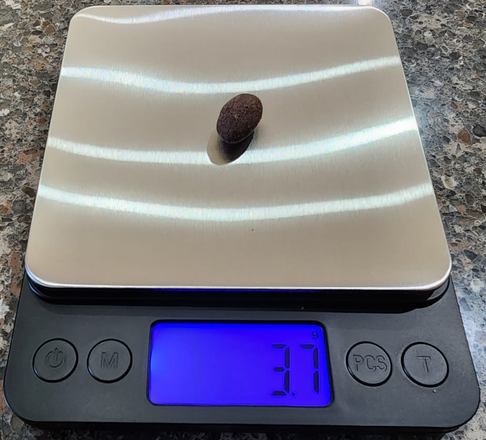

# Estimation, Confidence Intervals, and Bootstrapping {#confidence-intervals}

```{r setup_ci, include=FALSE, purl=FALSE}
# Used to define Learning Check numbers:
chap <- 8
lc <- 0

# Set R code chunk defaults:
knitr::opts_chunk$set(
  echo = TRUE,
  eval = TRUE,
  warning = FALSE,
  message = TRUE,
  tidy = FALSE,
  purl = TRUE,
  out.width = "\\textwidth",
  fig.height = 4,
  fig.align = "center"
)

# Set output digit precision
options(scipen = 99) # , digits = 3)
options(pillar.sigfig = 6)

# Set random number generator seed value for replicable pseudorandomness.
set.seed(76)
```

```{r echo=FALSE, message=FALSE, purl=FALSE}
library(dplyr)
library(moderndive)
library(tidyverse)
library(knitr)
```


```{r echo=FALSE, purl=FALSE}
# This code is used for dynamic non-static in-line text output purposes
p_red <- bowl |>
  summarize(mean(color == "red")) |>
  pull()
n_balls_sample <- 50L # sample size for the bowl with balls activity
n_virtual_resample <- 1000L # number of bootstrap samples used in this chapter
n_manual_rep <- 35L # number of bootstrap sample when pretending a study manually
```


## Introduction


We studied sampling in Chapter \@ref(sampling). Recall, for example, getting many random samples of red and white balls from a bowl, obtaining the sample proportions of red balls from each of those samples, and studying the distribution of the sample proportions. We can summarize our findings as follows:

- the sampling distribution of the sample proportion follows, approximately, the normal distribution, 
- the expected value of the sample proportion, located at the center of the distribution, is exactly equal to the population proportion, and
- the sampling variation, measured by the standard error of the sample proportion, is equal to the standard deviation of the population divided by the square root of the sample size used to collect the samples.

Similarly, when sampling chocolate-covered almonds and getting the sample mean weight from each sample, the characteristics described above are also encountered in the sampling distribution of the sample mean; namely,

- the sampling distribution of the sample mean follows, approximately, the normal distribution; 
- the expected value of the sample mean is the population mean, and
- the standard error of the sample mean is the standard deviation of the population divided by the square root of the sample size.

Moreover, these characteristics also apply to sampling distributions for the difference of sample means, the difference of sample proportions, and others. Recall that the sampling distribution is not restricted by the distribution of the population. As long as the samples taken are fairly large and we use the appropriate standard error, see \@ref(table-title), we can generalize these results appropriately.

The study of the sampling distribution is motivated by another question we have not yet answered: how can we determine the average weight of all the almonds if we do not have access to the entire bowl? We have seen by using simulations in Chapter \@ref(sampling) that the average of the sample means, obtained from many random samples, will be fairly close to the expected value of the sample mean, which is precisely the population mean weight.

However, in real-life situations, we do not have access to many random samples, only to a single random sample. This chapter introduces methods and techniques that can help us approximate the information of the entire population, such as the population mean weight, by using a single random sample from this population. This undertaking is called __estimation__, and it is central to Statistics and Data Science.

We introduce some statistical jargon about estimation. If we are using a sample statistic to __estimate__ a population parameter, e.g., using the sample mean from a random sample to estimate the population mean, we call this statistic a __point estimate__ to make emphasis that it is a single value that is used to estimate the parameter of interest. 
Now, you may recall that, due to sampling variation, the sample mean typically does not match the population mean exactly, even if the sample is large. 
To account for this variation, we use an interval to estimate the parameter instead of a single value, and appropriately call it an __interval estimate__ or, if given some level of accuracy, a __confidence interval__ of the population parameter. In this chapter, we explain how to obtain confidence intervals, the advantages of using them, and the different methods that can be used to obtain them.

In Section \@ref(theory-based-CI) we introduce a method to build a confidence interval for the population mean that uses the random sample obtained and theoretical characteristics of the sampling distribution discussed in Chapter \@ref(sampling). 
We call this the theory-based approach for constructing intervals. 
In Section \@ref(simulation-based-CI) we introduce another method, called the bootstrap, that produces confidence intervals by resampling a large number of times from the original sample. Since resampling is done via simulations, we call this the simulation-based approach for constructing confidence intervals. In Section \@ref(theory_CI) we provide some theoretical foundations to explain the logic behind the bootstrap, introduce some alternatives within this approach, compare it with the theory-based approach, and show the advantages and disadvantages of different approaches. Finally, in Section \@ref(summary-CI) we summarize and present extensions of these methods.


### Needed packages {-#CI-packages}

If needed, read Section \@ref(packages) for information on how to install and load R packages. 

```{r message=FALSE}
library(tidyverse)
library(moderndive)
library(infer)
```

Recall that loading the `tidyverse` package loads many packages that we have encountered earlier. For details refer to Section \@ref(tidyverse-package). The packages `moderndive` and `infer` contain functions and data frames that will be used in this chapter.

```{r message=FALSE, echo=FALSE, purl=FALSE}
# Packages needed internally, but not in the text
library(knitr)
library(kableExtra)
library(patchwork)
library(purrr)
library(scales)
library(knitr)
library(ggrepel)
```


## Tying Sampling Distribution to Estimation {#theory-based-CI}


In this section we revisit the chocolate-covered almonds example introduced in Chapter \@ref(sampling) and the results obtained when studying the sampling distribution of the sample mean weight of almonds, but this time we use this information in the context of estimation.

We start by introducing or reviewing some terminology using the almonds' example. The bowl of chocolate-covered almonds is the population of interest. The parameter of interest is the *population mean* weight of almonds in the bowl, $\mu$. This is the quantity we want to estimate.

We want to use the sample mean to estimate this parameter. So we call the sample mean an **estimator** or an **estimate** of $\mu$, the population mean weight. 
The difference between estimator and estimate is worth discussing.

As an illustration, we decide to take a random sample of 100 almonds from the bowl and use its sample mean weight to estimate the population mean weight. In other words, we intend to sum 100 almonds' weights, divide this sum by 100, and use this value to estimate the population mean weight. When we refer to the *sample mean* to describe this process via an equation, the sample mean weight is called an **estimator** of the population mean weight. 
Since different samples produce different sample means, the sample mean as an estimator is the random variable $\overline  X$ described in Section \@ref(random-variable-sample-mean). As we have learned studying the sampling distribution in Chapter \@ref(sampling), we know that this **estimator** follows, approximately, a normal distribution; its expected value is equal to the population mean weight. Its standard deviation, also called standard error, is $$SE_{\bar x} = \frac{\sigma}{\sqrt {n}}$$ where $n = 100$ in this example and $\sigma$ is the population standard deviation of almonds' weights.

On the other hand, we go ahead and obtain a random sample of 100 almonds' weights such as the one shown here and store it in the `moderndive` package with the same name

```{r echo=-1, eval=FALSE}
set.seed(20)
almonds_sample_100 <- almonds_bowl |>
  rep_slice_sample(n = 100, replace = TRUE, reps = 1)
```

```{r}
almonds_sample_100
```


```{r echo=FALSE, purl=FALSE}
# This code is used for dynamic non-static in-line text output purposes
# x_bar is the mean almonds' weight of the original sample of size n=100
x_bar <- almonds_sample_100 |> 
  summarize(mean_weight = mean(weight)) |>
  pull(mean_weight)
```

We can use it to calculate the sample mean weight:

```{r}
almonds_sample_100 |>
  summarize(sample_mean = mean(weight))
```

```{r echo=FALSE}
xbar <- mean(almonds_sample_100$weight)
```

Then $\overline{x} = `r xbar`$ grams is an **estimate** of the population mean weight. 
In summary, the **estimator** is the procedure, equation, or method that will be used on a sample to estimate a parameter before the sample has been obtained and has many useful properties discussed in Chapter \@ref(sampling). The moment a sample is obtained and the equation of a sample mean is applied to this sample, the resulting number is an **estimate**.

The sample mean, as an estimator or estimate of the population mean, will be a central component of the material developed in this chapter. 
But, note that it is not the only quantity of interest. 
For example, the *population standard deviation* of the almonds' weight, denoted by the Greek letter $\sigma$, is a parameter and the *sample standard deviation* can be an **estimator** or **estimate** of this parameter.

Furthermore, we have shown in Chapter \@ref(sampling) that the expected value of the sample mean is equal to the population mean. When this happens, we call the sample mean an **unbiased** estimator of the population mean. This does not mean that any sample mean will be equal to the sample mean; some sample means will be greater while others will be smaller but, on average, they will be equal to the population mean. In general, when the expected value of an estimator is equal to the parameter it is trying to estimate, we call the estimator **unbiased**. If it is not, the estimator is **biased**. 

We now revisit the almond activity and study how the sampling distribution of the sample mean can help us build interval estimates for the population mean. 


```{r echo=FALSE}
num_almonds <- nrow(almonds_bowl)
```

### Revisiting the Almond Activity for Estimation {#revisit-almond}

In Chapter \@ref(sampling) one of the activities was to take many random samples of size 100 from a bowl of 5,000 chocolate-covered almonds. Since we have access to the contents of the entire bowl, we can obtain the population parameters:


```{r}
almonds_bowl |> 
  summarize(population_mean = mean(weight), 
            population_sd = pop_sd(weight))
```

The total number of almonds in the bowl is 5,000. The population mean is $$\mu = \sum_{i=1}^{5000}\frac{x_i}{5000}=3.54$$ and the population standard deviation defined in the `moderndive` package as `pop_sd()` is $$\sigma = \sum_{i=1}^{5000} \frac{(x_i - \mu)^2}{5000}=0.32.$$

We keep those numbers for future reference to determine how well our methods of estimation are doing, but recall that in real-life situations we do not have access to the population values and the population mean $\mu$ is unknown. All we have is the information from one random sample. In our example, we assume that all we know is the `almonds_sample_100` object stored in package `moderndive`. We show the contents of the first few rows here:

```{r}
almonds_sample_100
```

The `ID` variable shows the almond chosen from the bowl and its corresponding weight. Using this sample we obtain some sample statistics:

```{r}
almonds_sample_100 |> 
  summarize(mean_weight = mean(weight), 
            sd_weight = sd(weight), 
            sample_size = n())
```
In one of the activities performed in Chapter \@ref(sampling) we obtained many random samples, calculated their sample means, constructed a histogram using these sample means, and showed how the histogram is a good approximation of the sampling distribution of the sample mean. 
We redraw Figure \@ref(fig:sample-mean-100-with-normal) here as Figure \@ref(fig:sample-mean-100-with-normal-redraw).


```{r sample-mean-100-with-normal-redraw, echo=FALSE, fig.height=3, fig.cap="The distribution of the sample mean.", purl=FALSE}
num_almonds_sample = length(almonds_sample_100$weight)
x = almonds_bowl$weight
mu = mean(x)
xbar <- mean(almonds_sample_100$weight)
sigma = sqrt(mean(x^2)-mean(x)^2)
if (!file.exists("rds/virtual_mean_weight_100.rds")) {
  virtual_mean_weight_100 <- almonds_bowl |>
    rep_slice_sample(n = num_almonds_sample, replace = TRUE, reps = 1000) |>
    summarize(mean_weight = mean(weight), n = n())
  write_rds(virtual_mean_weight_100, "rds/virtual_mean_weight_100.rds")
} else {
  virtual_mean_weight_100 <- read_rds("rds/virtual_mean_weight_100.rds")
}


ggplot(virtual_mean_weight_100, aes(x = mean_weight)) +
  geom_histogram(aes(y=..density..), binwidth = 0.01, color = "white") + 
  stat_function(fun = dnorm,  args = list(mean = mu, sd = sigma/sqrt(num_almonds_sample)), col="red") +
  labs(
    x = "Sample means with n=100"
  ) +
  geom_point(aes(x=mean(almonds_sample_100$weight), y=0), color="blue") +
  geom_point(aes(x=mu, y=0), color="red") +
  annotate(geom="text", x=mu, y=-0.5, label=bquote("\u03BC"),
           color="red") +
  annotate(geom="text", x=mean(almonds_sample_100$weight), y=-0.5, label=bquote(bar(x)),
           color="blue")
```

The histogram obtained in Figure \@ref(fig:sample-mean-100-with-normal-redraw) is drawn using many sample mean weights from random samples of size $n=100$. 
The added red smooth curve is the density curve for the normal distribution with the appropriate expected value and standard error obtained from the sample distribution. 
The red dot represents the population mean $\mu$, the unknown parameter we are trying to estimate. The blue dot is the sample mean $\overline{x} = `r xbar`$ from the random sample stored in `almonds_sample_100`.

In real-life applications, a sample mean is obtained from a sample but the distribution of the population and the population mean are unknown, so the location of the blue dot with respect to the red dot is also unknown. However, if we construct an interval centered on the blue dot, as long as it is wide enough the interval will contain the red dot.
To understand this better, we need to learn a few additional properties of the normal distribution.

### The Normal Distribution

A random variable can take on different values. When those values can be represented by one or more intervals, the likelihood of those values can be expressed graphically by a density curve on a Cartesian coordinate system in two dimensions. The horizontal axis (X-axis) represents the values that the random variable can take and the height of density curve (Y-axis) provides a graphical representation of the likelihood of those values; the higher the curve the more likely those values are. In addition, the total area under a density curve is always equal to 1. The set of values a random variable can take alongside their likelihood is what we call the distribution of a random variable.

The normal distribution \index{distribution!normal} is the distribution of a special type of random variable. Its density curve has a distinctive bell shape, and it is fully defined by two values: (1) the mean or expected value of the random variable, $\mu$, which is located on the X-axis at the center of the density curve (its highest point), and (2) the standard deviation, $\sigma$, which reflects the dispersion of the random variable; the greater the standard deviation is the wider the curve appears.
In Figure \@ref(fig:normal-curves), we plot the density curves of three random variables, all following normal distributions:

1. The solid line represents a normal distribution with $\mu = 5$ \& $\sigma = 2$.
1. The dotted line represents a normal distribution with $\mu = 5$ \& $\sigma = 5$.
1. The dashed line represents a normal distribution with $\mu = 15$ \& $\sigma = 2$.

```{r normal-curves, echo=FALSE, fig.cap="Three normal distributions.", purl=FALSE, out.width="90%"}
all_points <- tibble(
  domain = seq(from = -10, to = 25, by = 0.01),
  `mu = 5, sigma = 2` = dnorm(x = domain, mean = 5, sd = 2),
  `mu = 5, sigma = 5` = dnorm(x = domain, mean = 5, sd = 5),
  `mu = 15, sigma = 2` = dnorm(x = domain, mean = 15, sd = 2)
)  |> 
  gather(key = "Distribution", value = "value", - domain) |> 
  mutate(
    Distribution = factor(
      Distribution, 
      levels = c("mu = 5, sigma = 2", 
                 "mu = 5, sigma = 5", 
                 "mu = 15, sigma = 2")
    )
  )

for_labels <- all_points |> 
  filter(between(domain, 3.795, 3.805) & Distribution == "mu = 5, sigma = 2" |
           between(domain, 0.005, 0.0105) & Distribution == "mu = 5, sigma = 5" |
           between(domain, 16.005, 16.015) & Distribution == "mu = 15, sigma = 2")

all_points |> 
  ggplot(aes(x = domain, y = value, linetype = Distribution)) +
  geom_line() +
  geom_label_repel(data = for_labels, aes(label = Distribution),
                   nudge_x = c(-1, -2.1, 1)) +
  theme_light() +
  scale_linetype_manual(values=c("solid", "dotted", "longdash")) + 
  theme(
    axis.title.y = element_blank(),
    axis.title.x = element_blank(),
    axis.text.y = element_blank(),
    axis.ticks.y = element_blank(),
    legend.position = "none"
  )
```

A random variable that follows a normal distribution can take any values in the real line, but those values (on the X-axis) that correspond to the peak of the density curve are more likely than those corresponding to the tails.
The density curve drawn with a solid line has the same mean as the one drawn with a dotted line, $\mu = 5$, but the former exhibits less dispersion, measured by the standard deviation $\sigma =2$, than the latter, $\sigma = 5$. Since the total area under any density curve is equal to 1, the wider curve has to be shorter in height to preserve this property. On the other hand, the density curve drawn with a solid line has the same standard deviation as the one drawn with a dashed line, $\sigma = 2$, but the latter has a greater mean, $\mu = 15$, than the former, $\mu = 5$, so they do look the same but the latter is centered farther to the right on the X-axis than the former. 


#### The standard normal distribution

A special normal distribution is one with mean $\mu$ = 0 and standard deviation $\sigma$ = 1. It is called the *standard normal distribution* and it is represented by a density curve called the *$z$-curve*\index{distribution!standard normal}. If a random variable $Z$ follows the standard normal distribution, a realization of this random variable is called a standard value or $z$-value. The $z$-value also represents the number of standard deviations above the mean, if positive, or below the mean, if negative. For example, if $z=5$, the value observed represents a realization of the random variable $Z$ that is five standard deviation above the mean, $\mu = 0$.


#### Linear transformations of random variables that follow the normal distribution


A linear transformation of a random variable transforms the original variable into a new random variable by adding, subtracting, multiplying, or dividing constants to the original values. The resulting random variable could have a different mean and standard deviation. The most interesting transformation is turning a random variable into another with $\mu = 0$ and $\sigma = 1$. When this happens we say that the random variable has been standardized.

A property of the normal distribution is that any linear transformation of a random variable that follows the normal distribution results in a new random variable that also follows a normal distribution, potentially with different mean and standard deviation. In particular, we can turn any random variable that follows the normal distribution into a random variable that follows the standard normal distribution. For example, if a value $x = 11$ comes from a normal distribution with mean $\mu =5$ and standard deviation $\sigma = 2$, the $z$-value $$z = \frac{x - \mu}{\sigma} = \frac{11 - 5}{2} = 3$$ is the corresponding value in a standard normal curve. Moreover, we have determined that $x = 11$ for this example is precisely $3$ standard deviations above the mean.

#### Finding probabilies under a density curve

When a random variable can be represented by a density curve, the probability that the random variable takes a value in any given interval (on the X-axis) is equal to the area under the density curve for that interval. If we know the equation that represents the density curve, we could use the mathematical technique from calculas known as integration to determine this area. In the case of the normal curve, the integral for any interval does not have a close form solution and the solution is obtained using numerical approximations.

Please review the Section \@ref(appendix-normal-curve) in the Appendices where we provide R code to work with different areas, probabilities, and values under a normal density curve. Here, we place focus on the insights of specific values and areas without dedicating time to those calculations.

We assume that a random variable $Z$ follows a standard normal distribution. We would like to know how likely is for this random variable to take a value that is within one standard deviation from the mean or, equivalently, what is the probability that the observe value $z$ (in the X-axis) is between -1 and 1 as shown in Figure \@ref(fig: normal-curve-shaded-1a)

```{r normal-curve-shaded-1a, echo=FALSE, fig.height=2, fig.width=3}
ggplot(NULL, aes(c(-4,4))) +
  geom_area(stat = "function", fun = dnorm, fill = "grey100", xlim = c(-4, -1)) +
  geom_area(stat = "function", fun = dnorm, fill = "grey80", xlim = c(-1, 1)) +
  geom_area(stat = "function", fun = dnorm, fill = "grey100", xlim = c(1, 4)) +
  labs(x = "z", y = "") +
  scale_y_continuous(breaks = NULL) +
  scale_x_continuous(breaks = c(-1,1)) 
```

Calculations show that this area is 0.6827 or about 68.27% of the total area under the curve. This is equivalent to say that the probability of getting a value between $-1$ and 1 on a standard normal is 68.27%. This also means that if a random variable representing an experiment follows a normal distribution, the probability that the outcome of this experiment is within one standard deviation from the mean is 68.27%. Similarly, the area under the standard normal density curve between -2 and 2 is shown in Figure \@ref(fig: normal-curve-shaded-2a).

```{r normal-curve-shaded-2a, echo=FALSE, fig.height=2, fig.width=3}
ggplot(NULL, aes(c(-4,4))) +
  geom_area(stat = "function", fun = dnorm, fill = "grey100", xlim = c(-4, -2)) +
  geom_area(stat = "function", fun = dnorm, fill = "grey80", xlim = c(-2, 2)) +
  geom_area(stat = "function", fun = dnorm, fill = "grey100", xlim = c(2, 4)) +
  labs(x = "z", y = "") +
  scale_y_continuous(breaks = NULL) +
  scale_x_continuous(breaks = c(-2,2))
```

Calculations show that this area is equal to 0.9545 or 95.45%. If a random variable representing an experiment follows a normal distribution, the probability that the outcome of this experiment is within two standard deviations from the mean is 95.45%. It is also common practice to use the exact number of standard deviations that correspond to an area around the mean exactly equal to 95% (instead of 95.45%). Please see the Section \@ref(appendix-normal-curve) in the Appendices to produce those or other calculations in R. The result is that the area under the density curve around the mean that is exactly equal to 0.95, or 95%, is the area within 1.96 standard deviation from the mean. Remember this number as it will be used a few times in future sections.

In summary, if the possible outcomes of an experiment can be expressed as a random variable that follows the normal distribution, the probability of getting a result that is within one standard deviation from the mean is about 68.27%, within 2 standard deviations form the mean is 95.45%, within 1.96 standard deviations from the mean is 95%, and within 3 standard deviations from the mean is about 99.73%, to name a few.
Spend a few moments grasping this idea; observe, for example, that it is almost impossible to observe an outcome represented by a number that is around five standard deviations above the mean as the chances of that to happen are almost zero.

We are now ready to return to the our main goal: how to obtain an interval estimate of the population mean based on a single sample.


### The confidence interval{#CI-general}


We continue using the example where we try to estimate the population mean weight of almonds with a random sample of 100 almonds. We showed in Chapter \@ref(sampling) that the sampling distribution of the sample mean weight of almonds approximates a normal distribution with expected value equal to the population mean weight of almonds and a standard error equal to $$SE_{\bar x} = \frac{\sigma}{\sqrt {100}}.$$ 
In Subsection \@ref(revisit-almond) we showed that for the population of almonds, $\mu =3.54$ grams and $\sigma = 0.323$ so the standard error for the sampling distribution is $$SE_{\bar x} = \frac{\sigma}{\sqrt {100}} = \frac{0.323}{\sqrt{100}} = 0.0323$$ grams. In Figure \@ref(fig:normal-curve-1) we plot the density curve for this distribution using these values.

```{r normal-curve-1, echo=FALSE, fig.cap="The normal density curve for the sample mean weight of almonds.", purl=FALSE, out.width="90%"}
p1 <- ggplot(data = data.frame(x = c(3.4, 3.7)), aes(x)) +
  stat_function(fun = dnorm,  args = list(mean = mu, sd = sigma/sqrt(num_almonds_sample)), col="red") + ylab("") +
  scale_y_continuous(breaks = NULL) + 
  labs(
    x = "Sample means with n=100"
  ) +
  geom_point(aes(x=mean(almonds_sample_100$weight), y=0), color="blue") +
  geom_point(aes(x=mu, y=0), color="red") +
  annotate(geom="text", x=mu, y=-0.5, label=bquote("\u03BC = 3.54"),
           color="red") +
  annotate(geom="text", x=mean(almonds_sample_100$weight), y=-0.5, label=bquote(bar(x) == 3.58),
           color="blue")+
  geom_hline(yintercept = 0, col="red", lty=2)
p1
```


<!-- UP TO HERE -->

The horizontal axis (X-axis) represents the sample means that we can obtain from all the possible random samples of 100 almonds. The red dot represents the expected value of the sampling distribution, $\mu = 3.54$, located on the X-axis at the center of the distribution. The density curve's height can be thought of as how likely those sample means are to be observed. For example, it is more likely to get a random sample with a sample mean around $3.54$ grams (which corresponds to the highest point of the curve) than it is to get a sample with a sample mean at around $3.4$ grams since the curve's height is almost zero at that value. The blue dot is the sample mean from our sample of 100 almonds, $\overline{x} = 3.58$ grams. It is located 0.04 grams above the population mean weight. How far is 0.04 grams? It is helpful to express this distance in standardized values: $$\frac{3.58 - 3.54}{0.0323} = 1.24$$
so 0.04 more grams is about 1.24 standard errors above the population mean.

In real-life situations, the population mean, $\mu$, is unknown so the distance from the sample mean to $\mu$ is also unknown. 
On the other hand, the sampling distribution of the sample mean follows a normal distribution. Based on our earlier discussion about areas under the normal curve, there is a 95% chance that the value observed is within 1.96 standard deviations from the mean. In the context of our problem, there is a 95% chance that the sample mean weight obtained is within 1.96 standard errors from the population mean weight. As shown earlier, the sample mean obtained in our example was 1.24 standard errors above the population mean, well within the reasonable range. 

Think about this result. If we were to take a different random sample of 100 almonds, the sample mean will likely be different, but you still have a 95% chance that the new sample mean will be within 1.96 standard errors from the population mean.

We can finally construct an interval estimate that takes advantage of this configuration. We center our interval in the sample mean observed and then extend to each side the magnitude equivalent to 1.96 standard errors. The lower and upper bounds of this interval are:

$$\begin{aligned}\left(\overline{x} - 1.96 \frac{\sigma}{\sqrt{n}},\quad \overline{x} + 1.96 \frac{\sigma}{\sqrt{n}}\right) &= \left(3.578 - 1.96 \cdot \frac{0.323}{\sqrt{100}},\quad 3.578 + 1.96 \cdot \frac{0.323}{\sqrt{100}}\right)\\
&= (3.515, 3.641)\end{aligned}$$ 

Here is R code that can be used to calculate the lower and upper bounds of this interval

```{r}
almonds_sample_100 |>
  summarize(sample_mean = mean(weight),
            lower_bound = mean(weight) - 1.96*0.323/sqrt(length(weight)),
            upper_bound = mean(weight) + 1.96*0.323/sqrt(length(weight)))
```
The functions `mean()` and `length()` find the sample mean weight and sample size, respectively, from the sample of almonds' weights in `almonds_sample_100`. The number 1.96 corresponds to the number of standard errors needed to obtain a 95% area under the normal distribution and the population standard deviation 0.323 was found in Subsection \@ref(revisit-almond). Figure \@ref(fig: normal-curve-2) shows this interval as a horizontal blue line. Observe how the population mean $\mu$ is part of this interval.


```{r echo=F}
xbar <- 3.578 
se_xbar <- 0.323/sqrt(100)
lower_bound <- xbar - 1.96 *  se_xbar
upper_bound <- xbar + 1.96 *  se_xbar
c(lower_bound, upper_bound)
```
```{r normal-curve-2, echo=FALSE, fig.cap="The normal density curve for the sample mean weight of almonds.", purl=FALSE, out.width="90%"}
df <- data.frame(x1 = lower_bound, x2 = upper_bound, y1 = 0, y2 = 0)
p1 <- ggplot(data = data.frame(x = c(3.4, 3.7)), aes(x)) +
  stat_function(fun = dnorm,  args = list(mean = mu, sd = sigma/sqrt(num_almonds_sample)), col="red") + ylab("") +
  scale_y_continuous(breaks = NULL) + 
  labs(title = "The Sampling Distribution of the Sample Mean",
       x = "Sample mean weights"
  ) +
  geom_point(aes(x=mean(almonds_sample_100$weight), y=0), color="blue") +
  geom_point(aes(x=mu, y=0), color="red") +
  annotate(geom="text", x=mu, y=-0.5, label=bquote("\u03BC"),
           color="red") +
  annotate(geom="text", x=mean(almonds_sample_100$weight), y=-0.5, label=bquote("x\u0305"),
           color="blue")+
  geom_hline(yintercept = 0, col="red", lty=2) + 
  geom_segment(aes(x = x1, y = y1, xend = x2, yend = y2, colour = "segment"), data = df, col="blue")
p1
```
Since 1.96 standard errors were used on the construction of this interval, we call this a 95% confidence interval. A confidence interval can be viewed as an interval estimator of the population mean. Compare an interval estimator with the sample mean that is a point estimator. The latter estimates the parameter with a single number, the former provides and entire interval to account for the location of the parameter. An apt analogy involves fishing. Imagine that there is a single fish swimming in murky water. The fish is not visible but its movement produces ripples on the surface that can provide some limited information about the fish's location. To capture the fish, one could use a spear or a net. Because the information is limited, throwing the spear at the ripples may capture the fish but likely miss it. Throwing a net around the ripples, on the other hand, may give a much higher likelihood of capturing the fish. Using the sample mean only to estimate the population mean is like throwing a spear to the ripples in the hopes of capturing the fish. Constructing a confidence interval that may include the population mean is like throwing a net to surround the ripples. Keep this analogy in mind, as we will revisit it in future sections.


### The t distribution {#t-distribution-CI}


Recall that due to the Central Limit Theorem, the sampling distribution of the sample mean was approximately normal with mean equal to the population mean $\mu$ and standard deviation given by the standard error $SE_{\overline X} = \sigma/\sqrt{n}$. We can standardize this for any sample mean $\overline{x}$ such that $$z = \frac{\overline{x} - \mu}{\sigma/\sqrt{n}}$$ is the corresponding value of the standard normal distribution.

In the construction of the interval in Figure \@ref(fig: normal-curve-2) we have assumed the population standard deviation, $\sigma$, was known, and therefore we have use it to obtain the confidence interval. Nevertheless, in real-life applications, the population standard deviation is also unknown. 
Instead, we use the sample standard deviation, $s$, from the sample we have obtained, as an estimator of the population standard deviation $\sigma$. Our estimated standard error is given by $$\widehat{SE}_{\overline X} = \frac{s}{\sqrt n}.$$

When using the sample standard deviation to estimate the standard error, we are introducing additional uncertainty in our model. For example, if we try to standardize this value we get $$t = \frac{\overline{x} - \mu}{s/\sqrt{n}}$$. Because we are using the sample standard deviation in this equation and since the sample standard deviation changes from sample to sample, the additional uncertainty makes the values $t$ no longer normal. Instead they follow a new distribution called the $t$ distribution.

The $t$ distribution is similar to the standard normal; its density curve is also bell-shaped and it is symmetric around zero, but the tails of the $t$ distribution are a little thicker than those of the standard normal.
In addition, the $t$ distribution requires one additional parameter, the degrees of freedom. For the sample mean problems, the degrees of freedom needed are exactly $n-1$, the size of the sample minus one. Figure \@ref(fig: t-curve-1) shows the density curves of 

- the standard normal density curve, in black, 
- a $t$ density curve for a t distribution with 2 degrees of freedom, in blue, and
- a $t$ density curve for a t distribution with 10 degrees of freedom, in red.


```{r t-curve-1, echo=FALSE, fig.cap="The normal density curve for the sample mean weight of almonds.", purl=FALSE, out.width="90%"}
p1 <- ggplot(data = data.frame(x = c(-4, 4)), aes(x)) +
  stat_function(fun = dnorm,  args = list(), col="black") + ylab("") +
  stat_function(fun = dt,  args = list(df = 2), col="blue") + ylab("") +
  stat_function(fun = dt,  args = list(df = 10), col="red") + ylab("") +
  
  scale_y_continuous(breaks = NULL) + 
  labs(
    x = "The standard normal and two t-distributions"
  ) 
p1
```
Observe how the $t$ density curve in red (t with 10 degrees of freedom) gets closer to the standard normal density curve, or $z$-curve, in black, than the $t$ curve in blue (t with 2 degrees of freedom). The greater the number of degrees of freedom, the closer the $t$ density curve is from the $z$ curve. This change make our calculations slightly different.

Please see Appendix ?? for calculations of probabilities for $t$ density curves with different degrees of freedom. The calculation for our specific example show that 95% of the sample means are within 1.98 standard errors of the population mean weight. The number of standard errors needed is not that different from before, 1.98 versus 1.96, because the degrees of freedom are fairly large.


Using this information, we can construct the 95% confidence interval based entirely on our sample information and using the sample mean and sample standard deviation. We calculate those values again for `almonds_sample_100`:

```{r}
almonds_sample_100 |>
  summarize(sample_mean = mean(weight),
            sample_sd = sd(weight))
```
Observe that the sample standard deviation is $s = 0.3218$ which is not that different form the population standard deviation. We again center the confidence interval in the observed sample mean but now extend the interval by 1.98 standard errors to each side. The lower and upper bounds of this confidence interval are:

$$\left(\overline{x} - 1.98 \frac{s}{\sqrt{n}},\quad \overline{x} + 1.98 \frac{s}{\sqrt{n}}\right) = \left(3.578 - 1.98 \cdot \frac{0.3218}{\sqrt{100}}, 3.578 + 1.98 \cdot \frac{0.3218}{\sqrt{100}}\right)= (3.514, 3.642)$$ 
Here is the R code that can be used to found the lower and upper bounds on this interval

```{r}
almonds_sample_100 |>
  summarize(sample_mean = mean(weight),
            sample_sd = sd(weight),
            lower_bound = mean(weight) - 1.98*sd(weight)/sqrt(length(weight)),
            upper_bound = mean(weight) + 1.98*sd(weight)/sqrt(length(weight)))
```

The confidence interval obtained here, using the sample standard deviation and a $t$ distribution, is almost the same to the one obtained using the population standard deviation and the standard normal distribution, the difference is about 0.001 units for the upper and lower bound. This happens because with a sample size of 100, the t-curve and z-curve are almost identical and also because the sample standard deviation was very similar to the population standard deviation. This does not have to be always the case and occasionally we can observe greater differences; but, in general, the results are fairly similar.

More importantly, the confidence interval constructed here contains the population mean, which is the result we needed. Recall that a confidence interval is an interval estimate of the parameter of interest, the population mean weight of almonds. 
We can summarize the results so far:

- If the size used for your random sample is large enough, the sampling distribution of the sample mean follows, approximately, the normal distribution.
- Using the sample mean observed and the standard error of the sampling distribution, we can construct 95% confidence intervals for the population mean. The formula for these intervals is given by $$\left(\overline{x} - 1.96 \frac{\sigma}{\sqrt{n}},\quad \overline{x} + 1.96 \frac{\sigma}{\sqrt{n}}\right)$$ where $n$ is the sample size used.
- When the population standard deviation is unknown, the sample standard deviation is used to estimate the standard error. This produces additional variability and the standardized values follow a $t$ distribution with $n-1$ degrees of freedom. The formula for 95% confidence intervals when the sample size is $n=100$ is given by $$\left(\overline{x} - 1.98 \frac{s}{\sqrt{100}},\quad \overline{x} + 1.98 \frac{s}{\sqrt{100}}\right)$$  
- The method to construct 95% confidence intervals guarantees that for 95% of the possible samples, the intervals obtained will include the population mean. It also guarantees that 5% of the possible samples will lead to intervals that do not include the population mean.
- As we have constructed intervals with a 95% level of confidence, we can construct intervals with any level of confidence. The only change in the equations will be the number of standard errors needed. Please see Appendix ?? if you need to calculate the number of standard errors for other confidence levels.

<!--
This also needs to be added to the appendix AV 5-24-24

The syntax in R for the $t$ distribution is analogous to the standard normal distribution. We use the function `pt()` instead of `pnorm()` and `qt()` instead of `qnorm()`.
In addition, the $t$ distribution requires one additional parameter, the degrees of freedom. For the sample mean problems, the degrees of freedom needed are exactly $n-1$, the size of the samples minus one.

We construct again a 95% confidence interval for the population mean, but this time using the sample standard deviation to estimate the standard error and the $t$ distribution to determine how wide the confidence interval should be.

We start by obtaining the sample statistics:


```{r}
almonds_sample_100 |> 
summarize(mean_weight = mean(weight),
sd_weight = sd(weight),
sample_size = n())
```
To obtain the number of standard deviations on the $t$ distribution to account for 95% of the values, we proceed as we did in the normal case: the area in the middle is 0.95, so the area on the tails is 1-0.95 = 0.05. Since the $t$ distribution is also symmetric, the area on each tail is 0.05/2 - 0.025. The number of standard deviation around the center is given by the value $q$ such as the area under the $t$ curve to the left of $q$ is exactly $0.95 + 0.025 = 0.975$. Using R we get:

```{r}
qt(0.975, df = 100 - 1)
```
So, in order to account for 95% of the observations around the mean, we need to take into account all the values within 1.98 standard deviation from the mean. Compare this number with the 1.96 obtained for the standard normal; the difference is due to the fact that the $t$ curve has thicker tails than the standard normal.
We can now construct the 95% confidence interval

```{r}
xbar <- 3.682 
se_xbar <- 0.362/sqrt(100)
lower_bound <- xbar - 1.98 *  se_xbar
upper_bound <- xbar + 1.98 *  se_xbar
c(lower_bound, upper_bound)
```
We are 95% confident that the population mean weight of almonds is a number between 3.61 and 3.75 grams.
-->


### Interpreting Confidence Intervals

We have used the sample `almonds_sample_100`, constructed a 95% confidence interval for the population mean weight of almonds, and showed that the interval contained this population. This result is not surprising as we expect intervals such as this to include the population mean for 95% of the possible random samples. We repeat this interval construction for many random samples. Figure \@ref(fig:almong-mean-cis) presents the results for eighty 95% confidence intervals.


```{r almond-mean-cis, fig.cap="(ref:almond-mean-ci)", echo=FALSE, fig.height=4.2, purl=FALSE}

set.seed(13)
# Compute data frame with sampled data, sample means, and ci
almond_mean_cis <- almonds_bowl |>
  rep_sample_n(size = 100, reps = 80, replace = FALSE) |>
  summarize(sample_mean = mean(weight), sample_sd = sd(weight), size = n()) |>
  mutate(lower_bound = sample_mean - qt(.975,size-1)*sample_sd/sqrt(size), 
         upper_bound = sample_mean + qt(.975,size-1)*sample_sd/sqrt(size),
         captured = lower_bound <= mu & upper_bound >= mu)

# Plot them!
ggplot(almond_mean_cis) +
  geom_segment(aes(
    y = replicate, yend = replicate, x = lower_bound, xend = upper_bound,
    alpha = factor(captured, levels = c("TRUE", "FALSE"))
  )) +
  labs(
    x = expression("Sample mean weight of almonds"),
    y = "Confidence interval number",
    alpha = "Captured"
  ) +
  geom_vline(xintercept = mu, color = "red") +
  coord_cartesian(xlim = c(3.34, 3.7)) +
  theme_light() +
  theme(
    panel.grid.major.y = element_blank(),
    panel.grid.minor.y = element_blank(),
    panel.grid.minor.x = element_blank()
  )
```
Note that each interval was build using a different random sample. The red vertical line is drawn at the location of the population mean weight, $\mu = 3.54$. The horizontal lines represent the eighty 95% confidence intervals obtained. The gray confidence intervals cross the red line so they contain the population mean. The black confidence intervals do not.

This result motivates the meaning of a 95% confidence interval: If you could construct intervals using the procedure described earlier for every possible random sample, then 95% of these intervals will include the population mean and 5% of them will not. 

Of course, in most situations it would impractical or impossible to obtain every possible random sample. Still, for a large number of random samples, this results is approximately correct. In Figure \@ref(fig:almond-mean-cis), for example, 5 out of 80 confidence intervals, or 6.25%, do not include the population mean, and 93.75% do.

The term 95% confidence invites to think we are talking about probabilities or chances. Indeed we are, but in a subtle way. Before a random sample has been obtained, there is a 95% chance that when a confidence interval is constructed using the prospective random sample, this interval will contain the population mean. The moment a random sample has been obtained, the interval constructed either contains the population mean or does not, with certainty, there is no longer a chance involved. This is true even if we do not know what the population mean is.
So the 95% confidence refers to the method or process to be used on a prospective sample. We are confident that if we follow the process to construct the interval, 95% of the time the random sample obtained will lead us to produce an interval that contains the population mean.

On the other hand, it would be improper to say that... "there is a 95% chance that the confidence interval obtained contains the population mean."  Looking at Figure \@ref(fig:almond-mean-cis), each of the confidence intervals either does or does not contain $\mu$. Once the confidence interval is determined, either the population mean is included or not. 

In the literature, this explanation has been encapsulated in a short-hand version: we are 95% confident that the interval contains the population parameter. For example, in Subsection \@ref(t-distribution-CI) the 95% confidence interval for the population mean weight of almonds was (3.516, 3.644) and we would say: "We are 95% confident that the population mean weight of almonds is between 3.516 and 3.644 grams". It is perfectly acceptable to use the short-hand statement, but always remember that the 95% confidence refers to the process, or method, and can be thought of as a chance or probability only before the random sample has been obtained.


#### Understanding the width of a confidence interval {#ci-width}

A confidence interval is an estimator of a population parameter. In the case of the almonds' bowl we constructed a confidence interval for the population mean. The equation to construct a 95% confidence interval was 

$$\left(\overline{x} - 1.96 \frac{\sigma}{\sqrt{n}}, \overline{x} + 1.96 \frac{\sigma}{\sqrt{n}}\right)$$ 
Observe that the confidence interval is centered at the sample mean and it extends to each side 1.96 standard errors $$1.96\cdot \frac{\sigma}{\sqrt{n}}$$
This quantity is exactly half the width of your confidence interval and it is called margin of error. The value of the population standard deviation, $\sigma$, is beyond our control, as it is determined by the distribution of the experiment or phenomenon studied and the sample mean, $\overline{x}$, is a result that depends on your random sample exclusively. On the other hand, the number 1.96 or the sample size, $n$, are value that can be changed by the researcher or practitioner and they play an important role on the width of the confidence interval. We study each of them separately.

##### The confidence level {-}

We mentioned earlier that the number 1.96 relates to a 95% confidence process but we did not show how to obtain this value. The level of confidence is a decision of the practitioner. If you want to be more confident, say 98% or 99% confident, you just need to adjust the appropriate number of standard errors needed. We show how to determine this number and use Figure \@ref(fig:normal-curve-shaded-3a) to illustrate this process.  You can find more details in Appendix ??

- If the confidence level is 0.95 (or 95%), the area in the middle of the standard normal distribution is 0.95. This area is shaded in the Figure \@ref(fig:normal-curve-shaded-3a).
- We construct $\alpha = 1 - \text{confidence level} = 1 - 0.95 = 0.05$. Think of $\alpha$ as the total area on both tails.
- Since the normal distribution is symmetric, the area on each tail is $\alpha/2 = 0.05/2 = 0.025$
- We need the exact number of standard deviations that produces the shaded area. Since the center of a standard normal density curve is zero, as shown in Figure \@ref(fig:normal-curve-shaded-3a), and the normal curve is symmetric, the number of standard deviations can be represented by $-q$ and $q$, the same magnitude but one positive and the other negative.

```{r normal-curve-shaded-3a, echo=FALSE, fig.height=2, fig.width=3}
ggplot(NULL, aes(c(-4,4))) +
  geom_area(stat = "function", fun = dnorm, fill = "grey100", xlim = c(-4, -1.96)) +
  geom_area(stat = "function", fun = dnorm, fill = "grey80", xlim = c(-1.96, 1.96)) +
  geom_area(stat = "function", fun = dnorm, fill = "grey100", xlim = c(1.96, 4)) +
  labs(x = "z", y = "") +
  scale_y_continuous(breaks = NULL) +scale_x_continuous(breaks = NULL) + 
  geom_point(aes(x=0, y=0), color="red") +
  geom_point(aes(x=-1.96, y=0), color="red") +
  geom_point(aes(x=1.96, y=0), color="red") +
  annotate(geom="text", x=-1.96, y=-0.03, label=bquote("-q"),
           color="red") +
  annotate(geom="text", x=1.96, y=-0.03, label=bquote("q"),
           color="red") +
  annotate(geom="text", x=0, y=-0.04, label=bquote("0"),
           color="red")

```

In R, the function `qnorm()` finds the value of $q$ when the area under this curve to the left of this value $q$ is given. In our example the area to the left of $-q$ is $\alpha/2 = 0.05/2 = 0.025$, so

```{r}
qnorm(0.025)
```
or 1.96 standard deviation below the mean. Similarly, the total area under the curve to the left of $q$ is the total shaded area, 0.95, plus the the small white area on the left tail, $0.025$, and $0.95 + 0.025 = 0.975$, so

```{r}
qnorm(0.975)
```
That is the reason we use 1.96 standard deviation when calculating 95% confidence intervals. What if we want to obtain a 98% confidence interval? We follow the same procedure:

- The confidence level is 0.98, 
- $\alpha = 1 - \text{confidence level} = 1 - 0.98 = 0.02$. .
- The area on each tail is $\alpha/2 = 0.02/2 = 0.01$
- The area needed to obtain $q$ is 0.98+0.01 = 0.99

```{r}
qnorm(0.99)
```
If we want to obtain a 98% confidence interval, we need to use 2.33 standard errors in our calculations. We can update the R code to calculate the lower and upper bounds of a 98% confidence interval:

```{r}
almonds_sample_100 |>
  summarize(sample_mean = mean(weight),
            lower_bound = mean(weight) - qnorm(0.99)*0.323/sqrt(length(weight)),
            upper_bound = mean(weight) + qnorm(0.99)*0.323/sqrt(length(weight)))
```

Let us do one more. If we want an 80% confidence interval, 1 - 0.8 = 0.2, 0.2/2 = 0.1, and 0.8+0.1 = 0.9, so

```{r}
qnorm(0.9)
```
When you want to obtain an 80%, 95%, or 98% confidence intervals, you need to construct your interval using 1.28, 1.96, or 2.33 standard errors, respectively. The more confident you want to be, the larger number of standard errors you need to use, and the wider your confidence interval becomes. But a confidence interval is an estimator of the population mean, the narrower it is, the more useful for practical reasons. So there is a trade off between the width of a confidence interval and the confidence you want to have.


##### The sample size {-}

As we studied changes to the confidence level, the researcher can determine how big is the random sample to be used. The margin of error for a 955 confidence interval is $$1.96\cdot \frac{\sigma}{\sqrt{n}}.$$
If the sample size increases, the margin of error decreases proportional to the square root of the sample size. For example, if we obtain a random sample of size 25, $1/sqrt(25) = 0.2$, and if we obtain a sample of size 100, $1/sqrt(100) = 0.1$. By choosing a larger sample size, four times larger, we produce a confidence interval that is half the width. This result is worth considering.

A confidence interval is an estimator of the parameter of interest, such as the population mean weight of almonds. Ideally we would like to build a confidence interval with a high level of confidence, for example 95% confidence, but we also want an interval that is narrow enough to provide useful information. For example, assume we get the following 95% confidence intervals for the population mean weight of almonds, 

- between 2 and 4 grams, or 
- between 3.51 and 3.64 grams, or 
- between 3.539 and 3.545.

The first interval does not seem useful at all, the second works better, and the third is tremendously accurate, as we are 95% confident that the population mean is within 0.006 grams. Obviously, we alway prefer narrower intervals, but there are trade offs we need to consider. We always prefer high levels of confidence, but the more confident we want to be the wider the interval will be. In addition, the larger the random sample used, the narrower the confidence interval will be. Obtaining a large sample is always a preferred choice, but the trade off are external, collecting large samples could be expensive and time consuming. The construction of confidence intervals need to take into account all these considerations.

We have concluded the theory-based approach to construct confidence intervals. In the next section we explore a completely different approach to construct confidence intervals and in later sections we will make comparison of these methods.

## Estimation with the Bootstrap {#simulation-based-CI}

In 1979 Brad Efron published an article introducing a method called the bootstrap\index{bootstrap!statistical reference}. The idea is the following: a random sample of size $n$ is obtained from the population. 
This sample is used to obtain another sample, with replacement, also of size $n$. This is called *resampling with replacement*  \index{resampling} and the resulting sample is called a *bootstrap sample*\index{bootstrap}. For example, if the original sample is $$\{4,2,5,4,1,3,7,4,6,1\},$$ 
a bootstrap sample could be  $$\{6, 4, 7, 4, 2, 7, 2, 5, 4, 1\}.$$
Observe that the number 7 appears once in the original sample, but twice in the bootstrap sample; 
similarly, the number 3 in the original sample does not appear in the bootstrap sample. This is not uncommon for a bootstrap sample, some of the numbers in the original sample are repeated and others are not included. 

The basic idea of the bootstrap is to obtain a large number of bootstrap samples, all drawn from the same original sample. Then, we use all these bootstrap samples to obtain estimates of population parameters, standard errors, or even the density curve of the population. Using them we can construct confidence intervals, perform hypothesis testing, and other inferential methods.

This method takes advantage of the large number of bootstrap samples that can be obtained. In several respects, this exercise is not different from the sampling distribution explained in Chapter \@ref(sampling). The only difference, albeit an important one, is that we are not sampling from the population, we are sampling from the original sample. 
How many different bootstrap samples could we get from a single sample? A very large number, actually. If the original sample has 10 numbers, as the one shown above, each possible bootstrap sample of size 10 is obtained by sampling 10 times with replacement, so the total number of bootstrap samples is $10^{10}$ or 10 billion different bootstrap samples. If the original sample has 20 numbers, the number of bootstrap samples is $20^{20}$, a number greater than the total number of stars in the universe.
Even with modern powerful computers, it would be an onerous task to obtain every possible bootstrap sample. Instead, a few thousand bootstrap samples are obtained, similar to the simulations performed in Chapter \@ref(sampling), in this number is large enough to provide useful results.

Since Efron proposed the bootstrap, the statistical community embraced this method. During the 1980s and 1990s, many theoretical and empirical results were presented showing the strength of bootstrap methods. As an illustration, Efron (1979), Hall (1986), Efron and Tibshirani (1986), and Hall (1988) showed that bootstrapping, was at least as good if not better than existent methods, when the goal was to estimate the standard error of an estimator or find the confidence intervals of a parameter. Modifications were proposed to improve the algorithm in situations where the basic method was not producing accurate results. With the continuous improvement of computing power and speed, and the advantages of having ready to use statistical software for its implementation, the use of the bootstrap is more and more popular in many fields.

As an illustration, if we are interested in the mean of the population, $\mu$, and we have collected one random sample, we can obtain a large number of bootstrap samples from this original sample, use them to obtain sample means, order the sample means from smallest to largest and choose the interval that contains the middle 95% of these sample means. This will be the simplest way to obtain a confidence interval based on the bootstrap. 

In the next sections we explore how to incorporate this and similar methods to construct confidence intervals.


### Bootstrap samples: Revisiting the Almond Activity {#revisit-almond-bootstrap}


To study and understand the behavior of bootstrap samples, we return to our example of the chocolate covered almonds in a bowl. Recall that the bowl is considered the population of almonds and we are interested in estimating the population mean weight of almonds.

As we did before, we only have access to a single random sample. In this section, we use the data frame `almonds_sample_100`, a random sample of 100 almonds obtained earlier. We call this the original sample and it is used in this section to create the bootstrap samples.
The first 10 rows are shown below:

```{r}
almonds_sample_100
```


#### Constructing a bootstrap sample: Resampling once

We start by constructing one bootstrap sample of `r num_almonds_sample` almonds from the original sample of `r num_almonds_sample` almonds. These are the steps needed to perform this task manually:

**Step 1**: Place the original sample of `r num_almonds_sample` almonds into a bag or hat.

**Step 2**: Mix the bag contents, draw one almond, weigh it, and record the weight as seen in Figure \@ref(fig:almonds-resampling-2).

```{r tactile-resampling-2, echo=FALSE, fig.cap="Step 3: Drawing one slip of paper at random.", fig.show="hold", purl=FALSE, out.width="60%"}

```


**Step 3**: Put the almond back into the bag! In other words, replace it as seen in Figure \@ref(fig:tactile-resampling-4). 

```{r tactile-resampling-4, echo=FALSE, fig.cap="Step 4: Replacing slip of paper.", fig.show="hold", purl=FALSE, out.width="50%"}
include_graphics("images/sampling/pennies/tactile_simulation/4_put_it_back.png")
```


**Step 5**: Repeat Steps 2 and 3 a total of `r num_almonds_sample - 1` more times, resulting in `r num_almonds_sample` weights.

These steps describe *resampling with replacement* \index{resampling} and the resulting sample is called a *bootstrap sample*. This procedure results in some almonds to be chosen more than once others almonds not to be chosen at all. Resampling with replacement induces *sampling variation* so every bootstrap sample can be different than any other.

This activity can be performed manually following the steps described above. We can also take advantage of the R code we have introduced in Chapter \@ref(sampling) and do this virtually.
The data frame `almonds_sample_100` contains the random sample of almonds obtained from the population. We show selected rows from this sample. 

```{r}
almonds_sample_100 <- almonds_sample_100 |> 
  ungroup() |> 
  select(-replicate)
almonds_sample_100
```

We use `ungroup()` and `select` to eliminate the variable `replicate` from the `almonds_sample_100` as this variable may create clutter when resampling. We can now create a bootstrap sample also of size `r num_almonds_sample` by resampling with replacement once.

```{r echo=-1}
set.seed(20)
boot_sample <- almonds_sample_100 |> 
  rep_sample_n(size = 100, replace = TRUE, reps = 1)
```

We have used this type of R syntax many times in Chapter \@ref(sampling).
We first select the data frame `almonds_sample_100` that contains the almonds' weights in the original sample. 
We then perform resampling with replacement once: we resample by using `rep_sample_n()`, a sample of size `r `almonds_sample_100` by setting `size = 100`, with replacement by adding the argument `replace = TRUE`, and one time by setting `reps = 1`.
The object `boot_sample` is a bootstrap sample of `r num_almonds_sample` almonds' weights obtained from the original sample of `r num_almonds_sample` almonds' weights. We show the first ten rows of `boot_sample` 


```{r}
boot_sample
```

We can also study some of the characteristics of this bootstrap sample, such as its sample mean:

```{r}
boot_sample |> 
  summarize(mean_weight = mean(weight))
```
```{r, echo=FALSE, purl=FALSE}
resample_mean <- boot_sample |>
  summarize(mean_weight = mean(weight))
```

By using `summarize()` and `mean()` on the bootrstrap sample `boot_sample` we determine that the mean weight is `r resample_mean |> pull(mean_weight) |> round(2)` grams. Recall that the sample mean of the original sample was obtained in the previous Section; it was `r x_bar |> round(2)`. So, the sample mean of the bootstrap sample is different than the sample mean of the original sample. This variation is induced by resampling with replacement, the method used to obtain the bootstrap sample.

We can also compare the histogram of `weight`s for the bootstrap sample with the histogram of `weight`s for the original sample.

```{r eval=FALSE}
ggplot(boot_sample, aes(x = weight)) +
  geom_histogram(binwidth = 0.1, color = "white") +
  labs(title = "Resample of 100 weights")
ggplot(almonds_sample_100, aes(x = weight)) +
  geom_histogram(binwidth = 0.1, color = "white") +
  labs(title = "Original sample of 100 weights")
```

(ref:compare-plots) Comparing `weight` in the resampled `boot_sample` with the original sample `almonds_sample_100`.

```{r origandresample, echo=FALSE, fig.cap="(ref:compare-plots)", purl=FALSE}
p1 <- ggplot(boot_sample, aes(x = weight)) +
  geom_histogram(binwidth = 0.1, color = "white") +
  labs(title = "Resample of 100 almonds' weights") +
  scale_x_continuous(limits = c(2.85, 4.15), breaks = seq(2.85, 4.15, 0.1)) +
  scale_y_continuous(limits = c(0, 25), breaks = seq(0, 25, 5))
p2 <- ggplot(almonds_sample_100, aes(x = weight)) +
  geom_histogram(binwidth = 0.1, color = "white") +
  labs(title = "Original sample of 100 almonds' weights") +
  scale_x_continuous(limits = c(2.85, 4.15), breaks = seq(2.85, 4.15, 0.1)) +
  scale_y_continuous(limits = c(0, 25), breaks = seq(0, 25, 5))
p1 + p2
```

Observe in Figure \@ref(fig:origandresample) that while the general shapes of both distributions of `weight`s are roughly similar, they are not identical. 
This is the typical behavior of bootstrap samples. They are samples that have been obtained from the original sample, but because replacement is used before each new observation is obtained, some values appear more than once while others do not appear at all.

#### Many bootstrap samples: Resampling multiple {#bootstrap-many-replicates}


In this Subsection we take full advantage of resampling with replacement by obtaining many bootstrap samples and study relevant information obtained, such as the variability of their sample means. We can start by using the R syntax we used before, this time for `r n_manual_rep` replications.

```{r echo= -1}
set.seed(20)
bootstrap_samples_35 <- almonds_sample_100 |> 
  rep_sample_n(size = 100, replace = TRUE, reps = 35)
bootstrap_samples_35
```

The syntax is the same as before, but this time we set `reps=` `r n_manual_rep` to get `r n_manual_rep` bootstrap samples.
The resulting data frame, `bootstrap_samples`, has `r n_manual_rep` $\cdot$ `r num_almonds_sample` = `r n_manual_rep * num_almonds_sample` rows corresponding to `r n_manual_rep` resamples of `r num_almonds_sample` almonds' weights. Let's now compute the resulting `r n_manual_rep` sample means using the same `dplyr` code as we did in the previous section:

```{r}
boot_means <- bootstrap_samples_35 |> 
  summarize(mean_weight = mean(weight))
boot_means
```

Observe that `boot_means` has `r n_manual_rep` rows, corresponding to the `r n_manual_rep` bootstrap sample means. Furthermore, observe that the values of `mean_weight` vary. The variation is shown graphically on a histogram in Figure \@ref(fig:resampling-35).

```{r resampling-35, fig.cap="Distribution of 35 sample means from 35 bootrap samples"}
ggplot(boot_means, aes(x = mean_weight)) +
  geom_histogram(binwidth = 0.01, color = "white") +
  labs(x = "sample mean weight in grams")
```

This histogram highlights the variation of the sample mean weights. Since we have only used `r n_manual_rep` bootstrap samples, the histogram looks a little coarse.
To improve our perception of this variation, we obtain `r n_virtual_resample` bootstrap samples and their sample means:

```{r}
# Obtain 1000 bootstrap samples
bootstrap_samples <- almonds_sample_100 |> 
  rep_sample_n(size = 100, replace = TRUE, reps = 1000)

# Compute sample means from the bootstrap samples
boot_means <- bootstrap_samples |> 
  summarize(mean_weight = mean(weight))
```

For simplicity, we combine these two operations into a single chain of pipe (`|>`) operators:

```{r echo=-1}
set.seed(20)
boot_means <- almonds_sample_100 |> 
  rep_sample_n(size = 100, replace = TRUE, reps = 1000) |> 
  summarize(mean_weight = mean(weight))
boot_means
```

The data frame `boot_means` contains `r n_virtual_resample` sample mean weights, each obtained from a different bootstrap sample. In Figure \@ref(fig:one-thousand-sample-means) the histogram of these `r n_virtual_resample` sample means weights is presented.

```{r one-thousand-sample-means, message=FALSE, fig.cap="Histogram of 1000 bootstrap sample mean weights of almonds."}
ggplot(boot_means, aes(x = mean_weight)) +
  geom_histogram(binwidth = 0.01, color = "white") +
  labs(x = "sample mean weight in grams")
```

The histogram is a graphical approximation of the  *bootstrap distribution of the sample mean*. This distribution is constructed by getting all the sample means from every possible bootstrap sample constructed based on the original sample. Since the total number of possible bootstrap is really large, we have not used all of them here, but `r num_almonds_sample` of them that already provide a good visual approximation.

Observe also that the bootstrap distribution itself can approximate the *sampling distribution* of the sample mean, a concept we studied in Chapter \@ref(sampling) where we took multiple samples from the population. The key difference here is that we resample form a single sample, the original sample, not from the entire population.

By inspecting the histogram in Figure \@ref(fig:one-thousand-sample-means), the bell shape is apparent. We can also approximate the center or the spread of this distribution by computing the mean or the standard deviation of these `r n_virtual_resample` bootstrap sample means:

```{r}
boot_means |> 
  summarize(mean_of_means = mean(mean_weight),
            sd_of_means = sd(mean_weight))
```
```{r echo=FALSE, purl=FALSE}
mean_of_means <- boot_means |>
  summarize(mean(mean_weight)) |>
  pull() |>
  round(2)
```

Everything we learned in Chapter \@ref(sampling) when studying the sampling distribution of the sample mean applies here. For example, observe that the mean of these bootstrap sample means is `r mean_of_means` grams, very close to the mean of the original sample: `r x_bar |> round(2)` grams. 

However, our intention is not to study the distribution of the bootstrap samples, rather to use them to help us estimate population values, such as the population mean. 

In the next section, we discuss how can we use these bootstrap samples to construct *confidence intervals*.

```{block, type="learncheck", purl=FALSE}
\vspace{-0.15in}
**_Learning check_**
\vspace{-0.1in}
```

**`r paste0("(LC", chap, ".", (lc <- lc + 1), ")")`** What is the chief difference between a bootstrap distribution and a sampling distribution?

**`r paste0("(LC", chap, ".", (lc <- lc + 1), ")")`** Looking at the bootstrap distribution for the sample mean in Figure \@ref(fig:one-thousand-sample-means), between what two values would you say *most* values lie?

```{block, type="learncheck", purl=FALSE}
\vspace{-0.25in}
\vspace{-0.25in}
```


### Confidence intervals and the bootstrap: original workflow {#bootstrap-process}


The process of obtaining bootstrap samples and using them for *estimation* is called *bootstrapping*. \index{bootstrapping!statistical reference}
We can estimate population parameters such as the mean, median, or standard deviation. We can also construct confidence intervals.

In this subsection, we focus on the latter and construct confidence intervals based on bootstrap samples. For this, we review the R syntax and workflow we have already used in previous section and also introduce a new package: the `infer` package for "tidy" and transparent statistical inference. 


#### Original workflow

Recall that in Section \@ref(bootstrap-many-replicates), we obtained bootstrap samples, then calculate the sample means from these samples. Let us revisit the original workflow using `dplyr` verbs and the `|>` pipe operator.

First, we use the `rep_sample_n()` function to resample from the original sample `almonds_sample_100` of `r num_almonds` almonds. We set  ``size = `r num_almonds_sample` `` to general bootstrap samples of the same size as the original sample and we resample with replacement by setting `replace = TRUE`. We create `r n_virtual_resample` bootstrap samples by setting ``reps = `r n_virtual_resample` ``:

```{r eval=FALSE}
almonds_sample_100 |> 
  rep_sample_n(size = 100, replace = TRUE, reps = 1000)
```

Second, we add another pipe followed by using `summarize()` to compute the sample `mean()` weight for each `replicate`:

```{r eval=FALSE}
almonds_sample_100 |> 
  rep_sample_n(size = 100, replace = TRUE, reps = 1000) |> 
  summarize(mean_weight = mean(weight))
```

For this simple case, all we needed was to use the `rep_sample_n()` function and a `dplyr` verb. However, using only `dplyr` verbs provides us with a limited set of tools that is not ideal when working with more complicated situations. This is the reason we introduce the `infer` package.


### The `infer` package workflow: {#infer-workflow}

<!--
v2 TODO: Using infer to compute observed point estimate

1. Showing `dplyr` code to compute observed point estimate
1. Showing `infer` verbs to compute observed point estimate. i.e. no generate()
step.
1. Only after these two steps, showing `infer` verb pipeline to construct
bootstrap distribution of point estimate. i.e. with generate() and showing
diagram.

This seems to be incorportated already AV
-->

The `infer` package is an R package for statistical inference. It makes efficient use of the `|>` pipe operator we introduced in Section \@ref(piping) to spell out the sequence of steps necessary to perform statistical inference in a "tidy" and transparent fashion.\index{operators!pipe} Just as the `dplyr` package provides functions with verb-like names to perform data wrangling, the `infer` package provides functions with intuitive verb-like names to perform statistical inference, such as constructing confidence intervals or performing hypothesis testing. We have discussed the theory-based implementation of the former in section \@ref(CI-general) and we introduce the latter in Chapter \@ref(hypothesis-testing).

Using the example of almonds' weights, we introduce `infer` first by comparing its implementation with `dplyr`. Recall that to calculate a sample statistic or point estimate from a sample, such as the sample mean, when using `dplyr` we use `summarize()` and `mean()`

```{r, eval=FALSE}
almonds_sample_100 |> 
  summarize(stat = mean(weight))
```

If we want to use `infer` instead, we use the functions `specify()` and `calculate()`\index{infer!observed statistic shortcut} as shown below:

```{r, eval=FALSE}
almonds_sample_100 |> 
  specify(response = weight) |> 
  calculate(stat = "mean")
```
The new structure using `infer` seems slightly more complicated than the one using `dplyr` for this simple calculation, but these functions will provide three chief benefits moving forward.

First, the `infer` verb names better align with the overall resampling framework you need to understand to construct confidence intervals and to conduct hypothesis tests (in Chapter \@ref(hypothesis-testing)). We will see flowchart diagrams of this framework in the upcoming Figure \@ref(fig:infer-workflow-ci) and in Chapter \@ref(hypothesis-testing) with Figure \@ref(fig:htdowney).

Second, you can transition seamlessly between confidence intervals and hypothesis testing with minimal changes to your code. This becomes apparent in Subsection \@ref(comparing-infer-workflows) when we compare the `infer` code for both of these inferential methods.

Third, the `infer` workflow is much simpler for conducting inference when you have *more than one variable*. We introduce *two-sample* inference\index{two-sample inference} where the sample data is collected from two groups, such as in Section \@ref(case-study-two-prop-ci) where we study the contagiousness of yawning and in Section \@ref(ht-activity) where we compare promotion rates of two groups at banks in the 1970s. Then in Section \@ref(infer-regression), we see situations of *inference for regression* using the regression models you fit in Chapter \@ref(regression). 

We now illustrate the sequence of verbs necessary to construct a confidence interval for $\mu$, the population mean weight of almonds.

#### 1. `specify` variables {-}

```{r infer-specify, out.width="20%", out.height="20%", echo=FALSE, fig.cap="Diagram of the specify() verb.", purl=FALSE}
knitr::include_graphics("images/flowcharts/infer/specify.png")
```

As shown in Figure \@ref(fig:infer-specify), the `specify()` \index{infer!specify()} function is used to choose which variables in a data frame are the focus of our statistical inference. We do this by `specify`ing the `response` argument. For example, in our `almonds_sample_100` data frame of the `r num_almonds_sample` almonds sampled from the bowl, the variable of interest is `weight`:

```{r}
almonds_sample_100 |> 
  specify(response = weight)
```

Notice how the data itself does not change, but the `Response: weight (numeric)` *meta-data* does\index{meta-data}. This is similar to how the `group_by()` verb from `dplyr` doesn't change the data, but only adds "grouping" meta-data, as we saw in Section \@ref(groupby).

We can also specify which variables are the focus of the study by introducing a `formula = y ~ x` in `specify()`. This is the same formula notation you saw in Chapters \@ref(regression) and \@ref(multiple-regression) on regression models: the response variable `y` is separated from the explanatory variable `x` by a `~` ("tilde"). The following use of `specify()` with the `formula` argument yields the same result seen previously:

```{r, eval=FALSE}
almonds_sample_100 |> 
  specify(formula = weight ~ NULL)
```

Since in the case of almonds we only have a response variable and no explanatory variable of interest, we set the `x` on the right-hand side of the `~` to be `NULL`. 

In cases where inference is focused on a single sample, as it is the almonds' weights example, either specification works. In examples we present in future sections, the `formula` specification is simpler and more flexible. In particular, this comes up in the upcoming Section \@ref(case-study-two-prop-ci) on comparing two proportions and Section \@ref(infer-regression) on inference for regression.

#### 2. `generate` replicates {-}


```{r infer-generate, out.width="60%", out.height="60%", echo=FALSE, fig.cap="Diagram of generate() replicates.", purl=FALSE}
knitr::include_graphics("images/flowcharts/infer/generate.png")
```

After we `specify()` the variables of interest, we pipe the results into the `generate()` function to generate replicates. This is the function that produces the bootstrap samples or performs similar resampling process a large number of times, based on the variable(s) specified previously, as shown in Figure \@ref(fig:infer-generate) . Recall in Section \@ref(bootstrap-many-replicates) we did this `r n_virtual_resample` times.

The `generate()` \index{infer!generate()} function's first argument is `reps`, which sets the number of replicates we would like to generate. Since we want to resample the `r num_almonds_sample` almonds in `almonds_sample_100` with replacement `r n_virtual_resample` times, we set ``reps = `r n_virtual_resample` ``. The second argument `type` determines the type of computer simulation used. Setting this to `type = "bootstrap"` produces bootstrap samples using resampling with replacement. We present different options for `type` in Chapter \@ref(hypothesis-testing). 

```{r eval=FALSE}
almonds_sample_100 |> 
  specify(response = weight) |> 
  generate(reps = 1000, type = "bootstrap")
```

```{r echo=FALSE, purl=FALSE}
if (!file.exists("rds/almonds_sample_generate.rds")) {
  set.seed(20)
  almonds_sample_generate <- almonds_sample_100 |>
    specify(response = weight) |>
    generate(reps = 1000, type = "bootstrap")
  write_rds(almonds_sample_generate, "rds/almonds_sample_generate.rds")
} else {
  almonds_sample_generate <- read_rds("rds/almonds_sample_generate.rds")
}
almonds_sample_generate
```

Observe that the resulting data frame has `r (num_almonds_sample * n_virtual_resample) |> comma()` rows. This is because we have obtained `r n_virtual_resample` bootstrap samples, each with `r num_almonds_sample` rows.

The variable `replicate` indicates the bootstrap sample each row belongs to, from `1` to `r n_virtual_resample`, each replicate repeated `r num_almonds_sample` times. The default value of the `type` argument is `"bootstrap"` in this scenario, so the inclusion was only made for completeness. If the last line was written simply as ``generate(reps = `r n_virtual_resample`)``, the result would be the same. 

**Comparing with original workflow**: Note that the steps of the `infer` workflow so far produce the same results as the original workflow using the `rep_sample_n()` function we saw earlier. In other words, the following two code chunks produce similar results:

```{r eval=FALSE, purl=FALSE}
# infer workflow:                   # Original workflow:
almonds_sample_100 |>                  almonds_sample_100 |> 
  specify(response = weight) |>        rep_sample_n(size = 100, replace = TRUE, 
                                                    generate(reps = 1000)                            reps = 1000)              

```

#### 3. `calculate` summary statistics {-}

```{r infer-calculate, out.width="80%", out.height="80%", echo=FALSE, fig.cap="Diagram of calculate() summary statistics.", purl=FALSE}
knitr::include_graphics("images/flowcharts/infer/calculate.png")
```

After we `generate()` `r n_virtual_resample` bootstrap samples, we want to summarize each of them, for example, by obtaining the sample mean of each one of them. As the diagram shows, the `calculate()` \index{infer!calculate()} function does this.

In our example, we calculate the mean `weight` for each bootstrap sample by setting the `stat` argument equal to `"mean"` inside the `calculate()` function. The `stat` argument can be used for other common summary statistics such as `"median"`, `"sum"`, `"sd"` (standard deviation), and `"prop"` (proportion). To see a list of all possible summary statistics you can use, type `?calculate` and read the help file.

Let's save the result in a data frame called `bootstrap_means` and explore its contents:

```{r eval=FALSE}
bootstrap_means <- almonds_sample_100 |> 
  specify(response = weight) |> 
  generate(reps = 1000) |> 
  calculate(stat = "mean")
bootstrap_means
```

```{r echo=FALSE, purl=FALSE}
if (!file.exists("rds/bootstrap_means_almonds.rds")) {
  set.seed(20)
  bootstrap_means <- almonds_sample_100 |>
    specify(response = weight) |>
    generate(reps = 1000) |>
    calculate(stat = "mean")
  write_rds(bootstrap_means, "rds/bootstrap_means_almonds.rds")
} else {
  bootstrap_means <- read_rds("rds/bootstrap_means_almonds.rds")
}
bootstrap_means
```

Observe that the resulting data frame has `r n_virtual_resample` rows and 2 columns corresponding to the `r n_virtual_resample` `replicate` values. It also has the mean weight for each bootstrap sample saved in the variable `stat`. 

**Comparing with original workflow**: You may have recognized at this point that the `calculate()` step in the `infer` workflow produces the same output as the `summarize()` step in the original workflow.

```{r eval=FALSE, purl=FALSE}
# infer workflow:                   # Original workflow:
almonds_sample_100 |>                  almonds_sample_100 |> 
  specify(response = weight) |>        rep_sample_n(size = 100, replace = TRUE, 
                                                    generate(reps = 1000) |>                        reps = 1000) |>              
  calculate(stat = "mean")             summarize(stat = mean(weight))

```

#### 4. `visualize` the results {-}

```{r infer-visualize, out.width="70%", echo=FALSE, fig.cap="Diagram of visualize() results.", purl=FALSE}
knitr::include_graphics("images/flowcharts/infer/visualize.png")
```

The `visualize()` \index{infer!visualize()} verb provides a quick way to visualize the bootstrap distribution as a histogram of the numerical `stat` variable's values. The pipeline of the main `infer` verbs used for exploring bootstrap distribution results is shown in Figure \@ref(fig:infer-visualize).  

```{r eval=FALSE}
visualize(bootstrap_means)
```

```{r boostrap-distribution-infer, echo=FALSE, fig.show="hold", fig.cap="Bootstrap distribution.", purl=FALSE}
# Will need to make a tweak to the {infer} package so that it doesn't always display "Null" here (added to `develop` branch on 2019-10-26)
visualize(bootstrap_means) #+
#  ggtitle("Simulation-Based Bootstrap Distribution")
```

**Comparing with original workflow**: In fact, `visualize()` is a *wrapper function* for the `ggplot()` function that uses a `geom_histogram()` layer. Recall that we illustrated the concept of a wrapper function in Figure \@ref(fig:moderndive-figure-wrapper) in Subsection \@ref(model1table).

```{r eval=FALSE, purl=FALSE}
# infer workflow:                    # Original workflow:
visualize(bootstrap_means)    ggplot(bootstrap_means, 
                                     aes(x = stat)) +
  geom_histogram()
```

The `visualize()` function can take many other arguments to customize the plot further. In future section we take advantage of this flexibility. In addition, it works with helper functions to add shading of the histogram values corresponding to the confidence interval values.
We have introduced the different elements on the `infer` workflow for constructing a bootstrap distribution and visualizing it. A summary of these steps is presented in Figure \@ref(fig:infer-workflow-ci).

```{r infer-workflow-ci, out.width="100%", echo=FALSE, fig.cap="infer package workflow for confidence intervals.", purl=FALSE}
knitr::include_graphics("images/flowcharts/infer/ci_diagram.png")
```


### Confidence intervals using bootstrap samples with `infer`

We are ready to introduce confidence intervals using the bootstrap via `infer`. We present two different methods for constructing 95% confidence intervals as interval estimates of an unknown population parameter: the *percentile method* and the *standard error method*. Let's now check out the `infer` package code that explicitly constructs these. There are also some additional neat functions to visualize the resulting confidence intervals built-in to the `infer` package.


#### Percentile method {#percentile-method-infer}

Recall that in Subsection \@ref(infer-workflow) we have generated `r n_virtual_resample` bootrstrap samples and store them in data frame `bootstrap_means`:

```{r}
bootstrap_means
```

The sample means stored in `bootstrap_means` represent a good approximation to the bootstrap distribution of all possible bootstrap samples. The percentile method for constructing 95% confidence intervals sets the lower endpoint of the confidence interval at the 2.5th percentile of `bootstrap_means` and similarly sets the upper endpoint at the 97.5th percentile. The resulting interval captures the middle 95% of the values of the sample mean weights of almonds in  `bootstrap_means`. This is the interval estimate of the population mean weight of almonds in the entire bowl.

We can compute the 95% confidence interval by piping `bootstrap_means` into the `get_confidence_interval()` \index{infer!get\_confidence\_interval()} function from the `infer` package, with the confidence `level` set to 0.95 and the confidence interval `type` to be `"percentile"`. We save the results in `percentile_ci`.

```{r}
percentile_ci <- bootstrap_means |> 
  get_confidence_interval(level = 0.95, type = "percentile")
percentile_ci
```

Alternatively, we can visualize the interval (`r percentile_ci[["lower_ci"]] |> round(2)`, `r percentile_ci[["upper_ci"]] |> round(2)`) by piping the `bootstrap_means` data frame into the `visualize()` function and adding a `shade_confidence_interval()` \index{infer!shade\_confidence\_interval()} layer. We set the `endpoints` argument to be `percentile_ci`.

```{r eval=FALSE}
visualize(bootstrap_means) + 
  shade_confidence_interval(endpoints = percentile_ci)
```

(ref:perc-ci-viz) Percentile method 95% confidence interval shaded corresponding to potential values.

```{r percentile-ci-viz, echo=FALSE, fig.cap="(ref:perc-ci-viz)", purl=FALSE, fig.height=3}
# Will need to make a tweak to the {infer} package so that it doesn't always display "Null" here (added to `develop` branch on 2019-10-26)
if (knitr::is_html_output()) {
  visualize(bootstrap_means) +
    shade_confidence_interval(endpoints = percentile_ci) #+
  #  ggtitle("Simulation-Based Bootstrap Distribution")
} else {
  visualize(bootstrap_means) +
    shade_confidence_interval(
      endpoints = percentile_ci,
      fill = "grey40", color = "grey30"
    ) #+
  #  ggtitle("Simulation-Based Bootstrap Distribution")
}
```

Observe in Figure \@ref(fig:percentile-ci-viz) that 95% of the sample means stored in the `stat` variable in `bootstrap_means` fall between the two endpoints marked with the darker lines, with 2.5% of the sample means to the left of the shaded area and 2.5% of the sample means to the right. You also have the option to change the colors of the shading using the `color` and `fill` arguments. 

The `infer` package has incorporated a shorter named function `shade_ci()` that produces the same results. Try out the following code:

```{r eval=FALSE}
visualize(bootstrap_means) + 
  shade_ci(endpoints = percentile_ci, color = "hotpink", fill = "khaki")
```


#### Standard error method {#se-infer}


In Subsection \@ref(CI-general) we introduced theory-based confidence intervals. We show that a 95% confidence interval can be constructed as


$$\left(\overline{x} - 1.96 \cdot SE_{\bar x}, \quad \overline{x} + 1.96 \cdot SE_{\bar x}\right)$$

where $\overline{x}$ is the sample mean of the original sample, 1.96 is the number of standard errors around the mean needed to account for 95% of the area under the density curve (when the distribution is normal), and $SE_{\bar x}$ is the standard error of the sample mean that can be obtained as $\sigma /\sqrt{n}$ if the population standard deviation is known, or estimated as $s/\sqrt{n}$ if we have to use the sample standard deviation, $s$, and the sample size, $n$.

We use the same structure to construct confidence intervals but using the bootstrap sample means to estimate the standard error of $\overline{x}$.
Thus, the 95% confidence interval for the population mean, $\mu$, using the standard error estimated via bootrapping, $SE_\text{boot}$ is:

$$\left(\overline{x} - 1.96 \cdot SE_{\text{boot}}, \quad \overline{x} + 1.96 \cdot SE_{\text{boot}}\right)$$

We can obtain this confidence interval using `dplyr`. First, we calculate the estimated standard error:

```{r}
SE_boot <- bootstrap_means |>
  summarize(SE = sd(stat)) |>
  pull(SE)
SE_boot
```
and then use the original sample mean to obtain the 95% confidence interval:


```{r}
almonds_sample_100 |>
  summarize(lower_bound = mean(weight) - 1.96*SE_boot,
            upper_bound = mean(weight) + 1.96*SE_boot)
```

Alternatively, computation of the 95% confidence interval can once again be done via `infer`. We obtain the sample mean of the original sample and store it in variable `x_bar`


```{r}
x_bar <- almonds_sample_100 |> 
  specify(response = weight) |> 
  calculate(stat = "mean")
x_bar
```
Now, we pipe the `bootstrap_means` data frame we created into the `get_confidence_interval()` function. We set the `type` argument to be `"se"` and specify the `point_estimate` argument to be `x_bar` in order to set the center of the confidence interval to the sample mean of the original sample.

```{r}
standard_error_ci <- bootstrap_means |> 
  get_confidence_interval(type = "se", point_estimate = x_bar)
standard_error_ci
```
The results is the same whether `dplyr` or `infer` is used, but as explained earlier, the latter provides more flexbility for other tests.

If we would like to visualize the interval (`r standard_error_ci[["lower_ci"]] |> round(2)`, `r standard_error_ci[["upper_ci"]] |> round(2)`), we can once again pipe the `bootstrap_means` data frame into the `visualize()` function and add a `shade_confidence_interval()` layer to our plot. We set the `endpoints` argument to be `standard_error_ci`. The resulting standard-error method based on a 95% confidence interval for $\mu$ can be seen in Figure \@ref(fig:se-ci-viz).

(ref:se-viz) Standard-error-method 95% confidence interval.

```{r eval=FALSE}
visualize(bootstrap_means) + 
  shade_confidence_interval(endpoints = standard_error_ci)
```

```{r se-ci-viz, echo=FALSE, fig.show="hold", fig.cap="(ref:se-viz)", purl=FALSE, fig.height=3.4}
# Will need to make a tweak to the {infer} package so that it doesn't always display "Null" here
# (added to `develop` branch on 2019-10-26)

if (knitr::is_html_output()) {
  visualize(bootstrap_means) +
    shade_confidence_interval(endpoints = standard_error_ci) #+
  #    ggtitle("Simulation-Based Bootstrap Distribution")
} else {
  visualize(bootstrap_means) +
    shade_confidence_interval(
      endpoints = standard_error_ci,
      fill = "grey40", color = "grey30"
    ) #+
  #    ggtitle("Simulation-Based Bootstrap Distribution")
}
```


Because we are using bootstrap samples to construct these intervals, we call the percentile and standard error methods simulation-based methods. We can compare the 95% confidence intervals obtained using both simulation-based methods as well as the one obtained using the theory-based method described in \@ref(CI-general):

* Percentile method: (`r percentile_ci[["lower_ci"]] |> round(2)`, `r percentile_ci[["upper_ci"]] |> round(2)`)
* Standard error method: (`r standard_error_ci[["lower_ci"]] |> round(2)`, `r standard_error_ci[["upper_ci"]] |> round(2)`)
* Theory-based method: (`r lower_bound|> round(2)`, `r upper_bound|> round(2)`)


#### Percentile-$t$ method {#infer-percentile-t}

<!--
It requires adding a type to generate or calculate, to allow for finding the t at each step without hypothesis
Advantage: Simplest and easiest to compute
Disadvantage: Only works for estimators where the sample standard deviation can be computed directly.
-->


#### Bias-corrected and accelerated, BCa, method {#bca}


```{block, type="learncheck", purl=FALSE}
\vspace{-0.15in}
**_Learning check_**
\vspace{-0.1in}
```

**`r paste0("(LC", chap, ".", (lc <- lc + 1), ")")`** Construct a 95% confidence interval for the *median* weight of minting of *all* US almonds. Use the percentile method and, if appropriate, then use the standard-error method.

```{block, type="learncheck", purl=FALSE}
\vspace{-0.25in}
\vspace{-0.25in}
```


## Theoretical Framework {#theory-CI}

Discussion about Bootstrap, permutations, jacknife, Monte Carlo

### The Bootstrap

- Proper definition of bootstrap (use Chernick 1.2 page 3)
- Discussion about estimating the mean and median (Chernick 2.2 p 53)
- Discussion about estimating the Estimate's Standard error (Chernick 2.3.1 pp 55) and 

### Types of confidence intervals

- Percentile
- Percentile-t
- Bootstrap-t or normal-t covers theory about the standard error method.
- Bias correction and BCa to justify this other method (mainly for regression, perhaps to be presented later or in the appendix)


### Why the bootstrap-based approach

- Discussion of first-order accurate: the difference between its true coverage probability and its limiting coverage probability goes to 0 at a rate of $n^{-1/2}$ (page 83)
- percentile
- Discussion of second-order accurate: the difference between its true coverage probability and its limiting coverage probability goes to 0 at a rate of $n^{-1}$
- percentile-t
- BCa


### Comparisons of simulation-based methods 

- Some results based on simulations showing this (as hinted by Albert) would be useful here too

- See Variance Estimation with Small Sample Sizes simulation Chernick p 92


## Case study: Is yawning contagious? {#case-study-two-prop-ci}

Let's apply our knowledge of confidence intervals to answer the question: "Is yawning contagious?". If you see someone else yawn, are you more likely to yawn? In an episode of the US show *Mythbusters* that aired on Discovery, the hosts conducted an experiment to answer this question. More information about the episode is available on [IMDb](https://www.imdb.com/title/tt0768479/).

### *Mythbusters* study data

Fifty adult participants who thought they were being considered for an appearance on the show were interviewed by a show recruiter. In the interview, the recruiter either yawned or did not. Participants then sat by themselves in a large van and were asked to wait. While in the van, the *Mythbusters* team watched the participants using a hidden camera to see if they yawned. The data frame containing the results of their experiment is available in the `mythbusters_yawn` data frame included in the `moderndive` package: \index{moderndive!mythbusters\_yawn}

```{r}
mythbusters_yawn
```

```{r echo=FALSE, purl=FALSE}
# This code is used for dynamic non-static in-line text output purposes
n_participants <- 50L
```

The variables are:

- `subj`: The participant ID with values 1 through `r n_participants`.
- `group`: A binary *treatment* variable indicating whether the participant was exposed to yawning. `"seed"` indicates the participant was exposed to yawning while `"control"` indicates the participant was not. 
- `yawn`: A binary *response* variable indicating whether the participant ultimately yawned.

Recall that you learned about treatment and response variables in Subsection \@ref(correlation-is-not-causation) in our discussion on confounding variables. \index{variables!treatment}\index{variables!response}

Let's use some data wrangling to obtain counts of the four possible outcomes:

```{r}
mythbusters_yawn %>% 
  group_by(group, yawn) %>% 
  summarize(count = n())
```

Let's first focus on the `"control"` group participants who were not exposed to yawning. 12 such participants did not yawn, while 4 such participants did. So out of the 16 people who were not exposed to yawning, 4/16 = 0.25 = 25% did yawn. 

Let's now focus on the `"seed"` group participants who were exposed to yawning where 24 such participants did not yawn, while 10 such participants did yawn. So out of the 34 people who were exposed to yawning, 10/34 = 0.294 = 29.4% did yawn. Comparing these two percentages, the participants who were exposed to yawning yawned 29.4% - 25% = 4.4% more often than those who were not.


### Sampling scenario

Let's review the terminology and notation related to sampling we studied in Subsection \@ref(terminology-and-notation). In Chapter \@ref(sampling) our *study population* was the bowl of $N$ = `r nrow(bowl)` balls. Our *population parameter* of interest was the *population proportion* of these balls that were red, denoted mathematically by $p$. In order to estimate $p$, we extracted a sample of 50 balls using the shovel and computed the relevant *point estimate*: the *sample proportion* that were red, denoted mathematically by $\widehat{p}$.

Who is the study population here? All humans? All the people who watch the show *Mythbusters*? It's hard to say! This question can only be answered if we know how the show's hosts recruited participants! In other words, what was the *sampling methodology*\index{sampling methodology} used by the *Mythbusters* to recruit participants? We alas are not provided with this information. Only for the purposes of this case study, however, we'll *assume* that the 50 participants are a representative sample of all Americans given the popularity of this show. Thus, we'll be assuming that any results of this experiment will generalize to all $N$ = 327 million Americans (2018 population). 

Just like with our sampling bowl, the population parameter here will involve proportions. However, in this case it will be the *difference in population proportions* $p_{seed} - p_{control}$, where $p_{seed}$ is the proportion of *all* Americans who if exposed to yawning will yawn themselves, and $p_{control}$ is the proportion of *all* Americans who if not exposed to yawning still yawn themselves. Correspondingly, the point estimate/sample statistic based the *Mythbusters*' sample of participants will be the *difference in sample proportions* $\widehat{p}_{seed} - \widehat{p}_{control}$. Let's extend Table \@ref(tab:table-ch8) of scenarios of sampling for inference to include our latest scenario. 

```{r table-ch8-c, echo=FALSE, message=FALSE, purl=FALSE}
# The following Google Doc is published to CSV and loaded using read_csv():
# https://docs.google.com/spreadsheets/d/1QkOpnBGqOXGyJjwqx1T2O5G5D72wWGfWlPyufOgtkk4/edit#gid=0

#if (!file.exists("rds/sampling_scenarios.rds")) {
sampling_scenarios <- "https://docs.google.com/spreadsheets/d/e/2PACX-1vRd6bBgNwM3z-AJ7o4gZOiPAdPfbTp_V15HVHRmOH5Fc9w62yaG-fEKtjNUD2wOSa5IJkrDMaEBjRnA/pub?gid=0&single=true&output=csv" %>%
  read_csv(na = "") %>%
  slice(1:5)
#  write_rds(sampling_scenarios, "rds/sampling_scenarios.rds")
#} else {
#  sampling_scenarios <- read_rds("rds/sampling_scenarios.rds")
#}

sampling_scenarios %>%
  # Only first two scenarios
  filter(Scenario <= 3) %>%
  kable(
    caption = "Scenarios of sampling for inference",
    booktabs = TRUE,
    escape = FALSE,
    linesep = ""
  ) %>%
  kable_styling(
    font_size = ifelse(is_latex_output(), 10, 16),
    latex_options = c("hold_position")
  ) %>%
  column_spec(1, width = "0.5in") %>%
  column_spec(2, width = "1.5in") %>%
  column_spec(3, width = "0.65in") %>%
  column_spec(4, width = "1.6in") %>%
  column_spec(5, width = "0.65in")
```

This is known as a *two-sample* inference\index{two-sample inference} situation since we have two separate samples. Based on their two-samples of size $n_{seed}$ = 34 and $n_{control}$ = 16, the point estimate is

$$
\widehat{p}_{seed} - \widehat{p}_{control} = \frac{24}{34} - \frac{12}{16} = 0.04411765 \approx 4.4\%
$$

However, say the *Mythbusters* repeated this experiment. In other words, say they recruited 50 new participants and exposed 34 of them to yawning and 16 not. Would they obtain the exact same estimated difference of 4.4%? Probably not, again, because of *sampling variation*. 

How does this sampling variation affect their estimate of 4.4%? In other words, what would be a plausible range of values for this difference that accounts for this sampling variation? We can answer this question with confidence intervals! Furthermore, since the *Mythbusters* only have a single two-sample of 50 participants, they would have to construct a 95% confidence interval for $p_{seed} - p_{control}$ using *bootstrap resampling with replacement*.

We make a couple of important notes. First, for the comparison between the `"seed"` and `"control"` groups to make sense, however, both groups need to be *independent* from each other. Otherwise, they could influence each other's results. This means that a participant being selected for the `"seed"` or `"control"` group has no influence on another participant being assigned to one of the two groups. As an example, if there were a mother and her child as participants in the study, they wouldn't necessarily be in the same group. They would each be assigned randomly to one of the two groups of the explanatory variable.

Second, the order of the subtraction in the difference doesn't matter so long as you are consistent and tailor your interpretations accordingly. In other words, using a point estimate of $\widehat{p}_{seed} - \widehat{p}_{control}$ or $\widehat{p}_{control} - \widehat{p}_{seed}$ does not make a material difference, you just need to stay consistent and interpret your results accordingly. 


### Constructing the confidence interval {#ci-build}

As we did in Subsection \@ref(infer-workflow), let's first construct the bootstrap distribution for $\widehat{p}_{seed} - \widehat{p}_{control}$ and then use this to construct 95% confidence intervals for $p_{seed} - p_{control}$. We'll do this using the `infer` workflow again. However, since the difference in proportions is a new scenario for inference, we'll need to use some new arguments in the `infer` functions along the way.

#### 1. `specify` variables {-}

Let's take our `mythbusters_yawn` data frame and `specify()` which variables are of interest using the `y ~ x` formula interface where:

* Our response variable is `yawn`: whether or not a participant yawned. It has levels `"yes"` and `"no"`.
* The explanatory variable is `group`: whether or not a participant was exposed to yawning. It has levels `"seed"` (exposed to yawning) and `"control"` (not exposed to yawning).

```{r eval=FALSE}
mythbusters_yawn %>% 
  specify(formula = yawn ~ group)
```

```
Error: A level of the response variable `yawn` needs to be 
specified for the `success` argument in `specify()`.
```

Alas, we got an error message similar to the one from Subsection \@ref(ilyas-yohan): `infer` is telling us that one of the levels of the categorical variable `yawn` needs to be defined as the `success`. Recall that we define `success` to be the event of interest we are trying to count and compute proportions of. Are we interested in those participants who `"yes"` yawned or those who `"no"` didn't yawn? This isn't clear to R or someone just picking up the code and results for the first time, so we need to set the `success` argument to `"yes"` as follows to improve the transparency of the code:

```{r}
mythbusters_yawn %>% 
  specify(formula = yawn ~ group, success = "yes")
```

#### 2. `generate` replicates {-}

Our next step is to perform *bootstrap resampling with replacement* like we did with the slips of paper in our pennies activity in Section \@ref(resampling-tactile). We saw how it works with both a single variable in computing bootstrap means in Section \@ref(bootstrap-process) and in computing bootstrap proportions in Section \@ref(one-prop-ci), but we haven't yet worked with bootstrapping involving multiple variables. 

In the `infer` package, bootstrapping with multiple variables means that each *row* is potentially resampled. Let's investigate this by focusing only on the first six rows of `mythbusters_yawn`:

```{r}
first_six_rows <- head(mythbusters_yawn)
first_six_rows
```

When we bootstrap this data, we are potentially pulling the subject's readings multiple times. Thus, we could see the entries of `"seed"` for `group` and `"no"` for `yawn` together in a new row in a bootstrap sample. This is further seen by exploring the `sample_n()` function in `dplyr` on this smaller 6-row data frame comprised of `head(mythbusters_yawn)`. The `sample_n()` function can perform this bootstrapping procedure and is similar to the `rep_sample_n()` function in `infer`, except that it is not repeated, but rather only performs one sample with or without replacement.

```{r}
first_six_rows %>% 
  sample_n(size = 6, replace = TRUE)
```

We can see that in this bootstrap sample generated from the first six rows of `mythbusters_yawn`, we have some rows repeated. The same is true when we perform the `generate()` step in `infer` as done in what follows. Using this fact, we `generate` `r n_virtual_resample` replicates, or, in other words, we bootstrap resample the `r n_participants` participants with replacement `r n_virtual_resample` times. 

```{r eval=FALSE}
mythbusters_yawn %>% 
  specify(formula = yawn ~ group, success = "yes") %>% 
  generate(reps = 1000, type = "bootstrap")
```

```{r echo=FALSE, purl=FALSE}
if (!file.exists("rds/generate_yawn.rds")) {
  generate_yawn <- mythbusters_yawn %>%
    specify(formula = yawn ~ group, success = "yes") %>%
    generate(reps = 1000, type = "bootstrap")
  write_rds(generate_yawn, "rds/generate_yawn.rds")
} else {
  generate_yawn <- read_rds("rds/generate_yawn.rds")
}
generate_yawn
```

Observe that the resulting data frame has `r (n_virtual_resample * n_participants) %>% comma()` rows. This is because we performed resampling of `r n_participants` participants with replacement `r n_virtual_resample` times and `r (n_virtual_resample * n_participants) %>% comma()` = `r n_virtual_resample` $\cdot$ `r n_participants`. The variable `replicate` indicates which resample each row belongs to. So it has the value `1` `r n_participants` times, the value `2` `r n_participants` times, all the way through to the value `` `r n_virtual_resample` `` `r n_participants` times. 

#### 3. `calculate` summary statistics {-}

After we `generate()` many replicates of bootstrap resampling with replacement, we next want to summarize the bootstrap resamples of size `r n_participants` with a single summary statistic, the difference in proportions. We do this by setting the `stat` argument to `"diff in props"`:

<!-- 
Chester: A challenging Learning check for those {dplyr} diehards is to get these values 
without using {infer}. It takes a double group_by() and some trickery, but could 
be a good exercise for those that don't quite see the power of {infer}.

Albert: Great idea!
-->

```{r, eval=FALSE}
mythbusters_yawn %>% 
  specify(formula = yawn ~ group, success = "yes") %>% 
  generate(reps = 1000, type = "bootstrap") %>% 
  calculate(stat = "diff in props")
```
```
Error: Statistic is based on a difference; specify the `order` in which to
subtract the levels of the explanatory variable.
```

We see another error here. We need to specify the order of the subtraction. Is it $\widehat{p}_{seed} - \widehat{p}_{control}$ or $\widehat{p}_{control} - \widehat{p}_{seed}$. We specify it to be $\widehat{p}_{seed} - \widehat{p}_{control}$ by setting `order = c("seed", "control")`.  Note that you could've also set `order = c("control", "seed")`. As we stated earlier, the order of the subtraction does not matter, so long as you stay consistent throughout your analysis and tailor your interpretations accordingly. 

Let's save the output in a data frame `bootstrap_distribution_yawning`:

```{r eval=FALSE}
bootstrap_distribution_yawning <- mythbusters_yawn %>% 
  specify(formula = yawn ~ group, success = "yes") %>% 
  generate(reps = 1000, type = "bootstrap") %>% 
  calculate(stat = "diff in props", order = c("seed", "control"))
bootstrap_distribution_yawning
```

```{r echo=FALSE, purl=FALSE}
if (!file.exists("rds/bootstrap_distribution_yawning.rds")) {
  bootstrap_distribution_yawning <- mythbusters_yawn %>%
    specify(formula = yawn ~ group, success = "yes") %>%
    generate(reps = 1000, type = "bootstrap") %>%
    calculate(stat = "diff in props", order = c("seed", "control"))
  write_rds(
    bootstrap_distribution_yawning,
    "rds/bootstrap_distribution_yawning.rds"
  )
} else {
  bootstrap_distribution_yawning <- read_rds(
    "rds/bootstrap_distribution_yawning.rds"
  )
}
bootstrap_distribution_yawning
```

Observe that the resulting data frame has `r n_virtual_resample` rows and 2 columns corresponding to the `r n_virtual_resample` `replicate` ID's and the `r n_virtual_resample` differences in proportions for each bootstrap resample in `stat`.

#### 4. `visualize` the results {-}

In Figure \@ref(fig:bootstrap-distribution-mythbusters) we `visualize()` the resulting bootstrap resampling distribution. Let's also add a vertical line at 0 by adding a `geom_vline()` layer. 

```{r eval=FALSE}
visualize(bootstrap_distribution_yawning) +
  geom_vline(xintercept = 0)
```
```{r bootstrap-distribution-mythbusters, echo=FALSE, fig.show="hold", fig.cap="Bootstrap distribution.", purl=FALSE, fig.height=3.5}
# Will need to make a tweak to the {infer} package so that it doesn't always display "Null" here (added to `develop` branch on 2019-10-26)
visualize(bootstrap_distribution_yawning) +
  #  ggtitle("Simulation-Based Bootstrap Distribution") +
  geom_vline(xintercept = 0)
```

First, let's compute the 95% confidence interval for $p_{seed} - p_{control}$ using the percentile method, in other words, by identifying the 2.5th and 97.5th percentiles which include the middle 95% of values. Recall that this method does not require the bootstrap distribution to be normally shaped. 

```{r}
bootstrap_distribution_yawning %>% 
  get_confidence_interval(type = "percentile", level = 0.95)
```
```{r include=FALSE, purl=FALSE}
myth_ci_percentile <- bootstrap_distribution_yawning %>%
  get_confidence_interval(type = "percentile", level = 0.95)
```

Second, since the bootstrap distribution is roughly bell-shaped, we can construct a confidence interval using the standard error method as well. Recall that to construct a confidence interval using the standard error method, we need to specify the center of the interval using the `point_estimate` argument. In our case, we need to set it to be the difference in sample proportions of 4.4% that the *Mythbusters* observed.

We can also use the `infer` workflow to compute this value by excluding the `generate()` `r n_virtual_resample` bootstrap replicates step. In other words, do not generate replicates, but rather use only the original sample data. We can achieve this by commenting out the `generate()` line, telling R to ignore it:

```{r}
obs_diff_in_props <- mythbusters_yawn %>% 
  specify(formula = yawn ~ group, success = "yes") %>% 
  # generate(reps = 1000, type = "bootstrap") %>% 
  calculate(stat = "diff in props", order = c("seed", "control"))
obs_diff_in_props
```

We thus plug this value in as the `point_estimate` argument. 

```{r}
myth_ci_se <- bootstrap_distribution_yawning %>% 
  get_confidence_interval(type = "se", point_estimate = obs_diff_in_props)
myth_ci_se
```

Let's visualize both confidence intervals in Figure \@ref(fig:bootstrap-distribution-mythbusters-CI), with the percentile-method interval marked with black lines and the standard-error-method marked with grey lines. Observe that they are both similar to each other. 

```{r bootstrap-distribution-mythbusters-CI, echo=FALSE, fig.show="hold", fig.cap="Two 95\\% confidence intervals: percentile method (black) and standard error method (grey).", purl=FALSE}
# Will need to make a tweak to the {infer} package so that it doesn't always display "Null" here (added to `develop` branch on 2019-10-26)
visualize(bootstrap_distribution_yawning) +
  ggtitle("") +
  shade_confidence_interval(
    endpoints = myth_ci_percentile, fill = NULL,
    color = "black"
  ) +
  shade_confidence_interval(
    endpoints = myth_ci_se, fill = NULL,
    color = "grey70"
  )
```


### Interpreting the confidence interval

Given that both confidence intervals are quite similar, let's focus our interpretation to only the percentile-method confidence interval of (`r myth_ci_percentile[["lower_ci"]] %>% round(4)`, `r myth_ci_percentile[["upper_ci"]] %>% round(4)`). Recall from Subsection \@ref(shorthand) that the precise statistical interpretation of a 95% confidence interval is: if this construction procedure is repeated 100 times, then we expect about 95 of the confidence intervals to capture the true value of $p_{seed} - p_{control}$. In other words, if we gathered 100 samples of $n$ = `r n_participants` participants from a similar pool of people and constructed 100 confidence intervals each based on each of the 100 samples, about 95 of them will contain the true value of $p_{seed} - p_{control}$ while about five won't. Given that this is a little long winded, we use the shorthand interpretation: we're 95% "confident" that the true difference in proportions $p_{seed} - p_{control}$ is between (`r myth_ci_percentile[["lower_ci"]] %>% round(4)`, `r myth_ci_percentile[["upper_ci"]] %>% round(4)`).

There is one value of particular interest that this 95% confidence interval contains: zero. If $p_{seed} - p_{control}$ were equal to 0, then there would be no difference in proportion yawning between the two groups. This would suggest that there is no associated effect of being exposed to a yawning recruiter on whether you yawn yourself. 

In our case, since the 95% confidence interval includes 0, we cannot conclusively say if either proportion is larger. Of our `r n_virtual_resample` bootstrap resamples with replacement, sometimes $\widehat{p}_{seed}$ was higher and thus those exposed to yawning yawned themselves more often. At other times, the reverse happened. 

Say, on the other hand, the 95% confidence interval was entirely above zero. This would suggest that $p_{seed} - p_{control} > 0$, or, in other words $p_{seed} > p_{control}$, and thus we'd have evidence suggesting those exposed to yawning do yawn more often. 


## Summary and Final Remarks {#summary-CI}

### Additional resources

```{r echo=FALSE, results="asis", purl=FALSE}
if (knitr::is_latex_output()) {
  cat("Solutions to all *Learning checks* can be found online in [Appendix D](https://moderndive.com/D-appendixD.html).")
}
```


If you want more examples of the `infer` workflow to construct confidence intervals, we suggest you check out the `infer` package homepage, in particular, a series of example analyses available at <https://infer.netlify.app/articles/>.


### What's to come?

Now that we've equipped ourselves with confidence intervals, in Chapter \@ref(hypothesis-testing) we'll cover the other common tool for statistical inference: hypothesis testing. Just like confidence intervals, hypothesis tests are used to infer about a population using a sample. However, we'll see that the framework for making such inferences is slightly different. 
