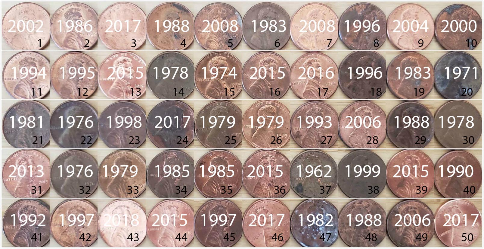

# Bootstrapping and Confidence Intervals {#confidence-intervals}
    
```{r setup_ci, include=FALSE, purl=FALSE}
chap <- 8
lc <- 0
rq <- 0
# **`r paste0("(LC", chap, ".", (lc <- lc + 1), ")")`**
# **`r paste0("(RQ", chap, ".", (rq <- rq + 1), ")")`**

knitr::opts_chunk$set(
  tidy = FALSE, 
  out.width = '\\textwidth', 
  fig.height = 4,
  warning = FALSE
  )

options(scipen = 99)#, digits = 3)
options(pillar.sigfig = 6)

# Set random number generator seed value for replicable pseudorandomness.
set.seed(76)
```

In Chapter \@ref(sampling), we studied sampling. We started with a "tactile" exercise where we wanted to know the proportion of balls in the sampling bowl in Figure \@ref(fig:sampling-exercise-1) that are red. While we could have performed an exhaustive count, this would have been a tedious process. So instead, we used a shovel to extract a sample of 50 balls and used the resulting proportion that were red as an *estimate*. Furthermore, we made sure to mix the bowl's contents before every use of the shovel. Because of the randomness created by the mixing, different uses of the shovel yielded different proportions red and hence different estimates of the proportion of the bowl's balls that are red. 

We then mimicked this "tactile" sampling exercise with an equivalent "virtual" sampling exercise performed on the computer. Using our computer's random number generator, we quickly mimicked the above sampling procedure a large number of times. In Subsection \@ref(different-shovels), we quickly repeated this sampling procedure 1000 times, using three different "virtual" shovels with 25, 50, and 100 slots. We visualized these three sets of 1000 estimates in Figure \@ref(fig:comparing-sampling-distributions-3) and saw that as the sample size increased, the variation in the estimates decreased.

In doing so, what we did was construct *sampling distributions*. The motivation for taking 1000 repeated samples and visualizing the resulting estimates was to study how these estimates varied from one sample to another; in other words, we wanted to study the effect of *sampling variation*. We quantified the variation of these estimates using their standard deviation, which has a special name: the *standard error*. In particular, we saw that as the sample size increased from 25 to 50 to 100, the standard error decreased and thus the sampling distributions narrowed. Larger sample sizes led to more *precise* estimates that varied less around the center. 

We then tied these sampling exercises to terminology and mathematical notation related to sampling in Subsection \@ref(terminology-and-notation). Our *study population* was the large bowl with $N$ = 2400 balls, while the *population parameter*, the unknown quantity of interest, was the population proportion $p$ of the bowl's balls that were red. Since performing a *census* would be expensive in terms of time and energy, we instead extracted a *sample* of size $n$ = 50. The *point estimate*, also known as a *sample statistic*, used to estimate $p$ was the sample proportion $\widehat{p}$ of these 50 sampled balls that were red. Furthermore, since the sample was obtained at *random*, it can be considered as *unbiased* and *representative* of the population. Thus any results based on the sample could be *generalized* to the population. Therefore, the proportion of the shovel's balls that were red was a "good guess" of the proportion of the bowl's balls that are red. In other words, we used the sample to *infer* about the population.

However, as described in Section \@ref(sampling-simulation), both the tactile and virtual sampling exercises are not what one would do in real life; this was merely an activity used to study the effects of sampling variation. In a real-life situation, we would not take 1000 samples of size $n$, but rather take a *single* representative sample that's as large as possible. Additionally, we knew that the true proportion of the bowl's balls that were red was 37.5%. In a real-life situation, we will not know what this value is. Because if we did, then why would we take a sample to estimate it? 

An example of a realistic sampling situation would be a poll, like the [Obama poll](https://www.npr.org/sections/itsallpolitics/2013/12/04/248793753/poll-support-for-obama-among-young-americans-eroding) you saw in Section \@ref(sampling-case-study). Pollsters did not know the true proportion of *all* young Americans who supported President Obama in 2013, and thus they took a single sample of size $n$ = 2089 young Americans to estimate this value.

So how does one quantify the effects of sampling variation when you only have a *single sample* to work with? You cannot directly study the effects of sampling variation when you only have one sample. One common method to study this is *bootstrapping resampling*, which will be the focus of the earlier sections of this chapter. 

Furthermore, what if we would like not only a single estimate of the unknown population parameter, but also a *range of highly plausible* values? Going back to the Obama poll article, it stated that the pollsters' estimate of the proportion of all young Americans who supported President Obama was 41%. But in addition it stated that the poll's "margin of error was plus or minus 2.1 percentage points." This "plausible range" was [41% - 2.1%, 41% + 2.1%] = [38.9%, 43.1%]. This range of plausible values is what's known as a *confidence interval*, which will be the focus of the later sections of this chapter. 

<!--
Create graphic illustrating two-step process of 1) construct bootstrap distribution
and then 2) based on bootstrap dist'n create CI?
-->

### Needed packages {-}

Let's load all the packages needed for this chapter (this assumes you've already installed them). Recall from our discussion in Section \@ref(tidyverse-package) that loading the `tidyverse` package by running `library(tidyverse)` loads the following commonly used data science packages all at once:

* `ggplot2` for data visualization
* `dplyr` for data wrangling
* `tidyr` for converting data to tidy format
* `readr` for importing spreadsheet data into R
* As well as the more advanced `purrr`, `tibble`, `stringr`, and `forcats` packages

If needed, read Section \@ref(packages) for information on how to install and load R packages. 

```{r message=FALSE, warning=FALSE}
library(tidyverse)
library(moderndive)
library(infer)
```

```{r message=FALSE, warning=FALSE, echo=FALSE}
# Packages needed internally, but not in the text
library(knitr)
library(kableExtra)
library(patchwork)
library(purrr)
```


## Pennies activity {#resampling-tactile}

As we did in Chapter \@ref(sampling), we'll begin with a hands-on tactile activity.

### What is the average year on US pennies in 2019?

Try to imagine all the pennies being used in the United States in 2019. That's a lot of pennies! Now say we're interested in the average year of minting of *all* these pennies. One way to compute this value would be to gather up all pennies being used in the US, record the year, and compute the average. However, this would be near impossible! So instead, let's collect a *sample* of 50 pennies from a local bank in downtown Northampton, Massachusetts, USA as seen in Figure \@ref(fig:resampling-exercise-a).

```{r resampling-exercise-a, echo=FALSE, fig.show='hold', fig.cap="Collecting a sample of 50 US pennies from a local bank.", purl=FALSE, out.width = "40%"}
knitr::include_graphics(c("images/sampling/pennies/bank.jpg", "images/sampling/pennies/roll.jpg"))
```

An image of these 50 pennies can be seen in Figure \@ref(fig:resampling-exercise-c). For each of the 50 pennies starting in the top left, progressing row-by-row, and ending in the bottom right, we assigned an "ID" identification variable and marked the year of minting.

```{r resampling-exercise-c, echo=FALSE, fig.cap="50 US pennies labelled.", fig.show='hold', purl=FALSE, out.width = "100%"}

```

The `moderndive` \index{moderndive!pennies\_sample} package contains this data on our 50 sampled pennies in the `pennies_sample` data frame:

```{r}
pennies_sample
```

The `pennies_sample` data frame has 50 rows corresponding to each penny with two variables. The first variable `ID` corresponds to the ID labels in Figure \@ref(fig:resampling-exercise-c), whereas the second variable `year` corresponds to the year of minting saved as a numeric variable, also known as a double (`dbl`).

Based on these 50 sampled pennies, what can we say about *all* US pennies in 2019? Let's study some properties of our sample by performing an exploratory data analysis. Let's first visualize the distribution of the year of these 50 pennies using our data visualization tools from Chapter \@ref(viz). Since `year` is a numerical variable, we use a histogram in Figure \@ref(fig:pennies-sample-histogram) to visualize its distribution.

```{r pennies-sample-histogram, fig.cap="Distribution of year on 50 US pennies."}
ggplot(pennies_sample, aes(x = year)) +
  geom_histogram(binwidth = 10, color = "white")
```

Observe a slightly left-skewed \index{skew} distribution, since most pennies fall between 1980 and 2010 with only a few pennies older than 1970. What is the average year for the 50 sampled pennies? Eyeballing the histogram it appears to be around 1990. Let's now compute this value exactly using our data wrangling tools from Chapter \@ref(wrangling).

```{r}
pennies_sample %>% 
  summarize(mean_year = mean(year))
```
```{r, echo=FALSE}
x_bar <- pennies_sample %>% 
  summarize(mean_year = mean(year))
```

Thus, if we're willing to assume that `pennies_sample` is a representative sample from *all* US pennies, a "good guess" of the average year of minting of all US pennies would be `r x_bar %>% pull(mean_year) %>% round(2)`. In other words, around `r x_bar %>% pull(mean_year) %>% round()`. This should all start sounding similar to what we did previously in Chapter \@ref(sampling)!

In Chapter \@ref(sampling), our *study population* was the bowl of $N$ = 2400 balls. Our *population parameter* was the *population proportion* of these balls that were red, denoted by $p$. In order to estimate $p$, we extracted a sample of 50 balls using the shovel. We then computed the relevant *point estimate*: the *sample proportion* of these 50 balls that were red, denoted mathematically by $\widehat{p}$.

Here our population is $N$ = whatever the number of pennies are being used in the US, a value which we don't know and probably never will. The population parameter of interest is now the *population mean* year of all these pennies, a value denoted mathematically by the Greek letter $\mu$ (pronounced "mu"). In order to estimate $\mu$, we went to the bank and obtained a sample of 50 pennies and computed the relevant point estimate: the *sample mean* year of these 50 pennies, denoted mathematically by $\overline{x}$ (pronounced "x-bar"). An alternative and more intuitive notation for the sample mean is $\widehat{\mu}$. However, this is unfortunately not as commonly used, so in this book we'll stick with convention and always denote the sample mean as $\overline{x}$.

We summarize the correspondence between the sampling bowl exercise in Chapter \@ref(sampling) and our pennies exercise in Table \@ref(tab:table-ch8-b), which are the first two rows of the previously seen Table \@ref(tab:table-ch8).

```{r table-ch8-b, echo=FALSE, message=FALSE}
# The following Google Doc is published to CSV and loaded using read_csv():
# https://docs.google.com/spreadsheets/d/1QkOpnBGqOXGyJjwqx1T2O5G5D72wWGfWlPyufOgtkk4/edit#gid=0

if(!file.exists("rds/sampling_scenarios.rds")){
  sampling_scenarios <- "https://docs.google.com/spreadsheets/d/e/2PACX-1vRd6bBgNwM3z-AJ7o4gZOiPAdPfbTp_V15HVHRmOH5Fc9w62yaG-fEKtjNUD2wOSa5IJkrDMaEBjRnA/pub?gid=0&single=true&output=csv" %>% 
    read_csv(na = "") %>% 
    slice(1:5)
  write_rds(sampling_scenarios, "rds/sampling_scenarios.rds")
} else {
  sampling_scenarios <- read_rds("rds/sampling_scenarios.rds")
}

sampling_scenarios %>%  
  # Only first two scenarios
  filter(Scenario <= 2) %>% 
  kable(
    caption = "Scenarios of sampling for inference", 
    booktabs = TRUE,
    escape = FALSE,
    linesep = ""
  ) %>% 
  kable_styling(font_size = ifelse(knitr:::is_latex_output(), 10, 16),
                latex_options = c("hold_position")) %>%
  column_spec(1, width = "0.5in") %>% 
  column_spec(2, width = "0.7in") %>%
  column_spec(3, width = "1in") %>%
  column_spec(4, width = "1.1in") %>% 
  column_spec(5, width = "1in")
```

Going back to our 50 sampled pennies in Figure \@ref(fig:resampling-exercise-c), the point estimate of interest is the sample mean $\overline{x}$ of `r x_bar %>% pull(mean_year) %>% round(2)`. This quantity is an *estimate* of the population mean year of *all* US pennies $\mu$.

Recall that we also saw in Chapter \@ref(sampling) that such estimates are prone to *sampling variation*. For example, in this particular sample in Figure \@ref(fig:resampling-exercise-c), we observed three pennies with the year 1999. If we sampled another 50 pennies, would we observe exactly three pennies with the year 1999 again? More than likely not. We might observe none, one, two, or maybe even all 50! The same can be said for the other 26 unique years that are represented in our sample of 50 pennies.

To study the effects of *sampling variation* in Chapter \@ref(sampling), we took many samples, something we could easily do with our shovel. In our case with pennies, however, how would we obtain another sample? By going to the bank and getting another roll of 50 pennies. 

Say we're feeling lazy, however, and don't want to go back to the bank. How can we study the effects of sampling variation using our *single sample*? We will do so using a technique known as _bootstrap resampling with replacement_, which we now illustrate.

### Resampling once

**Step 1**: Let's print out identically sized slips of paper representing our 50 pennies as seen in Figure \@ref(fig:tactile-resampling-1).

```{r tactile-resampling-1, echo=FALSE, fig.cap="Step 1: 50 slips of paper representing 50 US pennies.", fig.show='hold', purl=FALSE, out.width="100%"}
knitr::include_graphics("images/sampling/pennies/tactile_simulation/1_paper_slips.png")
```

**Step 2**: Put the 50 slips of paper into a hat or tuque as seen in Figure \@ref(fig:tactile-resampling-2).

```{r tactile-resampling-2, echo=FALSE, fig.cap="Step 2: Putting 50 slips of paper in a hat.", fig.show='hold', purl=FALSE, out.width="60%"}
knitr::include_graphics("images/sampling/pennies/tactile_simulation/2_insert_in_hat.png")
```

**Step 3**: Mix the hat's contents and draw one slip of paper at random as seen in Figure \@ref(fig:tactile-resampling-3). Record the year.

```{r tactile-resampling-3, echo=FALSE, fig.cap="Step 3: Drawing one slip of paper at random.", fig.show='hold', purl=FALSE, out.width="60%"}
knitr::include_graphics("images/sampling/pennies/tactile_simulation/3_draw_at_random.png")
```

**Step 4**: Put the slip of paper back in the hat! In other words, replace it as seen in Figure \@ref(fig:tactile-resampling-4). 

```{r tactile-resampling-4, echo=FALSE, fig.cap="Step 4: Replacing slip of paper.", fig.show='hold', purl=FALSE, out.width="50%"}
knitr::include_graphics("images/sampling/pennies/tactile_simulation/4_put_it_back.png")
```

**Step 5**: Repeat Steps 3 and 4 a total of 49 more times, resulting in 50 recorded years.

What we just performed was a *resampling* \index{resampling} of the original sample of 50 pennies. We are not sampling 50 pennies from the population of all US pennies as we did in our trip to the bank. Instead, we are mimicking this act by resampling 50 pennies from our original sample of 50 pennies. 

Now ask yourselves, why did we replace our resampled slip of paper back into the hat in Step 4? Because if we left the slip of paper out of the hat each time we performed Step 4, we would end up with the same 50 original pennies! In other words, replacing the slips of paper induces *sampling variation*.

Being more precise with our terminology, we just performed a *resampling with replacement* from the original sample of 50 pennies. Had we left the slip of paper out of the hat each time we performed Step 4, this would be *resampling without replacement*.

Let's study our 50 resampled pennies via an exploratory data analysis. First, let's load the data into R by manually creating a data frame `pennies_resample` of our 50 resampled values. We'll do this using the `tibble()` command from the `dplyr` package. Note that the 50 values you resample will almost certainly not be the same as ours given the inherent randomness.

```{r}
pennies_resample <- tibble(
  year = c(1976, 1962, 1976, 1983, 2017, 2015, 2015, 1962, 2016, 1976, 
           2006, 1997, 1988, 2015, 2015, 1988, 2016, 1978, 1979, 1997, 
           1974, 2013, 1978, 2015, 2008, 1982, 1986, 1979, 1981, 2004, 
           2000, 1995, 1999, 2006, 1979, 2015, 1979, 1998, 1981, 2015, 
           2000, 1999, 1988, 2017, 1992, 1997, 1990, 1988, 2006, 2000)
)
```

The 50 values of `year` in `pennies_resample` represent a resample of size 50 from the original sample of 50 pennies. We display the 50 resampled pennies in Figure \@ref(fig:resampling-exercise-d).

```{r resampling-exercise-d, echo=FALSE, fig.cap="50 resampled US pennies labelled.", fig.show='hold', purl=FALSE, out.width="100%"}
# Need this for ID column
if(!file.exists("rds/pennies_resample.rds")){
  pennies_resample <- pennies_sample %>% 
    rep_sample_n(size = 50, replace = TRUE, reps = 1) %>% 
    ungroup() %>% 
    select(-replicate)
  write_rds(pennies_resample, "rds/pennies_resample.rds")
} else {
  pennies_resample <- read_rds("rds/pennies_resample.rds")
}
knitr::include_graphics("images/sampling/pennies/deliverable/4.jpg")
```

Let's compare the distribution of the numerical variable `year` of our 50 resampled pennies with the distribution of the numerical variable `year` of our original sample of 50 pennies in Figure \@ref(fig:origandresample).

```{r eval=FALSE}
ggplot(pennies_resample, aes(x = year)) +
  geom_histogram(binwidth = 10, color = "white") +
  labs(title = "Resample of 50 pennies")
ggplot(pennies_sample, aes(x = year)) +
  geom_histogram(binwidth = 10, color = "white") +
  labs(title = "Original sample of 50 pennies")
```

(ref:compare-plots) Comparing `year` in the resampled `pennies_resample` with the original sample `pennies_sample`.

```{r origandresample, echo=FALSE, fig.cap="(ref:compare-plots)", purl=FALSE}
p1 <- ggplot(pennies_resample, aes(x = year)) +
  geom_histogram(binwidth = 10, color = "white") +
  labs(title = "Resample of 50 pennies") +
  scale_x_continuous(limits = c(1960, 2020), breaks = seq(1960, 2020, 20)) + 
  scale_y_continuous(limits = c(0, 15), breaks = seq(0, 15, 5))
p2 <- ggplot(pennies_sample, aes(x = year)) +
  geom_histogram(binwidth = 10, color = "white") +
  labs(title = "Original sample of 50 pennies") +
  scale_x_continuous(limits = c(1960, 2020), breaks = seq(1960, 2020, 20)) + 
  scale_y_continuous(limits = c(0, 15), breaks = seq(0, 15, 5))
p1 + p2
```

Observe in Figure \@ref(fig:origandresample) that while the general shapes of both distributions of `year` are roughly similar, they are not identical. 

Recall from the previous section that the sample mean of the original sample of 50 pennies from the bank was `r x_bar %>% pull(mean_year) %>% round(2)`. What about for our resample? Any guesses? Let's have `dplyr` help us out as before:

```{r}
pennies_resample %>% 
  summarize(mean_year = mean(year))
```
```{r, echo=FALSE}
resample_mean <- pennies_resample %>% 
  summarize(mean_year = mean(year))
```

We obtained a different mean year of `r resample_mean %>% pull(mean_year) %>% round(2)`. This variation is induced by the resampling *with replacement* we performed earlier.

What if we repeated this resampling exercise many times? Would we obtain the same mean `year` each time? In other words, would our guess at the mean year of all pennies in the US in 2019 be exactly `r resample_mean %>% pull(mean_year) %>% round(2)` every time? Just as we did in Chapter \@ref(sampling), let's perform this resampling activity with the help of some of our friends: 35 friends in total.


### Resampling 35 times {#student-resamples}

Each of our 35 friends will repeat the same five steps:

1. Start with 50 identically sized slips of paper representing the 50 pennies. 
1. Put the 50 small pieces of paper into a hat or beanie cap.
1. Mix the hat's contents and draw one slip of paper at random. Record the year in a spreadsheet.
1. Replace the slip of paper back in the hat! 
1. Repeat Steps 3 and 4 a total of 49 more times, resulting in 50 recorded years.

Since we had 35 of our friends perform this task, we ended up with $35 \cdot 50 = 1750$ values. We recorded these values in a [shared spreadsheet](https://docs.google.com/spreadsheets/d/1y3kOsU_wDrDd5eiJbEtLeHT9L5SvpZb_TrzwFBsouk0/) with 50 rows (plus a header row) and 35 columns. We display a snapshot of the first 10 rows and five columns of this shared spreadsheet in Figure \@ref(fig:tactile-resampling-5).

```{r tactile-resampling-5, echo=FALSE, fig.cap = "Snapshot of shared spreadsheet of resampled pennies.", fig.show='hold', purl=FALSE, out.width = "70%"}
knitr::include_graphics("images/sampling/pennies/tactile_simulation/5_shared_spreadsheet.png")
```

For your convenience, we've taken these 35 $\cdot$ 50 = 1750 values and saved them in `pennies_resamples`, a "tidy" data frame included in the `moderndive` package. We saw what it means for a data frame to be "tidy" in Subsection \@ref(tidy-definition).

```{r}
pennies_resamples
```

What did each of our 35 friends obtain as the mean year? Once again, `dplyr` to the rescue! After grouping the rows by `name`, we summarize each group of 50 rows by their mean `year`:

```{r}
resampled_means <- pennies_resamples %>% 
  group_by(name) %>% 
  summarize(mean_year = mean(year))
resampled_means
```

Observe that `resampled_means` has 35 rows corresponding to the 35 means based on the 35 resamples. Furthermore, observe the variation in the 35 values in the variable `mean_year`. Let's visualize this variation using a histogram in Figure \@ref(fig:tactile-resampling-6). Recall that adding the argument `boundary = 1990` to the `geom_histogram()` sets the binning structure so that one of the bin boundaries is at 1990 exactly. 

```{r tactile-resampling-6, echo=TRUE, fig.cap="Distribution of 35 sample means from 35 resamples.", purl=FALSE, fig.height=3.5}
ggplot(resampled_means, aes(x = mean_year)) +
  geom_histogram(binwidth = 1, color = "white", boundary = 1990) +
  labs(x = "Sampled mean year")
```

Observe in Figure \@ref(fig:tactile-resampling-6) that the distribution looks roughly normal and that we rarely observe sample mean years less than 1992 or greater than 2000. Also observe how the distribution is roughly centered at 1995, which is close to the sample mean of `r x_bar %>% pull(mean_year) %>% round(2)` of the *original sample* of 50 pennies from the bank.


### What did we just do?

What we just demonstrated in this activity is the statistical procedure known as \index{bootstrap} *bootstrap resampling with replacement*. We used *resampling* to mimic the sampling variation we studied in Chapter \@ref(sampling) on sampling. However, in this case, we did so using only a *single* sample from the population.

In fact, the histogram of sample means from 35 resamples in Figure \@ref(fig:tactile-resampling-6) is called the \index{bootstrap!distribution} *bootstrap distribution*. It is an *approximation* to the *sampling distribution* of the sample mean, in the sense that both distributions will have a similar shape and similar spread. In fact in the upcoming Section \@ref(ci-conclusion), we'll show you that this is the case. Using this bootstrap distribution, we can study the effect of sampling variation on our estimates. In particular, we'll study the typical "error" of our estimates, known as the \index{standard error} *standard error*. 

In Section \@ref(resampling-simulation) we'll mimic our tactile resampling activity virtually on the computer, allowing us to quickly perform the resampling many more than 35 times. In Section \@ref(ci-build-up) we'll define the statistical concept of a *confidence interval*, which builds off the concept of bootstrap distributions.

In Section \@ref(bootstrap-process), we'll construct confidence intervals using the `dplyr` package, as well as a new package: the `infer` package for "tidy" and transparent statistical inference. We'll introduce the "tidy" statistical inference framework that was the motivation for the `infer` package pipeline. The `infer` package will be the driving package throughout the rest of this book.

As we did in Chapter \@ref(sampling), we'll tie all these ideas together with a real-life case study in Section \@ref(case-study-two-prop-ci). This time we'll look at data from an experiment about yawning from the US television show *Mythbusters*.  


## Computer simulation of resampling {#resampling-simulation}

Let's now mimic our tactile resampling activity virtually with a computer.

### Virtually resampling once

First, let's perform the virtual analog of resampling once. Recall that the `pennies_sample` data frame included in the `moderndive` package contains the years of our original sample of 50 pennies from the bank. Furthermore, recall in Chapter \@ref(sampling) on sampling that we used the `rep_sample_n()` function as a virtual shovel to sample balls from our virtual bowl of `r nrow(bowl)` balls as follows: 

```{r, eval=FALSE, purl=FALSE}
virtual_shovel <- bowl %>% 
  rep_sample_n(size = 50)
```

Let's modify this code to perform the resampling with replacement of the 50 slips of paper representing our original sample 50 pennies:

```{r}
virtual_resample <- pennies_sample %>% 
  rep_sample_n(size = 50, replace = TRUE)
```

Observe how we explicitly set the `replace` argument to `TRUE` in order to tell `rep_sample_n()` that we would like to sample pennies \index{sampling!with replacement} *with* replacement. Had we not set `replace = TRUE`, the function would've assumed the default value of `FALSE` and hence done resampling *without* replacement. Additionally, since we didn't specify the number of replicates via the `reps` argument, the function assumes the default of one replicate `reps = 1`. Lastly, observe also that the `size` argument is set to match the original sample size of 50 pennies. 

Let's look at only the first 10 out of 50 rows of `virtual_resample`:

```{r}
virtual_resample
```

The `replicate` variable only takes on the value of 1 corresponding to us only having `reps = 1`, the `ID` variable indicates which of the 50 pennies from `pennies_sample` was resampled, and `year` denotes the year of minting. Let's now compute the mean `year` in our virtual resample of size 50 using data wrangling functions included in the `dplyr` package:

```{r}
virtual_resample %>% 
  summarize(resample_mean = mean(year))
```

As we saw when we did our tactile resampling exercise, the resulting mean year is different than the mean year of our 50 originally sampled pennies of `r x_bar %>% pull(mean_year) %>% round(2)`.

<!-- 
Chester: Not sure if needed, but those trying to follow along may be mystified if we don't include this. 

Note that tibbles will try to print as pretty as possible which may result in numbers being rounded. In this chapter, we have set the default number of values to be printed to six in tibbles with `options(pillar.sigfig = 6)`.

Albert: We'll need to explain that command and why tidyverse opts for 3 sigfigs.
-->

### Virtually resampling 35 times {#bootstrap-35-replicates}

Let's now perform the virtual analog of our 35 friends' resampling. Using these results, we'll be able to study the variability in the sample means from 35 resamples of size 50. Let's first add a `reps = 35` argument to `rep_sample_n()` \index{infer!rep\_sample\_n()} to indicate we would like 35 replicates. Thus, we want to repeat the resampling with the replacement of 50 pennies 35 times.

```{r}
virtual_resamples <- pennies_sample %>% 
  rep_sample_n(size = 50, replace = TRUE, reps = 35)
virtual_resamples
```

The resulting `virtual_resamples` data frame has 35 $\cdot$ 50 = `r 35*50` rows corresponding to 35 resamples of 50 pennies. Let's now compute the resulting 35 sample means using the same `dplyr` code as we did in the previous section, but this time adding a `group_by(replicate)`:

```{r}
virtual_resampled_means <- virtual_resamples %>% 
  group_by(replicate) %>% 
  summarize(mean_year = mean(year))
virtual_resampled_means
```

Observe that `virtual_resampled_means` has 35 rows, corresponding to the 35 resampled means. Furthermore, observe that the values of `mean_year` vary. Let's visualize this variation using a histogram in Figure \@ref(fig:tactile-resampling-7).

```{r tactile-resampling-7, echo=TRUE, fig.cap="Distribution of 35 sample means from 35 resamples.", purl=FALSE}
ggplot(virtual_resampled_means, aes(x = mean_year)) +
  geom_histogram(binwidth = 1, color = "white", boundary = 1990) +
  labs(x = "Resample mean year")
```

Let's compare our virtually constructed bootstrap distribution with the one our 35 friends constructed via our tactile resampling exercise in Figure \@ref(fig:orig-and-resample-means). Observe how they are somewhat similar, but not identical.

```{r orig-and-resample-means, echo=FALSE, fig.cap="Comparing distributions of means from resamples.", purl=FALSE}
p3 <- ggplot(virtual_resampled_means, aes(x = mean_year)) +
  geom_histogram(binwidth = 1, color = "white", boundary = 1990) +
  labs(x = "Resample mean year", title = "35 means of tactile resamples") +
  scale_x_continuous(breaks = seq(1990, 2000, 2))
p4 <- ggplot(resampled_means, aes(x = mean_year)) +
  geom_histogram(binwidth = 1, color = "white", boundary = 1990) +
  labs(x = "Resample mean year", title = "35 means of virtual resamples") +
  scale_x_continuous(breaks = seq(1990, 2000, 2))
p3 + p4
```

Recall that in the "resampling with replacement" scenario we are illustrating here, both of these histograms have a special name: the *bootstrap distribution of the sample mean*. Furthermore, recall they are an approximation to the *sampling distribution* of the sample mean, a concept you saw in Chapter \@ref(sampling) on sampling. These distributions allow us to study the effect of sampling variation on our estimates of the true population mean, in this case the true mean year for *all* US pennies. However, unlike in Chapter \@ref(sampling) where we took multiple samples (something one would never do in practice), bootstrap distributions are constructed by taking multiple resamples from a *single* sample: in this case, the 50 original pennies from the bank. 

<!--
```{block, type='learncheck', purl=FALSE}
\vspace{-0.15in}
**_Learning check_**
\vspace{-0.1in}
```


**`paste0("(LC", chap, ".", (lc <- lc + 1), ")")`** Ask learners to compare the distributions since we did something similar in Chapter 8 and they should be well versed on this by now.


```{block, type='learncheck', purl=FALSE}
\vspace{-0.25in}
\vspace{-0.25in}
```
-->

### Virtually resampling 1000 times {#bootstrap-1000-replicates}

Remember that one of the goals of resampling with replacement is to construct the bootstrap distribution, which is an approximation of the sampling distribution. However, the bootstrap distribution in Figure \@ref(fig:tactile-resampling-7) is based only on 35 resamples and hence looks a little coarse. Let's increase the number of resamples to 1000, so that we can hopefully better see the shape and the variability between different resamples. 

```{r}
# Repeat resampling 1000 times
virtual_resamples <- pennies_sample %>% 
  rep_sample_n(size = 50, replace = TRUE, reps = 1000)

# Compute 1000 sample means
virtual_resampled_means <- virtual_resamples %>% 
  group_by(replicate) %>% 
  summarize(mean_year = mean(year))
```

However, in the interest of brevity, going forward let's combine these two operations into a single chain of pipe (`%>%`) operators:

```{r}
virtual_resampled_means <- pennies_sample %>% 
  rep_sample_n(size = 50, replace = TRUE, reps = 1000) %>% 
  group_by(replicate) %>% 
  summarize(mean_year = mean(year))
virtual_resampled_means
```

In Figure \@ref(fig:one-thousand-sample-means) let's visualize the bootstrap distribution of these 1000 means based on 1000 virtual resamples:

```{r one-thousand-sample-means, message=FALSE, fig.cap="Bootstrap resampling distribution based on 1000 resamples."}
ggplot(virtual_resampled_means, aes(x = mean_year)) +
  geom_histogram(binwidth = 1, color = "white", boundary = 1990) +
  labs(x = "sample mean")
```

Note here that the bell shape is starting to become much more apparent. We now have a general sense for the range of values that the sample mean may take on. But where is this histogram centered? Let's compute the mean of the 1000 resample means:

```{r eval=TRUE}
virtual_resampled_means %>% 
  summarize(mean_of_means = mean(mean_year))
```
```{r echo=FALSE}
mean_of_means <- virtual_resampled_means %>% 
  summarize(mean(mean_year)) %>% 
  pull() %>% 
  round(2)
```

The mean of these 1000 means is `r mean_of_means`, which is quite close to the mean of our original sample of 50 pennies of `r x_bar %>% pull(mean_year) %>% round(2)`. This is the case since each of the 1000 resamples is based on the original sample of 50 pennies.

Congratulations! You've just constructed your first bootstrap distribution! In the next section, you'll see how to use this bootstrap distribution to construct *confidence intervals*.

```{block, type='learncheck', purl=FALSE}
\vspace{-0.15in}
**_Learning check_**
\vspace{-0.1in}
```

**`r paste0("(LC", chap, ".", (lc <- lc + 1), ")")`** What is the chief difference between a bootstrap distribution and a sampling distribution?


**`r paste0("(LC", chap, ".", (lc <- lc + 1), ")")`** Looking at the bootstrap distribution for the sample mean in Figure \@ref(fig:one-thousand-sample-means), between what two values would you say *most* values lie?

```{block, type='learncheck', purl=FALSE}
\vspace{-0.25in}
\vspace{-0.25in}
```


## Understanding confidence intervals {#ci-build-up}

Let's start this section with an analogy involving fishing. Say you are trying to catch a fish. On the one hand, you could use a spear, while on the other you could use a net. Using the net will probably allow you to catch more fish! 

Now think back to our pennies exercise where you are trying to estimate the true population mean year $\mu$ of *all* US pennies. \index{confidence interval!analogy to fishing} Think of the value of $\mu$ as a fish.

On the one hand, we could use the appropriate *point estimate/sample statistic* to estimate $\mu$, which we saw in Table \@ref(tab:table-ch8-b) is the sample mean $\overline{x}$. Based on our sample of 50 pennies from the bank, the sample mean was `r x_bar %>% pull(mean_year) %>% round(2)`. Think of using this value as "fishing with a spear."

What would "fishing with a net" correspond to? Look at the bootstrap distribution in Figure \@ref(fig:one-thousand-sample-means) once more. Between which two years would you say that "most" sample means lie?  While this question is somewhat subjective, saying that most sample means lie between 1992 and 2000 would not be unreasonable. Think of this interval as the "net."

What we've just illustrated is the concept of a *confidence interval*, which we'll abbreviate with "CI" throughout this book. As opposed to a point estimate/sample statistic that estimates the value of an unknown population parameter with a single value, a *confidence interval* \index{confidence interval} gives what can be interpreted as a range of plausible values. Going back to our analogy, point estimates/sample statistics can be thought of as spears, whereas confidence intervals can be thought of as nets. 

<!--
Point estimate           |  Confidence interval
:-------------------------:|:-------------------------:
{ height=2.5in } |  { height=2.5in }
-->

```{r point-estimate-vs-conf-int, echo=FALSE, fig.align='center', fig.cap="Analogy of difference between point estimates and confidence intervals.", out.width='100%', purl=FALSE}
knitr::include_graphics("images/shutterstock/point_estimate_vs_conf_int.png")
```

Our proposed interval of 1992 to 2000 was constructed by eye and was thus somewhat subjective. We now introduce two methods for constructing such intervals in a more exact fashion: the *percentile method* and the *standard error method*.

Both methods for confidence interval construction share some commonalities. First, they are both constructed from a bootstrap distribution, as you constructed in Subsection \@ref(bootstrap-1000-replicates) and visualized in Figure \@ref(fig:one-thousand-sample-means).

Second, they both require you to specify the \index{confidence interval!confidence level} *confidence level*. Commonly used confidence levels include 90%, 95%, and 99%.  All other things being equal, higher confidence levels correspond to wider confidence intervals, and lower confidence levels correspond to narrower confidence intervals. In this book, we'll be mostly using 95% and hence constructing "95% confidence intervals for $\mu$" for our pennies activity.


### Percentile method {#percentile-method}

```{r echo=FALSE}
# Can also use conf_int() and get_confidence_interval() instead of get_ci(),
# as they are aliases that work the exact same way.
percentile_ci <- virtual_resampled_means %>% 
  rename(stat = mean_year) %>% 
  get_ci(level = 0.95, type = "percentile")
```

One method to construct a confidence interval is to use the middle 95% of values of the bootstrap distribution. We can do this by computing the 2.5th and 97.5th percentiles, which are `r percentile_ci[["2.5%"]]` and `r percentile_ci[["97.5%"]]`, respectively. This is known as the *percentile method* for constructing confidence intervals. 

For now, let's focus only on the concepts behind a percentile method constructed confidence interval; we'll show you the code that computes these values in the next section.

Let's mark these percentiles on the bootstrap distribution with vertical lines in Figure \@ref(fig:percentile-method). About 95% of the `mean_year` variable values in `virtual_resampled_means` fall between `r percentile_ci[["2.5%"]]` and `r percentile_ci[["97.5%"]]`, with 2.5% to the left of the leftmost line and 2.5% to the right of the rightmost line. 

(ref:perc-method) Percentile method 95% confidence interval. Interval endpoints marked by vertical lines.

```{r percentile-method, echo=FALSE, message=FALSE, fig.cap='(ref:perc-method)', fig.height=3.4}
ggplot(virtual_resampled_means, aes(x = mean_year)) +
  geom_histogram(binwidth = 1, color = "white", boundary = 1988) +
  labs(x = "Resample sample mean") +
  scale_x_continuous(breaks = seq(1988, 2006, 2)) +
  geom_vline(xintercept = percentile_ci[[1, 1]], size = 1) +
  geom_vline(xintercept = percentile_ci[[1, 2]], size = 1)
```


### Standard error method {#se-method}

```{r echo=FALSE}
# Can also use get_confidence_interval() instead of get_ci(),
# as it is an alias that works the exact same way.
standard_error_ci <- virtual_resampled_means %>% 
  rename(stat = mean_year) %>% 
  get_ci(type = "se", point_estimate = x_bar)

# bootstrap SE value as scalar
bootstrap_se <- virtual_resampled_means %>% 
  summarize(se = sd(mean_year)) %>% 
  pull(se)
```

Recall in Appendix \@ref(appendix-normal-curve), we saw that if a numerical variable follows a normal distribution, or, in other words, the histogram of this variable is bell-shaped, then roughly 95% of values fall between $\pm$ 1.96 standard deviations of the mean. Given that our bootstrap distribution based on 1000 resamples with replacement in Figure \@ref(fig:one-thousand-sample-means) is normally shaped, let's use this fact about normal distributions to construct a confidence interval in a different way.

First, recall the bootstrap distribution has a mean equal to `r mean_of_means`. This value almost coincides exactly with the value of the sample mean $\overline{x}$ of our original 50 pennies of `r x_bar %>% pull(mean_year) %>% round(2)`. Second, let's compute the standard deviation of the bootstrap distribution using the values of `mean_year` in the `virtual_resampled_means` data frame:

```{r}
virtual_resampled_means %>% 
  summarize(SE = sd(mean_year))
```

What is this value? Recall that the bootstrap distribution is an approximation to the sampling distribution. Recall also that the standard deviation of a sampling distribution has a special name: the *standard error*. Putting these two facts together, we can say that `r bootstrap_se %>% round(5)` is an approximation of the standard error of $\overline{x}$.  

Thus, using our 95% rule of thumb about normal distributions from Appendix \@ref(appendix-normal-curve), we can use the following formula to determine the lower and upper endpoints of a 95% confidence interval for $\mu$:

$$
\begin{aligned}
\overline{x} \pm 1.96 \cdot SE &= (\overline{x} - 1.96 \cdot SE, \overline{x} + 1.96 \cdot SE)\\
&= (`r x_bar %>% pull(mean_year) %>% round(2)` - 1.96 \cdot `r bootstrap_se %>% round(2)`, `r x_bar %>% pull(mean_year) %>% round(2)` + 1.96 \cdot `r bootstrap_se %>% round(2)`)\\
&= (1991.15, 1999.73)
\end{aligned}
$$

Let's now add the SE method confidence interval with dashed lines in Figure \@ref(fig:percentile-and-se-method).

(ref:both-methods) Comparing two 95% confidence interval methods.

```{r percentile-and-se-method, echo=FALSE, message=FALSE, fig.cap='(ref:both-methods)', fig.height=5.2}
both_CI <- bind_rows(
  percentile_ci %>% gather(endpoint, value) %>% mutate(type = "percentile"),
  standard_error_ci %>% gather(endpoint, value) %>% mutate(type = "SE")
)
ggplot(virtual_resampled_means, aes(x = mean_year)) +
  geom_histogram(binwidth = 1, color = "white", boundary = 1988) +
  labs(x = "sample mean", title = "Percentile method CI (solid lines), SE method CI (dashed lines)") +
  scale_x_continuous(breaks = seq(1988, 2006, 2)) +
  geom_vline(xintercept = percentile_ci[[1, 1]], size = 1) +
  geom_vline(xintercept = percentile_ci[[1, 2]], size = 1) + 
  geom_vline(xintercept = standard_error_ci[[1, 1]], linetype = "dashed", size = 1) +
  geom_vline(xintercept = standard_error_ci[[1, 2]], linetype = "dashed", size = 1)
```

We see that both methods produce nearly identical 95% confidence intervals for $\mu$ with the percentile method yielding $(`r round(percentile_ci[["2.5%"]], 2)`, `r round(percentile_ci[["97.5%"]], 2)`)$ while the standard error method produces $(`r round(standard_error_ci[["lower"]], 2)`, `r round(standard_error_ci[["upper"]],2)`)$. However, recall that we can only use the standard error rule when the bootstrap distribution is roughly normally shaped. 

Now that we've introduced the concept of confidence intervals and laid out the intuition behind two methods for constructing them, let's explore the code that allows us to construct them. 

<!--
The variability of the sampling distribution may be approximated by the variability of the resampling distribution. Traditional theory-based methodologies for inference also have formulas for standard errors, assuming some conditions are met.

This is done by using the formula where $\bar{x}$ is our original sample mean and $SE$ stands for **standard error** and corresponds to the standard deviation of the resampling distribution.  The value of $multiplier$ here is the appropriate percentile of the standard normal distribution. We'll go into this further in Section \@ref(ci-conclusion).

These are automatically calculated when `level` is provided with `level = 0.95` being the default. (95% of the values in a standard normal distribution fall within 1.96 standard deviations of the mean, so $multiplier = 1.96$ for `level = 0.95`, for example.)  As mentioned, this formula assumes that the bootstrap distribution is symmetric and bell-shaped. This is often the case with bootstrap distributions, especially those in which the original distribution of the sample is not highly skewed.

This $\bar{x} \pm (multiplier * SE)$ formula is implemented in the `get_ci()` function as shown with our pennies problem using the bootstrap distribution's variability as an approximation for the sampling distribution's variability. We'll see more on this approximation shortly.

Note that the center of the confidence interval (the `point_estimate`) must be provided for the standard error confidence interval.

```{r eval=FALSE}
standard_error_ci <- bootstrap_distribution %>% 
  get_ci(type = "se", point_estimate = x_bar)
standard_error_ci
```
-->


```{block, type='learncheck', purl=FALSE}
\vspace{-0.15in}
**_Learning check_**
\vspace{-0.1in}
```

**`r paste0("(LC", chap, ".", (lc <- lc + 1), ")")`** What condition about the bootstrap distribution must be met for us to be able to construct confidence intervals using the standard error method?

**`r paste0("(LC", chap, ".", (lc <- lc + 1), ")")`** Say we wanted to construct a 68% confidence interval instead of a 95% confidence interval for $\mu$. Describe what changes are needed to make this happen. Hint: we suggest you look at Appendix \@ref(appendix-normal-curve) on the normal distribution.

```{block, type='learncheck', purl=FALSE}
\vspace{-0.25in}
\vspace{-0.25in}
```


## Constructing confidence intervals {#bootstrap-process}

Recall that the process of resampling with replacement we performed by hand in Section \@ref(resampling-tactile) and virtually in Section \@ref(resampling-simulation) is known as \index{bootstrap!colloquial definition} *bootstrapping*. The term bootstrapping originates in the expression of "pulling oneself up by their bootstraps," meaning to ["succeed only by one's own efforts or abilities."](https://en.wiktionary.org/wiki/pull_oneself_up_by_one%27s_bootstraps) 

From a statistical perspective, bootstrapping alludes to succeeding in being able to study the effects of sampling variation on estimates from the "effort" of a single sample. Or more precisely, \index{bootstrap!statistical reference} it refers to constructing an approximation to the sampling distribution using only one sample.

To perform this resampling with replacement virtually in Section \@ref(resampling-simulation), we used the `rep_sample_n()` function, making sure that the size of the resamples matched the original sample size of 50. In this section, we'll build off these ideas to construct confidence intervals using a new package: the `infer` package for "tidy" and transparent statistical inference. 

### Original workflow

Recall that in Section \@ref(resampling-simulation), we virtually performed bootstrap resampling with replacement to construct bootstrap distributions. Such distributions are approximations to the sampling distributions we saw in Chapter \@ref(sampling), but are constructed using only a single sample. Let's revisit the original workflow using the `%>%` pipe operator.

First, we used the `rep_sample_n()` function to resample `size = 50` pennies with replacement from the original sample of 50 pennies in `pennies_sample` by setting `replace = TRUE`. Furthermore, we repeated this resampling 1000 times by setting `reps = 1000`:

```{r eval=FALSE}
pennies_sample %>% 
  rep_sample_n(size = 50, replace = TRUE, reps = 1000)
```

Second, since for each of our 1000 resamples of size 50, we wanted to compute a separate sample mean, we used the `dplyr` verb `group_by()` to group observations/rows together by the `replicate` variable...

```{r eval=FALSE}
pennies_sample %>% 
  rep_sample_n(size = 50, replace = TRUE, reps = 1000) %>% 
  group_by(replicate) 
```

... followed by using `summarize()` to compute the sample `mean()` year for each `replicate` group:

```{r eval=FALSE}
pennies_sample %>% 
  rep_sample_n(size = 50, replace = TRUE, reps = 1000) %>% 
  group_by(replicate) %>% 
  summarize(mean_year = mean(year))
```


For this simple case, we can get by with using the `rep_sample_n()` function and a couple of `dplyr` verbs to construct the bootstrap distribution. However, using only `dplyr` verbs only provides us with a limited set of tools. For more complicated situations, we'll need a little more firepower. Let's repeat this using the `infer` package.

### `infer` package workflow {#infer-workflow}

<!--
TODO: Using infer to compute observed point estimate

1. Showing `dplyr` code to compute observed point estimate
1. Showing `infer` verbs to compute observed point estimate. i.e. no generate()
step.
1. Only after these two steps, showing `infer` verb pipeline to construct
bootstrap distribution of point estimate. i.e. with generate() and showing
diagram.
-->

The `infer` package is an R package for statistical inference. It makes efficient use of the `%>%` pipe operator we introduced in Section \@ref(piping) to spell out the sequence of steps necessary to perform statistical inference in a "tidy" and transparent fashion.\index{operators!pipe} Furthermore, just as the `dplyr` package provides functions with verb-like names to perform data wrangling, the `infer` package provides functions with intuitive verb-like names to perform statistical inference.

Let's go back to our pennies. Previously, we computed the value of the sample mean $\overline{x}$ using the `dplyr` function `summarize()`:

```{r, eval=FALSE}
pennies_sample %>% 
  summarize(stat = mean(year))
```

We'll see that we can also do this using `infer` functions `specify()` and `calculate()`: \index{infer!observed statistic shortcut}

```{r, eval=FALSE}
pennies_sample %>% 
  specify(response = year) %>% 
  calculate(stat = "mean")
```

You might be asking yourself: "Isn't the `infer` code longer? Why would I use that code?". While not immediately apparent, you'll see that there are three chief benefits to the `infer` workflow as opposed to the `dplyr` workflow.

First, the `infer` verb names better align with the overall resampling framework you need to understand to construct confidence intervals and to conduct hypothesis tests (in Chapter \@ref(hypothesis-testing)). We'll see flowchart diagrams of this framework in the upcoming Figure \@ref(fig:infer-workflow-ci) and in Chapter \@ref(hypothesis-testing) with Figure \@ref(fig:htdowney).

Second, you can jump back and forth seamlessly between confidence intervals and hypothesis testing with minimal changes to your code. This will become apparent in Subsection \@ref(comparing-infer-workflows) when we'll compare the `infer` code for both of these inferential methods.

Third, the `infer` workflow is much simpler for conducting inference when you have *more than one variable*. We'll see two such situations. We'll first see situations of *two-sample* inference\index{two-sample inference} where the sample data is collected from two groups, such as in Section \@ref(case-study-two-prop-ci) where we study the contagiousness of yawning and in Section \@ref(ht-activity) where we compare promotion rates of two groups at banks in the 1970s. Then in Section \@ref(infer-regression), we'll see situations of *inference for regression* using the regression models you fit in Chapter \@ref(regression). 

Let's now illustrate the sequence of verbs necessary to construct a confidence interval for $\mu$, the population mean year of minting of all US pennies in 2019.

#### 1. `specify` variables {-}

```{r infer-specify, fig.align='center', out.width='20%', out.height='20%', echo=FALSE, fig.cap="Diagram of the specify() verb.", purl=FALSE}
knitr::include_graphics("images/flowcharts/infer/specify.png")
```

As shown in Figure \@ref(fig:infer-specify), the `specify()` \index{infer!specify()} function is used to choose which variables in a data frame will be the focus of our statistical inference. We do this by `specify`ing the `response` argument. For example, in our `pennies_sample` data frame of the 50 pennies sampled from the bank, the variable of interest is `year`:

```{r}
pennies_sample %>% 
  specify(response = year)
```

Notice how the data itself doesn't change, but the `Response: year (numeric)` *meta-data* does\index{meta-data}. This is similar to how the `group_by()` verb from `dplyr` doesn't change the data, but only adds "grouping" meta-data, as we saw in Section \@ref(groupby).

We can also specify which variables will be the focus of our statistical inference using a `formula = y ~ x`. This is the same formula notation you saw in Chapters \@ref(regression) and \@ref(multiple-regression) on regression models: the response variable `y` is separated from the explanatory variable `x` by a `~` ("tilde"). The following use of `specify()` with the `formula` argument yields the same result seen previously:

```{r, eval=FALSE}
pennies_sample %>% 
  specify(formula = year ~ NULL)
```

Since in the case of pennies we only have a response variable and no explanatory variable of interest, we set the `x` on the right-hand side of the `~` to be `NULL`. 

While in the case of the pennies either specification works just fine, we'll see examples later on where the `formula` specification is simpler. In particular, this comes up in the upcoming Section \@ref(case-study-two-prop-ci) on comparing two proportions and Section \@ref(infer-regression) on inference for regression.


#### 2. `generate` replicates {-}

```{r infer-generate, fig.align='center', out.width='60%', out.height='60%', echo=FALSE, fig.cap="Diagram of generate() replicates.", purl=FALSE}
knitr::include_graphics("images/flowcharts/infer/generate.png")
```

After we `specify()` the variables of interest, we pipe the results into the `generate()` function to generate replicates. Figure \@ref(fig:infer-generate) shows how this is combined with `specify()` to start the pipeline. In other words, repeat the resampling process a large number of times. Recall in Sections \@ref(bootstrap-35-replicates) and \@ref(bootstrap-1000-replicates) we did this 35 and 1000 times.

The `generate()` \index{infer!generate()} function's first argument is `reps`, which sets the number of replicates we would like to generate. Since we want to resample the 50 pennies in `pennies_sample` with replacement 1000 times, we set `reps = 1000`. The second argument `type` determines the type of computer simulation we'd like to perform. We set this to `type = "bootstrap"` indicating that we want to perform bootstrap resampling. You'll see different options for `type` in Chapter \@ref(hypothesis-testing). 

```{r eval=FALSE}
pennies_sample %>% 
  specify(response = year) %>% 
  generate(reps = 1000, type = "bootstrap")
```

```{r echo=FALSE}
if(!file.exists("rds/pennies_sample_generate.rds")){
  pennies_sample_generate <- pennies_sample %>% 
    specify(response = year) %>% 
    generate(reps = 1000, type = "bootstrap")
  write_rds(pennies_sample_generate, "rds/pennies_sample_generate.rds")
} else {
  pennies_sample_generate <- read_rds("rds/pennies_sample_generate.rds")
}
pennies_sample_generate
```

Observe that the resulting data frame has 50,000 rows. This is because we performed resampling of 50 pennies with replacement 1000 times and 50,000 = 50 $\cdot$ 1000. 

The variable `replicate` indicates which resample each row belongs to. So it has the value `1` 50 times, the value `2` 50 times, all the way through to the value `1000` 50 times. The default value of the `type` argument is `"bootstrap"` in this scenario, so if the last line was written as `generate(reps = 1000)`, we'd obtain the same results. 

**Comparing with original workflow**: Note that the steps of the `infer` workflow so far produce the same results as the original workflow using the `rep_sample_n()` function we saw earlier. In other words, the following two code chunks produce similar results:

```{r eval=FALSE}
# infer workflow:                   # Original workflow:
pennies_sample %>%                  pennies_sample %>% 
  specify(response = year) %>%        rep_sample_n(size = 50, replace = TRUE, 
  generate(reps = 1000)                            reps = 1000)              
             
```


#### 3. `calculate` summary statistics {-}

```{r infer-calculate, fig.align='center', out.width='80%', out.height='80%', echo=FALSE, fig.cap="Diagram of calculate() summary statistics.", purl=FALSE}
knitr::include_graphics("images/flowcharts/infer/calculate.png")
```

After we `generate()` many replicates of bootstrap resampling with replacement, we next want to summarize each of the 1000 resamples of size 50 to a single sample statistic value. As seen in the diagram, the `calculate()` \index{infer!calculate()} function does this.

In our case, we want to calculate the mean `year` for each bootstrap resample of size 50. To do so, we set the `stat` argument to `"mean"`. You can also set the `stat` argument to a variety of other common summary statistics, like `"median"`, `"sum"`, `"sd"` (standard deviation), and `"prop"` (proportion). To see a list of all possible summary statistics you can use, type `?calculate` and read the help file.

Let's save the result in a data frame called `bootstrap_distribution` and explore its contents:

```{r eval=FALSE}
bootstrap_distribution <- pennies_sample %>% 
  specify(response = year) %>% 
  generate(reps = 1000) %>% 
  calculate(stat = "mean")
bootstrap_distribution
```

```{r echo=FALSE}
if(!file.exists("rds/bootstrap_distribution_pennies.rds")){
  bootstrap_distribution <- pennies_sample %>% 
    specify(response = year) %>% 
    generate(reps = 1000) %>% 
    calculate(stat = "mean")
  write_rds(bootstrap_distribution, "rds/bootstrap_distribution_pennies.rds")
} else {
  bootstrap_distribution <- read_rds("rds/bootstrap_distribution_pennies.rds")
}
bootstrap_distribution
```

Observe that the resulting data frame has 1000 rows and 2 columns corresponding to the 1000 `replicate` values. It also has the mean year for each bootstrap resample saved in the variable `stat`. 

**Comparing with original workflow**: You may have recognized at this point that the `calculate()` step in the `infer` workflow produces the same output as the `group_by() %>% summarize()` steps in the original workflow.

```{r eval=FALSE}
# infer workflow:                   # Original workflow:
pennies_sample %>%                  pennies_sample %>% 
  specify(response = year) %>%        rep_sample_n(size = 50, replace = TRUE, 
  generate(reps = 1000) %>%                        reps = 1000) %>%              
  calculate(stat = "mean")            group_by(replicate) %>% 
                                      summarize(stat = mean(year))
```


#### 4. `visualize` the results {-}

```{r infer-visualize, fig.align='center', out.width="70%", echo=FALSE, fig.cap="Diagram of visualize() results.", purl=FALSE}
knitr::include_graphics("images/flowcharts/infer/visualize.png")
```

The `visualize()` \index{infer!visualize()} verb provides a quick way to visualize the bootstrap distribution as a histogram of the numerical `stat` variable's values. The pipeline of the main `infer` verbs used for exploring bootstrap distribution results is shown in Figure \@ref(fig:infer-visualize).  

```{r eval=FALSE}
visualize(bootstrap_distribution)
```

```{r boostrap-distribution-infer, echo=FALSE, fig.show='hold', fig.cap="Bootstrap distribution.", purl=FALSE}
# Will need to make a tweak to the {infer} package so that it doesn't always display "Null" here (added to `develop` branch on 2019-10-26)
visualize(bootstrap_distribution) #+
#  ggtitle("Simulation-Based Bootstrap Distribution") 
```

**Comparing with original workflow**: In fact, `visualize()` is a *wrapper function* for the `ggplot()` function that uses a `geom_histogram()` layer. Recall that we illustrated the concept of a wrapper function in Figure \@ref(fig:moderndive-figure-wrapper) in Subsection \@ref(model1table).

```{r eval=FALSE}
# infer workflow:                    # Original workflow:
visualize(bootstrap_distribution)    ggplot(bootstrap_distribution, 
                                            aes(x = stat)) +
                                       geom_histogram()
```

The `visualize()` function can take many other arguments which we'll see momentarily to customize the plot further. It also works with helper functions to do the shading of the histogram values corresponding to the confidence interval values.

Let's recap the steps of the `infer` workflow for constructing a bootstrap distribution and then visualizing it in Figure \@ref(fig:infer-workflow-ci).

```{r infer-workflow-ci, fig.align='center', out.width='100%', echo=FALSE, fig.cap="infer package workflow for confidence intervals.", purl=FALSE}
knitr::include_graphics("images/flowcharts/infer/ci_diagram.png")
```

Recall how we introduced two different methods for constructing 95% confidence intervals for an unknown population parameter in Section \@ref(ci-build-up): the *percentile method* and the *standard error method*. Let's now check out the `infer` package code that explicitly constructs these. There are also some additional neat functions to visualize the resulting confidence intervals built-in to the `infer` package!


### Percentile method with `infer` {#percentile-method-infer}

Recall the percentile method for constructing 95% confidence intervals we introduced in Subsection \@ref(percentile-method). This method sets the lower endpoint of the confidence interval at the 2.5th percentile of the bootstrap distribution and similarly sets the upper endpoint at the 97.5th percentile. The resulting interval captures the middle 95% of the values of the sample mean in the bootstrap distribution.

We can compute the 95% confidence interval by piping `bootstrap_distribution` into the `get_confidence_interval()` \index{infer!get\_confidence\_interval()} function from the `infer` package, with the confidence `level` set to 0.95 and the confidence interval `type` to be `"percentile"`. Let's save the results in `percentile_ci`.

```{r}
percentile_ci <- bootstrap_distribution %>% 
  get_confidence_interval(level = 0.95, type = "percentile")
percentile_ci
```

Alternatively, we can visualize the interval (`r percentile_ci[["2.5%"]] %>% round(2)`, `r percentile_ci[["97.5%"]] %>% round(2)`) by piping the `bootstrap_distribution` data frame into the `visualize()` function and adding a `shade_confidence_interval()` \index{infer!shade\_confidence\_interval()} layer. We set the `endpoints` argument to be `percentile_ci`.

```{r eval=FALSE}
visualize(bootstrap_distribution) + 
  shade_confidence_interval(endpoints = percentile_ci)
```

(ref:perc-ci-viz) Percentile method 95% confidence interval shaded corresponding to potential values.

```{r percentile-ci-viz, echo=FALSE, fig.cap='(ref:perc-ci-viz)', purl=FALSE, fig.height=3}
# Will need to make a tweak to the {infer} package so that it doesn't always display "Null" here (added to `develop` branch on 2019-10-26)
if(knitr::is_html_output()){
visualize(bootstrap_distribution) + 
  shade_confidence_interval(endpoints = percentile_ci) #+
#  ggtitle("Simulation-Based Bootstrap Distribution")
} else {
visualize(bootstrap_distribution) + 
  shade_confidence_interval(endpoints = percentile_ci, 
                            fill = "grey40", color = "grey30") #+
#  ggtitle("Simulation-Based Bootstrap Distribution")  
}
```

Observe in Figure \@ref(fig:percentile-ci-viz) that 95% of the sample means stored in the `stat` variable in `bootstrap_distribution` fall between the two endpoints marked with the darker lines, with 2.5% of the sample means to the left of the shaded area and 2.5% of the sample means to the right. You also have the option to change the colors of the shading using the `color` and `fill` arguments. 

You can also use the shorter named function `shade_ci()` and the results will be the same. This is for folks who don't want to type out all of `confidence_interval` and prefer to type out `ci` instead. Try out the following code!

```{r eval=FALSE}
visualize(bootstrap_distribution) + 
  shade_ci(endpoints = percentile_ci, color = "hotpink", fill = "khaki")
```


### Standard error method with `infer` {#infer-se}

Recall the standard error method for constructing 95% confidence intervals we introduced in Subsection \@ref(se-method). For any distribution that is normally shaped, roughly 95% of the values lie within two standard deviations of the mean. In the case of the bootstrap distribution, the standard deviation has a special name: the _standard error_. 

So in our case, 95% of values of the bootstrap distribution will lie within $\pm 1.96$ standard errors of $\overline{x}$. Thus, a 95% confidence interval is 

$$\overline{x} \pm 1.96 \cdot SE = (\overline{x} - 1.96 \cdot SE, \, \overline{x} + 1.96 \cdot SE).$$

Computation of the 95% confidence interval can once again be done by piping the `bootstrap_distribution` data frame we created into the `get_confidence_interval()` function. However, this time we set the first `type` argument to be `"se"`. Second, we must specify the `point_estimate` argument in order to set the center of the confidence interval. We set this to be the sample mean of the original sample of 50 pennies of `r x_bar_point <- x_bar %>% pull(mean_year) %>% round(2); x_bar_point`.

<!-- point_estimate = 1995.44 -->

```{r}
x_bar
standard_error_ci <- bootstrap_distribution %>% 
  get_confidence_interval(type = "se", point_estimate = x_bar)
standard_error_ci
```


If we would like to visualize the interval (`r standard_error_ci[["lower"]] %>% round(2)`, `r standard_error_ci[["upper"]] %>% round(2)`), we can once again pipe the `bootstrap_distribution` data frame into the `visualize()` function and add a `shade_confidence_interval()` layer to our plot. We set the `endpoints` argument to be `standard_error_ci`. The resulting standard-error method based on a 95% confidence interval for $\mu$ can be seen in Figure \@ref(fig:se-ci-viz).

(ref:se-viz) Standard-error-method 95% confidence interval.

```{r eval=FALSE}
visualize(bootstrap_distribution) + 
  shade_confidence_interval(endpoints = standard_error_ci)
```

```{r se-ci-viz, echo=FALSE, fig.show='hold', fig.cap='(ref:se-viz)', purl=FALSE, fig.height=3.4}
# Will need to make a tweak to the {infer} package so that it doesn't always display "Null" here
# (added to `develop` branch on 2019-10-26)

if(knitr::is_html_output()){
  visualize(bootstrap_distribution) + 
    shade_confidence_interval(endpoints = standard_error_ci) #+
#    ggtitle("Simulation-Based Bootstrap Distribution") 
} else {
  visualize(bootstrap_distribution) + 
    shade_confidence_interval(endpoints = standard_error_ci, 
                              fill = "grey40", color = "grey30") #+
#    ggtitle("Simulation-Based Bootstrap Distribution")
}
```

As noted in Section \@ref(ci-build-up), both methods produce similar confidence intervals:

* Percentile method: (`r percentile_ci[["2.5%"]] %>% round(2)`, `r percentile_ci[["97.5%"]] %>% round(2)`)
* Standard error method: (`r standard_error_ci[["lower"]] %>% round(2)`, `r standard_error_ci[["upper"]] %>% round(2)`)

```{block, type='learncheck', purl=FALSE}
\vspace{-0.15in}
**_Learning check_**
\vspace{-0.1in}
```

**`r paste0("(LC", chap, ".", (lc <- lc + 1), ")")`** Construct a 95% confidence interval for the *median* year of minting of *all* US pennies? Use the percentile method and, if appropriate, then use the standard-error method.

```{block, type='learncheck', purl=FALSE}
\vspace{-0.25in}
\vspace{-0.25in}
```


## Interpreting confidence intervals {#one-prop-ci}

Now that we've shown you how to construct confidence intervals using a sample drawn from a population, let's now focus on how to interpret their effectiveness. The effectiveness of a confidence interval is judged by whether or not it contains the true value of the population parameter. Going back to our fishing analogy in Section \@ref(ci-build-up), this is like asking, "Did our net capture the fish?".

So, for example, does our percentile-based confidence interval of (`r percentile_ci[["2.5%"]] %>% round(2)`, `r percentile_ci[["97.5%"]] %>% round(2)`) "capture" the true mean year $\mu$ of *all* US pennies? Alas, we'll never know, because we don't know what the true value of $\mu$ is. After all, we're sampling to estimate it!

In order to interpret a confidence interval's effectiveness, we need to *know* what the value of the population parameter is. That way we can say whether or not a confidence interval "captured" this value. 

Let's revisit our sampling bowl from Chapter \@ref(sampling). What proportion of the bowl's 2400 balls are red? Let's compute this:

```{r}
bowl %>% 
  summarize(p_red = mean(color == "red"))
```
```{r, echo=FALSE}
p_red <- bowl %>% 
  summarize(prop_red = mean(color == "red")) %>% 
  pull(prop_red)
```

In this case, we *know* what the value of the population parameter is: we know that the population proportion $p$ is 0.375. In other words, we know that 37.5% of the bowl's balls are red. 

As we stated in Subsection \@ref(moral-of-the-story), the sampling bowl exercise doesn't really reflect how sampling is done in real life, but rather was an *idealized* activity. In real life, we won't know what the true value of the population parameter is, hence the need for estimation.

Let's now construct confidence intervals for $p$ using our 33 groups of friends' samples from the bowl in Chapter \@ref(sampling). We'll then see if the confidence intervals "captured" the true value of $p$, which we know to be 37.5%. That is to say, "Did the net capture the fish?".


### Did the net capture the fish? {#ilyas-yohan}

Recall that we had 33 groups of friends each take samples of size 50 from the bowl and then compute the sample proportion of red balls $\widehat{p}$. This resulted in 33 such estimates of $p$. Let's focus on Ilyas and Yohan's sample, which is saved in the `bowl_sample_1` data frame in the `moderndive` package:

```{r}
bowl_sample_1
```

They observed 21 red balls out of 50 and thus their sample proportion $\widehat{p}$ was 21/50 = 0.42 = 42\%. Think of this as the "spear" from our fishing analogy. 

Let's now follow the `infer` package workflow from Subsection \@ref(infer-workflow) to create a percentile-method-based 95% confidence interval for $p$ using Ilyas and Yohan's sample. Think of this as the "net."

#### 1. `specify` variables {-}

First, we `specify()` the `response` variable of interest `color`:

```{r, eval=FALSE}
bowl_sample_1 %>% 
  specify(response = color)
```
```
Error: A level of the response variable `color` needs to be specified for the `success`
argument in `specify()`.
```

Whoops! We need to define which event is of interest! `red` or `white` balls? Since we are interested in the proportion red, let's set `success` to be `"red"`:

```{r}
bowl_sample_1 %>% 
  specify(response = color, success = "red")
```

#### 2. `generate` replicates {-}

Second, we `generate()` 1000 replicates of *bootstrap resampling with replacement* from `bowl_sample_1` by setting `reps = 1000` and `type = "bootstrap"`. 

```{r eval=FALSE}
bowl_sample_1 %>% 
  specify(response = color, success = "red") %>% 
  generate(reps = 1000, type = "bootstrap")
```
```{r echo=FALSE}
if(!file.exists("rds/bowl_sample_1_generate.rds")){
   bowl_sample_1_generate <- bowl_sample_1 %>% 
    specify(response = color, success = "red") %>% 
    generate(reps = 1000, type = "bootstrap")
   write_rds(bowl_sample_1_generate, 
             "rds/bowl_sample_1_generate.rds")
} else {
  bowl_sample_1_generate <- read_rds("rds/bowl_sample_1_generate.rds")
}
bowl_sample_1_generate
```

Observe that the resulting data frame has 50,000 rows. This is because we performed resampling of 50 balls with replacement 1000 times and thus 50,000 = 50 $\cdot$ 1000. The variable `replicate` indicates which resample each row belongs to. So it has the value `1` 50 times, the value `2` 50 times, all the way through to the value `1000` 50 times. 

#### 3. `calculate` summary statistics {-}

Third, we summarize each of the 1000 resamples of size 50 with the proportion of _successes_. In other words, the proportion of the balls that are `"red"`. We can set the summary statistic to be calculated as the proportion by setting the `stat` argument to be `"prop"`. Let's save the result as `sample_1_bootstrap`:

```{r eval=FALSE}
sample_1_bootstrap <- bowl_sample_1 %>% 
  specify(response = color, success = "red") %>% 
  generate(reps = 1000, type = "bootstrap") %>% 
  calculate(stat = "prop")
sample_1_bootstrap
```

```{r calculate_prop, echo=FALSE}
# Note this takes a few minutes to run
if(!file.exists("rds/sample_1_bootstrap.rds")){
  sample_1_bootstrap <- bowl_sample_1_generate %>% 
    calculate(stat = "prop")
  write_rds(sample_1_bootstrap, "rds/sample_1_bootstrap.rds")
} else {
  sample_1_bootstrap <- read_rds("rds/sample_1_bootstrap.rds")
}
sample_1_bootstrap
```

Observe there are 1000 rows in this data frame and thus 1000 values of the variable `stat`. These 1000 values of `stat` represent our 1000 replicated values of the proportion, each based on a different resample.

#### 4. `visualize` the results {-}

Fourth and lastly, let's compute the resulting 95% confidence interval. 

```{r}
percentile_ci_1 <- sample_1_bootstrap %>% 
  get_confidence_interval(level = 0.95, type = "percentile")
percentile_ci_1
```

Let's visualize the bootstrap distribution along with the `percentile_ci_1` percentile-based 95% confidence interval for $p$ in Figure \@ref(fig:shovel-bootstrap-1-infer). We'll adjust the number of bins to better see the resulting shape. Furthermore, we'll add a dashed vertical line at Ilyas and Yohan's observed $\widehat{p}$ = 21/50 = 0.42 = 42\% using `geom_vline()`.

```{r eval=FALSE}
sample_1_bootstrap %>% 
  visualize(bins = 15) + 
  shade_confidence_interval(endpoints = percentile_ci_1) +
  geom_vline(xintercept = 0.375, linetype = "dashed")
```

```{r shovel-bootstrap-1-infer, echo=FALSE, fig.show='hold', fig.cap="Bootstrap distribution.", fig.height=2.5, purl=FALSE}
# Will need to make a tweak to the {infer} package so that it doesn't always display "Null" here
# (added to `develop` branch on 2019-10-26)
if(knitr::is_html_output()){
  sample_1_bootstrap %>% 
    visualize(bins = 15) + 
    shade_confidence_interval(endpoints = percentile_ci_1) +
#    ggtitle("Simulation-Based Bootstrap Distribution") +
    geom_vline(xintercept = 0.375, linetype = "dashed")
} else {
  sample_1_bootstrap %>% 
    visualize(bins = 15) + 
    shade_confidence_interval(endpoints = percentile_ci_1,
                              fill = "grey40", color = "grey30") +
#    ggtitle("Simulation-Based Bootstrap Distribution") +
    geom_vline(xintercept = 0.375, linetype = "dashed")
}
```

Did Ilyas and Yohan's net capture the fish? Did their 95% confidence interval for $p$ based on their sample contain the true value of $p$ of 0.375? Yes! `r p_red` is between the endpoints of their confidence interval (`r percentile_ci_1[[1]]`, `r percentile_ci_1[[2]]`).

However, will *every* 95% confidence interval for $p$ capture this value? In other words, if we had a different sample of  50 balls and constructed a different confidence interval, would it necessarily contain $p$ = 0.375 as well? Let's see!

Let's first take a different sample from the bowl, this time using the computer as we did in Chapter \@ref(sampling):

```{r}
bowl_sample_2 <- bowl %>% rep_sample_n(size = 50)
bowl_sample_2
```

Let's reapply the same `infer` functions on `bowl_sample_2` to generate a different 95% confidence interval for $p$. First, we create the new bootstrap distribution and save the results in `sample_2_bootstrap`:

```{r eval=FALSE}
sample_2_bootstrap <- bowl_sample_2 %>% 
  specify(response = color, 
          success = "red") %>% 
  generate(reps = 1000, 
           type = "bootstrap") %>% 
  calculate(stat = "prop")
sample_2_bootstrap
```

```{r echo=FALSE}
if(!file.exists("rds/sample_2_bootstrap.rds")){
  sample_2_bootstrap <- bowl_sample_2 %>% 
    specify(response = color, 
            success = "red") %>% 
    generate(reps = 1000, 
             type = "bootstrap") %>% 
    calculate(stat = "prop")
  write_rds(sample_2_bootstrap, "rds/sample_2_bootstrap.rds")
} else {
  sample_2_bootstrap <- read_rds("rds/sample_2_bootstrap.rds")
}
sample_2_bootstrap
```

We once again compute a percentile-based 95% confidence interval for $p$: 

```{r}
percentile_ci_2 <- sample_2_bootstrap %>% 
  get_confidence_interval(level = 0.95, type = "percentile")
percentile_ci_2
```

Does this new net capture the fish? In other words, does the 95% confidence interval for $p$ based on the new sample contain the true value of $p$ of 0.375? Yes again! `r p_red` is between the endpoints of our confidence interval (`r percentile_ci_2[[1]]`, `r percentile_ci_2[[2]]`).

Let's now repeat this process 100 more times: we take 100 virtual samples from the bowl and construct 100 95% confidence intervals. Let's visualize the results in Figure \@ref(fig:reliable-percentile) where:

1. We mark the true value of $p = 0.375$ with a vertical line.
1. We mark each of the 100 95% confidence intervals with horizontal lines. These are the "nets."
1. The horizontal line is colored grey if the confidence interval "captures" the true value of $p$ marked with the vertical line. The horizontal line is colored black otherwise.

(ref:reliable-perc) 100 percentile-based 95% confidence intervals for $p$.

```{r reliable-percentile, fig.cap='(ref:reliable-perc)', echo=FALSE, fig.height=4.2}
if(!file.exists("rds/balls_percentile_cis.rds")){
  set.seed(4)

  # Function to run infer pipeline
  bootstrap_pipeline <- function(sample_data){
    sample_data %>% 
      specify(formula = color ~ NULL, success = "red") %>% 
      generate(reps = 1000, type = "bootstrap") %>% 
      calculate(stat = "prop")
  }
  
  # Compute nested data frame with sampled data, sample proportions, all 
  # bootstrap replicates, and percentile_ci
  balls_percentile_cis <- bowl %>% 
    rep_sample_n(size = 50, reps = 100, replace = FALSE) %>% 
    group_by(replicate) %>% 
    nest() %>% 
    mutate(sample_prop = map_dbl(data, ~mean(.x$color == "red"))) %>%
    # run infer pipeline on each nested tibble to generated bootstrap replicates
    mutate(bootstraps = map(data, bootstrap_pipeline)) %>% 
    group_by(replicate) %>% 
    # Compute 95% percentile CI's for each nested element
    mutate(percentile_ci = map(bootstraps, get_ci, type = "percentile", level = 0.95))
  
  # Save output to rds object
  saveRDS(object = balls_percentile_cis, "rds/balls_percentile_cis.rds")
} else {
  balls_percentile_cis <- readRDS("rds/balls_percentile_cis.rds")
}

# Identify if confidence interval captured true p
percentile_cis <- balls_percentile_cis %>% 
  unnest(percentile_ci) %>% 
  mutate(captured = `2.5%` <= p_red & p_red <= `97.5%`)
    
# Plot them!
ggplot(percentile_cis) +
  geom_segment(aes(
    y = replicate, yend = replicate, x = `2.5%`, xend = `97.5%`, 
    alpha = factor(captured, levels = c("TRUE", "FALSE"))
  )) +
  # Removed point estimates since it doesn't necessarily act as center for 
  # percentile-based CI's
  # geom_point(aes(x = sample_prop, y = replicate, color = captured)) +
  labs(x = expression("Proportion of red balls"), 
       y = "Confidence interval number", 
       alpha = "Captured") +
  geom_vline(xintercept = p_red, color = "red") + 
  coord_cartesian(xlim = c(0.1, 0.7)) + 
  theme_light() + 
  theme(panel.grid.major.y = element_blank(), 
        panel.grid.minor.y = element_blank(),
        panel.grid.minor.x = element_blank())
```

Of the 100 95% confidence intervals, `r percentile_cis[["captured"]] %>% sum()` of them captured the true value $p = `r p_red`$, whereas `r 100 - percentile_cis[["captured"]] %>% sum()` of them didn't. In other words, `r percentile_cis[["captured"]] %>% sum()` of our nets caught the fish, whereas `r 100 - percentile_cis[["captured"]] %>% sum()` of our nets didn't. 

This is where the "95% confidence level" we defined in Section \@ref(ci-build-up) comes into play: for every 100 95% confidence intervals, we *expect* that 95 of them will capture $p$ and that five of them won't. 

Note that "expect" is a probabilistic statement referring to a long-run average. In other words, for every 100 confidence intervals, we will observe *about* 95 confidence intervals that capture $p$, but not necessarily exactly 95. In Figure \@ref(fig:reliable-percentile) for example, `r percentile_cis[["captured"]] %>% sum()` of the confidence intervals capture $p$.

To further accentuate our point about confidence levels, let's generate a figure similar to Figure \@ref(fig:reliable-percentile), but this time constructing 80% standard-error method based confidence intervals instead. Let's visualize the results in Figure \@ref(fig:reliable-se) with the scale on the x-axis being the same as in Figure \@ref(fig:reliable-percentile) to make comparison easy. Furthermore, since all standard-error method 95% confidence intervals for $p$ are centered at their respective point estimates $\widehat{p}$, we mark this value on each line with dots.  

(ref:rel-se) 100 SE-based 80% confidence intervals for $p$ with point estimate center marked with dots.

```{r reliable-se, fig.cap='(ref:rel-se)', echo=FALSE, fig.height=6.6}
if(!file.exists("rds/balls_se_cis.rds")){
  # Set random number generator seed value.
  set.seed(9)
  
  # Function to run infer pipeline
  bootstrap_pipeline <- function(sample_data){
    sample_data %>% 
      specify(formula = color ~ NULL, success = "red") %>% 
      generate(reps = 1000, type = "bootstrap") %>% 
      calculate(stat = "prop")
  }
  
  # Compute nested data frame with sampled data, sample proportions, all 
  # bootstrap replicates, and se_ci
  balls_se_cis <- bowl %>% 
    rep_sample_n(size = 50, reps = 100, replace = FALSE) %>% 
    group_by(replicate) %>% 
    nest() %>% 
    mutate(sample_prop = map_dbl(data, ~mean(.x$color == "red"))) %>%
    # run infer pipeline on each nested tibble to generated bootstrap replicates
    mutate(bootstraps = map(data, bootstrap_pipeline)) %>% 
    group_by(replicate) %>% 
    # Compute 80% se CI's for each nested element
    mutate(se_ci = map(bootstraps, get_ci, type = "se", level = 0.80,
                       point_estimate = sample_prop))
  
  # Save output to rds object
  saveRDS(object = balls_se_cis, "rds/balls_se_cis.rds")
} else {
  balls_se_cis <- readRDS("rds/balls_se_cis.rds")
}

# Identify if confidence interval captured true p
se_cis <- balls_se_cis %>% 
  unnest(se_ci) %>% 
  mutate(captured = lower <= p_red & p_red <= upper)

# Plot them!
ggplot(se_cis) +
  geom_segment(aes(
    y = replicate, yend = replicate, x = lower, xend = upper, 
    alpha = factor(captured, levels = c("TRUE", "FALSE"))
  )) +
  geom_point(
    aes(
      x = sample_prop, y = replicate,
      alpha = factor(captured, levels = c("TRUE", "FALSE"))
    ), 
    show.legend = FALSE, size = 1) +
  labs(x = expression("Proportion of red balls"), y = "Confidence interval number", 
       alpha = "Captured") +
  geom_vline(xintercept = p_red, color = "red") + 
  coord_cartesian(xlim = c(0.1, 0.7)) + 
  theme_light() + 
  theme(panel.grid.major.y = element_blank(), panel.grid.minor.y = element_blank(),
        panel.grid.minor.x = element_blank())
```

Observe how the 80% confidence intervals are narrower than the 95% confidence intervals, reflecting our lower degree of confidence. Think of this as using a smaller "net." We'll explore other determinants of confidence interval width in the upcoming Subsection \@ref(ci-width).

Furthermore, observe that of the 100 80% confidence intervals, `r se_cis[["captured"]] %>% sum()` of them captured the population proportion $p$ = `r p_red`, whereas `r 100 - sum(se_cis[["captured"]])` of them did not. Since we lowered the confidence level from 95% to 80%, we now have a much larger number of confidence intervals that failed to "catch the fish."


### Precise and shorthand interpretation {#shorthand}

\index{confidence interval!interpretation}

Let's return our attention to 95% confidence intervals. The precise and mathematically correct interpretation of a 95% confidence interval is a little long-winded:

> Precise interpretation: If we repeated our sampling procedure a large number of times, we expect about 95% of the resulting confidence intervals to capture the value of the population parameter. 

This is what we observed in Figure \@ref(fig:reliable-percentile). Our confidence interval construction procedure is 95% _reliable_. That is to say, we can expect our confidence intervals to include the true population parameter about 95% of the time.

A common but incorrect interpretation is: "There is a 95% probability that the confidence interval contains $p$."  Looking at Figure \@ref(fig:reliable-percentile), each of the confidence intervals either does or doesn't contain $p$. In other words, the probability is either a 1 or a 0. 

So if the 95% confidence level only relates to the reliability of the confidence interval construction procedure and not to a given confidence interval itself, what insight can be derived from a given confidence interval? For example, going back to the pennies example, we found that the percentile method 95% confidence interval for $\mu$ was (`r percentile_ci[["2.5%"]] %>% round(2)`, `r percentile_ci[["97.5%"]] %>% round(2)`), whereas the standard error method 95% confidence interval was (`r standard_error_ci[["lower"]] %>% round(2)`, `r standard_error_ci[["upper"]] %>% round(2)`). What can be said about these two intervals?

Loosely speaking, we can think of these intervals as our "best guess" of a plausible range of values for the mean year $\mu$ of *all* US pennies. For the rest of this book, we'll use the following shorthand summary of the precise interpretation. 

> Short-hand interpretation: We are 95% "confident" that a 95% confidence interval captures the value of the population parameter. 

We use quotation marks around "confident" to emphasize that while 95% relates to the reliability of our confidence interval construction procedure, ultimately a constructed confidence interval is our best guess of an interval that contains the population parameter. In other words, it's our best net.

So returning to our pennies example and focusing on the percentile method, we are 95% "confident" that the true mean year of pennies in circulation in 2019 is somewhere between `r percentile_ci[["2.5%"]] %>% round(2)` and `r percentile_ci[["97.5%"]] %>% round(2)`.


### Width of confidence intervals {#ci-width}

Now that we know how to interpret confidence intervals, let's go over some factors that determine their width.

#### Impact of confidence level {-}

One factor that determines confidence interval widths is the pre-specified confidence level. For example, in Figures \@ref(fig:reliable-percentile) and \@ref(fig:reliable-se), we compared the widths of 95% and 80% confidence intervals and observed that the 95% confidence intervals were wider. The quantification of the confidence level should match what many expect of the word "confident." In order to be more confident in our best guess of a range of values, we need to widen the range of values.

To elaborate on this, imagine we want to guess the forecasted high temperature in Seoul, South Korea on August 15th. Given Seoul's temperate climate with four distinct seasons, we could say somewhat confidently that the high temperature would be between 50&deg;F - 95&deg;F (10&deg;C - 35&deg;C). However, if we wanted a temperature range we were *absolutely* confident about, we would need to widen it. 

We need this wider range to allow for the possibility of anomalous weather, like a freak cold spell or an extreme heat wave. So a range of temperatures we could be near certain about would be between 32&deg;F - 110&deg;F (0&deg;C - 43&deg;C). On the other hand, if we could tolerate being a little less confident, we could narrow this range to between 70&deg;F - 85&deg;F (21&deg;C - 30&deg;C). 

Let's revisit our sampling bowl from Chapter \@ref(sampling). Let's compare $10 \cdot 3 = 30$ confidence intervals for $p$ based on three different confidence levels: 80%, 95%, and 99%. 

Specifically, we'll first take 30 different random samples of size $n$ = 50 balls from the bowl. Then we'll construct 10 percentile-based confidence intervals using each of the three different confidence levels. 

Finally, we'll compare the widths of these intervals. We visualize the resulting confidence intervals in Figure \@ref(fig:reliable-percentile-80-95-99) along with a vertical line marking the true value of $p$ = `r p_red`.

<!-- 
Chester says: Should we load the perc_cis_by_level and percentile_cis_by_n data
frames into the moderndive package too so that readers can explore them a bit? No need to include the code as well that generates them in the book.

Albert says: I totally agree. However, making the code to replicate this process
student-friendly is going to take a lot of work and this chapter is getting
rather large as is, so let's punt until next edition. For now, let's just show
the resulting faceted plots comparing:

-For n=50, 80% + 95% + 99% confidence intervals
-For 95% confidence level, based on n = 25, 50, 100
-->

```{r perc-sizes, echo=FALSE}
if(!file.exists("rds/balls_perc_cis_80_95_99.rds")){
  set.seed(9)
  
  # Function to run infer pipeline:
  infer_pipeline <- function(entry, ci_level){
    entry %>% 
      specify(formula = color ~ NULL, success = "red") %>% 
      generate(reps = 1000, type = "bootstrap") %>% 
      calculate(stat = "prop") %>% 
      get_ci(level = ci_level)
  }
  
  # Compute 80% percentile CI's for each nested element
  perc_cis_80 <- bowl %>% 
    rep_sample_n(size = 50, reps = 10, replace = FALSE) %>% 
    group_by(replicate) %>% 
    nest() %>% 
    mutate(
      percentile_ci = map(data, infer_pipeline, ci_level = 0.8),
      point_estimate = map_dbl(data, ~mean(.x$color == "red"))
    ) %>% 
    unnest(percentile_ci) %>% 
    rename(lower = `10%`, upper = `90%`) %>% 
    select(-data) %>% 
    mutate(confidence_level = "80%")
  
  # Compute 95% percentile CI's for each nested element
  perc_cis_95 <- bowl %>% 
    rep_sample_n(size = 50, reps = 10, replace = FALSE) %>% 
    group_by(replicate) %>% 
    nest() %>% 
    mutate(
      percentile_ci = map(data, infer_pipeline, ci_level = 0.95),
      point_estimate = map_dbl(data, ~mean(.x$color == "red"))
    ) %>% 
    unnest(percentile_ci) %>% 
    rename(lower = `2.5%`, upper = `97.5%`) %>% 
    select(-data) %>% 
    mutate(confidence_level = "95%")
  
  # Compute 99% percentile CI's for each nested element
  perc_cis_99 <- bowl %>% 
    rep_sample_n(size = 50, reps = 10, replace = FALSE) %>% 
    group_by(replicate) %>% 
    nest() %>% 
    mutate(
      percentile_ci = map(data, infer_pipeline, ci_level = 0.99),
      point_estimate = map_dbl(data, ~mean(.x$color == "red"))
    ) %>% 
    unnest(percentile_ci) %>% 
    rename(lower = `0.5%`, upper = `99.5%`) %>% 
    select(-data) %>% 
    mutate(confidence_level = "99%")
  
  # Combine into single data frame
  percentile_cis_by_level <- bind_rows(perc_cis_80, perc_cis_95, perc_cis_99)
  
  # Save output to rds object
  write_rds(percentile_cis_by_level, "rds/balls_perc_cis_80_95_99.rds")
} else {
  percentile_cis_by_level <- read_rds("rds/balls_perc_cis_80_95_99.rds")
}
```

<!--
See above note: punted for now

Let's take a look into what the `perc_cis_by_level` data frame looks like and how a sample of 10 different confidence intervals each from the 80%, 95%, and 99% levels compare visually in terms of length. Then, we'll start computing some widths of the confidence intervals. Then we'll head into calculating the mean and median widths across the three different levels.

```{r perc-cis-level-print, eval=FALSE, echo=FALSE}
percentile_cis_by_level %>% 
  sample_n(10) %>% 
  kable(
    digits = 3,
    caption = "10 randomly sampled confidence intervals for p for varying confidence levels", 
    booktabs = TRUE,,
    linesep = ""
    longtable = TRUE
  ) %>% 
  kable_styling(font_size = ifelse(knitr:::is_latex_output(), 10, 16),
                latex_options = c("hold_position", "repeat_header"))
```

We see that the sample proportion of reds varies in the `point_estimate` column with varying `lower` and `upper` bounds as well depending on the variability of the bootstrap distribution. The width of the confidence intervals appears to increase from left to right going from 80% confidence levels to 95% and then to 99%. Let's now compute the confidence interval (CI) width for each of these intervals and then get the median and mean length.
-->

(ref:many-percs) Ten 80, 95, and 99% confidence intervals for $p$ based on $n = 50$.

```{r reliable-percentile-80-95-99, fig.cap='(ref:many-percs)', echo=FALSE, fig.height=3}
sample_of_cis <- percentile_cis_by_level %>% 
  group_by(confidence_level) %>% 
  mutate(sample_row = 1:10)

perc_interval_plot <- ggplot(sample_of_cis) +
  # Doesn't make sense to show point_estimate center for percentile confidence 
  # intervals:
  # geom_point(aes(x = point_estimate, y = sample_row)) +
  geom_segment(aes(y = sample_row, yend = sample_row, x = lower, xend = upper)) +
  labs(x = expression("Proportion of red balls"), y = "") +
  scale_y_continuous(breaks = 1:10) +
  facet_wrap(~ confidence_level) + 
  geom_vline(xintercept = p_red, color = "red")

if(knitr::is_latex_output()){
  perc_interval_plot  +
  theme(
    strip.text = element_text(colour = 'black'),
    strip.background = element_rect(fill = "grey93")
  )
} else {
  perc_interval_plot
}
```

Observe that as the confidence level increases from 80% to 95% to 99%, the confidence intervals tend to get wider as seen in Table \@ref(tab:perc-cis-average-width) where we compare their average widths.

```{r perc-cis-average-width, echo=FALSE}
percentile_cis_by_level %>% 
  mutate(width = upper - lower) %>% 
  group_by(confidence_level) %>% 
  summarize(`Mean width` = mean(width)) %>% 
  rename(`Confidence level` = confidence_level) %>% 
  kable(
    digits = 3,
    caption = "Average width of 80, 95, and 99\\% confidence intervals", 
    booktabs = TRUE,
    longtable = TRUE,
    linesep = ""
  ) %>% 
  kable_styling(font_size = ifelse(knitr:::is_latex_output(), 10, 16),
                latex_options = c("hold_position", "repeat_header"))
```

So in order to have a higher confidence level, our confidence intervals must be wider. Ideally, we would have both a high confidence level and narrow confidence intervals. However, we cannot have it both ways. If we want to _be more confident_, we need to allow for wider intervals. Conversely, if we would like a narrow interval, we must tolerate a lower confidence level. 

The moral of the story is: \index{confidence interval!impact of confidence level on interval width} **Higher confidence levels tend to produce wider confidence intervals.**  When looking at Figure \@ref(fig:reliable-percentile-80-95-99) it is important to keep in mind that we kept the sample size fixed at $n$ = 50. Thus, all $10 \cdot 3 = 30$ random samples from the `bowl` had the same sample size. What happens if instead we took samples of different sizes? Recall that we did this in Subsection \@ref(different-shovels) using virtual shovels with 25, 50, and 100 slots. <!-- We delve into this next. -->

#### Impact of sample size {-}

This time, let's fix the confidence level at 95%, but consider three different sample sizes for $n$: 25, 50, and 100. Specifically, we'll first take 10 different random samples of size 25, 10 different random samples of size 50, and 10 different random samples of size 100. We'll then construct 95% percentile-based confidence intervals for each sample. Finally, we'll compare the widths of these intervals. We visualize the resulting 30 confidence intervals in Figure \@ref(fig:reliable-percentile-n-25-50-100). Note also the vertical line marking the true value of $p$ = `r p_red`.

```{r perc-sizes-2, echo=FALSE}
if(!file.exists("rds/balls_perc_cis_n_25_50_100.rds")){
  set.seed(9)
  
  # Function to run infer pipeline:
  infer_pipeline <- function(entry, ci_level){
    entry %>% 
      specify(formula = color ~ NULL, success = "red") %>% 
      generate(reps = 1000, type = "bootstrap") %>% 
      calculate(stat = "prop") %>% 
      get_ci(level = 0.95)
  }
  
  # Compute 95% percentile CI's based on n=25 for each nested element
  perc_cis_n_25 <- bowl %>% 
    rep_sample_n(size = 25, reps = 10, replace = FALSE) %>% 
    group_by(replicate) %>% 
    nest() %>% 
    mutate(
      percentile_ci = map(data, infer_pipeline),
      point_estimate = map_dbl(data, ~mean(.x$color == "red"))
    ) %>% 
    unnest(percentile_ci) %>% 
    rename(lower = `2.5%`, upper = `97.5%`) %>% 
    select(-data) %>%
    mutate(sample_size = "n = 25")
  
  # Compute 95% percentile CI's based on n=50 for each nested element
  perc_cis_n_50 <- bowl %>% 
    rep_sample_n(size = 50, reps = 10, replace = FALSE) %>% 
    group_by(replicate) %>% 
    nest() %>% 
    mutate(
      percentile_ci = map(data, infer_pipeline),
      point_estimate = map_dbl(data, ~mean(.x$color == "red"))
    ) %>% 
    unnest(percentile_ci) %>% 
    rename(lower = `2.5%`, upper = `97.5%`) %>% 
    select(-data) %>%
    mutate(sample_size = "n = 50")
  
  # Compute 95% percentile CI's based on n=100 for each nested element
  perc_cis_n_100 <- bowl %>% 
    rep_sample_n(size = 100, reps = 10, replace = FALSE) %>% 
    group_by(replicate) %>% 
    nest() %>% 
    mutate(
      percentile_ci = map(data, infer_pipeline),
      point_estimate = map_dbl(data, ~mean(.x$color == "red"))
    ) %>% 
    unnest(percentile_ci) %>% 
    rename(lower = `2.5%`, upper = `97.5%`) %>% 
    select(-data) %>%
    mutate(sample_size = "n = 100")
  
  # Combine into single data frame
  percentile_cis_by_n <- bind_rows(perc_cis_n_25, perc_cis_n_50, perc_cis_n_100) %>% 
    mutate(sample_size = factor(sample_size, levels = c("n = 25", "n = 50", "n = 100")))
  
  # Save output to rds object
  write_rds(percentile_cis_by_n, "rds/balls_perc_cis_n_25_50_100.rds")
} else {
  percentile_cis_by_n <- read_rds("rds/balls_perc_cis_n_25_50_100.rds")
}
```

(ref:rel-perc-n) Ten 95% confidence intervals for $p$ with $n = 25, 50,$ and $100$.

```{r reliable-percentile-n-25-50-100, fig.cap='(ref:rel-perc-n)', echo=FALSE, fig.height=2.5}
sample_of_cis <- percentile_cis_by_n %>% 
  group_by(sample_size) %>% 
  mutate(sample_row = 1:10)

cis_plot <- ggplot(sample_of_cis) +
  # Doesn't make sense to show point_estimate center for percentile confidence 
  # intervals:
  # geom_point(aes(x = point_estimate, y = sample_row)) +
  geom_segment(aes(y = sample_row, yend = sample_row, x = lower, xend = upper)) +
  labs(x = expression("Proportion of red balls"), y = "") +
  scale_y_continuous(breaks = 1:10) +
  facet_wrap(~sample_size) + 
  geom_vline(xintercept = p_red, color = "red")

if(knitr::is_latex_output()){
  cis_plot  +
  theme(
    strip.text = element_text(colour = 'black'),
    strip.background = element_rect(fill = "grey93")
  )
} else {
  cis_plot
}
```

Observe that as the confidence intervals are constructed from larger and larger sample sizes, they tend to get narrower. Let's compare the average widths in Table \@ref(tab:perc-cis-average-width-2).

```{r perc-cis-average-width-2, echo=FALSE}
percentile_cis_by_n %>% 
  mutate(width = upper - lower) %>% 
  group_by(sample_size) %>% 
  summarize(`Mean width` = mean(width)) %>% 
  rename(`Sample size` = sample_size) %>% 
  kable(
    digits = 3,
    caption = "Average width of 95\\% confidence intervals based on $n = 25$, $50$, and $100$", 
    booktabs = TRUE,
    longtable = TRUE,
    escape = FALSE,
    linesep = ""
  ) %>% 
  kable_styling(font_size = ifelse(knitr:::is_latex_output(), 10, 16),
                latex_options = c("hold_position", "repeat_header"))
```

The moral of the story is: \index{confidence interval!impact of sample size on interval width} **Larger sample sizes tend to produce narrower confidence intervals.**   Recall that this was a key message in Subsection \@ref(moral-of-the-story). As we used larger and larger shovels for our samples, the sample proportions red $\widehat{p}$ tended to vary less. In other words, our estimates got more and more *precise*. 

Recall that we visualized these results in Figure \@ref(fig:comparing-sampling-distributions-3), where we compared the *sampling distributions* for $\widehat{p}$ based on samples of size $n$ equal 25, 50, and 100. We also quantified the sampling variation of these sampling distributions using their standard deviation, which has that special name: the *standard error*. So as the sample size increases, the standard error decreases. 

In fact, the standard error is another related factor in determining confidence interval width. We'll explore this fact in Subsection \@ref(theory-ci) when we discuss theory-based methods for constructing confidence intervals using mathematical formulas. Such methods are an alternative to the computer-based methods we've been using so far. 

<!-- 
A good Learning check might be to have the readers calculate confidence intervals when n = 1000, 2000, 2400. To their astonishment (maybe), they'll see that the size of the confidence interval is 0 when they get to 2400. 
-->


## Case study: Is yawning contagious? {#case-study-two-prop-ci}

Let's apply our knowledge of confidence intervals to answer the question: "Is yawning contagious?". If you see someone else yawn, are you more likely to yawn? In an episode of the US show [*Mythbusters*](http://www.discovery.com/tv-shows/mythbusters/mythbusters-database/yawning-contagious/), the hosts conducted an experiment to answer this question. The episode is available to view in the United States on the Discovery Network website [here](https://www.discovery.com/tv-shows/mythbusters/videos/is-yawning-contagious) and more information about the episode is also available on [IMDb](https://www.imdb.com/title/tt0768479/).

### *Mythbusters* study data

Fifty adult participants who thought they were being considered for an appearance on the show were interviewed by a show recruiter. In the interview, the recruiter either yawned or did not. Participants then sat by themselves in a large van and were asked to wait. While in the van, the *Mythbusters* team watched the participants using a hidden camera to see if they yawned. The data frame containing the results of their experiment is available in the `mythbusters_yawn` data frame included in the `moderndive` package: \index{moderndive!mythbusters\_yawn}

```{r}
mythbusters_yawn
```

The variables are:

- `subj`: The participant ID with values 1 through 50.
- `group`: A binary *treatment* variable indicating whether the participant was exposed to yawning. `"seed"` indicates the participant was exposed to yawning while `"control"` indicates the participant was not. 
- `yawn`: A binary *response* variable indicating whether the participant ultimately yawned.

Recall that you learned about treatment and response variables in Subsection \@ref(correlation-is-not-causation) in our discussion on confounding variables. \index{variables!treatment}\index{variables!response}

Let's use some data wrangling to obtain counts of the four possible outcomes:

```{r}
mythbusters_yawn %>% 
  group_by(group, yawn) %>% 
  summarize(count = n())
```

Let's first focus on the `"control"` group participants who were not exposed to yawning. 12 such participants did not yawn, while 4 such participants did. So out of the 16 people who were not exposed to yawning, 4/16 = 0.25 = 25% did yawn. 

Let's now focus on the `"seed"` group participants who were exposed to yawning where 24 such participants did not yawn, while 10 such participants did yawn. So out of the 34 people who were exposed to yawning, 10/34 = 0.294 = 29.4% did yawn. Comparing these two percentages, the participants who were exposed to yawning yawned 29.4% - 25% = 4.4% more often than those who were not.

### Sampling scenario

Let's review the terminology and notation related to sampling we studied in Subsection \@ref(terminology-and-notation). In Chapter \@ref(sampling) our *study population* was the bowl of $N$ = 2400 balls. Our *population parameter* of interest was the *population proportion* of these balls that were red, denoted mathematically by $p$. In order to estimate $p$, we extracted a sample of 50 balls using the shovel and computed the relevant *point estimate*: the *sample proportion* that were red, denoted mathematically by $\widehat{p}$.

Who is the study population here? All humans? All the people who watch the show *Mythbusters*? It's hard to say! This question can only be answered if we know how the show's hosts recruited participants! In other words, what was the *sampling methodology*\index{sampling methodology} used by the *Mythbusters* to recruit participants? We alas are not provided with this information. Only for the purposes of this case study, however, we'll *assume* that the 50 participants are a representative sample of all Americans given the popularity of this show. Thus, we'll be assuming that any results of this experiment will generalize to all $N$ = 327 million Americans (2018 population). 

Just like with our sampling bowl, the population parameter here will involve proportions. However, in this case it will be the *difference in population proportions* $p_{seed} - p_{control}$, where $p_{seed}$ is the proportion of *all* Americans who if exposed to yawning will yawn themselves, and $p_{control}$ is the proportion of *all* Americans who if not exposed to yawning still yawn themselves. Correspondingly, the point estimate/sample statistic based the *Mythbusters*' sample of participants will be the *difference in sample proportions* $\widehat{p}_{seed} - \widehat{p}_{control}$. Let's extend Table \@ref(tab:table-ch8) of scenarios of sampling for inference to include our latest scenario. 

```{r table-ch8-c, echo=FALSE, message=FALSE}
# The following Google Doc is published to CSV and loaded using read_csv():
# https://docs.google.com/spreadsheets/d/1QkOpnBGqOXGyJjwqx1T2O5G5D72wWGfWlPyufOgtkk4/edit#gid=0

if(!file.exists("rds/sampling_scenarios.rds")){
  sampling_scenarios <- "https://docs.google.com/spreadsheets/d/e/2PACX-1vRd6bBgNwM3z-AJ7o4gZOiPAdPfbTp_V15HVHRmOH5Fc9w62yaG-fEKtjNUD2wOSa5IJkrDMaEBjRnA/pub?gid=0&single=true&output=csv" %>% 
    read_csv(na = "") %>% 
    slice(1:5)
  write_rds(sampling_scenarios, "rds/sampling_scenarios.rds")
} else {
  sampling_scenarios <- read_rds("rds/sampling_scenarios.rds")
}

sampling_scenarios %>% 
  # Only first two scenarios
  filter(Scenario <= 3) %>% 
  kable(
    caption = "Scenarios of sampling for inference", 
    booktabs = TRUE,
    escape = FALSE,
    linesep = ""
  ) %>% 
  kable_styling(font_size = ifelse(knitr:::is_latex_output(), 10, 16),
                latex_options = c("hold_position")) %>%
  column_spec(1, width = "0.5in") %>% 
  column_spec(2, width = "1.5in") %>%
  column_spec(3, width = "0.65in") %>%
  column_spec(4, width = "1.6in") %>% 
  column_spec(5, width = "0.65in")
```

This is known as a *two-sample* inference\index{two-sample inference} situation since we have two separate samples. Based on their two-samples of size $n_{seed}$ = 34 and $n_{control}$ = 16, the point estimate is

$$
\widehat{p}_{seed} - \widehat{p}_{control} = \frac{24}{34} - \frac{12}{16} = 0.04411765 \approx 4.4\%
$$

However, say the *Mythbusters* repeated this experiment. In other words, say they recruited 50 new participants and exposed 34 of them to yawning and 16 not. Would they obtain the exact same estimated difference of 4.4%? Probably not, again, because of *sampling variation*. 

How does this sampling variation affect their estimate of 4.4%? In other words, what would be a plausible range of values for this difference that accounts for this sampling variation? We can answer this question with confidence intervals! Furthermore, since the *Mythbusters* only have a single two-sample of 50 participants, they would have to construct a 95% confidence interval for $p_{seed} - p_{control}$ using *bootstrap resampling with replacement*.

We make a couple of important notes. First, for the comparison between the `"seed"` and `"control"` groups to make sense, however, both groups need to be *independent* from each other. Otherwise, they could influence each other's results. This means that a participant being selected for the `"seed"` or `"control"` group has no influence on another participant being assigned to one of the two groups. As an example, if there were a mother and her child as participants in the study, they wouldn't necessarily be in the same group. They would each be assigned randomly to one of the two groups of the explanatory variable.

Second, the order of the subtraction in the difference doesn't matter so long as you are consistent and tailor your interpretations accordingly. In other words, using a point estimate of $\widehat{p}_{seed} - \widehat{p}_{control}$ or $\widehat{p}_{control} - \widehat{p}_{seed}$ does not make a material difference, you just need to stay consistent and interpret your results accordingly. 


### Constructing the confidence interval {#ci-build}

As we did in Subsection \@ref(infer-workflow), let's first construct the bootstrap distribution for $\widehat{p}_{seed} - \widehat{p}_{control}$ and then use this to construct 95% confidence intervals for $p_{seed} - p_{control}$. We'll do this using the `infer` workflow again. However, since the difference in proportions is a new scenario for inference, we'll need to use some new arguments in the `infer` functions along the way.

#### 1. `specify` variables {-}

Let's take our `mythbusters_yawn` data frame and `specify()` which variables are of interest using the `y ~ x` formula interface where:

* Our response variable is `yawn`: whether or not a participant yawned. It has levels `"yes"` and `"no"`.
* The explanatory variable is `group`: whether or not a participant was exposed to yawning. It has levels `"seed"` (exposed to yawning) and `"control"` (not exposed to yawning).

```{r eval=FALSE}
mythbusters_yawn %>% 
  specify(formula = yawn ~ group)
```

```
Error: A level of the response variable `yawn` needs to be 
specified for the `success` argument in `specify()`.
```

Alas, we got an error message similar to the one from Subsection \@ref(ilyas-yohan): `infer` is telling us that one of the levels of the categorical variable `yawn` needs to be defined as the `success`. Recall that we define `success` to be the event of interest we are trying to count and compute proportions of. Are we interested in those participants who `"yes"` yawned or those who `"no"` didn't yawn? This isn't clear to R or someone just picking up the code and results for the first time, so we need to set the `success` argument to `"yes"` as follows to improve the transparency of the code:

```{r}
mythbusters_yawn %>% 
  specify(formula = yawn ~ group, success = "yes")
```

#### 2. `generate` replicates {-}

Our next step is to perform *bootstrap resampling with replacement* like we did with the slips of paper in our pennies activity in Section \@ref(resampling-tactile). We saw how it works with both a single variable in computing bootstrap means in Section \@ref(bootstrap-process) and in computing bootstrap proportions in Section \@ref(one-prop-ci), but we haven't yet worked with bootstrapping involving multiple variables. 

In the `infer` package, bootstrapping with multiple variables means that each *row* is potentially resampled. Let's investigate this by focusing only on the first six rows of `mythbusters_yawn`:

```{r}
first_six_rows <- head(mythbusters_yawn)
first_six_rows
```

When we bootstrap this data, we are potentially pulling the subject's readings multiple times. Thus, we could see the entries of `"seed"` for `group` and `"no"` for `yawn` together in a new row in a bootstrap sample. This is further seen by exploring the `sample_n()` function in `dplyr` on this smaller 6-row data frame comprised of `head(mythbusters_yawn)`. The `sample_n()` function can perform this bootstrapping procedure and is similar to the `rep_sample_n()` function in `infer`, except that it is not repeated, but rather only performs one sample with or without replacement.

```{r}
first_six_rows %>% 
  sample_n(size = 6, replace = TRUE)
```

We can see that in this bootstrap sample generated from the first six rows of `mythbusters_yawn`, we have some rows repeated. The same is true when we perform the `generate()` step in `infer` as done in what follows. Using this fact, we `generate` 1000 replicates, or, in other words, we bootstrap resample the 50 participants with replacement 1000 times. 

```{r eval=FALSE}
mythbusters_yawn %>% 
  specify(formula = yawn ~ group, success = "yes") %>% 
  generate(reps = 1000, type = "bootstrap")
```

```{r echo=FALSE, purl=FALSE}
if(!file.exists("rds/generate_yawn.rds")){
  generate_yawn <- mythbusters_yawn %>% 
    specify(formula = yawn ~ group, success = "yes") %>% 
    generate(reps = 1000, type = "bootstrap")
  write_rds(generate_yawn, "rds/generate_yawn.rds")
} else {
  generate_yawn <- read_rds("rds/generate_yawn.rds")
}
generate_yawn
```

Observe that the resulting data frame has 50,000 rows. This is because we performed resampling of 50 participants with replacement 1000 times and 50,000 = 1000 $\cdot$ 50. The variable `replicate` indicates which resample each row belongs to. So it has the value `1` 50 times, the value `2` 50 times, all the way through to the value `1000` 50 times. 

#### 3. `calculate` summary statistics {-}

After we `generate()` many replicates of bootstrap resampling with replacement, we next want to summarize the bootstrap resamples of size 50 with a single summary statistic, the difference in proportions. We do this by setting the `stat` argument to `"diff in props"`:

<!-- 
Chester: A challenging Learning check for those {dplyr} diehards is to get these values 
without using {infer}. It takes a double group_by() and some trickery, but could 
be a good exercise for those that don't quite see the power of {infer}.

Albert: Great idea!
-->

```{r, eval=FALSE}
mythbusters_yawn %>% 
  specify(formula = yawn ~ group, success = "yes") %>% 
  generate(reps = 1000, type = "bootstrap") %>% 
  calculate(stat = "diff in props")
```
```
Error: Statistic is based on a difference; specify the `order` in which to
subtract the levels of the explanatory variable.
```

We see another error here. We need to specify the order of the subtraction. Is it $\widehat{p}_{seed} - \widehat{p}_{control}$ or $\widehat{p}_{control} - \widehat{p}_{seed}$. We specify it to be $\widehat{p}_{seed} - \widehat{p}_{control}$ by setting `order = c("seed", "control")`.  Note that you could've also set `order = c("control", "seed")`. As we stated earlier, the order of the subtraction does not matter, so long as you stay consistent throughout your analysis and tailor your interpretations accordingly. 

Let's save the output in a data frame `bootstrap_distribution_yawning`:

```{r eval=FALSE}
bootstrap_distribution_yawning <- mythbusters_yawn %>% 
  specify(formula = yawn ~ group, success = "yes") %>% 
  generate(reps = 1000, type = "bootstrap") %>% 
  calculate(stat = "diff in props", order = c("seed", "control"))
bootstrap_distribution_yawning
```

```{r echo=FALSE}
if(!file.exists("rds/bootstrap_distribution_yawning.rds")){
  bootstrap_distribution_yawning <- mythbusters_yawn %>% 
    specify(formula = yawn ~ group, success = "yes") %>% 
    generate(reps = 1000, type = "bootstrap") %>% 
    calculate(stat = "diff in props", order = c("seed", "control"))
  write_rds(bootstrap_distribution_yawning,
            "rds/bootstrap_distribution_yawning.rds")
} else {
  bootstrap_distribution_yawning <- read_rds(
    "rds/bootstrap_distribution_yawning.rds")
}
bootstrap_distribution_yawning
```

Observe that the resulting data frame has 1000 rows and 2 columns corresponding to the 1000 `replicate` ID's and the 1000 differences in proportions for each bootstrap resample in `stat`.

#### 4. `visualize` the results {-}

In Figure \@ref(fig:bootstrap-distribution-mythbusters) we `visualize()` the resulting bootstrap resampling distribution. Let's also add a vertical line at 0 by adding a `geom_vline()` layer. 

```{r eval=FALSE}
visualize(bootstrap_distribution_yawning) +
  geom_vline(xintercept = 0)
```
```{r bootstrap-distribution-mythbusters, echo=FALSE, fig.show='hold', fig.cap="Bootstrap distribution.", purl=FALSE, fig.height=3.5}
# Will need to make a tweak to the {infer} package so that it doesn't always display "Null" here (added to `develop` branch on 2019-10-26)
visualize(bootstrap_distribution_yawning) + 
#  ggtitle("Simulation-Based Bootstrap Distribution") +
  geom_vline(xintercept = 0)
```

First, let's compute the 95% confidence interval for $p_{seed} - p_{control}$ using the percentile method, in other words, by identifying the 2.5th and 97.5th percentiles which include the middle 95% of values. Recall that this method does not require the bootstrap distribution to be normally shaped. 

```{r}
bootstrap_distribution_yawning %>% 
  get_confidence_interval(type = "percentile", level = 0.95)
```
```{r include=FALSE}
myth_ci_percentile <- bootstrap_distribution_yawning %>% 
  get_confidence_interval(type = "percentile", level = 0.95)
```

Second, since the bootstrap distribution is roughly bell-shaped, we can construct a confidence interval using the standard error method as well. Recall that to construct a confidence interval using the standard error method, we need to specify the center of the interval using the `point_estimate` argument. In our case, we need to set it to be the difference in sample proportions of 4.4% that the *Mythbusters* observed.

We can also use the `infer` workflow to compute this value by excluding the `generate()` 1000 bootstrap replicates step. In other words, do not generate replicates, but rather use only the original sample data. We can achieve this by commenting out the `generate()` line, telling R to ignore it:

```{r}
obs_diff_in_props <- mythbusters_yawn %>% 
  specify(formula = yawn ~ group, success = "yes") %>% 
  # generate(reps = 1000, type = "bootstrap") %>% 
  calculate(stat = "diff in props", order = c("seed", "control"))
obs_diff_in_props
```

We thus plug this value in as the `point_estimate` argument. 

```{r}
myth_ci_se <- bootstrap_distribution_yawning %>% 
  get_confidence_interval(type = "se", point_estimate = obs_diff_in_props)
myth_ci_se
```

Let's visualize both confidence intervals in Figure \@ref(fig:bootstrap-distribution-mythbusters-CI), with the percentile-method interval marked with black lines and the standard-error-method marked with grey lines. Observe that they are both similar to each other. 

```{r bootstrap-distribution-mythbusters-CI, echo=FALSE, fig.show='hold', fig.cap="Two 95\\% confidence intervals: percentile method (black) and standard error method (grey).", purl=FALSE}
# Will need to make a tweak to the {infer} package so that it doesn't always display "Null" here (added to `develop` branch on 2019-10-26)
visualize(bootstrap_distribution_yawning) + 
  ggtitle("") +
  shade_confidence_interval(endpoints = myth_ci_percentile, fill = NULL,
                            color = "black") + 
  shade_confidence_interval(endpoints = myth_ci_se, fill = NULL,
                            color = "grey70")  
```


### Interpreting the confidence interval

Given that both confidence intervals are quite similar, let's focus our interpretation to only the percentile-method confidence interval of (`r myth_ci_percentile[["2.5%"]] %>% round(4)`, `r myth_ci_percentile[["97.5%"]] %>% round(4)`). Recall from Subsection \@ref(shorthand) that the precise statistical interpretation of a 95% confidence interval is: if this construction procedure is repeated 100 times, then we expect about 95 of the confidence intervals to capture the true value of $p_{seed} - p_{control}$. In other words, if we gathered 100 samples of $n$ = 50 participants from a similar pool of people and constructed 100 confidence intervals each based on each of the 100 samples, about 95 of them will contain the true value of $p_{seed} - p_{control}$ while about five won't. Given that this is a little long winded, we use the shorthand interpretation: we're 95% "confident" that the true difference in proportions $p_{seed} - p_{control}$ is between (`r myth_ci_percentile[["2.5%"]] %>% round(4)`, `r myth_ci_percentile[["97.5%"]] %>% round(4)`).

There is one value of particular interest that this 95% confidence interval contains: zero. If $p_{seed} - p_{control}$ were equal to 0, then there would be no difference in proportion yawning between the two groups. This would suggest that there is no associated effect of being exposed to a yawning recruiter on whether you yawn yourself. 

In our case, since the 95% confidence interval includes 0, we cannot conclusively say if either proportion is larger. Of our 1000 bootstrap resamples with replacement, sometimes $\widehat{p}_{seed}$ was higher and thus those exposed to yawning yawned themselves more often. At other times, the reverse happened. 

Say, on the other hand, the 95% confidence interval was entirely above zero. This would suggest that $p_{seed} - p_{control} > 0$, or, in other words $p_{seed} > p_{control}$, and thus we'd have evidence suggesting those exposed to yawning do yawn more often. 

<!--
TODO: Talk about randomized experiment nature of Mythbusters data

Add this back once we add a discussion on random assignment and 
randomized experiments in Conclusion of sampling chapter

Furthermore, if the 50 participants were randomly allocated to the `"seed"` and `"control"` groups, then this would be suggestive that being exposed to yawning doesn't not *cause* yawning. In other words, yawning is not contagious. However, no information on how participants were assigned to be exposed to yawning or not could be found, so we cannot make such a causal statement. 
-->


## Conclusion {#ci-conclusion}

### Comparing bootstrap and sampling distributions {#bootstrap-vs-sampling}

Let's talk more about the relationship between *sampling distributions* and *bootstrap distributions*.\index{bootstrap!distribution}\index{sampling distributions}

Recall back in Subsection \@ref(shovel-1000-times), we took 1000 virtual samples from the `bowl` using a virtual shovel, computed 1000 values of the sample proportion red $\widehat{p}$, then visualized their distribution in a histogram. Recall that this distribution is called the *sampling distribution of* $\widehat{p}$ . Furthermore, the standard deviation of the sampling distribution has a special name: the *standard error*.

We also mentioned that this sampling activity does not reflect how sampling is done in real life. Rather, it was an *idealized version* of sampling so that we could study the effects of sampling variation on estimates, like the proportion of the shovel's balls that are red. In real life, however, one would take a single sample that's as large as possible, much like in the Obama poll we saw in Section \@ref(sampling-case-study). But how can we get a sense of the effect of sampling variation on estimates if we only have one sample and thus only one estimate? Don't we need many samples and hence many estimates?

The workaround to having a *single* sample was to perform *bootstrap resampling with replacement* from the single sample. We did this in the resampling activity in Section \@ref(resampling-tactile) where we focused on the mean year of minting of pennies. We used pieces of paper representing the original sample of 50 pennies from the bank and resampled them with replacement from a hat. We had 35 of our friends perform this activity and visualized the resulting 35 sample means $\overline{x}$ in a histogram in Figure \@ref(fig:tactile-resampling-6). 

This distribution was called the *bootstrap distribution* of $\overline{x}$. We stated at the time that the bootstrap distribution is an *approximation* to the sampling distribution of $\overline{x}$ in the sense that both distributions will have a similar shape and similar spread. \index{bootstrap!distribution!approximation of sampling distribution} Thus the *standard error* of the bootstrap distribution can be used as an approximation to the *standard error* of the sampling distribution. 

Let's show you that this is the case by now comparing these two types of distributions. Specifically, we'll compare

1. the sampling distribution of $\widehat{p}$ based on 1000 virtual samples from the `bowl` from Subsection \@ref(shovel-1000-times) to
1. the bootstrap distribution of $\widehat{p}$ based on 1000 virtual resamples with replacement from Ilyas and Yohan's single sample `bowl_sample_1` from Subsection \@ref(ilyas-yohan).


#### Sampling distribution {-}

Here is the code you saw in Subsection \@ref(shovel-1000-times) to construct the sampling distribution of $\widehat{p}$ shown again in Figure \@ref(fig:sampling-distribution-part-deux), with some changes to incorporate the statistical terminology relating to sampling from Subsection \@ref(terminology-and-notation).

```{r,echo=FALSE}
set.seed(76)
```

```{r sampling-distribution-part-deux, fig.show='hold', fig.cap="Previously seen sampling distribution of sample proportion red for $n = 1000$.", echo=TRUE, fig.height=2}
# Take 1000 virtual samples of size 50 from the bowl:
virtual_samples <- bowl %>% 
  rep_sample_n(size = 50, reps = 1000)
# Compute the sampling distribution of 1000 values of p-hat
sampling_distribution <- virtual_samples %>% 
  group_by(replicate) %>% 
  summarize(red = sum(color == "red")) %>% 
  mutate(prop_red = red / 50)
# Visualize sampling distribution of p-hat
ggplot(sampling_distribution, aes(x = prop_red)) +
  geom_histogram(binwidth = 0.05, boundary = 0.4, color = "white") +
  labs(x = "Proportion of 50 balls that were red", 
       title = "Sampling distribution")
```

An important thing to keep in mind is the default value for `replace` is `FALSE` when using `rep_sample_n()`. This is because when sampling 50 balls with a shovel, we are extracting 50 balls one-by-one *without* replacing them. This is in contrast to bootstrap resampling *with* replacement, where we resample a ball and put it back, and repeat this process 50 times. 

Let's quantify the variability in this sampling distribution by calculating the standard deviation of the `prop_red` variable representing 1000 values of the sample proportion $\widehat{p}$. Remember that the standard deviation of the sampling distribution is the *standard error*, frequently denoted as `se`.

```{r}
sampling_distribution %>% summarize(se = sd(prop_red))
```
```{r, echo=FALSE}
se_samp <- sampling_distribution %>% 
  summarize(se = sd(prop_red)) %>% 
  pull(se)
```


#### Bootstrap distribution {-}

Here is the code you previously saw in Subsection \@ref(ilyas-yohan) to construct the bootstrap distribution of $\widehat{p}$ based on Ilyas and Yohan's original sample of 50 balls saved in `bowl_sample_1`.

```{r,echo=FALSE}
set.seed(76)
```

```{r eval=FALSE}
bootstrap_distribution <- bowl_sample_1 %>% 
  specify(response = color, success = "red") %>% 
  generate(reps = 1000, type = "bootstrap") %>% 
  calculate(stat = "prop")
```

```{r echo=FALSE}
if(!file.exists("rds/bootstrap_distribution_balls.rds")){
  bootstrap_distribution <- bowl_sample_1 %>% 
    specify(response = color, success = "red") %>% 
    generate(reps = 1000, type = "bootstrap") %>% 
    calculate(stat = "prop")
  write_rds(bootstrap_distribution, 
            "rds/bootstrap_distribution_balls.rds")
} else {
  bootstrap_distribution <- read_rds("rds/bootstrap_distribution_balls.rds")
}
```

```{r bootstrap-distribution-part-deux, echo=FALSE, fig.show='hold', fig.cap="Bootstrap distribution of proportion red for $n = 1000$.", purl=FALSE, fig.height=2.5}
# Visualize bootstrap distribution of p-hat
bootstrap_distribution %>% 
  visualize(binwidth = 0.05, boundary = 0.4, color = "white") + 
  labs(x = "Proportion of 50 balls that were red", 
       title = "Bootstrap distribution")
```

```{r}
bootstrap_distribution %>% summarize(se = sd(stat))
```
```{r, echo=FALSE}
se_boot <- bootstrap_distribution %>% 
  summarize(se = sd(stat)) %>% 
  pull(se)
```

#### Comparison {-}

Now that we have computed both the sampling distribution and the bootstrap distributions, let's compare them side-by-side in Figure \@ref(fig:side-by-side). We'll make both histograms have matching scales on the x- and y-axes to make them more comparable. Furthermore, we'll add:

1. To the sampling distribution on the top: a solid line denoting the proportion of the bowl's balls that are red $p$ = `r p_red`. 
1. To the bootstrap distribution on the bottom: a dashed line at the sample proportion $\widehat{p}$ = 21/50 = 0.42 = 42\% that Ilyas and Yohan observed.

```{r side-by-side, fig.height=4.5, fig.cap="Comparing the sampling and bootstrap distributions of $\\widehat{p}$.", echo=FALSE}
p_samp <- ggplot(sampling_distribution, aes(x = prop_red)) +
  geom_histogram(binwidth = 0.05, boundary = 0.4, fill = "salmon", 
                 color = "white") +
  labs(x = "", title = "Sampling distribution") +
  geom_vline(xintercept = p_red, size = 1) +
  scale_x_continuous(limits = c(0.15, 0.65), 
                     breaks = seq(from = 0.15, to = 0.65, by = 0.1)) + 
  scale_y_continuous(limits = c(0, 350), 
                     breaks = seq(from = 0, to = 400, by = 100))
p_boot <- ggplot(bootstrap_distribution, aes(x = stat)) +
  geom_histogram(binwidth = 0.05, boundary = 0.4, fill = "blue", 
                 color = "white") + 
  labs(x = "Proportion of 50 balls that were red", 
       title = 
         "Bootstrap distribution: similar shape and spread but different center"
       ) +
  geom_vline(xintercept = 0.42, size = 1, linetype = "dashed") +
  scale_x_continuous(limits = c(0.15, 0.65), 
                     breaks = seq(from = 0.15, to = 0.65, by = 0.1)) + 
  scale_y_continuous(limits = c(0, 350), breaks = seq(from = 0, 
                                                      to = 400, by = 100))
p_samp + p_boot + plot_layout(ncol = 1, heights = c(1, 1))
```

There is a lot going on in Figure \@ref(fig:side-by-side), so let's break down all the comparisons slowly. First, observe how the sampling distribution on top is centered at $p$ = `r p_red`. This is because the sampling is done at random and in an unbiased fashion. So the estimates $\widehat{p}$ are centered at the true value of $p$. 

However, this is not the case with the following bootstrap distribution. The bootstrap distribution is centered at 0.42, which is the proportion red of Ilyas and Yohan's 50 sampled balls. This is because we are resampling from the same sample over and over again. Since the bootstrap distribution is centered at the original sample's proportion, it doesn't necessarily provide a better estimate of $p$ = `r p_red`. This leads us to our first lesson about bootstrapping:

> The bootstrap distribution will likely not have the same center as the sampling distribution. In other words, bootstrapping cannot improve the quality of an estimate.

Second, let's now compare the spread of the two distributions: they are somewhat similar. In the previous code, we computed the standard deviations of both distributions as well. Recall that such standard deviations have a special name: *standard errors*. Let's compare them in Table \@ref(tab:comparing-se).

```{r comparing-se, echo=FALSE, message=FALSE}
tibble(
  `Distribution type` = c("Sampling distribution", "Bootstrap distribution"),
  `Standard error` = c(se_samp, se_boot)
) %>% 
  kable(
    caption = "Comparing standard errors", 
    digits = 3, 
    booktabs = TRUE,
    escape = FALSE,
    linesep = ""
  ) %>% 
  kable_styling(font_size = ifelse(knitr:::is_latex_output(), 10, 16),
                latex_options = c("hold_position", "repeat_header"))
```

Notice that the bootstrap distribution's standard error is a rather good *approximation* to the sampling distribution's standard error. This leads us to our second lesson about bootstrapping:

> Even if the bootstrap distribution might not have the same center as the sampling distribution, it will likely have very similar shape and spread. In other words, bootstrapping will give you a good estimate of the *standard error*. 

Thus, using the fact that the bootstrap distribution and sampling distributions have similar spreads, we can build confidence intervals using bootstrapping as we've done all throughout this chapter!


### Theory-based confidence intervals {#theory-ci}

So far in this chapter, we've constructed confidence intervals using two methods: the percentile method and the standard error method. Recall also from Subsection \@ref(se-method) that we can only use the standard-error method if the bootstrap distribution is bell-shaped (i.e., normally distributed). 

In a similar vein, if the sampling distribution is normally shaped, there is another method for constructing confidence intervals that does not involve using your computer. You can use a *theory-based method* involving a mathematical formulas!

The formula uses the rule of thumb we saw in Appendix \@ref(appendix-normal-curve) that 95% of values in a normal distribution are within $\pm 1.96$ standard deviations of the mean. In the case of sampling and bootstrap distributions, recall that the standard deviation has a special name: the *standard error*. 

#### Theory-based method for computing standard errors {-}

There exists in many cases a formula that approximates the standard error! In the case of our `bowl` where we used the sample proportion red $\widehat{p}$ to estimate the proportion of the bowl's balls that are red, the formula that approximates the standard error is:

$$\text{SE}_{\widehat{p}} \approx \sqrt{\frac{\widehat{p}(1-\widehat{p})}{n}}$$

For example, recall from `bowl_sample_1` that Yohan and Ilyas sampled $n = 50$ balls and observed a sample proportion $\widehat{p}$ of 21/50 = 0.42. So, using the formula, an approximation of the standard error of $\widehat{p}$ is

$$\text{SE}_{\widehat{p}} \approx \sqrt{\frac{0.42(1-0.42)}{50}} = \sqrt{0.004872} = 0.0698 \approx 0.070$$

The key observation to make here is that there is an $n$ in the denominator. So as the sample size $n$ increases, the standard error decreases. We've demonstrated this fact using our virtual shovels in Subsection \@ref(moral-of-the-story). If you don't recall this demonstration, we highly recommend you go back and read that subsection. 

Let's compare this theory-based standard error to the standard error of the sampling and bootstrap distributions you computed previously in Subsection \@ref(bootstrap-vs-sampling) in Table \@ref(tab:comparing-se-2). Notice how they are all similar!

```{r comparing-se-2, echo=FALSE, message=FALSE}
tibble(
  `Distribution type` = c("Sampling distribution", "Bootstrap distribution", 
                          "Formula approximation"),
  `Standard error` = c(se_samp, se_boot, 0.0698)
) %>% 
  kable(
    caption = "Comparing standard errors", 
    digits = 3, 
    booktabs = TRUE,
    escape = FALSE,
    linesep = ""
  ) %>% 
  kable_styling(font_size = ifelse(knitr:::is_latex_output(), 10, 16),
                latex_options = c("hold_position", "repeat_header"))
```

Going back to Yohan and Ilyas' sample proportion of $\widehat{p}$ of 21/50 = 0.42, say this were based on a sample of size $n$ = 100 instead of 50. Then the standard error would be:

$$\text{SE}_{\widehat{p}} \approx \sqrt{\frac{0.42(1-0.42)}{100}} = \sqrt{0.002436} = 0.0494$$

Observe that the standard error has gone down from 0.0698 to 0.0494. In other words, the "typical" error of our estimates using $n$ = 100 will go down and hence be more *precise*. Recall that we illustrated the difference between accuracy and precision of estimates in Figure \@ref(fig:accuracy-vs-precision).

Why is this formula true? Unfortunately, we don't have the tools at this point to prove this; you'll need to take a more advanced course in probability and statistics. (It is related to the concepts of Bernoulli and Binomial Distributions. You can read more about its derivation [here](http://onlinestatbook.com/2/sampling_distributions/samp_dist_p.html) if you like.)

#### Theory-based method for constructing confidence intervals {-}

Using these theory-based standard errors, let's present a theory-based method for constructing 95% confidence intervals that does not involve using a computer, but rather mathematical formulas. Note that this theory-based method only holds if the sampling distribution is normally shaped, so that we can use the 95% rule of thumb about normal distributions discussed in Appendix \@ref(appendix-normal-curve).

1. Collect a single representative sample of size $n$ that's as large as possible.
2. Compute the *point estimate*: the *sample proportion* $\widehat{p}$. Think of this as the center of your "net."
3. Compute the approximation to the standard error 

$$\text{SE}_{\widehat{p}} \approx \sqrt{\frac{\widehat{p}(1-\widehat{p})}{n}}$$

4. Compute a quantity known as the *margin of error* (more on this later after we list the five steps):

$$\text{MoE}_{\widehat{p}} = 1.96 \cdot \text{SE}_{\widehat{p}} =  1.96 \cdot \sqrt{\frac{\widehat{p}(1-\widehat{p})}{n}}$$

5. Compute both endpoints of the confidence interval. 
    + The lower end-point. Think of this as the left end-point of the net: 
    $$\widehat{p} - \text{MoE}_{\widehat{p}} = \widehat{p} - 1.96 \cdot \text{SE}_{\widehat{p}} = \widehat{p} - 1.96 \cdot \sqrt{\frac{\widehat{p}(1-\widehat{p})}{n}}$$
    
    + The upper endpoint. Think of this as the right end-point of the net: 
    $$\widehat{p} + \text{MoE}_{\widehat{p}} = \widehat{p} + 1.96 \cdot \text{SE}_{\widehat{p}} = \widehat{p} + 1.96 \cdot \sqrt{\frac{\widehat{p}(1-\widehat{p})}{n}}$$
    
    + Alternatively, you can succinctly summarize a 95% confidence interval for $p$ using the $\pm$ symbol: 
    
    $$\widehat{p} \pm \text{MoE}_{\widehat{p}} = \widehat{p} \pm (1.96 \cdot \text{SE}_{\widehat{p}}) = \widehat{p} \pm \left( 1.96 \cdot \sqrt{\frac{\widehat{p}(1-\widehat{p})}{n}} \right)$$

So going back to Yohan and Ilyas' sample of $n = 50$ balls that had 21 red balls, the 95% confidence interval for $p$ is 

$$
\begin{aligned}
0.41 \pm 1.96 \cdot 0.0698 &= 0.41 \, \pm \, 0.137 \\ &= (0.41 - 0.137, \, 0.41 + 0.137) \\ &= (0.273, \, 0.547).
\end{aligned}
$$

Yohan and Ilyas are 95% "confident" that the true proportion red of the bowl's balls is between 28.3% and 55.7%. Given that the true population proportion $p$ was `r p_red`, in this case they successfully captured the fish.

In Step 4, we defined a statistical quantity known as the *margin of error*.\index{margin of error} You can think of this quantity as how much the net extends to the left and to the right of the center of our net. The 1.96 multiplier is rooted in the 95% rule of thumb we introduced earlier and the fact that we want the confidence level to be 95%. The value of the margin of error entirely determines the width of the confidence interval. Recall from Subsection \@ref(ci-width) that confidence interval widths are determined by an interplay of the confidence level, the sample size $n$, and the standard error.

Let's revisit the poll of President Obama's approval rating among young Americans aged 18-29 which we introduced in Section \@ref(sampling-case-study). Pollsters found that based on a representative sample of $n$ = 2089 young Americans, $\widehat{p}$ = 0.41 = 41% supported President Obama. 

If you look towards the end of the article, it also states: "The poll's margin of error was plus or minus 2.1 percentage points." This is precisely the $\text{MoE}$:

$$
\begin{aligned}
\text{MoE} &= 1.96 \cdot \text{SE} =  1.96 \cdot \sqrt{\frac{\widehat{p}(1-\widehat{p})}{n}} = 1.96 \cdot \sqrt{\frac{0.41(1-0.41)}{2089}} \\
&= 1.96 \cdot 0.0108 = 0.021 = 2.1\%
\end{aligned}
$$

Their poll results are based on a confidence level of 95% and the resulting 95% confidence interval for the proportion of all young Americans who support Obama is: 

$$\widehat{p} \pm \text{MoE} = 0.41 \pm 0.021 = (0.389, \, 0.431) = (38.9\%, \, 43.1\%).$$ 

#### Confidence intervals based on 33 tactile samples {-}

Let's revisit our 33 friends' samples from the `bowl` from Subsection \@ref(student-shovels). We'll use their 33 samples to construct 33 theory-based 95% confidence intervals for $p$. Recall this data was saved in the `tactile_prop_red` data frame included in the `moderndive` package:

1. `rename()` the variable `prop_red` to `p_hat`, the statistical name of the sample proportion $\widehat{p}$.
1. `mutate()` a new variable `n` making explicit the sample size of 50.
1. `mutate()` other new variables computing:
    * The standard error `SE` for $\widehat{p}$ using the previous formula.
    * The margin of error `MoE` by multiplying the `SE` by 1.96
    * The left endpoint of the confidence interval `lower_ci`
    * The right endpoint of the confidence interval `upper_ci`

```{r, message=FALSE, warning=FALSE, }
conf_ints <- tactile_prop_red %>% 
  rename(p_hat = prop_red) %>% 
  mutate(
    n = 50,
    SE = sqrt(p_hat * (1 - p_hat) / n),
    MoE = 1.96 * SE,
    lower_ci = p_hat - MoE,
    upper_ci = p_hat + MoE
  )
```

```{r echo=FALSE}
if(!knitr::is_latex_output())
  conf_ints
```

In Figure \@ref(fig:tactile-conf-int), let's plot the 33 confidence intervals for $p$ saved in `conf_ints` along with a vertical line at $p$ = `r p_red` indicating the true proportion of the `bowl`'s balls that are red. Furthermore, let's mark the sample proportions $\widehat{p}$ with dots since they represent the centers of these confidence intervals.

```{r tactile-conf-int, echo=FALSE, message=FALSE, warning=FALSE, fig.cap= "33 confidence intervals at the 95\\% level based on 33 tactile samples of size $n = 50$.", fig.height=6}
conf_ints <- conf_ints %>% 
  mutate(
    y = 1:n(),
    p = 900 / 2400,
    captured = lower_ci <= p & p <= upper_ci
  )
groups <- conf_ints$group

ggplot(conf_ints) +
  geom_point(
    aes(
      x = p_hat, y = y, 
      alpha = factor(captured, levels = c("TRUE", "FALSE"))
    ),
    show.legend = FALSE
  ) +
  geom_vline(xintercept = 900 / 2400, col = "red") +
  geom_segment(aes(
    y = y, yend = y, x = lower_ci, xend = upper_ci, 
    alpha = factor(captured, levels = c("TRUE", "FALSE"))
  )) +
  scale_y_continuous(breaks = 1:33, labels = groups) +
  labs(x = expression("Proportion of red balls"), y = "", 
       alpha = "Captured") + 
  theme_light() + 
  theme(panel.grid.major.y = element_blank(), panel.grid.minor.y = element_blank(),
        panel.grid.minor.x = element_blank())
```

Observe that 31 of the 33 confidence intervals "captured" the true value of $p$, for a success rate of 31 / 33 = `r round(31 / 33 * 100, 2)`%. While this is not quite 95%, recall that we *expect* about 95% of such confidence intervals to capture $p$. The actual observed success rate will vary slightly. 

Theory-based methods like this have largely been used in the past because we didn't have the computing power to perform simulation-based methods such as bootstrapping. They are still commonly used, however, and if the sampling distribution is normally distributed, we have access to an alternative method for constructing confidence intervals as well as performing hypothesis tests as we will see in Chapter \@ref(hypothesis-testing).

The kind of computer-based statistical inference we've seen so far has a particular name in the field of statistics: *simulation-based inference*. This is because we are performing statistical inference using computer simulations.\index{simulation-based inference} In our opinion, two large benefits of simulation-based methods over theory-based methods are that (1) they are easier for people new to statistical inference to understand and (2) they also work in situations where theory-based methods and mathematical formulas don't exist. 

<!--
Albert: This section is getting hella long, so will comment this out for now. Let's consider adding 
it back if we have room in book.

Chester: No prob.

#### Confidence intervals based on 100 virtual samples {-}

Let's say, however, we repeated this 100 times, not tactilely, but virtually. Let's do this only 100 times instead of 1000 like we did before so that the results can fit on the screen. Again, the steps for compute a 95% confidence interval for $p$ are:

1. Collect a sample of size $n = 50$ as we did in Chapter \@ref(sampling)
1. Compute $\widehat{p}$: the sample proportion red of these $n$ = 50 balls
1. Compute the standard error $\text{SE} = \sqrt{\frac{\widehat{p}(1-\widehat{p})}{n}}$
1. Compute the margin of error $\text{MoE} = 1.96 \cdot \text{SE} =  1.96 \cdot \sqrt{\frac{\widehat{p}(1-\widehat{p})}{n}}$
1. Compute both end points of the confidence interval:
    + `lower_ci`: $\widehat{p} - \text{MoE} = \widehat{p} - 1.96 \cdot \text{SE} = \widehat{p} - 1.96 \cdot \sqrt{\frac{\widehat{p}(1-\widehat{p})}{n}}$
    + `upper_ci`: $\widehat{p} + \text{MoE} = \widehat{p} + 1.96 \cdot \text{SE} = \widehat{p} +1.96 \cdot \sqrt{\frac{\widehat{p}(1-\widehat{p})}{n}}$

Run the following three steps, being sure to `View()` the resulting data frame after each step so you can convince yourself of what's going on:

```{r eval=FALSE}
# First: Take 100 virtual samples of n=50 balls
virtual_samples <- bowl %>% 
  rep_sample_n(size = 50, reps = 100)

# Second: For each virtual sample compute the proportion red
virtual_prop_red <- virtual_samples %>% 
  group_by(replicate) %>% 
  summarize(red = sum(color == "red")) %>% 
  mutate(prop_red = red / 50)

# Third: Compute the 95% confidence interval as before
virtual_prop_red <- virtual_prop_red %>% 
  rename(p_hat = prop_red) %>% 
  mutate(
    n = 50,
    SE = sqrt(p_hat*(1-p_hat)/n),
    MoE = 1.96 * SE,
    lower_ci = p_hat - MoE,
    upper_ci = p_hat + MoE
  )
```

Here are the results:

```{r virtual-conf-int, eval=FALSE, echo=FALSE, message=FALSE, warning=FALSE, fig.height=6, fig.cap="100 confidence intervals based on 100 virtual samples of size n = 50."}
set.seed(79)

virtual_samples <- bowl %>% 
  rep_sample_n(size = 50, reps = 100)

# Second: For each virtual sample compute the proportion red
virtual_prop_red <- virtual_samples %>% 
  group_by(replicate) %>% 
  summarize(red = sum(color == "red")) %>% 
  mutate(prop_red = red / 50)

# Third: Compute the 95% confidence interval as before
virtual_prop_red <- virtual_prop_red %>% 
  rename(p_hat = prop_red) %>% 
  mutate(
    n = 50,
    SE = sqrt(p_hat * (1 - p_hat) / n),
    MoE = 1.96 * SE,
    lower_ci = p_hat - MoE,
    upper_ci = p_hat + MoE
  ) %>% 
  mutate(
    y = seq_len(n()),
    p = 900 / 2400,
    captured = lower_ci <= p & p <= upper_ci
  )

ggplot(virtual_prop_red) +
  geom_point(aes(x = p_hat, y = y, color = captured)) +
  geom_segment(aes(y = y, yend = y, x = lower_ci, xend = upper_ci, 
                   color = captured)) +
  labs(
    x = expression("Proportion red"),
    y = "Replicate ID",
    title = expression(paste("95% confidence intervals for ", p, sep = ""))
  ) +
  geom_vline(xintercept = 900 / 2400, color = "red") 
```

We see that of our 100 confidence intervals based on samples of size $n$ = 50, `sum(virtual_prop_red[["captured"]])` of them captured the true $p = 900/2400$, whereas `100 - sum(virtual_prop_red[["captured"]])` of them missed. As we create more and more confidence intervals based on more and more samples, about 95% of these intervals will capture. In other words, our procedure is "95% reliable." 
-->


### Additional resources

```{r echo=FALSE, results="asis"}
if(knitr::is_latex_output()){
  cat("Solutions to all *Learning checks* can be found online in [Appendix D](https://moderndive.com/D-appendixD.html).")
} 
```

```{r echo=FALSE, purl=FALSE, results="asis"}
generate_r_file_link("08-confidence-intervals.R")
```

If you want more examples of the `infer` workflow to construct confidence intervals, we suggest you check out the `infer` package homepage, in particular, a series of example analyses available at <https://infer.netlify.com/articles/>.

### What's to come?

Now that we've equipped ourselves with confidence intervals, in Chapter \@ref(hypothesis-testing) we'll cover the other common tool for statistical inference: hypothesis testing. Just like confidence intervals, hypothesis tests are used to infer about a population using a sample. However, we'll see that the framework for making such inferences is slightly different. 
