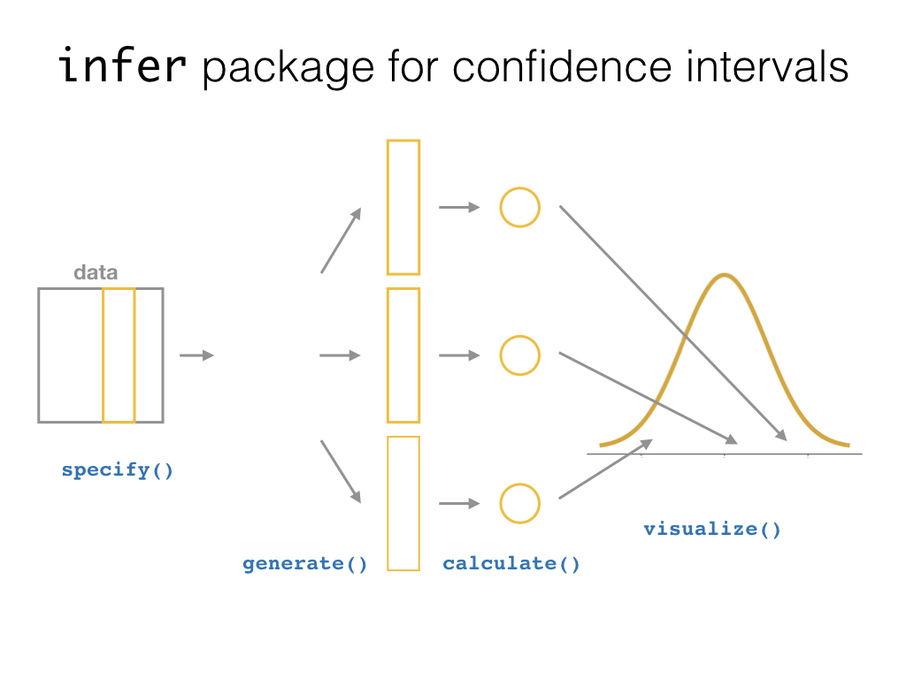

# Confidence Intervals {#ci}
    
```{r setup_ci, include=FALSE, purl=FALSE}
chap <- 9
lc <- 0
rq <- 0
# **`r paste0("(LC", chap, ".", (lc <- lc + 1), ")")`**
# **`r paste0("(RQ", chap, ".", (rq <- rq + 1), ")")`**
knitr::opts_chunk$set(
  tidy = FALSE, 
  out.width = '\\textwidth', 
  fig.height = 4,
  warning = FALSE
  )

# This bit of code is a bug fix on asis blocks, which we use to show/not show LC
# solutions, which are written like markdown text. In theory, it shouldn't be
# necessary for knitr versions <=1.11.6, but I've found I still need to for
# everything to knit properly in asis blocks. More info here: 
# https://stackoverflow.com/questions/32944715/conditionally-display-block-of-markdown-text-using-knitr
library(knitr)
knit_engines$set(asis = function(options) {
  if (options$echo && options$eval) knit_child(text = options$code)
})

# This controls which LC solutions to show. Options for solutions_shown: "ALL"
# (to show all solutions), or subsets of c('3-1', '3-2','3-3'), including the
# null vector c('') to show no solutions.
solutions_shown <- c("")
show_solutions <- function(section){
  return(solutions_shown == "ALL" | section %in% solutions_shown)
  }
```


```{block, type='learncheck', purl=FALSE}
**Note: This chapter is still under construction. If you would like to contribute, please check us out on GitHub at <https://github.com/moderndive/moderndive_book>.**

**Please check out our sneak peak of `infer` below in the meanwhile. For more details on `infer` visit <https://infer.netlify.com/>**.

<center>

</center>
```


### Needed packages {-}

Let's load all the packages needed for this chapter (this assumes you've already installed them). If needed, read Section \@ref(packages) for information on how to install and load R packages.

```{r message=FALSE, warning=FALSE}
library(dplyr)
library(ggplot2)
library(moderndive)
# For loading CSV files:
library(readr)
```

```{r message=FALSE, warning=FALSE, echo=FALSE}
# Packages needed internally, but not in text.
library(knitr)
```


## Sneak peak of `infer`

<center>

</center>


* **Question**: Of all the cars in the `mtcars` dataset, do automatic cars get better gas mileage than manual cars?
* **Approach**: 95% confidence interval for difference in means.

```{r, message=FALSE, warning=FALSE}
library(dplyr)
library(ggplot2)
library(infer)

# Clean data
mtcars <- mtcars %>%
  as_tibble() %>% 
  mutate(am = factor(am))

# Simulate sampling distribution of two-sample difference in means:
sampling_distribution <- mtcars %>%
  specify(mpg ~ am) %>%
  generate(reps = 1000, type = "bootstrap") %>%
  calculate(stat = "diff in means", order = c("1", "0")) 

# Compute 95% confidence interval:
conf_int <- sampling_distribution %>% 
  pull(stat) %>% 
  quantile(probs = c(0.025, 0.975))

# Visualize:
plot <- sampling_distribution %>% 
  visualize()
plot +
  geom_vline(xintercept = conf_int, col = "red", size = 1)
```


## Confidence intervals for proportion $p$

Recall our sampling exercise from Chapter \@ref(sampling) where we tried to estimate the population proportion $p$ of the $N=2400$ balls in the `bowl` that were red using samples of size $n=50$. We did this two ways:

1. Via 33 tactile samples
1. Via 1000 virtual samples

```{r, eval=TRUE, message=FALSE, warning=FALSE}
library(readr)
tactile_prop_red <- read_csv("https://rudeboybert.github.io/STAT135/static/sampling_red_balls.csv")
```


### Constructing a confidence interval

To construct a confidence interval for $p$ the unknown true population proportion we

1. Collect a sample of size $n$
1. Compute $\widehat{p}$
1. Compute the standard error $\text{SE} = \sqrt{\frac{\widehat{p}(1-\widehat{p})}{n}}$
1. Compute the margin of error $\text{MoE} = 1.96 \times \text{SE} =  1.96 \times \sqrt{\frac{\widehat{p}(1-\widehat{p})}{n}}$
1. Compute both end points of the confidence interval:
    + `conf_low`: $\widehat{p} - \text{MoE} = \widehat{p} - 1.96\times\text{SE} = \widehat{p} - 1.96\times\sqrt{\frac{\widehat{p}(1-\widehat{p})}{n}}$
    + `conf_high`: $\widehat{p} + \text{MoE} = \widehat{p} + 1.96\times\text{SE} = \widehat{p} + 1.96\times\sqrt{\frac{\widehat{p}(1-\widehat{p})}{n}}$
1. Alternatively, you can succinctly summarize a 95% confidence interval for $p$ using the $\pm$ symbol:

$$
\widehat{p} \pm \text{MoE} = \widehat{p} \pm 1.96 \times \text{SE} = \widehat{p} \pm 1.96 \times \sqrt{\frac{\widehat{p}(1-\widehat{p})}{n}}
$$


### Confidence intervals based on 33 tactile samples

Let's do that for 33 samples of size $n=50$ saved in `tactile_prop_red` by adding/modifying new columns:

1. Rename `prop_red` to `p_hat`, the official name of the sample proportion
1. Make explicit the sample size `n` of $n=50$
1. the standard error `SE`
2. the margin of error `MoE`
3. the left endpoint of the confidence interval `conf_low`
4. the right endpoint of the confidence interval `conf_high`

```{r, eval=FALSE, message=FALSE, warning=FALSE}
conf_ints <- tactile_prop_red %>% 
  rename(p_hat = prop_red) %>% 
  mutate(
    n = 50,
    SE = sqrt(p_hat*(1-p_hat)/n),
    MoE = 1.96 * SE,
    conf_low = p_hat - MoE,
    conf_high = p_hat + MoE
  )
conf_ints
```
```{r, echo=FALSE, message=FALSE, warning=FALSE}
conf_ints <- tactile_prop_red %>% 
  rename(p_hat = prop_red) %>% 
  select(-replicate) %>% 
  mutate(
    n = 50, 
    SE = sqrt(p_hat*(1-p_hat)/n),
    MoE = 1.96*SE,
    conf_low = p_hat - MoE,
    conf_high = p_hat + MoE,
    y = 1:n()
  )
conf_ints %>% 
  select(-y) %>% 
  kable(
    digits = 3,
    caption = "33 confidence intervals based on 33 tactile samples of size n=50", 
    booktabs = TRUE
  )
```

Let's plot:

1. These 33 confidence intervals for $p$: from `conf_low` to `conf_high`
1. The true population proportion $p = \frac{900}{2400} = 0.375$ with a red vertical line

```{r tactile-conf-int, echo=FALSE, message=FALSE, warning=FALSE, fig.cap= "33 confidence intervals based on 33 tactile samples of size n=50", fig.height=6}
groups <- conf_ints$group
conf_ints %>% 
    mutate(
      p = 900/2400,
      captured = conf_low <= p & p <= conf_high
    ) %>% 
    ggplot() +
    geom_point(aes(x=p_hat, y=y, col=captured)) +
    geom_vline(xintercept=900/2400, col="red") +
  geom_segment(aes(y=y, yend=y, x=conf_low, xend=conf_high, col=captured)) +
  scale_y_continuous(breaks=1:33, labels=groups) +
  labs(
    x = expression("Proportion red"),
    y = "",
    title=expression(paste("95% confidence intervals for ", p, sep=""))
  ) +
  scale_color_manual(values=c("blue", "orange")) 
```

We see that:

* In 31 cases, the confidence intervals "capture" the true $p = \frac{900}{2400} = 0.375$
* In 2 cases, the confidence intervals do not "capture" the true $p = \frac{900}{2400} = 0.375$

### Confidence intervals based on 100 virtual samples

Let's say however, we repeated the above 100 times, not tactilely, but virtually. What do I mean? Do this 100 times:

1. Collect a sample of size $n = 50$ as we did in Chapter \@ref(sampling)
1. Compute $\widehat{p}$: the sample proportion red of these $n=50$ balls
1. Compute the standard error $\text{SE} = \sqrt{\frac{\widehat{p}(1-\widehat{p})}{n}}$
1. Compute the margin of error $\text{MoE} = 1.96 \times \text{SE} =  1.96 \times \sqrt{\frac{\widehat{p}(1-\widehat{p})}{n}}$
1. Compute both end points of the confidence interval:
    + `conf_low`: $\widehat{p} - \text{MoE} = \widehat{p} - 1.96\times\text{SE} = \widehat{p} - 1.96\times\sqrt{\frac{\widehat{p}(1-\widehat{p})}{n}}$
    + `conf_high`: $\widehat{p} + \text{MoE} = \widehat{p} + 1.96\times\text{SE} = \widehat{p} +1.96\times\sqrt{\frac{\widehat{p}(1-\widehat{p})}{n}}$

Run the following three steps, being sure to `View()` the resulting data frame after each step so you can convince yourself of what's going on:

```{r}
# First: Take 100 virtual samples of n=50 balls
virtual_samples <- bowl %>% 
  rep_sample_n(size = 50, reps = 100)

# Second: For each virtual sample compute the proportion red
virtual_prop_red <- virtual_samples %>% 
  group_by(replicate) %>% 
  summarize(red = sum(color == "red")) %>% 
  mutate(prop_red = red / 50)

# Third: Compute the 95% confidence interval as above
virtual_prop_red <- virtual_prop_red %>% 
  rename(p_hat = prop_red) %>% 
  mutate(
    n = 50,
    SE = sqrt(p_hat*(1-p_hat)/n),
    MoE = 1.96 * SE,
    conf_low = p_hat - MoE,
    conf_high = p_hat + MoE
  )
```

Here are the results:

```{r virtual-conf-int, echo=FALSE, message=FALSE, warning=FALSE, fig.height=6, fig.cap="100 confidence intervals based on 100 virtual samples of size n=50"}
set.seed(79)

virtual_samples <- bowl %>% 
  rep_sample_n(size = 50, reps = 100)

# Second: For each virtual sample compute the proportion red
virtual_prop_red <- virtual_samples %>% 
  group_by(replicate) %>% 
  summarize(red = sum(color == "red")) %>% 
  mutate(prop_red = red / 50)

# Third: Compute the 95% confidence interval as above
virtual_prop_red <- virtual_prop_red %>% 
  rename(p_hat = prop_red) %>% 
  mutate(
    n = 50,
    SE = sqrt(p_hat*(1-p_hat)/n),
    MoE = 1.96 * SE,
    conf_low = p_hat - MoE,
    conf_high = p_hat + MoE
  ) %>% 
  mutate(
    y = 1:n(),
    p = 900/2400,
    captured = conf_low <= p & p <= conf_high
  )

ggplot(virtual_prop_red) +
  geom_point(aes(x=p_hat, y=y, col=captured)) +
  geom_segment(aes(y=y, yend=y, x=conf_low, xend=conf_high, col=captured)) +
  labs(
    x = expression("Proportion red"),
    y = "Replicate ID",
    title=expression(paste("95% confidence intervals for ", p, sep=""))
  ) +
  scale_color_manual(values=c("blue", "orange")) + 
  geom_vline(xintercept=900/2400, col="red") 
```

We see that of our 100 confidence intervals based on samples of size $n=50$, 96 of them captured the true $p = \frac{900}{2400}$, whereas 4 of them missed. As we create more and more confidence intervals based on more and more samples, about 95% of these intervals will capture. In other words our procedure is "95% reliable."


## Under construction...

The content here will be deprecated with a shift to using the `infer` package in the months to come.

**Definition: Confidence Interval**

A *confidence interval* gives a range of plausible values for a parameter.  It depends on a specified _confidence level_ with higher confidence levels corresponding to wider confidence intervals and lower confidence levels corresponding to narrower confidence intervals.  Common confidence levels include 90%, 95%, and 99%.

Usually we don't just begin chapters with a definition, but *confidence intervals* are simple to define and play an important role in the sciences and any field that uses data.  You can think of a confidence interval as playing the role of a net when fishing.  Instead of just trying to catch a fish with a single spear (estimating an unknown parameter by using a single point estimate/statistic), we can use a net to try to provide a range of possible locations for the fish (use a range of possible values based around our statistic to make a plausible guess as to the location of the parameter).

### Needed packages {-}

Let's load all the packages needed for this chapter (this assumes you've already installed them). If needed, read Section \@ref(packages) for information on how to install and load R packages.

```{r message=FALSE, warning=FALSE}
library(dplyr)
library(ggplot2)
library(infer)
library(mosaic)
library(knitr)
library(ggplot2movies)
```

```{r message=FALSE, warning=FALSE, echo=FALSE}
# Packages needed internally, but not in text.
```


<!--
There is only one CI 
  - Still need to build a diagram
-->


## Bootstrapping

Just as we did in Chapter \@ref(hypo) with the Lady Tasting Tea when making hypotheses about a population total with which we would like to test which one is more plausible, we can also use computation to infer conclusions about a population quantitative statistic such as the mean.  In this case, we will focus on constructing confidence intervals to produce plausible values for a population mean.  (We can do a similar analysis for a population median or other summary measure as well.)

Traditionally, the way to construct confidence intervals for a mean is to assume a normal distribution for the population or to invoke the Central Limit Theorem and get, what often appears to be magic, results.  (This is similar to what was done in Section \@ref(theory-hypo).)  These methods are often not intuitive, especially for those that lack a strong mathematical background.  They also come with their fair share of assumptions and often turn Statistics, a field that is full of tons of useful applications to many different fields and disciplines, into a robotic procedural-based topic.  It doesn't have to be that way!

In this section, we will introduce the concept of **bootstrapping**.  It will be a useful tool that will allow us to estimate the variability of our statistic from sample to sample.  One neat feature of bootstrapping is that it enables us to approximate the sampling distribution and estimate the distribution's standard deviation using ONLY the information in the one selected (original) sample.  It sounds just as plagued with the magical type qualities of traditional theory-based inference on initial glance but we will see that it provides an intuitive and useful way to make inferences, especially when the samples are of medium to large size.  

To introduce the concept of bootstrapping, we again will use the `movies` dataset in the `ggplot2movies` data frame.  Recall that you can also glance at this data frame using the `View` function and look at the help documentation for `movies` using the `?` function.  We will explore many other features of this dataset in the chapters to come, but here we will be focusing on the `rating` variable corresponding to the average IMDB user rating.

You may notice that this dataset is quite large:  `r format(nrow(movies), big.mark = ",")` movies have data collected about them here.  This will correspond to our population of ALL movies.  Remember from Chapter \@ref(sampling) that our population is rarely known.  We use this dataset as our population here to show you the power of bootstrapping in estimating population parameters.  We'll see how **confidence intervals** built using the bootstrap distribution perform at including our population parameter of interest.  Here we can actually calculate these values since our population is known, but remember that in general this isn't the case.

Let's take a look at what the distribution of our population `ratings` looks like.  We'll see that we will use the distribution of our sample(s) as an estimate of this population histogram.

```{r fig.cap="Population ratings histogram"}
movies %>% ggplot(aes(x = rating)) +
  geom_histogram(color = "white", bins = 20)
```


```{block lc7-3, type='learncheck'}
**_Learning check_**
```

**`r paste0("(LC", chap, ".", (lc <- lc + 1), ")")`** Why was a histogram chosen as the plot to make for the `rating` variable above?

**`r paste0("(LC", chap, ".", (lc <- lc + 1), ")")`** What does the shape of the `rating` histogram tell us about how IMDB users rate movies?  What stands out about the plot?

```{block, type='learncheck', purl=FALSE}
```

It's important to think about what our goal is here.  We would like to produce a confidence interval for the population mean `rating`.  We will have to pretend for a moment that we don't have all `r format(nrow(movies), big.mark = ",")` movies.  Let's say that we only have a random sample of 50 movies from this dataset instead.  In order to get a random sample, we can use the `resample` function in the `mosaic` package with `replace = FALSE`.  We could also use the `sample_n` function from `dplyr`.

```{r}
set.seed(2017)
movies_sample <- movies %>% 
  sample_n(50)
```

The `sample_n` function has filtered the data frame `movies` "at random" to choose only 50 rows from the larger `movies` data frame.  We store information on these 50 movies in the `movies_sample` data frame.

Let's now explore what the `rating` variable looks like for these 50 movies:

```{r fig.cap="Sample ratings histogram"}
ggplot(data = movies_sample, aes(x = rating)) +
  geom_histogram(color = "white", bins = 20)
```

Remember that we can think of this histogram as an estimate of our population distribution histogram that we saw above.  We are interested in the population mean rating and trying to find a range of plausible values for that value.  A good start in guessing the population mean is to use the mean of our sample `rating` from the `movies_sample` data:

```{r}
(movies_sample_mean <- movies_sample %>% 
   summarize(mean = mean(rating)))
```

Note the use of the `( )` at the beginning and the end of this creation of the `movies_sample_mean` object.  If you'd like to print out your newly created object, you can enclose it in the parentheses as we have here.

This value of `r movies_sample_mean` is just one guess at the population mean. The idea behind _bootstrapping_ is to sample **with replacement** from the original sample to create new **resamples** of the same size as our original sample.

Returning to our example, let's investigate what one such resample of the `movies_sample` dataset accomplishes.  We can create one resample/bootstrap sample by using the `resample` function in the `mosaic` package.  

```{r}
boot1 <- resample(movies_sample) %>%
  arrange(orig.id)
```

The important thing to note here is the original row numbers from the `movies_sample` data frame in the far right column called `orig.ids`.  Since we are sampling with replacement, there is a strong likelihood that some of the 50 observational units are going to be selected again.

You may be asking yourself what does this mean and how does this lead us to creating a distribution for the sample mean.  Recall that the original sample mean of our data was calculated using the `summarize` function above.


```{block lc6-3, type='learncheck', purl=FALSE}
**_Learning check_**
```

**`r paste0("(LC", chap, ".", (lc <- lc + 1), ")")`** What happens if we change the seed to our pseudo-random generation?  Try it above when we used `resample` to describe the resulting `movies_sample`.

**`r paste0("(LC", chap, ".", (lc <- lc + 1), ")")`** Why is sampling at random important from the `movies` data frame?  Why don't we just pick `Action` movies and do bootstrapping with this `Action` movies subset?

**`r paste0("(LC", chap, ".", (lc <- lc + 1), ")")`** What was the purpose of assuming we didn't have access to the full `movies` dataset here?

```{block, type='learncheck', purl=FALSE}
```

Before we had a calculated mean in our original sample of `r movies_sample_mean`.  Let's calculate the mean of `ratings` in our
bootstrapped sample:

```{r}
(movies_boot1_mean <- boot1 %>% summarize(mean = mean(rating)))
```

More than likely the calculated bootstrap sample mean is different than the original sample mean.  This is what was meant earlier by the sample means having some variability.  What we are trying to do is replicate many different samples being taken from a larger population.  Our best guess at what the population looks like is multiple copies of the sample we collected.  We then can sample from that larger "created" population by generating bootstrap samples.  

Similar to what we did in the previous section, we can repeat this process using the `do` function followed by an asterisk.  Let's look at 10 different bootstrap means for `ratings` from `movies_sample`.  Note the use of the `resample` function here.

```{r}
do(10) * 
  (resample(movies_sample) %>% 
     summarize(mean = mean(rating)))
```

You should see some variability begin to tease its way out here.  Many of the simulated means will be close to our original sample mean but many will stray pretty far away.  This occurs because outliers may have been selected a couple of times in the resampling or small values were selected more than larger.  There are myriad reasons why this might be the case.

So what's the next step now?  Just as we repeated the repetitions thousands of times with the "Lady Tasting Tea" example, we can do a similar thing here:

```{r, include=FALSE}
if(!file.exists("rds/trials.rds")){
  trials <- do(5000) * summarize(resample(movies_sample), mean = mean(rating))
  saveRDS(object = trials, "rds/trials.rds")
} else {
  trials <- readRDS("rds/trials.rds")
}
```
```{r, eval=FALSE}
trials <- do(5000) * summarize(resample(movies_sample), mean = mean(rating))
```

```{r, fig.cap="Bootstrapped means histogram"}
ggplot(data = trials, mapping = aes(x = mean)) +
  geom_histogram(bins = 30, color = "white")
```

The shape of this resulting distribution may look familiar to you.  It resembles the well-known normal (bell-shaped) curve.  At this point, we can easily calculate a confidence interval.  In fact, we have a couple different options.  We will first use the percentiles of the distribution we just created to isolate the middle 95% of values.  This will correspond to our 95% confidence interval for the population mean `rating`, denoted by $\mu$.

```{r}
(ciq_mean_rating <- confint(trials, level = 0.95, method = "quantile"))
```

It's always important at this point to interpret the results of this confidence interval calculation.  In this context, we can say something like the following:

> Based on the sample data and bootstrapping techniques, we can be 95% confident that the true mean rating of **ALL** IMDB ratings is between `r ciq_mean_rating$lower` and `r ciq_mean_rating$upper`.

This statement may seem a little confusing to you.  Another way to think about this is that this confidence interval was constructed using the sample data by a procedure that is **95% reliable** in that of 100 generated confidence intervals based on 100 different random samples, we expect on average that 95 of them will capture the true unknown parameter. This also means that we will get invalid results 5% of the time.  Just as we had a trade-off with $\alpha$ and $\beta$ with hypothesis tests, we have a similar trade-off here with setting the confidence level.

To further reiterate this point, the graphic below from @isrs2014 shows us that if we repeated a confidence interval process 25 times with 25 different samples, we would expect about 95% of them to actually contain the population parameter of interest.  This parameter is marked with a dotted vertical line.  We can see that only one confidence interval does not overlap with this value.  (The one marked in red.)  Therefore 24 in 25 (96%), which is quite close to our 95% reliability, do include the population parameter.

```{r ci-coverage, echo=FALSE, fig.cap="Confidence interval coverage plot from OpenIntro", purl=FALSE}
knitr::include_graphics("images/cis.png")
```

Remember that we are pretending like we don't know what the mean IMDB rating for ALL movies is.  Our population here is all of the movies listed in the `movies` data frame from `ggplot2movies`.  So does our bootstrapped confidence interval here contain the actual mean value?

```{r}
movies %>% summarize(mean_rating = mean(rating))
```

We see here that the population mean does fall in our range of plausible values generated from the bootstrapped samples.

We can also get an idea of how the theory-based inference techniques would have approximated this confidence interval by using the formula $$\bar{x} \pm (2 * SE),$$ where $\bar{x}$ is our original sample mean and $SE$ stands for **standard error** and corresponds to the standard deviation of the bootstrap distribution.  The value of 2 here corresponds to it being a 95% confidence interval.  (95% of the values in a normal distribution fall within 2 standard deviations of the mean.)  This formula assumes that the bootstrap distribution is symmetric and bell-shaped.  This is often the case with bootstrap distributions, especially those in which the original distribution of the sample is not highly skewed.

**Definition: standard error**

The *standard error* is the standard deviation of the sampling distribution.  The sampling distribution may be approximated by the bootstrap distribution or the null distribution depending on the context.  Traditional theory-based methodologies for inference also have formulas for standard errors, assuming some conditions are met.

To compute this type of confidence interval, we only need to make a slight modification to the `confint` function seen above.  (The expression after the $\pm$ sign is known as the **margin of error**.)

```{r warning=FALSE, message=FALSE}
(cise_mean_rating <- confint(trials, level = 0.95, method = "stderr"))
```

> Based on the sample data and bootstrapping techniques, we can be 95% confident that the true mean rating of ALL IMDB ratings is between `r cise_mean_rating$lower` and `r cise_mean_rating$upper`.


```{block lc7-4, type='learncheck', purl=FALSE}
**_Learning check_**
```

**`r paste0("(LC", chap, ".", (lc <- lc + 1), ")")`** Reproduce the bootstrapping above using a sample of size 50 instead of 25.  What changes do you see?

**`r paste0("(LC", chap, ".", (lc <- lc + 1), ")")`** Reproduce the bootstrapping above using a sample of size 5 instead of 25.  What changes do you see?

**`r paste0("(LC", chap, ".", (lc <- lc + 1), ")")`** How does the sample size affect the analysis above?

**`r paste0("(LC", chap, ".", (lc <- lc + 1), ")")`** Why must bootstrap samples be the same size as the original sample?

```{block, type='learncheck', purl=FALSE}
```

### Review of bootstrapping

We can summarize the process to generate a bootstrap distribution here in a series of steps that clearly identify the terminology we will use [@lock2012].

- Generate _bootstrap samples_ by sampling with replacement from the original sample, using the same sample size.
- Compute the statistic of interest, called a _bootstrap statistic_, for each of the bootstrap samples.
- Collect the statistics for many bootstrap samples to create a _bootstrap distribution_.

Visually, we can represent this process in the following diagram.

```{r bootstrapimg, echo=FALSE, fig.cap="Bootstrapping diagram from Lock5 textbook", purl=FALSE}
knitr::include_graphics("images/bootstrap.png")
```


## Relation to hypothesis testing

Recall that we found a statistically significant difference in the sample mean of romance movie ratings compared to the sample mean of action movie ratings.  We concluded Chapter \@ref(hypo) by attempting to understand just how much greater we could expect the _population_ mean romance movie rating to be compared to the _population_ mean action movie rating.  In order to do so, we will calculate a confidence interval for the difference $\mu_r - \mu_a$.  We'll then go back to our population parameter values and see if our confidence interval contains our parameter value.

We could use bootstrapping in a way similar to that done above, except now on a difference in sample means, to create a distribution and then use the `confint` function with the option of `quantile` to determine a confidence interval for the plausible values of the difference in population means.  This is an excellent programming activity and the reader is urged to try to do so.

Recall what the randomization/null distribution looked like for our simulated shuffled sample means:

**Note all this code was moved over from hypothesis testing**

```{r message=FALSE, warning=FALSE}
(movies_trimmed <- movies %>% select(title, year, rating, Action, Romance))
```
```{r}
movies_trimmed <- movies_trimmed %>%
  filter(!(Action == 1 & Romance == 1))
```
```{r}
movies_trimmed <- movies_trimmed %>%
  mutate(genre = ifelse(Action == 1, "Action",
                        ifelse(Romance == 1, "Romance",
                               "Neither"))) %>%
  filter(genre != "Neither") %>%
  select(-Action, -Romance)
```
```{r}
set.seed(2017)
movies_genre_sample <- movies_trimmed %>% 
  group_by(genre) %>%
  sample_n(34) %>% 
  ungroup()
```
```{r}
mean_ratings <- movies_genre_sample %>% 
  group_by(genre) %>%
  summarize(mean = mean(rating))
obs_diff <- diff(mean_ratings$mean)
```
```{r message=FALSE, warning=FALSE}
shuffled_ratings <- #movies_trimmed %>%
  movies_genre_sample %>% 
     mutate(genre = shuffle(genre)) %>% 
     group_by(genre) %>%
     summarize(mean = mean(rating))
diff(shuffled_ratings$mean)
```
```{r include=FALSE}
set.seed(2017)
if(!file.exists("rds/many_shuffles.rds")){
  many_shuffles <- do(5000) * 
    (movies_genre_sample %>% 
     mutate(genre = shuffle(genre)) %>% 
      group_by(genre) %>%
      summarize(mean = mean(rating))
    )
   saveRDS(object = many_shuffles, "rds/many_shuffles.rds")
} else {
   many_shuffles <- readRDS("rds/many_shuffles.rds")
}
```
```{r eval=FALSE}
set.seed(2017)
many_shuffles <- do(5000) * 
  (movies_genre_sample %>% 
     mutate(genre = shuffle(genre)) %>% 
     group_by(genre) %>%
     summarize(mean = mean(rating))
   )
```
```{r}
rand_distn <- many_shuffles %>%
  group_by(.index) %>%
  summarize(diffmean = diff(mean))
head(rand_distn, 10)
```


```{r fig.cap="Simulated shuffled sample means histogram"}
ggplot(data = rand_distn, mapping = aes(x = diffmean)) +
  geom_histogram(color = "white", bins = 20)
```

With this null distribution being quite symmetric and bell-shaped, the standard error method introduced above likely provides a good estimate of a range of plausible values for $\mu_r - \mu_a$.  Another nice option here is that we can use the standard deviation of the null/randomization distribution we just found with our hypothesis test.

```{r}
(std_err <- rand_distn %>% summarize(se = sd(diffmean)))
```

We can use the general formula of $statistic \pm (2 * SE)$ for a confidence interval to obtain the following result for plausible values of the difference in population means at the 95% level.

```{r}
(lower <- obs_diff - (2 * std_err))
(upper <- obs_diff + (2 * std_err))
```

We can, therefore, say that we are 95% confident that the population mean rating for romance movies is between `r round(lower, 3)` and `r round(upper, 3)` points higher than for that of action movies.

The important thing to check here is whether 0 is contained in the confidence interval.  If it is, it is plausible that the difference in the two population means between the two groups is 0. This means that the null hypothesis is plausible.  The results of the hypothesis test and the confidence interval should match as they do here.  We rejected the null hypothesis with hypothesis testing and we have evidence here that the mean rating for romance movies is higher than for action movies.


## Effect size

The phrase **effect size** has been thrown around recently as an alternative to $p$-values.  In combination with the confidence interval, it can be often more valuable than just looking at the results of a hypothesis test.  It depends on the scientific discipline exactly what is meant by "effect size" but, in general, it refers to _the magnitude of the difference between group measurements_.  For our two sample problem involving movies, it is the observed difference in sample means `obs_diff`.  

It's worthy of mention here that confidence intervals are always centered at the observed statistic.  In other words, if you are looking at a confidence interval and someone asks you what the "effect size" is you can simply find the midpoint of the stated confidence interval.


```{block lc8-1, type='learncheck', purl=FALSE}
**_Learning check_**
```

**`r paste0("(LC", chap, ".", (lc <- lc + 1), ")")`** Check to see whether the difference in population mean ratings for the two genres falls in the confidence interval we found here.  Are we guaranteed that it will fall in the range of plausible values?

**`r paste0("(LC", chap, ".", (lc <- lc + 1), ")")`** Why do you think many scientific fields are shifting to preferring inclusion of confidence intervals in articles over just $p$-values and hypothesis tests?

**`r paste0("(LC", chap, ".", (lc <- lc + 1), ")")`**  Why is 95% related to a value of 2 in the margin of error?  What would approximate values be for 90% and for 99%?

**`r paste0("(LC", chap, ".", (lc <- lc + 1), ")")`**  Why is a 95% confidence interval wider than a 90% confidence interval?  Explain by using a concrete example from everyday life about what is meant by "confidence."

**`r paste0("(LC", chap, ".", (lc <- lc + 1), ")")`**  How would confidence intervals correspond to one-sided hypothesis tests?

**`r paste0("(LC", chap, ".", (lc <- lc + 1), ")")`**  There is a relationship between the significance level and the confidence level.  What do you think it is?

**`r paste0("(LC", chap, ".", (lc <- lc + 1), ")")`** The moment
the phrase "standard error" is mentioned, there seems to be someone that
says "The standard error is $s$ divided by the square root of $n$."  This standard error formula is used in the theory-based procedure
for an inference on one mean.  But... does it always work?  For `samp1`, `samp2`, and `samp3` below, do the following: 

1. produce a bootstrap distribution based on the sample
2. calculate the standard deviation of the bootstrap distribution
3. compare this value of the standard error to what you obtain when
you calculate the standard deviation of the sample $s$ divided by $\sqrt{n}$.

```{r}
df1 <- data_frame(samp1 = rexp(50))
df2 <- data_frame(samp2 = rnorm(100))
df3 <- data_frame(samp3 = rbeta(20, 5, 5))
```

Describe how $s / \sqrt{n}$ does in approximating the standard error for these three samples and their corresponding bootstrap distributions.

```{block, type='learncheck', purl=FALSE}
```


## Conclusion  

### What's to come? 

This concludes the **Inference** unit of this book.  You should now have a thorough introduction into topics in both data science and statistics.  In the last chapter of the textbook, we'll summarize the purpose of this book as well as present an excellent example of what goes into making an effective story via data.

<!--
We will see in Chapter \@ref(regression) many of the same ideas we have seen with hypothesis testing and confidence intervals in the last two chapters.  Regression is frequently associated both correctly and incorrectly with statistics and data analysis, so you'll need to make sure you understand when it is appropriate and when it is not.
-->

### Script of R code

An R script file of all R code used in this chapter is available [here](https://moderndive.netlify.com/scripts/09-confidence-intervals.R).
  
