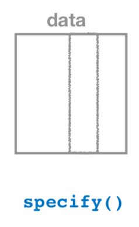

# Bootstrapping & Confidence Intervals {#confidence-intervals}
    
```{r setup_ci, include=FALSE, purl=FALSE}
chap <- 9
lc <- 0
rq <- 0
# **`r paste0("(LC", chap, ".", (lc <- lc + 1), ")")`**
# **`r paste0("(RQ", chap, ".", (rq <- rq + 1), ")")`**

knitr::opts_chunk$set(
  tidy = FALSE, 
  out.width = '\\textwidth', 
  fig.height = 4,
  warning = FALSE
  )

options(scipen = 99)#, digits = 3)
options(pillar.sigfig = 6)

# Set random number generator seed value for replicable pseudorandomness.
set.seed(76)
```

In Chapter \@ref(sampling), we studied sampling. We started with a "tactile" exercise where we wanted to know the proportion of balls in the sampling bowl in Figure \@ref(fig:sampling-exercise-1) that are red. While we could have performed an exhaustive count, this would have been a tedious process. So instead we used a shovel to extract a sample of 50 balls and used the resulting proportion that were red as an estimate of the proportion of the bowl's balls that are red. Furthermore, we made sure to mix the bowl's contents before every use of the shovel. Because of the randomness induced by the mixing, different uses of the shovel yielded different proportions red and hence different estimates of the proportion of the bowl's balls that are red. 

We then mimicked this "tactile" exercise with an equivalent "virtual" exercise performed on the computer. Using our computers' random number generator, we could very quickly mimic the above sampling procedure a large number of times. In Section \@ref(different-shovels), we quickly repeated the above sampling procedure 1000 times using three different "virtual" shovels with 25, 50, and 100 slots. We compared the variation of these three sets of 1000 estimates of the proportion of the bowl's balls that are red in the three histograms in Figure \@ref(fig:comparing-sampling-distributions-3). 

What we did there was construct *sampling distributions*. The motivation for taking 1000 repeated samples and visualizing the resulting estimates was to study how these estimates varied from one sample to another; in other words we wanted to study the effect of *sampling variation*. We quantified the variation of these estimates using their standard deviation which has a special name: the *standard error*. In particular, we saw that as the sample size increased from 25 to 50 to 100, the standard error decreased and thus the sampling distributions narrowed. In other words, larger sample sizes lead to more *precise* estimates. 

We also described the above sampling exercises using the terminology and mathematical notation related to sampling we introduced in Section \@ref(terminology-and-notation). Our *study population* was the large bowl with $N$ = 2400 balls, while the *population parameter*, the unknown quantity of interest, here was the population proportion $p$ of the bowl's balls that are red. Since performing a *census* would be very expensive in terms of time and energy, we instead extracted a *sample* of size $n$ = 50. The *point estimate*, also known as a *sample statistic*, used to estimate $p$ was the sample proportion $\widehat{p}$ of these 50 sampled balls that were red. Furthermore, since the sample was obtained at *random*, it can be considered as *unbiased* and *representative* of the population. Thus any results based on the sample could be *generalized* to the population. In other words, the sample proportion $\widehat{p}$ of the shovel's $n$ = 50 balls that were red was a "good guess" of the true population proportion $p$ of the bowl's $N$ = 2400 balls that are red. In other words, we used the sample to *infer* about the population.

However as described in Section \@ref(sampling-simulation), both the tactile and virtual sampling exercises are not what one would do in real life; they were merely *simulations* used to study the effects of sampling variation. In a real life situation, we would not take 1000 samples of size $n$, but rather take a *single* representative sample of as large a size as possible. Additionally, we knew what the true value of the population parameter here was: the true population proportion of the bowl's balls that are red. In a real life situation we will not know what this value is. Because if we did, then why would we take a sample to estimate it? 

An example of a realistic sampling situation would be a poll, like the one described in the [Obama poll](https://www.npr.org/sections/itsallpolitics/2013/12/04/248793753/poll-support-for-obama-among-young-americans-eroding) article you saw in Section \@ref(sampling-case-study). Pollsters did not know the true proportion of **all** young Americans who supported President Obama and thus took a single sample of size $n$ = 2089 young Americans to estimate the true unknown value.

So how does one study the effects of sampling variation when you only have a single sample to work with? There is no sample-to-sample variation is estimates when you only have one sample. One common method is known as *bootstrapping resampling*, which will be the focus of the earlier sections of this chapter. 

Furthermore, what if we would like not only a single estimate of the unknown population parameter, we would like a *range of highly plausible* values? Going back to the Obama poll article, it stated that the pollsters' estimate of the proportion of all young Americans who supported President Obama was 41%, but in addition it stated that the poll's "margin of error was plus or minus 2.1 percentage points." In other words this "plausible range" was [41% - 2.1%, 41% + 2.1%] = [37.9%, 43.1%]. This range of plausible values is known as a *confidence interval* and will be the focus of the later sections of this chapter. 


### Needed packages {-}

Let's load all the packages needed for this chapter (this assumes you've already installed them). Recall from our discussion in Section \@ref(tidyverse-package) that loading the `tidyverse` package by running `library(tidyverse)` loads the following commonly used data science packages all at once:

* `ggplot2` for data visualization
* `dplyr` for data wrangling
* `tidyr` for converting data to "tidy" format
* `readr` for importing spreadsheet data into R
* As well as the more advanced `purrr`, `tibble`, `stringr`, and `forcats` packages

If needed, read Section \@ref(packages) for information on how to install and load R packages. 

```{r message=FALSE, warning=FALSE}
library(tidyverse)
library(moderndive)
library(infer)
```

```{r message=FALSE, warning=FALSE, echo=FALSE}
# Packages needed internally, but not in the text
library(knitr)
library(kableExtra)
library(patchwork)
library(purrr)
# Ensure pennies_sample is loaded (might not be needed)
data("pennies_sample")
```


## Pennies activity {#resampling-tactile}

As we did in Chapter \@ref(sampling), we'll begin with a hands-on tactile activity.

### What is the average year on US pennies in 2019?

Try to imagine all pennies being used in the United States in 2019. That's a lot of pennies! Now say we're are interested in the average year of minting of *all* these pennies. One way to compute this value would be to gather up all pennies being used in the US, record the year, and compute the average. This would be near impossible! So instead, let's collect a sample of 50 pennies collected from a local bank in downtown Northampton, Massachusetts, the USA seen in Figure \@ref(fig:resampling-exercise-a).

```{r resampling-exercise-a, echo=FALSE, fig.show='hold', fig.cap="Collecting a sample of 50 US pennies from a local bank.", purl=FALSE, out.width = "40%"}
knitr::include_graphics(c("images/sampling/pennies/bank.jpg", "images/sampling/pennies/roll.jpg"))
```

An image of these 50 pennies can be seen in Figure \@ref(fig:resampling-exercise-b).

```{r resampling-exercise-b, echo=FALSE, fig.cap="50 US pennies.", purl=FALSE, out.width="100%"}
knitr::include_graphics("images/sampling/pennies/pennies_trim.jpg")
```

For each of the 50 pennies let's assign an "ID" label and mark the year of minting, starting in the top left and ending in the bottom right progressing row by row, as seen in Figure \@ref(fig:resampling-exercise-c).

```{r resampling-exercise-c, echo=FALSE, fig.cap="50 US pennies labelled.", fig.show='hold', purl=FALSE, out.width = "100%"}
knitr::include_graphics("images/sampling/pennies/deliverable/3.jpg")
```

The `moderndive` \index{moderndive!pennies\_sample} package contains this data on our 50 sampled pennies. Let's explore this sample data first:

```{r}
pennies_sample
```

The `pennies_sample` data frame has 50 rows corresponding to each penny with two variables. The first variable `ID` corresponds to the ID labels in Figure \@ref(fig:resampling-exercise-c) whereas the second variable `year` corresponds to the year of minting saved as an integer.

Based on these 50 sampled pennies, what can we say about *all* US pennies in 2019? Let's study some properties of our sample by performing an exploratory data analysis. Let's first visualize the distribution of the year of these 50 pennies using our data visualization tools from Chapter \@ref(viz). Since `year` is a numerical variable, we use a histogram in Figure \@ref(fig:pennies-sample-histogram).

```{r pennies-sample-histogram, fig.cap="Distribution of year on 50 US pennies."}
ggplot(pennies_sample, aes(x = year)) +
  geom_histogram(binwidth = 10, color = "white")
```

We observe a slightly left-skewed \index{skew} distribution since most values fall in between the 1980s through 2010s with only a few older than 1970. What is the average year for the 50 sampled pennies? Eyeballing the histogram it appears to be around 1990. Let's now compute this value exactly using our data wrangling tools from Chapter \@ref(wrangling).

```{r}
pennies_sample %>% 
  summarize(mean_year = mean(year))
```
```{r, echo=FALSE}
x_bar <- pennies_sample %>% 
  summarize(mean_year = mean(year))
```

Thus assuming `pennies_sample` is a representative sample from the population of all US pennies, a "good guess" of the average year of minting of all US pennies would be `r x_bar %>% pull(mean_year) %>% round(2)`, the average year of minting of our 50 sampled pennies. This should all start sounding similar to what we did previously in Chapter \@ref(sampling)!

In Chapter \@ref(sampling) our study population was the bowl of $N$ = 2400 balls. Our population parameter of interest was the population proportion of these balls that were red, denoted mathematically by $p$. In order to estimate $p$, we extracted a sample of 50 balls using the shovel and computed the relevant point estimate: the sample proportion of these 50 balls that were red, denoted mathematically by $\widehat{p}$.

Here our study population is $N$ = whatever the number of pennies are being used in the US, a value which we don't know and probably never will. The population parameter of interest is now the *population mean* year of all these pennies, a value denoted mathematically by the Greek letter $\mu$ pronounced "mu". In order to estimate $\mu$, we went to the bank and obtained a sample of 50 pennies and computed the relevant point estimate: the *sample mean* year of these 50 pennies, denoted mathematically by $\overline{x}$ pronounced "x-bar". An alternative and more intuitive notation for the sample mean is $\widehat{\mu}$. However this is unfortunately not as commonly used, so in this text, we'll always denote the sample mean as $\overline{x}$.

We summarize the correspondence between the sampling bowl exercise in Chapter \@ref(sampling) and our pennies exercise in Table \@ref(tab:table-ch8-b), which are the first two rows of the previously seen Table \@ref(tab:table-ch8) of the various sampling scenarios we'll cover in this text.

```{r table-ch8-b, echo=FALSE, message=FALSE}
# The following Google Doc is published to CSV and loaded below using read_csv() below:
# https://docs.google.com/spreadsheets/d/1QkOpnBGqOXGyJjwqx1T2O5G5D72wWGfWlPyufOgtkk4/edit#gid=0

if(!file.exists("rds/sampling_scenarios.rds")){
  sampling_scenarios <- "https://docs.google.com/spreadsheets/d/e/2PACX-1vRd6bBgNwM3z-AJ7o4gZOiPAdPfbTp_V15HVHRmOH5Fc9w62yaG-fEKtjNUD2wOSa5IJkrDMaEBjRnA/pub?gid=0&single=true&output=csv" %>% 
    read_csv(na = "")
    write_rds(table_ch3, "rds/sampling_scenarios.rds")
} else {
  sampling_scenarios <- read_rds("rds/sampling_scenarios.rds")
}

sampling_scenarios %>%  
  # Only first two scenarios
  filter(Scenario <= 2) %>% 
  kable(
    caption = "\\label{tab:table-ch8-b}Scenarios of sampling for inference", 
    booktabs = TRUE,
    escape = FALSE
  ) %>% 
  kable_styling(font_size = ifelse(knitr:::is_latex_output(), 10, 16),
                latex_options = c("HOLD_position")) %>%
  column_spec(1, width = "0.5in") %>% 
  column_spec(2, width = "0.7in") %>%
  column_spec(3, width = "1in") %>%
  column_spec(4, width = "1.1in") %>% 
  column_spec(5, width = "1in")
```

Going back to our 50 sampled pennies in Figure \@ref(fig:resampling-exercise-c), the point estimate of interest is the sample mean $\overline{x}$ of `r x_bar %>% pull(mean_year) %>% round(2)`. This quantity is an estimate of the population mean year of all US pennies $\mu$.

Recall that we also saw in Chapter \@ref(sampling) that such estimates are prone to sampling variation. For example, in this particular sample in Figure \@ref(fig:resampling-exercise-c), we observed three pennies with the year of 1999. If we obtained other samples of size 50 would we always observe exactly three pennies with the year of 1999? More than likely not. We might observe none, or one, or two, or maybe even all 50! The same can be said for the other 26 unique years that are represented in our sample of 50 pennies.

To study this sampling variation as we did in Chapter \@ref(sampling), we need more than one sample. In our case with pennies, how would we obtain another sample? We would go to the bank and get another roll of 50 pennies! However, in real-life sampling one doesn't obtain many samples as we did in Chapter \@ref(sampling); those were merely simulations. So what how can we study sample-to-sample variation when we have only a single sample as in our case?

Just as different uses of the shovel in the bowl led to the different sample proportions red, different samples of 50 pennies will lead to different sample mean years. However, how can we study the effect of sampling variation using only our *single sample* seen in Figure \@ref(fig:resampling-exercise-c)? We will do so using a technique known as "bootstrap resampling with replacement", which we now illustrate.

### Resampling once

**Step 1**: Let's print out identically-sized slips of paper representing the 50 pennies in Figure \@ref(fig:resampling-exercise-c).

```{r tactile-resampling-1, echo=FALSE, fig.cap="50 slips of paper representing 50 US pennies.", fig.show='hold', purl=FALSE, out.width="50%"}
knitr::include_graphics("images/sampling/pennies/tactile_simulation/1_paper_slips.png")
```

**Step 2**: Put the 50 small pieces of paper into a hat or tuque.

```{r tactile-resampling-2, echo=FALSE, fig.cap="Putting 50 slips of paper in a hat.", fig.show='hold', purl=FALSE, out.width = "50%"}
knitr::include_graphics("images/sampling/pennies/tactile_simulation/2_insert_in_hat.png")
```

**Step 3**: Mix the hat's contents and draw one slip of paper at random. Record the year somewhere.

```{r tactile-resampling-3, echo=FALSE, fig.cap="Drawing one slip of paper.", fig.show='hold', purl=FALSE, out.width = "50%"}
knitr::include_graphics("images/sampling/pennies/tactile_simulation/3_draw_at_random.png")
```

**Step 4**: Put the slip of paper back in the hat! In other words, replace it! 

```{r tactile-resampling-4, echo=FALSE, fig.cap="Replacing slip of paper.", fig.show='hold', purl=FALSE, out.width = "50%"}
knitr::include_graphics("images/sampling/pennies/tactile_simulation/4_put_it_back.png")
```

**Step 5**: Repeat Steps 3 and 4 49 more times, resulting in 50 recorded years.

What we just performed was a **resampling** \index{resampling} of the original sample of 50 pennies. We are not sampling 50 pennies from the population of all US pennies as we did in our trip to the bank. Instead, we are mimicking this act by "re"-sampling 50 pennies from our originally sampled 50 pennies. However, why did we replace our resampled slip of paper back into the hat in Step 4? Because if we left the slip of paper out of the hat each time we performed Step 4, we would obtain the same 50 pennies, in the end, each time! In other words, replacing the slips of paper induces variation.

Being more precise with our terminology, we just performed a **resampling with replacement** of the original sample of 50 pennies. Had we left the slip of paper out of the hat each time we performed Step 4, this would be "resampling without replacement".

Let's study our 50 resampled pennies via an exploratory data analysis. First, let's load the data into R by manually creating a data frame `pennies_resample` of our 50 resampled values. We'll do this using the `tibble()` command from the `dplyr` package. Note that the 50 values you obtained will almost certainly not be the same as ours.

```{r}
pennies_resample <- tibble(
  year = c(1976, 1962, 1976, 1983, 2017, 2015, 2015, 1962, 2016, 1976, 
           2006, 1997, 1988, 2015, 2015, 1988, 2016, 1978, 1979, 1997, 
           1974, 2013, 1978, 2015, 2008, 1982, 1986, 1979, 1981, 2004, 
           2000, 1995, 1999, 2006, 1979, 2015, 1979, 1998, 1981, 2015, 
           2000, 1999, 1988, 2017, 1992, 1997, 1990, 1988, 2006, 2000)
)
```

The 50 values of `year` in `pennies_resample` represent the resample of size 50 from the original sample of 50 pennies from the bank. We display the 50 resampled pennies in Figure \@ref(fig:resampling-exercise-d).

```{r resampling-exercise-d, echo=FALSE, fig.cap="50 resampled US pennies labelled.", fig.show='hold', purl=FALSE, out.width="100%"}
# Need this for ID column
if(!file.exists("rds/pennies_resample.rds")){
  pennies_resample <- pennies_sample %>% 
    rep_sample_n(size = 50, replace = TRUE, reps = 1) %>% 
    ungroup() %>% 
    select(-replicate)
  write_rds(pennies_resample, "rds/pennies_resample.rds")
} else {
  pennies_resample <- read_rds("rds/pennies_resample.rds")
}
knitr::include_graphics("images/sampling/pennies/deliverable/4.jpg")
```

Let's compare the distribution of the numerical variable `year` of our 50 resampled pennies with the distribution of the numerical variable `year` of our original sample of 50 pennies from the bank in Figure \@ref(fig:origandresample).

```{r eval=FALSE}
ggplot(pennies_resample, aes(x = year)) +
  geom_histogram(binwidth = 10, color = "white") +
  labs(title = "Resample of 50 pennies")
ggplot(pennies_sample, aes(x = year)) +
  geom_histogram(binwidth = 10, color = "white") +
  labs(title = "Original sample of 50 pennies")
```

(ref:compare-plots) Comparing `year` in the resample `pennies_resample` with the original sample `pennies_sample`.

```{r origandresample, echo=FALSE, fig.cap="(ref:compare-plots)", purl=FALSE}
p1 <- ggplot(pennies_resample, aes(x = year)) +
  geom_histogram(binwidth = 10, color = "white") +
  labs(title = "Resample of 50 pennies") +
  scale_x_continuous(limits = c(1960, 2020), breaks = seq(1960, 2020, 20)) #+ 
  scale_y_continuous(limits = c(0, 15), breaks = seq(0, 15, 5))
p2 <- ggplot(pennies_sample, aes(x = year)) +
  geom_histogram(binwidth = 10, color = "white") +
  labs(title = "Original sample of 50 pennies") +
  scale_x_continuous(limits = c(1960, 2020), breaks = seq(1960, 2020, 20)) #+ 
  scale_y_continuous(limits = c(0, 15), breaks = seq(0, 15, 5))
p1 + p2
```

Observe that while the general shape of the distribution of `year` is roughly similar, they are not identical. This is due to the variation induced by replacing the slips of paper each time we pull one out and recorded the year. 

Recall from the previous section that the sample mean of the original sample of 50 pennies from the bank was `r x_bar %>% pull(mean_year) %>% round(2)`. What about for the `year` variable in `pennies_resample`? Any guesses? Let's have `dplyr` help us out as before:

```{r}
pennies_resample %>% 
  summarize(mean_year = mean(year))
```
```{r, echo=FALSE}
resample_mean <- pennies_resample %>% 
  summarize(mean_year = mean(year))
```

We obtained a different mean year of `r resample_mean %>% pull(mean_year) %>% round(2)`. Again, this variation is induced by the "with replacement" from the "resampling with replacement" terminology we defined earlier. 

What if we repeated several times this resampling exercise many times? Would we obtain the same sample mean `year` value each time? In other words, would our guess at the mean year of all pennies in the US in 2019 be exactly `r resample_mean %>% pull(mean_year) %>% round(2)` every time? Just as we did in Chapter \@ref(sampling), let's perform this resampling activity with the help of 35 of our friends.


### Resampling 35 times {#student-resamples}

Each of our 35 friends will repeat the same 5 steps above:

1. Start with 50 identically-sized slips of paper representing the 50 pennies. 
1. Put the 50 small pieces of paper into a hat or tuque.
1. Mix the hat's contents and draw one slip of paper at random. Record the year somewhere.
1. Replace the slip of paper back in the hat! 
1. Repeat Steps 3 and 4 49 more times, resulting in 50 recorded years.

Since we had 35 of our friends perform this task, we ended up with 35 $\times$ 50 = 1750 values. We recorded these values in a [shared spreadsheet](https://docs.google.com/spreadsheets/d/1y3kOsU_wDrDd5eiJbEtLeHT9L5SvpZb_TrzwFBsouk0/) with 50 rows (plus a header row) and 35 columns; we display a snapshot of the first 10 rows and 5 columns in Figure \@ref(fig:tactile-resampling-5)

```{r tactile-resampling-5, echo=FALSE, fig.cap = "Snapshot of shared spreadsheet of resampled pennies.", fig.show='hold', purl=FALSE, out.width = "70%"}
knitr::include_graphics("images/sampling/pennies/tactile_simulation/5_shared_spreadsheet.png")
```

For your convenience, we've taken these 35 $\times$ 50 = 1750 values and saved them in `virtual_resamples`, a "tidy" data frame included in the `moderndive` package: 

```{r}
pennies_resamples
```

What did each of our 35 friends obtain as the mean year? `dplyr` to the rescue once more! After grouping the rows by `name`, we summarize each group of rows with their mean `year`:

```{r}
resampled_means <- pennies_resamples %>% 
  group_by(name) %>% 
  summarize(mean_year = mean(year))
resampled_means
```

Observe that `resampled_means` has 35 rows corresponding to the 35 resample means based the 35 resamples performed by our friends. Furthermore, observe the variation in the 35 values in the variable `mean_year`. This variation exists because by "resampling with replacement", our 35 friends obtained different resamples of 50 pennies, and thus obtained different resample mean year. 

Since the variable `mean_year` is numerical, let's visualize its distribution using a histogram in Figure \@ref(fig:tactile-resampling-6). Note that adding the argument `boundary = 1990` to `geom_histogram()` sets the binning structure of the histogram so that one of the boundaries between bins is at the year 1990 exactly. 

```{r tactile-resampling-6, echo=TRUE, fig.cap="Distribution of 35 sample means from 35 resamples.", purl=FALSE}
ggplot(resampled_means, aes(x = mean_year)) +
  geom_histogram(binwidth = 1, color = "white", boundary = 1990) +
  labs(x = "Resampled mean year")
```

Observe the following about the histogram in Figure \@ref(fig:tactile-resampling-6):

* The distribution looks roughly normal.
* We rarely observe sample mean years less than in 1992.
* On the other side of the distribution, we rarely observe sample mean years greater than in 2000.
* The most frequently occurring values occur between roughly 1992 and 1998.
* The distribution of these 35 sample means based on 35 resamples is roughly centered at 1995, which is the sample mean of `r x_bar %>% pull(mean_year) %>% round(2)` of the original sample of 50 pennies from the bank.


### What did we just do?

What we just demonstrated in this activity is the statistical procedure known as *bootstrap resampling with replacement* \index{bootstrap}. We used *resampling* to mimic the sampling variation we observe from sample-to-sample as we did in Chapter \@ref(sampling) on sampling, but this time using a *single* sample from the population.

In fact, the histogram of sample means from 35 resamples in Figure \@ref(fig:tactile-resampling-6) is called the *bootstrap distribution* \index{bootstrap!distribution} of the sample mean and it is an approximation of the *sampling distribution* of the same mean, a concept we introduced in Chapter \@ref(sampling). In Section \@ref(ci-conclusion) we'll show you that the *bootstrap distribution* is an approximation to the *sampling distribution*. Using this bootstrap distribution, we can study the effect of sampling variation on our estimates, in particular study the typical "error" of our estimates, known as the *standard error* \index{standard error}. 

In Section \@ref(resampling-simulation) we'll mimic our tactile resampling activity virtually on the computer. We can use a computer to do the resampling many more times than our 35 friends could possibly do. This will allow us to better understand the bootstrap distribution. In Section \@ref(ci-build-up) we'll explicitly articulate our goals for this chapter: understanding resampling variation, defining the statistical concept of a *confidence interval* by building on our pennies example, and discussing the interpretation of confidence intervals.

Following this framework on confidence intervals, we'll discuss the `dplyr` and `infer` package code needed to complete the process of *bootstrapping*, which is another name for this resampling approach that is most commonly found in developing confidence intervals. We've used one of the functions in the `infer` package already with `rep_sample_n()`, but there's a lot more to this package than just that. We'll introduce the tidy statistical inference framework that was the motivation for the `infer` package pipeline that will be the driving package throughout the rest of this book.

As we did in Chapter \@ref(sampling), we'll tie all these ideas together with a real-life case study in Section \@ref(case-study-two-prop-ci) involving data from an experiment about yawning from the US television show Mythbusters. The chapter concludes with a comparison of the sampling distribution and a bootstrap distribution using the balls data from Chapter \@ref(sampling) on sampling. 


## Computer simulation of resampling {#resampling-simulation}

Let's now mimic our tactile resampling activity virtually by using our computer.

### Virtually resampling once

First, let's perform the virtual analog of resampling once. Recall that the `pennies_sample` data frame included in the `moderndive` package contains the years of our original sample of 50 pennies from the bank. Furthermore, recall in Chapter \@ref(sampling) on sampling that we used the `rep_sample_n()` function as a virtual shovel to sample balls from our virtual bowl of `r nrow(bowl)` balls. 

```{r, eval=FALSE, purl=FALSE}
virtual_shovel <- bowl %>% 
  rep_sample_n(size = 50)
```

Let's combine these two elements to virtually mimic our resampling with replacement exercise involving the slips of paper representing our 50 pennies in Figure \@ref(fig:resampling-exercise-c):

```{r eval=FALSE}
virtual_resample <- pennies_sample %>% 
  rep_sample_n(size = 50, replace = TRUE)
```

Observe how we explicitly set the `replace` argument to `TRUE` in order to tell `rep_sample_n()` that we would like to sample pennies \index{sampling!with replacement} *with* replacement. Had we not set `replace = TRUE`, the function would've assumed the default value of `FALSE`. Additionally, since we didn't specify the number of replicates via the `reps` argument, the function assumes the default of one replicate `reps = 1`. Note also that the `size` argument is set to match the original sample size of 50 pennies. So what does `virtual_resample` look like?

```{r eval=FALSE}
View(virtual_resample)
```

We'll display only the first 10 out of 50 rows of `virtual_resample`'s contents in Table \@ref(tab:virtual-resample).

```{r virtual-resample, echo=FALSE}
virtual_resample <- pennies_sample %>% 
  rep_sample_n(size = 50, replace = TRUE, reps = 1)
virtual_resample %>% 
  slice(1:10) %>%
  knitr::kable(
    align = c("r", "r", "r"),
    digits = 3,
    caption = "First 10 resampled rows of 50 in virtual sample",
    booktabs = TRUE
  ) %>% 
  kable_styling(font_size = ifelse(knitr:::is_latex_output(), 10, 16),
                latex_options = c("HOLD_position"))
```

The `replicate` variable only takes on the value of 1 corresponding to us only having `reps = 1`, the `ID` variable indexes which of the 50 pennies from `pennies_sample` was resampled, and `year` denotes the year of minting. 

Let's compute the mean `year` in our virtual resample of size 50 using data wrangling functions included in the `dplyr` package:

```{r}
virtual_resample %>% 
  summarize(resample_mean = mean(year))
```

As when we did our tactile resampling, the resulting mean year is different than that mean year of our 50 originally sampled pennies of `r x_bar %>% pull(mean_year) %>% round(2)`.

<!-- 
Chester: Not sure if needed, but those trying to follow along may be mystified if we don't include this. 

Note that tibbles will try to print as pretty as possible which may result in numbers being rounded. In this chapter, we have set the default number of values to be printed to six in tibbles with `options(pillar.sigfig = 6)`.

Albert: I'm not sure if it's worth trouble to explain that command and why tidyverse opts for 3 sigfigs.
-->

### Virtually resampling 35 times

Let's now have 35 virtual friends perform our virtual resampling exercise. Using these results, we'll be able to study the variability in the sample means from 35 resamples of size 50. Let's first add a `reps = 35` argument to `rep_sample_n()` \index{infer!rep\_sample\_n()} to indicate we would like 35 replicates, or in other words, repeat the resampling with the replacement of 50 pennies 35 times.

```{r}
virtual_resamples <- pennies_sample %>% 
  rep_sample_n(size = 50, replace = TRUE, reps = 35)
virtual_resamples
```

The resulting `virtual_resamples` data frame has 35 $\times$ 50 = `r 35*50` rows corresponding to 35 resamples of 50 pennies. What did each of our 35 virtual friends obtain as the mean year? We'll use the same `dplyr` verbs as we did in the previous section, but computing the mean for each of our virtual friends separately by adding a `group_by(replicate)`:

```{r, eval=TRUE}
virtual_resampled_means <- virtual_resamples %>% 
  group_by(replicate) %>% 
  summarize(mean_year = mean(year))
virtual_resampled_means
```

Observe that `virtual_resampled_means` has 35 rows corresponding to the 35 resampled means and that the values of `mean_year` vary. Let's visualize the distribution of the numerical variable `mean_year` using a histogram in Figure \@ref(fig:tactile-resampling-7).

```{r tactile-resampling-7, echo=TRUE, fig.cap="Distribution of 35 sample means from 35 resamples.", purl=FALSE}
ggplot(virtual_resampled_means, aes(x = mean_year)) +
  geom_histogram(binwidth = 1, color = "white", boundary = 1990) +
  labs(x = "Resampled mean year")
```

To convince ourselves that our virtual resampling indeed mimics the resampling done by our 35 friends, let's compare the bootstrap distribution we just virtually constructed with the bootstrap distribution our 35 friends constructed via tactile resampling in the previous section.

```{r orig-and-resample-means, echo=FALSE, fig.cap="Comparing distributions of means from resamples.", purl=FALSE}
p3 <- ggplot(virtual_resampled_means, aes(x = mean_year)) +
  geom_histogram(binwidth = 1, color = "white", boundary = 1990) +
  labs(x = "Resampled mean year", title = "35 means of tactile resamples") +
  scale_x_continuous(breaks = seq(1990, 2000, 2))
p4 <- ggplot(resampled_means, aes(x = mean_year)) +
  geom_histogram(binwidth = 1, color = "white", boundary = 1990) +
  labs(x = "Resampled mean year", title = "35 means of virtual resamples") +
  scale_x_continuous(breaks = seq(1990, 2000, 2))
p3 + p4
```

Recall that in the "resampling with replacement" scenario we are illustrating here both the above histograms have a special name: the *bootstrap distribution of the sample mean*. Furthermore, they are an approximation to the *sampling distribution* of the sample mean, a concept you saw in Chapter \@ref(sampling) on sampling. These distributions allow us to study the effect of sampling variation on our estimates of the true population mean, in this case the true mean year for *all* US pennies. However, unlike in Chapter \@ref(sampling) where we simulated the act of taking multiple samples, something one would never do in practice, bootstrap distributions are constructed from a *single* sample, in this case the 50 original pennies from the bank. 

<!--
```{block, type='learncheck', purl=FALSE}
**_Learning check_**
```


**`paste0("(LC", chap, ".", (lc <- lc + 1), ")")`** Ask learners to compare the distributions since we did something similar in Chapter 8 and they should be well versed on this by now.


```{block, type='learncheck', purl=FALSE}
```
-->

### Virtually resampling 1000 times {#bootstrap-1000-replicates}

Remember that one of the goals of resampling with replacement is to construct the bootstrap distribution, which is an approximation of the sampling distribution of the point estimate of interest, here the sample mean year. However, the bootstrap distribution of in Figure \@ref(fig:tactile-resampling-7) is based only on 35 resamples and hence looks a little coarse. Let's increase the number of resamples to 1000 to better observe the shape and the variability from one resample to the next. 

```{r}
# Repeat resampling 1000 times
virtual_resamples <- pennies_sample %>% 
  rep_sample_n(size = 50, replace = TRUE, reps = 1000)

# Compute 1000 sample means
virtual_resampled_means <- virtual_resamples %>% 
  group_by(replicate) %>% 
  summarize(mean_year = mean(year))
```

However, in the interest of brevity, going forward let's combine the above two operations into a single chain of `%>%` pipe operators:

```{r}
virtual_resampled_means <- pennies_sample %>% 
  rep_sample_n(size = 50, replace = TRUE, reps = 1000) %>% 
  group_by(replicate) %>% 
  summarize(mean_year = mean(year))
virtual_resampled_means
```

Let's visualize the bootstrap distribution of these 1000 sample means from 1000 virtual resamples looks like in Figure \@ref(fig:one-thousand-sample-means):

```{r one-thousand-sample-means, echo=FALSE, message=FALSE, fig.cap="Bootstrap resampling distribution based on 1000 resamples."}
ggplot(virtual_resampled_means, aes(x = mean_year)) +
  geom_histogram(binwidth = 1, color = "white", boundary = 1990) +
  labs(x = "sample mean")
```

Note here the bell shape starting to become more apparent. We now have a general sense for the range of values that the sample mean may take on in these resamples from this histogram of the bootstrap distribution. Do you have a guess as to where this histogram is centered? With it being close to symmetric, either the mean or the median would serve as a good estimate for the center here. Let's compute the mean:

```{r eval=TRUE}
virtual_resampled_means %>% 
  summarize(mean_of_means = mean(mean_year))
```
```{r echo=FALSE}
mean_of_means <- virtual_resampled_means %>% 
  summarize(mean(mean_year)) %>% 
  pull()
```

The mean of the 1000 means from 1000 resamples is `r mean_of_means`. Note that this is quite close to the mean of our original sample of 50 pennies from the bank: `r x_bar %>% pull(mean_year) %>% round(2)`. This is the case since each of the 1000 resamples are based on the original sample of 50 pennies.


```{block, type='learncheck', purl=FALSE}
**_Learning check_**
```

**`r paste0("(LC", chap, ".", (lc <- lc + 1), ")")`** What is the difference between a bootstrap distribution and a sampling distribution?

<!--
**`paste0("(LC", chap, ".", (lc <- lc + 1), ")")`** Ask learners to summarize important features of the plot as was done in Chapter 8.
-->

```{block, type='learncheck', purl=FALSE}
```


## Understanding confidence intervals {#ci-build-up}

Let's start this section with an analogy involving fishing. Say you are trying to catch a fish. On the one hand, you could use a spear, while on the other you could use a net. Using the net will probably yield better results! Bringing things back to the pennies: you are trying to estimate the true population mean year $\mu$ of all US pennies. \index{confidence interval!analogy to fishing} Think of the value of $\mu$ as the fish.

On the one hand, we could use the appropriate point estimate/sample statistic to estimate $\mu$, which we saw in Table \@ref(tab:table-ch8-b) is the sample mean $\overline{x}$. Based on our sample of 50 pennies from the bank, the sample mean was `r x_bar %>% pull(mean_year) %>% round(2)`. Think of this value as fishing with a spear. 

On the other hand, let's use our results from the previous section to construct a range of highly probable values for $\mu$. Looking at the bootstrap distribution in Figure \@ref(fig:one-thousand-sample-means), between which two years would you say that "most" sample means lie?  While this question is somewhat subjective, saying that most sample means lie in the interval 1992 to 2000 would not be unreasonable. Think of this interval as fishing with a net.

What we've just illustrated is the concept of a *confidence interval*, which we'll abbreviate with "CI" throughout this book. So as opposed to a point estimate/sample statistic that estimates the value of an unknown population parameter with a single value, a *confidence interval* \index{confidence interval} gives a range of plausible values. Going back to our analogy, point estimates/sample statistics can be thought of as spears, whereas confidence intervals can be thought of as nets. 

<!--
Point estimate           |  Confidence interval
:-------------------------:|:-------------------------:
{ height=1.7in }  |  { height=1.7in }
-->

```{r point-estimate-vs-conf-int, echo=FALSE, fig.align='center', fig.cap="Analogy of difference between point estimates and confidence intervals.", out.width='100%', purl=FALSE}
knitr::include_graphics("images/point_estimate_vs_conf_int.png")
```


Our proposed interval of highly probably values for $\mu$ of 1992 to 2000 was constructed by eye and is thus somewhat subjective. We now introduce two methods for constructing such intervals in a more principled fashion: the percentile method and the standard error method.

Both methods for confidence interval construction share some commonalities. First, they are both constructed from the bootstrap distribution, an example of which you created using 1000 bootstrap resamples \index{bootstrap!resamples} with replacement in Subsection \@ref(bootstrap-1000-replicates) and saved in the `virtual_resampled_means` data frame. 

Second, they both require you to specify the \index{confidence level} *confidence level*.  All other things being equal, higher confidence levels correspond to wider confidence intervals and lower confidence levels corresponding to narrower confidence intervals. Commonly used confidence levels include 90%, 95%, and 99%; we'll be mostly using 95% and hence constructing "95% confidence intervals for $\mu$".


### Percentile method {#percentile-method}

```{r echo=FALSE}
# Can also use conf_int() and get_confidence_interval() instead of get_ci(),
# as they are aliases that work the exact same way.
percentile_ci <- virtual_resampled_means %>% 
  rename(stat = mean_year) %>% 
  get_ci(level = 0.95, type = "percentile")
```

Recall that the actual population mean year $\mu$ for all pennies in circulation in the US is unknown to us. The only way to know this value exactly would be to conduct a census of all pennies, a near impossible task. Instead, by constructing a confidence interval we'll obtain a range of plausible values for this unknown $\mu$. 

One method to construct this range is to use the middle 95% of the 1000 sample means we computed using bootstrap resampling with replacement. We can do this by computing the 2.5^th^ and 97.5^th^ percentiles, which are `r percentile_ci[["2.5%"]]` and `r percentile_ci[["97.5%"]]` respectively. For now, let's focus on the concepts behind a percentile method constructed confidence interval; we'll show you the code to compute these values in the next section.

We can mark these percentiles on the bootstrap distribution with red vertical lines in Figure \@ref(fig:percentile-method). You can see that 95% of the values in the `mean_year` variable in `virtual_resampled_means` fall between the two endpoints, with 2.5% to the left of the left-most red line and 2.5% to the right of the right-most red line. 

```{r percentile-method, echo=FALSE, message=FALSE, fig.cap="Percentile method 95 percent confidence interval."}
ggplot(virtual_resampled_means, aes(x = mean_year)) +
  geom_histogram(binwidth = 1, color = "white", boundary = 1988) +
  labs(x = "sample mean") +
  scale_x_continuous(breaks = seq(1988, 2006, 2)) +
  geom_vline(xintercept = percentile_ci[[1, 1]], color = "red", size = 1) +
  geom_vline(xintercept = percentile_ci[[1, 2]], color = "red", size = 1)
```


### Standard error method {#se-method}

```{r echo=FALSE}
# Can also use get_confidence_interval() instead of get_ci(),
# as it is an alias that works the exact same way.
standard_error_ci <- virtual_resampled_means %>% 
  rename(stat = mean_year) %>% 
  get_ci(type = "se", point_estimate = x_bar)

# bootstrap SE value as scalar
bootstrap_se <- virtual_resampled_means %>% 
  summarize(se = sd(mean_year)) %>% 
  pull(se)
```

Recall in Appendix \@ref(appendix-normal-curve), we saw that if a numerical variable follows a normal distribution, or in other words, the histogram of this variable is bell-shaped, then roughly 95% of values fall between $\pm$ 1.96 standard deviations of the mean. Given that our bootstrap distribution based on 1000 resamples with replacement in Figure \@ref(fig:one-thousand-sample-means) is normally shaped, let's use the above fact about normal distributions to construct a confidence interval in a different way.

First, the bootstrap distribution has a mean equal to $\overline{x}$: the sample mean of our original 50 pennies of `r x_bar %>% pull(mean_year) %>% round(2)`. In other words, the bootstrap distribution is centered at `r x_bar %>% pull(mean_year) %>% round(2)`. Second, let's compute the standard deviation of the bootstrap distribution

```{r}
virtual_resampled_means %>% 
  summarize(SE = sd(mean_year))
```

What is this value? Recall that the bootstrap distribution is an approximation to the sampling distribution and that the standard deviation of the sampling distribution has a special name: the *standard error*. So in other words, `r bootstrap_se %>% round(2)` is an approximation of the standard error of $\overline{x}$.  

Thus using our 95% rule of thumb about normal distributions from Appendix \@ref(appendix-normal-curve), we can use the following formula to determine the lower and upper endpoints of the 95% confidence interval for $\mu$:

$$
\begin{aligned}
\overline{x} \pm 1.96 \cdot SE &= (\overline{x} - 1.96 \cdot SE, \overline{x} + 1.96 \cdot SE)\\
&= (`r x_bar %>% pull(mean_year) %>% round(2)` - 1.96 \cdot `r bootstrap_se %>% round(2)`, `r x_bar %>% pull(mean_year) %>% round(2)` + 1.96 \cdot `r bootstrap_se %>% round(2)`)\\
&= (1991.15, 1999.73)
\end{aligned}
$$

Let's add the SE method confidence interval (in blue) to our previously constructed percentile method confidence (in red) in Figure \@ref(fig:percentile-and-se-method).

```{r percentile-and-se-method, echo=FALSE, message=FALSE, fig.cap="Comparing 95 percent confidence interval methods."}
both_CI <- bind_rows(
  percentile_ci %>% gather(endpoint, value) %>% mutate(type = "percentile"),
  standard_error_ci %>% gather(endpoint, value) %>% mutate(type = "SE")
)
ggplot(virtual_resampled_means, aes(x = mean_year)) +
  geom_histogram(binwidth = 1, color = "white", boundary = 1988) +
  labs(x = "sample mean", title = "Percentile method CI in red, SE method CI in blue") +
  scale_x_continuous(breaks = seq(1988, 2006, 2)) +
  geom_vline(xintercept = percentile_ci[[1, 1]], color = "red", size = 1) +
  geom_vline(xintercept = percentile_ci[[1, 2]], color = "red", size = 1) + 
  geom_vline(xintercept = standard_error_ci[[1, 1]], color = "blue", size = 1) +
  geom_vline(xintercept = standard_error_ci[[1, 2]], color = "blue", size = 1)
```

We see that both methods produce nearly identical confidence intervals with the percentile method yielding $(`r round(percentile_ci[["2.5%"]], 2)`, `r round(percentile_ci[["97.5%"]], 2)`)$ while the standard error method being $(`r round(standard_error_ci[["lower"]], 2)`, `r round(standard_error_ci[["upper"]],2)`)$. However, recall that we can only use the standard error rule when the bootstrap distribution is roughly normally-shaped. 

Now that we've introduced the concept of confidence intervals and laid out the intuition behind two methods for constructing them, let's explore the code that allows us to construct them. 

<!--
The variability of the sampling distribution may be approximated by the variability of the resampling distribution. Traditional theory-based methodologies for inference also have formulas for standard errors, assuming some conditions are met.

This is done by using the formula where $\bar{x}$ is our original sample mean and $SE$ stands for **standard error** and corresponds to the standard deviation of the resampling distribution.  The value of $multiplier$ here is the appropriate percentile of the standard normal distribution. We'll go into this further in Section \@ref(ci-conclusion).

These are automatically calculated when `level` is provided with `level = 0.95` being the default. (95% of the values in a standard normal distribution fall within 1.96 standard deviations of the mean, so $multiplier = 1.96$ for `level = 0.95`, for example.)  As mentioned, this formula assumes that the bootstrap distribution is symmetric and bell-shaped. This is often the case with bootstrap distributions, especially those in which the original distribution of the sample is not highly skewed.

This $\bar{x} \pm (multiplier * SE)$ formula is implemented in the `get_ci()` function as shown with our pennies problem using the bootstrap distribution's variability as an approximation for the sampling distribution's variability. We'll see more on this approximation shortly.

Note that the center of the confidence interval (the `point_estimate`) must be provided for the standard error confidence interval.

```{r eval=FALSE}
standard_error_ci <- bootstrap_distribution %>% 
  get_ci(type = "se", point_estimate = x_bar)
standard_error_ci
```
-->


```{block, type='learncheck', purl=FALSE}
**_Learning check_**
```

**`r paste0("(LC", chap, ".", (lc <- lc + 1), ")")`** What condition about the bootstrap distribution must be met for us to be able to construct confidence intervals using the standard error method?

**`r paste0("(LC", chap, ".", (lc <- lc + 1), ")")`** Say we wanted to construct a 68% confidence interval instead of a 95% confidence interval for $\mu$. Describe what changes are needed to make this happen.

```{block, type='learncheck', purl=FALSE}
```


## Constructing confidence intervals {#bootstrap-process}

Recall that the process of resampling with a replacement we performed by hand in Section \@ref(resampling-tactile) and virtually in Section \@ref(resampling-simulation) is known as \index{bootstrap!colloquial definition} *bootstrapping*. The term bootstrapping originates in the expression of "pulling oneself up by their bootstraps": to ["succeed only by one's own efforts or abilities."](https://en.wiktionary.org/wiki/pull_oneself_up_by_one%27s_bootstraps) From a statistical perspective, it alludes to succeeding in being able to study the effects of sampling variation on estimates from the "effort" of a single sample. Or more precisely, \index{bootstrap!statistical reference} constructing an approximation to the sampling distribution using only one sample.

To perform this resampling with replacement virtually in Section \@ref(resampling-simulation), we used the `rep_sample_n()` function, making sure that the size of the resamples matched the original sample size. In this section, we'll build off these ideas to construct confidence intervals using a new package: the `infer` package for "tidy" and transparent statistical inference. 

### Original workflow

Recall that in Section \@ref(resampling-simulation), we virtually performed bootstrap resampling with replacement to build the bootstrap distribution, which in turn is an approximation to the sampling distribution we saw in Chapter \@ref(sampling) but using only a single sample. Let's revisit the flow using the `%>%` pipe operator:

First, we used the `rep_sample_n()` function to sample `size = 50` pennies with replacement from the original sample of 50 pennies in `pennies_sample` by setting `replace = TRUE`. Furthermore, we repeated this resampling 1000 times by setting `reps = 1000`:

```{r eval=FALSE}
pennies_sample %>% 
  rep_sample_n(size = 50, replace = TRUE, reps = 1000)
```

Second, since for each of our 1000 resamples of size 50, we want to compute a separate sample mean, we used the `dplyr` verb `group_by()` to group observations/rows together by the `replicate` variable...

```{r eval=FALSE}
pennies_sample %>% 
  rep_sample_n(size = 50, replace = TRUE, reps = 1000) %>% 
  group_by(replicate) 
```

... followed by using `summarize()` to compute the sample `mean()` year from each `replicate` group:

```{r eval=FALSE}
pennies_sample %>% 
  rep_sample_n(size = 50, replace = TRUE, reps = 1000) %>% 
  group_by(replicate) %>% 
  summarize(mean_year = mean(year))
```


For this simple case, we can get by with using the `rep_sample_n()` function and a couple of `dplyr` verbs to construct the bootstrap distribution. However, using only `dplyr` verbs only provides us with a limited set of tools. For more complicated situations, we need a little more firepower. Let's repeat the above using the `infer` package.

### infer package workflow {#infer-workflow}

<!--
In future, consider:

1. Showing `dplyr` code to compute observed point estimate
1. Showing `infer` verbs to compute observed point estimate. i.e. no generate()
step.
1. Only after these two steps, showing `infer` verb pipeline to construct
bootstrap distribution of point estimate. i.e. with generate() and showing
diagram.
-->

Just as `group_by() %>% summarize()` produces a useful workflow in `dplyr`, we can also use `specify() %>% calculate()` to compute summary measures on our original sample data. It's often helpful both in confidence interval calculations, but also in hypothesis testing to identify what the corresponding statistic is in the original data. For our example on penny age, we computed above a value of `x_bar` using the `summarize()` verb in `dplyr`:

```{r, eval=FALSE}
pennies_sample %>% 
  summarize(stat = mean(year))
```

This can also be done by skipping the `generate()` step in the pipeline feeding `specify()` directly into `calculate()`: \index{infer!observed statistic shortcut}

```{r, eval=FALSE}
pennies_sample %>% 
  specify(response = year) %>% 
  calculate(stat = "mean")
```

This shortcut will be particularly useful when the calculation of the observed statistic is tricky to do using `dplyr` alone. This is particularly the case when working with more than one explanatory variable as will be seen in Chapter \@ref(hypothesis-testing).

The `infer` package makes efficient use of the `%>%` pipe operator we saw in Chapter \@ref(wrangling) to spell out the sequence of steps necessary to perform statistical inference in a "tidy" and transparent fashion. Much in the same way that the functions in the `dplyr` have intuitive verb-based names, the `infer` package's functions are also verbs that spell out the computational process of constructing confidence intervals, as well as hypothesis tests as we'll see in Chapter \@ref(hypothesis-testing). 

Let's illustrate the sequence of verbs to construct a confidence interval for $\mu$, the population mean year of minting of all pennies in the US.

#### 1. `specify` variables {-}

```{r infer-specify, fig.align='center', out.width='20%', echo=FALSE, fig.cap="Diagram of specify() variables.", purl=FALSE}

```

The `specify()` \index{infer!specify()} function is used to choose which variables in a data frame will be the focus of the statistical inference. We do this by specifying the `response` argument. For example, in our `pennies_sample` data frame of the 50 pennies sampled from the bank, the variable of interest is `year`:

```{r}
pennies_sample %>% 
  specify(response = year)
```

Notice how the data itself doesn't change, but the `Response: year (numeric)` *meta-data* does. This is similar to how the `group_by()` verb from `dplyr` doesn't change the data, but only adds "grouping" meta-data as we saw in Section \@ref(groupby).

We can also specify which variables will be the focus of the statistical inference using a `formula = y ~ x` argument, where `y` is the response variable, `x` is the explanatory variable, with both separated by a "tilde" `~`. Recall that you used this same formula notation within the `lm()` function in Chapters \@ref(regression) and \@ref(multiple-regression) when fitting regression models. The following use of `specify()` with the `formula` argument yields the same result as above:

```{r, eval=FALSE}
pennies_sample %>% 
  specify(formula = year ~ NULL)
```

Since in the case of pennies we only have a response variable and no explanatory variable of interest, we set the `x` on the right-hand side of the `~` to `NULL`. 

While in the case of the pennies either specification works just fine, we'll see examples later on where we have no choice but to use the `formula` specification, in particular in the upcoming Section \@ref(case-study-two-prop-ci) on comparing two proportions and Chapter \@ref(hypothesis-testing) on hypothesis testing.


#### 2. `generate` replicates {-}

```{r infer-generate, fig.align='center', out.width='50%', echo=FALSE, fig.cap="Diagram of generate() replicates.", purl=FALSE}
knitr::include_graphics("images/flowcharts/infer/generate.png")
```

After we `specify()` the variables of interest, we pipe the results into the `generate()` function to generate resampling replicates, or in other words, repeat the resampling process a large number of times. The `generate()` \index{infer!generate()} function's first argument is `reps`, which is used to give how many different repetitions one would like to perform. The second argument `type` determines the type of resampling we'd like to perform.

In our case, since we want to resample the 50 pennies in `pennies_sample` with replacement 1000 times, we set `reps = 1000` and `type = "bootstrap"` indicating that we want to perform bootstrap resampling. 

```{r eval=FALSE}
pennies_sample %>% 
  specify(response = year) %>% 
  generate(reps = 1000, type = "bootstrap")
```

```{r echo=FALSE}
if(!file.exists("rds/pennies_sample_generate.rds")){
  pennies_sample_generate <- pennies_sample %>% 
    specify(response = year) %>% 
    generate(reps = 1000, type = "bootstrap")
  write_rds(pennies_sample_generate, "rds/pennies_sample_generate.rds")
} else {
  pennies_sample_generate <- read_rds("rds/pennies_sample_generate.rds")
}
pennies_sample_generate
```

Note the resulting data frame has 50,000 rows. This is because we performed resampling of 50 pennies with replacement 1000 times and thus 50,000 = 1000 $\times$ 50. Accordingly, the variable `replicate`, indicating which resample each row belongs to, has the value `1` 50 times, the value `2` 50 times, all the way through to the value `1000` 50 times. 

The default value of the `type` argument is `"bootstrap"`, so if the last line above were written as `generate(reps = 1000)`, we'd obtain the same results. 

**Comparing with original workflow**: Note that the steps up of the infer workflow so far produce the same results as the original workflow using the `rep_sample_n()` function we saw earlier. In other words, the following two code chunks produce similar results:

```{r eval=FALSE}
# infer workflow:               # Original workflow:
pennies_sample %>%              pennies_sample %>% 
  specify(response = year) %>%    rep_sample_n(size = 50, replace = TRUE, 
  generate(reps = 1000)                        reps = 1000)              
             
```


#### 3. `calculate` summary statistics {-}

```{r infer-calculate, fig.align='center', out.width='70%', echo=FALSE, fig.cap="Diagram of calculate() summary statistics.", purl=FALSE}
knitr::include_graphics("images/flowcharts/infer/calculate.png")
```

After we `generate()` many replicates of bootstrap resampling with replacement, we next want to condense each of 1000 resamples of size 50 to a single statistic value. As seen in the diagram, the `calculate()` \index{infer!calculate()} function does this.

In our case as we did earlier, we want to calculate the mean `year` for each bootstrap resample of size 50. To do so, we set the `stat` argument to `"mean"`. You can also set the `stat` argument to a variety of other common summary statistics, like `"median"`, `"sum"`, `"sd"` (standard deviation), and `"prop"` (proportion); we'll see examples of their use throughout the remaining chapters. Let's save the result in a data frame called `bootstrap_distribution`:

```{r eval=FALSE}
bootstrap_distribution <- pennies_sample %>% 
  specify(response = year) %>% 
  generate(reps = 1000) %>% 
  calculate(stat = "mean")
bootstrap_distribution
```

```{r echo=FALSE}
if(!file.exists("rds/bootstrap_distribution_pennies.rds")){
  bootstrap_distribution <- pennies_sample %>% 
    specify(response = year) %>% 
    generate(reps = 1000) %>% 
    calculate(stat = "mean")
  write_rds(bootstrap_distribution, "rds/bootstrap_distribution_pennies.rds")
} else {
  bootstrap_distribution <- read_rds("rds/bootstrap_distribution_pennies.rds")
}
bootstrap_distribution
```

We see that the resulting data frame has 1000 rows and 2 columns corresponding to the 1000 replicates and the mean `year` for each bootstrap resample saved in the variable `stat`. 

**Comparing with original workflow**: You may have recognized at this point that the `calculate()` step in the `infer` workflow produces the same output as the `group_by() %>% summarize()` steps in the original workflow: 

```{r eval=FALSE}
# infer workflow:                 # Original workflow:
pennies_sample %>%                pennies_sample %>% 
  specify(response = year) %>%      rep_sample_n(size = 50, replace = TRUE, 
  generate(reps = 1000) %>%                      reps = 1000) %>%              
  calculate(stat = "mean")          group_by(replicate) %>% 
                                    summarize(mean_year = mean(year))
```


#### 4. `visualize` the results {-}

```{r infer-visualize, fig.align='center', out.width='100%', echo=FALSE, fig.cap="Diagram of visualize() results.", purl=FALSE}
knitr::include_graphics("images/flowcharts/infer/visualize.png")
```

The `visualize()` \index{infer!visualize()} verb provides a quick way to visualize the bootstrap distribution as a histogram of the numerical `stat` variable's values.  

```{r eval=FALSE}
visualize(bootstrap_distribution)
```

```{r boostrap-distribution-infer, echo=FALSE, fig.show='hold', fig.cap="Bootstrap distribution.", purl=FALSE}
# Will need to make a tweak to the {infer} package so that it doesn't always display "Null" here
visualize(bootstrap_distribution) +
  ggtitle("Simulation-Based Bootstrap Distribution") 
```

**Comparing with original workflow**: In fact, `visualize()` is a *wrapper function* for the `ggplot()` function that uses a `geom_histogram()` layer. Recall that we illustrated the concept of a wrapper function in Figure \@ref(fig:moderndive-figure-wrapper) in Section \@ref(model1table).

```{r eval=FALSE}
# infer workflow:                    # Original workflow:
visualize(bootstrap_distribution)    ggplot(bootstrap_distribution, 
                                            aes(x = stat)) +
                                       geom_histogram()
```

The `visualize()` function can take many other arguments which we'll see momentarily to customize the plot further. It also works with helper functions to do the shading of the histogram values corresponding to the confidence interval values.

Let's recap the steps of the `infer` workflow for creating a visualization of the bootstrap distribution.

```{r infer-workflow-ci, fig.align='center', out.width='100%', echo=FALSE, fig.cap="infer package workflow for confidence intervals.", purl=FALSE}
knitr::include_graphics("images/flowcharts/infer/ci_diagram.png")
```

Recall how we introduced two different methods for constructing 95% confidence intervals for an unknown population parameter in Section \@ref(confidence-intervals). Let's now check out the `infer` package code to explicitly construct these. There are also some additional neat functions to visualize the resulting confidence intervals built-in!


### Percentile method with infer {#percentile-method-infer}

Recall the percentile method for constructing 95% confidence intervals we introduced in Section \@ref(percentile-method). This method sets the lower endpoint at the 2.5^th^ percentile of the bootstrap distribution and similarly sets the upper-endpoint at the 97.5^th^ percentile. The resulting interval captures the middle 95% of the values of the sample mean in the bootstrap distribution.

We can compute the 95% confidence interval by piping the `bootstrap_distribution` data frame we created above into the `get_confidence_interval()` \index{infer!get\_confidence\_interval()} function from the `infer` package, with the confidence `level` set to 0.95 and the confidence interval `type` to be percentile. Let's save the results in `percentile_ci`.

```{r}
percentile_ci <- bootstrap_distribution %>% 
  get_confidence_interval(level = 0.95, type = "percentile")
percentile_ci
```

If we would like to visualize the interval (`r percentile_ci[["2.5%"]] %>% round(2)`, `r percentile_ci[["97.5%"]] %>% round(2)`), we can pipe the `bootstrap_distribution` data frame into the `visualize()` function and add a `shade_confidence_interval()` \index{infer!shade\_confidence\_interval()} layer to our plot with the `endpoints` argument to be `percentile_ci`:

```{r eval=FALSE}
visualize(bootstrap_distribution) + 
  shade_confidence_interval(endpoints = c(1991.28, 1999.76))
```

```{r percentile-ci-viz, echo=FALSE, fig.show='hold', fig.cap="Percentile method 95 percent confidence interval.", purl=FALSE}
# Will need to make a tweak to the {infer} package so that it doesn't always display "Null" here
visualize(bootstrap_distribution) + 
  shade_confidence_interval(endpoints = percentile_ci) +
  ggtitle("Simulation-Based Bootstrap Distribution") 
```

Observe that 95% of the sample means stored in the `stat` variable in `bootstrap_distribution` falls between the two endpoints marked with the darker lines, with 2.5% of the sample means to the left of the shaded area and 2.5% of the sample means to the right. You also have the option to change the colors of the shading using the `color` and `fill` arguments. There's also the alias `shade_ci()` for folks that don't want to type out all of `confidence_interval` and prefer `ci` instead.

```{r eval=FALSE}
visualize(bootstrap_distribution) + 
  shade_ci(endpoints = percentile_ci, color = "hotpink", fill = "khaki")
```
```{r percentile-ci-viz-2, echo=FALSE, fig.show='hold', fig.cap="Alternate display of percentile method 95 percent confidence interval.", purl=FALSE}
# Will need to make a tweak to the {infer} package so that it doesn't always display "Null" here
visualize(bootstrap_distribution) + 
  ggtitle("Simulation-Based Bootstrap Distribution") +
  shade_ci(endpoints = percentile_ci, color = "hotpink", fill = "khaki")
```

### Standard error method with infer {#infer-se}

Recall the standard error method for constructing 95% confidence intervals we introduced in Section \@ref(se-method). For any distribution that is normally shaped, roughly 95% of values lie within two standard deviations of the mean. In the case of the bootstrap distribution, the standard deviation has a special name: the standard error. So using our rule of thumb about normally shaped distributions, a 95% confidence interval is $\overline{x} \pm 1.96 \cdot SE$ = $(\overline{x} - 1.96 \cdot SE, \overline{x} + 1.96 \cdot SE)$.

We can compute the 95% confidence interval by piping the `bootstrap_distribution` data frame we created above into the `get_confidence_interval()` function. First, we set the `type` argument set to be `"se"`. Second, we must specify the `point_estimate` argument in order to set the center of the confidence interval: we set this to be sample mean of the original sample of 50 pennies of `r x_bar %>% pull(mean_year) %>% round(2)`.

```{r}
standard_error_ci <- bootstrap_distribution %>% 
  get_confidence_interval(type = "se", point_estimate = 1995.44)
standard_error_ci
```

If we would like to visualize the interval (`r standard_error_ci[["lower"]] %>% round(2)`, `r standard_error_ci[["upper"]] %>% round(2)`), we can pipe the `bootstrap_distribution` data frame into the `visualize()` function and add a `shade_confidence_interval()` layer to our plot with the `endpoints` argument to be `standard_error_ci`:

```{r eval=FALSE}
visualize(bootstrap_distribution) + 
  shade_confidence_interval(endpoints = standard_error_ci)
```

```{r se-ci-viz, echo=FALSE, fig.show='hold', fig.cap="Standard error method 95 percent confidence interval.", purl=FALSE}
# Will need to make a tweak to the {infer} package so that it doesn't always display "Null" here
visualize(bootstrap_distribution) + 
  shade_confidence_interval(endpoints = standard_error_ci) +
  ggtitle("Simulation-Based Bootstrap Distribution") 
```

As noted in Section \@ref(ci-build-up), both methods produce similar confidence intervals:

* Percentile method: (`r percentile_ci[["2.5%"]] %>% round(2)`, `r percentile_ci[["97.5%"]] %>% round(2)`)
* Standard error method: (`r standard_error_ci[["lower"]] %>% round(2)`, `r standard_error_ci[["upper"]] %>% round(2)`)


## Interpreting confidence intervals {#one-prop-ci}

Now that we've shown you how to construct confidence intervals using a sample drawn from the population, let's now focus on how to interpret them. In order to interpret a confidence interval thoroughly however, we need to know the true value of the population parameter in question. 

In the case of our pennies example, we don't know the value of the population parameter of interest: the population mean year of minting $\mu$ of all pennies in the US. Furthermore, we probably never will know this value given the near impossibility of performing a census.

In the case of our sampling bowl from Chapter \@ref(sampling) however, we can compute the value of the population parameter of interest: the population proportion $p$ of the $N$ = 2400 balls that are red. Recall the `bowl` data frame in the `moderndive` package contains our population of interest. We can calculate the proportion of red balls in this population to get the value of $p$:

```{r}
bowl %>% 
  summarize(p_red = mean(color == "red"))
```

```{r, echo=FALSE}
p_red <- bowl %>% 
  summarize(prop_red = mean(color == "red")) %>% 
  pull(prop_red)
```

At this point you might be asking yourself: If we already know that $p$ = `r p_red` = `r 100*p_red`% of the bowl's balls are red, then why are we sampling to estimate this value, to begin with? Your skepticism is merited! Recall from Section \@ref(sampling-simulation), that this was virtual "simulation" used to study sampling. In any real-world setting, however, we would not know the value of the population proportion $p$ and hence we have no choice but use sampling to estimate it.

Bringing the discussion back to confidence intervals constructed based on samples from the bowl, we have to ask ourselves: Does the interval include $p$ = `r p_red` = `r 100*p_red`% or not? Alternatively, going back to our "fishing with a spear" versus "fishing with a net" analogy from Section \@ref(ci-build-up), we have to ask ourselves: Did our net capture the fish or not?


### Did the net capture the fish? {#ilyas-yohan}

Recall that we had 33 groups of friends repeat this sampling simulation, each taking samples of size 50 from the bowl and computing the sample proportion of red $\widehat{p}$, resulting in 33 such estimates of $p$. Let's focus on Ilyas and Yohan's sample where they observed 21 red balls out of the 50 in their shovel; in other words, their sample proportion $\widehat{p}$ = 21/50 = 0.42 = 42\%. This data is stored in the `bowl_sample_1` data frame in the `moderndive` package:

<!--
At this point you might be asking yourself: why did we take 33 samples of size 50 to estimate the population proportion $p$ of the balls that are red? Wouldn't it have made more sense to take a single sample that's as big as possible? Again this was virtual "simulation" used to study sampling variation. In order to study sample-to-sample variation, we need more than one sample! In any real-world setting however, we would not take repeated samples, rather a single sample that's as representative and as large as possible!
-->

```{r}
bowl_sample_1
```

Let's follow the `infer` package workflow from Section \@ref(infer-workflow) to create a percentile method 95% confidence interval for $p$ using sample data in `bowl_sample_1`.

#### 1. `specify` variables {-}

First, we `specify()` the `response` variable of interest `color`:

```{r, eval=FALSE}
bowl_sample_1 %>% 
  specify(response = color)
```
```
Error: A level of the response variable `color` needs to be specified for the `success`
argument in `specify()`.
```

Whoops! We need to define which event is of interest! `red` or `white` balls? Since we are interested in proportions red, let's set `success` to be `"red"`:

```{r}
bowl_sample_1 %>% 
  specify(response = color, success = "red")
```

#### 2. `generate` replicates {-}

Second, we `generate()` 1000 replicates via bootstrap with replacement of our original sample of 50 balls in `bowl_sample_1` by setting `reps = 1000` and `type = "bootstrap"`. 

```{r eval=FALSE}
bowl_sample_1 %>% 
  specify(response = color, success = "red") %>% 
  generate(reps = 1000, type = "bootstrap")
```

```{r echo=FALSE}
if(!file.exists("rds/bowl_sample_1_generate.rds")){
   bowl_sample_1_generate <- bowl_sample_1 %>% 
    specify(response = color, success = "red") %>% 
    generate(reps = 1000, type = "bootstrap")
   write_rds(bowl_sample_1_generate, 
             "rds/bowl_sample_1_generate.rds")
} else {
  bowl_sample_1_generate <- read_rds("rds/bowl_sample_1_generate.rds")
}
```


Note the resulting data frame has 50,000 rows. This is because we performed resampling of 50 balls with replacement 1000 times and thus 50,000 = 1000 $\times$ 50. Accordingly, the variable `replicate`, indicating which resample each row belongs to, has the value `1` 50 times, the value `2` 50 times, all the way through to the value `1000` 50 times. Recall generating 1000 replicates means we are repeating the resampling 1000 times so that we can study the sampling variation from resampling to resample!

#### 3. `calculate` summary statistics {-}

Third, we summarize each of 1000 resamples of size 50 with their `prop`ortion of "successes", in other words, the proportion of the balls that are `"red"`. Let's save the result in a data frame called `sample_1_bootstrap`:

```{r eval=FALSE}
sample_1_bootstrap <- bowl_sample_1 %>% 
  specify(response = color, success = "red") %>% 
  generate(reps = 1000, type = "bootstrap") %>% 
  calculate(stat = "prop")
sample_1_bootstrap
```

```{r calculate_prop, echo=FALSE}
# Note this takes a few minutes to run
if(!file.exists("rds/sample_1_bootstrap.rds")){
  sample_1_bootstrap <- bowl_sample_1_generate %>% 
    calculate(stat = "prop")
  write_rds(sample_1_bootstrap, "rds/sample_1_bootstrap.rds")
} else {
  sample_1_bootstrap <- read_rds("rds/sample_1_bootstrap.rds")
}
sample_1_bootstrap
```


#### 4. `visualize` the results {-}

Fourth and lastly, let's compute the resulting 95% confidence interval. 

```{r}
percentile_ci_1 <- sample_1_bootstrap %>% 
  get_confidence_interval(level = 0.95, type = "percentile")
percentile_ci_1
```

Furthermore, let's visualize the bootstrap distribution where we've adjusted the number of bins to better see the resulting shape. Furthermore, we add a vertical red line at $\widehat{p}$ = 21/50 = 0.42 = 42\% using `geom_vline()` by setting the `xintercept` argument.

```{r eval=FALSE}
sample_1_bootstrap %>% 
  visualize(bins = 15) + 
  shade_confidence_interval(endpoints = c(0.28, 0.56)) +
  geom_vline(xintercept = 0.375, col = "red")
```
```{r shovel-bootstrap-1-infer, echo=FALSE, fig.show='hold', fig.cap="Bootstrap distribution.", purl=FALSE}
# Will need to make a tweak to the {infer} package so that it doesn't always display "Null" here
sample_1_bootstrap %>% 
  visualize(bins = 15) + 
  shade_confidence_interval(endpoints = c(0.28, 0.56)) +
  ggtitle("Simulation-Based Bootstrap Distribution") +
  geom_vline(xintercept = 0.375, col = "red")
```

Did Ilyas and Yohan's net capture the fish? In other words, did the 95% confidence interval for $p$ based on the 50 balls they sampled contain the true value of $p$, the population proportion of the bowl's balls that are red? Yes! `r p_red` is between the endpoints of our confidence interval (`r percentile_ci_1[[1]]`, `r percentile_ci_1[[2]]`).

However, will *every* 95% confidence interval for $p$ capture this value? In other words, if we had a different sample of size 50 and constructed a confidence interval using the same method, would we be guaranteed that it contained the population proportion $p$ as well? Let's study the effect of sampling variation by randomly sampling *another* 50 balls from our virtual `bowl` using our virtual shovel:

```{r}
bowl_sample_2 <- bowl %>% 
  rep_sample_n(size = 50)
bowl_sample_2
```

Let's perform the same steps of the `infer` pipeline we did on `bowl_sample_1` to generate *another* 95% confidence interval for $p$ based on the new sample of 50 balls in `bowl_sample_2`. First we create the bootstrap distribution of the sample proportion $\widehat{p}$ and save the results in `sample_2_bootstrap`:

```{r eval=FALSE}
sample_2_bootstrap <- bowl_sample_2 %>% 
  specify(response = color, success = "red") %>% 
  generate(reps = 1000, type = "bootstrap") %>% 
  calculate(stat = "prop")
sample_2_bootstrap
```

```{r echo=FALSE}
if(!file.exists("rds/sample_2_bootstrap.rds")){
  sample_2_bootstrap <- bowl_sample_2 %>% 
    specify(response = color, success = "red") %>% 
    generate(reps = 1000, type = "bootstrap") %>% 
    calculate(stat = "prop")
  write_rds(sample_2_bootstrap, "rds/sample_2_bootstrap.rds")
} else {
  sample_2_bootstrap <- read_rds("rds/sample_2_bootstrap.rds")
}
sample_2_bootstrap
```

We once again compute the percentile-based confidence interval. 

```{r}
percentile_ci_2 <- sample_2_bootstrap %>% 
  get_confidence_interval(level = 0.95, type = "percentile")
percentile_ci_2
```

Does this new net capture the fish? In other words, did the 95% confidence interval for $p$ based on the 50 newly sampled balls contain the true value of $p$, the population proportion of the bowl's balls that are red? Yes! `r p_red` is between the endpoints of our confidence interval (`r percentile_ci_2[[1]]`, `r percentile_ci_2[[2]]`).

Let's now repeat this process 100 more times, leaving us with 100 different 95% confidence intervals $p$ derived from 100 different samples of size 50 balls from the population `bowl`. Let's visualize the results in Figure \@ref(fig:reliable-percentile) where:

1. We mark the true population proportion red $p$ = `r p_red` = `r p_red`% with a vertical red line.
1. We mark each of the 100 95% confidence intervals for $p$ with horizontal lines. These are the "nets."
1. The horizontal the line if colored orange of the confidence interval "captures" the true value of $p$ in red and the line is blue otherwise.
1. We also mark each line with a dot indicated the value of the point estimate: the sample proportion $\widehat{p}$. These are the "spears."

```{r reliable-percentile, fig.cap="100 SE-based 95 percent confidence intervals for $p$.",echo=FALSE}
if(!file.exists("rds/balls_percentile_cis.rds")){
  set.seed(4)

  # Function to run infer pipeline
  bootstrap_pipeline <- function(sample_data){
    sample_data %>% 
      specify(formula = color ~ NULL, success = "red") %>% 
      generate(reps = 1000, type = "bootstrap") %>% 
      calculate(stat = "prop")
  }
  
  # Compute nested data frame with sampled data, sample proportions, all 
  # bootstrap replicates, and percentile_ci
  balls_percentile_cis <- bowl %>% 
    rep_sample_n(size = 50, reps = 100, replace = FALSE) %>% 
    group_by(replicate) %>% 
    nest() %>% 
    mutate(sample_prop = map_dbl(data, ~mean(.x$color == "red"))) %>%
    # run infer pipeline on each nested tibble to generated bootstrap replicates
    mutate(bootstraps = map(data, bootstrap_pipeline)) %>% 
    group_by(replicate) %>% 
    # Compute 95% percentile CI's for each nested element
    mutate(percentile_ci = map(bootstraps, get_ci, type = "percentile", level = 0.95))
  
  # Save output to rds object
  saveRDS(object = balls_percentile_cis, "rds/balls_percentile_cis.rds")
} else {
  balls_percentile_cis <- readRDS("rds/balls_percentile_cis.rds")
}

# Identify if confidence interval captured true p
percentile_cis <- balls_percentile_cis %>% 
  unnest(percentile_ci) %>% 
  mutate(captured = `2.5%` <= p_red & p_red <= `97.5%`)

# Plot them!
ggplot(percentile_cis) +
  geom_segment(aes(y = replicate, yend = replicate, x = `2.5%`, xend = `97.5%`, color = captured)) +
  geom_point(aes(x = sample_prop, y = replicate, color = captured)) +
  labs(x = expression("Proportion of red balls"), y = "Replicate ID") +
  scale_color_manual(values = c("blue", "orange")) + 
  geom_vline(xintercept = p_red, color = "red") 
```

Of the 100 confidence intervals based on 100 samples of size $n$ = 50, `r percentile_cis[["captured"]] %>% sum()` of them captured the population mean $p$ = `r p_red`, whereas `r 100 - percentile_cis[["captured"]] %>% sum()` of them didn't. In other words, `r percentile_cis[["captured"]] %>% sum()` of our nets caught the fish whereas `r 100 - percentile_cis[["captured"]] %>% sum()` of our nets didn't. 

This is where the 95% confidence level we defined in Section \@ref(ci-build-up) comes into play: for every 100 confidence intervals based on 100 different random examples, we *expect* that 95 of them will capture $p$ and 5 won't. Note that "expect" is a probabilistic statement that averages over the sampling variation. In other words, for every 100 confidence intervals, we will observe about 5 confidence intervals that fail to capture $p$. In Figure \@ref(fig:reliable-percentile) for example, `r 100 - percentile_cis[["captured"]] %>% sum()` of the confidence intervals failed to capture $p$.

To further accentuate this point, let's perform a similar procedure using 85% standard-error based confidence intervals instead. Let's visualize the results in Figure \@ref(fig:reliable-se). Observe how the widths of the 80% confidence intervals are narrower than the 95% confidence intervals; we'll explore other determinants of the widths of confidence intervals in the next section.

```{r reliable-se, fig.cap="100 SE-based 85 percent confidence intervals for $p$",echo=FALSE}
if(!file.exists("rds/balls_se_cis.rds")){
  # Set random number generator seed value to 9 in honour of Maurice "Rocket" Richard.
  set.seed(9)
  
  # Function to run infer pipeline
  bootstrap_pipeline <- function(sample_data){
    sample_data %>% 
      specify(formula = color ~ NULL, success = "red") %>% 
      generate(reps = 1000, type = "bootstrap") %>% 
      calculate(stat = "prop")
  }
  
  # Compute nested data frame with sampled data, sample proportions, all 
  # bootstrap replicates, and se_ci
  balls_se_cis <- bowl %>% 
    rep_sample_n(size = 50, reps = 100, replace = FALSE) %>% 
    group_by(replicate) %>% 
    nest() %>% 
    mutate(sample_prop = map_dbl(data, ~mean(.x$color == "red"))) %>%
    # run infer pipeline on each nested tibble to generated bootstrap replicates
    mutate(bootstraps = map(data, bootstrap_pipeline)) %>% 
    group_by(replicate) %>% 
    # Compute 95% se CI's for each nested element
    mutate(se_ci = map(bootstraps, get_ci, type = "se", level = 0.85,
                       point_estimate = sample_prop))
  
  # Save output to rds object
  saveRDS(object = balls_se_cis, "rds/balls_se_cis.rds")
} else {
  balls_se_cis <- readRDS("rds/balls_se_cis.rds")
}

# Identify if confidence interval captured true p
se_cis <- balls_se_cis %>% 
  unnest(se_ci) %>% 
  mutate(captured = lower <= p_red & p_red <= upper)

# Plot them!
ggplot(se_cis) +
  geom_segment(aes(y = replicate, yend = replicate, x = lower, xend = upper, 
                   color = captured)) +
  geom_point(aes(x = sample_prop, y = replicate, color = captured)) +
  labs(x = expression("Proportion of red balls"), y = "Replicate ID") +
  scale_color_manual(values = c("blue", "orange")) + 
  geom_vline(xintercept = p_red, color = "red") 
```

Of the 100 confidence intervals based on 100 samples of size $n = 50$, `r se_cis[["captured"]] %>% sum()` of them captured the population proportion $p = `r p_red`$, whereas `r 100 - sum(se_cis[["captured"]])` of them did not. Note that since we lowered the confidence level from 95% to 80%, we now have a much larger number of confidence intervals that failed to "catch the fish."


### Precise & shorthand interpretation {#shorthand}

\index{confidence interval!interpretation}

Let's return our attention to our 95% confidence intervals. The precise and mathematically correct interpretation of a 95% confidence interval is a little long-winded:

> Precise interpretation: If we repeated our sampling procedure a large number of times, we expect about 95% of the resulting confidence intervals to capture the value of the population parameter. 

This is what we observed in Figure \@ref(fig:reliable-percentile): that our confidence interval construction procedure is 95% "reliable". In other words, we can expect our confidence intervals to include the true population parameter 95% of the time.

A common but incorrect interpretation is: "There is a 95% probability that the confidence interval contains $p$." Because looking at Figure \@ref(fig:reliable-percentile), each of the confidence intervals either does or doesn't contain $p$, in other words, the probability is either 1 or 0. 

So if the 95% confidence level only relates to the reliability of the confidence interval construction procedure, what insight can be derived from one particular confidence interval? For example, going back to the pennies example, we found that the percentile method 95% confidence interval for $\mu$ was (`r percentile_ci[["2.5%"]] %>% round(2)`, `r percentile_ci[["97.5%"]] %>% round(2)`) whereas the standard error method 95% confidence interval was (`r standard_error_ci[["lower"]] %>% round(2)`, `r standard_error_ci[["upper"]] %>% round(2)`).

Loosely speaking, we can think of these intervals as our "best guess" of a plausible range of values for the mean year of minting of all US pennies. Furthermore, for the rest of this text, we'll use the following shorthand to summarize the precise interpretation. 

> Short-hand interpretation: We are 95% "confident" that a 95% confidence interval captures the value of the population parameter. 

We use quotation marks around "confident" to emphasize that while 95% relates to the reliability of our confidence interval construction procedure, ultimately the resulting interval is our best guess of a range of values that contain the population parameter.

So returning to our pennies example and focusing on the percentile-method, we are 95% "confident" that the true mean year of pennies in circulation in 2019 is somewhere between `r percentile_ci[["2.5%"]] %>% round(2)` and `r percentile_ci[["97.5%"]] %>% round(2)`.


### Width of confidence intervals {#ci-width}

Now that we know how to interpret confidence intervals, let's go over some factors that determine their width.

#### Impact of confidence level {-}

One factor that determines the confidence interval width is the pre-specified confidence level. For example in Figures \@ref(fig:reliable-percentile) and  \@ref(fig:reliable-se), we compared the widths of 95% and 80% confidence intervals. Recall that the 95% confidence intervals were wider. The quantification of the confidence level should match what you expect of the word "confident." In order to be more confident in our best guess of a range of values, we need to widen the range of values.

To elaborate on this, imagine we want to guess the forecasted high temperature in Seoul, South Korea on August 15th. Given Seoul's temperate climate with 4 distinct seasons, we could say somewhat confidently that the high temperature would be between 50&deg;F - 95&deg;F (10&deg;C - 35&deg;C). However, if we wanted a temperature range we were *absolutely* confident about, would we need to widen or narrow this range? We'd need to widen it! We need this wider range since it is possible to have a freak cold spell or heat wave. So a range of temperatures we could be near certain about would be between 32&deg;F - 110&deg;F (0&deg;C - 43&deg;C). On the other hand, if we wanted a range we could tolerate being a little less confident, we could narrow this range to between 70&deg;F - 85&deg;F (21&deg;C - 30&deg;C). 

Going back to our sampling bowl, let's compare confidence intervals for $p$ based on three different confidence levels: 80%, 95%, and 99%. Specifically, we'll first take 30 different random samples of $n$ = 50 balls from the bowl. We'll then construct 10 percentile-based confidence intervals based on each of the three different confidence levels and compare the widths of these intervals. We visualize the resulting 30 confidence intervals in Figure \@ref(fig:reliable-percentile-80-95-99) along with a vertical red line marking the true value of $p$ = `r p_red` = `r p_red`%, the population proportion of the bowl's balls that are red.

<!-- 
Chester says: Should we load the perc_cis_by_level and percentile_cis_by_n data
frames into the moderndive package too so that readers can explore them a bit?

Albert says: I totally agree. However making the code to replicate this process
student-friendly is going to take a lot of work and this chapter is getting
rather large as is, so let's punt until next edition. For now, let's just show
the resulting faceted plots comparing:

-For n=50, 80% + 95% + 99% confidence intervals
-For 95% confidence level, based on n = 25, 50, 100
-->

```{r perc-sizes, echo=FALSE}
if(!file.exists("rds/balls_perc_cis_80_95_99.rds")){
  set.seed(9)
  
  # Function to run infer pipeline:
  infer_pipeline <- function(entry, ci_level){
    entry %>% 
      specify(formula = color ~ NULL, success = "red") %>% 
      generate(reps = 1000, type = "bootstrap") %>% 
      calculate(stat = "prop") %>% 
      get_ci(level = ci_level)
  }
  
  # Compute 80% percentile CI's for each nested element
  perc_cis_80 <- bowl %>% 
    rep_sample_n(size = 50, reps = 10, replace = FALSE) %>% 
    group_by(replicate) %>% 
    nest() %>% 
    mutate(
      percentile_ci = map(data, infer_pipeline, ci_level = 0.8),
      point_estimate = map_dbl(data, ~mean(.x$color == "red"))
    ) %>% 
    unnest(percentile_ci) %>% 
    rename(lower = `10%`, upper = `90%`) %>% 
    select(-data) %>% 
    mutate(confidence_level = "80%")
  
  # Compute 95% percentile CI's for each nested element
  perc_cis_95 <- bowl %>% 
    rep_sample_n(size = 50, reps = 10, replace = FALSE) %>% 
    group_by(replicate) %>% 
    nest() %>% 
    mutate(
      percentile_ci = map(data, infer_pipeline, ci_level = 0.95),
      point_estimate = map_dbl(data, ~mean(.x$color == "red"))
    ) %>% 
    unnest(percentile_ci) %>% 
    rename(lower = `2.5%`, upper = `97.5%`) %>% 
    select(-data) %>% 
    mutate(confidence_level = "95%")
  
  # Compute 99% percentile CI's for each nested element
  perc_cis_99 <- bowl %>% 
    rep_sample_n(size = 50, reps = 10, replace = FALSE) %>% 
    group_by(replicate) %>% 
    nest() %>% 
    mutate(
      percentile_ci = map(data, infer_pipeline, ci_level = 0.99),
      point_estimate = map_dbl(data, ~mean(.x$color == "red"))
    ) %>% 
    unnest(percentile_ci) %>% 
    rename(lower = `0.5%`, upper = `99.5%`) %>% 
    select(-data) %>% 
    mutate(confidence_level = "99%")
  
  # Combine into single data frame
  percentile_cis_by_level <- bind_rows(perc_cis_80, perc_cis_95, perc_cis_99)
  
  # Save output to rds object
  write_rds(percentile_cis_by_level, "rds/balls_perc_cis_80_95_99.rds")
} else {
  percentile_cis_by_level <- read_rds("rds/balls_perc_cis_80_95_99.rds")
}
```


<!--
See above note: punted for now

Let's take a look into what the `perc_cis_by_level` data frame looks like and how a sample of 10 different confidence intervals each from the 80%, 95%, and 99% levels compare visually in terms of length. Then, we'll start computing some widths of the confidence intervals. Then we'll head into calculating the mean and median widths across the three different levels.

```{r perc-cis-level-print, eval=FALSE, echo=FALSE}
percentile_cis_by_level %>% 
  sample_n(10) %>% 
  kable(
    digits = 3,
    caption = "10 randomly sampled confidence intervals for p for varying confidence levels", 
    booktabs = TRUE,
    longtable = TRUE
  ) %>% 
  kable_styling(font_size = ifelse(knitr:::is_latex_output(), 10, 16),
                latex_options = c("HOLD_position", "repeat_header"))
```

We see that the sample proportion of reds varies in the `point_estimate` column with varying `lower` and `upper` bounds as well depending on the variability of the bootstrap distribution. The width of the confidence intervals appears to increase from left to right going from 80% confidence levels to 95% and then to 99%. Let's now compute the confidence interval (CI) width for each of these intervals and then get the median and mean length.
-->

```{r reliable-percentile-80-95-99, fig.cap="Ten 80, 95, and 99 percent confidence intervals for $p$ based on $n = 50$.", echo=FALSE}
sample_of_cis <- percentile_cis_by_level %>% 
  group_by(confidence_level) %>% 
  mutate(sample_row = 1:10)

ggplot(sample_of_cis) +
  geom_point(aes(x = point_estimate, y = sample_row)) +
  geom_segment(aes(y = sample_row, yend = sample_row, x = lower, xend = upper)) +
  labs(x = expression("Proportion of red balls"), y = "") +
  scale_y_continuous(breaks = 1:10) +
  facet_wrap(~confidence_level) + 
  geom_vline(xintercept = p_red, color = "red")
```

Observe that as the confidence level increase from 80% to 95% to 99%, in general, the confidence intervals get wider. Let's compare the average widths in Table \@ref(tab:perc-cis-average-width).

```{r perc-cis-average-width, echo=FALSE}
percentile_cis_by_level %>% 
  mutate(width = upper - lower) %>% 
  group_by(confidence_level) %>% 
  summarize(`Mean width` = mean(width)) %>% 
  rename(`Confidence level` = confidence_level) %>% 
  kable(
    digits = 3,
    caption = "Mean width of 80, 95, and 99 percent confidence intervals.", 
    booktabs = TRUE,
    longtable = TRUE
  ) %>% 
  kable_styling(font_size = ifelse(knitr:::is_latex_output(), 10, 16),
                latex_options = c("HOLD_position", "repeat_header"))
```

So in order to have a higher confidence interval, our "plausible range of values" must be wider. Ideally we would have both high confidence level and narrower confidence intervals; however, we cannot have it both ways. If we want to "be more confident", we need to allow for wider intervals. Conversely, if we would like a narrow and tight interval, we must sacrifice confidence level. 

The moral of the story is: \index{confidence interval!impact of confidence level on interval width} **Higher confidence levels tend to produce wider confidence intervals.**  However, it is important to keep in mind in our example that we kept the sample size fixed at $n$ = 50. In other words, all 30 random samples from `bowl` used to construct the 30 confidence intervals had the same sample size. What happens if, instead, we take samples of different sizes? Recall that we did this in Section \@ref(different-shovels) where did this using virtual shovels with 25, 50, and 100 slots. We delve into this next.

#### Impact of sample size {-}

This time, let's fix the confidence level at 95%, but consider three different sample sizes: $n$ equals 25, 50, and 100. Specifically, we'll first take 10 different random samples of size 25, 10 different random samples of size 50, and 10 different random samples of size 100. We'll then construct 95% percentile-based confidence intervals. We visualize the resulting 30 confidence intervals in Figure \@ref(fig:reliable-percentile-n-25-50-100) along with a vertical red line marking the true value of $p$ = `r p_red` = `r p_red`%, the population proportion of the bowl's balls that are red.

```{r perc-sizes-2, echo=FALSE}
if(!file.exists("rds/balls_perc_cis_n_25_50_100.rds")){
  set.seed(9)
  
  # Function to run infer pipeline:
  infer_pipeline <- function(entry, ci_level){
    entry %>% 
      specify(formula = color ~ NULL, success = "red") %>% 
      generate(reps = 1000, type = "bootstrap") %>% 
      calculate(stat = "prop") %>% 
      get_ci(level = 0.95)
  }
  
  # Compute 95% percentile CI's based on n=25 for each nested element
  perc_cis_n_25 <- bowl %>% 
    rep_sample_n(size = 25, reps = 10, replace = FALSE) %>% 
    group_by(replicate) %>% 
    nest() %>% 
    mutate(
      percentile_ci = map(data, infer_pipeline),
      point_estimate = map_dbl(data, ~mean(.x$color == "red"))
    ) %>% 
    unnest(percentile_ci) %>% 
    rename(lower = `2.5%`, upper = `97.5%`) %>% 
    select(-data) %>%
    mutate(sample_size = "n = 25")
  
  # Compute 95% percentile CI's based on n=50 for each nested element
  perc_cis_n_50 <- bowl %>% 
    rep_sample_n(size = 50, reps = 10, replace = FALSE) %>% 
    group_by(replicate) %>% 
    nest() %>% 
    mutate(
      percentile_ci = map(data, infer_pipeline),
      point_estimate = map_dbl(data, ~mean(.x$color == "red"))
    ) %>% 
    unnest(percentile_ci) %>% 
    rename(lower = `2.5%`, upper = `97.5%`) %>% 
    select(-data) %>%
    mutate(sample_size = "n = 50")
  
  # Compute 95% percentile CI's based on n=100 for each nested element
  perc_cis_n_100 <- bowl %>% 
    rep_sample_n(size = 100, reps = 10, replace = FALSE) %>% 
    group_by(replicate) %>% 
    nest() %>% 
    mutate(
      percentile_ci = map(data, infer_pipeline),
      point_estimate = map_dbl(data, ~mean(.x$color == "red"))
    ) %>% 
    unnest(percentile_ci) %>% 
    rename(lower = `2.5%`, upper = `97.5%`) %>% 
    select(-data) %>%
    mutate(sample_size = "n = 100")
  
  # Combine into single data frame
  percentile_cis_by_n <- bind_rows(perc_cis_n_25, perc_cis_n_50, perc_cis_n_100) %>% 
    mutate(sample_size = factor(sample_size, levels = c("n = 25", "n = 50", "n = 100")))
  
  # Save output to rds object
  write_rds(percentile_cis_by_n, "rds/balls_perc_cis_n_25_50_100.rds")
} else {
  percentile_cis_by_n <- read_rds("rds/balls_perc_cis_n_25_50_100.rds")
}
```

```{r reliable-percentile-n-25-50-100, fig.cap="Ten 95 percent confidence intervals for $p$ based on n = 25, 50, and 100.", echo=FALSE}
sample_of_cis <- percentile_cis_by_n %>% 
  group_by(sample_size) %>% 
  mutate(sample_row = 1:10)

ggplot(sample_of_cis) +
  geom_point(aes(x = point_estimate, y = sample_row)) +
  geom_segment(aes(y = sample_row, yend = sample_row, x = lower, xend = upper)) +
  labs(x = expression("Proportion of red balls"), y = "") +
  scale_y_continuous(breaks = 1:10) +
  facet_wrap(~sample_size) + 
  geom_vline(xintercept = p_red, color = "red")
```

Observe that as our confidence intervals are based on larger and larger sample sizes, in general, the confidence intervals get narrower. Let's compare the average widths in Table \@ref(tab:perc-cis-average-width-2).

```{r perc-cis-average-width-2, echo=FALSE}
percentile_cis_by_n %>% 
  mutate(width = upper - lower) %>% 
  group_by(sample_size) %>% 
  summarize(`Mean width` = mean(width)) %>% 
  rename(`Sample size` = sample_size) %>% 
  kable(
    digits = 3,
    caption = "Mean width of 95 percent confidence intervals based on n = 25, 50, and 100.", 
    booktabs = TRUE,
    longtable = TRUE
  ) %>% 
  kable_styling(font_size = ifelse(knitr:::is_latex_output(), 10, 16),
                latex_options = c("HOLD_position", "repeat_header"))
```

The moral of the story is: \index{confidence interval!impact of sample size on interval width} **Larger sample sizes tend to produce narrow confidence intervals.**   Recall that this was a key message in Section \@ref(moral-of-the-story). As we used the larger and larger shovels to draw our samples, our sample proportions red $\widehat{p}$ tended to vary less. In other words, our estimates got more and more precise. 

We visualized these results in Figure \@ref(fig:comparing-sampling-distributions-3) where we compared the *sampling distributions* for $\widehat{p}$ based on samples of size $n$ equal 25, 50, 100. Furthermore, we could quantify the spread of these sampling distributions using their standard deviation, which as a special name: the *standard error*. As the sample size increases, the standard error decreases. 

In fact, the standard error is a related factor in confidence interval width, which we explore in Subsection \@ref(theory-ci) when we discuss theoretically constructed confidence intervals using mathematical formulas.

<!-- 
A good learning check might be to have the readers calculate confidence intervals when n = 1000, 2000, 2400. To their astonishment (maybe), they'll see that the size of the confidence interval is 0 when they get to 2400. 
-->


## Case study: Is yawning contagious? {#case-study-two-prop-ci}

Let's apply our knowledge of confidence intervals to answer the question: "Is yawning contagious?" If you see someone else yawn, are you more likely to yawn? In an [episode](http://www.discovery.com/tv-shows/mythbusters/mythbusters-database/yawning-contagious/) of the US show *Mythbusters*, the hosts conducted an experiment to answer this question. The episode is available to view in the United States on the Discovery Network website [here](https://www.discovery.com/tv-shows/mythbusters/videos/is-yawning-contagious) and more information about the episode is also available on [IMDb](https://www.imdb.com/title/tt0768479/).

### Mythbusters study data

Fifty adult participants who thought they were being considered for an appearance on the show were interviewed by a show recruiter who either yawned or did not. Participants then sat by themselves in a large van and were asked to wait. While in the van, the Mythbusters watched via hidden camera to see if the participants yawned. The data frame containing the results is available in the `mythbusters_yawn` data frame included in the `moderndive` package: \index{moderndive!mythbusters\_yawn}

```{r}
mythbusters_yawn
```

The variables are:

- `subj`: The participant ID with values 1 through 50.
- `group`: A binary categorical variable of whether the participant was exposed to yawning, where `"seed"` indicates the participant was exposed to yawning and `"control"` indicates the participant was not. 
- `yawn`: A `"yes"` vs `"no"` binary categorical variable indicating whether the participant responded by yawning.

Let's use some data wrangling to obtain counts of the four possible outcomes:

```{r}
mythbusters_yawn %>% 
  group_by(group, yawn) %>% 
  summarize(count = n())
```

So 12 participants who were not exposed to yawning did not yawn, while 4 participants who were not exposed to yawning did yawn. So out of the 16 people who were not exposed to yawning, 4/16 = 0.25 = 25% did yawn. On the other hand, 24 participants who were exposed to yawning did not yawn, while 10 participants who were exposed to yawning did yawn. So out of the 34 people who were exposed to yawning, 10/34 = 0.294 = 29.4% did yawn. 

Putting these two values together, the participants who were exposed to yawning yawned 29.4% - 25% = 4.4% more often than those who were not exposed to yawning.

### Sampling scenario

In Chapter \@ref(sampling) our study population was the bowl of $N$ = 2400 balls. Our population parameter of interest was the population proportion of these balls that were red, denoted mathematically by $p$. In order to estimate $p$, we extracted a sample of 50 balls using the shovel and computed the relevant point estimate: the sample proportion of these 50 balls that were red, denoted mathematically by $\widehat{p}$.

Who is the study population here? All humans? All the people who watch the show Mythbusters? It's hard to say! This question can only be answered if we know how the show's hosts recruited participants! We alas don't have this information. Only for the purposes of this case study, however, we'll assume that the 50 participants are a representative sample of all Americans, and thus any results of this experiment will generalize to all $N$ = 327 million Americans (2018 population). 

Just like with our sampling bowl, the population parameter of interest will involve proportions, but this time it will be the difference in population proportions $p_{seed} - p_{control}$, where $p_{seed}$ is the population proportion of people exposed to yawning who yawn and $p_{control}$ is the population proportion of people not exposed to yawning who yawn. Correspondingly, the point estimate/sample statistic based on sampled data will be the difference in sample proportions $\widehat{p}_{seed} - \widehat{p}_{control}$. Let's extend Table \@ref(tab:table-ch8) of scenarios of sampling for inference to include our latest scenario. 

```{r table-ch8-c, echo=FALSE, message=FALSE}
# The following Google Doc is published to CSV and loaded below using read_csv() below:
# https://docs.google.com/spreadsheets/d/1QkOpnBGqOXGyJjwqx1T2O5G5D72wWGfWlPyufOgtkk4/edit#gid=0

if(!file.exists("rds/sampling_scenarios.rds")){
  sampling_scenarios <- "https://docs.google.com/spreadsheets/d/e/2PACX-1vRd6bBgNwM3z-AJ7o4gZOiPAdPfbTp_V15HVHRmOH5Fc9w62yaG-fEKtjNUD2wOSa5IJkrDMaEBjRnA/pub?gid=0&single=true&output=csv" %>% 
    read_csv(na = "")
  write_rds(table_ch3, "rds/sampling_scenarios.rds")
} else {
  sampling_scenarios <- read_rds("rds/sampling_scenarios.rds")
}

sampling_scenarios %>% 
  # Only first two scenarios
  filter(Scenario <= 3) %>% 
  kable(
    caption = "Scenarios of sampling for inference", 
    booktabs = TRUE,
    escape = FALSE
  ) %>% 
  kable_styling(font_size = ifelse(knitr:::is_latex_output(), 10, 16),
                latex_options = c("HOLD_position")) %>%
  column_spec(1, width = "0.5in") %>% 
  column_spec(2, width = "0.7in") %>%
  column_spec(3, width = "1in") %>%
  column_spec(4, width = "1.1in") %>% 
  column_spec(5, width = "1in")
```

This is known as a situation of *two-sample* inference since we have two separate samples, in this case, those who were exposed to yawning and those who were not. So in our case, based on two separate samples of size $n_{seed}$ = 34 and $n_{control}$ = 16, 

$$
\widehat{p}_{seed} - \widehat{p}_{control} = \frac{24}{34} - \frac{12}{16} = 0.04411765 \approx 4.4\%
$$

However, say we had sampled 50 different people, 34 to be exposed to yawning and 16 not, and repeated this experiment. Would we obtain the exact same estimated difference of 4.4%? Probably not, because of sampling variation. How does this sampling variation affect our estimate of 4.4%? In other words, what would be a plausible range of values for this difference that accounts for this sampling variation? We can answer this question with confidence intervals! Furthermore, since we only have one single sample of 50 participants, we can construct the 95% confidence interval for $p_{seed} - p_{control}$ using bootstrap resampling with replacement. 


### Constructing the confidence interval {#ci-build}

As we did in Section \@ref(infer-workflow), let's spell out the steps of the `infer` workflow to construct the 95% confidence interval for $p_{seed} - p_{control}$. However, since the difference in proportions is a new scenario for inference, we'll need to identify some new arguments to include in the `infer` functions along the way.

#### 1. `specify` variables {-}

We take our `mythbusters_yawn` data frame with the data and `specify()` which variables are of interest using the formula interface where

* Our response variable is `yawn`: whether or not a participant yawned.
* The explanatory variable is `group`: whether or not a participant was exposed to yawning.

```{r eval=FALSE}
mythbusters_yawn %>% 
  specify(formula = yawn ~ group)
```

```
Error: A level of the response variable `yawn` needs to be 
specified for the `success` argument in `specify()`.
```

Alas, we got an error message. `infer` is telling us that one of the levels of the categorical variable `yawn` needs to be defined as the `success`, or the event of interest we are trying to count and compute proportions. Are we interested in those participants who `"yes"` yawned or are we interested in those participants who `"no"` didn't yawn? This isn't clear. So we set the `success` argument to `"yes"` as follows:

```{r}
mythbusters_yawn %>% 
  specify(formula = yawn ~ group, success = "yes")
```

#### 2. `generate` replicates {-}

Our next step in building a confidence interval is to create a bootstrap distribution of statistics (differences in proportions of successes). We saw how it works with both a single variable in computing bootstrap means in Subsection \@ref(bootstrap-process) and in computing bootstrap proportions in Section \@ref(one-prop-ci), but we haven't yet worked with bootstrapping involving multiple variables though. 

In the `infer` package, bootstrapping with multiple variables means that each **row** is potentially resampled. Let's investigate this by looking at the first few rows of `mythbusters_yawn`:

```{r}
head(mythbusters_yawn)
```

When we bootstrap this data, we are potentially pulling the subject's readings multiple times. Thus, we could see the entries of `"seed"` for `group` and `"no"` for `yawn` together in a new row in a bootstrap sample. This is further seen by exploring the `sample_n()` function in `dplyr` on this smaller 6-row data frame comprised of `head(mythbusters_yawn)`. The `sample_n()` function can perform this bootstrapping procedure and is similar to the `rep_sample_n()` function in `infer`, except that it is not `rep`eated but rather only performs one sample with or without replacement.

```{r}
head(mythbusters_yawn) %>% 
  sample_n(size = 6, replace = TRUE)
```

We can see that in this bootstrap sample generated from the first six rows of `mythbusters_yawn`, we have some rows repeated. The same is true when we perform the `generate()` step in `infer` as done below. Next, we `generate` 1000 replicates, or in other words, we bootstrap resample the 50 participants with replacement 1000 times. This is what will inject sampling variation into our results. 

```{r eval=FALSE}
mythbusters_yawn %>% 
  specify(formula = yawn ~ group, success = "yes") %>% 
  generate(reps = 1000, type = "bootstrap")
```

```{r echo=FALSE, purl=FALSE}
if(!file.exists("rds/generate_yawn.rds")){
  generate_yawn <- mythbusters_yawn %>% 
    specify(formula = yawn ~ group, success = "yes") %>% 
    generate(reps = 1000, type = "bootstrap")
  write_rds(generate_yawn, "rds/generate_yawn.rds")
} else {
  generate_yawn <- read_rds("rds/generate_yawn.rds")
}
generate_yawn
```

Note the resulting data frame has 50,000 rows. This is because we performed resampling of 50 participants with replacement 1000 times and thus 50,000 = 1000 $\times$ 50. Accordingly, the variable `replicate`, indicating which resample each row belongs to, has the value `1` 50 times, the value `2` 50 times, all the way through to the value `1000` 50 times.

#### 3. `calculate` summary statistics {-}

After we `generate()` many replicates of bootstrap resampling with replacement, we next want to summarize of the bootstrap resamples of size 50 with a single summary statistic, the difference in proportions. I do this by setting the `stat` argument to `"diff in props"`:

<!-- 
A challenging learning check for those {dplyr} diehards is to get these values 
without using {infer}. It takes a double group_by() and some trickery, but could 
be a good exercise for those that don't quite see the power of {infer}.
-->

```{r, eval=FALSE}
mythbusters_yawn %>% 
  specify(formula = yawn ~ group, success = "yes") %>% 
  generate(reps = 1000, type = "bootstrap") %>% 
  calculate(stat = "diff in props")
```
```
Error: Statistic is based on a difference; specify the `order` in which to
subtract the levels of the explanatory variable.
```

We see another error here. We need to specify the order of the subtraction. Is it $\widehat{p}_{seed} - \widehat{p}_{control}$ or $\widehat{p}_{control} - \widehat{p}_{seed}$. We specify it to be $\widehat{p}_{seed} - \widehat{p}_{control}$ by setting `order = c("seed", "control")`. You can also set `order = c("control", "seed")`; it makes no difference in the analysis. However, whatever order you choose, it is important to stay consistent throughout your analysis. 

Let's save the output in a data frame `bootstrap_distribution_yawning`:

```{r eval=FALSE}
bootstrap_distribution_yawning <- mythbusters_yawn %>% 
  specify(formula = yawn ~ group, success = "yes") %>% 
  generate(reps = 1000, type = "bootstrap") %>% 
  calculate(stat = "diff in props", order = c("seed", "control"))
bootstrap_distribution_yawning
```

```{r echo=FALSE}
if(!file.exists("rds/bootstrap_distribution_yawning.rds")){
  bootstrap_distribution_yawning <- mythbusters_yawn %>% 
    specify(formula = yawn ~ group, success = "yes") %>% 
    generate(reps = 1000, type = "bootstrap") %>% 
    calculate(stat = "diff in props", order = c("seed", "control"))
  write_rds(bootstrap_distribution_yawning,
            "rds/bootstrap_distribution_yawning.rds")
} else {
  bootstrap_distribution_yawning <- read_rds(
    "rds/bootstrap_distribution_yawning.rds")
}
bootstrap_distribution_yawning
```

We see that the resulting data frame has 1000 rows and 2 columns corresponding to the 1000 replicates and the difference in proportions for each bootstrap resample saved in the variable `stat`.

#### 4. `visualize` the results {-}

In Figure \@ref(fig:bootstrap-distribution-mythbusters) we `visualize()` the resulting bootstrap resampling distribution.

```{r eval=FALSE}
visualize(bootstrap_distribution_yawning)
```
```{r bootstrap-distribution-mythbusters, echo=FALSE, fig.show='hold', fig.cap="Bootstrap distribution.", purl=FALSE}
# Will need to make a tweak to the {infer} package so that it doesn't always display "Null" here
visualize(bootstrap_distribution_yawning) + 
  ggtitle("Simulation-Based Bootstrap Distribution")
```

First, let's compute the 95% confidence interval for $p_{seed} - p_{control}$ using the percentile method, in other words by identifying the 2.5^th^ and 97.5^th^ percentiles which include the middle 95% of values. Recall that this method does not require the bootstrap distribution to be normally shaped. 

```{r}
bootstrap_distribution_yawning %>% 
  get_confidence_interval(type = "percentile", level = 0.95)
```
```{r include=FALSE}
myth_ci_percentile <- bootstrap_distribution_yawning %>% 
  get_confidence_interval(type = "percentile", level = 0.95)
```

Second, since the bootstrap distribution is roughly bell-shaped, it is reasonable to assume that it is normally shaped, and thus we can construct a confidence interval using the standard error method. Recall to construct a standard error method, we need to specify the center of the interval using the `point_estimate` argument. We set it to be the observed difference in sample proportions of 4.4% we computed earlier.

However, we can also use the `infer` workflow to let R compute this value by excluding the `generate()` 1000 bootstrap replicates step. In other words, do not compute the difference in proportions for 1000 bootstrap samples with replacement, rather focus only on the observed sample data. We can achieve this by commenting out the `generate()` line, telling R to ignore it:

```{r}
mythbusters_yawn %>% 
  specify(formula = yawn ~ group, success = "yes") %>% 
  # generate(reps = 1000, type = "bootstrap") %>% 
  calculate(stat = "diff in props", order = c("seed", "control"))
```

We thus plug this value as the `point_estimate` argument. 

```{r}
bootstrap_distribution_yawning %>% 
  get_confidence_interval(type = "se", point_estimate = 0.0441176)
```
```{r include=FALSE}
myth_ci_se <- bootstrap_distribution_yawning %>% 
  get_confidence_interval(type = "se", point_estimate = 0.0441176)
```

Let's visualize both confidence intervals in Figure \@ref(fig:bootstrap-distribution-mythbusters-CI), with the percentile method interval in red and the standard error method interval in blue. Observe that they are both similar. 

```{r bootstrap-distribution-mythbusters-CI, echo=FALSE, fig.show='hold', fig.cap="Two 95 percent confidence intervals: percentile method in red, standard error method in blue.", purl=FALSE}
# Will need to make a tweak to the {infer} package so that it doesn't always display "Null" here
visualize(bootstrap_distribution_yawning) + 
  ggtitle("") +
  shade_confidence_interval(endpoints = myth_ci_percentile, fill = NULL, color = "red") + 
  shade_confidence_interval(endpoints = myth_ci_se, fill = NULL, color = "blue")  
```


### Interpreting the confidence interval

Given that both confidence intervals are quite similar, let's focus our interpretation to only the percentile method confidence interval of (`r myth_ci_percentile[["2.5%"]] %>% round(2)`, `r myth_ci_percentile[["97.5%"]] %>% round(2)`). Recall that the correct statistical interpretation of a 95% confidence interval is: if repeated this procedure 100 times, then we'd expect 95 of the confidence intervals to capture the true population difference in proportions $p_{seed} - p_{control}$. In other words, if we gathered 100 samples of $n$ = 50 participants from a similar pool of people and constructed 100 confidence intervals, about 95 of them will contain the true value of $p_{seed} - p_{control}$ while about 5 won't. Given that this is a little long winded, we use the shorthand: we're 95% "confident" that the true difference in proportions $p_{seed} - p_{control}$ is between (`r myth_ci_percentile[["2.5%"]] %>% round(2)`, `r myth_ci_percentile[["97.5%"]] %>% round(2)`).

There is one value of particular interest that this interval contains: zero. If $p_{seed} - p_{control} = 0$, then there would be no difference in proportion yawning, suggesting that there is no associated effect of being exposed to yawning. Since the 95% confidence interval includes 0, we cannot conclusively say if either proportion is larger. Of our 1000 bootstrap resamples with replacement, sometimes $\widehat{p}_{seed}$ was higher and thus those exposed to yawning yawned themselves more often, and other times the reverse. Say on the other hand the 95% confidence interval was entirely above zero. This would be suggestive that $p_{seed} - p_{control} > 0$ and thus those exposed to yawning yawned more often. 

Furthermore, if the 50 participants were randomly allocated to the `"seed"` and `"control"` groups, then this would be suggestive that being exposed to yawning doesn't not *cause* yawning. In other words, yawning is not contagious. However, no information on how participants were assigned to be exposed to yawning or not could be found, so we cannot make such a causal statement. 


## Conclusion {#ci-conclusion}

### Comparing bootstrap and sampling distributions {#bootstrap-vs-sampling}

In Section \@ref(shovel-1000-times), we took 1000 virtual samples from the `bowl` using a virtual shovel, then computed 1000 values of the sample proportion red $\widehat{p}$, an visualized their distribution in a histogram. Recall that this distribution is called the *sampling distribution of* $\widehat{p}$ and furthermore the standard deviation of this sampling distribution has a special name: the *standard error*.

However, this exercise was not what one would typically do in real-life, rather is was a simulation to study the effects of sampling variation on the value of $\widehat{p}$. In real-life, one would take only one sample that's as large as possible. But how can we get a sense of the effect of sample-to-sample variation if we only have one sample? Don't we need many samples?

The solution to this was to perform bootstrap resampling with replacement from the original sample. We did this in the resampling activity in Section \@ref(resampling-tactile) where in this case, we were focused on the mean year of minting of pennies rather than the proportion of the bowl's balls that were red. We used pieces of paper representing the original sample of 50 pennies from the bank and resampled them with replacement from the hat. We had 33 of our friends perform this activity and visualized their resulting sample means $\overline{x}$. 

This distribution was called the *bootstrap distribution* of $\overline{x}$ and it is an *approximation* to the sampling distribution of $\overline{x}$. \index{bootstrap!distribution!approximation of sampling distribution} Thus the variation of the bootstrap distribution of $\overline{x}$ could be used as an approximation to the variation of the sampling distribution of $\overline{x}$. 

Let's now compare the sampling distribution of $\widehat{p}$ with the bootstrap distribution of $\widehat{p}$ and see how well they line up. Recall that we computed the sampling distribution of $\widehat{p}$ in Section \@ref(shovel-1000-times) based on 1000 virtual samples of size $n$ = 50 from the `bowl`. We'll compare this to the bootstrap distribution of $\widehat{p}$ from Section \@ref(ilyas-yohan) based on 1000 resamples with replacement from Ilyas and Yohan's sample of 50 balls saved in `bowl_sample_1`.


#### Sampling distribution {-}

Here is the code you previously saw in Section \@ref(shovel-1000-times) to construct the sampling distribution of $\widehat{p}$, with some small changes to incorporate the statistical terminology relating to sampling you learned in Section \@ref(terminology-and-notation).

```{r,echo=FALSE}
set.seed(76)
```
```{r sampling-distribution-part-deux, echo=FALSE, fig.show='hold', fig.cap="Previously seen sampling distribution of sample proportion red for $n = 1000$.", purl=FALSE}
# Take 1000 virtual samples of size 50 from the bowl:
virtual_samples <- bowl %>% 
  rep_sample_n(size = 50, reps = 1000)

# Compute the sampling distribution of 1000 values of p-hat
sampling_distribution <- virtual_samples %>% 
  group_by(replicate) %>% 
  summarize(red = sum(color == "red")) %>% 
  mutate(prop_red = red / 50)

# Visualize sampling distribution of p-hat
ggplot(sampling_distribution, aes(x = prop_red)) +
  geom_histogram(binwidth = 0.05, boundary = 0.4, color = "white") +
  labs(x = "Proportion of 50 balls that were red", title = "Sampling distribution")
```

An important thing to keep in mind is the default value for `replace` is `FALSE` when using `rep_sample_n()`. This is because when sampling 50 balls with a shovel, we are extracting 50 balls one-by-one *without* replacing them. This is in contrast to bootstrap resampling *with* replacement, where we resample a ball and put it back, and repeat this process 50 times. 

We can also examine the variability in this sampling distribution by calculating the standard deviation of the `propr_red` variable representing 1000 values of the sample proportion $\widehat{p}$. Remember that the standard deviation of the sampling distribution is the **standard error**, frequently denoted as `se`.

```{r}
sampling_distribution %>% 
  summarize(se = sd(prop_red))
```
```{r, echo=FALSE}
se_samp <- sampling_distribution %>% 
  summarize(se = sd(prop_red)) %>% 
  pull(se)
```


#### Bootstrap distribution {-}

Here is the code you previously saw in Section \@ref(ilyas-yohan) to construct the bootstrap distribution of $\widehat{p}$ based on Ilyas and Yohan's original sample of 50 balls saved in `bowl_sample_1`.

```{r,echo=FALSE}
set.seed(76)
```

```{r eval=FALSE}
# Compute the bootstrap distribution using infer workflow:
bootstrap_distribution <- bowl_sample_1 %>% 
  specify(response = color, success = "red") %>% 
  generate(reps = 1000, type = "bootstrap") %>% 
  calculate(stat = "prop")
```

```{r echo=FALSE}
if(!file.exists("rds/bootstrap_distribution_balls.rds")){
  bootstrap_distribution <- bowl_sample_1 %>% 
    specify(response = color, success = "red") %>% 
    generate(reps = 1000, type = "bootstrap") %>% 
    calculate(stat = "prop")
  write_rds(bootstrap_distribution, 
            "rds/bootstrap_distribution_balls.rds")
} else {
  bootstrap_distribution <- read_rds("rds/bootstrap_distribution_balls.rds")
}
```

```{r bootstrap-distribution-part-deux, echo=FALSE, fig.show='hold', fig.cap="Bootstrap distribution of sample proportion red for $n = 1000$.", purl=FALSE}
# Visualize bootstrap distribution of p-hat
bootstrap_distribution %>% 
  visualize(binwidth = 0.05, boundary = 0.4, color = "white") + 
  labs(x = "Proportion of 50 balls that were red", 
       title = "Bootstrap distribution")
```


```{r}
bootstrap_distribution %>% 
  summarize(se = sd(stat))
```

```{r, echo=FALSE}
se_boot <- bootstrap_distribution %>% 
  summarize(se = sd(stat)) %>% 
  pull(se)
```

#### Comparison {-}

Now that we have computed both the sampling distribution and the bootstrap distributions, let's visualize them side-by-side in Figure \@ref(fig:side-by-side). We'll make both histograms have the same scale on the x and y-axes to make them more comparable and add vertical red lines that denote the proportion of the bowl's balls that are red $p$ = `r p_red`. Furthermore, we'll add a vertical dashed line at Ilyas and Yohan's value of the sample proportion $\widehat{p}$ = 21/50 = 0.42 = 42\%.

```{r side-by-side, fig.height=7, fig.cap="Comparing the sampling and bootstrap distributions of $\\widehat{p}$", echo=FALSE}
p_samp <- ggplot(sampling_distribution, aes(x = prop_red)) +
  geom_histogram(binwidth = 0.05, boundary = 0.4, fill = "salmon", color = "white") +
  labs(x = "", title = "Sampling distribution") +
  geom_vline(xintercept = p_red, size = 1, col = "red") +
  scale_x_continuous(limits = c(0.15, 0.65), breaks = seq(from = 0.15, to = 0.65, by = 0.1)) + 
  scale_y_continuous(limits = c(0, 350), breaks = seq(from = 0, to = 400, by = 100))
p_boot <- ggplot(bootstrap_distribution, aes(x = stat)) +
  geom_histogram(binwidth = 0.05, boundary = 0.4, fill = "blue", color = "white") + 
  labs(x = "Proportion of 50 balls that were red", title = "Bootstrap distribution: similar shape & spread but different center") +
  geom_vline(xintercept = 0.42, size = 1, linetype = "dashed") +
  scale_x_continuous(limits = c(0.15, 0.65), breaks = seq(from = 0.15, to = 0.65, by = 0.1)) + 
  scale_y_continuous(limits = c(0, 350), breaks = seq(from = 0, to = 400, by = 100))
p_samp + p_boot + plot_layout(ncol = 1, heights = c(1, 1))
```

There is a lot going on in this comparison, so let's pick them apart slowly. First, notice how the sampling distribution in salmon is centered at $p$ = `r p_red`. This is because the sample is done at random in an unbiased fashion, so the estimates $\widehat{p}$ are centered at the true value of $p$. This is actually an artifact of the Central Limit Theorem introduced in Chapter \@ref(sampling). The center of the sampling distribution is expected to be the value of the population parameter, in this case $p$.

However, this is not the case with the bootstrap distribution in blue. The bootstrap distribution is centered at 0.42, which is the proportion red of Ilyas and Yohan's 50 sampled balls. This is because we are resampling from the sample and not from the population. Since the bootstrap distribution is centered at the original sample proportion, it doesn't necessarily provide a good estimate of the overall population proportion $p$, which we calculated to be `r p_red`. This leads us to our first lesson about bootstrapping:

> The bootstrap distribution will likely not have the same center as the sampling distribution. In other words, bootstrapping cannot improve the quality of an estimate resulting from a single sample.

However, let's now visually compare the spread of the two distributions; they are somewhat similar. In fact, we computed the standard deviations of both distributions earlier. Let's compare them in Table \@ref(tab:comparing-se)

```{r comparing-se, echo=FALSE, message=FALSE}
tibble(
  `Distribution type` = c("Sampling distribution", "Bootstrap distribution"),
  `Standard error` = c(se_samp, se_boot)
) %>% 
  kable(
    caption = "Comparing standard errors", 
    digits = 3, 
    booktabs = TRUE,
    escape = FALSE
  ) %>% 
  kable_styling(font_size = ifelse(knitr:::is_latex_output(), 10, 16),
                latex_options = c("HOLD_position", "repeat_header"))
```

Notice that the bootstrap distribution's standard error is a good approximation to the sampling distribution's standard error. This leads us to our second lesson about bootstrapping:

> Even if the bootstrap distribution might not have the same center as the sampling distribution, it will likely have a very similar spread. In other words, bootstrapping will give you a good estimate of the standard error using only a single sample. 

Using the fact that the bootstrap distribution and sampling distributions have similar spreads, we can build confidence intervals using bootstrapping as we've done all throughout this chapter!


### Theory-based confidence intervals {#theory-ci}

So far in this chapter, we've constructed confidence intervals using two methods: the percentile method and the standard error method. Recall from Section \@ref(se-method) however that we can only use the standard-error method of the bootstrap distribution is bell-shaped i.e. normally distributed. If this is the case, however, there is another method for constructing confidence intervals that do not involve using your computer to do resampling with replacement. There actually is a theory-based method involving a mathematical formula!

The formula uses the rule of thumb we saw in Appendix \@ref(appendix-normal-curve) that 95% of values in a normal distribution are within $\pm 1.96$ standard deviations of the mean. In the case of sampling and bootstrap distributions, recall that the standard deviation has a special name: the *standard error*. Furthermore, there is in many cases a formula that approximates the standard error! In the case of our `bowl` where we used the sample proportion red $\widehat{p}$ to estimate the proportion of the bowl's balls that are red, the formula that approximates the standard error is:

$$\text{SE}_{\widehat{p}} \approx \sqrt{\frac{\widehat{p}(1-\widehat{p})}{n}}$$

For example, recall from `bowl_sample_1` that Yohan and Ilyas sampled $n$ = 50 balls and observed a sample proportion $\widehat{p}$ of 21/50 = 0.42 = 42%. So using the approximation of the standard error is

$$\text{SE}_{\widehat{p}} \approx \sqrt{\frac{0.42(1-0.42)}{50}} = \sqrt{0.004872} = 0.0698$$

The key observation to make here is that there is an $n$ in the denominator. In other words, as the sample size $n$ increases, the standard error decreases. We've demonstrated this fact this using virtual simulation in Section \@ref(moral-of-the-story). If you don't recall this demonstration, we highly recommend you go back and read that section. 

So going back to Yohan and Ilyas' sample proportion of $\widehat{p}$ of 21/50 = 0.42 = 42%, say this were based on a sample of size $n$=100 instead of 50. Then the standard error would be:

$$\text{SE}_{\widehat{p}} \approx \sqrt{\frac{0.42(1-0.42)}{100}} = \sqrt{0.002436} = 0.0494$$

Observe that the standard error has gone done from 0.0698 to 0.0494. In other words, this particular estimate is more *precise*. Recall that we illustrated the difference between accuracy and precision of estimates in Figure \@ref(fig:accuracy-vs-precision).

Why is this formula true? Unfortunately, we don't have the tools at this point to prove this; you'll need to take a more advanced course in probability and statistics. 

#### Theory-based method for constructing confidence intervals {-}

We now present a third method for constructing a 95% confidence interval for $p$ that does not involve bootstrap resampling with replacement, but rather mathematical formulas. It is critical to remember that this method holds only if the sampling distribution is normally shaped.

1. Collect a single representative sample of size $n$ that's as large as possible.
1. Compute the point estimate: the sample proportion $\widehat{p}$. Think of this as the center of your net.
1. Compute the approximation to the standard error 

$$\text{SE}_{\widehat{p}} \approx \sqrt{\frac{\widehat{p}(1-\widehat{p})}{n}}$$

1. Compute a quantity known as the *margin of error* (more later):

$$\text{MoE}_{\widehat{p}} = 1.96 \cdot \text{SE}_{\widehat{p}} =  1.96 \cdot \sqrt{\frac{\widehat{p}(1-\widehat{p})}{n}}$$

1. Compute both endpoints of the confidence interval. 
    + The lower end-point `lower_ci`. Think of this as the left end-point of the net: 
    $$\widehat{p} - \text{MoE}_{\widehat{p}} = \widehat{p} - 1.96 \cdot \text{SE}_{\widehat{p}} = \widehat{p} - 1.96 \cdot \sqrt{\frac{\widehat{p}(1-\widehat{p})}{n}}$$
    
    + The upper endpoint `upper_ci`. Think of this as the right end-point of the net: 
    $$\widehat{p} + \text{MoE}_{\widehat{p}} = \widehat{p} + 1.96 \cdot \text{SE}_{\widehat{p}} = \widehat{p} + 1.96 \cdot \sqrt{\frac{\widehat{p}(1-\widehat{p})}{n}}$$
    
    + Alternatively, you can succinctly summarize a 95% confidence interval for $p$ using the $\pm$ symbol: 
    
    $$\widehat{p} \pm \text{MoE}_{\widehat{p}} = \widehat{p} \pm 1.96 \cdot \text{SE}_{\widehat{p}} = \widehat{p} \pm 1.96 \cdot \sqrt{\frac{\widehat{p}(1-\widehat{p})}{n}}$$

So going back to Yohan and Ilyas' sample of $n=50$ balls that had 21 red balls, the 95% confidence interval for $p$ is 0.42 $\pm$ 1.96 $\cdot$ 0.0698 = 0.42 $\pm$ 0.137  = (0.42 - 0.137, 0.42 + 0.137) = (0.283, 0.557). In other words, Yohan and Ilyas are 95% "confident" that the true proportion red of the bowl's balls is between 28.3% and 55.7%. Given that the true population proportion $p$ was `r 100*p_red`%, they successfully captured the fish.

In Step 4 above, we defined the \index{margin of error} *margin of error*. You can think of this quantity as how much the net extends to the left and to the right of the center of our net. The 1.96 multiplier roots in the 95% rule of thumb we introduced earlier and the fact that we want the confidence level to be 95%. The value of the margin error entirely determines the width of the confidence interval. Recall from Section \@ref(ci-width) that confidence interval widths are determined by an interplay of the confidence level, the sample size $n$, and the standard error.

Let's study a real-life example by revisiting the poll of President Obama's approval rating among young Americans aged 18-29 in the 2013 National Public Radio article [Poll: Support For Obama Among Young Americans Eroding](https://www.npr.org/sections/itsallpolitics/2013/12/04/248793753/poll-support-for-obama-among-young-americans-eroding). Pollsters found that based on a representative sample of $n$ = 2089 young Americans, $\widehat{p}$ = 0.41 = 41% supported President Obama. 

If you look towards the end of the article, it states: "The poll's margin of error was plus or minus 2.1 percentage points." This is precisely the $\text{MoE}$ from above:

$$
\begin{aligned}
\text{MoE} &= 1.96 \cdot \text{SE} =  1.96 \cdot \sqrt{\frac{\widehat{p}(1-\widehat{p})}{n}} = 1.96 \cdot \sqrt{\frac{0.41(1-0.41)}{2089}} \\
&= 1.96 \cdot 0.0108 = 0.021
\end{aligned}
$$

Thus their poll results are based on a confidence level of 95% and the resulting 95% confidence interval for the proportion of all young Americans who support Obama is: $\widehat{p} \pm \text{MoE}$ = 0.42 $\pm$ 0.021 = (0.339, 0.441) = (33.9%, 44.1%)

#### Confidence intervals based on 33 tactile samples {-}

Let's revisit our 33 friends' samples from the `bowl` from Section \@ref(student-shovels). Recall this data was saved in the `tactile_prop_red` data frame included in the `moderndive` package. We'll then apply the theory-based procedure for constructing confidence intervals for $p$ using some of the `dplyr` data wrangling tools seen in Chapter \@ref(wrangling):

1. Rename `prop_red` to `p_hat`, the statistical name of the sample proportion $\widehat{p}$.
1. Make explicit the sample size `n` of $n$ = 50
1. Compute the:
    * Standard error `SE` for $\widehat{p}$ using the formula above.
    * Margin of error `MoE` by multiplying the `SE` by 1.96
    * Left endpoint of the confidence interval `lower_ci`
    * Right endpoint of the confidence interval `upper_ci`

```{r, eval=TRUE, message=FALSE, warning=FALSE}
conf_ints <- tactile_prop_red %>% 
  rename(p_hat = prop_red) %>% 
  mutate(
    n = 50,
    SE = sqrt(p_hat * (1 - p_hat) / n),
    MoE = 1.96 * SE,
    lower_ci = p_hat - MoE,
    upper_ci = p_hat + MoE
  )
conf_ints
```

Let's now plot the 33 confidence intervals for $p$ saved in `conf_ints` along with a vertical red line at $p$ = `r p_red` = `r p_red * 100`% indicating the true proportion of the `bowl`'s balls that are red in Figure \@ref(fig:tactile-conf-int).

```{r tactile-conf-int, echo=FALSE, message=FALSE, warning=FALSE, fig.cap= "33 95 percent confidence intervals based on 33 tactile samples of size n = 50.", fig.height=6}
conf_ints <- conf_ints %>% 
  mutate(
    y = 1:n(),
    p = 900 / 2400,
    captured = lower_ci <= p & p <= upper_ci
  )
groups <- conf_ints$group

ggplot(conf_ints) +
  geom_point(aes(x = p_hat, y = y, col = captured)) +
  geom_vline(xintercept = 900 / 2400, col = "red") +
  geom_segment(aes(y = y, yend = y, x = lower_ci, xend = upper_ci, col = captured)) +
  scale_y_continuous(breaks = 1:33, labels = groups) +
  labs(x = expression("Proportion red"), y = "") +
  scale_color_manual(values = c("blue", "orange")) 
```

Observe that 31 of the 33 confidence intervals "captured" the true value of $p$, for a success rate of 31 / 33 = `r round(31 / 33 * 100, 2)`%. While this is not quite 95%, recall that we *expect* about 95% of such confidence intervals to capture $p$, the actual observed success rate will vary. 

Theoretical-based methods like this have largely been used in the past because we didn't have the computing power to perform simulation-based methods such as bootstrapping. They are still commonly used though and if the sampling and bootstrap distributions are normality distributed, they can provide a nice option for constructing confidence intervals as well as performing hypothesis tests as we will see in Chapter \@ref(hypothesis-testing).

<!--
Albert: This section is getting hella long, so will comment this out for now. Let's consider adding 
it back if we have room in book.

#### Confidence intervals based on 100 virtual samples {-}

Let's say however, we repeated the above 100 times, not tactilely, but virtually. Let's do this only 100 times instead of 1000 like we did before so that the results can fit on the screen. Again, the steps for compute a 95% confidence interval for $p$ are:

1. Collect a sample of size $n = 50$ as we did in Chapter \@ref(sampling)
1. Compute $\widehat{p}$: the sample proportion red of these $n$ = 50 balls
1. Compute the standard error $\text{SE} = \sqrt{\frac{\widehat{p}(1-\widehat{p})}{n}}$
1. Compute the margin of error $\text{MoE} = 1.96 \cdot \text{SE} =  1.96 \cdot \sqrt{\frac{\widehat{p}(1-\widehat{p})}{n}}$
1. Compute both end points of the confidence interval:
    + `lower_ci`: $\widehat{p} - \text{MoE} = \widehat{p} - 1.96 \cdot \text{SE} = \widehat{p} - 1.96 \cdot \sqrt{\frac{\widehat{p}(1-\widehat{p})}{n}}$
    + `upper_ci`: $\widehat{p} + \text{MoE} = \widehat{p} + 1.96 \cdot \text{SE} = \widehat{p} +1.96 \cdot \sqrt{\frac{\widehat{p}(1-\widehat{p})}{n}}$

Run the following three steps, being sure to `View()` the resulting data frame after each step so you can convince yourself of what's going on:

```{r eval=FALSE}
# First: Take 100 virtual samples of n=50 balls
virtual_samples <- bowl %>% 
  rep_sample_n(size = 50, reps = 100)

# Second: For each virtual sample compute the proportion red
virtual_prop_red <- virtual_samples %>% 
  group_by(replicate) %>% 
  summarize(red = sum(color == "red")) %>% 
  mutate(prop_red = red / 50)

# Third: Compute the 95% confidence interval as above
virtual_prop_red <- virtual_prop_red %>% 
  rename(p_hat = prop_red) %>% 
  mutate(
    n = 50,
    SE = sqrt(p_hat*(1-p_hat)/n),
    MoE = 1.96 * SE,
    lower_ci = p_hat - MoE,
    upper_ci = p_hat + MoE
  )
```

Here are the results:

```{r virtual-conf-int, eval=FALSE, echo=FALSE, message=FALSE, warning=FALSE, fig.height=6, fig.cap="100 confidence intervals based on 100 virtual samples of size n = 50."}
set.seed(79)

virtual_samples <- bowl %>% 
  rep_sample_n(size = 50, reps = 100)

# Second: For each virtual sample compute the proportion red
virtual_prop_red <- virtual_samples %>% 
  group_by(replicate) %>% 
  summarize(red = sum(color == "red")) %>% 
  mutate(prop_red = red / 50)

# Third: Compute the 95% confidence interval as above
virtual_prop_red <- virtual_prop_red %>% 
  rename(p_hat = prop_red) %>% 
  mutate(
    n = 50,
    SE = sqrt(p_hat * (1 - p_hat) / n),
    MoE = 1.96 * SE,
    lower_ci = p_hat - MoE,
    upper_ci = p_hat + MoE
  ) %>% 
  mutate(
    y = seq_len(n()),
    p = 900 / 2400,
    captured = lower_ci <= p & p <= upper_ci
  )

ggplot(virtual_prop_red) +
  geom_point(aes(x = p_hat, y = y, color = captured)) +
  geom_segment(aes(y = y, yend = y, x = lower_ci, xend = upper_ci, 
                   color = captured)) +
  labs(
    x = expression("Proportion red"),
    y = "Replicate ID",
    title = expression(paste("95% confidence intervals for ", p, sep = ""))
  ) +
  scale_color_manual(values = c("blue", "orange")) + 
  geom_vline(xintercept = 900 / 2400, color = "red") 
```

We see that of our 100 confidence intervals based on samples of size $n$ = 50, `sum(virtual_prop_red[["captured"]])` of them captured the true $p = 900/2400$, whereas `100 - sum(virtual_prop_red[["captured"]])` of them missed. As we create more and more confidence intervals based on more and more samples, about 95% of these intervals will capture. In other words our procedure is "95% reliable." 
-->


### Additional resources

An R script file of all R code used in this chapter is available [here](scripts/09-confidence-intervals.R).

If you want to more examples of the `infer` workflow to construct confidence intervals, we suggest you check out the `infer` package homepage, in particular, a series of example analyses available at <https://infer.netlify.com/articles/>.


### What's to come?

Now that we've equipped ourselves with confidence intervals, in Chapter \@ref(hypothesis-testing) we'll cover the other common tool for statistical inference: hypothesis testing.


