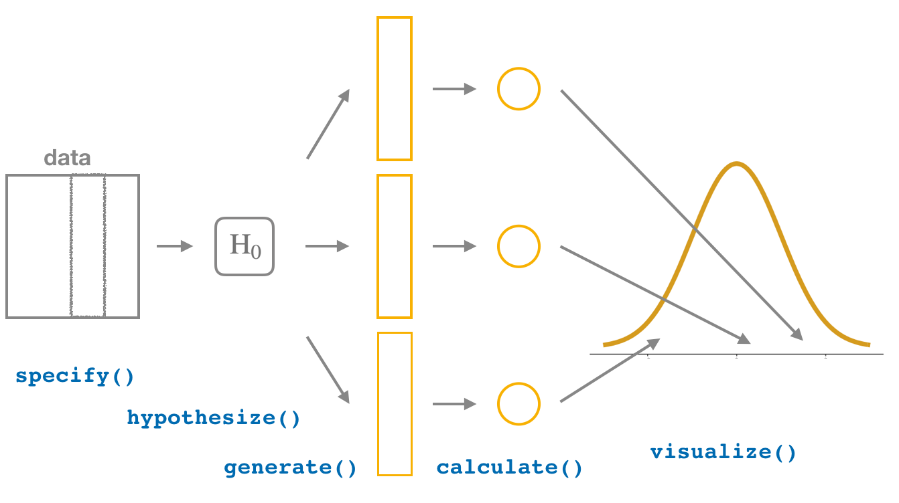
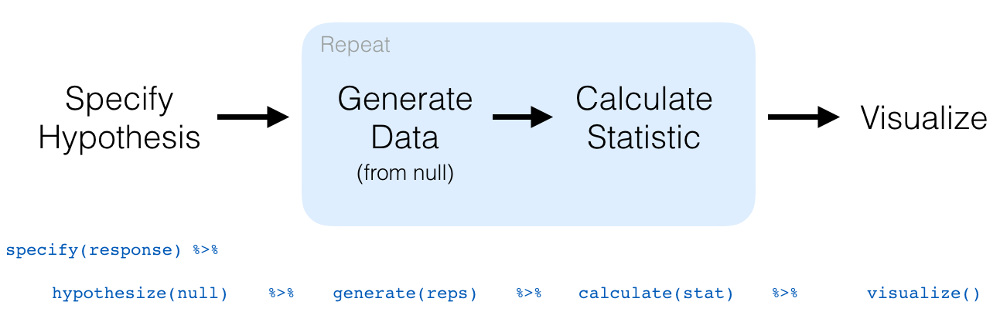

# Hypothesis Testing {#hypothesis-testing}  
    
```{r setup_hypo, include=FALSE, purl=FALSE}
chap <- 9
lc <- 0
rq <- 0
# **`r paste0("(LC", chap, ".", (lc <- lc + 1), ")")`**
# **`r paste0("(RQ", chap, ".", (rq <- rq + 1), ")")`**

knitr::opts_chunk$set(
  tidy = FALSE, 
  out.width = '\\textwidth', 
  fig.height = 4,
  warning = FALSE
  )

options(scipen = 99)#, digits = 3)

# Set random number generator seed value for replicable pseudorandomness.
set.seed(76)
```

Now that we've studied confidence intervals in Chapter \@ref(confidence-intervals), let's study another commonly used method for statistical inference: hypothesis testing. Hypothesis tests allow us to take a sample of data from a population and infer about the plausibility of competing hypotheses. For example, in the upcoming "promotions" activity in Section \@ref(ht-activity), you'll study the data collected from a psychology study in the 1970s to investigate whether gender-based discrimination in promotion rates existed in the banking industry at the time of the study. 

The good news is we've already covered many of the necessary concepts to understand hypothesis testing in Chapters \@ref(sampling) and \@ref(confidence-intervals). We will expand further on these ideas here and also provide a general framework for understanding hypothesis tests. By understanding this general framework, you'll be able to adapt it to many different scenarios.

The same can be said for confidence intervals. There was one general framework that applies to *all* confidence intervals and the `infer` package was designed around this framework. While the specifics may change slightly for different types of confidence intervals, the general framework stays the same. 

We believe that this approach is much better for long-term learning than focusing on specific details for specific confidence intervals using theory-based approaches. As you'll now see, we prefer this general framework for hypothesis tests as well.

```{r appendixb, echo=FALSE, results="asis"}
if(!knitr::is_latex_output()){
  cat("If you'd like more practice or you're curious to see how this framework applies to different scenarios, you can find fully-worked out examples for many common hypothesis tests and their corresponding confidence intervals in Appendix B. ")
  cat("We recommend that you carefully review these examples as they also cover how the general frameworks apply to traditional theory-based methods like the $t$-test and normal-theory confidence intervals.  You'll see there that these traditional methods are just approximations for the computer-based methods we've been focusing on. However, they also require conditions to be met for their results to be valid. Computer-based methods using randomization, simulation, and bootstrapping have much fewer restrictions. Furthermore, they help develop your computational thinking, which is one big reason they are emphasized throughout this book.")
}
```


### Needed packages {-}

Let's load all the packages needed for this chapter (this assumes you've already installed them). Recall from our discussion in Section \@ref(tidyverse-package) that loading the `tidyverse` package by running `library(tidyverse)` loads the following commonly used data science packages all at once:

* `ggplot2` for data visualization
* `dplyr` for data wrangling
* `tidyr` for converting data to "tidy" format
* `readr` for importing spreadsheet data into R
* As well as the more advanced `purrr`, `tibble`, `stringr`, and `forcats` packages

If needed, read Section \@ref(packages) for information on how to install and load R packages. 

```{r message=FALSE, warning=FALSE}
library(tidyverse)
library(infer)
library(moderndive)
library(nycflights13)
library(ggplot2movies)
```

```{r message=FALSE, warning=FALSE, echo=FALSE}
# Packages needed internally, but not in text.
library(knitr)
library(kableExtra)
library(patchwork)
library(scales)
library(viridis)
```


## Promotions activity {#ht-activity}

Let's start with an activity studying the effect of gender on promotions at a bank. 

### Does gender affect promotions at a bank?

Say you are working at a bank in the 1970s and you are submitting your résumé to apply for a promotion. Will your gender affect your chances of getting promoted? To answer this question, we'll focus on data from a study published in the _Journal of Applied Psychology_ in 1974. This data is also used in the [*OpenIntro*](https://www.openintro.org/) series of statistics textbooks. 

To begin the study, 48 bank supervisors were asked to assume the role of a hypothetical director of a bank with multiple branches. Every one of the bank supervisors was given a résumé and asked whether or not the candidate on the résumé was fit to be promoted to a new position in one of their branches. 

However, each of these 48 résumés were identical in all respects except one: the name of the applicant at the top of the résumé. Of the supervisors, 24 were randomly given résumés with stereotypically "male" names, while 24 of the supervisors were randomly given résumés with stereotypically "female" names. Since only (binary) gender varied from résumé to résumé, researchers could isolate the effect of this variable in promotion rates. 

While many people today (including us, the authors) disagree with such binary views of gender, it is important to remember that this study was conducted at a time where more nuanced views of gender were not as prevalent. Despite this imperfection, we decided to still use this example as we feel it presents ideas still relevant today about how we could study discrimination in the workplace.

The `moderndive` package contains the data on the 48 applicants in the `promotions` data frame. Let’s explore this data by looking at six randomly selected rows:

```{r echo=FALSE}
set.seed(2102)
```

```{r}
promotions %>% 
  sample_n(size = 6) %>% 
  arrange(id)
```


The variable `id` acts as an identification variable for all 48 rows, the `decision` variable indicates whether the applicant was selected for promotion or not, while the `gender` variable indicates the gender of the name used on the résumé. Recall that this data does not pertain to 24 actual men and 24 actual women, but rather 48 identical résumés of which 24 were assigned stereotypically "male" names and 24 were assigned stereotypically "female" names.

Let's perform an exploratory data analysis of the relationship between the two categorical variables `decision` and `gender`. Recall that we saw in Subsection \@ref(two-categ-barplot) that one way we can visualize such a relationship is by using a stacked barplot. 

```{r eval=FALSE}
ggplot(promotions, aes(x = gender, fill = decision)) +
  geom_bar() +
  labs(x = "Gender of name on résumé")
```


```{r promotions-barplot, echo=FALSE, fig.cap="Barplot relating gender to promotion decision.", fig.height=1.6}
promotions_barplot <- ggplot(promotions, aes(x = gender, fill = decision)) +
  geom_bar() +
  labs(x = "Gender of name on résumé")
if(knitr::is_html_output()){
  promotions_barplot
} else {
  promotions_barplot + scale_fill_grey()
}
```

Observe in Figure \@ref(fig:promotions-barplot) that it appears that résumés with female names were much less likely to be accepted for promotion.  Let's quantify these promotion rates by computing the proportion of résumés accepted for promotion for each group using the `dplyr` package for data wrangling. Note the use of the `tally()` function here which is a shortcut for `summarize(n = n())` to get counts.

```{r}
promotions %>% 
  group_by(gender, decision) %>% 
  tally()
```

```{r, echo=FALSE}
observed_test_statistic <- promotions %>% 
  specify(decision ~ gender, success = "promoted") %>% 
  calculate(stat = "diff in props", order = c("male", "female")) %>% 
  pull(stat) %>% 
  round(3)
```

So of the 24 résumés with male names, 21 were selected for promotion, for a proportion of 21/24 = 0.875 = 87.5%. On the other hand, of the 24 résumés with female names, 14 were selected for promotion, for a proportion of 14/24 = 0.583 = 58.3%. Comparing these two rates of promotion, it appears that résumés with male names were selected for promotion at a rate 0.875 - 0.583 = `r observed_test_statistic` = `r observed_test_statistic*100`% higher than résumés with female names. This is suggestive of an advantage for résumés with a male name on it. 

The question is, however, does this provide *conclusive* evidence that there is gender discrimination in promotions at banks? Could a difference in promotion rates of `r observed_test_statistic * 100`% still occur by chance, even in a hypothetical world where no gender-based discrimination existed? In other words, what is the role of *sampling variation* in this hypothesized world? To answer this question, we'll again rely on a computer to run *simulations*. 


### Shuffling once

First, try to imagine a hypothetical universe where no gender discrimination in promotions existed. In such a hypothetical universe, the gender of an applicant would have no bearing on their chances of promotion. Bringing things back to our `promotions` data frame, the `gender` variable would thus be an irrelevant label. If these `gender` labels were irrelevant, then we could randomly reassign them by "shuffling" them to no consequence!

To illustrate this idea, let's narrow our focus to 6 arbitrarily chosen résumés of the 48 in Table \@ref(tab:compare-six). The `decision` column shows that 3 résumés resulted in promotion while 3 didn't. The `gender` column shows what the original gender of the résumé name was. 

However, in our hypothesized universe of no gender discrimination, gender is irrelevant and thus it is of no consequence to randomly "shuffle" the values of `gender`. The `shuffled_gender` column shows one such possible random shuffling. Observe in the fourth column how the number of male and female names remains the same at 3 each, but they are now listed in a different order. 

```{r compare-six, echo=FALSE}
set.seed(2019)
# Pick out 6 rows
promotions_sample <- promotions %>%
  slice(c(36, 39, 40, 1, 2, 22)) %>% 
  mutate(`shuffled gender` = sample(gender)) %>% 
  select(-id) %>% 
  mutate(`résumé number` = 1:n()) %>% 
  select(`résumé number`, everything())

promotions_sample  %>% 
  kable(
    caption = "One example of shuffling gender variable", 
    booktabs = TRUE,
    longtable = TRUE,
    linesep = ""
  ) %>% 
  kable_styling(font_size = ifelse(knitr:::is_latex_output(), 10, 16),
                latex_options = c("hold_position", "repeat_header"))
```

Again, such random shuffling of the gender label only makes sense in our hypothesized universe of no gender discrimination. How could we extend this shuffling of the gender variable to all 48 résumés by hand? One way would be by using standard deck of 52 playing cards, which we display in Figure \@ref(fig:deck-of-cards).

```{r deck-of-cards, echo=FALSE, fig.cap="Standard deck of 52 playing cards.", purl=FALSE, out.width="100%"}
knitr::include_graphics("images/shutterstock/shutterstock_670789453.jpg")
```

Since half the cards are red (diamonds and hearts) and the other half are black (spades and clubs), by removing two red cards and two black cards, we would end up with 24 red cards and 24 black cards. After shuffling these 48 cards as seen in Figure \@ref(fig:shuffling), we can flip the cards over one-by-one, assigning "male" for each red card and "female" for each black card.

```{r shuffling, echo=FALSE, fig.cap="Shuffling a deck of cards.", purl=FALSE, out.width="100%", out.height="100%"}

```

<!--
Going back to our index cards, pick up each of the 24 cards corresponding to males and females that you placed on top of the supervisor cards. The next step is to put the two stacks of index cards together, creating a new set of 48 cards.  If we assume that the two population means are equal, we are saying that there is no association between promotion and gender (male vs female). If there really is no association between these two variables then for each of the 48 managers, it wouldn't matter whether they saw the name of a male or female candidate on the résumé they were given. They'd each be equally likely of granting a promotion for each of the two binary genders. So how do we do this with the cards?

Now that we have our 48 cards corresponding to gender in a single pile, shuffle them. Feel free to do this a couple times. Now take each of the cards off the top of the pile and assign them to the 48 different supervisors. Keep the supervisor cards in the same place they were before. We are, thus, randomly assigning the different values of the **explanatory** variable to each of the entries of the **response** variable. To reiterate, we hold the response variable of `promotion` fixed by not shuffling those cards but we shuffle the values of `gender` as the explanatory variable. Let's check out what the first few rows of this permutation of the gender cards onto the supervisors might look like as data.
-->

We've saved one such shuffling in the `promotions_shuffled` data frame of the `moderndive` package. If you compare the original `promotions` and the shuffled `promotions_shuffled` data frames, you'll see that while the `decision` variable is identical, the `gender` variable has changed. 

<!--
Albert: not sure what this is for?
Let's look at the six rows that we selected at random before when viewing the `promotions` data frame using the `slice()` function in the `dplyr` package.

Chester: Just as a way to show that the particular entries that we should before have now changed via a shuffling. It was to make sure readers could actually see the shuffle happen since it's a little harder to see looking at the entire data frames. Fine with not including it though.

```{r, eval=FALSE}
promotions_shuffled %>% slice(c(11, 26, 28, 36, 37, 46))
```
-->

Let's repeat the same exploratory data analysis we did for the original `promotions` data on our `promotions_shuffled` data frame. Let's create a barplot visualizing the relationship between `decision` and the new shuffled `gender` variable and compare this to the original unshuffled version in Figure \@ref(fig:promotions-barplot-permuted).

```{r, eval=FALSE}
ggplot(promotions_shuffled, 
       aes(x = gender, fill = decision)) +
  geom_bar() + 
  labs(x = "Gender of résumé name")
```
```{r promotions-barplot-permuted, fig.cap="Barplots of relationship of promotion with gender (left) and shuffled gender (right).", fig.height=4.7, echo=FALSE}
height1 <- promotions %>% 
  group_by(gender, decision) %>% 
  summarize(n = n()) %>% 
  pull(n) %>% 
  max()
height2 <- promotions_shuffled %>% 
  group_by(gender, decision) %>% 
  summarize(n = n()) %>% 
  pull(n) %>% 
  max()
height <- max(height1, height2)

plot1 <- ggplot(promotions, aes(x = gender, fill = decision)) +
  geom_bar() +
  labs(x = "Gender of résumé name", title = "Original") +
  theme(legend.position = "none") +
  coord_cartesian(ylim= c(0, height))
plot2 <- ggplot(promotions_shuffled, aes(x = gender, fill = decision)) +
  geom_bar() +
  labs(x = "Gender of résumé name", y ="", title = "Shuffled") +
  coord_cartesian(ylim= c(0, height))
if(knitr::is_html_output()){
  plot1 + plot2
} else {
    (plot1 + scale_fill_grey()) + (plot2 + scale_fill_grey())
}
```

It appears the difference in "male names" versus "female names" promotion rates is now different. Compared to the original data in the left barplot, the new "shuffled" data in the right barplot has promotion rates that are much more similar.

Let's also compute the proportion of résumés accepted for promotion for each group:

```{r}
promotions_shuffled %>% 
  group_by(gender, decision) %>% 
  tally() # Same as summarize(n = n())
```
```{r, echo=FALSE}
# male stats
n_men_promoted <- promotions_shuffled %>% 
  filter(decision == "promoted", gender == "male") %>% 
  nrow()
n_men_not_promoted <- promotions_shuffled %>% 
  filter(decision == "not", gender == "male") %>% 
  nrow()
prop_men_promoted <- n_men_promoted/(n_men_promoted + n_men_not_promoted)

# female stats  
n_women_promoted <- promotions_shuffled %>% 
  filter(decision == "promoted", gender == "female") %>% 
  nrow()
n_women_not_promoted <- promotions_shuffled %>% 
  filter(decision == "not", gender == "female") %>% 
  nrow()
prop_women_promoted <- n_women_promoted/(n_women_promoted + n_women_not_promoted)

# diff
diff_prop <- round(prop_men_promoted - prop_women_promoted, 3)

# round propotions post difference
prop_men_promoted <- round(prop_men_promoted, 3)
prop_women_promoted <- round(prop_women_promoted, 3)
```

So in this hypothetical universe of no discrimination, $`r n_men_promoted`/24 = `r prop_men_promoted` = `r prop_men_promoted*100`\%$ of "male" résumés were selected for promotion. On the other hand, $`r n_women_promoted`/24 = `r prop_women_promoted` = `r prop_women_promoted*100`\%$ of "female" résumés were selected for promotion. 

Let's next compare these two values. It appears that résumés with stereotypically male names were selected for promotion at a rate that was $`r prop_men_promoted ` - `r prop_women_promoted ` = `r diff_prop` = `r diff_prop*100`\%$ different than résumés with stereotypically female names. 

Observe how this difference in rates is not the same as the difference in rates of `r observed_test_statistic` = `r observed_test_statistic*100`% we originally observed. This is once again due to *sampling variation*. How can we better understand the effect of this sampling variation? By repeating this shuffling several times!


### Shuffling 16 times

We recruited 16 groups of our friends to repeat this shuffling exercise. They recorded these values in a [shared spreadsheet](https://docs.google.com/spreadsheets/d/1Q-ENy3o5IrpJshJ7gn3hJ5A0TOWV2AZrKNHMsshQtiE/); we display a snapshot of the first 10 rows and 5 columns in Figure \@ref(fig:tactile-shuffling).

```{r tactile-shuffling, echo=FALSE, fig.cap = "Snapshot of shared spreadsheet of shuffling results (m for male, f for female).", fig.show='hold', purl=FALSE, out.width="100%"}
knitr::include_graphics("images/sampling/promotions/shared_spreadsheet.png")
```

```{r, eval=TRUE, echo=FALSE, message=FALSE, warning=FALSE}
# https://docs.google.com/spreadsheets/d/1Q-ENy3o5IrpJshJ7gn3hJ5A0TOWV2AZrKNHMsshQtiE/edit#gid=0
if(!file.exists("rds/shuffled_data.rds")){
  shuffled_data <- read_csv("https://docs.google.com/spreadsheets/d/e/2PACX-1vQXLJxwSp1ALEJ1JRNn3o8K3jVdqRG_5yxpoOhIFYflbFIkb2ttH73w8mljptn12CsDyIvjr5p0IGUe/pub?gid=0&single=true&output=csv")
  write_rds(shuffled_data, "rds/shuffled_data.rds")
} else {
  shuffled_data <- read_rds("rds/shuffled_data.rds")
}
n_replicates <- ncol(shuffled_data) - 2

shuffled_data_tidy <- shuffled_data %>% 
  gather(team, gender, -c(id, decision)) %>% 
  mutate(replicate = rep(1:n_replicates, each = 48))

# Sanity check results
# shuffled_data_tidy %>% group_by(replicate) %>% count(gender) %>% filter(n != 24) %>% View()

shuffled_data_tidy <- shuffled_data_tidy %>% 
  group_by(replicate) %>% 
  count(gender, decision) %>% 
  filter(decision == "promoted") %>% 
  mutate(prop = n/24) %>% 
  select(replicate, gender, prop) %>% 
  spread(gender, prop) %>% 
  mutate(stat = m - f) 
```

For each of these 16 columns of _shuffles_, we computed the difference in promotion rates, and in Figure \@ref(fig:null-distribution-1) we display their distribution in a histogram. We also mark the observed difference in promotion rate that occurred in real life of `r observed_test_statistic` = `r observed_test_statistic*100`% with a dark line.

```{r null-distribution-1, fig.cap='Distribution of shuffled differences in promotions.', purl=FALSE, echo=FALSE}
ggplot(data = shuffled_data_tidy, aes(x = stat)) +
  geom_histogram(binwidth = 0.1, color = "white") +
  geom_vline(xintercept = observed_test_statistic, color = "red", size = 1) +
  labs(x = "Difference in promotion rates (male - female)")
```

Before we discuss the distribution of the histogram, we emphasize the key thing to remember: this histogram represents differences in promotion rates that one would observe in our *hypothesized universe* of no gender discrimination.

Observe first that the histogram is roughly centered at 0. Saying that the difference in promotion rates is 0 is equivalent to saying that both genders had the same promotion rate. In other words, the center of these 16 values is consistent with what we would expect in our hypothesized universe of no gender discrimination. 

However, while the values are centered at 0, there is variation about 0. This is because even in a hypothesized universe of no gender discrimination, you will still likely observe small differences in promotion rates because of chance *sampling variation*. Looking at the histogram in Figure \@ref(fig:null-distribution-1), such differences could even be as extreme as `r shuffled_data_tidy$stat %>% min() %>% round(3)` or `r shuffled_data_tidy$stat %>% max() %>% round(3)`.

Turning our attention to what we observed in real life: the difference of `r observed_test_statistic` = `r observed_test_statistic*100`% is marked with a vertical dark line.  Ask yourself: in a hypothesized world of no gender discrimination, how likely would it be that we observe this difference? While opinions here may differ, in our opinion not often! Now ask yourself: what do these results say about our hypothesized universe of no gender discrimination?

<!-- 
Now each of our 33 friends does the following:

1. Takes the two decks of cards.
2. Shuffles the cards corresponding to gender.
3. Assigns the shuffled cards to the original deck of supervisors' decisions.
4. Count how many cards fall into each of the four categories:
  - Promoted males
  - Non-promoted males
  - Promoted females
  - Non-promoted females
5. Determines the proportion of promoted males out of 24.
6. Determines the proportion of promoted females out of 24.
7. Subtracts those two differences to get a new value of the test statistic, assuming the null hypothesis is true.

Let's see what this leads to for our friends in terms of results and label where the observed test statistic falls in relation to our friends' statistics:

```{r, eval=FALSE}
obs_diff_prop <- promotions %>% 
  specify(decision ~ gender, success = "promoted") %>% 
  calculate(stat = "diff in props", order = c("male", "female"))
obs_diff_prop
```

```{r echo=FALSE, eval=FALSE}
set.seed(2019)
tactile_permutes <- promotions %>% 
  specify(decision ~ gender, success = "promoted") %>% 
  hypothesize(null = "independence") %>% 
  generate(reps = 33, type = "permute") %>% 
  calculate(stat = "diff in props", order = c("male", "female"))
ggplot(data = tactile_permutes, aes(x = stat)) +
  geom_histogram(binwidth = 0.05, boundary = -0.2, color = "white") +
  geom_vline(xintercept = pull(obs_diff_prop), color = "blue", size = 2) +
  scale_y_continuous(breaks = 0:10)
```

We see that of the 33 samples we selected only one is close to as extreme as what we observed. Thus, we might guess that we are starting to see some data suggesting that gender discrimination might be at play. Many of the statistics calculated appear close to 0 with the vast remainder appearing around values of a difference of -0.1 and 0.1. So what further evidence would we need to make this suggestion a little clearer? More simulations! As we've done before in Chapters \@ref(sampling) and \@ref(confidence-intervals), we'll use the computer to simulate these permutations and calculations many times. Let's do just that with the `infer` package in the next section.
-->

### What did we just do?

What we just demonstrated in this activity is the statistical procedure known as *hypothesis testing* using a *permutation test*. The term "permutation" \index{permutation} is the mathematical term for "shuffling": taking a series of values and reordering them randomly, as you did with the playing cards. 

In fact, permutations are another form of *resampling*, like the bootstrap method you performed in Chapter \@ref(confidence-intervals). While the bootstrap method involves resampling *with* replacement, permutation methods involve resampling *without* replacement. 

Think of our exercise involving the slips of paper representing pennies and the hat in Section \@ref(resampling-tactile): after sampling a penny, you put it back in the hat. Now think of our deck of cards. After drawing a card, you laid it out in front of you, recorded the color, and then you *did not* put it back in the deck.

In our previous example, we tested the validity of the hypothesized universe of no gender discrimination. The evidence contained in our observed sample of 48 résumés was somewhat inconsistent with our hypothesized universe. Thus, we would be inclined to *reject* this hypothesized universe and declare that the evidence suggests there is gender discrimination. 

Recall our case study on whether yawning is contagious from Section \@ref(case-study-two-prop-ci). The previous example involves inference about an unknown difference of population proportions as well. This time, it will be $p_{m} - p_{f}$, where $p_{m}$ is the population proportion of résumés with male names being recommended for promotion and $p_{f}$ is the equivalent for résumés with female names. Recall that this is one of the scenarios for inference we've seen so far in Table \@ref(tab:table-diff-prop).

```{r table-diff-prop, echo=FALSE, message=FALSE}
# The following Google Doc is published to CSV and loaded using read_csv():
# https://docs.google.com/spreadsheets/d/1QkOpnBGqOXGyJjwqx1T2O5G5D72wWGfWlPyufOgtkk4/edit#gid=0

if(!file.exists("rds/sampling_scenarios.rds")){
  sampling_scenarios <- "https://docs.google.com/spreadsheets/d/e/2PACX-1vRd6bBgNwM3z-AJ7o4gZOiPAdPfbTp_V15HVHRmOH5Fc9w62yaG-fEKtjNUD2wOSa5IJkrDMaEBjRnA/pub?gid=0&single=true&output=csv" %>% 
    read_csv(na = "") %>% 
    slice(1:5)
  write_rds(sampling_scenarios, "rds/sampling_scenarios.rds")
} else {
  sampling_scenarios <- read_rds("rds/sampling_scenarios.rds")
}

sampling_scenarios %>% 
  # Only first two scenarios
  filter(Scenario <= 3) %>% 
  kable(
    caption = "Scenarios of sampling for inference", 
    booktabs = TRUE,
    escape = FALSE,
    linesep = ""
  ) %>% 
  kable_styling(font_size = ifelse(knitr:::is_latex_output(), 10, 16),
                latex_options = c("hold_position")) %>%
  column_spec(1, width = "0.5in") %>% 
  column_spec(2, width = "0.7in") %>%
  column_spec(3, width = "1in") %>%
  column_spec(4, width = "1.1in") %>% 
  column_spec(5, width = "1in")
```

So, based on our sample of $n_m$ = 24 "male" applicants and $n_w$ = 24 "female" applicants, the *point estimate* for $p_{m} - p_{f}$ is the *difference in sample proportions* $\widehat{p}_{m} -\widehat{p}_{f}$ = 0.875 - 0.583 = `r observed_test_statistic` = `r observed_test_statistic*100`%. This difference in favor of "male" résumés of `r observed_test_statistic` is greater than 0, suggesting discrimination in favor of men. 

However, the question we asked ourselves was "is this difference meaningfully greater than 0?". In other words, is that difference indicative of true discrimination, or can we just attribute it to *sampling variation*? Hypothesis testing allows us to make such distinctions.


## Understanding hypothesis tests {#understanding-ht}

Much like the terminology, notation, and definitions relating to sampling you saw in Section \@ref(sampling-framework), there are a lot of terminology, notation, and definitions related to hypothesis testing as well. Learning these may seem like a very daunting task at first. However, with practice, practice, and more practice, anyone can master them. 

First, a **hypothesis** \index{hypothesis testing!hypothesis} is a statement about the value of an unknown population parameter. In our résumé activity, our population parameter of interest is the difference in population proportions $p_{m} - p_{f}$. Hypothesis tests can involve any of the population parameters in Table \@ref(tab:table-ch8) of the five inference scenarios we'll cover in this book and also more advanced types we won't cover here.

Second, a **hypothesis test** \index{hypothesis testing} consists of a test between two competing hypotheses: (1) a **null hypothesis** $H_0$ (pronounced "H-naught") versus (2) an **alternative hypothesis** $H_A$ (also denoted $H_1$). 

Generally the null hypothesis \index{hypothesis testing!null hypothesis} is a claim that there is "no effect" or "no difference of interest."  In many cases, the null hypothesis represents the status quo or a situation that nothing interesting is happening. Furthermore, generally the alternative hypothesis \index{hypothesis testing!alternative hypothesis} is the claim the experimenter or researcher wants to establish or find evidence to support. It is viewed as a "challenger" hypothesis to the null hypothesis $H_0$. In our résumé activity, an appropriate hypothesis test would be:

$$
\begin{aligned}
H_0 &: \text{men and women are promoted at the same rate}\\
\text{vs } H_A &: \text{men are promoted at a higher rate than women}
\end{aligned}
$$

Note some of the choices we have made. First, we set the null hypothesis $H_0$ to be that there is no difference in promotion rate and the "challenger" alternative hypothesis $H_A$ to be that there is a difference. While it would not be wrong in principle to reverse the two, it is a convention in statistical inference that the null hypothesis is set to reflect a "null" situation where "nothing is going on." As we discussed earlier, in this case, $H_0$ corresponds to there being no difference in promotion rates. Furthermore, we set $H_A$ to be that men are promoted at a *higher* rate, a subjective choice reflecting a prior suspicion we have that this is the case. We call such alternative hypotheses \index{hypothesis testing!one-sided alternative} *one-sided alternatives*. If someone else however does not share such suspicions and only wants to investigate that there is a difference, whether higher or lower, they would set what is known as a \index{hypothesis testing!two-sided alternative} *two-sided alternative*.

We can re-express the formulation of our hypothesis test using the mathematical notation for our population parameter of interest, the difference in population proportions $p_{m} - p_{f}$:

$$
\begin{aligned}
H_0 &: p_{m} - p_{f} = 0\\
\text{vs } H_A&: p_{m} - p_{f} > 0
\end{aligned}
$$

Observe how the alternative hypothesis $H_A$ is one-sided with $p_{m} - p_{f} > 0$. Had we opted for a two-sided alternative, we would have set $p_{m} - p_{f} \neq 0$. To keep things simple for now, we'll stick with the simpler one-sided alternative. We'll present an example of a two-sided alternative in Section \@ref(ht-case-study).

Third, a **test statistic** \index{hypothesis testing!test statistic} is a *point estimate/sample statistic* formula used for hypothesis testing. Note that a sample statistic is merely a summary statistic based on a sample of observations. Recall we saw in Section \@ref(summarize) that a summary statistic takes in many values and returns only one. Here, the samples would be the $n_m$ = 24 résumés with male names and the $n_f$ = 24 résumés with female names. Hence, the point estimate of interest is the difference in sample proportions $\widehat{p}_{m} - \widehat{p}_{f}$. 

Fourth, the **observed test statistic** \index{hypothesis testing!observed test statistic} is the value of the test statistic that we observed in real life. In our case, we computed this value using the data saved in the `promotions` data frame. It was the observed difference of $\widehat{p}_{m} -\widehat{p}_{f} = 0.875 - 0.583 = `r observed_test_statistic` = `r observed_test_statistic*100`\%$ in favor of résumés with male names.

Fifth, the **null distribution** \index{hypothesis testing!null distribution} is the sampling distribution of the test statistic *assuming the null hypothesis $H_0$ is true*. Ooof! That's a long one! Let's unpack it slowly. The key to understanding the null distribution is that the null hypothesis $H_0$ is *assumed* to be true. We're not saying that $H_0$ is true at this point, we're only assuming it to be true for hypothesis testing purposes. In our case, this corresponds to our hypothesized universe of no gender discrimination in promotion rates. Assuming the null hypothesis $H_0$, also stated as "Under $H_0$," how does the test statistic vary due to sampling variation? In our case, how will the difference in sample proportions $\widehat{p}_{m} - \widehat{p}_{f}$ vary due to sampling under $H_0$? Recall from Subsection \@ref(sampling-definitions) that distributions displaying how point estimates vary due to sampling variation are called *sampling distributions*. The only additional thing to keep in mind about null distributions is that they are sampling distributions *assuming the null hypothesis $H_0$ is true*. 

In our case, we previously visualized a null distribution in Figure \@ref(fig:null-distribution-1), which we re-display in Figure \@ref(fig:null-distribution-2) using our new notation and terminology. It is the distribution of the 16 differences in sample proportions our friends computed *assuming* a hypothetical universe of no gender discrimination. We also mark the value of the observed test statistic of 0.292 with a vertical line.

```{r null-distribution-2, fig.cap = "Null distribution and observed test statistic.", purl=FALSE, echo=FALSE, fig.height=3.3}
ggplot(data = shuffled_data_tidy, aes(x = stat)) +
  geom_histogram(binwidth = 0.1, color = "white") +
  geom_vline(xintercept = observed_test_statistic, color = "red", size = 1) +
  labs(x = expression(paste("Difference in sample proportions ", hat(p)["m"] - hat(p)["f"])))
```

Sixth, the **$p$-value** \index{hypothesis testing!p-value} is the probability of obtaining a test statistic just as extreme or more extreme than the observed test statistic *assuming the null hypothesis $H_0$ is true*. Double ooof! Let's unpack this slowly as well. You can think of the $p$-value as a quantification of "surprise": assuming $H_0$ is true, how surprised are we with what we observed? Or in our case, in our hypothesized universe of no gender discrimination, how surprised are we that we observed a difference in promotion rates of `r observed_test_statistic` from our collected samples assuming $H_0$ is true? Very surprised? Somewhat surprised? 

The $p$-value quantifies this probability, or in the case of our 16 differences in sample proportions in Figure \@ref(fig:null-distribution-2), what proportion had a more "extreme" result? Here, extreme is defined in terms of the alternative hypothesis $H_A$ that "male" applicants are promoted at a higher rate than "female" applicants. In other words, how often was the discrimination in favor of men _even more_ pronounced than $0.875 - 0.583 = `r observed_test_statistic` = `r observed_test_statistic*100`\%$?

```{r, echo=FALSE}
num <- sum(shuffled_data_tidy$stat >= observed_test_statistic)
denom <- nrow(shuffled_data_tidy)
p_val <- round((num + 1)/(denom + 1),3)
```

In this case, `r sum(shuffled_data_tidy$stat >= observed_test_statistic)` times out of 16, we obtained a difference in proportion greater than or equal to the observed difference of `r observed_test_statistic` = `r observed_test_statistic*100`%. A very rare (in fact, not occurring) outcome! Given the rarity of such a pronounced difference in promotion rates in our hypothesized universe of no gender discrimination, we're inclined to *reject* \index{hypothesis testing!reject the null hypothesis} our hypothesized universe. Instead, we favor the hypothesis stating there is discrimination in favor of the "male" applicants. In other words, we reject $H_0$ in favor of $H_A$.

<!--
TODO: Including observed test stat in p-value computation

We'll see later on however, the $p$-value isn't quite 1/16, but rather (`r num` + 1)/(`r denom` + 1) = `r num + 1`/`r denom + 1` = `r p_val` as we need to include the observed test statistic in our calculation. 
-->


Seventh and lastly, in many hypothesis testing procedures, it is commonly recommended to set the **significance level** \index{hypothesis testing!significance level} of the test beforehand.  It is denoted by the Greek letter $\alpha$ (pronounced "alpha"). This value acts as a cutoff on the $p$-value, where if the $p$-value falls below $\alpha$, we would "reject the null hypothesis $H_0$." 

Alternatively, if the $p$-value does not fall below $\alpha$, we would "fail to reject $H_0$." Note the latter statement is not quite the same as saying we "accept $H_0$." This distinction is rather subtle and not immediately obvious. So we'll revisit it later in Section \@ref(ht-interpretation).

While different fields tend to use different values of $\alpha$, some commonly used values for $\alpha$ are 0.1, 0.01, and 0.05; with 0.05 being the choice people often make without putting much thought into it. We'll talk more about $\alpha$ significance levels in Section \@ref(ht-interpretation), but first let's fully conduct the hypothesis test corresponding to our promotions activity using the `infer` package.


## Conducting hypothesis tests {#ht-infer}

In Section \@ref(bootstrap-process), we showed you how to construct confidence intervals. We first illustrated how to do this using `dplyr` data wrangling verbs and the `rep_sample_n()` function from Subsection \@ref(shovel-1000-times) which we used as a virtual shovel. In particular, we constructed confidence intervals by resampling with replacement by setting the `replace = TRUE` argument to the `rep_sample_n()` function. 

We then showed you how to perform the same task using the `infer` package workflow. While both workflows resulted in the same bootstrap distribution from which we can construct confidence intervals, the `infer` package workflow emphasizes each of the steps in the overall process in Figure \@ref(fig:infer-ci). It does so using function names that are intuitively named with verbs:

1. `specify()` the variables of interest in your data frame.
1. `generate()` replicates of bootstrap resamples with replacement.
1. `calculate()` the summary statistic of interest.
1. `visualize()` the resulting bootstrap distribution and confidence interval.


```{r infer-ci, echo=FALSE, fig.cap="Confidence intervals with the infer package.", purl=FALSE, out.width="90%", out.height="90%"}
knitr::include_graphics("images/flowcharts/infer/visualize.png")
```

In this section, we'll now show you how to seamlessly modify the previously seen `infer` code for constructing confidence intervals to conduct hypothesis tests. You'll notice that the basic outline of the workflow is almost identical, except for an additional `hypothesize()` step between the `specify()` and `generate()` steps, as can be seen in Figure \@ref(fig:inferht).

```{r inferht, echo=FALSE, fig.cap="Hypothesis testing with the infer package.", purl=FALSE, out.width="90%", out.height="90%"}

```

```{r, echo=FALSE}
alpha <- 0.05
```

Furthermore, we'll use a pre-specified significance level $\alpha$ = `r alpha` for this hypothesis test. Let's leave discussion on the choice of this $\alpha$ value until later on in Section \@ref(ht-interpretation). 

### `infer` package workflow {#infer-workflow-ht}

<!--
you were introduced to the framework for inference including the following verbs: `specify()`, `generate()`, and `calculate()`. This was useful when calculating bootstrap distributions in order to develop confidence intervals in both the one-sample and two-sample cases. One of the great powers of the `infer` package is in extending confidence intervals to hypothesis testing by including one more verb: `hypothesize()`. 

Remember that our goal here is to generate many different samples, assuming the null hypothesis is true. In doing so we will create a **null distribution**. This null distribution is similar to what we have seen so far with the *sampling distribution* in Chapter \@ref(sampling) and the *bootstrap distribution* in Chapter \@ref(confidence-intervals). Here though we have one more condition to apply in that we assume the null hypothesis is true, thus where the name of the *null* distribution comes from. The null distribution is still used to look at the variability from one sample to the next, but now we are interested in seeing where what we actually saw would fall on the "chance distribution." In doing so, we'll have a good sense for whether random chance is a good explanation for seeing the results in our observed sample or if there is something else going on which better aligns with $H_a$, the alternative hypothesis.

Let's explore the `infer` pipeline one more time here on the gender discrimination study from Section \@ref(ht-activity).
--> 

#### 1. `specify` variables {-}

Recall that we use the `specify()` \index{infer!specify()} verb to specify the response variable and, if needed, any explanatory variables for our study. In this case, since we are interested in any potential effects of gender on promotion decisions, we set `decision` as the response variable and `gender` as the explanatory variable. We do so using `formula = response ~ explanatory` where `response` is the name of the response variable in the data frame and `explanatory` is the name of the explanatory variable. So in our case it is `decision ~ gender`. 

Furthermore, since we are interested in the proportion of résumés `"promoted"`, and not the proportion of résumés `not` promoted, we set the argument `success` to `"promoted"`.

```{r}
promotions %>% 
  specify(formula = decision ~ gender, success = "promoted") 
```

Again, notice how the `promotions` data itself doesn't change, but the `Response: decision (factor)` and `Explanatory: gender (factor)` *meta-data* do. This is similar to how the `group_by()` verb from `dplyr` doesn't change the data, but only adds "grouping" meta-data, as we saw in Section \@ref(groupby).


#### 2. `hypothesize` the null {-}

In order to conduct hypothesis tests using the `infer` workflow, we need a new step not present for confidence intervals: \index{infer!hypothesize()} `hypothesize()`. Recall from Section \@ref(understanding-ht) that our hypothesis test was

$$
\begin{aligned}
H_0 &: p_{m} - p_{f} = 0\\
\text{vs. } H_A&: p_{m} - p_{f} > 0
\end{aligned}
$$

In other words, the null hypothesis $H_0$ corresponding to our "hypothesized universe" stated that there was no difference in gender-based discrimination rates. We set this null hypothesis $H_0$ in our `infer` workflow using the `null` argument of the `hypothesize()` function to either:

- `"point"` for hypotheses involving a single sample or
- `"independence"` for hypotheses involving two samples.

In our case, since we have two samples (the résumés with "male" and "female" names), we set `null = "independence"`.

```{r}
promotions %>% 
  specify(formula = decision ~ gender, success = "promoted") %>% 
  hypothesize(null = "independence")
```

Again, the data has not changed yet. This will occur at the upcoming `generate()` step; we're merely setting meta-data for now.

Where do the terms `"point"` and `"independence"` come from? These are two technical statistical terms. The term "point" relates from the fact that for a single group of observations, you will test the value of a single point. Going back to the pennies example from Chapter \@ref(confidence-intervals), say we wanted to test if the mean year of all US pennies was equal to 1993 or not. We would be testing the value of a "point" $\mu$, the mean year of *all* US pennies, as follows

$$
\begin{aligned}
H_0 &: \mu = 1993\\
\text{vs } H_A&: \mu \neq 1993
\end{aligned}
$$

The term "independence" relates to the fact that for two groups of observations, you are testing whether or not the response variable is *independent* of the explanatory variable that assigns the groups. In our case, we are testing whether the `decision` response variable is "independent" of the explanatory variable `gender` that assigns each résumé to either of the two groups. 


#### 3. `generate` replicates {-}

After we `hypothesize()` the null hypothesis, we `generate()` replicates of "shuffled" datasets assuming the null hypothesis is true. We do this by repeating the shuffling exercise you performed in Section \@ref(ht-activity) several times. Instead of merely doing it 16 times as our groups of friends did, let's use the computer to repeat this 1000 times by setting `reps = 1000` in the `generate()` \index{infer!generate()} function. However, unlike for confidence intervals where we generated replicates using `type = "bootstrap"` resampling with replacement, we'll now perform shuffles/permutations by setting `type = "permute"`. Recall that shuffles/permutations are a kind of resampling, but unlike the bootstrap method, they involve resampling *without* replacement. 

```{r eval=FALSE}
promotions_generate <- promotions %>% 
  specify(formula = decision ~ gender, success = "promoted") %>% 
  hypothesize(null = "independence") %>% 
  generate(reps = 1000, type = "permute")
nrow(promotions_generate)
```

```{r echo=FALSE, purl=FALSE}
if(!file.exists("rds/promotions_generate.rds")) {
  promotions_generate <- promotions %>% 
    specify(formula = decision ~ gender, success = "promoted") %>% 
    hypothesize(null = "independence") %>% 
    generate(reps = 1000, type = "permute")
  write_rds(promotions_generate, "rds/promotions_generate.rds")
} else {
  promotions_generate <- read_rds("rds/promotions_generate.rds")
}
nrow(promotions_generate)
```

<!-- infer:::permute_once() shuffles the y variable instead of the x. This ends up being the same thing but isn't as intuitive
to explain given how we set up the cards tactile example before. I think it's best to avoid displaying `promotions_generate`
here since it has `decision` shuffled. -->

Observe that the resulting data frame has 48,000 rows. This is because we performed shuffles/permutations for each of the 48 rows 1000 times and $48,000 = 1000 \cdot 48$. If you explore the `promotions_generate` data frame with `View()`, you'll notice that the variable `replicate` indicates which resample each row belongs to. So it has the value `1` 48 times, the value `2` 48 times, all the way through to the value `1000` 48 times. 


#### 4. `calculate` summary statistics {-}

Now that we have generated 1000 replicates of "shuffles" assuming the null hypothesis is true, let's `calculate()` \index{infer!calculate()} the appropriate summary statistic for each of our 1000 shuffles. From Section \@ref(understanding-ht), point estimates related to hypothesis testing have a specific name: *test statistics*. Since the unknown population parameter of interest is the difference in population proportions $p_{m} - p_{f}$, the test statistic here is the difference in sample proportions $\widehat{p}_{m} - \widehat{p}_{f}$. 

For each of our 1000 shuffles, we can calculate this test statistic by setting `stat = "diff in props"`. Furthermore, since we are interested in $\widehat{p}_{m} - \widehat{p}_{f}$ we set `order = c("male", "female")`. As we stated earlier, the order of the subtraction does not matter, so long as you stay consistent throughout your analysis and tailor your interpretations accordingly. 

Let's save the result in a data frame called `null_distribution`:

```{r eval=FALSE}
null_distribution <- promotions %>% 
  specify(formula = decision ~ gender, success = "promoted") %>% 
  hypothesize(null = "independence") %>% 
  generate(reps = 1000, type = "permute") %>% 
  calculate(stat = "diff in props", order = c("male", "female"))
null_distribution
```

```{r echo=FALSE, purl=FALSE}
if(!file.exists("rds/null_distribution_promotions.rds")) {
  null_distribution <- promotions_generate %>% 
    calculate(stat = "diff in props", order = c("male", "female"))
  write_rds(null_distribution, "rds/null_distribution_promotions.rds")
} else {
  null_distribution <- read_rds("rds/null_distribution_promotions.rds")
}
null_distribution
```


Observe that we have 1000 values of `stat`, each representing one  instance of $\widehat{p}_{m} - \widehat{p}_{f}$ in a hypothesized world of no gender discrimination. Observe as well that we chose the name of this data frame carefully: `null_distribution`. Recall once again from Section \@ref(understanding-ht) that sampling distributions when the null hypothesis $H_0$ is assumed to be true have a special name: the *null distribution*. 

What was the *observed* difference in promotion rates? In other words, what was the *observed test statistic* $\widehat{p}_{m} - \widehat{p}_{f}$? Recall from Section \@ref(ht-activity) that we computed this observed difference by hand to be 0.875 - 0.583 = `r observed_test_statistic` = `r observed_test_statistic*100`%. We can also compute this value using the previous `infer` code but with the `hypothesize()` and `generate()` steps removed. Let's save this in `obs_diff_prop`:

```{r}
obs_diff_prop <- promotions %>% 
  specify(decision ~ gender, success = "promoted") %>% 
  calculate(stat = "diff in props", order = c("male", "female"))
obs_diff_prop
```


#### 5. `visualize` the p-value {-}

The final step is to measure how surprised we are by a promotion difference of `r observed_test_statistic*100`% in a hypothesized universe of no gender discrimination. If the observed difference of `r observed_test_statistic` is highly unlikely, then we would be inclined to reject the validity of our hypothesized universe. 

We start by visualizing the *null distribution* of our 1000 values of $\widehat{p}_{m} - \widehat{p}_{f}$ using `visualize()` \index{infer!visualize()} in Figure \@ref(fig:null-distribution-infer). Recall that these are values of the difference in promotion rates assuming $H_0$ is true. This corresponds to being in our hypothesized universe of no gender discrimination.

```{r null-distribution-infer, fig.show='hold', fig.cap="Null distribution.", fig.height=1.8}
visualize(null_distribution, bins = 10)
```

Let's now add what happened in real life to Figure \@ref(fig:null-distribution-infer), the observed difference in promotion rates of 0.875 - 0.583 = `r observed_test_statistic` = `r observed_test_statistic*100`%. However, instead of merely adding a vertical line using `geom_vline()`, let's use the \index{infer!shade\_p\_value()} `shade_p_value()` function with `obs_stat` set to the observed test statistic value we saved in `obs_diff_prop`. 

Furthermore, we'll set the `direction = "right"` reflecting our alternative hypothesis $H_A: p_{m} - p_{f} > 0$. Recall our alternative hypothesis $H_A$ is that $p_{m} - p_{f} > 0$, stating that there is a difference in promotion rates in favor of résumés with male names. "More extreme" here corresponds to differences that are "bigger" or "more positive" or "more to the right." Hence we set the `direction` argument of `shade_p_value()` to be `"right"`. 

On the other hand, had our alternative hypothesis $H_A$ been the other possible one-sided alternative $p_{m} - p_{f} < 0$, suggesting discrimination in favor of résumés with female names, we would've set `direction = "left"`.  Had our alternative hypothesis $H_A$ been two-sided $p_{m} - p_{f} \neq 0$, suggesting discrimination in either direction, we would've set `direction = "both"`.

```{r null-distribution-infer-2, fig.cap="Shaded histogram to show $p$-value."}
visualize(null_distribution, bins = 10) + 
  shade_p_value(obs_stat = obs_diff_prop, direction = "right")
```

In the resulting Figure \@ref(fig:null-distribution-infer-2), the solid dark line marks `r observed_test_statistic` = `r observed_test_statistic*100`%. However, what does the shaded-region correspond to? This is the *$p$-value*. Recall the definition of the $p$-value from Section \@ref(understanding-ht):

> A $p$-value is the probability of obtaining a test statistic just as or more extreme than the observed test statistic *assuming the null hypothesis $H_0$ is true*.

So judging by the shaded region in Figure \@ref(fig:null-distribution-infer-2), it seems we would somewhat rarely observe differences in promotion rates of `r observed_test_statistic` = `r observed_test_statistic*100`% or more in a hypothesized universe of no gender discrimination. In other words, the $p$-value is somewhat small. Hence, we would be inclined to reject this hypothesized universe, or using statistical language we would "reject $H_0$."

What fraction of the null distribution is shaded? In other words, what is the exact value of the $p$-value? We can compute it using the `get_p_value()` \index{infer!get\_p\_value()} function with the same arguments as the previous `shade_p_value()` code:

```{r}
null_distribution %>% 
  get_p_value(obs_stat = obs_diff_prop, direction = "right")
```
```{r, echo=FALSE}
p_value <- null_distribution %>% 
  get_p_value(obs_stat = obs_diff_prop, direction = "right") %>% 
  mutate(p_value = round(p_value, 3))
```

Keeping the definition of a $p$-value in mind, the probability of observing a difference in promotion rates as large as `r observed_test_statistic` = `r observed_test_statistic*100`% due to sampling variation alone in the null distribution is `r pull(p_value)` = `r pull(p_value) * 100`%. Since this $p$-value is smaller than our pre-specified significance level $\alpha$ = `r alpha`, we reject the null hypothesis $H_0: p_{m} - p_{f} = 0$. In other words, this $p$-value is sufficiently small to reject our hypothesized universe of no gender discrimination. We instead have enough evidence to change our mind in favor of gender discrimination being a likely culprit here. Observe that whether we reject the null hypothesis $H_0$ or not depends in large part on our choice of significance level $\alpha$. We'll discuss this more in Subsection \@ref(choosing-alpha).

### Comparison with confidence intervals {#comparing-infer-workflows}

One of the great things about the `infer` package is that we can jump seamlessly between conducting hypothesis tests and constructing confidence intervals with minimal changes! Recall the code from the previous section that creates the null distribution, which in turn is needed to compute the $p$-value:

```{r eval=FALSE}
null_distribution <- promotions %>% 
  specify(formula = decision ~ gender, success = "promoted") %>% 
  hypothesize(null = "independence") %>% 
  generate(reps = 1000, type = "permute") %>% 
  calculate(stat = "diff in props", order = c("male", "female"))
```

To create the corresponding bootstrap distribution needed to construct a 95% confidence interval for $p_{m} - p_{f}$, we only need to make two changes. \index{infer!switching between tests and confidence intervals} First, we remove the `hypothesize()` step since we are no longer assuming a null hypothesis $H_0$ is true. We can do this by deleting or commenting out the `hypothesize()` line of code. Second, we switch the `type` of resampling in the `generate()` step to be `"bootstrap"` instead of `"permute"`.

```{r eval=FALSE}
bootstrap_distribution <- promotions %>% 
  specify(formula = decision ~ gender, success = "promoted") %>% 
  # Change 1 - Remove hypothesize():
  # hypothesize(null = "independence") %>% 
  # Change 2 - Switch type from "permute" to "bootstrap":
  generate(reps = 1000, type = "bootstrap") %>% 
  calculate(stat = "diff in props", order = c("male", "female"))
```

```{r echo=FALSE, purl=FALSE}
if(!file.exists("rds/bootstrap_distribution_promotions.rds")){
  bootstrap_distribution <- promotions %>% 
    specify(formula = decision ~ gender, success = "promoted") %>% 
    # Change 1 - Remove hypothesize():
    # hypothesize(null = "independence") %>% 
    # Change 2 - Switch type from "permute" to "bootstrap":
    generate(reps = 1000, type = "bootstrap") %>% 
    calculate(stat = "diff in props", order = c("male", "female"))
  write_rds(bootstrap_distribution,
            "rds/bootstrap_distribution_promotions.rds")
} else {
  bootstrap_distribution <- read_rds("rds/bootstrap_distribution_promotions.rds")
}
```

Using this `bootstrap_distribution`, let's first compute the percentile-based confidence intervals, as we did in Section \@ref(bootstrap-process):

```{r}
percentile_ci <- bootstrap_distribution %>% 
  get_confidence_interval(level = 0.95, type = "percentile")
percentile_ci
```

Using our shorthand interpretation for 95% confidence intervals from Subsection \@ref(shorthand), we are 95% "confident" that the true difference in population proportions $p_{m} - p_{f}$ is between (`r percentile_ci[["2.5%"]] %>% round(3)`, `r percentile_ci[["97.5%"]] %>% round(3)`). Let's visualize `bootstrap_distribution` and this percentile-based 95% confidence interval for $p_{m} - p_{f}$ in Figure \@ref(fig:bootstrap-distribution-two-prop-percentile).

```{r eval=FALSE}
visualize(bootstrap_distribution) + 
  shade_confidence_interval(endpoints = percentile_ci)
```
```{r bootstrap-distribution-two-prop-percentile, echo=FALSE, fig.show='hold', fig.cap="Percentile-based 95\\% confidence interval.", purl=FALSE, fig.height=3.2}
# Will need to make a tweak to the {infer} package so that it doesn't always display "Null" here (added to `develop` branch on 2019-10-26)

if(knitr::is_html_output()){
  visualize(bootstrap_distribution) + 
    shade_confidence_interval(endpoints = percentile_ci) #+
#    ggtitle("Simulation-Based Bootstrap Distribution") 
} else {
  visualize(bootstrap_distribution) + 
    shade_confidence_interval(endpoints = percentile_ci,
                              fill = "grey40", color = "grey30") #+
#    ggtitle("Simulation-Based Bootstrap Distribution") 
}
```

Notice a key value that is not included in the 95% confidence interval for $p_{m} - p_{f}$: the value 0. In other words, a difference of 0 is not included in our net, suggesting that $p_{m}$ and $p_{f}$ are truly different! Furthermore, observe how the entirety of the 95% confidence interval for $p_{m} - p_{f}$ lies above 0, suggesting that this difference is in favor of men.

Since the bootstrap distribution appears to be roughly normally shaped, we can also use the standard error method as we did in Section \@ref(bootstrap-process). In this case, we must specify the `point_estimate` argument as the observed difference in promotion rates `r observed_test_statistic` = `r observed_test_statistic*100`% saved in `obs_diff_prop`. This value acts as the center of the confidence interval.

```{r}
se_ci <- bootstrap_distribution %>% 
  get_confidence_interval(level = 0.95, type = "se", 
                          point_estimate = obs_diff_prop)
se_ci
```

Let's visualize `bootstrap_distribution` again, but now the standard error based 95% confidence interval for $p_{m} - p_{f}$ in Figure \@ref(fig:bootstrap-distribution-two-prop-se). Again, notice how the value 0 is not included in our confidence interval, again suggesting that $p_{m}$ and $p_{f}$ are truly different!

```{r eval=FALSE}
visualize(bootstrap_distribution) + 
  shade_confidence_interval(endpoints = se_ci)
```
```{r bootstrap-distribution-two-prop-se, echo=FALSE, fig.show='hold', fig.cap="Standard error-based 95\\% confidence interval.", purl=FALSE, fig.height=3.4}
# Will need to make a tweak to the {infer} package so that it doesn't always display "Null" here (added to `develop` branch on 2019-10-26)
if(knitr::is_html_output()){
visualize(bootstrap_distribution) + 
  shade_confidence_interval(endpoints = se_ci) #+
#  ggtitle("Simulation-Based Bootstrap Distribution") 
} else {
 visualize(bootstrap_distribution) + 
  shade_confidence_interval(endpoints = se_ci,                               
                            fill = "grey40", color = "grey30") #+
#  ggtitle("Simulation-Based Bootstrap Distribution")

}
```


```{block lc10-3b0, type='learncheck', purl=FALSE}
\vspace{-0.15in}
**_Learning check_**
\vspace{-0.1in}
```

**`r paste0("(LC", chap, ".", (lc <- lc + 1), ")")`** Conduct the same hypothesis test and confidence interval analysis comparing male and female promotion rates using the median rating instead of the mean rating. What was different and what was the same? 

**`r paste0("(LC", chap, ".", (lc <- lc + 1), ")")`** Why are we relatively confident that the distributions of the sample proportions will be good approximations of the population distributions of promotion proportions for the two genders?

**`r paste0("(LC", chap, ".", (lc <- lc + 1), ")")`** Using the definition of _p-value_, write in words what the $p$-value represents for the hypothesis test comparing the promotion rates for males and females.

```{block, type='learncheck', purl=FALSE}
\vspace{-0.25in}
\vspace{-0.25in}
``` 


### "There is only one test" {#only-one-test}

Let's recap the steps necessary to conduct a hypothesis test using the terminology, notation, and definitions related to sampling you saw in Section \@ref(understanding-ht) and the `infer` workflow from Subsection \@ref(infer-workflow-ht):

1. `specify()` the variables of interest in your data frame.
1. `hypothesize()` the null hypothesis $H_0$. In other words, set a "model for the universe" assuming $H_0$ is true.
1. `generate()` shuffles assuming $H_0$ is true. In other words, *simulate* data assuming $H_0$ is true. 
1. `calculate()` the *test statistic* of interest, both for the observed data and your *simulated* data. 
1. `visualize()` the resulting *null distribution* and compute the *$p$-value* by comparing the null distribution to the observed test statistic. 

While this is a lot to digest, especially the first time you encounter hypothesis testing, the nice thing is that once you understand this general framework, then you can understand *any* hypothesis test. In a famous blog post, computer scientist Allen Downey called this the  ["There is only one test"](http://allendowney.blogspot.com/2016/06/there-is-still-only-one-test.html) framework, for which he created the flowchart displayed in Figure \@ref(fig:htdowney). 

```{r htdowney, echo=FALSE, fig.cap="Allen Downey's hypothesis testing framework.", purl=FALSE, out.width="110%"}
knitr::include_graphics("images/copyright/there_is_only_one_test.png")
```

Notice its similarity with the "hypothesis testing with `infer`" diagram you saw in Figure \@ref(fig:inferht). That's because the `infer` package was explicitly designed to match the "There is only one test" framework. So if you can understand the framework, you can easily generalize these ideas for all hypothesis testing scenarios. Whether for population proportions $p$, population means $\mu$, differences in population proportions $p_1 - p_2$, differences in population means $\mu_1 - \mu_2$, and as you'll see in Chapter \@ref(inference-for-regression) on inference for regression, population regression slopes $\beta_1$ as well. In fact, it applies more generally even than just these examples to more complicated hypothesis tests and test statistics as well.

```{block lc-downey, type='learncheck', purl=FALSE}
\vspace{-0.15in}
**_Learning check_**
\vspace{-0.1in}
```

**`r paste0("(LC", chap, ".", (lc <- lc + 1), ")")`** Describe in a paragraph how we used Allen Downey's diagram to conclude if a statistical difference existed between the promotion rate of males and females using this study.

```{block, type='learncheck', purl=FALSE}
\vspace{-0.25in}
\vspace{-0.25in}
``` 


## Interpreting hypothesis tests {#ht-interpretation}

Interpreting the results of hypothesis tests is one of the more challenging aspects of this method for statistical inference. In this section, we'll focus on ways to help with deciphering the process and address some common misconceptions. 

### Two possible outcomes {#trial}

In Section \@ref(understanding-ht), we mentioned that given a pre-specified significance level $\alpha$ there are two possible outcomes of a hypothesis test:

* If the $p$-value is less than $\alpha$, then we *reject* the null hypothesis $H_0$ in favor of $H_A$.
* If the $p$-value is greater than or equal to $\alpha$, we *fail to reject* the null hypothesis $H_0$.

Unfortunately, the latter result is often misinterpreted as "accepting the null hypothesis $H_0$." While at first glance it may seem that the statements "failing to reject $H_0$" and "accepting $H_0$" are equivalent, there actually is a subtle difference. Saying that we "accept the null hypothesis $H_0$" is equivalent to stating that "we think the null hypothesis $H_0$ is true." However, saying that we "fail to reject the null hypothesis $H_0$" is saying something else: "While $H_0$ might still be false, we don't have enough evidence to say so." In other words, there is an absence of enough proof. However, the absence of proof is not proof of absence. 

To further shed light on this distinction, \index{hypothesis testing!US criminal trial analogy} let's use the United States criminal justice system as an analogy. A criminal trial in the United States is a similar situation to hypothesis tests whereby a choice between two contradictory claims must be made about a defendant who is on trial:

1. The defendant is truly either "innocent" or "guilty."
1. The defendant is presumed "innocent until proven guilty." 
1. The defendant is found guilty only if there is *strong evidence* that the defendant is guilty. The phrase "beyond a reasonable doubt" is often used as a guideline for determining a cutoff for when enough evidence exists to find the defendant guilty.
1. The defendant is found to be either "not guilty" or "guilty" in the ultimate verdict.

In other words, _not guilty_ verdicts are not suggesting the defendant is _innocent_, but instead that "while the defendant may still actually be guilty, there wasn't enough evidence to prove this fact." Now let's make the connection with hypothesis tests:

1. Either the null hypothesis $H_0$ or the alternative hypothesis $H_A$ is true.
1. Hypothesis tests are conducted assuming the null hypothesis $H_0$ is true.
1. We reject the null hypothesis $H_0$ in favor of $H_A$ only if the evidence found in the sample suggests that $H_A$ is true. The significance level $\alpha$ is used as a guideline to set the threshold on just how strong of evidence we require. 
1. We ultimately decide to either "fail to reject $H_0$" or "reject $H_0$." 

So while gut instinct may suggest "failing to reject $H_0$" and "accepting $H_0$" are equivalent statements, they are not. "Accepting $H_0$" is equivalent to finding a defendant innocent. However, courts do not find defendants "innocent," but rather they find them "not guilty." Putting things differently, defense attorneys do not need to prove that their clients are innocent, rather they only need to prove that clients are not "guilty beyond a reasonable doubt".

So going back to our résumés activity in Section \@ref(ht-infer), recall that our hypothesis test was $H_0: p_{m} - p_{f} = 0$ versus $H_A: p_{m} - p_{f} > 0$ and that we used a pre-specified significance level of $\alpha$ = `r alpha`.  We found a $p$-value of `r pull(p_value)`. Since the $p$-value was smaller than $\alpha$ = `r alpha`, we rejected $H_0$. In other words, we found needed levels of evidence in this particular sample to say that $H_0$ is false at the $\alpha$ = `r alpha` significance level. We also state this conclusion using non-statistical language: we found enough evidence in this data to suggest that there was gender discrimination at play.


### Types of errors

Unfortunately, there is some chance a jury or a judge can make an incorrect decision in a criminal trial by reaching the wrong verdict. For example, finding a truly innocent defendant "guilty". Or on the other hand, finding a truly guilty defendant "not guilty." This can often stem from the fact that prosecutors don't have access to all the relevant evidence, but instead are limited to whatever evidence the police can find. 

The same holds for hypothesis tests. We can make incorrect decisions about a population parameter because we only have a sample of data from the population and thus sampling variation can lead us to incorrect conclusions. 

There are two possible erroneous conclusions in a criminal trial: either (1) a truly innocent person is found guilty or (2) a truly guilty person is found not guilty. Similarly, there are two possible errors in a hypothesis test: either (1) rejecting $H_0$ when in fact $H_0$ is true, called a **Type I error** \index{hypothesis testing!Type I error} or (2) failing to reject $H_0$ when in fact $H_0$ is false, called a \index{hypothesis testing!Type II error} **Type II error**. Another term used for "Type I error" is "false positive," while another term for "Type II error" is "false negative."

This risk of error is the price researchers pay for basing inference on a sample instead of performing a census on the entire population. But as we've seen in our numerous examples and activities so far, censuses are often very expensive and other times impossible, and thus researchers have no choice but to use a sample. Thus in any hypothesis test based on a sample, we have no choice but to tolerate some chance that a Type I error will be made and some chance that a Type II error will occur.

To help understand the concepts of Type I error and Type II errors, we apply these terms to our criminal justice analogy in Figure \@ref(fig:trial-errors-table). 

```{r eval=FALSE, echo=FALSE}
tibble(
  verdict = c("Not guilty verdict", "Guilty verdict"),
  `Truly not guilty` = c("Correct", "Type I error"),
  `Truly guilty` = c("Type II error", "Correct")
) %>%
  gt(rowname_col = "verdict") %>%
#  tab_header(title = "Type I and Type II errors in US trials",
#             label="tab:trial-errors-table") %>%
  tab_row_group(group = "Verdict")   %>%
  tab_spanner(
    label = "Truth",
    columns = vars(`Truly not guilty`, `Truly guilty`)
  ) %>%
  cols_align(align = "center") %>%
  tab_options(table.width = pct(90))
```

```{r trial-errors-table, echo=FALSE, fig.cap="Type I and Type II errors in criminal trials."}
knitr::include_graphics("images/gt_error_table.png")
```

Thus a Type I error corresponds to incorrectly putting a truly innocent person in jail, whereas a Type II error corresponds to letting a truly guilty person go free. Let's show the corresponding table in Figure \@ref(fig:trial-errors-table-ht) for hypothesis tests.

```{r hypo-test-errors, eval=FALSE, echo=FALSE}
tibble(
  Decision = c("Fail to reject H0", "Reject H0"), 
  `H0 true` = c("Correct", "Type I error"),
  `HA true` = c("Type II error", "Correct")
) %>% 
  gt(rowname_col = "Decision") %>% 
#  tab_header(title = "Type I and Type II errors hypothesis tests",
#                          label="tab:trial-errors-table-ht") %>% 
  tab_row_group(group = "Verdict") %>% 
  tab_spanner(
    label = "Truth",
    columns = vars(`H0 true`, `HA true`)
  ) %>% 
  cols_align(align = "center") %>% 
  tab_options(table.width = pct(90))
```


```{r trial-errors-table-ht, echo=FALSE, fig.cap="Type I and Type II errors in hypothesis tests."}
knitr::include_graphics("images/gt_error_table_ht.png")
```


### How do we choose alpha? {#choosing-alpha}

If we are using a sample to make inferences about a population, we run the risk of making errors. For confidence intervals, a corresponding "error" would be constructing a confidence interval that does not contain the true value of the population parameter. For hypothesis tests, this would be making either a Type I or Type II error. Obviously, we want to minimize the probability of either error; we want a small probability of making an incorrect conclusion:

- The probability of a Type I Error occurring is denoted by $\alpha$. The value of $\alpha$ is called the *significance level* of the hypothesis test, which we defined in Section \@ref(understanding-ht).
- The probability of a Type II Error is denoted by $\beta$. The value of $1-\beta$ is known as the *power* of the hypothesis test. 

In other words, $\alpha$ corresponds to the probability of incorrectly rejecting $H_0$ when in fact $H_0$ is true. On the other hand, $\beta$ corresponds to the probability of incorrectly failing to reject $H_0$ when in fact $H_0$ is false.

Ideally, we want $\alpha = 0$ and $\beta = 0$, meaning that the chance of making either error is 0. However, this can never be the case in any situation where we are sampling for inference. There will always be the possibility of making either error when we use sample data. Furthermore, these two error probabilities are inversely related. As the probability of a Type I error goes down, the probability of a Type II error goes up. 

What is typically done in practice is to fix the probability of a Type I error by pre-specifying a significance level $\alpha$ and then try to minimize $\beta$. In other words, we will tolerate a certain fraction of incorrect rejections of the null hypothesis $H_0$, and then try to minimize the fraction of incorrect non-rejections of $H_0$. 

So for example if we used $\alpha$ = 0.01, we would be using a hypothesis testing procedure that in the long run would incorrectly reject the null hypothesis $H_0$ one percent of the time. This is analogous to setting the confidence level of a confidence interval. 

So what value should you use for $\alpha$? \index{hypothesis testing!tradeoff between alpha and beta} Different fields have different conventions, but some commonly used values include 0.10, 0.05, 0.01, and 0.001. However, it is important to keep in mind that if you use a relatively small value of $\alpha$, then all things being equal, $p$-values will have a harder time being less than $\alpha$. Thus we would reject the null hypothesis less often. In other words, we would reject the null hypothesis $H_0$ only if we have *very strong* evidence to do so. This is known as a "conservative" test. 

On the other hand, if we used a relatively large value of $\alpha$, then all things being equal, $p$-values will have an easier time being less than $\alpha$. Thus we would reject the null hypothesis more often. In other words, we would reject the null hypothesis $H_0$ even if we only have *mild* evidence to do so. This is known as a "liberal" test. 


```{block lc7-0, type='learncheck', purl=FALSE}
\vspace{-0.15in}
**_Learning check_**
\vspace{-0.1in}
```

**`r paste0("(LC", chap, ".", (lc <- lc + 1), ")")`**  What is wrong about saying, "The defendant is innocent." based on the US system of criminal trials?

**`r paste0("(LC", chap, ".", (lc <- lc + 1), ")")`**  What is the purpose of hypothesis testing?

**`r paste0("(LC", chap, ".", (lc <- lc + 1), ")")`**  What are some flaws with hypothesis testing?  How could we alleviate them?

**`r paste0("(LC", chap, ".", (lc <- lc + 1), ")")`**  Consider two $\alpha$ significance levels of 0.1 and 0.01. Of the two, which would lead to a more *liberal* hypothesis testing procedure? In other words, one that will, all things being equal, lead to more rejections of the null hypothesis $H_0$.


```{block, type='learncheck', purl=FALSE}
\vspace{-0.25in}
\vspace{-0.25in}
```


## Case study: Are action or romance movies rated higher? {#ht-case-study}

Let's apply our knowledge of hypothesis testing to answer the question: "Are action or romance movies rated higher on IMDb?". [IMDb](https://www.imdb.com/) is a database on the internet providing information on movie and television show casts, plot summaries, trivia, and ratings. We'll investigate if, on average, action or romance movies get higher ratings on IMDb.

### IMDb ratings data {#imdb-data}

<!--
**Important note:** Remember that we hardly ever have access to the population values as we do here.  This example was used to show how well hypothesis testing procedures using methods like permutation can do at testing hypotheses about population parameters. In nearly all circumstances, we'll be needing to use only a sample of the population to try to infer conclusions about the unknown population parameter values.  This example does show a nice relationship between statistics (where data is usually small and more focused on experimental settings) and data science (where data is frequently large and collected without experimental conditions). 
-->

The `movies` dataset in the `ggplot2movies` package contains information on `r nrow(movies) %>% comma()` movies that have been rated by users of IMDb.com. 

```{r}
movies
```

We'll focus on a random sample of 68 movies that are classified as either "action" or "romance" movies but not both. We disregard movies that are classified as both so that we can assign all 68 movies into either category. Furthermore, since the original `movies` dataset was a little messy, we provide a pre-wrangled version of our data in the `movies_sample` data frame included in the `moderndive` package. If you're curious, you can look at the necessary data wrangling code to do this on [GitHub](https://github.com/moderndive/moderndive/blob/master/data-raw/process_data_sets.R).

```{r}
movies_sample
```

The variables include the `title` and `year` the movie was filmed. Furthermore, we have a numerical variable `rating`, which is the IMDb rating out of 10 stars, and a binary categorical variable `genre` indicating if the movie was an `Action` or `Romance` movie. We are interested in whether `Action` or `Romance` movies got a higher `rating` on average.

Let's perform an exploratory data analysis of this data. Recall from Subsection \@ref(geomboxplot) that a boxplot is a visualization we can use to show the relationship between a numerical and a categorical variable. Another option you saw in Section \@ref(facets) would be to use a faceted histogram. However, in the interest of brevity, let's only present the boxplot in Figure \@ref(fig:action-romance-boxplot).

```{r action-romance-boxplot, fig.cap="Boxplot of IMDb rating vs. genre.", fig.height=2.7}
ggplot(data = movies_sample, aes(x = genre, y = rating)) +
  geom_boxplot() +
  labs(y = "IMDb rating")
```

Eyeballing Figure \@ref(fig:action-romance-boxplot), romance movies have a higher median rating. Do we have reason to believe, however, that there is a *significant* difference between the mean `rating` for action movies compared to romance movies?  It's hard to say just based on this plot. The boxplot does show that the median sample rating is higher for romance movies. 

However, there is a large amount of overlap between the boxes. Recall that the median isn't necessarily the same as the mean either, depending on whether the distribution is skewed.  

Let's calculate some summary statistics split by the binary categorical variable `genre`: the number of movies, the mean rating, and the standard deviation split by `genre`. We'll do this using `dplyr` data wrangling verbs. Notice in particular how we count the number of each type of movie using the `n()` summary function. 

```{r}
movies_sample %>% 
  group_by(genre) %>% 
  summarize(n = n(), mean_rating = mean(rating), std_dev = sd(rating))
```
```{r, echo=FALSE}
movies_genre_summaries <- movies_sample %>% 
  group_by(genre) %>% 
  summarize(n = n(), mean_rating = mean(rating), std_dev = sd(rating))

x_bar_action <- movies_genre_summaries %>% 
  filter(genre == "Action") %>% 
  pull(mean_rating)
x_bar_romance <- movies_genre_summaries %>% 
  filter(genre == "Romance") %>% 
  pull(mean_rating)
n_action <- movies_genre_summaries %>% 
  filter(genre == "Action") %>% 
  pull(n)
n_romance <- movies_genre_summaries %>% 
  filter(genre == "Romance") %>% 
  pull(n)
```

Observe that we have `r n_romance` movies with an average rating of `r x_bar_romance %>% round(3)` stars and `r n_action` movies with an average rating of `r x_bar_action %>% round(3)` stars. The difference in these average ratings is thus `r x_bar_romance %>% round(3)` - `r x_bar_action %>% round(3)` = `r (x_bar_romance - x_bar_action) %>% round(3)`. So there appears to be an edge of `r (x_bar_romance - x_bar_action) %>% round(3)` stars in favor of romance movies. The question is, however, are these results indicative of a true difference for *all* romance and action movies? Or could we attribute this difference to chance *sampling variation*? 


### Sampling scenario

Let's now revisit this study in terms of terminology and notation related to sampling we studied in Subsection \@ref(terminology-and-notation). The *study population* is all movies in the IMDb database that are either action or romance (but not both). The *sample* from this population is the 68 movies included in the `movies_sample` dataset. 

Since this sample was randomly taken from the population `movies`, it is representative of all romance and action movies on IMDb. Thus, any analysis and results based on `movies_sample` can generalize to the entire population. What are the relevant *population parameter* and *point estimates*? We introduce the fourth sampling scenario in Table \@ref(tab:summarytable-ch10). 

```{r summarytable-ch10, echo=FALSE, message=FALSE}
# The following Google Doc is published to CSV and loaded using read_csv():
# https://docs.google.com/spreadsheets/d/1QkOpnBGqOXGyJjwqx1T2O5G5D72wWGfWlPyufOgtkk4/edit#gid=0

if(!file.exists("rds/sampling_scenarios.rds")){
  sampling_scenarios <- "https://docs.google.com/spreadsheets/d/e/2PACX-1vRd6bBgNwM3z-AJ7o4gZOiPAdPfbTp_V15HVHRmOH5Fc9w62yaG-fEKtjNUD2wOSa5IJkrDMaEBjRnA/pub?gid=0&single=true&output=csv" %>% 
    read_csv(na = "") %>% 
    slice(1:5)
  write_rds(sampling_scenarios, "rds/sampling_scenarios.rds")
} else {
  sampling_scenarios <- read_rds("rds/sampling_scenarios.rds")
}

sampling_scenarios %>% 
  filter(Scenario %in% c(1:4)) %>% 
  kable(
    caption = "Scenarios of sampling for inference", 
    booktabs = TRUE,
    escape = FALSE,
    linesep = ""
  ) %>% 
  kable_styling(font_size = ifelse(knitr:::is_latex_output(), 10, 16),
                latex_options = c("hold_position")) %>%
  column_spec(1, width = "0.5in") %>% 
  column_spec(2, width = "0.7in") %>%
  column_spec(3, width = "1in") %>%
  column_spec(4, width = "1.1in") %>% 
  column_spec(5, width = "1in")
```

So, whereas the sampling bowl exercise in Section \@ref(sampling-activity) concerned *proportions*, the pennies exercise in Section \@ref(resampling-tactile) concerned *means*, the case study on whether yawning is contagious in Section \@ref(case-study-two-prop-ci) and the promotions activity in Section \@ref(ht-activity) concerned *differences in proportions*, we are now concerned with *differences in means*. 

In other words, the population parameter of interest is the difference in population mean ratings $\mu_a - \mu_r$, where $\mu_a$ is the mean rating of all action movies on IMDb and similarly $\mu_r$ is the mean rating of all romance movies. Additionally the point estimate/sample statistic of interest is the difference in sample means $\overline{x}_a - \overline{x}_r$, where $\overline{x}_a$ is the mean rating of the $n_a$ = `r n_action` movies in our sample and $\overline{x}_r$ is the mean rating of the $n_r$ = `r n_romance` in our sample. Based on our earlier exploratory data analysis, our estimate $\overline{x}_a - \overline{x}_r$ is $`r x_bar_action %>% round(3)` - `r x_bar_romance %>% round(3)` = `r (x_bar_action - x_bar_romance) %>% round(3)`$. 

So there appears to be a slight difference of `r (x_bar_action - x_bar_romance) %>% round(3)` in favor of romance movies. The question is, however, could this difference of `r (x_bar_action - x_bar_romance) %>% round(3)` be merely due to chance and sampling variation? Or are these results indicative of a true difference in mean ratings for *all* romance and action movies on IMDb?  To answer this question, we'll use hypothesis testing. 


### Conducting the hypothesis test

We'll be testing:

$$
\begin{aligned}
H_0 &: \mu_a - \mu_r = 0\\
\text{vs } H_A&: \mu_a - \mu_r \neq 0
\end{aligned}
$$

In other words, the null hypothesis $H_0$ suggests that both romance and action movies have the same mean rating. This is the "hypothesized universe" we'll *assume* is true. On the other hand, the alternative hypothesis $H_A$ suggests that there is a difference. Unlike the one-sided alternative we used in the promotions exercise $H_a: p_m - p_f > 0$, we are now considering a two-sided alternative of $H_A: \mu_a - \mu_r \neq 0$. 

Furthermore, we'll pre-specify a low significance level of $\alpha$ = 0.001. By setting this value low, all things being equal, there is a lower chance that the $p$-value will be less than $\alpha$. Thus, there is a lower chance that we'll reject the null hypothesis $H_0$ in favor of the alternative hypothesis $H_A$. In other words, we'll reject the hypothesis that there is no difference in mean ratings for all action and romance movies, only if we have quite strong evidence. This is known as a "conservative" hypothesis testing procedure.


#### 1. `specify` variables {-}

Let's now perform all the steps of the `infer` workflow. We first `specify()` the variables of interest in the `movies_sample` data frame using the formula `rating ~ genre`. This tells `infer` that the numerical variable `rating` is the outcome variable, while the binary variable `genre` is the explanatory variable. Note that unlike previously when we were interested in proportions, since we are now interested in the mean of a numerical variable, we do not need to set the `success` argument.

```{r}
movies_sample %>% 
  specify(formula = rating ~ genre)
```

Observe at this point that the data in `movies_sample` has not changed. The only change so far is the newly defined `Response: rating (numeric)` and `Explanatory: genre (factor)` *meta-data*.

#### 2. `hypothesize` the null {-}

We set the null hypothesis $H_0: \mu_a - \mu_r = 0$ by using the `hypothesize()` function. Since we have two samples, action and romance movies, we set `null` to be `"independence"` as we described in Section \@ref(ht-infer).

```{r}
movies_sample %>% 
  specify(formula = rating ~ genre) %>% 
  hypothesize(null = "independence")
```

#### 3. `generate` replicates {-}

After we have set the null hypothesis, we generate "shuffled" replicates assuming the null hypothesis is true by repeating the shuffling/permutation exercise you performed in Section \@ref(ht-activity). 

We'll repeat this resampling without replacement of `type = "permute"` a total of `reps = 1000` times. Feel free to run the code below to check out what the `generate()` step produces.

```{r eval=FALSE}
movies_sample %>% 
  specify(formula = rating ~ genre) %>% 
  hypothesize(null = "independence") %>% 
  generate(reps = 1000, type = "permute") %>% 
  View()
```

```{r echo=FALSE}
set.seed(76)
if(!file.exists("rds/movies_sample_generate.rds")){
  movies_sample_generate <- movies_sample %>% 
    specify(formula = rating ~ genre) %>% 
    hypothesize(null = "independence") %>% 
    generate(reps = 1000, type = "permute")
  write_rds(movies_sample_generate, "rds/movies_sample_generate.rds")
} else {
  movies_sample_generate <- read_rds("rds/movies_sample_generate.rds")
}
```


#### 4. `calculate` summary statistics {-}

Now that we have 1000 replicated "shuffles" assuming the null hypothesis $H_0$ that both `Action` and `Romance` movies on average have the same ratings on IMDb, let's `calculate()` the appropriate summary statistic for these 1000 replicated shuffles. From Section \@ref(understanding-ht), summary statistics relating to hypothesis testing have a specific name: *test statistics*. Since the unknown population parameter of interest is the difference in population means $\mu_{a} - \mu_{r}$, the test statistic of interest here is the difference in sample means $\overline{x}_{a} - \overline{x}_{r}$. 

For each of our 1000 shuffles, we can calculate this test statistic by setting `stat = "diff in means"`. Furthermore, since we are interested in $\overline{x}_{a} - \overline{x}_{r}$, we set `order = c("Action", "Romance")`. Let's save the results in a data frame called `null_distribution_movies`:

```{r eval=FALSE}
null_distribution_movies <- movies_sample %>% 
  specify(formula = rating ~ genre) %>% 
  hypothesize(null = "independence") %>% 
  generate(reps = 1000, type = "permute") %>% 
  calculate(stat = "diff in means", order = c("Action", "Romance"))
null_distribution_movies
```

```{r echo=FALSE, purl=FALSE}
if(!file.exists("rds/null_distribution_movies.rds")){
  null_distribution_movies <- movies_sample_generate %>% 
    calculate(stat = "diff in means", order = c("Action", "Romance"))
  write_rds(null_distribution_movies, "rds/null_distribution_movies.rds")
} else {
  null_distribution_movies <- read_rds("rds/null_distribution_movies.rds")
}
null_distribution_movies
```

Observe that we have 1000 values of `stat`, each representing one instance of $\overline{x}_{a} - \overline{x}_{r}$. The 1000 values form the *null distribution*, which is the technical term for the sampling distribution of the difference in sample means $\overline{x}_{a} - \overline{x}_{r}$ assuming $H_0$ is true. What happened in real life? What was the observed difference in promotion rates? What was the *observed test statistic* $\overline{x}_{a} - \overline{x}_{r}$? Recall from our earlier data wrangling, this observed difference in means was $`r x_bar_action %>% round(3)` - `r x_bar_romance %>% round(3)` = `r (x_bar_action - x_bar_romance) %>% round(3)`$. We can also achieve this using the code that constructed the null distribution `null_distribution_movies` but with the `hypothesize()` and `generate()` steps removed. Let's save this in `obs_diff_means`:

```{r}
obs_diff_means <- movies_sample %>% 
  specify(formula = rating ~ genre) %>% 
  calculate(stat = "diff in means", order = c("Action", "Romance"))
obs_diff_means
```

#### 5. `visualize` the p-value {-}

Lastly, in order to compute the $p$-value, we have to assess how "extreme" the observed difference in means of `r obs_diff_means$stat %>% round(3)` is. We do this by comparing `r obs_diff_means$stat %>% round(3)` to our null distribution, which was constructed in a hypothesized universe of no true difference in movie ratings. Let's visualize both the null distribution and the $p$-value in Figure \@ref(fig:null-distribution-movies-2). Unlike our example in Subsection \@ref(infer-workflow-ht) involving promotions, since we have a two-sided $H_A: \mu_a - \mu_r \neq 0$, we have to allow for both possibilities for _more extreme_, so we set `direction = "both"`.

```{r eval=FALSE}
visualize(null_distribution_movies, bins = 10) + 
  shade_p_value(obs_stat = obs_diff_means, direction = "both")
```

```{r null-distribution-movies-2, echo=FALSE, fig.cap="Null distribution, observed test statistic, and $p$-value.", fig.height=1.8}
if(knitr::is_html_output()){
  visualize(null_distribution_movies, bins = 10) + 
    shade_p_value(obs_stat = obs_diff_means, direction = "both")
} else {
  visualize(null_distribution_movies, bins = 10) + 
    shade_p_value(obs_stat = obs_diff_means, direction = "both",
                              fill = "grey40", color = "grey30") 
}
```

Let's go over the elements of this plot. First, the histogram is the *null distribution*. Second, the solid line is the *observed test statistic*, or the difference in sample means we observed in real life of $`r x_bar_action %>% round(3)` - `r x_bar_romance %>% round(3)` = `r (x_bar_action - x_bar_romance) %>% round(3)`$. Third, the two shaded areas of the histogram form the *$p$-value*, or the probability of obtaining a test statistic just as or more extreme than the observed test statistic *assuming the null hypothesis $H_0$ is true*.

What proportion of the null distribution is shaded? In other words, what is the numerical value of the $p$-value? We use the `get_p_value()` function to compute this value:

```{r}
null_distribution_movies %>% 
  get_p_value(obs_stat = obs_diff_means, direction = "both")
```
```{r, echo=FALSE}
p_value_movies <- null_distribution_movies %>% 
  get_p_value(obs_stat = obs_diff_means, direction = "both") %>% 
  mutate(p_value = round(p_value, 3))
```

This $p$-value of `r p_value_movies$p_value` is very small. In other words, there is a very small chance that we'd observe a difference of `r x_bar_action %>% round(3)` - `r x_bar_romance %>% round(3)` = `r (x_bar_action - x_bar_romance) %>% round(3)` in a hypothesized universe where there was truly no difference in ratings. 

But this $p$-value is larger than our (even smaller) pre-specified $\alpha$ significance level of 0.001. Thus, we are inclined to fail to reject the null hypothesis $H_0: \mu_a - \mu_r = 0$. In non-statistical language, the conclusion is: we do not have the evidence needed in this sample of data to suggest that we should reject the hypothesis that there is no difference in mean IMDb ratings between romance and action movies. We, thus, cannot say that a difference exists in romance and action movie ratings, on average, for all IMDb movies.


```{block lc7-3b, type='learncheck', purl=FALSE}
\vspace{-0.15in}
**_Learning check_**
\vspace{-0.1in}
```

**`r paste0("(LC", chap, ".", (lc <- lc + 1), ")")`** Conduct the same analysis comparing action movies versus romantic movies using the median rating instead of the mean rating. What was different and what was the same? 

**`r paste0("(LC", chap, ".", (lc <- lc + 1), ")")`** What conclusions can you make from viewing the faceted histogram looking at `rating` versus `genre` that you couldn't see when looking at the boxplot?

**`r paste0("(LC", chap, ".", (lc <- lc + 1), ")")`** Describe in a paragraph how we used Allen Downey's diagram to conclude if a statistical difference existed between mean movie ratings for action and romance movies.

**`r paste0("(LC", chap, ".", (lc <- lc + 1), ")")`** Why are we relatively confident that the distributions of the sample ratings will be good approximations of the population distributions of ratings for the two genres?

**`r paste0("(LC", chap, ".", (lc <- lc + 1), ")")`** Using the definition of $p$-value, write in words what the $p$-value represents for the hypothesis test comparing the mean rating of romance to action movies.

**`r paste0("(LC", chap, ".", (lc <- lc + 1), ")")`** What is the value of the $p$-value for the hypothesis test comparing the mean rating of romance to action movies?

**`r paste0("(LC", chap, ".", (lc <- lc + 1), ")")`** Test your data wrangling knowledge and EDA skills:

- Use `dplyr` and `tidyr` to create the necessary data frame focused on only action and romance movies (but not both) from the `movies` data frame in the `ggplot2movies` package.
- Make a boxplot and a faceted histogram of this population data comparing ratings of action and romance movies from IMDb.
- Discuss how these plots compare to the similar plots produced for the `movies_sample` data.

```{block, type='learncheck', purl=FALSE}
\vspace{-0.25in}
\vspace{-0.25in}
``` 


## Conclusion

### Theory-based hypothesis tests {#theory-hypo}

Much as we did in Subsection \@ref(theory-ci) when we showed you a theory-based method for constructing confidence intervals that involved mathematical formulas, we now present an example of a traditional theory-based method to conduct hypothesis tests. This method relies on probability models, probability distributions, and a few assumptions to construct the null distribution. This is in contrast to the approach we've been using throughout this book where we relied on computer simulations to construct the null distribution.

These traditional theory-based methods have been used for decades mostly because researchers didn't have access to computers that could run thousands of calculations quickly and efficiently. Now that computing power is much cheaper and more accessible, simulation-based methods are much more feasible. However, researchers in many fields continue to use theory-based methods. Hence, we make it a point to include an example here.

As we'll show in this section, any theory-based method is ultimately an approximation to the simulation-based method. The theory-based method we'll focus on is known as the *two-sample $t$-test* for testing differences in sample means. However, the test statistic we'll use won't be the difference in sample means $\overline{x}_1 - \overline{x}_2$, but rather the related  *two-sample $t$-statistic*. The data we'll use will once again be the `movies_sample` data of action and romance movies from Section \@ref(ht-case-study).


#### Two-sample t-statistic {-}

A common task in statistics is the process of "standardizing a variable." By standardizing different variables, we make them more comparable. For example, say you are interested in studying the distribution of temperature recordings from Portland, Oregon, USA and comparing it to that of the temperature recordings in Montreal, Quebec, Canada. Given that US temperatures are generally recorded in degrees Fahrenheit and Canadian temperatures are generally recorded in degrees Celsius, how can we make them comparable? One approach would be to convert degrees Fahrenheit into Celsius, or vice versa. Another approach would be to convert them both to a common "standardized" scale, like degrees Kelvin. 

One common method for standardizing a variable from probability and statistics theory is to compute the \index{z-score} $z$-score:

$$z = \frac{x - \mu}{\sigma}$$

where $x$ represents one value of a variable, $\mu$ represents the mean of that variable, and $\sigma$ represents the standard deviation of that variable. You first subtract the mean $\mu$ from each value of $x$ and then divide $x - \mu$ by the standard deviation $\sigma$. These operations will have the effect of _re-centering_ your variable around 0 and _re-scaling_ your variable $x$ so that they have what are known as "standard units." Thus for every value that your variable can take, it has a corresponding $z$-score that gives how many standard units away that value is from the mean $\mu$. $z$-scores are normally distributed with mean 0 and standard deviation 1. This curve is called a "$z$-distribution" or "standard normal" curve and has the common, bell-shaped pattern from Figure \@ref(fig:zcurve) discussed in Appendix \@ref(appendix-normal-curve).

```{r zcurve, echo=FALSE, out.width="100%", fig.cap="Standard normal z curve.", fig.height=1.3}
ggplot(data.frame(x = c(-4, 4)), aes(x)) + stat_function(fun = dnorm) +
  labs(x = "z", y = "") + 
  theme_light() +
  theme(
    axis.title.y = element_blank(),
    axis.title.x = element_blank(),
    axis.text.y = element_blank(),
    axis.ticks.y = element_blank()
  )
```

Bringing these back to the difference of sample mean ratings $\overline{x}_a - \overline{x}_r$ of action versus romance movies, how would we standardize this variable? By once again subtracting its mean and dividing by its standard deviation. Recall two facts from Subsection \@ref(moral-of-the-story). First, if the sampling was done in a representative fashion, then the sampling distribution of $\overline{x}_a - \overline{x}_r$ will be centered at the true population parameter $\mu_a - \mu_r$. Second, the standard deviation of point estimates like $\overline{x}_a - \overline{x}_r$ has a special name: the standard error.

Applying these ideas, we present the *two-sample $t$-statistic*\index{two-sample t-statistic}:

$$t = \dfrac{ (\bar{x}_a - \bar{x}_r) - (\mu_a - \mu_r)}{ \text{SE}_{\bar{x}_a - \bar{x}_r} } = \dfrac{ (\bar{x}_a - \bar{x}_r) - (\mu_a - \mu_r)}{ \sqrt{\dfrac{{s_a}^2}{n_a} + \dfrac{{s_r}^2}{n_r}}  }$$

Oofda! There is a lot to try to unpack here! Let's go slowly. In the numerator, $\bar{x}_a-\bar{x}_r$ is the difference in sample means, while $\mu_a - \mu_r$ is the difference in population means. In the denominator, $s_a$ and $s_r$ are the *sample standard deviations* of the action and romance movies in our sample `movies_sample`. Lastly, $n_a$ and $n_r$ are the sample sizes of the action and romance movies. Putting this together under the square root gives us the standard error $\text{SE}_{\bar{x}_a - \bar{x}_r}$.
    
Observe that the formula for $\text{SE}_{\bar{x}_a - \bar{x}_r}$ has the sample sizes $n_a$ and $n_r$ in them. So as the sample sizes increase, the standard error goes down. We've seen this concept numerous times now, in particular in our simulations using the three virtual shovels with $n$ = 25, 50, and 100 slots in Figure \@ref(fig:comparing-sampling-distributions-3) and in Subsection \@ref(ci-width) where we studied the effect of using larger sample sizes on the widths of confidence intervals. 

So how can we use the two-sample $t$-statistic as a test statistic in our hypothesis test? First, assuming the null hypothesis $H_0: \mu_a - \mu_r = 0$ is true, the right-hand side of the numerator (to the right of the $-$ sign), $\mu_a - \mu_r$, becomes 0. 

Second, similarly to how the Central Limit Theorem from Subsection \@ref(sampling-conclusion-central-limit-theorem) states that sample means follow a normal distribution, it can be mathematically proven that the two-sample $t$-statistic follows a *$t$ distribution with degrees of freedom* "roughly equal" to $df = n_a + n_r - 2$. To better understand this concept of _degrees of freedom_, we next display three examples of $t$-distributions in Figure \@ref(fig:t-distributions) along with the standard normal $z$ curve.


```{r t-distributions, echo=FALSE, fig.cap="Examples of t-distributions and the z curve.", purl=FALSE, out.width="100%"}
all_points <- tibble(
  domain = seq(from = -4, to = 4, by = 0.01),
  `t: df = 1` = dt(x = domain, df = 1),
  `t: df = 3` = dt(x = domain, df = 3),
  `t: df = 10` = dt(x = domain, df = 10),
  `z` = dnorm(x = domain)
)  %>% 
  gather(key = "Distribution", value = "value", - domain) %>% 
  mutate(
    type = ifelse(Distribution == "z", "z", "t"),
    Distribution = factor(
      Distribution, 
      levels = c("z", "t: df = 10", "t: df = 3", "t: df = 1")
      )
    )

for_labels <- all_points %>% 
  filter(between(domain, -1.205, -1.195) & Distribution == "t: df = 1" |
         between(domain, -0.205, -0.195) & Distribution == "t: df = 3" |
         between(domain, 0.095, 0.105) & Distribution == "t: df = 10" |
         domain == 2.2 & Distribution == "z")

all_points %>% 
  ggplot(aes(x = domain, y = value, color = Distribution)) +
  geom_line(aes(linetype = type)) +
  scale_color_viridis(discrete = TRUE, begin = 0, end = 0.7) +
  ggrepel::geom_label_repel(data = for_labels, aes(label = Distribution),
                            nudge_x = c(1, -2, 2, -2)) +
  theme_light() +
  theme(
    axis.title.y = element_blank(),
    axis.title.x = element_blank(),
    axis.text.y = element_blank(),
    axis.ticks.y = element_blank(),
    legend.position = "none"
  )
```

Begin by looking at the center of the plot at 0 on the horizontal axis. As you move up from the value of 0, follow along with the labels and note that the bottom curve corresponds to 1 degree of freedom, the curve above it is for 3 degrees of freedom, the curve above that is for 10 degrees of freedom, and lastly the dotted curve is the standard normal $z$ curve.

Observe that all four curves have a bell shape, are centered at 0, and that as the degrees of freedom increase, the $t$-distribution more and more resembles the standard normal $z$ curve. The "degrees of freedom" \index{degrees of freedom} measures how different the $t$ distribution will be from a normal distribution. $t$-distributions tend to have more values in the tails of their distributions than the standard normal $z$ curve.

This "roughly equal" statement indicates that the equation $df = n_a + n_r - 2$ is a "good enough" approximation to the true degrees of freedom. The true [formula](https://en.wikipedia.org/wiki/Student%27s_t-test#Equal_or_unequal_sample_sizes,_unequal_variances) is a bit more complicated than this simple expression, but we've found the formula to be beyond the reach of those new to statistical inference and it does little to build the intuition of the $t$-test. 

The message to retain, however, is that small sample sizes lead to small degrees of freedom and thus small sample sizes lead to $t$-distributions that are different than the $z$ curve. On the other hand, large sample sizes correspond to large degrees of freedom and thus produce $t$ distributions that closely align with the standard normal $z$-curve.
  
So, assuming the null hypothesis $H_0$ is true, our formula for the test statistic simplifies a bit:

$$t = \dfrac{ (\bar{x}_a - \bar{x}_r) - 0}{ \sqrt{\dfrac{{s_a}^2}{n_a} + \dfrac{{s_r}^2}{n_r}}  } = \dfrac{ \bar{x}_a - \bar{x}_r}{ \sqrt{\dfrac{{s_a}^2}{n_a} + \dfrac{{s_r}^2}{n_r}}  }$$

Let's compute the values necessary for this two-sample $t$-statistic. Recall the summary statistics we computed during our exploratory data analysis in Section \@ref(imdb-data).

```{r}
movies_sample %>% 
  group_by(genre) %>% 
  summarize(n = n(), mean_rating = mean(rating), std_dev = sd(rating))
```
```{r, echo=FALSE}
t_stat <- movies_sample %>% 
  specify(formula = rating ~ genre) %>% 
  calculate(stat = "t", order = c("Action", "Romance")) %>% 
  pull(stat) %>% 
  round(3)
```

Using these values, the observed two-sample $t$-test statistic is 

$$
\dfrac{ \bar{x}_a - \bar{x}_r}{ \sqrt{\dfrac{{s_a}^2}{n_a} + \dfrac{{s_r}^2}{n_r}}  } = 
\dfrac{5.28 - 6.32}{ \sqrt{\dfrac{{1.36}^2}{32} + \dfrac{{1.61}^2}{36}}  } = 
`r t_stat`
$$

Great! How can we compute the $p$-value using this theory-based test statistic? We need to compare it to a null distribution, which we construct next.


#### Null distribution {-}
  
Let's revisit the null distribution for the test statistic $\bar{x}_a - \bar{x}_r$ we constructed in Section \@ref(ht-case-study). Let's visualize this in the left-hand plot of Figure \@ref(fig:comparing-diff-means-t-stat).

```{r, eval=FALSE}
# Construct null distribution of xbar_a - xbar_m:
null_distribution_movies <- movies_sample %>% 
  specify(formula = rating ~ genre) %>% 
  hypothesize(null = "independence") %>% 
  generate(reps = 1000, type = "permute") %>% 
  calculate(stat = "diff in means", order = c("Action", "Romance"))
visualize(null_distribution_movies, bins = 10)
```

The `infer` package also includes some built-in theory-based test statistics as well. So instead of calculating the test statistic of interest as the `"diff in means"` $\bar{x}_a - \bar{x}_r$, we can calculate this defined two-sample $t$-statistic by setting `stat = "t"`. Let's visualize this in the right-hand plot of Figure \@ref(fig:comparing-diff-means-t-stat).

```{r eval=FALSE}
# Construct null distribution of t:
null_distribution_movies_t <- movies_sample %>% 
  specify(formula = rating ~ genre) %>% 
  hypothesize(null = "independence") %>% 
  generate(reps = 1000, type = "permute") %>% 
  # Notice we switched stat from "diff in means" to "t"
  calculate(stat = "t", order = c("Action", "Romance"))
visualize(null_distribution_movies_t, bins = 10)
```

```{r echo=FALSE, purl=FALSE}
if(!file.exists("rds/null_distribution_movies_t.rds")){
  null_distribution_movies_t <- movies_sample %>% 
    specify(formula = rating ~ genre) %>% 
    hypothesize(null = "independence") %>% 
    generate(reps = 1000, type = "permute") %>% 
    # Notice we switched stat from "diff in means" to "t"
    calculate(stat = "t", order = c("Action", "Romance"))
  write_rds(null_distribution_movies_t,
            "rds/null_distribution_movies_t.rds")
} else {
  null_distribution_movies_t <- read_rds("rds/null_distribution_movies_t.rds")
}
```

```{r comparing-diff-means-t-stat, fig.align='center', fig.height=3, fig.cap="Comparing the null distributions of two test statistics.", echo=FALSE}
# Visualize:
null_dist_1 <- visualize(null_distribution_movies, bins = 10) +
  labs(title = "Difference in means")
null_dist_2 <- visualize(null_distribution_movies_t, bins = 10) +
  labs(title = "Two-sample t-statistic")
null_dist_1 + null_dist_2
```

Observe that while the shape of the null distributions of both the difference in means $\bar{x}_a - \bar{x}_r$ and the two-sample $t$-statistics are similar, the scales on the x-axis are different. The two-sample $t$-statistic values are spread out over a larger range.

However, a traditional theory-based $t$-test doesn't look at the simulated histogram in `null_distribution_movies_t`, but instead it looks at the $t$-distribution curve with degrees of freedom equal to roughly `r attr(null_distribution_movies_t, "distr_param") %>% round(4)`. This calculation is based on the complicated formula referenced previously, which we approximated with $df = n_a + n_r - 2 = `r n_action` + `r n_romance` - 2 = `r n_action +  n_romance - 2`$. Let's overlay this $t$-distribution curve over the top of our simulated two-sample $t$-statistics using the `method = "both"` argument in `visualize()`.

```{r t-stat-3, fig.align='center', fig.cap="Null distribution using t-statistic and t-distribution.", fig.height=2.2}
visualize(null_distribution_movies_t, bins = 10, method = "both")
```

Observe that the curve does a good job of approximating the histogram here. To calculate the $p$-value in this case, we need to figure out how much of the total area under the $t$-distribution curve is at or "more extreme" than our observed two-sample $t$-statistic. Since $H_A: \mu_a - \mu_r \neq 0$ is a two-sided alternative, we need to add up the areas in both tails. 

We first compute the observed two-sample $t$-statistic using `infer` verbs. This shortcut calculation further assumes that the null hypothesis is true: that the population of action and romance movies have an equal average rating. 

```{r}
obs_two_sample_t <- movies_sample %>% 
  specify(formula = rating ~ genre) %>% 
  calculate(stat = "t", order = c("Action", "Romance"))
obs_two_sample_t
```

We want to find the percentage of values that are at or above `obs_two_sample_t` $= `r pull(obs_two_sample_t) %>% round(3)`$ or at or below `-obs_two_sample_t` $= `r -pull(obs_two_sample_t) %>% round(3)`$. We use the `shade_p_value()` function with the `direction` argument set to `"both"` to do this:

```{r t-stat-4, fig.align='center', fig.cap="Null distribution using t-statistic and t-distribution with $p$-value shaded.", warning=TRUE, fig.height=1.7}
visualize(null_distribution_movies_t, method = "both") +
  shade_p_value(obs_stat = obs_two_sample_t, direction = "both")
```

(We'll discuss this warning message shortly.) What is the $p$-value? We apply `get_p_value()` to our null distribution saved in `null_distribution_movies_t`:

```{r}
null_distribution_movies_t %>% 
  get_p_value(obs_stat = obs_two_sample_t, direction = "both")
```

We have a very small $p$-value, and thus it is very unlikely that these results are due to *sampling variation*. Thus, we are inclined to reject $H_0$. 

Let's come back to that earlier warning message: `Check to make sure the conditions have been met for the theoretical method. {infer} currently does not check these for you.` To be able to use the $t$-test and other such theoretical methods, there are always a few conditions to check. The `infer` package does not automatically check these conditions, hence the warning message we received. These conditions are necessary so that the underlying mathematical theory holds. In order for the results of our two-sample $t$-test to be valid, three conditions must be met:

1. Nearly normal populations or large sample sizes. A general rule of thumb that works in many (but not all) situations is that the sample size $n$ should be greater than 30.
2. Both samples are selected independently of each other.
3. All observations are independent from each other.

Let's see if these conditions hold for our `movies_sample` data:

1. This is met since $n_a$ = `r n_action` and $n_r$ = `r n_romance` are both larger than 30, satisfying our rule of thumb.
1. This is met since we sampled the action and romance movies at random and in an unbiased fashion from the database of all IMDb movies.
1. Unfortunately, we don't know how IMDb computes the ratings. For example, if the same person rated multiple movies, then those observations would be related and hence not independent.

Assuming all three conditions are roughly met, we can be reasonably certain that the theory-based $t$-test results are valid. If any of the conditions were clearly not met, we couldn't put as much trust into any conclusions reached. On the other hand, in most scenarios, the only assumption that needs to be met in the simulation-based method is that the sample is selected at random. Thus, in our experience, we prefer simulation-based methods as they have fewer assumptions, are conceptually easier to understand, and since computing power has recently become easily accessible, they can be run quickly. That being said since much of the world's research still relies on traditional theory-based methods, we also believe it is important to understand them. 

You may be wondering why we chose `reps = 1000` for these simulation-based methods. We've noticed that after around 1000 replicates for the null distribution and the bootstrap distribution for most problems you can start to get a general sense for how the statistic behaves. You can change this value to something like 10,000 though for `reps` if you would like even finer detail but this will take more time to compute. Feel free to iterate on this as you like to get an even better idea about the shape of the null and bootstrap distributions as you wish. 


### When inference is not needed

We've now walked through several different examples of how to use the `infer` package to perform statistical inference: constructing confidence intervals and conducting hypothesis tests. For each of these examples, we made it a point to always perform an exploratory data analysis (EDA) first; specifically, by looking at the raw data values, by using data visualization with `ggplot2`, and by data wrangling with `dplyr` beforehand. We *highly* encourage you to always do the same. As a beginner to statistics, EDA helps you develop intuition as to what statistical methods like confidence intervals and hypothesis tests can tell us. Even as a seasoned practitioner of statistics, EDA helps guide your statistical investigations. In particular, is statistical inference even needed?

Let's consider an example. Say we're interested in the following question: Of *all* flights leaving a New York City airport, are Hawaiian Airlines flights in the air for longer than Alaska Airlines flights? Furthermore, let's assume that 2013 flights are a representative sample of all such flights. Then we can use the `flights` data frame in the `nycflights13` \index{R packages!nycflights13} package we introduced in Section \@ref(nycflights13) to answer our question. Let's filter this data frame to only include Hawaiian and Alaska Airlines using their `carrier` codes `HA` and `AS`:

```{r}
flights_sample <- flights %>% 
  filter(carrier %in% c("HA", "AS"))
```

There are two possible statistical inference methods we could use to answer such questions. First, we could construct a 95% confidence interval for the difference in population means $\mu_{HA} - \mu_{AS}$, where $\mu_{HA}$ is the mean air time of all Hawaiian Airlines flights and $\mu_{AS}$ is the mean air time of all Alaska Airlines flights. We could then check if the entirety of the interval is greater than 0, suggesting that $\mu_{HA} - \mu_{AS} > 0$, or, in other words suggesting that $\mu_{HA} > \mu_{AS}$. Second, we could perform a hypothesis test of the null hypothesis $H_0: \mu_{HA} - \mu_{AS} = 0$ versus the alternative hypothesis $H_A: \mu_{HA} - \mu_{AS} > 0$.

However, let's first construct an exploratory visualization as we suggested earlier. Since `air_time` is numerical and `carrier` is categorical, a boxplot can display the relationship between these two variables, which we display in Figure \@ref(fig:ha-as-flights-boxplot).

```{r ha-as-flights-boxplot, fig.cap="Air time for Hawaiian and Alaska Airlines flights departing NYC in 2013.", fig.height=2.8}
ggplot(data = flights_sample, mapping = aes(x = carrier, y = air_time)) +
  geom_boxplot() +
  labs(x = "Carrier", y = "Air Time")
```

This is what we like to call "no PhD in Statistics needed" moments. You don't have to be an expert in statistics to know that Alaska Airlines and Hawaiian Airlines have *significantly* different air times. The two boxplots don't even overlap! Constructing a confidence interval or conducting a hypothesis test would frankly not provide much more insight than Figure \@ref(fig:ha-as-flights-boxplot). 

Let's investigate why we observe such a clear cut difference between these two airlines using data wrangling. Let's first group by the rows of `flights_sample` not only by `carrier` but also by destination `dest`. Subsequently, we'll compute two summary statistics: the number of observations using `n()` and the mean airtime:

```{r}
flights_sample %>% 
  group_by(carrier, dest) %>% 
  summarize(n = n(), mean_time = mean(air_time, na.rm = TRUE))
```

It turns out that from New York City in 2013, Alaska only flew to `SEA` (Seattle) from New York City (NYC) while Hawaiian only flew to `HNL` (Honolulu) from NYC. Given the clear difference in distance from New York City to Seattle versus New York City to Honolulu, it is not surprising that we observe such different (_statistically significantly different_, in fact) air times in flights. 

This is a clear example of not needing to do anything more than a simple exploratory data analysis using data visualization and descriptive statistics to get an appropriate conclusion.  This is why we highly recommend you perform an EDA of any sample data before running statistical inference methods like confidence intervals and hypothesis tests. 

### Problems with p-values

On top of the many common misunderstandings about hypothesis testing and $p$-values we listed in Section \@ref(ht-interpretation), another unfortunate consequence of the expanded use of $p$-values and hypothesis testing is a phenomenon known as "p-hacking." \index{p-hacking} p-hacking is the act of "cherry-picking" only results that are "statistically significant" while dismissing those that aren't, even if at the expense of the scientific ideas. There are lots of articles written recently about misunderstandings and the problems with $p$-values. We encourage you to check some of them out:

1. [Misunderstandings of $p$-values](https://en.wikipedia.org/wiki/Misunderstandings_of_p-values)
2. [What a nerdy debate about $p$-values shows about science - and how to fix it](https://www.vox.com/science-and-health/2017/7/31/16021654/p-values-statistical-significance-redefine-0005)
3. [Statisticians issue warning over misuse of $P$ values](https://www.nature.com/news/statisticians-issue-warning-over-misuse-of-p-values-1.19503)
4. [You Can't Trust What You Read About Nutrition](https://fivethirtyeight.com/features/you-cant-trust-what-you-read-about-nutrition/)
5. [A Litany of Problems with p-values](http://www.fharrell.com/post/pval-litany/)

Such issues were getting so problematic that the American Statistical Association (ASA) put out a statement in 2016 titled, ["The ASA Statement on Statistical Significance and $P$-Values,"](https://www.amstat.org/asa/files/pdfs/P-ValueStatement.pdf) with six principles underlying the proper use and interpretation of $p$-values. The ASA released this guidance on $p$-values to improve the conduct and interpretation of quantitative science and to inform the growing emphasis on reproducibility of science research. 

We as authors much prefer the use of confidence intervals for statistical inference, since in our opinion they are much less prone to large misinterpretation. However, many fields still exclusively use $p$-values for statistical inference and this is one reason for including them in this text. We encourage you to learn more about "p-hacking" as well and its implication for science.


### Additional resources

```{r echo=FALSE, results="asis"}
if(knitr::is_latex_output()){
  cat("Solutions to all *Learning checks* can be found online in [Appendix D](https://moderndive.com/D-appendixD.html).")
} 
```

```{r echo=FALSE, purl=FALSE, results="asis"}
generate_r_file_link("09-hypothesis-testing.R")
```

If you want more examples of the `infer` workflow for conducting hypothesis tests, we suggest you check out the `infer` package homepage, in particular, a series of example analyses available at <https://infer.netlify.com/articles/>.


### What's to come

We conclude with the `infer` pipeline for hypothesis testing in Figure \@ref(fig:infer-workflow-ht). 

```{r infer-workflow-ht, fig.align='center', out.width='100%', out.height='100%', echo=FALSE, fig.cap="infer package workflow for hypothesis testing.", purl=FALSE}

```

Now that we've armed ourselves with an understanding of confidence intervals from Chapter \@ref(confidence-intervals) and hypothesis tests from this chapter, we'll now study inference for regression in the upcoming Chapter \@ref(inference-for-regression).

We'll revisit the regression models we studied in Chapter \@ref(regression) on basic regression and Chapter \@ref(multiple-regression) on multiple regression. For example, recall Table \@ref(tab:regtable) (shown again here in Table \@ref(tab:regression-table-inference)), corresponding to our regression model for an instructor's teaching score as a function of their "beauty" score.

```{r, eval=FALSE}
# Fit regression model:
score_model <- lm(score ~ bty_avg, data = evals)

# Get regression table:
get_regression_table(score_model)
```

```{r regression-table-inference, echo=FALSE}
# Fit regression model:
score_model <- lm(score ~ bty_avg, data = evals)
# Get regression table:
get_regression_table(score_model) %>%
  knitr::kable(
    digits = 3,
    caption = "Linear regression table",
    booktabs = TRUE,
    linesep = ""
  ) %>%
  kable_styling(font_size = ifelse(knitr:::is_latex_output(), 10, 16),
                latex_options = c("hold_position"))
```

We previously saw in Subsection \@ref(model1table) that the values in the `estimate` column are the fitted intercept $b_0$ and fitted slope for beauty score $b_1$. In Chapter \@ref(inference-for-regression), we'll unpack the remaining columns: `std_error` which is the standard error, `statistic` which is the observed *standardized* test statistic to compute the `p_value`, and the 95% confidence intervals as given by `lower_ci` and `upper_ci`.

