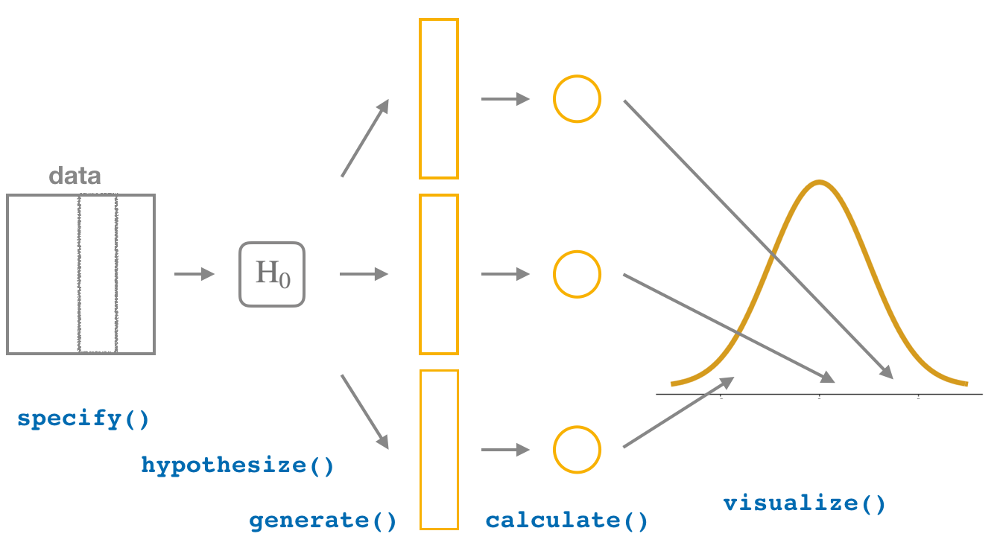

# Hypothesis Testing {#hypothesis-testing}  
    
```{r setup_hypo, include=FALSE, purl=FALSE}
chap <- 10
lc <- 0
rq <- 0
# **`r paste0("(LC", chap, ".", (lc <- lc + 1), ")")`**
# **`r paste0("(RQ", chap, ".", (rq <- rq + 1), ")")`**

knitr::opts_chunk$set(
  tidy = FALSE, 
  out.width = '\\textwidth', 
  fig.height = 4,
  warning = FALSE
  )

options(scipen = 99)#, digits = 3)

# Set random number generator seed value for replicable pseudorandomness. Why 76?
# https://www.youtube.com/watch?v=xjJ7FheCkCU
set.seed(76)
```


---


```{block, type='announcement', purl=FALSE}
**In preparation for our first print edition to be published by CRC Press in Fall 2019, we're remodeling this chapter a bit.  Don't expect major changes in content, but rather only minor changes in presentation. Our remodeling will be complete and available online at [ModernDive.com](https://moderndive.com/) by early Summer 2019!**
```


---


We saw some of the main concepts of hypothesis testing introduced in Chapters \@ref(sampling) and \@ref(confidence-intervals). We will expand further on these ideas here and also provide a framework for understanding hypothesis tests in general. Instead of presenting you with lots of different formulas and scenarios, we hope to build a way to think about all hypothesis tests.  You can then adapt to different scenarios as needed down the road when you encounter different statistical situations.

The same can be said for confidence intervals.  There was one general framework that applies to all confidence intervals and we elaborated on this using the `infer` package pipeline in Chapter \@ref(confidence-intervals). The specifics may change slightly for each variation, but the important idea is to understand the general framework so that you can apply it to more specific problems. We believe that this approach is much better in the long-term than teaching you specific tests and confidence intervals rigorously.  If you'd like more practice or to see how this framework applies to different scenarios, you can find fully-worked out examples for many common hypothesis tests and their corresponding confidence intervals in Appendix \@ref(appendixB).  

We recommend that you carefully review these examples as they also cover how the general frameworks apply to traditional normal-based methodologies like the $t$-test and normal-theory confidence intervals.  You'll see there that these traditional methods are just approximations for the general computational frameworks, but require conditions to be met for their results to be valid.  The general frameworks using randomization, simulation, and bootstrapping do not hold the same sorts of restrictions and further advance computational thinking, which is one big reason for their emphasis throughout this textbook.

### Needed packages {-}

Let's load all the packages needed for this chapter (this assumes you've already installed them). If needed, read Section \@ref(packages) for information on how to install and load R packages.

```{r message=FALSE, warning=FALSE}
library(tidyverse)
library(janitor)
library(infer)
library(moderndive)
library(ggplot2movies)
library(nycflights13)
```

```{r message=FALSE, warning=FALSE, echo=FALSE}
# Packages needed internally, but not in text.
library(knitr)
library(kableExtra)
library(gt)
#library(nycflights13)
#library(broom)
```


***

## Hypothesis testing activity {#ht-activity}

Let's build on the ideas shown in Chapters \@ref(sampling) and \@ref(confidence-intervals) via an activity. From this activity we'll discuss much of the terminology used in hypothesis testing via an example based on gender differences in promotions from a 1970's study.


### Question of interest

We will be looking to analyze "Are men and women rated for promotions differently?" We note again here as we did in Section \@ref(model4) that this study from 1974 only focused on the gender binary of `"male"` and `"female"`. We proceed with the example here to help to motivate the concepts of hypothesis testing via an interesting social question, but we again understand that a segment of our readers will not be included in this binary gender classification.

This data from this study in the "Journal of Applied Psychology" has been loaded into the `moderndive` package as `promotions`. The study looks into different personnel decisions including promotion, professional development, and whether or not a grant a leave of absence based on gender. For our purposes, we will focus on the promotion portion based on the decisions from 48 male bank supervisors in 1972.

To begin the study, the bank supervisors were asked to assume the role of a hypothetical personnel director of a bank with multiple branches. Every one of the bank supervisors was given a resume and asked whether or not the candidate on the resume was fit to be promoted to a new position in one of their branches. Each of these resumes was the same in terms of content and style with the only difference being that of the name at the top of the resume.

It was hypothesized based on other studies at the time and commonly held assumptions that male supervisors were more likely to grant male candidates promotions than female candidates. Does this study also back up this claim? Or does it not provide evidence that there is a positive difference in the proportion of males and females promoted based on reviews by male supervisors?

### What did we actually observe?

The `moderndive` package contains data from this 1974 study on the role of binary gender on promotions at banks in the `promotions` data frame. Let's look at what the data shows in this sample as a table using the `janitor` package we saw in Section \@ref(case-study-two-prop-ci).

```{r}
promotions
glimpse(promotions)
```

Let's lay out what this sample information looks like using decks of index cards. Let's take 48 note cards and assign them the `id` values of 1 to 48 and also whether or not that supervisor decided to promote from the second column of `promotions`. Set those in, say, 8 rows each with 6 entries from left to right and top to bottom. If you'd like you can denote `promoted` as green in color and `not` as red in color corresponding to common stoplight colors. Feel free to tweak this to different colors to assist with color-blind individuals as you like.

Then take a second deck of 24 index cards of a third color corresponding to "male" and lastly a third deck of 24 index cards for "female". Now, setup this original sample by correctly matching male or female to the `id` of the supervisor by looking at the third column of `promotions`. Place the card of appropriate gender next to each of the 48 supervisor cards matching up with what we saw in our original sample. Now let's aggregate the proportion of successes (promotions) based on the two genders using the `janitor` package.

```{r}
promotions %>% 
  tabyl(gender, decision) %>% 
  adorn_percentages() %>% 
  adorn_pct_formatting() %>% 
  # To show original counts
  adorn_ns()
```

We see that males were chosen for promotion at a rate of $21/24 = 87.5\%$ whereas females were chosen at a rate of $14/24 \approx 58.3\%$. This leads to an *observed test statistic* of around 29.2% (0.292) when taking the proportion of promotions for males minus the proportion of promotions for females. Does this provide evidence that there is some discrimination in terms of gender in promotions at banks? While males were suggested for promotion at a higher rate, sampling variability could be playing a role here. 

If males and females were equally likely of being selected for promotion (that there was no gender discrimination in promotion), how likely would we be to see a difference as large (or larger) than this difference of $\approx$ 0.292 (29.2%)? Is a result like this uncommon in samples, assuming there is no gender discrimination? Or are there lots of other potential samples that could lead to a result like this? 

In order to get to answer this question, we again will rely on the process of simulation to generate results. First let's build up a tactile simulation using notecards to understand what some instances assuming equal percentages for promoting males and females would look like. This process is called **permuting** and you'll see why next.

### Using permuting once

We assume the two population proportions are equal ($H_0: p_{male} - p_{female} = 0$). In other words, we assume that the proportion of males being selected for promotion ($p_{male}$) is the same as the proportion of females being selected for promotion ($p_{female}$). So what would our sample look like if we had made this assumption?

Going back to our index cards, pick up each of the 24 cards corresponding to males and females that you placed on top of the manager cards. The next step is to put the two stacks of index cards together, creating a new set of 48 cards.  If we assume that the two population means are equal, we are saying that there is no association between promotion and gender (male vs female). If there really is no association between these two variables than for each of the 48 managers, it wouldn't matter whether they saw the name of a male or female candidate on the resume they were given. They'd each be equally likely of granting a promotion for each of the two binary genders. So how do we do this with the cards?

Now that we have the our 48 cards corresponding to gender in a single pile, shuffle them. Feel free to do this a couple times. Now take each of the cards off the top of the pile and assign them to the 48 different supervisors. Keep the supervisor cards in the same place they were before. We are, thus, randomly assigning the different values of the **explanatory** variable to each of the entries of the **response** variable. To reiterate, we hold the response variable of `promotion` fixed by not shuffling those cards but we shuffle the values of `gender` as the explanatory variable. Let's check out what the first few rows of this permutation of the gender cards onto the supervisors might look like as data.

```{r compare-first-10, echo=FALSE}
set.seed(2019)
one_permute <- promotions %>%
  mutate(gender = sample(gender)) %>% 
  select(id, decision, gender)
first_10 <- list(promotions %>% slice(1:10),
                 one_permute %>% slice(1:10))
first_10 %>% 
  kable(
    caption = "\\label{tab:compare-first-10}First 10 rows of original (left) and permuted (right) data", 
    booktabs = TRUE,
    longtable = TRUE
  ) %>% 
  kable_styling(font_size = ifelse(knitr:::is_latex_output(), 10, 16),
                latex_options = c("HOLD_position", "repeat_header"))
```

We see that from the permuting of the gender cards we have the following new assignments to supervisors with `id`s of 2, 4, 5, 6, 7, 8, and 9. In these rows, the gender has switched on the presented resumes from what was in the original sample of resumes. The other rows (supervisors) have remained the same in terms of gender of their candidate. What does the difference in the promotion rates of males and females look like now our permuted data?


```{r echo=FALSE}
one_permute %>% 
  tabyl(gender, decision) %>% 
  adorn_percentages() %>% 
  adorn_pct_formatting() %>% 
  # To show original counts
  adorn_ns()
```

We can calculate the *test statistic* for this permutation now as well to get a value of $79.2\% - 66.7\% = 12.5\%$. So this is one potential sample statistic that could come about based on chance alone if there was in fact no gender discrimination in promotions. We could have each of many friends help us out here to generate more permutations and resulting differences in the proportions of successes. Let's do that 33 times as we did in the previous chapters.

### Using permuting 33 times

Now each of our 33 friends does the following:

1. Takes the two decks of cards.
2. Shuffles the cards corresponding to gender.
3. Assigns the shuffled cards to the original deck of supervisors' decisions.
4. Count how many cards fall into each of the four categories:
  - Promoted males
  - Non-promoted males
  - Promoted females
  - Non-promoted females
5. Determines the proportion of promoted males out of 24.
6. Determines the proportion of promoted females out of 24.
7. Subtracts those two differences to get a new value of the test statistic, assuming the null hypothesis is true.

Let's see what this leads to for our friends in terms of results and label where the observed test statistic falls in relation to our friends' statistics:

```{r}
obs_diff_prop <- promotions %>% 
  specify(decision ~ gender, success = "promoted") %>% 
  calculate(stat = "diff in props", order = c("male", "female"))
obs_diff_prop
```

```{r echo=FALSE}
set.seed(2019)
tactile_permutes <- promotions %>% 
  specify(decision ~ gender, success = "promoted") %>% 
  hypothesize(null = "independence") %>% 
  generate(reps = 33, type = "permute") %>% 
  calculate(stat = "diff in props", order = c("male", "female"))
ggplot(data = tactile_permutes, aes(x = stat)) +
  geom_histogram(binwidth = 0.05, boundary = -0.2, color = "white") +
  geom_vline(xintercept = pull(obs_diff_prop), color = "blue", size = 2) +
  scale_y_continuous(breaks = 0:10)
```

We see that of the 33 samples we selected only one is close to as extreme as what we observed. Thus, we might guess that we are starting to see some data suggesting that gender discrimination might be at play. Many the statistics calculated appear close to 0 with the vast remainder appearing around values of a difference of -0.1 and 0.1. So what further evidence would we need to make this suggestion a little clearer? More simulations! As we've done before in Chapters \@ref(sampling) and \@ref(confidence-intervals), we'll use the computer to simulate these permutations and calculations many times. Let's do just that with the `infer` package in the next section.

## Hypothesis testing with infer {#ht-infer}

### Revisiting the infer verb framework

In Chaper \@ref(confidence-intervals), you were introduced to the framework for inference including the following verbs: `specify()`, `generate()`, and `calculate()`. This was useful when calculating bootstrap distributions in order to develop confidence intervals in both the one-sample and two-sample cases. One of the great powers of the `infer` package is in extending confidence intervals to hypothesis testing by including one more verb: `hypothesize()`. Its main argument is `null` which is either 

- `"point"` for point hypotheses involving a single sample or
- `"independence"` for testing for independence between two variables.


```{r echo=FALSE, purl=FALSE}

```

Let's see how this is done with the gender discrimination study from Section \@ref(ht-activity).

### The `infer` pipeline for the activity

Remember that our goal here is to generate many different samples, assuming the null hypothesis is true. In doing so we will create a **null distribution**. This null distribution is similar to what we have seen so far with the *sampling distribution* in Chapter \@ref(sampling) and the *bootstrap distribution* in Chapter \@ref(confidence-intervals). Here though we have one more condition to apply in that we assume the null hypothesis is true, thus where the name of the *null* distribution comes from. The null distribution is still used to look at the variability from one sample to the next, but now we are interested in seeing where what we actually saw would fall on the "chance distribution." In doing so, we'll have a good sense for whether random chance is a good explanation for seeing the results in our observed sample or if there is something else going on which better aligns with $H_a$, the alternative hypothesis.

Let's explore the `infer` pipeline one more time here:

#### Choose the variables of interest {-}

We use the `specify()` verb to denote the response and, if needed, explanatory variables for our study. In this case, we are investigating `decision` as the response variable and `gender` as the explanatory variable. Recall that for the `formula` argument we use the notation `<response> ~ <explanatory>` where `<response`> is the name of the response variable in the data frame and `<explanatory>` is the name of the explanatory variable. Note also the importance of including which of the two levels here `"promoted"` or `"not"` is what we are defining as a success from the `decision` (response) variable.

```{r eval=FALSE}
promotions %>% 
  specify(formula = decision ~ gender, success = "promoted")
```

```{r echo=FALSE}
specify_ht <- promotions %>% 
  specify(formula = decision ~ gender, success = "promoted")
specify_ht
```

#### Set the model for the null hypothesis {-}

The next step after `specify()` for hypothesis tests is a new one: `hypothesize()`. Here the argument `null` gives which type of null hypothesis we are working with. In this case, we are testing for the independence of the two variables so we set `null = "independence"`. 

```{r eval=FALSE}
promotions %>% 
  specify(formula = decision ~ gender, success = "promoted")
  hypothesize(null = "independence")
```

```{r echo=FALSE}
hypothesize_ht <- specify_ht %>% 
  hypothesize(null = "independence")
hypothesize_ht
```


#### Replicate samples assuming the null hypothesis is true {-}

After we have set the model for the null hypothesis, we simulate the null hypothesis being true by permuting our original sample in much the same way as we did with index cards in Section \@ref(ht-activity). We'll now let the computer do this shuffling many times. Let's use the 1000 `reps` argument we've used before in the `generate()` verb, but this time generating permutations with `type = "permute"` instead of `type = "bootstrap"` that we used previously for confidence intervals in Chapter \@ref(confidence-intervals).

```{r eval=FALSE}
promotions %>% 
  specify(formula = decision ~ gender, success = "promoted")
  hypothesize(null = "independence") %>% 
  generate(reps = 1000, type = "permute")
```


```{r echo=FALSE}
generate_ht <- hypothesize_ht %>% 
  generate(reps = 1000, type = "permute")
generate_ht
```

#### Compute the statistic for each replicate {-}

Now that we have 1000 replicated samples assuming the null hypothesis of independence of the two variables `decision` and `gender`, we `calculate()` the difference in proportions (`"diff in props"`) for each permutation. We finish this step by including the `order` in which we'd like to take the difference. In this case, we've chosen `male` - `female`.

```{r eval=FALSE}
null_distribution_two_props <- promotions %>% 
  specify(formula = decision ~ gender, success = "promoted")
  hypothesize(null = "independence") %>% 
  generate(reps = 1000, type = "permute") %>% 
  calculate(stat = "diff in props", order = c("male", "female"))
null_distribution_two_props
```

```{r echo=FALSE}
null_distribution_two_props <- generate_ht %>% 
  calculate(stat = "diff in props", order = c("male", "female"))
null_distribution_two_props
```

We conclude by showing where our observed statistic falls on this null distribution. In the sections that follow, we'll delve further into how to make a decision about whether or not the observed statistic is "extreme enough" to be considered statistically significant. In other words, we'll investigate what level of statistical evidence is needed for us to go against the original assumption of random chance as the explanation for differences in the observed test statistic in favor of the alternative hypothesis.

```{r echo=FALSE}
ggplot(null_distribution_two_props, aes(x = stat)) +
  geom_histogram(bins = 10, color = "white") +
  geom_vline(xintercept = pull(obs_diff_prop), color = "blue", size = 2)
```

We now see even greater evidence that gender discrimination was at play in how males and females were assigned promotion. We now have almost all of the 1000 statistics of the null distribution not as extreme as our observed test statistic. We'll formalize this in the image below as well as in Section \@ref(p-value) where we define the term **p-value** in relation to this set-up.


### The "There Is Only One Test" framework {#only-one-test}

In a hypothesis test, we will use data from a sample to help us decide between two competing _hypotheses_ about a population.  We make these hypotheses more concrete by specifying them in terms of at least one _population parameter_ of interest.  We refer to the competing claims about the population as the **null hypothesis**, denoted by $H_0$, and the **alternative (or research) hypothesis**, denoted by $H_a$.  The roles of these two hypotheses are NOT interchangeable.  

- The claim for which we seek significant evidence is assigned to the alternative hypothesis.  The alternative is usually what the experimenter or researcher wants to establish or find evidence for.
- Usually, the null hypothesis is a claim that there really is "no effect" or "no difference."  In many cases, the null hypothesis represents the status quo or that nothing interesting is happening.  
- We assess the strength of evidence by assuming the null hypothesis is true and determining how unlikely it would be to see sample results/statistics as extreme (or more extreme) as those in the original sample.

Hypothesis testing brings about many weird and incorrect notions in the scientific community and society at large.  One reason for this is that statistics has traditionally been thought of as this magic box of algorithms and procedures to get to results and this has been readily apparent if you do a Google search of "flowchart statistics hypothesis tests."  There are so many different complex ways to determine which test is appropriate.  

You'll see that we don't need to rely on these complicated series of assumptions and procedures to conduct a hypothesis test any longer.  These methods were introduced in a time when computers weren't powerful.  Most cellphones (in 2019) have more power than the computers that sent NASA astronauts to the moon after all. We'll see that ALL hypothesis tests can be broken down into the following framework given by Allen Downey [here](http://allendowney.blogspot.com/2016/06/there-is-still-only-one-test.html):

```{r htdowney, echo=FALSE, fig.cap="Hypothesis Testing Framework", purl=FALSE}
knitr::include_graphics("images/ht.png")
```

In the examples that follow, we'll phrase things in terms of this framework by Downey, which is one of the inspirations for the `infer` package. Downey finishes off the process we have been working through so far with the shading of the **p-value** in Figure \@ref(fig:htdowney). But what does this shading mean? 

## The p-value {#p-value}

Remember that we are interested in seeing where our observed sample difference in proportions of `r pull(obs_diff_prop)` falls on this null/randomization distribution.  We are interested in seeing if males have a statistically higher rate of promotion so "more extreme" corresponds to values equal to or greater than what we saw.  Thus, we'll be looking for values as extreme or more extreme than what we saw in the right tail. Let's shade our null distribution to show a visual representation of our $p$-value:

```{r fig.cap="Shaded histogram to show p-value"}
visualize(null_distribution_two_props, bins = 10) + 
  shade_p_value(obs_stat = obs_diff_prop, direction = "right")
```

Remember that the observed difference in means was `r pull(obs_diff_prop)`.  We have shaded red all values at or above that value. At this point, it is important to take a guess as to what the $p$-value may be.  We can see that there are only a few permuted differences as extreme or more extreme than our observed effect (in both directions).  Maybe we guess that this $p$-value is somewhere around 2%, or maybe 3%, but certainly not 30% or more. Lastly, we calculate the $p$-value directly using `infer`:

```{r}
p_value <- null_distribution_two_props %>% 
  get_p_value(obs_stat = obs_diff_prop, direction = "both")
p_value
```


We have around `r pull(p_value) * 100`% of values as extreme or more extreme than our observed statistic in both directions. With hypothesis tests, it is common and recommended to first set the **significance level** of the test.  It is denoted as the Greek letter $\alpha$.  Common values for $\alpha$ are 0.1, 0.01, and 0.05 with 0.05 being the most common choice. This threshold is the point at which we decide that our observed results are "beyond a reasonable doubt." Assuming we are using a 5% significance level for $\alpha$, we have evidence supporting the conclusion that the proportion of males being chosen for promotion is greater than the proportion of females being chosen for promotion. The next important idea is to better understand just how much higher of a proportion for promotion can we expect the males to have compared to that of the females.

### Corresponding confidence interval

One of the great things about the `infer` pipeline is that going between hypothesis tests and confidence intervals is incredibly simple. To create a null distribution, we ran

```{r eval=FALSE}
null_distribution_two_props <- promotions %>% 
  specify(formula = decision ~ gender, success = "promoted") %>% 
  hypothesize(null = "independence") %>% 
  generate(reps = 1000, type = "permute") %>% 
  calculate(stat = "diff in props", order = c("male", "female"))
```

To get the corresponding bootstrap distribution with which we can compute a confidence interval, we can just remove or comment out the `hypothesize()` step since we are no longer assuming the null hypothesis is true when we bootstrap. We also switch the `type` in `generate()` to be `"bootstrap"` to denote the confidence interval calculation instead of permutations for hypothesis tests.

```{r}
percentile_ci_two_props <- promotions %>% 
  specify(formula = decision ~ gender, success = "promoted") %>% 
  #  hypothesize(null = "independence") %>% 
  generate(reps = 1000, type = "bootstrap") %>% 
  calculate(stat = "diff in props", order = c("male", "female")) %>% 
  get_ci()
```

Thus, we can expect the true proportion of men promoted in the relevant population to be `r percentile_ci_two_props[["2.5%"]]` to `r percentile_ci_two_props[["97.5%"]]` higher than that of females. Remember that this is based on bootstrapping using `promotions` as our original sample and the confidence interval process being 95% reliable.

```{block lc10-3b0, type='learncheck', purl=FALSE}
**_Learning check_**
```

**`r paste0("(LC", chap, ".", (lc <- lc + 1), ")")`** Conduct the same analysis comparing male and female promotion rates using the median rating instead of the mean rating? What was different and what was the same? 


**`r paste0("(LC", chap, ".", (lc <- lc + 1), ")")`** Describe in a paragraph how we used Allen Downey's diagram to conclude if a statistical difference existed between the promotion rate of males and females using this study.

**`r paste0("(LC", chap, ".", (lc <- lc + 1), ")")`** Why are we relatively confident that the distributions of the sample proportions will be good approximations of the population distributions of promotion proportions for the two genders?

**`r paste0("(LC", chap, ".", (lc <- lc + 1), ")")`** Using the definition of "$p$-value", write in words what the $p$-value represents for the hypothesis test above comparing the promotion rates for males and females.

**`r paste0("(LC", chap, ".", (lc <- lc + 1), ")")`** What is the value of the $p$-value for the hypothesis test comparing the mean rating of romance to action movies? How can it be interpreted in the context of the problem?


```{block, type='learncheck', purl=FALSE}
``` 

### Summary

To review, these are the steps one would take whenever you'd like to do a hypothesis test comparing
values from the distributions of two groups:

- Simulate many samples using a random process that matches the way
the original data were collected and that _assumes the null hypothesis is
true_. 

- Collect the values of a sample statistic for each sample created using this random process to build
a _null distribution_.

- Assess the significance of the _original_ sample by determining where
its sample statistic lies in the null distribution.

- If the proportion of values as extreme or more extreme than the observed statistic in the randomization
distribution is smaller than the pre-determined significance level $\alpha$, we reject $H_0$.  Otherwise,
we fail to reject $H_0$.  (If no significance level is given, one can assume $\alpha = 0.05$.)

## Interpretation of hypothesis testing results {#ht-interpretation}

Hypothesis tests are often challenging to understand at first. In this section, we'll focus on ways to help with deciphering of the process in general.

### Criminal trial analogy {#trial}

We can think of hypothesis testing in the same context as a criminal trial in the United States.  A criminal trial in the United States is a familiar situation in which a choice between two contradictory claims must be made. 

1. The accuser of the crime must be judged either guilty or not guilty.  

2. Under the U.S. system of justice, the individual on trial is initially presumed not guilty.  

3. Only STRONG EVIDENCE to the contrary causes the not guilty claim to be rejected in favor of a guilty verdict. 

4. The phrase "beyond a reasonable doubt" is often used to set the cutoff value for when enough evidence has been given to convict.

Theoretically, we should never say "The person is innocent." but instead "There is not sufficient evidence to show that the person is guilty."

Now let's compare that to how we look at a hypothesis test.

1. The decision about the population parameter(s) must be judged to follow one of two hypotheses.
	
2. We initially assume that $H_0$ is true.
	
3. The null hypothesis $H_0$ will be rejected (in favor of $H_a$) only if the sample evidence strongly suggests that $H_0$ is false.  If the sample does not provide such evidence, $H_0$ will not be rejected.

4.  The analogy to "beyond a reasonable doubt" in hypothesis testing is what is known as the **significance level**.  This will be set before conducting the hypothesis test and is denoted as $\alpha$.  Common values for $\alpha$ are 0.1, 0.01, and 0.05.

#### Two possible conclusions {-}

Therefore, we have two possible conclusions with hypothesis testing:

 - Reject $H_0$                
 - Fail to reject $H_0$
	
Gut instinct says that "Fail to reject $H_0$" should say "Accept $H_0$" but this technically is not correct.  Accepting $H_0$ is the same as saying that a person is innocent.  We cannot show that a person is innocent; we can only say that there was not enough substantial evidence to find the person guilty.

When you run a hypothesis test, you are the jury of the trial.  You decide whether there is enough evidence to convince yourself that $H_a$ is true ("the person is guilty") or that there was not enough evidence to convince yourself $H_a$ is true ("the person is not guilty").  You must convince yourself (using statistical arguments) which hypothesis is the correct one given the sample information.

**Important note:** Therefore, DO NOT WRITE "Accept $H_0$" any time you conduct a hypothesis test.  Instead write "Fail to reject $H_0$."


***


### Types of errors in hypothesis testing

Unfortunately, just as a jury or a judge can make an incorrect decision in regards to a criminal trial by reaching the wrong verdict, there is some chance we will reach the wrong conclusion via a hypothesis test about a population parameter.  As with criminal trials, this comes from the fact that we don't have complete information, but rather a sample from which to try to infer about a population.

The possible erroneous conclusions in a criminal trial are

- an innocent person is convicted (found guilty) or
- a guilty person is set free (found not guilty).

The possible errors in a hypothesis test are

- rejecting $H_0$ when in fact $H_0$ is true (Type I Error) or
- failing to reject $H_0$ when in fact $H_0$ is false (Type II Error).

The risk of error is the price researchers pay for basing an inference about a population on a sample.  With any reasonable sample-based procedure, there is some chance that a Type I error will be made and some chance that a Type II error will occur.

To help understand the concepts of Type I error and Type II error, observe the following table based on a criminal trial:

```{r trial-errors-table, echo=FALSE, fig.cap="Type I and Type II errors"}
if(knitr:::is_html_output()){
  verdict <- c("Guilty verdict", "Not guilty verdict")
  Guilty <- c("True Positive (Correct result)", 
              "False Negative (Type II Error)")
  `Not guilty` <- c("False Positive (Type I Error)", 
                    "True Negative (Correct result)")
  
  table_entries <- tibble(verdict, Guilty, `Not guilty`)
  
  table_entries %>% 
    gt(rowname_col = "verdict") %>% 
    tab_header(title = "Type I and Type II errors for US trials") %>% 
    tab_row_group(group = "Verdict")   %>% 
    tab_spanner(label = "Actual result",
                columns = vars(Guilty, `Not guilty`)) %>% 
    cols_align(align = "center") %>% 
    tab_options(table.width = pct(30))
} else {
  knitr::include_graphics("images/error-types.png")
}
```

If we are using sample data to make inferences about a parameter, we run the risk of making a mistake.  Obviously, we want to minimize our chance of error; we want a small probability of drawing an incorrect conclusion.

- The probability of a Type I Error occurring is denoted by $\alpha$ and is called the **significance level** of a hypothesis test
- The probability of a Type II Error is denoted by $\beta$.

Formally, we can define $\alpha$ and $\beta$ in regards to the table above, but for hypothesis tests instead of a criminal trial.

- $\alpha$ corresponds to the probability of rejecting $H_0$ when, in fact, $H_0$ is true.
- $\beta$ corresponds to the probability of failing to reject $H_0$ when, in fact, $H_0$ is false.

Ideally, we want $\alpha = 0$ and $\beta = 0$, meaning that the chance of making an error does not exist.  When we have to use incomplete information (sample data), it is not possible to have both $\alpha = 0$ and $\beta = 0$.  We will always have the possibility of at least one error existing when we use sample data.

Usually, what is done is that $\alpha$ is set before the hypothesis test is conducted and then the evidence is judged against that significance level.  Common values for $\alpha$ are 0.05, 0.01, and 0.10.  If $\alpha = 0.05$, we are using a testing procedure that, used over and over with different samples, rejects a TRUE null hypothesis five percent of the time.

So if we can set $\alpha$ to be whatever we want, why choose 0.05 instead of 0.01 or even better 0.0000000000000001?  Well, a small $\alpha$ means the test procedure requires the evidence against $H_0$ to be **very strong** before we can reject $H_0$.  This means we will almost never reject $H_0$ if $\alpha$ is very small.  If we almost never reject $H_0$, the probability of a Type II Error -- failing to reject $H_0$ when we should -- will *increase*!  Thus, as $\alpha$ decreases, $\beta$ increases and as $\alpha$ increases, $\beta$ decreases.  We, therefore, need to strike a balance in $\alpha$ and $\beta$ and the common values for $\alpha$ of 0.05, 0.01, and 0.10 usually lead to a nice balance.

```{block lc7-0, type='learncheck', purl=FALSE}
**_Learning check_**
```

**`r paste0("(LC", chap, ".", (lc <- lc + 1), ")")`**  Reproduce the table above about errors, but for a hypothesis test, instead of the one provided for a criminal trial.

```{block, type='learncheck', purl=FALSE}
```

#### Logic of hypothesis testing {-}

- Take a random sample (or samples) from a population (or multiple populations)
- If the sample data are consistent with the null hypothesis, do not reject the null hypothesis.
- If the sample data are inconsistent with the null hypothesis (in the direction of the alternative hypothesis), reject the null hypothesis and conclude that there is evidence the alternative hypothesis is true (based on the particular sample collected).


***


### Statistical significance

The idea that sample results are more extreme than we would reasonably expect to see by random chance if the null hypothesis were true is the fundamental idea behind statistical hypothesis tests.  If data at least as extreme would be very unlikely if the null hypothesis were true, we say the data are **statistically significant**.  Statistically significant data provide convincing evidence against the null hypothesis in favor of the alternative, and allow us to generalize our sample results to the claim about the population.

```{block lc7-1, type='learncheck', purl=FALSE}
**_Learning check_**
```

**`r paste0("(LC", chap, ".", (lc <- lc + 1), ")")`**  What is wrong about saying "The defendant is innocent." based on the US system of criminal trials?

**`r paste0("(LC", chap, ".", (lc <- lc + 1), ")")`**  What is the purpose of hypothesis testing?

**`r paste0("(LC", chap, ".", (lc <- lc + 1), ")")`**  What are some flaws with hypothesis testing?  How could we alleviate them?

```{block, type='learncheck', purl=FALSE}
```


***


## Case study: comparing two means {#ht-case-study}

### Randomization/permutation

We will now focus on building hypotheses looking at the difference between two population means in an example. We will denote population means using the Greek symbol $\mu$ (pronounced "mu"). Thus, we will be looking to see if one group "out-performs" another group.  This is quite possibly the most common type of statistical inference and serves as a basis for many other types of analyses when comparing the relationship between two variables. 

Our null hypothesis will be of the form $H_0: \mu_1 = \mu_2$, which can also be written as $H_0: \mu_1 - \mu_2 = 0$.  Our alternative hypothesis will be of the form $H_0: \mu_1 \star \mu_2$ (or $H_a:  \mu_1 - \mu_2 \, \star \, 0$) where $\star$ = $<$, $\ne$, or $>$ depending on the context of the problem. You needn't focus on these new symbols too much at this point.  It will just be a shortcut way for us to describe our hypotheses.

As we saw in Chapter \@ref(confidence-intervals), bootstrapping is a valuable tool when conducting inferences based on one or two population variables. From earlier in this chapter, we saw that the process of **permutation** (also known as **randomization**) can be valuable in conducting tests comparing values from two groups. In this case study, we'll explore how we can use permutation to compare quantitative values, instead of proportions of successes, from two groups.

### Comparing action and romance movies

The `movies` dataset in the `ggplot2movies` package contains information on a large number of movies that have been rated by users of IMDB.com [@R-ggplot2movies]. We are interested in the question here of whether `Action` movies are rated higher, on average, on IMDB than `Romance` movies. We will first need to do a little bit of data wrangling using the ideas from Chapter \@ref(wrangling) to get the data in the form that we would like:

```{r message=FALSE, warning=FALSE}
movies_trimmed <- movies %>% 
  select(title, year, rating, Action, Romance)
```

Note that `Action` and `Romance` are binary variables here. To remove any overlap of movies (and potential confusion) that are both `Action` and `Romance`, we will remove them from our _population_:

```{r}
movies_trimmed <- movies_trimmed %>%
  filter(!(Action == 1 & Romance == 1))
```

We will now create a new variable called `genre` that specifies whether a movie in our `movies_trimmed` data frame is an `"Action"` movie, a `"Romance"` movie, or `"Neither"`.  We aren't really interested in the `"Neither"` category here so we will exclude those rows as well.  Lastly, the `Action` and `Romance` columns are not needed anymore since they are encoded in the `genre` column.


```{r}
movies_trimmed <- movies_trimmed %>%
  mutate(genre = case_when( (Action == 1) ~ "Action",
                            (Romance == 1) ~ "Romance",
                            TRUE ~ "Neither")) %>%
  filter(genre != "Neither") %>%
  select(-Action, -Romance)
```
  
The `case_when()` function in the `dplyr` package is useful for assigning values in a new variable based on the values of one or more other variables. The last step of `TRUE ~ "Neither"` is used when a particular movie is not set to either Action or Romance.  
  
We are left with `r nrow(movies_trimmed)` movies in our _population_ dataset that focuses on only `"Action"` and `"Romance"` movies. Note that we call this a population dataset since it includes all of the information we have available to us about movies and ratings.
    
```{block lc7-2, type='learncheck', purl=FALSE}
**_Learning check_**
```

**`r paste0("(LC", chap, ".", (lc <- lc + 1), ")")`** Why are the different genre variables stored as binary variables (1s and 0s) instead of just listing the `genre` as a column of values like "Action", "Comedy", etc.?

**`r paste0("(LC", chap, ".", (lc <- lc + 1), ")")`** What complications could come above with us excluding action romance movies?  Should we question the results of our hypothesis test?  Explain.

```{block, type='learncheck', purl=FALSE}
```  

Let's now visualize the distributions of `rating` across both levels of `genre`.  Think about what type(s) of plot is/are appropriate here before you proceed:

```{r fig.cap="Rating vs genre in the population"}
ggplot(data = movies_trimmed, aes(x = genre, y = rating)) +
  geom_boxplot()
```

We can see that the middle 50% of ratings for `"Action"` movies is more spread out than that of `"Romance"` movies in the population.  `"Romance"` has outliers at both the top and bottoms of the scale though.  We are initially interested in comparing the mean `rating` across these two groups so a faceted histogram may also be useful:

```{r movie-hist, warning=FALSE, fig.cap="Faceted histogram of genre vs rating"}
ggplot(data = movies_trimmed, mapping = aes(x = rating)) +
  geom_histogram(binwidth = 1, color = "white") +
  facet_grid(genre ~ .)
```

**Important note:** Remember that we hardly ever have access to the population values as we do here.  This example was used to show how well hypothesis testing procedures using methods like permutation can do at testing hypotheses about population parameters. In nearly all circumstances, we'll be needing to use only a sample of the population to try to infer conclusions about the unknown population parameter values.  This example does show a nice relationship between statistics (where data is usually small and more focused on experimental settings) and data science (where data is frequently large and collected without experimental conditions). 

### Sampling $\rightarrow$ randomization
    
We can use hypothesis testing to investigate ways to determine, for example, whether a **treatment** has an effect over a **control** and other ways to statistically analyze if one group performs better than, worse than, or different than another. We are interested here in seeing how we can use a random sample of action movies and a random sample of romance movies from `movies` to determine if a statistical difference exists in the mean ratings of each group.

```{block lc7-3a, type='learncheck', purl=FALSE}
**_Learning check_**
```

**`r paste0("(LC", chap, ".", (lc <- lc + 1), ")")`** Define the relevant parameters here in terms of the populations of movies.

```{block, type='learncheck', purl=FALSE}
```

In what follows, we'll use the terminology from the "There is Only One Test" diagram discussed in Subsection \@ref(only-one-test). Carefully review it with the diagram handy to start to put the pieces together.

### Data

Let's select a random sample of 34 action movies and a random sample of 34 romance movies.  (The number 34 was chosen somewhat arbitrarily here.)

```{r}
set.seed(2017)
movies_genre_sample <- movies_trimmed %>% 
  group_by(genre) %>%
  sample_n(34) %>% 
  ungroup()
```

**Note** the addition of the `ungroup()` function here.  This will be useful shortly in allowing us to permute the values of `rating` across `genre`.  Our analysis does not work without this `ungroup()` function since the data stays grouped by the levels of `genre` without it. We can now observe the distributions of our two sample ratings for both groups.  Remember that these plots should be rough approximations of our population distributions of movie ratings for `"Action"` and `"Romance"` in our population of all movies in the `movies` data frame.

```{r fig.cap="Genre vs rating for our sample"}
ggplot(data = movies_genre_sample, aes(x = genre, y = rating)) +
  geom_boxplot()
```

```{r warning=FALSE, fig.cap="Genre vs rating for our sample as faceted histogram"}
ggplot(data = movies_genre_sample, mapping = aes(x = rating)) +
  geom_histogram(binwidth = 1, color = "white") +
  facet_grid(genre ~ .)
```

```{block lc7-3b1, type='learncheck', purl=FALSE}
**_Learning check_**
```

**`r paste0("(LC", chap, ".", (lc <- lc + 1), ")")`** What single value could we change to improve the approximation using the sample distribution on the population distribution?

```{block, type='learncheck', purl=FALSE}
```

Do we have reason to believe, based on the sample distributions of `rating` over the two groups of `genre`, that there is a significant difference between the mean `rating` for action movies compared to romance movies?  It's hard to say just based on the plots.  The boxplot does show that the median sample rating is higher for romance movies, but the histogram isn't as clear.  The two groups have somewhat differently shaped distributions but they are both over similar values of `rating`.  It's often useful to calculate the mean and standard deviation as well, conditioned on the two levels of the explanatory variable. We do so here to get the mean rating across the `"Action"` and `"Romance"` levels.

```{r}
summary_ratings <- movies_genre_sample %>% 
  group_by(genre) %>%
  summarize(mean = mean(rating),
            std_dev = sd(rating),
            n = n())
summary_ratings
```

```{block lc7-3b2, type='learncheck', purl=FALSE}
**_Learning check_**
```

**`r paste0("(LC", chap, ".", (lc <- lc + 1), ")")`** Why did we not specify `na.rm = TRUE` here as we did in Chapter \@ref(wrangling)?

```{block, type='learncheck', purl=FALSE}
```

We see that the sample mean rating for romance movies, $\overline{x}_{r}$, is greater than the similar measure for action movies, $\overline{x}_a$.  But is it statistically significantly greater (thus, leading us to conclude that the means are statistically different)?  The standard deviation can provide some insight here but with these standard deviations being so similar it's still hard to say for sure.

```{block lc7-3b3, type='learncheck', purl=FALSE}
**_Learning check_**
```

**`r paste0("(LC", chap, ".", (lc <- lc + 1), ")")`** Why might the standard deviation provide some insight about the means being statistically different or not?

```{block, type='learncheck', purl=FALSE}
```

### Model of $H_0$

The hypotheses we specified can also be written in another form to better give us an idea of what we will be simulating to create our null distribution.

- $H_0: \mu_r - \mu_a = 0$
- $H_a: \mu_r - \mu_a \ne 0$
  
### Test statistic $\delta$  
  
We are, therefore, interested in seeing whether the difference in the sample means, $\bar{x}_r - \bar{x}_a$, is statistically different than 0. We can now come back to our `infer` pipeline for computing our observed statistic. Note the `order` argument that shows the mean value for `"Action"` being subtracted from the mean value of `"Romance"`.

### Observed effect $\delta^*$

```{r}
obs_diff <- movies_genre_sample %>% 
  specify(formula = rating ~ genre) %>% 
  calculate(stat = "diff in means", order = c("Romance", "Action"))
obs_diff
```

Our goal next is to figure out a random process with which to simulate the null hypothesis being true. Recall that $H_0: \mu_r - \mu_a = 0$ corresponds to us assuming that the population means are the same. We would like to assume this is true and perform a random process to `generate()` data in the model of the null hypothesis.

### Simulated data

**Tactile simulation**

Here, with us assuming the two population means are equal ($H_0: \mu_r - \mu_a = 0$), we can look at this from a tactile point of view by using index cards.  There are $n_r = 34$ data elements corresponding to romance movies and $n_a = 34$ for action movies. We can write the 34 ratings from our sample for romance movies on one set of 34 index cards and the 34 ratings for action movies on another set of 34 index cards.  (Note that the sample sizes need not be the same.)

The next step is to put the two stacks of index cards together, creating a new set of 68 cards. If we assume that the two population means are equal, we are saying that there is no association between ratings and genre (romance vs action). We can use the index cards to create two **new** stacks for romance and action movies. In creating these two new stacks, we are assigning potentially new values to each of the movies in our sample via the process of permutation. Note that the **new** "romance movie stack" will likely have some of the original action movies in it and likewise for the "action movie stack" including some romance movies from our original set. Since we are assuming that each card is equally likely to have appeared in either one of the stacks this makes sense. First, we must shuffle all the cards thoroughly.  After doing so, in this case with equal values of sample sizes, we split the deck in half.

We then calculate the new sample mean rating of the romance deck, and also the new sample mean rating of the action deck. This creates one simulation of the samples that were collected originally.  We next want to calculate a statistic from these two samples. Instead of actually doing the calculation using index cards, we can use R as we have before to simulate this process. Let's do this just once and compare the results to what we see in `movies_genre_sample`.

```{r include=FALSE}
set.seed(2018)
```

```{r message=FALSE, warning=FALSE, include=FALSE, eval=FALSE}
shuffled_ratings_old <- #movies_trimmed %>%
  movies_genre_sample %>% 
     mutate(genre = mosaic::shuffle(genre)) %>% 
     group_by(genre) %>%
     summarize(mean = mean(rating))
diff(shuffled_ratings_old$mean)
```

```{r message=FALSE, warning=FALSE}
movies_genre_sample %>% 
  specify(formula = rating ~ genre) %>%
  hypothesize(null = "independence") %>% 
  generate(reps = 1) %>% 
  calculate(stat = "diff in means", order = c("Romance", "Action"))
```

```{block lc7-3b4, type='learncheck', purl=FALSE}
**_Learning check_**
```

**`r paste0("(LC", chap, ".", (lc <- lc + 1), ")")`** How would the tactile shuffling of index cards change if we had different samples of say 20 action movies and 60 romance movies?  Describe each step that would change.

**`r paste0("(LC", chap, ".", (lc <- lc + 1), ")")`** Why are we taking the difference in the means of the cards in the new shuffled decks?

```{block, type='learncheck', purl=FALSE}
```

### Distribution of $\delta$ under $H_0$

The `generate()` step completes a permutation sending values of ratings to potentially different values of `genre` from which they originally came. It simulates a shuffling of the ratings between the two levels of `genre` just as we could have done with index cards. We can now proceed in a similar way to what we have done previously with bootstrapping by repeating this process many times to create simulated samples, assuming the null hypothesis is true.

```{r include=FALSE}
if(!file.exists("rds/generated_samples.rds")){
  generated_samples <- movies_genre_sample %>% 
    specify(formula = rating ~ genre) %>% 
    hypothesize(null = "independence") %>% 
    generate(reps = 5000)
   saveRDS(object = generated_samples, 
           "rds/generated_samples.rds")
} else {
   generated_samples <- readRDS("rds/generated_samples.rds")
}
```

```{r eval=FALSE}
generated_samples <- movies_genre_sample %>% 
  specify(formula = rating ~ genre) %>% 
  hypothesize(null = "independence") %>% 
  generate(reps = 5000)
```


A **null distribution** of simulated differences in sample means is created with the specification of `stat = "diff in means"` for the `calculate()` step. Recall that the **null distribution** is similar to the bootstrap distribution we saw in Chapter \@ref(confidence-intervals), but remember that it consists of statistics generated assuming the null hypothesis is true, whereas a bootstrap distribution does not make this assumption.

```{r include=FALSE}
null_distribution_two_means <- generated_samples %>% 
  calculate(stat = "diff in means", order = c("Romance", "Action"))
```

```{r eval=FALSE}
null_distribution_two_means <- movies_genre_sample %>% 
  specify(formula = rating ~ genre) %>% 
  hypothesize(null = "independence") %>% 
  generate(reps = 5000) %>% 
  calculate(stat = "diff in means", order = c("Romance", "Action"))
```


We can now plot the distribution of these simulated differences in means:

```{r fig.cap="Simulated differences in means histogram"}
null_distribution_two_means %>% visualize()
```

### The p-value

Remember that we are interested in seeing where our observed sample mean difference of `r pull(obs_diff)` falls on this null/randomization distribution.  We are interested in simply a difference here so "more extreme" corresponds to values in both tails on the distribution.  Let's shade our null distribution to show a visual representation of our $p$-value:

```{r fig.cap="Shaded histogram to show p-value"}
visualize(null_distribution_two_means) + 
  shade_p_value(obs_stat = obs_diff, direction = "both")
```

Remember that the observed difference in means was `r pull(obs_diff)`.  We have shaded red all values at or above that value and also shaded red those values at or below its negative value (since this is a two-tailed test).  By giving `obs_stat = obs_diff` a vertical darker line is also shown at `r pull(obs_diff)`. To better estimate how large the $p$-value will be, we also increase the number of bins to 100 here from 20:

```{r fig.cap="Histogram with vertical lines corresponding to observed statistic"}
visualize(null_distribution_two_means, bins = 100) + 
  shade_p_value(bins = 100, obs_stat = obs_diff, direction = "both")
```

At this point, it is important to take a guess as to what the $p$-value may be.  We can see that there are only a few permuted differences as extreme or more extreme than our observed effect (in both directions).  Maybe we guess that this $p$-value is somewhere around 2%, or maybe 3%, but certainly not 30% or more. Lastly, we calculate the $p$-value directly using `infer`:

```{r}
pvalue <- null_distribution_two_means %>% 
  get_p_value(obs_stat = obs_diff, direction = "both")
pvalue
```


We have around `r pull(pvalue) * 100`% of values as extreme or more extreme than our observed statistic in both directions. Assuming we are using a 5% significance level for $\alpha$, we have evidence supporting the conclusion that the mean rating for romance movies is different from that of action movies.  The next important idea is to better understand just how much higher of a mean rating can we expect the romance movies to have compared to that of action movies.

### Corresponding confidence interval

One of the great things about the `infer` pipeline is that going between hypothesis tests and confidence intervals is incredibly simple. To create a null distribution, we ran

```{r eval=FALSE}
null_distribution_two_means <- movies_genre_sample %>% 
  specify(formula = rating ~ genre) %>% 
  hypothesize(null = "independence") %>% 
  generate(reps = 5000) %>% 
  calculate(stat = "diff in means", order = c("Romance", "Action"))
```

To get the corresponding bootstrap distribution with which we can compute a confidence interval, we can just remove or comment out the `hypothesize()` step since we are no longer assuming the null hypothesis is true when we bootstrap:

```{r}
percentile_ci_two_means <- movies_genre_sample %>% 
  specify(formula = rating ~ genre) %>% 
#  hypothesize(null = "independence") %>% 
  generate(reps = 5000) %>% 
  calculate(stat = "diff in means", order = c("Romance", "Action")) %>% 
  get_ci()
```

Note that we didn't originally set `type` in `generate()` but it was automatically set as `type = "permute"` based on the set-up of the problem. When we switch to build a confidence interval instead we change to `type = "bootstrap"` in `generate()` and we are giving a message here to confirm that decision.

```{r}
percentile_ci_two_means
```


Thus, we can expect the true mean of Romance movies on IMDB to have a rating `r percentile_ci_two_means[["2.5%"]]` to `r percentile_ci_two_means[["97.5%"]]` points higher than that of Action movies. Remember that this is based on bootstrapping using `movies_genre_sample` as our original sample and the confidence interval process being 95% reliable.

```{block lc7-3b, type='learncheck', purl=FALSE}
**_Learning check_**
```

**`r paste0("(LC", chap, ".", (lc <- lc + 1), ")")`** Conduct the same analysis comparing action movies versus romantic movies using the median rating instead of the mean rating. What was different and what was the same? 

**`r paste0("(LC", chap, ".", (lc <- lc + 1), ")")`** What conclusions can you make from viewing the faceted histogram looking at `rating` versus `genre` that you couldn't see when looking at the boxplot?

**`r paste0("(LC", chap, ".", (lc <- lc + 1), ")")`** Describe in a paragraph how we used Allen Downey's diagram to conclude if a statistical difference existed between mean movie ratings for action and romance movies.

**`r paste0("(LC", chap, ".", (lc <- lc + 1), ")")`** Why are we relatively confident that the distributions of the sample ratings will be good approximations of the population distributions of ratings for the two genres?

**`r paste0("(LC", chap, ".", (lc <- lc + 1), ")")`** Using the definition of "$p$-value", write in words what the $p$-value represents for the hypothesis test above comparing the mean rating of romance to action movies.

**`r paste0("(LC", chap, ".", (lc <- lc + 1), ")")`** What is the value of the $p$-value for the hypothesis test comparing the mean rating of romance to action movies?

**`r paste0("(LC", chap, ".", (lc <- lc + 1), ")")`** Do the results of the hypothesis test match up with the original plots we made looking at the population of movies?  Why or why not?

```{block, type='learncheck', purl=FALSE}
``` 

## Conclusion

### When inference is not needed

We've now walked through a couple of different examples of how to use the `infer` package to conduct hypothesis tests. Whenever possible we always started with some exploratory data analysis.  It's good to remember that there are cases where you need not perform a rigorous statistical inference. An important and time-saving skill is to **ALWAYS** do exploratory data analysis using `dplyr` and `ggplot2` before thinking about running a hypothesis test. As a beginner to statistical inference, this helps you to get an intuition as to when statistical significance may be found. As a seasoned practitioner, this helps to make sure you can make a sophisticated guess as to statistical significance before conducting the test. 

Let's look at such an example selecting a sample of flights traveling to Boston and to San Francisco from New York City in the `flights` data frame in the `nycflights13` package. (We will remove flights with missing data first using `na.omit` and then sample 100 flights going to each of the two airports.)

```{r}
bos_sfo <- flights %>% 
  na.omit() %>% 
  filter(dest %in% c("BOS", "SFO")) %>% 
  group_by(dest) %>% 
  sample_n(100)
```

Suppose we were interested in seeing if the `air_time` to SFO in San Francisco was statistically greater than the `air_time` to BOS in Boston. As suggested, let's begin with some exploratory data analysis to get a sense for how the two variables of `air_time` and `dest` relate for these two destination airports:

```{r}
bos_sfo_summary <- bos_sfo %>% group_by(dest) %>% 
  summarize(mean_time = mean(air_time),
            sd_time = sd(air_time))
bos_sfo_summary
```

Looking at these results, we can clearly see that SFO `air_time` is much larger than BOS `air_time`.  The standard deviation is also extremely informative here.

```{block lc6-2b, type='learncheck', purl=FALSE}
**_Learning check_**
```

**`r paste0("(LC", chap, ".", (lc <- lc + 1), ")")`** Could we make the same type of immediate conclusion that SFO had a statistically greater `air_time` if, say, its corresponding standard deviation was 200 minutes?  What about 100 minutes?  Explain.

```{block, type='learncheck', purl=FALSE}
```

To further understand just how different the `air_time` variable is for BOS and SFO, let's look at a boxplot:

```{r}
ggplot(data = bos_sfo, mapping = aes(x = dest, y = air_time)) +
  geom_boxplot()
```

Since there is no overlap at all in terms of the `air_time` values for the two destination airports, we can conclude that the `air_time` for San Francisco flights is statistically greater (at any level of significance) than the `air_time` for Boston flights.  This is a clear example of not needing to do anything more than some simple exploratory data analysis with descriptive statistics and data visualization to get an appropriate inferential conclusion.  This is one reason why you should **ALWAYS** investigate the sample data first using `dplyr` and `ggplot2` via exploratory data analysis (EDA). 
  
As you get more and more practice with hypothesis testing, you'll be better able to determine in many cases whether or not the results will be statistically significant. There are circumstances where it is difficult to tell, but you should always try to make a guess FIRST about significance after you have completed your data exploration and before you actually begin the inferential techniques.

### Problems with p-values

One of the inherent problems that comes from this "sneaking a peak" process using EDA is that the user must remain vigilant at conducting the test itself as needed. The hunt for statistically significant values is one that science has recently tried to combat. Done incorrectly and tirelessly, this is called "p-hacking" and is incredibly dangerous. Instead of reporting results that were not significant, p-hackers look to find significant results and then only report those. This sometimes involves changing the research question of interest to better meet the goals of statistically significant results that hopefully lead to publication.

**Note:** We personally as authors are in favor of reporting hypothesis tests but only with their corresponding confidence intervals as needed. And we also encourage our readers to take the pledge to not p-hack their results, but rather to be transparent about tests that did not bring statistical significance and discuss potential reasons for these failings as they can. This helps others to further test these results with new experiments.

There are lots of articles and much has been written recently about misunderstandings and the problems with p-values that we encourage readers to check out and to ponder on. Here are just a few:

<!-- Need to add these in as references to the book -->

1. [Misunderstandings of $p$-values](https://en.wikipedia.org/wiki/Misunderstandings_of_p-values)
2. [What a nerdy debate about p-values shows about science - and how to fix it](https://www.vox.com/science-and-health/2017/7/31/16021654/p-values-statistical-significance-redefine-0005)
3. [Statisticians issue warning over misuse of $P$ values](https://www.nature.com/news/statisticians-issue-warning-over-misuse-of-p-values-1.19503)
4. [You Can't Trust What You Read About Nutrition](https://fivethirtyeight.com/features/you-cant-trust-what-you-read-about-nutrition/)
5. [A Litany of Problems with p-values](http://www.fharrell.com/post/pval-litany/)

Point 5 advocates for using Bayesian inference instead of the "frequentist" methods we've shown throughout this book. We highly recommend that you do dig further into Bayesian methods if you'd like to expand your knowledge beyond this book, but they are beyond the scope of this book.


### Comparing confidence intervals and hypothesis tests

To follow-up on the previous sections and this and the previous chapter, it's important to understand what information hypothesis tests and confidence intervals provide. In short, hypothesis tests are aligned with statistical significance whereas confidence intervals are more aligned with practical significance. Like we saw in the movie ratings example, the hypothesis test told us that we had evidence that action and romance movies had a different mean rating. This is statistical significance. 

We also found a range of plausible values for what the mean difference in ratings for action versus romance movies we'd expect to see. This gave us some practical evidence that we could use in later analyses. Thus, confidence intervals are the recommended go-to method since they can be both used to check for a statistical difference between a quantitative calculation on two variables (by checking for the inclusion of 0 in the interval) and also for providing some practicality as well.

### Summary table {#ht-conclusion-table}

In this chapter, we performed both tactile and virtual simulations of permutation to infer about hypotheses on unknown parameters. We also presented a case study of permuting in a real-life situation: movie ratings of action and romance movies. We used the difference in sample proportions $\widehat{p}_1 - \widehat{p}_2$ to estimate the difference in population proportions $p_1 - p_2$. We similarly used the difference in sample means $\overline{x}_1 - \overline{x}_2$ to estimate the difference in population mean $\mu_1 - \mu_2$. Here we use 1 and 2 to represent two different groups, but one could use other subscripts as needed to denote the groups. Let's review these and others one more time in Table \@ref(tab:summarytable-ch10). 

```{r summarytable-ch10, echo=FALSE, message=FALSE}
# The following Google Doc is published to CSV and loaded below using read_csv() below:
# https://docs.google.com/spreadsheets/d/1QkOpnBGqOXGyJjwqx1T2O5G5D72wWGfWlPyufOgtkk4/edit#gid=0

"https://docs.google.com/spreadsheets/d/e/2PACX-1vRd6bBgNwM3z-AJ7o4gZOiPAdPfbTp_V15HVHRmOH5Fc9w62yaG-fEKtjNUD2wOSa5IJkrDMaEBjRnA/pub?gid=0&single=true&output=csv" %>% 
  read_csv(na = "") %>% 
  kable(
    caption = "\\label{tab:summarytable-ch9}Scenarios of sampling for inference", 
    booktabs = TRUE,
    escape = FALSE
  ) %>% 
  kable_styling(font_size = ifelse(knitr:::is_latex_output(), 10, 16),
                latex_options = c("HOLD_position")) %>%
  column_spec(1, width = "0.5in") %>% 
  column_spec(2, width = "0.7in") %>%
  column_spec(3, width = "1in") %>%
  column_spec(4, width = "1.1in") %>% 
  column_spec(5, width = "1in")
```

We'll cover the remaining scenario as follows, using the terminology, notation, and definitions related to sampling you saw in Section \@ref(sampling-framework):

* In Chapter \@ref(inference-for-regression), we'll cover an example of statistical inference for the relationship between teaching score and various instructor demographic variables you saw in Chapter \@ref(regression) on basic regression and Chapter \@ref(multiple-regression) on multiple regression. Specifically
    + Scenario 5: The intercept $\beta_0$ of some population regression line.
    + Scenario 6: The slope $\beta_1$ of some population regression line.


### Building theory-based methods using computation {#theory-hypo}

As a point of reference, we will now discuss the traditional theory-based way to conduct the hypothesis test for determining if there is a statistically significant difference in the sample mean rating of Action movies versus Romance movies. This method and ones like it work very well when the assumptions are met in order to run the test.  hey are based on probability models and distributions such as the normal and $t$-distributions. Recall that we briefly discussed the normal distribution in Subsection \@ref(theory-ci). We will extend that to look at the $t$-distribution here.

These traditional methods have been used for many decades back to the time when researchers didn't have access to computers that could run 5000 simulations in a few seconds.  They had to base their methods on probability theory instead.  Many fields and researchers continue to use these methods and that is the biggest reason for their inclusion here.  It's important to remember that a hypothesis test based on the $t$ distribution (commonly called a $t$-test) or a test based on the normal distribution (commonly called a $z$-test) is really just an approximation of what you have seen in this chapter already using simulation and randomization.  The focus here is on understanding how the shape of the $t$-curve comes about without digging much into the mathematical underpinnings.

#### Example: $t$-test for two independent samples {-}

What is commonly done in statistics is the process of standardization.  What this entails is calculating the mean and standard deviation of a variable.  Then you subtract the mean from each value of your variable and divide by the standard deviation.  The most common standardization is known as the $z$-score.  The formula for a $z$-score is 

$$Z = \frac{x - \mu}{\sigma},$$

where $x$ represent the value of a variable, $\mu$ represents the mean of the variable, and $\sigma$ represents the standard deviation of the variable.  Thus, if your variable has 10 elements, each one has a corresponding $z$-score that gives how many standard deviations away that value is from its mean.  $z$-scores are normally distributed with mean 0 and standard deviation 1.  They have the common, bell-shaped pattern seen below.

```{r echo=FALSE}
ggplot(data.frame(x = c(-4, 4)), aes(x)) + stat_function(fun = dnorm) +
  ylab("") +
  theme(axis.title.y = element_blank(),
        axis.text.y = element_blank(),
        axis.ticks.y = element_blank())
```

Recall, that we hardly ever know the mean and standard deviation of the population of interest. This is almost always the case when considering the means of two independent groups. To help account for us not knowing the population parameter values, we can use the sample statistics instead, but this comes with a bit of a price in terms of complexity.

Another form of standardization occurs when we need to use the sample standard deviations as estimates for the unknown population standard deviations.  This standardization is often called the $t$-score.  For the two independent samples case like what we have for comparing action movies to romance movies, the formula is $$T =\dfrac{ (\bar{x}_1 - \bar{x}_2) - (\mu_1 - \mu_2)}{ \sqrt{\dfrac{{s_1}^2}{n_1} + \dfrac{{s_2}^2}{n_2}}  }$$
  
There is a lot to try to unpack here.  

- $\bar{x}_1$ is the sample mean response of the first group
- $\bar{x}_2$ is the sample mean response of the second group
- $\mu_1$ is the population mean response of the first group
- $\mu_2$ is the population mean response of the second group
- $s_1$ is the sample standard deviation of the response of the first group
- $s_2$ is the sample standard deviation of the response of the second group
- $n_1$ is the sample size of the first group
- $n_2$ is the sample size of the second group
  
<!-- Should we include a reference to https://en.wikipedia.org/wiki/Welch%27s_t-test here? -->  
  
Assuming that the null hypothesis is true ($H_0: \mu_1 - \mu_2 = 0$), $T$ is said to be distributed following a $t$ distribution with degrees of freedom "roughly equal to" the smaller value of $n_1 + n_2 - 2$.  The "degrees of freedom" can be thought of measuring how different the $t$ distribution will be as compared to a normal distribution. The "roughly equal to" here corresponds to the formula for degrees of freedom being a bit more complicated than this simple expression, but we've found the formula to be beyond the scope of this book since it does little to build the intuition of the $t$-test. Small sample sizes lead to small degrees of freedom and, thus, $t$ distributions that have more values in the tails of their distributions. Large sample sizes lead to large degrees of freedom and, thus, $t$ distributions that closely align with the standard normal, bell-shaped curve. 
  
So, assuming $H_0$ is true, our formula simplifies a bit:

$$T =\dfrac{ \bar{x}_1 - \bar{x}_2}{ \sqrt{\dfrac{{s_1}^2}{n_1} + \dfrac{{s_2}^2}{n_2}}  }.$$
  
We have already built an approximation for what we think the distribution of $\delta = \bar{x}_1 - \bar{x}_2$ looks like using randomization above.  Recall this distribution:

```{r fig.cap="Simulated differences in means histogram"}
ggplot(data = null_distribution_two_means, aes(x = stat)) +
  geom_histogram(color = "white", bins = 20)
```

The `infer` package also includes some built-in theory-based statistics as well, so instead of going through the process of trying to transform the difference into a standardized form, we can just provide a different value for `stat` in `calculate()`. Recall the `generated_samples` data frame created via:

```{r eval=FALSE}
generated_samples <- movies_genre_sample %>% 
  specify(formula = rating ~ genre) %>% 
  hypothesize(null = "independence") %>% 
  generate(reps = 5000)
```

We can now created a null distribution of $t$ statistics:

```{r}
null_distribution_t <- generated_samples %>% 
  calculate(stat = "t", order = c("Romance", "Action"))
null_distribution_t %>% visualize()
```

We see that the shape of this `stat = "t"` distribution is the same as that of `stat = "diff in means"`.  The scale has changed though with the $t$ values having less spread than the difference in means.

A traditional $t$-test doesn't look at this simulated distribution, but instead it looks at the $t$-curve with degrees of freedom equal to `r attr(null_distribution_t, "distr_param")`. This calculation is based on the complicated formula referenced above. (Note that this value is pretty close to the "roughly equal to" number of $34 + 34 - 2 = 66$.) We can overlay this distribution over the top of our permuted $t$ statistics using the `method = "both"` setting in `visualize()`.

```{r}
null_distribution_t %>% 
  visualize(method = "both")
```

We can see that the curve does a good job of approximating the randomization distribution here. (More on when to expect for this to be the case when we discuss conditions for the $t$-test in a bit.) To calculate the $p$-value in this case, we need to figure out how much of the total area under the $t$-curve is at our observed $T$-statistic or more, plus also adding the area under the curve at the negative value of the observed $T$-statistic or below.  (Remember this is a two-tailed test so we are looking for a difference--values in the tails of either direction.)  Just as we converted all of the simulated values to $T$-statistics, we must also do so for our observed effect $\delta^*$:

```{r}
obs_t <- movies_genre_sample %>% 
  specify(formula = rating ~ genre) %>% 
  calculate(stat = "t", order = c("Romance", "Action"))
```

So graphically we are interested in finding the percentage of values that are at or above `obs_t = ``r pull(obs_t)` or at or below `-obs_t = ``r -pull(obs_t)`.

```{r warning=TRUE, message=TRUE}
visualize(null_distribution_t, method = "both") +
  shade_p_value(obs_stat = obs_t, direction = "both")
```

As we might have expected with this just being a standardization of the difference in means statistic that produced a small $p$-value, we also have a very small one here.

#### Conditions for t-test {-}

The `infer` package does not automatically check conditions for the theoretical methods to work and this warning was given when we used `method = "both"`. In order for the results of the $t$-test to be valid, three conditions must be met:

1. Independent observations in both samples
2. Nearly normal populations OR large sample sizes ($n \ge 30$)
3. Independently selected samples

Condition 1:  This is met since we sampled at random using R from our population.

Condition 2:  Recall from Figure \@ref(fig:movie-hist), that we know how the populations are distributed.  Both of them are close to normally distributed.  If we are a little concerned about this assumption, we also do have samples of size larger than 30 ($n_1 = n_2 = 34$).

Condition 3:  This is met since there is no natural pairing of a movie in the Action group to a movie in the Romance group.

Since all three conditions are met, we can be reasonably certain that the theory-based test will match the results of the randomization-based test using shuffling.  Remember that theory-based tests can produce some incorrect results in these assumptions are not carefully checked.  The only assumption for randomization and computational-based methods is that the sample is selected at random.  They are our preference and we strongly believe they should be yours as well, but it's important to also see how the theory-based tests can be done and used as an approximation for the computational techniques until at least more researchers are using these techniques that utilize the power of computers.

### Additional resources

An R script file of all R code used in this chapter is available [here](scripts/10-hypothesis-testing.R).


### What's to come

We conclude by showing the `infer` pipeline diagram. In Chapter \@ref(inference-for-regression), we'll come back to regression and see how the ideas covered in Chapter \@ref(confidence-intervals) and this chapter can help in understanding the significance of predictors in modeling.

```{r echo=FALSE, purl=FALSE}
knitr::include_graphics("images/flowcharts/infer/ht_diagram.png")
```

