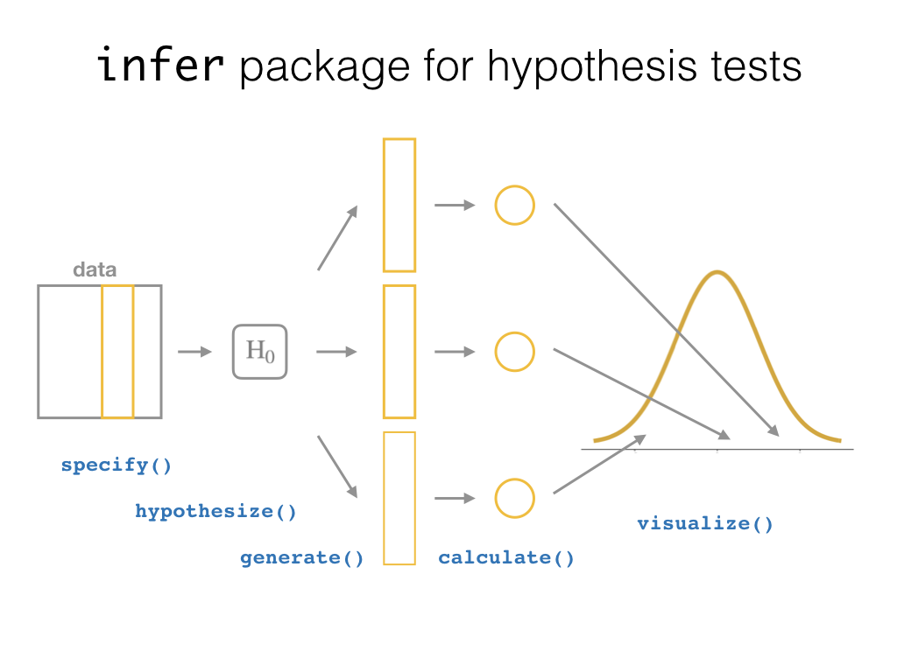

# Hypothesis Testing {#hypothesis-testing}  
    
```{r setup_hypo, include=FALSE, purl=FALSE}
chap <- 10
lc <- 0
rq <- 0
# **`r paste0("(LC", chap, ".", (lc <- lc + 1), ")")`**
# **`r paste0("(RQ", chap, ".", (rq <- rq + 1), ")")`**

knitr::opts_chunk$set(
  tidy = FALSE, 
  out.width = '\\textwidth', 
  fig.height = 4,
  warning = FALSE
)

# This bit of code is a bug fix on asis blocks, which we use to show/not show LC
# solutions, which are written like markdown text. In theory, it shouldn't be
# necessary for knitr versions <=1.11.6, but I've found I still need to for
# everything to knit properly in asis blocks. More info here: 
# https://stackoverflow.com/questions/32944715/conditionally-display-block-of-markdown-text-using-knitr
library(knitr)
knit_engines$set(asis = function(options) {
  if (options$echo && options$eval) knit_child(text = options$code)
})

# This controls which LC solutions to show. Options for solutions_shown: "ALL"
# (to show all solutions), or subsets of c('3-1', '3-2','3-3'), including the
# null vector c('') to show no solutions.
solutions_shown <- c("")
show_solutions <- function(section){
  return(solutions_shown == "ALL" | section %in% solutions_shown)
  }
```

---

```{block, type='learncheck', purl=FALSE}
**Note: This chapter is still under construction. If you would like to contribute, please check us out on GitHub at <https://github.com/moderndive/moderndive_book>.**

**Please check out our sneak peak of `infer` below in the meanwhile. For more details on `infer` visit <https://infer-dev.netlify.com/>**.

<center>

</center>
```

---


## Sneak peak of `infer`

<center>

</center>


* **Question**: Of all the cars in the `mtcars` dataset, do automatic cars get better gas mileage than manual cars?
* **Approach**: Two-sample test for difference in means.

```{r, message=FALSE, warning=FALSE}
library(dplyr)
library(ggplot2)
library(infer)

# Clean data
mtcars <- mtcars %>%
  as_tibble() %>% 
  mutate(am = factor(am))

# Observed test statistic
obs_diff <- mtcars %>% 
  specify(mpg ~ am) %>%
  calculate(stat = "diff in means", order = c("1", "0"))

# Simulate null distribution of two-sample difference in means:
null_distribution <- mtcars %>%
  specify(mpg ~ am) %>%
  hypothesize(null = "independence") %>%
  generate(reps = 1000, type = "permute") %>% 
  calculate(stat = "diff in means", order = c("1", "0"))

# Visualize:
null_distribution %>% 
  visualize(obs_stat = obs_diff, direction = "greater")
```


---


## Under construction...

```{r echo=FALSE, purl=FALSE}
knitr::include_graphics("images/flowcharts/infer/ht.png")
```

```{r echo=FALSE, purl=FALSE}
knitr::include_graphics("images/flowcharts/infer/ht_diagram.png")
```


### Script of R code

An R script file of all R code used in this chapter is available [here](https://moderndive.netlify.com/scripts/10-hypothesis-testing.R).

