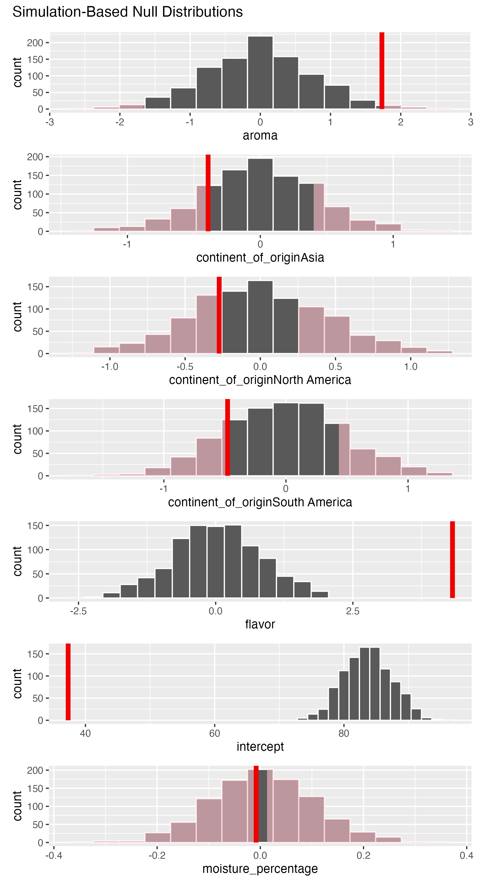

# Inference for Regression {#inference-for-regression}

```{r setup_inference_regression, include=FALSE, purl=FALSE}
# Used to define Learning Check numbers:
chap <- 10
lc <- 0

# Set R code chunk defaults:
opts_chunk$set(
  echo = TRUE,
  eval = TRUE,
  warning = FALSE,
  message = TRUE,
  tidy = FALSE,
  purl = TRUE,
  out.width = "\\textwidth",
#  fig.height = 4,
  fig.align = "center"
)

# Set output digit precision
options(scipen = 99, digits = 3)

# Set random number generator see value for replicable pseudo-randomness.
set.seed(76)
```

In this chapter, we revisit the regression model studied in Chapters \@ref(regression) and \@ref(multiple-regression). 
We do it by taking into account the inferential statistics methods introduced in Chapters \@ref(confidence-intervals) and \@ref(hypothesis-testing). 
We will show that when applying the linear regression methods introduced earlier on sample data, we can gain insight into the relationships between the response and explanatory variables of an entire population.

## Needed packages {#inf-packages .unnumbered}

If needed, read Section \@ref(packages) for information on how to install and load R packages. 

```{r message=FALSE}
library(tidyverse)
library(moderndive)
library(infer)
library(gridExtra)
```

Recall that loading the `tidyverse` package loads many packages that we have encountered earlier. For details refer to Section \@ref(tidyverse-package). The packages `moderndive` and `infer` contain functions and data frames that will be used in this chapter.

```{r message=FALSE, echo=FALSE, purl=FALSE}
# Packages needed internally, but not in text.
library(tidyr)
library(kableExtra)
library(patchwork)
library(GGally)
```

## The simple linear regression model

### UN member states revisited

We briefly review the example of UN member states covered in Section \@ref(model1). 
Data on the current UN member states, as of 2024, can be found in the `un_member_states_2024` data frame included in the `moderndive` package. 
As we did in Section \@ref(model1), we save these data as a new data frame called `UN_data_ch10`, `select()` the required variables, and include rows without missing data using `na.omit()`:

```{r}
UN_data_ch10 <- un_member_states_2024 |>
  select(country,
         life_exp = life_expectancy_2022, 
         fert_rate = fertility_rate_2022)|>
  na.omit()
```

```{r eval=FALSE}
UN_data_ch10
```

```{r echo=FALSE}
n_UN_data_ch10 <- nrow(UN_data_ch10)
```

```{r echo=FALSE}
un_member_states_2024 |>
  select(life_exp = life_expectancy_2022, 
         fert_rate = fertility_rate_2022)|>
  na.omit() |>
  tidy_summary() |> 
  kbl() |> 
  kable_styling(
    font_size = ifelse(is_latex_output(), 10, 16),
    latex_options = c("HOLD_position")
  )
```

Above we show the summary of the two numerical variables. 
Observe that there are `r n_UN_data_ch10` observations without missing values. 
Using simple linear regression \index{regression!simple linear} between the response variable fertility rate (`fert_rate`) or $y$, and the regressor life expectancy (`life_exp`) or $x$, the regression line is:

$$
\widehat{y}_i = b_0 + b_1 \cdot x_i.
$$

We have presented this equation in Section \@ref(model1), but we now add the subscript $i$ to represent the $i$th observation or country in the UN dataset, and we let $i = 1$, $\dots$, $n$ with $n = `r n_UN_data_ch10`$ for this UN data.
The value $x_i$ represents the life expectancy value for the $i$th member state, and $\widehat{y}_i$ is the fitted fertility rate for the $i$th member state.
The fitted fertility rate is the result of the regression line and is typically different than the observed response $y_i$. 
The residual is given as the difference $y_i - \widehat{y}_i$. 

As discussed in Subsection \@ref(leastsquares), the intercept ($b_0$) and slope ($b_1$) are the regression coefficients, such that the regression line is the "best-fitting" line based on the least-squares criterion. 
In other words, the fitted values $\widehat{y}$ calculated using the least-squares coefficients ($b_0$ and $b_1$) minimize the *sum of the squared residuals*:

$$
\sum_{i=1}^{n}(y_i - \widehat{y}_i)^2
$$

As we did in Section \@ref(model1), we fit the linear regression model. 
By "fit" we mean to calculate the regression coefficients, $b_0$ and $b_1$, that minimize the sum of squared residuals.
To do this in R, we use the `lm()` function with the formula `fert_rate ~ life_exp` and save the solution in `simple_model`:

```{r, eval=FALSE}
simple_model <- lm(fert_rate ~ life_exp, data = UN_data_ch10)
coef(simple_model)
```

```{r, echo=FALSE, purl=FALSE}
# Fit regression model:
simple_model <- lm(fert_rate ~ life_exp, 
                   data = UN_data_ch10)
b0 <- round(coef(simple_model),2)
# Get the coefficients of the model
lm_data <- data.frame("Coefficients" = c("b0", "b1"),
                      "Values" = coefficients(simple_model))
kbl(lm_data)|>
  kable_styling(
    font_size = ifelse(is_latex_output(), 10, 16),
    latex_options = c("HOLD_position")
  )
```

The regression line is $\widehat{y}_i = b_0 + b_1 \cdot x_i = `r lm_data$Values[1]` - `r abs(lm_data$Values[2])` \cdot x_i$, where $x_i$ is the life expectancy for the $i$th country and $\widehat{y}_i$ is the corresponding fitted fertility rate. 
The $b_0$ coefficient is the intercept and has a meaning only if the range of values of the regressor, $x_i$, includes zero. 
Since life expectancy is always a positive value, we do not provide any interpretation to the intercept in this example.
The $b_1$ coefficient is the slope of the regression line; for any country, if the life expectancy were to increase by about one year, we would expect an associated reduction of the fertility rate by about 0.137 units.

We visualize the relationship of the data observed in Figure \@ref(fig:regline-ch10) by plotting the scatterplot of fertility rate against life expectancy for all the UN member states with complete data.
We also include the regression line using the least-squares criterion:

```{r regline-ch10, fig.cap="Relationship with regression line.", fig.height=ifelse(knitr::is_latex_output(), 3, 4), message=FALSE}
ggplot(UN_data_ch10, aes(x = life_exp, y = fert_rate)) +
  geom_point() +
  labs(x = "Life Expectancy (x)", 
       y = "Fertility Rate (y)",
       title = "Relationship between fertility rate and life expectancy") +  
  geom_smooth(method = "lm", se = FALSE, linewidth = 0.5)
```

Finally, we review how to determine the fitted values and residuals for observations in the dataset.
France is one of the UN member states, and suppose we want to determine the fitted fertility rate for France based on the linear regression.
We start by determining what is the location of France in the `UN_data_ch10` data frame, using `rowid_to_column()` and `filter()` with the variable country equal to "France."
The `pull()` function converts the row number as a data frame to a single value:

```{r eval=FALSE}
UN_data_ch10 |>
  rowid_to_column() |>
  filter(country == "France")|>
  pull(rowid)
```

```{r echo=FALSE}
france_id <- UN_data_ch10 |>
  rowid_to_column() |>
  filter(country == "France")|>
  pull(rowid)
france_id
```

France is the `r france_id`th member state in `UN_data_ch10`. Its observed fertility rate and life expectancy are:

```{r eval=FALSE}
UN_data_ch10 |>
  filter(country == "France")
```

```{r echo=FALSE}
france_data <- UN_data_ch10 |>
  filter(country == "France")
france_data
```

```{r echo=FALSE}
actual_france <- france_data$fert_rate[1]
fitted_france <- lm_data$Values[1] - abs(lm_data$Values[2]) * france_data$life_exp[1]
resid_france <- actual_france - fitted_france
```

France's life expectancy is $x_{`r france_id`} = `r france_data$life_exp[1]`$ years and the fertility rate is $y_{`r france_id`} =`r france_data$fert_rate[1]`$. 
Using the regression line from earlier, we can determine France's fitted fertility rate:

$$
\begin{aligned}
\widehat{y}_{57} &= `r lm_data$Values[1]` - `r abs(lm_data$Values[2])` \cdot x_{`r france_id`}\\
&= `r lm_data$Values[1]` - `r abs(lm_data$Values[2])` \cdot `r france_data$life_exp[1]`\\
&= `r fitted_france`.
\end{aligned}
$$ 

Based on our regression line we would expect France's fertility rate to be `r lm_data$Values[1] - abs(lm_data$Values[2]) * france_data$life_exp[1]`. 
The observed fertility rate for France was `r france_data$fert_rate[1]`, so the residual for France is $y_{`r france_id`} - \widehat{y}_{`r france_id`} = `r actual_france` - `r fitted_france` = `r resid_france`$.

Using R we are not required to manually calculate the fitted values and residual for each UN member state. 
We do this directly using the regression model `simple_model` and the `get_regression_points()` function. 
To do this only for France, we `filter()` the `r france_id`th observation in the data frame.

```{r eval=FALSE}
simple_model |>
  get_regression_points() |>
  filter(ID == 57)
```

```{r fittedtable-ch10, echo=FALSE, purl= FALSE}
get_regression_points(simple_model) |>
  filter(ID == 57)|>
  kbl()|>
  kable_styling(
    font_size = ifelse(is_latex_output(), 10, 16),
    latex_options = c("HOLD_position")
  )
```

We can retrieve this information for each observation. 
Here we show the first few rows:

```{r fittedtable-ch10-all}
simple_model |>
  get_regression_points()
```

This concludes our review of material covered in Section \@ref(model1). We now explain how to use this information for statistical inference.

### The model {#simple-linear-model}

As we did in Chapters \@ref(confidence-intervals) on confidence intervals and \@ref(hypothesis-testing) on hypothesis testing, we present this problem in the context of a population and associated parameters of interest. 
We then collect a random sample from this population and use it to estimate these parameters.

We assume that this population has a response variable ($Y$), an explanatory variable ($X$), and there is a *statistical linear relationship* between these variables, given by the linear model

$$Y = \beta_0 + \beta_1 \cdot X + \epsilon,$$ 

where $\beta_0$ is the population intercept and $\beta_1$ is the population slope. 
These are now the parameters of the model that alongside the explanatory variable ($X$) produce the equation of a line. 
The statistical part of this relationship is given by $\epsilon$, a random variable called the *error term*. 
The error term accounts for the portion of $Y$ that is not explained by the line.

We make additional assumptions about the distribution of the error term, $\epsilon$. 
The assumed expected value of the error term is zero, and the assumed standard deviation is equal to a positive constant called $\sigma$, or in mathematical terms:  $E(\epsilon) = 0$ and $SD(\epsilon) = \sigma.$

We review the meaning of these quantities. 
If you were to take a large number of observations from this population, we would expect the error terms sometimes to be greater than zero and sometimes less than zero, but on average, be equal to zero. 
Similarly, some error terms will be very close to zero and others very far from zero, but on average, we would expect them to be roughly $\sigma$ units away from zero.

Recall the square of the standard deviation is called the variance, so $Var(\epsilon) = \sigma^2$. 
The variance of the error term is equal to $\sigma^2$ regardless of the value of $X$. 
This property is called *homoskedasticity* or constancy of the variance. 
It will be useful later on in our analysis.

### Using a sample for inference {#sample-regression-inference}

As we did in Chapters \@ref(confidence-intervals) and \@ref(hypothesis-testing), we use a sample to estimate the parameters in the population. 
We use data collected from the Old Faithful Geyser in Yellowstone National Park in Wyoming, USA. 
This dataset contains the `duration` of the geyser eruption in seconds and the `waiting` time to the next eruption in minutes. 
The duration of the current eruption can help determine fairly well the waiting time to the next eruption. 
For this example, we use a sample of data collected by volunteers and saved on the website [*https://geysertimes.org/*](https://geysertimes.org/) between June 1st, 2024 and August 19th, 2024. 

These data are stored in the `old_faithful_2024` data frame in the `moderndive` package. 
While data collected by volunteers are not a random sample, as the volunteers could introduce some sort of bias, the eruptions selected by the volunteers had no specific patterns. 
Further, beyond the individual skill of each volunteer measuring the times appropriately, no response bias or preference seems to be present.
Therefore, it seems safe to consider the data a random sample. The first ten rows are shown here:

```{r}
old_faithful_2024
```

By looking at the first row we can tell, for example, that an eruption on August 19, 2024, at 5:38 AM lasted 235 seconds, and the waiting time for the next eruption was 180 minutes. 
We next display the summary for these two variables:

```{r eval=FALSE}
old_faithful_2024 |>
  select(duration, waiting) |> 
  tidy_summary()
```

```{r echo=FALSE}
old_faithful_2024 |>
  select(duration, waiting) |> 
  tidy_summary() |> 
  kbl() |> 
  kable_styling(
    font_size = ifelse(is_latex_output(), 10, 16),
    latex_options = c("HOLD_position")
  )
```


```{r echo=FALSE}
# This code is used for dynamic non-static in-line text output purposes
n_old_faithful <- dim(old_faithful_2024)[1]
```

We have a sample of `r n_old_faithful` eruptions, lasting between 99 seconds and 300 seconds, and the waiting time to the next eruption was between 102 minutes and 201 minutes.
Observe that each observation is a pair of values, the value of the explanatory variable ($X$) and the value of the response ($Y$). The sample takes the form:

$$\begin{array}{c}
(x_1,y_1)\\
(x_2, y_2)\\
\vdots\\
(x_n, y_n)\\
\end{array}$$

where, for example, $(x_2, y_2)$ is the pair of explanatory and response values, respectively, for the second observation in the sample. 
More generally, we denote the $i$th pair by $(x_i, y_i)$, where $x_i$ is the observed value of the explanatory variable $X$ and $y_i$ is the observed value of the response variable $Y$. 
Since the sample has $n$ observations we let $i=1$, $\dots$, $n$.

In our example $n = `r n_old_faithful`$, and $(x_2, y_2) = (`r old_faithful_2024[2,6][[1]]`, `r old_faithful_2024[2,4][[1]]`)$. 
Figure \@ref(fig:geyserplot1) shows the scatterplot for the entire sample with some transparency set to check for overplotting:

```{r geyserplot1, echo=F, fig.cap="Scatterplot of relationship of eruption duration and waiting time.", fig.height=ifelse(knitr::is_latex_output(), 3, 4)}
ggplot(old_faithful_2024, 
       aes(x = duration, y = waiting)) +
  geom_point(alpha = 0.3) +
  labs(x = "duration", y = "waiting")
```

The relationship seems positive and, to some extent, linear.

### The method of least squares {#least-squares}

If the association of these variables is linear or approximately linear, we can apply the linear model described in Subsection \@ref(simple-linear-model) to each observation in the sample:

$$\begin{aligned}
y_1 &= \beta_0 + \beta_1 \cdot x_1 + \epsilon_1\\
y_2 &= \beta_0 + \beta_1 \cdot x_2 + \epsilon_2\\
\vdots & \phantom{= \beta_0 + \beta_1 \cdot + \epsilon_2 +}\vdots \\
y_n &= \beta_0 + \beta_1 \cdot x_n + \epsilon_n
\end{aligned}$$

We want to be able to use this model to describe the relationship between the explanatory variable and the response, but the parameters $\beta_0$ and $\beta_1$ are unknown to us. 
We estimate these parameters using the random sample by applying the *least-squares* method introduced in Section \@ref(model1). 
We compute the estimators for the intercept ($\beta_0$) and slope ($\beta_1$) that minimize the *sum of squared residuals*:

$$\sum_{i=1}^n \left[y_i - (\beta_0 + \beta_1 \cdot x_i)\right]^2.$$

This is an optimization problem and to solve it analytically we require calculus and the topic goes beyond the scope of this book. 
We provide a sketch of the solution here for those familiar with the method: using the expression above we find the partial derivative with respect to $\beta_0$ and equate that expression to zero, the partial derivative with respect to $\beta_1$ and equate that expression to zero, and use those two equations to solve for $\beta_0$ and $\beta_1$. 
The solutions are the regression coefficients introduced first in Section \@ref(model1): $b_0$ is the estimator of $\beta_0$ and $b_1$ is the estimator of $\beta_1$. 
They are called the *least squares estimators* and their mathematical expressions are:

$$b_1 =  \frac{\sum_{i=1}^n(x_i - \bar x)(y_i - \bar y)}{\sum_{i=1}^n(x_i - \bar x)^2} \text{ and } b_0 = \bar y - b_1 \cdot \bar x.$$

Furthermore, an *estimator* for the standard deviation of $\epsilon_i$ is given by

$$s = \sqrt{\frac{\sum_{i=1}^n \left[y_i - (b_0 + b_1 \cdot x_i)\right]^2}{n-2}} = \sqrt{\frac{\sum_{i=1}^n \left(y_i - \widehat{y}_i\right)^2}{n-2}}.$$

These or equivalent calculations are done in R when using the `lm()` function. 
For `old_faithful_2024` we get the results shown in Table 
\@ref(tab:regtable-ch10-1):

```{r, eval=FALSE}
# Fit regression model:
model_1 <- lm(waiting ~ duration, data = old_faithful_2024)

# Get the coefficients and standard deviation for the model
coef(model_1)
sigma(model_1)
```

```{r regtable-ch10-1, echo=FALSE, purl=FALSE}
# Fit regression model:
model_1 <-  lm(waiting ~ duration, data = old_faithful_2024)
b_coef <- round(coef(model_1),2)
# Get the coefficients of the model
lm_data <- data.frame("Coefficients" = c("b0", "b1", "s"),"Values" = c(coefficients(model_1),sigma(model_1)))
lm_data |> 
  kbl(
    digits = 3,
    caption = "Old Faithful geyser linear regression coefficients",
    booktabs = TRUE,
    linesep = ""
  ) |>
  kable_styling(
    font_size = ifelse(is_latex_output(), 10, 16),
    latex_options = c("HOLD_position")
  )
```

Based on these data and assuming the linear model is appropriate, we can say that for every additional second that an eruption lasts, the waiting time to the next eruption increases, on average, by 0.37 minutes. 
Any eruption lasts longer than zero seconds, so the intercept has no meaningful interpretation in this example. 
Finally, we roughly expect the waiting time for the next eruption to be 20.37 minutes away from the regression line value, on average.

### Properties of the least squares estimators {#properties-least-squares}

The least squares method produces the *best-fitting* line by selecting the least squares estimators, $b_0$ and $b_1$, that make the sum of residual squares the smallest possible. 
But the choice of $b_0$ and $b_1$ depends on the sample observed. 
For every random sample taken from the data, different values for $b_0$ and $b_1$ will be determined.
In that sense, the least squares estimators, $b_0$ and $b_1$, are random variables and as such, they have very useful properties:

-   $b_0$ and $b_1$ are unbiased estimators of $\beta_0$ and $\beta_1$, or using mathematical notation: $E(b_0) = \beta_0$ and $E(b_1) = \beta_1$. 
This means that, for some random samples, $b_1$ will be greater than $\beta_1$ and for others less than $\beta_1$. 
On average, $b_1$ will be equal to $\beta_1$.
-   $b_0$ and $b_1$ are linear combinations of the observed responses $y_1$, $y_2$, $\dots$, $y_n$. 
This means that, for example for $b_1$, there are known constants $c_1$, $c_2$, $\dots$, $c_n$ such that $b_1 = \sum_{i=1}^n c_iy_i$.
-   $s^2$ is an unbiased estimator of the variance $\sigma^2$.

These properties will be useful in the next subsection, once we perform theory-based inference for regression.

### Relating basic regression to other methods

To wrap-up this section, we'll be investigating how regression relates to two different statistical techniques. One of them was covered already in this book, the difference in sample means, and the other is new to the text but is related, ANOVA. We'll see how both can be represented in the regression framework. <!-- The hope is that this subsection helps you to tie together many of the concepts you've seen in the Statistical/Data Modeling and Statistical Inference parts of this book.-->

#### Two-sample difference in means {-}

The two-sample difference in means is a common statistical technique used to compare the means of two groups as seen in Section \@ref(ht-case-study). It is often used to determine if there is a significant difference in the mean response between two groups, such as a treatment group and a control group. The two-sample difference in means can be represented in the regression framework by using a dummy variable to represent the two groups.

Let's again consider the `movies_sample` data frame in the `moderndive` package. We'll compare once more the average rating for the genres of "Action" versus "Romance." We can use the `lm()` function to fit a linear model with a dummy variable for the genre and then use [`get_regression_table()`](https://moderndive.github.io/moderndive/reference/get_regression_table.html):

```{r eval=FALSE}
mod_diff_means <- lm(rating ~ genre, data = movies_sample)
get_regression_table(mod_diff_means)
```

```{r diff-means-reg, echo=FALSE}
mod_diff_means <- lm(rating ~ genre, data = movies_sample)
get_regression_table(mod_diff_means) |> 
  kbl(caption = "Regression table for two-sample difference in means example") |> 
  kable_styling(
    font_size = ifelse(is_latex_output(), 8, 16),
    latex_options = c("HOLD_position")
  )
```


Note from Table \@ref(tab:diff-means-reg) that `p_value` for the `genre: Romance` row is the $p$-value for the hypothesis test of 

$$
H_0: \text{action and romance have the same mean rating}
$$
$$
H_A: \text{action and romance have different mean ratings}
$$ 

This $p$-value result matches closely with what was found in Section \@ref(ht-case-study), but here we are using a theory-based approach with a linear model. The `estimate` for the `genre: Romance` row is the observed difference in means between the "Action" and "Romance" genres that we also saw in Section \@ref(ht-case-study), except the sign is switched since the "Action" genre is the reference level.

#### ANOVA {-}

ANOVA, or analysis of variance, is a statistical technique used to compare the means of three or more groups by seeing if there is a statistically significant difference between the means of multiple groups. ANOVA can be represented in the regression framework by using dummy variables to represent the groups. Let's say we wanted to compare the `popularity` (numeric) values in the `spotify_by_genre` data frame from the `moderndive` package across the genres of `country`, `hip-hop`, and `rock`. We use the `slice_sample()` function after narrowing in on our selected columns and filtered rows of interest to see what a few rows of this data frame look like in Table \@ref(tab:spotify-for-anova-slice-five).

```{r echo=-1}
set.seed(6)
spotify_for_anova <- spotify_by_genre |> 
  select(artists, track_name, popularity, track_genre) |> 
  filter(track_genre %in% c("country", "hip-hop", "rock")) 
```

```{r eval=FALSE}
spotify_for_anova |> 
  slice_sample(n = 5)
```

(ref:spotify-for-anova-slice) Five randomly selected rows from `spotify_for_anova`

```{r spotify-for-anova-slice-five, echo=FALSE}
spotify_for_anova |> 
  slice_sample(n = 5) |> 
  kbl(caption = "(ref:spotify-for-anova-slice)") |> 
  kable_styling(
    font_size = ifelse(is_latex_output(), 8, 16),
    latex_options = c("HOLD_position")
  )
```


Before we fit a linear model, let's take a look at the boxplot of `track_genre` versus `popularity` in Figure \@ref(fig:pop-by-genre-plot) to see if there are any differences in the distributions of the three genres.

```{r pop-by-genre-plot, fig.cap="Boxplot of popularity by genre.", fig.height=ifelse(knitr::is_latex_output(), 3.2, 4)}
ggplot(spotify_for_anova, aes(x = track_genre, y = popularity)) +
  geom_boxplot() +
  labs(x = "Genre", y = "Popularity")
```

We can also compute the mean `popularity` grouping by `track_genre`:

```{r}
mean_popularities_by_genre <- spotify_for_anova |> 
  group_by(track_genre) |>
  summarize(mean_popularity = mean(popularity))
mean_popularities_by_genre
```

We can use the `lm()` function to fit a linear model with dummy variables for the genres. We'll then use the [`get_regression_table()`](https://moderndive.github.io/moderndive/reference/get_regression_table.html) function to get the regression table in Table \@ref(tab:anova-reg-table).

```{r eval=FALSE}
mod_anova <- lm(popularity ~ track_genre, data = spotify_for_anova)
get_regression_table(mod_anova)
```

```{r anova-reg-table, echo=FALSE}
mod_anova <- lm(popularity ~ track_genre, data = spotify_for_anova)
get_regression_table(mod_anova) |> 
  kbl(caption = "Regression table for ANOVA example") |> 
  kable_styling(
    font_size = ifelse(is_latex_output(), 10, 16),
    latex_options = c("HOLD_position")
  )
```

The `estimate` for the `track_genre: hip-hop` and `track_genre: rock` rows are the differences in means between the "hip-hop" and "country" genres and the "rock" and "country" genres, respectively. The "country" genre is the reference level. These values match up (with some rounding differences) to what is shown in `mean_popularities_by_genre`.

The `p_value` column corresponds to `hip-hop` having a statistically higher mean `popularity` compared to `country` with a value of close to 0 (reported as 0). It also gives us that `rock` does not have a statistically significant $p$-value at 0.153, which would make us inclined to say that `rock` does not have a significantly higher popularity compared to `country`. 

The traditional ANOVA doesn't give this level of granularity. It can be performed using the `aov()` function and the `anova()` function via a pipe (`|>`):

```{r}
aov(popularity ~ track_genre, data = spotify_for_anova) |> 
  anova()
```

The small $p$-value here of `2.2e-16` is very close to 0, which would lead us to reject the null hypothesis that the mean popularities are equal across the three genres. This is consistent with the results we found using the linear model. The traditional ANOVA results do not tell us which means are different from each other though, but the linear model does. ANOVA tells us only that a difference exists in the means of the groups.

```{block, type="learncheck", purl=FALSE}
\vspace{-0.15in}
**_Learning check_**
\vspace{-0.1in}
```

**`r paste0("(LC", chap, ".", (lc <- lc + 1), ")")`** What does the error term $\epsilon$ in the linear model $Y = \beta_0 + \beta_1 \cdot X + \epsilon$ represent?

- A. The exact value of the response variable.
- B. The predicted value of the response variable based on the model.
- C. The part of the response variable not explained by the line.
- D. The slope of the linear relationship between $X$ and $Y$.

**`r paste0("(LC", chap, ".", (lc <- lc + 1), ")")`** Which of the following is a property of the least squares estimators $b_0$ and $b_1$?

- A. They are biased estimators of the population parameters $\beta_0$ and $\beta_1$.
- B. They are linear combinations of the observed responses $y_1, y_2, \ldots, y_n$. 
- C. They are always equal to the population parameters $\beta_0$ and $\beta_1$.
- D. They depend on the specific values of the explanatory variable $X$ only.

**`r paste0("(LC", chap, ".", (lc <- lc + 1), ")")`** How can the difference in means between two groups be represented in a linear regression model?

- A. By adding an interaction term between the groups and the response variable.
- B. By fitting separate regression lines for each group and comparing their slopes.
- C. By including a dummy variable to represent the groups.
- D. By subtracting the mean of one group from the mean of the other and using this difference as the predictor.

```{block, type="learncheck", purl=FALSE}
\vspace{-0.25in}
\vspace{-0.25in}
```

## Theory-based inference for simple linear regression {#theory-simple-regression}

This section introduces the conceptual framework needed for theory-based inference for regression (see Subsections \@ref(framework-simple-lm) and \@ref(se-simple-lm)) and discusses the two most prominent methods for inference: confidence intervals (Subsection \@ref(conf-intervals-b0-b1)) and hypothesis tests (Subsection \@ref(hypo-test-simple-lm)).
Some of this material is slightly more technical than other sections in this chapter, but most of the material is illustrated by working with a real example and interpretations and explanations complement the theory. Subsection \@ref(regression-table) presents the R code needed to calculate relevant quantities for inference. Feel free to read this section first.

### Conceptual framework {#framework-simple-lm}

We start by reviewing the assumptions of the linear model. We continue using the `old_faithful_2024` to illustrate some of this framework. Recall that we have a random sample of $n = `r n_old_faithful`$ observations. 
Since we assume a linear relationship between the `duration` of an eruption and the `waiting` time to the next eruption, we can express the linear relationship for the $i$th observation as $y_i = \beta_0 + \beta_1 \cdot x_i + \epsilon_i$ for $i=1,\dots,n$. Observe that $x_i$ is the `duration` of the $i$th eruption in the sample, $y_i$ is the `waiting` time to the next eruption, and $\beta_0$ and $\beta_1$ are the population parameters that are considered constant. 
The error term $\epsilon_i$ is a random variable that represents how different the observed response $y_i$ is from the expected response $\beta_0 + \beta_1 \cdot x_i$.

We can illustrate the role of the error term using two observations from our `old_faithful_2024` dataset. 
We assume for now that the linear model is appropriate and truly represents the relationship between `duration` and `waiting` times. 
We select the 49th and 51st observations in our sample by using the function `slice()` with the corresponding rows:

```{r}
old_faithful_2024 |>
  slice(c(49, 51))
```

Observe that the `duration` time is the same for both observations, but the response `waiting` time is different. 
Assuming that the linear model is appropriate, both responses can be expressed as:

$$\begin{aligned}
y_{49} &= \beta_0 + \beta_1 \cdot 236 + \epsilon_{49}\\
y_{51} &= \beta_0 + \beta_1 \cdot 236 + \epsilon_{51}
\end{aligned}$$

but $y_{49} = 139$ and $y_{51} = 176$. 
The difference in responses is due to the error term as it accounts for variation in the response not accounted for by the linear model.

In the linear model the error term $\epsilon_i$ has expected value $E(\epsilon_i) = 0$ and standard deviation $SD(\epsilon_i) = \sigma$. 
Since a random sample is taken, we assume that any two error terms $\epsilon_i$ and $\epsilon_j$ for any two different eruptions $i$ and $j$ are independent.

In order to perform the theory-based inference we require one additional assumption. 
We let the error term be normally distributed with an expected value (mean) equal to zero and a standard deviation equal to $\sigma$: 

$$\epsilon_i \sim Normal(0, \sigma).$$ 

The population parameters $\beta_0$ and $\beta_1$ are constants. 
Similarly, the `duration` of the $i$th eruption, $x_i$, is known and also a constant. 
Therefore, the expression $\beta_0 + \beta_1 \cdot x_i$ is a constant. By contrast, $\epsilon_i$ is a normally distributed random variable.

The response $y_i$ (the `waiting` time for the $i$th eruption to the next) is the sum of the constant $\beta_0 + \beta_1 \cdot x_i$ and the normally distributed random variable $\epsilon_i$. 
Based on properties of random variables and the normal distribution, we can state that $y_i$ is also a normally distribution random variable with mean equal to $\beta_0 + \beta_1 \cdot x_i$ and standard deviation equal to $\sigma$: 

$$y_i \sim Normal(\beta_0 + \beta_1 x_i\,,\, \sigma)$$ 

for $i=1,\dots,n$. 
Since $\epsilon_i$ and $\epsilon_j$ are independent, $y_i$ and $y_j$ are also independent for any $i \ne j$.

In addition, as stated in Subsection \@ref(properties-least-squares), the least-squares estimator $b_1$ is a linear combination of the random variables $y_1, \dots, y_n$. 
So $b_1$ is also a random variable! 
What does this mean? 
The coefficient for the slope results from *a particular sample* of $n$ pairs of `duration` and `waiting` times. 
If we collected a different sample of $n$ pairs, the coefficient for the slope would likely be different due to *sampling variation*.

Say we hypothetically collect many random samples of pairs of `duration` and `waiting` times, and using the least-squares method compute the slope $b_1$ for each of these samples. 
These slopes would form the sampling distribution of $b_1$, which we discussed in Subsection \@ref(sampling-variation) in the context of sample proportions.
What we would learn is that, because $y_1, \dots, y_n$ are normally distributed and $b_1$ is a linear combination of these random variables, $b_1$ is also normally distributed. 
After some calculations that go beyond the scope of this book but take into account properties of the expected value and standard deviation of the responses $y_1, \dots, y_n$, it can be shown that:

$$b_1 \sim Normal \left(\beta_1\,,\, \frac{\sigma}{\sqrt{\sum_{i=1}^n(x_i - \bar x)^2}}\right)$$

That is, $b_1$ is normally distributed with expected value $\beta_1$ and standard deviation equal to the expression above (inside the parentheses and after the comma). 
Similarly, $b_0$ is a linear combination of $y_1, \dots, y_n$ and using properties of the expected value and standard deviation of the responses, we get:

$$b_0 \sim Normal \left(\beta_0\,,\, \sigma\sqrt{\frac1n + \frac{\bar x^2}{\sum_{i=1}^n(x_i - \bar x)^2}}\right)$$ 

We can also standardize the least-square estimators such that 

$$z_0 = \frac{b_0 - \beta_0}{\left(\sigma\sqrt{\frac1n + \frac{\bar x^2}{\sum_{i=1}^n(x_i - \bar x)^2}}\right)}\qquad\text{ and }\qquad z_1 = \frac{b_1 - \beta_1}{\left(\frac{\sigma}{\sqrt{\sum_{i=1}^n(x_i - \bar x)^2}}\right)}$$ 

are the corresponding standard normal distributions.

### Standard errors for least-squares estimators {#se-simple-lm}

Recall that in Chapter \@ref(sampling) and in Subsection \@ref(CLT-mean) we discussed that, due to the Central Limit Theorem, the distribution of the sample mean $\overline X$ was approximately normal with mean equal to the parameter $\mu$ and standard deviation equal to $\sigma/\sqrt n$. 
We then used the estimated standard error of $\overline X$ to construct confidence intervals and hypothesis tests.

An analogous treatment is now used to construct confidence intervals and hypothesis tests for $b_0$ and $b_1$. 
Observe in the equations above that the standard deviations for $b_0$ and $b_1$ are constructed using the sample size $n$, the values of the explanatory variables, their means, and the standard deviation of $y_i$ ($\sigma$). 
While most of these values are known to us, $\sigma$ is typically not.

Instead, we estimate $\sigma$ using the estimator of the standard deviation, $s$, introduced in Subsection \@ref(least-squares). 
The estimated standard deviation of $b_1$ is called the *standard error* of $b_1$, and it is given by: 

$$SE(b_1) = \frac{s}{\sqrt{\sum_{i=1}^n(x_i - \bar x)^2}}.$$ 

Recall that the *standard error* is the standard deviation of any point estimate computed from a sample. 
The *standard error* of $b_1$ quantifies how much variation the estimator of the slope $b_1$ may have for different random samples. 
The larger the standard error, the more variation we would expect in the estimated slope $b_1$. 
Similarly, the *standard error* of $b_0$ is:

$$SE(b_0) = s\sqrt{\frac1n + \frac{\bar x^2}{\sum_{i=1}^n(x_i - \bar x)^2}}$$

As was discussed in Subsection \@ref(t-distribution-CI), when using the estimator $s$ instead of the parameter $\sigma$, we are introducing additional uncertainty in our calculations. 
For example, we can standardize $b_1$ using 

$$t = \frac{b_1 - \beta_1}{SE(b_1)}.$$ 

Because we are using $s$ to calculate $SE(b_1)$, the value of the standard error changes from sample to sample, and this additional uncertainty makes the distribution of the test statistic $t$ no longer normal. 
Instead, it follows a $t$-distribution with $n-2$ degrees of freedom. 
The loss of two degrees of freedom relates to the fact that we are trying to estimate two parameters in the linear model: $\beta_0$ and $\beta_1$. We are ready to use this information to perform inference for the least-square estimators, $b_0$ and $b_1$.

### Confidence intervals for the least-squares estimators {#conf-intervals-b0-b1}

A 95% confidence interval for $\beta_1$ can be thought of as a range of plausible values for the population slope $\beta_1$ of the linear relationship between `duration` and `waiting` times. 
In general, if the sampling distribution of an estimator is normal or approximately normal, the confidence interval for the relevant parameter is

$$
\text{point estimate} \pm \text{margin of error} = \text{point estimate} \pm (\text{critical value} \cdot \text{standard error}).
$$

The formula for a 95% confidence interval for $\beta_1$ is given by $b_1 \pm q \cdot SE(b_1)$ where the critical value $q$ is determined by the level of confidence required, the sample size used, and the corresponding degrees of freedom needed for the $t$-distribution. 
We now illustrate how to find the 95% confidence interval for the slope in the Old Faithful example manually, but we show later how to do this directly in R using the function [`get_regression_table()`](https://moderndive.github.io/moderndive/reference/get_regression_table.html). 
First, observe that $n = `r n_old_faithful`$, so the degrees of freedom are $n-2 = 112$. The critical value for a 95% confidence interval on a $t$-distribution with 112 degrees of freedom is $q = 1.981$. Second, the estimates $b_0$, $b_1$, and $s$ were found earlier and are shown here again in Table \@ref(tab:regtable-ch10-2):

```{r regtable-ch10-2, echo=FALSE, purl=FALSE}
# Fit regression model:
model_1 <-  lm(waiting ~ duration, data = old_faithful_2024)
b_coef <- round(coef(model_1),2)
# Get the coefficients of the model
lm_data <- data.frame("Coefficients" = c("b0", "b1", "s"),"Values" = c(coefficients(model_1),sigma(model_1)))
lm_data |> 
  kbl(
    digits = 3,
    caption = "Old Faithful linear regression coefficients",
    booktabs = TRUE,
    linesep = ""
  ) |>
  kable_styling(
    font_size = ifelse(is_latex_output(), 10, 16),
    latex_options = c("HOLD_position")
  )
```

Third, the standard error for $b_1$ using the formula presented earlier is:

```{r echo=FALSE}
# This code is used for dynamic non-static in-line text output purposes
q = round(qt(p = (1 - (1-0.95)/2), df = 114 - 2),3)
s <- round(sigma(model_1),3)
x <- old_faithful_2024$duration
n_old_faithful <- length(x)
#beta1
b1 <- round(coef(model_1)[[2]],3)
denom_se_b1 <- round(sqrt(sum((x - mean(x))^2)),3)
se_b1 <- round(s/denom_se_b1,3)
lb1 <- round(b1 - q*se_b1,3)
ub1 <- round(b1 + q*se_b1,3)
# beta0
b0 <- round(coef(model_1)[[1]],3)
se_b0 <- round(s*sqrt(1/n_old_faithful + mean(x)^2/sum((x - mean(x))^2)),3)
lb0 <- round(b1 - q*se_b0,3)
ub0 <- round(b1 + q*se_b0,3)
# t
t_stat <- round(b1/se_b1,3)
p_value <- round(2*(1 - pt(abs(t_stat), n_old_faithful-2)), 3)
```

$$SE(b_1) = \frac{s}{\sqrt{\sum_{i=1}^n(x_i - \bar x)^2}} = \frac{`r s`}{`r denom_se_b1`} = `r se_b1`.$$ 

Finally, the 95% confidence interval for $\beta_1$ is given by:

$$\begin{aligned}
b_1 &\pm q \cdot SE(b_1)\\
&= `r b1` \pm `r q`\cdot `r se_b1`\\
&= (`r lb1` , `r ub1`)
\end{aligned}$$

We are 95% confident that the population slope $\beta_1$ is a number between `r lb1` and `r ub1`.

The construction of a 95% confidence interval for $\beta_0$ follows exactly the same steps using $b_0$, $SE(b_0)$, and the same critical value $q$ as the degrees of freedom for the $t$-distribution are exactly the same, $n-2$:

$$\begin{aligned}
b_0 &\pm q \cdot SE(b_0)\\
&= `r b0` \pm `r q`\cdot `r se_b0`\\
&= (`r lb0`, `r ub0`)
\end{aligned}$$

The results of the confidence intervals are valid only if the linear model assumptions are satisfied. 
We discuss these assumptions in Section \@ref(model-fit).

### Hypothesis test for population slope {#hypo-test-simple-lm}

To perform a hypothesis test for $\beta_1$, the general formulation of a two-sided test is

$$\begin{aligned}
H_0: \beta_1 = B\\
H_A: \beta_1 \ne B
\end{aligned}$$

where $B$ is the hypothesized value for $\beta_1$. Recall the terminology, notation, and definitions related to hypothesis tests we introduced in Section \@ref(understanding-ht). 
A *hypothesis test* consists of a test between two competing hypotheses: (1) a *null hypothesis* $H_0$ versus (2) an *alternative hypothesis* $H_A$.

#### Test statistic {#t-test-stat-simple-lm .unnumbered}

A *test statistic* is a point estimator used for hypothesis testing. Here, the *t-test statistic* is given by

$$t = \frac{b_1 - B}{SE(b_1)}.$$ 

This test statistic follows, under the null hypothesis, a $t$-distribution with $n-2$ degrees of freedom. 
A particularly useful test is whether there is a linear association between the explanatory variable and the response, which is equivalent to testing:

$$\begin{aligned}
H_0: \beta_1 = 0\\
H_1: \beta_1 \ne 0
\end{aligned}$$

For example, we may use this test to determine whether there is a linear relationship between the duration of the Old Faithful geyser eruptions (`duration`) and the waiting time to the next eruption (`waiting`). 
The *null hypothesis* $H_0$ assumes that the population slope $\beta_1$ is 0. 
If this is true, then there is *no linear relationship* between the `duration` and `waiting` times. 
When performing a hypothesis test, we assume that the null hypothesis $H_0: \beta_1 = 0$ is true and try to find evidence against it based on the data observed.

The *alternative hypothesis* $H_A$, on the other hand, states that the population slope $\beta_1$ is not 0, meaning that longer eruption `duration` may result in greater or smaller `waiting` times to the next eruption. 
This suggests either a positive or negative linear relationship between the explanatory variable and the response. 
Since evidence against the null hypothesis may happen in either direction in this context, we call this a *two-sided* test. 
The *t-test* statistic for this problem is given by:

$$t = \frac{b_1 - 0}{SE(b_1)} = \frac{`r b1` - 0}{`r se_b1`} = `r t_stat`$$

#### The p-value {.unnumbered}

Recall the terminology, notation, and definitions related to hypothesis tests we introduced in Section \@ref(understanding-ht). 
The definition of the $p$-value is the probability of obtaining a test statistic just as extreme as or more extreme than the one observed, *assuming the null hypothesis* $H_0$ is true. 
We can intuitively think of the $p$-value as quantifying how "extreme" the estimated slope is ($b_1$ = `r b1`), assuming there is no relationship between `duration` and `waiting` times.

For a two-sided test, if the test statistic is $t = 2$ for example, the $p$-value is calculated as the area under the $t$-curve to the left of $-2$ and to the right of $2$ is shown in Figure \@ref(fig:pvalue1).

```{r pvalue1, echo=FALSE, fig.height=ifelse(knitr::is_latex_output(), 2, 4), fig.cap="Illustration of a two-sided p-value for a t-test."}
n <- n_old_faithful
shade <- function(t, a,b) {
  z = dt(t, df = n-2)
  z[abs(t) < b & -abs(t)>a] <- NA
  return(z)
}

ggplot(data.frame(x = c(-4, 4)), aes(x = x)) + 
  stat_function(fun = dt, args = list(df = n-2)) + 
  stat_function(fun = shade, args = list(a = -2, b = 2), 
                geom = "area", fill = "blue", alpha = .2)+
  scale_x_continuous(name = "t", breaks = seq(-4, 4, 2))+
  scale_y_continuous(labels = NULL)+
  theme(axis.title.y = element_blank(), axis.ticks.y = element_blank())
```

In our Old Faithful geyser eruptions example, the test statistic for the test $H_0: \beta_1 = 0$ was $t = `r t_stat`$. 
The $p$-value was so small that R simply shows that it is equal to zero.

#### Interpretation {-}

Following the hypothesis testing procedure we outlined in Section \@ref(ht-interpretation), since the $p$-value was practically 0, for any choice of significance level $\alpha$, we would reject $H_0$ in favor of $H_A$. 
In other words, assuming that there is no linear association between `duration` and `waiting` times, the probability of observing a slope as extreme as the one we have attained using our random sample, was practically zero. 
In conclusion, we reject the null hypothesis that there is no linear relationship between `duration` and `waiting` times. 
We have enough statistical evidence to conclude that there is a linear relationship between these variables.

```{block, type="learncheck", purl=FALSE}
\vspace{-0.15in}
**_Learning check_**
\vspace{-0.1in}
```

**`r paste0("(LC", chap, ".", (lc <- lc + 1), ")")`** In the context of a linear regression model, what does the null hypothesis $H_0: \beta_1 = 0$ represent?

- A. There is no linear association between the response and the explanatory variable.
- B. The difference between the observed and predicted values is zero.
- C. The linear association between response and explanatory variable crosses the origin.
- D. The probability of committing a Type II Error is zero.

<!-- question above was repeated. I changed it -->


**`r paste0("(LC", chap, ".", (lc <- lc + 1), ")")`** Which of the following is an assumption of the linear regression model?

- A. The error terms $\epsilon_i$ are normally distributed with constant variance.
- B. The error terms $\epsilon_i$ have a non-zero mean.
- C. The error terms $\epsilon_i$ are dependent on each other.
- D. The explanatory variable must be normally distributed.

**`r paste0("(LC", chap, ".", (lc <- lc + 1), ")")`** What does it mean when we say that the slope estimator $b_1$ is a random variable?

- A. $b_1$ will be the same for every sample taken from the population.
- B. $b_1$ is a fixed value that does not change with different samples.
- C. $b_1$ can vary from sample to sample due to sampling variation.
- D. $b_1$ is always equal to the population slope $\beta_1$.

```{block, type="learncheck", purl=FALSE}
\vspace{-0.25in}
\vspace{-0.25in}
```

### The regression table in R {#regression-table}

The least-square estimates, standard errors, test statistics, $p$-values, and confidence interval bounds discussed in Section \@ref(theory-simple-regression) and Subsections \@ref(framework-simple-lm), \@ref(se-simple-lm), \@ref(conf-intervals-b0-b1), and \@ref(hypo-test-simple-lm) can be calculated, all at once, using the R wrapper function [`get_regression_table()`](https://moderndive.github.io/moderndive/reference/get_regression_table.html) from the `moderndive` package. 
For `model_1`, the output is presented in Table \@ref(tab:simple-model-part-deux).

```{r eval=FALSE}
get_regression_table(model_1)
```

```{r simple-model-part-deux, echo=FALSE, purl=FALSE}
get_regression_table(model_1) |>
  kbl(
    caption = "The regression table for this model",
    digits = 3,
    booktabs = TRUE,
    linesep = ""
  ) |>
  kable_styling(
    font_size = ifelse(is_latex_output(), 9, 16),
    latex_options = c("HOLD_position")
  )
```

Note that the first row in Table \@ref(tab:simple-model-part-deux) addresses inferences for the intercept $\beta_0$, and the second row deals with inference for the slope $\beta_1$. 
The headers of the table present the information found for inference:

-   The `estimate` column contains the least-squares estimates, $b_0$ (first row) and $b_1$ (second row).
-   The `std_error` contains $SE(b_0)$ and $SE(b_1)$ (the standard errors for $b_0$ and $b_1$), respectively. 
We defined these standard errors in Subsection \@ref(se-simple-lm).
-   The `statistic` column contains the $t$-test statistic for $b_0$ (first row) and $b_1$ (second row). 
If we focus on $b_1$, the $t$-test statistic was constructed using the equation 

$$
t = \frac{b_1 - 0}{SE(b_1)} = `r t_stat`
$$ 

which corresponds to the hypotheses $H_0: \beta_1 = 0$ versus $H_A: \beta_1 \ne 0$.

-   The `p_value` is the probability of obtaining a test statistic just as extreme as or more extreme than the one observed, assuming the null hypothesis is true. 
For this hypothesis test, the $t$-test statistic was equal to `r t_stat` and, therefore, the $p$-value was near zero, suggesting rejection of the null hypothesis in favor of the alternative.
-   The values `lower_ci` and `upper_ci` are the lower and upper bounds of a 95% confidence interval for $\beta_1$.

Please refer to previous subsections for the conceptual framework and a more detailed description of these quantities.

### Model fit and model assumptions {#model-fit}

We have introduced the linear model alongside assumptions about many of its elements and assumed all along that this is an appropriate representation of the relationship between the response and the explanatory variable. 
In real-life applications, it is uncertain whether the relationship is appropriately described by the linear model or whether all the assumptions we have introduced are satisfied.

Of course, we do not expect the linear model described in this chapter, or any other model, to be a perfect representation of a phenomenon presented in nature. 
Models are simplifications of reality in that they do not intend to represent exactly the relationship in question but rather provide useful approximations that help improve our understanding of this relationship. 
Even more, we want models that are as simple as possible and still capture relevant features of the natural phenomenon we are studying. 
This approach is known as the *principle of parsimony* or *Occam's razor*.

But even with a simple model like a linear one, we still want to know if it accurately represents the relationship in the data. 
This is called *model fit*. 
In addition, we want to determine whether or not the model assumptions have been met.

There are four elements in the linear model we want to check. 
An acrostic is a composition in which certain letters from each piece form a word or words. 
To help you remember the four elements, we can use the following acrostic:

1.  **L**inearity of relationship between variables
    -   Is the relationship between $y_i$ and $x_i$ truly linear for each $i = 1, \dots, n$? 
In other words, is the linear model $y_i = \beta_0 + \beta_1 \cdot x_i + \epsilon_i$ a good fit?
2.  **I**ndependence of each of the response values $y_i$
    -   Are $y_i$ and $y_j$ independent for any $i \ne j$?
3.  **N**ormality of the error terms
    -   Is the distribution of the error terms at least approximately normal?
4.  **E**quality or constancy of the variance for $y_i$ (and for the error term $\epsilon_i$)
    -   Is the variance, or equivalently standard deviation, of the response $y_i$ always the same, regardless of the fitted value ($\widehat{y}_i$) or the regressor value ($x_i$)?

In this case, our acrostic follows the word **LINE**. 
This can serve as a nice reminder of what to check when using linear regression\index{regression!model fit (LINE)}.
To check for **L**inearity, **N**ormality, and **E**qual or constant variance, we use the residuals of the linear regression via *residual diagnostics*\index{residual analysis} as we explain in the next subsection. 
To check for **I**ndependence we can use the residuals if the data was collected using a time sequence or other type of sequences. 
Otherwise, independence may be achieved by taking a random sample, which eliminates a sequential type of dependency.

We start by reviewing how residuals are calculated, introduce residual diagnostics via visualizations, use the example of the Old Faithful geyser eruptions to determine whether each of the four **LINE** elements are met, and discuss the implications.

#### Residuals {-}

Recall that given a random sample of $n$ pairs $(x_1, y_1), \dots, (x_n,y_n)$ the linear regression was given by:

$$\widehat{y}_i = b_0 + b_1 \cdot x_i$$ 

for all the observations $i = 1, dots,n$. 
Recall that the residual as defined in Subsection \@ref(model1points), is the *observed response* minus the *fitted value*. 
If we denote the residuals with the letter $e$ we get: 

$$e_i = y_i - \widehat{y}_i$$ 

for $i = 1, \dots, n$. 
Combining these two formulas we get 

$$y_i = \underline{\widehat{y}_i} + e_i = \underline{b_0 + b_1 \cdot x_i} + e_i$$

the resulting formula looks very similar to our linear model:

$$y_i = \beta_0 + \beta_1 \cdot x_i + \epsilon_i$$

In this context, residuals can be thought of as rough estimates of the error terms. 
Since many of the assumptions of the linear model are related to the error terms, we can check these assumptions by studying the residuals.

In Figure \@ref(fig:residual-example), we illustrate one particular residual for the Old Faithful geyser eruption where `duration` time is the explanatory variable and `waiting` time is the response. 
We use an arrow to connect the observed waiting time (a circle) with the fitted waiting time (a square). 
The vertical distance between these two points (or equivalently, the magnitude of the arrow) is the value of the residual for this observation.

```{r residual-example, echo=FALSE, fig.cap="Example of observed value, fitted value, and residual.", purl=FALSE, message=FALSE, fig.height=ifelse(knitr::is_latex_output(), 2.2, 4)}
# Pick out one particular point to drill down on
index <- which(old_faithful_2024$duration == 211 & old_faithful_2024$waiting == 178)
target_point <- model_1 |>
  get_regression_points() |>
  slice(index)
x <- target_point$duration
y <- target_point$waiting
y_hat <- target_point$waiting_hat
resid <- target_point$residual

# Plot residual
best_fit_plot <- ggplot(old_faithful_2024, aes(x = duration, y = waiting)) +
  geom_point() +
  labs(
    x = "duration", y = "waiting",
    title = "Relationship of duration and waiting times"
  ) +
  geom_smooth(method = "lm", se = FALSE,  linewidth = 0.5) +
  annotate("point", x = x, y = y, col = "red", size = 4) +
  annotate("point", x = x, y = y_hat, col = "red", shape = 15, size = 4) +
  annotate("segment",
           x = x, xend = x, y = y, yend = y_hat, color = "blue",
           arrow = arrow(type = "closed", length = unit(0.02, "npc"))
  )
best_fit_plot
```

We can calculate all the $n = `r n_old_faithful`$ residuals by applying the `get_regression_points()` function to the regression model `model_1`. 
Observe how the resulting values of `residual` are roughly equal to `waiting - waiting_hat` (there may be a slight difference due to rounding error).

```{r}
# Fit regression model:
model_1 <- lm(waiting ~ duration, data = old_faithful_2024)
# Get regression points:
fitted_and_residuals <- get_regression_points(model_1)
fitted_and_residuals
```

#### Residual diagnostics {-}

*Residual diagnostics* are used to verify conditions **L**, **N**, and **E**. 
While there are more sophisticated statistical approaches that can be used, we focus on data visualization. One of the most useful plots is a *residual plot*, which is a scatterplot of the residuals against the fitted values. 
We use the `fitted_and_residuals` object to draw the scatterplot using `geom_point()` with the fitted values (`waiting_hat`) on the x-axis and the residuals (`residual`) on the y-axis. 
In addition, we add titles to our axes with `labs()` and draw a horizontal line at 0 for reference using `geom_hline()` and `yintercept = 0`, as shown in the following code:

```{r eval=FALSE}
ggplot(fitted_and_residuals, aes(x = waiting_hat, y = residual)) +
  geom_point() +
  labs(x = "duration", y = "residual") +
  geom_hline(yintercept = 0, col = "blue")
```

In Figure \@ref(fig:scatt-and-residual) we show this residual plot (right plot) alongside the scatterplot for `duration` vs `waiting` (left plot). 
Note how the residuals on the left plot are determined by the vertical distance between the observed response and the linear regression. 
On the right plot (residuals), we have removed the effect of the linear regression and the effect of the residuals is seen as the vertical distance from each point to the zero line (y-axis). 
Using this residuals plot, it is easier to spot patterns or trends that may be in conflict with the assumptions of the model, as we describe next.

```{r scatt-and-residual, echo=FALSE, fig.cap="The scatterplot and residual plot for the Old Faithful data.", purl=FALSE, message=FALSE, fig.height=ifelse(knitr::is_latex_output(), 2.3, 4)}
g1 <- ggplot(old_faithful_2024, aes(x = duration, y = waiting)) +
  geom_point(alpha=0.6) +
  labs(
    x = "duration", y = "waiting"  ) +
  geom_smooth(method = "lm", color="blue",  se = FALSE, linewidth = 0.5)
g2 <- fitted_and_residuals |>
  ggplot(aes(x = waiting_hat, y = residual)) +
  geom_point(alpha=0.6) +
  geom_hline(yintercept = 0, color="blue")
gridExtra::grid.arrange(g1, g2, ncol=2)
```

In what follows we show how the residual plot can be used to determine whether the linear model assumptions are met.

##### Linearity of relationship {-}

We want to check whether the association between the response $y_i$ and the explanatory variable $x_i$ is **L**inear. 
We expect, due to the error term in the model, that the scatterplot of residuals against fitted values shows some random variation, but the variation should not be systematic in any direction and the trend should not show non-linear patterns. 

A scatterplot of residuals against fitted values showing no patterns but simply a cloud of points that seems randomly assigned in every direction with the residuals' variation (y-axis) about the same for any fitted values (x-axis) and with points located as much above as below the zero line is called a *null* plot. 
Plots of residuals against fitted values or regressors that are *null* plots do not show any evidence against the assumptions of the model. 
In other words, if we want our linear model to be adequate, we hope to see *null* plots when plotting residuals against fitted values.

This is largely the case for the Old Faithful geyser example with the residuals against the fitted values (`waiting_hat`) shown in the right-plot of Figure \@ref(fig:scatt-and-residual). 
The residual plot is not a *null* plot as it appears there are some clusters of points as opposed to a complete random assignment, but there are not clear systematic trends in any direction or the appearance of a non-linear relationship. 
So, based on this plot, we believe that the data does not violate the assumption of linearity.

By contrast, assume now that the scatterplot of `waiting` against `duration` and its associated residual plot are shown in Figure \@ref(fig:non-linear). 
We are not using the real data here, but simulated data. 
A quick look at the scatterplot and regression line (left plot) could lead us to believe that the regression line is an appropriate summary of the relationship. 
But if we look carefully, you may notice that the residuals for low values of `duration` are mostly below the regression line, residuals for values in the middle range of `duration` are mostly above the regression line, and residuals for large values of `duration` are again below the regression line. 

This is the reason we prefer to use plots of residuals against fitted values (right plot) as we have removed the effect of the regression and can focus entirely on the residuals. 
The points clearly do not form a line, but rather a U-shaped polynomial curve. 
If this was the real data observed, using the linear regression with these data would produce results that are not valid or adequate.

```{r non-linear, echo=FALSE, fig.cap="Example of a non-linear relationship.", fig.height=ifelse(knitr::is_latex_output(), 3.3, 4), message=FALSE, purl=FALSE}
set.seed(76)
data_aux <- old_faithful_2024 |>
  mutate(x = duration, y = 150+( (((x/2 - min(old_faithful_2024$duration)) * (x/2 - max(old_faithful_2024$duration)))) / (max(old_faithful_2024$duration) - min(old_faithful_2024$duration)))*(-1/2) + rnorm(n(), 0, 1.5))
g1 <- data_aux |> ggplot(aes(x = x, y = y)) +
  geom_point(alpha = 0.6) +
  labs(x = "duration", y = "waiting") +
  geom_smooth(method = "lm", color = "blue", alpha = 0.3, se = FALSE, linewidth = 0.5) 
g2 <-  get_regression_points(lm(y ~ x, data_aux))|>
  ggplot(aes(x = y_hat, y = residual)) +
  geom_point(alpha = 0.6) +
  geom_hline(yintercept = 0, color="blue") +
  labs(x = "waiting_hat", y = "residual") 
gridExtra::grid.arrange(g1, g2, ncol=2)
```

##### Independence of the error terms and the response {-}

Another assumption we want to check is the **I**ndependence of the response values. 
If they are not independent, some patterns of dependency may appear in the observed data.

The residuals could be used for this purpose too as they are a rough approximation of the error terms. 
If data was collected in a time sequence or other type of sequence, the residuals may also help us determine lack of independence by plotting the residuals against time. 
As it happens, the Old Faithful geyser eruption example does have a time component we can use: the `old_faithful_2024` dataset contains the `date` variable.
We show the plot of `residuals` against `date` (time) in Figure \@ref(fig:time-plot):

```{r time-plot, echo=FALSE, fig.cap="Scatterplot of date (time) vs residuals for the Old Faithful example.", fig.height=ifelse(knitr::is_latex_output(), 3, 4), message=FALSE, purl=FALSE}
old_faithful_2024 |>
  mutate(residual = resid(model_1)) |>
  ggplot(aes(y = residual, x = date)) +
  geom_point()
```

The plot of residuals against time (`date`) seems to be a null plot.
Based on this plot we could say that the residuals do not exhibit any evidence of dependency.

Now, the observations in this dataset are only a subset of all the Old Faithful geyser eruptions that happen during this time frame and most or all of them are eruptions that do not happened sequentially, one after the next. 
Each observation in this dataset represents a unique eruption of Old Faithful, with `waiting` times and `duration` recorded separately for each event. 
Since these eruptions occur independently of one another, the residuals derived from the regression of `waiting` versus `duration` are also expected to be independent. 
As discussed in Subsection \@ref(sample-regression-inference), we can consider this a random sample.

In this case, the assumption of independence seems acceptable. 
Note that the `old_faithful_2024` data do not involve repeated measurements or grouped observations that could lead to dependency issues. 
Therefore, we can proceed with trusting the regression analysis as we believe that the error terms are not systematically related to one another.
While determining lack of independence may not be easy in certain settings, in particular if no time sequence or other sequence measurements are involved, taking a random sample is the golden standard.

##### Normality of the error terms {-}

The third assumption we want to check is whether the error terms follow **N**ormal distributions with expected value equal to zero.
Using the residuals as a rough estimate of the error term values, we have seen in the right plot of Figure \@ref(fig:scatt-and-residual) that sometimes the residuals are positive and other times negative. 
We want to see if, *on average*, the errors equal zero and the shape of their distribution approximate a bell shaped curve.

We can use a histogram to visualize the distribution of the residuals:

```{r eval=FALSE}
ggplot(fitted_and_residuals, aes(residual)) +
  geom_histogram(binwidth = 10, color = "white")
```

We can also use a *quantile-to-quantile* plot or *QQ-plot*. 
The QQ-plot creates a scatterplot of the quantiles (or percentiles) of the residuals against the quantiles of a normal distribution. 
If the residuals follow approximately a normal distribution, the scatterplot would be a straight line of 45 degrees. 
To draw a QQ-plot for the Old Faithful geyser eruptions example, we use the `fitted_and_residuals` data frame that contains the residuals of the regression, `ggplot()` with `aes(sample = residual)` and the `geom_qq()` function for drawing the QQ-plot. 
We also include the function `geom_qq_line()` to add a 45-degree line for comparison:

```{r eval = FALSE}
fitted_and_residuals |>
  ggplot(aes(sample = residual)) +
  geom_qq() +
  geom_qq_line()
```

In Figure \@ref(fig:model1residualshist) we include both the histogram of the residuals including a normal curve for comparison (left plot) and a QQ-plot (right plot):

```{r model1residualshist, echo=FALSE, warning=FALSE, fig.cap="Histogram of residuals."}
g1 <- ggplot(fitted_and_residuals, aes(x = residual)) +
  geom_histogram(aes(y=after_stat(density)), binwidth = 10, color = "white") + 
  stat_function(fun = dnorm,  args = list(mean = 0, sd = s), col="blue") + 
  xlim(-50,50) +
  labs(x = "residual")

g2 <- ggplot(fitted_and_residuals, aes(sample = residual)) +
  geom_qq() +
  geom_qq_line(col="blue", linewidth = 0.5)

grid.arrange(g1, g2, ncol=2)
```

The histogram of the residuals shown in Figure \@ref(fig:model1residualshist) (left plot) does not appear exactly normal as there are some deviations, such as the highest bin value appearing just to the right of the center. 
But the histogram does not seem too far from normality either. 
The QQ-plot (right plot) supports this conclusion. 
The scatterplot is not exactly on the 45-degree line but it does not deviate much from it either.

We compare these results with residuals found by simulation that do not appear to follow normality as shown in Figure \@ref(fig:not-normal-residuals).
In this case of the model yielding the clearly non-normal residuals on the right, any results from an inference for regression would not be valid.

```{r not-normal-residuals, echo=FALSE, fig.cap="Non-normal residuals.", message=FALSE, purl=FALSE, fig.height=ifelse(knitr::is_latex_output(), 1.4, 4)}
set.seed(3)
g1 <- fitted_and_residuals |>
  mutate(
    `Not normal` = rnorm(n = n(), mean = 0, sd = s)^2/40 - mean(rnorm(n = n(), 0, sd = s))-10)|>
  ggplot(aes(x = `Not normal`)) +
  geom_histogram(aes(y=after_stat(density)), binwidth = 10, color = "white") + 
  stat_function(fun = dnorm,  args = list(mean = 0, sd = s), col="blue") + xlim(-50,50) +
  labs(x = "residual")

g2 <- fitted_and_residuals |>
  mutate(
    `Not normal` = rnorm(n = n(), mean = 0, sd = s)^2/40 - mean(rnorm(n = n(), 0, sd = s))-10)|>
  ggplot(aes(sample = `Not normal`)) +
  geom_qq() +
  geom_qq_line(col="blue", linewidth = 0.5)

g1 + g2 + plot_layout(ncol = 2)
```

##### Equality or constancy of variance for errors {-}

The final assumption we check is the **E**quality or constancy of the variance for the error term across all fitted values or regressor values. 
Constancy of variance is also known as \index{homoskedasticity}*homoskedasticity*. Using the residuals again as rough estimates of the error terms, we want to check that the dispersion of the residuals is the same for any fitted value $\widehat{y}_i$ or regressor $x_i$. 
In Figure \@ref(fig:scatt-and-residual), we showed the scatterplot of residuals against fitted values (right plot). 
We can also produce the scatterplot of residuals against the regressor `duration` in Figure \@ref(fig:residual-plot):

```{r residual-plot, fig.cap="Plot of residuals against the regressor.", message=FALSE, fig.height=ifelse(knitr::is_latex_output(), 1.5, 4)}
ggplot(fitted_and_residuals, aes(x = duration, y = residual)) +
  geom_point(alpha = 0.6) +
  labs(x = "duration", y = "residual") +
  geom_hline(yintercept = 0)
```

With the exception of the change of scale on the x-axis, it is equivalent (for visualization purposes) to producing a plot of residuals ($e_i$) against either the fitted values ($\widehat{y}_i$) or the regressor values ($x_i$). 
This happens because the fitted values are a linear transformation of the regressor values, $\widehat{y}_i = b_0 + b_1\cdot x_i$.

Observe the vertical dispersion or spread of the residuals for different values of `duration`:

-   For `duration` values between 100 and 150 seconds, the residual values are somewhere between -25 and 40, a spread of about 65 units.
-   For `duration` values between 150 and 200 seconds, there are only a handful of observations and it is not clear what the spread is.
-   For `duration` values between 200 and 250 seconds, the residual values are somewhere between -37 and 32, a spread of about 69 units.
-   For `duration` values between 250 and 300 seconds, the residual values are somewhere between -42 and 27, a spread of about 69 units.

The spread is not exactly constant across all values of `duration`. 
It seems to be slightly higher for greater values of `duration`, but there seems to be a larger number of observations for higher values of `duration` as well. 
Observe also that there are two or three cluster of points and the dispersion of residuals is not completely uniform. 
While the residual plot is not exactly a null plot, there is not clear evidence against the assumption of homoskedasticity.

We are not surprised to see plots such as this one when dealing with real data. 
It is possible that the residual plot is not exactly a *null* plot, because there may be some information we are missing that could improve our model. 
For example, we could include another regressor in our model. 
Do not forget that we are using a linear model to approximate the relationship between `duration` and `waiting` times, and we do not expect the model to perfectly describe this relationship. 
When you look at these plots, you are trying to find clear evidence of the data not meeting the assumptions used. 
This example does not appear to violate the constant variance assumption.

In Figure \@ref(fig:equal-variance-residuals) we present an example using simulated data with non-constant variance.

```{r equal-variance-residuals, echo=FALSE, fig.cap="Example of clearly non-equal variance.", purl=FALSE, fig.height=ifelse(is_latex_output(), 2, 4)}
old_faithful_2024 |>
  mutate(eps = (rnorm(n(), 0, 0.075 * duration^2)) * 0.4) |>
  ggplot(aes(x = duration, y = eps)) +
  geom_point() +
  labs(x = "duration", y = "residual") +
  geom_hline(yintercept = 0, col = "blue", linewidth = 0.5)
```

Observe how the spread of the residuals increases as the regressor value increases. 
Lack of constant variance is also known as \index{heteroskedasticity}*heteroskedasticity*. 
When heteroskedasticity is present, some of the results such as the standard error of the least-square estimators, confidence intervals, or the conclusion for a related hypothesis test would not be valid.

##### What is the conclusion? {#what-is-the-conclusion .unnumbered}

We did not find conclusive evidence against any of the assumptions of the model:

1.  **L**inearity of relationship between variables
2.  **I**ndependence of the error terms
3.  **N**ormality of the error terms
4.  **E**quality or constancy of the variance

This does not mean that our model was perfectly adequate. 
For example, the residual plot was not a *null* plot and had some clusters of points that cannot be explained by the model. 
But overall, there were no trends that could be considered clear violations of the assumptions and the conclusions we get from this model may be valid.

**What do we do when the assumptions are not met?**

When there are clear violations of the assumptions in the model, all the results found may be suspect. 
In addition, there may be some remedial measures that can be taken to improve the model. 
None of these measures will be addressed here in depth as this material extends beyond the scope of this book, but we briefly discuss potential solutions for future reference.

When the **L**inearity of the relationship between variables is not met, a simple transformation of the regressor, the response, or both variables may solve the problem.
```{r echo=FALSE, results="asis"}
if(!is_latex_output()) 
  cat("An example of such a transformation is given in [Appendix A online](https://moderndive.com/v2/appendixa).")
```
If not, alternative methods such as *spline regression*, *generalized linear models*, or *non-linear models* may be used to address these situations. 
When additional regressors are available, including other regressors as in *multiple linear regression* may produce better results.

If the **I**ndependence assumption is not met, but the dependency is established by a variable within the data at hand, *linear mixed-effects models* can also be used. These models may also be referred to as *hierarchical* or *multilevel models*.

Small departures of the **N**ormality of the error terms assumption are not too concerning and most of the results, including those related to confidence intervals and hypothesis tests, may still be valid. 
On the other hand, when the number of violations to the normality assumption is large, many of the results may no longer be valid. 
Using the advanced methods suggested earlier here may correct these problems too.

When the **E**quality or constancy of the variance is not met, adjusting the variance by adding weights to individual observations may be possible if relevant information is available that makes those weights known. 
This method is called *weighted linear regression* or *weighted least squares*, and it is a direct extension of the model we have studied. 
If information of the weights is not available, some methods can be used to provide an estimator for the internal structure of the variance in the model. 
One of the most popular of these methods is called the *sandwich estimator*.

Checking that the assumptions of the model are satisfied is a key component of regression analysis. 
Constructing and interpreting confidence intervals as well as conducting hypothesis tests and providing conclusions from the results of hypothesis tests are directly affected by whether or not assumptions are satisfied. 
At the same time, it is often the case with regression analysis that a level of subjectivity when visualizing and interpreting plots is present, and sometimes we are faced with difficult statistical decisions.

So what can be done? We suggest transparency and clarity in communicating results. 
It is important to highlight important elements that may suggest departures from relevant assumptions, and then provide pertinent conclusions. 
In this way, the stakeholders of any analysis are aware of the model's shortcomings and can decide whether or not to agree with the conclusions presented to them.

```{block, type="learncheck", purl=FALSE}
\vspace{-0.15in}
**_Learning check_**
\vspace{-0.1in}
```

**`r paste0("(LC", chap, ".", (lc <- lc + 1), ")")`** Use the the `un_member_states_2024` data frame included in the `moderndive` package with response variable fertility rate (`fert_rate`) and the regressor life expectancy (`life_exp`).

-   Use the `get_regression_points()` function to get the observed values, fitted values, and residuals for all UN member countries.
-   Perform a residual analysis and look for any systematic patterns in the residuals. 
Ideally, there should be little to no pattern but comment on what you find here.

**`r paste0("(LC", chap, ".", (lc <- lc + 1), ")")`** In the context of linear regression, a `p_value` of near zero for the slope coefficient suggests which of the following?

- A. The intercept is statistically significant at a 95% confidence level.
- B. There is strong evidence against the null hypothesis that the slope coefficient is zero, suggesting there exists a linear relationship between the explanatory and response variables.
- C. The variance of the response variable is significantly greater than the variance of the explanatory variable.
- D. The residuals are normally distributed with mean zero and constant variance.

**`r paste0("(LC", chap, ".", (lc <- lc + 1), ")")`**  Explain whether or not the residual plot helps assess each one of the following assumptions.

- Linearity of the relationship between variables
- Independence of the error terms
- Normality of the error terms
- Equality or constancy of variance

**`r paste0("(LC", chap, ".", (lc <- lc + 1), ")")`** If the residual plot against fitted values shows a "U-shaped" pattern, what does this suggest?

- A. The variance of the residuals is constant.
- B. The linearity assumption is violated.
- C. The independence assumption is violated.
- D. The normality assumption is satisfied.

```{block, type="learncheck", purl=FALSE}
\vspace{-0.25in}
\vspace{-0.25in}
```

## Simulation-based inference for simple linear regression {#infer-regression}

In this section, we'll use the simulation-based methods you previously learned in Chapters \@ref(confidence-intervals) and \@ref(hypothesis-testing) to recreate the values in the regression table. 
In particular, we'll use the `infer` package workflow to

-   Construct a 95% confidence interval for the population slope $\beta_1$ using bootstrap resampling with replacement. We did this previously in Sections \@ref(bootstrap-process) with the almonds data and \@ref(case-study-two-prop-ci) with the `mythbusters_yawn` data.
-   Conduct a hypothesis test of $H_0: \beta_1 = 0$ versus $H_A: \beta_1 \neq 0$ using a permutation test. We did this previously in Sections \@ref(ht-infer) with the `spotify_sample` data and \@ref(ht-case-study) with the `movies_sample` IMDb data.

### Confidence intervals for the population slope using `infer` {#infer-ci-slr}

```{r echo=FALSE}
n_reps <- 1000
```

We'll construct a 95% confidence interval for $\beta_1$ using the `infer` workflow outlined in Subsection \@ref(infer-workflow). Specifically, we'll first construct the bootstrap distribution for the fitted slope $b_1$ using our single sample of `r n_old_faithful` eruptions:

1.  `specify()` the variables of interest in `old_faithful_2024` with the formula: `waiting ~ duration`.
2.  `generate()` replicates by using `bootstrap` resampling with replacement from the original sample of `r n` courses. We generate `` reps = `r n_reps` `` replicates using `type = "bootstrap"`.
3.  `calculate()` the summary statistic of interest: the fitted `slope` $b_1$.

Using this bootstrap distribution, we'll construct the 95% confidence interval using the percentile method and (if appropriate) the standard error method as well. It is important to note in this case that the bootstrapping with replacement is done *row-by-row*. Thus, the original pairs of `waiting` and `duration` values are always kept together, but different pairs of `waiting` and `duration` values may be resampled multiple times. The resulting confidence interval will denote a range of plausible values for the unknown population slope $\beta_1$ quantifying the relationship between waiting times and duration for Old Faithful eruptions.

Let's first construct the bootstrap distribution for the fitted slope $b_1$:

```{r eval=FALSE}
bootstrap_distn_slope <- old_faithful_2024 |> 
  specify(formula = waiting ~ duration) |>
  generate(reps = 1000, type = "bootstrap") |> 
  calculate(stat = "slope")
bootstrap_distn_slope
```

```{r echo=FALSE, purl=FALSE}
if (!file.exists("rds/bootstrap_distn_slope_eruptions.rds")) {
  set.seed(76)
  bootstrap_distn_slope <- old_faithful_2024 |>
    specify(waiting ~ duration) |>
    generate(reps = 1000, type = "bootstrap") |>
    calculate(stat = "slope")
  saveRDS(
    object = bootstrap_distn_slope,
    "rds/bootstrap_distn_slope_eruptions.rds"
  )
} else {
  bootstrap_distn_slope <- readRDS("rds/bootstrap_distn_slope_eruptions.rds")
}
bootstrap_distn_slope
```

Observe how we have `r n_reps` values of the bootstrapped slope $b_1$ in the `stat` column. Let's visualize the `r n_reps` bootstrapped values in Figure \@ref(fig:bootstrap-distribution-slope).

```{r bootstrap-distribution-slope, fig.cap="Bootstrap distribution of slope.", fig.height=ifelse(knitr::is_latex_output(), 2.2, 4)}
visualize(bootstrap_distn_slope)
```

Observe how the bootstrap distribution is roughly bell-shaped. Recall from Subsection \@ref(revisit-almond-bootstrap) that the shape of the bootstrap distribution of $b_1$ closely approximates the shape of the sampling distribution of $b_1$.

#### Percentile-method {-}

First, let's compute the 95% confidence interval for $\beta_1$ using the percentile method. We'll do so by identifying the 2.5th and 97.5th percentiles which include the middle 95% of values. Recall that this method does not require the bootstrap distribution to be normally shaped.

```{r}
percentile_ci <- bootstrap_distn_slope |> 
  get_confidence_interval(type = "percentile", level = 0.95)
percentile_ci
```

The resulting percentile-based 95% confidence interval for $\beta_1$ of (`r percentile_ci[[1]]`, `r percentile_ci[[2]]`).

#### Standard error method {-}

Since the bootstrap distribution in Figure \@ref(fig:bootstrap-distribution-slope) appears to be roughly bell-shaped, we can also construct a 95% confidence interval for $\beta_1$ using the standard error method.

In order to do this, we need to first compute the fitted slope $b_1$, which will act as the center of our standard error-based confidence interval. While we saw in the regression table in Table \@ref(tab:simple-model-part-deux) that this was $b_1$ = `r b1`, we can also use the `infer` pipeline with the `generate()` step removed to calculate it:

```{r}
observed_slope <- old_faithful_2024 |> 
  specify(waiting ~ duration) |> 
  calculate(stat = "slope")
observed_slope
```

We then use the `get_ci()` function with `level = 0.95` to compute the 95% confidence interval for $\beta_1$. Note that setting the `point_estimate` argument to the `observed_slope` of `r b1` sets the center of the confidence interval.

```{r}
se_ci <- bootstrap_distn_slope |> 
  get_ci(level = 0.95, type = "se", point_estimate = observed_slope)
se_ci
```

The resulting standard error-based 95% confidence interval for $\beta_1$ of $(`r se_ci[["lower_ci"]]`, `r se_ci[["upper_ci"]]`)$ is slightly different than the percentile-based confidence interval. Note that neither of these confidence intervals contains 0 and is entirely located above 0. This is suggesting that there is in fact a meaningful positive relationship between waiting times and duration for Old Faithful eruptions.

### Hypothesis test for population slope using `infer` {#infer-hypo-slr}

Let's now conduct a hypothesis test of $H_0: \beta_1 = 0$ vs. $H_A: \beta_1 \neq 0$. We will use the `infer` package, which follows the hypothesis testing paradigm in the "There is only one test" diagram in Figure \@ref(fig:htdowney).

Let's first think about what it means for $\beta_1$ to be zero as assumed in the null hypothesis $H_0$. Recall we said if $\beta_1 = 0$, then this is saying there is no relationship between the waiting time and duration. Thus, assuming this particular null hypothesis $H_0$ means that in our "hypothesized universe" there is no relationship between `waiting` and `duration`. We can therefore shuffle/permute the `waiting` variable to no consequence.

We construct the null distribution of the fitted slope $b_1$ by performing the steps that follow. Recall from Section \@ref(understanding-ht) on terminology, notation, and definitions related to hypothesis testing where we defined the *null distribution*: the sampling distribution of our test statistic $b_1$ assuming the null hypothesis $H_0$ is true.

1.  `specify()` the variables of interest in `old_faithful_2024` with the formula: `waiting ~ duration`.
2.  `hypothesize()` the null hypothesis of `independence`. Recall from Section \@ref(ht-infer) that this is an additional step that needs to be added for hypothesis testing.
3.  `generate()` replicates by permuting/shuffling values from the original sample of `r nrow(old_faithful_2024)` eruptions. We generate `` reps = `r n_reps` `` replicates using `type = "permute"` here.
4.  `calculate()` the test statistic of interest: the fitted `slope` $b_1$.

In this case, we `permute` the values of `waiting` across the values of `duration` `r n_reps` times. We can do this shuffling/permuting since we assumed a "hypothesized universe" of no relationship between these two variables. Then we `calculate` the `"slope"` coefficient for each of these `r n_reps` `generate`d samples.

```{r eval=FALSE}
null_distn_slope <- old_faithful_2024 |> 
  specify(waiting ~ duration) |>
  hypothesize(null = "independence") |> 
  generate(reps = 1000, type = "permute") |> 
  calculate(stat = "slope")
```

```{r echo=FALSE, purl=FALSE}
if (!file.exists("rds/null_distn_slope.rds")) {
  set.seed(76)
  null_distn_slope <- old_faithful_2024 |> 
    specify(waiting ~ duration) |>
    hypothesize(null = "independence") |> 
    generate(reps = 1000, type = "permute") |> 
    calculate(stat = "slope")
  saveRDS(
    object = null_distn_slope,
    "rds/null_distn_slope_old_faithful.rds"
  )
} else {
  null_distn_slope <- readRDS("rds/null_distn_slope_old_faithful.rds")
}
```

Observe the resulting null distribution for the fitted slope $b_1$ in Figure \@ref(fig:null-distribution-slope).

```{r null-distribution-slope, echo=FALSE, fig.cap="Null distribution of slopes.", fig.height=ifelse(knitr::is_latex_output(), 2, 4), purl=FALSE}
visualize(null_distn_slope)
```

Notice how it is centered at $b_1$ = 0. This is because in our hypothesized universe, there is no relationship between `waiting` and `duration` and so $\beta_1 = 0$. Thus, the most typical fitted slope $b_1$ we observe across our simulations is 0. Observe, furthermore, how there is variation around this central value of 0.

```{r}
# Observed slope
b1 <- old_faithful_2024 |> 
  specify(waiting ~ duration) |>
  calculate(stat = "slope")
b1
```

Let's visualize the $p$-value in the null distribution by comparing it to the observed test statistic of $b_1$ = `r b1` in Figure \@ref(fig:p-value-slope). We'll do this by adding a `shade_p_value()` layer to the previous `visualize()` code.

```{r p-value-slope, echo=FALSE, fig.cap="Null distribution and $p$-value.", fig.height=ifelse(knitr::is_latex_output(), 3.8, 4), purl=FALSE}
visualize(null_distn_slope) +
  shade_p_value(obs_stat = b1, direction = "both")
```

Since the observed fitted slope `r b1 |> pull(stat)` falls far to the right of this null distribution and thus the shaded region doesn't overlap it, we'll have a $p$-value of 0. For completeness, however, let's compute the numerical value of the $p$-value anyways using the `get_p_value()` function. Recall that it takes the same inputs as the `shade_p_value()` function:

```{r}
null_distn_slope |> 
  get_p_value(obs_stat = b1, direction = "both")
```

This matches the $p$-value of 0 in the regression table. We therefore reject the null hypothesis $H_0: \beta_1 = 0$ in favor of the alternative hypothesis $H_A: \beta_1 \neq 0$. We thus have evidence that suggests there is a significant relationship between waiting time and duration values for eruptions of Old Faithful.

When the conditions for inference for regression are met and the null distribution has a bell shape, we are likely to see similar results between the simulation-based results we just demonstrated and the theory-based results shown in the regression table.

```{block lc9-5, type="learncheck", purl=FALSE}
\vspace{-0.15in}
**_Learning check_**
\vspace{-0.1in}
```

**`r paste0("(LC", chap, ".", (lc <- lc + 1), ")")`** Repeat the inference but this time for the correlation coefficient instead of the slope. Note the implementation of `stat = "correlation"` in the `calculate()` function of the `infer` package.

**`r paste0("(LC", chap, ".", (lc <- lc + 1), ")")`** Why is it appropriate to use the bootstrap percentile method to construct a 95% confidence interval for the population slope $\beta_1$ in the Old Faithful data?

- A. Because it assumes the slope follows a perfect normal distribution.
- B. Because it relies on resampling the residuals instead of the original data points.
- C. Because it requires the original data to be uniformly distributed.
- D. Because it does not require the bootstrap distribution to be normally shaped.

**`r paste0("(LC", chap, ".", (lc <- lc + 1), ")")`** What is the role of the permutation test in the hypothesis testing for the population slope $\beta_1$?

- A. It generates new samples to confirm the confidence interval boundaries.
- B. It assesses whether the observed slope could have occurred by chance under the null hypothesis of no relationship.
- C. It adjusts the sample size to reduce sampling variability.
- D. It ensures the residuals of the regression model are normally distributed.

**`r paste0("(LC", chap, ".", (lc <- lc + 1), ")")`** After generating a null distribution for the slope using `infer`, you find the $p$-value to be near 0. What does this indicate about the relationship between `waiting` and `duration` in the Old Faithful data?

- A. There is no evidence of a relationship between `waiting` and `duration`.
- B. The observed slope is likely due to random variation under the null hypothesis.
- C. The observed slope is significantly different from zero, suggesting a meaningful relationship between `waiting` and `duration`.
- D. The null hypothesis cannot be rejected because the $p$-value is too small.


```{block, type="learncheck", purl=FALSE}
\vspace{-0.25in}
\vspace{-0.25in}
```

## The multiple linear regression model

### The model {#multiple-linear-model}

The extension from a simple to a multiple regression model is discussed next. 
We assume that a population has a response variable ($Y$) and two or more explanatory variables ($X_1, X_2, \dots, X_p$) with $p \ge 2$.
The *statistical linear relationship* between these variables is given by

$$Y = \beta_0 + \beta_1 \cdot X_1 + \dots + \beta_p X_p + \epsilon$$ where $\beta_0$ is the population intercept and $\beta_j$ is the population partial slope related to regressor $X_j$. 
The error term $\epsilon$ accounts for the portion of $Y$ that is not explained by the line. 
As in the simple case, we assume that the expected value is $E(\epsilon) = 0$, the standard deviation is $SD(\epsilon) = \sigma$, and the variance is $Var(\epsilon) = \sigma^2$. 
The variance and standard deviation are constant regardless of the value of $X_1, X_2, \dots, X_p$. 
If you were to take a large number of observations from this population, we expect the error terms sometimes to be greater than zero and other times less than zero, but on average equal to zero, give or take $\sigma$ units away from zero.

### Example: coffee quality rating scores

As in the case of simple linear regression we use a random sample to estimate the parameters in the population. 
To illustrate these methods, we use the `coffee_quality` data frame from the `moderndive` package. 
This dataset from the Coffee Quality Institute contains information about coffee rating scores based on ten different attributes: `aroma`, `flavor`, `aftertaste`, `acidity`, `body`, `balance`, `uniformity`, `clean_cup`, `sweetness`, and `overall.` 
In addition, the data frame contains other information such as the `moisture_percentage` and the coffee's `country` and `continent_of_origin`. 
We can assume that this is a random sample.

We plan to regress `total_cup_points` (response variable) on the numerical explanatory variables `aroma`, `flavor`, and `moisture_percentage` and the categorical explanatory variable with four categories; `Africa`, `Asia`, `North America`, and `South America`. 
Before proceeding, we construct a new data frame called `coffee_data` by keeping the variables of interest. 
In addition, the variable `continent_of_origin` has been read into R with type `character`, and we want to make it type `factor`. 
We do this by using `dplyr` verbs and including the command `as.factor()` inside `mutate()` to make `continent_of_origin` a factor with the ordering of `"Africa"`, `"Asia"`, `"North America"`, and `"South America"`.

```{r}
coffee_data <- coffee_quality |>
  select(aroma, 
         flavor, 
         moisture_percentage, 
         continent_of_origin, 
         total_cup_points) |>
  mutate(continent_of_origin = as.factor(continent_of_origin))
```

The first ten rows of `coffee_data` are shown here:

```{r}
coffee_data
```

By looking at the fourth row we can tell, for example, that the `total_cup_points` are `r coffee_data[4,"total_cup_points"][[1]]` with `aroma` score equal to `r coffee_data[4,"aroma"][[1]]` points, `flavor` score equal to `r coffee_data[4,"flavor"][[1]]` points, `moisture_percentage` equal to `r coffee_data[4,"moisture_percentage"][[1]]`%, and `r as.character(coffee_data[4,"continent_of_origin"][[1]])` is the `country_of_origin`. 
We also display the summary for these variables in Table \@ref(tab:coffee-tidy-summary):

```{r eval=FALSE}
coffee_data |>
  tidy_summary()
```

```{r coffee-tidy-summary, echo=FALSE}
coffee_data |>
  tidy_summary()  |> 
  kbl(
    digits = 3,
    caption = "Summary of coffee data",
    booktabs = TRUE,
    linesep = ""
  ) |>
  kable_styling(
    font_size = ifelse(is_latex_output(), 7, 16),
    latex_options = c("HOLD_position")
  )
```


```{r echo=FALSE}
# This code is used for dynamic non-static in-line text output purposes
n_coffee <- length(coffee_data$total_cup_points)
table_coffee <- coffee_data |> tidy_summary()
tcp <- table_coffee[1,]
aroma <- table_coffee[2,]
flavor <- table_coffee[3,]
```

Observe that we have a sample of `r n_coffee` observations, the `total_cup_points` ranges from `r tcp[5][[1]]` to `r tcp[10][[1]]`, the average `aroma` score was `r aroma[7][[1]]`, and the median `flavor` score was `r flavor[8][[1]]`. Note that each observation is composed of $p+1$ values: the values for the explanatory variables $(X_1, \dots, X_p)$ and the value for the response ($Y$). 
The sample takes the form:

$$\begin{array}{c}
(x_{11}, x_{12},\dots, x_{1p}, y_1)\\
(x_{21}, x_{22},\dots, x_{2p}, y_2)\\
\vdots\\
(x_{n1}, x_{n2},\dots, x_{np}, y_n)\\
\end{array}$$

where $(x_{i1}, x_{i2},\dots, x_{ip}, y_i)$ are the values of the $i$th observation in the sample for $i=1$, $\dots$, $n$. 
Using this notation, for example, $x_{i2}$ is the value of the $i$th observation in the data for the second explanatory variable $X_2$. In the coffee example $n = `r n_coffee`$ and the value of the second explanatory variable (`flavor`) for the 4th observation is $x_{42} = `r coffee_data[4,3][[1]]`$.

We can now create data visualizations. 
When performing multiple regression it is useful to construct a scatterplot matrix, a matrix that contains the scatterplots for all the variable pair combinations. 
In R, we can use the function `ggpairs()` from package `GGally` to generate a scatterplot matrix and some useful additional information. In Figure \@ref(fig:coffee-scatter-matrix), we present the scatterplot matrix for all the variables of interest.

```{r coffee-scatter-matrix, fig.cap="Scatterplot matrix for coffee variables of interest.", fig.height=8.5, purl=FALSE, message=FALSE}
coffee_data |>
  ggpairs()
```

We first comment on the plots with the response (`total_cup_points`) on the vertical axis. 
They are located in the last row of plots in the figure. 
When plotting `total_cup_points` against `aroma` (bottom row, leftmost plot) or `total_cup_points` against `flavor` (bottom row, second plot from the left), we observe a strong and positive linear relationship. 
The plot of `total_cup_points` against `moisture_percentage` (bottom row, third plot from the left) does not provide much information and it appears that these variables are not associated in any way, but we observe an outlying observation for `moisture_percentage` around zero. 
The plot of `total_cup_points` versus `continent_of_origin` (bottom row, fourth plot from the left) shows four histograms, one for each factor level; the fourth group seems to have a larger dispersion, even though the number of observations seems smaller. 
The associated boxplots connecting these two variables (fourth row, rightmost plot) suggest that the first level of the factor (`"Africa"`) has a higher mean cup points than the other three. 
It is often useful to also find any linear associations between numerical regressors as is the case for the scatterplot for `aroma` against `flavor` which suggests a strong positive linear association. 
By contrast, almost no relationship can be found when observing `moisture_percentage` against either `aroma` or `flavor`.

```{r echo=FALSE}
# This code is used for dynamic non-static in-line text output purposes
corr_table <- coffee_data |>
  select(-continent_of_origin) |>
  cor() |>
  round(digits = 2)
```

The function `ggpairs()` not only produces these plots, but includes the correlation coefficient for any pair of numerical variables. 
In this example, the correlation coefficients support the findings from using the scatterplot matrix. 
The correlations between `total_cup_points` and `aroma` (`r corr_table[4,1]`) and `total_cup_points` and `flavor` (`r corr_table[4,2]`) are positive and close to one, suggesting a strong positive linear association. 
Recall that the correlation coefficient is relevant if the association is approximately linear. 
The correlation between `moisture_percentage` and any other variable is close to zero, suggesting that `moisture_percentage` is likely not linearly associated with any other variable (either response or regressor). 
Note also that the correlation between `aroma` and `flavor` (`r corr_table[2,1]`) supports our conclusion of a strong positive association.

### Least squares for multiple regression {#least-squares-multiple}

Observe that we have three numerical regressors and one factor (`continent_of_origin`) with four levels: `"Africa"`, `"Asia"`, `"North America"`, and `"South America"`. 
To introduce the factor levels in the linear model, we represent the factor levels using dummy variables as described in Subsection \@ref(model4interactiontable). 
These are the dummy variables that we need:

$$\begin{aligned}
D_1 &= \left\{
\begin{array}{ll}
1 & \text{if the continent of origin is Africa} \phantom{afdasfd} \\
0 & \text{otherwise}\end{array}
\right.\\
D_2 &= \left\{
\begin{array}{ll}
1 & \text{if the continent of origin is Asia}\phantom{asdfasdfa} \\
0 & \text{otherwise}\end{array}
\right.\\
D_3 &= \left\{
\begin{array}{ll}
1 & \text{if the continent of origin is North America}\phantom{} \\
0 & \text{otherwise}\end{array}
\right.\\
D_4 &= \left\{
\begin{array}{ll}
1 & \text{if the continent of origin is South America} \phantom{}\\
0 & \text{otherwise}\end{array}
\right.\\
\end{aligned}$$

Recall also that we drop the first level as this level will be accounted by the intercept in the model. 
As we did in the simple linear case, we assume that linearity between the response and the regressors holds and apply the linear model described in Subsection \@ref(multiple-linear-model) to each observation in the sample. 
If we express the model in terms of the $i$th observation, we get

$$
y_i = \beta_0 + \beta_1 x_{i1} + \beta_2 x_{i2} + \beta_3 x_{i3} + \beta_{02}D_{i2} + \beta_{03}D_{i3} + \beta_{04}D_{i4} + \epsilon_i
$$

where, for the $i$th observation in the sample, $x_{i1}$ represents the `aroma` score, $x_{i2}$ the `flavor` score, $x_{i3}$ the `moisture_percentage`, $D_{i2}$ the dummy variable for `Asia`, $D_{i3}$ the dummy variable for `North America`, and $D_{i4}$ the dummy variable for `South America`. 
Recall that $i$ is the subscript that represents any one observation in the sample. 
Alternatively, we could present the model for all the observations:

$$\begin{aligned}
y_1 
&= 
\beta_0 + \beta_1 x_{11} + \beta_2 x_{12} + \beta_3 x_{13}+ \beta_{02}D_{12} + \beta_{03}D_{13} + \beta_{04}D_{14} + \epsilon_1\\
y_2 
&= 
\beta_0 + \beta_1 x_{21} + \beta_2 x_{22} + \beta_3 x_{23}+ \beta_{02}D_{22} + \beta_{03}D_{23} + \beta_{04}D_{24} + \epsilon_2\\
& \phantom{  a}\vdots \\
y_n 
&= 
\beta_0 + \beta_1 x_{n1} + \beta_2 x_{n2} + \beta_3 x_{n3}+ \beta_{02}D_{n2} + \beta_{03}D_{n3} + \beta_{04}D_{n4} + \epsilon_n
\end{aligned}$$

The extension of the least-squares method applied to multiple regression follows. 
We want to retrieve the coefficient estimators that minimize the *sum of squared residuals*:

$$\sum_{i=1}^n \left[y_i - (\beta_0 + \beta_1 x_{i1} + \beta_2 x_{i2} + \beta_3 x_{i3}+ \beta_{02}D_{i2} + \beta_{03}D_{i3} + \beta_{04}D_{i4} )\right]^2.$$

This optimization problem is similar to the simple linear case, and it is solved using calculus. 
We have more equations to deal with now; seven equations in our coffee example, each connected with the coefficient estimators that need to be estimated. 
The solutions to this problem are reached by using matrices and matrix calculus, and are the regression coefficients introduced in Chapter \@ref(multiple-regression) and Subsection \@ref(model4interactiontable). 
They are called the *least-squares estimators*: $b_0$ is the least-square estimator of $\beta_0$, $b_1$ is the least-square estimator of $\beta_1$, etc.

The fitted values, residuals, estimator of the variance ($s^2$), and standard deviation ($s$), are direct extensions to the simple linear case. In the general case, with $p$ regressors, the fitted values are

$$\widehat{y}_i = b_0 + b_1 x_{i1} + b_2 x_{i2} + \dots + b_p x_{ip},$$

the residuals are $e_i = y_i - \widehat{y}_i$, and the model variance estimator is

$$
s^2 = \frac{\sum_{i=1}^n \left(y_i - \widehat{y}_i\right)^2}{n-p}
$$

where $p$ is the number of coefficients. When applying these formulas to the coffee scores example, the fitted values are

$$\widehat{y}_i = b_0 + b_1 x_{i1} + b_2 x_{i2} + b_3 x_{i3}+ b_{02}D_{i2} + b_{03}D_{i3} + b_{04}D_{i4}\,\,,$$ 

the variance estimator is

$$\begin{aligned}
s^2 &= \frac{\sum_{i=1}^n \left[y_i - (b_0 + b_1 x_{i1} + b_2 x_{i2} + b_3 x_{i3}+ b_{02}D_{i2} + b_{03}D_{i3} + b_{04}D_{i4} )\right]^2}{n-7}\\
&= \frac{\sum_{i=1}^n \left(y_i - \widehat{y}_i\right)^2}{n-7},
\end{aligned}$$

and the standard deviation estimator is

$$
s = \sqrt{\frac{\sum_{i=1}^n \left(y_i - \widehat{y}_i\right)^2}{n-7}}.
$$

When we think about the least-square estimators as random variables that depend on the random sample taken, the properties of these estimators are a direct extension of the properties presented for the simple linear case:

-   The least-square estimators are unbiased estimators of the parameters of the model. 
For example, if we choose $\beta_1$ (the estimator for the partial slope for `aroma`), then the expected value is equal to the parameter, $E(b_1) = \beta_1$. 
This means that for some random samples the estimated value $b_1$ will be greater than $\beta_1$, and for others less than $\beta_1$; but, on average, $b_1$ will be equal to $\beta_1$.
-   The least-square estimators are linear combinations of the observed responses $y_1$, $y_2$, $\dots$, $y_n$. 
For $b_3$, for example, there are known constants $c_1$, $c_2$, $\dots$, $c_n$ such that $b_1 = \sum_{i=1}^n c_iy_i$.

When using the `lm()` function, all the necessary calculations are done in R. In Table \@ref(tab:regtable-coffee), for the coffee example, we get:

```{r, eval=FALSE}
# Fit regression model:
mod_mult <- lm(
  total_cup_points ~ aroma + flavor + moisture_percentage + continent_of_origin, 
  data = coffee_data
)

# Get the coefficients of the model
coef(mod_mult)

# Get the standard deviation of the model
sigma(mod_mult)
```

```{r regtable-coffee, echo=FALSE, purl=FALSE}
# Fit regression model:
mod_mult <- lm(
  total_cup_points ~ aroma + flavor + moisture_percentage + continent_of_origin, 
  data = coffee_data)
b_coef <- round(coef(mod_mult),2)
# Get the coefficients of the model
lm_data <- data.frame("Coefficients" = c("b0", "b1", "b2", "b3", "b02", "b03", "b04", "s"),"Values" = c(coefficients(mod_mult),sigma(mod_mult)))
lm_data |> 
  kbl(
    digits = 3,
    caption = "Coffee example linear regression coefficients",
    booktabs = TRUE,
    linesep = ""
  ) |>
  kable_styling(
    font_size = ifelse(is_latex_output(), 10, 16),
    latex_options = c("HOLD_position")
  )
```

If the linear model is appropriate, we can interpret these coefficients as we did in Subsections \@ref(model4interactiontable) and \@ref(model3table). 
Recall that the numerical regressors' coefficients ($b_1$, $b_2$, and $b_3$) are partial slopes, each representing the extra effect (or additional effect) of increasing the corresponding regressor by one unit while keeping all the other regressors fixed to some value. 
For example, using `mod_mult`, if for a given observation we increase the `flavor` score by one unit, keeping all the other regressors fixed to some level, the `total_cup_points` would increase by `r round(lm_data["flavor","Values"][[1]],2)` units, on average. 
This interpretation is only valid for the linear regression model `mod_mult`. 
If we decide to change the regressors used, add some or remove others, the model changes and the partial slope for `flavor` will be different in magnitude and in meaning; do not forget that the partial slope is the additional contribution of `flavor` when added to a model that includes all the other regressors for that particular model.

In addition, observe that `mod_mult` is a model without interactions, similar to the model described in Subsection \@ref(model4table). The coefficients for factor levels of `continent_of_origin` ($b_{02}$, $b_{03}$, and $b_{04}$) affect only the intercept of the model, based on the category of the observation in question. 
Recall that the factor levels, in order, are `Africa`, `Asia`, `North America`, and `South America`. 
For example, if the fifth observation's continent of origin is South America ($D_{04} = 1$ and $D_{02} = D_{03} = 0$), the regression formula is given by

$$\begin{aligned}
\widehat{y}_5 &= b_0 + b_1 x_{51} + b_2 x_{52} + b_3 x_{53}+ b_{02}D_{52} + b_{03}D_{53} + b_{04}D_{54}\\
&= b_0 + b_1 x_{51} + b_2 x_{52} + b_3 x_{53}+ b_{02}\cdot 0 + b_{03}\cdot 0 + b_{04}\cdot 1\\
&= (b_0 + b_{04}) + b_1 x_{51} + b_2 x_{52} + b_3 x_{53}\\
\end{aligned}$$

and the regression intercept for this observation is estimated to be

$$b_0 + b_{04} = `r round(lm_data[1,2][[1]],2)` + (`r round(lm_data[7,2][[1]],2)`) = `r round(lm_data[1,2][[1]] + lm_data[7,2][[1]],2)`.$$

We typically do not expect the scores of all regressors to be zero, but you can always check the range of values that your regressors take. 
For `mod_mult` the range of regressors can be extracted by using `tidy_summary()`. 
In the following code, using the `coffee_data` dataset, we select the numerical regressors, use `tidy_summary()`, and select `column` name, `min`, and `max` to get the range for all regressors

```{r eval=FALSE}
coffee_data |>
  select(aroma, flavor, moisture_percentage)|>
  tidy_summary() |>
  select(column, min, max)
```

```{r, echo=FALSE, purl=FALSE}
# The range of regressors
coffee_data |>
  select(aroma, flavor, moisture_percentage)|>
  tidy_summary() |>
  select(column, min, max)|>
  kbl() |>
  kable_styling(
    font_size = ifelse(is_latex_output(), 10, 16),
    latex_options = c("HOLD_position")
  )
```

As we see, only `moisture_percentage` includes zero in its range, and we would need all numerical regressors to include zero in order for the intercept to have a special meaning in the context of the problem.

Observe that we have decided to use only a subset of regressors and construct a model without interactions.
We discuss in Subsection \@ref(model-fit-mult) how we could determine what is the best subset of regressors to use when many are available. 
We are now ready to discuss inference for multiple linear regression.

```{block, type="learncheck", purl=FALSE}
\vspace{-0.15in}
**_Learning check_**
\vspace{-0.1in}
```

**`r paste0("(LC", chap, ".", (lc <- lc + 1), ")")`** In a multiple linear regression model, what does the coefficient $\beta_j$ represent?

- A. The intercept of the model.
- B. The standard error of the estimate.
- C. The total variance explained by the model.
- D. The partial slope related to the regressor $X_j$, accounting for all other regressors.

**`r paste0("(LC", chap, ".", (lc <- lc + 1), ")")`** Why is it necessary to convert `continent_of_origin` to a factor when preparing the `coffee_data` data frame for regression analysis?

- A. To allow the regression model to interpret `continent_of_origin` as a numerical variable.
- B. To create dummy variables that represent different categories of `continent_of_origin`.
- C. To reduce the number of observations in the dataset. 
- D. To ensure the variable is included in the correlation matrix.

**`r paste0("(LC", chap, ".", (lc <- lc + 1), ")")`** What is the purpose of creating a scatterplot matrix in the context of multiple linear regression?

- A. To identify outliers that need to be removed from the dataset.
- B. To test for normality of the residuals.
- C. To examine linear relationships between all variable pairs and identify multicollinearity among regressors.
- D. To determine the appropriate number of dummy variables.

**`r paste0("(LC", chap, ".", (lc <- lc + 1), ")")`** In the multiple regression model for the `coffee_data`, what is the role of dummy variables for `continent_of_origin`?

- A. They are used to predict the values of the numerical regressors.
- B. They modify the intercept based on the specific category of `continent_of_origin`.
- C. They serve to test the independence of residuals.
- D. They indicate which observations should be excluded from the model.

```{block, type="learncheck", purl=FALSE}
\vspace{-0.25in}
\vspace{-0.25in}
```

## Theory-based inference for multiple linear regression {#theory-multiple-regression}

In this section, we introduce some of the conceptual framework needed to understand inference in multiple linear regression. 
We illustrate this framework using the coffee example and the R function [`get_regression_table()`](https://moderndive.github.io/moderndive/reference/get_regression_table.html) introduced in Subsection \@ref(regression-table).

Inference for multiple linear regression is a natural extension of inference for simple linear regression. Recall that the linear model, for the $i$th observation is given by

$$y_i = \beta_0 + \beta_1 \cdot x_{i1} + \dots + \beta_p x_{ip} + \epsilon_i\,.$$
We assume again that the error term is normally distributed with an expected value (mean) equal to zero and a standard deviation equal to $\sigma$:

$$\epsilon_i \sim Normal(0, \sigma).$$
Since the error term is the only random element in the linear model, the response $y_i$ results from the sum of a constant

$$\beta_0 + \beta_1 \cdot x_{i1} + \dots + \beta_p x_{ip}$$

and a random variable: the error term $\epsilon_i$. 
Using properties of the normal distribution, the expected value, and the variance (and standard deviation), it can be shown that $y_i$ is also normally distributed with mean equal to $\beta_0 + \beta_1 \cdot x_{i1} + \dots + \beta_p x_{ip}$ and standard deviation equal to $\sigma$:

$$y_i \sim Normal(\beta_0 + \beta_1 \cdot x_{i1} + \dots + \beta_p x_{ip}\,,\, \sigma)$$ 

for $i=1,\dots,n$. 
We also assume that $\epsilon_i$ and $\epsilon_j$ are independent, so $y_i$ and $y_j$ are also independent for any $i \ne j$. 
Moreover, the least-squares estimators ($b_0, b_1, \dots, b_p$) are linear combinations of the random variables $y_1, \dots, y_n$ which are normally distributed, as shown above. 
Again, following properties of the normal distribution, the expected value, and the variance it can be shown that

-   the (least-square) estimators follow a normal distribution,
-   the estimators are unbiased, meaning that the expected value for each estimator is the parameter they are estimating; for example, $E(b_1) = \beta_1$, or in general $E(b_j) = \beta_j$ for $j = 0,1,\dots, p$.
-   the variance and standard deviation of each estimator ($b_j$), is a function of $\sigma$, and the observed data for the explanatory variable (the values of the regressors in the sample). 
For simplicity, the standard deviation of the estimator $b_j$ is denoted by $SD(b_j)$ but remember that it is a function of the standard deviation of the response ($\sigma$).
-   Using the information above, the distribution of the (least-squares) estimator $b_j$ is given by

$$b_j \sim Normal(\beta_j, SD(b_j))$$

for $j = 1, \dots, p$. Note also that $\sigma$ is typically unknown, and it is estimated using the estimated standard deviation $s$ instead of $\sigma$. The estimated standard deviation for $b_j$ is called the standard error of $b_j$ and written as $SE(b_j)$. Again, remember that the standard error is a function of $s$.

The standard errors are shown when applying the [`get_regression_table()`](https://moderndive.github.io/moderndive/reference/get_regression_table.html) function on a regression model. The output for the model `mod_mult` in in Table \@ref(tab:mult-model-1):

(ref:mod-mult-table) The regression table for `mod_mult`

```{r eval=FALSE}
get_regression_table(mod_mult)
```

```{r mult-model-1, echo=FALSE, purl=FALSE}
mod_mult_table <- get_regression_table(mod_mult) 
mod_mult_table |>
  kbl(
    caption = "(ref:mod-mult-table)",
    digits = 3,
    booktabs = TRUE,
    linesep = ""
  ) |>
  kable_styling(
    font_size = ifelse(is_latex_output(), 8, 16),
    latex_options = c("HOLD_position")
  )
```

We can see that the standard error for the numerical regressors are $SE(b_1) = `r round(mod_mult_table[2,3][[1]],2)`$, $SE(b_2) = `r round(mod_mult_table[3,3][[1]],2)`$, and $SE(b_3) = `r round(mod_mult_table[4,3][[1]],2)`$.

### Model dependency of estimators {#model-dependency}

Many inference methods and results for multiple linear regression are a direct extension of the methods and results discussed in simple linear regression. 
The most important difference is the fact that the least-square estimators represent partial slopes and their values are dependent on the other regressors in the model. 
If we change the set of regressors used in a model, the least-squares estimates and its standard errors will likely change as well.
And these changes will lead to different confidence interval limits, different test statistics for hypothesis tests, and potentially different conclusions about those regressors.

Using the `coffee_data` example, suppose that we consider the model:

$$y_i = \beta_0 + \beta_1 \cdot x_{i1} + \beta_2 \cdot x_{i2} + \beta_3 x_{i3} + \epsilon_i\,$$
where $\beta_1$, $\beta_2$, and $\beta_3$, are the parameters for the partial slopes of `aroma`, `flavor`, and `moisture_precentage`, respectively. 
Recall that we assume that the parameters $\beta_1$, $\beta_2$, and $\beta_3$ are constants, unknown to us, but constants. 
We use multiple linear regression and find the least-square estimates $b_1$, $b_2$, and $b_3$, respectively. The results using the `coffee_data` are calculated and stored in the object `mod_mult_1` and shown in Table \@ref(tab:regtable-coffee-mult-1):

```{r, eval=FALSE}
# Fit regression model:
mod_mult_1 <- lm(
  total_cup_points ~ aroma + flavor + moisture_percentage, 
  data = coffee_data)

# Get the coefficients of the model
coef(mod_mult_1)
sigma(mod_mult_1)
```

```{r regtable-coffee-mult-1, echo=FALSE, purl=FALSE}
# Fit regression model:
mod_mult_1 <- lm(
  total_cup_points ~ aroma + flavor + moisture_percentage, 
  data = coffee_data)
# Get the coefficients of the model
lm_data <- data.frame("Coefficients" = c("b0", "b1", "b2", "b3", "s"),"Values" = c(coefficients(mod_mult_1),sigma(mod_mult_1)))
lm_data |> 
  kbl(
    digits = 3,
    caption = "Coffee example linear regression coefficients with three regressors",
    booktabs = TRUE,
    linesep = ""
  ) |>
  kable_styling(
    font_size = ifelse(is_latex_output(), 10, 16),
    latex_options = c("HOLD_position")
  )
```

Now, assume that we decide instead to construct a model without the regressor `flavor`, so our model is

$$y_i = \beta_0 + \beta_1 \cdot x_{i1} + \beta_3 \cdot x_{i3} + \epsilon_i\,.$$
Using multiple regression we compute the least-square estimates $b'_1$ and $b'_3$, respectively, with the $'$ denoting potentially different coefficient values in this different model. 
The results using the `coffee_data` are calculated and stored in the object `mod_mult_2` and shown in Table \@ref(tab:regtable-coffee-mult-2):

```{r, eval=FALSE}
# Fit regression model:
mod_mult_2 <- lm(
  total_cup_points ~ aroma + moisture_percentage, data = coffee_data)

# Get the coefficients of the model
coef(mod_mult_2)
sigma(mod_mult_2)
```

```{r regtable-coffee-mult-2, echo=FALSE, purl=FALSE}
# Fit regression model:
mod_mult_2 <- lm(
  total_cup_points ~ aroma + moisture_percentage, data = coffee_data)
# Get the coefficients of the model
lm_data <- data.frame("Coefficients" = c("b'0", "b'1", "b'3", "s'"),
                      "Values" = c(coefficients(mod_mult_2),
                                   sigma(mod_mult_2)))
lm_data |> 
  kbl(
    digits = 3,
    caption = "Coffee example linear regression coefficients with two regressors",
    booktabs = TRUE,
    linesep = ""
  ) |>
  kable_styling(
    font_size = ifelse(is_latex_output(), 10, 16),
    latex_options = c("HOLD_position")
  )
```

We focus on the partial slope for `aroma` using both models. 
Observe that in model `mod_mult_1`, the partial slope for `aroma` is $b_1 = `r round(coef(mod_mult_1)[2][[1]],2)`$. 
In model `mod_mult_2`, the partial slope for `aroma` is $b'_1 = `r round(coef(mod_mult_2)[2][[1]],2)`$. 
The results are truly different because the models used in each case are different. 
Similarly, every other coefficient found is different, the standard deviation estimate is different, and it is possible that the inferential results for confidence intervals or hypothesis tests are different too!

Any results, conclusions, and interpretations of a regressor are only valid for the model used. 
For example, interpretations or conclusions made about `aroma` and its effects or influence in `total_cup_points` are entirely dependent on whether we have used `mod_mult_1`, `mod_mult_2`, or another model. 
Never assume that a conclusion from using one model can translate to a different model.

In addition, it is important to determine which model is the most adequate. 
Clearly, not both `mod_mult_1` and `mod_mult_2` can be correct, and we would like to use the one that is the most appropriate. 
What if neither `mod_mult_1` nor `mod_mult_2` are adequate, and we should use another model instead? 
There are two areas in inferential statistics that address these questions. 
The first area works with comparisons between two models, one using a subset of regressors from the other, as in the coffee example where `mod_mult_1` used the regressors `aroma`, `flavor` and `moisture_percentage` while `mod_mult_2` used only two of those regressors: `aroma` and `moisture_percentage`. 
We discuss methods addressing this comparison in Subsection \@ref(hypo-test-mult-lm). 
The second area is called *model selection* or *variable selection* and uses alternative methods to determine which model, out of the possible available is the most adequate.

### Confidence intervals

A 95% confidence interval for any coefficient in multiple linear regression is constructed in exactly the same way as we did for simple linear regression, but we should always interpret them as dependent on the model for which they were attained.

```{r echo=FALSE}
# This code is used for dynamic non-static in-line text output purposes
n_coffee <- dim(coffee_data)[1]
s_mult <- summary(mod_mult)$sigma
p_mult <- summary(mod_mult)$df[1]
df_mult <- summary(mod_mult)$df[2]

b1_mult <- summary(mod_mult)$coef[2,1]
se_b1_mult <- summary(mod_mult)$coef[2,2]

q_mult = qt(p = (1 - (1-0.95)/2), df = n_coffee - p_mult)
lb_mult <- b1_mult - q*se_b1_mult 
ub_mult <- b1_mult + q*se_b1_mult
```

For example, the formula for a 95% confidence interval for $\beta_1$ is given by $b_1 \pm q \cdot SE_{b_1}(s)$ where the critical value $q$ is determined by the level of confidence required, the sample size used ($n$), and the corresponding degrees of freedom needed for the $t$-distribution ($n - p$). 
In the coffee example, the model `mod_mult` contains 

- three numerical regressors (`aroma`, `flavor`, and `moisture_content`), 
- one factor (`continent_of_origin`), 
- the confidence level is 95%, 
- the sample size is $n = `r n_coffee`$, 
- the number of regression coefficients is $p = `r p_mult`$: 
- one intercept ($b_0$), 
- three partial slopes for `aroma`, `flavor` and `moisture_content` ($b_1, b_2$, and $b_3$), and
- three coefficients for the factor levels in the model ($b_{02}$, $b_{03}$, and $b_{04}$).

So the degrees of freedom are $n - p = `r n_coffee` - `r p_mult` =  `r n_coffee - p_mult`$. 

The 95% confidence interval for the partial slope of $b_1$ `aroma` is determined by

$$\begin{aligned}
b_1 &\pm q \cdot SE(b_1)\\
= `r round(b1_mult,2)` &\pm `r round(q_mult,2)`\cdot `r round(se_b1_mult,2)`\\
= (`r round(lb_mult,2)` &, `r round(ub_mult,2)`)
\end{aligned}$$

The interpretation of this interval is the customary: "We are 95% confident that the population partial slope for `aroma` ($\beta_1$) in the model `mod_mult` is a number between `r round(lb_mult,2)` and `r round(ub_mult,2)`."

We find these values using [`get_regression_table()`](https://moderndive.github.io/moderndive/reference/get_regression_table.html) in model `mod_mult`. 
This time, however, we add the argument `conf.level = 0.98` to get 98% confidence intervals as shown in Table \@ref(tab:mult-model-2).

```{r eval=FALSE}
get_regression_table(mod_mult, conf.level = 0.98)
```

(ref:mod-mult-table98) The regression table for `mod_mult` with 98\% level

```{r mult-model-2, echo=FALSE, purl=FALSE}
mod_mult_table <- get_regression_table(mod_mult, conf.level = .98) 
mod_mult_table |>
  kbl(
    caption = "(ref:mod-mult-table98)",
    digits = 3,
    booktabs = TRUE,
    linesep = ""
  ) |>
  kable_styling(
    font_size = ifelse(is_latex_output(), 8, 16),
    latex_options = c("HOLD_position")
  )
```

The interpretation for the coefficient for `flavor`, for example, is: "We are 98% confident that the value of $\beta_2$ (the population partial slope for `flavor`) is between `r round(mod_mult_table[3,6],2)` and `r round(mod_mult_table[3,7],2)`."

### Hypothesis test for a single coefficient {#hypo-test-mult-lm}

The hypothesis test for one coefficient, say $\beta_1$ in the model, is similar to the one for simple linear regression. The general formulation for a two-sided test is

$$\begin{aligned}
H_0: \beta_1 = B\quad \text{with }\beta_0, \beta_2, \dots, \beta_p \text{ given and arbitrary.}\\
H_A: \beta_1 \ne B\quad \text{with }\beta_0, \beta_2, \dots, \beta_p \text{ given and arbitrary.}
\end{aligned}$$

where $B$ is the hypothesized value for $\beta_1$. 
We make emphasis in stating that $\beta_0, \beta_2, \dots, \beta_p$ are given but arbitrary to acknowledge that the test only matters in the context of the appropriate model. 
Also notice, that we can perform a test not only for $\beta_1$ but for any other parameter.

As we did for simple linear regression, the most commonly used test is the one where we check if $\beta_j = 0$ for any $j=0,1,\dots,p$.
For $\beta_1$ the two-sided test would be:

$$\begin{aligned}
H_0: \beta_1 = 0\quad \text{with }\beta_0, \beta_2, \dots, \beta_p \text{ given and arbitrary}\\
H_A: \beta_1 \ne 0\quad \text{with }\beta_0, \beta_2, \dots, \beta_p \text{ given and arbitrary}
\end{aligned}$$

In simple linear regression, testing for $\beta_1 = 0$ was testing to determine if there was a linear relationship between the response and the only regressor. 
Now, testing for $\beta_1 = 0$ is testing whether the corresponding regressor should be part of a linear model that already contains all the other regressors.

This test can be performed with any of the partial slope parameters. 
For example, we use the coffee example and model `mod_mult_1` (the model with only three numerical regressors) and perform a test for $\beta_2$ (the population partial slope for regressor `flavor`). The hypotheses are:

$$\begin{aligned}
H_0: \beta_2 = 0\quad \text{with }\beta_0, \beta_1, \beta_3, \beta_{02}, \beta_{03}, \beta_{04} \text{ given and arbitrary.}\\
H_A: \beta_2 \ne 0\quad \text{with }\beta_0, \beta_1, \beta_3, \beta_{02}, \beta_{03}, \beta_{04} \text{ given and arbitrary.}
\end{aligned}$$

The relevant code is shown as follows with the output:

(ref:mod-mult-1-table) The regression table for total_cup_points by aroma + flavor + moisture_percentage

```{r eval=FALSE}
get_regression_table(mod_mult_1)
```

```{r mult-model-3, echo=FALSE, purl=FALSE}
mod_mult_table_1 <- get_regression_table(mod_mult_1) 
mod_mult_table_1 |>
  kbl(
    caption = "(ref:mod-mult-1-table)",
    digits = 3,
    booktabs = TRUE,
    linesep = ""
  ) |>
  kable_styling(
    font_size = ifelse(is_latex_output(), 10, 16),
    latex_options = c("HOLD_position")
  )
```

The t-test statistic is

$$t = \frac{b_2 - 0}{SE(b_2)} = \frac{`r round(mod_mult_table_1[3,2][[1]],2)` - 0}{`r round(mod_mult_table_1[3,3][[1]],2)`} = `r round(mod_mult_table_1[3,4][[1]],2)`$$

and using this test statistic, the associated $p$-value is near zero and R only shows the output as zero. 
We have enough evidence to reject the null hypothesis that $\beta_2 = 0$. 
Recall that when we reject the null hypothesis we say that the result was *statistically significant*, and we have enough evidence to conclude the alternative hypothesis ($\beta_2 \ne 0$). 
This implies that changes in `flavor` score provide information about the `total_cup_points` when `flavor` is added to a model that already contains `aroma` and `moisture_percentage`.

Table \@ref(tab:mult-model-3) provides information for all the coefficients. Observe, in particular, that the test for $\beta_1$ (`aroma`) is also statistically significant but the test for $\beta_3$ (`moisture_percentage`) is not ($p$-value = `r round(mod_mult_table_1[4,5][[1]],2)`). For the latter, the conclusion is that there is not statistical evidence to reject the null hypothesis that this partial slope was zero. In other words, we have not found evidence that adding `moisture_percentage` to a model that already includes `aroma` and `flavor` helps explaining changes in the response `total_cup_points`. We can remove the `moisture_percentage` regressor from the model.

### Hypothesis test for model comparison {#hypo-test-mult-lm-1}

There is another hypothesis test that can be performed for multiple linear regression, a test that compares two models, one with a given set of regressors called the *full model* and the other with only a subset of those regressors called the *reduced model*.

Using the `coffee_data` example, suppose that the full model is:

$$Y = \beta_0 + \beta_1 \cdot X_1 + \beta_2 \cdot X_2 + \beta_3 \cdot X_3 + \epsilon$$ where $\beta_1$, $\beta_2$, and $\beta_3$ are the parameters for the partial slopes of `aroma`, `flavor`, and `moisture_precentage`, respectively. The multiple linear regression outcomes using the `coffee_data` dataset on this model are stored in the object `mod_mult_1`. The reduced model does not contain the regressor `flavor` and is given by

$$Y = \beta_0 + \beta_1 \cdot X_1  + \beta_3 \cdot X_3 + \epsilon.$$ 

The multiple linear regression output using this model is stored in the object `mod_mult_2`. The hypothesis test for comparing the full and reduced models can be written as:

$$\begin{aligned}
H_0:\quad &Y = \beta_0 + \beta_1 \cdot X_1 + \beta_2 \cdot X_2  + \epsilon\\
H_A:\quad &Y = \beta_0 + \beta_1 \cdot X_1 + \beta_2 \cdot X_2 + \beta_3 \cdot X_3 + \epsilon
\end{aligned}$$

or in words:

$$\begin{aligned}
H_0&:\quad \text{the reduced model is adequate}\\
H_A&:\quad \text{the full model is needed}
\end{aligned}$$

This test is called an ANOVA test or an $F$-test, because the distribution of the test statistic follows an $F$ distribution. 
The way it works is that the test compares the sum of squared residuals of both the full and reduced models and determines whether the difference between these models was large enough to suggest that the full model is needed.

To get the result of this test in R, we use the R function `anova()` and enter the reduced model followed by the full model with Table \@ref(tab:mult-model-4) providing information for this test.

```{r eval=FALSE}
anova(mod_mult_2, mod_mult_1) 
```

```{r mult-model-4, echo=FALSE, purl=FALSE}
anova_table <- anova(mod_mult_2, mod_mult_1) 
anova_table|>
  kbl(
    digits = 3,
    caption = "ANOVA test for model comparison",
    booktabs = TRUE,
    linesep = ""
  ) |>
  kable_styling(
    font_size = ifelse(is_latex_output(), 10, 16),
    latex_options = c("HOLD_position")
  )
```

The test statistic is given in the second row for the column `F`. 
The test statistic is $F =`r round(anova_table[2,5],2)`$ and the associated $p$-value is near zero. 
In conclusion, we reject the null hypothesis and conclude that the full model was needed.

The ANOVA test can be used to test more than one regressor at a time. 
This is useful when you have factors (categorical variables) in your model, as all the factor levels should be tested simultaneously.
We use our example again, this time making the full model the model with factor `continent_of_origin` in addition to all three numerical regressors, and the reduced model is the model without `continent_of_origin`. 
These models have been computed already in `mod_mult` and `mod_mult_1`, respectively. 
The ANOVA test is performed as follows with the output given in Table \@ref(tab:mult-model-5):

```{r eval=FALSE}
anova(mod_mult_1, mod_mult) 
```

```{r mult-model-5, echo=FALSE, purl=FALSE}
anova_table <- anova(mod_mult_1, mod_mult)
anova_table|>
  kbl(
    digits = 3,
    caption = "ANOVA test for second model comparison",
    booktabs = TRUE,
    linesep = ""
  ) |>
  kable_styling(
    font_size = ifelse(is_latex_output(), 10, 16),
    latex_options = c("HOLD_position")
  )
```

Observe in this output that the degrees of freedom are `r round(anova_table[2,3],0)`, because we are testing three coefficients at the same time, $\beta_{02}$, $\beta_{03}$, and $\beta_{04}$. 
When we are testing for the inclusion of a factor in the model, we always need to test all the factor levels at once. 
Based on the output, the test statistic is $F =`r round(anova_table[2,5],2)`$ and the associated $p$-value is $`r round(anova_table[2,6],3)`$. 
We reject the null hypothesis and conclude that the full model was needed or, alternatively, that it is appropriate to add the factor `continent_of_origin` to a model that already has `aroma`, `flavor`, and `moisture_percentage`.

### Model fit and diagnostics {#model-fit-mult}

As we did for simple linear regression we use the residuals to determine the fit of the model and whether some of the assumptions are not met. 
In particular, we continue using the plot of residuals against the fitted values and if no model violations are present the plot should be close to a null plot.

While most of the treatment and interpretations are similar to those presented for simple linear regression, when the plot of residuals against fitted values is not a null plot, we know that there is some sort of violation to one or more of the assumptions of the model. 
It is no longer clear what is the reason for this, but at least one assumption is not met. 
On the other hand, if the residuals-against-fitted-values plot appears to be close to a null plot, none of the assumptions have been broken and we can proceed with the use of this model.

Let's use the coffee example. 
Recall that we have shown that regressors `aroma`, `flavor`, and `continent_of_origin` were statistically significant, but `moisture_percentage` was not. 
So, we create a model only with the relevant regressors called `mod_mult_final`, determine the residuals, and create a plot of residuals against fitted values and a QQ-plot using the `grid.arrange()` function from the `gridExtra` package in Figure \@ref(fig:grid-arrange-plot-check):

```{r}
# Fit regression model:
mod_mult_final <- lm(total_cup_points ~ aroma + flavor + continent_of_origin, 
                     coffee_data)
# Get fitted values and residuals:
fit_and_res_mult <- get_regression_points(mod_mult_final)
```

```{r, grid-arrange-plot-check, fig.cap="Residuals vs. fitted values plot and QQ-plot for the multiple regression model.", fig.height=ifelse(knitr::is_latex_output(), 2, 4)}
g1 <- fit_and_res_mult |>
  ggplot(aes(x = total_cup_points_hat, y = residual)) +
  geom_point() +
  labs(x = "fitted values (total cup points)", y = "residual") +
  geom_hline(yintercept = 0, col = "blue")
g2 <- ggplot(fit_and_res_mult, aes(sample = residual)) +
  geom_qq() +
  geom_qq_line(col="blue", linewidth = 0.5)
grid.arrange(g1, g2, ncol=2)
```

The plot of residuals against fitted values (left) appears to be close to a null plot. This result is desirable because it supports the **L**inearity condition as no patterns are observed in this plot. 
The **E**qual or constant variance also holds as the vertical dispersion seems to be fairly uniform for any fitted values. 
Since we have assumed the data collected was random and there are no time sequences or other sequences to consider, the assumption of **I**ndependence seems to be acceptable too. 
Finally, the QQ-plot suggests (with the exception of one or two observations) that the residuals follow approximately the normal distribution. We can conclude that this model seems to be good enough to hold the assumptions of the model.

This example concludes our treatment of theory-based inference. We now proceed to study the simulation-based inference.

```{block, type="learncheck", purl=FALSE}
\vspace{-0.15in}
**_Learning check_**
\vspace{-0.1in}
```

**`r paste0("(LC", chap, ".", (lc <- lc + 1), ")")`** Why is it essential to know that the estimators ($b_0, b_1, \dots, b_p$) in multiple linear regression are unbiased?

- A. It ensures that the variance of the estimators is always zero.
- B. It means that, on average, the estimators will equal the true population parameters they estimate.
- C. It implies that the estimators have a standard error of zero.
- D. It suggests that the regression model will always have a perfect fit.

**`r paste0("(LC", chap, ".", (lc <- lc + 1), ")")`** Why do the least-squares estimates of coefficients change when different sets of regressors are used in multiple linear regression?

- A. Because the coefficients are recalculated each time, irrespective of the regressors.
- B. Because the residuals are always zero when regressors are changed.
- C. Because the value of each coefficient depends on the specific combination of regressors included in the model.
- D. Because all models with different regressors will produce identical estimates.

**`r paste0("(LC", chap, ".", (lc <- lc + 1), ")")`** How is a 95% confidence interval for a coefficient in multiple linear regression constructed?

- A. By using the point estimate, the critical value from the t-distribution, and the standard error of the coefficient.
- B. By taking the standard deviation of the coefficients only.
- C. By resampling the data without replacement.
- D. By calculating the mean of all the coefficients.

**`r paste0("(LC", chap, ".", (lc <- lc + 1), ")")`** What does the ANOVA test for comparing two models in multiple linear regression evaluate?

- A. Whether all regressors in both models have the same coefficients.
- B. Whether the reduced model is adequate or if the full model is needed.
- C. Whether the residuals of the two models follow a normal distribution.
- D. Whether the regression coefficients of one model are unbiased estimators.


```{block, type="learncheck", purl=FALSE}
\vspace{-0.25in}
\vspace{-0.25in}
```


## Simulation-based Inference for multiple linear regression

### Confidence intervals for the partial slopes using `infer`

We'll now use the simulation-based methods you previously learned in Chapters \@ref(confidence-intervals) and \@ref(hypothesis-testing) to compute ranges of plausible values for partial slopes with multiple linear regression. Recall that simulation-based methods provide an alternative to the theory-based methods in that they do not rely on the assumptions of normality or large sample sizes. We'll use the `infer` package as we did with simple linear regression in Section \@ref(infer-regression), but this time using the `fit()` function.

#### Getting the observed fitted model {-}

We will revisit using our full model on the `coffee_data` with the factor of `continent_of_origin` and three numerical regressors in `aroma`, `flavor`, and `moisture_percentage`. As we did with hypothesis testing in Chapter \@ref(hypothesis-testing) and in Section \@ref(infer-hypo-slr), we can retrieve the observed statistic. In this case, we get the observed coefficients of the model using the `specify()` function on our full model with formula syntax combined with `fit()`\index{R packages!infer!fit()}:

```{r}
observed_fit <- coffee_data |> 
  specify(
    total_cup_points ~ aroma + flavor + moisture_percentage + continent_of_origin
  ) |>
  fit()
observed_fit
```

As we would expect, these values match up with the values of `mod_mult_table` given in the first two columns there in Table \@ref(tab:mod-mult-table-again):

(ref:mod-mult-again) The regression table for `mod_mult`

```{r eval=FALSE}
mod_mult_table
```

```{r mod-mult-table-again, echo=FALSE}
mod_mult_table |> 
  kbl(
    digits = 3,
    caption = "(ref:mod-mult-again)",
    booktabs = TRUE,
    linesep = ""
  ) |>
  kable_styling(
    font_size = ifelse(is_latex_output(), 8, 16),
    latex_options = c("HOLD_position")
  )
```

The `observed_fit` values will be our point estimates for the partial slopes in the confidence intervals.

#### Bootstrap distribution for the partial slopes {-}

We will now find the bootstrap distribution for the partial slopes using the `infer` workflow. Just like in Section \@ref(infer-ci-slr), we are now resampling entire rows of values to construct the bootstrap distribution for the fitted partial slopes using our full sample of `r n_coffee` coffees:

1.  `specify()` the variables of interest in `coffee_data` with the formula: `total_cup_points ~ aroma + flavor + moisture_percentage + continent_of_origin`.
2.  `generate()` replicates by using `bootstrap` resampling with replacement 
from the original sample of `r n_coffee` coffees. We generate 
`` reps = `r n_reps` `` replicates using `type = "bootstrap"` for a total of 
$`r n_coffee` \cdot `r n_reps` = `r formatC(n_coffee * n_reps, format = "f", big.mark = ",", digits = 0)`$ 
rows.

```{r eval=FALSE}
coffee_data |>
  specify(
    total_cup_points ~ continent_of_origin + aroma + flavor + moisture_percentage
  ) |>
  generate(reps = 1000, type = "bootstrap")
```

```{r echo=FALSE}
# Fix the width for the explanatory variable output
#options(width = 150)
if (!file.exists("rds/generated_distn_slopes.rds")) {
  set.seed(76)
  generated_distn_slopes <- coffee_data |>
    specify(
      total_cup_points ~ continent_of_origin + aroma + flavor + moisture_percentage
    ) |>
    generate(reps = 1000, type = "bootstrap")
  saveRDS(
    object = generated_distn_slopes,
    "rds/generated_distn_slopes.rds"
  )
} else {
  generated_distn_slopes <- readRDS("rds/generated_distn_slopes.rds")
}
generated_distn_slopes
# Reset width
#options(width = 80)
```

3.  Lastly, `fit()` models for each of the replicates in the `boot_distribution_mlr` variable. Here, `mlr` stands for multiple linear regression.

```{r eval=FALSE}
boot_distribution_mlr <- coffee_quality |>
  specify(
    total_cup_points ~ continent_of_origin + aroma + flavor + moisture_percentage
  ) |>
  generate(reps = 1000, type = "bootstrap") |>
  fit()
boot_distribution_mlr
```

```{r echo=FALSE}
if (!file.exists("rds/boot_distn_slopes.rds")) {
  set.seed(76)
  boot_distribution_mlr <- generated_distn_slopes |> 
    fit()
  saveRDS(
    object = boot_distribution_mlr,
    "rds/boot_distn_slopes.rds"
  )
} else {
  boot_distribution_mlr <- readRDS("rds/boot_distn_slopes.rds")
}
boot_distribution_mlr
```

Since we have 7 coefficients in our model corresponding to the intercept, three levels of `continent_of_origin`, `aroma`, `flavor`, and `moisture_percentage`, we have 7 rows for each `replicate`. This results in a total of `r nrow(boot_distribution_mlr)` rows in the `boot_distribution_mlr` data frame. We can visualize the bootstrap distribution for the partial slopes in Figure \@ref(fig:boot-distn-slopes).

```{r eval=FALSE}
visualize(boot_distribution_mlr)
```

```{r echo=FALSE}
boot_mlr_viz <- visualize(boot_distribution_mlr)
if (!file.exists("images/boot_mlr_viz.png")) {
  ggsave(
    filename = "images/boot_mlr_viz.png",
    plot = boot_mlr_viz,
    width = 6,
    height = 11,
    dpi = 320
  )
}
```

```{r boot-distn-slopes, echo=FALSE, out.width="68%", fig.height=12, fig.cap="Bootstrap distributions of partial slopes."}
if(is_latex_output()) {
  
} else {
  boot_mlr_viz
}
```

#### Confidence intervals for the partial slopes {-}

As we did in Section \@ref(infer-ci-slr), we can construct 95% confidence intervals for the partial slopes. Here, we focus on using the percentile-based method with the `get_confidence_interval()` function and `type = "percentile"` to construct these intervals.

```{r}
confidence_intervals_mlr <- boot_distribution_mlr |> 
  get_confidence_interval(
    level = 0.95,
    type = "percentile",
    point_estimate = observed_fit)
confidence_intervals_mlr
```

In reviewing the confidence intervals, we note that the confidence intervals for `aroma` and `flavor` do not include 0. This suggests that they are statistically significant. This indicates that `aroma` and `flavor` have a meaningful and reliable impact on the response variable in the presence of other predictors.

We also note that 0 is included in the confidence interval for `moisture_percentage`. This again provides evidence that it might not be a useful regressor in this multiple linear regression model. This implies that `moisture_percentage` does not significantly contribute to explaining the variability in the response variable after accounting for other predictors in the model.

We can also visualize these confidence intervals. This is done in Figure \@ref(fig:ci-slopes-multiple). 

```{r ci-slopes-multiple, fig.cap="95% confidence intervals for the partial slopes.", fig.height=8.5, fig.width=6}
visualize(boot_distribution_mlr) +
  shade_confidence_interval(endpoints = confidence_intervals_mlr)
```


### Hypothesis testing for the partial slopes using `infer`

We can also conduct hypothesis tests for the partial slopes in multiple linear regression. We use the permutation test to test the null hypothesis $H_0: \beta_i = 0$ versus the alternative hypothesis $H_A: \beta_i \neq 0$ for each of the partial slopes. The `infer` package constructs the null distribution of the partial slopes under the null hypothesis of independence.

#### Null distribution for the partial slopes {-}

We can also compute the null distribution for the partial slopes using the `infer` workflow. We will shuffle the values of the response variable `total_cup_points` across the values of the regressors `continent_of_origin`, `aroma`, `flavor`, and `moisture_percentage` in the `coffee_data` dataset. This is done under the assumption of independence between the response and the regressors. The syntax is similar to constructing the bootstrap distribution, but we use `type = "permute"` and set `hypothesize` to `null = "independence"`. We set our pseudo-random number generation seed to 2024 in order for the reader to get the same results with the shuffling.

```{r}
set.seed(2024)
null_distribution_mlr <- coffee_quality |>
  specify(total_cup_points ~ continent_of_origin + aroma + 
      flavor + moisture_percentage) |>
  hypothesize(null = "independence") |>
  generate(reps = 1000, type = "permute") |>
  fit()
null_distribution_mlr
```

#### Hypothesis tests for the partial slopes {-}

We can now conduct hypothesis tests for the partial slopes in multiple linear regression. We can use the permutation test to test the null hypothesis $H_0: \beta_i = 0$ versus the alternative hypothesis $H_A: \beta_i \neq 0$ for each of the partial slopes. Let's use a significance level of $\alpha = 0.05$. We can visualize the $p$-values in the null distribution by comparing them to the observed test statistics. We do this by adding a `shade_p_value()` layer `visualize()`. 

```{r eval=FALSE}
visualize(null_distribution_mlr) +
  shade_p_value(obs_stat = observed_fit, direction = "two-sided")
```

```{r echo=FALSE}
mlr_pvalue_viz <- visualize(null_distribution_mlr) +
  shade_p_value(obs_stat = observed_fit, direction = "two-sided")
if (!file.exists("images/mlr_pvalue_viz.png")) {
  ggsave(
    filename = "images/mlr_pvalue_viz.png",
    plot = mlr_pvalue_viz,
    width = 6,
    height = 11,
    dpi = 320
  )
}
```

```{r shaded-p-values-partial, echo=FALSE, out.width="55%", fig.height=12, fig.cap="Shaded p-values for the partial slopes in this multiple regression."}
if(is_latex_output()) {
  
} else {
  mlr_pvalue_viz
}
```


From these visualizations in Figure \@ref(fig:shaded-p-values-partial), we can surmise that `aroma` and `flavor` are statistically significant, as their observed test statistics fall far to the right of the null distribution. On the other hand, `moisture_percentage` is not statistically significant, as its observed test statistic falls within the null distribution. We can also compute the numerical $p$-values using the `get_p_value()` function.

```{r}
null_distribution_mlr |>
  get_p_value(obs_stat = observed_fit, direction = "two-sided")
```

These results match up with our findings from the visualizations of the shaded $p$-values with the null distribution and in the regression table in Table \@ref(tab:mult-model-3). We reject the null hypothesis $H_0: \beta_i = 0$ for `aroma` and `flavor`, but fail to reject it for `moisture_percentage`.

```{block, type="learncheck", purl=FALSE}
\vspace{-0.15in}
**_Learning check_**
\vspace{-0.1in}
```

**`r paste0("(LC", chap, ".", (lc <- lc + 1), ")")`** Why might one prefer to use simulation-based methods (e.g., bootstrapping) for inference in multiple linear regression?

- A. Because simulation-based methods require larger sample sizes than theory-based methods.
- B. Because simulation-based methods are always faster to compute than theory-based methods.
- C. Because simulation-based methods guarantee the correct model is used.
- D. Because simulation-based methods do not rely on the assumptions of normality or large sample sizes.

**`r paste0("(LC", chap, ".", (lc <- lc + 1), ")")`** What is the purpose of constructing a bootstrap distribution for the partial slopes in multiple linear regression?

- A. To replace the original data with random numbers.
- B. To approximate the sampling distribution of the partial slopes by resampling with replacement.
- C. To calculate the exact values of the coefficients in the population.
- D. To test if the model assumptions are violated.

**`r paste0("(LC", chap, ".", (lc <- lc + 1), ")")`** If a 95% confidence interval for a partial slope in multiple linear regression includes 0, what does this suggest about the variable?

- A. The variable does not have a statistically significant relationship with the response variable.
- B. The variable is statistically significant.
- C. The variable's coefficient estimate is always negative.
- D. The variable was removed from the model during bootstrapping.

**`r paste0("(LC", chap, ".", (lc <- lc + 1), ")")`** In hypothesis testing for the partial slopes using permutation tests, what does it mean if an observed test statistic falls far to the right of the null distribution?

- A. The variable is likely to have no effect on the response.
- B. The null hypothesis should be accepted.
- C. The variable is likely statistically significant, and we should reject the null.
- D. The observed data should be discarded. 


```{block, type="learncheck", purl=FALSE}
\vspace{-0.25in}
\vspace{-0.25in}
```


## Conclusion {#inference-conclusion}


### Summary of statistical inference

We've finished the last two scenarios, which we re-display in Table \@ref(tab:table-ch10).

```{r table-ch10, echo=FALSE, message=FALSE, purl=FALSE}
# The following Google Doc is published to CSV and loaded using read_csv():
# https://docs.google.com/spreadsheets/d/1QkOpnBGqOXGyJjwqx1T2O5G5D72wWGfWlPyufOgtkk4/edit#gid=0

if (!file.exists("rds/sampling_scenarios-v2.rds")) {
sampling_scenarios <- "https://docs.google.com/spreadsheets/d/e/2PACX-1vRd6bBgNwM3z-AJ7o4gZOiPAdPfbTp_V15HVHRmOH5Fc9w62yaG-fEKtjNUD2wOSa5IJkrDMaEBjRnA/pub?gid=0&single=true&output=csv" |>
  read_csv(na = "") |>
  slice(1:5)
  write_rds(sampling_scenarios, "rds/sampling_scenarios-v2.rds")
} else {
  sampling_scenarios <- read_rds("rds/sampling_scenarios-v2.rds")
}

sampling_scenarios |>
  filter(Scenario %in% 1:6) |>
  kbl(
    caption = "Scenarios of sampling for inference",
    booktabs = TRUE,
    escape = FALSE,
    linesep = ""
  ) |>
  kable_styling(
    font_size = ifelse(is_latex_output(), 10, 16),
    latex_options = c("HOLD_position")
  ) |>
  column_spec(1, width = "0.5in") |>
  column_spec(2, width = "1.5in") |>
  column_spec(3, width = "0.65in") |>
  column_spec(4, width = "1.6in") |>
  column_spec(5, width = "0.65in")
```

Armed with the regression modeling techniques you learned in Chapters \@ref(regression) and \@ref(multiple-regression), your understanding of sampling for inference in Chapter \@ref(sampling), and the tools for statistical inference like confidence intervals and hypothesis tests in Chapters \@ref(confidence-intervals) and \@ref(hypothesis-testing), you're now equipped to study the significance of relationships between variables in a wide array of data! Many of the ideas presented here can be extended into multiple regression and other more advanced modeling techniques.

### Additional resources

```{r echo=FALSE, results="asis", purl=FALSE}
if (is_latex_output()) {
  cat("Solutions to all *Learning checks* can be found in the Appendices of the online version of the book. The Appendices start at <https://moderndive.com/v2/appendixa>.")
}
```

```{r echo=FALSE, purl=FALSE, results="asis"}
generate_r_file_link("10-inference-for-regression.R")
```

### What's to come

You've now concluded the last major part of the book on "Statistical Inference with `infer`." The closing Chapter \@ref(thinking-with-data) concludes this book with various short case studies involving real data, such as house prices in the city of Seattle, Washington in the US. You'll see how the principles in this book can help you become a great storyteller with data!
