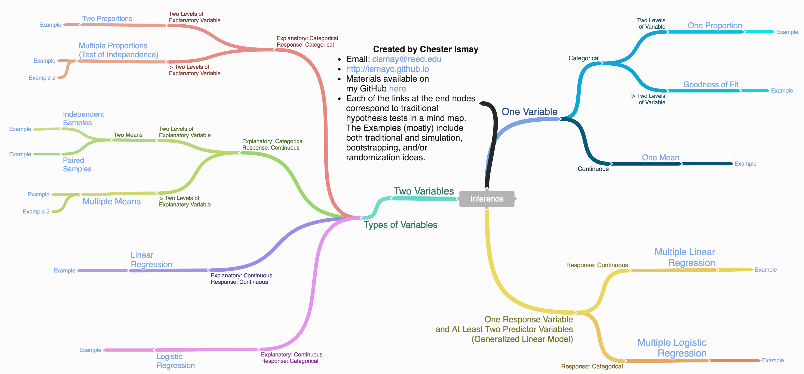

# Inference Examples {#appendixB}

This appendix is designed to provide you with examples of the five basic hypothesis tests and their corresponding confidence intervals.  Traditional theory-based methods as well as computational-based methods are presented. <!-- You can also use this appendix as a way to check for understanding of which statistical graphic is most appropriate given the problem set-up. -->


```{block, type='learncheck', purl=FALSE}
**Note: This appendix is still under construction. If you would like to contribute, please check us out on GitHub at <https://github.com/moderndive/moderndive_book>.**
```

```{r include=FALSE}
knitr::opts_chunk$set(
  tidy = FALSE,
  out.width = "\\textwidth",
  warning = FALSE,
  message = FALSE
)
```


## Needed packages {-}

```{r}
library(tidyverse)
library(infer)
library(janitor)
library(knitr)
library(kableExtra)
```

## Inference mind map

To help you better navigate and choose the appropriate analysis, we've created a mind map on <http://coggle.it> available [here](https://coggle.it/diagram/Vxlydu1akQFeqo6-) and below.

```{r infer-map, echo=FALSE, fig.cap="Mind map for Inference.", out.width="200%"}
library(knitr)
if (knitr:::is_html_output()) {
  include_url("https://coggle.it/diagram/Vxlydu1akQFeqo6-", height = "1200pt")
} else {
  
  # library(magick)
  # image_read("images/coggle.png") %>% image_scale("300")
}
```


## One mean


### Problem statement

The National Survey of Family Growth conducted by the
Centers for Disease Control gathers information on family life, marriage and divorce, pregnancy,
infertility, use of contraception, and men's and women's health. One of the variables collected on
this survey is the age at first marriage. 5,534 randomly sampled US women between 2006 and 2010 completed the survey. The women sampled here had been married at least once.  Do we have evidence that the mean age of first marriage for all US women from 2006 to 2010 is greater than 23 years? [Tweaked a bit from @isrs2014 [Chapter 4]]

### Competing hypotheses

#### In words {-}

- Null hypothesis: The mean age of first marriage for all US women from 2006 to 2010 is equal to 23 years.

- Alternative hypothesis:  The mean age of first marriage for all US women from 2006 to 2010 is greater than 23 years.


#### In symbols (with annotations) {-}

- $H_0: \mu = \mu_{0}$, where $\mu$ represents the mean age of first marriage for all US women from 2006 to 2010 and $\mu_0$ is 23.
- $H_A: \mu > 23$

#### Set $\alpha$ {-}

It's important to set the significance level before starting the testing using the data. Let's set the significance level at 5\% here.

### Exploring the sample data

```{r eval=FALSE}
age_at_marriage <- read_csv("https://moderndive.com/data/ageAtMar.csv")
```

```{r read_data1, echo=FALSE, warning=FALSE, message=FALSE}
age_at_marriage <- read_csv("data/ageAtMar.csv")
```

```{r summarize1}
age_summ <- age_at_marriage %>%
  summarize(
    sample_size = n(),
    mean = mean(age),
    sd = sd(age),
    minimum = min(age),
    lower_quartile = quantile(age, 0.25),
    median = median(age),
    upper_quartile = quantile(age, 0.75),
    max = max(age)
  )
kable(age_summ) %>%
  kable_styling(
    font_size = ifelse(knitr:::is_latex_output(), 10, 16),
    latex_options = c("hold_position")
  )
```

The histogram below also shows the distribution of `age`.

```{r hist1b}
ggplot(data = age_at_marriage, mapping = aes(x = age)) +
  geom_histogram(binwidth = 3, color = "white")
```

The observed statistic of interest here is the sample mean:

```{r}
x_bar <- age_at_marriage %>%
  specify(response = age) %>%
  calculate(stat = "mean")
x_bar
```


#### Guess about statistical significance {-}

We are looking to see if the observed sample mean of `r age_summ$mean` is statistically greater than $\mu_0 = 23$.  They seem to be quite close, but we have a large sample size here.  Let's guess that the large sample size will lead us to reject this practically small difference. 


### Non-traditional methods

#### Bootstrapping for hypothesis test {-}

In order to look to see if the observed sample mean of `r age_summ$mean` is statistically greater than $\mu_0 = 23$, we need to account for the sample size.  We also need to determine a process that replicates how the original sample of size `r nrow(age_at_marriage)` was selected.  

We can use the idea of *bootstrapping* to simulate the population from which the sample came and then generate samples from that simulated population to account for sampling variability.  Recall how bootstrapping would apply in this context:

```{r echo=FALSE}
mu0 <- 23
```


1. Sample with replacement from our original sample of `r nrow(age_at_marriage)` women and repeat this process 10,000 times, 
2. calculate the mean for each of the 10,000 bootstrap samples created in Step 1.,
3. combine all of these bootstrap statistics calculated in Step 2 into a `boot_distn` object, and
4. shift the center of this distribution over to the null value of `r mu0`. (This is needed since it will be centered at `r age_summ$mean` via the process of bootstrapping.)


```{r, echo=FALSE}
if (!file.exists("rds/null_distn_one_mean.rds")) {
  set.seed(2018)
  null_distn_one_mean <- age_at_marriage %>%
    specify(response = age) %>%
    hypothesize(null = "point", mu = 23) %>%
    generate(reps = 10000) %>%
    calculate(stat = "mean")
  saveRDS(object = null_distn_one_mean, "rds/null_distn_one_mean.rds")
} else {
  null_distn_one_mean <- readRDS("rds/null_distn_one_mean.rds")
}
```
```{r sim1, eval=FALSE}
set.seed(2018)
null_distn_one_mean <- age_at_marriage %>%
  specify(response = age) %>%
  hypothesize(null = "point", mu = 23) %>%
  generate(reps = 10000) %>%
  calculate(stat = "mean")
```
```{r}
null_distn_one_mean %>% visualize()
```

We can next use this distribution to observe our $p$-value.  Recall this is a right-tailed test so we will be looking for values that are greater than or equal to `r age_summ$mean` for our $p$-value.

```{r}
null_distn_one_mean %>%
  visualize(obs_stat = x_bar, direction = "greater")
```

##### Calculate $p$-value {-}

```{r}
pvalue <- null_distn_one_mean %>%
  get_pvalue(obs_stat = x_bar, direction = "greater")
pvalue
```

So our $p$-value is `r pvalue` and we reject the null hypothesis at the 5% level.  You can also see this from the histogram above that we are far into the tail of the null distribution.

#### Bootstrapping for confidence interval {-}

We can also create a confidence interval for the unknown population parameter $\mu$ using our sample data using *bootstrapping*. Note that we don't need to shift this distribution since we want the center of our confidence interval to be our point estimate $\bar{x}_{obs} = `r x_bar`$.

```{r, echo=FALSE}
if (!file.exists("rds/boot_distn_one_mean.rds")) {
  boot_distn_one_mean <- age_at_marriage %>%
    specify(response = age) %>%
    generate(reps = 10000) %>%
    calculate(stat = "mean")
  saveRDS(object = boot_distn_one_mean, "rds/boot_distn_one_mean.rds")
} else {
  boot_distn_one_mean <- readRDS("rds/boot_distn_one_mean.rds")
}
```
```{r boot1, eval=FALSE}
boot_distn_one_mean <- age_at_marriage %>%
  specify(response = age) %>%
  generate(reps = 10000) %>%
  calculate(stat = "mean")
```

```{r}
ci <- boot_distn_one_mean %>%
  get_ci()
ci
```

```{r}
boot_distn_one_mean %>%
  visualize(endpoints = ci, direction = "between")
```


We see that `r mu0` is not contained in this confidence interval as a plausible value of $\mu$ (the unknown population mean) and the entire interval is larger than `r mu0`.  This matches with our hypothesis test results of rejecting the null hypothesis in favor of the alternative ($\mu > 23$).

**Interpretation**:  We are 95% confident the true mean age of first marriage for all US women from 2006 to 2010 is between `r ci[["2.5%"]]` and `r ci[["97.5%"]]`.


### Traditional methods

#### Check conditions {-}

Remember that in order to use the shortcut (formula-based, theoretical) approach, we need to check that some conditions are met.

1. _Independent observations_:  The observations are collected independently.

    The cases are selected independently through random sampling so this condition is met.

2. _Approximately normal_:  The distribution of the response variable should be normal or the sample size should be at least 30.

    The histogram for the sample above does show some skew.
   
The Q-Q plot below also shows some skew.

```{r qqplotmean}
ggplot(data = age_at_marriage, mapping = aes(sample = age)) +
  stat_qq()
```

The sample size here is quite large though ($n = 5534$) so both conditions are met.

#### Test statistic {-}

The test statistic is a random variable based on the sample data.  Here, we want to look at a way to estimate the population mean $\mu$.  A good guess is the sample mean $\bar{X}$.  Recall that this sample mean is actually a random variable that will vary as different samples are (theoretically, would be) collected.  We are looking to see how likely is it for us to have observed a sample mean of $\bar{x}_{obs} = `r x_bar`$ or larger assuming that the population mean is `r mu0` (assuming the null hypothesis is true).  If the conditions are met and assuming $H_0$ is true, we can "standardize" this original test statistic of $\bar{X}$ into a $T$ statistic that follows a $t$ distribution with degrees of freedom equal to $df = n - 1$:

$$ T =\dfrac{ \bar{X} - \mu_0}{ S / \sqrt{n} } \sim t (df = n - 1) $$

where $S$ represents the standard deviation of the sample and $n$ is the sample size.

##### Observed test statistic {-}

While one could compute this observed test statistic by "hand", the focus here is on the set-up of the problem and in understanding which formula for the test statistic applies.  We can use the `t_test()` function to perform this analysis for us. 

```{r t.test1a}
t_test_results <- age_at_marriage %>%
  infer::t_test(
    formula = age ~ NULL,
    alternative = "greater",
    mu = 23
  )
t_test_results
```


```{r t.test1b, include=FALSE}
t_test_results <- as.data.frame(age_at_marriage) %>%
  infer::t_test(
    formula = age ~ NULL,
    alternative = "greater",
    mu = 23
  )
t_test_results
```

We see here that the $t_{obs}$ value is `r t_test_results$statistic`.

#### Compute $p$-value {-}

The $p$-value---the probability of observing an $t_{obs}$ value of `r t_test_results$statistic` or more in our null distribution of a $t$ with 5533 degrees of freedom---is essentially `r t_test_results$p_value`.

#### State conclusion {-}

We, therefore, have sufficient evidence to reject the null hypothesis.  Our initial guess that our observed sample mean was statistically greater than the hypothesized mean has supporting evidence here.  Based on this sample, we have evidence that the mean age of first marriage for all US women from 2006 to 2010 is greater than 23 years.

#### Confidence interval {-}

```{r t.test1}
t.test(
  x = age_at_marriage$age,
  alternative = "two.sided",
  mu = 23
)$conf
```


### Comparing results

Observing the bootstrap distribution that were created, it makes quite a bit of sense that the results are so similar for traditional and non-traditional methods in terms of the $p$-value and the confidence interval since these distributions look very similar to normal distributions.  The conditions also being met (the large sample size was the driver here) leads us to better guess that using any of the methods whether they are traditional (formula-based) or non-traditional (computational-based) will lead to similar results.


## One proportion

### Problem statement

The CEO of a large electric utility claims that 80 percent of his 1,000,000 customers are satisfied with the service they receive. To test this claim, the local newspaper surveyed 100 customers, using simple random sampling. 73 were satisfied and the remaining were unsatisfied.  Based on these findings from the sample, can we reject the CEO's hypothesis that 80% of the customers are satisfied? [Tweaked a bit from http://stattrek.com/hypothesis-test/proportion.aspx?Tutorial=AP]

### Competing hypotheses

#### In words {-}

- Null hypothesis: The proportion of all customers of the large electric utility satisfied with service they receive is equal 0.80.

- Alternative hypothesis:  The proportion of all customers of the large electric utility satisfied with service they receive is different from 0.80.

#### In symbols (with annotations) {-}

- $H_0: \pi = p_{0}$, where $\pi$ represents the proportion of all customers of the large electric utility satisfied with service they receive and $p_0$ is 0.8.
- $H_A: \pi \ne 0.8$

#### Set $\alpha$ {-}

It's important to set the significance level before starting the testing using the data. Let's set the significance level at 5% here.

### Exploring the sample data

```{r read_data2}
elec <- c(rep("satisfied", 73), rep("unsatisfied", 27)) %>%
  enframe() %>%
  rename(satisfy = value)
```

The bar graph below also shows the distribution of `satisfy`.

```{r bar}
ggplot(data = elec, aes(x = satisfy)) +
  geom_bar()
```

The observed statistic is computed as

```{r}
p_hat <- elec %>%
  specify(response = satisfy, success = "satisfied") %>%
  calculate(stat = "prop")
p_hat
```


#### Guess about statistical significance {-}

We are looking to see if the sample proportion of `r pull(p_hat)` is statistically different from $p_0 = 0.8$ based on this sample.  They seem to be quite close, and our sample size is not huge here ($n = 100$).  Let's guess that we do not have evidence to reject the null hypothesis.


### Non-traditional methods

#### Simulation for hypothesis test {-}

In order to look to see if `r pull(p_hat)` is statistically different from 0.8, we need to account for the sample size.  We also need to determine a process that replicates how the original sample of size 100 was selected.  We can use the idea of an unfair coin to *simulate* this process.  We will simulate flipping an unfair coin (with probability of success 0.8 matching the null hypothesis) 100 times.  Then we will keep track of how many heads come up in those 100 flips.  Our simulated statistic matches with how we calculated the original statistic $\hat{p}$:  the number of heads (satisfied) out of our total sample of 100. We then repeat this process many times (say 10,000) to create the null distribution looking at the simulated proportions of successes:


```{r, echo=FALSE}
if (!file.exists("rds/null_distn_one_prop.rds")) {
  set.seed(2018)
  null_distn_one_prop <- elec %>%
    specify(response = satisfy, success = "satisfied") %>%
    hypothesize(null = "point", p = 0.8) %>%
    generate(reps = 10000) %>%
    calculate(stat = "prop")
  saveRDS(object = null_distn_one_prop, "rds/null_distn_one_prop.rds")
} else {
  null_distn_one_prop <- readRDS("rds/null_distn_one_prop.rds")
}
```
```{r sim2, eval=FALSE}
set.seed(2018)
null_distn_one_prop <- elec %>%
  specify(response = satisfy, success = "satisfied") %>%
  hypothesize(null = "point", p = 0.8) %>%
  generate(reps = 10000) %>%
  calculate(stat = "prop")
```

```{r}
null_distn_one_prop %>% visualize()
```

We can next use this distribution to observe our $p$-value.  Recall this is a two-tailed test so we will be looking for values that are 0.8 - 0.73 = 0.07 away from 0.8 in BOTH directions for our $p$-value:

```{r}
null_distn_one_prop %>%
  visualize(obs_stat = p_hat, direction = "both")
```

##### Calculate $p$-value {-}

```{r}
pvalue <- null_distn_one_prop %>%
  get_pvalue(obs_stat = p_hat, direction = "both")
pvalue
```

So our $p$-value is `r pvalue` and we fail to reject the null hypothesis at the 5% level.

#### Bootstrapping for confidence interval {-}

We can also create a confidence interval for the unknown population parameter $\pi$ using our sample data.  To do so, we use *bootstrapping*, which involves 

1. sampling with replacement from our original sample of 100 survey respondents and repeating this process 10,000 times, 
2. calculating the proportion of successes for each of the 10,000 bootstrap samples created in Step 1.,
3. combining all of these bootstrap statistics calculated in Step 2 into a `boot_distn` object,
4. identifying the 2.5th and 97.5th percentiles of this distribution (corresponding to the 5% significance level chosen) to find a 95% confidence interval for $\pi$, and
5. interpret this confidence interval in the context of the problem.

```{r, echo=FALSE}
if (!file.exists("rds/boot_distn_one_prop.rds")) {
  boot_distn_one_prop <- elec %>%
    specify(response = satisfy, success = "satisfied") %>%
    generate(reps = 10000) %>%
    calculate(stat = "prop")
  saveRDS(object = boot_distn_one_prop, "rds/boot_distn_one_prop.rds")
} else {
  boot_distn_one_prop <- readRDS("rds/boot_distn_one_prop.rds")
}
```
```{r boot2, eval=FALSE}
boot_distn_one_prop <- elec %>%
  specify(response = satisfy, success = "satisfied") %>%
  generate(reps = 10000) %>%
  calculate(stat = "prop")
```

Just as we use the `mean` function for calculating the mean over a numerical variable, we can also use it to compute the proportion of successes for a categorical variable where we specify what we are calling a "success" after the `==`.  (Think about the formula for calculating a mean and how R handles logical statements such as `satisfy == "satisfied"` for why this must be true.)

```{r}
ci <- boot_distn_one_prop %>%
  get_ci()
ci
```

```{r}
boot_distn_one_prop %>%
  visualize(endpoints = ci, direction = "between")
```


We see that 0.80 is contained in this confidence interval as a plausible value of $\pi$ (the unknown population proportion).  This matches with our hypothesis test results of failing to reject the null hypothesis.

**Interpretation**:  We are 95% confident the true proportion of customers who are satisfied with the service they receive is between `r ci[["2.5%"]]` and `r ci[["97.5%"]]`.


### Traditional methods

#### Check conditions {-}

Remember that in order to use the shortcut (formula-based, theoretical) approach, we need to check that some conditions are met.

1. _Independent observations_:  The observations are collected independently.

    The cases are selected independently through random sampling so this condition is met.

2. _Approximately normal_:  The number of expected successes and expected failures is at least 10.

    This condition is met since 73 and 27 are both greater than 10.

#### Test statistic {-}

The test statistic is a random variable based on the sample data.  Here, we want to look at a way to estimate the population proportion $\pi$.  A good guess is the sample proportion $\hat{P}$.  Recall that this sample proportion is actually a random variable that will vary as different samples are (theoretically, would be) collected.  We are looking to see how likely is it for us to have observed a sample proportion of $\hat{p}_{obs} = `r p_hat`$ or larger assuming that the population proportion is 0.80 (assuming the null hypothesis is true).  If the conditions are met and assuming $H_0$ is true, we can standardize this original test statistic of $\hat{P}$ into a $Z$ statistic that follows a $N(0, 1)$ distribution.

$$ Z =\dfrac{ \hat{P} - p_0}{\sqrt{\dfrac{p_0(1 - p_0)}{n} }} \sim N(0, 1) $$

##### Observed test statistic {-}

While one could compute this observed test statistic by "hand" by plugging the observed values into the formula, the focus here is on the set-up of the problem and in understanding which formula for the test statistic applies. The calculation has been done in R below for completeness though:

```{r}
p_hat <- 0.73
p0 <- 0.8
n <- 100
(z_obs <- (p_hat - p0) / sqrt((p0 * (1 - p0)) / n))
```

We see here that the $z_{obs}$ value is around `r z_obs`. Our observed sample proportion of `r p_hat` is `r -z_obs` standard errors below the hypothesized parameter value of `r p0`.

#### Visualize and compute $p$-value {-}

```{r pvaloneprop}
elec %>%
  specify(response = satisfy, success = "satisfied") %>%
  hypothesize(null = "point", p = 0.8) %>%
  calculate(stat = "z") %>%
  visualize(method = "theoretical", obs_stat = z_obs, direction = "both")
2 * pnorm(z_obs)
```

The $p$-value---the probability of observing an $z_{obs}$ value of `r z_obs` or more extreme (in both directions) in our null distribution---is around `r round(2 * pnorm(z_obs) * 100)`%. 

Note that we could also do this test directly using the `prop.test` function.

```{r prop.test1}
stats::prop.test(
  x = table(elec$satisfy),
  n = length(elec$satisfy),
  alternative = "two.sided",
  p = 0.8,
  correct = FALSE
)
```

`prop.test` does a $\chi^2$ test here but this matches up exactly with what we would expect:  $x^2_{obs} = 3.06 = (-1.75)^2 = (z_{obs})^2$ and the $p$-values are the same because we are focusing on a two-tailed test.

Note that the 95 percent confidence interval given above matches well with the one calculated using bootstrapping.

#### State conclusion {-}

We, therefore, do not have sufficient evidence to reject the null hypothesis.  Our initial guess that our observed sample proportion was not statistically greater than the hypothesized proportion has not been invalidated.  Based on this sample, we have do not evidence that the proportion of all customers of the large electric utility satisfied with service they receive is different from 0.80, at the 5% level.


### Comparing results

Observing the bootstrap distribution and the null distribution that were created, it makes quite a bit of sense that the results are so similar for traditional and non-traditional methods in terms of the $p$-value and the confidence interval since these distributions look very similar to normal distributions.  The conditions also being met leads us to better guess that using any of the methods whether they are traditional (formula-based) or non-traditional (computational-based) will lead to similar results.


## Two proportions

### Problem statement

A 2010 survey asked 827 randomly sampled registered voters
in California "Do you support? Or do you oppose? Drilling for oil and natural gas off the Coast of
California? Or do you not know enough to say?" Conduct a hypothesis test to determine if the data
provide strong evidence that the proportion of college
graduates who do not have an opinion on this issue is
different than that of non-college graduates. [Tweaked a bit from @isrs2014 [Chapter 6]]

### Competing hypotheses

#### In words {-}

- Null hypothesis: There is no association between having an opinion on drilling and having a college degree for all registered California voters in 2010.

- Alternative hypothesis:  There is an association between having an opinion on drilling and having a college degree for all registered California voters in 2010.

#### Another way in words {-}

- Null hypothesis: The probability that a Californian voter in 2010 having no opinion on drilling and is a college graduate is the **same** as that of a non-college graduate.

- Alternative hypothesis:  These parameter probabilities are different.

#### In symbols (with annotations) {-}

- $H_0: \pi_{college} = \pi_{no\_college}$ or $H_0: \pi_{college} - \pi_{no\_college} = 0$, where $\pi$ represents the probability of not having an opinion on drilling.
- $H_A: \pi_{college} - \pi_{no\_college} \ne 0$

#### Set $\alpha$ {-}

It's important to set the significance level before starting the testing using the data. Let's set the significance level at 5% here.

### Exploring the sample data

```{r eval=FALSE}
offshore <- read_csv("https://moderndive.com/data/offshore.csv")
```

```{r read_data3, echo=FALSE, warning=FALSE, message=FALSE}
offshore <- read_csv("data/offshore.csv")
```

```{r tabyl}
counts <- offshore %>% tabyl(college_grad, response)
counts
```

```{r stats1, include=FALSE}
off_summ <- offshore %>%
  group_by(college_grad) %>%
  summarize(prop_no_opinion = mean(response == "no opinion"), sample_size = n())

# Next we will assign some key values to variable names in R:
phat_nograd <- off_summ$prop_no_opinion[1]
phat_grad <- off_summ$prop_no_opinion[2]
obs_diff <- phat_grad - phat_nograd
n_nograd <- off_summ$sample_size[1]
n_grad <- off_summ$sample_size[2]
```

Observe that of the college graduates, a proportion of `r counts[2, 2]`/(`r counts[2, 2]` + `r counts[2, 3]`) = `r phat_grad` have no opinion on drilling. On the other hand, of the non-college graduates, a proportion of `r counts[1, 2]`/(`r counts[1, 2]` + `r counts[1, 3]`) = `r phat_nograd` have no opinion on drilling, whereas . The difference in these proportions is `r phat_grad` - `r phat_nograd` = `r obs_diff`.

Let's visualize these in a barchart. However, we first reverse the order of the levels in the categorical variable `response` using the `fct_rev()` function from the `forcats` package. We do this because the default ordering of levels in a factor is alphanumeric. However, we are interested in proportions that have `no opinion` and not `opinion`. Thus we need to reverse the default alphanumeric order. 

```{r stacked_bar}
offshore <- offshore %>%
  mutate(response = fct_rev(response))

ggplot(offshore, aes(x = college_grad, fill = response)) +
  geom_bar(position = "fill") +
  labs(x = "College grad?", y = "Proportion with no opinion on drilling") +
  coord_flip()
```


#### Guess about statistical significance {-}

We are looking to see if a difference exists in the size of the bars corresponding to `no opinion` for the plot.  Based solely on the plot, we have little reason to believe that a difference exists since the bars seem to be about the same size, BUT...it's important to use statistics to see if that difference is actually statistically significant!


### Non-traditional methods

#### Collecting summary info {-}

The observed statistic is

```{r}
d_hat <- offshore %>%
  specify(response ~ college_grad, success = "no opinion") %>%
  calculate(stat = "diff in props", order = c("yes", "no"))
d_hat
```

#### Randomization for hypothesis test {-}

In order to ascertain if the observed sample proportion with no opinion for college graduates of `r phat_grad` is statistically different than the observed sample proportion with no opinion for non-college graduates of `r phat_nograd`, we need to account for the sample sizes. Note that this is the same as ascertaining if the observed difference in sample proportions `r obs_diff` is statistically different than 0.  We also need to determine a process that replicates how the original group sizes of `r n_nograd` and `r n_grad` were selected.  

We can use the idea of *randomization testing* (also known as *permutation testing*) to simulate the population from which the sample came (with two groups of different sizes) and then generate samples using *shuffling* from that simulated population to account for sampling variability.  


```{r, echo=FALSE}
if (!file.exists("rds/null_distn_two_props.rds")) {
  set.seed(2018)
  null_distn_two_props <- offshore %>%
    specify(response ~ college_grad, success = "no opinion") %>%
    hypothesize(null = "independence") %>%
    generate(reps = 10000) %>%
    calculate(stat = "diff in props", order = c("yes", "no"))
  saveRDS(object = null_distn_two_props, "rds/null_distn_two_props.rds")
} else {
  null_distn_two_props <- readRDS("rds/null_distn_two_props.rds")
}
```
```{r sim3, eval=FALSE}
set.seed(2018)
null_distn_two_props <- offshore %>%
  specify(response ~ college_grad, success = "no opinion") %>%
  hypothesize(null = "independence") %>%
  generate(reps = 10000) %>%
  calculate(stat = "diff in props", order = c("yes", "no"))
```

```{r}
null_distn_two_props %>% visualize()
```


We can next use this distribution to observe our $p$-value.  Recall this is a two-tailed test so we will be looking for values that are greater than or equal to `r obs_diff` or less than or equal to `r -obs_diff` for our $p$-value.

```{r}
null_distn_two_props %>%
  visualize(obs_stat = d_hat, direction = "two_sided")
```


##### Calculate $p$-value {-}

```{r}
pvalue <- null_distn_two_props %>%
  get_pvalue(obs_stat = d_hat, direction = "two_sided")
pvalue
```

So our $p$-value is `r pvalue` and we reject the null hypothesis at the 5% level.  You can also see this from the histogram above that we are far into the tails of the null distribution.

#### Bootstrapping for confidence interval {-}

We can also create a confidence interval for the unknown population parameter $\pi_{college} - \pi_{no\_college}$ using our sample data with *bootstrapping*.


```{r, echo=FALSE}
if (!file.exists("rds/boot_distn_two_props.rds")) {
  boot_distn_two_props <- offshore %>%
    specify(response ~ college_grad, success = "no opinion") %>%
    generate(reps = 10000) %>%
    calculate(stat = "diff in props", order = c("yes", "no"))
  saveRDS(object = boot_distn_two_props, "rds/boot_distn_two_props.rds")
} else {
  boot_distn_two_props <- readRDS("rds/boot_distn_two_props.rds")
}
```
```{r boot3, eval=FALSE}
boot_distn_two_props <- offshore %>%
  specify(response ~ college_grad, success = "no opinion") %>%
  generate(reps = 10000) %>%
  calculate(stat = "diff in props", order = c("yes", "no"))
```

```{r}
ci <- boot_distn_two_props %>%
  get_ci()
ci
```

```{r}
boot_distn_two_props %>%
  visualize(endpoints = ci, direction = "between")
```

We see that 0 is not contained in this confidence interval as a plausible value of $\pi_{college} - \pi_{no\_college}$ (the unknown population parameter).  This matches with our hypothesis test results of rejecting the null hypothesis.  Since zero is not a plausible value of the population parameter, we have evidence that the proportion of college graduates in California with no opinion on drilling is different than that of non-college graduates.

**Interpretation**:  We are 95% confident the true proportion of non-college graduates with no opinion on offshore drilling in California is between `r round(-ci[["2.5%"]], 2)` dollars smaller to `r round(-ci[["97.5%"]], 2)` dollars smaller than for college graduates.


### Traditional methods

### Check conditions

Remember that in order to use the short-cut (formula-based, theoretical) approach, we need to check that some conditions are met.

1. _Independent observations_:  Each case that was selected must be independent of all the other cases selected.

    This condition is met since cases were selected at random to observe.

2. _Sample size_:  The number of pooled successes and pooled failures must be at least 10 for each group.

    We need to first figure out the pooled success rate:  $$\hat{p}_{obs} = \dfrac{131 + 104}{827} = 0.28.$$  We now determine expected (pooled) success and failure counts:
    
    $0.28 \cdot (131 + 258) = `r 0.28 * (131 + 258)`$, $0.72 \cdot (131 + 258) = `r 0.72 * (131 + 258)`$
    
    $0.28 \cdot (104 + 334) = `r 0.28 * (104 + 334)`$, $0.72 \cdot (104 + 334) = `r 0.72 * (104 + 334)`$

3. _Independent selection of samples_:  The cases are not paired in any meaningful way.

    We have no reason to suspect that a college graduate selected would have any relationship to a non-college graduate selected.

### Test statistic

The test statistic is a random variable based on the sample data.  Here, we are interested in seeing if our observed difference in sample proportions corresponding to no opinion on drilling ($\hat{p}_{college, obs} - \hat{p}_{no\_college, obs}$ = `r prop.table(table(offshore$college_grad, offshore$response))[1, 1] - prop.table(table(offshore$college_grad, offshore$response))[2, 1]`) is statistically different than 0.  Assuming that conditions are met and the null hypothesis is true, we can use the standard normal distribution to standardize the difference in sample proportions ($\hat{P}_{college} - \hat{P}_{no\_college}$) using the standard error of $\hat{P}_{college} - \hat{P}_{no\_college}$ and the pooled estimate:

$$ Z =\dfrac{ (\hat{P}_1 - \hat{P}_2) - 0}{\sqrt{\dfrac{\hat{P}(1 - \hat{P})}{n_1} + \dfrac{\hat{P}(1 - \hat{P})}{n_2} }} \sim N(0, 1) $$ where $\hat{P} = \dfrac{\text{total number of successes} }{ \text{total number of cases}}.$

#### Observed test statistic {-}

While one could compute this observed test statistic by "hand", the focus here is on the set-up of the problem and in understanding which formula for the test statistic applies.  We can use the `prop.test` function to perform this analysis for us.

```{r prop.test2}
z_hat <- offshore %>%
  specify(response ~ college_grad, success = "no opinion") %>%
  calculate(stat = "z", order = c("yes", "no"))
z_hat
```

The observed difference in sample proportions is 3.16 standard deviations smaller than 0.


```{r infer1, include=FALSE, eval=FALSE}
offshore %>%
  specify(response ~ college_grad, success = "no opinion") %>%
  hypothesize(null = "independence") %>%
  calculate(stat = "z", order = c("yes", "no")) %>%
  visualize(method = "theoretical", obs_stat = z_hat, direction = "both")
```

The $p$-value---the probability of observing a $Z$ value of -3.16 or more extreme in our null distribution---is 0.0016.  This can also be calculated in R directly:

```{r pval2prop}
2 * pnorm(-3.16, lower.tail = TRUE)
```

### State conclusion

We, therefore, have sufficient evidence to reject the null hypothesis.  Our initial guess that a statistically significant difference did not exist in the proportions of no opinion on offshore drilling between college educated and non-college educated Californians was not validated.  We do have evidence to suggest that there is a dependency between college graduation and position on offshore drilling for Californians.


### Comparing results

Observing the bootstrap distribution and the null distribution that were created, it makes quite a bit of sense that the results are so similar for traditional and non-traditional methods in terms of the $p$-value and the confidence interval since these distributions look very similar to normal distributions.  The conditions were not met since the number of pairs was small, but the sample data was not highly skewed.  Using any of the methods whether they are traditional (formula-based) or non-traditional (computational-based) lead to similar results.


## Two means (independent samples)

### Problem statement

Average income varies from one region of the country to
another, and it often reflects both lifestyles and regional living expenses. Suppose a new graduate
is considering a job in two locations, Cleveland, OH and Sacramento, CA, and he wants to see
whether the average income in one of these cities is higher than the other. He would like to conduct
a hypothesis test based on two randomly selected samples from the 2000 Census. [Tweaked a bit from @isrs2014 [Chapter 5]]

### Competing hypotheses

#### In words {-}

- Null hypothesis: There is no association between income and location (Cleveland, OH and Sacramento, CA).

- Alternative hypothesis:  There is an association between income and location (Cleveland, OH and Sacramento, CA).

#### Another way in words {-}

- Null hypothesis: The mean income is the **same** for both cities.

- Alternative hypothesis:  The mean income is different for the two cities.

#### In symbols (with annotations) {-}

- $H_0: \mu_{sac} = \mu_{cle}$ or $H_0: \mu_{sac} - \mu_{cle} = 0$, where $\mu$ represents the average income.
- $H_A: \mu_{sac} - \mu_{cle} \ne 0$

#### Set $\alpha$ {-}

It's important to set the significance level before starting the testing using the data. Let's set the significance level at 5% here.

### Exploring the sample data

```{r eval=FALSE}
cle_sac <- read.delim("https://moderndive.com/data/cleSac.txt") %>%
  rename(
    metro_area = Metropolitan_area_Detailed,
    income = Total_personal_income
  ) %>%
  na.omit()
```

```{r read_data4, echo=FALSE}
cle_sac <- read.delim("data/cleSac.txt") %>%
  rename(
    metro_area = Metropolitan_area_Detailed,
    income = Total_personal_income
  ) %>%
  na.omit()
```


```{r summarize3}
inc_summ <- cle_sac %>%
  group_by(metro_area) %>%
  summarize(
    sample_size = n(),
    mean = mean(income),
    sd = sd(income),
    minimum = min(income),
    lower_quartile = quantile(income, 0.25),
    median = median(income),
    upper_quartile = quantile(income, 0.75),
    max = max(income)
  )
kable(inc_summ) %>%
  kable_styling(
    font_size = ifelse(knitr:::is_latex_output(), 10, 16),
    latex_options = c("hold_position")
  )
```

The boxplot below also shows the mean for each group highlighted by the red dots.

```{r boxplot}
ggplot(cle_sac, aes(x = metro_area, y = income)) +
  geom_boxplot() +
  stat_summary(fun.y = "mean", geom = "point", color = "red")
```


#### Guess about statistical significance {-}

We are looking to see if a difference exists in the mean income of the two levels of the explanatory variable.  Based solely on the boxplot, we have reason to believe that no difference exists.  The distributions of income seem similar and the means fall in roughly the same place.


### Non-traditional methods

#### Collecting summary info {-}

We now compute the observed statistic:

```{r stats2, include=FALSE}
# Next we will assign some key values to variable names in R:
xbar_cle <- inc_summ$mean[1]
xbar_sac <- inc_summ$mean[2]
obs_diff <- xbar_sac - xbar_cle
n_cle <- inc_summ$sample_size[1]
n_sac <- inc_summ$sample_size[2]
```

```{r}
d_hat <- cle_sac %>%
  specify(income ~ metro_area) %>%
  calculate(
    stat = "diff in means",
    order = c("Sacramento_ CA", "Cleveland_ OH")
  )
d_hat
```


#### Randomization for hypothesis test {-}

In order to look to see if the observed sample mean for Sacramento of `r xbar_cle` is statistically different than that for Cleveland of `r xbar_sac`, we need to account for the sample sizes.  Note that this is the same as looking to see if $\bar{x}_{sac} - \bar{x}_{cle}$ is statistically different than 0.  We also need to determine a process that replicates how the original group sizes of `r n_cle` and `r n_sac` were selected.  

We can use the idea of *randomization testing* (also known as *permutation testing*) to simulate the population from which the sample came (with two groups of different sizes) and then generate samples using *shuffling* from that simulated population to account for sampling variability.  

```{r, echo=FALSE}
if (!file.exists("rds/null_distn_two_means.rds")) {
  set.seed(2018)
  null_distn_two_means <- cle_sac %>%
    specify(income ~ metro_area) %>%
    hypothesize(null = "independence") %>%
    generate(reps = 10000) %>%
    calculate(
      stat = "diff in means",
      order = c("Sacramento_ CA", "Cleveland_ OH")
    )
  saveRDS(object = null_distn_two_means, "rds/null_distn_two_means.rds")
} else {
  null_distn_two_means <- readRDS("rds/null_distn_two_means.rds")
}
```
```{r sim4, eval=FALSE}
set.seed(2018)
null_distn_two_means <- cle_sac %>%
  specify(income ~ metro_area) %>%
  hypothesize(null = "independence") %>%
  generate(reps = 10000) %>%
  calculate(
    stat = "diff in means",
    order = c("Sacramento_ CA", "Cleveland_ OH")
  )
```

```{r}
null_distn_two_means %>% visualize()
```

We can next use this distribution to observe our $p$-value.  Recall this is a two-tailed test so we will be looking for values that are greater than or equal to `r d_hat` or less than or equal to `r -d_hat` for our $p$-value.

```{r}
null_distn_two_means %>%
  visualize(obs_stat = d_hat, direction = "both")
```

##### Calculate $p$-value {-}

```{r}
pvalue <- null_distn_two_means %>%
  get_pvalue(obs_stat = d_hat, direction = "both")
pvalue
```

So our $p$-value is `r pvalue` and we fail to reject the null hypothesis at the 5% level.  You can also see this from the histogram above that we are not very far into the tail of the null distribution.

#### Bootstrapping for confidence interval {-}

We can also create a confidence interval for the unknown population parameter $\mu_{sac} - \mu_{cle}$ using our sample data with *bootstrapping*.  Here we will bootstrap each of the groups with replacement instead of shuffling.  This is done using the `groups`
argument in the `resample` function to fix the size of each group to
be the same as the original group sizes of `r n_sac` for Sacramento and `r n_cle` for Cleveland.

```{r, echo=FALSE}
if (!file.exists("rds/boot_distn_two_means.rds")) {
  boot_distn_two_means <- cle_sac %>%
    specify(income ~ metro_area) %>%
    generate(reps = 10000) %>%
    calculate(
      stat = "diff in means",
      order = c("Sacramento_ CA", "Cleveland_ OH")
    )
  saveRDS(object = boot_distn_two_means, "rds/boot_distn_two_means.rds")
} else {
  boot_distn_two_means <- readRDS("rds/boot_distn_two_means.rds")
}
```
```{r boot4, eval=FALSE}
boot_distn_two_means <- cle_sac %>%
  specify(income ~ metro_area) %>%
  generate(reps = 10000) %>%
  calculate(
    stat = "diff in means",
    order = c("Sacramento_ CA", "Cleveland_ OH")
  )
```


```{r}
ci <- boot_distn_two_means %>%
  get_ci()
ci
```

```{r}
boot_distn_two_means %>%
  visualize(endpoints = ci, direction = "between")
```

We see that 0 is contained in this confidence interval as a plausible value of $\mu_{sac} - \mu_{cle}$ (the unknown population parameter).  This matches with our hypothesis test results of failing to reject the null hypothesis.  Since zero is a plausible value of the population parameter, we do not have evidence that Sacramento incomes are different than Cleveland incomes.

**Interpretation**:  We are 95% confident the true mean yearly income for those living in Sacramento is between `r round(-ci[["2.5%"]], 2)` dollars smaller to `r round(ci[["97.5%"]], 2)` dollars higher than for Cleveland.

**Note**:  You could also use the null distribution based on randomization with a shift to have its center at $\bar{x}_{sac} - \bar{x}_{cle} = \$`r round(d_hat, 2)`$ instead of at 0 and calculate its percentiles.  The confidence interval produced via this method should be comparable to the one done using bootstrapping above.


### Traditional methods

##### Check conditions {-}

Remember that in order to use the short-cut (formula-based, theoretical) approach, we need to check that some conditions are met.

1. _Independent observations_:  The observations are independent in both groups.

    This `metro_area` variable is met since the cases are randomly selected from each city.

2. _Approximately normal_:  The distribution of the response for each group should be normal or the sample sizes should be at least 30.

```{r hist}
ggplot(cle_sac, aes(x = income)) +
  geom_histogram(color = "white", binwidth = 20000) +
  facet_wrap(~metro_area)
```

  We have some reason to doubt the normality assumption here since both the histograms show deviation from a normal model fitting the data well for each group.  The sample sizes for each group are greater than 100 though so the assumptions should still apply.


3. _Independent samples_: The samples should be collected without any natural pairing.

    There is no mention of there being a relationship between those selected in Cleveland and in Sacramento.

### Test statistic

The test statistic is a random variable based on the sample data.  Here, we are interested in seeing if our observed difference in sample means ($\bar{x}_{sac, obs} - \bar{x}_{cle, obs}$ = `r inc_summ$mean[2] - inc_summ$mean[1]`) is statistically different than 0.  Assuming that conditions are met and the null hypothesis is true, we can use the $t$ distribution to standardize the difference in sample means ($\bar{X}_{sac} - \bar{X}_{cle}$) using the approximate standard error of $\bar{X}_{sac} - \bar{X}_{cle}$ (invoking $S_{sac}$ and $S_{cle}$ as estimates of unknown $\sigma_{sac}$ and $\sigma_{cle}$).

$$ T =\dfrac{ (\bar{X}_1 - \bar{X}_2) - 0}{ \sqrt{\dfrac{S_1^2}{n_1} + \dfrac{S_2^2}{n_2}}  } \sim t (df = min(n_1 - 1, n_2 - 1)) $$ where 1 = Sacramento and 2 = Cleveland with $S_1^2$ and $S_2^2$ the sample variance of the incomes of both cities, respectively, and $n_1 = 175$ for Sacramento and $n_2 = 212$ for Cleveland.

#### Observed test statistic {-}

Note that we could also do (ALMOST) this test directly using the `t.test` function.  The `x` and `y` arguments are expected to both be numeric vectors here so we'll need to appropriately filter our datasets.

```{r t.test2}
cle_sac %>%
  specify(income ~ metro_area) %>%
  calculate(
    stat = "t",
    order = c("Cleveland_ OH", "Sacramento_ CA")
  )
```

<!--
Note that the degrees of freedom reported above are different than what we used above in specifying the **Test Statistic**.  The degrees of freedom used here is also known as the Satterthwaite approximation and involves a quite complicated formula.  For most problems, the much simpler smaller of sample sizes minus one will suffice.
-->

We see here that the observed test statistic value is around -1.5. <!-- with $df = min(212 - 1, 175 - 1) = 174$.-->

While one could compute this observed test statistic by "hand", the focus here is on the set-up of the problem and in understanding which formula for the test statistic applies. 

<!--
We can use the `inference` function in the `oilabs` package to perform this analysis for us.  Note that to obtain the `F value` given here, you divide the observed $MSG$ value of 17.53 by the observed $MSE$ value of 1.75.  (The use of the word `Residuals` will make more sense when we have covered regression.)
-->

```{r infer2, eval=FALSE, include=FALSE}
cle_sac %>%
  specify(income ~ metro_area) %>%
  hypothesize(null = "independence") %>%
  calculate(
    stat = "t",
    order = c("Sacramento_ CA", "Cleveland_ OH")
  ) %>%
  visualize()
```

<!--Recall that for large degrees of freedom, the $t$ distribution is roughly equal to the standard normal curve so our difference in `df` for the Satterthwaite and "min" variations doesn't really matter.-->

### Compute $p$-value

The $p$-value---the probability of observing an $t_{174}$ value of -1.501 or more extreme (in both directions) in our null distribution---is 0.13.  This can also be calculated in R directly:

```{r pval1a}
2 * pt(-1.501, df = min(212 - 1, 175 - 1), lower.tail = TRUE)
```

We can also approximate by using the standard normal curve:

```{r pval2means}
2 * pnorm(-1.501)
```

Note that the 95 percent confidence interval given above matches well with the one calculated using bootstrapping.

### State conclusion

We, therefore, do not have sufficient evidence to reject the null hypothesis.  Our initial guess that a statistically significant difference not existing in the means was backed by this statistical analysis.  We do not have evidence to suggest that the true mean income differs between Cleveland, OH and Sacramento, CA based on this data.


### Comparing results

Observing the bootstrap distribution and the null distribution that were created, it makes quite a bit of sense that the results are so similar for traditional and non-traditional methods in terms of the $p$-value and the confidence interval since these distributions look very similar to normal distributions.  The conditions also being met leads us to better guess that using any of the methods whether they are traditional (formula-based) or non-traditional (computational-based) will lead to similar results.


## Two means (paired samples)

#### Problem statement {-}

Trace metals in drinking water affect the flavor and an unusually high concentration can pose a health hazard. Ten pairs of data were taken measuring zinc concentration in bottom water and surface water at 10 randomly selected locations on a stretch of river. Do the data suggest that the true average concentration in the surface water is smaller than that of bottom water? (Note that units are not given.)  [Tweaked a bit from https://onlinecourses.science.psu.edu/stat500/node/51]

### Competing hypotheses

#### In words {-}

- Null hypothesis: The mean concentration in the bottom water is the same as that of the surface water at different paired locations.

- Alternative hypothesis:  The mean concentration in the surface water is smaller than that of the bottom water at different paired locations.

#### In symbols (with annotations) {-}

- $H_0: \mu_{diff} = 0$, where $\mu_{diff}$ represents the mean difference in concentration for surface water minus bottom water.
- $H_A: \mu_{diff} < 0$

#### Set $\alpha$ {-}

It's important to set the significance level before starting the testing using the data. Let's set the significance level at 5% here.

### Exploring the sample data

```{r eval=FALSE}
zinc_tidy <- read_csv("https://moderndive.com/data/zinc_tidy.csv")
```

```{r read_data5, echo=FALSE, message=FALSE, warning=FALSE}
zinc_tidy <- read_csv("data/zinc_tidy.csv")
```


We want to look at the differences in `surface - bottom` for each location:

```{r}
zinc_diff <- zinc_tidy %>%
  group_by(loc_id) %>%
  summarize(pair_diff = diff(concentration)) %>%
  ungroup()
```

Next we calculate the mean difference as our observed statistic:

```{r summarize4}
d_hat <- zinc_diff %>%
  specify(response = pair_diff) %>%
  calculate(stat = "mean")
d_hat
```

The histogram below also shows the distribution of `pair_diff`.

```{r hist1a}
ggplot(zinc_diff, aes(x = pair_diff)) +
  geom_histogram(binwidth = 0.04, color = "white")
```


#### Guess about statistical significance {-}

We are looking to see if the sample paired mean difference of `r d_hat` is statistically less than 0.  They seem to be quite close, but we have a small number of pairs here.  Let's guess that we will fail to reject the null hypothesis. 


### Non-traditional methods

```{r stats3, include=FALSE}
#### Collecting summary info {-}
# Next we will assign some key values to variable names in R:
# obs_diff <- zinc_summ %>% select(mean)
# n_pairs <- zinc_summ %>% select(sample_size)
```


#### Bootstrapping for hypothesis test {-}

In order to look to see if the observed sample mean difference $\bar{x}_{diff} = `r d_hat`$ is statistically less than 0, we need to account for the number of pairs.  We also need to determine a process that replicates how the paired data was selected in a way similar to how we calculated our original difference in sample means.

Treating the differences as our data of interest, we next use the process of **bootstrapping** to build other simulated samples and then calculate the mean of the bootstrap samples. We hypothesize that the mean difference is zero. 

This process is similar to comparing the One Mean example seen above, but using the differences between the two groups as a single sample with a hypothesized mean difference of 0.

```{r, echo=FALSE}
if (!file.exists("rds/null_distn_paired_means.rds")) {
  set.seed(2018)
  null_distn_paired_means <- zinc_diff %>%
    specify(response = pair_diff) %>%
    hypothesize(null = "point", mu = 0) %>%
    generate(reps = 10000) %>%
    calculate(stat = "mean")
  saveRDS(object = null_distn_paired_means, "rds/null_distn_paired_means.rds")
} else {
  null_distn_paired_means <- readRDS("rds/null_distn_paired_means.rds")
}
```
```{r sim5, eval=FALSE}
set.seed(2018)
null_distn_paired_means <- zinc_diff %>%
  specify(response = pair_diff) %>%
  hypothesize(null = "point", mu = 0) %>%
  generate(reps = 10000) %>%
  calculate(stat = "mean")
```

```{r}
null_distn_paired_means %>% visualize()
```

We can next use this distribution to observe our $p$-value.  Recall this is a left-tailed test so we will be looking for values that are less than or equal to `r obs_diff` for our $p$-value.

```{r}
null_distn_paired_means %>%
  visualize(obs_stat = d_hat, direction = "less")
```

##### Calculate $p$-value {-}

```{r}
pvalue <- null_distn_paired_means %>%
  get_pvalue(obs_stat = d_hat, direction = "less")
pvalue
```

So our $p$-value is essentially `r pvalue` and we reject the null hypothesis at the 5% level.  You can also see this from the histogram above that we are far into the left tail of the null distribution.

#### Bootstrapping for confidence interval {-}

We can also create a confidence interval for the unknown population parameter $\mu_{diff}$ using our sample data (the calculated differences) with *bootstrapping*.  This is similar to the bootstrapping done in a one sample mean case, except now our data is differences instead of raw numerical data.
Note that this code is identical to the pipeline shown in the hypothesis test above except the `hypothesize()` function is not called.

```{r, echo=FALSE}
if (!file.exists("rds/boot_distn_paired_means.rds")) {
  boot_distn_paired_means <- zinc_diff %>%
    specify(response = pair_diff) %>%
    generate(reps = 10000) %>%
    calculate(stat = "mean")
  saveRDS(object = boot_distn_paired_means, "rds/boot_distn_paired_means.rds")
} else {
  boot_distn_paired_means <- readRDS("rds/boot_distn_paired_means.rds")
}
```
```{r boot5, eval=FALSE}
boot_distn_paired_means <- zinc_diff %>%
  specify(response = pair_diff) %>%
  generate(reps = 10000) %>%
  calculate(stat = "mean")
```

```{r}
ci <- boot_distn_paired_means %>%
  get_ci()
ci
```

```{r}
boot_distn_paired_means %>%
  visualize(endpoints = ci, direction = "between")
```

We see that 0 is not contained in this confidence interval as a plausible value of $\mu_{diff}$ (the unknown population parameter).  This matches with our hypothesis test results of rejecting the null hypothesis.  Since zero is not a plausible value of the population parameter and since the entire confidence interval falls below zero, we have evidence that surface zinc concentration levels are lower, on average, than bottom level zinc concentrations.

**Interpretation**:  We are 95% confident the true mean zinc concentration on the surface is between `r round(-ci[["2.5%"]], 2)` units smaller to `r round(-ci[["97.5%"]], 2)` units smaller than on the bottom.


### Traditional methods

#### Check conditions {-}

Remember that in order to use the shortcut (formula-based, theoretical) approach, we need to check that some conditions are met.

1. _Independent observations_:  The observations among pairs are independent.

   The locations are selected independently through random sampling so this condition is met.

2. _Approximately normal_:  The distribution of population of differences is normal or the number of pairs is at least 30.

    The histogram above does show some skew so we have reason to doubt the population being normal based on this sample.  We also only have 10 pairs which is fewer than the 30 needed.  A theory-based test may not be valid here.
    
#### Test statistic {-}

The test statistic is a random variable based on the sample data.  Here, we want to look at a way to estimate the population mean difference $\mu_{diff}$.  A good guess is the sample mean difference $\bar{X}_{diff}$.  Recall that this sample mean is actually a random variable that will vary as different samples are (theoretically, would be) collected.  We are looking to see how likely is it for us to have observed a sample mean of $\bar{x}_{diff, obs} = 0.0804$ or larger assuming that the population mean difference is 0 (assuming the null hypothesis is true).  If the conditions are met and assuming $H_0$ is true, we can "standardize" this original test statistic of $\bar{X}_{diff}$ into a $T$ statistic that follows a $t$ distribution with degrees of freedom equal to $df = n - 1$:

$$ T =\dfrac{ \bar{X}_{diff} - 0}{ S_{diff} / \sqrt{n} } \sim t (df = n - 1) $$

where $S$ represents the standard deviation of the sample differences and $n$ is the number of pairs.

##### Observed test statistic {-}

While one could compute this observed test statistic by "hand", the focus here is on the set-up of the problem and in understanding which formula for the test statistic applies.  We can use the `t_test` function on the differences to perform this analysis for us. 

```{r t.test3b}
t_test_results <- zinc_diff %>%
  infer::t_test(
    formula = pair_diff ~ NULL,
    alternative = "less",
    mu = 0
  )
t_test_results
```

```{r t.test3a, include=FALSE}
t_test_results <- as.data.frame(zinc_diff) %>%
  infer::t_test(
    formula = pair_diff ~ NULL,
    alternative = "less",
    mu = 0
  )
t_test_results
```

We see here that the $t_{obs}$ value is `r t_test_results$statistic`.

#### Compute $p$-value {-}

The $p$-value---the probability of observing a $t_{obs}$ value of `r  t_test_results$statistic` or less in our null distribution of a $t$ with 9 degrees of freedom---is `r t_test_results$p_value`.  This can also be calculated in R directly:

```{r pvalpair}
pt(-4.8638, df = nrow(zinc_diff) - 1, lower.tail = TRUE)
```

#### State conclusion {-}

We, therefore, have sufficient evidence to reject the null hypothesis.  Our initial guess that our observed sample mean difference was not statistically less than the hypothesized mean of 0 has been invalidated here.  Based on this sample, we have evidence that the mean concentration in the bottom water is greater than that of the surface water at different paired locations.


### Comparing results

Observing the bootstrap distribution and the null distribution that were created, it makes quite a bit of sense that the results are so similar for traditional and non-traditional methods in terms of the $p$-value and the confidence interval since these distributions look very similar to normal distributions.  The conditions were not met since the number of pairs was small, but the sample data was not highly skewed.  Using any of the methods whether they are traditional (formula-based) or non-traditional (computational-based) lead to similar results here.
