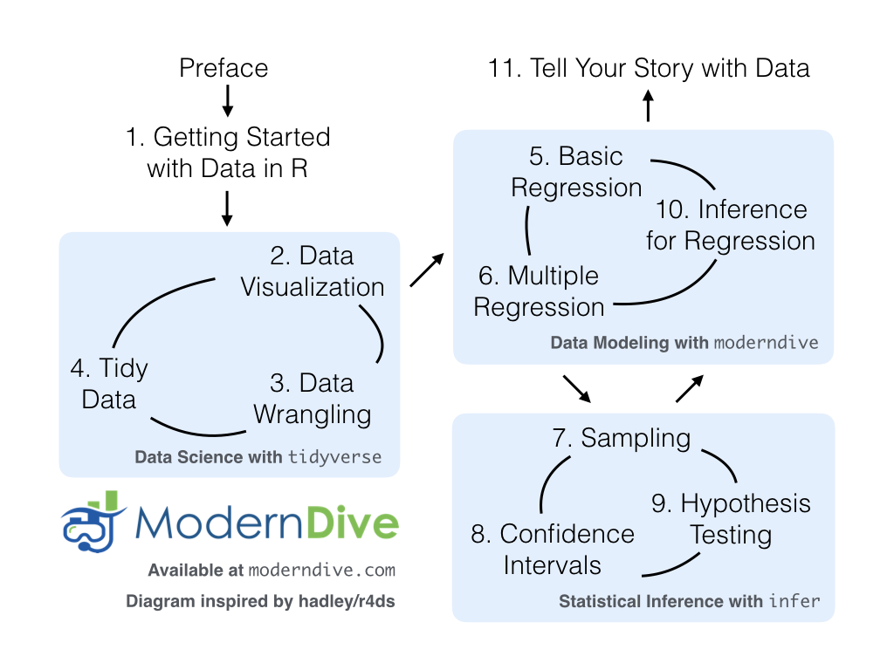

--- 
#title: "`r knitr::include_graphics('logos/wide_format.png')`"
#title: 
#title: "ModernDive"
title: "An Introduction to Statistical and Data Sciences via R"
author: "Chester Ismay and Albert Y. Kim"
date: "`r format(Sys.time(), '%B %d, %Y')`"
site: bookdown::bookdown_site
documentclass: book
bibliography: [bib/books.bib, bib/packages.bib, bib/articles.bib]
biblio-style: apalike
link-citations: no
github-repo: moderndive/moderndive_book
description: "An open-source and fully-reproducible electronic textbook bridging the gap between traditional introductory statistics and data science courses."
cover-image: "images/logos/book_cover.png"
url: 'http\://moderndive.com/'
apple-touch-icon: "images/logos/favicons/apple-touch-icon.png"
favicon: "images/logos/favicons/favicon.ico"
---


```{r set-options, include=FALSE}
# Current version information: Date here should match the date in the YAML above.
# Remove .9000 tag and set date to release date when releasing
version <- "0.3.0.9000"
date <- format(Sys.time(), '%B %d, %Y')

# Latest release information:
latest_release_version <- "0.3.0"
latest_release_date <- "February 3, 2018"

# Set output options
options(width = 80, digits = 7, bookdown.clean_book = TRUE)
knitr::opts_chunk$set(
  tidy = FALSE, 
  out.width='\\textwidth', 
  fig.align = "center", 
  comment = NA
)

# CRAN packages needed
needed_CRAN_pkgs <- c(
  # Data packages:
  "nycflights13", "ggplot2movies", "fivethirtyeight", 
  #"okcupiddata", 
  "gapminder", "ISLR",
  # Used packages:
  #"ggplot2", 
  "tibble", "tidyr", "dplyr", "readr", "dygraphs", "rmarkdown", 
  "knitr", 
  #"mosaic", 
  "broom", "forcats", "plotly", "janitor",
  #"moderndive", 
  "infer", 
  # "patchwork",
  # Internally used packages:
  "webshot", "tufte", "mvtnorm", "stringr", "gridExtra", "remotes", "purrr",
  "devtools"
  )
new_pkgs <- needed_CRAN_pkgs[!(needed_CRAN_pkgs %in% installed.packages())]
if(length(new_pkgs)) {
  install.packages(new_pkgs, repos = "http://cran.rstudio.com")
}

# GitHub packages needed
if(!"patchwork" %in% installed.packages()){
  devtools::install_github("tidyverse/ggplot2")
  devtools::install_github("thomasp85/patchwork")
}

if(!"moderndive" %in% installed.packages()){
  devtools::install_github("moderndive/moderndive")
}

#if(!"infer" %in% installed.packages()){
#  devtools::install_github("andrewpbray/infer", ref = #"develop")
#}

# Check that phantomjs is installed to create screenshots of apps
if(is.null(webshot:::find_phantom()))
  webshot::install_phantomjs()

# Automatically create a bib database for R packages
knitr::write_bib(
  c(.packages(), "bookdown", "knitr", "rmarkdown", "nycflights13",
  "ggplot2", "webshot", "dygraphs", "dplyr",
  "ggplot2movies", "fivethirtyeight", "tibble", "readr", "tidyr",
  "janitor", "infer", "skimr"
  ),
  "bib/packages.bib"
  )

# Add all simulation results here
dir.create("rds")

# Add all knitr::purl()'ed chapter R scripts here
dir.create("docs/scripts")

# purl R scripts. For some reason this needs to be run manually:
if(FALSE){
  # Note order matters here:
  chapter_titles <- c("getting-started", "visualization", "tidy", "wrangling", 
                      "regression", "multiple-regression", "sampling", 
                      "confidence-intervals", "hypothesis-testing",
                      "inference-for-regression", "thinking-with-data")
  chapter_numbers <- stringr::str_pad(2:(length(chapter_titles) + 1), 2, "left", pad = "0")
  for(i in seq_len(length(chapter_numbers))){
    Rmd_file <- stringr::str_c(chapter_numbers[i], "-", chapter_titles[i], ".Rmd")
    R_file <- stringr::str_c("docs/scripts/", chapter_numbers[i], "-", chapter_titles[i], ".R")
    knitr::purl(Rmd_file, R_file)
  }
}
```


# Introduction {#intro}


---

```{block, type='learncheck', purl=FALSE}
**Note: This is the development version of ModernDive and is currently in the process of being edited. For the latest released version of ModernDive, please go to [ModernDive.com](http://moderndive.com/).**
```

<!--
## Important Note

This is a previous version (v`r version`) of ModernDive and may be out of date. For the current version of ModernDive, please go to [ModernDive.com](http://moderndive.com/). 
-->

---


&nbsp;&nbsp;&nbsp;&nbsp;&nbsp;


**Help! I'm new to R and RStudio and I need to learn about them! However, I'm completely new to coding! What do I do?** If you're asking yourself this question, then you've come to the right place! Start with our [Introduction for Students](#sec:intro-for-students).

* *Are you an instructor hoping to use this book in your courses? Then click [here](#sec:intro-instructors) for more information on how to teach with this book.*
* *Are you looking to connect with and contribute to ModernDive? Then click [here](#sec:connect-contribute) for information on how.*
* *Are you curious about the publishing of this book? Then click [here](#sec:about-book) for more information on the open-source technology, in particular R Markdown and the bookdown package.*

This is version `r version` of ModernDive published on `r date`. For previous versions of ModernDive, see Section \@ref(sec:about-book).


---

## Introduction for students {#sec:intro-for-students}

This book assumes no prerequisites: no algebra, no calculus, and no prior programming/coding experience. This is intended to be a gentle introduction to the practice of analyzing data and answering questions using data the way data scientists, statisticians, data journalists, and other researchers would. 
  
In Figure \@ref(fig:moderndive-figure) we present a flowchart of what you'll cover in this book. You'll first get started with with data in Chapter \@ref(getting-started), where you'll learn about the difference between R and RStudio, start coding in R, understand what R packages are, and explore your first dataset: all domestic departure flights from a New York City airport in 2013. Then

1. **Data science**: You'll assemble your data science toolbox using `tidyverse` packages. In particular:
    + Ch.\@ref(viz): Visualizing data via the `ggplot2` package.
    + Ch.\@ref(tidy): Understanding the concept of "tidy" data as a standardized data input format for all packages in the `tidyverse`
    + Ch.\@ref(wrangling): Wranging data via the `dplyr` package.
1. **Data modeling**: Using these data science tools and helper functions from the `moderndive` package, you'll start performing data modeling. In particular:
    + Ch.\@ref(regression): Constructing basic regression models.
    + Ch.\@ref(multiple-regression): Constructing multiple regression models.
1. **Statistical inference**: Once again using your newly acquired data science tools, we'l unpack statistical inference using the `infer` package. In particular:
    + Ch.\@ref(sampling): Understanding the role that sampling variability plays in statistical inference using both tactile and virtual simulations of sampling from a "bowl" with an unknown proportion of red balls.
    + Ch.\@ref(confidence-intervals): Building confidence intervals.
    + Ch.\@ref(hypothesis-testing): Conducting hypothesis tests.
1. **Data modeling revisited**: Armed with your new understanding of statistical inference, you'll revisit and review the models you constructed in Ch.\@ref(regression) & Ch.\@ref(regression). In particular:
    + Ch.\@ref(inference-for-regression): Interpreting both the statistical and practice significance of the results of the models.

We'll end with a discussion on what it means to "think with data" in Chapter \@ref(thinking-with-data) and present an example case study data analysis of house prices in Seattle.

```{r moderndive-figure, echo=FALSE, fig.align='center', fig.cap="ModernDive Flowchart", fig.width=8}

```


### What you will learn from this book {#subsec:learning-goals}

We hope that by the end of this book, you'll have learned

1. How to use R to explore data.  
1. How to answer statistical questions using tools like confidence intervals and hypothesis tests. 
1. How to effectively create "data stories" using these tools. 

What do we mean by data stories? We mean any analysis involving data that engages the reader in answering questions with careful visuals and thoughtful discussion, such as [How strong is the relationship between per capita income and crime in Chicago neighborhoods?](http://rpubs.com/ry_lisa_elana/chicago) and [How many f**ks does Quentin Tarantino give (as measured by the amount of swearing in his films)?](https://ismayc.github.io/soc301_s2017/group_projects/group4.html).  Further discussions on data stories can be found in this [Think With Google article](https://www.thinkwithgoogle.com/marketing-resources/data-measurement/tell-meaningful-stories-with-data/).  

For other examples of data stories constructed by students like yourselves, look at the final projects for two courses that have previously used ModernDive:

* Middlebury College [MATH 116 Introduction to Statistical and Data Sciences](https://rudeboybert.github.io/MATH116/PS/final_project/final_project_outline.html#past_examples) using student collected data.
* Pacific University [SOC 301 Social Statistics](https://ismayc.github.io/soc301_s2017/group-projects/index.html) using data from the [fivethirtyeight R package](https://cran.r-project.org/web/packages/fivethirtyeight/vignettes/fivethirtyeight.html).

This book will help you develop your "data science toolbox", including tools such as data visualization, data formatting, data wrangling, and data modeling using regression. With these tools, you'll be able to perform the entirety of the "data/science pipeline" while building data communication skills (see Subsection \@ref(subsec:pipeline) for more details). 

In particular, this book will lean heavily on data visualization.  In today's world, we are bombarded with graphics that attempt to convey ideas.  We will explore what makes a good graphic and what the standard ways are to convey relationships with data.  You'll also see the use of visualization to introduce concepts like mean, median, standard deviation, distributions, etc.  In general, we'll use visualization as a way of building almost all of the ideas in this book.

To impart the statistical lessons in this book, we have intentionally minimized the number of mathematical formulas used and instead have focused on developing a conceptual understanding via data visualization, statistical computing, and simulations.  We hope this is a more intuitive experience than the way statistics has traditionally been taught in the past and how it is commonly perceived.

Finally, you'll learn the importance of literate programming.  By this we mean you'll learn how to write code that is useful not just for a computer to execute but also for readers to understand exactly what your analysis is doing and how you did it.  This is part of a greater effort to encourage reproducible research (see Subsection \@ref(subsec:reproducible) for more details). Hal Abelson coined the phrase that we will follow throughout this book:

> "Programs must be written for people to read, and only incidentally for machines to execute."

We understand that there may be challenging moments as you learn to program.  Both of us continue to struggle and find ourselves often using web searches to find answers and reach out to colleagues for help.  In the long run though, we all can solve problems faster and more elegantly via programming.  We wrote this book as our way to help you get started and you should know that there is a huge community of R users that are always happy to help everyone along as well.  This community exists in particular on the internet on various forums and websites such as [stackoverflow.com](https://stackoverflow.com/).

### Data/science pipeline {#subsec:pipeline}

You may think of statistics as just being a bunch of numbers.  We commonly hear the phrase "statistician" when listening to broadcasts of sporting events.  Statistics (in particular, data analysis), in addition to describing numbers like with baseball batting averages, plays a vital role in all of the sciences.  You'll commonly hear the phrase "statistically significant" thrown around in the media.  You'll see articles that say "Science now shows that chocolate is good for you."  Underpinning these claims is data analysis.  By the end of this book, you'll be able to better understand whether these claims should be trusted or whether we should be wary.  Inside data analysis are many sub-fields that we will discuss throughout this book (though not necessarily in this order):

- data collection
- data wrangling
- data visualization
- data modeling
- inference
- correlation and regression
- interpretation of results
- data communication/storytelling

These sub-fields are summarized in what Grolemund and Wickham term the ["Data/Science Pipeline"](http://r4ds.had.co.nz/explore-intro.html) in Figure \@ref(fig:pipeline-figure).

```{r pipeline-figure, echo=FALSE, fig.align='center', fig.cap="Data/Science Pipeline"}
knitr::include_graphics("images/tidy1.png")
```

We will begin by digging into the gray **Understand** portion of the cycle with data visualization, then with a discussion on what is meant by tidy data and data wrangling, and then conclude by talking about interpreting and discussing the results of our models via **Communication**.  These steps are vital to any statistical analysis.  But why should you care about statistics?  "Why did they make me take this class?"

There's a reason so many fields require a statistics course. Scientific knowledge grows through an understanding of statistical significance and data analysis. You needn't be intimidated by statistics.  It's not the beast that it used to be and, paired with computation, you'll see how reproducible research in the sciences particularly increases scientific knowledge.

### Reproducible research {#subsec:reproducible}

> "The most important tool is the _mindset_, when starting, that the end product will be reproducible." – Keith Baggerly

Another goal of this book is to help readers understand the importance of reproducible analyses. The hope is to get readers into the habit of making their analyses reproducible from the very beginning.  This means we'll be trying to help you build new habits.  This will take practice and be difficult at times. You'll see just why it is so important for you to keep track of your code and well-document it to help yourself later and any potential collaborators as well.  

Copying and pasting results from one program into a word processor is not the way that efficient and effective scientific research is conducted.  It's much more important for time to be spent on data collection and data analysis and not on copying and pasting plots back and forth across a variety of programs.

In a traditional analyses if an error was made with the original data, we'd need to step through the entire process again:  recreate the plots and copy and paste all of the new plots and our statistical analysis into your document.  This is error prone and a frustrating use of time.  We'll see how to use R Markdown to get away from this tedious activity so that we can spend more time doing science.

> "We are talking about _computational_ reproducibility." - Yihui Xie

Reproducibility means a lot of things in terms of different scientific fields.  Are experiments conducted in a way that another researcher could follow the steps and get similar results?  In this book, we will focus on what is known as **computational reproducibility**.  This refers to being able to pass all of one's data analysis, data-sets, and conclusions to someone else and have them get exactly the same results on their machine.  This allows for time to be spent interpreting results and considering assumptions instead of the more error prone way of starting from scratch or following a list of steps that may be different from machine to machine.

<!--
Additionally, this book will focus on computational thinking, data thinking, and inferential thinking. We'll see throughout the book how these three modes of thinking can build effective ways to work with, to describe, and to convey statistical knowledge.  
-->

### Final note for students

At this point, if you are interested in instructor perspectives on this book, ways to contribute and collaborate, or the technical details of this book's construction and publishing, then continue with the rest of the chapter below.  Otherwise, let's get started with R and RStudio in Chapter \@ref(getting-started)!


---

## Introduction for instructors {#sec:intro-instructors}

This book is inspired by the following books:

- "Mathematical Statistics with Resampling and R" [@hester2011],
- "OpenIntro: Intro Stat with Randomization and Simulation" [@isrs2014], and 
- "R for Data Science" [@rds2016].


The first book, while designed for upper-level undergraduates and graduate students, provides an excellent resource on how to use resampling to impart statistical concepts like sampling distributions using computation instead of large-sample approximations and other mathematical formulas.  The last two books are free options to learning introductory statistics and data science, providing an alternative to the many traditionally expensive introductory statistics textbooks. 

When looking over the large number of introductory statistics textbooks that currently exist, we found that there wasn't one that incorporated many newly developed R packages directly into the text, in particular the many packages included in the [`tidyverse`](http://tidyverse.org/) collection of packages, such as `ggplot2`, `dplyr`, `tidyr`, and `broom`. Additionally, there wasn't an open-source and easily reproducible textbook available that exposed new learners all of three of the learning goals listed at the outset of Subsection \@ref(subsec:learning-goals).

### Who is this book for?

This book is intended for instructors of traditional introductory statistics classes using RStudio, either the desktop or server version, who would like to inject more data science topics into their syllabus. We assume that students taking the class will have no prior algebra, calculus, nor programming/coding experience.

Here are some principles and beliefs we kept in mind while writing this text. If you agree with them, this might be the book for you.

1. **Blur the lines between lecture and lab**
    + With increased availability and accessibility of laptops and open-source non-proprietary statistical software, the strict dichotomy between lab and lecture can be loosened.
    + It's much harder for students to understand the importance of using software if they only use it once a week or less.  They forget the syntax in much the same way someone learning a foreign language forgets the rules. Frequent reinforcement is key.
1. **Focus on the entire data/science research pipeline**
    + We believe that the entirety of Grolemund and Wickham's [data/science pipeline](http://r4ds.had.co.nz/introduction.html) should be taught.
    + We believe in ["minimizing prerequisites to research"](https://arxiv.org/abs/1507.05346): students should be answering questions with data as soon as possible.
1. **It's all about the data**
    + We leverage R packages for rich, real, and realistic data-sets that at the same time are easy-to-load into R, such as the `nycflights13` and `fivethirtyeight` packages.
    + We believe that [data visualization is a gateway drug for statistics](http://escholarship.org/uc/item/84v3774z) and that the Grammar of Graphics as implemented in the `ggplot2` package is the best way to impart such lessons. However, we often hear: "You can't teach `ggplot2` for data visualization in intro stats!" We, like [David Robinson](http://varianceexplained.org/r/teach_ggplot2_to_beginners/), are much more optimistic.
    + `dplyr` has made data wrangling much more [accessible](http://chance.amstat.org/2015/04/setting-the-stage/) to novices, and hence much more interesting data-sets can be explored. 
1. **Use simulation/resampling to introduce statistical inference, not probability/mathematical formulas**
    + Instead of using formulas, large-sample approximations, and probability tables, we teach statistical concepts using resampling-based inference.
    + This allows for a de-emphasis of traditional probability topics, freeing up room in the syllabus for other topics.
1. **Don't fence off students from the computation pool, throw them in!**
    + Computing skills are essential to working with data in the 21st century. Given this fact, we feel that to shield students from computing is to ultimately do them a disservice.
    + We are not teaching a course on coding/programming per se, but rather just enough of the computational and algorithmic thinking necessary for data analysis.
1. **Complete reproducibility and customizability**
    + We are frustrated when textbooks give examples, but not the source code and the data itself. We give you the source code for all examples as well as the whole book!
    + Ultimately the best textbook is one you've written yourself. You know best your audience, their background, and their priorities. You know best your own style and the types of examples and problems you like best. Customization is the ultimate end. For more about how to make this book your own, see [About this Book](#about-book).


---

## DataCamp {#datacamp}


DataCamp is a browser-based interactive platform for learning data science, offering courses on a wide array of courses on data science, analytics, statistics, machine learning, and artificial intelligence, where each course is a combination of lectures and exercises that offer immediate feedback.

The following chapters of ModernDive roughly map to the following closely-integrated DataCamp courses that use the same R tools and often even the same datasets. By no means is this an exhaustive list of possible DataCamp courses that are relevant to the topics in this book, we recommend these ones in particular to supplement your ModernDive experience. 

Click on the image for each course to access its webpage on [datacamp.com](https://www.datacamp.com/home). Instructors at accredited universities can sign their class up for a free academic licence at [DataCamp For The Classroom](https://www.datacamp.com/groups/education), giving their students access to all premium courses for 6 months for free.

| Chapter | Topic | DataCamp Courses   
| :-------------------------|:-------------------------|:-------------------------
| 2 | Basic R programming concepts | <a target="_blank" class="page-link" href="https://www.datacamp.com/courses/free-introduction-to-r"></a> <a target="_blank" class="page-link" href="https://www.datacamp.com/courses/intermediate-r"></a>
| 3 & 5 | Introductory data visualization and wrangling | <a target="_blank" class="page-link" href="https://www.datacamp.com/courses/introduction-to-the-tidyverse"></a>
| 4 & 5 | Data "tidying" and intermediate data wrangling | <a target="_blank" class="page-link" href="https://www.datacamp.com/courses/working-with-data-in-the-tidyverse"></a>
| 6 & 7 | Data modelling, basic regression, and multiple regression | <a target="_blank" class="page-link" href="https://www.datacamp.com/courses/modeling-with-data-in-the-tidyverse"></a>
| 9 & 10 | Statistical inference: confidence intervals and hypothesis testing | <a target="_blank" class="page-link" href="https://www.datacamp.com/courses/inference-for-numerical-data"></a> <a target="_blank" class="page-link" href="https://www.datacamp.com/courses/inference-for-categorical-data"></a>
| 11 | Inference for regression | <a target="_blank" class="page-link" href="https://www.datacamp.com/courses/inference-for-linear-regression"></a> 


---

## Connect and contribute {#sec:connect-contribute}

If you would like to connect with ModernDive, check out the following links:

* If you would like to receive periodic updates about ModernDive (roughly every 3 months), please sign up for our [mailing list](http://eepurl.com/cBkItf).
* Contact Albert at [albert@moderndive.com](mailto:albert@moderndive.com) and Chester [chester@moderndive.com](mailto:chester@moderndive.com)
* We're on Twitter at [ModernDive](https://twitter.com/ModernDive).

If you would like to contribute to ModernDive, there are many ways! Let's all work together to make this book as great as possible for as many students and instructors as possible!

* Please let us know if you find any errors, typos, or areas from improvement on our [GitHub issues](https://github.com/moderndive/moderndive_book/issues) page.
* If you are familiar with GitHub and would like to contribute more, please see Section \@ref(sec:about-book) below.

The authors would like to thank [Nina Sonneborn](https://github.com/nsonneborn), [Kristin Bott](https://twitter.com/rhobott?lang=en), and the participants of our [USCOTS 2017 workshop](https://www.causeweb.org/cause/uscots/uscots17/workshop/3) for their feedback and suggestions.  A special thanks goes to Prof. Yana Weinstein, cognitive psychological scientist and co-founder of [The Learning Scientists](http://www.learningscientists.org/yana-weinstein/), for her extensive contributions.


---

## About this book {#sec:about-book}

This book was written using RStudio's [bookdown](https://bookdown.org/) package by Yihui Xie [@R-bookdown]. This package simplifies the publishing of books by having all content written in [R Markdown](http://rmarkdown.rstudio.com/html_document_format.html). The bookdown/R Markdown source code for all versions of ModernDive is available on GitHub:

* **Latest published version** The most up-to-date release:
    + Version `r latest_release_version` released on `r latest_release_date` ([source code](https://github.com/moderndive/moderndive_book/releases/tag/v`r latest_release_version`)).
    + Available at [ModernDive.com](http://moderndive.com/)
* **Development version** The working copy of the next version which is currently being edited:
    + Preview of development version is available at [http://moderndive.netlify.com/](http://moderndive.netlify.com/)
    + Source code: Available on ModernDive's [GitHub repository page](https://github.com/moderndive/moderndive_book)
* **Previous versions** Older versions that may be out of date:
    + [Version 0.2.0](http://moderndive.com/previous_versions/v0.2.0) released on August 02, 2017 ([source code](https://github.com/moderndive/moderndive_book/releases/tag/v0.2.0))
    + [Version 0.1.3](http://moderndive.com/previous_versions/v0.1.3) released on February 09, 2017 ([source code](https://github.com/moderndive/moderndive_book/releases/tag/v0.1.3))
    + [Version 0.1.2](http://moderndive.com/previous_versions/v0.1.2) released on January 22, 2017 ([source code](https://github.com/moderndive/moderndive_book/releases/tag/v0.1.2))

Could this be a new paradigm for textbooks? Instead of the traditional model of textbook companies publishing updated *editions* of the textbook every few years, we apply a software design influenced model of publishing more easily updated *versions*.  We can then leverage open-source communities of instructors and developers for ideas, tools, resources, and feedback. As such, we welcome your pull requests.

Finally, feel free to modify the book as you wish for your own needs, but please list the authors at the top of `index.Rmd` as "Chester Ismay, Albert Y. Kim, and YOU!"


---

## About the authors {#sec:about-authors}

Who we are!

Chester Ismay           |  Albert Y. Kim
:-------------------------:|:-------------------------:
  |  

* Chester Ismay: Data Science Curriculum Lead - DataCamp, Portland, OR, USA.
    + Email: [chester@moderndive.com](mailto:chester@moderndive.com)
    + Webpage: <http://ismayc.github.io/>
    + Twitter: [old_man_chester](https://twitter.com/old_man_chester)
    + GitHub: <https://github.com/ismayc>
* Albert Y. Kim: Assistant Professor of Statistical & Data Sciences - Smith College, Northampton, MA, USA.
    + Email: [albert@moderndive.com](mailto:albert@moderndive.com)
    + Webpage: <http://rudeboybert.rbind.io/>
    + Twitter: [rudeboybert](https://twitter.com/rudeboybert)
    + GitHub: <https://github.com/rudeboybert>

<!--
### Colophon 

* ModernDive is written using the CC0 1.0 Universal License; more information on this license is available [here](https://creativecommons.org/publicdomain/zero/1.0/).
* ModernDive uses the following versions of R packages (and their dependent packages):
-->

```{r colophon, echo=FALSE, eval=FALSE}
knitr::kable(devtools::session_info(needed_pkgs)$packages, 
             booktabs = TRUE,
             longtable = TRUE)
```
