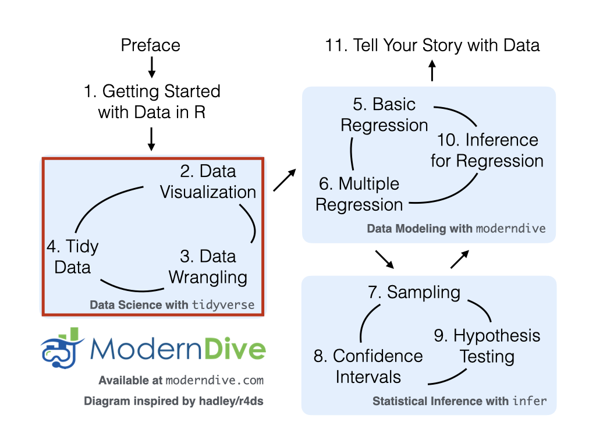
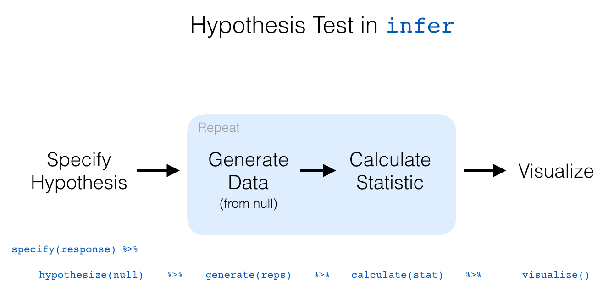

--- 
title: "Statistical Inference via Data Science in R"
author: "Chester Ismay and Albert Y. Kim"
date: "`r format(Sys.time(), '%B %d, %Y')`"
site: bookdown::bookdown_site
documentclass: krantz
bibliography: [bib/books.bib, bib/packages.bib, bib/articles.bib]
biblio-style: apalike
fontsize: 12pt
monofont: "Source Code Pro"
monofontoptions: "Scale=0.7"
link-citations: yes
colorlinks: yes
lot: yes
lof: yes
always_allow_html: yes
github-repo: moderndive/moderndive_book
graphics: yes
description: "An open-source and fully-reproducible electronic textbook bridging the gap between traditional introductory statistics and data science courses."
cover-image: "images/logos/book_cover.png"
url: 'https\://moderndive.com/'
apple-touch-icon: "images/logos/favicons/apple-touch-icon.png"
favicon: "images/logos/favicons/favicon.ico"
---


<!-- For use only in PDF, is skipped in HTML -->
\mainmatter

```{r set-options, include=FALSE}
# Current version information: Date here should match the date in the YAML above.
# Remove .9000 tag and set date to release date when releasing
version <- "0.4.0.9000"
date <- format(Sys.time(), '%B %d, %Y')

# Latest release information:
latest_release_version <- "0.4.0"
latest_release_date <- "July 21, 2018"

# Set output options
if(knitr:::is_html_output())
  options(width = 80)
if(knitr:::is_latex_output())
  options(width = 65)
options(digits = 7, bookdown.clean_book = TRUE, knitr.kable.NA = 'NA')
knitr::opts_chunk$set(
  tidy = FALSE, 
  out.width='\\textwidth', 
  fig.align = "center", 
  comment = NA
)

# CRAN packages needed
needed_CRAN_pkgs <- c(
  # Data packages:
  "nycflights13", "ggplot2movies", "fivethirtyeight", "gapminder", "ISLR",
  
  # Explicitly used packages:
  "tidyverse", "rmarkdown", "knitr", "plotly", "janitor", "skimr",
  "infer", "moderndive",
  
  # Internally used packages:
  "webshot", "mvtnorm", "remotes", "devtools", "dygraphs", "gridExtra", "kableExtra"
  )
new_pkgs <- needed_CRAN_pkgs[!(needed_CRAN_pkgs %in% installed.packages())]
if(length(new_pkgs)) {
  install.packages(new_pkgs, repos = "http://cran.rstudio.com")
}

# GitHub packages needed
if(!"patchwork" %in% installed.packages()){
  # patchwork as of 2018-07-20 needs dev version of ggplot2:
  remotes::install_github("tidyverse/ggplot2")
  remotes::install_github("thomasp85/patchwork")
}

# Check that phantomjs is installed to create screenshots of apps
if(is.null(webshot:::find_phantom()))
  webshot::install_phantomjs()

# Automatically create a bib database for R packages
knitr::write_bib(
  c(.packages(), "bookdown", "knitr", "rmarkdown", "nycflights13",
  "ggplot2", "webshot", "dygraphs", "dplyr",
  "ggplot2movies", "fivethirtyeight", "tibble", "readr", "tidyr",
  "janitor", "infer", "skimr", "kableExtra"
  ),
  "bib/packages.bib"
  )


# Add all simulation results here
dir.create("rds")

# Add all knitr::purl()'ed chapter R scripts here
dir.create("docs")
system("rm -rf docs/scripts/")
dir.create("docs/scripts")
system("R CMD batch purl.R")
system("rm purl.Rout")

# Copy all needed csv and txt files to docs/
# Should switch to use purrr here at some point
dir.create("docs/data")
file.copy("data/dem_score.csv", "docs/data/dem_score.csv", overwrite = TRUE)
file.copy("data/dem_score.xlsx", "docs/data/dem_score.xlsx", overwrite = TRUE)
file.copy("data/le_mess.csv", "docs/data/le_mess.csv", overwrite = TRUE)
file.copy("data/ideology.csv", "docs/data/ideology.csv", overwrite = TRUE)
# For Appendix B
file.copy("data/ageAtMar.csv", "docs/data/ageAtMar.csv", overwrite = TRUE)
file.copy("data/offshore.csv", "docs/data/offshore.csv", overwrite = TRUE)
file.copy("data/cleSac.txt", "docs/data/cleSac.txt", overwrite = TRUE)
file.copy("data/zinc_tidy.csv", "docs/data/zinc_tidy.csv", overwrite = TRUE)

# Make sure all images copy to docs folder
dir.create("docs/images")
system("cp -r images/* docs/images/")
# Copy previous_versions/ to docs/previous_versions/
# Should switch to use purrr here at some point
dir.create("docs/previous_versions/")
system("cp -r previous_versions/* docs/previous_versions/")

# For some reason logo needs to be done separately.
# Loaded in _includes/logo.html
file.copy("images/logos/wide_format.png", "docs/wide_format.png", overwrite = TRUE)
```


```{r images, include=FALSE}
include_image <- function(path,                           
                          html_opts = "width=45%", 
                          latex_opts = html_opts,
                          alt_text = ""){
  if(knitr:::is_html_output()){
    glue::glue("{{ {html_opts} }}")
  } else if(knitr:::is_latex_output()){
    glue::glue("{{ {latex_opts} }}")    
  }
}

image_link <- function(path,
                       link,
                       html_opts = "height: 200px;",
                       latex_opts = "width=0.2\\textwidth",
                       alt_text = "",
                       centering = TRUE){
  if(knitr:::is_html_output()){
    if(centering){
    glue::glue('
      <center><a target="_blank" class="page-link" href="{link}"></a></center>')
    } else {
      glue::glue('
      <a target="_blank" class="page-link" href="{link}"></a>')
    }
  }
  else if(knitr:::is_latex_output()){
    if(centering){
      glue::glue('\\begin{{center}}
        \\href{{{link}}}{{\\includegraphics[{latex_opts}]{{{path}}}}}
        \\end{{center}}')
    } else
      glue::glue('\\href{{{link}}}{{\\includegraphics[{latex_opts}]{{{path}}}}}')
  }
  
}
```


# Introduction {#intro}


---

```{block, type='learncheck', purl=FALSE}
**Note: This is the development version of ModernDive and is currently in the process of being edited. For the latest released version of ModernDive, please go to [ModernDive.com](https://moderndive.com/).**
```

<!--
## Important Note

This is a previous version (v`r version`) of ModernDive and may be out of date. For the current version of ModernDive, please go to [ModernDive.com](https://moderndive.com/). 
-->

---


<!-- https://cran.r-project.org/Rlogo.svg -->
<!-- https://www.rstudio.com/wp-content/uploads/2014/07/RStudio-Logo-Blue-Gradient.png -->

`r include_image("images/Rlogo.png", html_opts = "height=150px", latex_opts = "height=20%")`        \hfill &emsp; &emsp; &emsp; &emsp; `r include_image("images/RStudio-Logo-Blue-Gradient.png")`

<!--

&nbsp;&nbsp;&nbsp;&nbsp;&nbsp;

-->

**Help! I'm new to R and RStudio and I need to learn about them! However, I'm completely new to coding! What do I do?** If you're asking yourself this question, then you've come to the right place! Start with our [Introduction for Students](#sec:intro-for-students).

* *Are you an instructor hoping to use this book in your courses? Then click [here](#sec:intro-instructors) for more information on how to teach with this book.*
* *Are you looking to connect with and contribute to ModernDive? Then click [here](#sec:connect-contribute) for information on how.*
* *Are you curious about the publishing of this book? Then click [here](#sec:about-book) for more information on the open-source technology, in particular R Markdown and the bookdown package.*

This is version `r version` of ModernDive published on `r date`. For previous versions of ModernDive, see Section \@ref(sec:about-book). While a PDF version of this book can be found [here](https://github.com/moderndive/moderndive_book/raw/master/docs/ismaykim.pdf){target="_blank"}, this is very much a work in progress with many things that still need to be fixed. We appreciate your patience. 


---

## Introduction for students {#sec:intro-for-students}

This book assumes no prerequisites: no algebra, no calculus, and no prior programming/coding experience. This is intended to be a gentle introduction to the practice of analyzing data and answering questions using data the way data scientists, statisticians, data journalists, and other researchers would. 
  
In Figure \@ref(fig:moderndive-figure) we present a flowchart of what you'll cover in this book. You'll first get started with data in Chapter \@ref(getting-started), where you'll learn about the difference between R and RStudio, start coding in R, understand what R packages are, and explore your first dataset: all domestic departure flights from a New York City airport in 2013. Then

1. **Data science**: You'll assemble your data science toolbox using `tidyverse` packages. In particular:
    + Ch.\@ref(viz): Visualizing data via the `ggplot2` package.
    + Ch.\@ref(tidy): Understanding the concept of "tidy" data as a standardized data input format for all packages in the `tidyverse`
    + Ch.\@ref(wrangling): Wrangling data via the `dplyr` package.
1. **Data modeling**: Using these data science tools and helper functions from the `moderndive` package, you'll start performing data modeling. In particular:
    + Ch.\@ref(regression): Constructing basic regression models.
    + Ch.\@ref(multiple-regression): Constructing multiple regression models.
1. **Statistical inference**: Once again using your newly acquired data science tools, we'll unpack statistical inference using the `infer` package. In particular:
    + Ch.\@ref(sampling): Understanding the role that sampling variability plays in statistical inference using both tactile and virtual simulations of sampling from a "bowl" with an unknown proportion of red balls.
    + Ch.\@ref(confidence-intervals): Building confidence intervals.
    + Ch.\@ref(hypothesis-testing): Conducting hypothesis tests.
1. **Data modeling revisited**: Armed with your new understanding of statistical inference, you'll revisit and review the models you constructed in Ch.\@ref(regression) & Ch.\@ref(multiple-regression). In particular:
    + Ch.\@ref(inference-for-regression): Interpreting both the statistical and practice significance of the results of the models.

We'll end with a discussion on what it means to "think with data" in Chapter \@ref(thinking-with-data) and present an example case study data analysis of house prices in Seattle.

```{r moderndive-figure, echo=FALSE, fig.align='center', fig.cap="ModernDive Flowchart", fig.width=8}
knitr::include_graphics("images/flowcharts/flowchart/flowchart.002.png")
```


### What you will learn from this book {#subsec:learning-goals}

We hope that by the end of this book, you'll have learned

1. How to use R to explore data.  
1. How to answer statistical questions using tools like confidence intervals and hypothesis tests. 
1. How to effectively create "data stories" using these tools. 

What do we mean by data stories? We mean any analysis involving data that engages the reader in answering questions with careful visuals and thoughtful discussion, such as [How strong is the relationship between per capita income and crime in Chicago neighborhoods?](http://rpubs.com/ry_lisa_elana/chicago) and [How many f**ks does Quentin Tarantino give (as measured by the amount of swearing in his films)?](https://ismayc.github.io/soc301_s2017/group_projects/group4.html).  Further discussions on data stories can be found in this [Think With Google article](https://www.thinkwithgoogle.com/marketing-resources/data-measurement/tell-meaningful-stories-with-data/).  

For other examples of data stories constructed by students like yourselves, look at the final projects for two courses that have previously used ModernDive:

* Middlebury College [MATH 116 Introduction to Statistical and Data Sciences](https://rudeboybert.github.io/MATH116/PS/final_project/final_project_outline.html#past_examples) using student collected data.
* Pacific University [SOC 301 Social Statistics](https://ismayc.github.io/soc301_s2017/group-projects/index.html) using data from the [fivethirtyeight R package](https://cran.r-project.org/web/packages/fivethirtyeight/vignettes/fivethirtyeight.html).

This book will help you develop your "data science toolbox", including tools such as data visualization, data formatting, data wrangling, and data modeling using regression. With these tools, you'll be able to perform the entirety of the "data/science pipeline" while building data communication skills (see Subsection \@ref(subsec:pipeline) for more details). 

In particular, this book will lean heavily on data visualization.  In today's world, we are bombarded with graphics that attempt to convey ideas.  We will explore what makes a good graphic and what the standard ways are to convey relationships with data.  You'll also see the use of visualization to introduce concepts like mean, median, standard deviation, distributions, etc.  In general, we'll use visualization as a way of building almost all of the ideas in this book.

To impart the statistical lessons in this book, we have intentionally minimized the number of mathematical formulas used and instead have focused on developing a conceptual understanding via data visualization, statistical computing, and simulations.  We hope this is a more intuitive experience than the way statistics has traditionally been taught in the past and how it is commonly perceived.

Finally, you'll learn the importance of literate programming.  By this we mean you'll learn how to write code that is useful not just for a computer to execute but also for readers to understand exactly what your analysis is doing and how you did it.  This is part of a greater effort to encourage reproducible research (see Subsection \@ref(subsec:reproducible) for more details). Hal Abelson coined the phrase that we will follow throughout this book:

> "Programs must be written for people to read, and only incidentally for machines to execute."

We understand that there may be challenging moments as you learn to program.  Both of us continue to struggle and find ourselves often using web searches to find answers and reach out to colleagues for help.  In the long run though, we all can solve problems faster and more elegantly via programming.  We wrote this book as our way to help you get started and you should know that there is a huge community of R users that are always happy to help everyone along as well.  This community exists in particular on the internet on various forums and websites such as [stackoverflow.com](https://stackoverflow.com/).

### Data/science pipeline {#subsec:pipeline}

You may think of statistics as just being a bunch of numbers.  We commonly hear the phrase "statistician" when listening to broadcasts of sporting events.  Statistics (in particular, data analysis), in addition to describing numbers like with baseball batting averages, plays a vital role in all of the sciences.  You'll commonly hear the phrase "statistically significant" thrown around in the media.  You'll see articles that say "Science now shows that chocolate is good for you."  Underpinning these claims is data analysis.  By the end of this book, you'll be able to better understand whether these claims should be trusted or whether we should be wary.  Inside data analysis are many sub-fields that we will discuss throughout this book (though not necessarily in this order):

- data collection
- data wrangling
- data visualization
- data modeling
- inference
- correlation and regression
- interpretation of results
- data communication/storytelling

These sub-fields are summarized in what Grolemund and Wickham term the ["Data/Science Pipeline"](http://r4ds.had.co.nz/explore-intro.html) in Figure \@ref(fig:pipeline-figure).

```{r pipeline-figure, echo=FALSE, fig.align='center', fig.cap="Data/Science Pipeline"}
knitr::include_graphics("images/tidy1.png")
```

We will begin by digging into the gray **Understand** portion of the cycle with data visualization, then with a discussion on what is meant by tidy data and data wrangling, and then conclude by talking about interpreting and discussing the results of our models via **Communication**.  These steps are vital to any statistical analysis.  But why should you care about statistics?  "Why did they make me take this class?"

There's a reason so many fields require a statistics course. Scientific knowledge grows through an understanding of statistical significance and data analysis. You needn't be intimidated by statistics.  It's not the beast that it used to be and, paired with computation, you'll see how reproducible research in the sciences particularly increases scientific knowledge.

### Reproducible research {#subsec:reproducible}

> "The most important tool is the _mindset_, when starting, that the end product will be reproducible." – Keith Baggerly

Another goal of this book is to help readers understand the importance of reproducible analyses. The hope is to get readers into the habit of making their analyses reproducible from the very beginning.  This means we'll be trying to help you build new habits.  This will take practice and be difficult at times. You'll see just why it is so important for you to keep track of your code and well-document it to help yourself later and any potential collaborators as well.  

Copying and pasting results from one program into a word processor is not the way that efficient and effective scientific research is conducted.  It's much more important for time to be spent on data collection and data analysis and not on copying and pasting plots back and forth across a variety of programs.

In a traditional analyses if an error was made with the original data, we'd need to step through the entire process again:  recreate the plots and copy and paste all of the new plots and our statistical analysis into your document.  This is error prone and a frustrating use of time.  We'll see how to use R Markdown to get away from this tedious activity so that we can spend more time doing science.

> "We are talking about _computational_ reproducibility." - Yihui Xie

Reproducibility means a lot of things in terms of different scientific fields.  Are experiments conducted in a way that another researcher could follow the steps and get similar results?  In this book, we will focus on what is known as **computational reproducibility**.  This refers to being able to pass all of one's data analysis, data-sets, and conclusions to someone else and have them get exactly the same results on their machine.  This allows for time to be spent interpreting results and considering assumptions instead of the more error prone way of starting from scratch or following a list of steps that may be different from machine to machine.

<!--
Additionally, this book will focus on computational thinking, data thinking, and inferential thinking. We'll see throughout the book how these three modes of thinking can build effective ways to work with, to describe, and to convey statistical knowledge.  
-->

### Final note for students

At this point, if you are interested in instructor perspectives on this book, ways to contribute and collaborate, or the technical details of this book's construction and publishing, then continue with the rest of the chapter below.  Otherwise, let's get started with R and RStudio in Chapter \@ref(getting-started)!


---

## Introduction for instructors {#sec:intro-instructors}

This book is inspired by the following books:

- "Mathematical Statistics with Resampling and R" [@hester2011],
- "OpenIntro: Intro Stat with Randomization and Simulation" [@isrs2014], and 
- "R for Data Science" [@rds2016].


The first book, while designed for upper-level undergraduates and graduate students, provides an excellent resource on how to use resampling to impart statistical concepts like sampling distributions using computation instead of large-sample approximations and other mathematical formulas.  The last two books are free options to learning introductory statistics and data science, providing an alternative to the many traditionally expensive introductory statistics textbooks. 

When looking over the large number of introductory statistics textbooks that currently exist, we found that there wasn't one that incorporated many newly developed R packages directly into the text, in particular the many packages included in the [`tidyverse`](http://tidyverse.org/) collection of packages, such as `ggplot2`, `dplyr`, `tidyr`, and `broom`. Additionally, there wasn't an open-source and easily reproducible textbook available that exposed new learners all of three of the learning goals listed at the outset of Subsection \@ref(subsec:learning-goals).

### Who is this book for?

This book is intended for instructors of traditional introductory statistics classes using RStudio, either the desktop or server version, who would like to inject more data science topics into their syllabus. We assume that students taking the class will have no prior algebra, calculus, nor programming/coding experience.

Here are some principles and beliefs we kept in mind while writing this text. If you agree with them, this might be the book for you.

1. **Blur the lines between lecture and lab**
    + With increased availability and accessibility of laptops and open-source non-proprietary statistical software, the strict dichotomy between lab and lecture can be loosened.
    + It's much harder for students to understand the importance of using software if they only use it once a week or less.  They forget the syntax in much the same way someone learning a foreign language forgets the rules. Frequent reinforcement is key.
1. **Focus on the entire data/science research pipeline**
    + We believe that the entirety of Grolemund and Wickham's [data/science pipeline](http://r4ds.had.co.nz/introduction.html) should be taught.
    + We believe in ["minimizing prerequisites to research"](https://arxiv.org/abs/1507.05346): students should be answering questions with data as soon as possible.
1. **It's all about the data**
    + We leverage R packages for rich, real, and realistic data-sets that at the same time are easy-to-load into R, such as the `nycflights13` and `fivethirtyeight` packages.
    + We believe that [data visualization is a gateway drug for statistics](http://escholarship.org/uc/item/84v3774z) and that the Grammar of Graphics as implemented in the `ggplot2` package is the best way to impart such lessons. However, we often hear: "You can't teach `ggplot2` for data visualization in intro stats!" We, like [David Robinson](http://varianceexplained.org/r/teach_ggplot2_to_beginners/), are much more optimistic.
    + `dplyr` has made data wrangling much more [accessible](http://chance.amstat.org/2015/04/setting-the-stage/) to novices, and hence much more interesting data-sets can be explored. 
1. **Use simulation/resampling to introduce statistical inference, not probability/mathematical formulas**
    + Instead of using formulas, large-sample approximations, and probability tables, we teach statistical concepts using resampling-based inference.
    + This allows for a de-emphasis of traditional probability topics, freeing up room in the syllabus for other topics.
1. **Don't fence off students from the computation pool, throw them in!**
    + Computing skills are essential to working with data in the 21st century. Given this fact, we feel that to shield students from computing is to ultimately do them a disservice.
    + We are not teaching a course on coding/programming per se, but rather just enough of the computational and algorithmic thinking necessary for data analysis.
1. **Complete reproducibility and customizability**
    + We are frustrated when textbooks give examples, but not the source code and the data itself. We give you the source code for all examples as well as the whole book!
    + Ultimately the best textbook is one you've written yourself. You know best your audience, their background, and their priorities. You know best your own style and the types of examples and problems you like best. Customization is the ultimate end. For more about how to make this book your own, see [About this Book](#about-book).


---

## DataCamp {#datacamp}

`r include_image("images/datacamp.png", "width=100%", alt_text = "DataCamp logo")`

DataCamp is a browser-based interactive platform for learning data science, offering courses on a wide array of courses on data science, analytics, statistics, machine learning, and artificial intelligence, where each course is a combination of lectures and exercises that offer immediate feedback.

The following chapters of ModernDive roughly map to the following closely-integrated DataCamp courses that use the same R tools and often even the same datasets. By no means is this an exhaustive list of possible DataCamp courses that are relevant to the topics in this book, we recommend these ones in particular to supplement your ModernDive experience. 

Click on the image for each course to access its webpage on [datacamp.com](https://www.datacamp.com/home). Instructors at accredited universities can sign their class up for a free academic licence at [DataCamp For The Classroom](https://www.datacamp.com/groups/education), giving their students access to all premium courses for 6 months for free.


| Chapter | Topic | DataCamp Courses   
| :-------------------------|:-------------------------|:-------------------------
| 2 | Basic R programming concepts | `r image_link(path = "images/datacamp_intro_to_R.png", link = "https://www.datacamp.com/courses/free-introduction-to-r", html_opts = "height: 150px;", latex_opts = "width=0.6\\textwidth", center=FALSE)` `r image_link(path = "images/datacamp_intermediate_R.png", link = "https://www.datacamp.com/courses/intermediate-r", html_opts = "height: 150px;", latex_opts = "width=0.6\\textwidth", center=FALSE)`
| 3 & 5 | Introductory data visualization and wrangling | `r image_link(path = "images/datacamp_intro_to_tidyverse.png", link = "https://www.datacamp.com/courses/introduction-to-the-tidyverse", html_opts = "height: 150px;", latex_opts = "width=0.6\\textwidth", center=FALSE)`
| 4 & 5 | Data "tidying" and intermediate data wrangling | `r image_link(path = "images/datacamp_working_with_data.png", link = "https://www.datacamp.com/courses/working-with-data-in-the-tidyverse", html_opts = "height: 150px;", latex_opts = "width=0.6\\textwidth", center=FALSE)`
| 6 & 7 | Data modeling, basic regression, and multiple regression | `r image_link(path = "images/datacamp_intro_to_modeling.png", link = "https://www.datacamp.com/courses/modeling-with-data-in-the-tidyverse", html_opts = "height: 150px;", latex_opts = "width=0.6\\textwidth", center=FALSE)`
| 9 & 10 | Statistical inference: confidence intervals and hypothesis testing | `r image_link(path = "images/datacamp_inference_for_numerical_data.png", link = "https://www.datacamp.com/courses/inference-for-numerical-data", html_opts = "height: 150px;", latex_opts = "width=0.6\\textwidth", center=FALSE)` `r image_link(path = "images/datacamp_inference_for_categorical_data.png", link = "https://www.datacamp.com/courses/inference-for-categorical-data", html_opts = "height: 150px;", latex_opts = "width=0.6\\textwidth", center=FALSE)`
| 11 | Inference for regression | `r image_link(path = "images/datacamp_inference_for_regression.png", link = "https://www.datacamp.com/courses/inference-for-linear-regression", html_opts = "height: 150px;", latex_opts = "width=0.6\\textwidth", center=FALSE)`


---

## Connect and contribute {#sec:connect-contribute}

If you would like to connect with ModernDive, check out the following links:

* If you would like to receive periodic updates about ModernDive (roughly every 3 months), please sign up for our [mailing list](http://eepurl.com/cBkItf).
* Contact Albert at [albert.ys.kim@gmail.com](mailto:albert.ys.kim@gmail.com) and Chester at [chester.ismay@gmail.com](mailto:chester.ismay@gmail.com).
* We're on Twitter at [ModernDive](https://twitter.com/ModernDive).

If you would like to contribute to ModernDive, there are many ways! Let's all work together to make this book as great as possible for as many students and instructors as possible!

* Please let us know if you find any errors, typos, or areas from improvement on our [GitHub issues](https://github.com/moderndive/moderndive_book/issues) page.
* If you are familiar with GitHub and would like to contribute more, please see Section \@ref(sec:about-book) below.

The authors would like to thank [Nina Sonneborn](https://github.com/nsonneborn), [Kristin Bott](https://twitter.com/rhobott?lang=en), and the participants of our [USCOTS 2017 workshop](https://www.causeweb.org/cause/uscots/uscots17/workshop/3) for their feedback and suggestions.  A special thanks goes to Dr. Yana Weinstein, cognitive psychological scientist and co-founder of [The Learning Scientists](http://www.learningscientists.org/yana-weinstein/), for her extensive contributions.


---

## About this book {#sec:about-book}

This book was written using RStudio's [bookdown](https://bookdown.org/) package by Yihui Xie [@R-bookdown]. This package simplifies the publishing of books by having all content written in [R Markdown](http://rmarkdown.rstudio.com/html_document_format.html). The bookdown/R Markdown source code for all versions of ModernDive is available on GitHub:

* **Latest published version** The most up-to-date release:
    + Version `r latest_release_version` released on `r latest_release_date` ([source code](https://github.com/moderndive/moderndive_book/releases/tag/v`r latest_release_version`)).
    + Available at [ModernDive.com](https://moderndive.com/)
* **Development version** The working copy of the next version which is currently being edited:
    + Preview of development version is available at [https://moderndive.netlify.com/](https://moderndive.netlify.com/)
    + Source code: Available on ModernDive's [GitHub repository page](https://github.com/moderndive/moderndive_book)
* **Previous versions** Older versions that may be out of date:
    + [Version 0.3.0](previous_versions/v0.3.0/index.html) released on February 3, 2018 ([source code](https://github.com/moderndive/moderndive_book/releases/tag/v0.3.0))
    + [Version 0.2.0](previous_versions/v0.2.0/index.html) released on August 02, 2017 ([source code](https://github.com/moderndive/moderndive_book/releases/tag/v0.2.0))
    + [Version 0.1.3](previous_versions/v0.1.3/index.html) released on February 09, 2017 ([source code](https://github.com/moderndive/moderndive_book/releases/tag/v0.1.3))
    + [Version 0.1.2](previous_versions/v0.1.2/index.html) released on January 22, 2017 ([source code](https://github.com/moderndive/moderndive_book/releases/tag/v0.1.2))

Could this be a new paradigm for textbooks? Instead of the traditional model of textbook companies publishing updated *editions* of the textbook every few years, we apply a software design influenced model of publishing more easily updated *versions*.  We can then leverage open-source communities of instructors and developers for ideas, tools, resources, and feedback. As such, we welcome your pull requests.

Finally, feel free to modify the book as you wish for your own needs, but please list the authors at the top of `index.Rmd` as "Chester Ismay, Albert Y. Kim, and YOU!"


---

## About the authors {#sec:about-authors}

Who we are!

Chester Ismay           |  Albert Y. Kim
:-------------------------:|:-------------------------:
`r include_image(path = "images/ismay.png", html_opts = "height=200px", latex_opts = "width=40%")` | `r include_image(path = "images/kim.png", html_opts = "height=200px", latex_opts = "width=40%")`

<!--   |   -->

* Chester Ismay: Senior Curriculum Lead - DataCamp, Portland, OR, USA.
    + Email: [chester.ismay@gmail.com](mailto:chester.ismay@gmail.com)
    + Webpage: <http://chester.rbind.io/>
    + Twitter: [old_man_chester](https://twitter.com/old_man_chester)
    + GitHub: <https://github.com/ismayc>
* Albert Y. Kim: Assistant Professor of Statistical & Data Sciences - Smith College, Northampton, MA, USA.
    + Email: [albert.ys.kim@gmail.com](mailto:albert.ys.kim@gmail.com)
    + Webpage: <http://rudeboybert.rbind.io/>
    + Twitter: [rudeboybert](https://twitter.com/rudeboybert)
    + GitHub: <https://github.com/rudeboybert>

<!--
### Colophon 

* ModernDive is written using the CC0 1.0 Universal License; more information on this license is available [here](https://creativecommons.org/publicdomain/zero/1.0/).
* ModernDive uses the following versions of R packages (and their dependent packages):
-->

```{r colophon, echo=FALSE, eval=FALSE}
library(kableExtra)
knitr::kable(devtools::session_info(needed_pkgs)$packages, 
             booktabs = TRUE,
             longtable = TRUE) %>% 
  kable_styling(font_size = ifelse(knitr:::is_latex_output(), 10, 16),
                            latex_options = c("HOLD_position"))
```

<!--chapter:end:index.Rmd-->

# Getting Started with Data in R {#getting-started}

```{r setup_getting_started, include=FALSE, purl=FALSE}
chap <- 2
lc <- 0
rq <- 0
# **`r paste0("(LC", chap, ".", (lc <- lc + 1), ")")`**
# **`r paste0("(RQ", chap, ".", (rq <- rq + 1), ")")`**
knitr::opts_chunk$set(tidy = FALSE, out.width = '\\textwidth')
# This bit of code is a bug fix on asis blocks, which we use to show/not show LC solutions, which are written like markdown text. In theory, it shouldn't be necessary for knitr versions <=1.11.6, but I've found I still need to for everything to knit properly in asis blocks. More info here:
# https://stackoverflow.com/questions/32944715/conditionally-display-block-of-markdown-text-using-knitr
library(knitr)
knit_engines$set(asis = function(options) {
  if (options$echo && options$eval) knit_child(text = options$code)
})
# This controls which LC solutions to show. Options for solutions_shown: "ALL" (to show all solutions), or subsets of c('2-1', '2-2'), including the null vector c('') to show no solutions.
solutions_shown <- c('2-1', '2-2', '2-3')
# solutions_shown <- c('')
show_solutions <- function(section){return(solutions_shown == "ALL" | section %in% solutions_shown)}
```

Before we can start exploring data in R, there are some key concepts to understand first:

1. What are R and RStudio?
1. How do I code in R?
1. What are R packages?

If you are already familiar with these concepts, feel free to skip to Section \@ref(nycflights13) below introducing some of the datasets we will explore in depth in this book. Much of this chapter is based on two sources which you should feel free to use as references if you are looking for additional details:

1. ModernDive co-author Chester Ismay's [Getting used to R, RStudio, and R Markdown](http://ismayc.github.io/rbasics-book) [@usedtor2016] short book, which includes video screen recordings that you can follow along and pause as you learn. 
1. DataCamp's online tutorials. DataCamp is a browser-based interactive platform for learning data science and their tutorials will help facilitate your learning of the above concepts (and other topics in this book). Go to [DataCamp](https://www.datacamp.com/) and create an account before continuing. 


---

## What are R and RStudio?

For much of this book, we will assume that you are using R via RStudio. First time users often confuse the two. At its simplest:

* R is like a car's engine
* RStudio is like a car's dashboard


R: Engine            |  RStudio: Dashboard 
:-------------------------:|:-------------------------:
{ height=1.7in }  |  { height=1.7in }


More precisely, R is a programming language that runs computations while RStudio is an *integrated development environment (IDE)* that provides an interface by adding many convenient features and tools. So the way of having access to a speedometer, rearview mirrors, and a navigation system makes driving much easier, using RStudio's interface makes using R much easier as well. 

Optional: For a more in-depth discussion on the difference between R and RStudio IDE, watch this [DataCamp video (2m52s)](https://campus.datacamp.com/courses/working-with-the-rstudio-ide-part-1/orientation?ex=1).

### Installing R and RStudio

*If your instructor has provided you with a link and access to RStudio Server, then you can skip this section. We do recommend though after a few months of working on the RStudio Server that you return to these instructions.  If you don't know what RStudio Server is, then please read this section.*

You will first need to download and install both R and RStudio (Desktop version) on your computer. 

1. [Download and install R](https://cran.r-project.org/).
    + Note: You must do this first.
    + Click on the download link corresponding to your computer's operating system.
1. [Download and install RStudio](https://www.rstudio.com/products/rstudio/download3/).
    + Scroll down to "Installers for Supported Platforms"
    + Click on the download link corresponding to your computer's operating system.

Optional: If you need more detailed instructions on how to install R and RStudio, watch this [DataCamp video (1m22s)](https://campus.datacamp.com/courses/working-with-the-rstudio-ide-part-1/orientation?ex=3).

### Using R via RStudio

Recall our car analogy from above. Much as we don't drive a car by interacting directly with the engine but rather by using elements on the car's dashboard, we won't be using R directly but rather we will use RStudio's interface. After you install R and RStudio on your computer, you'll have two new programs AKA applications you can open. We will always work in RStudio and not R. In other words:

<!-- https://www.rstudio.com/wp-content/uploads/2014/06/RStudio-Ball.png -->

R: Do not open this          |  RStudio: Open this
:-------------------------:|:-------------------------:
`r include_image("images/Rlogo.png", html_opts = "width=25%")`  | `r include_image("images/RStudio-Ball.png", html_opts = "width=20%")`

After you open RStudio, you should see the following:


Watch the following [DataCamp video (4m10s)](https://campus.datacamp.com/courses/working-with-the-rstudio-ide-part-1/orientation?ex=5) to learn about the different *panes* in RStudio, in particular the *Console pane* where you will later run R code.


---

## How do I code in R? {#code}

Now that you're set up with R and RStudio, you are probably asking yourself "OK. Now how do I use R?" The first thing to note as that unlike other software like Excel, STATA, or SAS that provide [point and click](https://en.wikipedia.org/wiki/Point_and_click) interfaces, R is an [interpreted language](https://en.wikipedia.org/wiki/Interpreted_language), meaning you have to enter in R commands written in R code i.e. you have to program in R (we use the terms "coding" and "programming" interchangeably in this book).

While it is not required to be a seasoned coder/computer programmer to use R, there is still a set of basic programming concepts that R users need to understand. Consequently, while this book is not a book on programming, you will still learn just enough of these basic programming concepts needed to explore and analyze data effectively. 

### Basic programming concepts and terminology {#programming-concepts}

To introduce you to many of these basic programming concepts and terminology, we direct you to the following DataCamp online interactive tutorials.  For each of the tutorials, we give a list of the basic programming concepts covered. Note that in this book, we will use a different font to distinguish regular font from `computer_code`.

It is important to note that while these tutorials serve as excellent introductions, a single pass through them is insufficient for long-term learning and retention. The ultimate tools for long-term learning and retention are "learning by doing" and repetition, something we will have you do over the course of the entire book and we encourage this process as much as possible as you learn any new skill.

* From the [Introduction to R](https://www.datacamp.com/courses/free-introduction-to-r) course complete the following chapters.  As you work through the chapters, carefully note the important terms and what they are used for.  We recommend you do so in a notebook that you can easily refer back to.
    + [Chapter 1 Intro to basics](https://campus.datacamp.com/courses/free-introduction-to-r/chapter-1-intro-to-basics-1?ex=1):
        + Console pane: where you enter in commands
        + Objects: where values are saved, how to assign values to objects.
        + Data types: integers, doubles/numerics, logicals, characters.  
    + [Chapter 2 Vectors](https://campus.datacamp.com/courses/free-introduction-to-r/chapter-2-vectors-2?ex=1):
        + Vectors: a series of values.
    + [Chapter 4 Factors](https://campus.datacamp.com/courses/free-introduction-to-r/chapter-4-factors-4?ex=1):
        + *Categorical data* (as opposed to *numerical data*) are represented in R as `factor`s.
    + [Chapter 5 Data frames](https://campus.datacamp.com/courses/free-introduction-to-r/chapter-5-data-frames?ex=1):
        + Data frames are analogous to rectangular spreadsheets: they are representations of datasets in R where the rows correspond *observations* and the columns correspond to *variables* that describe the observations. We will revisit this later in Section \@ref(nycflights13).
* From the [Intermediate R](https://www.datacamp.com/courses/intermediate-r) course complete the following chapters:
    + [Chapter 1 Conditionals and Control Flow](https://campus.datacamp.com/courses/intermediate-r/chapter-1-conditionals-and-control-flow?ex=1):
        + Testing for equality in R using `==` (and not `=` which is typically used for assignment). Ex: `2 + 1 == 3` compares `2 + 1` to `3` and is correct R syntax, while `2 + 1 = 3` is not and is incorrect R syntax.
        + Boolean algebra: `TRUE/FALSE` statements and mathematical operators such as `<` (less than), `<=` (less than or equal), and `!=` (not equal to).
        + Logical operators: `&` representing "and", `|` representing "or". Ex: `(2 + 1 == 3) & (2 + 1 == 4)` returns `FALSE` while `(2 + 1 == 3) | (2 + 1 == 4)` returns `TRUE`.
    + [Chapter 3 Functions](https://campus.datacamp.com/courses/intermediate-r/chapter-3-functions?ex=1):
        + Concept of functions: they take in inputs (called *arguments*) and return outputs.
        + You either manually specify a function's arguments or use the function's *defaults*.

This list is by no means an exhaustive list of all the programming concepts and terminology needed to become a savvy R user; such a list would be so large it wouldn't be very useful, especially for novices. Rather, we feel this is the bare minimum you need to know before you get started; the rest we feel you can learn as you go.  Remember that your knowledge of all of these concepts will build as you get better and better at "speaking R" and getting used to its syntax.

### Tips on learning to code

Learning to code/program is very much like learning a foreign language, it can be very daunting and frustrating at first. However just as with learning a foreign language, if you put in the effort and are not afraid to make mistakes, anybody can learn. Lastly, there are a few useful things to keep in mind as you learn to program:

* **Computers are stupid**: You have to tell a computer everything it needs to do. Furthermore, your instructions can't have any mistakes in them, nor can they be ambiguous in any way.
* **Take the "copy/paste/tweak" approach**: Especially when learning your first programming language, it is often much easier to taking existing code that you know works and modify it to suit your ends, rather than trying to write new code from scratch. We call this the *copy/paste/tweak* approach. So early on, we suggest not trying to code from scratch, but please take the code we provide throughout this book and play around with it!
* **Practice is key**:  Just as the only solution to improving your foreign language skills is practice, so also the only way to get better at R is through practice. Don't worry however, we'll give you plenty of opportunities to practice!


---

## What are R packages? {#packages}

Another point of confusion with new R users is the notion of a package. R packages extend the functionality of R by providing additional functions, data, and documentation and can be downloaded for free from the internet. They are written by a world-wide community of R users. For example, among the many packages we will use in this book are the

* `ggplot2` package for data visualization in Chapter \@ref(viz)
* `dplyr` package for data wrangling in Chapter \@ref(wrangling)

There are two key things to remember about R packages:

1. *Installation*: Most packages are not installed by default when you install R and RStudio. You need to install a package before you can use it. Once you've installed it, you likely don't need to install it again unless you want to update it to a newer version of the package.
1. *Loading*: Packages are not loaded automatically when you open RStudio. You need to load them every time you open RStudio using the `library()` command.

A good analogy for R packages is they are like apps you can download onto a mobile phone:

R: A new phone           |  R Packages: Apps you can download
:-------------------------:|:-------------------------:
{ height=1.5in } |  { height=1.5in }

So, expanding on this analogy a bit:

1. R is like a new mobile phone. It has a certain amount of functionality when you use it for the first time, but it doesn't have everything.
1. R packages are like the apps you can download onto your phone, much like those offered in the App Store and Google Play. For example: Instagram. 
1. In order to use a package, just like in order to use Instagram, you must:
    1. First download it and install it. You do this only once.
    1. Load it, or in other words, "open" it, using the `library()` command.
    
So just as you can only start sharing photos with your friends on Instagram if you first install the app and then open it, you can only access an R package's data and functions if you first install the package and then load it with the `library()` command. Let's cover these two steps: 


### Package installation

(Note that if you are working on an RStudio Server, you probably will not need to install your own packages as that has been already done for you.  Still it is important that you know this process for later when you are not using the RStudio Server but rather your own installation of RStudio Desktop.)

There are two ways to install an R package. For example, to install the `ggplot2` package:

1. **Easy way**: In the Files pane of RStudio:
    a) Click on the "Packages" tab
    a) Click on "Install"
    a) Type the name of the package under "Packages (separate multiple with space or comma):" In this case, type `ggplot2`
    a) Click "Install"  
     { height=4in }
1. **Alternative way**: In the Console pane run `install.packages("ggplot2")` (you must include the quotation marks).

Repeat this for the `dplyr` and `nycflights13` packages.

**Note**: You only have to install a package once, unless you want to update an already installed package to the latest version. If you want to update a package to the latest version, then re-install it by repeating the above steps.

### Package loading

After you've installed a package, you can now load it using the `library()` command. For example, to load the `ggplot2` and `dplyr` packages, run the following code in the Console pane:

```{r, eval=FALSE}
library(ggplot2)
library(dplyr)
```

**Note**: You have to reload each package you want to use every time you open a new session of RStudio.  This is a little annoying to get used to and will be your most common error as you begin.  When you see an error such as

```
Error: could not find function
```

remember that this likely comes from you trying to use a function in a package that has not been loaded.  Remember to run the `library()` function with the appropriate package to fix this error.


---

## Explore your first dataset {#nycflights13}

Let's put everything we've learned so far into practice and start exploring some real data! Data comes to us in a variety of formats, from pictures to text to numbers.  Throughout this book, we'll focus on datasets that can be stored in a spreadsheet as that is among the most common way data is collected in the many fields.  Remember from Subsection \@ref(programming-concepts) that these "spreadsheet"-type datasets are called _data frames_ in R and we will focus on working with data frames throughout this book.

Let's first load all the packages needed for this chapter (This assumes you've already installed them. Read Section \@ref(packages) for information on how to install and load R packages if you haven't already.) At the beginning of all subsequent chapters in this text, we'll always have a list of packages similar to what follows that you should have installed and loaded to work with that chapter's R code. 

```{r message=FALSE}
library(dplyr)

# Be sure to install these first!
library(nycflights13)
library(knitr)
```

### nycflights13 package

We likely have all flown on airplanes or know someone who has. Air travel has become an ever-present aspect in many people's lives.  If you live in or are visiting a relatively large city and you walk around that city's airport, you see gates showing flight information from many different airlines.  And you will frequently see that some flights are delayed because of a variety of conditions.  Are there ways that we can avoid having to deal with these flight delays?  

We'd all like to arrive at our destinations on time whenever possible. (Unless you secretly love hanging out at airports.  If you are one of these people, pretend for the moment that you are very much anticipating being at your final destination.)  Throughout this book, we're going to analyze data related to flights contained in the `nycflights13` package [@R-nycflights13]. Specifically, this package contains five datasets saved as "data frames" (see Section \@ref(code)) with information about all domestic flights departing from New York City in 2013, from either Newark Liberty International (EWR), John F. Kennedy International (JFK), or LaGuardia (LGA) airports: 

* `flights`: information on all `r scales::comma(nrow(nycflights13::flights))` flights
* `airlines`: translation between two letter IATA carrier codes and names (`r nrow(nycflights13::airlines)` in total)
* `planes`: construction information about each of `r scales::comma(nrow(nycflights13::planes))` planes used
* `weather`: hourly meteorological data (about `r nycflights13::weather %>% count(origin) %>% .[["n"]] %>% mean() %>% round()` observations) for each of the three NYC airports
* `airports`: airport names and locations

### flights data frame

We will begin by exploring the `flights` data frame that is included in the `nycflights13` package and getting an idea of its structure. Run the following code in your console: it loads in the `flights` dataset into your Console. Note depending on the size of your monitor, the output may vary slightly. 

```{r load_flights}
flights
```

Let's unpack this output:

* `A tibble: 336,776 x 19`: a `tibble` is a [kind of data frame](https://blog.rstudio.org/2016/03/24/tibble-1-0-0/#tibbles-vs-data-frames). This particular data frame has
    + `336,776` rows
    + `19` columns corresponding to 19 variables describing each observation
* `year month day dep_time sched_dep_time dep_delay arr_time` are different columns, in other words variables, of this data frame.
* We then have the first 10 rows of observations corresponding to 10 flights.
* `... with 336,766 more rows, and 11 more variables:` indicating to us that 336,766 more rows of data and 11 more variables could not fit in this screen.

Unfortunately, this output does not allow us to explore the data very well. Let's look at different tools to explore data frames.

### Exploring data frames {#exploredataframes}

Among the many ways of getting a feel for the data contained in a data frame such as `flights`, we present three functions that take as their argument the data frame in question:

1. Using the `View()` function built for use in RStudio. We will use this the most.
1. Using the `glimpse()` function loaded via `dplyr` package
1. Using the `kable()` function in the `knitr` package
1. Using the `$` operator to view a single variable in a data frame

**1. `View()`**:

Run `View(flights)` in your Console in RStudio and explore this data frame in the resulting pop-up viewer. You should get into the habit of always `View`ing any data frames that come your way.  

Note the capital "V" in `View`.  R is case-sensitive so you'll receive an error is you run `view(flights)` instead of `View(flights)`.

```{block lc2-1, type='learncheck'}
**_Learning check_**
```

**`r paste0("(LC", chap, ".", (lc <- lc + 1), ")")`** What does any *ONE* row in this `flights` dataset refer to?

- A. Data on an airline 
- B. Data on a flight
- C. Data on an airport
- D. Data on multiple flights

```{asis lc2-1-solution, include=show_solutions('2-1')}
**Learning Check Solutions**  
**`r paste0("(LC", chap, ".", (lc), ")")` What does any ONE row in this `flights` dataset refer to?**  This is data on a flight. Not a flight path! Example: 

* a flight path would be United 1545 to Houston
* a flight would be United 1545 to Houston at a specific date/time. For example: 2013/1/1 at 5:15am.
```

```{block, type='learncheck'}
```

By running `View(flights)`, we see the different *variables* listed in the columns and we see that there are different types of variables.  Some of the variables like `distance`, `day`, and `arr_delay` are what we will call *quantitative* variables. These variables are numerical in nature.  Other variables here are *categorical*.

Note that if you look in the leftmost column of the `View(flights)` output, you will see a column of numbers.  These are the row numbers of the dataset.  If you glance across a row with the same number, say row 5, you can get an idea of what each row corresponds to.  In other words, this will allow you to identify what object is being referred to in a given row.  This is often called the *observational unit*.  The *observational unit* in this example is an individual flight departing New York City in 2013.  You can identify the observational unit by determining what the *thing* is that is being measured in each of the variables.

**2. `glimpse()`**:

The second way to explore a data frame is using the `glimpse()` function that you can access after you've loaded the `dplyr` package. It provides us with much of the above information and more.

```{r}
glimpse(flights)
```

```{block lc2-2, type='learncheck'}
**_Learning check_**
```

**`r paste0("(LC", chap, ".", (lc <- lc + 1), ")")`** What are some examples in this dataset of **categorical** variables?  What makes them different than **quantitative** variables?

**`r paste0("(LC", chap, ".", (lc <- lc + 1), ")")`** What does `int`, `dbl`, and `chr` mean in the output above?

```{asis lc2-2-solutions, include=show_solutions('2-2')}
**Learning Check Solutions**  

**`r paste0("(LC", chap, ".", (lc - 1), ")")` What are some examples in this dataset of categorical variables? What makes them different than quantitative variables?**

Hint: Type `?flights` in the console to see what all the variables mean!

* Categorical:
    + `carrier` the company
    + `dest` the destination
    + `flight` the flight number. Even though this is a number, its simply a label. Example United 1545 is not  less than United 1714
* Quantitative:
    + `distance` the distance in miles
    + `time_hour` time

**`r paste0("(LC", chap, ".", (lc), ")")` What does `int`, `dbl`, and `chr` mean in the output above?** 

* `int`: integer. Used to count things i.e. a discrete value. Ex: the # of cars parked in a lot
* `dbl`: double. Used to measure things. i.e. a continuous value. Ex: your height in inches
* `chr`: character. i.e. text
```

```{block, type='learncheck'}
```

We see that `glimpse` will give you the first few entries of each variable in a row after the variable.  In addition, the *data type* (See Subsection \@ref(programming-concepts)) of the variable is given immediately after each variable's name inside `< >`.  Here, `int` and `num` refer to quantitative variables.  In contrast, `chr` refers to categorical variables.  One more type of variable is given here with the `time_hour` variable: `dttm`.  As you may suspect, this variable corresponds to a specific date and time of day.

**3. `kable()`**:

The final way to explore the entirety of a data frame is using the `kable()` function from the `knitr` package. Let's explore the different carrier codes for all the airlines in our dataset two ways. Run both of these in your Console:

```{r eval=FALSE}
airlines
kable(airlines)
```

At first glance of both outputs, it may not appear that there is much difference. However, we'll see later on, especially when using a tool for document production called [R Markdown](http://rmarkdown.rstudio.com/lesson-1.html), that the latter produces output that is much more legible. 

**4. `$` operator**

Lastly, the `$` operator allows us to explore a single variable within a data frame. For example, run the following in your console

```{r eval=FALSE}
airlines
airlines$name
```

We used the `$` operator to extract only the `name` variable and return it as a vector of length 16. We will only be occasionally exploring data frames using this operator.

### Help files

Another nice feature of R is the help system.  You can get help in R by entering a `?` before the name of a function or data frame in question and you will be presented with a page showing the documentation.  For example, let's look at the help file for the `flights` data frame:

```{r eval=FALSE}
?flights
```

A help file should pop-up in the Help pane of RStudio. Note the content of this particular help file is also accessible on the [web](https://cran.r-project.org/web/packages/nycflights13/nycflights13.pdf) on page 3 of the PDF document. You should get in the habit of consulting the help file of any function or data frame in R about which you have questions.


---

## Conclusion

We've given you what we feel are the most essential concepts to know before you can start exploring data in R. Is this chapter exhaustive? Absolutely not. To try to include everything in this chapter would make the chapter so large it wouldn't be useful! However, as we stated earlier, the best way to learn R is to learn by doing. Now let's get into learning about how to create good stories about and with data. In Chapter \@ref(viz), we start with what we feel is the most important tool in a data scientist's toolbox: data visualization.

### What's to come?

We'll now start the "data science" portion of the book in Chapter \@ref(viz), where we will further explore the datasets included in the `nycflights13` package.  We'll see that data visualization is a powerful tool to add to our toolbox for exploring what is going on in a dataset beyond the `View` and `glimpse` functions we introduced in this chapter. 

```{r echo=FALSE, fig.cap="ModernDive flowchart", out.width='110%', fig.align='center'}

```


<!--
### Data Packages

Some of the datasets we will analyze in this class are accessible via R packages. For example:

- flights leaving New York City in 2013 in the `nycflights13` package
- profiles of OKCupid users in San Francisco in the `okcupiddata` package
- IMDB movie ratings in the `ggplot2movies` package

By focusing on a few large data sources, it is our hope that you'll be able to see how each of the chapters is interconnected.  You'll see how the data being "tidy" (See Chapter \@ref(tidy)) leads into data visualization and wrangling in exploratory data analysis and how those concepts tie into inference and regression.

We will keep a running list of R packages you will need to have installed to complete the analysis as well here in the `needed_pkgs` character vector.  You can check if you have all of the needed packages installed by running all of the lines below in the next chunk of R code.  The last lines including the `if` will install them as needed (i.e., download their needed files from the internet to your hard drive and install them for your use).

You can run the `library` function on them to load them into your current analysis.  Prior to each analysis where a package is needed, you will see the corresponding `library` function in the text.  Make sure to check the top of the chapter to see if a package was loaded there.
-->
```{r, echo=FALSE, warning=FALSE, message=FALSE, results='hide'}
# needed_pkgs <- c("nycflights13", "tibble", "dplyr", "ggplot2", "knitr", 
#   "okcupiddata", "dygraphs", "rmarkdown", "mosaic", 
#   "ggplot2movies", "fivethirtyeight", "readr")
# 
# new.pkgs <- needed_pkgs[!(needed_pkgs %in% installed.packages())]
# 
# if(length(new.pkgs)) {
#   install.packages(new.pkgs, repos = "http://cran.rstudio.com")
# }
```


<!--chapter:end:02-getting-started.Rmd-->

# (PART) Data Science via the tidyverse {-} 

# Data Visualization via ggplot2 {#viz}

```{r setup-viz, include=FALSE, purl=FALSE}
chap <- 3
lc <- 0
rq <- 0
# **`r paste0("(LC", chap, ".", (lc <- lc + 1), ")")`**
# **`r paste0("(RQ", chap, ".", (rq <- rq + 1), ")")`**

knitr::opts_chunk$set(
  tidy = FALSE, 
  out.width = '\\textwidth', 
  fig.height = 4,
  warning = FALSE
  )

# In knitr::kable printing replace all NA's with blanks
options(knitr.kable.NA = '')

# This bit of code is a bug fix on asis blocks, which we use to show/not show LC
# solutions, which are written like markdown text. In theory, it shouldn't be
# necessary for knitr versions <=1.11.6, but I've found I still need to for
# everything to knit properly in asis blocks. More info here: 
# https://stackoverflow.com/questions/32944715/conditionally-display-block-of-markdown-text-using-knitr
library(knitr)
knit_engines$set(asis = function(options) {
  if (options$echo && options$eval) knit_child(text = options$code)
})

# This controls which LC solutions to show. Options for solutions_shown: "ALL"
# (to show all solutions), or subsets of c('3-2', '3-3',
# '3-4','3-5','3-6','3-7'), including the null vector c('') to show no
# solutions.
# solutions_shown <- c('3-1', '3-2', '3-3', '3-4', '3-5', '3-6' ,'3-7', '3-8', '3-9', '3-10', '3-11', '3-12', '3-13', '3-14')
solutions_shown <- c('')
show_solutions <- function(section){
  return(solutions_shown == "ALL" | section %in% solutions_shown)
  }
```

We begin the development of your data science toolbox with data visualization. By visualizing our data, we will be able to gain valuable insights from our data that we couldn't initially see from just looking at the raw data in spreadsheet form.  We will use the `ggplot2` package as it provides an easy way to customize your plots and is rooted in the data visualization theory known as _The Grammar of Graphics_ [@wilkinson2005].

At the most basic level, graphics/plots/charts (we use these terms interchangeably in this book) provide a nice way for us to get a sense for how quantitative variables compare in terms of their center (where the values tend to be located) and their spread (how they vary around the center).  The most important thing to know about graphics is that they should be created to make it obvious for your audience to understand the findings and insight you want to get across.  This does however require a balancing act.  On the one hand, you want to highlight as many meaningful relationships and interesting findings as possible, but on the other you don't want to include so many as to overwhelm your audience.  

As we will see, plots/graphics also help us to identify patterns and outliers in our data.  We will see that a common extension of these ideas is to compare the *distribution* of one quantitative variable (i.e., what the spread of a variable looks like or how the variable is *distributed* in terms of its values) as we go across the levels of a different categorical variable.


### Needed packages {-}

Let's load all the packages needed for this chapter (this assumes you've already installed them). Read Section \@ref(packages) for information on how to install and load R packages.

```{r message=FALSE}
library(nycflights13)
library(ggplot2)
library(dplyr)
```

```{r message=FALSE, warning=FALSE, echo=FALSE}
# Packages needed internally, but not in text.
library(gapminder)
library(knitr)
library(kableExtra)
library(readr)
```

### DataCamp {-}

Our approach to introducing data visualization via the Grammar of Graphics and the `ggplot2` package is very similar to the approach taken in [David Robinson's](https://twitter.com/drob) DataCamp course "Introduction to the Tidyverse," a course targeted at people new to R and the tidyverse. If you're interested in complementing your learning below in an interactive online environment, click on the image below to access the course. The relevant chapters of the course are Chapter 2 on "Data visualization" and Chapter 4 on "Types of visualizations."

```{r, echo=FALSE, results='asis', purl=FALSE}
image_link(path = "images/datacamp_intro_to_tidyverse.png", link = "https://www.datacamp.com/courses/introduction-to-the-tidyverse", html_opts = "height: 150px;", latex_opts = "width=0.3\\textwidth")
```


## The Grammar of Graphics {#grammarofgraphics}

We begin with a discussion of a theoretical framework for data visualization known as the "The Grammar of Graphics," which serves as the basis for the `ggplot2` package.  Much like how we construct sentences in any language by using a linguistic grammar (nouns, verbs, subjects, objects, etc.), the theoretical framework given by Leland Wilkinson [@wilkinson2005] allows us to specify the components of a statistical graphic.

### Components of the Grammar

In short, the grammar tells us that:

> **A statistical graphic is a `mapping` of `data` variables to `aes`thetic attributes of `geom`etric objects.**

Specifically, we can break a graphic into the following three essential components:

1. `data`: the data-set comprised of variables that we map.
1. `geom`: the geometric object in question. This refers to our type of objects we can observe in our plot. For example, points, lines, bars, etc.
1. `aes`: aesthetic attributes of the geometric object that we can perceive on a graphic. For example, x/y position, color, shape, and size.  Each assigned aesthetic attribute can be mapped to a variable in our data-set.

Let's break down the grammar with an example.

### Gapminder {#gapminder}

```{r, echo=FALSE}
gapminder_2007 <- gapminder %>% 
  filter(year == 2007) %>% 
  select(-year) %>% 
  rename(
    Country = country,
    Continent = continent,
    `Life Expectancy` = lifeExp,
    `Population` = pop,
    `GDP per Capita` = gdpPercap
  )
```

In February 2006, a statistician named Hans Rosling gave a TED talk titled ["The best stats you've ever seen"](https://www.ted.com/talks/hans_rosling_shows_the_best_stats_you_ve_ever_seen) where he presented global economic, health, and development data from the website [gapminder.org](http://www.gapminder.org/tools/#_locale_id=en;&chart-type=bubbles). For example, from the `r nrow(gapminder)` countries included from 2007, consider only the first 6 countries when listed alphabetically:

```{r, echo=FALSE}
gapminder_2007 %>% 
  head() %>% 
  kable(
    digits=2,
    caption = "Gapminder 2007 Data: First 6 of 142 countries", 
    booktabs = TRUE
  ) %>% 
  kable_styling(font_size = ifelse(knitr:::is_latex_output(), 10, 16),
                latex_options = c("HOLD_position"))
```

Each row in this table corresponds to a country in 2007. For each row, we have 5 columns:

1. **Country**: Name of country.
1. **Continent**: Which of the five continents the country is part of. (Note that `Americas` groups North and South America and that Antarctica is excluded here.)
1. **Life Expectancy**: Life expectancy in years.
1. **Population**: Number of people living in the country.
1. **GDP per Capita**: Gross domestic product (in US dollars).

Now consider Figure \@ref(fig:gapminder), which plots this data for all `r nrow(gapminder_2007)` countries in the data frame. Note that R will deal with large numbers using scientific notation.  So in the legend for "Population", 1.25e+09 = $1.25 \times 10^{9}$ = 1,250,000,000 = 1.25 billion. 

```{r gapminder, echo=FALSE, fig.cap="Life Expectancy over GDP per Capita in 2007"}
ggplot(data = gapminder_2007, mapping = aes(x=`GDP per Capita`, y=`Life Expectancy`, size=Population, col=Continent)) +
  geom_point()
```

Let's view this plot through the grammar of graphics:

1. The `data` variable **GDP per Capita** gets mapped to the `x`-position `aes`thetic of the points.
1. The `data` variable **Life Expectancy** gets mapped to the `y`-position `aes`thetic of the points.
1. The `data` variable **Population** gets mapped to the `size` `aes`thetic of the points.
1. The `data` variable **Continent** gets mapped to the `color` `aes`thetic of the points.

Recall that `data` here corresponds to each of the variables being in the same `data` frame and the "data variable" corresponds to a column in a data frame.

While in this example we are considering one type of `geom`etric object (of type `point`), graphics are not limited to just points. Some plots involve lines while others involve bars. Let's summarize the three essential components of the grammar in a table:

```{r, echo=FALSE}
map <- data_frame(
  `data variable` = c("GDP per Capita", "Life Expectancy", "Population", "Continent"),
  aes = c("x", "y", "size", "color"),
  geom = c("point", "point", "point", "point")
)

map %>% 
  kable(
    caption = "Summary of Grammar of Graphics for this plot", 
    booktabs = TRUE
    ) %>% 
  kable_styling(font_size = ifelse(knitr:::is_latex_output(), 10, 16),
                latex_options = c("HOLD_position"))
```

### Other components of the Grammar

There are other components of the Grammar of Graphics we can control.  As you start to delve deeper into the Grammar of Graphics, you'll start to encounter these topics more and more often. In this book, we'll only work with the two other components below (The other components are left to a more advanced text such as [R for Data Science](http://r4ds.had.co.nz/data-visualisation.html#aesthetic-mappings) [@rds2016]):

- `facet`ing breaks up a plot into small multiples corresponding to the levels of another variable (Section \@ref(facets))
- `position` adjustments for barplots (Section \@ref(geombar))
<!--
- `scales` that both
    + convert *data units* to *physical units* the computer can display. For example, apply a log-transformation on one of the axes to focus on multiplicative rather than additive changes.
    + draw a legend and/or axes, which provide an inverse mapping to make it possible to read the original data values from the graph.
- `coord`inate system for x/y values: typically `cartesian`, but can also be `map` or `polar`.
- `stat`istical transformations: this includes smoothing, binning values into a histogram, or no transformation at all (known as the `"identity"` transformation).
-->

In general, the Grammar of Graphics allows for a high degree of customization and also a consistent framework for easy updating/modification of plots.

### The ggplot2 package

In this book, we will be using the `ggplot2` package for data visualization, which is an implementation of the Grammar of Graphics for R [@R-ggplot2]. You may have noticed that a lot of the previous text in this chapter is written in computer font. This is because the various components of the Grammar of Graphics are specified in the `ggplot` function, which expects at a bare minimum as arguments:

* The data frame where the variables exist: the `data` argument
* The mapping of the variables to aesthetic attributes: the `mapping` argument, which specifies the `aes`thetic attributes involved

After we've specified these components, we then add *layers* to the plot using the `+` sign. The most essential layer to add to a plot is the specification of which type of `geom`etric object we want the plot to involve; e.g. points, lines, bars. Other layers we can add include the specification of the plot title, axes labels, facets, and visual themes for the plot.

Let's now put the theory of the Grammar of Graphics into practice.

<!--
The plot given above is not a histogram, but the output does show us a bit of what is going on with `ggplot(data = weather, mapping = aes(x = temp))`.  It is producing a backdrop onto which we will "paint" elements.  We next proceed by adding a layer---hence, the use of the `+` symbol---to the plot to produce a histogram.  (Note also here that we don't have to specify the `data = ` and `mapping = ` text in our function calls.  This is covered in more detail in Chapter 5 of the "Getting Used to R, RStudio, and R Markdown" book [@usedtor2016]).
-->

<!--
```{block viz_review, type='review'}
**_Review questions_**
```
**`paste0("(RQ", chap, ".", (rq <- rq + 1), ")")`**
- Have a variety of bad plots with data for the readers and have readers create better plots with `ggplot2`
- Have sample datasets to work with from problem statements
    + Identify the appropriate plot to address the questions of interest
- Why is it important for barplots to start at zero?
-->


## Five Named Graphs - The 5NG {#FiveNG}

For our purposes, we will be limiting consideration to five different types of graphs.  We term these five named graphs the **5NG**:

1. scatterplots
1. linegraphs
1. boxplots
1. histograms
1. barplots

We will discuss some variations of these plots, but with this basic repertoire in your toolbox you can visualize a wide array of different data variable types. Note that certain plots are only appropriate for categorical/logical variables and others only for quantitative variables. You'll want to quiz yourself often as we go along on which plot makes sense a given a particular problem or data-set.


<!--Subsection on scatter plots-->
## 5NG#1: Scatterplots {#scatterplots}

The simplest of the 5NG are *scatterplots* (also called bivariate plots); they allow you to investigate the relationship between two numerical variables. While you may already be familiar with this type of plot, let's view it through the lens of the Grammar of Graphics. Specifically, we will graphically investigate the relationship between the following two numerical variables in the `flights` data frame:

1. `dep_delay`: departure delay on the horizontal "x" axis and
1. `arr_delay`: arrival delay on the vertical "y" axis

for Alaska Airlines flights leaving NYC in 2013. This requires paring down the data from all 336,776 flights that left NYC in 2013, to only the 714 *Alaska Airlines* flights that left NYC in 2013.

What this means computationally is: we'll take the `flights` data frame, extract only the 714 rows corresponding to Alaska Airlines flights, and save this in a new data frame called `alaska_flights`. Run the code below in your console to do this: 

```{r}
alaska_flights <- flights %>% 
  filter(carrier == "AS")
```

For now we suggest you ignore how this code works; we'll explain this in detail in Chapter \@ref(wrangling) when we cover data wrangling. However, convince yourself that this code does what it is supposed to by running `View(alaska_flights)` in the console: it creates a new data frame `alaska_flights` consisting of only the 714 Alaska Airlines flights.

We'll see later in Chapter \@ref(wrangling) on data wrangling that this code uses the `dplyr` package for data wrangling to achieve our goal: it takes the `flights` data frame and `filter`s it to only return the rows where `carrier` is equal to `"AS"`, Alaska Airlines' carrier code. Other examples of carrier codes include "AA" for American Airlines and "UA" for United Airlines. Recall from Section \@ref(code) that testing for equality is specified with `==` and not `=`. Fasten your seat belts and sit tight for now however, we'll introduce these ideas more fully in Chapter \@ref(wrangling).

```{block lc-alaska_flights, type='learncheck', purl=FALSE}
**_Learning check_**
```

**`r paste0("(LC", chap, ".", (lc <- lc + 1), ")")`**  Take a look at both the `flights` and `alaska_flights` data frames by running `View(flights)` and `View(alaska_flights)` in the console. In what respect do these data frames differ?

```{asis lc-alaska_flights-solutions, include=show_solutions('3-1')}
**Learning Check Solutions**  
**`r paste0("(LC", chap, ".", (lc), ")")`**: `flights` contains all flight data, while `alaska_flights` contains only data from Alaskan carrier "AS". We can see that flights has `r nrow(flights)` rows while `alaska_flights` has only `r nrow(alaska_flights)`
```

```{block, type='learncheck', purl=FALSE}
```

### Scatterplots via geom_point {#geompoint}

We proceed to create the scatterplot using the `ggplot()` function:

```{r noalpha, fig.cap="Arrival Delays vs Departure Delays for Alaska Airlines flights from NYC in 2013", message=TRUE}
ggplot(data = alaska_flights, 
       mapping = aes(x = dep_delay, y = arr_delay)) + 
  geom_point()
```

In Figure \@ref(fig:noalpha) we see that a positive relationship exists between `dep_delay` and `arr_delay`: as departure delays increase, arrival delays tend to also increase.  We also note that the majority of points fall near the point (0, 0).  There is a large mass of points clustered there. Furthermore after executing this code, R returns a warning message alerting us to the fact that 5 rows were ignored due to missing values. For 5 rows either the value for `dep_delay` or `arr_delay` or both were missing, and thus these rows were ignored in our plot.

Let's go back to the `ggplot()` function call that created this visualization, keeping in mind our discussion in Section \@ref(grammarofgraphics):

* Within the `ggplot()` function call, we specify two of the components of the grammar:
    1. The `data` frame to be `alaska_flights` by setting `data = alaska_flights`
    1. The `aes`thetic `mapping` by setting `aes(x = dep_delay, y = arr_delay)`. Specifically
        * the variable `dep_delay` maps to the `x` position aesthetic
        * the variable `arr_delay` maps to the `y` position aesthetic
* We add a layer to the `ggplot()` function call using the `+` sign. The layer in question specifies the third component of the grammar:  the `geom`etric object. In this case the geometric object are `point`s, set by specifying `geom_point()`.

Some notes on layers:

* Note that the `+` sign comes at the end of lines, and not at the beginning.  You'll get an error in R if you put it at the beginning.
* When adding layers to a plot, you are encouraged to hit *Return* on your keyboard after entering the `+` so that the code for each layer is on a new line.  As we add more and more layers to plots, you'll see this will greatly improve the legibility of your code.
* To stress the importance of adding layers, in particular the layer specifying the `geom`etric object, consider Figure \@ref(fig:nolayers) where no layers are added. A not very useful plot!

```{r nolayers, fig.cap="Plot with No Layers"}
ggplot(data = alaska_flights, 
       mapping = aes(x = dep_delay, y = arr_delay))
```


```{block lc-scatterplots, type='learncheck', purl=FALSE}
**_Learning check_**
```

**`r paste0("(LC", chap, ".", (lc <- lc + 1), ")")`**  What are some practical reasons why `dep_delay` and `arr_delay` have a positive relationship?

**`r paste0("(LC", chap, ".", (lc <- lc + 1), ")")`**  What variables (not necessarily in the `flights` data frame) would you expect to have a negative correlation (i.e. a negative relationship) with `dep_delay`? Why? Remember that we are focusing on numerical variables here.

**`r paste0("(LC", chap, ".", (lc <- lc + 1), ")")`** Why do you believe there is a cluster of points near (0, 0)? What does (0, 0) correspond to in terms of the Alaskan flights?

**`r paste0("(LC", chap, ".", (lc <- lc + 1), ")")`** What are some other features of the plot that stand out to you?

**`r paste0("(LC", chap, ".", (lc <- lc + 1), ")")`** Create a new scatterplot using different variables in the `alaska_flights` data frame by modifying the example above.

```{asis lc-scatterplots-solutions, include=show_solutions('3-2')}
**Learning Check Solutions**  
**`r paste0("(LC", chap, ".", (lc - 4), ")")`**: The later a plane departs, typically the later it will arrive.

**`r paste0("(LC", chap, ".", (lc - 3), ")")`**: An example in the `weather` dataset is `visibility`, which measure visibility in miles. As visibility increases, we would expect departure delays to decrease. 

**`r paste0("(LC", chap, ".", (lc - 2), ")")`**: The point (0,0) means no delay in departure nor arrival. From the point of view of Alaska airlines, this means the flight was on time. It seems most flights are at least close to being on time.

**`r paste0("(LC", chap, ".", (lc - 1), ")")`**: Different people will answer this one differently. One answer is most flights depart and arrive less than an hour late. 

**`r paste0("(LC", chap, ".", (lc), ")")`**: Many possibilities for this one, see the plot below. Is there a pattern in departure delay depending on when the flight is scheduled to depart? Interestingly, there seems to be only two blocks of time where flights depart.  
```

``` {r, include=show_solutions('3-2'), echo=show_solutions('3-2')}
ggplot(data = alaska_flights, mapping = aes(x = dep_time, y = dep_delay)) +
  geom_point()
```

```{block, type='learncheck', purl=FALSE}
```

### Over-plotting {#overplotting}

The large mass of points near (0, 0) in Figure \@ref(fig:noalpha) can cause some confusion.  This is the result of a phenomenon called *overplotting*.  As one may guess, this corresponds to values being plotted on top of each other _over_ and _over_ again.  It is often difficult to know just how many values are plotted in this way when looking at a basic scatterplot as we have here. There are two ways to address this issue:

1. By adjusting the transparency of the points via the `alpha` argument
1. By jittering the points via `geom_jitter()`

The first way of relieving overplotting is by changing the `alpha` argument in `geom_point()` which controls the transparency of the points.  By default, this value is set to `1`.  We can change this to any value between `0` and `1` where `0` sets the points to be 100% transparent and `1` sets the points to be 100% opaque. Note how the following function call is identical to the one in Section \@ref(scatterplots), but with `alpha = 0.2` added to the `geom_point()`.

```{r alpha, fig.cap="Delay scatterplot with alpha=0.2"}
ggplot(data = alaska_flights, 
       mapping = aes(x = dep_delay, y = arr_delay)) + 
  geom_point(alpha = 0.2)
```

The key feature to note in Figure \@ref(fig:alpha) is that the transparency of the points is cumulative: areas with a high-degree of overplotting are darker, whereas areas with a lower degree are less dark. 

Note that there is no `aes()` surrounding `alpha = 0.2` here.  Since we are NOT mapping a variable to an aesthetic but instead are just changing a setting, we don't need to create a mapping with `aes()`.  In fact, you'll receive an error if you try to change the second line above to `geom_point(aes(alpha = 0.2))`.

The second way of relieving overplotting is to *jitter* the points a bit. In other words, we are going to add just a bit of random noise to the points to better see them and alleviate some of the overplotting.  You can think of "jittering" as shaking the points around a bit on the plot. Let's illustrate using a simple example first. Say we have a data frame `jitter_example` with 4 rows of identical value 0 for both `x` and `y`:

```{r jitter-example-df, echo=FALSE}
jitter_example <- data_frame(
  x = c(0, 0, 0, 0),
  y = c(0, 0, 0, 0)
)
```
```{r jitter-example-df-01}
jitter_example
```

We display the resulting scatterplot in Figure \@ref(fig:jitter-example-plot-1); observe that the 4 points are superimposed on top of each other. While we know there are 4 values being plotted, this fact might not be apparent to others.

```{r jitter-example-plot-1, fig.cap="Regular scatterplot of jitter example data", echo=FALSE}
ggplot(data = jitter_example, mapping = aes(x = x, y = y)) + 
  geom_point() +
  coord_cartesian(xlim = c(-0.025, 0.025), ylim = c(-0.025, 0.025)) + 
  labs(title = "Regular scatterplot")
```

In Figure \@ref(fig:jitter-example-plot-2) we instead display a *jittered scatterplot*. Since each point is given a random "nudge", it is now plainly evident that there are four points. 

```{r jitter-example-plot-2, fig.cap="Jittered scatterplot of jitter example data", echo=FALSE}
ggplot(data = jitter_example, mapping = aes(x = x, y = y)) + 
  geom_jitter(width = 0.01, height = 0.01) +
  coord_cartesian(xlim = c(-0.025, 0.025), ylim = c(-0.025, 0.025)) + 
  labs(title = "Jittered scatterplot")
```

To create a jittered scatterplot, instead of using `geom_point`, we use `geom_jitter`. To specify how much jitter to add, we adjust the `width` and `height` arguments.  This corresponds to how hard you'd like to shake the plot in units corresponding to those for both the horizontal and vertical variables (in this case, minutes). It is important to add just enough jitter to break any overlap in points, but not so much that we completely obscure the overall pattern in points. 

```{r jitter, fig.cap="Jittered delay scatterplot"}
ggplot(data = alaska_flights, 
       mapping = aes(x = dep_delay, y = arr_delay)) + 
  geom_jitter(width = 30, height = 30)
```

Observe how this function call is identical to the one in Subsection \@ref(geompoint), but with `geom_point()` replaced with `geom_jitter()`. Also, it is important to note that `geom_jitter()` is strictly a visualization tool and that does not alter the original values saved in `jitter_example`.

The plot in Figure \@ref(fig:jitter) helps us a little bit in getting a sense for the overplotting, but with a relatively large data-set like this one (`r nrow(alaska_flights)` flights), it can be argued that changing the transparency of the points by setting `alpha` proved more effective. 

Furthermore, we'll see later on that the two following R commands will yield the exact same plot:

```{r, eval = FALSE}
ggplot(data = alaska_flights, 
       mapping = aes(x = dep_delay, y = arr_delay)) + 
  geom_jitter(width = 30, height = 30)
```

In other words you can drop the `data =` and `mapping =` if you keep the order of the two arguments the same. Since the `ggplot()` function is expecting its first argument `data` to be a data frame and its second argument to correspond to `mapping = `, you can omit both and you'll get the same plot.  As you get more and more practice, you'll likely find yourself not including the specification of the argument like this.  But for now to keep things straightforward let's make it a point to include the `data =` and `mapping =`. 

```{block lc-overplotting, type='learncheck', purl=FALSE}
**_Learning check_**
```

**`r paste0("(LC", chap, ".", (lc <- lc + 1), ")")`**  Why is setting the `alpha` argument value useful with scatterplots? What further information does it give you that a regular scatterplot cannot?

**`r paste0("(LC", chap, ".", (lc <- lc + 1), ")")`** After viewing the Figure \@ref(fig:alpha) above, give an approximate range of arrival delays and departure delays that occur the most frequently.  How has that region changed compared to when you observed the same plot without the `alpha = 0.2` set in Figure \@ref(fig:noalpha)?

```{asis lc-overplotting-solutions, include=show_solutions('3-3')}
**Learning Check Solutions**  
**`r paste0("(LC", chap, ".", (lc - 1), ")")`**: Why is setting the `alpha` argument value useful with scatterplots? What further information does it give you that a regular scatterplot cannot? *It thins out the points so we address overplotting. But more importantly it hints at the (statistical) **density** and **distribution** of the points: where are the points concentrated, where do they occur. We will see more about densities and distributions in Chapter 6 when we switch gears to statistical topics.*
  
**`r paste0("(LC", chap, ".", (lc), ")")`**: After viewing the Figure \@ref(fig:alpha) above, give a range of arrival delays and departure delays that occur most frequently?  How has that region changed compared to when you observed the same plot without the `alpha = 0.2` set in Figure \@ref(fig:noalpha)? *The lower plot suggests that most Alaska flights from NYC depart between 12 minutes early and on time and arrive between 50 minutes early and on time.*  

```

```{block, type='learncheck', purl=FALSE}
```

<!--
Maybe include a shading of the points by another variable example here for multivariate thinking?
-->

### Summary

Scatterplots display the relationship between two numerical variables.  They are among the most commonly used plots because they can provide an immediate way to see the trend in one variable versus another.  However, if you try to create a scatterplot where either one of the two variables is not numerical, you will get strange results.  Be careful!

With medium to large data-sets, you may need to play with either `geom_jitter()` or the `alpha` argument in order to get a good feel for relationships in your data.  This tweaking is often a fun part of data visualization since you'll have the chance to see different relationships come about as you make subtle changes to your plots.


## 5NG#2: Linegraphs {#linegraphs}

The next of the 5NG is a linegraph.  They are most frequently used when the x-axis represents time and the y-axis represents some other numerical variable; such plots are known as *time series*.  Time represents a variable that is connected together by each day following the previous day.  In other words, time has a natural ordering.  Linegraphs should be avoided when there is not a clear sequential ordering to the explanatory variable, i.e. the x-variable or the *predictor* variable.

Our focus now turns to the `temp` variable in this `weather` data-set. By

* Looking over the `weather` data-set by typing `View(weather)` in the console. 
* Running `?weather` to bring up the help file.

We can see that the `temp` variable corresponds to hourly temperature (in Fahrenheit) recordings at weather stations near airports in New York City. Instead of considering all hours in 2013 for all three airports in NYC, let's focus on the hourly temperature at Newark airport (`origin` code "EWR") for the first 15 days in January 2013. The `weather` data frame in the `nycflights13` package contains this data, but we first need to filter it to only include those rows that correspond to Newark in the first 15 days of January.

```{r}
early_january_weather <- weather %>% 
  filter(origin == "EWR" & month == 1 & day <= 15)
```

This is similar to the previous use of the `filter` command in Section \@ref(scatterplots), however we now use the `&` operator. The above selects only those rows in `weather` where the originating airport is `"EWR"` **and** we are in the first month **and** the day is from 1 to 15 inclusive.  
     

```{block lc-early_january_weather, type='learncheck', purl=FALSE}
**_Learning check_**
```

**`r paste0("(LC", chap, ".", (lc <- lc + 1), ")")`** Take a look at both the `weather` and `early_january_weather` data frames by running `View(weather)` and `View(early_january_weather)` in the console. In what respect do these data frames differ?

**`r paste0("(LC", chap, ".", (lc <- lc + 1), ")")`** `View()` the `flights` data frame again. Why does the `time_hour` variable uniquely identify the hour of the measurement whereas the `hour` variable does not? 

```{asis lc-early_january_weather-solutions, include=show_solutions('3-4')}
**Learning Check Solutions**  
**`r paste0("(LC", chap, ".", (lc - 1), ")")`**: Take a look at both the `weather` and `early_january_weather` data frames by running `View(weather)` and `View(early_january_weather)` in the console. In what respect do these data frames differ? *The rows of `early_january_weather` are a subset of `weather`.*  
**`r paste0("(LC", chap, ".", (lc), ")")`**: `View()` the `flights` data frame again. Why does the `time_hour` variable correctly identify the hour of the measurement whereas the `hour` variable does not? *Because to uniquely identify an hour, we need the `year`/`month`/`day`/`hour` sequence, whereas there are only 24 possible `hour`'s.*  
```

```{block, type='learncheck', purl=FALSE}
```

### Linegraphs via geom_line {#geomline}

We plot a linegraph of hourly temperature using `geom_line()`:

```{r hourlytemp, fig.cap="Hourly Temperature in Newark for January 1-15, 2013"}
ggplot(data = early_january_weather, 
       mapping = aes(x = time_hour, y = temp)) +
  geom_line()
```

Much as with the `ggplot()` call in Chapter \@ref(geompoint), we describe the components of the Grammar of Graphics:

* Within the `ggplot()` function call, we specify two of the components of the grammar:
    1. The `data` frame to be `early_january_weather` by setting `data = early_january_weather`
    1. The `aes`thetic mapping by setting `aes(x = time_hour, y = temp)`. Specifically
        * `time_hour` (i.e. the time variable) maps to the `x` position
        * `temp` maps to the `y` position
* We add a layer to the `ggplot()` function call using the `+` sign
* The layer in question specifies the third component of the grammar:  the `geom`etric object in question. In this case the geometric object is a `line`, set by specifying `geom_line()`. 


```{block lc-linegraph, type='learncheck', purl=FALSE}
**_Learning check_**
```

**`r paste0("(LC", chap, ".", (lc <- lc + 1), ")")`**  Why should linegraphs be avoided when there is not a clear ordering of the horizontal axis?

**`r paste0("(LC", chap, ".", (lc <- lc + 1), ")")`** Why are linegraphs frequently used when time is the explanatory variable?

**`r paste0("(LC", chap, ".", (lc <- lc + 1), ")")`** Plot a time series of a variable other than `temp` for Newark Airport in the first 15 days of January 2013.

```{asis lc-linegraph-solutions, include=show_solutions('3-5')}
**Learning Check Solutions**  
**`r paste0("(LC", chap, ".", (lc - 2), ")")`**: Why should linegraphs be avoided when there is not a clear ordering of the horizontal axis? *Because lines suggest connectedness and ordering.*  
**`r paste0("(LC", chap, ".", (lc - 1), ")")`**: Why are linegraphs frequently used when time is the explanatory variable? *Because time is sequential: subsequent observations are closely related to each other.*  
**`r paste0("(LC", chap, ".", (lc), ")")`**: Plot a time series of a variable other than `temp` for Newark Airport in the first 15 days of January 2013. *Humidity is a good one to look at, since this very closely related to the cycles of a day.*  
```

```{r, include=show_solutions('3-5'), echo=show_solutions('3-5')}
ggplot(data = early_january_weather, mapping = aes(x = time_hour, y = humid)) +
  geom_line()
```

```{block, type='learncheck', purl=FALSE}
```

### Summary

Linegraphs, just like scatterplots, display the relationship between two numerical variables. However, the variable on the x-axis (i.e. the explanatory variable) should have a natural ordering, like some notion of time.  We can mislead our audience if that isn't the case.


## 5NG#3: Histograms {#histograms}

Let's consider the `temp` variable in the `weather` data frame once again, but now unlike with the linegraphs in Chapter \@ref(linegraphs), let's say we don't care about the relationship of temperature to time, but rather we care about the *(statistical) distribution* of temperatures. We could just produce points where each of the different values appear on something similar to a number line:

```{r echo=FALSE, fig.height=0.8, fig.cap="Plot of Hourly Temperature Recordings from NYC in 2013"}
ggplot(data = weather, mapping = aes(x = temp, y = factor("A"))) +
  geom_point() +
  theme(axis.ticks.y = element_blank(), 
        axis.title.y = element_blank(),
        axis.text.y = element_blank())
hist_title <- "Histogram of Hourly Temperature Recordings from NYC in 2013"
```

This gives us a general idea of how the values of `temp` differ.  We see that temperatures vary from around `r round(min(weather$temp, na.rm = TRUE), 0)` up to `r round(max(weather$temp, na.rm = TRUE), 0)` degrees Fahrenheit.  The area between 40 and 60 degrees appears to have more points plotted than outside that range.

### Histograms via geom_histogram {#geomhistogram}

What is commonly produced instead of the above plot is a plot known as a *histogram*.  The histogram shows how many elements of a single numerical variable fall in specified *bins*.  In this case, these bins may correspond to between 0-10&deg;F, 10-20&deg;F, etc. We produce a histogram of the hour temperatures at all three NYC airports in 2013:

```{r, warning=TRUE, fig.cap=hist_title}
ggplot(data = weather, mapping = aes(x = temp)) +
  geom_histogram()
```

Note here:

* There is only one variable being mapped in `aes()`: the single numerical variable `temp`. You don't need to compute the y-aesthetic: it gets computed automatically.
* We set the `geom`etric object to be `geom_histogram()`
* We got a warning message of `1 rows containing non-finite values` being removed. This is due to one of the values of temperature being missing. R is alerting us that this happened.  
* Another warning corresponds to an urge to specify the number of bins you'd like to create.

### Adjusting the bins {#adjustbins}

We can adjust characteristics of the bins in one of *two* ways:

1. By adjusting the number of bins via the `bins` argument
1. By adjusting the width of the bins via the `binwidth` argument

First, we have the power to specify how many bins we would like to put the data into as an argument in the `geom_histogram()` function.  By default, this is chosen to be 30 somewhat arbitrarily; we have received a warning above our plot that this was done.

```{r fig.cap=paste(hist_title, "- 60 Bins")}
ggplot(data = weather, mapping = aes(x = temp)) +
  geom_histogram(bins = 60, color = "white")
```

Note the addition of the `color` argument.  If you'd like to be able to more easily differentiate each of the bins, you can specify the color of the outline as done above. You can also adjust the color of the bars by setting the `fill` argument. Type `colors()` in your console to see all `r length(colors())` available colors.
  
```{r fig.cap=paste(hist_title, "- 60 Colored Bins")}
ggplot(data = weather, mapping = aes(x = temp)) +
  geom_histogram(bins = 60, color = "white", fill = "steelblue")
```

Second, instead of specifying the number of bins, we can also specify the width of the bins by using the `binwidth` argument in the `geom_histogram` function. 

```{r fig.cap=paste(hist_title, "- Binwidth = 10"), fig.height=5}
ggplot(data = weather, mapping = aes(x = temp)) +
  geom_histogram(binwidth = 10, color = "white")
```

```{block lc-histogram, type='learncheck', purl=FALSE}
**_Learning check_**
```

**`r paste0("(LC", chap, ".", (lc <- lc + 1), ")")`** What does changing the number of bins from 30 to 60 tell us about the distribution of temperatures?

**`r paste0("(LC", chap, ".", (lc <- lc + 1), ")")`** Would you classify the distribution of temperatures as symmetric or skewed?

**`r paste0("(LC", chap, ".", (lc <- lc + 1), ")")`** What would you guess is the "center" value in this distribution?  Why did you make that choice?

**`r paste0("(LC", chap, ".", (lc <- lc + 1), ")")`** Is this data spread out greatly from the center or is it close?  Why?


```{asis lc-histogram-solutions, include=show_solutions('3-7')}
**Learning Check Solutions**  
**`r paste0("(LC", chap, ".", (lc - 3), ")")`: What does changing the number of bins from 30 to 60 tell us about the distribution of temperatures?** The distribution doesn't change much. But by refining the bid width, we see that the temperature data has a high degree of accuracy. What do I mean by accuracy? Looking at the `temp` variabile by `View(weather)`, we see that the precision of each temperature recording is 2 decimal places.

**`r paste0("(LC", chap, ".", (lc - 2), ")")`: Would you classify the distribution of temperatures as symmetric or skewed?** It is rather symmetric, i.e. there are no __long tails__ on only one side of the distribution

**`r paste0("(LC", chap, ".", (lc - 1), ")")`: What would you guess is the "center" value in this distribution?  Why did you make that choice?** The center is around `r mean(weather$temp, na.rm=TRUE)`&deg;F. By running the `summary()` command, we see that the mean and median are very similar. In fact, when the distribution is symmetric the mean equals the median.

**`r paste0("(LC", chap, ".", (lc), ")")`: Is this data spread out greatly from the center or is it close? Why?**

This can only be answered relatively speaking! Let's pick things to be relative to Seattle, WA temperatures:


While, it appears that Seattle weather has a similar center of 55&deg;F, its
temperatures are almost entirely between 35&deg;F and 75&deg;F for a range of
about 40&deg;F. Seattle temperatures are much less spread out than New York i.e.
much more consistent over the year. New York on the other hand has much colder
days in the winter and much hotter days in the summer. Expressed differently,
the middle 50% of values, as delineated by the interquartile range is 30&deg;F:
```

```{r, echo=show_solutions('3-7'), include=show_solutions('3-7'), message=FALSE, warning=FALSE}
IQR(weather$temp, na.rm=TRUE)
```

```{r, echo=show_solutions('3-7'), include=show_solutions('3-7'), message=FALSE, warning=FALSE}
summary(weather$temp)
```

```{block, type='learncheck', purl=FALSE}
```

### Summary

Histograms, unlike scatterplots and linegraphs, present information on only a single numerical variable. In particular they are visualizations of the (statistical) distribution of values. 


## Facets {#facets}

Before continuing the 5NG, we briefly introduce a new concept called *faceting*.  Faceting is used when we'd like to create small multiples of the same plot over a different categorical variable.  By default, all of the small multiples will have the same vertical axis. 

For example, suppose we were interested in looking at how the temperature histograms we saw in Chapter \@ref(histograms) varied by month.  This is what is meant by "the distribution of a variable over another variable": `temp` is one variable and `month` is the other variable. In order to look at histograms of `temp` for each month, we add a layer `facet_wrap(~ month)`.  You can also specify how many rows you'd like the small multiple plots to be in using `nrow` or how many columns using `ncol` inside of `facet_wrap`.

```{r facethistogram, fig.cap="Faceted histogram"}
ggplot(data = weather, mapping = aes(x = temp)) +
  geom_histogram(binwidth = 5, color = "white") +
  facet_wrap(~ month, nrow = 4)
```

Note the use of the `~` before `month` in `facet_wrap`.  The tilde (`~`) is required and you'll receive the error `Error in as.quoted(facets) : object 'month' not found` if you don't include it before `month` here.

As we might expect, the temperature tends to increase as summer approaches and then decrease as winter approaches.


```{block lc-facet, type='learncheck', purl=FALSE}
**_Learning check_**
```

**`r paste0("(LC", chap, ".", (lc <- lc + 1), ")")`** What other things do you notice about the faceted plot above?  How does a faceted plot help us see relationships between two variables?

**`r paste0("(LC", chap, ".", (lc <- lc + 1), ")")`** What do the numbers 1-12 correspond to in the plot above?  What about 25, 50, 75, 100?

**`r paste0("(LC", chap, ".", (lc <- lc + 1), ")")`** For which types of data-sets would these types of faceted plots not work well in comparing relationships between variables? Give an example describing the nature of these variables and other important characteristics.

**`r paste0("(LC", chap, ".", (lc <- lc + 1), ")")`** Does the `temp` variable in the `weather` data-set have a lot of variability?  Why do you say that?

```{asis lc-facet-solutions, include=show_solutions('3-8')}
**Learning Check Solutions**  
**`r paste0("(LC", chap, ".", (lc - 3), ")")`: What other things do you notice about the faceted plot above? How does afaceted plot help us see relationships between two variables?** 
  
* Certain months have much more consistent weather (August in particular), while others have crazy variability like January and October, representing changes in the seasons.
* The two variables we are see the relationship of are `temp` and `month`.
    
**`r paste0("(LC", chap, ".", (lc - 2), ")")`: What do the numbers 1-12 correspond to in the plot above? What about 25, 50, 75, 100?**
  
* While month is technically a number between 1-12, we're viewing it as a categorical variable here. Specifically an **ordinal categorical** variable since there is a ordering to the categories
* 25, 50, 75, 100 are temperatures

**`r paste0("(LC", chap, ".", (lc - 1), ")")`: For which types of datasets would these types of faceted plots not work well in comparing relationships between variables? Give an example describing the variability of the variables and other important characteristics?** Having histograms split by day would not be great:

* We'd have 365 facets to look at. Way to many.
* We don't really care about day-to-day fluctuation in weather so much, but maybe more week-to-week variation. We'd like to focus on seasonal trends.

**`r paste0("(LC", chap, ".", (lc), ")")`: Does the `temp` variable in the `weather` dataset have a lot of variability? Why do you say that?**
Again, like in LC `r paste0("(LC", chap, ".", (lc-4), ")")`, this is a relative question. I would say yes, because in New York City, you have 4 clear seasons with different weather. Whereas in Seattle WA and Portland OR, you have two seasons: summer and rain!

```

```{block, type='learncheck', purl=FALSE}
```


## 5NG#4: Boxplots {#boxplots}

While using faceted histograms can provide a way to compare distributions of a numerical variable split by groups of a categorical variable as in Section \@ref(facets), an alternative plot called a *boxplot* (also called a *side-by-side boxplot*) achieves the same task and is frequently preferred.  The *boxplot* uses the information provided in the *five-number summary* referred to in Appendix \@ref(appendixA).  It gives a way to compare this summary information across the different levels of a categorical variable.  

### Boxplots via geom_boxplot {#geomboxplot}

Let's create a boxplot to compare the monthly temperatures as we did above with the faceted histograms.

```{r badbox, fig.cap="Invalid boxplot specification", fig.height=3.5}
ggplot(data = weather, mapping = aes(x = month, y = temp)) +
  geom_boxplot()
```

```
Warning messages:
1: Continuous x aesthetic -- did you forget aes(group=...)? 
2: Removed 1 rows containing non-finite values (stat_boxplot). 
```

Note the set of warnings that is given here. The second warning corresponds to missing values in the data frame and it is turned off on subsequent plots. Let's focus on the first warning. 

Observe that this plot does not look like what we were expecting.  We were expecting to see the distribution of temperatures for each month (so 12 different boxplots).  The first warning is letting us know that we are plotting a numerical, and not categorical variable, on the x-axis. This gives us the overall boxplot without any other groupings.  We can get around this by introducing a new function for our `x` variable:

```{r monthtempbox, fig.cap="Month by temp boxplot", fig.height=3.7}
ggplot(data = weather, mapping = aes(x = factor(month), y = temp)) +
  geom_boxplot()
```

We have introduced a new function called `factor()` which converts a numerical variable to a categorical one. This is necessary as `geom_boxplot` requires the `x` variable to be a categorical variable, which the variable `month` is not. So after applying `factor(month)`, month goes from having numerical values 1, 2, ..., 12 to having labels "1", "2", ..., "12." The resulting Figure \@ref(fig:monthtempbox) shows 12 separate "box and whiskers" plots with the following features:

* The "box" portions of this plot represent the 25^th^ percentile AKA the 1^st^ quartile, the median AKA the 50^th^ percentile AKA the 2^nd^ quartile, and the 75^th^ percentile AKA the 3^rd^ quartile.
* The height of each box, i.e. the value of the 3^rd^ quartile minus the value of the 1^st^ quartile, is called the *interquartile range* ($IQR$). It is a measure of spread of the middle 50% of values, with longer boxes indicating more variability.
* The "whisker" portions of these plots extend out from the bottoms and tops of the boxes and represent points less than the 25^th^ percentile and greater than the 75^th^ percentiles respectively. They're set to extend out no more than $1.5 \times IQR$ units away from either end of the boxes. We say "no more than" because the ends of the whiskers represent the first observed values of `temp` to be within the range of the whiskers. The length of these whiskers show how the data outside the middle 50% of values vary, with longer whiskers indicating more variability.
* The dots representing values falling outside the whiskers are called *outliers*. It is important to keep in mind that the definition of an outlier is somewhat arbitrary and not absolute. In this case, they are defined by the length of the whiskers, which are no more than $1.5 \times IQR$ units long.

Looking at this plot we can see, as expected, that summer months (6 through 8) have higher median temperatures as evidenced by the higher solid lines in the middle of the boxes. We can easily compare temperatures across months by drawing imaginary horizontal lines across the plot. Furthermore, the height of the 12 boxes as quantified by the interquartile ranges are informative too; they tell us about variability, or spread, of temperatures recorded in a given month. 

But to really bring home what boxplots show, let's focus only on the month of November's `r weather %>% filter(month == 11) %>% nrow()` temperature recordings.

```{r monthtempbox2, echo=FALSE, fig.cap="November boxplot", fig.height=3.7}
weather %>% 
  filter(month %in% c(11)) %>% 
  ggplot(mapping = aes(x = factor(month), y = temp)) +
  geom_boxplot()
```

Now let's plot all `r weather %>% filter(month == 11) %>% nrow()` temperature recordings for November on top of the boxplot in Figure \@ref(fig:monthtempbox3). 

```{r monthtempbox3, echo=FALSE, fig.cap="November boxplot with points", fig.height=3.7}
quartiles <- weather %>% filter(month == 11) %>% pull(temp) %>% quantile(prob=c(0.25, 0.5, 0.75))
weather %>% 
  filter(month %in% c(11)) %>% 
  ggplot(mapping = aes(x = factor(month), y = temp)) +
  geom_boxplot() +
  geom_jitter(width = 0.05, height = 0.5, alpha = 0.2)
```

What the boxplot does is summarize the `r weather %>% filter(month == 11) %>% nrow()` points for you, in particular:
  
1. 25% of points (about 534 observations) fall below the bottom edge of the box which is the first quartile of `r quartiles[1] %>% round(3)` degrees Fahrenheit (2.2 degrees Celsius). In other words 25% of observations were colder than `r quartiles[1] %>% round(3)` degrees Fahrenheit.
1. 25% of points fall between the bottom edge of the box and the solid middle line which is the median of `r quartiles[2] %>% round(3)` degrees Fahrenheit (7.8 degrees Celsius). In other words 25% of observations were between `r quartiles[1] %>% round(3)` and `r quartiles[2] %>% round(3)` degrees Fahrenheit.
1. 25% of points fall between the solid middle line and the top edge of the box which is the third quartile of `r quartiles[3] %>% round(3)` degrees Fahrenheit (11.1 degrees Celsius). In other words 25% of observations were between `r quartiles[2] %>% round(3)` and `r quartiles[3] %>% round(3)` degrees Fahrenheit.
1. 25% of points fall over the top edge of the box. In other words 25% of observations were warmer than `r quartiles[3] %>% round(3)` degrees Fahrenheit.
1. The middle 50% of points lie within the interquartile range `r (quartiles[3] - quartiles[1]) %>% round(3)` degrees Fahrenheit.

```{block lc-boxplot, type='learncheck', purl=FALSE}
**_Learning check_**
```

**`r paste0("(LC", chap, ".", (lc <- lc + 1), ")")`** What does the dot at the bottom of the plot for May correspond to?  Explain what might have occurred in May to produce this point.

**`r paste0("(LC", chap, ".", (lc <- lc + 1), ")")`** Which months have the highest variability in temperature?  What reasons do you think this is?

**`r paste0("(LC", chap, ".", (lc <- lc + 1), ")")`** We looked at the distribution of a numerical variable over a categorical variable here with this boxplot.  Why can't we look at the distribution of one numerical variable over the distribution of another numerical variable?  Say, temperature across pressure, for example?

**`r paste0("(LC", chap, ".", (lc <- lc + 1), ")")`** Boxplots provide a simple way to identify outliers.  Why may outliers be easier to identify when looking at a boxplot instead of a faceted histogram?

```{asis lc-boxplot-solutions, include=show_solutions('3-9')}
**Learning Check Solutions**  
**`r paste0("(LC", chap, ".", (lc - 3), ")")`: What does the dot at the bottom of the plot for May correspond to? Explain what might have occurred in May to produce this point.**
It appears to be an outlier. Let's revisit the use of the `filter` command to hone in on it. We want all data points where the `month` is 5 and `temp<25`
```

``` {r, include=show_solutions('3-9'), echo=show_solutions('3-9')}
weather %>% 
  filter(month==5 & temp < 25)
```


```{asis, include=show_solutions('3-9')}
There appears to be only one hour and only at JFK that recorded 13.1 F (-10.5 C) in the month of May. This is probably a data entry mistake!
Why wasn't the weather at least similar at EWR (Newark) and LGA (La Guardia)?

**`r paste0("(LC", chap, ".", (lc - 2), ")")`: Which months have the highest variability in temperature? What reasons do you think this is?**
We are now interested in the **spread** of the data. One measure some of you may have seen previously is the standard deviation. But in this plot we can read off the Interquartile Range (IQR):

* The distance from the 1st to the 3rd quartiles i.e. the length of the boxes
* You can also think of this as the spread of the **middle 50%** of the data

Just from eyeballing it, it seems

* November has the biggest IQR, i.e. the widest box, so has the most variation in temperature
* August has the smallest IQR, i.e. the narrowest box, so is the most consistent temperature-wise

Here's how we compute the exact IQR values for each month (we'll see this more in depth Chapter 5 of the text):

1. `group` the observations by `month` then
1. for each `group`, i.e. `month`, `summarize` it by applying the summary statistic function `IQR()`, while making sure to skip over missing data via `na.rm=TRUE` then
1. `arrange` the table in `desc`ending order of `IQR`
```

```{r, echo=show_solutions('3-9'), eval=FALSE}
weather %>%
  group_by(month) %>%
  summarize(IQR = IQR(temp, na.rm=TRUE)) %>%
  arrange(desc(IQR))
```
```{r, echo=FALSE, include=show_solutions('3-9')}
weather %>%
  group_by(month) %>%
  summarize(IQR = IQR(temp, na.rm=TRUE)) %>%
  arrange(desc(IQR)) %>%
  kable() %>% 
  kable_styling(font_size = ifelse(knitr:::is_latex_output(), 10, 16),
                latex_options = c("HOLD_position"))
```

```{asis, include=show_solutions('3-9')}
**`r paste0("(LC", chap, ".", (lc - 1), ")")`: We looked at the distribution of a numerical variable over a categorical variable here with this boxplot. Why can't we look at the distribution of one numerical variable over the distribution of another numerical variable? Say, temperature across pressure, for example?**
Because we need a way to group many numerical observations together, say by grouping by month. For pressure, we have near unique values for pressure, i.e. no groups, so we can't make boxplots.

**`r paste0("(LC", chap, ".", (lc), ")")`: Boxplots provide a simple way to identify outliers. Why may outliers be easier to identify when looking at a boxplot instead of a faceted histogram?**
In a histogram, the bin corresponding to where an outlier lies may not by high enough for us to see. In a boxplot, they are explicitly labelled separately. 
```

```{block, type='learncheck', purl=FALSE}
```

### Summary

Boxplots provide a way to compare and contrast the distribution of one quantitative variable across multiple levels of one categorical variable. One can see where the median falls across the different groups by looking at the center line in the box. To see how spread out the variable is across the different groups, look at both the width of the box and also how far the lines stretch vertically from the box. (If the lines stretch far from the box but the box has a small width, the variability of the values closer to the center is much smaller than the variability of the outer ends of the variable.) Outliers are even more easily identified when looking at a boxplot than when looking at a histogram.


## 5NG#5: Barplots {#geombar}

Both histograms and boxplots represent ways to visualize the variability of numerical variables. Another common task is to present the distribution of a categorical variable. This is a simpler task, focused on how many elements from the data fall into different categories of the categorical variable. Often the best way to visualize these different counts (also known as *frequencies*) is via a barplot, also known as a barchart.

One complication, however, is how your data is represented: is the categorical variable of interest "pre-counted" or not? For example, run the following code in your Console. This code manually creates two data frames representing a collection of fruit: 3 apples and 2 oranges.

```{r}
fruits <- data_frame(
  fruit = c("apple", "apple", "apple", "orange", "orange")
)
fruits_counted <- data_frame(
  fruit = c("apple", "orange"),
  number = c(3, 2)
)
```

We see both the `fruits` and `fruits_counted` data frames represent the same collection of fruit. Whereas `fruits` just lists the fruit individually:

```{r fruits, echo=FALSE}
kable(
    fruits,
    digits=2,
    caption = "Fruits", 
    booktabs = TRUE
  ) %>% 
  kable_styling(font_size = ifelse(knitr:::is_latex_output(), 10, 16),
                latex_options = c("HOLD_position"))
```

`fruits_counted` has a variable `count` which represents pre-counted values of each fruit. 

```{r fruitscounted, echo=FALSE}
kable(
    fruits_counted,
    digits=2,
    caption = "Fruits (Pre-Counted)", 
    booktabs = TRUE
  ) %>% 
  kable_styling(font_size = ifelse(knitr:::is_latex_output(), 10, 16),
                latex_options = c("HOLD_position"))
```

### Barplots via geom_bar/geom_col

Let's generate barplots using these two different representations of the same basket of fruit: 3 apples and 2 oranges. Using the not pre-counted data `fruits` from Table \@ref(tab:fruits):

```{r geombar, fig.cap="Barplot when counts are not pre-counted", fig.height=2.5}
ggplot(data = fruits, mapping = aes(x = fruit)) +
  geom_bar()
```

and using the pre-counted data `fruits_counted` from Table \@ref(tab:fruitscounted):

```{r, geomcol, fig.cap="Barplot when counts are pre-counted", fig.height=2.5}
ggplot(data = fruits_counted, mapping = aes(x = fruit, y = number)) +
  geom_col()
```

Compare the barplots in Figures \@ref(fig:geombar) and \@ref(fig:geomcol), which are identical, but are based on the two different data frames. Observe that:

* The code that generates Figure \@ref(fig:geombar) based on `fruits` does not map a variable to the `y` `aes`thetic and uses `geom_bar()`.
* The code that generates Figure \@ref(fig:geomcol) based on `fruits_counted` maps the `number` variable to the `y` `aes`thetic and uses `geom_col()`

Stating the above differently:

* When the categorical variable you want to plot is not pre-counted in your data frame you need to use `geom_bar()`.
* When the categorical variable is pre-counted (in the above `fruits_counted` example in the variable `number`), you need to use `geom_col()` with the `y` aesthetic explicitly mapped.

Please note that understanding this difference is one of `ggplot2`'s trickier aspects that causes the most confusion, and fortunately this is as complicated as our use of `ggplot2` is going to get. Let's consider a different distribution: the distribution of airlines that flew out of New York City in 2013.  Here we explore the number of flights from each airline/`carrier`.  This can be plotted by invoking the `geom_bar` function in `ggplot2`:

(ref:geombar) Number of flights departing NYC in 2013 by airline using geom_bar

```{r flightsbar, fig.cap='(ref:geombar)', fig.height=2.5}
ggplot(data = flights, mapping = aes(x = carrier)) +
  geom_bar()
```

To get an understanding of what the names of these airlines are corresponding to these `carrier` codes, we can look at the `airlines` data frame in the `nycflights13` package.  

```{r, eval=FALSE}
airlines
```
```{r, echo=FALSE}
kable(airlines) %>% 
  kable_styling(font_size = ifelse(knitr:::is_latex_output(), 10, 16),
                latex_options = c("HOLD_position"))
```

Going back to our barplot, we see that United Air Lines, JetBlue Airways, and ExpressJet Airlines had the most flights depart New York City in 2013.  To get the actual number of flights by each airline we can use the `group_by()`, `summarize()`, and `n()` functions in the `dplyr` package on the `carrier` variable in `flights`, which we will introduce formally in Chapter \@ref(wrangling).

```{r message=FALSE, eval=FALSE}
flights_table <- flights %>% 
  group_by(carrier) %>% 
  summarize(number = n())
flights_table
```
```{r message=FALSE, echo=FALSE}
flights_table <- flights %>% 
  group_by(carrier) %>% 
  summarize(number = n())
kable(flights_table) %>% 
  kable_styling(font_size = ifelse(knitr:::is_latex_output(), 10, 16),
                latex_options = c("HOLD_position"))
```

In this table, the counts of the carriers are pre-counted. To create a barplot using the data frame `flights_table`, we

* use `geom_col()` instead of `geom_bar()`
* map the `y` aesthetic to the variable `number`.

Compare this barplot using `geom_col` in Figure \@ref(fig:flightscol) with the earlier barplot using `geom_bar` in Figure \@ref(fig:flightsbar). They are identical. However the input data we used for these are different. 

(ref:geomcol) Number of flights departing NYC in 2013 by airline using geom_col

```{r flightscol, fig.cap='(ref:geomcol)', fig.height=2.5}
ggplot(data = flights_table, mapping = aes(x = carrier, y = number)) +
  geom_col()
```


<!--
**Technical note**: Refer to the use of `::` in both lines of code above.  This is another way of ensuring the correct function is called.  A `count` exists in a couple different packages and sometimes you'll receive strange errors when a different instance of a function is used.  This is a great way of telling R that "I want this one!".  You specify the name of the package directly before the `::` and then the name of the function immediately after `::`.
-->

```{block lc-barplot, type='learncheck', purl=FALSE}
**_Learning check_**
```

**`r paste0("(LC", chap, ".", (lc <- lc + 1), ")")`** Why are histograms inappropriate for visualizing categorical variables?

**`r paste0("(LC", chap, ".", (lc <- lc + 1), ")")`** What is the difference between histograms and barplots?

**`r paste0("(LC", chap, ".", (lc <- lc + 1), ")")`** How many Envoy Air flights departed NYC in 2013?

**`r paste0("(LC", chap, ".", (lc <- lc + 1), ")")`** What was the seventh highest airline in terms of departed flights from NYC in 2013? How could we better present the table to get this answer quickly?


```{asis lc-barplot-solutions, include=show_solutions('3-10')}
**Learning Check Solutions**
  
* **`r paste0("(LC", chap, ".", (lc - 3), ")")`: Why are histograms inappropriate for visualizing categorical variables?** Histograms are for numerical variables i.e. the horizontal part of each histogram bar represents an interval, whereas for a categorical variable each bar represents only one level of the categorical variable.
* **`r paste0("(LC", chap, ".", (lc - 2), ")")`: What is the difference between histograms and barplots?** See above.
* **`r paste0("(LC", chap, ".", (lc - 1), ")")`: How many Envoy Air flights departed NYC in 2013?** Envoy Air is carrier code `MQ` and thus 26397 flights departed NYC in 2013.
* **`r paste0("(LC", chap, ".", (lc), ")")`: What was the seventh highest airline in terms of departed flights from NYC in 2013? How could we better present the table to get this answer quickly?** What a pain! We'll see in Chapter 5 on Data Wrangling that applying `arrange(desc(n))` will sort this table in descending order of `n`!

```

```{block, type='learncheck', purl=FALSE}
```

### Must avoid pie charts!

Unfortunately, one of the most common plots seen today for categorical data is the pie chart.  While they may see harmless enough, they actually present a problem in that humans are unable to judge angles well.  As Naomi Robbins describes in her book "Creating More Effective Graphs" [@robbins2013], we overestimate angles greater than 90 degrees and we underestimate angles less than 90 degrees.  In other words, it is difficult for us to determine relative size of one piece of the pie compared to another.

Let's examine our previous barplot example on the number of flights departing NYC by airline.  This time we will use a pie chart.  As you review this chart, try to identify 

- how much larger the portion of the pie is for ExpressJet Airlines (`EV`)  compared to US Airways (`US`), 
- what the third largest carrier is in terms of departing flights, and
- how many carriers have fewer flights than United Airlines (`UA`)?


```{r carrierpie, echo=FALSE, fig.cap="The dreaded pie chart", fig.height=5}
ggplot(flights, mapping = aes(x = factor(1), fill = carrier)) +
  geom_bar(width = 1) +
  coord_polar(theta = "y") +
  theme(axis.title.x = element_blank(), 
    axis.title.y = element_blank(),
    axis.ticks = element_blank(),
    axis.text.y = element_blank(),
    axis.text.x = element_blank(),
    panel.grid.major = element_blank(),
    panel.grid.minor = element_blank()) +
  guides(fill = guide_legend(keywidth = 0.8, keyheight = 0.8))
```

While it is quite easy to look back at the barplot to get the answer to these questions, it's quite difficult to get the answers correct when looking at the pie graph.  Barplots can always present the information in a way that is easier for the eye to determine relative position.  There may be one exception from Nathan Yau at [FlowingData.com][fd] but we will leave this for the reader to decide:

[fd]: https://flowingdata.com/2008/09/19/pie-i-have-eaten-and-pie-i-have-not-eaten/  "Pie I Have Eaten and Pie I Have Not Eaten"

```{r echo=FALSE, fig.align='center', fig.cap="The only good pie chart", out.height=if(knitr:::is_latex_output()) '2.5in', purl=FALSE}
knitr::include_graphics("images/Pie-I-have-Eaten.jpg")
```


```{block lc-pie-charts, type='learncheck', purl=FALSE}
**_Learning check_**
```

**`r paste0("(LC", chap, ".", (lc <- lc + 1), ")")`** Why should pie charts be avoided and replaced by barplots?

**`r paste0("(LC", chap, ".", (lc <- lc + 1), ")")`** What is your opinion as to why pie charts continue to be used?

```{asis lc-pie-charts-solutions, include=show_solutions('3-11')}
**Learning Check Solutions**
  
* **`r paste0("(LC", chap, ".", (lc - 1), ")")`: Why should pie charts be avoided and replaced by barplots?** In our **opinion**, comparisons using horizontal lines are easier than comparing angles and areas of circles.
* **`r paste0("(LC", chap, ".", (lc), ")")`: What is your opinion as to why pie charts continue to be used?** Legacy?

```

```{block, type='learncheck', purl=FALSE}
```

### Using barplots to compare two categorical variables

Barplots are the go-to way to visualize the frequency of different categories of a categorical variable. They make it easy to order the counts and to compare the frequencies of one group to another. Another use of barplots (unfortunately, sometimes inappropriately and confusingly) is to compare two categorical variables together.  Let's examine the distribution of outgoing flights from NYC by `carrier` and `airport`.

We begin by getting the names of the airports in NYC that were included in the `flights` data-set. Here, we preview the `inner_join()` function from Chapter \@ref(wrangling). This function will join the data frame `flights` with the data frame `airports` by matching rows that have the same airport code. However, in `flights` the airport code is included in the `origin` variable whereas in `airports` the airport code is included in the `faa` variable. We will revisit such examples in Section \@ref(joins) on joining data-sets.


```{r message=FALSE}
flights_namedports <- flights %>% 
  inner_join(airports, by = c("origin" = "faa"))
```

After running `View(flights_namedports)`, we see that `name` now corresponds to the name of the airport as referenced by the `origin` variable.  We will now plot `carrier` as the horizontal variable.  When we specify `geom_bar`, it will specify `count` as being the vertical variable.  A new addition here is `fill = name`.  Look over what was produced from the plot to get an idea of what this argument gives.

```{r, fig.cap="Stacked barplot comparing the number of flights by carrier and airport", fig.height=3.5}
ggplot(data = flights_namedports, 
       mapping = aes(x = carrier, fill = name)) +
  geom_bar()
```

This plot is what is known as a *stacked barplot*.  While simple to make, it often leads to many problems. For example in this plot, it is difficult to compare the heights of the different colors (corresponding to the number of flights from each airport) between the bars (corresponding to the different carriers).

Note that `fill` is an `aes`thetic just like `x` is an `aes`thetic, and thus must be included within the parentheses of the `aes()` mapping. The following code, where the `fill` `aes`thetic is specified on the outside will yield an error. This is a fairly common error that new `ggplot` users make:

```{r, eval=FALSE}
ggplot(data = flights_namedports, 
       mapping = aes(x = carrier), fill = name) +
  geom_bar()
```

```{block lc-barplot-two-var, type='learncheck', purl=FALSE}
**_Learning check_**
```

**`r paste0("(LC", chap, ".", (lc <- lc + 1), ")")`** What kinds of questions are not easily answered by looking at the above figure?

**`r paste0("(LC", chap, ".", (lc <- lc + 1), ")")`** What can you say, if anything, about the relationship between airline and airport in NYC in 2013 in regards to the number of departing flights?

```{asis lc-barplot-two-var-solutions, include=show_solutions('3-12')}
**Learning Check Solutions**
  
* **`r paste0("(LC", chap, ".", (lc - 1), ")")` What kinds of questions are not easily answered by looking at the above figure?** Because the red, green, and blue bars don't all start at 0 (only red does), it makes comparing counts hard.
* **`r paste0("(LC", chap, ".", (lc), ")")` What can you say, if anything, about the relationship between airline and airport in NYC in 2013 in regards to the number of departing flights?** The different airlines prefer different airports. For example, United is mostly a Newark carrier and JetBlue is a JFK carrier. If airlines didn't prefer airports, each color would be roughly one third of each bar.}

```

```{block, type='learncheck', purl=FALSE}
```

Another variation on the stacked barplot is the *side-by-side barplot* also called a *dodged barplot*.

```{r, fig.cap="Side-by-side AKA dodged barplot comparing the number of flights by carrier and airport", fig.height=5}
ggplot(data = flights_namedports, 
       mapping = aes(x = carrier, fill = name)) +
  geom_bar(position = "dodge")
```


```{block lc-barplot-stacked, type='learncheck', purl=FALSE}
**_Learning check_**
```

**`r paste0("(LC", chap, ".", (lc <- lc + 1), ")")`** Why might the side-by-side (AKA dodged) barplot be preferable to a stacked barplot in this case?

**`r paste0("(LC", chap, ".", (lc <- lc + 1), ")")`** What are the disadvantages of using a side-by-side (AKA dodged) barplot, in general?

```{asis lc-barplot-stacked-solutions, include=show_solutions('3-13')}
**Learning Check Solutions**
  
* **`r paste0("(LC", chap, ".", (lc - 1), ")")` Why might the side-by-side barplot be preferable to a stacked barplot in this case?** We can easily compare the different aiports for a given carrier using a single comparison line i.e. things are lined up
* **`r paste0("(LC", chap, ".", (lc - 0), ")")` What are the disadvantages of using a side-by-side barplot, in general?** It is hard to get totals for each airline.
```
```{block, type='learncheck', purl=FALSE}
```

Lastly, an often preferred type of barplot is the *faceted barplot*.  We already saw this concept of faceting and small multiples in Section \@ref(facets).  This gives us a nicer way to compare the distributions across both `carrier` and airport/`name`.

```{r facet-bar-vert, fig.cap="Faceted barplot comparing the number of flights by carrier and airport", fig.height=7.5}
ggplot(data = flights_namedports, 
       mapping = aes(x = carrier, fill = name)) +
  geom_bar() +
  facet_wrap(~ name, ncol = 1)
```


```{block lc-barplot-facet, type='learncheck', purl=FALSE}
**_Learning check_**
```

**`r paste0("(LC", chap, ".", (lc <- lc + 1), ")")`** Why is the faceted barplot preferred to the side-by-side and stacked barplots in this case?

**`r paste0("(LC", chap, ".", (lc <- lc + 1), ")")`** What information about the different carriers at different airports is more easily seen in the faceted barplot?

```{asis lc-barplot-facet-solutions, include=show_solutions('3-14')}
**Learning Check Solutions**  

* **`r paste0("(LC", chap, ".", (lc - 1), ")")` Why is the faceted barplot preferred to the side-by-side and stacked barplots in this case?** Not that different than using side-by-side; depends on how you want to organize your presentation.
* **`r paste0("(LC", chap, ".", (lc), ")")` What information about the different carriers at different airports is more easily seen in the faceted barplot?** Now we can also compare the different carriers **within** a particular airport easily too. For example, we can read off who the top carrier for each airport is easily using a single horizontal line.
```

```{block, type='learncheck', purl=FALSE}
```


### Summary

Barplots are the preferred way of displaying categorical variables.  They are easy-to-understand and make it easy to compare across groups of a categorical variable.  When dealing with more than one categorical variable, faceted barplots are frequently preferred over side-by-side or stacked barplots.  Stacked barplots are sometimes nice to look at, but it is quite difficult to compare across the levels since the sizes of the bars are all of different sizes.  Side-by-side barplots can provide an improvement on this, but the issue about comparing across groups still must be dealt with.


## Conclusion

### Putting it all together

Let's recap all five of the Five Named Graphs (5NG) in Table \@ref(tab:viz-summary-table) summarizing their differences. Using these 5NG, you'll be able to visualize the distributions and relationships of variables contained in a wide array of datasets. This will be even more the case as we start to map more variables to more of each `geom`etric object's `aes`thetic attribute options, further unlocking the awesome power of the `ggplot2` package.

```{r viz-summary-table, echo=FALSE, message=FALSE, purl=FALSE}
# Original at https://docs.google.com/spreadsheets/d/1vzqlFiT6qm5wzy_L_0nL7EWAd6jiUZmLSCFhDhztDSg/edit#gid=0
if(knitr:::is_latex_output()){
  read_csv("data/ch3_summary_table - Sheet1.csv", na = "") %>% 
    rename_(" " = "X1") %>% 
    kable(
      caption = "Summary of 5NG", 
      booktabs = TRUE
    ) %>% 
  kable_styling(font_size = ifelse(knitr:::is_latex_output(), 10, 16),
                   latex_options = c("HOLD_position")) %>%
     column_spec(3, width = "0.75in") %>%
     column_spec(4, width = "1.1in") %>%
     column_spec(5, width = "1.1in")
} else {
  read_csv("data/ch3_summary_table - Sheet1.csv", na = "") %>% 
    rename_(" " = "X1") %>% 
    kable(
      caption = "Summary of 5NG", 
      booktabs = TRUE
    )   
}
```

### Review questions

Review questions have been designed using the [`fivethirtyeight` R package](https://rudeboybert.github.io/fivethirtyeight/) [@R-fivethirtyeight] with links to the corresponding FiveThirtyEight.com articles in our free DataCamp course **Effective Data Storytelling using the `tidyverse`**.  The material in this chapter is covered in the chapters of the DataCamp course available below:

* [Scatterplots & Linegraphs](https://campus.datacamp.com/courses/effective-data-storytelling-using-the-tidyverse-free/17581?ex=1)
* [Histograms & Boxplots](https://campus.datacamp.com/courses/effective-data-storytelling-using-the-tidyverse-free/17582?ex=1)
* [Barplots](https://campus.datacamp.com/courses/effective-data-storytelling-using-the-tidyverse-free/17583?ex=1)
* [ggplot2 Review](https://campus.datacamp.com/courses/effective-data-storytelling-using-the-tidyverse-free/17584?ex=1)

### What's to come?

In Chapter \@ref(tidy), we'll introduce the concept of "tidy data" and how it is used as a key data format for all the packages we use in this textbook.  You'll see that the concept appears to be simple, but actually can be a little challenging to decipher without careful practice. We'll also investigate how to import CSV (comma-separated value) files into R using the `readr` package.  

### Resources

An excellent resource as you begin to create plots using the `ggplot2` package is a cheatsheet that RStudio has put together entitled "Data Visualization with ggplot2" available 

* by clicking [here](https://www.rstudio.com/wp-content/uploads/2016/11/ggplot2-cheatsheet-2.1.pdf) or
* by clicking the RStudio Menu Bar -> Help -> Cheatsheets -> "Data Visualization with `ggplot2`"

This cheatsheet covers more than what we've discussed in this chapter but provides nice visual descriptions of what each function produces.


<!--
Fix this later
-->

<!--
In addition, we've created a mind map to help you remember which types of plots are most appropriate in a given situation by identifying the types of variables involved in the problem.  It is available [here](https://coggle.it/diagram/V_G2gzukTDoQ-aZt-) and below.
-->


```{r viz-map, echo=FALSE, fig.cap="Mind map for Data Visualization", out.width="200%"}
#library(knitr)
#if(knitr:::is_html_output()){
#  include_url("https://coggle.it/diagram/V_G2gzukTDoQ-aZt-", 
#              height = "1000px")
#} else {
  #include_graphics("images/coggleviz.png")
#}
```


### Script of R code

An R script file of all R code used in this chapter is available [here](scripts/03-visualization.R).


<!--chapter:end:03-visualization.Rmd-->

# Tidy Data via tidyr {#tidy}

```{r setup_tidy, include=FALSE}
chap <- 4
lc <- 0
rq <- 0
# **`r paste0("(LC", chap, ".", (lc <- lc + 1), ")")`**
# **`r paste0("(RQ", chap, ".", (rq <- rq + 1), ")")`**

knitr::opts_chunk$set(
  tidy = FALSE, 
  out.width = '\\textwidth'
  )

# This bit of code is a bug fix on asis blocks, which we use to show/not show LC
# solutions, which are written like markdown text. In theory, it shouldn't be
# necessary for knitr versions <=1.11.6, but I've found I still need to for
# everything to knit properly in asis blocks. More info here: 
# https://stackoverflow.com/questions/32944715/conditionally-display-block-of-markdown-text-using-knitr
library(knitr)
knit_engines$set(asis = function(options) {
  if (options$echo && options$eval) knit_child(text = options$code)
})

# This controls which LC solutions to show. Options for solutions_shown: "ALL"
# (to show all solutions), or subsets of c('4-4', '4-5'), including the
# null vector c('') to show no solutions.
# solutions_shown <- c('4-1', '4-2', '4-3', '4-4')
solutions_shown <- c('')
show_solutions <- function(section){
  return(solutions_shown == "ALL" | section %in% solutions_shown)
  }
```

In Subsection \@ref(programming-concepts) we introduced the concept of a data frame: a rectangular spreadsheet-like representation of data in R where the rows correspond to observations and the columns correspond to variables describing each observation.  In Section \@ref(nycflights13), we started explorations of our first data frame `flights` included in the `nycflights13` package. In Chapter \@ref(viz) we made graphics using data contained in `flights` and other data frames. 

In this chapter, we extend some of these ideas by discussing a type of data formatting called "tidy" data. You will see that having data stored in "tidy" format is about more than what the colloquial definition of the term "tidy" might suggest of having your data "neatly organized" in a spreadsheet. Instead, we define the term "tidy" in a more rigorous fashion, outlining a set of rules by which data can be stored and the implications of these rules on analyses.

Although knowledge of this type of data formatting was not necessary in our treatment of data visualization in Chapter \@ref(viz) since all the data was already in tidy format, we'll see going forward that having tidy data will allow you to more easily create data visualizations in a wide range of settings. Furthermore, it will also help you with data wrangling in Chapter \@ref(wrangling) and in all subsequent chapters in this book when we cover regression and discuss statistical inference.  

### Needed packages {-}

Let's load all the packages needed for this chapter (this assumes you've already installed them). If needed, read Section \@ref(packages) for information on how to install and load R packages.

```{r warning=FALSE, message=FALSE}
library(dplyr)
library(ggplot2)
library(nycflights13)
library(tidyr)
library(readr)
```

```{r message=FALSE, warning=FALSE, echo=FALSE}
# Packages needed internally, but not in text.
library(knitr)
library(kableExtra)
library(fivethirtyeight)
library(stringr)
```

### DataCamp {-}

Our approach to introducing the concept of "tidy" data is aligned with the approach taken in [Alison Hill's](https://twitter.com/apreshill) DataCamp course "Working with Data in the Tidyverse," a course where students learn to work with data using tools from the tidyverse in R. If you're interested in complementing your learning below in an interactive online environment, click on the image below to access the course. The relevant chapter is Chapter 3 "Tidy your data."

```{r, echo=FALSE, results='asis', purl=FALSE}
image_link(path = "images/datacamp_working_with_data.png", link = "https://www.datacamp.com/courses/working-with-data-in-the-tidyverse", html_opts = "height: 150px;", latex_opts = "width=0.3\\textwidth")
```


***

<!--Subsection on Tidy Data -->

## What is tidy data?

You have surely heard the word "tidy" in your life:

- "Tidy up your room!"
- "Please write your homework in a tidy way so that it is easier to grade and to provide feedback."
- Marie Kondo's best-selling book [_The Life-Changing Magic of Tidying Up: The Japanese Art of Decluttering and Organizing_](https://www.amazon.com/Life-Changing-Magic-Tidying-Decluttering-Organizing/dp/1607747308/ref=sr_1_1?ie=UTF8&qid=1469400636&sr=8-1&keywords=tidying+up)
- "I am not by any stretch of the imagination a tidy person, and the piles of unread books on the coffee table and by my bed have a plaintive, pleading quality to me - 'Read me, please!'" - Linda Grant

What does it mean for your data to be "tidy"? Beyond just being organized, in the context of this book having "tidy" data means that your data follows a standardized format. This makes it easier for you and others to visualize your data, to wrangle/transform your data, and to model your data. We will follow Hadley Wickham's definition of *tidy data* here [@tidy]:

> A dataset is a collection of values, usually either numbers (if quantitative)
or strings AKA text data (if qualitative). Values are organised in two ways.
Every value belongs to a variable and an observation. A variable contains all
values that measure the same underlying attribute (like height, temperature,
duration) across units. An observation contains all values measured on the same
unit (like a person, or a day, or a city) across attributes.

> Tidy data is a standard way of mapping the meaning of a dataset to its
structure. A dataset is messy or tidy depending on how rows, columns and tables
are matched up with observations, variables and types. In *tidy data*:

> 1. Each variable forms a column.
> 2. Each observation forms a row.
> 3. Each type of observational unit forms a table.

```{r tidyfig, echo=FALSE, fig.cap="Tidy data graphic from http://r4ds.had.co.nz/tidy-data.html"}
knitr::include_graphics("images/tidy-1.png")
```

For example, say the following table consists of stock prices:

```{r echo=FALSE}
stocks <- data_frame(
  Date = as.Date('2009-01-01') + 0:4,
  `Boeing Stock Price` = paste("$", c("173.55", "172.61", "173.86", "170.77", "174.29"), sep = ""),
  `Amazon Stock Price` = paste("$", c("174.90", "171.42", "171.58", "173.89", "170.16"), sep = ""),
  `Google Stock Price` = paste("$", c("174.34", "170.04", "173.65", "174.87", "172.19") ,sep = "")
) %>% 
  slice(1:2)
stocks %>% 
  kable(
    digits = 2,
    caption = "Stock Prices (Non-Tidy Format)", 
    booktabs = TRUE
  ) %>% 
  kable_styling(font_size = ifelse(knitr:::is_latex_output(), 10, 16),
                latex_options = c("HOLD_position"))
```

Although the data are neatly organized in a spreadsheet-type format, they are not in tidy format since there are three variables corresponding to three unique pieces of information (Date, Stock Name, and Stock Price), but there are not three columns. In tidy data format each variable should be its own column, as shown below. Notice that both tables present the same information, but in different formats. 

```{r echo=FALSE}
stocks_tidy <- stocks %>% 
  rename(
    Boeing = `Boeing Stock Price`,
    Amazon = `Amazon Stock Price`,
    Google = `Google Stock Price`
  ) %>% 
  gather(`Stock Name`, `Stock Price`, -Date)
stocks_tidy %>% 
  kable(
    digits = 2,
    caption = "Stock Prices (Tidy Format)", 
    booktabs = TRUE
  ) %>% 
  kable_styling(font_size = ifelse(knitr:::is_latex_output(), 10, 16),
                latex_options = c("HOLD_position"))
```

However, consider the following table

```{r echo=FALSE}
stocks <- data_frame(
  Date = as.Date('2009-01-01') + 0:4,
  `Boeing Price` = paste("$", c("173.55", "172.61", "173.86", "170.77", "174.29"), sep = ""),
  `Weather` = c("Sunny", "Overcast", "Rain", "Rain", "Sunny")
) %>% 
  slice(1:2)
stocks %>% 
  kable(
    digits = 2,
    caption = "Date, Boeing Price, Weather Data", 
    booktabs = TRUE
  ) %>% 
  kable_styling(font_size = ifelse(knitr:::is_latex_output(), 10, 16), 
                latex_options = c("HOLD_position"))
```

In this case, even though the variable "Boeing Price" occurs again, the data *is* tidy since there are three variables corresponding to three unique pieces of information (Date, Boeing stock price, and the weather that particular day).

The non-tidy data format in the original table is also known as ["wide"](https://en.wikipedia.org/wiki/Wide_and_narrow_data) format whereas the tidy data format in the second table is also known as ["long/narrow"](https://en.wikipedia.org/wiki/Wide_and_narrow_data#Narrow) data format. 

In this book, we will work mostly with datasets that are already in tidy format even though a lot of the world's data isn't always in this nice format that the `tidyverse` gets its name from.  Data that is in wide format can be converted to "tidy" format by using the `gather()` function in the `tidyr` package [@R-tidyr] in the `tidyverse`; we'll show an example of this in Section \@ref(tidying). For other examples of converting a dataset into "tidy" format, check out the different functions available for data tidying and a case study using data from the World Health Organization in [R for Data Science](http://r4ds.had.co.nz/tidy-data.html) [@rds2016].


```{block, type='learncheck'}
**_Learning check_**
```

**`r paste0("(LC", chap, ".", (lc <- lc + 1), ")")`** Consider the following data frame of average number of servings of beer, spirits, and wine consumption in three countries as reported in the FiveThirtyEight article [Dear Mona Followup: Where Do People Drink The Most Beer, Wine And Spirits?](https://fivethirtyeight.com/features/dear-mona-followup-where-do-people-drink-the-most-beer-wine-and-spirits/) 

```{r echo=FALSE}
drinks_sub <- drinks %>%
  select(-total_litres_of_pure_alcohol) %>% 
  filter(country %in% c("USA", "Canada", "South Korea"))
drinks_sub_tidy <- drinks_sub %>%
  gather(type, servings, -c(country)) %>%
  mutate(
    type = str_sub(type, start=1, end=-10)
  ) %>%
  arrange(country, type) %>% 
  rename(`alcohol type` = type)
drinks_sub
```

This data frame is not in tidy format. What would it look like if it were?

```{asis lc4-1solutions, include=show_solutions('4-1')}
**Learning Check Solutions**  

**`r paste0("(LC", chap, ".", (lc), ")")`** There are three variables of information included: country, alcohol type, and number of servings. In tidy format, each of these variables of information are included in their own column.
```
```{r lc4-1solutions-2, include=show_solutions('4-1'), echo=FALSE}
drinks_sub_tidy
```
```{asis lc4-1solutions-3, include=show_solutions('4-1')}
Note that how the rows are sorted is inconsequential in whether or not the data frame is in tidy format. In other words, the following data frame sorted by alcohol type instead of country is equally in tidy format. 
```
```{r lc4-1solutions-4, include=show_solutions('4-1'), echo=FALSE}
drinks_sub_tidy %>% 
  arrange(`alcohol type`)
```

```{block, type='learncheck', purl=FALSE}
```


***

## Back to nycflights13

Recall the `nycflights13` package with data about all domestic flights departing from New York City in 2013 that we introduced in Section \@ref(nycflights13) and used extensively in Chapter \@ref(viz) to create visualizations. In particular, let's revisit the `flights` data frame by running `View(flights)` in your console. We see that `flights` has a rectangular shape with each row corresponding to a different flight and each column corresponding to a characteristic of that flight.  This matches exactly with how Hadley Wickham defined tidy data:

1. Each variable forms a column.
2. Each observation forms a row.

But what about the third property?

> 3. Each type of observational unit forms a table.

### Observational units

We identified earlier that the observational unit in the `flights` dataset is an individual flight.  And we have shown that this dataset consists of `r scales::comma(nrow(flights))` flights with `r ncol(flights)` variables.  In other words, rows of this dataset don't refer to a measurement on an airline or on an airport; they refer to characteristics/measurements on a given flight from New York City in 2013.

Also included in the `nycflights13` package are datasets with different observational units [@R-nycflights13]:

* `airlines`: translation between two letter IATA carrier codes and names (`r nrow(nycflights13::airlines)` in total)
* `planes`: construction information about each of `r scales::comma(nrow(nycflights13::planes))` planes used
* `weather`: hourly meteorological data (about `r nycflights13::weather %>% count(origin) %>% .[["n"]] %>% mean() %>% round()` observations) for each of the three NYC airports
* `airports`: airport names and locations

The organization of this data follows the third "tidy" data property: observations corresponding to the same observational unit should be saved in the same table/data frame.

Another example involves a spreadsheet of all students enrolled in a university along with information about them, such as name, gender, and date of birth. Each row represents an individual student, which is the observational unit in question.

### Identification vs measurement variables {#identification-vs-measurement}

There is a subtle difference between the kinds of variables that you will encounter in data frames: *measurement variables* and *identification variables*.  The `airports` data frame you worked with above contains both these types of variables.  Recall that in `airports` the observational unit is an airport, and thus each row corresponds to one particular airport.  Let's pull them apart using the `glimpse` function:

```{r}
glimpse(airports)
```

The variables `faa` and `name` are what we will call *identification variables*: variables that uniquely identify each observational unit. They are mainly used to provide a unique name to each observational unit, thereby allowing us to uniquely identify them. `faa` gives the unique code provided by the FAA for that airport, while the `name` variable gives the longer more natural name of the airport.  The remaining variables (`lat`, `lon`, `alt`, `tz`, `dst`, `tzone`) are often called *measurement* or *characteristic* variables: variables that describe properties of each observational unit, in other words each observation in each row. For example, `lat` and `long` describe the latitude and longitude of each airport. 

So in our above example of a spreadsheet of all students enrolled at a university, email address could be treated as an identical variable since it uniquely identifies each observational unit i.e. each student, while date of birth could not since it is possible (and highly probable) that two students share the same birthday. 

Furthermore, sometimes a single variable might not be enough to uniquely identify each observational unit: combinations of variables might be needed (see Learning Check below). While it is not an absolute rule, for organizational purposes it is considered good practice to have your identification variables in the far left-most columns of your data frame.

```{block lc3-3c, type='learncheck'}
**_Learning check_**
```

**`r paste0("(LC", chap, ".", (lc <- lc + 1), ")")`** What properties of the observational unit do each of `lat`, `lon`, `alt`, `tz`, `dst`, and `tzone` describe for the `airports` data frame?  Note that you may want to use `?airports` to get more information.

**`r paste0("(LC", chap, ".", (lc <- lc + 1), ")")`** Provide the names of variables in a data frame with at least three variables in which one of them is an identification variable and the other two are not.  In other words, create your own tidy dataset that matches these conditions.


```{asis lc4-2solutions, include=show_solutions('4-2')}
**Learning Check Solutions**  
**`r paste0("(LC", chap, ".", (lc - 1), ")")`** `lat` `long` represent the airport geographic coordinates, `alt` is the altitude above sea level of the airport (Run `airports %>% filter(faa == "DEN")` to see the altitude of Denver International Airport), `tz` is the time zone difference with respect to GMT in London UK, `dst` is the daylight savings time zone, and `tzone` is the time zone label.

**`r paste0("(LC", chap, ".", (lc), ")")`** Identification Variables

* In the `weather` example in LC3.8, the combination of `origin`, `year`, `month`, `day`, `hour`  are identification variables as they identify the observation in question.
* Anything else pertains to observations: `temp`, `humid`, `wind_speed`, etc.
```

```{block, type='learncheck', purl=FALSE}
```


***

## Importing spreadsheets into R {#csv}

Up to this point, we've used data either stored inside of an R package or we've manually created the data such as the `fruits` and `fruits_counted` data in Subsection \@ref(geombar). Another common way to get data into R is by reading in data from a spreadsheet file either on your computer or online.  Spreadsheet data is often saved in one of two formats:

* A *Comma Separated Values* `.csv` file.  You can think of a CSV file as a bare-bones spreadsheet where:
    + Each line in the file corresponds to one row of data/one observation.
    + Values for each line are separated with commas. In other words, the values of different variables are separated by commas.
    + The first line is often, but not always, a *header* row indicating the names of the columns/variables.
* An Excel `.xlsx` file. This format is based on Microsoft's proprietary Excel software. As opposed to a bare-bones `.csv` files, `.xlsx` Excel files contain a lot of *metadata*, or put more simply, data about the data. Examples include the use of bold and italic fonts, colored cells, different column widths, and formula macros etc.

[Google Sheets](https://www.google.com/sheets/about/) allows you to download your data in both comma separated values `.csv` and Excel `.xlsx` formats: Go to the Google Sheets menu bar -> File -> Download as -> Select "Microsoft Excel" or "Comma-separated values."

We'll cover two methods for importing data in R: one using the R console and the other using RStudio's graphical interface. 


### Method 1: From the console

First, let's download a *Comma Separated Values* (CSV) file of ratings of the level of democracy in different countries spanning 1952 to 1992: <https://moderndive.com/data/dem_score.csv>. We use the `read_csv()` function from the `readr` package to read it off the web and then take a look.

```{r message=FALSE, eval=FALSE}
library(readr)
dem_score <- read_csv("https://moderndive.com/data/dem_score.csv")
dem_score
```
```{r message=FALSE, echo=FALSE}
dem_score <- read_csv("data/dem_score.csv")
dem_score
```

In this `dem_score` data frame, the minimum value of -10 corresponds to a highly autocratic nation whereas a value of 10 corresponds to a highly democratic nation.  <!--Note also that backticks surround the different names of the columns here.  Variable names are not allowed to start with a number but this can be worked around by surrounding the column name in backticks.  Variable names also can't include spaces so if you'd like to refer to the variable **Stock Names** above, for example, you'll need to surround it in backticks: `` `Stock Names` ``.-->

### Method 2: Using RStudio's interface

Let's read in the same data saved in Excel format this time at <https://moderndive.com/data/dem_score.xlsx>, but using RStudio's graphical interface instead of via the R console. First download the Excel file, then go to the Files pane of RStudio -> Navigate to the directory where your downloaded `dem_score.xlsx` is saved -> Click on `dem_score.xlsx` -> Click "Import Dataset..." -> Click "Import Dataset..." At this point you should see an image like in 


After clicking on the "Import" button on the bottom right RStudio save this spreadsheet's data in a data frame called `dem_score` and display its contents in the spreadsheet viewer. Furthermore you'll see the code that read in your data in the console; you can copy and paste this code to reload your data again later instead of repeating the above manual process.


***

## Converting to "tidy" data format {#tidying}

In this Section, we'll show you how to convert a dataset that isn't in "tidy" format i.e. "wide" format, to a dataset that is in "tidy" format i.e. "long/narrow" format. Let's use the `dem_score` data frame we loaded from a spreadsheet in the previous Section but focus on only data corresponding to the country of Guatemala.

```{r }
guat_dem <- dem_score %>% 
  filter(country == "Guatemala")
guat_dem
```

Now let's produce a plot showing how the democracy scores have changed over the 40 years from 1952 to 1992 for Guatemala.  Let's start by laying out how we would map our aesthetics to variables in the data frame:

- The `data` frame is `guat_dem` by setting `data = guat_dem`

What are the names of the variables to plot?  We'd like to see how the democracy score has changed over the years.  Now we are stuck in a predicament.  We see that we have a variable named `country` but its only value is `"Guatemala"`.  We have other variables denoted by different year values.  Unfortunately, we've run into a dataset that is not in the appropriate format to apply the Grammar of Graphics and `ggplot2`.  Remember that `ggplot2` is a package in the `tidyverse` and, thus, needs data to be in a tidy format.  We'd like to finish off our mapping of aesthetics to variables by doing something like 

- The `aes`thetic mapping is set by `aes(x = year, y = democracy_score)`

but this is not possible with our wide-formatted data. We need to take the values of the current column names in `guat_dem` (aside from `country`) and convert them into a new variable that will act as a key called `year`.  Then, we'd like to take the numbers on the inside of the table and turn them into a column that will act as values called `democracy_score`.  Our resulting data frame will have three columns:  `country`, `year`, and `democracy_score`.

The `gather()` function in the `tidyr` package can complete this task for us.  The first argument to `gather()`, just as with `ggplot2()`, is the `data` argument where we specify which data frame we would like to tidy.  The next two arguments to `gather()` are `key` and `value`, which specify what we'd like to call the new columns that convert our wide data into long format.  Lastly, we include a specification for variables we'd like to NOT include in this tidying process using a `-`.

<!-- Should we include a mention of also including all the variables you'd like to include? I rarely do this and use the negation instead. -->

<!-- I like not teaching the pipe here since the data argument is the same as what they are used to with ggplot2 -->

```{r}
guat_tidy <- gather(data = guat_dem, 
                    key = year,
                    value = democracy_score,
                    - country) 
guat_tidy
```

We can now create the plot to show how the democracy score of Guatemala changed from 1952 to 1992 using a linegraph and `ggplot2`.

```{r errors=TRUE}
ggplot(data = guat_tidy, 
       mapping = aes(x = year, y = democracy_score)) +
  geom_line()
```

<!-- Arg, this is really annoying that gather() doesn't see that these are all numbers.  Do you know a way around this? I usually just go mutate(year = as.numeric(year) but they don't know mutate() yet. -->

Observe that the `year` variable in `guat_tidy` is stored as a character vector since we had to circumvent the naming rules in R by adding backticks around the different year columns in `guat_dem`.  This is leading to `ggplot` not knowing exactly how to plot a line using a categorical variable.  We can fix this by using the `parse_number()` function in the `readr` package and then specify the horizontal axis label to be `"year"`:

```{r guatline, fig.cap="Guatemala's democracy score ratings from 1952 to 1992"}
ggplot(data = guat_tidy, 
       mapping = aes(x = parse_number(year), 
                     y = democracy_score)) +
  geom_line() +
  labs(x = "year")
```

We'll see in Chapter \@ref(wrangling) how we could use the `mutate()` function to change `year` to be a numeric variable instead after we have done our tidying.  Notice now that the mappings of aesthetics to variables make sense in Figure \@ref(fig:guatline):

- The `data` frame is `guat_tidy` by setting `data = dem_score`
- The `x` `aes`thetic is mapped to `year`
- The `y` `aes`thetic is mapped to `democracy_score`
- The `geom_`etry chosen is `line`

```{block lc-tidying, type='learncheck', purl=FALSE}
**_Learning check_**
```

**`r paste0("(LC", chap, ".", (lc <- lc + 1), ")")`**  Convert the `dem_score` data frame into
a tidy data frame and assign the name of `dem_score_tidy` to the resulting long-formatted data frame.

**`r paste0("(LC", chap, ".", (lc <- lc + 1), ")")`**  Read in the life expectancy data stored at <https://moderndive.com/data/le_mess.csv> and convert it to a tidy data frame. 


```{asis lc4-3solutions, include=show_solutions('4-3')}
**Learning Check Solutions**  

**`r paste0("(LC", chap, ".", (lc - 1), ")")`** Running the following in the console  
```
```{r lc4-3solutions-2, include=show_solutions('4-3')}
dem_score_tidy <- gather(data = dem_score, key = year, value = democracy_score, - country)
```
```{asis lc4-3solutions-3, include=show_solutions('4-3')}
Let's now compare the `dem_score` and `dem_score_tidy`. `dem_score` has democracy score information for each year in columns, whereas in `dem_score_tidy` there are explicit variables `year` and `democracy_score`. While both representations of the data contain the same information, we can only use `ggplot()` to create plots using the `dem_score_tidy` data frame.
```
```{r lc4-3solutions-4, include=show_solutions('4-3')}
dem_score
dem_score_tidy
```
```{asis lc4-3solutions-5, include=show_solutions('4-3')}
**`r paste0("(LC", chap, ".", (lc - 1), ")")`** The code is similar
```
```{r lc4-3solutions-6, eval=FALSE,include=show_solutions('4-3'), echo=show_solutions('4-3')}
life_expectancy <- read_csv('https://moderndive.com/data/le_mess.csv')
life_expectancy_tidy <- gather(data = life_expectancy, key = year, value = life_expectancy, -country)
```
```{r lc4-3solutions-6-noshow, echo=FALSE, purl=FALSE, message=FALSE, warning=FALSE}
life_expectancy <- read_csv('data/le_mess.csv')
life_expectancy_tidy <- gather(data = life_expectancy, key = year, value = life_expectancy, -country)
```
```{asis lc4-3solutions-7, include=show_solutions('4-3')}
We observe the same construct structure with respect to `year` in `life_expectancy` vs `life_expectancy_tidy` as we did in `dem_score` vs `dem_score_tidy`:
```
```{r lc4-3solutions-8, lc4-2solutions-4, include=show_solutions('4-3')}
life_expectancy
life_expectancy_tidy
```

```{block, type='learncheck', purl=FALSE}
```


***


## Optional: Normal forms of data

The datasets included in the `nycflights13` package are in a form that minimizes redundancy of data.  We will see that there are ways to _merge_ (or _join_) the different tables together easily.  We are capable of doing so because each of the tables have _keys_ in common to relate one to another.  This is an important property of **normal forms** of data.  The process of decomposing data frames into less redundant tables without losing information is called **normalization**.  More information is available on [Wikipedia](https://en.wikipedia.org/wiki/Database_normalization).

We saw an example of this above with the `airlines` dataset.  While the `flights` data frame could also include a column with the names of the airlines instead of the carrier code, this would be repetitive since there is a unique mapping of the carrier code to the name of the airline/carrier. 

Below an example is given showing how to **join** the `airlines` data frame together with the `flights` data frame by linking together the two datasets via a common **key** of `"carrier"`.  Note that this "joined" data frame is assigned to a new data frame called `joined_flights`. The **key** variable that we frequently join by is one of the *identification variables* mentioned above.

```{r message=FALSE}
library(dplyr)
joined_flights <- inner_join(x = flights, 
                             y = airlines, 
                             by = "carrier")
```

```{r eval=FALSE}
View(joined_flights)
```

If we `View` this dataset, we see a new variable has been created called `name`. (We will see in Subsection \@ref(rename) ways to change `name` to a more descriptive variable name.)  More discussion about joining data frames together will be given in Chapter \@ref(wrangling).  We will see there that the names of the columns to be linked need not match as they did here with `"carrier"`.

```{block tidy_review, type='learncheck'}
**_Learning check_**
```

 **`r paste0("(LC", chap, ".", (lc <- lc + 1), ")")`** What are common characteristics of "tidy" datasets?

 **`r paste0("(LC", chap, ".", (lc <- lc + 1), ")")`** What makes "tidy" datasets useful for organizing data?

 **`r paste0("(LC", chap, ".", (lc <- lc + 1), ")")`** What are some advantages of data in normal forms?  What are some disadvantages?

```{asis lc4-4solutions, include=show_solutions('4-4')}
**Learning Check Solutions**  
**`r paste0("(LC", chap, ".", (lc - 2), ")")` What are common characteristics of “tidy” datasets?** Rows correspond to observations, while columns correspond to variables.  

**`r paste0("(LC", chap, ".", (lc - 1), ")")` What makes “tidy” datasets useful for organizing data?** Tidy datasets are an organized way of viewing data. We'll see later that this format is required for the `ggplot2` and `dplyr` packages for data visualization and wrangling. 
**`r paste0("(LC", chap, ".", (lc), ")")`** When datasets are in normal form, we can easily `_join` them with other datasets! For example, can we join the `flights` data with the `planes` data?  We'll see this more in Chapter 5!

```

```{block, type='learncheck', purl=FALSE}
```


***

## Conclusion

### Review questions

<!-- Need to include an exercise in the DataCamp course on using gather() to turn the `police_locals` data frame into a tidy data frame. -->

Review questions have been designed using the `fivethirtyeight` R package [@R-fivethirtyeight] with links to the corresponding FiveThirtyEight.com articles in our free DataCamp course **Effective Data Storytelling using the `tidyverse`**.  The material in this chapter is covered in the **Tidy Data** chapter of the DataCamp course available [here](https://campus.datacamp.com/courses/effective-data-storytelling-using-the-tidyverse/tidy-data).

### What's to come?

In Chapter \@ref(wrangling), we'll further explore data in tidy format by grouping our data, creating summaries based on those groupings, filtering our data to match conditions, and performing other wranglings with our data including defining new columns/variables.  These data wrangling procedures will go hand-in-hand with the data visualizations you've produced in Chapter \@ref(viz). 

### Script of R code

An R script file of all R code used in this chapter is available [here](scripts/04-tidy.R).

<!--chapter:end:04-tidy.Rmd-->

# Data Wrangling via dplyr {#wrangling}

<!--
- Make sure to refer back to plots in the viz chapter and consider how the
  material here relates to answering the questions posed in viz chapter
-->

```{r setup_wrangling, include=FALSE, purl=FALSE}
chap <- 5
lc <- 0
rq <- 0
# **`r paste0("(LC", chap, ".", (lc <- lc + 1), ")")`**
# **`r paste0("(RQ", chap, ".", (rq <- rq + 1), ")")`**

knitr::opts_chunk$set(
  tidy = FALSE, 
  out.width = '\\textwidth', 
  fig.height = 4,
  warning = FALSE
  )

# This bit of code is a bug fix on asis blocks, which we use to show/not show LC
# solutions, which are written like markdown text. In theory, it shouldn't be
# necessary for knitr versions <=1.11.6, but I've found I still need to for
# everything to knit properly in asis blocks. More info here: 
# https://stackoverflow.com/questions/32944715/conditionally-display-block-of-markdown-text-using-knitr
library(knitr)
knit_engines$set(asis = function(options) {
  if (options$echo && options$eval) knit_child(text = options$code)
})

# This controls which LC solutions to show. Options for solutions_shown: "ALL"
# (to show all solutions), or subsets of c('5-1', '5-2','5-3', '5-4', '5-5', '5-6'), including
# the null vector c('') to show no solutions.
# solutions_shown <- c('5-1', '5-2', '5-3', '5-4', '5-5', '5-6', '5-7')
solutions_shown <- c('')
show_solutions <- function(section){
  return(solutions_shown == "ALL" | section %in% solutions_shown)
  }
```

Let's briefly recap where we have been so far and where we are headed.  In Chapter \@ref(tidy), we discussed what it means for data to be tidy.  We saw that this refers to observations corresponding to rows and variables being stored in columns (one variable for every column).  The entries in the data frame correspond to different combinations of observations (specific instances of observational units) and variables.  In the `flights` data frame, we saw that each row corresponds to a different flight leaving New York City.  In other words, the **observational unit** of the `flights` tidy data frame is a flight.  The variables are listed as columns, and for `flights` these columns include both quantitative variables like `dep_delay` and `distance` and also categorical variables like `carrier` and `origin`.  An entry in the table corresponds to a particular flight on a given day and a particular value of a given variable representing that flight.

Armed with this knowledge and looking back on Chapter \@ref(viz), we see that organizing data in this tidy way makes it easy for us to produce graphics, specifically a set of 5 common graphics we termed the *5 Named Graphics* (5NG):

1. scatterplots
1. linegraphs
1. boxplots
1. histograms
1. barplots

We can simply specify what variable/column we would like on one axis, (if applicable) what variable we'd like on the other axis, and what type of plot we'd like to make by specifying the `geom`etric object in question.  We can also vary aesthetic attributes of the geometric objects in question (points, lines, bar), such as the size and color, along the values of another variable in this tidy dataset. Recall the Gapminder example from Figure \@ref(fig:gapminder).

Lastly, in a few spots in Chapter \@ref(viz) and Chapter \@ref(tidy), we hinted at some ways to summarize and wrangle data to suit your needs, using the `filter()` and `inner_join()` functions.  This chapter expands on these two functions and provides you with various new data wrangling tools from the `dplyr` package [@R-dplyr] for your data science toolbox. 


### Needed packages {-}

Let's load all the packages needed for this chapter (this assumes you've already installed them). If needed, read Section \@ref(packages) for information on how to install and load R packages.

```{r, message=FALSE}
library(dplyr)
library(ggplot2)
library(nycflights13)
```

```{r message=FALSE, warning=FALSE, echo=FALSE, purl=FALSE}
# Packages needed internally, but not in text.
library(knitr)
library(kableExtra)
library(readr)
```


### DataCamp {-}

Our approach to introducing data wrangling tools from the `dplyr` package is very similar to the approach taken in [David Robinson's](https://twitter.com/drob) DataCamp course "Introduction to the Tidyverse," a course targeted at people new to R and the tidyverse. If you're interested in complementing your learning below in an interactive online environment, click on the image below to access the course. The relevant chapters are Chapter 1 on "Data wrangling" and Chapter 3 on "Grouping and summarizing."

```{r, echo=FALSE, results='asis', purl=FALSE}
image_link(path = "images/datacamp_intro_to_tidyverse.png", link = "https://www.datacamp.com/courses/introduction-to-the-tidyverse", html_opts = "height: 150px;", latex_opts = "width=0.3\\textwidth")
```

While not required for this book, if you would like a quick peek at more powerful tools to explore, tame, tidy, and transform data, we suggest you take [Alison Hill's](https://twitter.com/apreshill) DataCamp course "Working with Data in the Tidyverse," Click on the image below to access the course. The relevant chapter is Chapter 3 "Tidy your data."

```{r, echo=FALSE, results='asis', purl=FALSE}
image_link(path = "images/datacamp_working_with_data.png", link = "https://www.datacamp.com/courses/working-with-data-in-the-tidyverse", html_opts = "height: 150px;", latex_opts = "width=0.3\\textwidth")
```


## The pipe `%>%` {#piping}

Before we dig into data wrangling, let's first introduce the pipe operator (`%>%`). Just as the `+` sign was used to add layers to a plot created using `ggplot()`, the pipe operator allows us to chain together `dplyr` data wrangling functions. The pipe operator can be read as "*then*." The `%>%` operator allows us to go from one step in `dplyr` to the next easily so we can, for example:

* `filter` our data frame to only focus on a few rows *then*
* `group_by` another variable to create groups *then*
* `summarize` this grouped data to calculate the mean for each level of the group.

The piping syntax will be our major focus throughout the rest of this book and you'll find that you'll quickly be addicted to the chaining with some practice.


## Data wrangling verbs {#verbs}

The `d` in `dplyr` stands for data frames, so the functions in `dplyr` are built for working with objects of the data frame type. For now, we focus on the most commonly used functions that help wrangle and summarize data. A description of these verbs follows, with each section devoted to an example of that verb, or a combination of a few verbs, in action.

1. `filter()`: Pick rows based on conditions about their values
1. `summarize()`: Compute summary measures known as "summary statistics" of variables
1. `group_by()`: Group rows of observations together
1. `mutate()`: Create a new variable in the data frame by mutating existing ones
1. `arrange()`: Arrange/sort the rows based on one or more variables
1. `join()`: Join/merge two data frames by matching along a "key" variable. There are many different `join()`s available. Here, we will focus on the `inner_join()` function.

All of the verbs are used similarly where you: take a data frame, pipe it using the `%>%` syntax into one of the verbs above followed by other arguments specifying which criteria you'd like the verb to work with in parentheses. Keep in mind, there are more advanced functions than just these five and you'll see some examples of this near the end of this chapter in \@ref(other-verbs), but with just the above verbs you'll be able to perform a broad array of data wrangling tasks.  

## Filter observations using filter {#filter}

```{r filter, echo=FALSE, fig.cap="Filter diagram from Data Wrangling with dplyr and tidyr cheatsheet", purl=FALSE}
knitr::include_graphics("images/filter.png")
```

The `filter` function here works much like the "Filter" option in Microsoft Excel; it allows you to specify criteria about values of a variable in your dataset and then chooses only those rows that match that criteria.  We begin by focusing only on flights from New York City to Portland, Oregon.  The `dest` code (or airport code) for Portland, Oregon is `"PDX"`. Run the following and look at the resulting spreadsheet to ensure that only flights heading to Portland are chosen here:

```{r, eval=FALSE}
portland_flights <- flights %>% 
  filter(dest == "PDX")
View(portland_flights)
```

Note the following:

* The ordering of the commands:
    + Take the data frame `flights` *then*
    + `filter` the data frame so that only those where the `dest` equals `"PDX"` are included.
* The double equal sign `==` for testing for equality, and not `=`. You are almost guaranteed to make the mistake at least once of only including one equals sign.

You can combine multiple criteria together using operators that make comparisons:

- `|` corresponds to "or"
- `&` corresponds to "and"

We can often skip the use of `&` and just separate our conditions with a comma.  You'll see this in the example below.

In addition, you can use other mathematical checks (similar to `==`):

- `>` corresponds to "greater than"
- `<` corresponds to "less than"
- `>=` corresponds to "greater than or equal to"
- `<=` corresponds to "less than or equal to"
- `!=` corresponds to "not equal to"

To see many of these in action, let's select all flights that left JFK airport heading to Burlington, Vermont (`"BTV"`) or Seattle, Washington (`"SEA"`) in the months of October, November, or December. Run the following

```{r, eval=FALSE}
btv_sea_flights_fall <- flights %>% 
  filter(origin == "JFK", 
         dest == "BTV" | dest == "SEA", 
         month >= 10)
View(btv_sea_flights_fall)
```

Note: even though colloquially speaking one might say "all flights leaving Burlington, Vermont *and* Seattle, Washington," in terms of computer logical operations, we really mean "all flights leaving Burlington, Vermont *or* Seattle, Washington." For a given row in the data, `dest` can be "BTV", "SEA", or something else, but not "BTV" and "SEA" at the same time.

Another example uses the `!` to pick rows that *don't* match a condition. The `!` can be read as "not." Here we are selecting rows corresponding to flights that didn't go to Burlington, VT or Seattle, WA.

```{r, eval=FALSE}
not_BTV_SEA <- flights %>% 
  filter(!(dest == "BTV" | dest == "SEA"))
View(not_BTV_SEA)
```

As a final note we point out that `filter()` should often be the first verb you'll apply to your data. This cleans your dataset to only those rows you care about, or put differently, it narrows down the scope to just the observations your care about. 


```{block lc-filter, type='learncheck', purl=FALSE}
**_Learning check_**
```

**`r paste0("(LC", chap, ".", (lc <- lc + 1), ")")`** What's another way using the "not" operator `!` we could filter only the rows that are not going to Burlington, VT nor Seattle, WA in the `flights` data frame? Test this out using the code above.

```{asis lc-filter-solutions, include=show_solutions('5-1'), purl=FALSE}
**Learning Check Solutions**  
**`r paste0("(LC", chap, ".", (lc), ")")`** What's another way using the "not" operator `!` we could filter only the rows that are not going to Burlington, VT nor Seattle, WA in the `flights` data frame? Test this out using the code above.
```

```{r, eval=FALSE, echo=show_solutions('5-1'), purl=FALSE}
# Original in book
not_BTV_SEA <- flights %>% 
  filter(!(dest == "BTV" | dest == "SEA"))

# Alternative way
not_BTV_SEA <- flights %>% 
  filter(!dest == "BTV" & !dest == "SEA")

# Yet another way
not_BTV_SEA <- flights %>% 
  filter(dest != "BTV" & dest != "SEA")
```

```{block, type='learncheck', purl=FALSE}
```

## Summarize variables using summarize {#summarize}

The next common task when working with data is to be able to summarize data: take a large number of values and summarize them with a single value. While this may seem like a very abstract idea, something as simple as the sum, the smallest value, and the largest values are all summaries of a large number of values.

```{r sum1, echo=FALSE, fig.cap="Summarize diagram from Data Wrangling with dplyr and tidyr cheatsheet", purl=FALSE}
knitr::include_graphics("images/summarize1.png")
```

```{r sum2, echo=FALSE, fig.cap="Another summarize diagram from Data Wrangling with dplyr and tidyr cheatsheet", purl=FALSE}
knitr::include_graphics("images/summary.png")
options(knitr.kable.NA = 'NA')
```

We can calculate the standard deviation and mean of the temperature variable `temp` in the `weather` data frame of `nycflights13` in one step using the `summarize` (or equivalently using the UK spelling `summarise`) function in `dplyr` (See Appendix \@ref(appendixA)):

```{r, eval=FALSE}
summary_temp <- weather %>% 
  summarize(mean = mean(temp), 
            std_dev = sd(temp))
summary_temp
```
```{r, echo=FALSE}
options(knitr.kable.NA = '')
summary_temp <- weather %>% 
  summarize(mean = mean(temp), 
            std_dev = sd(temp))
kable(summary_temp) %>% 
  kable_styling(font_size = ifelse(knitr:::is_latex_output(), 10, 16), 
                latex_options = c("HOLD_position"))
```

We've created a small data frame here called `summary_temp` that includes both the `mean` and the `std_dev` of the `temp` variable in `weather`.  Notice as shown in Figures \@ref(fig:sum1) and \@ref(fig:sum2), the data frame `weather` went from many rows to a single row of just the summary values in the data frame `summary_temp`.  

But why are the values returned `NA`? This stands for "not available or not applicable" and is how R encodes *missing values*; if in a data frame for a particular row and column no value exists, `NA` is stored instead. Furthermore, by default any time you try to summarize a number of values (using `mean()` and `sd()` for example) that has one or more missing values, then `NA` is returned. 

Values can be missing for many reasons. Perhaps the data was collected but someone forgot to enter it? Perhaps the data was not collected at all because it was too difficult? Perhaps there was an erroneous value that someone entered that has been correct to read as missing? You'll often encounter issues with missing values. 

You can summarize all non-missing values by setting the `na.rm` argument to TRUE (`rm` is short for "remove"). This will remove any `NA` missing values and only return the summary value for all non-missing values. So the code below computes the mean and standard deviation of all non-missing values. Notice how the `na.rm=TRUE` are set as arguments to the `mean()` and `sd()` functions, and not to the `summarize()` function. 

```{r, eval=FALSE}
summary_temp <- weather %>% 
  summarize(mean = mean(temp, na.rm = TRUE), 
            std_dev = sd(temp, na.rm = TRUE))
summary_temp
```
```{r, echo=FALSE}
summary_temp <- weather %>% 
  summarize(mean = mean(temp, na.rm = TRUE), 
            std_dev = sd(temp, na.rm = TRUE))
kable(summary_temp) %>% 
  kable_styling(font_size = ifelse(knitr:::is_latex_output(), 10, 16),
                latex_options = c("HOLD_position"))
```

It is not good practice to include a `na.rm = TRUE` in your summary commands by default; you should attempt to run code first without this argument as this will alert you to the presence of missing data. Only after you've identified where missing values occur and have thought about the potential causes of this missing should you consider using `na.rm = TRUE`. In the upcoming Learning Checks we'll consider the possible ramifications of blindly sweeping rows with missing values under the rug. 

<!--
If we'd like to access either of these values directly we can use the `$` to specify a column in a data frame. For example:

```{r}
#summary_temp$mean
```
-->

What other summary functions can we use inside the `summarize()` verb? Any function in R that takes a vector of values and returns just one. Here are just a few:

* `mean()`: the mean AKA the average
* `sd()`: the standard deviation, which is a measure of spread
* `min()` and `max()`: the minimum and maximum values respectively
* `IQR()`: Interquartile range
* `sum()`: the sum
* `n()`: a count of the number of rows/observations in each group. This particular summary function will make more sense when `group_by()` is covered in Section \@ref(groupby).

```{block lc-summarize, type='learncheck', purl=FALSE}
**_Learning check_**
```

**`r paste0("(LC", chap, ".", (lc <- lc + 1), ")")`** Say a doctor is studying the effect of smoking on lung cancer for a large number of patients who have records measured at five year intervals. She notices that a large number of patients have missing data points because the patient has died, so she chooses to ignore these patients in her analysis. What is wrong with this doctor's approach?

**`r paste0("(LC", chap, ".", (lc <- lc + 1), ")")`** Modify the above `summarize` function to create `summary_temp` to also use the `n()` summary function: `summarize(count = n())`. What does the returned value correspond to?

**`r paste0("(LC", chap, ".", (lc <- lc + 1), ")")`** Why doesn't the following code work?  Run the code line by line instead of all at once, and then look at the data.  In other words, run `summary_temp <- weather %>% summarize(mean = mean(temp, na.rm = TRUE))` first.

```{r eval=FALSE}
summary_temp <- weather %>%   
  summarize(mean = mean(temp, na.rm = TRUE)) %>% 
  summarize(std_dev = sd(temp, na.rm = TRUE))
```


```{asis lc-summarize-solutions, include=show_solutions('5-2'), purl=FALSE}
**Learning Check Solutions**  
**`r paste0("(LC", chap, ".", (lc-2), ")")`** A doctor is studying the effect of smoking on lung cancer for a large number of patients who have records measured at five year intervals. They notice that a large number of patients have missing data points because the patient has died, so they choose to ignore these patients in their analysis. What is wrong with this doctor's approach?  
The missing patients may have died of lung cancer! So to ignore them might seriously **bias** your results! It is very important to think of what the consequences on your analysis are of ignoring missing data! Ask yourself:
    + There is a systematic reasons why certain values are missing? If so, you might be biasing your results!
    + If there isn't, then it might be ok to "sweep missing values under the rug."
    
**`r paste0("(LC", chap, ".", (lc-1), ")")`** Modify the above `summarize` function to create `summary_temp` to also use the `n()` summary function: `summarize(count = n())`. What does the returned value correspond to?  

It corresponds to a count of the number of observations/rows:
```

```{r, eval=show_solutions('5-2'), echo=show_solutions('5-2'), purl=FALSE}
weather %>% 
  summarize(count = n())
```

```{asis, include=show_solutions('5-2'), purl=FALSE}
**`r paste0("(LC", chap, ".", (lc), ")")`** Why doesn't the following code work? 
```

```{r eval=FALSE, include=show_solutions('5-2'), purl=FALSE}
summary_temp <- weather %>%   
  summarize(mean = mean(temp, na.rm = TRUE)) %>% 
  summarize(std_dev = sd(temp, na.rm = TRUE))
```

```{asis, include=show_solutions('5-2'), purl=FALSE}
Consider the output of only running the first two lines:
```

```{r, eval=show_solutions('5-2'), echo=show_solutions('5-2'), purl=FALSE}
weather %>%   
  summarize(mean = mean(temp, na.rm = TRUE))
```

```{asis, include=show_solutions('5-2'), purl=FALSE}
Because after the first `summarize()`, the variable `temp` disappears as it has been collapsed to the value `mean`. So when we try to run the second `summarize()`, it can't find the variable temp` to compute the standard deviation of. 
```

```{block, type='learncheck', purl=FALSE}
```

## Group rows using group_by {#groupby}

```{r groupsummarize, echo=FALSE, fig.cap="Group by and summarize diagram from Data Wrangling with dplyr and tidyr cheatsheet", purl=FALSE}
knitr::include_graphics("images/group_summary.png")
```

It's often more useful to summarize a variable based on the groupings of another variable.  Let's say, we are interested in the mean and standard deviation of temperatures but *grouped by month*. To be more specific: we want the mean and standard deviation of temperatures

1. split by month.
1. sliced by month.
1. aggregated by month.
1. collapsed over month.

Run the following code:

```{r, eval=FALSE}
summary_monthly_temp <- weather %>% 
  group_by(month) %>% 
  summarize(mean = mean(temp, na.rm = TRUE), 
            std_dev = sd(temp, na.rm = TRUE))
summary_monthly_temp
```
```{r, echo=FALSE}
summary_monthly_temp <- weather %>% 
  group_by(month) %>% 
  summarize(mean = mean(temp, na.rm = TRUE), 
            std_dev = sd(temp, na.rm = TRUE))
kable(summary_monthly_temp) %>% 
  kable_styling(font_size = ifelse(knitr:::is_latex_output(), 10, 16),
                latex_options = c("HOLD_position"))
```

This code is identical to the previous code that created `summary_temp`, with an extra `group_by(month)` added. Grouping the `weather` dataset by `month` and then passing this new data frame into `summarize` yields a data frame that shows the mean and standard deviation of  temperature for each month in New York City. Note: Since each row in `summary_monthly_temp` represents a summary of different rows in `weather`, the observational units have changed.

It is important to note that `group_by` doesn't change the data frame. It sets *meta-data* (data about the data), specifically the group structure of the data. It is only after we apply the `summarize` function that the data frame changes. 

If we would like to remove this group structure meta-data, we can pipe the resulting data frame into the `ungroup()` function. For example, say the group structure meta-data is set to be by month via `group_by(month)`, all future summarizations will be reported on a month-by-month basis. If however, we would like to no longer have this and have all summarizations be for all data in a single group (in this case over the entire year of 2013), then pipe the data frame in question through and `ungroup()` to remove this.

We now revisit the `n()` counting summary function we introduced in the previous section. For example, suppose we'd like to get a sense for how many flights departed each of the three airports in New York City:

```{r, eval=FALSE}
by_origin <- flights %>% 
  group_by(origin) %>% 
  summarize(count = n())
by_origin
```
```{r, echo=FALSE}
by_origin <- flights %>% 
  group_by(origin) %>% 
  summarize(count = n())
kable(by_origin) %>% 
  kable_styling(font_size = ifelse(knitr:::is_latex_output(), 10, 16),
                latex_options = c("HOLD_position"))
```

We see that Newark (`"EWR"`) had the most flights departing in 2013 followed by `"JFK"` and lastly by LaGuardia (`"LGA"`). Note there is a subtle but important difference between `sum()` and `n()`. While `sum()` simply adds up a large set of numbers, the latter counts the number of times each of many different values occur. 


### Grouping by more than one variable

You are not limited to grouping by one variable! Say you wanted to know the number of flights leaving each of the three New York City airports *for each month*, we can also group by a second variable `month`: `group_by(origin, month)`.

```{r}
by_origin_monthly <- flights %>% 
  group_by(origin, month) %>% 
  summarize(count = n())
by_origin_monthly
```

We see there are 36 rows to `by_origin_monthly` because there are 12 months times 3 airports (`EWR`, `JFK`, and `LGA`). Let's now pose two questions. First, what if we reverse the order of the grouping i.e. we `group_by(month, origin)`?

```{r}
by_monthly_origin <- flights %>% 
  group_by(month, origin) %>% 
  summarize(count = n())
by_monthly_origin
```

In `by_monthly_origin` the `month` column is now first and the rows are sorted by `month` instead of origin. If you compare the values of `count` in `by_origin_monthly` and `by_monthly_origin` using the `View()` function, you'll see that the values are actually the same, just presented in a different order. 

Second, why do we `group_by(origin, month)` and not `group_by(origin)` and then `group_by(month)`? Let's investigate:

```{r}
by_origin_monthly_incorrect <- flights %>% 
  group_by(origin) %>% 
  group_by(month) %>% 
  summarize(count = n())
by_origin_monthly_incorrect
```

What happened here is that the second `group_by(month)` overrode the first `group_by(origin)`, so that in the end we are only grouping by `month`. The lesson here, is if you want to `group_by()` two or more variables, you should include all these variables in a single `group_by()` function call. 


<!--
Alternatively, you can use the shortcut `count()` function in `dplyr` to get the same result:

```{r, eval=FALSE}
by_monthly_origin <- flights %>% 
  count(origin, month)
by_monthly_origin
```

-->


```{block lc-groupby, type='learncheck', purl=FALSE}
**_Learning check_**
```

**`r paste0("(LC", chap, ".", (lc <- lc + 1), ")")`** Recall from Chapter \@ref(viz) when we looked at plots of temperatures by months in NYC. What does the standard deviation column in the `summary_monthly_temp` data frame tell us about temperatures in New York City throughout the year?

**`r paste0("(LC", chap, ".", (lc <- lc + 1), ")")`** What code would be required to get the mean and standard deviation temperature for each day in 2013 for NYC?

**`r paste0("(LC", chap, ".", (lc <- lc + 1), ")")`** Recreate `by_monthly_origin`, but instead of grouping via `group_by(origin, month)`, group variables in a different order `group_by(month, origin)`. What differs in the resulting dataset?

**`r paste0("(LC", chap, ".", (lc <- lc + 1), ")")`** How could we identify how many flights left each of the three airports for each `carrier`?

**`r paste0("(LC", chap, ".", (lc <- lc + 1), ")")`** How does the `filter` operation differ from a `group_by` followed by a `summarize`?


```{asis lc-groupby-solutions, include=show_solutions('5-3'), purl=FALSE}
**Learning Check Solutions**  
**`r paste0("(LC", chap, ".", (lc-4), ")")`** What code would be required to get the mean and standard deviation temperature for each day in 2013 for NYC?  
```
```{r, echo=show_solutions('5-2'), purl=FALSE}
library(dplyr)
library(nycflights13)

summary_temp_by_month <- weather %>% 
  group_by(month) %>% 
  summarize(
          mean = mean(temp, na.rm = TRUE),
          std_dev = sd(temp, na.rm = TRUE)
          )
```

```{r, echo=FALSE, include=show_solutions('5-3'), purl=FALSE}
kable(summary_temp_by_month) %>% 
  kable_styling(font_size = ifelse(knitr:::is_latex_output(), 10, 16),
                latex_options = c("HOLD_position"))
```

```{asis, include=show_solutions('5-3'), purl=FALSE}
The standard deviation is a quantification of **spread** and **variability**. We
see that the period in November, December, and January has the most variation in
weather, so you can expect very different temperatures on different days.

**`r paste0("(LC", chap, ".", (lc - 3), ")")`** What code would be required to get the mean and standard deviation temperature for each day in 2013 for NYC?  
```

```{r, echo=show_solutions('5-3'), include=show_solutions('5-3'), purl=FALSE}
summary_temp_by_day <- weather %>% 
  group_by(year, month, day) %>% 
  summarize(
          mean = mean(temp, na.rm = TRUE),
          std_dev = sd(temp, na.rm = TRUE)
          )
summary_temp_by_day
```

```{asis, include=show_solutions('5-3'), purl=FALSE}
Note: `group_by(day)` is not enough, because `day` is a value between 1-31. We need to `group_by(year, month, day)` 

**`r paste0("(LC", chap, ".", (lc - 2), ")")`** Recreate `by_monthly_origin`, but instead of grouping via `group_by(origin, month)`, group variables in a different order `group_by(month, origin)`. What differs in the resulting dataset?
```

```{r, echo=show_solutions('5-3'), include=show_solutions('5-3'), purl=FALSE}
by_monthly_origin <- flights %>% 
  group_by(month, origin) %>% 
  summarize(count = n())
```

```{r, eval=FALSE, echo=show_solutions('5-3'), purl=FALSE}
by_monthly_origin
```

```{r, echo=FALSE, include=show_solutions('5-3'), purl=FALSE}
kable(by_monthly_origin) %>% 
  kable_styling(font_size = ifelse(knitr:::is_latex_output(), 10, 16),
                latex_options = c("HOLD_position"))
```

```{asis, include=show_solutions('5-3'), purl=FALSE}
The difference is they are organized/sorted by `month` first, then `origin`

**`r paste0("(LC", chap, ".", (lc-1), ")")`** How could we identify how many flights left each of the three airports for each `carrier`?
We could summarize the count from each airport using the `n()` function, which *counts rows*.
```

```{r, echo=show_solutions('5-3'), include=show_solutions('5-3'), purl=FALSE}
count_flights_by_airport <- flights %>% 
  group_by(origin, carrier) %>% 
  summarize(count=n())
```

```{r, eval=FALSE, include=show_solutions('5-3'), purl=FALSE}
count_flights_by_airport
```

```{r, echo=FALSE, include=show_solutions('5-3'), purl=FALSE}
kable(count_flights_by_airport) %>% 
  kable_styling(font_size = ifelse(knitr:::is_latex_output(), 10, 16), 
                latex_options = c("HOLD_position"))
```

```{asis, include=show_solutions('5-3'), purl=FALSE}
All remarkably similar!
Note: the `n()` function counts rows, whereas the `sum(VARIABLE_NAME)`
funciton sums all values of a certain numerical variable `VARIABLE_NAME`.

**`r paste0("(LC", chap, ".", (lc), ")")`** How does the `filter` operation differ from a `group_by` followed by a `summarize`?
  
* `filter` picks out rows from the original dataset without modifying them, whereas
* `group_by %>% summarize` computes summaries of numerical variables, and hence
reports new values.
```

```{block, type='learncheck'}
```

## Create new variables/change old variables using mutate {#mutate}

```{r select, echo=FALSE, fig.cap="Mutate diagram from Data Wrangling with dplyr and tidyr cheatsheet", purl=FALSE}
knitr::include_graphics("images/mutate.png")
```

When looking at the `flights` dataset, there are some clear additional variables that could be calculated based on the values of variables already in the dataset.  Passengers are often frustrated when their flights departs late, but change their mood a bit if pilots can make up some time during the flight to get them to their destination close to when they expected to land.  This is commonly referred to as "gain" and we will create this variable using the `mutate` function.  Note that we have also overwritten the `flights` data frame with what it was before as well as an additional variable `gain` here, or put differently, the `mutate()` command outputs a new data frame which then gets saved over the original `flights` data frame.

```{r}
flights <- flights %>% 
  mutate(gain = dep_delay - arr_delay)
```

Let's take a look at `dep_delay`, `arr_delay`, and the resulting `gain` variables for the first 5 rows in our new `flights` data frame:

```{r, echo=FALSE}
flights %>% 
  select(dep_delay, arr_delay, gain) %>% 
  slice(1:5)
```

The flight in the first row departed 2 minutes late but arrived 11 minutes late, so its "gained time in the air" is actually a loss of 9 minutes, hence its `gain` is `-9`. Contrast this to the flight in the fourth row which departed a minute early (`dep_delay` of `-1`) but arrived 18 minutes early (`arr_delay` of `-18`), so its "gained time in the air" is 17 minutes, hence its `gain` is `+17`.

Why did we overwrite `flights` instead of assigning the resulting data frame to a new object, like `flights_with_gain`? As a rough rule of thumb, as long as you are not losing information that you might need later, it's acceptable practice to overwrite data frames.  However, if you overwrite existing variables and/or change the observational units, recovering the original information might prove difficult. In this case, it might make sense to create a new data object.

Let's look at summary measures of this `gain` variable and even plot it in the form of a histogram:

```{r, eval=FALSE}
gain_summary <- flights %>% 
  summarize(
    min = min(gain, na.rm = TRUE),
    q1 = quantile(gain, 0.25, na.rm = TRUE),
    median = quantile(gain, 0.5, na.rm = TRUE),
    q3 = quantile(gain, 0.75, na.rm = TRUE),
    max = max(gain, na.rm = TRUE),
    mean = mean(gain, na.rm = TRUE),
    sd = sd(gain, na.rm = TRUE),
    missing = sum(is.na(gain))
  )
gain_summary
```
```{r,echo=FALSE}
gain_summary <- flights %>% 
  summarize(
    min = min(gain, na.rm = TRUE),
    q1 = quantile(gain, 0.25, na.rm = TRUE),
    median = quantile(gain, 0.5, na.rm = TRUE),
    q3 = quantile(gain, 0.75, na.rm = TRUE),
    max = max(gain, na.rm = TRUE),
    mean = mean(gain, na.rm = TRUE),
    sd = sd(gain, na.rm = TRUE),
    missing = sum(is.na(gain))
  )
kable(gain_summary) %>% 
  kable_styling(font_size = ifelse(knitr:::is_latex_output(), 10, 16), 
                latex_options = c("HOLD_position"))
```

We've recreated the `summary` function we saw in Chapter \@ref(viz) here using the `summarize` function in `dplyr`.

```{r message=FALSE, fig.cap="Histogram of gain variable"}
ggplot(data = flights, mapping = aes(x = gain)) +
  geom_histogram(color = "white", bins = 20)
```

We can also create multiple columns at once and even refer to columns that were just created in a new column.  Hadley and Garrett produce one such example in Chapter 5 of "R for Data Science" [@rds2016]:

```{r}
flights <- flights %>% 
  mutate(
    gain = dep_delay - arr_delay,
    hours = air_time / 60,
    gain_per_hour = gain / hours
  )
```

```{block lc-mutate, type='learncheck', purl=FALSE}
**_Learning check_**
```

**`r paste0("(LC", chap, ".", (lc <- lc + 1), ")")`** What do positive values of the `gain` variable in `flights` correspond to?  What about negative values?  And what about a zero value?

**`r paste0("(LC", chap, ".", (lc <- lc + 1), ")")`** Could we create the `dep_delay` and `arr_delay` columns by simply subtracting `dep_time` from `sched_dep_time` and similarly for arrivals?  Try the code out and explain any differences between the result and what actually appears in `flights`.

**`r paste0("(LC", chap, ".", (lc <- lc + 1), ")")`** What can we say about the distribution of `gain`?  Describe it in a few sentences using the plot and the `gain_summary` data frame values.

```{asis lc-mutate-solutions, include=show_solutions('5-4'), purl=FALSE}
**Learning Check Solutions**  

**`r paste0("(LC", chap, ".", (lc - 2), ")")`** What do positive values of the `gain` variable in `flights` correspond to?  What about negative values?  And what about a zero value?
  
* Say a flight departed 20 minutes late, i.e. `dep_delay = 20`
* Then arrived 10 minutes late, i.e. `arr_delay = 10`.
* Then `gain = dep_delay - arr_delay = 20 - 10  = 10` is positive, so it "made up/gained time in the air."
* 0 means the departure and arrival time were the same, so no time was made up in  the air. We see in most cases that the `gain` is near 0 minutes.
* I never understood this. If the pilot says "we're going make up time in the air"
because of delay by flying faster, why don't you always just fly faster to begin
with?

**`r paste0("(LC", chap, ".", (lc - 1), ")")`** Could we create the `dep_delay` and `arr_delay` columns by simply subtracting `dep_time` from `sched_dep_time` and similarly for arrivals?  Try the code out and explain any differences between the result and what actually appears in `flights`.
No because you can't do direct arithmetic on times. The difference in time between 12:03 and 11:59 is 4 minutes, but `1203-1159 = 44`

**`r paste0("(LC", chap, ".", (lc), ")")`** What can we say about the distribution of `gain`?  Describe it in a few sentences using the plot and the `gain_summary` data frame values.
Most of the time the gain is a little under zero, most of the time the gain is between -50 and 50 minutes. There are some extreme cases however!
```

```{block, type='learncheck', purl=FALSE}
```

## Reorder the data frame using arrange {#arrange}

One of the most common things people working with data would like to do is sort the data frames by a specific variable in a column.  Have you ever been asked to calculate a median by hand?  This requires you to put the data in order from smallest to highest in value.  The `dplyr` package has a function called `arrange` that we will use to sort/reorder our data according to the values of the specified variable.  This is often used after we have used the `group_by` and `summarize` functions as we will see.

Let's suppose we were interested in determining the most frequent destination airports from New York City in 2013:

```{r, eval}
freq_dest <- flights %>% 
  group_by(dest) %>% 
  summarize(num_flights = n())
freq_dest
```

You'll see that by default the values of `dest` are displayed in alphabetical order here.  We are interested in finding those airports that appear most:

```{r}
freq_dest %>% 
  arrange(num_flights)
```

This is actually giving us the opposite of what we are looking for.  It tells us the least frequent destination airports first.  To switch the ordering to be descending instead of ascending we use the `desc` (`desc`ending) function:

```{r}
freq_dest %>% 
  arrange(desc(num_flights))
```


## Joining data frames {#joins}

Another common task is joining AKA merging two different datasets. For example, in the `flights` data, the variable `carrier` lists the carrier code for the different flights. While `"UA"` and `"AA"` might be somewhat easy to guess for some (United and American Airlines), what are "VX", "HA", and "B6"? This information is provided in a separate data frame `airlines`.

```{r eval=FALSE}
View(airlines)
```

We see that in `airports`, `carrier` is the carrier code while `name` is the full name of the airline. Using this table, we can see that "VX", "HA", and "B6" correspond to Virgin America, Hawaiian Airlines, and JetBlue respectively. However, will we have to continually look up the carrier's name for each flight in the `airlines` dataset?  No! Instead of having to  do this manually, we can have R automatically do the "looking up" for us.  

Note that the values in the variable `carrier` in `flights` match the values in the variable `carrier` in `airlines`. In this case, we can use the variable `carrier` as a *key variable* to join/merge/match the two data frames by. Key variables are almost always identification variables that uniquely identify the observational units as we saw back in Subsection \@ref(identification-vs-measurement) on identification vs measurement variables. This ensures that rows in both data frames are appropriate matched during the join. Hadley and Garrett [@rds2016] created the following diagram to help us understand how the different datasets are linked by various key variables:

```{r reldiagram, echo=FALSE, fig.cap="Data relationships in nycflights13 from R for Data Science", purl=FALSE}
knitr::include_graphics("images/relational-nycflights.png")
```

### Joining by "key" variables

In both `flights` and `airlines`, the key variable we want to join/merge/match the two data frames with has the same name in both datasets: `carriers`. We make use of the `inner_join()` function to join by the variable `carrier`.

```{r eval=FALSE}
flights_joined <- flights %>% 
  inner_join(airlines, by = "carrier")
View(flights)
View(flights_joined)
```

We observed that the `flights` and `flights_joined` are identical except that `flights_joined` has an additional variable `name` whose values were drawn from `airlines`. 

A visual representation of the `inner_join` is given below [@rds2016]:

```{r ijdiagram, echo=FALSE, fig.cap="Diagram of inner join from R for Data Science", purl=FALSE}
knitr::include_graphics("images/join-inner.png")
```

There are more complex joins available, but the `inner_join` will solve nearly all of the problems you'll face in our experience.

### Joining by "key" variables with different names

Say instead, you are interested in all the destinations of flights from NYC in 2013 and ask yourself:

- "What cities are these airports in?" 
- "Is `"ORD"` Orlando?"
- "Where is `"FLL"`?

The `airports` data frame contains airport codes:

```{r eval=FALSE}
View(airports)
```

However, looking at both the `airports` and `flights` and the visual representation of the relations between the data frames in Figure \@ref(fig:ijdiagram), we see that in:

* `airports` the airport code is in the variable `faa`
* `flights` the airport code is in the variable `origin`

So to join these two datasets, our `inner_join` operation involves a `by` argument that accounts for the different names:

```{r, eval=FALSE}
flights %>% 
  inner_join(airports, by = c("dest" = "faa"))
```

Let's construct the sequence of commands that computes the number of flights from NYC to each destination, but also includes information about each destination airport:

```{r}
named_dests <- flights %>%
  group_by(dest) %>%
  summarize(num_flights = n()) %>%
  arrange(desc(num_flights)) %>%
  inner_join(airports, by = c("dest" = "faa")) %>%
  rename(airport_name = name)
named_dests
```

In case you didn't know, `"ORD"` is the airport code of Chicago O'Hare airport and `"FLL"` is the main airport in Fort Lauderdale, Florida, which we can now see in our `named_dests` data frame.

### Joining by multiple "key" variables

Say instead we are in a situation where we need to join by multiple variables. For example, in Figure \@ref(fig:reldiagram) above we see that in order to join the `flights` and `weather` data frames, we need more than one key variable: `year`, `month`, `day`, `hour`, and `origin`. This is because the combination of these 5 variables act to uniquely identify each observational unit in the `weather` data frame: hourly weather recordings at each of the 3 NYC airports.

We achieve this by specifying a vector of key variables to join by using the `c()` concatenate function. Note the individual variables need to be wrapped in quotation marks.

```{r}
flights_weather_joined <- flights %>%
  inner_join(weather, 
             by = c("year", "month", "day", "hour", "origin"))
flights_weather_joined
```


```{block lc-join, type='learncheck', purl=FALSE}
**_Learning check_**
```

**`r paste0("(LC", chap, ".", (lc <- lc + 1), ")")`** Looking at Figure \@ref(fig:reldiagram), when joining `flights` and `weather` (or, in other words, matching the hourly weather values with each flight), why do we need to join by all of `year`, `month`, `day`, `hour`, and `origin`, and not just `hour`?

**`r paste0("(LC", chap, ".", (lc <- lc + 1), ")")`** What surprises you about the top 10 destinations from NYC in 2013?

```{asis lc-join-solutions, include=show_solutions('5-5'), purl=FALSE}
**Learning Check Solutions**

**`r paste0("(LC", chap, ".", (lc - 1), ")")`** Looking at Figure \@ref(fig:reldiagram), when joining `flights` and `weather` (or, in other words, matching the hourly weather values with each flight), why do we need to join by all of `year`, `month`, `day`, `hour`, and `origin`, and not just `hour`?  
Because `hour` is simply a value between 0 and 23; to identify a *specific* hour, we need to know which year, month, day and at which airport.

**`r paste0("(LC", chap, ".", (lc), ")")`** What surprises you about the top 10 destinations from NYC in 2013?  
This question is subjective! What surprises me is the high number of flights to Boston. Wouldn't it be easier and quicker to take the train?

```

```{block, type='learncheck', purl=FALSE}
```


## Other verbs {#other-verbs}

On top of the following examples of other verbs, if you'd like to see more examples on using `dplyr`, the data wrangling verbs we introduction in Section \@ref(verbs), and the pipe function `%>%` with the `nycflights13` dataset, check out [Chapter 5](http://r4ds.had.co.nz/transform.html) of Hadley and Garrett's book [@rds2016].

### Select variables using select {#select}

```{r selectfig, echo=FALSE, fig.cap="Select diagram from Data Wrangling with dplyr and tidyr cheatsheet", purl=FALSE}
knitr::include_graphics("images/select.png")
```

We've seen that the `flights` data frame in the `nycflights13` package contains many different variables. The `names` function gives a listing of all the columns in a data frame; in our case you would run `names(flights)`. You can also identify these variables by running the `glimpse` function in the `dplyr` package:

```{r, eval=FALSE}
glimpse(flights)
```

However, say you only want to consider two of these variables, say `carrier` and `flight`. You can `select` these:

```{r, eval=FALSE}
flights %>% 
  select(carrier, flight)
```

This function makes navigating datasets with a very large number of variables easier for humans by restricting consideration to only those of interest, like `carrier` and `flight` above. So for example, this might make viewing the dataset using the `View()` spreadsheet viewer more digestible. However, as far as the computer is concerned it doesn't care how many variables additional variables are in the dataset in question, so long as `carrier` and `flight` are included.

Another example involves the variable `year`. If you remember the original description of the `flights` data frame (or by running `?flights`), you'll remember that this data correspond to flights in 2013 departing New York City.  The `year` variable isn't really a variable here in that it doesn't vary... `flights` actually comes from a larger dataset that covers many years.  We may want to remove the `year` variable from our dataset since it won't be helpful for analysis in this case. We can deselect `year` by using the `-` sign:

```{r, eval=FALSE}
flights_no_year <- flights %>% 
  select(-year)
names(flights_no_year)
```

Or we could specify a ranges of columns:

```{r, eval=FALSE}
flight_arr_times <- flights %>% 
  select(month:day, arr_time:sched_arr_time)
flight_arr_times
```

The `select` function can also be used to reorder columns in combination with the `everything` helper function.  Let's suppose we'd like the `hour`, `minute`, and `time_hour` variables, which appear at the end of the `flights` dataset, to actually appear immediately after the `day` variable:

```{r, eval=FALSE}
flights_reorder <- flights %>% 
  select(month:day, hour:time_hour, everything())
names(flights_reorder)
```

in this case `everything()` picks up all remaining variables. Lastly, the helper functions `starts_with`, `ends_with`, and `contains` can be used to choose column names that match those conditions:

```{r, eval=FALSE}
flights_begin_a <- flights %>% 
  select(starts_with("a"))
flights_begin_a
```

```{r, eval=FALSE}
flights_delays <- flights %>% 
  select(ends_with("delay"))
flights_delays
```

```{r, eval=FALSE}
flights_time <- flights %>% 
  select(contains("time"))
flights_time
```

### Rename variables using rename {#rename}

Another useful function is `rename`, which as you may suspect renames one column to another name.  Suppose we wanted `dep_time` and `arr_time` to be `departure_time` and `arrival_time` instead in the `flights_time` data frame:

```{r, eval=FALSE}
flights_time_new <- flights %>% 
  select(contains("time")) %>% 
  rename(departure_time = dep_time,
         arrival_time = arr_time)
names(flights_time)
```

Note that in this case we used a single `=` sign with the `rename()`. Ex: `departure_time = dep_time`. This is because we are not testing for equality like we would using `==`, but instead we want to assign a new variable `departure_time` to have the same values as `dep_time` and then delete the variable `dep_time`.


It's easy to forget if the new name comes before or after the equals sign.  I usually remember this as "New Before, Old After" or NBOA. You'll receive an error if you try to do it the other way:

```
Error: Unknown variables: departure_time, arrival_time.
```

### Find the top number of values using top_n

We can also use the `top_n` function which automatically tells us the most frequent `num_flights`.  We specify the top 10 airports here:

```{r, eval=FALSE}
named_dests %>% 
  top_n(n = 10, wt = num_flights)
```

We'll still need to arrange this by `num_flights` though:

```{r, eval=FALSE}
named_dests  %>% 
  top_n(n = 10, wt = num_flights) %>% 
  arrange(desc(num_flights))
```

**Note:** Remember that I didn't pull the `n` and `wt` arguments out of thin air.  They can be found by using the `?` function on `top_n`.

We can go one stop further and tie together the `group_by` and `summarize` functions we used to find the most frequent flights:

```{r, eval=FALSE}
ten_freq_dests <- flights %>%
  group_by(dest) %>%
  summarize(num_flights = n()) %>%
  arrange(desc(num_flights)) %>%
  top_n(n = 10) 
View(ten_freq_dests)
```

```{block lc-other-verbs, type='learncheck', purl=FALSE}
**_Learning check_**
```

**`r paste0("(LC", chap, ".", (lc <- lc + 1), ")")`** What are some ways to select all three of the `dest`, `air_time`, and `distance` variables from `flights`?  Give the code showing how to do this in at least three different ways.

**`r paste0("(LC", chap, ".", (lc <- lc + 1), ")")`** How could one use `starts_with`, `ends_with`, and `contains` to select columns from the `flights` data frame?  Provide three different examples in total: one for `starts_with`, one for `ends_with`, and one for `contains`.

**`r paste0("(LC", chap, ".", (lc <- lc + 1), ")")`** Why might we want to use the `select` function on a data frame?

**`r paste0("(LC", chap, ".", (lc <- lc + 1), ")")`** Create a new data frame that shows the top 5 airports with the largest arrival delays from NYC in 2013.


```{asis, include=show_solutions('5-6'), purl=FALSE}
**Learning Check Solutions**  

**`r paste0("(LC", chap, ".", (lc - 3), ")")`** What are some ways to select all three of the `dest`, `air_time`, and `distance` variables from `flights`?  Give the code showing how to do this in at least three different ways.
```


```{r, echo=show_solutions('5-6'), include=show_solutions('5-6'), purl=FALSE}
library(dplyr)
library(nycflights13)
```

```{r, echo=show_solutions('5-6'), include=show_solutions('5-6'), purl=FALSE}
# The regular way:
flights %>% 
  select(dest, air_time, distance)

# Since they are sequential columns in the dataset
flights %>% 
  select(dest:distance)

# Not as effective, by removing everything else
flights %>% 
  select(-year, -month, -day, -dep_time, -sched_dep_time, -dep_delay, -arr_time,
         -sched_arr_time, -arr_delay, -carrier, -flight, -tailnum, -origin, 
         -hour, -minute, -time_hour)
```

```{asis, include=show_solutions('5-6'), purl=FALSE}
**`r paste0("(LC", chap, ".", (lc - 1), ")")`** Why might we want to use the `select` function on a data frame?
```

```{r, echo=show_solutions('5-6'), include=show_solutions('5-6'), purl=FALSE}
# Anything that starts with "d"
flights %>% 
  select(starts_with("d"))
# Anything related to delays:
flights %>% 
  select(ends_with("delay"))
# Anything related to departures:
flights %>% 
  select(contains("dep"))
```

```{asis, include=show_solutions('5-6'), purl=FALSE}
**`r paste0("(LC", chap, ".", (lc-1), ")")`** Create a new data frame that shows the top 5 airports with the largest arrival delays from NYC in 2013. To narrow down the data frame, to make it easier to look at. Using `View()` for example.
```

```{block, type='learncheck', purl=FALSE}
```


## Conclusion

### Putting it all together: Available seat miles

Let's recap a selection of verbs in Table \@ref(tab:wrangle-summary-table) summarizing their differences. Using these verbs and the pipe `%>%` operator from Section \@ref(piping), you'll be able to write easily legible code to perform almost all the data wrangling necessary for the rest of this book. 

```{r wrangle-summary-table, echo=FALSE, message=FALSE}
# Original at https://docs.google.com/spreadsheets/d/1nRkXfYMQiTj79c08xQPY0zkoJSpde3NC1w6DRhsWCss/edit#gid=0
read_csv("data/ch5_summary_table - Sheet1.csv", na = "") %>% 
  rename_(" " = "X1") %>% 
  kable(
    caption = "Summary of data wrangling verbs", 
    booktabs = TRUE
  ) %>% 
  kable_styling(font_size = ifelse(knitr:::is_latex_output(), 10, 16),
                 latex_options = c("HOLD_position")) %>%
   column_spec(2, width = "0.9in") %>% 
   column_spec(3, width = "3.3in")
```

Let's now put your newly acquired data wrangling skills to the test! An airline industry measure of a passenger airline's capacity is the [available seat miles](https://en.wikipedia.org/wiki/Available_seat_miles), which is equal to the number of seats available multiplied by the number of miles or kilometers flown. So for example say an airline had 2 flights using a plane with 10 seats that flew 500 miles and 3 flights using a plane with 20 seats that flew 1000 miles, the available seat miles would be 2 $\times$ 10 $\times$ 500 $+$ 3 $\times$ 20 $\times$ 1000 = 70,000 seat miles.

```{block lc-asm, type='learncheck', purl=FALSE}
**_Learning check_** 
```

**`r paste0("(LC", chap, ".", (lc <- lc + 1), ")")`** Using the datasets included in the `nycflights13` package, compute the available seat miles for each airline sorted in descending order. After completing all the necessary data wrangling steps, the resulting data frame should have 16 rows (one for each airline) and 2 columns (airline name and available seat miles). Here are some hints:

1. **Crucial**: Unless you are very confident in what you are doing, it is worthwhile to not starting coding right away, but rather first sketch out on paper all the necessary data wrangling steps not using exact code, but rather high-level *pseudocode* that is informal yet detailed enough to articulate what you are doing. This way you won't confuse *what* you are trying to do (the algorithm) with *how* you are going to do it (writing `dplyr` code). 
1. Take a close look at all the datasets using the `View()` function: `flights`, `weather`, `planes`, `airports`, and `airlines` to identify which variables are necessary to compute available seat miles.
1. Figure \@ref(fig:reldiagram) above showing how the various datasets can be joined will also be useful. 
1. Consider the data wrangling verbs in Table \@ref(tab:wrangle-summary-table) as your toolbox!

```{asis lc5-7solutions, include=show_solutions('5-7')}
**Learning Check Solutions**  

**`r paste0("(LC", chap, ".", (lc), ")")`** Here are some examples of student-written [pseudocode](https://twitter.com/rudeboybert/status/964181298691629056). Based on our own pseudocode, let's first display the entire solution.
```
```{r lc5-71solutions-2, include=show_solutions('5-7')}
flights %>% 
  inner_join(planes, by = "tailnum") %>% 
  select(carrier, seats, distance) %>% 
  mutate(ASM = seats * distance) %>% 
  group_by(carrier) %>% 
  summarize(ASM = sum(ASM, na.rm = TRUE)) %>% 
  arrange(desc(ASM))
```
```{asis lc5-7solutions-3, include=show_solutions('5-7')}
Let's now break this down step-by-step. To compute the available seat miles for a given flight, we need the `distance` variable from the `flights` data frame and the `seats` variable from the `planes` data frame, necessitating a join by the key variable `tailnum` as illustrated in Figure \@ref(fig:reldiagram). To keep the resulting data frame easy to view, we'll `select()` only these two variables and `carrier`:
```
```{r lc5-71solutions-4, include=show_solutions('5-7')}
flights %>% 
  inner_join(planes, by = "tailnum") %>% 
  select(carrier, seats, distance)
```
```{asis lc5-7solutions-5, include=show_solutions('5-7')}
Now for each flight we can compute the available seat miles `ASM` by multiplying the number of seats by the distance via a `mutate()`:
```
```{r lc5-71solutions-6, include=show_solutions('5-7')}
flights %>% 
  inner_join(planes, by = "tailnum") %>% 
  select(carrier, seats, distance) %>% 
  # Added:
  mutate(ASM = seats * distance)
```
```{asis lc5-7solutions-7, include=show_solutions('5-7')}
Next we want to sum the `ASM` for each carrier. We achieve this by first grouping by `carrier` and then summarizing using the `sum()` function:
```
```{r lc5-71solutions-8, include=show_solutions('5-7')}
flights %>% 
  inner_join(planes, by = "tailnum") %>% 
  select(carrier, seats, distance) %>% 
  mutate(ASM = seats * distance) %>% 
  # Added:
  group_by(carrier) %>% 
  summarize(ASM = sum(ASM))
```
```{asis lc5-7solutions-9, include=show_solutions('5-7')}
However, because for certain carriers certain flights have missing `NA` values, the resulting table also returns `NA`'s. We can eliminate these by adding a `na.rm = TRUE` argument to `sum()`, telling R that we want to remove the `NA`'s in the sum. We saw this in Section \ref(summarize):
```
```{r lc5-71solutions-10, include=show_solutions('5-7')}
flights %>% 
  inner_join(planes, by = "tailnum") %>% 
  select(carrier, seats, distance) %>% 
  mutate(ASM = seats * distance) %>% 
  group_by(carrier) %>% 
  # Modified:
  summarize(ASM = sum(ASM, na.rm = TRUE))
```
```{asis lc5-7solutions-11, include=show_solutions('5-7')}
Finally, we `arrange()` the data in `desc()`ending order of `ASM`.
```
```{r lc5-71solutions-12, include=show_solutions('5-7')}
flights %>% 
  inner_join(planes, by = "tailnum") %>% 
  select(carrier, seats, distance) %>% 
  mutate(ASM = seats * distance) %>% 
  group_by(carrier) %>% 
  summarize(ASM = sum(ASM, na.rm = TRUE)) %>% 
  # Added:
  arrange(desc(ASM))
```
```{asis lc5-7solutions-13, include=show_solutions('5-7')}
While the above data frame is correct, the IATA `carrier` code is not always useful. For example, what carrier is `WN`? We can address this by joining with the `airlines` dataset using `carrier` is the key variable. While this step is not absolutely required, it goes a long way to making the table easier to make sense of. It is important to be empathetic with the ultimate consumers of your presented data!
```
```{r lc5-71solutions-14, include=show_solutions('5-7')}
flights %>% 
  inner_join(planes, by = "tailnum") %>% 
  select(carrier, seats, distance) %>% 
  mutate(ASM = seats * distance) %>% 
  group_by(carrier) %>% 
  summarize(ASM = sum(ASM, na.rm = TRUE)) %>% 
  arrange(desc(ASM)) %>% 
  # Added:
  inner_join(airlines, by = "carrier")
```


```{block, type='learncheck', purl=FALSE}
```


### Review questions

Review questions have been designed using the `fivethirtyeight` R package [@R-fivethirtyeight] with links to the corresponding FiveThirtyEight.com articles in our free DataCamp course **Effective Data Storytelling using the `tidyverse`**.  The material in this chapter is covered in the chapters of the DataCamp course available below:

- [Filtering, Grouping, & Summarizing](https://campus.datacamp.com/courses/effective-data-storytelling-using-the-tidyverse-free/17585?ex=1)
- [dplyr Review](https://campus.datacamp.com/courses/effective-data-storytelling-using-the-tidyverse-free/17586?ex=1)

### What's to come?

Congratulations! We've completed the "data science" portion of this book! We'll now move to the "data modeling" portion in Chapters \@ref(regression) and \@ref(multiple-regression), where you'll leverage your data visualization and wrangling skills to model the *relationships* between different variables of datasets. However, we're going to leave "Inference for Regression" (Chapter \@ref(inference-for-regression)) until later.

```{r echo=FALSE, fig.cap="ModernDive flowchart - On to Part II!", fig.align='center'}
knitr::include_graphics("images/flowcharts/flowchart/flowchart.005.png")
```

### Resources

As we saw with the RStudio cheatsheet on [data visualization](https://www.rstudio.com/wp-content/uploads/2016/11/ggplot2-cheatsheet-2.1.pdf), RStudio has also created a cheatsheet for data wrangling entitled ["Data Transformation with dplyr"](https://www.rstudio.com/wp-content/uploads/2015/02/data-wrangling-cheatsheet.pdf).

<!--
* By clicking [here](https://github.com/rstudio/cheatsheets/raw/master/source/pdfs/data-transformation-cheatsheet.pdf)
(The RStudio interface has not been updated to include JUST the dplyr cheatsheet)

We will focus only on the `dplyr` functions in this book, but you are encouraged to also explore `tidyr` if you are presented with data that is not in the tidy format that we have specified as the preferred option for our purposes.
-->

### Script of R code

An R script file of all R code used in this chapter is available [here](scripts/05-wrangling.R).

<!--chapter:end:05-wrangling.Rmd-->

# (PART) Data Modeling via moderndive {-} 

# Basic Regression {#regression}

```{r, include=FALSE, purl=FALSE}
chap <- 6
lc <- 0
rq <- 0
# **`r paste0("(LC", chap, ".", (lc <- lc + 1), ")")`**
# **`r paste0("(RQ", chap, ".", (rq <- rq + 1), ")")`**

knitr::opts_chunk$set(
  tidy = FALSE,
  out.width = "\\textwidth",
  message = FALSE,
  warning = FALSE
  )
options(scipen = 99, digits = 3)

# This bit of code is a bug fix on asis blocks, which we use to show/not show LC
# solutions, which are written like markdown text. In theory, it shouldn't be
# necessary for knitr versions <=1.11.6, but I've found I still need to for
# everything to knit properly in asis blocks. More info here: 
# https://stackoverflow.com/questions/32944715/conditionally-display-block-of-markdown-text-using-knitr
library(knitr)
knit_engines$set(asis = function(options) {
  if (options$echo && options$eval) knit_child(text = options$code)
})

# This controls which LC solutions to show. Options for solutions_shown: "ALL"
# (to show all solutions), or subsets of c('5-1', '5-2','5-3', '5-4'), including
# the null vector c("") to show no solutions.
solutions_shown <- c("")
show_solutions <- function(section){
  return(solutions_shown == "ALL" | section %in% solutions_shown)
  }
```

Now that we are equipped with data visualization skills from Chapter \@ref(viz), an understanding of the "tidy" data format from Chapter \@ref(tidy), and data wrangling skills from Chapter \@ref(wrangling), we now proceed with data modeling. The fundamental premise of data modeling is *to make explicit the relationship* between:

* an outcome variable $y$, also called a dependent variable and 
* an explanatory/predictor variable $x$, also called an independent variable or covariate. 

Another way to state this is using mathematical terminology: we will model the outcome variable $y$ *as a function* of the explanatory/predictor variable $x$. Why do we have two different labels, explanatory and predictor, for the variable $x$? That's because roughly speaking data modeling can be used for two purposes:

1. **Modeling for prediction**: You want to predict an outcome variable $y$ based on the information contained in a set of predictor variables. You don't care so much about understanding how all the variables relate and interact, but so long as you can make good predictions about $y$, you're fine. For example, if we know many individuals' risk factors for lung cancer, such as smoking habits and age, can we predict whether or not they will develop lung cancer? Here we wouldn't care so much about distinguishing the degree to which the different risk factors contribute to lung cancer, but instead only on whether or not they could be put together to make reliable predictions.
1. **Modeling for explanation**: You want to explicitly describe the relationship between an outcome variable $y$ and a set of explanatory variables, determine the significance of any found relationships, and have measures summarizing these. Continuing our example from above, we would now be interested in describing the individual effects of the different risk factors and quantifying the magnitude of these effects. One reason could be to design an intervention to reduce lung cancer cases in a population, such as targeting smokers of a specific age group with an advertisement for smoking cessation programs. In this book, we'll focus more on this latter purpose.

Data modeling is used in a wide variety of fields, including statistical inference, causal inference, artificial intelligence, and machine learning. There are many techniques for data modeling, such as tree-based models, neural networks and deep learning, and supervised learning. In this chapter, we'll focus on one particular technique: *linear regression*, one of the most commonly-used and easy-to-understand approaches to modeling. Recall our discussion in Subsection \@ref(exploredataframes) on numerical and categorical variables. Linear regression involves:

* an outcome variable $y$ that is *numerical* and 
* explanatory variables $\vec{x}$ that are either *numerical* or *categorical*.

With linear regression there is always only one numerical outcome variable $y$ but we have choices on both the number and the type of explanatory variables $\vec{x}$ to use. We're going to cover the following regression scenarios:

* In this current chapter on basic regression, we'll always have only one explanatory variable.
    + In Section \@ref(model1), this explanatory variable will be a single numerical explanatory variable $x$. This scenario is known as *simple linear regression*. 
    + In Section \@ref(model2), this explanatory variable will be a categorical explanatory variable $x$.
* In the next chapter, Chapter \@ref(multiple-regression) on *multiple regression*, we'll have more than one explanatory variable:
    + We'll focus on two numerical explanatory variables $x_1$ and $x_2$ in Section \@ref(model3). This can be denoted as $\vec{x}$ as well since we have more than one explanatory variable.
    + We'll use one numerical and one categorical explanatory variable in Section \@ref(model3). We'll also introduce *interaction models* here; there, the effect of one explanatory variable depends on the value of another. 

We'll study all four of these regression scenarios using real data, all easily accessible via R packages! <!--We will also discuss the concept of *correlation* and how it is frequently incorrectly used to imply *causation*.-->


### Needed packages {-}

In this chapter we introduce a new package, `moderndive`, that is an accompaniment package to this ModernDive book. It includes useful functions for linear regression and other functions as well as data used later in the book. Let's now load all the packages needed for this chapter. If needed, read Section \@ref(packages) for information on how to install and load R packages. 

```{r eval=FALSE}
library(ggplot2)
library(dplyr)
library(moderndive)
library(gapminder)
library(skimr)
```


```{r, message=FALSE, warning=FALSE, echo=FALSE}
library(ggplot2)
library(dplyr)
library(moderndive)
library(gapminder)
# library(skimr) (Causes problems with table linking)
```

```{r, message=FALSE, warning=FALSE, echo=FALSE}
# Packages needed internally, but not in text.
library(mvtnorm)
library(tidyr)
library(forcats)
library(gridExtra)
library(broom)
library(janitor)
library(patchwork)
library(kableExtra)
```


### DataCamp {-}

The introductory basic regression analysis below was the inspiration for a large part of ModernDive co-author [Albert Y. Kim's](https://twitter.com/rudeboybert) DataCamp course "Modeling with Data in the Tidyverse." If you're interested in complementing your learning below in an interactive online environment, click on the image below to access the course. The relevant chapters are Chapter 1 "Introduction to Modeling" and Chapter 2 "Modeling with Basic Regression".

```{r, echo=FALSE, results='asis', purl=FALSE}
image_link(path = "images/datacamp_working_with_data.png", 
           link = "https://www.datacamp.com/courses/working-with-data-in-the-tidyverse", 
           html_opts = "height: 150px;", 
           latex_opts = "width=0.3\\textwidth")
```


## One numerical explanatory variable {#model1}

Why do some professors and instructors at universities and colleges get high teaching evaluations from students while others don't? What factors can explain these differences? Are there biases? These are questions that are of interest to university/college administrators, as teaching evaluations are among the many criteria considered in determining which professors and instructors should get promotions. Researchers at the University of Texas in Austin, Texas (UT Austin) tried to answer this question: what factors can explain differences in instructor's teaching evaluation scores? To this end, they collected information on $n = 463$ instructors. A full description of the study can be found at [openintro.org](https://www.openintro.org/stat/data/?data=evals).

We'll keep things simple for now and try to explain differences in instructor evaluation scores as a function of one numerical variable: their "beauty score." The specifics on how this score was calculated will be described shortly. 

Could it be that instructors with higher beauty scores also have higher teaching evaluations? Could it be instead that instructors with higher beauty scores tend to have lower teaching evaluations? Or could it be there is no relationship between beauty score and teaching evaluations? 

We'll achieve ways to address these questions by modeling the relationship between these two variables with a particular kind of linear regression called *simple linear regression*. Simple linear regression is the most basic form of linear regression. With it we have

1. A numerical outcome variable $y$. In this case, their teaching score.
1. A single numerical explanatory variable $x$. In this case, their beauty score.


### Exploratory data analysis {#model1EDA}

A crucial step before doing any kind of modeling or analysis is performing an *exploratory data analysis*, or EDA, of all our data. Exploratory data analysis can give you a sense of the distribution of the data, and whether there are outliers and/or missing values. Most importantly, it can inform how to build your model. There are many approaches to exploratory data analysis; here are three:

1. Most fundamentally: just looking at the raw values, in a spreadsheet for example. While this may seem trivial, many people ignore this crucial step!
1. Computing summary statistics likes means, medians, and standard deviations.
1. Creating data visualizations.

Let's load the data, `select` only a subset of the variables, and look at the raw values. Recall you can look at the raw values by running `View()` in the console in RStudio to pop-up the spreadsheet viewer with the data frame of interest as the argument to `View()`. Here, however, we present only a snapshot of five randomly chosen rows:

```{r}
evals_ch6 <- evals %>%
  select(score, bty_avg, age)
```

```{r, eval=FALSE}
evals_ch6 %>% 
  sample_n(5)
```

```{r, echo=FALSE}
set.seed(76)
evals_ch6 %>%
  sample_n(5) %>%
  knitr::kable(
    digits = 3,
    caption = "Random sample of 5 instructors",
    booktabs = TRUE
  ) %>% 
  kable_styling(font_size = ifelse(knitr:::is_latex_output(), 10, 16), 
                latex_options = c("HOLD_position"))
```

While a full description of each of these variables can be found at [openintro.org](https://www.openintro.org/stat/data/?data=evals), let's summarize what each of these variables represents.

1. `score`: Numerical variable of the average teaching score based on students' evaluations between 1 and 5. This is the outcome variable $y$ of interest.
1. `bty_avg`: Numerical variable of average "beauty" rating based on a panel of 6 students' scores between 1 and 10. This is the numerical explanatory variable $x$ of interest. Here 1 corresponds to a low beauty rating and 10 to a high beauty rating.
1. `age`: A numerical variable of age in years as an integer value.

Another way to look at the raw values is using the `glimpse()` function, which gives us a slightly different view of the data. We see `Observations: 463`, indicating that there are 463 observations in `evals`, each corresponding to a particular instructor at UT Austin. Expressed differently, each row in the data frame `evals` corresponds to one of 463 instructors. 

```{r}
glimpse(evals_ch6)
```

Since both the outcome variable `score` and the explanatory variable `bty_avg` are numerical, we can compute summary statistics about them such as the mean, median, and standard deviation. Let’s take `evals_ch6` and select only the two variables of interest for now. However, let's instead pipe this into the `skim()` function from the `skimr` package. This function quickly uses a "skim" of the data to return the following summary information about each variable. 

```{r eval=FALSE}
evals_ch6 %>% 
  select(score, bty_avg) %>% 
  skim()
```

```{r echo=FALSE, results='asis'}
evals_ch6 %>% 
  select(score, bty_avg) %>% 
  skimr::skim() %>% 
  skimr::kable()
```

In this case for our two numerical variables `bty_avg` beauty score and teaching score `score` it returns:

- `missing`: the number of missing values
- `complete`: the number of non-missing or complete values
- `n`: the total number of values
- `mean`: the average
- `sd`: the standard deviation
- `p0`: the 0^th^ percentile: the value at which 0% of observations are smaller than it. This is also known as the *minimum*
- `p25`: the 25^th^ percentile: the value at which 25% of observations are smaller than it. This is also known as the *1^st^ quartile*
- `p50`: the 25^th^ percentile: the value at which 50% of observations are smaller than it. This is also know as the *2^nd^* quartile and more commonly the *median*
- `p75`: the 75^th^ percentile: the value at which 75% of observations are smaller than it. This is also known as the *3^rd^ quartile*
- `p100`: the 100^th^ percentile: the value at which 100% of observations are smaller than it. This is also known as the *maximum*
- A quick snapshot of the `hist`ogram

We get an idea of how the values in both variables are distributed. For example, the mean teaching score was 4.17 out of 5 whereas the mean beauty score was 4.42 out of 10. Furthermore, the middle 50% of teaching scores were between 3.80 and 4.6 (the first and third quartiles) while the middle 50% of beauty scores were between 3.17 and 5.5 out of 10. 

The `skim()` function however only returns what are called *univariate* summaries, i.e. summaries about single variables at a time. Since we are considering the relationship between two numerical variables, it would be nice to have a summary statistic that simultaneously considers both variables. The *correlation coefficient* is a *bivariate* summary statistic that fits this bill. *Coefficients* in general are quantitative expressions of a specific property of a phenomenon. A correlation coefficient is a quantitative expression between -1 and 1 that summarizes the *strength of the linear relationship between two numerical variables*:

* -1 indicates a perfect *negative relationship*: as the value of one variable goes up, the value of the other variable tends to go down.
* 0 indicates no relationship: the values of both variables go up/down independently of each other.
* +1 indicates a perfect *positive relationship*: as the value of one variable goes up, the value of the other variable tends to go up as well.

Figure \@ref(fig:correlation1) gives examples of different correlation coefficient values for hypothetical numerical variables $x$ and $y$. We see that while for a correlation coefficient of -0.75 there is still a negative relationship between $x$ and $y$, it is not as strong as the negative relationship between $x$ and $y$ when the correlation coefficient is -1. 

```{r correlation1, echo=FALSE, fig.cap="Different correlation coefficients"}
correlation <- c(-0.9999, -0.75, 0, 0.75, 0.9999)
n_sim <- 100

values <- NULL
for(i in seq_len(length(correlation))){
  rho <- correlation[i]
  sigma <- matrix(c(5, rho * sqrt(50), rho * sqrt(50), 10), 2, 2) 
  sim <- rmvnorm(
    n = n_sim,
    mean = c(20,40),
    sigma = sigma
    ) %>%
    as_data_frame() %>% 
    mutate(correlation = round(rho, 2))
  
  values <- bind_rows(values, sim)
}

ggplot(data = values, mapping = aes(V1, V2)) +
  geom_point() +
  facet_wrap(~ correlation, nrow = 2) +
  labs(x = "x", y = "y") + 
  theme(
    axis.text.x = element_blank(),
    axis.text.y = element_blank(),
    axis.ticks = element_blank()
  )
```

The correlation coefficient is computed using the `get_correlation()` function in the `moderndive` package, where in this case the inputs to the function are the two numerical variables from which we want to calculate the correlation coefficient. We place the name of the response variable on the left hand side of the `~` and the explanatory variable on the right hand side of the "tilde." We will use this same "formula" syntax with regression later in this chapter.


```{r}
evals_ch6 %>% 
  get_correlation(formula = score ~ bty_avg)
```

The correlation coefficient can also be computed using the `cor()` function, where in this case the inputs to the function are the two numerical variables from which we want to calculate the correlation coefficient. Recall from Subsection \@ref(exploredataframes) that the `$` pulls out specific variables from a data frame:

```{r}
cor(x = evals_ch6$bty_avg, y = evals_ch6$score)
```

In our case, the correlation coefficient of `r cor(x = evals_ch6$bty_avg, y = evals_ch6$score) %>% round(3)` indicates that the relationship between teaching evaluation score and beauty average is "weakly positive." There is a certain amount of subjectivity in interpreting correlation coefficients, especially those that aren't close to -1, 0, and 1. For help developing such intuition and more discussion on the correlation coefficient see Subsection \@ref(correlationcoefficient) below. 

Let's now proceed by visualizing this data. Since both the `score` and `bty_avg` variables are numerical, a scatterplot is an appropriate graph to visualize this data. Let's do this using `geom_point()` and set informative axes labels and title and display the result in Figure \@ref(fig:numxplot1).

```{r numxplot1, warning=FALSE, fig.cap="Instructor evaluation scores at UT Austin"}
ggplot(evals_ch6, aes(x = bty_avg, y = score)) +
  geom_point() +
  labs(x = "Beauty Score", y = "Teaching Score", 
       title = "Relationship of teaching and beauty scores")
```

Observe the following:

1. Most "beauty" scores lie between 2 and 8.
1. Most teaching scores lie between 3 and 5.
1. Recall our earlier computation of the correlation coefficient, which describes the strength of the linear relationship between two numerical variables. Looking at Figure \@ref(fig:numxplot2), it is not immediately apparent that these two variables are positively related. This is to be expected given the positive, but rather weak (close to 0), correlation coefficient of `r cor(evals_ch6$score, evals_ch6$bty_avg) %>% round(3)`.

Before we continue, we bring to light an important fact about this dataset: it suffers from *overplotting*. Recall from the data visualization Subsection \@ref(overplotting) that overplotting occurs when several points are stacked directly on top of each other thereby obscuring the number of points. For example, let's focus on the 6 points in the top-right of the plot with a beauty score of around 8 out of 10: are there truly only 6 points, or are there many more just stacked on top of each other? You can think of these as *ties*. Let's break up these ties with a little random "jitter" added to the points in Figure \@ref(fig:numxplot2). 

```{r numxplot2, echo=FALSE, warning=FALSE, fig.cap="Instructor evaluation scores at UT Austin: Jittered"}
set.seed(76)
ggplot(evals_ch6, aes(x = bty_avg, y = score)) +
  geom_jitter() +
  labs(x = "Beauty Score", y = "Teaching Score", 
       title = "Relationship of teaching and beauty scores")
```

Jittering adds a little random bump to each of the points to break up these ties: just enough so you can distinguish them, but not so much that the plot is overly altered. Furthermore, jittering is strictly a visualization tool; it does not alter the original values in the dataset. 

Let's compare side-by-side the regular scatterplot in Figure \@ref(fig:numxplot1) with the jittered scatterplot in Figure \@ref(fig:numxplot2) in Figure \@ref(fig:numxplot2-a).

```{r numxplot2-a, echo=FALSE, warning=FALSE, fig.cap="Comparing regular and jittered scatterplots."}
box <- data_frame(x=c(7.6, 8, 8, 7.6, 7.6), y=c(4.75, 4.75, 5.1, 5.1, 4.75))
p1 <- ggplot(evals_ch6, aes(x = bty_avg, y = score)) +
  geom_point() +
  labs(x = "Beauty Score", y = "Teaching Score", 
       title = "Regular scatterplot") +
  geom_path(data = box, aes(x=x, y=y), col = "orange", size = 1)
set.seed(76)
p2 <- ggplot(evals_ch6, aes(x = bty_avg, y = score)) +
  geom_jitter() +
  labs(x = "Beauty Score", y = "Teaching Score", 
       title = "Jittered scatterplot") +
  geom_path(data = box, aes(x=x, y=y), col = "orange", size = 1)
p1 + p2
```

We make several further observations:

<!-- We might want to actually highlight these points in the plot. -->

1. Focusing our attention on the top-right of the plot again, as noted earlier where there seemed to only be 6 points in the regular scatterplot, we see there were in fact really 9 as seen in the jittered scatterplot. 
1. A further interesting trend is that the jittering revealed a large number of instructors with beauty scores of between 3 and 4.5, towards the lower end of the beauty scale. 

Going forward for simplicity's sake however, we'll only present regular scatterplot rather than the jittered scatterplots; we'll only keep the overplotting in mind whenever looking at such plots. Going back to scatterplot in Figure \@ref(fig:numxplot1), let's improve on it by adding a "regression line" in Figure \@ref(fig:numxplot3). This is easily done by adding a new layer to the `ggplot` code that created Figure \@ref(fig:numxplot2): `+ geom_smooth(method = "lm")`. A regression line is a "best fitting" line in that of all possible lines you could draw on this plot, it is "best" in terms of some mathematical criteria. We discuss the criteria for "best" in Subsection \@ref(leastsquares) below, but we suggest you read this only after covering the concept of a *residual* coming up in Subsection \@ref(model1points). 

```{r, echo=FALSE}
set.seed(76)
```
```{r numxplot3, warning=FALSE, fig.cap="Regression line"}
ggplot(evals_ch6, aes(x = bty_avg, y = score)) +
  geom_point() +
  labs(x = "Beauty Score", y = "Teaching Score", 
       title = "Relationship of teaching and beauty scores") +  
  geom_smooth(method = "lm")
```

When viewed on this plot, the regression line is a visual summary of the relationship between two numerical variables, in our case the outcome variable `score` and the explanatory variable `bty_avg`. The positive slope of the blue line is consistent with our observed correlation coefficient of `r cor(evals_ch6$score, evals_ch6$bty_avg) %>% round(3)` suggesting that there is a positive relationship between `score` and `bty_avg`. We'll see later however that while the correlation coefficient is not equal to the slope of this line, they always have the same sign: positive or negative. 

What are the grey bands surrounding the blue line? These are *standard error* bands, which can be thought of as error/uncertainty bands. Let's skip this idea for now and suppress these grey bars for now by adding the argument `se = FALSE` to `geom_smooth(method = "lm")`. We'll introduce standard errors in Chapter \@ref(sampling) on sampling, use them for constructing *confidence intervals* and conducting *hypothesis tests* in Chapters \@ref(confidence-intervals) and \@ref(hypothesis-testing), and consider them when we revisit regression in Chapter \@ref(inference-for-regression).

```{r, echo=FALSE}
set.seed(76)
```
```{r numxplot4, warning=FALSE, fig.cap="Regression line without error bands"}
ggplot(evals_ch6, aes(x = bty_avg, y = score)) +
  geom_point() +
  labs(x = "Beauty Score", y = "Teaching Score", 
       title = "Relationship of teaching and beauty scores") +
  geom_smooth(method = "lm", se = FALSE)
```


```{block, type='learncheck', purl=FALSE}
**_Learning check_**
```

**`r paste0("(LC", chap, ".", (lc <- lc + 1), ")")`** Conduct a new exploratory data analysis with the same outcome variable $y$ being `score` but with `age` as the new explanatory variable $x$. Remember, this involves three things:

a) Looking at the raw values.
a) Computing summary statistics of the variables of interest.
a) Creating informative visualizations.

What can you say about the relationship between age and teaching scores based on this exploration?

```{block, type='learncheck', purl=FALSE}
```


### Simple linear regression {#model1table}

You may recall from secondary school / high school algebra, in general, the equation of a line is $y = a + bx$, which is defined by two coefficients. Recall we defined this earlier as "quantitative expressions of a specific property of a phenomenon." These two coefficients are:

* the intercept coefficient $a$, or the value of $y$ when $x = 0$, and 
* the slope coefficient $b$, or the increase in $y$ for every increase of one in $x$.

However, when defining a line specifically for regression, like the blue regression line in Figure \@ref(fig:numxplot4), we use slightly different notation: the equation of the regression line is $\widehat{y} = b_0 + b_1 \cdot x$ where

* the intercept coefficient is $b_0$, or the value of $\widehat{y}$ when $x=0$, and 
* the slope coefficient $b_1$, or the increase in $\widehat{y}$ for every increase of one in $x$.

Why do we put a "hat" on top of the $y$? It's a form of notation commonly used in regression, which we'll introduce in the next Subsection \@ref(model1points) when we discuss *fitted values*. For now, let's ignore the hat and treat the equation of the line as you would from secondary school / high school algebra recognizing the slope and the intercept. We know looking at Figure \@ref(fig:numxplot4) that the slope coefficient corresponding to `bty_avg` should be positive. Why? Because as `bty_avg` increases, professors tend to roughly have larger teaching evaluation `scores`. However, what are the specific values of the intercept and slope coefficients? Let's not worry about computing these by hand, but instead let the computer do the work for us. Specifically let's use R!

Let's get the value of the intercept and slope coefficients by outputting something called the *linear regression table*. We will fit the linear regression model to the `data` using the `lm()` function and save this to `score_model`. `lm` stands for "linear model", given that we are dealing with lines. When we say "fit", we are saying find the best fitting line to this data.

The `lm()` function that "fits" the linear regression model is typically used as `lm(y ~ x, data = data_frame_name)` where:

* `y` is the outcome variable, followed by a tilde (`~`). This is likely the key to the left of "1" on your keyboard. In our case, `y` is set to `score`.
* `x` is the explanatory variable. In our case, `x` is set to `bty_avg`. We call the combination `y ~ x` a *model formula*. Recall the use of this notation when we computed the correlation coefficient using the `get_correlation()` function in Subsection \@ref(model1EDA).
* `data_frame_name` is the name of the data frame that contains the variables `y` and `x`. In our case, `data_frame_name` is the `evals_ch6` data frame.

```{r regtable-0}
score_model <- lm(score ~ bty_avg, data = evals_ch6)
score_model
```

This output is telling us that the `Intercept` coefficient $b_0$ of the regression line is 3.8803 and the slope coefficient for `by_avg` is 0.0666.  Therefore the blue regression line in Figure \@ref(fig:numxplot4) is 

$$\widehat{\text{score}} = b_0 + b_{\text{bty avg}} \cdot\text{bty avg} = 3.8803 + 0.0666\cdot\text{ bty avg}$$ 

where

* The intercept coefficient $b_0 = 3.8803$ means for instructors that had a hypothetical beauty score of 0, we would expect them to have on average a teaching score of 3.8803. In this case however, while the intercept has a mathematical interpretation when defining the regression line, there is no *practical* interpretation since `score` is an average of a panel of 6 students' ratings from 1 to 10, a `bty_avg` of 0 would be impossible. Furthermore, no instructors had a beauty score anywhere near 0 in this data.
* Of more interest is the slope coefficient associated with `bty_avg`: $b_{\text{bty avg}} = +0.0666$. This is a numerical quantity that summarizes the relationship between the outcome and explanatory variables. Note that the sign is positive, suggesting a positive relationship between beauty scores and teaching scores, meaning as beauty scores go up, so also do teaching scores go up. The slope's precise interpretation is:

    > For every increase of 1 unit in `bty_avg`, there is an *associated* increase of, *on average*, 0.0666 units of `score`. 

Such interpretations need be carefully worded:

* We only stated that there is an *associated* increase, and not necessarily a *causal* increase. For example, perhaps it's not that beauty directly affects teaching scores, but instead individuals from wealthier backgrounds tend to have had better education and training, and hence have higher teaching scores, but these same individuals also have higher beauty scores. Avoiding such reasoning can be summarized by the adage "correlation is not necessarily causation." In other words, just because two variables are correlated, it doesn't mean one directly causes the other. We discuss these ideas more in Subsection \@ref(correlation-is-not-causation).  
* We say that this associated increase is *on average* 0.0666 units of teaching `score` and not that the associated increase is *exactly* 0.0666 units of `score` across all values of `bty_avg`. This is because the slope is the average increase across all points as shown by the regression line in Figure \@ref(fig:numxplot4). 

Now that we've learned how to compute the equation for the blue regression line in Figure \@ref(fig:numxplot4) and interpreted all its terms, let's take our modeling one step further. This time after fitting the model using the `lm()`, let's get something called the *regression table* using the `get_regression_table()` function from the `moderndive` package:

```{r regtable, eval=FALSE}
# Fit regression model:
score_model <- lm(score ~ bty_avg, data = evals_ch6)
# Get regression table:
get_regression_table(score_model)
```
```{r, echo=FALSE}
score_model <- lm(score ~ bty_avg, data = evals_ch6)
evals_line <- score_model %>% 
  get_regression_table() %>%
  pull(estimate)
```
```{r numxplot4b, echo=FALSE}
get_regression_table(score_model) %>%
  knitr::kable(
    digits = 3,
    caption = "Linear regression table",
    booktabs = TRUE
  ) %>% 
  kable_styling(font_size = ifelse(knitr:::is_latex_output(), 10, 16),
                latex_options = c("HOLD_position"))
```

Note how we took the output of the model fit saved in `score_model` and used it as an input to the subsequent `get_regression_table()` function. The output now looks like a table: in fact it is a data frame. The values of the intercept and slope of 3.880 and 0.0666 are now in the `estimate` column. But what are the remaining 5 columns: `std_error`, `statistic`, `p_value`, `lower_ci` and `upper_ci`? What do they tell us? They tell us about both the *statistical significance* and *practical significance* of our model results. You can think of this loosely as the "meaningfulness" of the results from a statistical perspective.

We are going to put aside these ideas for now and revisit them in Chapter \@ref(inference-for-regression) on (statistical) inference for regression, after we've had a chance to cover:

* Standard errors in Chapter \@ref(sampling) (`std_error`)
* Confidence intervals in Chapter \@ref(confidence-intervals) (`lower_ci` and `upper_ci`)
* Hypothesis testing in Chapter \@ref(hypothesis-testing) (`statistic` and `p_value`). 

For now, we'll only focus on the `term` and `estimate` columns of any regression table. 

The `get_regression_table()` from the `moderndive` is an example of what's known as a *wrapper function* in computer programming, which takes other pre-existing functions and "wraps" them into a single function.  This concept is illustrated in Figure \@ref(fig:moderndive-figure-wrapper).

```{r moderndive-figure-wrapper, echo=FALSE, fig.align='center', fig.cap="The concept of a 'wrapper' function."}
knitr::include_graphics("images/flowcharts/flowchart.011-cropped.png")
```

So all you need to worry about is the what the inputs look like and what the outputs look like; you leave all the other details "under the hood of the car." In our regression modeling example, the `get_regression_table()` has

* Input: A saved `lm()` linear regression
* Output: A data frame with information on the intercept and slope of the regression line. 

If you're interested in learning more about the `get_regression_table()` function's construction and thinking, see Subsection \@ref(underthehood) below. 

```{block, type='learncheck', purl=FALSE}
**_Learning check_**
```

**`r paste0("(LC", chap, ".", (lc <- lc + 1), ")")`** Fit a new simple linear regression using `lm(score ~ age, data = evals_ch6)` where `age` is the new explanatory variable $x$. Get information about the "best-fitting" line from the regression table by applying the `get_regression_table()` function. How do the regression results match up with the results from your exploratory data analysis above? 

```{block, type='learncheck', purl=FALSE}
```


### Observed/fitted values and residuals {#model1points}

We just saw how to get the value of the intercept and the slope of the regression line from the regression table generated by `get_regression_table()`. Now instead, say we want information on individual points. In this case, we focus on one of the $n = 463$ instructors in this dataset, corresponding to a single row of `evals_ch6`. 

For example, say we are interested in the 21st instructor in this dataset:

```{r, echo=FALSE}
index <- which(evals_ch6$bty_avg == 7.333 & evals_ch6$score == 4.9)
target_point <- score_model %>% 
  get_regression_points() %>% 
  slice(index)
x <- target_point$bty_avg
y <- target_point$score
y_hat <- target_point$score_hat
resid <- target_point$residual
evals_ch6 %>%
  slice(index) %>%
  knitr::kable(
    digits = 3,
    caption = "Data for 21st instructor",
    booktabs = TRUE
  ) %>% 
  kable_styling(font_size = ifelse(knitr:::is_latex_output(), 10, 16),
                latex_options = c("HOLD_position"))
```

What is the value on the blue line corresponding to this instructor's `bty_avg` of `r x`? In Figure \@ref(fig:numxplot5) we mark three values in particular corresponding to this instructor. 

* Red circle: This is the *observed value* $y$ = `r y` and corresponds to this instructor's actual teaching score.
* Red square: This is the *fitted value* $\widehat{y}$ and corresponds to the value on the regression line for $x$ = `r x`. This value is computed using the intercept and slope in the regression table above: $$\widehat{y} = b_0 + b_1 \cdot x = `r evals_line[1]` + `r evals_line[2]` * `r x` = `r y_hat`$$
* Blue arrow: The length of this arrow is the *residual* and is computed by subtracting the fitted value $\widehat{y}$ from the observed value $y$. The residual can be thought of as the error or "lack of fit" of the regression line.  In the case of this instructor, it is $y - \widehat{y}$ = `r y` - `r y_hat` = `r y-y_hat`. In other words, the model was off by `r y-y_hat` teaching score units for this instructor. 

```{r, echo=FALSE}
set.seed(76)
```
```{r numxplot5, echo=FALSE, warning=FALSE, fig.cap="Example of observed value, fitted value, and residual"}
best_fit_plot <- ggplot(evals_ch6, aes(x = bty_avg, y = score)) +
  geom_point() +
  labs(x = "Beauty Score", y = "Teaching Score", 
       title = "Relationship of teaching and beauty scores") + 
  geom_smooth(method = "lm", se = FALSE) +
  annotate("point", x = x, y = y, col = "red", size = 3) +
  annotate("point", x = x, y = y_hat, col = "red", shape = 15, size = 3) +
  annotate("segment", x = x, xend = x, y = y, yend = y_hat, color = "blue",
           arrow = arrow(type = "closed", length = unit(0.02, "npc")))
best_fit_plot
```

What if we want both

1. the fitted value $\widehat{y} = b_0 + b_1 \cdot x$ and
1. the residual $y - \widehat{y}$

not only the 21st instructor but for all `r nrow(evals_ch6)` instructors in the study? Recall that each instructor corresponds to one of the `r nrow(evals_ch6)` rows in the `evals_ch6` data frame and also one of the `r nrow(evals_ch6)` points in the regression plot in Figure \@ref(fig:numxplot4). 


We could repeat the above calculations by hand 463 times, but that would be tedious and time consuming. Instead, let's use the `get_regression_points()` function that we've included in the `moderndive` R package. Note that in the table below we only present the results for the 21st through the 24th instructors.

```{r, eval=FALSE}
regression_points <- get_regression_points(score_model)
regression_points
```
```{r, echo=FALSE}
set.seed(76)
regression_points <- get_regression_points(score_model) 
regression_points %>%
  slice(c(index, index + 1, index + 2, index + 3)) %>%
  knitr::kable(
    digits = 3,
    caption = "Regression points (for only 21st through 24th instructor)",
    booktabs = TRUE
  )
```

Just as with the `get_regression_table()` function, the inputs to the `get_regression_points()` function are the same, however the outputs are different. Let's inspect the individual columns:

* The `score` column represents the observed value of the outcome variable $y$.
* The `bty_avg` column represents the values of the explanatory variable $x$.
* The `score_hat` column represents the fitted values $\widehat{y}$.
* The `residual` column represents the residuals $y - \widehat{y}$.

`get_regression_points()` is another example of a wrapper function we described in Figure \@ref(fig:moderndive-figure-wrapper). If you're curious about this function as well, check out Subsection \@ref(underthehood).

Just as we did for the 21st instructor in the `evals_ch6` dataset (in the first row of the table above), let's repeat the above calculations for the 24th instructor in the `evals_ch6` dataset (in the fourth row of the table above):

* `score` = 4.4 is the observed value $y$ for this instructor.
* `bty_avg` = 5.50 is the value of the explanatory variable $x$ for this instructor.
* `score_hat` = 4.25 = `r evals_line[1]` + `r evals_line[2]` * $x$ = `r evals_line[1]` + `r evals_line[2]` * 5.50 is the fitted value $\widehat{y}$ for this instructor.
* `residual` = 0.153 =  4.4 - 4.25 is the value of the residual for this instructor. In other words, the model was off by 0.153 teaching score units for this instructor.

More development of this idea appears in Section \@ref(leastsquares) and we encourage you to read that section after you investigate residuals.

### Residual analysis {#model1residuals}


Recall the residuals can be thought of as the error or the "lack-of-fit" between the observed value $y$ and the fitted value $\widehat{y}$ on the blue regression line in Figure \@ref(fig:numxplot4). Ideally when we fit a regression model, we'd like there to be *no systematic pattern* to these residuals. We'll be more specific as to what we mean by *no systematic pattern* when we see Figure \@ref(fig:numxplot7) below, but let's keep this notion imprecise for now. Investigating any such patterns is known as *residual analysis* and is the theme of this section. 

We'll perform our residual analysis in two ways:

1. Creating a scatterplot with the residuals on the $y$-axis and the original explanatory variable $x$ on the $x$-axis.
1. Creating a histogram of the residuals, thereby showing the *distribution* of the residuals.

First, recall in Figure \@ref(fig:numxplot5) above we created a scatterplot where

* on the vertical axis we had the teaching score $y$,
* on the horizontal axis we had the beauty score $x$, and
* the blue arrow represented the residual for one particular instructor.

Instead, in Figure \@ref(fig:numxplot6) below, let's create a scatterplot where

* On the vertical axis we have the residual $y-\widehat{y}$ instead
* On the horizontal axis we have the beauty score $x$ as before:

```{r, eval=FALSE, echo=TRUE}
ggplot(regression_points, aes(x = bty_avg, y = residual)) +
  geom_point() +
  labs(x = "Beauty Score", y = "Residual") +
  geom_hline(yintercept = 0, col = "blue", size = 1)
```
```{r numxplot6, echo=FALSE, warning=FALSE, fig.cap="Plot of residuals over beauty score"}
ggplot(regression_points, aes(x = bty_avg, y = residual)) +
  geom_point() +
  labs(x = "Beauty Score", y = "Residual") +
  geom_hline(yintercept = 0, col = "blue", size = 1) +
  annotate("point", x = x, y = resid, col = "red", size = 3) +
  annotate("point", x = x, y = 0, col = "red", shape = 15, size = 3) +
  annotate("segment", x = x, xend = x, y = resid, yend = 0, color = "blue",
           arrow = arrow(type = "closed", length = unit(0.02, "npc")))
```

You can think of Figure \@ref(fig:numxplot6) as Figure \@ref(fig:numxplot5) but with the blue line flattened out to $y=0$. Does it seem like there is *no systematic pattern* to the residuals? This question is rather qualitative and subjective in nature, thus different people may respond with different answers to the above question. However, it can be argued that there isn't a *drastic* pattern in the residuals.

Let's now get a little more precise in our definition of *no systematic pattern* in the residuals. Ideally, the residuals should behave *randomly*. In addition,

1. the residuals should be on average 0. In other words, sometimes the regression model will make a positive error in that $y - \widehat{y} > 0$, sometimes the regression model will make a negative error in that $y - \widehat{y} < 0$, but *on average* the error is 0. 
1. Further, the value and spread of the residuals should not depend on the value of $x$.

In Figure \@ref(fig:numxplot7) below, we display some hypothetical examples where there are *drastic* patterns to the residuals. In Example 1, the value of the residual seems to depend on $x$: the residuals tend to be positive for small and large values of $x$ in this range, whereas values of $x$ more in the middle tend to have negative residuals. In Example 2, while the residuals seem to be on average 0 for each value of $x$, the spread of the residuals varies for different values of $x$; this situation is known as *heteroskedasticity*. 

```{r numxplot7, echo=FALSE, warning=FALSE, fig.cap="Examples of less than ideal residual patterns"}
resid_ex <- evals_ch6
resid_ex$ex_1 <- ((evals_ch6$bty_avg - 5) ^ 2 - 6 + rnorm(nrow(evals_ch6), 0, 0.5)) * 0.4
resid_ex$ex_2 <- (rnorm(nrow(evals_ch6), 0, 0.075 * evals_ch6$bty_avg ^ 2)) * 0.4
  
resid_ex <- resid_ex %>%
  select(bty_avg, ex_1, ex_2) %>%
  gather(type, eps, -bty_avg) %>% 
  mutate(type = ifelse(type == "ex_1", "Example 1", "Example 2"))

ggplot(resid_ex, aes(x = bty_avg, y = eps)) +
  geom_point() +
  labs(x = "Beauty Score", y = "Residual") +
  geom_hline(yintercept = 0, col = "blue", size = 1) +
  facet_wrap(~type)
```

The second way to perform a residual analysis is to look at the histogram of the residuals:

```{r, eval=FALSE, echo=TRUE}
ggplot(regression_points, aes(x = residual)) +
  geom_histogram(binwidth = 0.25, color = "white") +
  labs(x = "Residual")
```
```{r model1residualshist, echo=FALSE, warning=FALSE, fig.cap= "Histogram of residuals"}
ggplot(regression_points, aes(x = residual)) +
  geom_histogram(binwidth = 0.25, color = "white") +
  labs(x = "Residual")
```

This histogram seems to indicate that we have more positive residuals than negative. Since the residual $y-\widehat{y}$ is positive when $y > \widehat{y}$, it seems our fitted teaching score from the regression model tends to *underestimate* the true teaching score. This histogram has a slight *left-skew* in that there is a long tail on the left. Another way to say this is this data exhibits a *negative skew*. Is this a problem? Again, there is a certain amount of subjectivity in the response. In the authors' opinion, while there is a slight skew/pattern to the residuals, it isn't a large concern. On the other hand, others might disagree with our assessment. Here are examples of an ideal and less than ideal pattern to the residuals when viewed in a histogram:

```{r numxplot9, echo=FALSE, warning=FALSE, fig.cap="Examples of ideal and less than ideal residual patterns"}
resid_ex <- evals_ch6
resid_ex$`Ideal` <- rnorm(nrow(resid_ex), 0, sd = sd(regression_points$residual))
resid_ex$`Less than ideal` <-
  rnorm(nrow(resid_ex), 0, sd = sd(regression_points$residual))^2
resid_ex$`Less than ideal` <- resid_ex$`Less than ideal` - mean(resid_ex$`Less than ideal` )

resid_ex <- resid_ex %>%
  select(bty_avg, `Ideal`, `Less than ideal`) %>%
  gather(type, eps, -bty_avg)

ggplot(resid_ex, aes(x = eps)) +
  geom_histogram(binwidth = 0.25, color = "white") +
  labs(x = "Residual") +
  facet_wrap( ~ type, scales = "free")
```

In fact, we'll see later on that we would like the residuals to be *normally distributed* with
mean 0. In other words, be bell-shaped and centered at 0! While this requirement and residual analysis in general may seem to some of you as not being overly critical at this point, we'll see later after when we cover *inference for regression* in Chapter \@ref(inference-for-regression) that for the last five columns of the regression table from earlier (`std error`, `statistic`, `p_value`,`lower_ci`, and `upper_ci`) to have valid interpretations, the above three conditions should roughly hold. 


```{block, type='learncheck', purl=FALSE}
**_Learning check_**
```

**`r paste0("(LC", chap, ".", (lc <- lc + 1), ")")`** Continuing with our regression using `age` as the explanatory variable and teaching `score` as the outcome variable, use the `get_regression_points()` function to get the observed values, fitted values, and residuals for all `r nrow(evals_ch6)` instructors. Perform a residual analysis and look for any systematic patterns in the residuals. Ideally, there should be little to no pattern.

```{block, type='learncheck', purl=FALSE}
```


 


## One categorical explanatory variable {#model2}

It's an unfortunate truth that life expectancy is not the same across various countries in the world; there are a multitude of factors that are associated with how long people live. International development agencies are very interested in studying these differences in the hope of understanding where governments should allocate resources to address this problem. In this section, we'll explore differences in life expectancy in two ways:

1. Differences between continents: Are there significant differences in life expectancy, on average, between the five continents of the world: Africa, the Americas, Asia, Europe, and Oceania?
1. Differences within continents: How does life expectancy vary within the world's five continents? For example, is the spread of life expectancy among the countries of Africa larger than the spread of life expectancy among the countries of Asia? 

To answer such questions, we'll study the `gapminder` dataset in the `gapminder` package. Recall we mentioned this dataset in Subsection \@ref(gapminder) when we first studied the "Grammar of Graphics" introduced in Figure \@ref(fig:gapminder). This dataset has international development statistics such as life expectancy, GDP per capita, and population by country ($n$ = 142) for 5-year intervals between 1952 and 2007. 

We'll use this data for linear regression again, but note that our explanatory variable $x$ is now categorical, and not numerical like when we covered simple linear regression in Section \@ref(model1). More precisely, we have:

1. A numerical outcome variable $y$. In this case, life expectancy.
1. A single categorical explanatory variable $x$, In this case, the continent the country is part of. 

When the explanatory variable $x$ is categorical, the concept of a "best-fitting" line is a little different than the one we saw previously in Section \@ref(model1) where the explanatory variable $x$ was numerical. We'll study these differences shortly in Subsection \@ref(model2table), but first we conduct our exploratory data analysis.

### Exploratory data analysis {#model2EDA}

Let's load the `gapminder` data and `filter()` for only observations in 2007. Next we `select()` only the variables we'll need along with `gdpPercap`, which is each country's gross domestic product per capita (GDP). GDP is a rough measure of that country's economic performance. (This will be used for the upcoming Learning Check). Lastly, we save this in a data frame with name `gapminder2007`:

```{r, warning=FALSE, message=FALSE}
library(gapminder)
gapminder2007 <- gapminder %>%
  filter(year == 2007) %>% 
  select(country, continent, lifeExp, gdpPercap)
```

You should look at the raw data values both by bringing up RStudio's spreadsheet viewer and the `glimpse()` function. In Table \@ref(tab:model2-data-preview) we only show 5 randomly selected countries out of `r nrow(gapminder2007)`:

```{r, eval=FALSE}
View(gapminder2007)
```


```{r model2-data-preview, echo=FALSE}
gapminder2007 %>%
  sample_n(5) %>%
  knitr::kable(
    digits = 3,
    caption = "Random sample of 5 countries",
    booktabs = TRUE
  ) %>% 
  kable_styling(font_size = ifelse(knitr:::is_latex_output(), 10, 16),
                latex_options = c("HOLD_position"))
```


```{r}
glimpse(gapminder2007)
```

We see that the variable `continent` is indeed categorical, as it is encoded as `fct` which stands for "factor." This is R's way of storing categorical variables. Let's once again apply the `skim()` function from the `skimr` package to our two variables of interest: `continent` and `lifeExp`:

```{r, eval=FALSE}
gapminder2007 %>% 
  select(continent, lifeExp) %>% 
  skim()
```
```{r, echo=FALSE}
gapminder2007 %>% 
  select(continent, lifeExp) %>% 
  skimr::skim()
```
```{r, echo=FALSE}
lifeExp_worldwide <- gapminder2007 %>%
  summarize(median = median(lifeExp), mean = mean(lifeExp))
```


The output now reports summaries for categorical variables (the variable type: factor) separately from the numerical variables. For the categorical variable `continent` it now reports:

- `missing`, `complete`, `n` as before which are the number of missing, complete, and total number of values.
- `n_unique`: The unique number of levels to this variable, corresponding to Africa, Asia, Americas, Europe, and Oceania
- `top_counts`: In this case the top four counts: Africa has 52 entries each corresponding to a country, Asia has 33, Europe has 30, and Americans has 25. Not displayed is Oceania with 2 countries
- `ordered`: Reporting whether the variable is "ordinal." In this case, it is not ordered. 

Given that the global median life expectancy is `r lifeExp_worldwide$median %>% round(2)`, half of the world's countries (71 countries) will have a life expectancy less than  `r lifeExp_worldwide$median %>% round(2)`. Further, half will have a life expectancy greater than this value. The mean life expectancy of `r lifeExp_worldwide$mean %>% round(2)` is lower however. Why are these two values different? Let's look at a histogram of `lifeExp` in Figure \@ref(fig:lifeExp2007hist) to see why.

```{r lifeExp2007hist, echo=FALSE, warning=FALSE, fig.cap="Histogram of Life Expectancy in 2007"}
ggplot(gapminder2007, aes(x = lifeExp)) +
  geom_histogram(binwidth = 5, color = "white") +
  labs(x = "Life expectancy", y = "Number of countries", 
       title = "Worldwide life expectancy")
```

We see that this data is left-skewed/negatively skewed: there are a few countries with very low life expectancies that are bringing down the mean life expectancy. However, the median is less sensitive to the effects of such outliers. Hence the median is greater than the mean in this case. Let's proceed by comparing median and mean life expectancy between continents by adding a `group_by(continent)` to the above code:

```{r, eval=TRUE}
lifeExp_by_continent <- gapminder2007 %>%
  group_by(continent) %>%
  summarize(median = median(lifeExp), mean = mean(lifeExp))
```
```{r catxplot0, echo=FALSE}
lifeExp_by_continent %>%
  knitr::kable(
    digits = 3,
    caption = "Life expectancy by continent",
    booktabs = TRUE
  )
```
```{r, echo=FALSE}
median_africa <- lifeExp_by_continent %>%
  filter(continent == "Africa") %>%
  pull(median)
mean_africa <- lifeExp_by_continent %>%
  filter(continent == "Africa") %>%
  pull(mean)
n_countries <- gapminder2007 %>% nrow()
n_countries_africa <- gapminder2007 %>% filter(continent == "Africa") %>% nrow()
```

We see now that there are differences in life expectancies between the continents. For example let's focus on only medians. While the median life expectancy across all $n = `r n_countries`$ countries in 2007 was `r lifeExp_worldwide$median %>% round(3)`, the median life expectancy across the $n =`r n_countries_africa`$ countries in Africa was only `r median_africa`.

Let's create a corresponding visualization. One way to compare the life expectancies of countries in different continents would be via a faceted histogram. Recall we saw back in the Data Visualization chapter, specifically Section \@ref(facets), that facets allow us to split a visualization by the different levels of a categorical variable or factor variable. In Figure \@ref(fig:catxplot0b), the variable we facet by is `continent`, which is categorical with five levels, each corresponding to the five continents of the world.

```{r catxplot0b, warning=FALSE, fig.cap="Life expectancy in 2007"}
ggplot(gapminder2007, aes(x = lifeExp)) +
  geom_histogram(binwidth = 5, color = "white") +
  labs(x = "Life expectancy", y = "Number of countries", 
       title = "Life expectancy by continent") +
  facet_wrap(~ continent, nrow = 2)
```

Another way would be via a `geom_boxplot` where we map the categorical variable `continent` to the $x$-axis and the different life expectancies within each continent on the $y$-axis; we do this in Figure \@ref(fig:catxplot1). 

```{r catxplot1, warning=FALSE, fig.cap="Life expectancy in 2007"}
ggplot(gapminder2007, aes(x = continent, y = lifeExp)) +
  geom_boxplot() +
  labs(x = "Continent", y = "Life expectancy (years)", 
       title = "Life expectancy by continent") 
```

Some people prefer comparing a numerical variable between different levels of a categorical variable, in this case comparing life expectancy between different continents, using a boxplot over a faceted histogram as we can make quick comparisons with single horizontal lines. For example, we can see that even the country with the highest life expectancy in Africa is still lower than all countries in Oceania. 

It’s important to remember however that the solid lines in the middle of the boxes correspond to the medians (i.e. the middle value) rather than the mean (the average). So, for example, if you look at Asia, the solid line denotes the median life expectancy of around 72 years, indicating to us that half of all countries in Asia have a life expectancy below 72 years whereas half of all countries in Asia have a life expectancy above 72 years. Furthermore, note that:   
    
* Africa and Asia have much more spread/variation in life expectancy as indicated by the interquartile range (the height of the boxes).
* Oceania has almost no spread/variation, but this might in large part be due to the fact there are only two countries in Oceania: Australia and New Zealand. 

Now, let's start making comparisons of life expectancy *between* continents. Let's use Africa as a *baseline for comparsion*. Why Africa? Only because it happened to be first alphabetically, we could have just as appropriately used the Americas as the baseline for comparison. Using the "eyeball test" (just using our eyes to see if anything stands out), we make the following observations about differences in median life expectancy compared to the baseline of Africa:

1. The median life expectancy of the Americas is roughly 20 years greater.
1. The median life expectancy of Asia is roughly 20 years greater.
1. The median life expectancy of Europe is roughly 25 years greater.
1. The median life expectancy of Oceania is roughly 27.8 years greater.

Let's remember these four differences vs Africa corresponding to the Americas, Asia, Europe, and Oceania: 20, 20, 25, 27.8.

```{block, type='learncheck', purl=FALSE}
**_Learning check_**
```

**`r paste0("(LC", chap, ".", (lc <- lc + 1), ")")`** Conduct a new exploratory data analysis with the same explanatory variable $x$ being `continent` but with `gdpPercap` as the new outcome variable $y$. Remember, this involves three things:

a) Looking at the raw values
a) Computing summary statistics of the variables of interest.
a) Creating informative visualizations

What can you say about the differences in GDP per capita between continents based on this exploration?

```{block, type='learncheck', purl=FALSE}
```

### Linear regression {#model2table}

In Subsection \@ref(model1table) we introduced *simple* linear regression, which involves modeling the relationship between a numerical outcome variable $y$ as a function of a numerical explanatory variable $x$, in our life expectancy example, we now have a categorical explanatory variable $x$ `continent`. While we still can fit a regression model, given our categorical explanatory variable we no longer have a concept of a "best-fitting" line, but rather "differences relative to a baseline for comparison."

Before we fit our regression model, let's create a table similar to Table \@ref(tab:catxplot0), but

1. Report the mean life expectancy for each continent.
1. Report the difference in mean life expectancy *relative* to Africa's mean life expectancy of `r mean_africa` in the column "mean vs Africa"; this column is simply the "mean" column minus `r mean_africa`.

Think back to your observations from the eyeball test of Figure \@ref(fig:catxplot1) at the end of the last subsection. The column "mean vs Africa" is the same idea of comparing a summary statistic to a baseline for comparison, in this case the countries of Africa, but using means instead of medians. 

```{r continent-mean-life-expectancies, echo=FALSE}
gapminder2007 %>%
  group_by(continent) %>%
  summarize(mean = mean(lifeExp)) %>%
  mutate(`mean vs Africa` = mean - mean_africa) %>% 
  knitr::kable(
    digits = 3,
    caption = "Mean life expectancy by continent",
    booktabs = TRUE
  ) %>%
  kable_styling(font_size = ifelse(knitr:::is_latex_output(), 10, 16),
                latex_options = c("HOLD_position"))
```

Now, let's use the `get_regression_table()` function we introduced in Section \@ref(model1table) to get the *regression table* for `gapminder2007` analysis: 

```{r, eval=FALSE}
lifeExp_model <- lm(lifeExp ~ continent, data = gapminder2007)
get_regression_table(lifeExp_model)
```
```{r, echo=FALSE}
lifeExp_model <- lm(lifeExp ~ continent, data = gapminder2007)
evals_line <- get_regression_table(lifeExp_model) %>%
  pull(estimate)
```
```{r catxplot4b, echo=FALSE}
get_regression_table(lifeExp_model) %>%
  knitr::kable(
    digits = 3,
    caption = "Linear regression table",
    booktabs = TRUE
  ) %>% 
  kable_styling(font_size = ifelse(knitr:::is_latex_output(), 10, 16),
                latex_options = c("HOLD_position"))
```


Just as before, we have the `term` and `estimates` columns of interest, but unlike before, we now have 5 rows corresponding to 5 outputs in our table: an intercept like before, but also `continentAmericas`, `continentAsia`, `continentEurope`, and `continentOceania`. What are these values? First, we must describe the equation for fitted value $\widehat{y}$, which is a little more complicated when the $x$ explanatory variable is categorical:


\begin{align}
\widehat{\text{life exp}} &= b_0 + b_{\text{Amer}}\cdot\mathbb{1}_{\mbox{Amer}}(x) + b_{\text{Asia}}\cdot\mathbb{1}_{\mbox{Asia}}(x)
+ b_{\text{Euro}}\cdot\mathbb{1}_{\mbox{Euro}}(x) + b_{\text{Ocean}}\cdot\mathbb{1}_{\mbox{Ocean}}(x)\\
&= 54.8 + 18.8\cdot\mathbb{1}_{\mbox{Amer}}(x) + 15.9\cdot\mathbb{1}_{\mbox{Asia}}(x)
+ 22.8\cdot\mathbb{1}_{\mbox{Euro}}(x) + 25.9\cdot\mathbb{1}_{\mbox{Ocean}}(x)
\end{align}


Let's break this down. First, $\mathbb{1}_{A}(x)$ is what's known in mathematics as an "indicator function" that takes one of two possible values:

$$
\mathbb{1}_{A}(x) = \left\{
\begin{array}{ll}
1 & \text{if } x \text{ is in } A \\
0 & \text{if } \text{otherwise} \end{array}
\right.
$$

In a statistical modeling context this is also known as a "dummy variable". In our case, let's consider the first such indicator variable:

$$
\mathbb{1}_{\mbox{Amer}}(x) = \left\{
\begin{array}{ll}
1 & \text{if } \text{country } x \text{ is in the Americas} \\
0 & \text{otherwise}\end{array}
\right.
$$

Now let's interpret the terms in the estimate column of the regression table. First $b_0 =$ `intercept = 54.8` corresponds to the mean life expectancy for countries in Africa, since for country $x$ in Africa we have the following equation:


\begin{align}
\widehat{\text{life exp}} &= b_0 + b_{\text{Amer}}\cdot\mathbb{1}_{\mbox{Amer}}(x) + b_{\text{Asia}}\cdot\mathbb{1}_{\mbox{Asia}}(x)
+ b_{\text{Euro}}\cdot\mathbb{1}_{\mbox{Euro}}(x) + b_{\text{Ocean}}\cdot\mathbb{1}_{\mbox{Ocean}}(x)\\
&= 54.8 + 18.8\cdot\mathbb{1}_{\mbox{Amer}}(x) + 15.9\cdot\mathbb{1}_{\mbox{Asia}}(x)
+ 22.8\cdot\mathbb{1}_{\mbox{Euro}}(x) + 25.9\cdot\mathbb{1}_{\mbox{Ocean}}(x)\\
&= 54.8 + 18.8\cdot 0 + 15.9\cdot 0 + 22.8\cdot 0 + 25.9\cdot 0\\
&= 54.8
\end{align}


i.e. All four of the indicator variables are equal to 0. Recall we stated earlier that we would treat Africa as the baseline for comparison group. Furthermore, this value corresponds to the group mean life expectancy for all African countries in Table \@ref(tab:continent-mean-life-expectancies).

Next, $b_{\text{Amer}}$ = `continentAmericas = 18.8` is the difference in mean life expectancies of countries in the Americas relative to Africa, or in other words, on average countries in the Americas had life expectancy 18.8 years greater. The fitted value yielded by this equation is:


\begin{align}
\widehat{\text{life exp}} &= b_0 + b_{\text{Amer}}\cdot\mathbb{1}_{\mbox{Amer}}(x) + b_{\text{Asia}}\cdot\mathbb{1}_{\mbox{Asia}}(x)
+ b_{\text{Euro}}\cdot\mathbb{1}_{\mbox{Euro}}(x) + b_{\text{Ocean}}\cdot\mathbb{1}_{\mbox{Ocean}}(x)\\
&= 54.8 + 18.8\cdot\mathbb{1}_{\mbox{Amer}}(x) + 15.9\cdot\mathbb{1}_{\mbox{Asia}}(x)
+ 22.8\cdot\mathbb{1}_{\mbox{Euro}}(x) + 25.9\cdot\mathbb{1}_{\mbox{Ocean}}(x)\\
&= 54.8 + 18.8\cdot 1 + 15.9\cdot 0 + 22.8\cdot 0 + 25.9\cdot 0\\
&= 54.8 + 18.8\\
&= 72.9
\end{align}


i.e. in this case, only the indicator function $\mathbb{1}_{\mbox{Amer}}(x)$ is equal to 1, but all others are 0. Recall that 72.9 corresponds to the group mean life expectancy for all countries in the Americas in Table \@ref(tab:continent-mean-life-expectancies).

Similarly, $b_{\text{Asia}}$ = `continentAsia = 15.9` is the difference in mean life expectancies of Asian countries relative to Africa countries, or in other words, on average countries in the Asia had life expectancy 18.8 years greater than Africa. The fitted value yielded by this equation is:


\begin{align}
\widehat{\text{life exp}} &= b_0 + b_{\text{Amer}}\cdot\mathbb{1}_{\mbox{Amer}}(x) + b_{\text{Asia}}\cdot\mathbb{1}_{\mbox{Asia}}(x)
+ b_{\text{Euro}}\cdot\mathbb{1}_{\mbox{Euro}}(x) + b_{\text{Ocean}}\cdot\mathbb{1}_{\mbox{Ocean}}(x)\\
&= 54.8 + 18.8\cdot\mathbb{1}_{\mbox{Amer}}(x) + 15.9\cdot\mathbb{1}_{\mbox{Asia}}(x)
+ 22.8\cdot\mathbb{1}_{\mbox{Euro}}(x) + 25.9\cdot\mathbb{1}_{\mbox{Ocean}}(x)\\
&= 54.8 + 18.8\cdot 0 + 15.9\cdot 1 + 22.8\cdot 0 + 25.9\cdot 0\\
&= 54.8 + 15.9\\
&= 70.7
\end{align}


i.e. in this case, only the indicator function $\mathbb{1}_{\mbox{Asia}}(x)$ is equal to 1, but all others are 0. Recall that 70.7 corresponds to the group mean life expectancy for all countries in Asia in Table \@ref(tab:continent-mean-life-expectancies). The same logic applies to $b_{\text{Euro}} = 22.8$ and $b_{\text{Ocean}} = 25.9$; they correspond to the "offset" in mean life expectancy for countries in Europe and Oceania, relative to the mean life expectancy of the baseline group for comparison of African countries.

Let's generalize this idea a bit. If we fit a linear regression model using a categorical explanatory variable $x$ that has $k$ levels, a regression model will return an intercept and $k - 1$ "slope" coefficients. When $x$ is a numerical explanatory variable the interpretation is of a "slope" coefficient, but when $x$ is categorical the meaning is a little trickier. They are *offsets* relative to the baseline. 

In our case, since there are $k = 5$ continents, the regression model returns an intercept corresponding to the baseline for comparison Africa and $k - 1 = 4$ slope coefficients corresponding to the Americas, Asia, Europe, and Oceania. Africa was chosen as the baseline by R for no other reason than it is first alphabetically of the 5 continents. You can manually specify which continent to use as baseline instead of the default choice of whichever comes first alphabetically, but we leave that to a more advanced course. (The `forcats` package is particularly nice for doing this and we encourage you to explore using it.)


```{block, type='learncheck', purl=FALSE}
**_Learning check_**
```

**`r paste0("(LC", chap, ".", (lc <- lc + 1), ")")`** Fit a new linear regression using `lm(gdpPercap ~ continent, data = gapminder2007)` where `gdpPercap` is the new outcome variable $y$. Get information about the "best-fitting" line from the regression table by applying the `get_regression_table()` function. How do the regression results match up with the results from your exploratory data analysis above? 

```{block, type='learncheck', purl=FALSE}
```

### Observed/fitted values and residuals {#model2points}

Recall in Subsection \@ref(model1points) when we had a numerical explanatory variable $x$, we defined:

1. Observed values $y$, or the observed value of the outcome variable
1. Fitted values $\widehat{y}$, or the value on the regression line for a given $x$ value
1. Residuals $y - \widehat{y}$, or the error between the observed value and the fitted value

What do fitted values $\widehat{y}$ and residuals $y - \widehat{y}$ correspond to when the explanatory variable $x$ is categorical? Let's investigate these values for the first 10 countries in the `gapminder2007` dataset: 

```{r, echo=FALSE}
gapminder2007 %>%
  slice(1:10) %>%
  knitr::kable(
    digits = 3,
    caption = "First 10 out of 142 countries",
    booktabs = TRUE
  ) %>% 
  kable_styling(font_size = ifelse(knitr:::is_latex_output(), 10, 16),
                latex_options = c("HOLD_position"))
```

Recall the `get_regression_points()` function we used in Subsection \@ref(model1points) to return 

- the observed value of the outcome variable, 
- all explanatory variables, 
- fitted values, and 
- residuals for all points in the regression. Recall that each "point". In this case, each row corresponds to one of `r nrow(gapminder2007)` countries in the `gapminder2007` dataset. They are also the `r nrow(gapminder2007)` observations used to construct the boxplots in Figure \@ref(fig:catxplot1).

```{r, eval=FALSE}
regression_points <- get_regression_points(lifeExp_model)
regression_points
```
```{r, echo=FALSE}
regression_points <- get_regression_points(lifeExp_model)
regression_points %>%
  slice(1:10) %>%
  knitr::kable(
    digits = 3,
    caption = "Regression points (First 10 out of 142 countries)",
    booktabs = TRUE
  ) %>% 
  kable_styling(font_size = ifelse(knitr:::is_latex_output(), 10, 16), 
                latex_options = c("HOLD_position"))
```

Notice

* The fitted values `lifeExp_hat` $\widehat{\text{lifeexp}}$. Countries in Africa have the
same fitted value of 54.8, which is the mean life expectancy of Africa. Countries in Asia have the same fitted value of 70.7, which is the mean life
expectancy of Asia. This similarly holds for countries in the Americas, Europe,
and Oceania.
* The `residual` column is simply $y - \widehat{y}$ = `lifeexp - lifeexp_hat`.
These values can be interpreted as that particular country's deviation from the
mean life expectancy of the respective continent's mean. For example, the first
row of this dataset corresponds to Afghanistan, and the residual of 
$-26.9 = 43.8 - 70.7$ is Afghanistan's mean life expectancy minus the mean life
expectancy of all Asian countries.


### Residual analysis {#model2residuals}

Recall our discussion on residuals from Section \@ref(model1residuals) where our goal was to investigate whether or not there was a *systematic pattern* to the residuals. Ideally since residuals can be thought of as error, there should be no such pattern. While there are many ways to do such residual analysis, we focused on two approaches based on visualizations. 

1. A plot with residuals on the vertical axis and the predictor (in this case continent) on the horizontal axis
1. A histogram of all residuals

First, let's plot the residuals versus continent in Figure \@ref(fig:catxplot7), but also let's plot all `r nrow(gapminder2007)` points with a little horizontal random jitter by setting the `width = 0.1` parameter in `geom_jitter()`:

```{r catxplot7, warning=FALSE, fig.cap="Plot of residuals over continent"}
ggplot(regression_points, aes(x = continent, y = residual)) +
  geom_jitter(width = 0.1) + 
  labs(x = "Continent", y = "Residual") +
  geom_hline(yintercept = 0, col = "blue")
```

We observe

1. There seems to be a rough balance of both positive and negative residuals for all 5 continents.
1. However, there is one clear outlier in Asia. It has the smallest residual,
hence also has the smallest life expectancy in Asia.

Let's investigate the 5 countries in Asia with the shortest life expectancy:

```{r, eval=FALSE}
gapminder2007 %>%
  filter(continent == "Asia") %>%
  arrange(lifeExp)
```
```{r, echo=FALSE}
gapminder2007 %>%
  filter(continent == "Asia") %>%
  arrange(lifeExp) %>%
  slice(1:5) %>%
  knitr::kable(
    digits = 3,
    caption = "Countries in Asia with shortest life expectancy",
    booktabs = TRUE
  ) %>% 
  kable_styling(font_size = ifelse(knitr:::is_latex_output(), 10, 16), 
                latex_options = c("HOLD_position"))
```

This was the earlier identified residual for Afghanistan of -26.9. Unfortunately 
given recent geopolitical turmoil, individuals who live in Afghanistan and, in particular in 2007, have a 
drastically lower life expectancy. 

Second, let's look at a histogram of all `r nrow(gapminder2007)` values of
residuals in Figure \@ref(fig:catxplot8). In this case, the residuals form a
rather nice bell-shape, although there are a couple of very low and very high
values at the tails. As we said previously, searching for patterns in residuals
can be somewhat subjective, but ideally we hope there are no "drastic" patterns.

```{r catxplot8, warning=FALSE, fig.cap="Histogram of residuals"}
ggplot(regression_points, aes(x = residual)) +
  geom_histogram(binwidth = 5, color = "white") +
  labs(x = "Residual")
```

```{block, type='learncheck', purl=FALSE}
**_Learning check_**
```

**`r paste0("(LC", chap, ".", (lc <- lc + 1), ")")`** Continuing with our regression using `gdpPercap` as the outcome variable and `continent` as the explanatory variable, use the `get_regression_points()` function to get the observed values, fitted values, and residuals for all `r nrow(gapminder2007)` countries in 2007 and perform a residual analysis to look for any systematic patterns in the residuals. Is there a pattern? Please keep in mind that these types of questions are somewhat subjective and different people will most likely have different answers. The focus should be on being able to justify the conclusions made.

```{block, type='learncheck', purl=FALSE}
```


## Related topics

### Correlation coefficient {#correlationcoefficient}

Let's re-plot Figure \@ref(fig:correlation1), but now consider a broader range of correlation coefficient values in Figure \@ref(fig:correlation2). 

```{r correlation2, echo=FALSE, fig.cap="Different Correlation Coefficients"}
correlation <- c(-0.9999, -0.9, -0.75, -0.3, 0, 0.3, 0.75, 0.9, 0.9999)
n_sim <- 100

values <- NULL
for(i in seq_len(length(correlation))){
  rho <- correlation[i]
  sigma <- matrix(c(5, rho * sqrt(50), rho * sqrt(50), 10), 2, 2) 
  sim <- rmvnorm(
    n = n_sim,
    mean = c(20,40),
    sigma = sigma
    ) %>%
    as_data_frame() %>% 
    mutate(correlation = round(rho,2))
  
  values <- bind_rows(values, sim)
}

ggplot(data = values, mapping = aes(V1, V2)) +
  geom_point() +
  facet_wrap(~ correlation, ncol = 3) +
  labs(x = "x", y = "y") + 
  theme(
    axis.text.x = element_blank(),
    axis.text.y = element_blank(),
    axis.ticks = element_blank()
  )
```

As we suggested in Subsection \@ref(model1EDA), interpreting coefficients that are not close to the extreme values of -1 and 1 can be subjective. To develop your sense of correlation coefficients, we suggest you play the following 80's-style video game called "Guess the correlation"! Click on the image below to do so:

```{r, echo=FALSE, results='asis'}
image_link(path = "images/guess_the_correlation.png", link = "http://guessthecorrelation.com/", alt_text = "Guess the correlation")
```


### Correlation is not necessarily causation {#correlation-is-not-causation}

You'll note throughout this chapter we've been very cautious in making statements of the "associated effect" of explanatory variables on the outcome variables, for example our statement from Subsection \@ref(model1table) that "for every increase of 1 unit in `bty_avg`, there is an *associated* increase of, *on average*, `r evals_line[2]` units of `score`." We stay this because we are careful not to make *causal* statements. So while beauty score `bty_avg` is positively correlated with teaching `score`, does it directly cause effects on teaching score.

For example, let's say an instructor has their `bty_avg` reevaluated, but only after taking steps to try to boost their beauty score. Does this mean that they will suddenly be a better instructor? Or will they suddenly get higher teaching scores? Maybe? 

Here is another example, a not-so-great medical doctor goes through their medical records and finds that patients who slept with their shoes on tended to wake up more with headaches. So this doctor declares "Sleeping with shoes on cause headaches!" 

```{r moderndive-figure-causal-graph-2, echo=FALSE, fig.align='center', fig.cap="Does sleeping with shoes on cause headaches?"}
knitr::include_graphics("images/flowcharts/flowchart.010-cropped.png")
```

However as some of you might have guessed, if someone is sleeping with their shoes on its probably because they are intoxicated. Furthermore, drinking more tends to cause more hangovers, and hence more headaches. 

In this instance, alcohol is what's known as a *confounding/lurking* variable. It "lurks" behind the scenes, confounding or making less apparent, the causal effect (if any) of "sleeping with shoes on" with waking up with a headache. We can summarize this notion in Figure \@ref(fig:moderndive-figure-causal-graph) with a *causal graph* where:

* Y: Is an *outcome* variable, here "waking up with a headache."
* X: Is a *treatment* variable whose causal effect we are interested in, here "sleeping with shoes on."

```{r moderndive-figure-causal-graph, echo=FALSE, fig.align='center', fig.cap="Causal graph."}
knitr::include_graphics("images/flowcharts/flowchart.009-cropped.png")
```

So for example, many such studies use regression modeling where the outcome variable is set to Y and the explanatory/predictor variable is X, much as you've started learning how to do in this chapter. However, Figure \@ref(fig:moderndive-figure-causal-graph) also includes a third variable with arrows pointing at both X and Y.

* Z: Is a *confounding* variable that effects both X & Y, thus "confounding" their relationship.

So as we said, alcohol will both cause people to be more likely to sleep with their shoes on as well as more likely to wake up with a headache. Thus when evaluating what causes one to wake up with a headache, its hard to tease out the effect of sleeping with shoes on versus just the alcohol. Thus our model needs to also use Z as an explanatory/predictor variable as well, in other words our doctor needs to take into account who had been drinking the night before. We'll start covering multiple regression models that allows us to incorporate more than one variable in the next chapter.

Establishing causation is a tricky problem and frequently takes either carefully designed experiments or methods to control for the effects of potential confounding variables.  Both these approaches attempt either to remove all confounding variables or take them into account as best they can, and only focus on the behavior of an outcome variable in the presence of the levels of the other variable(s). Be careful as you read studies to make sure that the writers aren't falling into this fallacy of correlation implying causation.  If you spot one, you may want to send them a link to [Spurious Correlations](http://www.tylervigen.com/spurious-correlations).


### Best fitting line {#leastsquares}

Regression lines are also known as "best fitting lines". But what do we mean by best? Let's unpack the criteria
that is used by regression to determine best. Recall the plot in Figure \@ref(fig:numxplot5) where for a instructor
with a beauty average score of $x=7.333$

* The observed value $y=4.9$ was marked with a red circle
* The fitted value $\widehat{y} = 4.369$ on the regression line was marked with a red square
* The residual $y-\widehat{y} = 4.9-4.369 = 0.531$ was the length of the blue arrow.

Let's do this for another arbitrarily chosen instructor whose beauty score was
$x=2.333$. The residual in this case is $2.7 - 4.036 = -1.336$.

```{r echo=FALSE}
index <- which(evals_ch6$bty_avg == 2.333 & evals_ch6$score == 2.7)
target_point <- get_regression_points(score_model) %>% 
  slice(index)
x <- target_point$bty_avg
y <- target_point$score
y_hat <- target_point$score_hat
resid <- target_point$residual

best_fit_plot <- best_fit_plot +
  annotate("point", x = x, y = y, col = "red", size = 3) +
  annotate("point", x = x, y = y_hat, col = "red", shape = 15, size = 3) +
  annotate("segment", x = x, xend = x, y = y, yend = y_hat, color = "blue",
           arrow = arrow(type = "closed", length = unit(0.02, "npc")))
best_fit_plot
```

Another arbitrarily chosen instructor whose beauty score was
$x=3.667$ results in the residual in this case being $4.4 - 4.125 = 0.2753$.

```{r, echo=FALSE}
index <- which(evals_ch6$bty_avg == 3.667 & evals_ch6$score == 4.4)
score_model <- lm(score ~ bty_avg, data = evals_ch6)
target_point <- get_regression_points(score_model) %>% 
  slice(index)
x <- target_point$bty_avg
y <- target_point$score
y_hat <- target_point$score_hat
resid <- target_point$residual

best_fit_plot <- best_fit_plot +
  annotate("point", x = x, y = y, col = "red", size = 3) +
  annotate("point", x = x, y = y_hat, col = "red", shape = 15, size = 3) +
  annotate("segment", x = x, xend = x, y = y, yend = y_hat,
           color = "blue", 
           arrow = arrow(type = "closed", length = unit(0.02, "npc")))
best_fit_plot
```

Let's do this one more time for another arbitrarily chosen instructor. This instructor had a beauty score of
$x = 6$. The residual in this case is $3.8 - 4.28 = -0.4802$.

```{r here, echo=FALSE}
index <- which(evals_ch6$bty_avg == 6 & evals_ch6$score == 3.8)
score_model <- lm(score ~ bty_avg, data = evals_ch6)
target_point <- get_regression_points(score_model) %>%
  slice(index)
x <- target_point$bty_avg
y <- target_point$score
y_hat <- target_point$score_hat
resid <- target_point$residual

best_fit_plot <- best_fit_plot +
  annotate("point", x = x, y = y, col = "red", size = 3) +
  annotate("point", x = x, y = y_hat, col = "red", shape = 15, size = 3) +
  annotate("segment", x = x, xend = x, y = y, yend = y_hat, color = "blue",
           arrow = arrow(type = "closed", length = unit(0.02, "npc")))
best_fit_plot
```


Now let's say we repeated this process for all `r nrow(evals_ch6)` instructors in our
dataset. Regression *minimizes the sum of all `r nrow(evals_ch6)` arrow lengths
squared.* In other words, it minimizes the sum of the squared residuals:

$$
\sum_{i=1}^{n}(y_i - \widehat{y}_i)^2
$$

We square the arrow lengths so that positive and negative deviations of the same amount are treated equally.  That's why alternative names for the simple linear regression line are the **least-squares line** and the **best fitting line**. It can be proven via calculus and linear algebra that this line uniquely minimizes the sum of the squared arrow lengths. 

For the regression line in the plot, the sum of the squared residuals is `r score_model %>% get_regression_points() %>% summarise(SSE = sum(residual^2)) %>% pull(SSE) %>% round(3)`. This is the lowest possible value of the sum of the squared residuals of all possible lines we could draw on this scatterplot? How do we know this? We can mathematically prove this fact, but this requires some calculus and linear algebra, so let's leave this proof for another course!


### `get_regression_x()` functions {#underthehood}

What is going on behind the scenes with the `get_regression_table()` `get_regression_points()` from the `moderndive` package? Recall we introduced 

1. In Subsection \@ref(model1table), the `get_regression_table()` function that returned a regression table.
1. In Subsection \@ref(model1points), the `get_regression_points()` function that returned information on all $n$ points/observations involved in a regression?

and that these were examples of *wrapper functions* that takes other pre-existing functions and "wraps" them in a single function. This way all the user needs to worry about is the input and the output format, and ignore what's "under the hood." In this subsection we "lift the hood" and see how the engine of these wrapper functions work.

First, the `get_regression_table()` wrapper function leverages the

* the `tidy()` function in the [`broom` package](https://broom.tidyverse.org/) and
* the `clean_names()` function in the [`janitor` package](https://github.com/sfirke/janitor)

to generate tidy data frames with information about a regression model. Here is what the regression table from Subsection \@ref(model1table) looks like:

```{r, eval = FALSE}
score_model <- lm(score ~ bty_avg, data = evals_ch6)
get_regression_table(score_model)
```
```{r, echo = FALSE}
score_model <- lm(score ~ bty_avg, data = evals_ch6)
get_regression_table(score_model) %>% 
  knitr::kable() %>% 
  kable_styling(font_size = ifelse(knitr:::is_latex_output(), 10, 16),
                latex_options = c("HOLD_position"))
```

The `get_regression_table()` function takes the above two functions that already existed in other R packages, uses them, and hides the details as seen below. This was on the editorial decision on our part as we felt the following code was unfortunately out of the reach for some new coders, so the following wrapper function was written so that users need only focus on the output.

```{r, eval = FALSE}
library(broom)
library(janitor)
score_model %>% 
  tidy(conf.int = TRUE) %>% 
  mutate_if(is.numeric, round, digits = 3) %>%
  clean_names() %>% 
  rename(lower_ci = conf_low,
         upper_ci = conf_high)
```
```{r, echo = FALSE}
library(broom)
library(janitor)
score_model %>% 
  tidy(conf.int = TRUE) %>% 
  mutate_if(is.numeric, round, digits = 3) %>%
  clean_names() %>% 
  rename(lower_ci = conf_low,
         upper_ci = conf_high) %>% 
  knitr::kable() %>% 
  kable_styling(font_size = ifelse(knitr:::is_latex_output(), 10, 16),
                latex_options = c("HOLD_position"))
```

Note that the `mutate_if()` function is from the `dplyr` package and applies the `round()` function with 3 significant digits precision only to those variables that are numerical. 

Similarly, the second `get_regression_points()` function is another wrapper function, but this time returning information about the points in a regression rather than the regression table. It uses the `augment()` function in the [`broom` package](https://broom.tidyverse.org/) instead of `tidy()` as with `get_regression_points()`. 

```{r, eval = FALSE}
library(broom)
library(janitor)
score_model %>% 
  augment() %>% 
  mutate_if(is.numeric, round, digits = 3) %>%
  clean_names() %>% 
  select(-c("se_fit", "hat", "sigma", "cooksd", "std_resid"))
```
```{r, echo = FALSE}
library(broom)
library(janitor)
score_model %>% 
  augment() %>% 
  mutate_if(is.numeric, round, digits = 3) %>%
  clean_names() %>% 
  select(-c("se_fit", "hat", "sigma", "cooksd", "std_resid")) %>% 
  slice(1:10) %>% 
  knitr::kable() %>% 
  kable_styling(font_size = ifelse(knitr:::is_latex_output(), 10, 16),
                latex_options = c("HOLD_position"))
```

In this case, it outputs only variables of interest to us as new regression modelers: the outcome variable $y$ (`score`), all explanatory/predictor variables (`bty_avg`), all resulting `fitted` values $\hat{y}$ used by applying the equation of the regression line to `bty_avg`, and the `resid`ual $y - \hat{y}$. 

If you're even more curious, take a look at the source code for these functions on [GitHub](https://github.com/moderndive/moderndive/blob/master/R/regression_functions.R).


## Conclusion

In this chapter, you've seen what we call "basic regression" when you only have one explanatory variable. In Chapter \@ref(multiple-regression), we'll study *multiple regression* where we have more than one explanatory variable! In particular, we'll see why we've been conducting the residual analyses from Subsections \@ref(model1residuals) and \@ref(model2residuals). We are actually verifying some very important assumptions that must be met for the `std_error` (standard error), `p_value`, `lower_ci` and `upper_ci` (the end-points of the confidence intervals) columns in our regression tables to have valid interpretation. Again, don't worry for now if you don't understand what these terms mean. After the next chapter on multiple regression, we'll dive in!  


### Script of R code

An R script file of all R code used in this chapter is available [here](scripts/06-regression.R).


<!--chapter:end:06-regression.Rmd-->


# Multiple Regression {#multiple-regression}

```{r, include=FALSE, purl=FALSE}
chap <- 7
lc <- 0
rq <- 0
# **`r paste0("(LC", chap, ".", (lc <- lc + 1), ")")`**
# **`r paste0("(RQ", chap, ".", (rq <- rq + 1), ")")`**

knitr::opts_chunk$set(
  tidy = FALSE,
  out.width = "\\textwidth",
  message = FALSE,
  warning = FALSE
  )
options(scipen = 99, digits = 3)

# This bit of code is a bug fix on asis blocks, which we use to show/not show LC
# solutions, which are written like markdown text. In theory, it shouldn't be
# necessary for knitr versions <=1.11.6, but I've found I still need to for
# everything to knit properly in asis blocks. More info here: 
# https://stackoverflow.com/questions/32944715/conditionally-display-block-of-markdown-text-using-knitr
library(knitr)
knit_engines$set(asis = function(options) {
  if (options$echo && options$eval) knit_child(text = options$code)
})

# This controls which LC solutions to show. Options for solutions_shown: "ALL"
# (to show all solutions), or subsets of c('5-1', '5-2','5-3', '5-4'), including
# the null vector c("") to show no solutions.
solutions_shown <- c("")
show_solutions <- function(section){
  return(solutions_shown == "ALL" | section %in% solutions_shown)
  }
```

In Chapter \@ref(regression) we introduced ideas related to modeling, in particular that the fundamental premise of modeling is *to make explicit the relationship* between an outcome variable $y$ and an explanatory/predictor variable $x$. Recall further the synonyms that we used to also denote $y$ as the dependent variable and $x$ as an independent variable or covariate. 

There are many modeling approaches one could take, among the most well-known being linear regression, which was the focus of the last chapter. Whereas in the last chapter we focused solely on regression scenarios where there is only one explanatory/predictor variable, in this chapter, we now focus on modeling scenarios where there is more than one. This case of regression more than one explanatory variable is known as multiple regression. You can imagine when trying to model a particular outcome variable, like teaching evaluation score as in Section \@ref(model1) or life expectancy as in Section \@ref(model2), it would be very useful to incorporate more than one explanatory variable. 

Since our regression models will now consider more than one explanatory/predictor variable, the interpretation of the associated effect of any one explanatory/predictor variables must be made in conjunction with the others. For example, say we are modeling individuals' incomes as a function of their number of years of education and their parents' wealth. When interpreting the effect of education on income, one has to consider the effect of their parents' wealth at the same time, as these two variables are almost certainly related. Make note of this throughout this chapter and as you work on interpreting the results of multiple regression models into the future.


### Needed packages {-}

Let's load all the packages needed for this chapter (this assumes you've already installed them). Read Section \@ref(packages) for information on how to install and load R packages.

```{r, eval=FALSE}
library(ggplot2)
library(dplyr)
library(moderndive)
library(ISLR)
library(skimr)
```

```{r, message=FALSE, warning=FALSE, echo=FALSE}
library(ggplot2)
library(dplyr)
library(moderndive)
library(ISLR)
# library(skimr) (Causes problems with table linking)
```


```{r, message=FALSE, warning=FALSE, echo=FALSE}
# Packages needed internally, but not in text:
library(mvtnorm)
library(kableExtra)
library(tidyr)
library(forcats)
library(gridExtra)
```


### DataCamp {-}

The approach taken below of using more than one variable of information in models using multiple regression is identical to that taken in ModernDive co-author [Albert Y. Kim's](https://twitter.com/rudeboybert) DataCamp course "Modeling with Data in the Tidyverse." If you're interested in complementing your learning below in an interactive online environment, click on the image below to access the course. The relevant chapters are Chapter 1 "Introduction to Modeling" and Chapter 3 "Modeling with Multiple Regression."

```{r, echo=FALSE, results='asis'}
image_link(path = "images/datacamp_working_with_data.png", link = "https://www.datacamp.com/courses/working-with-data-in-the-tidyverse", html_opts = "height: 150px;", latex_opts = "width=0.3\\textwidth")
```


## Two numerical explanatory variables {#model3}

Let's now attempt to identify factors that are associated with how much credit card debt an individual will have. The textbook [An Introduction to Statistical Learning with Applications in R](http://www-bcf.usc.edu/~gareth/ISL/) by Gareth James, Daniela Witten, Trevor Hastie, and Robert Tibshirani is an intermediate-level textbook on statistical and machine learning freely available [here](http://www-bcf.usc.edu/~gareth/ISL/ISLR%20Seventh%20Printing.pdf). It has an accompanying R package called `ISLR` with datasets that the authors use to demonstrate various machine learning methods. One dataset that is frequently used by the authors is the `Credit` dataset where predictions are made on the credit card balance held by $n = 400$ credit card holders. These predictions are based on information about them like income, credit limit, and education level. Note that this dataset is not based on actual individuals, it is a simulated dataset used for educational purposes. 

Since no information was provided as to who these $n$ = 400 individuals are and how they came to be included in this dataset, it will be hard to make any scientific claims based on this data. Recall our discussion from the previous chapter that correlation does not necessarily imply causation. That being said, we'll still use `Credit` to demonstrate multiple regression with:

1. A numerical outcome variable $y$, in this case credit card balance.
1. Two explanatory variables:
    1. A first numerical explanatory variable $x_1$. In this case, their credit limit.
    1. A second numerical explanatory variable $x_2$. In this case, their income (in thousands of dollars).

In the forthcoming Learning Checks, we'll consider a different scenario:

1. The same numerical outcome variable $y$: credit card balance.
1. Two new explanatory variables:
    1. A first numerical explanatory variable $x_1$: their credit rating.
    1. A second numerical explanatory variable $x_2$: their age.


### Exploratory data analysis {#model3EDA}

Let's load the `Credit` data and `select()` only the needed subset of variables. 

```{r, warning=FALSE, message=FALSE}
library(ISLR)
Credit <- Credit %>%
  select(Balance, Limit, Income, Rating, Age)
```

Let's look at the raw data values both by bringing up RStudio's spreadsheet viewer and the `glimpse()` function. Although in Table \@ref(tab:model3-data-preview) we only show 5 randomly selected credit card holders out of `r nrow(Credit)`:

```{r, eval=FALSE}
View(Credit)
```

```{r model3-data-preview, echo=FALSE}
Credit %>%
  sample_n(5) %>%
  knitr::kable(
    digits = 3,
    caption = "Random sample of 5 credit card holders",
    booktabs = TRUE
  ) %>% 
  kable_styling(font_size = ifelse(knitr:::is_latex_output(), 10, 16),
                latex_options = c("HOLD_position"))
```

```{r}
glimpse(Credit)
```

Let's look at some summary statistics, again using the `skim()` function from the `skimr` package:

```{r eval=FALSE}
Credit %>% 
  select(Balance, Limit, Income) %>% 
  skim()
```

```{r echo=FALSE}
Credit %>% 
  select(Balance, Limit, Income) %>% 
  skimr::skim()
```


We observe for example:

1. The mean and median credit card balance are \$520.01 and \$459.50 respectively.
1. 25% of card holders had debts of $68.75 or less.
1. The mean and median credit card limit are \$4735.6 and \$4622.50 respectively.
1. 75% of these card holders had incomes of $57,470 or less.

Since our outcome variable `Balance` and the explanatory variables `Limit` and
`Rating` are numerical, we can compute the correlation coefficient between pairs
of these variables. First, we could run the `get_correlation()` command as seen
in Subsection \@ref(model1EDA) twice, once for each explanatory variable:

```{r, eval=FALSE}
Credit %>% 
  get_correlation(Balance ~ Limit)
Credit %>% 
  get_correlation(Balance ~ Income)
```

Or we can simultaneously compute them by returning a *correlation matrix* in 
Table \@ref(tab:model3-correlation). We can read off the correlation coefficient
for any pair of variables by looking them up in the appropriate row/column combination.

```{r, eval=FALSE}
Credit %>%
  select(Balance, Limit, Income) %>% 
  cor()
```
```{r model3-correlation, echo=FALSE}
Credit %>% 
  select(Balance, Limit, Income) %>% 
  cor() %>% 
  knitr::kable(
    digits = 3,
    caption = "Correlations between credit card balance, credit limit, and income", 
    booktabs = TRUE
  ) %>% 
  kable_styling(font_size = ifelse(knitr:::is_latex_output(), 10, 16),
                latex_options = c("HOLD_position"))
```

For example, the correlation coefficient of:

1. `Balance` with itself is 1 as we would expect based on the definition of the correlation coefficient.
1. `Balance` with `Limit` is 0.862. This indicates a strong positive linear relationship, which makes sense as only individuals with large credit limits can accrue large credit card balances.
1. `Balance` with `Income` is 0.464. This is suggestive of another positive linear relationship, although not as strong as the relationship between `Balance` and `Limit`.
1. As an added bonus, we can read off the correlation coefficient of the two explanatory variables, `Limit` and `Income` of 0.792. In this case, we say there is a high degree of *collinearity* between these two explanatory variables. 

Collinearity (or multicollinearity) is a phenomenon in which one explanatory variable in a multiple regression model can be linearly predicted from the others with a substantial degree of accuracy. So in this case, if we knew someone's credit card `Limit` and since `Limit` and `Income` are highly correlated, we could make a fairly accurate guess as to that person's `Income`. Or put loosely, these two variables provided redundant information. For now let's ignore any issues related to collinearity and press on.

Let's visualize the relationship of the outcome variable with each of the two explanatory variables in two separate plots:

```{r, eval=FALSE}
ggplot(Credit, aes(x = Limit, y = Balance)) +
  geom_point() +
  labs(x = "Credit limit (in $)", y = "Credit card balance (in $)", 
       title = "Relationship between balance and credit limit") +
  geom_smooth(method = "lm", se = FALSE)
  
ggplot(Credit, aes(x = Income, y = Balance)) +
  geom_point() +
  labs(x = "Income (in $1000)", y = "Credit card balance (in $)", 
       title = "Relationship between balance and income") +
  geom_smooth(method = "lm", se = FALSE)
```

```{r 2numxplot1, echo=FALSE, fig.height=4, fig.cap="Relationship between credit card balance and credit limit/income"}
model3_balance_vs_limit_plot <- ggplot(Credit, aes(x = Limit, y = Balance)) +
  geom_point() +
  labs(x = "Credit limit (in $)", y = "Credit card balance (in $)", 
       title = "Balance vs credit limit") +
  geom_smooth(method = "lm", se = FALSE)
model3_balance_vs_income_plot <- ggplot(Credit, aes(x = Income, y = Balance)) +
  geom_point() +
  labs(x = "Income (in $1000)", y = "Credit card balance (in $)", 
       title = "Balance vs income") +
  geom_smooth(method = "lm", se = FALSE) +
  scale_y_continuous(limits = c(0, NA))
grid.arrange(model3_balance_vs_limit_plot, model3_balance_vs_income_plot, nrow = 1)
```

First, there is a positive relationship between credit limit and balance, since as credit limit increases so also does credit card balance; this is to be expected given the strongly positive correlation coefficient of 0.862. In the case of income, the positive relationship doesn't appear as strong, given the weakly positive correlation coefficient of 0.464. However the two plots in Figure \@ref(fig:2numxplot1) only focus on the relationship of the outcome variable with each of the explanatory variables independently. To get a sense of the *joint* relationship of all three variables simultaneously through a visualization, let's display the data in a 3-dimensional (3D) scatterplot, where

1. The numerical outcome variable $y$ `Balance` is on the z-axis (vertical axis)
1. The two numerical explanatory variables form the "floor" axes. In this case
    1. The first numerical explanatory variable $x_1$ `Income` is on of the floor axes.
    1. The second numerical explanatory variable $x_2$ `Limit` is on the other floor axis.

Click on the following image to open an interactive 3D scatterplot in your browser:

```{r, echo=FALSE, results='asis', purl=FALSE}
image_link(path = "images/credit_card_balance_3D_scatterplot.png", link = "https://assets.datacamp.com/production/repositories/1575/datasets/f369dc94041e88effd5ed66512978f8cdfd33801/03-01-slides-interactive_3D_scatterplot_regression_plane.html", html_opts = "width=200%", latex_opts = "width=0.6\\textwidth", alt_text = "3D scatterplot")
```

```{r, eval=FALSE, echo=FALSE}
# Save as 798 x 562 images/credit_card_balance_3D_scatterplot.png
library(ISLR)
library(plotly)
plot_ly(showscale=FALSE) %>%
  add_markers(
    x = Credit$Income,
    y = Credit$Limit,
    z = Credit$Balance,
    hoverinfo = 'text',
    text = ~paste("x1 - Income: ", Credit$Income, 
                  "</br> x2 - Limit: ", Credit$Limit, 
                  "</br> y - Balance: ", Credit$Balance)
  ) %>% 
  layout(
    scene = list(
      xaxis = list(title = "x1 - Income (in $10K)"),
      yaxis = list(title = "x2 - Limit ($)"),
      zaxis = list(title = "y - Balance ($)")
    )
  )
```

Previously in Figure \@ref(fig:numxplot4), we plotted a "best-fitting" regression line through a set of points where the numerical outcome variable $y$ was teaching `score` and a single numerical explanatory variable $x$ was `bty_avg`. What is the analogous concept when we have *two* numerical predictor variables? Instead of a best-fitting line, we now have a best-fitting *plane*, which is a 3D generalization of lines which exist in 2D. Click [here](https://beta.rstudioconnect.com/connect/#/apps/3214/) to open an interactive plot of the regression plane shown below in your browser. Move the image around, zoom in, and think about how this plane generalizes the concept of a linear regression line to three dimensions.

<!-- Need to replace link here since RStudio Connect is Amherst? -->

```{r echo=FALSE, fig.cap="Regression plane", fig.align='center'}
knitr::include_graphics("images/credit_card_balance_regression_plane.png")
```

<!--
<center>
\begin{center}
`r image_link(path = "images/credit_card_balance_regression_plane.png", link = "https://beta.rstudioconnect.com/connect/#/apps/3214/", alt_text = "Regression plane")`
\end{center}
</center>
-->

```{r, eval=FALSE, echo=FALSE}
# Save as 798 x 562 images/credit_card_balance_regression_plane.png
library(ISLR)
library(plotly)
library(tidyverse)

# setup hideous grid required by plotly
model_lm <- lm(Balance ~ Income + Limit, data=Credit)
x_grid <- seq(from=min(Credit$Income), to=max(Credit$Income), length=100)
y_grid <- seq(from=min(Credit$Limit), to=max(Credit$Limit), length=200)
z_grid <- expand.grid(x_grid, y_grid) %>%
  tbl_df() %>%
  rename(
    x_grid = Var1,
    y_grid = Var2
  ) %>%
  mutate(z = coef(model_lm)[1] + coef(model_lm)[2]*x_grid + coef(model_lm)[3]*y_grid) %>%
  .[["z"]] %>%
  matrix(nrow=length(x_grid)) %>%
  t()

# plot points and plane
plot_ly(showscale = FALSE) %>%
  add_markers(
    x = Credit$Income,
    y = Credit$Limit,
    z = Credit$Balance,
    hoverinfo = 'text',
    text = ~paste("x1 - Income: ", Credit$Income, "</br> x2 - Limit: ", 
                  Credit$Limit, "</br> y - Balance: ", Credit$Balance)
  ) %>% 
  layout(
    scene = list(
      xaxis = list(title = "x1 - Income (in $10K)"),
      yaxis = list(title = "x2 - Limit ($)"),
      zaxis = list(title = "y - Balance ($)")
    )
  ) %>% 
  add_surface(
    x = x_grid,
    y = y_grid,
    z = z_grid
  )
```

```{block, type='learncheck', purl=FALSE}
**_Learning check_**
```

**`r paste0("(LC", chap, ".", (lc <- lc + 1), ")")`** Conduct a new exploratory data analysis with the same outcome variable $y$ being `Balance` but with `Rating` and `Age` as the new explanatory variables $x_1$ and $x_2$. Remember, this involves three things:

a) Looking at the raw values
a) Computing summary statistics of the variables of interest.
a) Creating informative visualizations

What can you say about the relationship between a credit card holder's balance and their credit rating and age?

<!-- CHESTER: I'm not sold on this practice and prefer to assign new variables in R like `Credit_small` instead of overwriting. I seem to remember us agreeing that re-assignment was only OK if we added more variables in Chapter 2-5, not if we chose a subset. We should stay consistent throughout so I'd recommend switching this to a different name as I have with `evals` in Chapters 6 and 7. -->

```{block, type='learncheck', purl=FALSE}
```


### Multiple regression {#model3table}

Just as we did when we had a single numerical explanatory variable $x$ in Subsection \@ref(model1table) and when we had a single categorical explanatory variable $x$ in Subsection \@ref(model2table), we fit a regression model and obtained the regression table in our two numerical explanatory variable scenario. To fit a regression model and get a table using `get_regression_table()`, we now use a `+` to consider multiple explanatory variables. In this case since we want to perform a regression of `Limit` and `Income` simultaneously, we input `Balance ~ Limit + Income`.

```{r, eval=FALSE}
Balance_model <- lm(Balance ~ Limit + Income, data = Credit)
get_regression_table(Balance_model)
```
```{r, echo=FALSE}
Balance_model <- lm(Balance ~ Limit + Income, data = Credit)
Credit_line <- get_regression_table(Balance_model) %>%
  pull(estimate)
```
```{r model3-table-output, echo=FALSE}
get_regression_table(Balance_model) %>% 
  knitr::kable(
    digits = 3,
    caption = "Multiple regression table", 
    booktabs = TRUE
  ) %>% 
  kable_styling(font_size = ifelse(knitr:::is_latex_output(), 10, 16),
                latex_options = c("HOLD_position"))
```

How do we interpret these three values that define the regression plane?

* Intercept: -$385.18 (rounded to two decimal points to represent cents). The intercept in our case represents the credit card balance for an individual who has both a credit `Limit` of $0 and `Income` of $0. In our data however, the intercept has limited practical interpretation as no individuals had `Limit` or `Income` values of $0 and furthermore the smallest credit card balance was $0. Rather, it is used to situate the regression plane in 3D space. 
* Limit: $0.26. Now that we have multiple variables to consider, we have to add
a caveat to our interpretation: *taking all other variables in our model into account, for every increase of one unit in credit `Limit` (dollars), there is an associated increase of on average $0.26 in credit card balance*. Note:
    + Just as we did in Subsection \@ref(model1table), we are not making any causal statements, only statements relating to the association between credit limit and balance
    + We need to preface our interpretation of the associated effect of `Limit` with the statement "taking all other variables into account", in this case `Income`, to emphasize that we are now jointly interpreting the associated effect of multiple explanatory variables in the same model and not in isolation.
* Income: -$7.66. Similarly, *taking all other variables into account, for every increase of one unit in `Income` (in other words, $1000 in income), there is an associated decrease of on average $7.66 in credit card balance*.

However, recall in Figure \@ref(fig:2numxplot1) that when considered separately, both `Limit` and `Income` had positive relationships with the outcome variable `Balance`. As card holders' credit limits increased their credit card balances tended to increase as well, and a similar relationship held for incomes and balances. In the above multiple regression, however, the slope for `Income` is now -7.66, suggesting a *negative relationship* between income and credit card balance. What explains these contradictory results? 

This is known as Simpson's Paradox, a phenomenon in which a trend appears in several different groups of data but disappears or reverses when these groups are combined. We expand on this in Subsection \@ref(simpsonsparadox) where we'll look at the relationship between credit `Limit` and credit card balance but split by different income bracket groups.

```{block, type='learncheck', purl=FALSE}
**_Learning check_**
```

**`r paste0("(LC", chap, ".", (lc <- lc + 1), ")")`** Fit a new simple linear regression using `lm(Balance ~ Rating + Age, data = Credit)` where `Rating` and `Age` are the new numerical explanatory variables $x_1$ and $x_2$. Get information about the "best-fitting" line from the regression table by applying the `get_regression_table()` function. How do the regression results match up with the results from your exploratory data analysis above? 

```{block, type='learncheck', purl=FALSE}
```


### Observed/fitted values and residuals {#model3points}

As we did previously in Table \@ref(tab:model3-points-table), let's unpack the output of the `get_regression_points()` function for our model for credit card balance for all `r nrow(Credit)` card holders in the dataset. Recall that each card holder corresponds to one of the `r nrow(Credit)` rows in the `Credit` data frame and also for one of the `r nrow(Credit)` 3D points in the 3D scatterplots in Subsection \@ref(model3EDA).

```{r, eval=FALSE}
regression_points <- get_regression_points(Balance_model)
regression_points
```
```{r model3-points-table, echo=FALSE}
set.seed(76)
regression_points <- get_regression_points(Balance_model)
regression_points %>%
  slice(1:5) %>%
  knitr::kable(
    digits = 3,
    caption = "Regression points (first 5 rows of 400)",
    booktabs = TRUE
  ) %>% 
  kable_styling(font_size = ifelse(knitr:::is_latex_output(), 10, 16),
                latex_options = c("HOLD_position"))
```

Recall the format of the output:

* `Balance` corresponds to $y$ (the observed value)
* `Balance_hat` corresponds to $\widehat{y}$ (the fitted value)
* `residual` corresponds to $y - \widehat{y}$ (the residual)


### Residual analysis {#model3residuals}

Recall in Section \@ref(model1residuals), our first residual analysis plot investigated the presence of any systematic pattern in the residuals when we had a single numerical predictor: `bty_age`. For the `Credit` card dataset, since we have two numerical predictors, `Limit` and `Income`, we must perform this twice:

```{r, eval=FALSE}
ggplot(regression_points, aes(x = Limit, y = residual)) +
  geom_point() +
  labs(x = "Credit limit (in $)", 
       y = "Residual", 
       title = "Residuals vs credit limit")
  
ggplot(regression_points, aes(x = Income, y = residual)) +
  geom_point() +
  labs(x = "Income (in $1000)", 
       y = "Residual", 
       title = "Residuals vs income")
```

```{r, echo=FALSE, fig.height=4, fig.cap="Residuals vs credit limit and income"}
model3_residual_vs_limit_plot <- ggplot(regression_points, aes(x = Limit, y = residual)) +
  geom_point() +
  labs(x = "Credit limit (in $)", y = "Residual", 
       title = "Residuals vs credit limit")
model3_residual_vs_income_plot <- ggplot(regression_points, aes(x = Income, y = residual)) +
  geom_point() +
  labs(x = "Income (in $1000)", y = "Residual", 
       title = "Residuals vs income")
grid.arrange(model3_residual_vs_limit_plot, model3_residual_vs_income_plot, nrow = 1)
```

In this case, there **does** appear to be a systematic pattern to the residuals. As the scatter of the residuals around the line $y=0$ is definitely not consistent. This behavior of the residuals is further evidenced by the histogram of residuals in Figure \@ref(fig:model3-residuals-hist). We observe that the residuals have a slight right-skew (recall we say that data is right-skewed, or positively-skewed, if there is a tail to the right). Ideally, these residuals should be bell-shaped around a residual value of 0. 

```{r model3-residuals-hist, fig.height=4, fig.cap="Relationship between credit card balance and credit limit/income"}
ggplot(regression_points, aes(x = residual)) +
  geom_histogram(color = "white") +
  labs(x = "Residual")
```

Another way to interpret this histogram is that since the residual is computed as $y - \widehat{y}$ = `balance` - `balance_hat`, we have some values where the fitted value $\widehat{y}$ is very much lower than the observed value $y$. In other words, we are underestimating certain credit card holders' balances by a very large amount. 

```{block, type='learncheck', purl=FALSE}
**_Learning check_**
```

**`r paste0("(LC", chap, ".", (lc <- lc + 1), ")")`** Continuing with our regression using `Rating` and `Age` as the explanatory variables and credit card `Balance` as the outcome variable, use the `get_regression_points()` function to get the observed values, fitted values, and residuals for all `r nrow(Credit)` credit card holders. Perform a residual analysis and look for any systematic patterns in the residuals.

```{block, type='learncheck', purl=FALSE}
```


## One numerical & one categorical explanatory variable {#model4}

Let's revisit the instructor evaluation data introduced in Section \@ref(model1), where we studied the relationship between instructor evaluation scores and their beauty scores. This analysis suggested that there is a positive relationship between `bty_avg` and `score`, in other words as instructors had higher beauty scores, they also tended to have higher teaching evaluation scores. Now let's say instead of `bty_avg` we are interested in the numerical explanatory variable $x_1$ `age` and furthermore we want to use a second explanatory variable $x_2$, the (binary) categorical variable `gender`. 

**Note**: This study only focused on the gender binary of `"male"` or `"female"` when the data was collected and analyzed years ago. It has been tradition to use gender as an "easy" binary variable in the past in statistical analyses. We have chosen to include it here because of the interesting results of the study, but we also understand that a segment of the population is not included in this dichotomous assignment of gender and we advocate for more inclusion in future studies to show representation of groups that do not identify with the gender binary. We now resume our analyses using this `evals` data and hope that others find these results interesting and worth further exploration.

Our modeling scenario now becomes

1. A numerical outcome variable $y$. As before, instructor evaluation score.
1. Two explanatory variables:
    1. A numerical explanatory variable $x_1$: in this case, their age.
    1. A categorical explanatory variable $x_2$: in this case, their binary gender.


### Exploratory data analysis {#model4EDA}

Let's reload the `evals` data and `select()` only the needed subset of variables. Note that these are different than the variables chosen in Chapter 6. Let's given this the name `evals_ch7`.

```{r}
evals_ch7 <- evals %>%
  select(score, age, gender)
```

Let's look at the raw data values both by bringing up RStudio's spreadsheet viewer and the `glimpse()` function, although in Table \@ref(tab:model4-data-preview) we only show 5 randomly selected instructors out of `r nrow(evals_ch7)`:

```{r, eval=FALSE}
View(evals_ch7)
```

```{r model4-data-preview, echo=FALSE}
evals_ch7 %>%
  sample_n(5) %>%
  knitr::kable(
    digits = 3,
    caption = "Random sample of 5 instructors",
    booktabs = TRUE
  ) %>% 
  kable_styling(font_size = ifelse(knitr:::is_latex_output(), 10, 16),
                latex_options = c("HOLD_position"))
```

Let's look at some summary statistics using the `skim()` function from the `skimr` package:

```{r eval=FALSE}
evals_ch7 %>% 
  skim()
```

```{r echo=FALSE}
evals_ch7 %>% 
  skimr::skim()
```


Furthermore, let's compute the correlation between two numerical variables we have `score` and `age`. Recall that correlation coefficients only exist between numerical variables. We observe that they are weakly negatively correlated.

```{r}
evals_ch7 %>% 
  get_correlation(formula = score ~ age)
```


In Figure \@ref(fig:numxcatxplot1), we plot a scatterplot of `score` over `age`. Given that `gender` is a binary categorical variable in this study, we can make some interesting tweaks:

1. We can assign a color to points from each of the two levels of `gender`: female and male.
1. Furthermore, the `geom_smooth(method = "lm", se = FALSE)` layer automatically fits a different regression line for each since we have provided `color = gender` at the top level in `ggplot()`. This allows for all `geom_`etries that follow to have the same mapping of `aes()`thetics to variables throughout the plot.

```{r numxcatxplot1, warning=FALSE, fig.cap="Instructor evaluation scores at UT Austin split by gender (jittered)"}
ggplot(evals_ch7, aes(x = age, y = score, color = gender)) +
  geom_jitter() +
  labs(x = "Age", y = "Teaching Score", color = "Gender") +
  geom_smooth(method = "lm", se = FALSE)
```

We notice some interesting trends:

1. There are almost no women faculty over the age of 60. We can see this by the lack of red dots above 60.
1. Fitting separate regression lines for men and women, we see they have different slopes. We see that the associated effect of increasing age seems to be much harsher for women than men. In other words, as women age, the drop in their teaching score appears to be faster.


### Multiple regression: Parallel slopes model {#model4table}

Much like we started to consider multiple explanatory variables using the `+` sign in Subsection \@ref(model3table), let's fit a regression model and get the regression table. This time we provide the name of `score_model_2` to our regression model fit, in so as to not overwrite the model `score_model` from Section \@ref(model1table). 

```{r, eval=FALSE}
score_model_2 <- lm(score ~ age + gender, data = evals_ch7)
get_regression_table(score_model_2)
```
```{r, echo=FALSE}
score_model_2 <- lm(score ~ age + gender, data = evals_ch7)
get_regression_table(score_model_2) %>% 
  knitr::kable(
    digits = 3,
    caption = "Regression table", 
    booktabs = TRUE
  ) %>% 
  kable_styling(font_size = ifelse(knitr:::is_latex_output(), 10, 16),
                latex_options = c("HOLD_position"))
```

The modeling equation for this scenario is:


\begin{align}
\widehat{y} &= b_0 + b_1 \cdot x_1 + b_2 \cdot x_2 \\
\widehat{\mbox{score}} &= b_0 + b_{\mbox{age}} \cdot \mbox{age} + b_{\mbox{male}} \cdot \mathbb{1}_{\mbox{is male}}(x)
\end{align}

where $\mathbb{1}_{\mbox{is male}}(x)$ is an *indicator function* for `sex == male`. In other words,  $\mathbb{1}_{\mbox{is male}}(x)$ equals one if the current observation corresponds to a male professor, and 0 if the current observation corresponds to a female professor. This model can be visualized in Figure \@ref(fig:numxcatxplot2). 

```{r numxcatxplot2, echo=FALSE, warning=FALSE, fig.cap="Instructor evaluation scores at UT Austin by gender: same slope"}
coeff <- lm(score ~ age + gender, data = evals_ch7) %>% 
  coef() %>%
  as.numeric()
slopes <- evals_ch7 %>%
  group_by(gender) %>%
  summarise(min = min(age), max = max(age)) %>%
  mutate(intercept = coeff[1]) %>%
  mutate(intercept = ifelse(gender == "male", intercept + coeff[3], intercept)) %>%
  gather(point, age, -c(gender, intercept)) %>%
  mutate(y_hat = intercept + age * coeff[2])

ggplot(evals_ch7, aes(x = age, y = score, col = gender)) +
  geom_jitter() +
  labs(x = "Age", y = "Teaching Score", color = "Gender") +
  geom_line(data = slopes, aes(y = y_hat), size = 1)
```

We see that:

* Females are treated as the baseline for comparison for no other reason than "female" is alphabetically earlier than "male." The $b_{male} = 0.1906$ is the vertical "bump" that men get in their teaching evaluation scores. Or more precisely, it is the average difference in teaching score
that men get *relative to the baseline of women*.
* Accordingly, the intercepts (which in this case make no sense since no instructor can have an age of 0) are :
    + for women: $b_0$ = 4.484
    + for men: $b_0 + b_{male}$ = 4.484 + 0.191 = 4.675
* Both men and women have the same slope. In other words, *in this model* the associated effect of age is the same for men and women. So for every increase of one year in age, there is on average an associated change of $b_{age}$ = -0.009 (a decrease) in teaching score.

But wait, why is Figure \@ref(fig:numxcatxplot2) different than Figure \@ref(fig:numxcatxplot1)! What is going on? What we have in the original plot is known as an *interaction effect* between age and gender. Focusing on fitting a model for each of men and women, we see that the resulting regression lines are different. Thus, `gender` appears to interact in different ways for men and women with the different values of `age`.


### Multiple regression: Interaction model {#model4interactiontable}

We say a model has an *interaction effect* if the associated effect of one variable *depends on the value of another variable*. These types of models usually prove to be tricky to view on first glance because of their complexity. In this case, the effect of `age` will depend on the value of `gender`. Put differently, the effect of age on teaching scores will differ for men and for women, as was suggested by the different slopes for men and women in our visual exploratory data analysis in Figure \@ref(fig:numxcatxplot1).

Let's fit a regression with an interaction term. Instead of using the `+` sign in the enumeration of explanatory variables, we use the `*` sign. Let's fit this regression and save it in `score_model_3`, then we get the regression table using the `get_regression_table()` function as before. 

```{r, eval=FALSE}
score_model_interaction <- lm(score ~ age * gender, data = evals_ch7)
get_regression_table(score_model_interaction)
```
```{r, echo=FALSE}
score_model_interaction <- lm(score ~ age * gender, data = evals_ch7)
get_regression_table(score_model_interaction) %>% 
  knitr::kable(
    digits = 3,
    caption = "Regression table", 
    booktabs = TRUE
  ) %>% 
  kable_styling(font_size = ifelse(knitr:::is_latex_output(), 10, 16),
                latex_options = c("HOLD_position"))
```

The modeling equation for this scenario is:


\begin{align}
\widehat{y} &= b_0 + b_1 \cdot x_1 + b_2 \cdot x_2 + b_3 \cdot x_1 \cdot x_2\\
\widehat{\mbox{score}} &= b_0 + b_{\mbox{age}} \cdot \mbox{age} + b_{\mbox{male}} \cdot \mathbb{1}_{\mbox{is male}}(x) + b_{\mbox{age,male}} \cdot \mbox{age} \cdot \mathbb{1}_{\mbox{is male}}(x)
\end{align}


Oof, that's a lot of rows in the regression table output and a lot of terms in the model equation. The fourth term being added on the right hand side of the equation corresponds to the *interaction term*. Let's simplify things by considering men and women separately. First, recall that $\mathbb{1}_{\mbox{is male}}(x)$ equals 1 if a particular observation (or row in `evals_ch7`) corresponds to a male instructor. In this case, using the values from the regression table the fitted value of $\widehat{\mbox{score}}$ is:


\begin{align}
\widehat{\mbox{score}} &= b_0 + b_{\mbox{age}} \cdot \mbox{age} + b_{\mbox{male}} \cdot \mathbb{1}_{\mbox{is male}}(x) + b_{\mbox{age,male}} \cdot \mbox{age} \cdot \mathbb{1}_{\mbox{is male}}(x) \\
&= b_0 + b_{\mbox{age}} \cdot \mbox{age} + b_{\mbox{male}} \cdot 1 + b_{\mbox{age,male}} \cdot \mbox{age} \cdot 1 \\
&= \left(b_0 + b_{\mbox{male}}\right) + \left(b_{\mbox{age}} +  b_{\mbox{age,male}} \right) \cdot \mbox{age} \\
&= \left(4.883 + -0.446\right) + \left(-0.018 +  0.014 \right) \cdot \mbox{age} \\
&= 4.437 -0.004 \cdot \mbox{age}
\end{align}


Second, recall that $\mathbb{1}_{\mbox{is male}}(x)$ equals 0 if a particular observation corresponds to a female instructor. Again, using the values from the regression table the fitted value of $\widehat{\mbox{score}}$ is:


\begin{align}
\widehat{\mbox{score}} &= b_0 + b_{\mbox{age}} \cdot \mbox{age} + b_{\mbox{male}} \cdot \mathbb{1}_{\mbox{is male}}(x) + b_{\mbox{age,male}} \cdot \mbox{age} \cdot \mathbb{1}_{\mbox{is male}}(x) \\
&= b_0 + b_{\mbox{age}} \cdot \mbox{age} + b_{\mbox{male}} \cdot 0 + b_{\mbox{age,male}}\mbox{age} \cdot 0 \\
&= b_0 + b_{\mbox{age}} \cdot \mbox{age}\\
&= 4.883 -0.018 \cdot \mbox{age}
\end{align}


Let's summarize these values in a table:

```{r, echo=FALSE}
data_frame(
  Gender = c("Male instructors", "Female instructors"),
  Intercept = c(4.437, 4.883),
  `Slope for age` = c(-0.004, -0.018)
) %>% 
  knitr::kable(
    caption = "Comparison of male and female intercepts and age slopes", 
    booktabs = TRUE
  ) %>% 
  kable_styling(font_size = ifelse(knitr:::is_latex_output(), 10, 16),
                latex_options = c("HOLD_position"))
```

We see that while male instructors have a lower intercept, as they age, they have a less steep associated average decrease in teaching scores: 0.004 teaching score units per year as opposed to -0.018 for women. This is consistent with the different slopes and intercepts of the red and blue regression lines fit in Figure \@ref(fig:numxcatxplot1). Recall our definition of a model having an interaction effect: when the associated effect of one variable, in this case `age`, depends on the value of another variable, in this case `gender`. 

But how do we know when it's appropriate to include an interaction effect? For example, which is the more appropriate model? The regular multiple regression model without an interaction term we saw in Section \@ref(model4table) or the multiple regression model with the interaction term we just saw? We'll revisit this question in Chapter \@ref(inference-for-regression) on "inference for regression."

### Observed/fitted values and residuals {#model4points}

Now say we want to apply the above calculations for male and female instructors for all `r nrow(evals_ch7)` instructors in the `evals_ch7` dataset. As our multiple regression models get more and more complex, computing such values by hand gets more and more tedious. The `get_regression_points()` function spares us this tedium and returns all fitted values and all residuals. For simplicity, let's focus only on the fitted interaction model, which is saved in `score_model_interaction`.

```{r, eval=FALSE}
regression_points <- get_regression_points(score_model_interaction)
regression_points
```
```{r model4-points-table, echo=FALSE}
set.seed(76)
regression_points <- get_regression_points(score_model_interaction)
regression_points %>%
  slice(1:5) %>%
  knitr::kable(
    digits = 3,
    caption = "Regression points (first 5 rows of 463)",
    booktabs = TRUE
  ) %>% 
  kable_styling(font_size = ifelse(knitr:::is_latex_output(), 10, 16),
                latex_options = c("HOLD_position"))
```

Recall the format of the output:

* `score` corresponds to $y$ the observed value
* `score_hat` corresponds to $\widehat{y} = \widehat{\mbox{score}}$ the fitted value
* `residual` corresponds to the residual $y - \widehat{y}$


### Residual analysis {#model4residuals}

As always, let's perform a residual analysis first with a histogram, which we can facet by `gender`:

```{r residual1, warning=FALSE, fig.cap="Interaction model histogram of residuals"}
ggplot(regression_points, aes(x = residual)) +
  geom_histogram(binwidth = 0.25, color = "white") +
  labs(x = "Residual") +
  facet_wrap(~gender)
```

Second, the residuals as compared to the predictor variables:

* $x_1$: numerical explanatory/predictor variable of `age`
* $x_2$: categorical explanatory/predictor variable of `gender`

```{r residual2, warning=FALSE, fig.cap="Interaction model residuals vs predictor"}
ggplot(regression_points, aes(x = age, y = residual)) +
  geom_point() +
  labs(x = "age", y = "Residual") +
  geom_hline(yintercept = 0, col = "blue", size = 1) +
  facet_wrap(~ gender)
```


## Related topics

### More on the correlation coefficient {#correlationcoefficient2}

Recall from Table \@ref(tab:model3-correlation) that we saw the correlation
coefficient between `Income` in thousands of dollars and credit card `Balance`
was 0.464. What if in instead we looked at the correlation coefficient between
`Income` and credit card `Balance`, but where `Income` was in dollars and not
thousands of dollars? This can be done by multiplying `Income` by 1000.

```{r, eval=FALSE}
library(ISLR)
data(Credit)
Credit %>% 
  select(Balance, Income) %>% 
  mutate(Income = Income * 1000) %>% 
  cor()
```
```{r cor-credit-2, echo=FALSE}
library(ISLR)
data(Credit)
Credit %>% 
  select(Balance, Income) %>% 
  mutate(Income = Income * 1000) %>% 
  cor() %>% 
  knitr::kable(
    digits = 3,
    caption = "Correlation between income (in dollars) and credit card balance", 
    booktabs = TRUE
  ) %>% 
  kable_styling(font_size = ifelse(knitr:::is_latex_output(), 10, 16),
                latex_options = c("HOLD_position"))
```

We see it is the same! We say that the correlation coefficient is invariant to linear
transformations! In other words,

* the correlation between $x$ and $y$ will be the same as
* the correlation between $a\times x + b$ and $y$ where $a$ and $b$ are numerical values (real numbers in mathematical terms).


### Simpson's Paradox {#simpsonsparadox}

Recall in Section \@ref(model3), we saw the two following seemingly contradictory results when studying the relationship between credit card balance, credit limit, and income. On the one hand, the right hand plot of Figure \@ref(fig:2numxplot1) suggested that credit card balance and income were positively related:

```{r echo=FALSE, fig.height=4, fig.cap="Relationship between credit card balance and credit limit/income"}
grid.arrange(model3_balance_vs_limit_plot, model3_balance_vs_income_plot, nrow = 1)
```

On the other hand, the multiple regression in Table \@ref(tab:model3-table-output), suggested that when modeling credit card balance as a function of both credit limit and income at the same time, credit limit has a negative relationship with balance, as evidenced by the slope of -7.66. How can this be?

First, let's dive a little deeper into the explanatory variable `Limit`. Figure \@ref(fig:credit-limit-quartiles) shows a histogram of all `r nrow(Credit)` values of `Limit`, along with vertical red lines that cut up the data into quartiles, meaning: 

1. 25% of credit limits were between \$0 and \$3088. Let's call this the "low" credit limit bracket.
1. 25% of credit limits were between \$3088 and \$4622. Let's call this the "medium-low" credit limit bracket.
1. 25% of credit limits were between \$4622 and \$5873. Let's call this the "medium-high" credit limit bracket.
1. 25% of credit limits were over \$5873. Let's call this the "high" credit limit bracket.

```{r credit-limit-quartiles, echo=FALSE, fig.height=4, fig.cap="Histogram of credit limits and quartiles"}
ggplot(Credit, aes(x = Limit)) +
  geom_histogram(color = "white") +
  geom_vline(xintercept = quantile(Credit$Limit, probs = c(0.25, 0.5, 0.75)), col = "red", linetype = "dashed")
```

Let's now display

1. The scatterplot showing the relationship between credit card balance and limit (the right-hand plot of Figure \@ref(fig:2numxplot1)).
1. The scatterplot showing the relationship between credit card balance and limit now with a color aesthetic added corresponding to the credit limit bracket.

```{r, 2numxplot4, fig.height=4, echo=FALSE, fig.cap="Relationship between credit card balance and income for different credit limit brackets"}
Credit <- Credit %>% 
  mutate(limit_bracket = cut_number(Limit, 4)) %>% 
  mutate(limit_bracket = fct_recode(limit_bracket,
    "low" =  "[855,3.09e+03]",
    "medium-low" = "(3.09e+03,4.62e+03]", 
    "medium-high" = "(4.62e+03,5.87e+03]", 
    "high" = "(5.87e+03,1.39e+04]"
  ))

model3_balance_vs_income_plot <- ggplot(Credit, aes(x = Income, y = Balance)) +
  geom_point() +
  labs(x = "Income (in $1000)", y = "Credit card balance (in $)", 
       title = "Balance vs income (overall)") +
  geom_smooth(method = "lm", se = FALSE) +
  scale_y_continuous(limits = c(0, NA))

model3_balance_vs_income_plot_colored <- ggplot(Credit, aes(x = Income, y = Balance, col = limit_bracket)) +
  geom_point() +
  geom_smooth(method = "lm", se = FALSE) +
  labs(x = "Income (in $1000)", y = "Credit card balance (in $)", 
       color = "Credit limit\nbracket", title = "Balance vs income (by bracket)") + 
  theme(legend.position = "none") +
  scale_y_continuous(limits = c(0, NA))
  
grid.arrange(model3_balance_vs_income_plot, model3_balance_vs_income_plot_colored, nrow = 1)
#cowplot::plot_grid(model3_balance_vs_income_plot, model3_balance_vs_income_plot_colored, nrow = 1, rel_widths = c(2/5, 3/5))
```

In the right-hand plot, the

* Red points (bottom-left) correspond to the low credit limit bracket.
* Green points correspond to the medium-low credit limit bracket.
* Blue points correspond to the medium-high credit limit bracket.
* Purple points (top-right) correspond to the high credit limit bracket.

The left-hand plot focuses of the relationship between balance and income in aggregate, but the right-hand plot focuses on the relationship between balance and income *broken down by credit limit bracket*. Whereas in aggregate there is an overall positive relationship, when broken down we now see that for the low (red points), medium-low (green points), and medium-high (blue points) income bracket groups, the strong positive relationship between credit card balance and income disappears! Only for the high bracket does the relationship stay somewhat positive. In this example, credit limit is a *confounding variable* for credit card balance and income.

<!--
Alternatively, we could also have used facets, where each facet has roughly 25% of people based
on the credit limit bracket. However, IMO the above plot is easier to read.

```{r, 2numxplot5, echo=FALSE, warning=FALSE, fig.cap="Relationship between credit card balance and income for different credit limit brackets"}
ggplot(Credit, aes(x = Income, y = Balance)) +
  geom_point() +
  facet_wrap(~limit_bracket) +
  geom_smooth(method = "lm", se = FALSE) +
  labs(x = "Income (in $1000)", y = "Credit card balance (in $)")
```
--> 


## Conclusion

### What's to come?

Congratulations! We're ready to proceed to the third portion of this book: "statistical inference" using a new package called `infer`.  Once we've covered Chapters \@ref(sampling) on sampling, \@ref(confidence-intervals) on confidence intervals, and \@ref(hypothesis-testing) on hypothesis testing, we'll come back to the models we've seen in "data modeling" in Chapter \@ref(inference-for-regression) on inference for regression. As we said at the end of Chapter \@ref(regression), we'll see why we've been conducting the residual analyses from Subsections \@ref(model3residuals) and \@ref(model4residuals). We are actually verifying some very important assumptions that must be met for the `std_error` (standard error), `p_value`, `conf_low` and `conf_high` (the end-points of the confidence intervals) columns in our regression tables to have valid interpretation. 

Up next:

<center></center>

### Script of R code

An R script file of all R code used in this chapter is available [here](scripts/07-multiple-regression.R).


<!--chapter:end:07-multiple-regression.Rmd-->

# (PART) Inference via infer {-} 

# Sampling {#sampling}

```{r setup_infer, include=FALSE, purl=FALSE}
chap <- 8
lc <- 0
rq <- 0
# **`r paste0("(LC", chap, ".", (lc <- lc + 1), ")")`**
# **`r paste0("(RQ", chap, ".", (rq <- rq + 1), ")")`**

knitr::opts_chunk$set(
  tidy = FALSE, 
  out.width = '\\textwidth', 
  fig.height = 4,
  warning = FALSE
  )

options(scipen = 99, digits = 3)

# This bit of code is a bug fix on asis blocks, which we use to show/not show LC
# solutions, which are written like markdown text. In theory, it shouldn't be
# necessary for knitr versions <=1.11.6, but I've found I still need to for
# everything to knit properly in asis blocks. More info here: 
# https://stackoverflow.com/questions/32944715/conditionally-display-block-of-markdown-text-using-knitr
library(knitr)
knit_engines$set(asis = function(options) {
  if (options$echo && options$eval) knit_child(text = options$code)
})

# This bit of code is a bug fix on asis blocks, which we use to show/not show LC
# solutions, which are written like markdown text. In theory, it shouldn't be
# necessary for knitr versions <=1.11.6, but I've found I still need to for
# everything to knit properly in asis blocks. More info here: 
# https://stackoverflow.com/questions/32944715/conditionally-display-block-of-markdown-text-using-knitr
library(knitr)
knit_engines$set(asis = function(options) {
  if (options$echo && options$eval) knit_child(text = options$code)
})

# This controls which LC solutions to show. Options for solutions_shown: "ALL"
# (to show all solutions), or subsets of c('5-1', '5-2','5-3', '5-4'), including
# the null vector c('') to show no solutions.
solutions_shown <- c('')
show_solutions <- function(section){
  return(solutions_shown == "ALL" | section %in% solutions_shown)
  }
```


In this chapter we kick off the third segment of this book, statistical inference, by learning about **sampling**. The concepts behind sampling form the basis of confidence intervals and hypothesis testing, which we'll cover in Chapters \@ref(confidence-intervals) and \@ref(hypothesis-testing) respectively. We will see that the tools that you learned in the data science segment of this book (data visualization, "tidy" data format, and data wrangling) will also play an important role here in the development of your understanding.  As mentioned before, the concepts throughout this text all build into a culmination allowing you to "think with data."

### Needed packages {-}

Let's load all the packages needed for this chapter (this assumes you've already installed them). If needed, read Section \@ref(packages) for information on how to install and load R packages.

```{r message=FALSE, warning=FALSE}
library(dplyr)
library(ggplot2)
library(moderndive)
```

```{r message=FALSE, warning=FALSE, echo=FALSE}
# Packages needed internally, but not in text.
library(knitr)
library(kableExtra)
library(patchwork)
set.seed(79)
```


## Introduction to sampling


Let's kick off this chapter immediately with an exercise that involves **sampling**. Imagine you are given a large bowl with 2400 balls that are either red or white. We are interested in the proportion of balls in this bowl that are red, but you don't have the time to do an exhaustive count. You are also given a "shovel" that you can insert into this bowl...

```{r sampling-exercise-1, echo=FALSE, fig.cap="A bowl with 2400 balls", purl=FALSE, out.width = "80%"}
knitr::include_graphics("images/sampling_bowl_2.jpg")
```

... and extract a sample of 50 balls:

```{r sampling-exercise-2, echo=FALSE, fig.cap="A shovel used to extract a sample of size n = 50", purl=FALSE, out.width = "80%"}
knitr::include_graphics("images/sampling_bowl_3_cropped.jpg")
```

### Concepts related to sampling {-}

Let's now define some concepts and terminology important to understand sampling, being sure to tie things back to the above example. You might have to read this a couple times more as you progress throughout this book, as they are very deeply layered concepts. However as we'll soon see, they are very powerful concepts that open up a whole new world of scientific thinking:

1. **Population**: The population is a set of $N$ observations of interest.
    + Above Ex: Our bowl consisting of $N=2400$ identically-shaped balls. 
1. **Population parameter**: A population parameter is a numerical summary value about the population. In most settings, this is a value that's unknown and you wish you knew it.
    + Above Ex: The true *population proportion $p$* of the balls in the bowl that are red.
    + In this scenario the parameter of interest is the proportion, but in others it could be numerical summary values like the mean, median, etc.
1. **Census**: An exhaustive enumeration/counting of all observations in the population in order to compute the population parameter's numerical value. *exactly*
    + Above Ex: This corresponds to manually going over all $N=2400$ balls and counting the number that are red, thereby allowing us to compute the population proportion $p$ of the balls that are red exactly. 
    + When $N$ is small, a census is feasible. However, when $N$ is large, a census can get very expensive, either in terms of time, energy, or money. 
    + Ex: the Decennial United States census attempts to exhaustively count the US population. Consequently it is a very expensive, but necessary, procedure. 
1. **Sampling**: Collecting a sample of size $n$ of observations from the population. Typically the sample size $n$ is much smaller than the population size $N$, thereby making sampling a much cheaper procedure than a census. 
    + Above Ex: Using the shovel to extract a sample of $n=50$ balls. 
    + It is important to remember that the lowercase $n$ corresponds to the sample size and uppercase $N$ corresponds to the population size, thus  $n \leq N$.
1. **Point estimates/sample statistics**: A summary statistic based on the sample of size $n$ that *estimates* the unknown population parameter.
    + Above Ex: it's the *sample proportion $\widehat{p}$* red of the balls in the sample of size $n=50$. 
    + Key: The sample proportion red $\widehat{p}$ is an *estimate* of the true unknown population proportion red $p$.
1. **Representative sampling**: A sample is said be a *representative sample* if it "looks like the population." In other words, the sample's characteristics are a good representation of the population's characteristics.
    + Above Ex: Does our sample of $n=50$ balls "look like" the contents of the larger set of $N=2400$ balls in the bowl?
1. **Generalizability**: We say a sample is *generalizable* if any results of based on the sample can generalize to the population.
    + Above Ex: Is $\widehat{p}$ a "good guess" of $p$? 
    + In other words, can we *infer* about the true proportion of the balls in the bowl that are red, based on the results of our sample of $n=50$ balls?
1. **Bias**: In a statistical sense, we say *bias* occurs if certain observations in a population have a higher chance of being sampled than others. We say a sampling procedure is *unbiased* if every observation in a population had an equal chance of being sampled. 
    + Above Ex: Did each ball, irrespective of color, have an equal chance of being sampled, meaning the sampling was unbiased? we feel since the balls are all of the same size, there isn't any bias in the sampling. If, say, the red balls had a much larger diameter than the red ones. You might have have a higher or lower probability of now sampling red balls.
1. **Random sampling**: We say a sampling procedure is *random* if we sample randomly from the population in an unbiased fashion.
    + Above Ex: As long as you mixed the bowl sufficiently before sampling, your samples of size $n=50$ balls would be random. 


### Inference via sampling {-}

Why did we go through the trouble of enumerating all the above concepts and terminology?

**The moral of the story**:

> * If the sampling of a sample of size $n$ is done at **random**, then
> * The sample is **unbiased** and **representative** of the population, thus
> * Any result based on the sample can **generalize** to the population, thus
> * The **point estimate/sample statistic** is a "good guess" of the unknown population parameter of interest

**and thus we have inferred about the population based on our sample. In the above example**:

> * If we properly mix the balls by say stirring the bowl first, then use the shovel to extract a sample of size $n=50$, then
> * The contents of the shovel will "look like" the contents of the bowl, thus
> * Any results based on the sample of $n=50$ balls can generalize to the large bowl of $N=2400$ balls, thus
> * The sample proportion $\widehat{p}$ of the $n=50$ balls in the shovel that are red is a "good guess" of the true population proportion $p$ of the $N=2400$ balls that are red.

**and thus we have inferred some new piece of information about the bowl based on our sample extracted by shovel.**

At this point, you might be saying to yourself: "Big deal, why do we care about this bowl?" As hopefully you'll soon come to appreciate, this sampling bowl exercise is merely a **simulation** representing the reality of many important sampling scenarios in a simplified and accessible setting. One in particular sampling scenario is familiar to many: polling. Whether for market research or for political purposes, polls inform much of the world's decision and opinion making, and understanding the mechanism behind them can better inform you statistical citizenship. We'll tie-in everything we learn in this chapter with an example relating to a 2013 poll on President Obama's approval ratings among young adult in Section \@ref(polls).


## Tactile sampling simulation {#tactile}

Let's start by revisiting our *tactile* sampling illustrating with "sampling bowl" in Figures \@ref(fig:sampling-exercise-1) and \@ref(fig:sampling-exercise-2). By *tactile* we mean with your hands and to the touch. We'll break down the act of tactile sampling from the bowl with the shovel using our newly acquired concepts and terminology relating to sampling. In particular we'll study how *sampling variability* affects outcomes, which we'll illustrate through simulations of *repeated sampling*. To this end, we'll be using both the above-mentioned *tactile* simulation, but also using *virtual* simulation. By *virtual* we mean on the computer. 

### Using the shovel once

Let's now view our shovel through the lens of sampling with the following 3-step *tactile* sampling simulation:

**Step 1**: Use the shovel to take a sample of size $n=50$ balls from the bowl as seen in Fig \@ref(fig:tactile1).

```{r tactile1, echo=FALSE, fig.cap="Step 1: Take sample of size $n=50$", purl=FALSE, out.width = "80%"}
knitr::include_graphics("images/sampling/tactile_1_b.jpg")
```

**Step 2**: Pour them into a cup and

* Count the number that are red then
* Compute the sample proportion $\widehat{p}$ of the $n=50$ balls that are red

as seen in Figure \@ref(fig:tactile2) below. Note from above there are 18 balls out of $n=50$ that are red. Thus the *sample proportion red $\widehat{p}$* for this particular sample is thus $\widehat{p} = 18 / 50 = 0.36$. 

```{r tactile2, echo=FALSE, fig.cap="Step 2: Pour into Red Solo Cup and compute $\\widehat{p}$", purl=FALSE, out.width = "80%"}
knitr::include_graphics("images/sampling/tactile_2_a.jpg")
```

**Step 3**: Mark the sample proportion $\widehat{p}$ in a hand-drawn histogram, just like our intrepid students are doing in Figure \@ref(fig:tactile3). 

```{r tactile3, echo=FALSE, fig.cap="Step 3: Mark $\\widehat{p}$'s in histogram", purl=FALSE, out.width = "80%"}
knitr::include_graphics("images/sampling/tactile_3_a.jpg")
```

**Repeat Steps 1-3 a few times**: After a few groups of students complete this exercise, let's draw the resulting histogram by hand. In Figure \@ref(fig:tactile4) we have the resulting hand-drawn histogram for 10 groups of students. 

```{r tactile4, echo=FALSE, fig.cap="Step 3: Histogram of 10 values of $\\widehat{p}$", purl=FALSE, out.width = "80%"}
knitr::include_graphics("images/sampling/tactile_3_c.jpg")
```

Observe the behavior of the 10 different values of the sample proportion $\widehat{p}$ in the histogram of their distribution, in particular where the values center and how much they spread out, in other words *how much they vary*. Note:

* The lowest value of $\widehat{p}$ was somewhere between 0.20 and 0.25.
* The highest value of $\widehat{p}$ was somewhere between 0.45 and 0.50.
* Five of the sample proportions $\widehat{p}$ cluster. Five different samples of size $n=50$ yielded sample proportions  $\widehat{p}$ that were in the range 0.30 to 0.35.

Let's now look at some real-life outcomes of this tactile sampling simulation. We present the actual results for not 10 groups of students, but 33 groups of students below!

### Using the shovel 33 times {#student-shovels}

All told, 33 groups took samples. In other words, the shovel was used 33 times and 33 values of the sample proportion $\widehat{p}$ were computed; this data is saved in the `tactile_prop_red` data frame included in the `moderndive` package. Let's display its contents in Table \@ref(tab:tactilered). Notice how the `replicate` column enumerates each of the 33 groups, `red_balls` is the count of balls in the sample of size $n=50$ that we red, and `prop_red` is the sample proportion $\widehat{p}$ that are red. 

```{r, eval=FALSE}
tactile_prop_red
View(tactile_prop_red)
```

```{r tactilered, echo=FALSE}
kable(tactile_prop_red,
      digits = 3,
      caption = "33 sample proportions based on 33 tactile samples with n = 50", 
      booktabs = TRUE,
      longtable = TRUE
) %>% 
  kable_styling(font_size = ifelse(knitr:::is_latex_output(), 10, 16),
                latex_options = c("HOLD_position", "repeat_header"))
```

Using your data visualization skills that you honed in Chapter \@ref(viz), let's visualize the distribution of these 33 sample proportions red $\widehat{p}$ using a histogram with `binwidth = 0.05`. This visualization is appropriate since `prop_red` is a numerical variable. This histogram is showing a very particular important type of distribution in statistics: the *sampling distribution*.

```{r eval=FALSE}
ggplot(tactile_prop_red, aes(x = prop_red)) +
  geom_histogram(binwidth = 0.05, color = "white") +
  labs(x = "Sample proportion red based on n = 50", 
       title = "Sampling distribution of p-hat") 
```
```{r samplingdistribution-tactile, echo=FALSE, fig.cap="Sampling distribution of 33 sample proportions based on 33 tactile samples with n=50"}
tactile_histogram <- ggplot(tactile_prop_red, aes(x = prop_red)) +
  geom_histogram(binwidth = 0.05, color = "white")
tactile_histogram + 
    labs(
      x = expression(paste("Sample proportion red ", hat(p), " based on n = 50")), 
      title = expression(paste("Sampling distribution of ", hat(p)))
      )
```

Sampling distributions are a specific kind of distribution: distributions of *point estimates/sample statistics* based on samples of size $n$ used to estimate an unknown *population parameter*. 

In the case of the histogram in Figure \@ref(fig:samplingdistribution-tactile), its the distribution of the sample proportion red $\widehat{p}$ based on $n=50$ sampled balls from the bowl, for which we want to estimate the unknown *population proportion* $p$ of the $N=2400$ balls that are red. Sampling distributions describe how values of the sample proportion red $\widehat{p}$ will vary from sample to sample due to **sampling variability** and thus identify "typical" and "atypical" values of $\widehat{p}$. For example

* Obtaining a sample that yields $\widehat{p} = 0.36$ would be considered typical, common, and plausible since it would in theory occur frequently.
* Obtaining a sample that yields $\widehat{p} = 0.8$ would be considered atypical, uncommon, and implausible since it lies far away from most of the distribution.

Let's now ask ourselves the following questions:

1. Where is the sampling distribution centered? 
1. What is the spread of this sampling distribution?

Recall from Section \@ref(summarize) the mean and the standard deviation are two summary statistics that would answer this question:

```{r, eval=FALSE}
tactile_prop_red %>% 
  summarize(mean = mean(prop_red), sd = sd(prop_red))
```
```{r, echo=FALSE}
summary_stats <- tactile_prop_red %>% 
  summarize(mean = mean(prop_red), sd = sd(prop_red))
summary_stats %>% 
  kable(digits = 3) %>% 
  kable_styling(font_size = ifelse(knitr:::is_latex_output(), 10, 16),
                latex_options = c("HOLD_position"))
```

Finally, it's important to keep in mind:

1. If the sampling is done in an unbiased and random fashion, in other words we made sure to stir the bowl before we sampled, then the sampling distribution will be guaranteed to be centered at the true unknown population proportion red $p$, or in other words the true number of balls out of 2400 that are red.
1. The spread of this histogram, as quantified by the standard deviation of `r summary_stats %>% pull(sd) %>% round(3)`, is called the **standard error**. It quantifies the variability of our estimates for $\widehat{p}$.
    + **Note**: A large source of confusion. All standard errors are a form of standard deviation, but not all standard deviations are standard errors.


## Virtual sampling simulation {#virtual}

Now let's mimic the above *tactile* sampling, but with *virtual* sampling. We'll resort to virtual sampling because while collecting 33 tactile samples manually is feasible, for large numbers like 1000, things start getting tiresome! That's where a computer can really help: computers excel at performing mundane tasks repeatedly; think of what accounting software must be like!

In other words:

* Instead of considering the *tactile bowl* shown in Figure \@ref(fig:sampling-exercise-1) above and using a *tactile shovel* to draw samples of size $n=50$
* Let's use a *virtual bowl* saved in a computer and use R's random number generator as a *virtual shovel* to draw samples of size $n=50$

First, we describe our *virtual bowl*. In the `moderndive` package, we've included a data frame called `bowl` that has 2400 rows corresponding to the $N=2400$ balls in the physical bowl. Run `View(bowl)` in RStudio to convince yourselves that `bowl` is indeed a virtual version of the tactile bowl in the previous section.

```{r}
bowl
```

Note that the balls are not actually marked with numbers; the variable `ball_ID` is merely used as an identification variable for each row of `bowl`. Recall our previous discussion on identification variables in Subsection \@ref(identification-vs-measurement) in the "Data Tidying" Chapter \@ref(tidy). 

Next, we describe our *virtual shovel*: the `rep_sample_n()` function included in the `moderndive` package where `rep_sample_n()` indicates that we are taking repeated/replicated samples of size $n$.

### Using the shovel once

The `rep_sample_n()` function included in the `moderndive` package where `rep_sample_n()` indicates that we are taking repeated/replicated samples of size $n$. Let's perform the virtual analogue of tactilely inserting the shovel *only once* into the bowl and extracting a sample of `size` $n=50$. In the table below we only show results about the first 10 sampled balls out of 50.


```{r, eval=FALSE}
virtual_shovel <- bowl %>% 
  rep_sample_n(size = 50)
View(virtual_shovel)
```
```{r, echo=FALSE}
virtual_shovel <- bowl %>% 
  rep_sample_n(size = 50)
virtual_shovel %>% 
  slice(1:10) %>%
  knitr::kable(
    align = c("r", "r"),
    digits = 3,
    caption = "First 10 sampled balls of 50 in virtual sample",
    booktabs = TRUE
  ) %>% 
  kable_styling(font_size = ifelse(knitr:::is_latex_output(), 10, 16),
                latex_options = c("HOLD_position"))
```

Looking at all 50 rows of `virtual_shovel` in the spreadsheet viewer that pops up after running `View(virtual_shovel)` in RStudio, the `ball_ID` variable seems to suggest that we do indeed have a random sample of $n=50$ balls. However, what does the `replicate` variable indicate, where in this case it's equal to 1 for all 50 rows? We'll see in a minute. First let's compute both the number of balls red and the proportion red out of $n=50$ using our `dplyr` data wrangling tools from Chapter \@ref(wrangling):

```{r, eval=FALSE}
virtual_shovel %>% 
  summarize(red = sum(color == "red")) %>% 
  mutate(prop_red = red / 50)
```
```{r, echo=FALSE}
virtual_shovel %>% 
  summarize(red = sum(color == "red")) %>% 
  mutate(prop_red = red / 50) %>% 
  knitr::kable(
    digits = 3,
    caption = "Count and proportion red in single virtual sample of size n = 50",
    booktabs = TRUE
  ) %>% 
  kable_styling(font_size = ifelse(knitr:::is_latex_output(), 10, 16),
                latex_options = c("HOLD_position"))
```

Why does this work? Because for every row where `color == "red"`, the Boolean `TRUE` is returned and R treats `TRUE` like the number `1`. Equivalently, for every row where `color` is not equal to `"red"`, the Boolean `FALSE` is returned and R treats `FALSE` like the number `0`. So summing the number of `TRUE`'s and `FALSE`'s is equivalent to summing `1`'s and `0`'s which counts the number of balls where `color` is `red`. 


### Using shovel 33 times

Recall however in our tactile sampling exercise in Section \@ref(tactile) above that we had 33 groups of students take 33 samples total of size $n=50$ using the shovel 33 times and hence compute 33 separate values of the sample proportion red $\widehat{p}$. In other words we *repeated/replicated* the sampling 33 times. We can achieve this by reusing the same `rep_sample_n()` function code above, but by adding the `reps = 33` argument indicating we want to repeat this sampling 33 times:

```{r, eval=FALSE}
virtual_samples <- bowl %>% 
  rep_sample_n(size = 50, reps = 33)
View(virtual_samples)
```
```{r, echo=FALSE}
virtual_samples <- bowl %>% 
  rep_sample_n(size = 50, reps = 33)
```

`virtual_samples` has $50 \times 33 = 1650$ rows, corresponding to 33 samples of size $n=50$, or 33 draws from the shovel. We won't display the contents of this data frame but leave it to you to `View()` this data frame. You'll see that the first 50 rows have `replicate` equal to 1, then the next 50 rows have `replicate` equal to 2, and so on and so forth, up until the last 50 rows which have `replicate` equal to 33. The `replicate` variable denotes which of our 33 samples a particular ball is included in.

Now let's compute the 33 corresponding values of the sample proportion $\widehat{p}$ based on 33 different samples of size $n=50$ by reusing the previous code, but remembering to `group_by` the `replicate` variable first since we want to compute the sample proportion for each of the 33 samples separately. Notice the similarity of this table with Table \@ref(tab:tactilered).

```{r, eval=FALSE}
virtual_prop_red <- virtual_samples %>% 
  group_by(replicate) %>% 
  summarize(red = sum(color == "red")) %>% 
  mutate(prop_red = red / 50)
View(virtual_prop_red)
```
```{r virtual-prop-red-prep, echo=FALSE}
virtual_prop_red <- virtual_samples %>% 
  group_by(replicate) %>% 
  summarize(red = sum(color == "red")) %>% 
  mutate(prop_red = red / 50)
```

```{r virtual-prop-red, echo=FALSE}
virtual_prop_red %>% 
  kable(
    digits = 3,
    caption = "33 sample proportions red based on 33 virtual samples with n=50", 
    booktabs = TRUE,
    longtable = TRUE
  ) %>% 
  kable_styling(font_size = ifelse(knitr:::is_latex_output(), 10, 16),
                latex_options = c("HOLD_position", "repeat_header"))
```

Just as we did before, let's now visualize the *sampling distribution* using a histogram with `binwidth = 0.05` of the 33 virtually sample proportions $\widehat{p}$:

```{r, eval = FALSE}
ggplot(virtual_prop_red, aes(x = prop_red)) +
  geom_histogram(binwidth = 0.05, color = "white") +
  labs(x = "Sample proportion red based on n = 50", 
       title = "Sampling distribution of p-hat") 
```
```{r samplingdistribution-virtual, echo=FALSE, fig.cap="Sampling distribution of 33 sample proportions based on 33 virtual samples with n=50"}
virtual_histogram <- ggplot(virtual_prop_red, aes(x = prop_red)) +
  geom_histogram(binwidth = 0.05, color = "white")
virtual_histogram +
    labs(
      x = expression(paste("Sample proportion red ", hat(p), " based on n = 50")), 
      title = expression(paste("Sampling distribution of ", hat(p)))
      )
```

The resulting sampling distribution based on our virtual sampling simulation is near identical to the sampling distribution of our tactile sampling simulation from Section \@ref(virtual). Let's compare them side-by-side in Figure \@ref(fig:tactile-vs-virtual). 

(ref:thirtythree) Comparison of sampling distributions based on 33 tactile & virtual samples with n=50

```{r tactile-vs-virtual, echo=FALSE, fig.cap='(ref:thirtythree)'}
tactile_histogram <- tactile_histogram +
  labs(
    x = expression(paste("Sample proportion red ", hat(p), " based on n = 50")), 
    title = "Sampling distribution: Tactile"
    )
virtual_histogram <- virtual_histogram +
  labs(
    x = expression(paste("Sample proportion red ", hat(p), " based on n = 50")), 
    title = "Sampling distribution: Virtual"
    )
# using patchwork package for ggplot compositions
tactile_histogram + virtual_histogram
```

We see that they are similar in terms of center and spread, although not identical due to random variation. This was in fact by design, as we made the virtual contents of the virtual `bowl` match the actual contents of the actual bowl pictured above. 


### Using shovel 1000 times

In Figure \@ref(fig:samplingdistribution-virtual), we can start seeing a pattern in the sampling distribution emerge. However, 33 values of the sample proportion $\widehat{p}$ might not be enough to get a true sense of the distribution. Using 1000 values of $\widehat{p}$ would definitely give a better sense. What are our two options for constructing these histograms?

1. Tactile sampling: Make the 33 groups of students take $1000 / 33 \approx 31$ samples of size $n=50$ each, count the number of red balls for each of the 1000 tactile samples, and then compute the 1000 corresponding values of the sample proportion $\widehat{p}$. However, this would be cruel and unusual as this would take hours!
1. Virtual sampling: Computers are very good at automating repetitive tasks such as this one. This is the way to go!

First, generate 1000 samples of size $n=50$

```{r, eval=FALSE}
virtual_samples <- bowl %>% 
  rep_sample_n(size = 50, reps = 1000)
View(virtual_samples)
```
```{r, echo=FALSE}
virtual_samples <- bowl %>% 
  rep_sample_n(size = 50, reps = 1000)
```

Then for each of these 1000 samples of size $n=50$, compute the corresponding sample proportions

```{r, eval=FALSE}
virtual_prop_red <- virtual_samples %>% 
  group_by(replicate) %>% 
  summarize(red = sum(color == "red")) %>% 
  mutate(prop_red = red / 50)
View(virtual_prop_red)
````
```{r, echo=FALSE}
virtual_prop_red <- virtual_samples %>% 
  group_by(replicate) %>% 
  summarize(red = sum(color == "red")) %>% 
  mutate(prop_red = red / 50)
```

As previously done, let's plot the sampling distribution of these 1000 simulated values of the sample proportion red $\widehat{p}$ with a histogram in Figure \@ref(fig:samplingdistribution-virtual-1000).

```{r, eval=FALSE}
ggplot(virtual_prop_red, aes(x = prop_red)) +
  geom_histogram(binwidth = 0.05, color = "white") +
  labs(x = "Sample proportion red based on n = 50", 
       title = "Sampling distribution of p-hat") 
```
```{r samplingdistribution-virtual-1000, echo=FALSE, fig.cap="Sampling distribution of 1000 sample proportions based on 1000 tactile samples with n=50"}
virtual_prop_red <- virtual_samples %>% 
  group_by(replicate) %>% 
  summarize(red = sum(color == "red")) %>% 
  mutate(prop_red = red / 50)

ggplot(virtual_prop_red, aes(x = prop_red)) +
  geom_histogram(binwidth = 0.05, color = "white") +
    labs(
      x = expression(paste("Sample proportion red ", hat(p), " based on n = 50")), 
      title = expression(paste("Sampling distribution of ", hat(p)))
      )
```


Since the sampling is random and thus representative and unbiased, the above sampling distribution is centered at the true population proportion red $p$ of all $N=2400$ balls in the bowl. Eyeballing it, the sampling distribution appears to be centered at around 0.375. 


What is the standard error of the above sampling distribution of $\widehat{p}$ based on 1000 samples of size $n=50$? 

```{r}
virtual_prop_red %>% 
  summarize(SE = sd(prop_red))
```
What this value is saying might not be immediately apparent by itself to someone who is new to sampling. It's best to first compare different standard errors for different sampling schemes based on different sample sizes $n$. We'll do so for samples of size $n=25$, $n=50$, and $n=100$ next.


### Using different shovels

Recall, the sampling we just did on the computer using the `rep_sample_n()` function is simply a virtual version of act of taking a tactile sample using the shovel with $n=50$ slots seen in Figure \@ref(fig:shovel-n-50). We visualized the variation in the resulting sample proportion red $\widehat{p}$ in a histogram of the sampling distribution and quantified this variation using the standard error. 

```{r shovel-n-50, echo=FALSE, fig.cap="Tactile shovel for sampling n = 50 balls", purl=FALSE, out.width = "80%"}
knitr::include_graphics("images/sampling/shovel_050.jpg")
```

But what if we changed the sample size to $n=25$? This would correspond to sampling using the shovel with $n=25$ slots see in Figure \@ref(fig:shovel-n-25). What differences if any would you notice about the sampling distribution and the standard error? 

```{r shovel-n-25, echo=FALSE, fig.cap="Tactile shovel for sampling n = 25 balls", purl=FALSE, out.width = "80%"}
knitr::include_graphics("images/sampling/shovel_025.jpg")
```

Furthermore what if we took samples of size $n=100$ as well? This would correspond to sampling using the shovel with $n=100$ slots see in Figure \@ref(fig:shovel-n-100). What differences if any would you notice about the sampling distribution and the standard error for $n=100$ as compared to $n=50$ and $n=25$?

```{r shovel-n-100, echo=FALSE, fig.cap="Tactile shovel for sampling n = 100 balls", purl=FALSE, out.width = "80%"}
knitr::include_graphics("images/sampling/shovel_100.jpg")
```

Let's take the opportunity to review our sampling procedure and do this for 1000 virtual samples of size $n=25$, $n=50$, $n=100$ each.

**Shovel with $n=50$ slots**: Take 1000 virtual samples of size $n=50$, mimicking the act of taking 1000 tactile samples using the shovel with $n=50$ slots:

```{r}
virtual_samples_50 <- bowl %>% 
  rep_sample_n(size = 50, reps = 1000)
```

Then based on each of these 1000 virtual samples of size $n=50$, compute the corresponding 1000 sample proportions $\widehat{p}$ being sure to divide by `50`:

```{r}
virtual_prop_red_50 <- virtual_samples_50 %>% 
  group_by(replicate) %>% 
  summarize(red = sum(color == "red")) %>% 
  mutate(prop_red = red / 50)
```

The *standard error* is the standard deviation of the 1000 sample proportions $\widehat{p}$, in other words we are quantifying how much $\widehat{p}$ varies from sample-to-sample based on samples of size $n=50$ due to sampling variation. 

```{r}
virtual_prop_red_50 %>% 
  summarize(SE = sd(prop_red))
```


**Shovel with $n=25$ slots**: Take 1000 virtual samples of size $n=25$, mimicking the act of taking 1000 tactile samples using the shovel with $n=25$ slots:

```{r}
virtual_samples_25 <- bowl %>% 
  rep_sample_n(size = 25, reps = 1000)
```

Then based on each of these 1000 virtual samples of size $n=50$, compute the corresponding 1000 sample proportions $\widehat{p}$ being sure to divide by `50`:

```{r}
virtual_prop_red_25 <- virtual_samples_25 %>% 
  group_by(replicate) %>% 
  summarize(red = sum(color == "red")) %>% 
  mutate(prop_red = red / 25)
```

The *standard error* is the standard deviation of the 1000 sample proportions $\widehat{p}$, in other words we are quantifying how much $\widehat{p}$ varies from sample-to-sample based on samples of size $n=25$ due to sampling variation. 

```{r}
virtual_prop_red_25 %>% 
  summarize(SE = sd(prop_red))
```


**Shovel with $n=100$ slots**: Take 1000 virtual samples of size $n=100$, mimicking the act of taking 1000 tactile samples using the shovel with $n=100$ slots:

```{r}
virtual_samples_100 <- bowl %>% 
  rep_sample_n(size = 100, reps = 1000)
```

Then based on each of these 1000 virtual samples of size $n=100$, compute the corresponding 1000 sample proportions $\widehat{p}$ being sure to divide by `100`:

```{r}
virtual_prop_red_100 <- virtual_samples_100 %>% 
  group_by(replicate) %>% 
  summarize(red = sum(color == "red")) %>% 
  mutate(prop_red = red / 100)
```

The *standard error* is the standard deviation of the 1000 sample proportions $\widehat{p}$, in other words we are quantifying how much $\widehat{p}$ varies from sample-to-sample based on samples of size $n=100$ due to sampling variation. 

```{r}
virtual_prop_red_100 %>% 
  summarize(SE = sd(prop_red))
```

**Comparison**: Let's compare the 3 standard errors we computed above in Table \@ref(tab:comparingn):

```{r comparingn-prep, echo=FALSE}
virtual_prop_red_25 <- virtual_prop_red_25 %>% 
  mutate(n = 25)
virtual_prop_red_50 <- virtual_prop_red_50 %>% 
  mutate(n = 50)
virtual_prop_red_100 <- virtual_prop_red_100 %>% 
  mutate(n = 100)

virtual_prop <- virtual_prop_red_25 %>% 
  bind_rows(virtual_prop_red_50) %>% 
  bind_rows(virtual_prop_red_100)

count_virtual_prop <- virtual_prop %>% 
  group_by(n) %>% 
  summarize(SE = sd(prop_red))
```

```{r comparingn, echo=FALSE}
kable(count_virtual_prop,
      digits = 3,
      caption = "Comparing the SE for different n", 
      booktabs = TRUE
) %>% 
  kable_styling(font_size = ifelse(knitr:::is_latex_output(), 10, 16),
                latex_options = c("HOLD_position"))
```

Observe the behavior of the standard error as $n$ increases from $n=25$ to $n=50$ to $n=100$, the standard error get smaller. In other words, the values of $\widehat{p}$ vary less. The standard error is a numerical quantification of the spreads of the following three histograms (on the same scale) of the sampling distribution of the sample proportion $\widehat{p}$:

```{r comparing-sampling-distributions, echo=FALSE, fig.cap="Comparing sampling distributions of p-hat for different sample sizes n"}
ggplot(virtual_prop, aes(x = prop_red)) +
  geom_histogram(binwidth = 0.05, color = "white") +
  labs(x = "Sample proportion red", title = "Comparing sampling distributions of p-hat for different sample sizes n") +
  facet_wrap(~n)
```

Observe that the histogram of possible $\widehat{p}$ values are narrowest and most consistent for the $n=100$ case. In other words, they make less error. "Bigger sample size equals better sampling" is a concept you probably knew before reading this chapter. What we've just demonstrated is what this concept means: Samples based on large samples sizes will yield point estimates that vary less around the true value and hence be less prone to error.

In the case of our sampling bowl, the sample proportion red $\widehat{p}$ based on samples of size $n=100$ will vary the least around the true proportion $p$ of the balls that are red, and thus be less prone to error. On the case of polls as we study in the next chapter: representative polls based on a larger number of respondents will yield guess that tend to be closer to the truth. 


## In real-life sampling: Polls {#polls}

In December 4, 2013 National Public Radio reported on a recent poll of President Obama's approval rating among young Americans aged 18-29 in an article [Poll: Support For Obama Among Young Americans Eroding](https://www.npr.org/sections/itsallpolitics/2013/12/04/248793753/poll-support-for-obama-among-young-americans-eroding). A quote from the article:

> After voting for him in large numbers in 2008 and 2012, young Americans are souring on President Obama.
> 
> According to a new Harvard University Institute of Politics poll, just 41 percent of millennials — adults ages 18-29 — approve of Obama's job performance, his lowest-ever standing among the group and an 11-point drop from April.

Let's tie elements of this story using the concepts and terminology we learned at the outset of this chapter along with our observations from the tactile and virtual sampling simulations:

1. **Population**: Who is the population of $N$ observations of interest?
    + Bowl: $N=2400$ identically-shaped balls
    + Obama poll: $N = \text{?}$ young Americans aged 18-29
1. **Population parameter**: What is the population parameter? 
    + Bowl: The true population proportion $p$ of the balls in the bowl that are red.
    + Obama poll: The true population proportion $p$ of young Americans who approve of Obama's job performance.
1. **Census**: What would a census be in this case? 
    + Bowl: Manually going over all $N=2400$ balls and exactly computing the population proportion $p$ of the balls that are red. 
    + Obama poll: Locating all $N = \text{?}$ young Americans (which is in the millions) and asking them if they approve of Obama's job performance. This would be quite expensive to do!
1. **Sampling**: How do you acquire the sample of size $n$ observations?
    + Bowl: Using the shovel to extract a sample of $n=50$ balls. 
    + Obama poll: One way would be to get phone records from a database and pick out $n$ phone numbers. In the case of the above poll, the sample was of size $n=2089$ young adults. 
1. **Point estimates/sample statistics**: What is the summary statistic based on the sample of size $n$ that *estimates* the unknown population parameter?
    + Bowl: The *sample proportion $\widehat{p}$* red of the balls in the sample of size $n=50$. 
    + Key: The sample proportion red $\widehat{p}$ of young Americans in the sample of size $n=2089$ that approve of Obama's job performance. In this study's case, $\widehat{p} = 0.41$ which is the quoted 41% figure in the article.
1. **Representative sampling**: Is the sample procedure *representative*? In other words, to the resulting samples "look like" the population? 
    + Bowl: Does our sample of $n=50$ balls "look like" the contents of the larger set of $N=2400$ balls in the bowl?
    + Obama poll: Does our sample of $n=2089$ young Americans "look like" the population of all young Americans aged 18-29?
1. **Generalizability**: Are the samples *generalizable* to the greater population?
    + Bowl: Is $\widehat{p}$ a "good guess" of $p$? 
    + Obama poll: Is $\widehat{p} = 0.41$ a "good guess" of $p$? In other words, can we confidently say that 41% of *all* young Americans approve of Obama.
1. **Bias**: Is the sampling procedure unbiased? In other words, do all observations have an equal chance of being included in the sample?
    + Bowl: Here, I would say it is unbiased. All balls are equally sized as evidenced by the slots of the $n=50$ shovel, and thus no particular color of ball can be favored in our samples over others. 
    + Obama poll: Did all young Americans have an equal chance at being represented in this poll? For example, if this was conducted using a database of only mobile phone numbers, would people without mobile phones be included? What about if this were an internet poll on a certain news website? Would non-readers of this this website be included?
1. **Random sampling**: Was the sampling random?
    + Bowl: As long as you mixed the bowl sufficiently before sampling, your samples would be random?
    + Obama poll: Random sampling is a necessary assumption for all of the above to work.  Most articles reporting on polls take this assumption as granted. In our Obama poll, you'd have to ask the group that conducted the poll: The Harvard University Institute of Politics.
    
Recall the punchline of all the above:

> * If the sampling of a sample of size $n$ is done at **random**, then
> * The sample is **unbiased** and **representative** of the population, thus
> * Any result based on the sample can **generalize** to the population, thus
> * The **point estimate/sample statistic** is a "good guess" of the unknown population parameter of interest

and thus we have *inferred* about the population based on our sample. In the bowl example:

> * If we properly mix the balls by say stirring the bowl first, then use the shovel to extract a sample of size $n=50$, then
> * The contents of the shovel will "look like" the contents of the bowl, thus
> * Any results based on the sample of $n=50$ balls can generalize to the large bowl of $N=2400$ balls, thus
> * The sample proportion $\widehat{p}$ of the $n=50$ sampled balls in the shovel that are red is a "good guess" of the true population proportion $p$ of the $N=2400$ balls that are red.

and thus we have inferred some new piece of information about the bowl based on our sample extracted by shovel: the proportion of balls that are red. In the Obama poll example:

> * If we had a way of contacting a randomly chosen sample of 2089 young Americans and poll their approval of Obama, then
> * These 2089 young Americans would "look like" the population of all young Americans, thus
> * Any results based on this sample of 2089 young Americans can generalize to entire population of all young Americans, thus
> * The reported sample approval rating of 41% of these 2089 young Americans is a "good guess" of the true approval rating amongst *all* young Americans.

So long story short, this poll's guess of Obama's approval rating was 41%. However is this the end of the story when understanding the results of a poll?  If you read further in the article, it states:

> The online survey of 2,089 adults was conducted from Oct. 30 to Nov. 11, just weeks after the federal government shutdown ended and the problems surrounding the implementation of the Affordable Care Act began to take center stage. The poll's margin of error was plus or minus 2.1 percentage points.

Note the term *margin of error*, which here is plus or minus 2.1 percentage points.  This is saying that a typical range of errors for polls of this type is about $\pm 2.1\%$, in words from about 2.1% too small to about 2.1% too big. These errors are caused by *sampling variation*, the same sampling variation you saw studied in the histograms in Sections \@ref(tactile) on our tactile sampling simulations and Sections \@ref(virtual) on our virtual sampling simulations.

In this case of polls, any variation from the true approval rating is an "error" and a reasonable range of errors is the margin of error. We'll see in the next chapter that this what's known as a 95% confidence interval for the unknown approval rating. We'll study confidence intervals using a new package for our data science and statistical toolbox: the `infer` package for statistical inference. 

## Conclusion

### Central Limit Theorem

What you did in Section \@ref(tactile) and \@ref(virtual) was demonstrate a very famous theorem, or mathematically proven truth, called the *Central Limit Theorem*. It loosely states that when sample means and sample proportions are based on larger and larger samples, the sampling distribution corresponding to these point estimates get

1. More and more normal
1. More and more narrow

Shuyi Chiou, Casey Dunn, and Pathikrit Bhattacharyya created the following three minute and 38 second video explaining this crucial theorem to statistics using as examples, what else?

1. The average weight of wild bunny rabbits!
1. The average wing span of dragons!

<center>
<iframe width="800" height="450" src="https://www.youtube.com/embed/jvoxEYmQHNM" frameborder="0" allow="autoplay; encrypted-media" allowfullscreen></iframe>
</center>


### What's to come?

This chapter serves as an introduction to the theoretical underpinning of the statistical inference techniques that will be discussed in greater detail in Chapter \@ref(confidence-intervals) for confidence intervals and Chapter \@ref(hypothesis-testing) for hypothesis testing. 

### Script of R code

An R script file of all R code used in this chapter is available [here](scripts/08-sampling.R).


<!--chapter:end:08-sampling.Rmd-->

# Confidence Intervals {#confidence-intervals}
    
```{r setup_ci, include=FALSE, purl=FALSE}
chap <- 9
lc <- 0
rq <- 0
# **`r paste0("(LC", chap, ".", (lc <- lc + 1), ")")`**
# **`r paste0("(RQ", chap, ".", (rq <- rq + 1), ")")`**
knitr::opts_chunk$set(
  tidy = FALSE, 
  out.width = '\\textwidth', 
  fig.height = 4,
  warning = FALSE
  )
options(scipen = 99, digits = 3)

# This bit of code is a bug fix on asis blocks, which we use to show/not show LC
# solutions, which are written like markdown text. In theory, it shouldn't be
# necessary for knitr versions <=1.11.6, but I've found I still need to for
# everything to knit properly in asis blocks. More info here: 
# https://stackoverflow.com/questions/32944715/conditionally-display-block-of-markdown-text-using-knitr
library(knitr)

knit_engines$set(asis = function(options) {
  if (options$echo && options$eval) knit_child(text = options$code)
})

# This controls which LC solutions to show. Options for solutions_shown: "ALL"
# (to show all solutions), or subsets of c('3-1', '3-2','3-3'), including the
# null vector c('') to show no solutions.
solutions_shown <- c("")
show_solutions <- function(section){
  return(solutions_shown == "ALL" | section %in% solutions_shown)
  }
```

In Chapter \@ref(sampling), we explored the process of sampling from a representative sample to build a sampling distribution. The motivation there was to use multiple samples from the same population to visualize and attempt to understand the variability in the statistic from one sample to another. Furthermore, recall our concepts and terminology related to sampling from the beginning of Chapter \@ref(sampling):

Generally speaking, we learned that if the sampling of a sample of size $n$ is done at *random*, then the resulting sample is *unbiased* and *representative* of the *population*, thus any result based on the sample can *generalize* to the population, and hence the **point estimate/sample statistic** computed from this sample is a "good guess" of the unknown population parameter of interest

Specific to the bowl, we learned that if we properly mix the balls first thereby ensuring the randomness of samples extracted using the shovel with $n=50$ slots, then the contents of the shovel will "look like" the contents of the bowl, thus any results based on the sample of $n=50$ balls can generalize to the large bowl of $N=2400$ balls, and hence the sample proportion red $\widehat{p}$ of the $n=50$ balls in the shovel is a "good guess" of the true population proportion red $p$ of the $N=2400$ balls in the bowl.

We emphasize that we used a point estimate/sample statistic, in this case the sample proportion $\widehat{p}$, to estimate the unknown value of the population parameter, in this case the population proportion $p$. In other words, we are using the sample to **infer** about the population.

We can however consider inferential situations other than just those involving proportions. We present a wide array of such scenarios in Table \@ref(tab:summarytable). In all 7 cases, the point estimate/sample statistic *estimates* the unknown population parameter. It does so by computing summary statistics based on a sample of size $n$. 

```{r summarytable-prep, echo=FALSE, message=FALSE}
# Original at https://docs.google.com/spreadsheets/d/1QkOpnBGqOXGyJjwqx1T2O5G5D72wWGfWlPyufOgtkk4/edit#gid=0
library(dplyr)
library(readr)
```

```{r summarytable, echo=FALSE}
read_csv("data/ch9_summary_table - Sheet1.csv", na = "") %>% 
  kable(
    caption = "\\label{tab:summarytable}Scenarios of sampling for inference", 
    booktabs = TRUE,
    escape = FALSE
  ) %>% 
  kable_styling(font_size = ifelse(knitr:::is_latex_output(), 10, 16),
                latex_options = c("HOLD_position")) %>%
  column_spec(1, width = "0.5in") %>% 
  column_spec(2, width = "0.7in") %>%
  column_spec(3, width = "1in") %>%
  column_spec(4, width = "1.1in") %>% 
  column_spec(5, width = "1in")
```

We'll cover the first four scenarios in this chapter on confidence intervals and the following one on hypothesis testing:

* Scenario 2 about means. Ex: the average age of pennies.
* Scenario 3 about differences in proportions between two groups. Ex: the difference in high school completion rates for Canadians vs non-Canadians. We call this a situation of *two-sample* inference.
* Scenario 4 is similar to 3, but its about the means of two groups. Ex: the difference in average test scores for the morning section of a class versus the afternoon section of a class. This another situation of *two-sample* inference.

In contrast to these, Scenario 5 involves a measure of spread: the standard deviation. Does the spread/variability of a sample match the spread/variability of the population? However, we leave this topic for a more intermediate course on statistical inference. 

In Chapter \@ref(inference-for-regression) on inference for regression, we'll cover Scenarios 6 & 7 about the regression line. In particular we'll see that the fitted regression line from Chapter \@ref(regression) on basic regression, $\widehat{y} = b_0 + b_1 \cdot x$, is in fact an estimate of some true population regression line $y = \beta_0 + \beta+1 \cdot x$ based on a sample of $n$ pairs of points $(x, y)$. Ex: Recall our sample of $n=463$ instructors at the UT Austin from the `evals` data set in Chapter \@ref(regression). Based on the results of the fitted regression model of teaching score with beauty score as an explanatory/predictor variable, what can we say about this relationship for *all* instructors, not just those at the UT Austin?

In most cases, we don't have the population values as we did with the `bowl` of balls. We only have a single sample of data from a larger population. We'd like to be able to make some reasonable guesses about population parameters using that single sample to create a range of plausible values for a population parameter. This range of plausible values is known as a **confidence interval** and will be the focus of this chapter. And how do we use a single sample to get some idea of how other samples might vary in terms of their statistic values? One common way this is done is via a process known as **bootstrapping** that will be the focus of the beginning sections of this chapter.


### Needed packages {-}

Let's load all the packages needed for this chapter (this assumes you've already installed them). If needed, read Section \@ref(packages) for information on how to install and load R packages.

```{r message=FALSE, warning=FALSE}
library(dplyr)
library(ggplot2)
library(janitor)
library(moderndive)
library(infer)
```

```{r message=FALSE, warning=FALSE, echo=FALSE}
# Packages needed internally, but not in text.
library(knitr)
library(kableExtra)
```

### DataCamp {-}

Our approach of using data science tools to understand the first major component of statistical inference, confidence intervals, uses the same tools as in [Mine Cetinkaya-Rundel](https://twitter.com/minebocek) and [Andrew Bray's](https://twitter.com/crite) DataCamp courses "Inference for Numerical Data" and "Inference for Categorical Data." If you're interested in complementing your learning below in an interactive online environment, click on the images below to access the courses. 

```{r, echo=FALSE, results='asis', purl=FALSE}
image_link(path = "images/datacamp_inference_for_numerical_data.png", link = "https://www.datacamp.com/courses/inference-for-numerical-data", html_opts = "height: 150px;", latex_opts = "width=0.3\\textwidth")
```
```{r, echo=FALSE, results='asis', purl=FALSE}
image_link(path = "images/datacamp_inference_for_categorical_data.png", link = "https://www.datacamp.com/courses/inference-for-categorical-data", html_opts = "height: 150px;", latex_opts = "width=0.3\\textwidth")
```


## Bootstrapping

### Data explanation

The `moderndive` package contains a sample of 40 pennies collected and minted in the United States. Let's explore this sample data first:

```{r include=FALSE}
set.seed(2018)
pennies_sample <- pennies %>% sample_n(40)
```

```{r}
pennies_sample
```

The `pennies_sample` data frame has rows corresponding to a single penny with two variables:

- `year` of minting as shown on the penny and
- `age_in_2011` giving the years the penny had been in circulation from 2011 as an integer, e.g. 15, 2, etc.

Suppose we are interested in understanding some properties of the mean age of **all** US pennies from this data collected in 2011. How might we go about that? Let's begin by understanding some of the properties of `pennies_sample` using data wrangling from Chapter \@ref(wrangling) and data visualization from Chapter \@ref(viz).

### Exploratory data analysis

First, let's visualize the values in this sample as a histogram:

```{r}
ggplot(pennies_sample, aes(x = age_in_2011)) +
  geom_histogram(bins = 10, color = "white")
```

We see a roughly symmetric distribution here that has quite a few values near 20 years in age with only a few larger than 40 years or smaller than 5 years. If `pennies_sample` is a representative sample from the population, we'd expect the age of all US pennies collected in 2011 to have a similar shape, a similar spread, and similar measures of central tendency like the mean.

So where does the mean value fall for this sample? This point will be known as our **point estimate** and provides us with a single number that could serve as the guess to what the true population mean age might be. Recall how to find this using the `dplyr` package:

```{r}
x_bar <- pennies_sample %>% 
  summarize(stat = mean(age_in_2011))
x_bar
```

We've denoted this *sample mean* as $\bar{x}$, which is the standard symbol for denoting the mean of a sample. Our point estimate is, thus, $\bar{x} = `r round(x_bar[[1, 1]], 1)`$. Note that this is just one sample though providing just one guess at the population mean. What if we'd like to have another guess?

This should all sound similar to what we did in Chapter \@ref(sampling). There instead of collecting just a single scoop of balls we had many different students use the shovel to scoop different samples of red and white balls. We then calculated a sample statistic (the sample proportion) from each sample. But, we don't have a population to pull from here with the pennies. We only have this one sample.

The process of **bootstrapping** allows us to use a single sample to generate many different samples that will act as our way of approximating a sampling distribution using a created **bootstrap distribution** instead. We will pull ourselves up from our bootstraps using a single sample (`pennies_sample`) to get an idea of the grander sampling distribution.

### The Bootstrapping Process {#bootstrap-process}

Bootstrapping uses a process of sampling **with replacement** from our original sample to create new **bootstrap samples** of the *same* size as our original sample. We can again make use of the `rep_sample_n()` function to explore what one such bootstrap sample would look like. Remember that we are randomly sampling from the original sample here with replacement and that we always use the same sample size for the bootstrap samples as the size of the original sample (`pennies_sample`).

```{r include=FALSE}
set.seed(201)
```

```{r}
bootstrap_sample1 <- pennies_sample %>% 
  rep_sample_n(size = 40, replace = TRUE, reps = 1)
bootstrap_sample1
```

Let's visualize what this new bootstrap sample looks like:

```{r}
ggplot(bootstrap_sample1, aes(x = age_in_2011)) +
  geom_histogram(bins = 10, color = "white")
```

We now have another sample from what we could assume comes from the population of interest. We can similarly calculate the sample mean of this bootstrap sample, called a **bootstrap statistic**.

```{r}
bootstrap_sample1 %>% 
  summarize(stat = mean(age_in_2011))
```

We can see that this sample mean is smaller than the `x_bar` value we calculated earlier for the `pennies_sample` data. We'll come back to analyzing the different bootstrap statistic values shortly.

Let's recap what was done to get to this bootstrap sample using a tactile explanation:

1. First, pretend that each of the 40 values of `age_in_2011` in `pennies_sample` were written on a small piece of paper. Recall that these values were 6, 30, 34, 19, 6, etc.
2. Now, put the 40 small pieces of paper into a receptacle such as a baseball cap.
3. Shake up the pieces of paper.
4. Draw "at random" from the cap to select one piece of paper.
5. Write down the value on this piece of paper. Say that it is 28.
6. Now, place this piece of paper containing 28 back into the cap.
7. Draw "at random" again from the cap to select a piece of paper. Note that this is the *sampling with replacement* part since you may draw 28 again.
8. Repeat this process until you have drawn 40 pieces of paper and written down the values on these 40 pieces of paper. Completing this repetition produces ONE bootstrap sample.

If you look at the values in `bootstrap_sample1`, you can see how this process plays out. We originally drew 28, then we drew 11, then 7, and so on. Of course, we didn't actually use pieces of paper and a cap here. We just had the computer perform this process for us to produce `bootstrap_sample1` using `rep_sample_n()` with `replace = TRUE` set.

The process of *sampling with replacement* is how we can use the original sample to take a guess as to what other values in the population may be. Sometimes in these bootstrap samples, we will select lots of larger values from the original sample, sometimes we will select lots of smaller values, and most frequently we will select values that are near the center of the sample. Let's explore what the distribution of values of `age_in_2011` for six different bootstrap samples looks like to further understand this variability.

```{r}
six_bootstrap_samples <- pennies_sample %>% 
  rep_sample_n(size = 40, replace = TRUE, reps = 6)
```

```{r}
ggplot(six_bootstrap_samples, aes(x = age_in_2011)) +
  geom_histogram(bins = 10, color = "white") +
  facet_wrap(~ replicate)
```

We can also look at the six different means using `dplyr` syntax:

```{r}
six_bootstrap_samples %>% 
  group_by(replicate) %>% 
  summarize(stat = mean(age_in_2011))
```

Instead of doing this six times, we could do it 1000 times and then look at the distribution of `stat` across all 1000 of the `replicate`s. This sets the stage for the `infer` R package [@R-infer] that was created to help users perform statistical inference such as confidence intervals and hypothesis tests using verbs similar to what you've seen with `dplyr`. We'll walk through setting up each of the `infer` verbs for confidence intervals using this `pennies_sample` example, while also explaining the purpose of the verbs in a general framework.

## The infer package for statistical inference

The `infer` package makes great use of the `%>%` to create a pipeline for statistical inference. The goal of the package is to provide a way for its users to explain the computational process of confidence intervals and hypothesis tests using the code as a guide. The verbs build in order here, so you'll want to start with `specify()` and then continue through the others as needed.

### Specify variables

```{r fig.align='center', echo=FALSE}
knitr::include_graphics("images/flowcharts/infer/specify.png")
```


The `specify()` function is used primarily to choose which variables will be the focus of the statistical inference. In addition, a setting of which variable will act as the `explanatory` and which acts as the `response` variable is done here. For proportion problems to those in Chapter \@ref(sampling), we can also give which of the different levels we would like to have as a `success`. We'll see further examples of these options in this chapter, Chapter \@ref(hypothesis-testing), and in Appendix \@ref(appendixB).

To begin to create a confidence interval for the population mean age of US pennies in 2011, we start by using `specify()` to choose which variable in our `pennies_sample` data we'd like to work with. This can be done in one of two ways:

1. Using the `response` argument:

```{r}
pennies_sample %>% 
  specify(response = age_in_2011)
```

2. Using `formula` notation:

```{r}
pennies_sample %>% 
  specify(formula = age_in_2011 ~ NULL)
```

Note that the formula notation uses the common R methodology to include the response $y$ variable on the left of the `~` and the explanatory $x$ variable on the right of the "tilde." Recall that you used this notation frequently with the `lm()` function in Chapters \@ref(regression) and \@ref(multiple-regression) when fitting regression models. Either notation works just fine, but a preference is usually given here for the `formula` notation to further build on the ideas from earlier chapters.

### Generate replicates

```{r fig.align='center', echo=FALSE}
knitr::include_graphics("images/flowcharts/infer/generate.png")
```

After `specify()`ing the variables we'd like in our inferential analysis, we next feed that into the `generate()` verb. The `generate()` verb's main argument is `reps`, which is used to give how many different repetitions one would like to perform. Another argument here is `type`, which is automatically determined by the kinds of variables passed into `specify()`. We can also be explicit and set this `type` to be `type = "bootstrap"`. This `type` argument will be further used in hypothesis testing in Chapter \@ref(hypothesis-testing) as well. Make sure to check out `?generate` to see the options here and use the `?` operator to better understand other verbs as well.

Let's `generate()` 1000 bootstrap samples:

```{r}
thousand_bootstrap_samples <- pennies_sample %>% 
  specify(response = age_in_2011) %>% 
  generate(reps = 1000)
```

We can use the `dplyr` `count()` function to help us understand what the `thousand_bootstrap_samples` data frame looks like:

```{r}
thousand_bootstrap_samples %>% count(replicate)
```

Notice that each `replicate` has 40 entries here. Now that we have 1000 different bootstrap samples, our next step is to `calculate` the bootstrap statistics for each sample.

### Calculate summary statistics

```{r fig.align='center', echo=FALSE}
knitr::include_graphics("images/flowcharts/infer/calculate.png")
```

After `generate()`ing many different samples, we next want to condense those samples down into a single statistic for each `replicate`d sample. As seen in the diagram, the `calculate()` function is helpful here.

As we did at the beginning of this chapter, we now want to calculate the mean `age_in_2011` for each bootstrap sample. To do so, we use the `stat` argument and set it to `"mean"` below. The `stat` argument has a variety of different options here and we will see further examples of this throughout the remaining chapters. 

```{r}
bootstrap_distribution <- pennies_sample %>% 
  specify(response = age_in_2011) %>% 
  generate(reps = 1000) %>% 
  calculate(stat = "mean")
bootstrap_distribution
```

We see that the resulting data has 1000 rows and 2 columns corresponding to the 1000 replicates and the mean for each bootstrap sample.

#### Observed statistic / point estimate calculations {-}

Just as `group_by() %>% summarize()` produces a useful workflow in `dplyr`, we can also use `specify() %>% calculate()` to compute summary measures on our original sample data. It's often helpful both in confidence interval calculations, but also in hypothesis testing to identify what the corresponding statistic is in the original data. For our example on penny age, we computed above a value of `x_bar` using the `summarize()` verb in `dplyr`:

```{r}
pennies_sample %>% 
  summarize(stat = mean(age_in_2011))
```

This can also be done by skipping the `generate()` step in the pipeline feeding `specify()` directly into `calculate()`:

```{r}
pennies_sample %>% 
  specify(response = age_in_2011) %>% 
  calculate(stat = "mean")
```

This shortcut will be particularly useful when the calculation of the observed statistic is tricky to do using `dplyr` alone. This is particularly the case when working with more than one variable as will be seen in Chapter \@ref(hypothesis-testing).

### Visualize the results

```{r fig.align='center', echo=FALSE}
knitr::include_graphics("images/flowcharts/infer/visualize.png")
```

The `visualize()` verb provides a simple way to view the bootstrap distribution as a histogram of the `stat` variable values. It has many other arguments that one can use as well including the shading of the histogram values corresponding to the confidence interval values.

```{r}
bootstrap_distribution %>% visualize()
```

The shape of this resulting distribution may look familiar to you.  It resembles the well-known normal (bell-shaped) curve.

The following diagram recaps the `infer` pipeline for creating a bootstrap distribution.

```{r echo=FALSE, purl=FALSE}
knitr::include_graphics("images/flowcharts/infer/ci_diagram.png")
```


## Now to confidence intervals

**Definition: Confidence Interval**

A *confidence interval* gives a range of plausible values for a parameter.  It depends on a specified _confidence level_ with higher confidence levels corresponding to wider confidence intervals and lower confidence levels corresponding to narrower confidence intervals. Common confidence levels include 90%, 95%, and 99%.

Usually we don't just begin sections with a definition, but *confidence intervals* are simple to define and play an important role in the sciences and any field that uses data. You can think of a confidence interval as playing the role of a net when fishing. Instead of just trying to catch a fish with a single spear (estimating an unknown parameter by using a single point estimate/statistic), we can use a net to try to provide a range of possible locations for the fish (use a range of possible values based around our statistic to make a plausible guess as to the location of the parameter).

The bootstrapping process will provide bootstrap statistics that have a bootstrap distribution with center at (or extremely close to) the mean of the original sample. This can be seen by giving the observed statistic `obs_stat` argument the value of the point estimate `x_bar`.

```{r}
bootstrap_distribution %>% visualize(obs_stat = x_bar)
```

We can also compute the mean of the bootstrap distribution of means to see how it compares to `x_bar`:

```{r}
bootstrap_distribution %>% 
  summarize(mean_of_means = mean(stat))
```

In this case, we can see that the bootstrap distribution provides us a guess as to what the variability in different sample means may look like only using the original sample as our guide. We can quantify this variability in the form of a 95% confidence interval in a couple different ways.

### The percentile method {#percentile-method}

One way to calculate a range of plausible values for the unknown mean age of coins in 2011 is to use the middle 95% of the `bootstrap_distribution` to determine our endpoints. Our endpoints are thus at the 2.5^th^ and 97.5^th^ percentiles. This can be done with `infer` using the `get_ci()` function. (You can also use the `conf_int()` or `get_confidence_interval()` functions here as they are aliases that work the exact same way.)

```{r}
bootstrap_distribution %>% 
  get_ci(level = 0.95, type = "percentile")
```

These options are the default values for `level` and `type` so we can also just do:

```{r}
percentile_ci <- bootstrap_distribution %>% 
  get_ci()
percentile_ci
```

Using the percentile method, our range of plausible values for the mean age of US pennies in circulation in 2011 is `r percentile_ci[["2.5%"]]` years to `r percentile_ci[["97.5%"]]` years. We can use the `visualize()` function to view this using the `endpoints` and `direction` arguments, setting `direction` to `"between"` (between the values) and `endpoints` to be those stored with name `percentile_ci`.

```{r}
bootstrap_distribution %>% 
  visualize(endpoints = percentile_ci, direction = "between")
```

You can see that 95% of the data stored in the `stat` variable in `bootstrap_distribution` falls between the two endpoints with 2.5% to the left outside of the shading and 2.5% to the right outside of the shading. The cut-off points that provide our range are shown with the darker lines.

### The standard error method

If the bootstrap distribution is close to symmetric and bell-shaped, we can also use a shortcut formula for determining the lower and upper endpoints of the confidence interval. This is done by using the formula $\bar{x} \pm (multiplier * SE),$ where $\bar{x}$ is our original sample mean and $SE$ stands for **standard error** and corresponds to the standard deviation of the bootstrap distribution.  The value of $multiplier$ here is the appropriate percentile of the standard normal distribution. 

These are automatically calculated when `level` is provided with `level = 0.95` being the default. (95% of the values in a standard normal distribution fall within 1.96 standard deviations of the mean, so $multiplier = 1.96$ for `level = 0.95`, for example.)  As mentioned, this formula assumes that the bootstrap distribution is symmetric and bell-shaped. This is often the case with bootstrap distributions, especially those in which the original distribution of the sample is not highly skewed.

**Definition: standard error**

The *standard error* is the standard deviation of the sampling distribution. 

The variability of the sampling distribution may be approximated by the variability of the bootstrap distribution. Traditional theory-based methodologies for inference also have formulas for standard errors, assuming some conditions are met.

This $\bar{x} \pm (multiplier * SE)$ formula is implemented in the `get_ci()` function as shown with our pennies problem using the bootstrap distribution's variability as an approximation for the sampling distribution's variability. We'll see more on this approximation shortly.

Note that the center of the confidence interval (the `point_estimate`) must be provided for the standard error confidence interval.

```{r eval=FALSE}
standard_error_ci <- bootstrap_distribution %>% 
  get_ci(type = "se", point_estimate = x_bar)
standard_error_ci
```

```{r echo=FALSE}
standard_error_ci <- bootstrap_distribution %>% 
  get_ci(type = "se", point_estimate = x_bar)
round(standard_error_ci, 2)
```

```{r}
bootstrap_distribution %>% 
  visualize(endpoints = standard_error_ci, direction = "between")
```

We see that both methods produce nearly identical confidence intervals with the percentile method being $[`r round(percentile_ci[["2.5%"]], 2)`, `r round(percentile_ci[["97.5%"]], 2)`]$ and the standard error method being $[`r round(standard_error_ci[["lower"]], 2)`, `r round(standard_error_ci[["upper"]],2)`]$.

## Comparing bootstrap and sampling distributions

To help build up the idea of a confidence interval, we weren't completely honest in our initial discussion. The `pennies_sample` data frame represents a sample from a larger number of pennies stored as `pennies` in the `moderndive` package. The `pennies` data frame (also in the `moderndive` package) contains 800 rows of data and two columns pertaining to the same variables as `pennies_sample`. Let's begin by understanding some of the properties of the `age_by_2011` variable in the `pennies` data frame.

```{r}
ggplot(pennies, aes(x = age_in_2011)) +
  geom_histogram(bins = 10, color = "white")
```

```{r}
pennies %>% 
  summarize(mean_age = mean(age_in_2011),
            median_age = median(age_in_2011))
```

We see that `pennies` is slightly right-skewed with the mean being pulled towards the upper outliers. Recall that `pennies_sample` was more symmetric than `pennies`. In fact, it actually exhibited some left-skew as we compare the mean and median values.

```{r}
ggplot(pennies_sample, aes(x = age_in_2011)) +
  geom_histogram(bins = 10, color = "white")
```

```{r}
pennies_sample %>% 
  summarize(mean_age = mean(age_in_2011),
            median_age = median(age_in_2011))
```

#### Sampling distribution {-}

Let's assume that `pennies` represents our population of interest. We can then create a sampling distribution for the population mean age of pennies, denoted by the Greek letter $\mu$, using the `rep_sample_n()` function seen in Chapter \@ref(sampling). First we will create 1000 samples from the `pennies` data frame.

```{r}
thousand_samples <- pennies %>% 
  rep_sample_n(size = 40, reps = 1000, replace = FALSE)
```

When creating a sampling distribution, we do not replace the items when we create each sample. This is in contrast to the bootstrap distribution. It's important to remember that the sampling distribution is sampling **without** replacement from the population to better understand sample-to-sample variability, whereas the bootstrap distribution is sampling **with** replacement from our original sample to better understand potential sample-to-sample variability.

After sampling from `pennies` 1000 times, we next want to compute the mean age for each of the 1000 samples:

```{r}
sampling_distribution <- thousand_samples %>% 
  group_by(replicate) %>% 
  summarize(stat = mean(age_in_2011))
```

We could use `ggplot()` with `geom_histogram()` again, but since we've named our column in `summarize()` to be `stat`, we can also use the shortcut `visualize()` function in `infer` and also specify the number of bins and also fill the bars with a different color such as `"salmon"`. This will be done to help remember that `"salmon"` corresponds to "sampling distribution".

```{r, fig.cap="Sampling distribution for n=40 samples of pennies"}
sampling_distribution %>% 
  visualize(bins = 10, fill = "salmon")
```

We can also examine the variability in this sampling distribution by calculating the standard deviation of the `stat` column. Remember that the standard deviation of the sampling distribution is the **standard error**, frequently denoted as `se`.

```{r}
sampling_distribution %>% 
  summarize(se = sd(stat))
```


#### Bootstrap distribution {-}

Let's now see how the shape of the bootstrap distribution compares to that of the sampling distribution. We'll shade the bootstrap distribution blue to further assist with remembering which is which.

```{r}
bootstrap_distribution %>% 
  visualize(bins = 10, fill = "blue")
```

```{r}
bootstrap_distribution %>% 
  summarize(se = sd(stat))
```

Notice that while the standard deviations are similar, the center of the sampling distribution and the bootstrap distribution differ:

```{r}
sampling_distribution %>% 
  summarize(mean_of_sampling_means = mean(stat))
```

```{r}
bootstrap_distribution %>% 
  summarize(mean_of_bootstrap_means = mean(stat))
```

Since the bootstrap distribution is centered at the original sample mean, it doesn't necessarily provide a good estimate of the overall population mean $\mu$. Let's calculate the mean of `age_in_2011` for the `pennies` data frame to see how it compares to the mean of the sampling distribution and the mean of the bootstrap distribution.

```{r}
pennies %>% 
  summarize(overall_mean = mean(age_in_2011))
```

```{r include=FALSE}
pennies_mu <- pennies %>% 
  summarize(overall_mean = mean(age_in_2011)) %>% 
  pull()
```


Notice that this value matches up well with the mean of the sampling distribution. This is actually an artifact of the Central Limit Theorem introduced in Chapter \@ref(sampling). The mean of the sampling distribution is expected to be the mean of the overall population.

The unfortunate fact though is that we don't know the population mean in nearly all circumstances. The motivation of presenting it here was to show that the theory behind the Central Limit Theorem works using the tools you've worked with so far using the `ggplot2`, `dplyr`, `moderndive`, and `infer` packages.

If we aren't able to use the sample mean as a good guess for the population mean, how should we best go about estimating what the population mean may be if we can only select samples from the population. We've now come full circle and can discuss the underpinnings of the confidence interval and ways to interpret it.

## Interpreting the confidence interval

As shown above in Subsection \@ref(percentile-method), one range of plausible values for the population mean age of pennies in 2011, denoted by $\mu$, is $[`r round(percentile_ci[["2.5%"]], 2)`, `r round(percentile_ci[["97.5%"]], 2)`]$. Recall that this confidence interval is based on bootstrapping using `pennies_sample`. Note that the mean of `pennies` (`r pennies_mu`) does fall in this confidence interval. If we had a different sample of size 40 and constructed a confidence interval using the same method, would we be guaranteed that it contained the population parameter value as well? Let's try it out:

```{r}
pennies_sample2 <- pennies %>% 
  sample_n(size = 40)
```

Note the use of the `sample_n()` function in the `dplyr` package here. This does the same thing as `rep_sample_n(reps = 1)` but omits the extra `replicate` column.

We next create an `infer` pipeline to generate a percentile-based 95% confidence interval for $\mu$:

```{r}
percentile_ci2 <- pennies_sample2 %>% 
  specify(formula = age_in_2011 ~ NULL) %>% 
  generate(reps = 1000) %>% 
  calculate(stat = "mean") %>% 
  get_ci()
percentile_ci2
```

This new confidence interval also contains the value of $\mu$. Let's further investigate by repeating this process 100 times to get 100 different confidence intervals derived from 100 different samples of `pennies`. Each sample will have size of 40 just as the original sample. We will plot each of these confidence intervals as horizontal lines. We will also show a line corresponding to the known population value of `r pennies_mu` years.

```{r echo=FALSE}
set.seed(201)

pennies_samples <- pennies %>% 
  rep_sample_n(size = 40, reps = 100, replace = FALSE)

nested_pennies <- pennies_samples %>% 
  group_by(replicate) %>% 
  tidyr::nest()

infer_pipeline <- function(entry){
  entry %>% 
    specify(formula = age_in_2011 ~ NULL) %>% 
    generate(reps = 1000) %>% 
    calculate(stat = "mean") %>% 
    get_ci()
}

if(!file.exists("rds/pennies_cis.rds")){
  pennies_cis <- nested_pennies %>% 
    mutate(percentile_ci = purrr::map(data, infer_pipeline)) %>% 
    mutate(point_estimate = purrr::map_dbl(data, ~mean(.x$age_in_2011)))
  saveRDS(object = pennies_cis, "rds/pennies_cis.rds")
} else {
  pennies_cis <- readRDS("rds/pennies_cis.rds")
}

perc_cis <- pennies_cis %>% 
  tidyr::unnest(percentile_ci) %>% 
  rename(lower = `2.5%`, upper = `97.5%`) %>% 
  mutate(captured = lower <= pennies_mu & pennies_mu <= upper)

ggplot(perc_cis) +
  geom_point(aes(x = point_estimate, y = replicate, color = captured)) +
  geom_segment(aes(y = replicate, yend = replicate, x = lower, xend = upper, 
                   color = captured)) +
  labs(
    x = expression("Age in 2011 (Years)"),
    y = "Replicate ID",
    title = expression(paste("95% percentile-based confidence intervals for ", 
                             mu, sep = ""))
  ) +
  scale_color_manual(values = c("blue", "orange")) + 
  geom_vline(xintercept = pennies_mu, color = "red") 
```

Of the 100 confidence intervals based on samples of size $n = 40$, `r sum(perc_cis[["captured"]])` of them captured the population mean $\mu = `r pennies_mu`$, whereas `r 100 - sum(perc_cis[["captured"]])` of them did not include it. If we repeated this process of building confidence intervals more times with more samples, we'd expect 95% of them to contain the population mean. In other words, the procedure we have used to generate confidence intervals is "95% reliable" in that we can expect it to include the true population parameter 95% of the time if the process is repeated.

To further accentuate this point, let's perform a similar procedure using 90% confidence intervals instead. This time we will use the standard error method instead of the percentile method for computing the confidence intervals.

```{r echo=FALSE}
set.seed(2019)

pennies_samples2 <- pennies %>% 
  rep_sample_n(size = 40, reps = 100, replace = FALSE)

nested_pennies2 <- pennies_samples2 %>% 
  group_by(replicate) %>% 
  tidyr::nest() %>% 
  mutate(sample_mean = purrr::map_dbl(data, ~mean(.x$age_in_2011)))

bootstrap_pipeline <- function(entry){
  entry %>% 
    specify(formula = age_in_2011 ~ NULL) %>% 
    generate(reps = 1000) %>% 
    calculate(stat = "mean")
}

if(!file.exists("rds/pennies_se_cis.rds")){
  pennies_se_cis <- nested_pennies2 %>% 
    mutate(bootstraps = purrr::map(data, bootstrap_pipeline)) %>% 
    group_by(replicate) %>% 
    mutate(se_ci = purrr::map(bootstraps, get_ci, type = "se",
                              level = 0.9,
                              point_estimate = sample_mean))
  saveRDS(object = pennies_se_cis, "rds/pennies_se_cis.rds")
} else {
  pennies_se_cis <- readRDS("rds/pennies_se_cis.rds")
}

se_cis <- pennies_se_cis %>% 
  tidyr::unnest(se_ci) %>% 
  mutate(captured = lower <= pennies_mu & pennies_mu <= upper)

ggplot(se_cis) +
  geom_point(aes(x = sample_mean, y = replicate, color = captured)) +
  geom_segment(aes(y = replicate, yend = replicate, x = lower, xend = upper, 
                   color = captured)) +
  labs(
    x = expression("Age in 2011 (Years)"),
    y = "Replicate ID",
    title = expression(paste(
      "90% standard error-based confidence intervals for ", mu, sep = "")
      )
  ) +
  scale_color_manual(values = c("blue", "orange")) + 
  geom_vline(xintercept = pennies_mu, color = "red") 
```

Of the 100 confidence intervals based on samples of size $n = 40$, `r sum(se_cis[["captured"]])` of them captured the population mean $\mu = `r pennies_mu`$, whereas `r 100 - sum(se_cis[["captured"]])` of them did not include it. Repeating this process for more samples would result in us getting closer and closer to 90% of the confidence intervals including the true value. It is common to say while interpreting a confidence interval to be "95% confident" or "90% confident" that the true value falls within the range of the specified confidence interval. We will use this "confident" language throughout the rest of this chapter, but remember that it has more to do with a measure of reliability of the building process.

#### Back to our pennies example {-}

After this elaboration on what the level corresponds to in a confidence interval, let's conclude by providing an interpretation of the original confidence interval result we found in Subsection \@ref(percentile-method).

**Interpretation:** We are 95% confident that the true mean age of pennies in circulation in 2011 is between `r percentile_ci[["2.5%"]]` and `r percentile_ci[["97.5%"]]` years. This level of confidence is based on the percentile-based method including the true mean 95% of the time if many different samples (not just the one we used) were collected and confidence intervals were created.

## EXAMPLE: One proportion {#one-prop-ci}

Let's revisit our exercise of trying to estimate the proportion of red balls in the bowl from Chapter \@ref(sampling). We are now interested in determining a confidence interval for population parameter $p$, the proportion of balls that are red out of the total $N = 2400$ red and white balls. 

We will use the first sample reported from Ilyas and Yohan in Subsection \@ref(student-shovels) for our point estimate. They observed 21 red balls out of the 50 in their shovel. This data is stored in the `tactile_shovel1` data frame in the `moderndive` package.

<!-- Need to include this in the pkg! -->

```{r include=FALSE}
color <- c(rep("red", 21), rep("white", 50 - 21)) %>% 
  sample()
tactile_shovel1 <- tibble::tibble(color)
```


```{r}
tactile_shovel1
```

### Observed Statistic

To compute the proportion that are red in this data we can use the `specify() %>% calculate()` workflow. Note the use of the `success` argument here to clarify which of the two colors `"red"` or `"white"` we are interested in.

```{r}
p_hat <- tactile_shovel1 %>% 
  specify(formula = color ~ NULL, success = "red") %>% 
  calculate(stat = "prop")
p_hat
```

### Bootstrap distribution

Next we want to calculate many different bootstrap samples and their corresponding bootstrap statistic (the proportion of red balls). We've done 1000 in the past, but let's go up to 10,000 now to better see the resulting distribution. Recall that this is done by including a `generate()` function call in the middle of our pipeline:

```{r eval=FALSE}
tactile_shovel1 %>% 
  specify(formula = color ~ NULL, success = "red") %>% 
  generate(reps = 10000)
```

```{r echo=FALSE}
set.seed(2018)
gen <- tactile_shovel1 %>% 
  specify(formula = color ~ NULL, success = "red") %>% 
  generate(reps = 10000)
```

This results in 50 rows for each of the 10,000 replicates. Lastly, we finish the infer pipeline by adding back in the `calculate()` step.

```{r eval=FALSE}
bootstrap_props <- tactile_shovel1 %>% 
  specify(formula = color ~ NULL, success = "red") %>% 
  generate(reps = 10000) %>% 
  calculate(stat = "prop")
```

```{r echo=FALSE}
bootstrap_props <- gen %>% 
  calculate(stat = "prop")
```


Let's `visualize()` what the resulting bootstrap distribution looks like as a histogram. We've adjusted the number of bins here as well to better see the resulting shape.

```{r}
bootstrap_props %>% visualize(bins = 25)
```

We see that the resulting distribution is symmetric and bell-shaped so it doesn't much matter which confidence interval method we choose. Let's use the standard error method to create a 95% confidence interval.

```{r}
standard_error_ci <- bootstrap_props %>% 
  get_ci(type = "se", level = 0.95, point_estimate = p_hat)
standard_error_ci
```

```{r}
bootstrap_props %>% 
  visualize(bins = 25, endpoints = standard_error_ci)
```

We are 95% confident that the true proportion of red balls in the bowl is between `r standard_error_ci[["lower"]]` and `r standard_error_ci[["higher"]]` years. This level of confidence is based on the standard error-based method including the true proportion 95% of the time if many different samples (not just the one we used) were collected and confidence intervals were created.

### Theory-based confidence intervals

When the bootstrap distribution has the nice symmetric, bell shape that we saw in the red balls example above, we can also use a formula to quantify the standard error. This provides another way to compute a confidence interval, but is a little more tedious and mathematical. The steps are outlined below. We've also shown how we can use the confidence interval (CI) interpretation in this case as well to support your understanding of this tricky concept.

#### Procedure for building a theory-based CI for $p$ {-}

To construct a theory-based confidence interval for $p$, the unknown true population proportion we

1. Collect a sample of size $n$
1. Compute $\widehat{p}$
1. Compute the standard error $$\text{SE} = \sqrt{\frac{\widehat{p}(1-\widehat{p})}{n}}$$
1. Compute the margin of error $$\text{MoE} = 1.96 \cdot \text{SE} =  1.96 \cdot \sqrt{\frac{\widehat{p}(1-\widehat{p})}{n}}$$
1. Compute both end points of the confidence interval:
    + The lower end point `lower_ci`: $$\widehat{p} - \text{MoE} = \widehat{p} - 1.96 \cdot \text{SE} = \widehat{p} - 1.96 \cdot \sqrt{\frac{\widehat{p}(1-\widehat{p})}{n}}$$
    + The upper end point `upper_ci`: $$\widehat{p} + \text{MoE} = \widehat{p} + 1.96 \cdot \text{SE} = \widehat{p} + 1.96 \cdot \sqrt{\frac{\widehat{p}(1-\widehat{p})}{n}}$$
1. Alternatively, you can succinctly summarize a 95% confidence interval for $p$ using the $\pm$ symbol:

$$
\widehat{p} \pm \text{MoE} = \widehat{p} \pm 1.96 \cdot \text{SE} = \widehat{p} \pm 1.96 \cdot \sqrt{\frac{\widehat{p}(1-\widehat{p})}{n}}
$$


#### Confidence intervals based on 33 tactile samples {-}

Let's load the tactile sampling data for the 33 groups from Chapter \@ref(sampling). Recall this data was saved in the `tactile_prop_red` data frame included in the `moderndive` package. 

<!-- Load tactile_prop_red into moderndive package too -->

```{r, eval=FALSE, message=FALSE, warning=FALSE}
tactile_prop_red
```

Let's now apply the above procedure for constructing confidence intervals for $p$ using the data saved in `tactile_prop_red` by adding/modifying new columns using the `dplyr` package data wrangling tools seen in Chapter \@ref(wrangling):

1. Rename `prop_red` to `p_hat`, the official name of the sample proportion
1. Make explicit the sample size `n` of $n=50$
1. the standard error `SE`
2. the margin of error `MoE`
3. the left endpoint of the confidence interval `lower_ci`
4. the right endpoint of the confidence interval `upper_ci`

```{r, eval=FALSE, message=FALSE, warning=FALSE}
conf_ints <- tactile_prop_red %>% 
  rename(p_hat = prop_red) %>% 
  mutate(
    n = 50,
    SE = sqrt(p_hat * (1 - p_hat) / n),
    MoE = 1.96 * SE,
    lower_ci = p_hat - MoE,
    upper_ci = p_hat + MoE
  )
conf_ints
```
```{r, echo=FALSE, message=FALSE, warning=FALSE}
conf_ints <- tactile_prop_red %>% 
  rename(p_hat = prop_red) %>% 
  select(-replicate) %>% 
  mutate(
    n = 50, 
    SE = sqrt(p_hat*(1-p_hat)/n),
    MoE = 1.96*SE,
    lower_ci = p_hat - MoE,
    upper_ci = p_hat + MoE,
    y = seq_len(n())
  )
conf_ints %>% 
  select(-y) %>% 
  kable(
    digits = 3,
    caption = "33 confidence intervals from 33 tactile samples of size n=50", 
    booktabs = TRUE,
    longtable = TRUE
  ) %>% 
  kable_styling(font_size = ifelse(knitr:::is_latex_output(), 10, 16),
                latex_options = c("HOLD_position", "repeat_header", 
                                  "scale_down"))
```

Let's plot:

1. These 33 confidence intervals for $p$: from `lower_ci` to `upper_ci`
1. The true population proportion $p = 900 / 2400 = 0.375$ with a red vertical line

```{r tactile-conf-int, echo=FALSE, message=FALSE, warning=FALSE, fig.cap= "33 confidence intervals based on 33 tactile samples of size n=50", fig.height=6}
groups <- conf_ints$group
conf_ints %>%
  mutate(p = 900 / 2400,
         captured = lower_ci <= p & p <= upper_ci) %>%
  ggplot() +
  geom_point(aes(x = p_hat, y = y, col = captured)) +
  geom_vline(xintercept = 900 / 2400, col = "red") +
  geom_segment(aes(
    y = y,
    yend = y,
    x = lower_ci,
    xend = upper_ci,
    col = captured
  )) +
  scale_y_continuous(breaks = 1:33, labels = groups) +
  labs(x = expression("Proportion red"),
       y = "",
       title = expression(paste("95% confidence intervals for ", p, 
                                sep = ""))) +
  scale_color_manual(values = c("blue", "orange")) 
```

We see that:

* In 31 cases, the confidence intervals "capture" the true $p = 900 / 2400 = 0.375$
* In 2 cases, the confidence intervals do not "capture" the true $p = 900 / 2400 = 0.375$

Thus, the confidence intervals capture the true proportion $31 / 33 = `r 31 / 33 * 100`% of the time using this theory-based methodology.

#### Confidence intervals based on 100 virtual samples {-}

Let's say however, we repeated the above 100 times, not tactilely, but virtually. Let's do this only 100 times instead of 1000 like we did before so that the results can fit on the screen. Again, the steps for compute a 95% confidence interval for $p$ are:

1. Collect a sample of size $n = 50$ as we did in Chapter \@ref(sampling)
1. Compute $\widehat{p}$: the sample proportion red of these $n=50$ balls
1. Compute the standard error $\text{SE} = \sqrt{\frac{\widehat{p}(1-\widehat{p})}{n}}$
1. Compute the margin of error $\text{MoE} = 1.96 \cdot \text{SE} =  1.96 \cdot \sqrt{\frac{\widehat{p}(1-\widehat{p})}{n}}$
1. Compute both end points of the confidence interval:
    + `lower_ci`: $\widehat{p} - \text{MoE} = \widehat{p} - 1.96 \cdot \text{SE} = \widehat{p} - 1.96 \cdot \sqrt{\frac{\widehat{p}(1-\widehat{p})}{n}}$
    + `upper_ci`: $\widehat{p} + \text{MoE} = \widehat{p} + 1.96 \cdot \text{SE} = \widehat{p} +1.96 \cdot \sqrt{\frac{\widehat{p}(1-\widehat{p})}{n}}$

Run the following three steps, being sure to `View()` the resulting data frame after each step so you can convince yourself of what's going on:

```{r}
# First: Take 100 virtual samples of n=50 balls
virtual_samples <- bowl %>% 
  rep_sample_n(size = 50, reps = 100)

# Second: For each virtual sample compute the proportion red
virtual_prop_red <- virtual_samples %>% 
  group_by(replicate) %>% 
  summarize(red = sum(color == "red")) %>% 
  mutate(prop_red = red / 50)

# Third: Compute the 95% confidence interval as above
virtual_prop_red <- virtual_prop_red %>% 
  rename(p_hat = prop_red) %>% 
  mutate(
    n = 50,
    SE = sqrt(p_hat*(1-p_hat)/n),
    MoE = 1.96 * SE,
    lower_ci = p_hat - MoE,
    upper_ci = p_hat + MoE
  )
```

Here are the results:

```{r virtual-conf-int, echo=FALSE, message=FALSE, warning=FALSE, fig.height=6, fig.cap="100 confidence intervals based on 100 virtual samples of size n=50"}
set.seed(79)

virtual_samples <- bowl %>% 
  rep_sample_n(size = 50, reps = 100)

# Second: For each virtual sample compute the proportion red
virtual_prop_red <- virtual_samples %>% 
  group_by(replicate) %>% 
  summarize(red = sum(color == "red")) %>% 
  mutate(prop_red = red / 50)

# Third: Compute the 95% confidence interval as above
virtual_prop_red <- virtual_prop_red %>% 
  rename(p_hat = prop_red) %>% 
  mutate(
    n = 50,
    SE = sqrt(p_hat * (1 - p_hat) / n),
    MoE = 1.96 * SE,
    lower_ci = p_hat - MoE,
    upper_ci = p_hat + MoE
  ) %>% 
  mutate(
    y = seq_len(n()),
    p = 900 / 2400,
    captured = lower_ci <= p & p <= upper_ci
  )

ggplot(virtual_prop_red) +
  geom_point(aes(x = p_hat, y = y, color = captured)) +
  geom_segment(aes(y = y, yend = y, x = lower_ci, xend = upper_ci, 
                   color = captured)) +
  labs(
    x = expression("Proportion red"),
    y = "Replicate ID",
    title = expression(paste("95% confidence intervals for ", p, sep = ""))
  ) +
  scale_color_manual(values = c("blue", "orange")) + 
  geom_vline(xintercept = 900 / 2400, color = "red") 
```

We see that of our 100 confidence intervals based on samples of size $n=50$, `r sum(virtual_prop_red[["captured"]])` of them captured the true $p = 900/2400$, whereas `r 100 - sum(virtual_prop_red[["captured"]])` of them missed. As we create more and more confidence intervals based on more and more samples, about 95% of these intervals will capture. In other words our procedure is "95% reliable." 

Theoretical methods like this have largely been used in the past since we didn't have the computing power to perform the simulation-based methods such as bootstrapping. They are still commonly used though and if the normality assumptions are met, they can provide a nice option for finding confidence intervals and performing hypothesis tests as we will see in Chapter \@ref(hypothesis-testing).

## EXAMPLE: Comparing two proportions

If you see someone else yawn, are you more likely to yawn? In an [episode](http://www.discovery.com/tv-shows/mythbusters/mythbusters-database/yawning-contagious/) of the show *Mythbusters*, they tested the myth that yawning is contagious. The snippet from the show is available to view in the United States on the Discovery Network website [here](https://www.discovery.com/tv-shows/mythbusters/videos/is-yawning-contagious). More information about the episode is also available on IMDb [here](https://www.imdb.com/title/tt0768479/).

Fifty adults who thought they were being considered for an appearance on the show were interviewed by a show recruiter ("confederate") who either yawned or did not. Participants then sat by themselves in a large van and were asked to wait. While in the van, the Mythbusters watched via hidden camera to see if the unaware participants yawned. The data frame containing the results is available at `mythbusters_yawn` in the `moderndive` package. Let's check it out.

```{r}
mythbusters_yawn
```

- The participant ID is stored in the `subj` variable with values of 1 to 50.
- The `group` variable is either `"seed"` for when a confederate was trying to influence the participant or `"control"` if a confederate did not interact with the participant.
- The `yawn` variable is either `"yes"` if the participant yawned or `"no"` if the participant did not yawn.

We can use the `janitor` package to get a glimpse into this data in a table format:

```{r}
mythbusters_yawn %>% 
  tabyl(group, yawn) %>% 
  adorn_percentages() %>% 
  adorn_pct_formatting() %>% 
  # To show original counts
  adorn_ns()
```

We are interested in comparing the proportion of those that yawned after seeing a seed versus those that yawned with no seed interaction. We'd like to see if the difference between these two proportions is significantly larger than 0. If so, we'd have evidence to support the claim that yawning is contagious based on this study.

In looking over this problem, we can make note of some important details to include in our `infer` pipeline:

- We are calling a `success` having a `yawn` value of `"yes"`.
- Our response variable will always correspond to the variable used in the `success` so the response variable is `yawn`.
- The explanatory variable is the other variable of interest here: `group`.

To summarize, we are looking to see the examine the relationship between yawning and whether or not the participant saw a seed yawn or not.

### Compute the point estimate

```{r error=TRUE}
mythbusters_yawn %>% 
  specify(formula = yawn ~ group)
```

Note that the `success` argument must be specified in situations such as this where the response variable has only two levels.

```{r}
mythbusters_yawn %>% 
  specify(formula = yawn ~ group, success = "yes")
```

We next want to calculate the statistic of interest for our sample. This corresponds to the difference in the proportion of successes.

```{r error=TRUE}
mythbusters_yawn %>% 
  specify(formula = yawn ~ group, success = "yes") %>% 
  calculate(stat = "diff in props")
```

We see another error here. To further check to make sure that R knows exactly what we are after, we need to provide the `order` in which R should subtract these proportions of successes. As the error message states, we'll want to put `"seed"` first after `c()` and then `"control"`: `order = c("seed", "control")`. Our point estimate is thus calculated:

```{r error=TRUE}
obs_diff <- mythbusters_yawn %>% 
  specify(formula = yawn ~ group, success = "yes") %>% 
  calculate(stat = "diff in props", order = c("seed", "control"))
obs_diff
```

This value represents the proportion of those that yawned after seeing a seed yawn (0.2941) minus the proportion of those that yawned with not seeing a seed (0.25).

### Bootstrap distribution

Our next step in building a confidence interval is to create a bootstrap distribution of statistics (differences in proportions of successes). We saw how it works with both a single variable in computing bootstrap means in Subsection \@ref(bootstrap-process) and in computing bootstrap proportions in Section \@ref(one-prop-ci), but we haven't yet worked with bootstrapping involving multiple variables though. 

In the `infer` package, bootstrapping with multiple variables means that each **row** is potentially resampled. Let's investigate this by looking at the first few rows of `mythbusters_yawn`:

```{r}
head(mythbusters_yawn)
```

When we bootstrap this data, we are potentially pulling the subject's readings multiple times. Thus, we could see the entries of `"seed"` for `group` and `"no"` for `yawn` together in a new row in a bootstrap sample. This is further seen by exploring the `sample_n()` function in `dplyr` on this smaller 6 row data frame comprised of `head(mythbusters_yawn)`. The `sample_n()` function can perform this bootstrapping procedure and is similar to the `rep_sample_n()` function in `infer`, except that it is not `rep`eated but rather only performs one sample with or without replacement.

```{r}
set.seed(2019)
```

```{r}
head(mythbusters_yawn) %>% 
  sample_n(size = 6, replace = TRUE)
```

We can see that in this bootstrap sample generated from the first six rows of `mythbusters_yawn`, we have some rows repeated. The same is true when we perform the `generate()` step in `infer` as done below.


```{r}
bootstrap_distribution <- mythbusters_yawn %>% 
  specify(formula = yawn ~ group, success = "yes") %>% 
  generate(reps = 1000) %>% 
  calculate(stat = "diff in props", order = c("seed", "control"))
```

```{r}
bootstrap_distribution %>% visualize(bins = 20)
```

This distribution is roughly symmetric and bell-shaped but isn't quite there. Let's use the percentile-based method to compute a 95% confidence interval for the true difference in the proportion of those that yawn with and without a seed presented. The arguments are explicitly listed here but remember they are the defaults and simply `get_ci()` can be used.

```{r}
bootstrap_distribution %>% 
  get_ci(type = "percentile", level = 0.95)
```

```{r include=FALSE}
bootstrap_distribution %>% 
  get_ci(type = "percentile", level = 0.95) -> myth_ci
```


The confidence interval shown here includes the value of 0. We'll see in Chapter \@ref(hypothesis-testing) further what this means in terms of this difference being statistically significant or not, but let's examine a bit here first. The range of plausible values for the difference in the proportion of that that yawned with and without a seed is between `r myth_ci[["2.5%"]]` and `r myth_ci[["97.5%"]]`. 

Therefore, we are not sure which proportion is larger. Some of the bootstrap statistics showed the proportion without a seed to be higher and others showed the proportion with a seed to be higher. If the confidence interval was entirely above zero, we would be relatively sure (about "95% confident") that the seed group had a higher proportion of yawning than the control group.

Note that this all relates to the importance of denoting the `order` argument in the `calculate()` function. Since we specified `"seed"` and then `"control"` positive values for the statistic correspond to the `"seed"` proportion being higher, whereas negative values correspond to the `"control"` group being higher.

We, therefore, have evidence via this confidence interval suggesting that the conclusion from the Mythbusters show that "yawning is contagious" being "confirmed" is not statistically appropriate.

```{block, type='learncheck', purl=FALSE}
**_Learning check_**
```

Practice problems to come soon!

```{block, type='learncheck', purl=FALSE}
```


## Conclusion

### What's to come?

This chapter introduced the notions of bootstrapping and confidence intervals as ways to build intuition about population parameters using only the original sample information. We also concluded with a glimpse into statistical significance and we'll dig much further into this in Chapter \@ref(hypothesis-testing) up next!

### Script of R code

An R script file of all R code used in this chapter is available [here](scripts/09-confidence-intervals.R).
  

<!--chapter:end:09-confidence-intervals.Rmd-->

# Hypothesis Testing {#hypothesis-testing}  
    
```{r setup_hypo, include=FALSE, purl=FALSE}
chap <- 10
lc <- 0
rq <- 0
# **`r paste0("(LC", chap, ".", (lc <- lc + 1), ")")`**
# **`r paste0("(RQ", chap, ".", (rq <- rq + 1), ")")`**

knitr::opts_chunk$set(
  tidy = FALSE, 
  out.width = '\\textwidth', 
  fig.height = 4,
  warning = FALSE
)

# This bit of code is a bug fix on asis blocks, which we use to show/not show LC
# solutions, which are written like markdown text. In theory, it shouldn't be
# necessary for knitr versions <=1.11.6, but I've found I still need to for
# everything to knit properly in asis blocks. More info here: 
# https://stackoverflow.com/questions/32944715/conditionally-display-block-of-markdown-text-using-knitr
library(knitr)
knit_engines$set(asis = function(options) {
  if (options$echo && options$eval) knit_child(text = options$code)
})

# This controls which LC solutions to show. Options for solutions_shown: "ALL"
# (to show all solutions), or subsets of c('3-1', '3-2','3-3'), including the
# null vector c('') to show no solutions.
solutions_shown <- c("")
show_solutions <- function(section){
  return(solutions_shown == "ALL" | section %in% solutions_shown)
  }
```

We saw some of the main concepts of hypothesis testing introduced in Chapters \@ref(sampling) and \@ref(confidence-intervals).  We will expand further on these ideas here and also provide a framework for understanding hypothesis tests in general.Instead of presenting you with lots of different formulas and scenarios, we hope to build a way to think about all hypothesis tests.  You can then adapt to different scenarios as needed down the road when you encounter different statistical situations.

The same can be said for confidence intervals.  There was one general framework that applies to all confidence intervals and we elaborated on this using the `infer` package pipeline in Chapter \@ref(confidence-intervals). The specifics may change slightly for each variation, but the important idea is to understand the general framework so that you can apply it to more specific problems. We believe that this approach is much better in the long-term than teaching you specific tests and confidence intervals rigorously.  You can find fully-worked out examples for five common hypothesis tests and their corresponding confidence intervals in Appendix \@ref(appendixB).  

We recommend that you carefully review these examples as they also cover how the general frameworks apply to traditional normal-based methodologies like the $t$-test and normal-theory confidence intervals.  You'll see there that these methods are just approximations for the general computational frameworks, but require conditions to be met for their results to be valid.  The general frameworks using randomization, simulation, and bootstrapping do not hold the same sorts of restrictions and further advance computational thinking, which is one big reason for their emphasis throughout this textbook.

### Needed packages {-}

Let's load all the packages needed for this chapter (this assumes you've already installed them). If needed, read Section \@ref(packages) for information on how to install and load R packages.

```{r message=FALSE, warning=FALSE}
library(dplyr)
library(ggplot2)
library(infer)
library(nycflights13)
library(ggplot2movies)
library(broom)
```

```{r message=FALSE, warning=FALSE, echo=FALSE}
# Packages needed internally, but not in text.
library(knitr)
```

### DataCamp {-}

Our approach of using data science tools to understand the second major component of statistical inference, hypothesis testing, uses the same tools as in [Mine Cetinkaya-Rundel](https://twitter.com/minebocek) and [Andrew Bray's](https://twitter.com/crite) DataCamp courses "Inference for Numerical Data" and "Inference for Categorical Data." If you're interested in complementing your learning below in an interactive online environment, click on the images below to access the courses. 

```{r, echo=FALSE, results='asis', purl=FALSE}
image_link(path = "images/datacamp_inference_for_numerical_data.png", link = "https://www.datacamp.com/courses/inference-for-numerical-data", html_opts = "height: 150px;", latex_opts = "width=0.3\\textwidth")
```
```{r, echo=FALSE, results='asis', purl=FALSE}
image_link(path = "images/datacamp_inference_for_categorical_data.png", link = "https://www.datacamp.com/courses/inference-for-categorical-data", html_opts = "height: 150px;", latex_opts = "width=0.3\\textwidth")
```


---

## When inference is not needed

Before we delve into hypothesis testing, it's good to remember that there are cases where you need not perform a rigorous statistical inference. An important and time-saving skill is to **ALWAYS** do exploratory data analysis using `dplyr` and `ggplot2` before thinking about running a hypothesis test. Let's look at such an example selecting a sample of flights traveling to Boston and to San Francisco from New York City in the `flights` data frame in the `nycflights13` package. (We will remove flights with missing data first using `na.omit` and then sample 100 flights going to each of the two airports.)

```{r}
bos_sfo <- flights %>% 
  na.omit() %>% 
  filter(dest %in% c("BOS", "SFO")) %>% 
  group_by(dest) %>% 
  sample_n(100)
```

Suppose we were interested in seeing if the `air_time` to SFO in San Francisco was statistically greater than the `air_time` to BOS in Boston. As suggested, let's begin with some exploratory data analysis to get a sense for how the two variables of `air_time` and `dest` relate for these two destination airports:

```{r}
bos_sfo_summary <- bos_sfo %>% group_by(dest) %>% 
  summarize(mean_time = mean(air_time),
            sd_time = sd(air_time))
bos_sfo_summary
```

Looking at these results, we can clearly see that SFO `air_time` is much larger than BOS `air_time`.  The standard deviation is also extremely informative here.

```{block lc6-2b, type='learncheck', purl=FALSE}
**_Learning check_**
```

**`r paste0("(LC", chap, ".", (lc <- lc + 1), ")")`** Could we make the same type of immediate conclusion that SFO had a statistically greater `air_time` if, say, its corresponding standard deviation was 200 minutes?  What about 100 minutes?  Explain.

```{block, type='learncheck', purl=FALSE}
```

To further understand just how different the `air_time` variable is for BOS and SFO, let's look at a boxplot:

```{r}
ggplot(data = bos_sfo, mapping = aes(x = dest, y = air_time)) +
  geom_boxplot()
```

Since there is no overlap at all, we can conclude that the `air_time` for San Francisco flights is statistically greater (at any level of significance) than the `air_time` for Boston flights.  This is a clear example of not needing to do anything more than some simple exploratory data analysis with descriptive statistics and data visualization to get an appropriate inferential conclusion.  This is one reason why you should **ALWAYS** investigate the sample data first using `dplyr` and `ggplot2` via exploratory data analysis. 
  
As you get more and more practice with hypothesis testing, you'll be better able to determine in many cases whether or not the results will be statistically significant. There are circumstances where it is difficult to tell, but you should always try to make a guess FIRST about significance after you have completed your data exploration and before you actually begin the inferential techniques.

## Basics of hypothesis testing {#ht-basics}

In a hypothesis test, we will use data from a sample to help us decide between two competing _hypotheses_ about a population.  We make these hypotheses more concrete by specifying them in terms of at least one _population parameter_ of interest.  We refer to the competing claims about the population as the **null hypothesis**, denoted by $H_0$, and the **alternative (or research) hypothesis**, denoted by $H_a$.  The roles of these two hypotheses are NOT interchangeable.  

- The claim for which we seek significant evidence is assigned to the alternative hypothesis.  The alternative is usually what the experimenter or researcher wants to establish or find evidence for.
- Usually, the null hypothesis is a claim that there really is "no effect" or "no difference."  In many cases, the null hypothesis represents the status quo or that nothing interesting is happening.  
- We assess the strength of evidence by assuming the null hypothesis is true and determining how unlikely it would be to see sample results/statistics as extreme (or more extreme) as those in the original sample.

Hypothesis testing brings about many weird and incorrect notions in the scientific community and society at large.  One reason for this is that statistics has traditionally been thought of as this magic box of algorithms and procedures to get to results and this has been readily apparent if you do a Google search of "flowchart statistics hypothesis tests."  There are so many different complex ways to determine which test is appropriate.  

You'll see that we don't need to rely on these complicated series of assumptions and procedures to conduct a hypothesis test any longer.  These methods were introduced in a time when computers weren't powerful.  Your cellphone (in 2016) has more power than the computers that sent NASA astronauts to the moon after all.  We'll see that ALL hypothesis tests can be broken down into the following framework given by Allen Downey [here](http://allendowney.blogspot.com/2016/06/there-is-still-only-one-test.html):

```{r htdowney, echo=FALSE, fig.cap="Hypothesis Testing Framework", purl=FALSE}
knitr::include_graphics("images/ht.png")
```

Before we hop into this framework, we will provide another way to think about hypothesis testing that may be useful.


---

## Criminal trial analogy {#trial}

We can think of hypothesis testing in the same context as a criminal trial in the United States.  A criminal trial in the United States is a familiar situation in which a choice between two contradictory claims must be made. 

1. The accuser of the crime must be judged either guilty or not guilty.  

2. Under the U.S. system of justice, the individual on trial is initially presumed not guilty.  

3. Only STRONG EVIDENCE to the contrary causes the not guilty claim to be rejected in favor of a guilty verdict. 

4. The phrase "beyond a reasonable doubt" is often used to set the cutoff value for when enough evidence has been given to convict.

Theoretically, we should never say "The person is innocent." but instead "There is not sufficient evidence to show that the person is guilty."

Now let's compare that to how we look at a hypothesis test.

1. The decision about the population parameter(s) must be judged to follow one of two hypotheses.
	
2. We initially assume that $H_0$ is true.
	
3. The null hypothesis $H_0$ will be rejected (in favor of $H_a$) only if the sample evidence strongly suggests that $H_0$ is false.  If the sample does not provide such evidence, $H_0$ will not be rejected.

4.  The analogy to "beyond a reasonable doubt" in hypothesis testing is what is known as the **significance level**.  This will be set before conducting the hypothesis test and is denoted as $\alpha$.  Common values for $\alpha$ are 0.1, 0.01, and 0.05.

### Two possible conclusions

Therefore, we have two possible conclusions with hypothesis testing:

 - Reject $H_0$                
 - Fail to reject $H_0$
	
Gut instinct says that "Fail to reject $H_0$" should say "Accept $H_0$" but this technically is not correct.  Accepting $H_0$ is the same as saying that a person is innocent.  We cannot show that a person is innocent; we can only say that there was not enough substantial evidence to find the person guilty.

When you run a hypothesis test, you are the jury of the trial.  You decide whether there is enough evidence to convince yourself that $H_a$ is true ("the person is guilty") or that there was not enough evidence to convince yourself $H_a$ is true ("the person is not guilty").  You must convince yourself (using statistical arguments) which hypothesis is the correct one given the sample information.

**Important note:** Therefore, DO NOT WRITE "Accept $H_0$" any time you conduct a hypothesis test.  Instead write "Fail to reject $H_0$."


---

## Types of errors in hypothesis testing

Unfortunately, just as a jury or a judge can make an incorrect decision in regards to a criminal trial by reaching the wrong verdict, there is some chance we will reach the wrong conclusion via a hypothesis test about a population parameter.  As with criminal trials, this comes from the fact that we don't have complete information, but rather a sample from which to try to infer about a population.

The possible erroneous conclusions in a criminal trial are

- an innocent person is convicted (found guilty) or
- a guilty person is set free (found not guilty).

The possible errors in a hypothesis test are

- rejecting $H_0$ when in fact $H_0$ is true (Type I Error) or
- failing to reject $H_0$ when in fact $H_0$ is false (Type II Error).

The risk of error is the price researchers pay for basing an inference about a population on a sample.  With any reasonable sample-based procedure, there is some chance that a Type I error will be made and some chance that a Type II error will occur.

To help understand the concepts of Type I error and Type II error, observe the following table:

```{r, echo=FALSE, fig.cap="Type I and Type II errors", purl=FALSE}
knitr::include_graphics("images/errors.png")
```

If we are using sample data to make inferences about a parameter, we run the risk of making a mistake.  Obviously, we want to minimize our chance of error; we want a small probability of drawing an incorrect conclusion.

- The probability of a Type I Error occurring is denoted by $\alpha$ and is called the **significance level** of a hypothesis test
- The probability of a Type II Error is denoted by $\beta$.

Formally, we can define $\alpha$ and $\beta$ in regards to the table above, but for hypothesis tests instead of a criminal trial.

- $\alpha$ corresponds to the probability of rejecting $H_0$ when, in fact, $H_0$ is true.
- $\beta$ corresponds to the probability of failing to reject $H_0$ when, in fact, $H_0$ is false.

Ideally, we want $\alpha = 0$ and $\beta = 0$, meaning that the chance of making an error does not exist.  When we have to use incomplete information (sample data), it is not possible to have both $\alpha = 0$ and $\beta = 0$.  We will always have the possibility of at least one error existing when we use sample data.

Usually, what is done is that $\alpha$ is set before the hypothesis test is conducted and then the evidence is judged against that significance level.  Common values for $\alpha$ are 0.05, 0.01, and 0.10.  If $\alpha = 0.05$, we are using a testing procedure that, used over and over with different samples, rejects a TRUE null hypothesis five percent of the time.

So if we can set $\alpha$ to be whatever we want, why choose 0.05 instead of 0.01 or even better 0.0000000000000001?  Well, a small $\alpha$ means the test procedure requires the evidence against $H_0$ to be **very strong** before we can reject $H_0$.  This means we will almost never reject $H_0$ if $\alpha$ is very small.  If we almost never reject $H_0$, the probability of a Type II Error -- failing to reject $H_0$ when we should -- will *increase*!  Thus, as $\alpha$ decreases, $\beta$ increases and as $\alpha$ increases, $\beta$ decreases.  We, therefore, need to strike a balance in $\alpha$ and $\beta$ and the common values for $\alpha$ of 0.05, 0.01, and 0.10 usually lead to a nice balance.

```{block lc7-0, type='learncheck', purl=FALSE}
**_Learning check_**
```

**`r paste0("(LC", chap, ".", (lc <- lc + 1), ")")`**  Reproduce the table above about errors, but for a hypothesis test, instead of the one provided for a criminal trial.

```{block, type='learncheck', purl=FALSE}
```

### Logic of hypothesis testing

- Take a random sample (or samples) from a population (or multiple populations)
- If the sample data are consistent with the null hypothesis, do not reject the null hypothesis.
- If the sample data are inconsistent with the null hypothesis (in the direction of the alternative hypothesis), reject the null hypothesis and conclude that there is evidence the alternative hypothesis is true (based on the particular sample collected).


---

## Statistical significance

The idea that sample results are more extreme than we would reasonably expect to see by random chance if the null hypothesis were true is the fundamental idea behind statistical hypothesis tests.  If data at least as extreme would be very unlikely if the null hypothesis were true, we say the data are **statistically significant**.  Statistically significant data provide convincing evidence against the null hypothesis in favor of the alternative, and allow us to generalize our sample results to the claim about the population.

```{block lc7-1, type='learncheck', purl=FALSE}
**_Learning check_**
```

**`r paste0("(LC", chap, ".", (lc <- lc + 1), ")")`**  What is wrong about saying "The defendant is innocent." based on the US system of criminal trials?

**`r paste0("(LC", chap, ".", (lc <- lc + 1), ")")`**  What is the purpose of hypothesis testing?

**`r paste0("(LC", chap, ".", (lc <- lc + 1), ")")`**  What are some flaws with hypothesis testing?  How could we alleviate them?

```{block, type='learncheck', purl=FALSE}
```

## Hypothesis testing with infer

The "There is Only One Test" diagram mentioned in Section \@ref(ht-basics) was the inspiration for the `infer` pipeline that you saw for confidence intervals in Chapter \@ref(confidence-intervals). For hypothesis tests, we include one more verb into the pipeline: the `hypothesize()` verb. Its main argument is `null` which is either 

- `"point"` for point hypotheses involving a single sample or
- `"independence"` for testing for independence between two variables.


```{r echo=FALSE, purl=FALSE}
knitr::include_graphics("images/flowcharts/infer/ht.png")
```

We'll first explore the two variable case by comparing two means. Note the section headings here that refer to the "There is Only One Test" diagram. We will lay out the specifics for each problem using this framework and the `infer` pipeline together.

## Example: Comparing two means

### Randomization/permutation

We will now focus on building hypotheses looking at the difference between two population means in an example. We will denote population means using the Greek symbol $\mu$ (pronounced "mu"). Thus, we will be looking to see if one group "out-performs" another group.  This is quite possibly the most common type of statistical inference and serves as a basis for many other types of analyses when comparing the relationship between two variables. 

Our null hypothesis will be of the form $H_0: \mu_1 = \mu_2$, which can also be written as $H_0: \mu_1 - \mu_2 = 0$.  Our alternative hypothesis will be of the form $H_0: \mu_1 \star \mu_2$ (or $H_a:  \mu_1 - \mu_2 \, \star \, 0$) where $\star$ = $<$, $\ne$, or $>$ depending on the context of the problem. You needn't focus on these new symbols too much at this point.  It will just be a shortcut way for us to describe our hypotheses.

As we saw in Chapter \@ref(confidence-intervals), bootstrapping is a valuable tool when conducting inferences based on one or two population variables. We will see that the process of **randomization** (also known as **permutation**) will be valuable in conducting tests comparing quantitative values from two groups.

### Comparing action and romance movies

The `movies` dataset in the `ggplot2movies` package contains information on a large number of movies that have been rated by users of IMDB.com [@R-ggplot2movies]. We are interested in the question here of whether `Action` movies are rated higher on IMDB than `Romance` movies. We will first need to do a little bit of data wrangling using the ideas from Chapter \@ref(wrangling) to get the data in the form that we would like:

```{r message=FALSE, warning=FALSE}
movies_trimmed <- movies %>% 
  select(title, year, rating, Action, Romance)
```

Note that `Action` and `Romance` are binary variables here. To remove any overlap of movies (and potential confusion) that are both `Action` and `Romance`, we will remove them from our _population_:

```{r}
movies_trimmed <- movies_trimmed %>%
  filter(!(Action == 1 & Romance == 1))
```

We will now create a new variable called `genre` that specifies whether a movie in our `movies_trimmed` data frame is an `"Action"` movie, a `"Romance"` movie, or `"Neither"`.  We aren't really interested in the `"Neither"` category here so we will exclude those rows as well.  Lastly, the `Action` and `Romance` columns are not needed anymore since they are encoded in the `genre` column.

<!-- Maybe just skip all this wrangling and include movies_trimmed in moderndive? I do kinda like coming back to wrangling though. -->

```{r}
movies_trimmed <- movies_trimmed %>%
  mutate(genre = case_when(Action == 1 ~ "Action",
                           Romance == 1 ~ "Romance",
                           TRUE ~ "Neither")) %>%
  filter(genre != "Neither") %>%
  select(-Action, -Romance)
```
  
The `case_when` function is useful for assigning values in a new variable based on the values of another variable. The last step of `TRUE ~ "Neither"` is used when a particular movie is not set to either Action or Romance.  
  
We are left with `r nrow(movies_trimmed)` movies in our _population_ dataset that focuses on only `"Action"` and `"Romance"` movies.  
    
```{block lc7-2, type='learncheck', purl=FALSE}
**_Learning check_**
```

**`r paste0("(LC", chap, ".", (lc <- lc + 1), ")")`** Why are the different genre variables stored as binary variables (1s and 0s) instead of just listing the `genre` as a column of values like "Action", "Comedy", etc.?

**`r paste0("(LC", chap, ".", (lc <- lc + 1), ")")`** What complications could come above with us excluding action romance movies?  Should we question the results of our hypothesis test?  Explain.

```{block, type='learncheck', purl=FALSE}
```  

Let's now visualize the distributions of `rating` across both levels of `genre`.  Think about what type(s) of plot is/are appropriate here before you proceed:

```{r fig.cap="Rating vs genre in the population"}
ggplot(data = movies_trimmed, aes(x = genre, y = rating)) +
  geom_boxplot()
```

We can see that the middle 50% of ratings for `"Action"` movies is more spread out than that of `"Romance"` movies in the population.  `"Romance"` has outliers at both the top and bottoms of the scale though.  We are initially interested in comparing the mean `rating` across these two groups so a faceted histogram may also be useful:

```{r movie-hist, warning=FALSE, fig.cap="Faceted histogram of genre vs rating"}
ggplot(data = movies_trimmed, mapping = aes(x = rating)) +
  geom_histogram(binwidth = 1, color = "white") +
  facet_grid(genre ~ .)
```

**Important note:** Remember that we hardly ever have access to the population values as we do here.  This example and the `nycflights13` dataset were used to create a common flow from chapter to chapter.  In nearly all circumstances, we'll be needing to use only a sample of the population to try to infer conclusions about the unknown population parameter values.  These examples do show a nice relationship between statistics (where data is usually small and more focused on experimental settings) and data science (where data is frequently large and collected without experimental conditions). 

### Sampling $\rightarrow$ randomization
    
We can use hypothesis testing to investigate ways to determine, for example, whether a **treatment** has an effect over a **control** and other ways to statistically analyze if one group performs better than, worse than, or different than another. We are interested here in seeing how we can use a random sample of action movies and a random sample of romance movies from `movies` to determine if a statistical difference exists in the mean ratings of each group.

```{block lc7-3a, type='learncheck', purl=FALSE}
**_Learning check_**
```

**`r paste0("(LC", chap, ".", (lc <- lc + 1), ")")`** Define the relevant parameters here in terms of the populations of movies.

```{block, type='learncheck', purl=FALSE}
```

### Data

Let's select a random sample of 34 action movies and a random sample of 34 romance movies.  (The number 34 was chosen somewhat arbitrarily here.)

```{r}
set.seed(2017)
movies_genre_sample <- movies_trimmed %>% 
  group_by(genre) %>%
  sample_n(34) %>% 
  ungroup()
```

**Note** the addition of the `ungroup()` function here.  This will be useful shortly in allowing us to permute the values of `rating` across `genre`.  Our analysis does not work without this `ungroup()` function since the data stays grouped by the levels of `genre` without it.

We can now observe the distributions of our two sample ratings for both groups.  Remember that these plots
should be rough approximations of our population distributions of movie ratings for `"Action"` and `"Romance"`
in our population of all movies in the `movies` data frame.

```{r fig.cap="Genre vs rating for our sample"}
ggplot(data = movies_genre_sample, aes(x = genre, y = rating)) +
  geom_boxplot()
```

```{r warning=FALSE, fig.cap="Genre vs rating for our sample as faceted histogram"}
ggplot(data = movies_genre_sample, mapping = aes(x = rating)) +
  geom_histogram(binwidth = 1, color = "white") +
  facet_grid(genre ~ .)
```

```{block lc7-3b1, type='learncheck', purl=FALSE}
**_Learning check_**
```

**`r paste0("(LC", chap, ".", (lc <- lc + 1), ")")`** What single value could we change to improve the approximation using the sample distribution on the population distribution?

```{block, type='learncheck', purl=FALSE}
```

Do we have reason to believe, based on the sample distributions of `rating` over the two groups of `genre`, that there is a significant difference between the mean `rating` for action movies compared to romance movies?  It's hard to say just based on the plots.  The boxplot does show that the median sample rating is higher for romance movies, but the histogram isn't as clear.  The two groups have somewhat differently shaped distributions but they are both over similar values of `rating`.  It's often useful to calculate the mean and standard deviation as well, conditioned on the two levels.

```{r}
summary_ratings <- movies_genre_sample %>% 
  group_by(genre) %>%
  summarize(mean = mean(rating),
            std_dev = sd(rating),
            n = n())
summary_ratings
```

```{block lc7-3b2, type='learncheck', purl=FALSE}
**_Learning check_**
```

**`r paste0("(LC", chap, ".", (lc <- lc + 1), ")")`** Why did we not specify `na.rm = TRUE` here as we did in Chapter \@ref(wrangling)?

```{block, type='learncheck', purl=FALSE}
```

We see that the sample mean rating for romance movies, $\bar{x}_{r}$, is greater than the similar measure for action movies, $\bar{x}_a$.  But is it statistically significantly greater (thus, leading us to conclude that the means are statistically different)?  The standard deviation can provide some insight here but with these standard deviations being so similar it's still hard to say for sure.

```{block lc7-3b3, type='learncheck', purl=FALSE}
**_Learning check_**
```

**`r paste0("(LC", chap, ".", (lc <- lc + 1), ")")`** Why might the standard deviation provide some insight about the means being statistically different or not?

```{block, type='learncheck', purl=FALSE}
```

### Model of $H_0$

The hypotheses we specified can also be written in another form to better give us an idea of what we will be simulating to create our null distribution.

- $H_0: \mu_r - \mu_a = 0$
- $H_a: \mu_r - \mu_a \ne 0$
  
### Test statistic $\delta$  
  
We are, therefore, interested in seeing whether the difference in the sample means, $\bar{x}_r - \bar{x}_a$, is statistically different than 0. We can now come back to our `infer` pipeline for computing our observed statistic. Note the `order` argument that shows the mean value for `"Action"` being subtracted from the mean value of `"Romance"`.

### Observed effect $\delta^*$

```{r}
obs_diff <- movies_genre_sample %>% 
  specify(formula = rating ~ genre) %>% 
  calculate(stat = "diff in means", order = c("Romance", "Action"))
obs_diff
```

Our goal next is to figure out a random process with which to simulate the null hypothesis being true. Recall that $H_0: \mu_r - \mu_a = 0$ corresponds to us assuming that the population means are the same. We would like to assume this is true and perform a random process to `generate()` data in the model of the null hypothesis.

### Simulated data

**Tactile simulation**

<!-- Should probably include some pictures of the index cards here. -->

Here, with us assuming the two population means are equal ($H_0: \mu_r - \mu_a = 0$), we can look at this from a tactile point of view by using index cards.  There are $n_r = 34$ data elements corresponding to romance movies and $n_a = 34$ for action movies.  We can write the 34 ratings from our sample for romance movies on one set of 34 index cards and the 34 ratings for action movies on another set of 34 index cards.  (Note that the sample sizes need not be the same.)

The next step is to put the two stacks of index cards together, creating a new set of 68 cards.  If we assume that the two population means are equal, we are saying that there is no association between ratings and genre (romance vs action).  We can use the index cards to create two **new** stacks for romance and action movies.  First, we must shuffle all the cards thoroughly.  After doing so, in this case with equal values of sample sizes, we split the deck in half.

We then calculate the new sample mean rating of the romance deck, and also the new sample mean rating of the action deck.  This creates one simulation of the samples that were collected originally.  We next want to calculate a statistic from these two samples.  Instead of actually doing the calculation using index cards, we can use R as we have before to simulate this process. Let's do this just once and compare the results to what we see in `movies_genre_sample`.

```{r include=FALSE}
set.seed(2018)
```

```{r message=FALSE, warning=FALSE}
shuffled_ratings_old <- #movies_trimmed %>%
  movies_genre_sample %>% 
     mutate(genre = mosaic::shuffle(genre)) %>% 
     group_by(genre) %>%
     summarize(mean = mean(rating))
diff(shuffled_ratings_old$mean)

permuted_ratings <- movies_genre_sample %>% 
  specify(formula = rating ~ genre) %>% 
  generate(reps = 1)
```

```{block lc7-3b4, type='learncheck', purl=FALSE}
**_Learning check_**
```

**`r paste0("(LC", chap, ".", (lc <- lc + 1), ")")`** How would the tactile shuffling of index cards change if we had different samples of say 20 action movies and 60 romance movies?  Describe each step that would change.

**`r paste0("(LC", chap, ".", (lc <- lc + 1), ")")`** Why are we taking the difference in the means of the cards in the new shuffled decks?

```{block, type='learncheck', purl=FALSE}
```

### Distribution of $\delta$ under $H_0$

The `generate()` step completes a permutation sending values of ratings to potentially different values of `genre` from which they originally came. It simulates a shuffling of the ratings between the two levels of `genre` just as we could have done with index cards. We can now proceed in a similar way to what we have done previously with bootstrapping by repeating this process many times to create simulated samples, assuming the null hypothesis is true.

```{r include=FALSE}
if(!file.exists("rds/generated_samples.rds")){
  generated_samples <- movies_genre_sample %>% 
    specify(formula = rating ~ genre) %>% 
    hypothesize(null = "independence") %>% 
    generate(reps = 5000)
   saveRDS(object = generated_samples, 
           "rds/generated_samples.rds")
} else {
   generated_samples <- readRDS("rds/generated_samples.rds")
}
```

```{r eval=FALSE}
generated_samples <- movies_genre_sample %>% 
  specify(formula = rating ~ genre) %>% 
  hypothesize(null = "independence") %>% 
  generate(reps = 5000)
```


A **null distribution** of simulated differences in sample means is created with the specification of `stat = "diff in means"` for the `calculate()` step. The **null distribution** is similar to the bootstrap distribution we saw in Chapter \@ref(confidence-intervals), but remember that it consists of statistics generated assuming the null hypothesis is true.

```{r include=FALSE}
null_distribution_two_means <- generated_samples %>% 
  calculate(stat = "diff in means", order = c("Romance", "Action"))
```

We can now plot the distribution of these simulated differences in means:

```{r fig.cap="Simulated differences in means histogram"}
null_distribution_two_means %>% visualize()
```

### The p-value

Remember that we are interested in seeing where our observed sample mean difference of `r pull(obs_diff)` falls on this null/randomization distribution.  We are interested in simply a difference here so "more extreme" corresponds to values in both tails on the distribution.  Let's shade our null distribution to show a visual representation of our $p$-value:

```{r fig.cap="Shaded histogram to show p-value"}
null_distribution_two_means %>% 
  visualize(obs_stat = obs_diff, direction = "both")
```

Remember that the observed difference in means was `r pull(obs_diff)`.  We have shaded red all values at or above that value and also shaded red those values at or below its negative value (since this is a two-tailed test).  By giving `obs_stat = obs_diff` a vertical darker line is also shown at `r pull(obs_diff)`. To better estimate how large the $p$-value will be, we also increase the number of bins to 100 here from 20:

```{r fig.cap="Histogram with vertical lines corresponding to observed statistic"}
null_distribution_two_means %>% 
  visualize(bins = 100, obs_stat = obs_diff, direction = "both")
```

At this point, it is important to take a guess as to what the $p$-value may be.  We can see that there are only a few permuted differences as extreme or more extreme than our observed effect (in both directions).  Maybe we guess that this $p$-value is somewhere around 2%, or maybe 3%, but certainly not 30% or more. Lastly, we calculate the $p$-value directly using `infer`:

```{r}
pvalue <- null_distribution_two_means %>% 
  get_pvalue(obs_stat = obs_diff, direction = "both")
pvalue
```


We have around `r pull(pvalue) * 100`% of values as extreme or more extreme than our observed statistic in both directions. Assuming we are using a 5% significance level for $\alpha$, we have evidence supporting the conclusion that the mean rating for romance movies is different from that of action movies.  The next important idea is to better understand just how much higher of a mean rating can we expect the romance movies to have compared to that of action movies.

### Corresponding confidence interval

One of the great things about the `infer` pipeline is that going between hypothesis tests and confidence intervals is incredibly simple. To create a null distribution, we ran

```{r eval=FALSE}
null_distribution_two_means <- movies_genre_sample %>% 
  specify(formula = rating ~ genre) %>% 
  hypothesize(null = "independence") %>% 
  generate(reps = 5000) %>% 
  calculate(stat = "diff in means", order = c("Romance", "Action"))
```

To get the corresponding bootstrap distribution with which we can compute a confidence interval, we can just remove or comment out the `hypothesize()` step since we are no longer assuming the null hypothesis is true when we bootstrap:

```{r}
percentile_ci_two_means <- movies_genre_sample %>% 
  specify(formula = rating ~ genre) %>% 
#  hypothesize(null = "independence") %>% 
  generate(reps = 5000) %>% 
  calculate(stat = "diff in means", order = c("Romance", "Action")) %>% 
  get_ci()
percentile_ci_two_means
```

Thus, we can expect the true mean of Romance movies on IMDB to have a rating `r percentile_ci_two_means[["2.5%"]]` to `r percentile_ci_two_means[["97.5%"]]` points higher than that of Action movies. Remember that this is based on bootstrapping using `movies_genre_sample` as our original sample and the confidence interval process being 95% reliable.

```{block lc7-3b, type='learncheck', purl=FALSE}
**_Learning check_**
```

**`r paste0("(LC", chap, ".", (lc <- lc + 1), ")")`** Conduct the same analysis comparing action movies versus romantic movies using the median rating instead of the mean rating? What was different and what was the same? 

**`r paste0("(LC", chap, ".", (lc <- lc + 1), ")")`** What conclusions can you make from viewing the faceted histogram looking at `rating` versus `genre` that you couldn't see when looking at the boxplot?

**`r paste0("(LC", chap, ".", (lc <- lc + 1), ")")`** Describe in a paragraph how we used Allen Downey's diagram to conclude if a statistical difference existed between mean movie ratings for action and romance movies.

**`r paste0("(LC", chap, ".", (lc <- lc + 1), ")")`** Why are we relatively confident that the distributions of the sample ratings will be good approximations of the population distributions of ratings for the two genres?

**`r paste0("(LC", chap, ".", (lc <- lc + 1), ")")`** Using the definition of "$p$-value", write in words what the $p$-value represents for the hypothesis test above comparing the mean rating of romance to action movies.

**`r paste0("(LC", chap, ".", (lc <- lc + 1), ")")`** What is the value of the $p$-value for the hypothesis test comparing the mean rating of romance to action movies?

**`r paste0("(LC", chap, ".", (lc <- lc + 1), ")")`** Do the results of the hypothesis test match up with the original plots we made looking at the population of movies?  Why or why not?

```{block, type='learncheck', purl=FALSE}
``` 

### Summary

To review, these are the steps one would take whenever you'd like to do a hypothesis test comparing
values from the distributions of two groups:

- Simulate many samples using a random process that matches the way
the original data were collected and that _assumes the null hypothesis is
true_. 

- Collect the values of a sample statistic for each sample created using this random process to build
a _null distribution_.

- Assess the significance of the _original_ sample by determining where
its sample statistic lies in the null distribution.

- If the proportion of values as extreme or more extreme than the observed statistic in the randomization
distribution is smaller than the pre-determined significance level $\alpha$, we reject $H_0$.  Otherwise,
we fail to reject $H_0$.  (If no significance level is given, one can assume $\alpha = 0.05$.)


---

## Building theory-based methods using computation {#theory-hypo}

As a point of reference, we will now discuss the traditional theory-based way to conduct the hypothesis test for determining if there is a statistically significant difference in the sample mean rating of Action movies versus Romance movies.  This method and ones like it work very well when the assumptions are met in order to run the test.  They are based on probability models and distributions such as the normal and $t$-distributions.  

These traditional methods have been used for many decades back to the time when researchers didn't have access to computers that could run 5000 simulations in a few seconds.  They had to base their methods on probability theory instead.  Many fields and researchers continue to use these methods and that is the biggest reason for their inclusion here.  It's important to remember that a $t$-test or a $z$-test is really just an approximation of what you have seen in this chapter already using simulation and randomization.  The focus here is on understanding how the shape of the $t$-curve comes about without digging big into the mathematical underpinnings.

### Example:  $t$-test for two independent samples

What is commonly done in statistics is the process of normalization.  What this entails is calculating the mean and standard deviation of a variable.  Then you subtract the mean from each value of your variable and divide by the standard deviation.  The most common normalization is known as the $z$-score.  The formula for a $z$-score is $$Z = \frac{x - \mu}{\sigma},$$ where $x$ represent the value of a variable, $\mu$ represents the mean of the variable, and $\sigma$ represents the standard deviation of the variable.  Thus, if your variable has 10 elements, each one has a corresponding $z$-score that gives how many standard deviations away that value is from its mean.  $z$-scores are normally distributed with mean 0 and standard deviation 1.  They have the common, bell-shaped pattern seen below.

```{r echo=FALSE}
ggplot(data.frame(x = c(-4, 4)), aes(x)) + stat_function(fun = dnorm)
```

Recall, that we hardly ever know the mean and standard deviation of the population of interest.  This is almost always the case when considering the means of two independent groups.  To help account for us not knowing the population parameter values, we can use the sample statistics instead, but this comes with a bit of a price in terms of complexity.

Another form of normalization occurs when we need to use the sample standard deviations as estimates for the unknown population standard deviations.  This normalization is often called the $t$-score.  For the two independent samples case like what we have for comparing action movies to romance movies, the formula is $$T =\dfrac{ (\bar{x}_1 - \bar{x}_2) - (\mu_1 - \mu_2)}{ \sqrt{\dfrac{{s_1}^2}{n_1} + \dfrac{{s_2}^2}{n_2}}  }$$
  
There is a lot to try to unpack here.  

- $\bar{x}_1$ is the sample mean response of the first group
- $\bar{x}_2$ is the sample mean response of the second group
- $\mu_1$ is the population mean response of the first group
- $\mu_2$ is the population mean response of the second group
- $s_1$ is the sample standard deviation of the response of the first group
- $s_2$ is the sample standard deviation of the response of the second group
- $n_1$ is the sample size of the first group
- $n_2$ is the sample size of the second group
  
Assuming that the null hypothesis is true ($H_0: \mu_1 - \mu_2 = 0$), $T$ is said to be distributed following a $t$ distribution with degrees of freedom equal to the smaller value of $n_1 - 1$ and $n_2 - 1$.  The "degrees of freedom" can be thought of measuring how different the $t$ distribution will be as compared to a normal distribution.  Small sample sizes lead to small degrees of freedom and, thus, $t$ distributions that have more values in the tails of their distributions.  Large sample sizes lead to large degrees of freedom and, thus, $t$ distributions that closely align with the standard normal, bell-shaped curve. 
  
So, assuming $H_0$ is true, our formula simplifies a bit:

$$T =\dfrac{ \bar{x}_1 - \bar{x}_2}{ \sqrt{\dfrac{{s_1}^2}{n_1} + \dfrac{{s_2}^2}{n_2}}  }.$$
  
We have already built an approximation for what we think the distribution of $\delta = \bar{x}_1 - \bar{x}_2$ looks like using randomization above.  Recall this distribution:

```{r fig.cap="Simulated differences in means histogram"}
ggplot(data = null_distribution_two_means, aes(x = stat)) +
  geom_histogram(color = "white", bins = 20)
```

The `infer` package also includes some built-in theory-based statistics as well, so instead of going through the process of trying to transform the difference into a standardized form, we can just provide a different value for `stat` in `calculate()`. Recall the `generated_samples` data frame created via:

```{r eval=FALSE}
generated_samples <- movies_genre_sample %>% 
  specify(formula = rating ~ genre) %>% 
  hypothesize(null = "independence") %>% 
  generate(reps = 5000)
```

We can now created a null distribution of $t$ statistics:

```{r}
null_distribution_t <- generated_samples %>% 
  calculate(stat = "t", order = c("Romance", "Action"))
null_distribution_t %>% visualize()
```

We see that the shape of this `stat = "t"` distribution is the same as that of `stat = "diff in means"`.  The scale has changed though with the $t$ values having less spread than the difference in means.

A traditional $t$-test doesn't look at this simulated distribution, but instead it looks at the $t$-curve with degrees of freedom equal to `r attr(null_distribution_t, "distr_param")`. We can overlay this distribution over the top of our permuted $t$ statistics using the `method = "both"` setting in `visualize()`.

```{r}
null_distribution_t %>% 
  visualize(method = "both")
```

We can see that the curve does a good job of approximating the randomization distribution here. (More on when to expect for this to be the case when we discuss conditions for the $t$-test in a bit.) To calculate the $p$-value in this case, we need to figure out how much of the total area under the $t$-curve is at our observed $T$-statistic or more, plus also adding the area under the curve at the negative value of the observed $T$-statistic or below.  (Remember this is a two-tailed test so we are looking for a difference--values in the tails of either direction.)  Just as we converted all of the simulated values to $T$-statistics, we must also do so for our observed effect $\delta^*$:

```{r}
obs_t <- movies_genre_sample %>% 
  specify(formula = rating ~ genre) %>% 
  calculate(stat = "t", order = c("Romance", "Action"))
```

So graphically we are interested in finding the percentage of values that are at or above `r pull(obs_t)` or at or below `r -pull(obs_t)`.

```{r}
null_distribution_t %>% 
  visualize(method = "both", obs_stat = obs_t, direction = "both")
```

As we might have expected with this just being a standardization of the difference in means statistic that produced a small $p$-value, we also have a very small one here.

### Conditions for t-test

The `infer` package does not automatically check conditions for the theoretical methods to work and this warning was given when we used `method = "both"`. In order for the results of the $t$-test to be valid, three conditions must be met:

1. Independent observations in both samples
2. Nearly normal populations OR large sample sizes ($n \ge 30$)
3. Independently selected samples

Condition 1:  This is met since we sampled at random using R from our population.

Condition 2:  Recall from Figure \@ref(fig:movie-hist), that we know how the populations are distributed.  Both of them are close to normally distributed.  If we are a little concerned about this assumption, we also do have samples of size larger than 30 ($n_1 = n_2 = 34$).

Condition 3:  This is met since there is no natural pairing of a movie in the Action group to a movie in the Romance group.

Since all three conditions are met, we can be reasonably certain that the theory-based test will match the results of the randomization-based test using shuffling.  Remember that theory-based tests can produce some incorrect results in these assumptions are not carefully checked.  The only assumption for randomization and computational-based methods is that the sample is selected at random.  They are our preference and we strongly believe they should be yours as well, but it's important to also see how the theory-based tests can be done and used as an approximation for the computational techniques until at least more researchers are using these techniques that utilize the power of computers.


## Conclusion

We conclude by showing the `infer` pipeline diagram. In Chapter \@ref(inference-for-regression), we'll come back to regression and see how the ideas covered in Chapter \@ref(confidence-intervals) and this chapter can help in understanding the significance of predictors in modeling.

```{r echo=FALSE, purl=FALSE}

```


### Script of R code

An R script file of all R code used in this chapter is available [here](scripts/10-hypothesis-testing.R).


<!--chapter:end:10-hypothesis-testing.Rmd-->

# Inference for Regression {#inference-for-regression}


```{r setup_inference_regression, include=FALSE}
chap <- 11
lc <- 0
rq <- 0
# **`r paste0("(LC", chap, ".", (lc <- lc + 1), ")")`**
# **`r paste0("(RQ", chap, ".", (rq <- rq + 1), ")")`**

knitr::opts_chunk$set(
  tidy = FALSE, 
  out.width = '\\textwidth'
  )

# This bit of code is a bug fix on asis blocks, which we use to show/not show LC
# solutions, which are written like markdown text. In theory, it shouldn't be
# necessary for knitr versions <=1.11.6, but I've found I still need to for
# everything to knit properly in asis blocks. More info here: 
# https://stackoverflow.com/questions/32944715/conditionally-display-block-of-markdown-text-using-knitr
library(knitr)
knit_engines$set(asis = function(options) {
  if (options$echo && options$eval) knit_child(text = options$code)
})

# This controls which LC solutions to show. Options for solutions_shown: "ALL"
# (to show all solutions), or subsets of c('11-1', '11-2'), including the
# null vector c('') to show no solutions.
solutions_shown <- c('')
show_solutions <- function(section){
  return(solutions_shown == "ALL" | section %in% solutions_shown)
  }
```

---

```{block, type='learncheck', purl=FALSE}
**Note: This chapter is still under construction. If you would like to contribute, please check us out on GitHub at <https://github.com/moderndive/moderndive_book>.**

<center> 
/begin{center}
`r include_image(path = "images/sign-2408065_1920.png", html_opts="height=100px",
  latex_opts = "width=20%")`
/end{center}
</center>
```

---


### Needed packages {-}

Let's load all the packages needed for this chapter (this assumes you've already installed them). Read Section \@ref(packages) for information on how to install and load R packages.

```{r, message=FALSE, warning=FALSE}
library(ggplot2)
library(dplyr)
library(moderndive)
library(infer)
```

```{r message=FALSE, warning=FALSE, echo=FALSE}
# Packages needed internally, but not in text.
library(knitr)
library(kableExtra)
```

### DataCamp {-}

Our approach of understanding both the statistical and practical significance of any regression results, is aligned with the approach taken in [Jo Hardin's](https://twitter.com/jo_hardin47) DataCamp course "Inference for Regression." If you're interested in complementing your learning below in an interactive online environment, click on the image below to access the course. 

```{r, echo=FALSE, results='asis', purl=FALSE}
image_link(path = "images/datacamp_inference_for_regression.png", link = "https://www.datacamp.com/courses/inference-for-linear-regression", html_opts = "height: 150px;", latex_opts = "width=0.3\\textwidth")
```


## Simulation-based Inference for Regression

We can also use the concept of permuting to determine the standard error of our null distribution and conduct a hypothesis test for a population slope. Let's go back to our example on teacher evaluations Chapters \@ref(regression) and \@ref(multiple-regression).  We'll begin in the basic regression setting to test to see if we have evidence that a statistically significant *positive* relationship exists between teaching and beauty scores for the University of Texas professors. As we did in Chapter \@ref(regression), teaching `score` will act as our outcome variable and `bty_avg` will be our explanatory variable. We will set up this hypothesis testing process as we have each before via the "There is Only One Test" diagram in Figure \@ref(fig:htdowney) using the `infer` package.

### Data

Our data is stored in `evals` and we are focused on the measurements of the `score` and `bty_avg` variables there. Note that we don't choose a subset of variables here since we will `specify()` the variables of interest using `infer`.

```{r}
evals %>% 
  specify(score ~ bty_avg)
```

### Test statistic $\delta$

Our test statistic here is the sample slope coefficient that we denote with $b_1$.

### Observed effect $\delta^*$

We can use the `specify() %>% calculate()` shortcut here to determine the slope value seen in our observed data:

```{r}
slope_obs <- evals %>% 
  specify(score ~ bty_avg) %>% 
  calculate(stat = "slope")
```

The calculated slope value from our observed sample is $b_1 = `r pull(slope_obs)`$.

### Model of $H_0$

We are looking to see if a positive relationship exists so $H_A: \beta_1 > 0$.  Our null hypothesis is always in terms of equality so we have $H_0: \beta_1 = 0$. In other words, when we assume the null hypothesis is true, we are assuming there is NOT a linear relationship between teaching and beauty scores for University of Texas professors.

### Simulated data

Now to simulate the null hypothesis being true and recreating how our sample was created, we need to think about what it means for $\beta_1$ to be zero. If $\beta_1 = 0$, we said above that there is no relationship between the teaching and beauty scores. If there is no relationship, then any one of the teaching score values could have just as likely occurred with any of the other beauty score values instead of the one that it actually did fall with. We, therefore, have another example of permuting in our simulating of data under the null hypothesis.

**Tactile simulation**

We could use a deck of `r nrow(evals) * 2` note cards to create a tactile simulation of this permuting process. We would write the `r nrow(evals)` different values of beauty scores on each of the `r nrow(evals)` cards, one per card. We would then do the same thing for the `r nrow(evals)` teaching scores putting them on one per card.

Next, we would lay out each of the `r nrow(evals)` beauty score cards and we would shuffle the teaching score deck. Then, after shuffling the deck well, we would disperse the cards one per each one of the beauty score cards. We would then enter these new values in for teaching score and compute a sample slope based on this permuting. We could repeat this process many times, keeping track of our sample slope after each shuffle.

### Distribution of $\delta$ under $H_0$

We can build our null distribution in much the same way we did in Chapter \@ref(hypothesis-testing) using the `generate()` and `calculate()` functions. Note also the addition of the `hypothesize()` function, which lets `generate()` know to perform the permuting instead of bootstrapping. 

```{r eval=FALSE}
null_slope_distn <- evals %>% 
  specify(score ~ bty_avg) %>%
  hypothesize(null = "independence") %>% 
  generate(reps = 10000) %>% 
  calculate(stat = "slope")
```

```{r echo=FALSE}
if(!file.exists("rds/null_slope_distn.rds")){
  null_slope_distn <- evals %>% 
    specify(score ~ bty_avg) %>%
    hypothesize(null = "independence") %>% 
    generate(reps = 10000) %>% 
    calculate(stat = "slope")
   saveRDS(object = null_slope_distn, 
           "rds/null_slope_distn.rds")
} else {
   null_slope_distn <- readRDS("rds/null_slope_distn.rds")
}
```

```{r}
null_slope_distn %>% 
  visualize(obs_stat = slope_obs, direction = "greater")
```

In viewing the distribution above with shading to the right of our observed slope value of `r pull(slope_obs)`, we can see that we expect the p-value to be quite small. Let's calculate it next using a similar syntax to what was done with `visualize()`.

### The p-value

```{r fig.cap="Shaded histogram to show p-value"}
null_slope_distn %>% 
  get_pvalue(obs_stat = slope_obs, direction = "greater")
```

Since `r pull(slope_obs)` falls far to the right of this plot beyond where any of the histogram bins have data, we can say that we have a $p$-value of 0.  We, thus, have evidence to reject the null hypothesis in support of there being a positive association between the beauty score and teaching score of University of Texas faculty members.


```{block lc9-5, type='learncheck', purl=FALSE}
**_Learning check_**
```

**`r paste0("(LC", chap, ".", (lc <- lc + 1), ")")`** Repeat the inference above but this time for the correlation coefficient instead of the slope. Note the implementation of `stat = "correlation"` in the `calculate()` function of the `infer` package.

```{block, type='learncheck', purl=FALSE}
```

## Bootstrapping for the regression slope

With the p-value calculated as 0 in the hypothesis test above, we can next determine just how strong of a positive slope value we might expect between the variables of teaching `score` and beauty score (`bty_avg`) for University of Texas faculty. Recall the `infer` pipeline above to compute the null distribution. Recall that this assumes the null hypothesis is true that there is no relationship between teaching score and beauty score using the `hypothesize()` function.

```{r eval=FALSE}
null_slope_distn <- evals %>% 
  specify(score ~ bty_avg) %>%
  hypothesize(null = "independence") %>% 
  generate(reps = 10000, type = "permute") %>% 
  calculate(stat = "slope")
```

To further reinforce the process being done in the pipeline, we've added the `type` argument to `generate()`. This is automatically added based on the entries for `specify()` and `hypothesize()` but it provides a useful way to check to make sure `generate()` is created the samples in the desired way. In this case, we `permute`d the values of one variable across the values of the other 10,000 times and `calculate`d a `"slope"` coefficient for each of these 10,000 `generate`d samples.

If instead we'd like to get a range of plausible values for the true slope value, we can use the process of bootstrapping:

```{r echo=FALSE}
bootstrap_slope_distn <- evals %>% 
  specify(score ~ bty_avg) %>%
  generate(reps = 10000, type = "bootstrap") %>% 
  calculate(stat = "slope")
```


```{r echo=FALSE}
if(!file.exists("rds/bootstrap_slope_distn.rds")){
  bootstrap_slope_distn <- evals %>% 
    specify(score ~ bty_avg) %>%
    generate(reps = 10000, type = "bootstrap") %>% 
    calculate(stat = "slope")
  saveRDS(object = bootstrap_slope_distn, 
           "rds/bootstrap_slope_distn.rds")
} else {
  bootstrap_slope_distn <- readRDS("rds/bootstrap_slope_distn.rds")
}
```

```{r}
bootstrap_slope_distn %>% visualize()
```

Next we can use the `get_ci()` function to determine the confidence interval. Let's do this in two different ways obtaining 99% confidence intervals. Remember that these denote a range of plausible values for an unknown true population slope parameter regressing teaching score on beauty score.

```{r}
percentile_slope_ci <- bootstrap_slope_distn %>% 
  get_ci(level = 0.99, type = "percentile")
percentile_slope_ci
```

```{r}
se_slope_ci <- bootstrap_slope_distn %>% 
  get_ci(level = 0.99, type = "se", point_estimate = slope_obs)
se_slope_ci
```

With the bootstrap distribution being close to symmetric, it makes sense that the two resulting confidence intervals are similar.

<!-- It's all you, Bert! Not sure if we want to cover more about the t distribution here as well or how we should transition from simulation-based to theory-based for the multiple regression part? -->

## Inference for multiple regression

### Refresher: Professor evaluations data

Let's revisit the professor evaluations data that we analyzed using multiple regression with one numerical and one categorical predictor. In particular

* $y$: outcome variable of instructor evaluation `score`
* predictor variables
    + $x_1$: numerical explanatory/predictor variable of `age`
    + $x_2$: categorical explanatory/predictor variable of `gender`

```{r, echo=FALSE}
library(tidyr)
```
    
```{r}
library(ggplot2)
library(dplyr)
library(moderndive)

evals_multiple <- evals %>%
  select(score, ethnicity, gender, language, age, bty_avg, rank)
```

First, recall that we had two competing potential models to explain professors'
teaching scores:

1. Model 1: No interaction term. i.e. both male and female profs have the same slope describing the associated effect of age on teaching score
1. Model 2: Includes an interaction term. i.e. we allow for male and female profs to have different slopes describing the associated effect of age on teaching score

### Refresher: Visualizations

Recall the plots we made for both these models:

```{r model1, echo=FALSE, warning=FALSE, fig.cap="Model 1: no interaction effect included"}
coeff <- lm(score ~ age + gender, data = evals_multiple) %>% coef() %>% as.numeric()
slopes <- evals_multiple %>%
  group_by(gender) %>%
  summarise(min = min(age), max = max(age)) %>%
  mutate(intercept = coeff[1]) %>%
  mutate(intercept = ifelse(gender == "male", intercept + coeff[3], intercept)) %>%
  gather(point, age, -c(gender, intercept)) %>%
  mutate(y_hat = intercept + age * coeff[2])
  
  ggplot(evals_multiple, aes(x = age, y = score, col = gender)) +
  geom_jitter() +
  labs(x = "Age", y = "Teaching Score", color = "Gender") +
  geom_line(data = slopes, aes(y = y_hat), size = 1)
```

```{r model2, echo=FALSE, warning=FALSE, fig.cap="Model 2: interaction effect included"}
ggplot(evals_multiple, aes(x = age, y = score, col = gender)) +
  geom_jitter() +
  labs(x = "Age", y = "Teaching Score", color = "Gender") +
  geom_smooth(method = "lm", se = FALSE)
```

### Refresher: Regression tables

Last, let's recall the regressions we fit. First, the regression with no 
interaction effect: note the use of `+` in the formula in Table \@ref(tab:modelmultireg).

```{r, eval=FALSE}
score_model_2 <- lm(score ~ age + gender, data = evals_multiple)
get_regression_table(score_model_2)
```
```{r modelmultireg, echo=FALSE}
score_model_2 <- lm(score ~ age + gender, data = evals_multiple)
get_regression_table(score_model_2) %>% 
  knitr::kable(
    digits = 3,
    caption = "Model 1: Regression table with no interaction effect included", 
    booktabs = TRUE
  ) %>% 
  kable_styling(font_size = ifelse(knitr:::is_latex_output(), 10, 16),
                latex_options = c("HOLD_position"))
```

Second, the regression with an interaction effect: note the use of `*` in the formula.

```{r, eval=FALSE}
score_model_3 <- lm(score ~ age * gender, data = evals_multiple)
get_regression_table(score_model_3)
```
```{r, echo=FALSE}
score_model_3 <- lm(score ~ age * gender, data = evals_multiple)
get_regression_table(score_model_3) %>% 
  knitr::kable(
    digits = 3,
    caption = "Model 2: Regression table with interaction effect included", 
    booktabs = TRUE
  ) %>% 
  kable_styling(font_size = ifelse(knitr:::is_latex_output(), 10, 16), 
                latex_options = c("HOLD_position"))
```

### Script of R code

An R script file of all R code used in this chapter is available [here](scripts/11-inference-for-regression.R).

<!--chapter:end:11-inference-for-regression.Rmd-->

# (PART) Conclusion {-} 

# Thinking with Data {#thinking-with-data}

```{r setup_thinking_with_data, include=FALSE}
chap <- 12
lc <- 0
rq <- 0
# **`r paste0("(LC", chap, ".", (lc <- lc + 1), ")")`**
# **`r paste0("(RQ", chap, ".", (rq <- rq + 1), ")")`**

knitr::opts_chunk$set(
  tidy = FALSE, 
  out.width = '\\textwidth'
  )
options(scipen = 99, digits = 3)

# This bit of code is a bug fix on asis blocks, which we use to show/not show LC
# solutions, which are written like markdown text. In theory, it shouldn't be
# necessary for knitr versions <=1.11.6, but I've found I still need to for
# everything to knit properly in asis blocks. More info here: 
# https://stackoverflow.com/questions/32944715/conditionally-display-block-of-markdown-text-using-knitr
library(knitr)
knit_engines$set(asis = function(options) {
  if (options$echo && options$eval) knit_child(text = options$code)
})

# This controls which LC solutions to show. Options for solutions_shown: "ALL"
# (to show all solutions), or subsets of c('4-4', '4-5'), including the
# null vector c('') to show no solutions.
solutions_shown <- c('')
show_solutions <- function(section){
  return(solutions_shown == "ALL" | section %in% solutions_shown)
  }
```

Recall in Section \@ref(sec:intro-for-students) "Introduction for students" and at the end of chapters throughout this book, we displayed the "ModernDive flowchart" mapping your journey through this book.

```{r moderndive-figure-conclusion, echo=FALSE, fig.align='center', fig.cap="ModernDive Flowchart"}
knitr::include_graphics("images/flowcharts/flowchart/flowchart.002.png")
```

Let's get a refresher of what you've covered so far. You first got started with with data in Chapter \@ref(getting-started), where you learned about the difference between R and RStudio, started coding in R, started understanding what R packages are, and explored your first dataset: all domestic departure flights from a New York City airport in 2013. Then:

1. **Data science**: You assembled your data science toolbox using `tidyverse` packages. In particular:
    + Ch.\@ref(viz): Visualizing data via the `ggplot2` package.
    + Ch.\@ref(tidy): Understanding the concept of "tidy" data as a standardized data input format for all packages in the `tidyverse`
    + Ch.\@ref(wrangling): Wrangling data via the `dplyr` package.
1. **Data modeling**: Using these data science tools and helper functions from the `moderndive` package, you started performing data modeling. In particular:
    + Ch.\@ref(regression): Constructing basic regression models.
    + Ch.\@ref(multiple-regression): Constructing multiple regression models.
1. **Statistical inference**: Once again using your newly acquired data science tools, we unpacked statistical inference using the `infer` package. In particular:
    + Ch.\@ref(sampling): Understanding the role that sampling variability plays in statistical inference using both tactile and virtual simulations of sampling from a "bowl" with an unknown proportion of red balls.
    + Ch.\@ref(confidence-intervals): Building confidence intervals.
    + Ch.\@ref(hypothesis-testing): Conducting hypothesis tests.
1. **Data modeling revisited**: Armed with your new understanding of statistical inference, you revisited and reviewed the models you constructed in Ch.\@ref(regression) & Ch.\@ref(multiple-regression). In particular:
    + Ch.\@ref(inference-for-regression): Interpreting both the statistical and practice significance of the results of the models.

All this was our approach of guiding you through your first experiences of ["thinking with data"](https://arxiv.org/pdf/1410.3127.pdf), an expression originally coined by Diane Lambert of Google. How the philosophy underlying this expression guided our mapping of the flowchart above was well put in the introduction to the ["Practical Data Science for Stats"](https://peerj.com/collections/50-practicaldatascistats/) collection of preprints focusing on the practical side of data science workflows and statistical analysis, curated by [Jennifer Bryan](https://twitter.com/jennybryan?lang=en) and [Hadley Wickham](https://twitter.com/hadleywickham?lang=en):

> There are many aspects of day-to-day analytical work that are almost absent from the conventional statistics literature and curriculum. And yet these activities account for a considerable share of the time and effort of data analysts and applied statisticians. The goal of this collection is to increase the visibility and adoption of modern data analytical workflows. We aim to facilitate the transfer of tools and frameworks between industry and academia, between software engineering and statistics and computer science, and across different domains.

In other words, in order to be equipped to "think with data" in the 21st century, future analysts need preparation going through the entirety of the ["Data/Science Pipeline"](http://r4ds.had.co.nz/explore-intro.html) we also saw earlier and not just parts of it.

```{r pipeline-figure-conclusion, echo=FALSE, fig.align='center', fig.cap="Data/Science Pipeline"}
knitr::include_graphics("images/tidy1.png")
```

In Section \@ref(seattle-house-prices), we'll take you through full-pass of the "Data/Science Pipeline" where we'll analyze the sale price of houses in Seattle, WA, USA. In Section \@ref(data-journalism), we'll present you with examples of effective data storytelling, in particular the articles from the data journalism website [FiveThirtyEight.com](https://fivethirtyeight.com/), many of whose source datasets are accessible from the `fivethirtyeight` R package.


### Needed packages {-}

Let's load all the packages needed for this chapter (this assumes you've already installed them). Read Section \@ref(packages) for information on how to install and load R packages.

```{r, message=FALSE, warning=FALSE}
library(ggplot2)
library(dplyr)
library(moderndive)
library(fivethirtyeight)
```

```{r message=FALSE, warning=FALSE, echo=FALSE}
# Packages needed internally, but not in text.
library(knitr)
library(patchwork)
library(scales)
```


### DataCamp {-}

The case study of Seattle house prices below was the inspiration for a large part of ModernDive co-author [Albert Y. Kim's](https://twitter.com/rudeboybert) DataCamp course "Modeling with Data in the Tidyverse." If you're interested in complementing your learning below in an interactive online environment, click on the image below to access the course. The relevant chapters are Chapter 1 "Introduction to Modeling" and Chapter 3 "Modeling with Multiple Regression."

```{r, echo=FALSE, results='asis'}
image_link(path = "images/datacamp_intro_to_modeling.png", link = "https://www.datacamp.com/courses/modeling-with-data-in-the-tidyverse")
```

Case studies involving data in the `fivethirtyeight` R package form the basis of ModernDive co-author [Chester Ismay's](https://twitter.com/old_man_chester?lang=en) DataCamp course "Effective Data Storytelling in the Tidyverse." This free course can be accessed [here](https://www.datacamp.com/courses/effective-data-storytelling-using-the-tidyverse-free).

***


## Case study: Seattle house prices {#seattle-house-prices}

[Kaggle.com](https://www.kaggle.com/) is a machine learning and predictive modeling competition website that hosts datasets uploaded by companies, governmental organizations, and other individuals. One of their datasets is the [House Sales in King County, USA](https://www.kaggle.com/harlfoxem/housesalesprediction) consisting of homes sold in between May 2014 and May 2015 in King County, Washington State, USA, which includes the greater Seattle metropolitan area. This [CC0: Public Domain](https://creativecommons.org/publicdomain/zero/1.0/) licensed dataset is included in the `moderndive` package in the `house_prices` data frame, which we'll refer to as the "Seattle house prices" dataset. 

The dataset consists 21,613 houses and 21 variables describing these houses; for a full list of these variables see the help file by running `?house_prices` in the console. In this case study, we'll create a model using multiple regression where:

* The outcome variable $y$ is the sale `price` of houses
* The two explanatory/predictor variables we'll use are :
    1. $x_1$: house size `sqft_living`, as measured by square feet of living space, where 1 square foot is about 0.09 square meters.
    1. $x_2$: house `condition`, a categorical variable with 5 levels where 1 indicates "poor" and 5 indicates "excellent."

Let's load all the packages needed for this case study (this assumes you've already installed them). If needed, read Section \@ref(packages) for information on how to install and load R packages.

```{r warning=FALSE, message=FALSE}
library(ggplot2)
library(dplyr)
library(moderndive)
```

### Exploratory data analysis (EDA) {#house-prices-EDA-I}

A crucial first step before any formal modeling is an exploratory data analysis, commonly abbreviated at EDA. Exploratory data analysis can give you a sense of your data, help identify issues with your data, bring to light any outliers, and help inform model construction. There are three basic approaches to EDA:

1. Most fundamentally, just looking at the raw data. For example using RStudio's `View()` spreadsheet viewer or the `glimpse()` function from the `dplyr` package
1. Creating visualizations like the ones using `ggplot2` from Chapter \@ref(viz) 
1. Computing summary statistics using the `dplyr` data wrangling tools from Chapter \@ref(wrangling)

First, let's look the raw data using `View()` and the `glimpse()` function. Explore the dataset. Which variables are numerical and which are categorical? For the categorical variables, what are their levels? Which do you think would useful variables to use in a model for house price? In this case study, we'll only consider the variables `price`, `sqft_living`, and `condition`. An important thing to observe is that while the `condition` variable has values `1` through `5`, these are saved in R as `fct` factors i.e. R's way of saving categorical variables. So you should think of these as the "labels" `1` through `5` and not the numerical values `1` through `5`.

```{r, eval=FALSE}
View(house_prices)
glimpse(house_prices)
```
```{r, echo=FALSE}
glimpse(house_prices)
```

Let's now perform the second possible approach to EDA: creating visualizations. Since `price` and `sqft_living` are numerical variables, an appropriate way to visualize of these variables' distributions would be using a histogram using a `geom_histogram()` as seen in Section \@ref(histograms). However, since `condition` is categorical, a barplot using a `geom_bar()` yields an appropriate visualization of its distribution. Recall from Section \@ref(geombar) that since `condition` is not "pre-counted", we use a `geom_bar()` and not a `geom_col()`. In Figure \@ref(fig:house-prices-viz), we display all three of these visualizations at once. 

```{r, eval=FALSE, message=FALSE, warning=FALSE}
# Histogram of house price:
ggplot(house_prices, aes(x = price)) +
  geom_histogram(color = "white") +
  labs(x = "price (USD)", title = "House price")

# Histogram of sqft_living:
ggplot(house_prices, aes(x = sqft_living)) +
  geom_histogram(color = "white") +
  labs(x = "living space (square feet)", title = "House size")

# Barplot of condition:
ggplot(house_prices, aes(x = condition)) +
  geom_bar() +
  labs(x = "condition", title = "House condition")
```
```{r house-prices-viz, echo=FALSE, message=FALSE, warning=FALSE, fig.cap="Exploratory visualizations of Seattle house prices data", fig.width=16/2, fig.height=9/2.5}
library(patchwork)
p1 <- ggplot(house_prices, aes(x = price)) +
  geom_histogram(color = "white") +
  labs(x = "price (USD)", title = "House price")
p2 <- ggplot(house_prices, aes(x = sqft_living)) +
  geom_histogram(color = "white") +
  labs(x = "living space (square feet)", title = "House size")
p3 <- ggplot(house_prices, aes(x = condition)) +
  geom_bar() +
  labs(x = "condition", title = "House condition")
p1 + p2 + p3
```

We observe the following:

1. In the histogram for `price`:
    + Since `e+06` means $10^6$, or one million, we see that a majority of houses are less than 2 million dollars.
    + The x-axis stretches out far to the right to 8 million dollars, even though there appear to be no houses.
1. In the histogram for size `sqft_living`
    + Most houses appear to have less than 5000 square feet of living space. For comparison a standard American football field is about 57,600 square feet, where as a standard soccer AKA association football field is about 64,000 square feet. 
    + The x-axis exhibits the same stretched out behavior to the right as for `price`
1. Most houses are of `condition` 3, 4, or 5.

In the case of `price`, why does the x-axis stretch so far to the right? It is because there are a very small number of houses with price closer to 8 million; these prices are outliers in this case. We say variable is "right skewed" as exhibited by the long right tail. This skew makes it difficult to compare prices of the less expensive houses as the more expensive houses dominate the scale of the x-axis. This is similarly the case for `sqft_living`.

Let's now perform the third possible approach to EDA: computing summary statistics. In particular, let's compute 4 summary statistics using the `summarize()` data wrangling verb from Section \@ref(summarize).

* Two measures of center: the mean and median
* Two measures of variability/spread: the standard deviation and interquartile-range (IQR = 3rd quartile - 1st quartile)

```{r}
house_prices %>% 
  summarize(
    mean_price = mean(price),
    median_price = median(price),
    sd_price = sd(price),
    IQR_price = IQR(price)
  )
```

Observe the following:

1. The mean `price ` of `r mean(house_prices$price) %>% dollar()` is larger than the median of `r median(house_prices$price) %>% dollar()`. This is because the small number of very expensive outlier houses prices are inflating the average, whereas since the median is the "middle" value, it is not as sensitive to such large values at the high end. This is why the news typically reports median house prices and not average house prices when describing the real estate market. We say here that the median more "robust to outliers" than the mean. 
1. Similarly, while both the standard deviation and IQR are both measures of spread and variability, the IQR is more "robust to outliers."

If you repeat the above `summarize()` for `sqft_living`, you'll find a similar relationship between mean vs median and standard deviation vs IQR given its similar right-skewed nature. Is there anything we can do about this right-skew? Again, this could potentially be an issue because we'll have a harder time discriminating between houses at the lower end of `price` and `sqft_living`, which might lead to a problem when modeling.

We can in fact address this issue by using a log base 10 transformation, which we cover next. 

### log10 transformations {#log10-transformations}

At its simplest, `log10()` transformations returns base 10 *logarithms*. For example, since $1000 = 10^3$, `log10(1000)` returns `3`. To undo a log10-transformation, we raise 10 to this value. For example, to undo the previous log10-transformation and return the original value of 1000, we raise 10 to this value $10^{3}$ by running `10^(3) = 1000`. log-transformations allow us to focus on multiplicative changes instead of additive ones, thereby emphasizing changes in "orders of magnitude." Let's illustrate this idea in Table \@ref(tab:logten) with examples of prices of consumer goods in US dollars. 

```{r logten, echo=FALSE}
data_frame(Price = c(1,10,100,1000,10000,100000,1000000)) %>% 
  mutate(
    `log10(Price)` = log10(Price),
    Price = dollar(Price),
    `Order of magnitude` = c("Singles", "Tens", "Hundreds", "Thousands", "Tens of thousands", "Hundreds of thousands", "Millions"),
    `Examples` = c("Cups of coffee", "Books", "Mobile phones", "High definition TV's", "Cars", "Luxury cars & houses", "Luxury houses")
    ) %>% 
  kable(
    caption = "log10-transformed prices, orders of magnitude, and examples", 
    booktabs = TRUE
  ) %>% 
  kable_styling(font_size = ifelse(knitr:::is_latex_output(), 10, 16), 
                latex_options = c("HOLD_position"))
```

Let's break this down:

1. When purchasing a cup of coffee, we tend to think of prices ranging in single dollars e.g. \$2 or \$3. However when purchasing say mobile phones, we don't tend to think in prices in single dollars e.g. \$676 or \$757, but tend to round to the nearest unit of hundreds of dollars e.g. \$200 or \$500. 
1. Let's say want to know the log10-transformed value of \$76. Even if this would be hard to compute without a calculator, we know that its log10 value is between 1 and 2, since \$76 is between \$10 and \$100. In fact, `log10(76)` is 1.880814.
1. log10-transformations are *monotonic*, meaning they preserve orderings. So if Price A is lower than Price B, then log10(Price A) will also be lower than log10(Price B).
1. Most importantly, increments of one in log10 correspond to multiplicative changes and not additive ones. For example, increasing from log10(Price) of 3 to 4 corresponds to a multiplicative increase by a factor of 10: \$100 to \$1000.

Let's create new log10-transformed versions of the right-skewed variable `price` and `sqft_living` using the `mutate()` function from Section \@ref(mutate), but we'll give the latter the name `log10_size`, which is a little more succinct and descriptive a variable name.

```{r}
house_prices <- house_prices %>%
  mutate(
    log10_price = log10(price),
    log10_size = log10(sqft_living)
    )
```

Let's first display the before and after effects of this transformation on these variables for only the first 10 rows of `house_prices`:

```{r, eval=FALSE}
house_prices %>% 
  select(price, log10_price, sqft_living, log10_size)
```
```{r, echo=FALSE}
house_prices %>% 
  select(price, log10_price, sqft_living, log10_size) %>% 
  slice(1:10)
```

Observe in particular:

* The house in the 6th row with `price` \$1,225,000, which is just above one million dollars. Since $10^6$ is one million, its `log10_price` is 6.09. Contrast this with all other houses with `log10_price` less than 6.
* Similarly, there is only one house with size `sqft_living` less than 1000. Since $1000 = 10^3$, its the lone house with `log10_size` less than 3. 

Let's now visualize the before and after effects of this transformation for `price` in Figure \@ref(fig:log10-price-viz).

```{r, eval=FALSE}
# Before:
ggplot(house_prices, aes(x = price)) +
  geom_histogram(color = "white") +
  labs(x = "price (USD)", title = "House price: Before")

# After:
ggplot(house_prices, aes(x = log10_price)) +
  geom_histogram(color = "white") +
  labs(x = "log10 price (USD)", title = "House price: After")
```
```{r log10-price-viz, echo=FALSE, message=FALSE, warning=FALSE, fig.cap="House price before and after log10-transformation", fig.width=16/2, fig.height=9/2}
library(patchwork)
p1 <- ggplot(house_prices, aes(x = price)) +
  geom_histogram(color = "white") +
  labs(x = "price (USD)", title = "House price: Before")
p2 <- ggplot(house_prices, aes(x = log10_price)) +
  geom_histogram(color = "white") +
  labs(x = "log10 price (USD)", title = "House price: After")
p1 + p2
```

Observe that after the transformation, the distribution is much less skewed, and in this case, more symmetric and bell-shaped, although this isn't always necessarily the case. Now you can now better discriminate between house prices at the lower end of the scale. Let's do the same for size where the before variable is `sqft_living` and the after variable is `log10_size`. Observe in Figure \@ref(fig:log10-size-viz) that the log10-transformation has a similar effect of un-skewing the variable. Again, we emphasize that while in these two cases the resulting distributions are more symmetric and bell-shaped, this is not always necessarily the case. 

```{r, eval=FALSE}
# Before:
ggplot(house_prices, aes(x = sqft_living)) +
  geom_histogram(color = "white") +
  labs(x = "living space (square feet)", title = "House size: Before")

# After:
ggplot(house_prices, aes(x = log10_size)) +
  geom_histogram(color = "white") +
  labs(x = "log10 living space (square feet)", title = "House size: After")
```
```{r log10-size-viz, echo=FALSE, message=FALSE, warning=FALSE, fig.cap="House size before and after log10-transformation", fig.width=16/2, fig.height=9/2}
library(patchwork)
p1 <- ggplot(house_prices, aes(x = sqft_living)) +
  geom_histogram(color = "white") +
  labs(x = "living space (square feet)", title = "House size: Before")
p2 <- ggplot(house_prices, aes(x = log10_size)) +
  geom_histogram(color = "white") +
  labs(x = "log10 living space (square feet)", title = "House size: After")
p1 + p2
```

Given the now un-skewed nature of `log10_price` and `log10_size`, we are going to revise our modeling structure: 

* We'll use a new outcome variable $y$ `log10_price` of houses
* The two explanatory/predictor variables we'll use are:
    1. $x_1$: A modified version of house size: `log10_size`
    1. $x_2$: House `condition` will remain unchanged


### EDA Part II

Let's continue our exploratory data analysis from Subsection \@ref(house-prices-EDA-I) above. The earlier EDA you performed was *univariate* in nature in that we only considered one variable at a time. The goal of modeling, however, is to explore relationships between variables. So we must *jointly* consider the relationship between the outcome variable `log10_price` and the explanatory/predictor variables `log10_size` (numerical) and `condition` (categorical). We viewed such a modeling scenario in Section \@ref(model4) using the `evals` dataset, where the outcome variable was teaching `score`, the numerical explanatory/predictor variable was instructor `age` and the categorical explanatory/predictor variable was (binary) `gender`.


We have two possible visual models. Either a parallel slopes model in Figure \@ref(fig:house-price-parallel-slopes) where we have a different regression line for each of the 5 possible `condition` levels, each with a different intercept but the same slope:

```{r house-price-parallel-slopes, echo=FALSE, message=FALSE, warning=FALSE, fig.cap="Parallel slopes model", fig.width=16/2, fig.height=9/2}
model_price_3_points <-
  house_prices %>%
  lm(log10_price ~ log10_size + condition, data = .) %>%
  get_regression_points()
ggplot(house_prices, aes(x = log10_size, y = log10_price, col = condition)) +
  geom_point(alpha = 0.1) +
  labs(y = "log10 price", x = "log10 size", title = "House prices in Seattle: Parallel slopes model") +
  geom_line(data = model_price_3_points, aes(y = log10_price_hat), show.legend = FALSE, size = 1) +
  guides(colour = guide_legend(override.aes = list(alpha = 1)))
```

Or an interaction model in Figure \@ref(fig:house-price-interaction), where we allow each regression line to not only have different intercepts, but different slopes as well:

```{r house-price-interaction, message=FALSE, warning=FALSE, fig.cap="Interaction model", fig.width=16/2, fig.height=9/2}
ggplot(house_prices, aes(x = log10_size, y = log10_price, col = condition)) +
  geom_point(alpha = 0.1) +
  labs(y = "log10 price", x = "log10 size", title = "House prices in Seattle") +
  geom_smooth(method = "lm", se = FALSE)
```

In both cases, we see there is a positive relationship between house price and size, meaning as houses are larger, they tend to be more expensive. Furthermore, in both plot it seems that houses of condition 5 tend to be the most expensive for most house sizes as evidenced by the fact that the purple line is highest, followed by condition 4 and 3. As for condition 1 and 2, this pattern isn't as clear, as if you recall from the univariate barplot of `condition` in Figure \@ref(fig:house-prices-viz) there are very few houses of condition 1 or 2. This ready is more apparent in an alternative visualization to Figure \@ref(fig:house-price-interaction) displayed in Figure \@ref(fig:house-price-interaction-2) that uses facets instead:

```{r house-price-interaction-2, message=FALSE, warning=FALSE, fig.cap="Interaction model with facets", fig.width=16/2, fig.height=9/2}
ggplot(house_prices, aes(x = log10_size, y = log10_price, col = condition)) +
  geom_point(alpha = 0.3) +
  labs(y = "log10 price", x = "log10 size", title = "House prices in Seattle") +
  geom_smooth(method = "lm", se = FALSE) +
  facet_wrap(~condition)
```

Which exploratory visualization of the interaction model is better, the one in Figure \@ref(fig:house-price-interaction) or Figure \@ref(fig:house-price-interaction-2)? There is no universal right answer, you need to make a choice depending on what you want to convey, and own it.


### Regression modeling {#house-prices-regression}

For now let's focus on the latter, interaction model we've visualized in Figure \@ref(fig:house-price-interaction-2) above. What are the 5 different slopes and intercepts for the condition = 1, condition = 2, ..., and condition = 5 lines in Figure \@ref(fig:house-price-interaction-2)? To determine these, we first need the values from the regression table:


```{r}
# Fit regression model:
price_interaction <- lm(log10_price ~ log10_size * condition, data = house_prices)
# Get regression table:
get_regression_table(price_interaction)
```

Recall from Section \@ref(model4interactiontable) on how to interpret the outputs where there exists an *interaction term*, where in this case the "baseline for comparison" group for the categorical variable `condition` are the condition 1 houses. We'll write our answers as: 

$$\widehat{\log10(\text{price})} = \hat{\beta}_0 + \hat{\beta}_{\text{size}} * \log10(\text{size})$$

for all five condition levels separately:

1. Condition 1: $\widehat{\log10(\text{price})} = 3.33 + 0.69 * \log10(\text{size})$
1. Condition 2: $\widehat{\log10(\text{price})} = (3.33 + 0.047) + (0.69 - 0.024) * \log10(\text{size}) = 3.38 + 0.666 * \log10(\text{size})$
1. Condition 3: $\widehat{\log10(\text{price})} = (3.33 - 0.367) + (0.69 + 0.133) * \log10(\text{size}) = 2.96 + 0.823 * \log10(\text{size})$
1. Condition 4: $\widehat{\log10(\text{price})} = (3.33 - 0.398) + (0.69 + 0.146) * \log10(\text{size}) = 2.93 + 0.836 * \log10(\text{size})$
1. Condition 5: $\widehat{\log10(\text{price})} = (3.33 - 0.883) + (0.69 + 0.31) * \log10(\text{size}) = 2.45 + 1 * \log10(\text{size})$

These correspond to the regression lines in the exploratory visualization of the interaction model in Figure \@ref(fig:house-price-interaction) above. For homes of all 5 condition types, as the size of the house increases, the prices increases. This is what most would expect. However, the rate of increase of price with size is fastest for the homes with condition 3, 4, and 5 of 0.823, 0.836, and 1 respectively; these are the 3 most largest slopes out of the 5.

<!--
### Inference for regression {#house-prices-inference-for-regression}

Contributions via [pull request](http://happygitwithr.com/big-picture.html) to the [ModernDive GitHub repository](https://github.com/moderndive/moderndive_book) are welcome!
-->


### Making predictions {#house-prices-making-predictions}

Say you're a realtor and someone calls you asking you how much their home will sell for. They tell you that it's in condition = 5 and is sized 1900 square feet. What do you tell them? We first make this prediction visually in Figure \@ref(fig:house-price-interaction-3). The predicted `log10_price` of this house is marked with a black dot: it is where the two following lines intersect:

* The purple regression line for the condition = 5 homes and
* The vertical dashed black line at `log10_size` equals 3.28, since our predictor variable is the log10-transformed square feet of living space and $\log10(1900) = 3.28$ .

```{r house-price-interaction-3, echo=FALSE, message=FALSE, warning=FALSE, fig.cap="Interaction model with prediction", fig.width=16/2, fig.height=9/2}
new_house <- data_frame(log10_size = log10(1900), condition = factor(5)) %>% 
  get_regression_points(price_interaction, newdata = .)

ggplot(house_prices, aes(x = log10_size, y = log10_price, col = condition)) +
  geom_point(alpha = 0.1) +
  labs(y = "log10 price", x = "log10 size", title = "House prices in Seattle") +
  geom_smooth(method = "lm", se = FALSE) +
  geom_vline(xintercept = log10(1900), linetype = "dashed", size = 1) +
  geom_point(data = new_house, aes(y = log10_price_hat), col ="black", size = 3)
```

Eyeballing it, it seems the predicted `log10_price` seems to be around 5.72. Let's now obtain the an exact numerical value for the prediction using the values of the intercept and slope for the condition = 5 that we computed using the regression table output. We use the equation for the condition = 5 line, being sure to `log10()` the
square footage first.

```{r}
2.45 + 1 * log10(1900)
```

This value is very close to our earlier visually made prediction of 5.72. But wait! We were using the outcome variable `log10_price` as our outcome variable! So if we want a prediction in terms of `price` in dollar units, we need to un-log this by taking a power of 10 as described in Section \@ref(log10-transformations).

```{r}
10^(2.45 + 1 * log10(1900))
```

So we our predicted price for this home of condition 5 and size 1900 square feet is `r 10^(2.45 + 1*log10(1900)) %>% dollar()`.


```{block, type='learncheck', purl=FALSE}
**_Learning check_**
```

**`r paste0("(LC", chap, ".", (lc <- lc + 1), ")")`** Repeat the regression modeling in Subsection \@ref(house-prices-regression) and the prediction making you just did on the house of condition 5 and size 1900 square feet in Subsection \@ref(house-prices-making-predictions), but using the parallel slopes model you visualized in Figure \@ref(fig:house-price-parallel-slopes). Hint: it's `r 10^5.72 %>% dollar()`!
<!--
Add this in later:
intepreting the inference for regression in Subsection \@ref(house-prices-inference-for-regression),
-->

```{block, type='learncheck', purl=FALSE}
```


## Case study: Effective data storytelling {#data-journalism}

---

```{block, type='learncheck', purl=FALSE}
**Note: This section is still under construction. If you would like to contribute, please check us out on GitHub at <https://github.com/moderndive/moderndive_book>.**

<center> 
/begin{center}
`r include_image(path = "images/sign-2408065_1920.png", html_opts="height=100px",
  latex_opts = "width=20%")`
/end{center}
</center>
```

---

As we've progressed throughout this book, you've seen how to work with data in a variety of ways.  You've learned effective strategies for plotting data by understanding which types of plots work best for which combinations of variable types.  You've summarized data in table form and calculated summary statistics for a variety of different variables.  Further, you've seen the value of inference as a process to come to conclusions about a population by using a random sample.  Lastly, you've explored how to use linear regression and the importance of checking the conditions required to make it a valid procedure.  All throughout, you've learned many computational techniques and focused on reproducible research in writing R code. We now present another case study, but this time of the "effective data storytelling" done by data journalists around the world. Great data stories don't mislead the reader, but rather engulf them in understanding the importance that data plays in our lives through the captivation of storytelling.

### Bechdel test for Hollywood gender representation

We recommend you read and analyze this article by Walt Hickey entitled [The Dollar-And-Cents Case Against Hollywood’s Exclusion of Women](http://fivethirtyeight.com/features/the-dollar-and-cents-case-against-hollywoods-exclusion-of-women/) on the Bechdel test, an informal test of gender representation in a movie.  As you read over it, think carefully about how Walt is using data, graphics, and analyses to paint the picture for the reader of what the story is he wants to tell.  In the spirit of reproducibility, the members of FiveThirtyEight have also shared the [data and R code](https://github.com/fivethirtyeight/data/tree/master/bechdel) that they used to create for this story and many more of their articles on [GitHub](https://github.com/fivethirtyeight/data).

ModernDive co-authors [Chester Ismay](https://twitter.com/old_man_chester?lang=en) and [Albert Y. Kim](https://twitter.com/rudeboybert) along with [Jennifer Chunn](https://twitter.com/jchunn206) went one step further by creating the [`fivethirtyeight` R package](https://fivethirtyeight-r.netlify.com/). The `fivethirtyeight` package takes FiveThirtyEight's article data from GitHub, ["tames"](http://rpubs.com/rudeboybert/fivethirtyeight_tamedata) it so that it's novice-friendly, and makes all data, documentation, and the original article easily accessible via an R package. 

The package homepage also includes a list of [all `fivethirtyeight` data sets](https://fivethirtyeight-r.netlify.com/articles/fivethirtyeight.html#data-sets) included. 

Furthermore, example "vignettes" of fully reproducible start-to-finish analyses of some of these data using `dplyr`, `ggplot2`, and other packages in the `tidyverse` is available [here](https://fivethirtyeight-r.netlify.com/articles/). For example, a vignette showing how to reproduce one of the plots at the end of the above article on the Bechdel test is available [here](https://fivethirtyeight-r.netlify.com/articles/bechdel.html). 

### US Births in 1999

Here is another example involving the `US_births_1994_2003` data frame of all births in the United States between 1994 and 2003. For more information on this data frame including a link to the original article on FiveThirtyEight.com, check out the help file by running `?US_births_1994_2003` in the console. First, let's load all necessary packages:

```{r fivethirtyeight}
library(ggplot2)
library(dplyr)
library(fivethirtyeight)
```

It's always a good idea to preview your data, either by using RStudio's spreadsheet `View()` function or using `glimpse()` from the `dplyr` package below:

```{r}
# Preview data
glimpse(US_births_1994_2003)
```

We'll focus on the number of `births` for each `date`, but only for births that occurred in 1999. Recall we achieve this using the `filter()` command from `dplyr` package:

```{r}
US_births_1999 <- US_births_1994_2003 %>%
  filter(year == 1999)
```

Since `date` is a notion of time, which has a sequential ordering to it, a linegraph AKA a "time series" plot would be more appropriate than a scatterplot. In other words, use a `geom_line()` instead of `geom_point()`:

```{r}
ggplot(US_births_1999, aes(x = date, y = births)) +
  geom_line() +
  labs(x = "Data", y = "Number of births", title = "US Births in 1999")
```

We see a big valley occurring just before January 1st, 2000, mostly likely due to the holiday season. However, what about the major peak of over 14,000 births occurring just before October 1st, 1999? What could be the reason for this anomalously high spike in ? Time to think with data!


### Other examples

Stand by!


### Script of R code

An R script file of all R code used in this chapter is available [here](scripts/12-thinking-with-data.R).


## Concluding remarks {-}

If you've come to this point in the book, I'd suspect that you know a thing or two about how to work with data in R.  You've also gained a lot of knowledge about how to use simulation techniques to determine statistical significance and how these techniques build an intuition about traditional inferential methods like the $t$-test.  The hope is that you've come to appreciate data wrangling, tidy datasets, and the power of data visualization.  Actually, the data visualization part may be the most important thing here.  If you can create truly beautiful graphics that display information in ways that the reader can clearly decipher, you've picked up a great skill.  Let's hope that that skill keeps you creating great stories with data into the near and far distant future.  Thanks for coming along for the ride as we dove into modern data analysis using R!

<!--chapter:end:12-thinking-with-data.Rmd-->

\cleardoublepage

# (APPENDIX) Appendix {-}

# Statistical Background {#appendixA}

## Basic statistical terms

### Mean

The mean is the most commonly reported measure of center.  It is commonly called the "average" though this term can be a little ambiguous.  The mean is the sum of all of the data elements divided by how many elements there are. If we have $n$ data points, the mean is given by: $$Mean = \frac{x_1 + x_2 + \cdots + x_n}{n}$$

### Median

The median is calculated by first sorting a variable's data from smallest to largest.  After sorting the data, the middle element in the list is the **median**.  If the middle falls between two values, then the median is the mean of those two values.

### Standard deviation

We will next discuss the **standard deviation** of a sample dataset pertaining to one variable.  The formula can be a little intimidating at first but it is important to remember that it is essentially a measure of how far to expect a given data value is from its mean:

$$Standard \, deviation = \sqrt{\frac{(x_1 - Mean)^2 + (x_2 - Mean)^2 + \cdots + (x_n - Mean)^2}{n - 1}}$$

### Five-number summary

The **five-number summary** consists of five values:  minimum, first quantile AKA 25^th^ percentile, second quantile AKA median AKA 50^th^ percentile, third quantile AKA 75^th^, and maximum.  The quantiles are calculated as

- first quantile ($Q_1$): the median of the first half of the sorted data
- third quantile ($Q_3$): the median of the second half of the sorted data

The _interquartile range_ is defined as $Q_3 - Q_1$ and is a measure of how spread out the middle 50% of values is. The five-number summary is not influenced by the presence of outliers in the ways that the mean and standard deviation are.  It is, thus, recommended for skewed datasets.

### Distribution

The **distribution** of a variable/dataset corresponds to generalizing patterns in the dataset.  It often shows how frequently elements in the dataset appear.  It shows how the data varies and gives some information about where a typical element in the data might fall.  Distributions are most easily seen through data visualization.

### Outliers

**Outliers** correspond to values in the dataset that fall far outside the range of "ordinary" values.  In regards to a boxplot (by default), they correspond to values below $Q_1 - (1.5 * IQR)$ or above $Q_3 + (1.5 * IQR)$.

Note that these terms (aside from **Distribution**) only apply to quantitative variables.

<!--chapter:end:91-appendixA.Rmd-->

# Inference Examples {#appendixB}

This appendix is designed to provide you with examples of the five basic hypothesis tests and their corresponding confidence intervals.  Traditional theory-based methods as well as computational-based methods are presented. <!-- You can also use this appendix as a way to check for understanding of which statistical graphic is most appropriate given the problem set-up. -->


```{block, type='learncheck', purl=FALSE}
**Note: This appendix is still under construction. If you would like to contribute, please check us out on GitHub at <https://github.com/moderndive/moderndive_book>.**

**Please check out our sneak peak of `infer` below in the meanwhile. For more details on `infer` visit <https://infer.netlify.com/>**.
```

```{r, fig.align='center'}
include_image(path = "images/sign-2408065_1920.png",
              html_opts="height=100px",
              latex_opts = "width=20%")
```

<!-- <center>

</center> -->

```{r include=FALSE}
knitr::opts_chunk$set(tidy = FALSE, 
                      out.width = '\\textwidth', 
                      warning = FALSE,
                      message = FALSE)
```


## Needed packages {-}

```{r}
library(dplyr)
library(ggplot2)
library(infer)
library(knitr)
library(kableExtra)
library(readr)
library(janitor)
```

## Inference mind map

To help you better navigate and choose the appropriate analysis, we've created a mind map on <http://coggle.it> available [here](https://coggle.it/diagram/Vxlydu1akQFeqo6-) and below.

```{r infer-map, echo=FALSE, fig.cap="Mind map for Inference", out.width="200%"}
library(knitr)
if(knitr:::is_html_output()){
  include_url("https://coggle.it/diagram/Vxlydu1akQFeqo6-", height="1200pt")
} else {
  include_graphics("images/coggle.png")
#library(magick)
#image_read("images/coggle.png") %>% image_scale("300")
}
```


## One mean


### Problem statement

The National Survey of Family Growth conducted by the
Centers for Disease Control gathers information on family life, marriage and divorce, pregnancy,
infertility, use of contraception, and men's and women's health. One of the variables collected on
this survey is the age at first marriage. 5,534 randomly sampled US women between 2006 and 2010 completed the survey. The women sampled here had been married at least once.  Do we have evidence that the mean age of first marriage for all US women from 2006 to 2010 is greater than 23 years? [Tweaked a bit from @isrs2014 [Chapter 4]]

### Competing hypotheses

#### In words {-}

- Null hypothesis: The mean age of first marriage for all US women from 2006 to 2010 is equal to 23 years.

- Alternative hypothesis:  The mean age of first marriage for all US women from 2006 to 2010 is greater than 23 years.


#### In symbols (with annotations) {-}

- $H_0: \mu = \mu_{0}$, where $\mu$ represents the mean age of first marriage for all US women from 2006 to 2010 and $\mu_0$ is 23.
- $H_A: \mu > 23$

#### Set $\alpha$ {-}

It's important to set the significance level before starting the testing using the data. Let's set the significance level at 5\% here.

### Exploring the sample data

```{r eval=FALSE}
age_at_marriage <- read_csv("https://moderndive.com/data/ageAtMar.csv")
```

```{r read_data1, echo=FALSE, warning=FALSE, message=FALSE}
age_at_marriage <- read_csv("data/ageAtMar.csv")
```

```{r summarize1}
age_summ <- age_at_marriage %>%
  summarize(sample_size = n(),
    mean = mean(age),
    sd = sd(age),
    minimum = min(age),
    lower_quartile = quantile(age, 0.25),
    median = median(age),
    upper_quartile = quantile(age, 0.75),
    max = max(age))
kable(age_summ) %>% 
  kable_styling(font_size = ifelse(knitr:::is_latex_output(), 10, 16), 
                latex_options = c("HOLD_position"))
```

The histogram below also shows the distribution of `age`.

```{r hist1b}
ggplot(data = age_at_marriage, mapping = aes(x = age)) +
  geom_histogram(binwidth = 3, color = "white")
```

The observed statistic of interest here is the sample mean:

```{r}
x_bar <- age_at_marriage %>% 
  specify(response = age) %>% 
  calculate(stat = "mean")
x_bar
```


#### Guess about statistical significance {-}

We are looking to see if the observed sample mean of `r age_summ$mean` is statistically greater than $\mu_0 = 23$.  They seem to be quite close, but we have a large sample size here.  Let's guess that the large sample size will lead us to reject this practically small difference. 

***

### Non-traditional methods

#### Bootstrapping for hypothesis test {-}

In order to look to see if the observed sample mean of `r age_summ$mean` is statistically greater than $\mu_0 = 23$, we need to account for the sample size.  We also need to determine a process that replicates how the original sample of size `r nrow(age_at_marriage)` was selected.  

We can use the idea of *bootstrapping* to simulate the population from which the sample came and then generate samples from that simulated population to account for sampling variability.  Recall how bootstrapping would apply in this context:

```{r echo=FALSE}
mu0 <- 23
```


1. Sample with replacement from our original sample of `r nrow(age_at_marriage)` women and repeat this process 10,000 times, 
2. calculate the mean for each of the 10,000 bootstrap samples created in Step 1.,
3. combine all of these bootstrap statistics calculated in Step 2 into a `boot_distn` object, and
4. shift the center of this distribution over to the null value of `r mu0`. (This is needed since it will be centered at `r age_summ$mean` via the process of bootstrapping.)


```{r, echo=FALSE}
if(!file.exists("rds/null_distn_one_mean.rds")){
  set.seed(2018)
  null_distn_one_mean <- age_at_marriage %>% 
    specify(response = age) %>% 
    hypothesize(null = "point", mu = 23) %>% 
    generate(reps = 10000) %>% 
    calculate(stat = "mean")
  saveRDS(object = null_distn_one_mean, "rds/null_distn_one_mean.rds")
} else {
  null_distn_one_mean <- readRDS("rds/null_distn_one_mean.rds")
}
```
```{r sim1, eval=FALSE}
set.seed(2018)
null_distn_one_mean <- age_at_marriage %>% 
  specify(response = age) %>% 
  hypothesize(null = "point", mu = 23) %>% 
  generate(reps = 10000) %>% 
  calculate(stat = "mean")
```
```{r}
null_distn_one_mean %>% visualize()
```

We can next use this distribution to observe our $p$-value.  Recall this is a right-tailed test so we will be looking for values that are greater than or equal to `r age_summ$mean` for our $p$-value.

```{r}
null_distn_one_mean %>%
  visualize(obs_stat = x_bar, direction = "greater")
```

##### Calculate $p$-value {-}

```{r}
pvalue <- null_distn_one_mean %>%
  get_pvalue(obs_stat = x_bar, direction = "greater")
pvalue
```

So our $p$-value is `r pvalue` and we reject the null hypothesis at the 5% level.  You can also see this from the histogram above that we are far into the tail of the null distribution.

#### Bootstrapping for confidence interval {-}

We can also create a confidence interval for the unknown population parameter $\mu$ using our sample data using *bootstrapping*. Note that we don't need to shift this distribution since we want the center of our confidence interval to be our point estimate $\bar{x}_{obs} = `r x_bar`$.

```{r, echo=FALSE}
if(!file.exists("rds/boot_distn_one_mean.rds")){
  boot_distn_one_mean <- age_at_marriage %>% 
    specify(response = age) %>% 
    generate(reps = 10000) %>% 
    calculate(stat = "mean")
  saveRDS(object = boot_distn_one_mean, "rds/boot_distn_one_mean.rds")
} else {
  boot_distn_one_mean <- readRDS("rds/boot_distn_one_mean.rds")
}
```
```{r boot1, eval=FALSE}
boot_distn_one_mean <- age_at_marriage %>% 
  specify(response = age) %>% 
  generate(reps = 10000) %>% 
  calculate(stat = "mean")
```

```{r}
ci <- boot_distn_one_mean %>% 
  get_ci()
ci
```

```{r}
boot_distn_one_mean %>% 
  visualize(endpoints = ci, direction = "between")
```


We see that `r mu0` is not contained in this confidence interval as a plausible value of $\mu$ (the unknown population mean) and the entire interval is larger than `r mu0`.  This matches with our hypothesis test results of rejecting the null hypothesis in favor of the alternative ($\mu > 23$).

**Interpretation**:  We are 95% confident the true mean age of first marriage for all US women from 2006 to 2010 is between `r ci[["2.5%"]]` and `r ci[["97.5%"]]`.

---

### Traditional methods

#### Check conditions {-}

Remember that in order to use the shortcut (formula-based, theoretical) approach, we need to check that some conditions are met.

1. _Independent observations_:  The observations are collected independently.

    The cases are selected independently through random sampling so this condition is met.

2. _Approximately normal_:  The distribution of the response variable should be normal or the sample size should be at least 30.

    The histogram for the sample above does show some skew.
   
The Q-Q plot below also shows some skew.

```{r qqplotmean}
ggplot(data = age_at_marriage, mapping = aes(sample = age)) +
  stat_qq()
```

The sample size here is quite large though ($n = 5534$) so both conditions are met.

#### Test statistic {-}

The test statistic is a random variable based on the sample data.  Here, we want to look at a way to estimate the population mean $\mu$.  A good guess is the sample mean $\bar{X}$.  Recall that this sample mean is actually a random variable that will vary as different samples are (theoretically, would be) collected.  We are looking to see how likely is it for us to have observed a sample mean of $\bar{x}_{obs} = `r x_bar`$ or larger assuming that the population mean is `r mu0` (assuming the null hypothesis is true).  If the conditions are met and assuming $H_0$ is true, we can "standardize" this original test statistic of $\bar{X}$ into a $T$ statistic that follows a $t$ distribution with degrees of freedom equal to $df = n - 1$:

$$ T =\dfrac{ \bar{X} - \mu_0}{ S / \sqrt{n} } \sim t (df = n - 1) $$

where $S$ represents the standard deviation of the sample and $n$ is the sample size.

##### Observed test statistic {-}

While one could compute this observed test statistic by "hand", the focus here is on the set-up of the problem and in understanding which formula for the test statistic applies.  We can use the `t_test()` function to perform this analysis for us. 

```{r t.test1a}
t_test_results <- age_at_marriage %>% 
  infer::t_test(formula = age ~ NULL,
       alternative = "greater",
       mu = 23)
t_test_results
```


```{r t.test1b, include=FALSE}
t_test_results <- as.data.frame(age_at_marriage) %>% 
  infer::t_test(formula = age ~ NULL,
       alternative = "greater",
       mu = 23)
t_test_results
```

We see here that the $t_{obs}$ value is `r t_test_results$statistic`.

#### Compute $p$-value {-}

The $p$-value---the probability of observing an $t_{obs}$ value of `r t_test_results$statistic` or more in our null distribution of a $t$ with 5533 degrees of freedom---is essentially `r t_test_results$p_value`.

#### State conclusion {-}

We, therefore, have sufficient evidence to reject the null hypothesis.  Our initial guess that our observed sample mean was statistically greater than the hypothesized mean has supporting evidence here.  Based on this sample, we have evidence that the mean age of first marriage for all US women from 2006 to 2010 is greater than 23 years.

#### Confidence interval {-}

```{r t.test1}
t.test(x = age_at_marriage$age, 
       alternative = "two.sided",
       mu = 23)$conf
```


***

### Comparing results

Observing the bootstrap distribution that were created, it makes quite a bit of sense that the results are so similar for traditional and non-traditional methods in terms of the $p$-value and the confidence interval since these distributions look very similar to normal distributions.  The conditions also being met (the large sample size was the driver here) leads us to better guess that using any of the methods whether they are traditional (formula-based) or non-traditional (computational-based) will lead to similar results.

***
***


## One proportion

### Problem statement

The CEO of a large electric utility claims that 80 percent of his 1,000,000 customers are satisfied with the service they receive. To test this claim, the local newspaper surveyed 100 customers, using simple random sampling. 73 were satisfied and the remaining were unsatisfied.  Based on these findings from the sample, can we reject the CEO's hypothesis that 80% of the customers are satisfied? [Tweaked a bit from http://stattrek.com/hypothesis-test/proportion.aspx?Tutorial=AP]

### Competing hypotheses

#### In words {-}

- Null hypothesis: The proportion of all customers of the large electric utility satisfied with service they receive is equal 0.80.

- Alternative hypothesis:  The proportion of all customers of the large electric utility satisfied with service they receive is different from 0.80.

#### In symbols (with annotations) {-}

- $H_0: \pi = p_{0}$, where $\pi$ represents the proportion of all customers of the large electric utility satisfied with service they receive and $p_0$ is 0.8.
- $H_A: \pi \ne 0.8$

#### Set $\alpha$ {-}

It's important to set the significance level before starting the testing using the data. Let's set the significance level at 5% here.

### Exploring the sample data

```{r read_data2}
elec <- c(rep("satisfied", 73), rep("unsatisfied", 27)) %>% 
  as_data_frame() %>% 
  rename(satisfy = value)
```

The bar graph below also shows the distribution of `satisfy`.

```{r bar}
ggplot(data = elec, aes(x = satisfy)) + 
  geom_bar()
```

The observed statistic is computed as

```{r}
p_hat <- elec %>% 
  specify(response = satisfy, success = "satisfied") %>% 
  calculate(stat = "prop")
p_hat
```


#### Guess about statistical significance {-}

We are looking to see if the sample proportion of `r pull(p_hat)` is statistically different from $p_0 = 0.8$ based on this sample.  They seem to be quite close, and our sample size is not huge here ($n = 100$).  Let's guess that we do not have evidence to reject the null hypothesis.

***

### Non-traditional methods

#### Simulation for hypothesis test {-}

In order to look to see if `r pull(p_hat)` is statistically different from 0.8, we need to account for the sample size.  We also need to determine a process that replicates how the original sample of size 100 was selected.  We can use the idea of an unfair coin to *simulate* this process.  We will simulate flipping an unfair coin (with probability of success 0.8 matching the null hypothesis) 100 times.  Then we will keep track of how many heads come up in those 100 flips.  Our simulated statistic matches with how we calculated the original statistic $\hat{p}$:  the number of heads (satisfied) out of our total sample of 100. We then repeat this process many times (say 10,000) to create the null distribution looking at the simulated proportions of successes:


```{r, echo=FALSE}
if(!file.exists("rds/null_distn_one_prop.rds")){
  set.seed(2018)
  null_distn_one_prop <- elec %>% 
    specify(response = satisfy, success = "satisfied") %>% 
    hypothesize(null = "point", p = 0.8) %>% 
    generate(reps = 10000) %>% 
    calculate(stat = "prop")
  saveRDS(object = null_distn_one_prop, "rds/null_distn_one_prop.rds")
} else {
  null_distn_one_prop <- readRDS("rds/null_distn_one_prop.rds")
}
```
```{r sim2, eval=FALSE}
set.seed(2018)
null_distn_one_prop <- elec %>% 
  specify(response = satisfy, success = "satisfied") %>% 
  hypothesize(null = "point", p = 0.8) %>% 
  generate(reps = 10000) %>% 
  calculate(stat = "prop")
```

```{r}
null_distn_one_prop %>% visualize()
```

We can next use this distribution to observe our $p$-value.  Recall this is a two-tailed test so we will be looking for values that are 0.8 - 0.73 = 0.07 away from 0.8 in BOTH directions for our $p$-value:

```{r}
null_distn_one_prop %>% 
  visualize(obs_stat = p_hat, direction = "both")
```

##### Calculate $p$-value {-}

```{r}
pvalue <- null_distn_one_prop %>% 
  get_pvalue(obs_stat = p_hat, direction = "both")
pvalue
```

So our $p$-value is `r pvalue` and we fail to reject the null hypothesis at the 5% level.

#### Bootstrapping for confidence interval {-}

We can also create a confidence interval for the unknown population parameter $\pi$ using our sample data.  To do so, we use *bootstrapping*, which involves 

1. sampling with replacement from our original sample of 100 survey respondents and repeating this process 10,000 times, 
2. calculating the proportion of successes for each of the 10,000 bootstrap samples created in Step 1.,
3. combining all of these bootstrap statistics calculated in Step 2 into a `boot_distn` object,
4. identifying the 2.5^th^ and 97.5^th^ percentiles of this distribution (corresponding to the 5% significance level chosen) to find a 95% confidence interval for $\pi$, and
5. interpret this confidence interval in the context of the problem.

```{r, echo=FALSE}
if(!file.exists("rds/boot_distn_one_prop.rds")){
  boot_distn_one_prop <- elec %>% 
    specify(response = satisfy, success = "satisfied") %>% 
    generate(reps = 10000) %>% 
    calculate(stat = "prop")
  saveRDS(object = boot_distn_one_prop, "rds/boot_distn_one_prop.rds")
} else {
  boot_distn_one_prop <- readRDS("rds/boot_distn_one_prop.rds")
}
```
```{r boot2, eval=FALSE}
boot_distn_one_prop <- elec %>% 
  specify(response = satisfy, success = "satisfied") %>% 
  generate(reps = 10000) %>% 
  calculate(stat = "prop")
```

Just as we use the `mean` function for calculating the mean over a numerical variable, we can also use it to compute the proportion of successes for a categorical variable where we specify what we are calling a "success" after the `==`.  (Think about the formula for calculating a mean and how R handles logical statements such as `satisfy == "satisfied"` for why this must be true.)

```{r}
ci <- boot_distn_one_prop %>% 
  get_ci()
ci
```

```{r}
boot_distn_one_prop %>% 
  visualize(endpoints = ci, direction = "between")
```


We see that 0.80 is contained in this confidence interval as a plausible value of $\pi$ (the unknown population proportion).  This matches with our hypothesis test results of failing to reject the null hypothesis.

**Interpretation**:  We are 95% confident the true proportion of customers who are satisfied with the service they receive is between `r ci[["2.5%"]]` and `r ci[["97.5%"]]`.

---

### Traditional methods

#### Check conditions {-}

Remember that in order to use the shortcut (formula-based, theoretical) approach, we need to check that some conditions are met.

1. _Independent observations_:  The observations are collected independently.

    The cases are selected independently through random sampling so this condition is met.

2. _Approximately normal_:  The number of expected successes and expected failures is at least 10.

    This condition is met since 73 and 27 are both greater than 10.

#### Test statistic {-}

The test statistic is a random variable based on the sample data.  Here, we want to look at a way to estimate the population proportion $\pi$.  A good guess is the sample proportion $\hat{P}$.  Recall that this sample proportion is actually a random variable that will vary as different samples are (theoretically, would be) collected.  We are looking to see how likely is it for us to have observed a sample proportion of $\hat{p}_{obs} = `r p_hat`$ or larger assuming that the population proportion is 0.80 (assuming the null hypothesis is true).  If the conditions are met and assuming $H_0$ is true, we can standardize this original test statistic of $\hat{P}$ into a $Z$ statistic that follows a $N(0, 1)$ distribution.

$$ Z =\dfrac{ \hat{P} - p_0}{\sqrt{\dfrac{p_0(1 - p_0)}{n} }} \sim N(0, 1) $$

##### Observed test statistic {-}

While one could compute this observed test statistic by "hand" by plugging the observed values into the formula, the focus here is on the set-up of the problem and in understanding which formula for the test statistic applies. The calculation has been done in R below for completeness though:

```{r}
p_hat <- 0.73
p0 <- 0.8
n <- 100
(z_obs <- (p_hat - p0) / sqrt( (p0 * (1 - p0)) / n))
```

We see here that the $z_{obs}$ value is around `r z_obs`. Our observed sample proportion of `r p_hat` is `r -z_obs` standard errors below the hypothesized parameter value of `r p0`.

#### Visualize and compute $p$-value {-}

```{r pvaloneprop}
elec %>% 
  specify(response = satisfy, success = "satisfied") %>% 
  hypothesize(null = "point", p = 0.8) %>% 
  calculate(stat = "z") %>% 
  visualize(method = "theoretical", obs_stat = z_obs, direction = "both")
2 * pnorm(z_obs)
```

The $p$-value---the probability of observing an $z_{obs}$ value of `r z_obs` or more extreme (in both directions) in our null distribution---is around `r round(2 * pnorm(z_obs) * 100)`%. 

Note that we could also do this test directly using the `prop.test` function.

```{r prop.test1}
stats::prop.test(x = table(elec$satisfy),
       n = length(elec$satisfy),
       alternative = "two.sided",
       p = 0.8,
       correct = FALSE)
```

`prop.test` does a $\chi^2$ test here but this matches up exactly with what we would expect:  $x^2_{obs} = 3.06 = (-1.75)^2 = (z_{obs})^2$ and the $p$-values are the same because we are focusing on a two-tailed test.

Note that the 95 percent confidence interval given above matches well with the one calculated using bootstrapping.

#### State conclusion {-}

We, therefore, do not have sufficient evidence to reject the null hypothesis.  Our initial guess that our observed sample proportion was not statistically greater than the hypothesized proportion has not been invalidated.  Based on this sample, we have do not evidence that the proportion of all customers of the large electric utility satisfied with service they receive is different from 0.80, at the 5% level.

***

### Comparing results

Observing the bootstrap distribution and the null distribution that were created, it makes quite a bit of sense that the results are so similar for traditional and non-traditional methods in terms of the $p$-value and the confidence interval since these distributions look very similar to normal distributions.  The conditions also being met leads us to better guess that using any of the methods whether they are traditional (formula-based) or non-traditional (computational-based) will lead to similar results.

***
***

## Two proportions

### Problem statement

A 2010 survey asked 827 randomly sampled registered voters
in California "Do you support? Or do you oppose? Drilling for oil and natural gas off the Coast of
California? Or do you not know enough to say?" Conduct a hypothesis test to determine if the data
provide strong evidence that the proportion of college
graduates who do not have an opinion on this issue is
different than that of non-college graduates. [Tweaked a bit from @isrs2014 [Chapter 6]]

### Competing hypotheses

#### In words {-}

- Null hypothesis: There is no association between having an opinion on drilling and having a college degree for all registered California voters in 2010.

- Alternative hypothesis:  There is an association between having an opinion on drilling and having a college degree for all registered California voters in 2010.

#### Another way in words {-}

- Null hypothesis: The probability that a Californian voter in 2010 having no opinion on drilling and is a college graduate is the **same** as that of a non-college graduate.

- Alternative hypothesis:  These parameter probabilities are different.

#### In symbols (with annotations) {-}

- $H_0: \pi_{college} = \pi_{no\_college}$ or $H_0: \pi_{college} - \pi_{no\_college} = 0$, where $\pi$ represents the probability of not having an opinion on drilling.
- $H_A: \pi_{college} - \pi_{no\_college} \ne 0$

#### Set $\alpha$ {-}

It's important to set the significance level before starting the testing using the data. Let's set the significance level at 5% here.

### Exploring the sample data

```{r eval=FALSE}
offshore <- read_csv("https://moderndive.com/data/offshore.csv")
```

```{r read_data3, echo=FALSE, warning=FALSE, message=FALSE}
offshore <- read_csv("data/offshore.csv")
```


```{r summarize2}
offshore %>% tabyl(college_grad, response)
off_summ <- offshore %>% 
  group_by(college_grad) %>% 
  summarize(prop_no_opinion = mean(response == "no opinion"),
    sample_size = n())
```

```{r stacked_bar}
ggplot(offshore, aes(x = college_grad, fill = response)) +
  geom_bar(position = "fill") +
  coord_flip()
```

#### Guess about statistical significance {-}

We are looking to see if a difference exists in the size of the bars corresponding to `no opinion` for the plot.  Based solely on the plot, we have little reason to believe that a difference exists since the bars seem to be about the same size, BUT...it's important to use statistics to see if that difference is actually statistically significant!


***

### Non-traditional methods

#### Collecting summary info {-}

```{r stats1, include=FALSE}
# Next we will assign some key values to variable names in R:
phat_nograd <- off_summ$prop_no_opinion[1]
phat_grad <- off_summ$prop_no_opinion[2]
obs_diff <- phat_grad - phat_nograd
n_nograd <- off_summ$sample_size[1]
n_grad <- off_summ$sample_size[2]
```

The observed statistic is

```{r}
d_hat <- offshore %>% 
  specify(response ~ college_grad, success = "no opinion") %>% 
  calculate(stat = "diff in props", order = c("yes", "no"))
d_hat
```

#### Randomization for hypothesis test {-}

In order to look to see if the observed sample proportion of no opinion for college graduates of `r phat_nograd` is statistically different than that for graduates of `r phat_grad`, we need to account for the sample sizes.  Note that this is the same as looking to see if $\hat{p}_{grad} - \hat{p}_{nograd}$ is statistically different than 0.  We also need to determine a process that replicates how the original group sizes of `r n_nograd` and `r n_grad` were selected.  

We can use the idea of *randomization testing* (also known as *permutation testing*) to simulate the population from which the sample came (with two groups of different sizes) and then generate samples using *shuffling* from that simulated population to account for sampling variability.  


```{r, echo=FALSE}
if(!file.exists("rds/null_distn_two_props.rds")){
  set.seed(2018)
  null_distn_two_props <- offshore %>% 
    specify(response ~ college_grad, success = "no opinion") %>%
    hypothesize(null = "independence") %>% 
    generate(reps = 10000) %>% 
    calculate(stat = "diff in props", order = c("yes", "no"))
  saveRDS(object = null_distn_two_props, "rds/null_distn_two_props.rds")
} else {
  null_distn_two_props <- readRDS("rds/null_distn_two_props.rds")
}
```
```{r sim3, eval=FALSE}
set.seed(2018)
null_distn_two_props <- offshore %>% 
  specify(response ~ college_grad, success = "no opinion") %>%
  hypothesize(null = "independence") %>% 
  generate(reps = 10000) %>% 
  calculate(stat = "diff in props", order = c("yes", "no"))
```

```{r}
null_distn_two_props %>% visualize()
```


We can next use this distribution to observe our $p$-value.  Recall this is a two-tailed test so we will be looking for values that are greater than or equal to `r obs_diff` or less than or equal to `r -obs_diff` for our $p$-value.

```{r}
null_distn_two_props %>% 
  visualize(obs_stat = d_hat, direction = "two_sided")
```


##### Calculate $p$-value {-}

```{r}
pvalue <- null_distn_two_props %>% 
  get_pvalue(obs_stat = d_hat, direction = "two_sided")
pvalue
```

So our $p$-value is `r pvalue` and we reject the null hypothesis at the 5% level.  You can also see this from the histogram above that we are far into the tails of the null distribution.

#### Bootstrapping for confidence interval {-}

We can also create a confidence interval for the unknown population parameter $\pi_{college} - \pi_{no\_college}$ using our sample data with *bootstrapping*.


```{r, echo=FALSE}
if(!file.exists("rds/boot_distn_two_props.rds")){
  boot_distn_two_props <- offshore %>% 
    specify(response ~ college_grad, success = "no opinion") %>%
    generate(reps = 10000) %>% 
    calculate(stat = "diff in props", order = c("yes", "no"))
  saveRDS(object = boot_distn_two_props, "rds/boot_distn_two_props.rds")
} else {
  boot_distn_two_props <- readRDS("rds/boot_distn_two_props.rds")
}
```
```{r boot3, eval=FALSE}
boot_distn_two_props <- offshore %>% 
  specify(response ~ college_grad, success = "no opinion") %>%
  generate(reps = 10000) %>% 
  calculate(stat = "diff in props", order = c("yes", "no"))
```

```{r}
ci <- boot_distn_two_props %>% 
  get_ci()
ci
```

```{r}
boot_distn_two_props %>% 
  visualize(endpoints = ci, direction = "between")
```

We see that 0 is not contained in this confidence interval as a plausible value of $\pi_{college} - \pi_{no\_college}$ (the unknown population parameter).  This matches with our hypothesis test results of rejecting the null hypothesis.  Since zero is not a plausible value of the population parameter, we have evidence that the proportion of college graduates in California with no opinion on drilling is different than that of non-college graduates.

**Interpretation**:  We are 95% confident the true proportion of non-college graduates with no opinion on offshore drilling in California is between `r round(-ci[["2.5%"]], 2)` dollars smaller to `r round(-ci[["97.5%"]], 2)` dollars smaller than for college graduates.

---

### Traditional methods

### Check conditions

Remember that in order to use the short-cut (formula-based, theoretical) approach, we need to check that some conditions are met.

1. _Independent observations_:  Each case that was selected must be independent of all the other cases selected.

    This condition is met since cases were selected at random to observe.

2. _Sample size_:  The number of pooled successes and pooled failures must be at least 10 for each group.

    We need to first figure out the pooled success rate:  $$\hat{p}_{obs} = \dfrac{131 + 104}{827} = 0.28.$$  We now determine expected (pooled) success and failure counts:
    
    $0.28 \cdot (131 + 258) = `r 0.28 * (131 + 258)`$, $0.72 \cdot (131 + 258) = `r 0.72 * (131 + 258)`$
    
    $0.28 \cdot (104 + 334) = `r 0.28 * (104 + 334)`$, $0.72 \cdot (104 + 334) = `r 0.72 * (104 + 334)`$

3. _Independent selection of samples_:  The cases are not paired in any meaningful way.

    We have no reason to suspect that a college graduate selected would have any relationship to a non-college graduate selected.

### Test statistic

The test statistic is a random variable based on the sample data.  Here, we are interested in seeing if our observed difference in sample proportions corresponding to no opinion on drilling ($\hat{p}_{college, obs} - \hat{p}_{no\_college, obs}$ = `r prop.table(table(offshore$college_grad, offshore$response))[1, 1] - prop.table(table(offshore$college_grad, offshore$response))[2, 1]`) is statistically different than 0.  Assuming that conditions are met and the null hypothesis is true, we can use the standard normal distribution to standardize the difference in sample proportions ($\hat{P}_{college} - \hat{P}_{no\_college}$) using the standard error of $\hat{P}_{college} - \hat{P}_{no\_college}$ and the pooled estimate:

$$ Z =\dfrac{ (\hat{P}_1 - \hat{P}_2) - 0}{\sqrt{\dfrac{\hat{P}(1 - \hat{P})}{n_1} + \dfrac{\hat{P}(1 - \hat{P})}{n_2} }} \sim N(0, 1) $$ where $\hat{P} = \dfrac{\text{total number of successes} }{ \text{total number of cases}}.$

#### Observed test statistic {-}

While one could compute this observed test statistic by "hand", the focus here is on the set-up of the problem and in understanding which formula for the test statistic applies.  We can use the `prop.test` function to perform this analysis for us.

```{r prop.test2}
z_hat <- offshore %>% 
  specify(response ~ college_grad, success = "no opinion") %>% 
  calculate(stat = "z", order = c("yes", "no"))
z_hat
```

The observed difference in sample proportions is 3.16 standard deviations smaller than 0.


```{r infer1, include=FALSE, eval=FALSE}
offshore %>% 
  specify(response ~ college_grad, success = "no opinion") %>%
  hypothesize(null = "independence") %>% 
  calculate(stat = "z", order = c("yes", "no")) %>% 
  visualize(method = "theoretical", obs_stat = z_hat, direction = "both")
```

The $p$-value---the probability of observing a $Z$ value of -3.16 or more extreme in our null distribution---is 0.0016.  This can also be calculated in R directly:

```{r pval2prop}
2 * pnorm(-3.16, lower.tail = TRUE)
```

### State conclusion

We, therefore, have sufficient evidence to reject the null hypothesis.  Our initial guess that a statistically significant difference did not exist in the proportions of no opinion on offshore drilling between college educated and non-college educated Californians was not validated.  We do have evidence to suggest that there is a dependency between college graduation and position on offshore drilling for Californians.

---

### Comparing results

Observing the bootstrap distribution and the null distribution that were created, it makes quite a bit of sense that the results are so similar for traditional and non-traditional methods in terms of the $p$-value and the confidence interval since these distributions look very similar to normal distributions.  The conditions were not met since the number of pairs was small, but the sample data was not highly skewed.  Using any of the methods whether they are traditional (formula-based) or non-traditional (computational-based) lead to similar results.

***
***


## Two means (independent samples)

### Problem statement

Average income varies from one region of the country to
another, and it often reflects both lifestyles and regional living expenses. Suppose a new graduate
is considering a job in two locations, Cleveland, OH and Sacramento, CA, and he wants to see
whether the average income in one of these cities is higher than the other. He would like to conduct
a hypothesis test based on two randomly selected samples from the 2000 Census. [Tweaked a bit from @isrs2014 [Chapter 5]]

### Competing hypotheses

#### In words {-}

- Null hypothesis: There is no association between income and location (Cleveland, OH and Sacramento, CA).

- Alternative hypothesis:  There is an association between income and location (Cleveland, OH and Sacramento, CA).

#### Another way in words {-}

- Null hypothesis: The mean income is the **same** for both cities.

- Alternative hypothesis:  The mean income is different for the two cities.

#### In symbols (with annotations) {-}

- $H_0: \mu_{sac} = \mu_{cle}$ or $H_0: \mu_{sac} - \mu_{cle} = 0$, where $\mu$ represents the average income.
- $H_A: \mu_{sac} - \mu_{cle} \ne 0$

#### Set $\alpha$ {-}

It's important to set the significance level before starting the testing using the data. Let's set the significance level at 5% here.

### Exploring the sample data

```{r eval=FALSE}
cle_sac <- read.delim("https://moderndive.com/data/cleSac.txt") %>%
  rename(metro_area = Metropolitan_area_Detailed,
         income = Total_personal_income) %>%
  na.omit()
```

```{r read_data4, echo=FALSE}
cle_sac <- read.delim("data/cleSac.txt") %>%
  rename(metro_area = Metropolitan_area_Detailed,
         income = Total_personal_income) %>%
  na.omit()
```


```{r summarize3}
inc_summ <- cle_sac %>% group_by(metro_area) %>%
  summarize(sample_size = n(),
    mean = mean(income),
    sd = sd(income),
    minimum = min(income),
    lower_quartile = quantile(income, 0.25),
    median = median(income),
    upper_quartile = quantile(income, 0.75),
    max = max(income))
kable(inc_summ) %>% 
  kable_styling(font_size = ifelse(knitr:::is_latex_output(), 10, 16), 
                latex_options = c("HOLD_position"))
```

The boxplot below also shows the mean for each group highlighted by the red dots.

```{r boxplot}
ggplot(cle_sac, aes(x = metro_area, y = income)) +
  geom_boxplot() +
  stat_summary(fun.y = "mean", geom = "point", color = "red")
```


#### Guess about statistical significance {-}

We are looking to see if a difference exists in the mean income of the two levels of the explanatory variable.  Based solely on the boxplot, we have reason to believe that no difference exists.  The distributions of income seem similar and the means fall in roughly the same place.


***

### Non-traditional methods

#### Collecting summary info {-}

We now compute the observed statistic:

```{r stats2, include=FALSE}
# Next we will assign some key values to variable names in R:
xbar_cle <- inc_summ$mean[1]
xbar_sac <- inc_summ$mean[2]
obs_diff <- xbar_sac - xbar_cle
n_cle <- inc_summ$sample_size[1]
n_sac <- inc_summ$sample_size[2]
```

```{r}
d_hat <- cle_sac %>% 
  specify(income ~ metro_area) %>% 
  calculate(stat = "diff in means", 
            order = c("Sacramento_ CA", "Cleveland_ OH"))
d_hat
```


#### Randomization for hypothesis test {-}

In order to look to see if the observed sample mean for Sacramento of `r xbar_cle` is statistically different than that for Cleveland of `r xbar_sac`, we need to account for the sample sizes.  Note that this is the same as looking to see if $\bar{x}_{sac} - \bar{x}_{cle}$ is statistically different than 0.  We also need to determine a process that replicates how the original group sizes of `r n_cle` and `r n_sac` were selected.  

We can use the idea of *randomization testing* (also known as *permutation testing*) to simulate the population from which the sample came (with two groups of different sizes) and then generate samples using *shuffling* from that simulated population to account for sampling variability.  

```{r, echo=FALSE}
if(!file.exists("rds/null_distn_two_means.rds")){
  set.seed(2018)
null_distn_two_means <- cle_sac %>% 
    specify(income ~ metro_area) %>% 
    hypothesize(null = "independence") %>% 
    generate(reps = 10000) %>% 
    calculate(stat = "diff in means",
              order = c("Sacramento_ CA", "Cleveland_ OH"))
  saveRDS(object = null_distn_two_means, "rds/null_distn_two_means.rds")
} else {
  null_distn_two_means <- readRDS("rds/null_distn_two_means.rds")
}
```
```{r sim4, eval=FALSE}
set.seed(2018)
null_distn_two_means <- cle_sac %>% 
  specify(income ~ metro_area) %>% 
  hypothesize(null = "independence") %>% 
  generate(reps = 10000) %>% 
  calculate(stat = "diff in means",
            order = c("Sacramento_ CA", "Cleveland_ OH"))
```

```{r}
null_distn_two_means %>% visualize()
```

We can next use this distribution to observe our $p$-value.  Recall this is a two-tailed test so we will be looking for values that are greater than or equal to `r d_hat` or less than or equal to `r -d_hat` for our $p$-value.

```{r}
null_distn_two_means %>% 
  visualize(obs_stat = d_hat, direction = "both")
```

##### Calculate $p$-value {-}

```{r}
pvalue <- null_distn_two_means %>% 
  get_pvalue(obs_stat = d_hat, direction = "both")
pvalue
```

So our $p$-value is `r pvalue` and we fail to reject the null hypothesis at the 5% level.  You can also see this from the histogram above that we are not very far into the tail of the null distribution.

#### Bootstrapping for confidence interval {-}

We can also create a confidence interval for the unknown population parameter $\mu_{sac} - \mu_{cle}$ using our sample data with *bootstrapping*.  Here we will bootstrap each of the groups with replacement instead of shuffling.  This is done using the `groups`
argument in the `resample` function to fix the size of each group to
be the same as the original group sizes of `r n_sac` for Sacramento and `r n_cle` for Cleveland.

```{r, echo=FALSE}
if(!file.exists("rds/boot_distn_two_means.rds")){
  boot_distn_two_means <- cle_sac %>% 
    specify(income ~ metro_area) %>% 
    generate(reps = 10000) %>% 
    calculate(stat = "diff in means",
              order = c("Sacramento_ CA", "Cleveland_ OH"))
  saveRDS(object = boot_distn_two_means, "rds/boot_distn_two_means.rds")
} else {
  boot_distn_two_means <- readRDS("rds/boot_distn_two_means.rds")
}
```
```{r boot4, eval=FALSE}
boot_distn_two_means <- cle_sac %>% 
  specify(income ~ metro_area) %>% 
  generate(reps = 10000) %>% 
  calculate(stat = "diff in means",
            order = c("Sacramento_ CA", "Cleveland_ OH"))
```


```{r}
ci <- boot_distn_two_means %>% 
  get_ci()
ci
```

```{r}
boot_distn_two_means %>% 
  visualize(endpoints = ci, direction = "between")
```

We see that 0 is contained in this confidence interval as a plausible value of $\mu_{sac} - \mu_{cle}$ (the unknown population parameter).  This matches with our hypothesis test results of failing to reject the null hypothesis.  Since zero is a plausible value of the population parameter, we do not have evidence that Sacramento incomes are different than Cleveland incomes.

**Interpretation**:  We are 95% confident the true mean yearly income for those living in Sacramento is between `r round(-ci[["2.5%"]], 2)` dollars smaller to `r round(ci[["97.5%"]], 2)` dollars higher than for Cleveland.

**Note**:  You could also use the null distribution based on randomization with a shift to have its center at $\bar{x}_{sac} - \bar{x}_{cle} = \$`r round(d_hat, 2)`$ instead of at 0 and calculate its percentiles.  The confidence interval produced via this method should be comparable to the one done using bootstrapping above.

---

### Traditional methods

##### Check conditions {-}

Remember that in order to use the short-cut (formula-based, theoretical) approach, we need to check that some conditions are met.

1. _Independent observations_:  The observations are independent in both groups.

    This `metro_area` variable is met since the cases are randomly selected from each city.

2. _Approximately normal_:  The distribution of the response for each group should be normal or the sample sizes should be at least 30.

```{r hist}
ggplot(cle_sac, aes(x = income)) +
  geom_histogram(color = "white", binwidth = 20000) +
  facet_wrap(~ metro_area)
```

  We have some reason to doubt the normality assumption here since both the histograms show deviation from a normal model fitting the data well for each group.  The sample sizes for each group are greater than 100 though so the assumptions should still apply.


3. _Independent samples_: The samples should be collected without any natural pairing.

    There is no mention of there being a relationship between those selected in Cleveland and in Sacramento.

### Test statistic

The test statistic is a random variable based on the sample data.  Here, we are interested in seeing if our observed difference in sample means ($\bar{x}_{sac, obs} - \bar{x}_{cle, obs}$ = `r inc_summ$mean[2] - inc_summ$mean[1]`) is statistically different than 0.  Assuming that conditions are met and the null hypothesis is true, we can use the $t$ distribution to standardize the difference in sample means ($\bar{X}_{sac} - \bar{X}_{cle}$) using the approximate standard error of $\bar{X}_{sac} - \bar{X}_{cle}$ (invoking $S_{sac}$ and $S_{cle}$ as estimates of unknown $\sigma_{sac}$ and $\sigma_{cle}$).

$$ T =\dfrac{ (\bar{X}_1 - \bar{X}_2) - 0}{ \sqrt{\dfrac{S_1^2}{n_1} + \dfrac{S_2^2}{n_2}}  } \sim t (df = min(n_1 - 1, n_2 - 1)) $$ where 1 = Sacramento and 2 = Cleveland with $S_1^2$ and $S_2^2$ the sample variance of the incomes of both cities, respectively, and $n_1 = 175$ for Sacramento and $n_2 = 212$ for Cleveland.

#### Observed test statistic {-}

Note that we could also do (ALMOST) this test directly using the `t.test` function.  The `x` and `y` arguments are expected to both be numeric vectors here so we'll need to appropriately filter our datasets.

```{r t.test2}
cle_sac %>% 
  specify(income ~ metro_area) %>% 
  calculate(stat = "t",
            order = c("Cleveland_ OH", "Sacramento_ CA"))
```

<!--
Note that the degrees of freedom reported above are different than what we used above in specifying the **Test Statistic**.  The degrees of freedom used here is also known as the Satterthwaite approximation and involves a quite complicated formula.  For most problems, the much simpler smaller of sample sizes minus one will suffice.
-->

We see here that the observed test statistic value is around -1.5. <!-- with $df = min(212 - 1, 175 - 1) = 174$.-->

While one could compute this observed test statistic by "hand", the focus here is on the set-up of the problem and in understanding which formula for the test statistic applies. 

<!--
We can use the `inference` function in the `oilabs` package to perform this analysis for us.  Note that to obtain the `F value` given here, you divide the observed $MSG$ value of 17.53 by the observed $MSE$ value of 1.75.  (The use of the word `Residuals` will make more sense when we have covered regression.)
-->

```{r infer2, eval=FALSE, include=FALSE}
cle_sac %>% 
  specify(income ~ metro_area) %>% 
  hypothesize(null = "independence") %>% 
  calculate(stat = "t",
            order = c("Sacramento_ CA", "Cleveland_ OH")) %>% 
  visualize()
```

<!--Recall that for large degrees of freedom, the $t$ distribution is roughly equal to the standard normal curve so our difference in `df` for the Satterthwaite and "min" variations doesn't really matter.-->

### Compute $p$-value

The $p$-value---the probability of observing an $t_{174}$ value of -1.501 or more extreme (in both directions) in our null distribution---is 0.13.  This can also be calculated in R directly:

```{r pval1a}
2 * pt(-1.501, df = min(212 - 1, 175 - 1), lower.tail = TRUE)
```

We can also approximate by using the standard normal curve:

```{r pval2means}
2 * pnorm(-1.501)
```

Note that the 95 percent confidence interval given above matches well with the one calculated using bootstrapping.

### State conclusion

We, therefore, do not have sufficient evidence to reject the null hypothesis.  Our initial guess that a statistically significant difference not existing in the means was backed by this statistical analysis.  We do not have evidence to suggest that the true mean income differs between Cleveland, OH and Sacramento, CA based on this data.

***

### Comparing results

Observing the bootstrap distribution and the null distribution that were created, it makes quite a bit of sense that the results are so similar for traditional and non-traditional methods in terms of the $p$-value and the confidence interval since these distributions look very similar to normal distributions.  The conditions also being met leads us to better guess that using any of the methods whether they are traditional (formula-based) or non-traditional (computational-based) will lead to similar results.

***
***

## Two means (paired samples)

#### Problem statement {-}

Trace metals in drinking water affect the flavor and an unusually high concentration can pose a health hazard. Ten pairs of data were taken measuring zinc concentration in bottom water and surface water at 10 randomly selected locations on a stretch of river. Do the data suggest that the true average concentration in the surface water is smaller than that of bottom water? (Note that units are not given.)  [Tweaked a bit from https://onlinecourses.science.psu.edu/stat500/node/51]

### Competing hypotheses

#### In words {-}

- Null hypothesis: The mean concentration in the bottom water is the same as that of the surface water at different paired locations.

- Alternative hypothesis:  The mean concentration in the surface water is smaller than that of the bottom water at different paired locations.

#### In symbols (with annotations) {-}

- $H_0: \mu_{diff} = 0$, where $\mu_{diff}$ represents the mean difference in concentration for surface water minus bottom water.
- $H_A: \mu_{diff} < 0$

#### Set $\alpha$ {-}

It's important to set the significance level before starting the testing using the data. Let's set the significance level at 5% here.

### Exploring the sample data

```{r eval=FALSE}
zinc_tidy <- read_csv("https://moderndive.com/data/zinc_tidy.csv")
```

```{r read_data5, echo=FALSE, message=FALSE, warning=FALSE}
zinc_tidy <- read_csv("data/zinc_tidy.csv")
```


We want to look at the differences in `surface - bottom` for each location:

```{r}
zinc_diff <- zinc_tidy %>% 
  group_by(loc_id) %>% 
  summarize(pair_diff = diff(concentration)) %>% 
  ungroup()
```

Next we calculate the mean difference as our observed statistic:

```{r summarize4}
d_hat <- zinc_diff %>% 
  specify(response = pair_diff) %>% 
  calculate(stat = "mean")
d_hat
```

The histogram below also shows the distribution of `pair_diff`.

```{r hist1a}
ggplot(zinc_diff, aes(x = pair_diff)) +
  geom_histogram(binwidth = 0.04, color = "white")
```


#### Guess about statistical significance {-}

We are looking to see if the sample paired mean difference of `r d_hat` is statistically less than 0.  They seem to be quite close, but we have a small number of pairs here.  Let's guess that we will fail to reject the null hypothesis. 

***

### Non-traditional methods

```{r stats3, include=FALSE}
#### Collecting summary info {-}
#Next we will assign some key values to variable names in R:
# obs_diff <- zinc_summ %>% select(mean)
# n_pairs <- zinc_summ %>% select(sample_size)
```


#### Bootstrapping for hypothesis test {-}

In order to look to see if the observed sample mean difference $\bar{x}_{diff} = `r obs_diff`$ is statistically less than 0, we need to account for the number of pairs.  We also need to determine a process that replicates how the paired data was selected in a way similar to how we calculated our original difference in sample means.

Treating the differences as our data of interest, we next use the process of **bootstrapping** to build other simulated samples and then calculate the mean of the bootstrap samples. We hypothesize that the mean difference is zero. 

This process is similar to comparing the One Mean example seen above, but using the differences between the two groups as a single sample with a hypothesized mean difference of 0.

```{r, echo=FALSE}
if(!file.exists("rds/null_distn_paired_means.rds")){
  set.seed(2018)
  null_distn_paired_means <- zinc_diff %>% 
    specify(response = pair_diff) %>% 
    hypothesize(null = "point", mu = 0) %>% 
    generate(reps = 10000) %>% 
    calculate(stat = "mean")
  saveRDS(object = null_distn_paired_means, "rds/null_distn_paired_means.rds")
} else {
  null_distn_paired_means <- readRDS("rds/null_distn_paired_means.rds")
}
```
```{r sim5, eval=FALSE}
set.seed(2018)
null_distn_paired_means <- zinc_diff %>% 
  specify(response = pair_diff) %>% 
  hypothesize(null = "point", mu = 0) %>% 
  generate(reps = 10000) %>% 
  calculate(stat = "mean")
```

```{r}
null_distn_paired_means %>% visualize()
```

We can next use this distribution to observe our $p$-value.  Recall this is a left-tailed test so we will be looking for values that are less than or equal to `r obs_diff` for our $p$-value.

```{r}
null_distn_paired_means %>% 
  visualize(obs_stat = d_hat, direction = "less")
```

##### Calculate $p$-value {-}

```{r}
pvalue <- null_distn_paired_means %>% 
  get_pvalue(obs_stat = d_hat, direction = "less")
pvalue
```

So our $p$-value is essentially `r pvalue` and we reject the null hypothesis at the 5% level.  You can also see this from the histogram above that we are far into the left tail of the null distribution.

#### Bootstrapping for confidence interval {-}

We can also create a confidence interval for the unknown population parameter $\mu_{diff}$ using our sample data (the calculated differences) with *bootstrapping*.  This is similar to the bootstrapping done in a one sample mean case, except now our data is differences instead of raw numerical data.
Note that this code is identical to the pipeline shown in the hypothesis test above except the `hypothesize()` function is not called.

```{r, echo=FALSE}
if(!file.exists("rds/boot_distn_paired_means.rds")){
  boot_distn_paired_means <- zinc_diff %>% 
    specify(response = pair_diff) %>% 
    generate(reps = 10000) %>% 
    calculate(stat = "mean")
  saveRDS(object = boot_distn_paired_means, "rds/boot_distn_paired_means.rds")
} else {
  boot_distn_paired_means <- readRDS("rds/boot_distn_paired_means.rds")
}
```
```{r boot5, eval=FALSE}
boot_distn_paired_means <- zinc_diff %>% 
  specify(response = pair_diff) %>% 
  generate(reps = 10000) %>% 
  calculate(stat = "mean")
```

```{r}
ci <- boot_distn_paired_means %>% 
  get_ci()
ci
```

```{r}
boot_distn_paired_means %>% 
  visualize(endpoints = ci, direction = "between")
```

We see that 0 is not contained in this confidence interval as a plausible value of $\mu_{diff}$ (the unknown population parameter).  This matches with our hypothesis test results of rejecting the null hypothesis.  Since zero is not a plausible value of the population parameter and since the entire confidence interval falls below zero, we have evidence that surface zinc concentration levels are lower, on average, than bottom level zinc concentrations.

**Interpretation**:  We are 95% confident the true mean zinc concentration on the surface is between `r round(-ci[["2.5%"]], 2)` units smaller to `r round(-ci[["97.5%"]], 2)` units smaller than on the bottom.

---

### Traditional methods

#### Check conditions {-}

Remember that in order to use the shortcut (formula-based, theoretical) approach, we need to check that some conditions are met.

1. _Independent observations_:  The observations among pairs are independent.

   The locations are selected independently through random sampling so this condition is met.

2. _Approximately normal_:  The distribution of population of differences is normal or the number of pairs is at least 30.

    The histogram above does show some skew so we have reason to doubt the population being normal based on this sample.  We also only have 10 pairs which is fewer than the 30 needed.  A theory-based test may not be valid here.
    
#### Test statistic {-}

The test statistic is a random variable based on the sample data.  Here, we want to look at a way to estimate the population mean difference $\mu_{diff}$.  A good guess is the sample mean difference $\bar{X}_{diff}$.  Recall that this sample mean is actually a random variable that will vary as different samples are (theoretically, would be) collected.  We are looking to see how likely is it for us to have observed a sample mean of $\bar{x}_{diff, obs} = 0.0804$ or larger assuming that the population mean difference is 0 (assuming the null hypothesis is true).  If the conditions are met and assuming $H_0$ is true, we can "standardize" this original test statistic of $\bar{X}_{diff}$ into a $T$ statistic that follows a $t$ distribution with degrees of freedom equal to $df = n - 1$:

$$ T =\dfrac{ \bar{X}_{diff} - 0}{ S_{diff} / \sqrt{n} } \sim t (df = n - 1) $$

where $S$ represents the standard deviation of the sample differences and $n$ is the number of pairs.

##### Observed test statistic {-}

While one could compute this observed test statistic by "hand", the focus here is on the set-up of the problem and in understanding which formula for the test statistic applies.  We can use the `t_test` function on the differences to perform this analysis for us. 

```{r t.test3b}
t_test_results <- zinc_diff %>% 
  infer::t_test(formula = pair_diff ~ NULL, 
         alternative = "less",
         mu = 0)
t_test_results
```

```{r t.test3a, include=FALSE}
t_test_results <- as.data.frame(zinc_diff) %>% 
  infer::t_test(formula = pair_diff ~ NULL, 
         alternative = "less",
         mu = 0)
t_test_results
```

We see here that the $t_{obs}$ value is `r t_test_results$statistic`.

#### Compute $p$-value {-}

The $p$-value---the probability of observing a $t_{obs}$ value of `r  t_test_results$statistic` or less in our null distribution of a $t$ with 9 degrees of freedom---is `r t_test_results$p_value`.  This can also be calculated in R directly:

```{r pvalpair}
pt(-4.8638, df = nrow(zinc_diff) - 1, lower.tail = TRUE)
```

#### State conclusion {-}

We, therefore, have sufficient evidence to reject the null hypothesis.  Our initial guess that our observed sample mean difference was not statistically less than the hypothesized mean of 0 has been invalidated here.  Based on this sample, we have evidence that the mean concentration in the bottom water is greater than that of the surface water at different paired locations.

---

### Comparing results

Observing the bootstrap distribution and the null distribution that were created, it makes quite a bit of sense that the results are so similar for traditional and non-traditional methods in terms of the $p$-value and the confidence interval since these distributions look very similar to normal distributions.  The conditions were not met since the number of pairs was small, but the sample data was not highly skewed.  Using any of the methods whether they are traditional (formula-based) or non-traditional (computational-based) lead to similar results here.

<!--chapter:end:92-appendixB.Rmd-->

# Reach for the Stars {#appendixC}

## Needed packages {-}

```{r}
library(dplyr)
library(ggplot2)
library(knitr)
library(dygraphs)
library(nycflights13)
```

## Sorted barplots

Building upon the example in Section \@ref(geombar):

```{r}
flights_table <- table(flights$carrier)
flights_table
```

```{r include=FALSE}
#library(dplyr)
#carrier_counts <- flights %>% count(carrier)
#carrier_counts
```

We can sort this table from highest to lowest counts by using the `sort` function:

```{r}
sorted_flights <- sort(flights_table, decreasing = TRUE)
names(sorted_flights)
```

```{r include=FALSE}
#carrier_counts <- carrier_counts %>%
#  arrange(desc(n))
```

It is often preferred for barplots to be ordered corresponding to the heights of the bars.  This allows the reader to more easily compare the ordering of different airlines in terms of departed flights [@robbins2013].  We can also much more easily answer questions like "How many airlines have more departing flights than Southwest Airlines?".

We can use the sorted table giving the number of flights defined as `sorted_flights` to **reorder** the `carrier`.

```{r, fig.cap="Number of flights departing NYC in 2013 by airline - Descending numbers"}
ggplot(data = flights, mapping = aes(x = carrier)) +
  geom_bar() +
  scale_x_discrete(limits = names(sorted_flights))
```

```{r include=FALSE}
#ggplot(data = carrier_counts, mapping = aes(x = carrier, y = n)) +
#  geom_bar(stat = "identity") + 
#  scale_x_discrete(limits = carrier)
```

The last addition here specifies the values of the horizontal `x` axis on a discrete scale to correspond to those given by the entries of `sorted_flights`.  

## Interactive graphics


### Interactive linegraphs

Another useful tool for viewing linegraphs such as this is the `dygraph` function in the `dygraphs` package in combination with the `dyRangeSelector` function.  This allows us to zoom in on a selected range and get an interactive plot for us to work with:

```{r warning=FALSE, out.width="100%"}
library(dygraphs)
flights_day <- mutate(flights, date = as.Date(time_hour))
flights_summarized <- flights_day %>% 
  group_by(date) %>%
  summarize(median_arr_delay = median(arr_delay, na.rm = TRUE))
rownames(flights_summarized) <- flights_summarized$date
flights_summarized <- select(flights_summarized, -date)
dyRangeSelector(dygraph(flights_summarized))
```

<br>

The syntax here is a little different than what we have covered so far.  The `dygraph` function is expecting for the dates to be given as the `rownames` of the object.  We then remove the `date` variable from the `flights_summarized` data frame since it is accounted for in the `rownames`.  Lastly, we run the `dygraph` function on the new data frame that only contains the median arrival delay as a column and then provide the ability to have a selector to zoom in on the interactive plot via `dyRangeSelector`.  (Note that this plot will only be interactive in the HTML version of this book.)

<!--
**`paste0("(LC", chap, ".", (lc <- lc + 1), ")")`** Use the interactive linegraph to determine the highest median arrival delay for flights from NYC in 2013.  What date was it and what do you think contributed to it?


** ** What are three specific questions that can be more easily answered by looking at Figure 4.6 instead of Figure 4.5?

- Changing the labels of a plot (x-axis, y-axis)
- stat = "identity" for aggregated data and barplots
- Changing the theme for ggplots (`ggthemes` package too)
- Adding `code_folding` and `code_download` to YAML
- `kable` function from `knitr`
- Reading in data from files in different formats - Getting Used to R book reference
- Reshaping the data with `tidyr`

-->

<!--chapter:end:93-appendixC.Rmd-->

# Learning Check Solutions {#appendixD}

```{r setup_lc_solutions, include=FALSE, purl=FALSE}
knitr::opts_chunk$set(tidy = FALSE, out.width = '\\textwidth')
# This bit of code is a bug fix on asis blocks, which we use to show/not show LC solutions, which are written like markdown text. In theory, it shouldn't be necessary for knitr versions <=1.11.6, but I've found I still need to for everything to knit properly in asis blocks. More info here:
# https://stackoverflow.com/questions/32944715/conditionally-display-block-of-markdown-text-using-knitr
library(knitr)
knit_engines$set(asis = function(options) {
  if (options$echo && options$eval) knit_child(text = options$code)
})
```

## Needed packages

```{r}
library(dplyr)
library(ggplot2)
library(nycflights13)
```

## Chapter 2 Solutions 

```{r, include=FALSE, purl=FALSE}
chap <- 2
lc <- 0
# This controls which LC solutions to show. Options for solutions_shown: "ALL" (to show all solutions), or subsets of c('2-1', '2-2'), including the null vector c('') to show no solutions.
solutions_shown <- c('2-1', '2-2', '2-3')
# solutions_shown <- c('')
show_solutions <- function(section){return(solutions_shown == "ALL" | section %in% solutions_shown)}
```


**`r paste0("(LC", chap, ".", (lc <- lc + 1), ")")`** What does any *ONE* row in this `flights` dataset refer to?

- A. Data on an airline 
- B. Data on a flight
- C. Data on an airport
- D. Data on multiple flights

**Solution**: This is data on a flight. Not a flight path! Example: 

* a flight path would be United 1545 to Houston
* a flight would be United 1545 to Houston at a specific date/time. For example: 2013/1/1 at 5:15am.


**`r paste0("(LC", chap, ".", (lc <- lc + 1), ")")`** What are some examples in this dataset of **categorical** variables?  What makes them different than **quantitative** variables?

**Solution**: Hint: Type `?flights` in the console to see what all the variables mean!

* Categorical:
    + `carrier` the company
    + `dest` the destination
    + `flight` the flight number. Even though this is a number, its simply a label. Example United 1545 is not  less than United 1714
* Quantitative:
    + `distance` the distance in miles
    + `time_hour` time


**`r paste0("(LC", chap, ".", (lc <- lc + 1), ")")`** What does `int`, `dbl`, and `chr` mean in the output above?

**Solution**: 

* `int`: integer. Used to count things i.e. a discrete value. Ex: the # of cars parked in a lot
* `dbl`: double. Used to measure things. i.e. a continuous value. Ex: your height in inches
* `chr`: character. i.e. text


## Chapter 3 Solutions 

```{r, include=FALSE, purl=FALSE}
chap <- 3
lc <- 0
# This controls which LC solutions to show. Options for solutions_shown: "ALL" (to show all solutions), or subsets of c('2-1', '2-2'), including the null vector c('') to show no solutions.
solutions_shown <- c('3-1', '3-2', '3-3', '3-4', '3-5', '3-6' ,'3-7', '3-8', '3-9', '3-10', '3-11', '3-12', '3-13', '3-14')
# solutions_shown <- c('')
show_solutions <- function(section){return(solutions_shown == "ALL" | section %in% solutions_shown)}
```

```{r message=FALSE}
library(nycflights13)
library(ggplot2)
library(dplyr)
```

**`r paste0("(LC", chap, ".", (lc <- lc + 1), ")")`**  Take a look at both the `flights` and `alaska_flights` data frames by running `View(flights)` and `View(alaska_flights)` in the console. In what respect do these data frames differ?

**Solution**: `flights` contains all flight data, while `alaska_flights` contains only data from Alaskan carrier "AS". We can see that flights has `r nrow(flights)` rows while `alaska_flights` has only `r nrow(alaska_flights)`


**`r paste0("(LC", chap, ".", (lc <- lc + 1), ")")`**  What are some practical reasons why `dep_delay` and `arr_delay` have a positive relationship?

**Solution**: The later a plane departs, typically the later it will arrive.

**`r paste0("(LC", chap, ".", (lc <- lc + 1), ")")`**  What variables (not necessarily in the `flights` data frame) would you expect to have a negative correlation (i.e. a negative relationship) with `dep_delay`? Why? Remember that we are focusing on numerical variables here.

**Solution**: An example in the `weather` dataset is `visibility`, which measure visibility in miles. As visibility increases, we would expect departure delays to decrease. 

**`r paste0("(LC", chap, ".", (lc <- lc + 1), ")")`** Why do you believe there is a cluster of points near (0, 0)? What does (0, 0) correspond to in terms of the Alaskan flights?

**Solution**: The point (0,0) means no delay in departure nor arrival. From the point of view of Alaska airlines, this means the flight was on time. It seems most flights are at least close to being on time.

**`r paste0("(LC", chap, ".", (lc <- lc + 1), ")")`** What are some other features of the plot that stand out to you?

**Solution**: Different people will answer this one differently. One answer is most flights depart and arrive less than an hour late. 

**`r paste0("(LC", chap, ".", (lc <- lc + 1), ")")`** Create a new scatterplot using different variables in the `alaska_flights` data frame by modifying the example above.

**Solution**: Many possibilities for this one, see the plot below. Is there a pattern in departure delay depending on when the flight is scheduled to depart? Interestingly, there seems to be only two blocks of time where flights depart. 


```{r, include=show_solutions('3-2'), echo=show_solutions('3-2')}
ggplot(data = alaska_flights, mapping = aes(x = dep_time, y = dep_delay)) +
  geom_point()
```

**`r paste0("(LC", chap, ".", (lc <- lc + 1), ")")`**  Why is setting the `alpha` argument value useful with scatterplots? What further information does it give you that a regular scatterplot cannot?

**Solution**: Why is setting the `alpha` argument value useful with scatterplots? What further information does it give you that a regular scatterplot cannot? *It thins out the points so we address overplotting. But more importantly it hints at the (statistical) **density** and **distribution** of the points: where are the points concentrated, where do they occur. We will see more about densities and distributions in Chapter 6 when we switch gears to statistical topics.*

**`r paste0("(LC", chap, ".", (lc <- lc + 1), ")")`** After viewing the Figure \@ref(fig:alpha) above, give an approximate range of arrival delays and departure delays that occur the most frequently.  How has that region changed compared to when you observed the same plot without the `alpha = 0.2` set in Figure \@ref(fig:noalpha)?

**Solution**: After viewing the Figure \@ref(fig:alpha) above, give a range of arrival delays and departure delays that occur most frequently?  How has that region changed compared to when you observed the same plot without the `alpha = 0.2` set in Figure \@ref(fig:noalpha)? *The lower plot suggests that most Alaska flights from NYC depart between 12 minutes early and on time and arrive between 50 minutes early and on time.*  

**`r paste0("(LC", chap, ".", (lc <- lc + 1), ")")`** Take a look at both the `weather` and `early_january_weather` data frames by running `View(weather)` and `View(early_january_weather)` in the console. In what respect do these data frames differ?

**Solution**: Take a look at both the `weather` and `early_january_weather` data frames by running `View(weather)` and `View(early_january_weather)` in the console. In what respect do these data frames differ? *The rows of `early_january_weather` are a subset of `weather`.*  

**`r paste0("(LC", chap, ".", (lc <- lc + 1), ")")`** `View()` the `flights` data frame again. Why does the `time_hour` variable uniquely identify the hour of the measurement whereas the `hour` variable does not? 

**Solution**: `View()` the `flights` data frame again. Why does the `time_hour` variable correctly identify the hour of the measurement whereas the `hour` variable does not? *Because to uniquely identify an hour, we need the `year`/`month`/`day`/`hour` sequence, whereas there are only 24 possible `hour`'s.*  

**`r paste0("(LC", chap, ".", (lc <- lc + 1), ")")`**  Why should linegraphs be avoided when there is not a clear ordering of the horizontal axis?

**Solution**: Why should linegraphs be avoided when there is not a clear ordering of the horizontal axis? *Because lines suggest connectedness and ordering.*  

**`r paste0("(LC", chap, ".", (lc <- lc + 1), ")")`** Why are linegraphs frequently used when time is the explanatory variable?

**Solution**: Why are linegraphs frequently used when time is the explanatory variable? *Because time is sequential: subsequent observations are closely related to each other.*  

**`r paste0("(LC", chap, ".", (lc <- lc + 1), ")")`** Plot a time series of a variable other than `temp` for Newark Airport in the first 15 days of January 2013.

**Solution**: Plot a time series of a variable other than `temp` for Newark Airport in the first 15 days of January 2013. *Humidity is a good one to look at, since this very closely related to the cycles of a day.*  
```{r, include=show_solutions('3-5'), echo=show_solutions('3-5')}
ggplot(data = early_january_weather, mapping = aes(x = time_hour, y = humid)) +
  geom_line()
```

**`r paste0("(LC", chap, ".", (lc <- lc + 1), ")")`** What does changing the number of bins from 30 to 60 tell us about the distribution of temperatures?

**Solution**: The distribution doesn't change much. But by refining the bid width, we see that the temperature data has a high degree of accuracy. What do I mean by accuracy? Looking at the `temp` variabile by `View(weather)`, we see that the precision of each temperature recording is 2 decimal places.

**`r paste0("(LC", chap, ".", (lc <- lc + 1), ")")`** Would you classify the distribution of temperatures as symmetric or skewed?

**Solution**: It is rather symmetric, i.e. there are no __long tails__ on only one side of the distribution

**`r paste0("(LC", chap, ".", (lc <- lc + 1), ")")`** What would you guess is the "center" value in this distribution?  Why did you make that choice?

**Solution**: The center is around `r mean(weather$temp, na.rm=TRUE)`&deg;F. By running the `summary()` command, we see that the mean and median are very similar. In fact, when the distribution is symmetric the mean equals the median.

**`r paste0("(LC", chap, ".", (lc <- lc + 1), ")")`** Is this data spread out greatly from the center or is it close?  Why?

**Solution**: This can only be answered relatively speaking! Let's pick things to be relative to Seattle, WA temperatures:


While, it appears that Seattle weather has a similar center of 55&deg;F, its
temperatures are almost entirely between 35&deg;F and 75&deg;F for a range of
about 40&deg;F. Seattle temperatures are much less spread out than New York i.e.
much more consistent over the year. New York on the other hand has much colder
days in the winter and much hotter days in the summer. Expressed differently,
the middle 50% of values, as delineated by the interquartile range is 30&deg;F:

**`r paste0("(LC", chap, ".", (lc <- lc + 1), ")")`** What other things do you notice about the faceted plot above?  How does a faceted plot help us see relationships between two variables?

**Solution**: 

* Certain months have much more consistent weather (August in particular), while others have crazy variability like January and October, representing changes in the seasons.
* The two variables we are see the relationship of are `temp` and `month`.

**`r paste0("(LC", chap, ".", (lc <- lc + 1), ")")`** What do the numbers 1-12 correspond to in the plot above?  What about 25, 50, 75, 100?

**Solution**: 

* While month is technically a number between 1-12, we're viewing it as a categorical variable here. Specifically an **ordinal categorical** variable since there is a ordering to the categories
* 25, 50, 75, 100 are temperatures

**`r paste0("(LC", chap, ".", (lc <- lc + 1), ")")`** For which types of data-sets would these types of faceted plots not work well in comparing relationships between variables? Give an example describing the nature of these variables and other important characteristics.

**Solution**: 

* We'd have 365 facets to look at. Way to many.
* We don't really care about day-to-day fluctuation in weather so much, but maybe more week-to-week variation. We'd like to focus on seasonal trends.

**`r paste0("(LC", chap, ".", (lc <- lc + 1), ")")`** Does the `temp` variable in the `weather` data-set have a lot of variability?  Why do you say that?

**Solution**: Again, like in LC `r paste0("(LC", chap, ".", (lc-4), ")")`, this is a relative question. I would say yes, because in New York City, you have 4 clear seasons with different weather. Whereas in Seattle WA and Portland OR, you have two seasons: summer and rain!


**`r paste0("(LC", chap, ".", (lc <- lc + 1), ")")`** What does the dot at the bottom of the plot for May correspond to?  Explain what might have occurred in May to produce this point.

**Solution**: It appears to be an outlier. Let's revisit the use of the `filter` command to hone in on it. We want all data points where the `month` is 5 and `temp<25`

``` {r, include=show_solutions('3-9'), echo=show_solutions('3-9')}
weather %>% 
  filter(month==5 & temp < 25)
```

There appears to be only one hour and only at JFK that recorded 13.1 F (-10.5 C) in the month of May. This is probably a data entry mistake! Why wasn't the weather at least similar at EWR (Newark) and LGA (La Guardia)?

**`r paste0("(LC", chap, ".", (lc <- lc + 1), ")")`** Which months have the highest variability in temperature?  What reasons do you think this is?

**Solution**: We are now interested in the **spread** of the data. One measure some of you may have seen previously is the standard deviation. But in this plot we can read off the Interquartile Range (IQR):

* The distance from the 1st to the 3rd quartiles i.e. the length of the boxes
* You can also think of this as the spread of the **middle 50%** of the data

Just from eyeballing it, it seems

* November has the biggest IQR, i.e. the widest box, so has the most variation in temperature
* August has the smallest IQR, i.e. the narrowest box, so is the most consistent temperature-wise

Here's how we compute the exact IQR values for each month (we'll see this more in depth Chapter 5 of the text):

1. `group` the observations by `month` then
1. for each `group`, i.e. `month`, `summarize` it by applying the summary statistic function `IQR()`, while making sure to skip over missing data via `na.rm=TRUE` then
1. `arrange` the table in `desc`ending order of `IQR`
```

```{r, echo=show_solutions('3-9'), eval=FALSE}
weather %>%
  group_by(month) %>%
  summarize(IQR = IQR(temp, na.rm=TRUE)) %>%
  arrange(desc(IQR))
```
```{r, echo=FALSE, include=show_solutions('3-9')}
weather %>%
  group_by(month) %>%
  summarize(IQR = IQR(temp, na.rm=TRUE)) %>%
  arrange(desc(IQR)) %>%
  kable()
```

**`r paste0("(LC", chap, ".", (lc <- lc + 1), ")")`** We looked at the distribution of a numerical variable over a categorical variable here with this boxplot.  Why can't we look at the distribution of one numerical variable over the distribution of another numerical variable?  Say, temperature across pressure, for example?

**Solution**: Because we need a way to group many numerical observations together, say by grouping by month. For pressure, we have near unique values for pressure, i.e. no groups, so we can't make boxplots.

**`r paste0("(LC", chap, ".", (lc <- lc + 1), ")")`** Boxplots provide a simple way to identify outliers.  Why may outliers be easier to identify when looking at a boxplot instead of a faceted histogram?

**Solution**: In a histogram, the bin corresponding to where an outlier lies may not by high enough for us to see. In a boxplot, they are explicitly labelled separately. 

**`r paste0("(LC", chap, ".", (lc <- lc + 1), ")")`** Why are histograms inappropriate for visualizing categorical variables?

**Solution**: Histograms are for numerical variables i.e. the horizontal part of each histogram bar represents an interval, whereas for a categorical variable each bar represents only one level of the categorical variable.

**`r paste0("(LC", chap, ".", (lc <- lc + 1), ")")`** What is the difference between histograms and barplots?

**Solution**: See above.

**`r paste0("(LC", chap, ".", (lc <- lc + 1), ")")`** How many Envoy Air flights departed NYC in 2013?

**Solution**: Envoy Air is carrier code `MQ` and thus 26397 flights departed NYC in 2013.

**`r paste0("(LC", chap, ".", (lc <- lc + 1), ")")`** What was the seventh highest airline in terms of departed flights from NYC in 2013? How could we better present the table to get this answer quickly?

**Solution**: What a pain! We'll see in Chapter 5 on Data Wrangling that applying `arrange(desc(n))` will sort this table in descending order of `n`!

**`r paste0("(LC", chap, ".", (lc <- lc + 1), ")")`** Why should pie charts be avoided and replaced by barplots?

**Solution**: In our **opinion**, comparisons using horizontal lines are easier than comparing angles and areas of circles.

**`r paste0("(LC", chap, ".", (lc <- lc + 1), ")")`** What is your opinion as to why pie charts continue to be used?

**Solution**: Legacy?


**`r paste0("(LC", chap, ".", (lc <- lc + 1), ")")`** What kinds of questions are not easily answered by looking at the above figure?

**Solution**: Because the red, green, and blue bars don't all start at 0 (only red does), it makes comparing counts hard.

**`r paste0("(LC", chap, ".", (lc <- lc + 1), ")")`** What can you say, if anything, about the relationship between airline and airport in NYC in 2013 in regards to the number of departing flights?

**Solution**: The different airlines prefer different airports. For example, United is mostly a Newark carrier and JetBlue is a JFK carrier. If airlines didn't prefer airports, each color would be roughly one third of each bar.}


**`r paste0("(LC", chap, ".", (lc <- lc + 1), ")")`** Why might the side-by-side (AKA dodged) barplot be preferable to a stacked barplot in this case?

**Solution**: We can easily compare the different aiports for a given carrier using a single comparison line i.e. things are lined up

**`r paste0("(LC", chap, ".", (lc <- lc + 1), ")")`** What are the disadvantages of using a side-by-side (AKA dodged) barplot, in general?

**Solution**: It is hard to get totals for each airline.

**`r paste0("(LC", chap, ".", (lc <- lc + 1), ")")`** Why is the faceted barplot preferred to the side-by-side and stacked barplots in this case?

**Solution**: Not that different than using side-by-side; depends on how you want to organize your presentation.

**`r paste0("(LC", chap, ".", (lc <- lc + 1), ")")`** What information about the different carriers at different airports is more easily seen in the faceted barplot?

**Solution**: Now we can also compare the different carriers **within** a particular airport easily too. For example, we can read off who the top carrier for each airport is easily using a single horizontal line.

<!--chapter:end:94-appendixD.Rmd-->

`r if(knitr:::is_html_output()) '# References {-}'`

<!--chapter:end:99-references.Rmd-->

